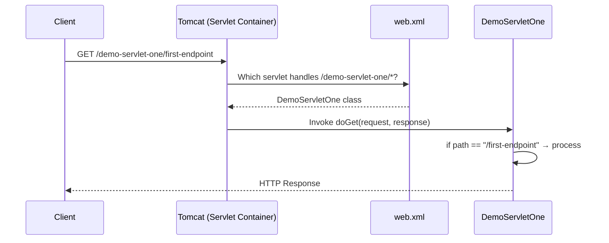
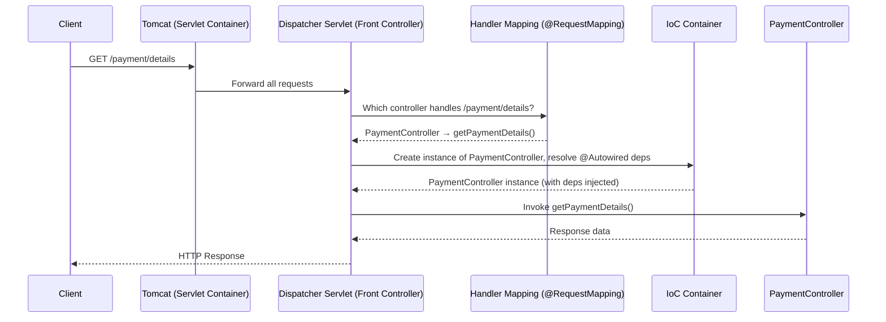
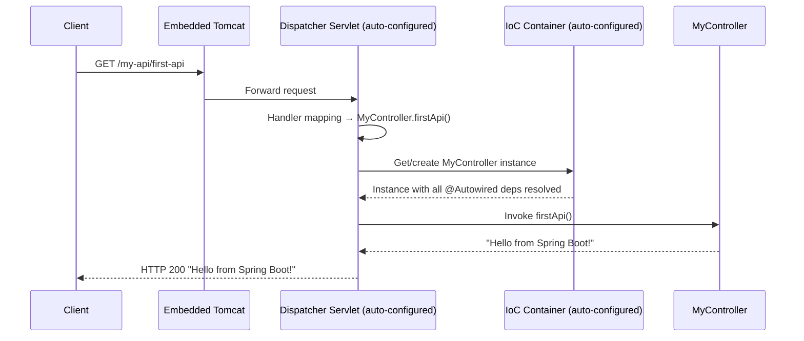
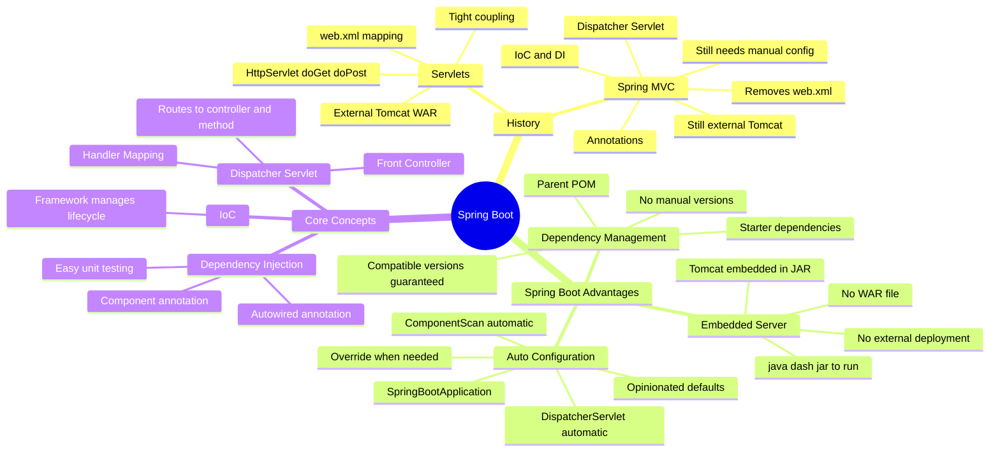

# Introduction to Spring Boot

> **Topics Covered:** Servlets & Servlet Containers · `web.xml` · Spring Framework & Spring MVC · Inversion of Control (IoC) & Dependency Injection · Dispatcher Servlet · Spring Boot's Three Core Advantages · Embedded Server · Auto Configuration · Dependency Management · Convention over Configuration

---

## Overview

To understand **why Spring Boot exists**, you must first understand the problems that existed before it. The evolution goes through three distinct stages:

```
Servlets  →  Spring MVC (Spring Framework)  →  Spring Boot
```

Each stage solved the problems of the previous one. Spring Boot is not a replacement for Spring MVC — it is built **on top of** it, adding automation and simplification while keeping all existing Spring MVC features intact.

---

# 📌 Stage 1 — Servlets and Servlet Containers

## What Is a Servlet?

> **Servlet:** A Java class that handles an HTTP client request, processes it, and sends back an HTTP response.

Think of a Servlet as your earliest form of a controller — it receives an incoming API call, does some work, and returns a result.

### Servlet Syntax

```java
@WebServlet("/demo-servlet-one")
public class DemoServletOne extends HttpServlet {

    @Override
    protected void doGet(HttpServletRequest request, HttpServletResponse response)
            throws ServletException, IOException {

        String path = request.getRequestURI();

        if (path.contains("/first-endpoint")) {
            // process request for /first-endpoint
            response.getWriter().write("Response from first endpoint");

        } else if (path.contains("/second-endpoint")) {
            // process request for /second-endpoint
            response.getWriter().write("Response from second endpoint");
        }
    }

    @Override
    protected void doPost(HttpServletRequest request, HttpServletResponse response)
            throws ServletException, IOException {
        // handle POST requests
    }

    @Override
    protected void doPut(HttpServletRequest request, HttpServletResponse response)
            throws ServletException, IOException {
        // handle PUT requests
    }
}
```

```java
@WebServlet("/demo-servlet-two")
public class DemoServletTwo extends HttpServlet {

    @Override
    protected void doGet(HttpServletRequest request, HttpServletResponse response)
            throws ServletException, IOException {
        // handle GET for servlet two
    }
}
```

### Servlet Breakdown

| Element | Explanation |
|---|---|
| `extends HttpServlet` | Every servlet must extend this base class |
| `@WebServlet("/path")` | Annotation to map a URL path to this servlet |
| `doGet()` | Handles HTTP GET requests |
| `doPost()` | Handles HTTP POST requests |
| `doPut()` | Handles HTTP PUT requests |
| `doDelete()` | Handles HTTP DELETE requests |
| `HttpServletRequest` | Carries all incoming request data (path, parameters, body, headers) |
| `HttpServletResponse` | Used to write the response back to the client |

> [!IMPORTANT]
> Each servlet class can have only **one** `doGet()`, **one** `doPost()`, **one** `doPut()`, and **one** `doDelete()` method. This means all path-based routing within a servlet must be done manually with `if-else if` chains — a major limitation.

---

## What Is a Servlet Container?

> **Servlet Container:** A runtime environment (like **Apache Tomcat**) that manages the lifecycle of servlets — creating, invoking, and destroying them as needed.

The servlet container is responsible for:
- Receiving incoming HTTP requests.
- Consulting `web.xml` to determine which servlet handles the request.
- Invoking the appropriate servlet method.
- Returning the servlet's response to the client.

**Tomcat** is the most well-known servlet container. It is also commonly called an **application server**.

---

## The `web.xml` — Servlet Mapping Configuration

In the servlet era, all URL-to-servlet mappings were defined in a file called `web.xml`. This file lived in the `WEB-INF` directory of the application.

### Example `web.xml`

```xml
<web-app>

    <!-- Declare Servlet One -->
    <servlet>
        <servlet-name>DemoServletOne</servlet-name>
        <servlet-class>com.example.DemoServletOne</servlet-class>
    </servlet>

    <!-- Map URL patterns to Servlet One -->
    <servlet-mapping>
        <servlet-name>DemoServletOne</servlet-name>
        <url-pattern>/demo-servlet-one/*</url-pattern>
    </servlet-mapping>

    <!-- Declare Servlet Two -->
    <servlet>
        <servlet-name>DemoServletTwo</servlet-name>
        <servlet-class>com.example.DemoServletTwo</servlet-class>
    </servlet>

    <!-- Map URL patterns to Servlet Two -->
    <servlet-mapping>
        <servlet-name>DemoServletTwo</servlet-name>
        <url-pattern>/demo-servlet-two/*</url-pattern>
    </servlet-mapping>

</web-app>
```

### How a Request Was Routed (Servlet Era)



### The Deployment Process (Servlet Era)

```
Developer writes code
       ↓
Packages application into a WAR file
       ↓
Manually deploys WAR to Tomcat
       ↓
Tomcat reads web.xml and serves requests
```

---

## Problems With Servlets

### 1. `web.xml` Becomes Unmanageable

In a production application with hundreds of servlets, the `web.xml` becomes enormous — containing servlet declarations, mappings, filter chains, security configurations, and more. It becomes extremely difficult to read and maintain.

### 2. Tight Coupling — No Dependency Injection

In servlets, objects are created manually with `new`. This leads to **tight coupling** between classes, making unit testing extremely difficult.

```java
// Tight coupling — cannot mock UserService in unit tests
public class PaymentServlet extends HttpServlet {
    private UserService userService = new UserService(); // hard-coded dependency

    protected void doGet(HttpServletRequest req, HttpServletResponse res) {
        // If you want to unit test this, you CANNOT mock userService
        // because it's hard-coded with 'new'
        String details = userService.getUserDetail(req.getParameter("id"));
    }
}
```

If you want to unit test `doGet()` in isolation, you cannot replace `userService` with a mock because it is instantiated directly inside the class. You always get the real `UserService`, which may call a real database.

### 3. Rigid Request Routing

Each servlet can only have one of each HTTP method handler (`doGet`, `doPost`, etc.). If ten different GET endpoints need to be served by related logic, they must all squeeze into one `doGet()` method with sprawling `if-else if` chains — hard to read and maintain.

### 4. Manual WAR Deployment

Every time you want to run or update the application, you must build a WAR file and manually deploy it to an external Tomcat server. This slows down development.

---

# 📌 Stage 2 — Spring Framework (Spring MVC)

## What Spring MVC Solved

Spring Framework — specifically the **Spring MVC** module — was introduced to address all of the servlet problems above. It is built **on top of** servlets internally, but provides a much cleaner programming model.

> [!NOTE]
> Spring Framework is a family of modules (Spring MVC, Spring Data, Spring Security, Spring Batch, etc.). Spring Boot is also part of this family. When people say "Spring MVC", they mean the web layer module of the Spring Framework.

---

## Advantage 1 — Removal of `web.xml` (Annotation-Based Configuration)

Spring MVC replaces `web.xml` mappings with Java **annotations** directly on controller classes and methods.

```java
@Controller
@RequestMapping("/payment")
public class PaymentController {

    @GetMapping("/details")
    public String getPaymentDetails() {
        return "payment details";
    }

    @PostMapping("/process")
    public String processPayment() {
        return "payment processed";
    }

    @GetMapping("/history")
    public String getHistory() {
        return "payment history";
    }
}
```

Instead of one `doGet()` with `if-else if` blocks, you now have **one method per endpoint**, each cleanly annotated. Ten GET endpoints = ten `@GetMapping` methods. No `web.xml` required.

---

## Advantage 2 — Inversion of Control (IoC) and Dependency Injection (DI)

### What Is Inversion of Control?

> **Inversion of Control (IoC):** A design principle in which the control of object creation and lifecycle management is transferred from the developer's code to a framework (in this case, the Spring container).

> **Dependency Injection (DI):** The primary implementation mechanism of IoC. Instead of a class creating its own dependencies using `new`, the framework creates and injects those dependencies automatically.

> [!NOTE]
> IoC and Dependency Injection are often used interchangeably. Technically, DI is one way to implement IoC. Both terms refer to the same practical concept in Spring.

### The Problem — Tight Coupling (Without DI)

```java
// Without Dependency Injection
public class PaymentService {
    // Hard-coded dependency — tight coupling
    private UserService userService = new UserService();

    public String getSenderDetails(String id) {
        return userService.getUserDetail(id);
    }
}
```

**Why this is a problem:**
- To unit test `getSenderDetails()`, you want to test **only** that method's logic.
- You want to **mock** `UserService` — tell it "whenever `getUserDetail()` is called, return this fake value."
- But because `UserService` is created with `new` inside the class, Spring (or any test framework) cannot replace it with a mock. You always get the real `UserService`.
- Result: unit testing is nearly impossible without calling real dependencies (databases, services, etc.).

### The Solution — Dependency Injection With Spring

```java
// With Dependency Injection
@Component
public class UserService {
    public String getUserDetail(String id) {
        return "User: " + id;
    }
}

@Component
public class PaymentService {

    @Autowired
    private UserService userService; // Spring injects this — not 'new'

    public String getSenderDetails(String id) {
        return userService.getUserDetail(id);
    }
}
```

### How It Works

| Annotation | Purpose |
|---|---|
| `@Component` | Marks a class as a Spring-managed bean. Spring will create and manage its lifecycle. |
| `@Autowired` | Tells Spring to inject the required dependency automatically when the class is instantiated. |

With `@Autowired`, Spring manages the `UserService` object. In a unit test, you can provide a **mock** `UserService` to Spring, and Spring will inject that mock instead of the real one. Your test is now fully isolated.

```java
// In a unit test (using Mockito)
@Mock
UserService mockUserService;

@InjectMocks
PaymentService paymentService;

// Tell the mock: when getUserDetail("123") is called, return "Fake User"
when(mockUserService.getUserDetail("123")).thenReturn("Fake User");

// Now test PaymentService in isolation
String result = paymentService.getSenderDetails("123");
assertEquals("Fake User", result);
```

---

## Advantage 3 — Organized REST API Handling (Dispatcher Servlet)

Spring MVC introduces the **Dispatcher Servlet** — a single, centralized servlet that receives **all** incoming requests and routes them to the correct controller and method.

> **Dispatcher Servlet:** Also known as the **Front Controller**. It is the single entry point for all HTTP requests in a Spring MVC application. It uses handler mappings (the annotations on controllers) to determine which controller class and which method to invoke.

### How a Request Is Routed in Spring MVC



### Step-by-Step Execution

1. Client sends `GET /payment/details`.
2. Tomcat receives it and passes it to the **Dispatcher Servlet**.
3. Dispatcher Servlet consults **Handler Mapping** — looks at all `@RequestMapping`, `@GetMapping`, etc. annotations to find which controller and method matches `/payment/details`.
4. Dispatcher Servlet asks the **IoC container** to create an instance of `PaymentController` and resolve all its `@Autowired` dependencies.
5. Dispatcher Servlet invokes `getPaymentDetails()` on the created instance.
6. The method processes the request and returns a response.
7. Response travels back through Dispatcher Servlet → Tomcat → Client.

---

## Advantage 4 — Rich Ecosystem Integrations

Spring Framework provides ready-made integrations with almost every major Java technology:

| Category | Integration Options |
|---|---|
| Unit Testing | JUnit, Mockito |
| Database ORM | Hibernate, JPA |
| Database JDBC | Spring JDBC |
| Caching | EhCache, Redis |
| Messaging | RabbitMQ, Kafka |
| Security | Spring Security |
| Async Programming | Spring Async, `@Async` |

---

## A Spring MVC Application — Required Boilerplate

Even with all the improvements over servlets, a minimal Spring MVC application still required **four components**:

### 1. Controller Class

```java
@Controller
@RequestMapping("/my-api")
public class MyController {

    @GetMapping("/first-api")
    public @ResponseBody String firstApi() {
        return "Hello from Spring MVC";
    }
}
```

### 2. `pom.xml` — With Explicit Versions

```xml
<dependencies>

    <!-- Spring MVC -->
    <dependency>
        <groupId>org.springframework</groupId>
        <artifactId>spring-webmvc</artifactId>
        <version>5.3.20</version>   <!-- Must specify version manually -->
    </dependency>

    <!-- Servlet API -->
    <dependency>
        <groupId>javax.servlet</groupId>
        <artifactId>javax.servlet-api</artifactId>
        <version>4.0.1</version>    <!-- Must specify version manually -->
    </dependency>

    <!-- JUnit for testing -->
    <dependency>
        <groupId>junit</groupId>
        <artifactId>junit</artifactId>
        <version>4.13.2</version>   <!-- Must specify version manually -->
    </dependency>

</dependencies>
```

### 3. Application Configuration Class

```java
@Configuration
@EnableWebMvc
@ComponentScan(basePackages = "com.example")
public class AppConfig {
    // Loads Spring MVC configuration
    // Defines component scanning scope
}
```

### 4. Dispatcher Servlet Registration Class

```java
public class MyDispatcherServlet extends AbstractAnnotationConfigDispatcherServletInitializer {

    @Override
    protected Class<?>[] getRootConfigClasses() {
        return null;
    }

    @Override
    protected Class<?>[] getServletConfigClasses() {
        return new Class[]{AppConfig.class}; // link to config class
    }

    @Override
    protected String[] getServletMappings() {
        return new String[]{"/"}; // handle all requests
    }
}
```

> [!WARNING]
> Even a "Hello World" Spring MVC app requires all four of the above. This is the boilerplate problem that Spring Boot solves.

---

## Problems That Remain With Spring MVC

| Problem | Detail |
|---|---|
| **Dependency Management** | Every dependency must be added manually with an exact version. Versions across multiple dependencies must be manually kept compatible with each other. |
| **Manual Configuration** | `AppConfig` class with `@EnableWebMvc`, `@ComponentScan`, and the `DispatcherServlet` registration class must all be written by hand for every project. |
| **External Deployment** | Application must still be packaged as a WAR and deployed to an external Tomcat server. |

---

# 📌 Stage 3 — Spring Boot

## What Spring Boot Solves

> **Spring Boot** provides a quick way to create production-ready Spring applications. It is built on top of Spring MVC and inherits all of its features, while adding automation to eliminate boilerplate.

Spring Boot's philosophy is called **Convention over Configuration** (also called **opinionated defaults**):
- Spring Boot makes sensible default choices for you.
- If you agree with the defaults, you write zero configuration.
- If you disagree, you can override any default with your own configuration.

Spring Boot solves the three remaining Spring MVC problems with three specific advantages.

---

## Spring Boot Advantage 1 — Dependency Management

### The Spring MVC Problem

In Spring MVC, you must:
1. Manually add every dependency you need.
2. Manually specify the version for each dependency.
3. Manually ensure all versions are **compatible with each other**.

If you upgrade JUnit from `4.13.2` to `5.1.0`, will it still work with your current Spring version? You have to research and verify this yourself.

### The Spring Boot Solution — Starters and Parent POM

Spring Boot introduces **starter dependencies** — curated bundles that pull in all required transitive dependencies for a feature, with pre-verified compatible versions.

```xml
<!-- Spring Boot pom.xml -->
<parent>
    <groupId>org.springframework.boot</groupId>
    <artifactId>spring-boot-starter-parent</artifactId>
    <version>3.1.0</version>  <!-- Only ONE version to define -->
</parent>

<dependencies>

    <!-- Everything needed for a web app — one line -->
    <dependency>
        <groupId>org.springframework.boot</groupId>
        <artifactId>spring-boot-starter-web</artifactId>
        <!-- No version needed! Parent manages it -->
    </dependency>

    <!-- Everything needed for testing — one line -->
    <dependency>
        <groupId>org.springframework.boot</groupId>
        <artifactId>spring-boot-starter-test</artifactId>
        <!-- No version needed! -->
    </dependency>

</dependencies>
```

**Compare:**

| | Spring MVC | Spring Boot |
|---|---|---|
| Dependencies to add | Each individually (15–20 for a web app) | 1–2 starters |
| Versions to specify | Every single one | Only the Spring Boot parent version |
| Compatibility check | Manual | Automatic (guaranteed by Spring Boot team) |

> [!TIP]
> `spring-boot-starter-web` internally pulls in Spring MVC, embedded Tomcat, Jackson (for JSON), validation libraries, logging, and more — all with compatible versions. You write one line; Spring Boot handles everything else.

---

## Spring Boot Advantage 2 — Auto Configuration

### The Spring MVC Problem

Every Spring MVC project requires manually writing:
- `AppConfig.java` with `@Configuration`, `@EnableWebMvc`, `@ComponentScan`
- `DispatcherServletInitializer.java` to register the dispatcher servlet
- Explicit component scan base package

### The Spring Boot Solution — `@SpringBootApplication`

Spring Boot replaces all of that with a **single annotation** on the main application class.

```java
@SpringBootApplication  // This one annotation does it all
public class MyApplication {

    public static void main(String[] args) {
        SpringApplication.run(MyApplication.class, args);
    }
}
```

`@SpringBootApplication` is a composed annotation that internally contains:

```
@SpringBootApplication
├── @EnableAutoConfiguration   → triggers auto-configuration mechanism
├── @ComponentScan             → scans current package and sub-packages
└── @SpringBootConfiguration   → marks this as a configuration class (includes @EnableWebMvc)
```

| What Spring MVC Needs | What Spring Boot Does Instead |
|---|---|
| Explicit `@EnableWebMvc` | Auto-configured internally |
| Explicit `@ComponentScan(basePackages = "...")` | Auto-scans from the package of your main class downward |
| Manual `DispatcherServlet` registration class | Registered automatically |
| Manual `AppConfig` class | Not needed |

### Opinionated Default — Component Scan

Spring Boot's opinion: *"Start scanning from the package where your `main` method lives, and scan all sub-packages."*

If you agree with this (which works for most projects), you write nothing. If you need a different base package, you can override it:

```java
@SpringBootApplication
@ComponentScan(basePackages = "com.different.package")  // override the default
public class MyApplication {
    public static void main(String[] args) {
        SpringApplication.run(MyApplication.class, args);
    }
}
```

---

## Spring Boot Advantage 3 — Embedded Server

### The Problem With Servlet and Spring MVC

In both the Servlet era and Spring MVC, the deployment process was:

```
Write code
    ↓
Package into WAR file
    ↓
Install and configure external Tomcat
    ↓
Deploy WAR to Tomcat
    ↓
Start Tomcat
    ↓
Application is running
```

This is slow for development, requires Tomcat to be separately installed and managed, and introduces environment inconsistency (the Tomcat version on your laptop vs the server might differ).

### The Spring Boot Solution — Embedded Tomcat

Spring Boot **embeds Tomcat directly inside the application JAR**. You do not need to install or configure any external server. You simply run the application like any other Java program.

```
Write code
    ↓
Run main() method (or java -jar myapp.jar)
    ↓
Application is running (Tomcat starts automatically inside the process)
```

### What the Console Looks Like

```
  .   ____          _            __ _ _
 /\\ / ___'_ __ _ _(_)_ __  __ _ \ \ \ \
( ( )\___ | '_ | '_| | '_ \/ _` | \ \ \ \
 \\/  ___)| |_)| | | | | || (_| |  ) ) ) )
  '  |____| .__|_| |_|_| |_\__, | / / / /
 =========|_|==============|___/=/_/_/_/
 :: Spring Boot ::                (v3.1.0)

...
Tomcat started on port(s): 8080 (http)  ← Embedded Tomcat starts automatically
Started MyApplication in 2.345 seconds
```

Tomcat is started automatically as part of your application. You can immediately hit `http://localhost:8080/my-api/first-api` in a browser.

> [!IMPORTANT]
> Spring Boot packages the application as a **JAR** (not a WAR), which includes the embedded Tomcat. The result is a **self-contained, executable application** — no external server required.

---

## A Complete Spring Boot Application — Minimal Code

### `pom.xml`

```xml
<parent>
    <groupId>org.springframework.boot</groupId>
    <artifactId>spring-boot-starter-parent</artifactId>
    <version>3.1.0</version>
</parent>

<dependencies>
    <dependency>
        <groupId>org.springframework.boot</groupId>
        <artifactId>spring-boot-starter-web</artifactId>
    </dependency>
</dependencies>
```

### Main Application Class

```java
@SpringBootApplication
public class MyApplication {
    public static void main(String[] args) {
        SpringApplication.run(MyApplication.class, args);
    }
}
```

### Controller Class

```java
@RestController
@RequestMapping("/my-api")
public class MyController {

    @GetMapping("/first-api")
    public String firstApi() {
        return "Hello from Spring Boot!";
    }
}
```

### Output in Browser

Hit `http://localhost:8080/my-api/first-api`:

```
Hello from Spring Boot!
```

**Three files. No `web.xml`. No `AppConfig`. No `DispatcherServletInitializer`. No WAR. No external Tomcat.**

Compare this to the four required files in Spring MVC and the `web.xml` mapping in the Servlet era.

---

## How Spring Boot Still Uses Dispatcher Servlet Internally

Spring Boot does **not** remove the Dispatcher Servlet — it just configures it automatically so you never have to write the setup code yourself.



Everything that happened in Spring MVC still happens — it is just automated and hidden inside the `@SpringBootApplication` annotation and the `spring-boot-starter-web` dependency.

---

## Full Evolution Diagram

```mermaid
flowchart TD
    subgraph Servlet Era
        S1["Servlet Classes\n(doGet, doPost, ...)"]
        S2["web.xml\n(URL-to-Servlet mapping)"]
        S3["External Tomcat\n(WAR deployment)"]
    end

    subgraph Spring MVC
        M1["@Controller classes\n(@GetMapping, @PostMapping, ...)"]
        M2["Annotations\n(no web.xml)"]
        M3["IoC & @Autowired\n(Dependency Injection)"]
        M4["Dispatcher Servlet\n(Front Controller)"]
        M5["AppConfig + DispatcherInitializer\n(manual configuration)"]
        M6["External Tomcat\n(WAR deployment)"]
        M7["Manual pom.xml versions"]
    end

    subgraph Spring Boot
        B1["@RestController\n(same as Spring MVC)"]
        B2["@SpringBootApplication\n(replaces AppConfig + DispatcherInitializer)"]
        B3["IoC & @Autowired\n(same — auto-configured)"]
        B4["Starter Dependencies\n(no version management)"]
        B5["Embedded Tomcat\n(no WAR, no deployment)"]
    end

    Servlet Era -->|"Spring MVC solves\nweb.xml + tight coupling"| Spring MVC
    Spring MVC -->|"Spring Boot solves\nconfiguration + deployment + deps"| Spring Boot
```

---

## Comparison Table — All Three Stages

| Feature | Servlet | Spring MVC | Spring Boot |
|---|---|---|---|
| URL Mapping | `web.xml` | Annotations (`@GetMapping`) | Annotations (same) |
| Dependency Injection | None (manual `new`) | `@Autowired`, `@Component` | Same (auto-configured) |
| Configuration | `web.xml` (XML) | Java config classes | Auto-configured via `@SpringBootApplication` |
| Dispatcher Servlet | None (manual routing) | Manual setup required | Auto-configured |
| Dependency Management | Manual | Manual with versions | Starters, no versions needed |
| Server | External Tomcat (WAR) | External Tomcat (WAR) | Embedded Tomcat (JAR) |
| Unit Testability | Hard | Easy (Mockito, JUnit) | Easy (same) |
| Boilerplate Code | High | Medium | Minimal |
| Production Readiness | Manual | Manual | Built-in metrics, health checks |

---

## Key Definitions Recap

| Term | Definition |
|---|---|
| **Servlet** | A Java class that handles HTTP requests and responses |
| **Servlet Container** | Runtime (e.g., Tomcat) that manages servlet lifecycle |
| **`web.xml`** | XML file mapping URLs to servlet classes (pre-Spring) |
| **IoC (Inversion of Control)** | Framework manages object creation and lifecycle instead of the developer |
| **Dependency Injection** | Spring injects object dependencies automatically via `@Autowired` |
| **`@Component`** | Marks a class for Spring to manage as a bean |
| **`@Autowired`** | Tells Spring to inject the required dependency |
| **Dispatcher Servlet** | Spring's front controller — routes all requests to the correct controller/method |
| **Handler Mapping** | The mechanism (via `@RequestMapping`, `@GetMapping`, etc.) that tells Dispatcher Servlet which controller and method to call |
| **`@SpringBootApplication`** | Composed annotation combining `@EnableAutoConfiguration`, `@ComponentScan`, `@SpringBootConfiguration` |
| **Auto Configuration** | Spring Boot's ability to configure itself based on the dependencies present |
| **Convention over Configuration** | Spring Boot uses sensible defaults; override only what you need |
| **Starter Dependency** | A curated dependency bundle (e.g., `spring-boot-starter-web`) that pulls in all required libraries with compatible versions |
| **Embedded Server** | Tomcat is bundled inside the Spring Boot JAR — no separate server installation needed |

---

## Key Observations

- Spring Boot **does not replace** Spring MVC — it wraps and automates it. All Spring MVC features (Dispatcher Servlet, IoC, `@Autowired`, controller annotations) still work exactly the same.
- The three Spring Boot advantages are: **Dependency Management**, **Auto Configuration**, and **Embedded Server**.
- `@SpringBootApplication` internally contains three annotations and replaces several Spring MVC configuration classes.
- Spring Boot scans for components starting from the **package of the main class** — this is the default "opinionated" behavior.
- Spring Boot packages as a **JAR** (not WAR) that can be run with `java -jar myapp.jar`.
- You can still override any Spring Boot default — it is not forced on you.

---

## Common Mistakes

### Mistake 1 — Thinking Spring Boot Is a Different Framework

```
❌ "Spring Boot is separate from Spring MVC"
✅ Spring Boot IS Spring MVC, with automated setup on top.
   Dispatcher Servlet, IoC, @Autowired all still work exactly the same.
```

### Mistake 2 — Placing Main Class in Wrong Package

```java
// ❌ Main class in 'com.example' but controllers in 'com.different'
// @ComponentScan will NOT find the controllers — they are in a different package tree!
package com.example;

@SpringBootApplication
public class MyApplication { ... }
// Controllers in 'com.different' are NOT scanned
```

```java
// ✅ Keep main class in the root package; all controllers in sub-packages
package com.example;

@SpringBootApplication
public class MyApplication { ... }
// com.example.controller.PaymentController → ✅ scanned
// com.example.service.UserService → ✅ scanned
```

### Mistake 3 — Adding Versions to Starter Dependencies

```xml
<!-- ❌ Don't specify versions for starters — the parent manages them -->
<dependency>
    <groupId>org.springframework.boot</groupId>
    <artifactId>spring-boot-starter-web</artifactId>
    <version>3.0.1</version>  <!-- May cause version conflicts! -->
</dependency>

<!-- ✅ Let Spring Boot manage the version -->
<dependency>
    <groupId>org.springframework.boot</groupId>
    <artifactId>spring-boot-starter-web</artifactId>
</dependency>
```

---

## Best Practices

1. **Always use Spring Boot for new projects** — it is the standard way to build Spring applications today.
2. **Keep the main application class in the root package** of your project so component scanning works automatically.
3. **Use starters** (`spring-boot-starter-web`, `spring-boot-starter-data-jpa`, etc.) rather than adding individual dependencies manually.
4. **Use `application.properties` or `application.yml`** to override Spring Boot's default configuration values when needed.
5. **Avoid creating WAR files** unless deploying to a legacy external server is required. Prefer the self-contained JAR approach.
6. **Leverage Spring Boot's embedded Tomcat** for local development — it ensures environment consistency between development and production.

---

## Interview Notes

> **Commonly Asked Interview Questions:**

- *What is Spring Boot and why was it introduced?* — A framework built on top of Spring MVC that eliminates boilerplate configuration. Introduced to solve three Spring MVC problems: manual dependency management, manual configuration, and external server deployment.
- *What are the three main advantages of Spring Boot over Spring MVC?* — Dependency Management (starters + no manual versions), Auto Configuration (`@SpringBootApplication`), and Embedded Server (no WAR, no external Tomcat).
- *What is `@SpringBootApplication`?* — A composed annotation that includes `@EnableAutoConfiguration`, `@ComponentScan`, and `@SpringBootConfiguration`. It replaces the need for `AppConfig` and `DispatcherServletInitializer` in Spring MVC.
- *What is a Dispatcher Servlet?* — The front controller in Spring MVC (and Spring Boot) that receives all requests and routes them to the correct controller and method using handler mappings.
- *What is the difference between IoC and Dependency Injection?* — IoC is the principle (framework manages object lifecycle). DI is the implementation (framework injects dependencies). In Spring, `@Autowired` is the DI mechanism that implements IoC.
- *What is Convention over Configuration?* — Spring Boot's approach of providing sensible defaults (e.g., scanning from the main class package, auto-configuring Tomcat) so developers don't need to write configuration code. Defaults can be overridden when needed.
- *What is the difference between a WAR and a JAR in Spring Boot?* — Traditional Spring MVC packaged as a WAR for external Tomcat. Spring Boot packages as a self-contained JAR with embedded Tomcat — runnable directly with `java -jar`.
- *What is a Spring Boot Starter?* — A pre-packaged dependency bundle (like `spring-boot-starter-web`) that pulls in all required libraries with compatible, pre-verified versions.
- *Why is tight coupling a problem, and how does Spring solve it?* — Tight coupling (using `new` to create dependencies) prevents mocking in unit tests. Spring's `@Autowired` lets the framework inject dependencies, which can be replaced with mocks in tests.
- *Does Spring Boot replace the Dispatcher Servlet?* — No. Dispatcher Servlet is still used internally. Spring Boot just configures it automatically — you never have to write the setup code.

---

## Mind Map



---

## Summary

| Stage | Key Innovation | Remaining Problem |
|---|---|---|
| **Servlet** | Java-based HTTP handling | `web.xml`, tight coupling, rigid routing, external server |
| **Spring MVC** | Annotations, IoC/DI, Dispatcher Servlet | Manual config classes, manual dependency versions, external server |
| **Spring Boot** | Starters, Auto Config, Embedded Server | None of the above — production-ready out of the box |

> [!IMPORTANT]
> **The three Spring Boot advantages to always remember:**
> 1. **Dependency Management** — Starters handle all dependencies and compatible versions.
> 2. **Auto Configuration** — `@SpringBootApplication` replaces all manual configuration classes.
> 3. **Embedded Server** — Tomcat is embedded; run as a JAR, no WAR deployment needed.

---

*End of Chapter — Introduction to Spring Boot*
