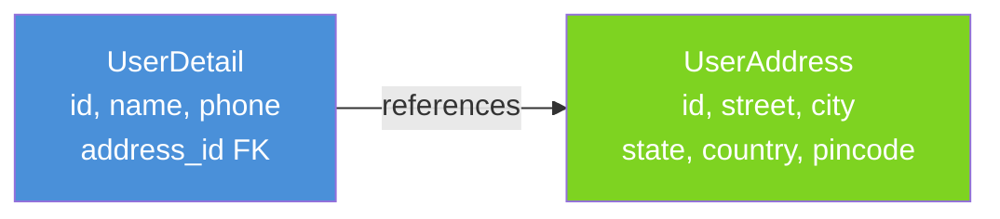
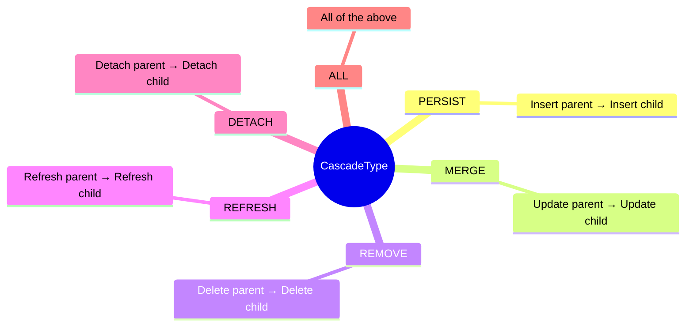
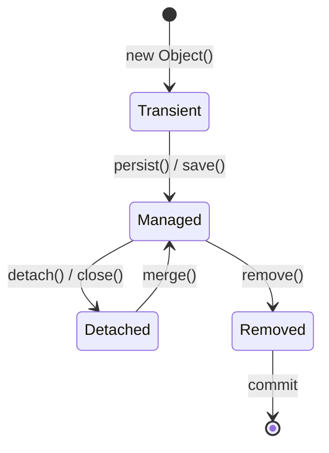
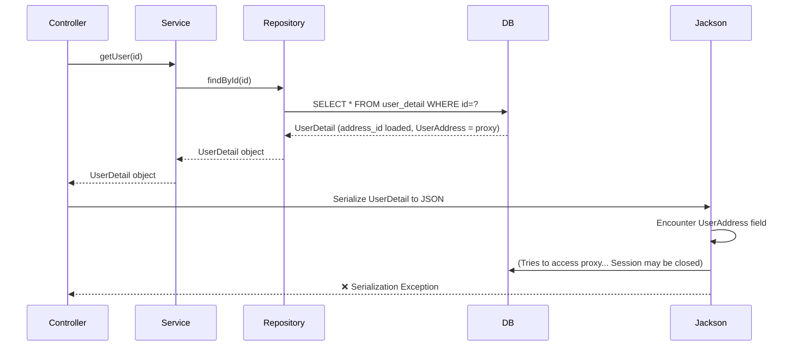
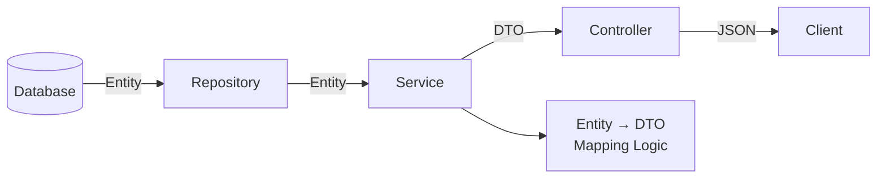
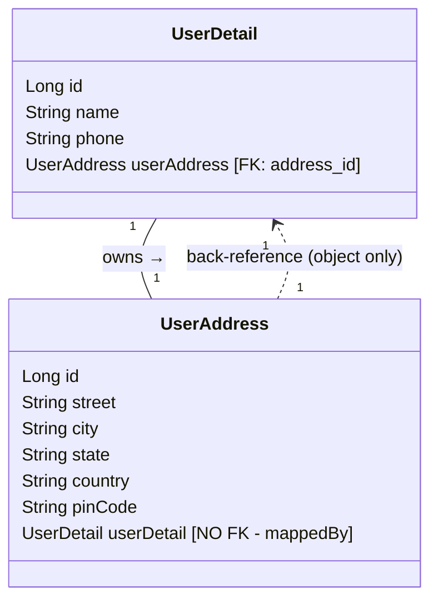
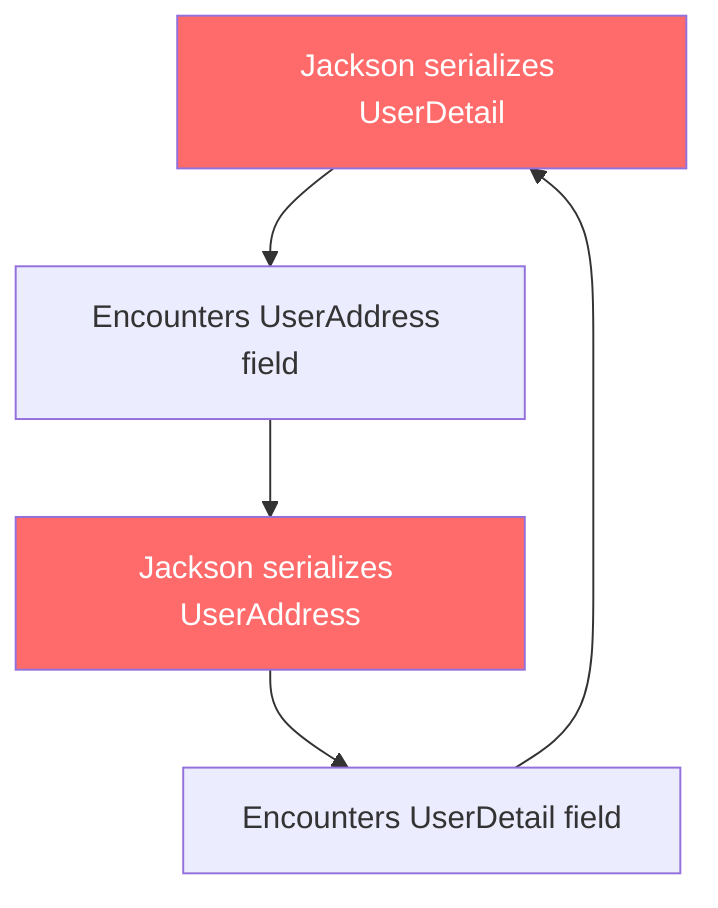
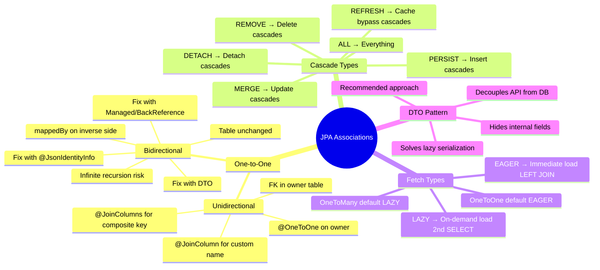

# 📌 Spring Boot JPA — Association Types & Mappings

> **Course:** Concept and Coding — Spring Boot Series
> **Topic:** Entity Associations: One-to-One (Unidirectional & Bidirectional), Cascade Types, Fetch Strategies

---

## Table of Contents

1. [Introduction to Entity Associations](#1-introduction-to-entity-associations)
2. [One-to-One Unidirectional Mapping](#2-one-to-one-unidirectional-mapping)
3. [Foreign Key Naming — Default vs Custom](#3-foreign-key-naming--default-vs-custom)
4. [Composite Keys in Associations](#4-composite-keys-in-associations)
5. [Cascade Types](#5-cascade-types)
6. [Eager Loading vs Lazy Loading](#6-eager-loading-vs-lazy-loading)
7. [Lazy Loading Serialization Problem & Solutions](#7-lazy-loading-serialization-problem--solutions)
8. [Data Transfer Objects (DTOs)](#8-data-transfer-objects-dtos)
9. [One-to-One Bidirectional Mapping](#9-one-to-one-bidirectional-mapping)
10. [Infinite Recursion Problem & Solutions](#10-infinite-recursion-problem--solutions)
11. [Summary & Key Takeaways](#11-summary--key-takeaways)
12. [Interview Notes](#12-interview-notes)
13. [Practice Questions](#13-practice-questions)

---

## 1. Introduction to Entity Associations

### Overview

In relational databases, tables are rarely isolated — they relate to each other. JPA (Java Persistence API) provides **association mapping** annotations to model these relationships directly in Java entity classes, so that navigating between related objects in code mirrors navigating between related rows in the database.

### Types of Associations

| Association Type | Description | Example |
|---|---|---|
| **One-to-One** | One row in Table A maps to exactly one row in Table B | One User → One Address |
| **One-to-Many** | One row in Table A maps to many rows in Table B | One Department → Many Employees |
| **Many-to-One** | Many rows in Table A map to one row in Table B | Many Employees → One Department |
| **Many-to-Many** | Many rows in Table A map to many rows in Table B | Many Students → Many Courses |

Each type can be further classified as:

- **Unidirectional** — navigation works in only one direction (parent → child)
- **Bidirectional** — navigation works in both directions (parent → child AND child → parent)

---

## 2. One-to-One Unidirectional Mapping

### Overview

In a **one-to-one unidirectional** mapping, one entity holds a reference to exactly one instance of another entity, but the reference only exists in **one direction** — from the parent to the child. The child entity has no knowledge of the parent.

### Real-world Analogy

Think of a **Passport and a Person**. A passport belongs to exactly one person. You can look at a passport and find the person's details, but the person's record itself does not directly contain a back-reference to the passport.

### Conceptual Diagram



The arrow is **one-way only**: `UserDetail → UserAddress`. You can get address from a user, but you **cannot** get a user from an address in a unidirectional setup.

---

### Entity Classes

#### `UserAddress` Entity (Child)

```java
@Entity
@Table(name = "user_address")
public class UserAddress {

    @Id
    @GeneratedValue(strategy = GenerationType.IDENTITY)
    private Long id;

    private String street;
    private String city;
    private String state;
    private String country;
    private String pinCode;

    // Getters and Setters
}
```

**Line-by-line explanation:**

| Line | Meaning |
|---|---|
| `@Entity` | Marks this class as a JPA-managed entity (maps to a DB table) |
| `@Table(name = "user_address")` | Specifies the DB table name explicitly |
| `@Id` | Marks `id` as the primary key |
| `@GeneratedValue(strategy = GenerationType.IDENTITY)` | Auto-increments the ID using the DB identity column |
| Other fields | Map directly to columns in the `user_address` table |

---

#### `UserDetail` Entity (Parent — Owns the Foreign Key)

```java
@Entity
@Table(name = "user_detail")
public class UserDetail {

    @Id
    @GeneratedValue(strategy = GenerationType.IDENTITY)
    private Long id;

    private String name;
    private String phone;

    @OneToOne(cascade = CascadeType.ALL)
    private UserAddress userAddress;

    // Getters and Setters
}
```

**Line-by-line explanation:**

| Line | Meaning |
|---|---|
| `@Entity` | Marks this as a JPA entity |
| `@Table(name = "user_detail")` | Maps to the `user_detail` table |
| `@OneToOne` | Declares a one-to-one relationship with `UserAddress` |
| `cascade = CascadeType.ALL` | Any operation on `UserDetail` also cascades to `UserAddress` |
| `private UserAddress userAddress` | Holds a Java object reference to the child entity |

---

### How Hibernate Creates the Foreign Key

When you use `@OneToOne` **without** specifying a `@JoinColumn`, Hibernate automatically creates a foreign key column in the **owning entity's table** (the one that contains the `@OneToOne` annotation).

**Default naming convention:**

```
field_name + "_" + "id"
```

So `userAddress` → `user_address_id`

**Resulting `user_detail` table:**

| id | name | phone | user_address_id (FK) |
|---|---|---|---|
| 1 | Alice | 9876543210 | 1 |

The `user_address_id` column is a **foreign key** pointing to the `id` column of the `user_address` table.

> [!NOTE]
> The `user_address` table has **no foreign key back** to `user_detail`. This is what makes it **unidirectional**.

---

## 3. Foreign Key Naming — Default vs Custom

### Default Behavior

As noted above, Hibernate names the FK column as `fieldName_id`. This is often acceptable, but sometimes you need full control.

### Custom Foreign Key Name with `@JoinColumn`

Use `@JoinColumn` to:
1. Specify the **name** of the foreign key column in the current table
2. Specify which **column** in the referenced table the FK points to (`referencedColumnName`)

```java
@Entity
@Table(name = "user_detail")
public class UserDetail {

    @Id
    @GeneratedValue(strategy = GenerationType.IDENTITY)
    private Long id;

    private String name;
    private String phone;

    @OneToOne(cascade = CascadeType.ALL)
    @JoinColumn(name = "address_id", referencedColumnName = "id")
    private UserAddress userAddress;

    // Getters and Setters
}
```

**Effect on the table:**

| id | name | phone | address_id (FK) |
|---|---|---|---|
| 1 | Alice | 9876543210 | 1 |

Now the FK column is `address_id` instead of `user_address_id`.

**`@JoinColumn` attributes:**

| Attribute | Purpose |
|---|---|
| `name` | Name of the FK column **in this table** |
| `referencedColumnName` | Name of the column **in the referenced table** it points to |
| `nullable` | Whether the FK column can be NULL |
| `unique` | Whether the FK value must be unique (enforces 1-to-1 at DB level) |

---

## 4. Composite Keys in Associations

### Why Composite Keys Complicate Associations

A **composite key** is a primary key made of **two or more columns together**. When the referenced entity has a composite key, Hibernate cannot automatically determine which columns to use as FK columns. You must explicitly list them using `@JoinColumns` (plural).

### Step 1 — Define the Composite Key Class

```java
@Embeddable
public class UserAddressCompositeKey implements Serializable {

    private String street;
    private String pinCode;

    // Getters, Setters, equals(), hashCode()
}
```

`@Embeddable` tells JPA that this class can be embedded as a composite key inside an entity.

### Step 2 — Use the Composite Key in the Child Entity

```java
@Entity
@Table(name = "user_address")
public class UserAddress {

    @EmbeddedId
    private UserAddressCompositeKey id;

    private String city;
    private String state;
    private String country;

    // Getters and Setters
}
```

Now `user_address` table's primary key is the combination of `street` and `pin_code`.

### Step 3 — Reference the Composite Key with `@JoinColumns`

```java
@Entity
@Table(name = "user_detail")
public class UserDetail {

    @Id
    @GeneratedValue(strategy = GenerationType.IDENTITY)
    private Long id;

    private String name;
    private String phone;

    @OneToOne(cascade = CascadeType.ALL)
    @JoinColumns({
        @JoinColumn(name = "address_street", referencedColumnName = "street"),
        @JoinColumn(name = "address_pincode", referencedColumnName = "pinCode")
    })
    private UserAddress userAddress;

    // Getters and Setters
}
```

**Resulting `user_detail` table:**

| id | name | phone | address_street (FK) | address_pincode (FK) |
|---|---|---|---|---|
| 1 | Alice | 9876543210 | MG Road | 560001 |

Both FK columns together point to the composite PK in `user_address`.

> [!IMPORTANT]
> With composite keys, `@JoinColumns` (plural) is **mandatory**. Hibernate has no way to guess which columns form the composite key on the referenced side.

---

## 5. Cascade Types

### Overview

**Cascade** controls what happens to a child entity when an operation is performed on the parent entity.

### Why Cascade Exists

Without cascade, if you delete a `UserDetail`, the associated `UserAddress` row would be left as an **orphan** in the database — a data integrity problem. Cascade solves this by propagating operations automatically.

### Real-world Analogy

Think of a **school and its classrooms**. If the school is demolished, the classrooms should also be demolished — they have no meaning without the school. Cascade type `REMOVE` models this: deleting the parent (school) automatically deletes the children (classrooms).

---

### All Six Cascade Types



---

### `CascadeType.PERSIST`

**Purpose:** When you save (insert) the parent entity, the child entity is also automatically saved.

```java
@OneToOne(cascade = CascadeType.PERSIST)
@JoinColumn(name = "address_id", referencedColumnName = "id")
private UserAddress userAddress;
```

**Demonstration:**

```java
// Controller -> Service -> Repository
public UserDetail saveUser(UserDetail userDetail) {
    return userDetailRepository.save(userDetail);
    // This single save() also inserts userAddress into user_address table
}
```

**Request body:**
```json
{
  "name": "Alice",
  "phone": "9876543210",
  "userAddress": {
    "street": "MG Road",
    "city": "Bangalore",
    "state": "Karnataka",
    "country": "India",
    "pinCode": "560001"
  }
}
```

**Result:** One row created in `user_detail` **AND** one row created in `user_address` — even though `save()` was called only on `UserDetail`.

---

### `CascadeType.MERGE`

**Purpose:** When you update (merge) the parent entity, the child entity is also automatically updated.

> [!WARNING]
> If you use only `CascadeType.PERSIST` and attempt to update the child along with the parent, the **child will NOT be updated**. You must also include `CascadeType.MERGE`.

**Without MERGE (wrong behavior):**
```java
// Only PERSIST is set
@OneToOne(cascade = CascadeType.PERSIST)
```
Update request changes `name` to `"XYZ_updated"` and city from `"Bangalore"` to `"Bengaluru"`.

Result: `name` updates correctly, but `city` in `user_address` remains `"Bangalore"`. ❌

**With MERGE (correct behavior):**
```java
@OneToOne(cascade = {CascadeType.PERSIST, CascadeType.MERGE})
```
Result: Both `name` and `city` update correctly. ✅

---

### `CascadeType.REMOVE`

**Purpose:** When you delete the parent entity, the child entity is also automatically deleted.

```java
@OneToOne(cascade = {CascadeType.PERSIST, CascadeType.MERGE, CascadeType.REMOVE})
@JoinColumn(name = "address_id", referencedColumnName = "id")
private UserAddress userAddress;
```

```java
// Service
public void deleteUser(Long id) {
    userDetailRepository.deleteById(id);
    // Automatically deletes the associated userAddress row too
}
```

Even though `deleteById()` is called only on `userDetailRepository`, the row in `user_address` is also removed because of `CascadeType.REMOVE`.

---

### `CascadeType.REFRESH`

**Purpose:** Forces the entity to re-read from the database, bypassing the first-level cache (persistence context).

**Background — EntityManager and Persistence Context:**

The `EntityManager` maintains a **persistence context** — a first-level cache. When you load an entity, it's stored in this cache. Subsequent reads return the cached object without hitting the DB. The `refresh()` method forces a fresh DB read, bypassing the cache.

```java
entityManager.refresh(userDetail);
// With CascadeType.REFRESH, this also refreshes userAddress from DB
```

**When is it used?**
- Rarely in application code directly.
- Hibernate may use it internally when it needs to synchronize state.
- Useful in scenarios where the DB was modified externally (outside of JPA) and you need the latest data.

> [!NOTE]
> `CascadeType.REFRESH` ensures that when the parent is refreshed from DB (bypassing cache), the child entity is also refreshed from DB. Without this, only the parent would be refreshed.

---

### `CascadeType.DETACH`

**Purpose:** Removes the entity from the persistence context (JPA stops managing it). With `DETACH` cascade, detaching the parent also detaches the child.

**Background — Entity Lifecycle:**

An entity can be in these states:



When an entity is **Managed**, JPA tracks all changes to it (dirty checking). When **Detached**, JPA stops tracking it — changes won't be flushed to DB.

```java
entityManager.detach(userDetail);
// With CascadeType.DETACH, userAddress is also detached from persistence context
```

> [!NOTE]
> `CascadeType.DETACH` is rarely used in application code. Hibernate may use it internally to manage memory.

---

### `CascadeType.ALL`

**Purpose:** Shorthand for enabling **all** cascade operations at once: PERSIST + MERGE + REMOVE + REFRESH + DETACH.

```java
@OneToOne(cascade = CascadeType.ALL)
@JoinColumn(name = "address_id", referencedColumnName = "id")
private UserAddress userAddress;
```

This is the most commonly used cascade setting when the child entity's lifecycle is fully dependent on the parent.

---

### Cascade Type Comparison Table

| Cascade Type | Triggered By | Effect on Child |
|---|---|---|
| `PERSIST` | `save()` / `persist()` | Child is also inserted |
| `MERGE` | `save()` with existing ID / `merge()` | Child is also updated |
| `REMOVE` | `delete()` / `deleteById()` | Child is also deleted |
| `REFRESH` | `refresh()` | Child is also refreshed from DB |
| `DETACH` | `detach()` | Child is also detached |
| `ALL` | Any of the above | All cascades apply |

---

### Multiple Cascade Types in Array Syntax

```java
@OneToOne(cascade = {CascadeType.PERSIST, CascadeType.MERGE, CascadeType.REMOVE})
```

---

## 6. Eager Loading vs Lazy Loading

### Overview

When you fetch a parent entity from the database, a natural question arises: **should the child entity also be fetched automatically, or only when explicitly accessed?**

This is controlled by the **fetch type**.

---

### Eager Loading

**Definition:** The associated (child) entity is loaded **immediately and automatically** when the parent entity is fetched, even if you never access the child in your code.

**How it works internally:**
Hibernate generates a `SELECT` with a `LEFT JOIN` to fetch both tables in a single query.

```sql
SELECT ud.id, ud.name, ud.phone, ua.id, ua.street, ua.city, ...
FROM user_detail ud
LEFT JOIN user_address ua ON ud.address_id = ua.id
WHERE ud.id = ?
```

---

### Lazy Loading

**Definition:** The associated (child) entity is **not loaded immediately**. It is only fetched when your code explicitly accesses it (e.g., calls `getAddress()`).

**How it works internally:**
- First query: plain `SELECT` on the parent table only.
- Second query: triggered when `userDetail.getUserAddress()` is called — another `SELECT` with `LEFT JOIN` is made on demand.

```sql
-- First query (when fetching parent)
SELECT id, name, phone, address_id FROM user_detail WHERE id = ?

-- Second query (only when getUserAddress() is accessed)
SELECT ua.* FROM user_address ua
LEFT JOIN user_detail ud ON ud.address_id = ua.id
WHERE ua.id = ?
```

---

### Default Fetch Types

| Annotation | Default Fetch Type | Reason |
|---|---|---|
| `@OneToOne` | **EAGER** | One child — likely needed, small performance cost |
| `@ManyToOne` | **EAGER** | One child — same reasoning |
| `@OneToMany` | **LAZY** | Many children — unknown count, could be costly |
| `@ManyToMany` | **LAZY** | Many children — unknown count, could be costly |

**Why this distinction?**

JPA's reasoning:
- When there is **one** child (`@OneToOne`, `@ManyToOne`), the cost of fetching it is minimal and it's likely needed. So eager is the default.
- When there are **many** children (`@OneToMany`, `@ManyToMany`), we don't know how many rows there are. Fetching all of them eagerly could be a major performance hit. So lazy is the default.

---

### Overriding the Default Fetch Type

You can override the default at any time using the `fetch` attribute:

```java
@OneToOne(cascade = CascadeType.ALL, fetch = FetchType.LAZY)
@JoinColumn(name = "address_id", referencedColumnName = "id")
private UserAddress userAddress;
```

```java
@OneToMany(fetch = FetchType.EAGER)
private List<Order> orders;
```

---

### Fetch Type Flowchart

```mermaid
flowchart TD
    A[Fetch Parent Entity] --> B{Fetch Type?}
    B -->|EAGER| C[Immediately load child\nSELECT with LEFT JOIN]
    B -->|LAZY| D[Load parent only\nPlain SELECT]
    D --> E{Child accessed\nin code?}
    E -->|Yes: getChild()| F[Second SELECT query\nFetch child from DB]
    E -->|No| G[Child never fetched\nSaves DB round-trip]
```

---

## 7. Lazy Loading Serialization Problem & Solutions

### The Problem

When fetch type is `LAZY` and you return the parent entity directly from a controller, Jackson (Spring Boot's default JSON serializer) will try to serialize **all fields** of the entity — including the child object reference. But because the child was never fetched (lazy), it may be a **Hibernate proxy object** with no data, causing a serialization failure.

**Error:**
```
com.fasterxml.jackson.databind.exc.InvalidDefinitionException: 
No serializer found for class org.hibernate.proxy.pojo.bytebuddy.ByteBuddyInterceptor
```

**Root Cause Explained:**



**Why it works during INSERT but fails during GET:**

During INSERT:
- Both `UserDetail` and `UserAddress` are saved in the **same EntityManager session**.
- Both objects are in the **persistence context** (first-level cache).
- When Jackson serializes the response, it retrieves `UserAddress` from the cache — no DB query needed — no failure.

During GET:
- A **new EntityManager** is created.
- The persistence context is empty.
- `UserAddress` must be fetched from DB — but because of LAZY, it's not fetched.
- Jackson finds an empty proxy and fails.

---

### Solution 1: `@JsonIgnore`

Tell Jackson to completely skip the child field during serialization.

```java
@OneToOne(cascade = CascadeType.ALL, fetch = FetchType.LAZY)
@JoinColumn(name = "address_id", referencedColumnName = "id")
@JsonIgnore
private UserAddress userAddress;
```

**Result:** `userAddress` is never included in any JSON response — neither on GET nor POST.

**Drawback:** Even when you DO want to include the address in a response, you cannot. It's a permanent ignore.

---

### Solution 2: DTOs (Recommended)

Use a **Data Transfer Object** to control exactly what gets serialized, avoiding the lazy proxy problem entirely.

This is the cleaner and more professional approach — explained in detail in the next section.

---

## 8. Data Transfer Objects (DTOs)

### What is a DTO?

A **Data Transfer Object (DTO)** is a plain Java class that carries data between layers of your application. It is **not a JPA entity** — it doesn't map to a DB table. Its purpose is to define exactly what data leaves (or enters) your application through the API.

### Why DTOs?

| Problem with returning raw entities | How DTOs solve it |
|---|---|
| Exposes internal DB column names | DTO can use different field names |
| Exposes sensitive or internal fields | DTO only includes what should be public |
| Lazy proxy serialization errors | DTO construction explicitly loads what's needed |
| Tightly couples API contract to DB schema | DTO is an independent layer |

### DTO Architecture



---

### Implementation Example

#### Step 1 — Create the DTO class

```java
public class UserDTO {

    private Long userId;
    private String userName;
    private String phoneNumber;
    private String address;

    // Constructor that takes a UserDetail entity and maps it
    public UserDTO(UserDetail userDetail) {
        System.out.println("Going to query user address here now");

        // Explicitly accessing the child — this triggers the lazy fetch query
        UserAddress userAddress = userDetail.getUserAddress();

        this.userId = userDetail.getId();
        this.userName = userDetail.getName();
        this.phoneNumber = userDetail.getPhone();

        if (userAddress != null) {
            this.address = userAddress.getStreet(); // or whatever fields you need
        }
    }

    // Getters
}
```

#### Step 2 — Add `toDTO()` method on the Entity (optional but clean)

```java
// Inside UserDetail entity
public UserDTO toDTO() {
    return new UserDTO(this);
}
```

#### Step 3 — Use DTO in the Controller

```java
@GetMapping("/user/{id}")
public ResponseEntity<UserDTO> getUser(@PathVariable Long id) {
    UserDetail userDetail = userDetailService.findById(id);
    return ResponseEntity.ok(userDetail.toDTO());
}
```

---

### What Happens Internally (Step-by-Step)

1. GET request arrives for user with id=1
2. `findById(1)` is called → plain `SELECT` on `user_detail` (no join, because LAZY)
3. `UserDetail` object returned — `userAddress` is a proxy (not yet fetched)
4. `toDTO()` is called → `UserDTO` constructor runs
5. `userDetail.getUserAddress()` is accessed **explicitly in code**
6. At this moment, Hibernate fires a second `SELECT` query to fetch `user_address`
7. `UserAddress` data is loaded and mapped into the DTO's `address` field
8. `UserDTO` is fully populated and returned as JSON
9. No serialization error — DTO only contains plain Java types, no proxies

---

### Query Behavior with LAZY + DTO

```
-- Query 1: Fired by findById()
SELECT id, name, phone, address_id FROM user_detail WHERE id = 1

-- Query 2: Fired when getUserAddress() is called inside DTO constructor
SELECT id, street, city, state, country, pin_code
FROM user_address
WHERE id = (SELECT address_id FROM user_detail WHERE id = 1)
```

---

### Benefits of DTO Approach

- You are **explicit** about what child data you need — no surprises
- Lazy loading works perfectly — you control when the second query fires
- No Jackson serialization errors
- API contract is decoupled from DB schema
- Sensitive or internal fields stay hidden

---

## 9. One-to-One Bidirectional Mapping

### Overview

In a **one-to-one bidirectional** mapping, both entities hold references to each other. You can navigate from parent to child **AND** from child to parent.

> [!IMPORTANT]
> **The database table structure does NOT change.** The `user_detail` table still has only one FK column (`address_id`). The bidirectional navigation exists **only in Java objects**, not in the DB.

### Owner Side vs Inverse Side

| Side | Entity | Characteristic |
|---|---|---|
| **Owner Side** | Parent (e.g., `UserDetail`) | Holds the actual FK column in the DB table |
| **Inverse Side** | Child (e.g., `UserAddress`) | Does NOT have a FK; uses `mappedBy` |

The `mappedBy` attribute on the inverse side tells JPA: *"I do not own this relationship. The other entity's field manages it."*

---

### Implementation

#### Owner Side — `UserDetail` (unchanged from unidirectional)

```java
@Entity
@Table(name = "user_detail")
public class UserDetail {

    @Id
    @GeneratedValue(strategy = GenerationType.IDENTITY)
    private Long id;

    private String name;
    private String phone;

    @OneToOne(cascade = CascadeType.ALL)
    @JoinColumn(name = "address_id", referencedColumnName = "id")
    private UserAddress userAddress;  // owner side

    // Getters and Setters
}
```

#### Inverse Side — `UserAddress` (new addition for bidirectional)

```java
@Entity
@Table(name = "user_address")
public class UserAddress {

    @Id
    @GeneratedValue(strategy = GenerationType.IDENTITY)
    private Long id;

    private String street;
    private String city;
    private String state;
    private String country;
    private String pinCode;

    @OneToOne(mappedBy = "userAddress")  // <-- KEY: refers to field name in UserDetail
    private UserDetail userDetail;        // inverse side — NO FK created

    // Getters and Setters
}
```

**`mappedBy = "userAddress"`** — this value must match the **field name** in `UserDetail` that owns the relationship.

---

### Why `mappedBy` Prevents an Extra FK Column

Without `mappedBy`, JPA would create FK columns in **both** tables — making a circular foreign key that doesn't make sense. `mappedBy` tells JPA: *"Don't create a FK here; the other entity is the owner."*



---

### Table Structure (Unchanged)

**`user_detail` table:**
| id | name | phone | address_id (FK) |
|---|---|---|---|
| 1 | Alice | 9876543210 | 1 |

**`user_address` table:**
| id | street | city | state | country | pin_code |
|---|---|---|---|---|---|
| 1 | MG Road | Bangalore | Karnataka | India | 560001 |

No extra column in `user_address`. The table structure is identical to unidirectional.

---

### Backward Navigation Example

```java
// Controller for UserAddress
@GetMapping("/user-address/{id}")
public UserAddress getUserAddress(@PathVariable Long id) {
    return userAddressRepository.findById(id).orElseThrow();
    // UserAddress object now also contains a UserDetail reference — bidirectional!
}
```

When `findById()` is called on `UserAddress`, Hibernate fires:

```sql
SELECT ua.*, ud.*
FROM user_address ua
LEFT JOIN user_detail ud ON ud.address_id = ua.id
WHERE ua.id = ?
```

The `LEFT JOIN` is made from `user_address` to `user_detail` using the FK on the `user_detail` side.

---

## 10. Infinite Recursion Problem & Solutions

### The Problem

When both entities hold references to each other, Jackson enters an **infinite loop** during JSON serialization:

```
Serialize UserDetail
  → Found userAddress: Serialize UserAddress
    → Found userDetail: Serialize UserDetail
      → Found userAddress: Serialize UserAddress
        → ...forever
```

**Error:**
```
com.fasterxml.jackson.databind.JsonMappingException: 
Infinite recursion (StackOverflowError)
```

---

### Recursion Flowchart



---

### Solution 1: `@JsonManagedReference` and `@JsonBackReference`

This pair of annotations tells Jackson how to break the cycle:

| Annotation | Placed On | Effect |
|---|---|---|
| `@JsonManagedReference` | **Owner side** (parent) | Allow serialization of this reference — go forward |
| `@JsonBackReference` | **Inverse side** (child) | Skip this reference during serialization — stop backward |

#### Implementation

**`UserDetail` (Owner — forward reference):**
```java
@OneToOne(cascade = CascadeType.ALL)
@JoinColumn(name = "address_id", referencedColumnName = "id")
@JsonManagedReference
private UserAddress userAddress;
```

**`UserAddress` (Inverse — back reference):**
```java
@OneToOne(mappedBy = "userAddress")
@JsonBackReference
private UserDetail userDetail;
```

#### Result

**GET `/user/1`** (calling on parent):
```json
{
  "id": 1,
  "name": "Alice",
  "phone": "9876543210",
  "userAddress": {
    "id": 1,
    "street": "MG Road",
    "city": "Bangalore"
  }
}
```
`userDetail` is **NOT** inside `userAddress` → no recursion.

**GET `/user-address/1`** (calling on child):
```json
{
  "id": 1,
  "street": "MG Road",
  "city": "Bangalore",
  "state": "Karnataka"
}
```
`userDetail` is **completely absent** from the response (back reference is not serialized).

**Limitation:** When querying from the child side, you **cannot** include parent data in the response. `@JsonBackReference` always suppresses the annotated field.

---

### Solution 2: `@JsonIdentityInfo` (Bidirectional with Parent in Both Responses)

If you want child-side responses to **also include parent data** (without recursion), use `@JsonIdentityInfo`. This assigns a unique identifier to each serialized object so Jackson can detect when it has already serialized something, breaking the cycle.

#### Implementation

**`UserDetail`:**
```java
@Entity
@Table(name = "user_detail")
@JsonIdentityInfo(generator = ObjectIdGenerators.PropertyGenerator.class, property = "id")
public class UserDetail {

    @Id
    @GeneratedValue(strategy = GenerationType.IDENTITY)
    private Long id;

    private String name;
    private String phone;

    @OneToOne(cascade = CascadeType.ALL)
    @JoinColumn(name = "address_id", referencedColumnName = "id")
    private UserAddress userAddress;

    // Getters and Setters
}
```

**`UserAddress`:**
```java
@Entity
@Table(name = "user_address")
@JsonIdentityInfo(generator = ObjectIdGenerators.PropertyGenerator.class, property = "id")
public class UserAddress {

    @Id
    @GeneratedValue(strategy = GenerationType.IDENTITY)
    private Long id;

    private String street;
    private String city;
    private String state;
    private String country;
    private String pinCode;

    @OneToOne(mappedBy = "userAddress")
    private UserDetail userDetail;

    // Getters and Setters
}
```

**`@JsonIdentityInfo` attributes:**

| Attribute | Value | Meaning |
|---|---|---|
| `generator` | `ObjectIdGenerators.PropertyGenerator.class` | Use a field value as the unique ID |
| `property` | `"id"` | The field to use as the unique identifier |

#### How It Works Internally

Jackson tracks every object it has already serialized using the `id` property. When it encounters the same object again, instead of re-serializing it recursively, it outputs just the ID as a reference.

**GET `/user/1`:**
```json
{
  "id": 1,
  "name": "Alice",
  "phone": "9876543210",
  "userAddress": {
    "id": 1,
    "street": "MG Road",
    "city": "Bangalore",
    "userDetail": 1   ← just the ID, not the full object again
  }
}
```

**GET `/user-address/1`:**
```json
{
  "id": 1,
  "street": "MG Road",
  "city": "Bangalore",
  "userDetail": {
    "id": 1,
    "name": "Alice",
    "phone": "9876543210",
    "userAddress": 1   ← just the ID reference, stops recursion
  }
}
```

Now you can navigate from **both sides** and get meaningful data from both, without infinite recursion.

---

### Comparison of All Three Solutions

| Approach | Parent response includes child? | Child response includes parent? | Infinite recursion risk |
|---|---|---|---|
| `@JsonIgnore` | ❌ No | ❌ No | ✅ None |
| `@JsonManagedReference` + `@JsonBackReference` | ✅ Yes | ❌ No | ✅ None |
| `@JsonIdentityInfo` | ✅ Yes | ✅ Yes | ✅ None (ID reference used) |
| **DTO approach** | ✅ Fully controlled | ✅ Fully controlled | ✅ None |

---

## 11. Summary & Key Takeaways



---

### Revision Bullets

- `@OneToOne` creates a FK in the **owning entity's** table
- Default FK name: `fieldName_id` (set by Hibernate)
- Use `@JoinColumn` to customize FK name and referenced column
- Use `@JoinColumns` (plural) for composite key references — mandatory
- **CascadeType.PERSIST** → child inserted when parent is inserted
- **CascadeType.MERGE** → child updated when parent is updated
- **CascadeType.REMOVE** → child deleted when parent is deleted
- **CascadeType.ALL** → all cascade behaviors enabled
- Default fetch type for `@OneToOne` and `@ManyToOne` is **EAGER**
- Default fetch type for `@OneToMany` and `@ManyToMany` is **LAZY**
- LAZY + direct entity serialization = Jackson error (proxy issue)
- Fix serialization: use `@JsonIgnore`, or better, use **DTOs**
- Bidirectional: use `mappedBy` on the inverse side — no extra FK in DB
- Bidirectional: infinite recursion handled by `@JsonManagedReference`/`@JsonBackReference` or `@JsonIdentityInfo`
- DTOs are the most professional solution — decouple API from DB, control serialization explicitly

---

## 12. Interview Notes

> [!IMPORTANT]
> These are frequently asked in Java/Spring Boot interviews.

**Q1: What is the difference between unidirectional and bidirectional mapping?**

In unidirectional, only the owner entity has a reference to the other. In bidirectional, both entities hold references to each other. The DB structure is the same for both — only one FK is created (on the owner side). The difference is only in the Java object model — bidirectional allows you to navigate from both sides.

---

**Q2: What does `mappedBy` do in bidirectional mapping?**

`mappedBy` tells JPA that the current entity is **not** the owner of the relationship. It points to the field name in the owning entity that manages the FK. Without `mappedBy`, JPA would create FK columns in both tables, causing errors.

---

**Q3: What is the difference between Eager and Lazy loading?**

- **Eager**: child entity is loaded immediately when parent is fetched — uses `LEFT JOIN` in SQL.
- **Lazy**: child entity is loaded only when explicitly accessed in code — uses a separate SELECT query on demand.

---

**Q4: Why does lazy loading cause issues with Jackson serialization?**

Because the child entity is a Hibernate proxy (not yet loaded). When Jackson tries to serialize it, the session may be closed, and it cannot resolve the proxy, leading to a `LazyInitializationException` or serialization failure.

---

**Q5: What is CascadeType.ALL and when should you use it?**

`CascadeType.ALL` enables all cascade operations: PERSIST, MERGE, REMOVE, REFRESH, DETACH. Use it when the child entity's entire lifecycle is dependent on the parent — i.e., the child should not exist independently of the parent.

---

**Q6: What is the difference between `@JoinColumn` and `@JoinColumns`?**

`@JoinColumn` is used for a single-column FK reference. `@JoinColumns` (plural) is used when the referenced entity has a **composite primary key** — you must list each column of the composite key individually.

---

**Q7: How do you handle infinite recursion in bidirectional JPA relationships?**

Three approaches:
1. `@JsonIgnore` — hides the field entirely
2. `@JsonManagedReference` + `@JsonBackReference` — one-directional serialization
3. `@JsonIdentityInfo` — both directions serialized using ID references to break cycles
4. **DTOs** — most professional; you control exactly what gets serialized

---

**Q8: Does bidirectional mapping change the DB schema compared to unidirectional?**

No. The database table structure remains identical. Only one FK column exists in the owner entity's table. Bidirectional navigation is a Java-only concept.

---

## 13. Practice Questions

### Easy

1. Create two entities `Employee` and `Department` with a one-to-one unidirectional mapping where `Employee` holds a reference to `Department`.
2. What annotation is used to specify a custom FK column name in JPA?
3. What is the default FK column name generated by Hibernate when no `@JoinColumn` is provided?
4. Which cascade type ensures that deleting a parent also deletes the child?
5. What is the default fetch type for `@OneToOne`?

### Medium

6. Implement a one-to-one bidirectional mapping between `Order` and `Invoice`. `Order` is the owner. Add proper handling to avoid infinite recursion using `@JsonIdentityInfo`.
7. Write an entity class with a composite key made of `productId` and `warehouseId`, and create a one-to-one mapping from another entity referencing this composite key using `@JoinColumns`.
8. Explain with code what happens when `CascadeType.PERSIST` is set but `CascadeType.MERGE` is not, and you try to update a parent and child together.
9. Implement a DTO for a `UserDetail` entity with lazy-loaded `UserAddress`. Show how the DTO constructor explicitly triggers the lazy load.
10. What SQL queries does Hibernate generate for a `@OneToOne` with EAGER vs LAZY fetch type?

### Hard

11. A `Student` entity has a one-to-one relationship with `StudentProfile`. `StudentProfile` has a composite primary key of `studentCode` (String) and `year` (int). Create all the necessary entity classes with proper JPA annotations and demonstrate a GET endpoint that returns a DTO.
12. Explain the lifecycle of an entity (Transient → Managed → Detached → Removed) and describe which cascade type is associated with each lifecycle transition.
13. You have a bidirectional one-to-one mapping. On GET from the child side, you want the full parent details included in the response, but without infinite recursion. Implement this using `@JsonIdentityInfo` and explain the output JSON structure.
14. Compare and contrast `CascadeType.REFRESH` and `CascadeType.DETACH`. When might Hibernate use these internally? Write a scenario where each would be applicable in production code.
15. Design a complete Spring Boot mini-application with `UserDetail` → `UserAddress` bidirectional one-to-one mapping, including: entities, DTOs, repositories, service layer, controller, proper cascade type, fetch type, and JSON serialization handling. Include expected SQL queries for each CRUD operation.

---

*End of Chapter — Next: One-to-Many, Many-to-One, and Many-to-Many Mappings*
