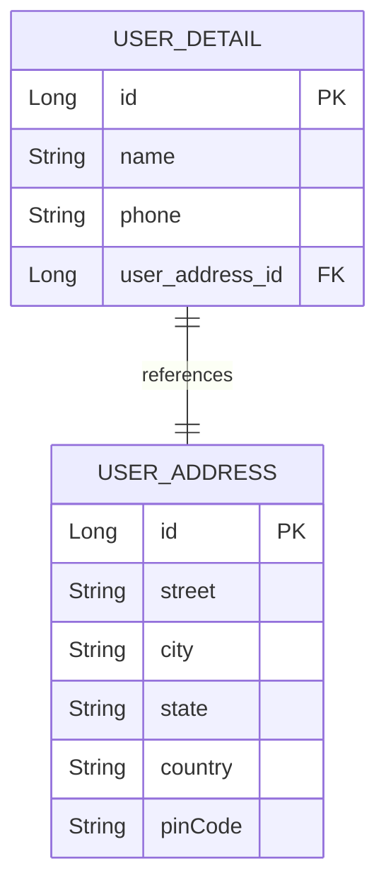
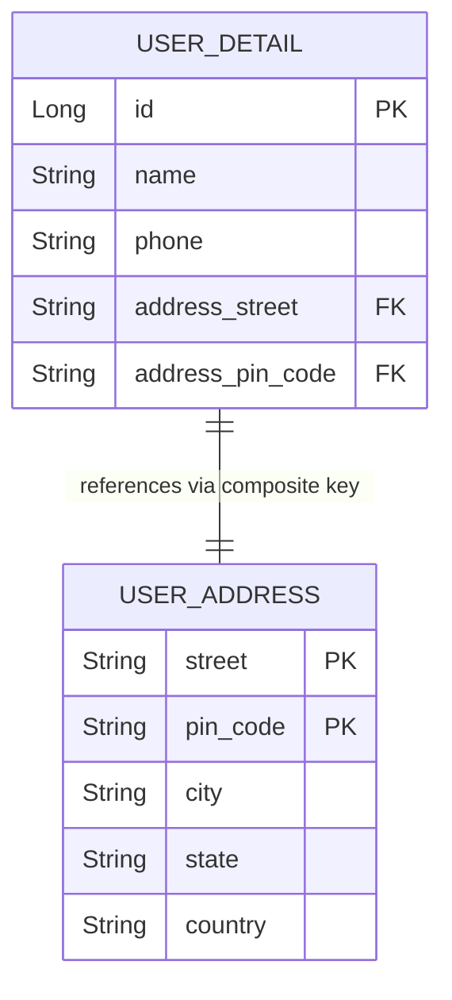
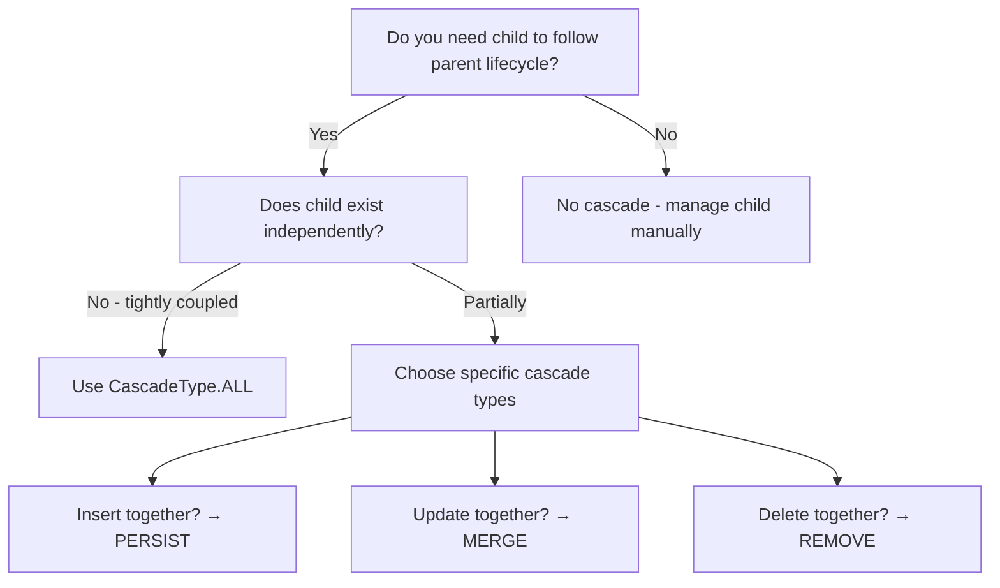
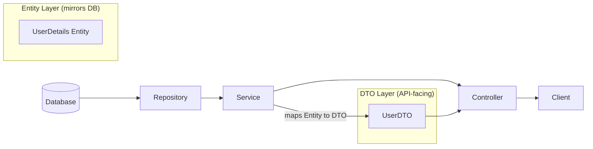
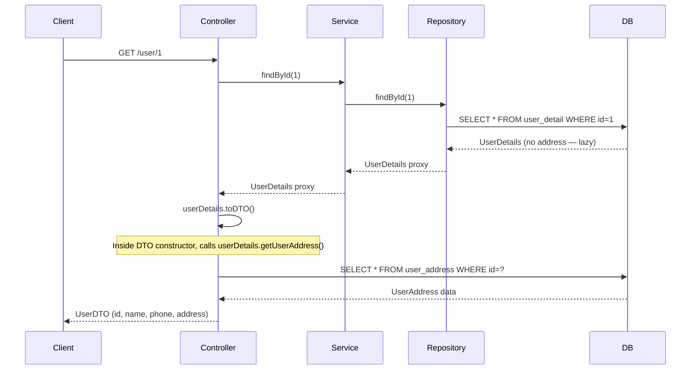
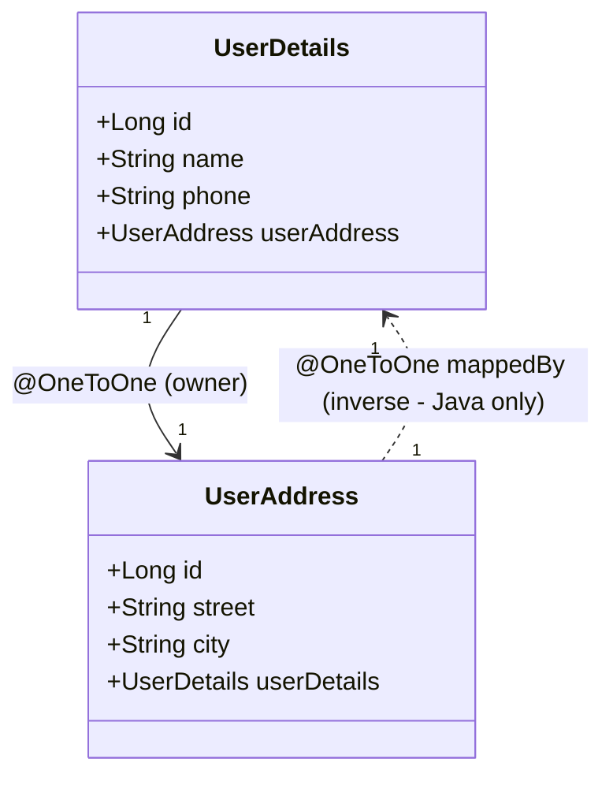
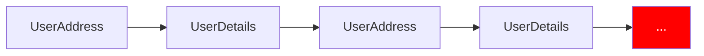
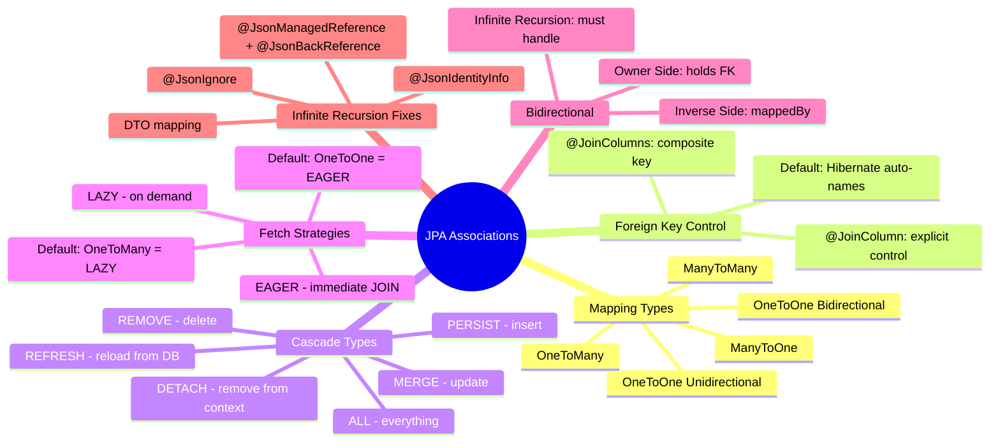

# 📌 Spring Boot JPA — Entity Associations & Mappings

> A comprehensive study guide covering JPA/Hibernate entity relationships, cascade types, fetch strategies, and bidirectional mapping.

---

## Table of Contents

1. [Introduction to Association Mappings](#1-introduction-to-association-mappings)
2. [One-to-One Unidirectional Mapping](#2-one-to-one-unidirectional-mapping)
3. [Using `@JoinColumn` for Explicit Foreign Key Control](#3-using-joincolumn-for-explicit-foreign-key-control)
4. [Composite Keys in Associations](#4-composite-keys-in-associations)
5. [Cascade Types](#5-cascade-types)
6. [Fetch Strategies — Eager vs Lazy Loading](#6-fetch-strategies--eager-vs-lazy-loading)
7. [Handling Lazy Loading Issues](#7-handling-lazy-loading-issues)
8. [Data Transfer Objects (DTOs)](#8-data-transfer-objects-dtos)
9. [One-to-One Bidirectional Mapping](#9-one-to-one-bidirectional-mapping)
10. [Infinite Recursion & How to Fix It](#10-infinite-recursion--how-to-fix-it)
11. [Summary](#11-summary)

---

## 1. Introduction to Association Mappings

### Overview

In any real-world application, data is rarely stored in a single table. Entities have relationships with each other. JPA (Java Persistence API) and its most popular implementation, Hibernate, provide a set of **association mapping annotations** to define and manage these relationships between Java entity classes — and by extension, their corresponding database tables.

### Types of Associations

| Annotation | Meaning |
|---|---|
| `@OneToOne` | One entity is associated with exactly one other entity |
| `@OneToMany` | One entity is associated with many instances of another |
| `@ManyToOne` | Many entities are associated with one instance of another |
| `@ManyToMany` | Many entities are associated with many instances of another |

Each mapping can also be either:

- **Unidirectional** — navigation is possible from only one side (parent → child)
- **Bidirectional** — navigation is possible from both sides (parent ↔ child)

---

## 2. One-to-One Unidirectional Mapping

### Overview

In a **one-to-one unidirectional** relationship, one entity holds a reference to exactly one instance of another entity — but only in **one direction**. The reference exists only from the owning (parent) side to the referenced (child) side. You cannot navigate from the child back to the parent.

### Real-World Analogy

Think of a **User** and their **Address**. One user has exactly one address. You can look up a user and find their address. But if you have only an address record, there is no built-in way to determine which user it belongs to (unless you navigate back through the parent).

### Definition

> A **one-to-one unidirectional** mapping means: one parent entity holds a foreign key reference to one child entity. Navigation is possible only from parent to child.

---

### How It Works in the Database

When you annotate a field with `@OneToOne`, Hibernate automatically creates a **foreign key column** in the parent entity's table. This foreign key points to the **primary key** of the child entity's table.

By default (without `@JoinColumn`), Hibernate names the foreign key column using the pattern:

```
<field_name>_<referenced_primary_key_column>
```

For example, if your field is named `userAddress` and the referenced entity's primary key is `id`, Hibernate creates a column named `user_address_id` in the parent table.

---

### Entity Example (Default Foreign Key Naming)

#### Parent Entity — `UserDetails`

```java
@Entity
@Table(name = "user_detail")
public class UserDetails {

    @Id
    @GeneratedValue(strategy = GenerationType.IDENTITY)
    private Long id;

    private String name;

    private String phone;

    @OneToOne(cascade = CascadeType.ALL)
    private UserAddress userAddress;  // Hibernate will create foreign key: user_address_id

    // Getters and Setters
}
```

#### Child Entity — `UserAddress`

```java
@Entity
@Table(name = "user_address")
public class UserAddress {

    @Id
    @GeneratedValue(strategy = GenerationType.IDENTITY)
    private Long id;

    private String street;
    private String city;
    private String state;
    private String country;
    private String pinCode;

    // Getters and Setters
}
```

---

### Resulting Database Tables

**`user_detail` table:**

| id | name | phone | user_address_id (FK) |
|----|------|-------|----------------------|
| 1  | John | 9999  | 1                    |

**`user_address` table:**

| id | street      | city      | state | country | pin_code |
|----|-------------|-----------|-------|---------|----------|
| 1  | MG Road     | Bangalore | KA    | India   | 560001   |

> [!IMPORTANT]
> The foreign key `user_address_id` lives in the **parent** table (`user_detail`), not the child. This is the standard behavior for `@OneToOne` — the owning side holds the foreign key.

---

### Diagram



---

### Key Observations

- The `@OneToOne` annotation on the `userAddress` field in `UserDetails` instructs JPA to create a foreign key in the `user_detail` table.
- Since no `@JoinColumn` is specified, Hibernate auto-generates the foreign key column name as `user_address_id`.
- Navigation from `UserAddress` back to `UserDetails` is **not possible** in this unidirectional setup.
- `CascadeType.ALL` is used here — this is explained in depth in [Section 5](#5-cascade-types).

---

## 3. Using `@JoinColumn` for Explicit Foreign Key Control

### Why Use `@JoinColumn`?

By default, Hibernate chooses the name for the foreign key column. If you want **explicit control** over:
- The name of the foreign key column in your table
- The column in the referenced table that the foreign key points to

...then you should use `@JoinColumn`.

### Syntax

```java
@OneToOne(cascade = CascadeType.ALL)
@JoinColumn(name = "address_id", referencedColumnName = "id")
private UserAddress userAddress;
```

### Syntax Breakdown

| Attribute | Meaning |
|---|---|
| `name` | The name of the **foreign key column** to be created in the current (owning) table |
| `referencedColumnName` | The column in the **referenced entity's table** that this foreign key points to |

### Effect on the Database

**`user_detail` table with `@JoinColumn(name = "address_id")`:**

| id | name | phone | address_id (FK) |
|----|------|-------|-----------------|
| 1  | John | 9999  | 1               |

Notice the column is now `address_id` instead of `user_address_id`.

### Full Example

```java
@Entity
@Table(name = "user_detail")
public class UserDetails {

    @Id
    @GeneratedValue(strategy = GenerationType.IDENTITY)
    private Long id;

    private String name;
    private String phone;

    @OneToOne(cascade = CascadeType.ALL)
    @JoinColumn(name = "address_id", referencedColumnName = "id")
    private UserAddress userAddress;

    // Getters and Setters
}
```

---

## 4. Composite Keys in Associations

### Overview

A **composite key** is a primary key made up of more than one column. When the child entity uses a composite key, you cannot use a single `@JoinColumn` — you must use `@JoinColumns` (plural) and specify each part of the composite key.

### Setting Up a Composite Key in the Child Entity

#### Step 1 — Create the Embeddable Composite Key Class

```java
@Embeddable
public class UserAddressCompositeKey implements Serializable {

    private String street;
    private String pinCode;

    // Getters, Setters, equals(), hashCode()
}
```

#### Step 2 — Use `@EmbeddedId` in the Child Entity

```java
@Entity
@Table(name = "user_address")
public class UserAddress {

    @EmbeddedId
    private UserAddressCompositeKey id;  // Composite key: street + pinCode

    private String city;
    private String state;
    private String country;

    // Getters and Setters
}
```

**Resulting `user_address` table:**

| street   | pin_code | city      | state | country |
|----------|----------|-----------|-------|---------|
| MG Road  | 560001   | Bangalore | KA    | India   |

Both `street` and `pin_code` together form the composite primary key.

---

### Referencing a Composite Key from the Parent Entity

Since there are multiple columns in the primary key, you must list all of them using `@JoinColumns`:

```java
@Entity
@Table(name = "user_detail")
public class UserDetails {

    @Id
    @GeneratedValue(strategy = GenerationType.IDENTITY)
    private Long id;

    private String name;
    private String phone;

    @OneToOne(cascade = CascadeType.ALL)
    @JoinColumns({
        @JoinColumn(name = "address_street", referencedColumnName = "street"),
        @JoinColumn(name = "address_pin_code", referencedColumnName = "pinCode")
    })
    private UserAddress userAddress;

    // Getters and Setters
}
```

### Syntax Breakdown

- `@JoinColumns` — wraps multiple `@JoinColumn` entries; required when the referenced entity has a composite primary key.
- Each `@JoinColumn` within the array specifies:
  - `name` — the foreign key column name to create in the **current** table
  - `referencedColumnName` — the column name in the **referenced** entity's table

**Resulting `user_detail` table:**

| id | name | phone | address_street (FK) | address_pin_code (FK) |
|----|------|-------|---------------------|-----------------------|
| 1  | John | 9999  | MG Road             | 560001                |

> [!IMPORTANT]
> In case of a composite key, Hibernate **cannot** auto-determine the foreign key columns. You **must** explicitly provide `@JoinColumns` with all the composite key fields listed.

---

### Diagram — Composite Key Association



---

## 5. Cascade Types

### Overview

**Cascade** controls how JPA operations (persist, merge, remove, refresh, detach) performed on a **parent entity** automatically propagate to its **associated child entities**.

### Why Cascade Exists

Without cascade, you must manage parent and child entity lifecycles manually. This is error-prone when the child entity's existence **depends entirely on the parent**. For example:

- A `School` is deleted → its `Room` records should also be deleted.
- A `School` is created → its associated `Room` records should also be created.

When child existence is tightly coupled to the parent, cascade helps enforce this relationship automatically.

> [!NOTE]
> Without cascade type, any operation on the parent does **not** affect the child entity. Child entities must be managed explicitly.

---

### Cascade Type Values

| Cascade Type | Trigger | Effect |
|---|---|---|
| `PERSIST` | Insert on parent | Child entity is also inserted |
| `MERGE` | Update on parent | Child entity is also updated |
| `REMOVE` | Delete on parent | Child entity is also deleted |
| `REFRESH` | Refresh on parent | Child entity is also refreshed from DB |
| `DETACH` | Detach on parent | Child entity is also detached from persistence context |
| `ALL` | Any operation | All of the above apply |

---

### CascadeType.PERSIST — Insert Propagation

When you save the parent entity, its child entity is automatically saved too.

```java
@OneToOne(cascade = CascadeType.PERSIST)
@JoinColumn(name = "address_id", referencedColumnName = "id")
private UserAddress userAddress;
```

**Example — Controller & Service:**

```java
// Controller
@PostMapping("/user")
public ResponseEntity<UserDetails> saveUser(@RequestBody UserDetails userDetails) {
    return ResponseEntity.ok(userService.saveUser(userDetails));
}

// Service
public UserDetails saveUser(UserDetails userDetails) {
    return userDetailsRepository.save(userDetails);  // This also saves UserAddress
}
```

**Request Body:**
```json
{
  "name": "John",
  "phone": "9999999999",
  "userAddress": {
    "street": "MG Road",
    "city": "Bangalore",
    "state": "Karnataka",
    "country": "India",
    "pinCode": "560001"
  }
}
```

**What Happens:**
1. `save()` is called on `userDetailsRepository`.
2. Internally, Hibernate's Entity Manager calls `persist()` on `UserDetails`.
3. Because of `CascadeType.PERSIST`, `persist()` is also called on the associated `UserAddress`.
4. Both rows are inserted: one in `user_detail`, one in `user_address`.

**Response:**
```json
{
  "id": 1,
  "name": "John",
  "phone": "9999999999",
  "userAddress": {
    "id": 1,
    "street": "MG Road",
    "city": "Bangalore",
    ...
  }
}
```

---

### CascadeType.MERGE — Update Propagation

When you update the parent entity, changes to the child entity are also propagated.

**What Happens Without `MERGE` (only `PERSIST` configured):**

```java
// PUT request — trying to update both user name and user address city
{
  "id": 1,
  "name": "XYZ_updated",
  "phone": "9999999999",
  "userAddress": {
    "id": 1,
    "city": "Bengaluru"  // changed from "Bangalore"
  }
}
```

**Result:** `name` updates in `user_detail`, but `city` does **not** update in `user_address`. Only `PERSIST` was specified, which handles insert only — not update.

**Fix — Add `MERGE`:**

```java
@OneToOne(cascade = {CascadeType.PERSIST, CascadeType.MERGE})
@JoinColumn(name = "address_id", referencedColumnName = "id")
private UserAddress userAddress;
```

Now both `name` and `city` update correctly.

> [!TIP]
> Remember: `save()` in Spring Data JPA calls `persist()` for new entities (no ID) and `merge()` for existing entities (ID present). If the passed object has an ID, it routes to an update operation internally.

---

### CascadeType.REMOVE — Delete Propagation

When you delete the parent entity, the child entity is also deleted.

```java
@OneToOne(cascade = {CascadeType.PERSIST, CascadeType.MERGE, CascadeType.REMOVE})
@JoinColumn(name = "address_id", referencedColumnName = "id")
private UserAddress userAddress;
```

**Delete Controller:**
```java
@DeleteMapping("/user/{id}")
public ResponseEntity<Void> deleteUser(@PathVariable Long id) {
    userService.deleteUser(id);
    return ResponseEntity.noContent().build();  // 204 No Content
}
```

**What Happens:**
1. `deleteById(id)` is called on `userDetailsRepository`.
2. The row is deleted from `user_detail`.
3. Because of `CascadeType.REMOVE`, the associated `UserAddress` row is also deleted from `user_address`.

---

### CascadeType.REFRESH — Bypassing First-Level Cache

```java
@OneToOne(cascade = CascadeType.REFRESH)
private UserAddress userAddress;
```

**How the Entity Manager works:**

JPA's Entity Manager maintains a **Persistence Context** — an in-memory cache (first-level cache). When you call `find()` or access an entity, JPA first checks this cache. If found, it returns the cached version without hitting the database.

The `EntityManager.refresh()` method **bypasses** this cache and directly queries the database, fetching the freshest data.

**What `CascadeType.REFRESH` does:**

When Hibernate internally calls `refresh()` on a parent entity (for example, to reload fresh data from the database), `CascadeType.REFRESH` ensures that the **child entity is also refreshed** directly from the database — not served from the persistence context.

> [!NOTE]
> `CascadeType.REFRESH` and `CascadeType.DETACH` are **rarely used directly** by application code. They exist for completeness, and Hibernate may use them internally in certain situations.

---

### CascadeType.DETACH — Detaching Child Along with Parent

```java
@OneToOne(cascade = CascadeType.DETACH)
private UserAddress userAddress;
```

**Context:**

The Persistence Context (managed by the Entity Manager) tracks the lifecycle of entities. An entity inside the persistence context is **managed** — any changes to it are automatically detected and persisted.

`EntityManager.detach(entity)` removes an entity from the persistence context. After detachment, JPA no longer tracks that entity's changes.

**What `CascadeType.DETACH` does:**

When the parent entity is detached from the persistence context, `CascadeType.DETACH` ensures that the associated **child entity is also detached**.

---

### CascadeType.ALL — Apply All Operations

Instead of listing each cascade type individually:

```java
// Verbose approach
@OneToOne(cascade = {CascadeType.PERSIST, CascadeType.MERGE, CascadeType.REMOVE,
                      CascadeType.REFRESH, CascadeType.DETACH})
```

Use `CascadeType.ALL` for convenience:

```java
@OneToOne(cascade = CascadeType.ALL)
@JoinColumn(name = "address_id", referencedColumnName = "id")
private UserAddress userAddress;
```

---

### Cascade Type Decision Diagram



---

### Summary Table — Cascade Types

| Operation | Without Cascade | With Appropriate Cascade |
|---|---|---|
| `save(parent)` | Only parent inserted | Parent + child inserted |
| `save(parent)` (update) | Only parent updated | Parent + child updated |
| `delete(parent)` | Only parent deleted, child remains (FK error risk) | Parent + child deleted |
| `refresh(parent)` | Only parent refreshed from DB | Parent + child refreshed |
| `detach(parent)` | Only parent detached | Parent + child detached |

---

## 6. Fetch Strategies — Eager vs Lazy Loading

### Overview

When you load a parent entity from the database, the question arises: **should its associated child entities also be loaded immediately?** Or should they be loaded only when explicitly accessed?

JPA provides two fetch strategies:

| Strategy | Behavior |
|---|---|
| **Eager Loading** | Child entities are loaded **immediately** when the parent is loaded |
| **Lazy Loading** | Child entities are loaded **on demand** — only when your code explicitly accesses them |

---

### Default Fetch Types by Annotation

| Annotation | Default Fetch Type | Reason |
|---|---|---|
| `@OneToOne` | `EAGER` | One child — minimal performance impact assumed |
| `@ManyToOne` | `EAGER` | One child — minimal performance impact assumed |
| `@OneToMany` | `LAZY` | Many children — loading all could be expensive |
| `@ManyToMany` | `LAZY` | Many children — loading all could be expensive |

> [!NOTE]
> **Why this distinction?** For `@OneToOne` and `@ManyToOne`, there is exactly **one** child entity. JPA assumes it's likely needed and the cost of fetching one extra row is low. For `@OneToMany` and `@ManyToMany`, the number of child records is unknown — it could be thousands. Loading all of them eagerly could cause serious performance issues.

---

### How Eager Loading Works Internally (SQL)

With **eager loading**, Hibernate generates a **`SELECT` with `LEFT JOIN`** query:

```sql
SELECT u.id, u.name, u.phone, a.id, a.street, a.city, a.state, a.country, a.pin_code
FROM user_detail u
LEFT JOIN user_address a ON u.address_id = a.id
WHERE u.id = 1;
```

Everything is fetched in one query. The child data is immediately available.

---

### How Lazy Loading Works Internally (SQL)

With **lazy loading**, Hibernate first fetches **only the parent**:

```sql
-- First query: only parent
SELECT u.id, u.name, u.phone, u.address_id
FROM user_detail u
WHERE u.id = 1;
```

Then, only **when the child is accessed** in code (e.g., `userDetail.getUserAddress()`), Hibernate fires a second query:

```sql
-- Second query: only when child is accessed
SELECT a.id, a.street, a.city, a.state, a.country, a.pin_code
FROM user_address a
WHERE a.id = 1;
```

---

### Overriding the Default Fetch Type

You can override the default fetch strategy using the `fetch` attribute:

```java
@OneToOne(cascade = CascadeType.ALL, fetch = FetchType.LAZY)
@JoinColumn(name = "address_id", referencedColumnName = "id")
private UserAddress userAddress;
```

This changes the `@OneToOne` relationship (default `EAGER`) to use `LAZY` loading instead.

Similarly, you can make `@OneToMany` eager:

```java
@OneToMany(fetch = FetchType.EAGER)
private List<Order> orders;
```

> [!WARNING]
> Making `@OneToMany` or `@ManyToMany` `EAGER` is generally a bad idea in production. If a parent has thousands of children, all of them will be loaded on every parent fetch — a serious performance hazard.

---

### Fetch Strategy Comparison Table

| Aspect | Eager Loading | Lazy Loading |
|---|---|---|
| When child is loaded | Immediately with parent | Only when accessed |
| Number of SQL queries | 1 (with JOIN) | 2 (parent first, child on demand) |
| Performance | Good when child always needed | Good when child rarely needed |
| Risk | Loading too much data | `LazyInitializationException` if session is closed |
| Default for `@OneToOne` | ✅ Yes | Override needed |
| Default for `@OneToMany` | Override needed | ✅ Yes |

---

## 7. Handling Lazy Loading Issues

### The Problem

When you configure `FetchType.LAZY` on a `@OneToOne` relationship and then make a **GET** request, you may encounter a failure during response serialization.

**Scenario:**

```java
@OneToOne(cascade = CascadeType.ALL, fetch = FetchType.LAZY)
@JoinColumn(name = "address_id", referencedColumnName = "id")
private UserAddress userAddress;
```

**GET endpoint:**
```java
@GetMapping("/user/{id}")
public ResponseEntity<UserDetails> getUser(@PathVariable Long id) {
    return ResponseEntity.ok(userService.findById(id));
}
```

**What Happens Internally:**

1. `findById(id)` fires a plain SELECT on `user_detail` table (no JOIN, because of `LAZY`).
2. The `UserDetails` object is returned with `userAddress` as a **proxy** (not yet loaded from DB).
3. Jackson (the JSON serializer) starts building the response.
4. Jackson tries to serialize the `userAddress` field.
5. Since `userAddress` is a lazy proxy and the database session/persistence context is already closed (new request = new Entity Manager), Jackson **cannot trigger another SELECT**.
6. Serialization fails with an error.

> [!WARNING]
> **Insert vs GET behavior difference:** During a POST (insert), the `userAddress` object is created and stored in the **same** persistence context as `userDetails`. So when Jackson serializes the response, both objects are still in memory — no extra DB query needed. But during a GET, a **new** Entity Manager is created, and the persistence context from the insert no longer exists. The lazy proxy cannot load from a closed context.

---

### Fix Option 1 — `@JsonIgnore`

Add `@JsonIgnore` on the lazy-loaded field to tell Jackson not to include it in the response at all:

```java
@JsonIgnore
@OneToOne(cascade = CascadeType.ALL, fetch = FetchType.LAZY)
@JoinColumn(name = "address_id", referencedColumnName = "id")
private UserAddress userAddress;
```

**Result:** The `userAddress` field is excluded from all responses — both for GET and POST. Jackson doesn't attempt to serialize it.

> [!CAUTION]
> `@JsonIgnore` removes the field from **all** serialization contexts — including cases where you actually do want the address data. Use this only when you never want the child in the API response.

---

### Fix Option 2 — DTO (Recommended)

The better, cleaner, professional approach is to use a **Data Transfer Object (DTO)**. A DTO is a plain Java class that holds only the data you want to expose to the API consumer.

This is covered in detail in [Section 8](#8-data-transfer-objects-dtos).

---

## 8. Data Transfer Objects (DTOs)

### Overview

A **Data Transfer Object (DTO)** is a simple Java class used to carry data between layers of your application. It is separate from your JPA entity and exposes only the fields relevant to a specific API response or request.

### Why Use DTOs?

| Problem | Solution via DTO |
|---|---|
| Your entity exposes all DB columns including sensitive/internal ones | DTO exposes only what the client should see |
| Column names in the DB differ from what the API should expose | DTO uses API-friendly field names |
| Lazy loading causes Jackson serialization failures | DTO explicitly controls what to include and triggers lazy loading inside service/mapping layer |
| Circular references in bidirectional mappings | DTO breaks the cycle |

---

### DTO Architecture



---

### Creating a DTO

```java
public class UserDTO {

    private Long userId;
    private String userName;
    private String phoneNumber;
    private String address;  // Only the street address — not the full UserAddress object

    // Constructor that accepts the entity and maps fields
    public UserDTO(UserDetails userDetails) {
        System.out.println("Going to query user address here now.");

        this.userId = userDetails.getId();
        this.userName = userDetails.getName();
        this.phoneNumber = userDetails.getPhone();

        // Explicitly access the lazy-loaded child — triggers a SELECT query here
        UserAddress userAddress = userDetails.getUserAddress();

        if (userAddress != null) {
            this.address = userAddress.getStreet();  // Only expose street in this DTO
        } else {
            this.address = null;
        }
    }

    // Getters
}
```

---

### Adding `toDTO()` to the Entity

```java
@Entity
@Table(name = "user_detail")
public class UserDetails {

    @Id
    @GeneratedValue(strategy = GenerationType.IDENTITY)
    private Long id;

    private String name;
    private String phone;

    @OneToOne(cascade = CascadeType.ALL, fetch = FetchType.LAZY)
    @JoinColumn(name = "address_id", referencedColumnName = "id")
    private UserAddress userAddress;

    public UserDTO toDTO() {
        return new UserDTO(this);  // Delegates to the DTO constructor
    }

    // Getters and Setters
}
```

---

### Using the DTO in the Controller

```java
@GetMapping("/user/{id}")
public ResponseEntity<UserDTO> getUser(@PathVariable Long id) {
    UserDetails userDetails = userService.findById(id);
    return ResponseEntity.ok(userDetails.toDTO());
}
```

---

### Step-by-Step Execution During GET



**What actually happens:**

1. `findById(1)` fires a plain `SELECT` on `user_detail` — no JOIN because of `LAZY`.
2. `userDetails.toDTO()` is called.
3. Inside the DTO constructor, `userDetails.getUserAddress()` is invoked **explicitly**.
4. This triggers a second `SELECT` query on `user_address` (Hibernate fires this because the lazy proxy is accessed).
5. The `UserAddress` is loaded, and only the `street` field is mapped into the DTO.
6. The DTO (not the entity) is returned to the client — no serialization issues.

> [!TIP]
> Using DTOs makes your code **explicit and predictable**. You know exactly when a lazy query fires and exactly what data leaves your application. This is far safer than relying on Jackson behavior.

---

### DTO Advantages Summary

- You control the API contract independently of the database schema.
- You avoid exposing internal/sensitive fields.
- You solve lazy loading serialization problems cleanly.
- You break circular reference issues in bidirectional mappings.
- Your API can evolve without changing the database and vice versa.

---

## 9. One-to-One Bidirectional Mapping

### Overview

In a **one-to-one bidirectional** mapping, **both entities hold a reference to each other**. Navigation is possible from parent to child **and** from child back to parent.

> [!IMPORTANT]
> **The database structure does NOT change.** Even in a bidirectional mapping, there is still only **one foreign key** — in the owning (parent) entity's table. The child entity's reference to the parent exists **only in the Java object**, not as a database column.

---

### Concepts: Owner Side and Inverse Side

| Term | Who | Holds Foreign Key? |
|---|---|---|
| **Owner Side** | Parent entity | ✅ Yes — foreign key in the DB |
| **Inverse Side** | Child entity | ❌ No — reference exists only in the Java object |

---

### Implementation

#### Owner Side — `UserDetails` (Parent)

```java
@Entity
@Table(name = "user_detail")
public class UserDetails {

    @Id
    @GeneratedValue(strategy = GenerationType.IDENTITY)
    private Long id;

    private String name;
    private String phone;

    // Owner side — holds the foreign key in user_detail table
    @OneToOne(cascade = CascadeType.ALL)
    @JoinColumn(name = "address_id", referencedColumnName = "id")
    private UserAddress userAddress;

    // Getters and Setters
}
```

#### Inverse Side — `UserAddress` (Child)

```java
@Entity
@Table(name = "user_address")
public class UserAddress {

    @Id
    @GeneratedValue(strategy = GenerationType.IDENTITY)
    private Long id;

    private String street;
    private String city;
    private String state;
    private String country;
    private String pinCode;

    // Inverse side — mapped by the field in the owner entity
    // No new foreign key is created in user_address table
    @OneToOne(mappedBy = "userAddress")
    private UserDetails userDetails;

    // Getters and Setters
}
```

---

### The `mappedBy` Attribute

```java
@OneToOne(mappedBy = "userAddress")
```

- `mappedBy = "userAddress"` tells JPA: **"The foreign key is already defined on the owner side, in the `userAddress` field of the `UserDetails` class. Do not create a new foreign key here."**
- This prevents Hibernate from creating an additional foreign key column in `user_address`.
- The value passed to `mappedBy` must match the **exact field name** on the owner side.

---

### Resulting Database Tables

**`user_detail` table:**

| id | name | phone | address_id (FK) |
|----|------|-------|-----------------|
| 1  | John | 9999  | 1               |

**`user_address` table:**

| id | street  | city      | state | country | pin_code |
|----|---------|-----------|-------|---------|----------|
| 1  | MG Road | Bangalore | KA    | India   | 560001   |

> The `user_address` table has **no** reference back to `user_detail` in the database. The bidirectional relationship exists only in Java objects.

---

### Diagram — Bidirectional vs Unidirectional



---

### Testing Bidirectional — Querying from the Child Side

**Controller for `UserAddress`:**

```java
@GetMapping("/user-address/{id}")
public ResponseEntity<UserAddress> getUserAddress(@PathVariable Long id) {
    return ResponseEntity.ok(userAddressService.findById(id));
}
```

**Service:**

```java
public UserAddress findById(Long id) {
    return userAddressRepository.findById(id).orElseThrow();
}
```

**What happens when this GET is called:**

1. JPA queries `user_address` by ID.
2. Because of the bidirectional mapping, Hibernate generates a `SELECT` with `LEFT JOIN` to also fetch the `UserDetails` referenced by `address_id`.

```sql
SELECT a.*, u.*
FROM user_address a
LEFT JOIN user_detail u ON u.address_id = a.id
WHERE a.id = 1;
```

---

## 10. Infinite Recursion & How to Fix It

### The Problem

When you query a `UserAddress` in a bidirectional mapping, Jackson tries to serialize the result:

1. Serializes `UserAddress` → encounters `userDetails` field
2. Starts serializing `UserDetails` → encounters `userAddress` field
3. Starts serializing `UserAddress` again → encounters `userDetails` again
4. ... infinite loop → Stack Overflow / serialization error



---

### Fix Option 1 — `@JsonManagedReference` and `@JsonBackReference`

These two annotations work as a pair to break the cycle:

| Annotation | Used On | Behavior |
|---|---|---|
| `@JsonManagedReference` | Owner/Parent entity (forward reference) | Tells Jackson to **serialize** this field normally |
| `@JsonBackReference` | Inverse/Child entity (back reference) | Tells Jackson to **skip** this field during serialization |

#### Owner Side (`UserDetails`)

```java
@Entity
public class UserDetails {

    @Id
    @GeneratedValue(strategy = GenerationType.IDENTITY)
    private Long id;

    private String name;
    private String phone;

    @JsonManagedReference  // Serialize this field normally
    @OneToOne(cascade = CascadeType.ALL)
    @JoinColumn(name = "address_id", referencedColumnName = "id")
    private UserAddress userAddress;

    // Getters and Setters
}
```

#### Inverse Side (`UserAddress`)

```java
@Entity
public class UserAddress {

    @Id
    @GeneratedValue(strategy = GenerationType.IDENTITY)
    private Long id;

    private String street;
    private String city;
    private String state;
    private String country;
    private String pinCode;

    @JsonBackReference  // Do NOT serialize this field (breaks the cycle)
    @OneToOne(mappedBy = "userAddress")
    private UserDetails userDetails;

    // Getters and Setters
}
```

#### Behavior

**GET `/user/1` (querying parent):**
```json
{
  "id": 1,
  "name": "John",
  "phone": "9999999999",
  "userAddress": {
    "id": 1,
    "street": "MG Road",
    "city": "Bangalore"
  }
}
```
`userAddress` is included (managed reference is serialized).

**GET `/user-address/1` (querying child):**
```json
{
  "id": 1,
  "street": "MG Road",
  "city": "Bangalore",
  "state": "Karnataka",
  "country": "India",
  "pinCode": "560001"
}
```
`userDetails` is **not included** (back reference is skipped).

> [!CAUTION]
> The limitation of `@JsonBackReference` is that the child's response **never** includes the parent data — even if you want it. If you need the parent data from the child's perspective, use `@JsonIdentityInfo` instead.

---

### Fix Option 2 — `@JsonIdentityInfo`

`@JsonIdentityInfo` assigns a unique identifier to each serialized object. Jackson uses this identifier to detect when an object has already been serialized — and instead of recursing, it simply outputs the identifier as a reference.

This approach allows **full bidirectional data in responses** without infinite recursion.

#### Owner Side

```java
@Entity
@JsonIdentityInfo(generator = ObjectIdGenerators.PropertyGenerator.class, property = "id")
public class UserDetails {

    @Id
    @GeneratedValue(strategy = GenerationType.IDENTITY)
    private Long id;

    private String name;
    private String phone;

    @OneToOne(cascade = CascadeType.ALL)
    @JoinColumn(name = "address_id", referencedColumnName = "id")
    private UserAddress userAddress;

    // Getters and Setters
}
```

#### Inverse Side

```java
@Entity
@JsonIdentityInfo(generator = ObjectIdGenerators.PropertyGenerator.class, property = "id")
public class UserAddress {

    @Id
    @GeneratedValue(strategy = GenerationType.IDENTITY)
    private Long id;

    private String street;
    private String city;
    private String state;
    private String country;
    private String pinCode;

    @OneToOne(mappedBy = "userAddress")
    private UserDetails userDetails;

    // Getters and Setters
}
```

#### Annotation Breakdown

```java
@JsonIdentityInfo(
    generator = ObjectIdGenerators.PropertyGenerator.class, // Use a field value as the unique ID
    property = "id"  // Use the "id" field as the unique identifier
)
```

The `property` must be a **unique field** in the entity (typically the primary key).

#### Behavior

**GET `/user/1` (querying parent):**
```json
{
  "id": 1,
  "name": "John",
  "phone": "9999999999",
  "userAddress": {
    "id": 1,
    "street": "MG Road",
    "city": "Bangalore",
    "userDetails": 1  // Reference by ID only — not re-serialized
  }
}
```

**GET `/user-address/1` (querying child):**
```json
{
  "id": 1,
  "street": "MG Road",
  "city": "Bangalore",
  "state": "Karnataka",
  "country": "India",
  "pinCode": "560001",
  "userDetails": {
    "id": 1,
    "name": "John",
    "phone": "9999999999",
    "userAddress": 1  // Reference by ID only — not re-serialized
  }
}
```

Jackson serializes each object **only once** in full. On the second encounter, it outputs only the unique identifier. This breaks the infinite loop while still providing full data from both directions.

---

### Comparison — Infinite Recursion Solutions

| Approach | Child can show Parent? | Parent can show Child? | Complexity |
|---|---|---|---|
| `@JsonIgnore` on child ref | ❌ No | ✅ Yes | Simple |
| `@JsonManagedReference` + `@JsonBackReference` | ❌ No (back ref suppressed) | ✅ Yes | Moderate |
| `@JsonIdentityInfo` | ✅ Yes (via ID reference) | ✅ Yes | Moderate |
| DTO mapping | ✅ Fully controlled | ✅ Fully controlled | Most explicit & recommended |

---

## 11. Summary

### Key Concepts Recap



---

### Quick Reference Bullets

- `@OneToOne` on a field creates a **foreign key in the owning entity's table**.
- Default foreign key naming by Hibernate: `<fieldName>_<referencedPK>` (e.g., `user_address_id`).
- Use `@JoinColumn(name=..., referencedColumnName=...)` for explicit foreign key naming.
- Use `@JoinColumns({...})` when referencing an entity with a **composite key**.
- `CascadeType.PERSIST` → insert parent = insert child.
- `CascadeType.MERGE` → update parent = update child.
- `CascadeType.REMOVE` → delete parent = delete child.
- `CascadeType.ALL` = all of the above combined.
- `FetchType.EAGER` (default for `@OneToOne`, `@ManyToOne`) → one JOIN query.
- `FetchType.LAZY` (default for `@OneToMany`, `@ManyToMany`) → two queries; child loaded on access.
- Lazy loading + Jackson serialization = risk of error unless handled with DTO or `@JsonIgnore`.
- `mappedBy` on the inverse side prevents creation of an extra foreign key in the DB.
- Bidirectional mappings risk **infinite recursion** during JSON serialization.
- Fix recursion with: `@JsonManagedReference`/`@JsonBackReference`, `@JsonIdentityInfo`, or **DTOs** (recommended).

---

### Interview Notes

> [!IMPORTANT]
> **Common interview questions on this topic:**

1. **What is the difference between unidirectional and bidirectional mapping?**
   - Unidirectional: navigation only from parent → child. Bidirectional: navigation from both sides.

2. **Where does the foreign key get created in a `@OneToOne` mapping?**
   - In the **owning entity** (the one that has the `@JoinColumn` or the plain `@OneToOne` annotation without `mappedBy`).

3. **What does `mappedBy` do?**
   - It tells JPA that this side is the **inverse** side and the foreign key is managed by the named field on the other side. No foreign key column is created on this side.

4. **What is the difference between `EAGER` and `LAZY` fetch?**
   - `EAGER`: child loaded with parent in one JOIN query. `LAZY`: child loaded only when accessed, via a second query.

5. **What is cascade type and why is it important?**
   - Cascade propagates operations (insert, update, delete) from parent to child automatically. Without it, child entities must be managed manually.

6. **What causes infinite recursion in bidirectional mappings and how do you fix it?**
   - Jackson serializing both sides creates a loop. Fix with `@JsonBackReference`, `@JsonIdentityInfo`, or DTOs.

7. **Why does lazy loading sometimes fail during serialization?**
   - The lazy proxy needs an open Hibernate session to fire a query. If the session is closed before Jackson tries to serialize the proxy, it fails. DTO-based mapping is the recommended solution.

8. **How do you reference a composite key as a foreign key?**
   - Use `@JoinColumns({@JoinColumn(...), @JoinColumn(...)})` and list all the composite key fields explicitly.

---

*End of Chapter — Next: One-to-Many, Many-to-One, Many-to-Many Mappings, Custom Queries, Criteria Queries, Pagination, and Sorting.*
