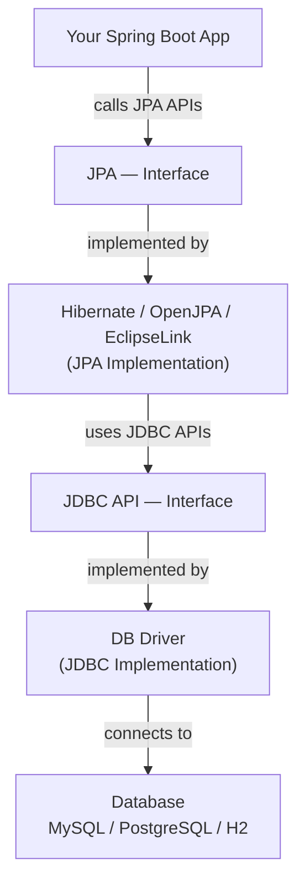
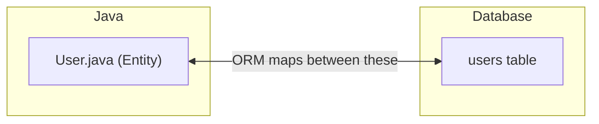
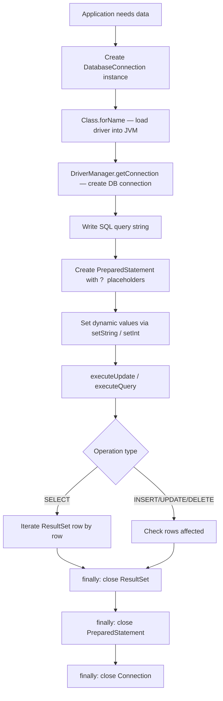
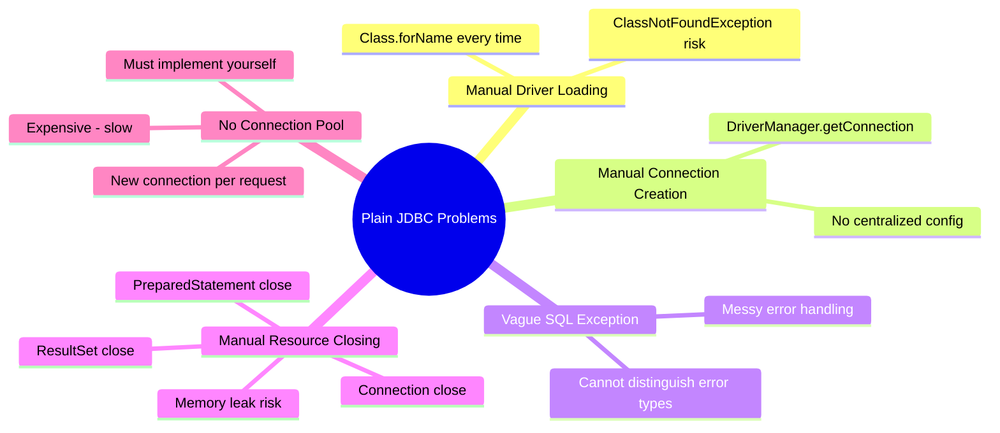
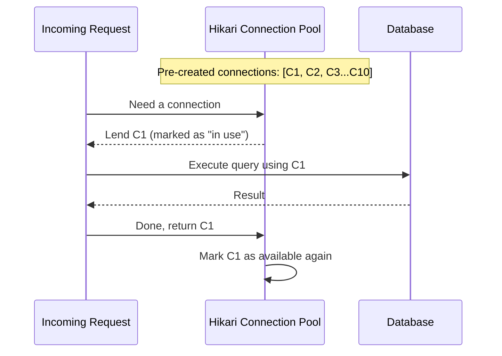
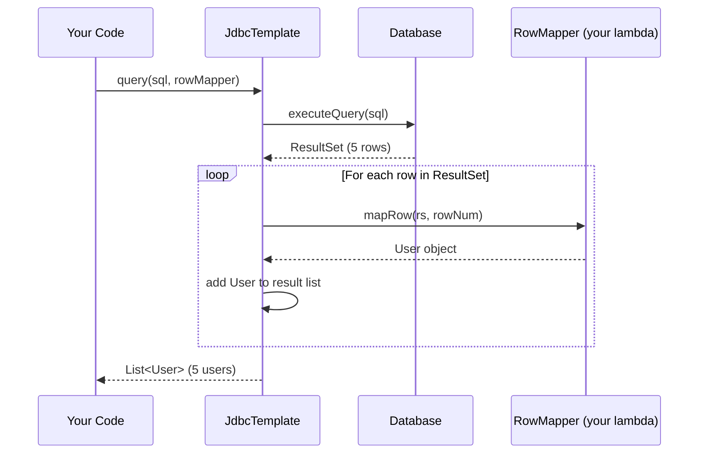
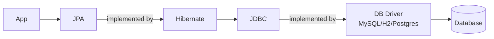

# 📌 Spring Boot JPA — Part 1
### Database Connectivity Architecture · Plain JDBC · Spring Boot JDBC Template · Connection Pooling

---

> [!NOTE]
> **Context:** This is Part 1 of the Spring Boot JPA series. Before jumping into JPA and ORM frameworks, this guide builds the complete foundation: how Java applications connect to databases, the problems with plain JDBC, and how Spring Boot's `JdbcTemplate` solves them. Understanding this sequence makes JPA and Hibernate make much more sense.

---

## Table of Contents

1. [The Complete Database Connectivity Architecture](#1-the-complete-database-connectivity-architecture)
2. [What Is JDBC?](#2-what-is-jdbc)
3. [What Is an ORM Framework?](#3-what-is-an-orm-framework)
4. [Database Drivers — The JDBC Implementations](#4-database-drivers--the-jdbc-implementations)
5. [Plain JDBC — Without Spring Boot](#5-plain-jdbc--without-spring-boot)
6. [Problems with Plain JDBC](#6-problems-with-plain-jdbc)
7. [Spring Boot JDBC — JdbcTemplate](#7-spring-boot-jdbc--jdbctemplate)
8. [How JdbcTemplate Solves Each Plain JDBC Problem](#8-how-jdbctemplate-solves-each-plain-jdbc-problem)
9. [Connection Pooling — Hikari CP](#9-connection-pooling--hikari-cp)
10. [JdbcTemplate — Complete Method Reference](#10-jdbctemplate--complete-method-reference)
11. [Full Working Example — Spring Boot JDBC](#11-full-working-example--spring-boot-jdbc)
12. [Summary & Quick Reference](#12-summary--quick-reference)
13. [Interview Notes](#13-interview-notes)
14. [Practice Questions](#14-practice-questions)

---

## 1. The Complete Database Connectivity Architecture

Before writing a single line of database code, you must understand the **full stack of components** involved when a Spring Boot application talks to a database. Each layer has a specific role.

```
┌─────────────────────────────────────────┐
│         Your Spring Boot Application    │
│         (Application Logic / Beans)     │
└─────────────────┬───────────────────────┘
                  │ interacts with
                  ▼
┌─────────────────────────────────────────┐
│              JPA (Interface)            │
│   Java Persistence API — defines APIs   │
│   Does NOT provide implementation       │
└─────────────────┬───────────────────────┘
                  │ implemented by
                  ▼
┌─────────────────────────────────────────┐
│         ORM Framework (e.g. Hibernate)  │
│   Provides JPA implementation           │
│   Maps Java objects ↔ DB tables         │
└─────────────────┬───────────────────────┘
                  │ uses
                  ▼
┌─────────────────────────────────────────┐
│           JDBC API (Interface)          │
│   Java Database Connectivity            │
│   Defines: getConnection, query, etc.   │
│   Does NOT provide implementation       │
└─────────────────┬───────────────────────┘
                  │ implemented by
                  ▼
┌─────────────────────────────────────────┐
│       Specific DB Driver (Impl)         │
│   MySQL → Connector/J                   │
│   PostgreSQL → PostgreSQL JDBC Driver   │
│   H2 → H2 Database Engine              │
└─────────────────┬───────────────────────┘
                  │ connects to
                  ▼
┌─────────────────────────────────────────┐
│            Database Server              │
│       MySQL / PostgreSQL / H2 / etc.    │
└─────────────────────────────────────────┘
```

### The Key Principle — Interfaces All the Way Down

This architecture is built on **interfaces**:

| Layer | Type | Who Implements It |
|-------|------|------------------|
| JPA | Interface | Hibernate, EclipseLink, OpenJPA |
| JDBC | Interface | Database-specific drivers |
| Drivers | Implementation | MySQL, PostgreSQL, H2 vendors |

> [!IMPORTANT]
> **JPA is just an API** — a set of interfaces and rules. It does not execute SQL. Hibernate (or another JPA provider) is what actually works.
>
> **JDBC is also just an API** — it defines how to connect and query. The actual work of talking to MySQL is done by the MySQL driver.

### Why This Layering Matters

Because your application talks to **interfaces**, not implementations:
- You can switch from MySQL to PostgreSQL **without changing your application code**.
- You can switch from Hibernate to EclipseLink **without rewriting your queries**.
- Each layer is independently replaceable.

---

### Architecture Diagram



---

## 2. What Is JDBC?

### Definition

**JDBC (Java Database Connectivity)** is a Java API (a collection of interfaces) that provides a standard way to:
- **Connect** to a relational database
- **Execute** SQL queries (SELECT, INSERT, UPDATE, DELETE, CREATE)
- **Process** the results returned from the database

### What JDBC Is NOT

JDBC does **not** actually perform these operations. It only **defines the contract** (the interfaces). The actual implementation of "how to connect to MySQL" is in the MySQL JDBC driver, not in JDBC itself.

### Real-World Analogy

> JDBC is like a universal power socket standard. The standard defines the shape and voltage requirements, but the actual electricity flows through a specific power grid (the driver). You plug in the same way regardless of which city you're in — only the underground wiring (driver implementation) differs.

---

## 3. What Is an ORM Framework?

### Definition

**ORM (Object-Relational Mapping)** is a technique (and framework) that acts as a **bridge between Java objects and relational database tables**.

Without ORM:
- You write SQL strings manually: `INSERT INTO users (name, age) VALUES (?, ?)`
- You manually map result set columns back to Java objects

With ORM (JPA + Hibernate):
- You create Java classes (entities) annotated with `@Entity`
- ORM generates SQL automatically
- ORM maps result rows back to Java objects automatically



### ORM vs JDBC Comparison

| Feature | Plain JDBC | ORM (JPA + Hibernate) |
|---------|-----------|----------------------|
| SQL queries | Write manually | Auto-generated for common operations |
| Result mapping | Manual (column by column) | Automatic (via entity annotations) |
| Code verbosity | High | Low |
| Control over SQL | Full | Partial (can still use native queries) |
| Learning curve | Low | Higher |
| Performance tuning | Easier | Requires understanding of ORM behavior |

> [!NOTE]
> Both JPA and JDBC are **only for relational databases** (MySQL, PostgreSQL, H2, Oracle, etc.). For NoSQL databases (MongoDB, Cassandra), you need entirely different libraries with their own transaction managers and connection mechanisms. The underlying concepts of connection management remain similar.

---

## 4. Database Drivers — The JDBC Implementations

Each relational database has its own **driver** — a library that implements the JDBC API and knows how to communicate with that specific database.

| Database | Driver Name | Class to Load |
|----------|------------|---------------|
| **MySQL** | Connector/J | `com.mysql.cj.jdbc.Driver` |
| **PostgreSQL** | PostgreSQL JDBC Driver | `org.postgresql.Driver` |
| **H2** | H2 Database Engine | `org.h2.Driver` |
| **Oracle** | Oracle JDBC Driver | `oracle.jdbc.driver.OracleDriver` |
| **SQL Server** | Microsoft JDBC Driver | `com.microsoft.sqlserver.jdbc.SQLServerDriver` |

### Why the Driver Class Needs to Be "Loaded"

Before using a driver, it must be **loaded into the JVM**. This registers the driver with the `DriverManager` so that when you call `DriverManager.getConnection(url)`, the `DriverManager` knows which driver to use for the given URL.

```java
// Manually loading a driver (plain JDBC)
Class.forName("org.h2.Driver");   // Loads H2 driver into JVM
```

In Spring Boot, this is done **automatically** at application startup — you never write `Class.forName(...)` yourself.

### Key Insight — Code Doesn't Change When You Switch Databases

```java
// Your code always calls the same JDBC API methods
Connection conn = DriverManager.getConnection(url, username, password);
PreparedStatement ps = conn.prepareStatement("SELECT * FROM users");
ResultSet rs = ps.executeQuery();
```

Whether `url` points to MySQL, PostgreSQL, or H2, your code is identical. Only the driver class and URL format change — and in Spring Boot, even those just change in `application.properties`.

---

## 5. Plain JDBC — Without Spring Boot

To understand why Spring Boot's `JdbcTemplate` is valuable, you must first see what you would write **without it**.

### Setting Up H2 (In-Memory Database)

H2 is a lightweight, in-memory relational database perfect for development and testing:
- **In-memory mode:** Data exists only while the application runs. On shutdown, data is lost.
- **File mode:** Data persists to disk even after shutdown.

We use in-memory mode here: `jdbc:h2:mem:userdb`

---

### Class 1 — `DatabaseConnection` (Connection Management)

```java
public class DatabaseConnection {

    public Connection getConnection() throws SQLException, ClassNotFoundException {

        // Step 1: Load the driver into the JVM
        Class.forName("org.h2.Driver");

        // Step 2: Establish a connection with the database
        // Format: jdbc:<db-type>:<mode>:<db-name>
        // If the DB doesn't exist, H2 creates it automatically
        Connection connection = DriverManager.getConnection(
                "jdbc:h2:mem:userdb",   // URL: H2 in-memory database named "userdb"
                "sa",                   // Username: default H2 admin (System Administrator)
                ""                      // Password: empty by default
        );

        return connection;
    }
}
```

#### Line-by-Line Explanation

| Line | Explanation |
|------|-------------|
| `Class.forName("org.h2.Driver")` | Loads the H2 JDBC driver into JVM memory and registers it with `DriverManager` |
| `DriverManager.getConnection(url, user, pass)` | Asks `DriverManager` to create a new database connection using the registered driver |
| `"jdbc:h2:mem:userdb"` | JDBC URL: protocol=`jdbc`, DB type=`h2`, mode=`mem` (in-memory), DB name=`userdb` |
| `"sa"` | Default H2 username (SA = System Administrator) |
| `""` | Default H2 password (empty string) |

---

### Class 2 — `UserDao` (Data Access Object)

```java
public class UserDao {

    // Method 1: Create the users table
    public void createTable() throws SQLException, ClassNotFoundException {
        DatabaseConnection dbConn = new DatabaseConnection();
        Connection connection = dbConn.getConnection();   // Get fresh connection
        Statement statement = null;

        try {
            String sql = "CREATE TABLE users (" +
                         "user_id INT AUTO_INCREMENT PRIMARY KEY, " +
                         "username VARCHAR(255), " +
                         "age INT)";

            statement = connection.createStatement();
            statement.executeUpdate(sql);   // Execute DDL (CREATE TABLE)

        } catch (SQLException e) {
            e.printStackTrace();
        } finally {
            // Must close all resources to prevent memory leaks
            if (statement != null) statement.close();
            if (connection != null) connection.close();
        }
    }

    // Method 2: Insert a new user
    public void createUser(String username, int age) throws SQLException, ClassNotFoundException {
        DatabaseConnection dbConn = new DatabaseConnection();
        Connection connection = dbConn.getConnection();
        PreparedStatement preparedStatement = null;

        try {
            // ? = placeholder for dynamic values (prevents SQL injection)
            String sql = "INSERT INTO users (username, age) VALUES (?, ?)";

            preparedStatement = connection.prepareStatement(sql);
            preparedStatement.setString(1, username);   // Index 1 = first ?
            preparedStatement.setInt(2, age);           // Index 2 = second ?

            preparedStatement.executeUpdate();   // Execute INSERT

        } catch (SQLException e) {
            e.printStackTrace();
        } finally {
            if (preparedStatement != null) preparedStatement.close();
            if (connection != null) connection.close();
        }
    }

    // Method 3: Read all users
    public String readUsers() throws SQLException, ClassNotFoundException {
        DatabaseConnection dbConn = new DatabaseConnection();
        Connection connection = dbConn.getConnection();
        PreparedStatement preparedStatement = null;
        ResultSet resultSet = null;
        StringBuilder result = new StringBuilder();

        try {
            String sql = "SELECT * FROM users";
            preparedStatement = connection.prepareStatement(sql);
            resultSet = preparedStatement.executeQuery();   // Returns ResultSet

            // ResultSet = a cursor over the result rows
            while (resultSet.next()) {
                result.append("ID: ").append(resultSet.getInt("user_id"))
                      .append(", Name: ").append(resultSet.getString("username"))
                      .append(", Age: ").append(resultSet.getInt("age"))
                      .append("\n");
            }

        } catch (SQLException e) {
            e.printStackTrace();
        } finally {
            // Close ALL resources in reverse order of creation
            if (resultSet != null) resultSet.close();
            if (preparedStatement != null) preparedStatement.close();
            if (connection != null) connection.close();
        }

        return result.toString();
    }
}
```

#### Key Concepts in Plain JDBC

**`Statement` vs `PreparedStatement`:**

| Type | Use When | SQL Injection Safe? |
|------|----------|-------------------|
| `Statement` | No dynamic values (DDL like CREATE TABLE) | N/A |
| `PreparedStatement` | Dynamic values (INSERT, SELECT with WHERE) | ✅ Yes — `?` placeholders are parameterized |

**`executeUpdate()` vs `executeQuery()`:**

| Method | Used For | Returns |
|--------|---------|---------|
| `executeUpdate()` | INSERT, UPDATE, DELETE, CREATE TABLE | `int` (rows affected) |
| `executeQuery()` | SELECT | `ResultSet` (result rows) |

**`ResultSet`:**
- A cursor that starts **before** the first row.
- Call `resultSet.next()` to move to the next row — returns `false` when no more rows.
- Use typed getters: `getInt("column")`, `getString("column")`, `getDouble("column")`.

---

### Step-by-Step Execution Flow (Plain JDBC)



---

## 6. Problems with Plain JDBC

Plain JDBC works, but it forces developers to write a **large amount of repetitive, error-prone boilerplate code**. Here are the five main problems:

### Problem 1 — Manual Driver Class Loading

```java
// Must be done every time, in every class that needs a connection
Class.forName("org.h2.Driver");
```

- You must know the exact driver class name for your database.
- If you forget it or misspell it, you get a `ClassNotFoundException` at runtime.
- Every developer on the team must remember to do this.

---

### Problem 2 — Manual Database Connection Creation

```java
Connection connection = DriverManager.getConnection(url, username, password);
```

- You must manually obtain a connection before every query.
- The URL, username, and password are hardcoded or must be managed separately.
- No centralized connection configuration.

---

### Problem 3 — Vague Exception Handling (`SQLException`)

```java
} catch (SQLException e) {
    e.printStackTrace();   // What went wrong? No idea.
}
```

`SQLException` is an extremely **broad, generic exception**. It can represent dozens of different failure types:
- Primary key violation
- Duplicate key (unique constraint)
- Foreign key violation
- Query timeout
- Connection failure
- Syntax error in SQL

With plain JDBC, you cannot easily distinguish between these without parsing error codes manually. This makes error handling messy, unreliable, and hard to maintain.

---

### Problem 4 — Manual Resource Closing (Risk of Memory Leaks)

```java
} finally {
    if (resultSet != null) resultSet.close();
    if (preparedStatement != null) preparedStatement.close();
    if (connection != null) connection.close();
}
```

- Every method must have a `finally` block closing **every resource** in the right order.
- If you forget to close even one resource, you get a **resource leak** — connections stay open indefinitely.
- At scale, leaked connections exhaust the database's connection limit, causing failures.
- This `finally` block must be duplicated in every single DAO method.

---

### Problem 5 — No Connection Pooling

```java
// Creates a brand-new connection every single time
Connection connection = DriverManager.getConnection(url, username, password);
```

Creating a database connection is **expensive** — it involves:
- Network handshake
- Authentication
- Session initialization

For a high-traffic application handling thousands of requests per second, creating a new connection for every request would be catastrophically slow.

**Connection pooling** solves this by pre-creating a set of connections, reusing them across requests, and returning them to the pool after use. With plain JDBC, you must implement this yourself — a non-trivial engineering effort.

---

### Summary of Plain JDBC Problems



---

## 7. Spring Boot JDBC — JdbcTemplate

### What Is `JdbcTemplate`?

`JdbcTemplate` is a Spring class that **wraps JDBC and removes all the boilerplate code**. It handles:
- Driver loading
- Connection creation and management
- Exception translation (vague → specific)
- Resource closing (connections, statements, result sets)
- Connection pooling (via `DataSource`)

You focus entirely on your SQL query and result mapping. Spring handles everything else.

---

### Step 1 — Add Dependencies (`pom.xml`)

```xml
<!-- Spring Boot JDBC support (includes JdbcTemplate) -->
<dependency>
    <groupId>org.springframework.boot</groupId>
    <artifactId>spring-boot-starter-jdbc</artifactId>
</dependency>

<!-- H2 in-memory database (replace with MySQL/Postgres dependency if needed) -->
<dependency>
    <groupId>com.h2database</groupId>
    <artifactId>h2</artifactId>
    <scope>runtime</scope>
</dependency>
```

> [!TIP]
> To switch to MySQL, replace the H2 dependency with:
> ```xml
> <dependency>
>     <groupId>mysql</groupId>
>     <artifactId>mysql-connector-java</artifactId>
>     <scope>runtime</scope>
> </dependency>
> ```
> Your `JdbcTemplate` code does not change — only `application.properties` needs to be updated.

---

### Step 2 — Configure `application.properties`

```properties
# Database URL
spring.datasource.url=jdbc:h2:mem:userdb

# JDBC Driver class (Spring Boot often auto-detects this)
spring.datasource.driver-class-name=org.h2.Driver

# Database credentials
spring.datasource.username=sa
spring.datasource.password=

# Connection pool settings (Hikari — Spring Boot's default)
spring.datasource.hikari.maximum-pool-size=10
spring.datasource.hikari.minimum-idle=5
```

> [!NOTE]
> For MySQL, the URL format changes:
> ```properties
> spring.datasource.url=jdbc:mysql://localhost:3306/userdb
> spring.datasource.driver-class-name=com.mysql.cj.jdbc.Driver
> spring.datasource.username=root
> spring.datasource.password=yourpassword
> ```
> Everything else in your Java code stays the same.

---

### Step 3 — Create the Entity (Plain Java Object)

```java
public class User {

    private Long userId;
    private String username;
    private int age;

    // Constructors
    public User() {}
    public User(Long userId, String username, int age) {
        this.userId = userId;
        this.username = username;
        this.age = age;
    }

    // Getters and Setters
    public Long getUserId() { return userId; }
    public void setUserId(Long userId) { this.userId = userId; }

    public String getUsername() { return username; }
    public void setUsername(String username) { this.username = username; }

    public int getAge() { return age; }
    public void setAge(int age) { this.age = age; }

    @Override
    public String toString() {
        return "User{userId=" + userId + ", username='" + username + "', age=" + age + "}";
    }
}
```

---

### Step 4 — Create the Repository Class

```java
@Repository
public class UserRepository {

    @Autowired
    private JdbcTemplate jdbcTemplate;
    // Spring auto-creates JdbcTemplate bean using the DataSource configured
    // in application.properties — no manual setup needed

    // Create the users table
    public void createTable() {
        String sql = "CREATE TABLE IF NOT EXISTS users (" +
                     "user_id INT AUTO_INCREMENT PRIMARY KEY, " +
                     "username VARCHAR(255), " +
                     "age INT)";
        jdbcTemplate.execute(sql);   // For DDL statements (no dynamic values)
    }

    // Insert a new user
    public void insertUser(String username, int age) {
        String sql = "INSERT INTO users (username, age) VALUES (?, ?)";
        jdbcTemplate.update(sql, username, age);
        // No try-catch, no finally, no connection management — JdbcTemplate handles it all
    }

    // Read all users
    public List<User> getUsers() {
        String sql = "SELECT * FROM users";
        return jdbcTemplate.query(sql, (rs, rowNum) -> {
            User user = new User();
            user.setUserId(rs.getLong("user_id"));
            user.setUsername(rs.getString("username"));
            user.setAge(rs.getInt("age"));
            return user;
        });
    }
}
```

#### What `@Repository` Does

`@Repository` is a specialization of `@Component`. It does two things:
1. Marks the class for **component scanning** — Spring creates a bean automatically.
2. Enables Spring's **exception translation** — any `SQLException` thrown inside a `@Repository` class is automatically converted to a specific Spring `DataAccessException` subclass (e.g., `DuplicateKeyException`, `QueryTimeoutException`).

---

### Step 5 — Create the Service Class

```java
@Service
public class UserService {

    @Autowired
    private UserRepository userRepository;

    public void initializeTable() {
        userRepository.createTable();
    }

    public void addUser(String username, int age) {
        // Business logic can go here before/after DB operation
        userRepository.insertUser(username, age);
    }

    public List<User> getAllUsers() {
        List<User> users = userRepository.getUsers();
        // Business logic on the fetched data can go here
        users.forEach(System.out::println);
        return users;
    }
}
```

---

### Step 6 — Controller

```java
@RestController
public class UserController {

    @Autowired
    private UserService userService;

    @GetMapping("/api/jdbc/users")
    public List<User> getUsers() {
        userService.initializeTable();
        userService.addUser("Alice", 30);
        userService.addUser("Bob", 25);
        return userService.getAllUsers();
    }
}
```

**Console Output:**
```
User{userId=1, username='Alice', age=30}
User{userId=2, username='Bob', age=25}
```

**HTTP Response:**
```json
[
  { "userId": 1, "username": "Alice", "age": 30 },
  { "userId": 2, "username": "Bob", "age": 25 }
]
```

---

## 8. How JdbcTemplate Solves Each Plain JDBC Problem

### Problem 1 Solved — Driver Loading is Automatic

At application startup, Spring Boot reads `spring.datasource.driver-class-name` from `application.properties` and calls `Class.forName(...)` automatically — in the `DriverManager` class, before your code runs.

```
Application starts
    → Spring reads application.properties
    → Spring calls Class.forName("org.h2.Driver") internally
    → Driver registered with DriverManager
    → You never write Class.forName() anywhere
```

---

### Problem 2 Solved — Connection Management via `DataSource`

Spring Boot creates a `DataSource` bean based on your `application.properties`. `JdbcTemplate` uses this `DataSource` to **get connections automatically** whenever you call `execute()`, `update()`, or `query()`.

Internally, when you call `jdbcTemplate.update(sql, ...)`, Spring calls `DataSourceUtils.getConnection(dataSource)` — you never call `DriverManager.getConnection()` yourself.

---

### Problem 3 Solved — Granular Exception Translation

Plain JDBC throws the generic `SQLException`. Spring Boot translates these into **specific, meaningful exceptions**:

| Spring Exception | Meaning |
|-----------------|---------|
| `DuplicateKeyException` | Unique constraint / primary key violation |
| `DataIntegrityViolationException` | Foreign key, NOT NULL, check constraint violation |
| `QueryTimeoutException` | Query took too long |
| `EmptyResultDataAccessException` | Expected one row, got zero |
| `CannotAcquireLockException` | Database lock contention |
| `DataAccessException` | Parent of all Spring DB exceptions |

These are all in the `org.springframework.dao` package. You can catch exactly the exception type you care about:

```java
try {
    userRepository.insertUser("Alice", 30);
} catch (DuplicateKeyException e) {
    // Handle duplicate user specifically
    return ResponseEntity.status(409).body("User already exists");
} catch (DataAccessException e) {
    // Handle any other DB error
    return ResponseEntity.status(500).body("Database error");
}
```

---

### Problem 4 Solved — Automatic Resource Closing

`JdbcTemplate` closes all resources in its `finally` block internally. You never write:

```java
// ❌ Never need this in Spring Boot JDBC
if (resultSet != null) resultSet.close();
if (preparedStatement != null) preparedStatement.close();
if (connection != null) connection.close();
```

Internally, `JdbcTemplate` does something like:
```java
// JdbcTemplate internal cleanup (simplified)
} finally {
    JdbcUtils.closeResultSet(rs);
    JdbcUtils.closeStatement(stmt);
    DataSourceUtils.releaseConnection(con, dataSource);
    // Note: "release" means return to pool, not necessarily close
}
```

---

### Problem 5 Solved — Built-In Connection Pooling (Hikari CP)

Spring Boot automatically configures **HikariCP** as the default connection pool. When you set up `application.properties`, Spring Boot wires everything — you get a production-grade connection pool with zero extra configuration.

**Default Hikari settings:**
- Maximum pool size: **10 connections**
- Minimum idle connections: **10**
- Both configurable in `application.properties`

---

### Before vs After Comparison

```
Plain JDBC (one method):                    Spring Boot JdbcTemplate (same method):
──────────────────────────────────────      ──────────────────────────────────────
Class.forName("org.h2.Driver");             // Nothing here — auto at startup
Connection conn = DriverManager             // Nothing here — JdbcTemplate manages
  .getConnection(url, user, pass);
try {
  PreparedStatement ps =                    String sql = "INSERT INTO users
    conn.prepareStatement(                    (username, age) VALUES (?, ?)";
    "INSERT INTO users                      jdbcTemplate.update(sql, username, age);
     (username, age) VALUES (?, ?)");
  ps.setString(1, username);               // Done. That's the entire method.
  ps.setInt(2, age);
  ps.executeUpdate();
} catch (SQLException e) {
  e.printStackTrace();
} finally {
  if (ps != null) ps.close();
  if (conn != null) conn.close();
}
```

---

## 9. Connection Pooling — Hikari CP

### What Is a Connection Pool?

A **connection pool** is a cache of pre-created, ready-to-use database connections. Instead of creating a new connection for every request (expensive), the pool lends an existing connection and takes it back when done.



### Why Connections Are Expensive to Create

Creating a DB connection involves:
- TCP/IP network handshake
- Database authentication (username/password validation)
- Session state initialization on the DB server
- Memory allocation on both client and server

For a web application serving hundreds of requests per second, creating a new connection per request would add 50-200ms of latency **just for the connection** — before any query runs.

### Hikari CP — Spring Boot's Default

**HikariCP** is the fastest, most efficient JDBC connection pool available. Spring Boot uses it by default.

```properties
# Hikari pool configuration in application.properties
spring.datasource.hikari.maximum-pool-size=10    # Max connections in pool
spring.datasource.hikari.minimum-idle=5          # Min idle connections maintained
spring.datasource.hikari.connection-timeout=30000 # Max wait for connection (ms)
spring.datasource.hikari.idle-timeout=600000     # Max idle time before removal (ms)
```

> [!NOTE]
> Hikari works the same way for MySQL, PostgreSQL, or H2. Spring Boot selects it automatically based on what's on the classpath. If you want a different connection pool (e.g., Apache DBCP, C3P0), you can explicitly configure a `DataSource` bean in your `AppConfig` class.

### Custom DataSource Bean (Override Default)

```java
@Configuration
public class AppConfig {

    @Bean
    public DataSource dataSource() {
        HikariDataSource dataSource = new HikariDataSource();
        dataSource.setDriverClassName("org.h2.Driver");
        dataSource.setJdbcUrl("jdbc:h2:mem:userdb");
        dataSource.setUsername("sa");
        dataSource.setPassword("");
        dataSource.setMaximumPoolSize(20);    // Custom pool size
        dataSource.setMinimumIdle(5);
        return dataSource;
    }
}
```

When you define a `DataSource` bean this way, `application.properties` datasource settings are **ignored** — your bean takes full control.

---

## 10. JdbcTemplate — Complete Method Reference

`JdbcTemplate` provides several methods for different types of SQL operations. Here is a complete guide to the most commonly used ones.

---

### `execute()` — DDL Statements

**Use for:** `CREATE TABLE`, `DROP TABLE`, `ALTER TABLE` — statements with no dynamic values and no result.

```java
String sql = "CREATE TABLE IF NOT EXISTS users " +
             "(user_id INT AUTO_INCREMENT PRIMARY KEY, username VARCHAR(255), age INT)";
jdbcTemplate.execute(sql);
```

---

### `update()` — INSERT, UPDATE, DELETE

Two flavors:

#### Flavor 1 — With Varargs (Simple)

**Use for:** Simple INSERT/UPDATE/DELETE with a small number of parameters.

```java
// INSERT
String insertSql = "INSERT INTO users (username, age) VALUES (?, ?)";
jdbcTemplate.update(insertSql, "Alice", 30);   // varargs: values replace ? in order

// UPDATE
String updateSql = "UPDATE users SET age = ? WHERE username = ?";
jdbcTemplate.update(updateSql, 31, "Alice");

// DELETE
String deleteSql = "DELETE FROM users WHERE user_id = ?";
jdbcTemplate.update(deleteSql, 1L);
```

#### Flavor 2 — With `PreparedStatementSetter` (Complex)

**Use for:** Complex queries where you need precise control over parameter binding.

`PreparedStatementSetter` is a **functional interface** — use a lambda expression.

```java
String sql = "INSERT INTO users (username, age) VALUES (?, ?)";

jdbcTemplate.update(sql, (PreparedStatement ps) -> {
    ps.setString(1, "Alice");   // ? index 1 = username
    ps.setInt(2, 30);           // ? index 2 = age
});
```

> [!TIP]
> Use **Flavor 1** (varargs) for most cases — it's cleaner and requires less code.
> Use **Flavor 2** (`PreparedStatementSetter`) when you need to set `NULL` values, use `setNull()`, or handle complex type conversions.

---

### `query()` — SELECT Multiple Rows

**Use for:** Fetching multiple rows and mapping each row to a Java object.

`RowMapper` is a **functional interface** — use a lambda expression. It is called once per row in the result set.

```java
String sql = "SELECT * FROM users";

List<User> users = jdbcTemplate.query(sql, (ResultSet rs, int rowNum) -> {
    // This lambda is called once per row
    User user = new User();
    user.setUserId(rs.getLong("user_id"));
    user.setUsername(rs.getString("username"));
    user.setAge(rs.getInt("age"));
    return user;   // Return the mapped object for this row
});
// Returns List<User> with one User per row
```

**Internal execution of `query()`:**



---

### `queryForList()` — SELECT Single Column, Multiple Rows

**Use for:** Fetching one specific column's values across multiple rows.

```java
// Get all usernames
String sql = "SELECT username FROM users";
List<String> usernames = jdbcTemplate.queryForList(sql, String.class);
// Returns: ["Alice", "Bob", "Charlie", ...]

// Get all user IDs
String idSql = "SELECT user_id FROM users";
List<Long> ids = jdbcTemplate.queryForList(idSql, Long.class);
```

---

### `queryForObject()` — SELECT Single Row → Single Object

**Use for:** Fetching exactly one row and mapping it to a Java object.

> [!CAUTION]
> If the query returns **zero rows**, `queryForObject` throws `EmptyResultDataAccessException`.
> If the query returns **more than one row**, it throws `IncorrectResultSizeDataAccessException`.
> Use only when you are confident the query returns exactly one row.

```java
String sql = "SELECT * FROM users WHERE user_id = ?";

User user = jdbcTemplate.queryForObject(
        sql,
        new Object[]{1L},    // Dynamic parameter: user_id = 1
        (rs, rowNum) -> {
            User u = new User();
            u.setUserId(rs.getLong("user_id"));
            u.setUsername(rs.getString("username"));
            u.setAge(rs.getInt("age"));
            return u;
        }
);
```

---

### `queryForObject()` — SELECT Single Value

**Use for:** Fetching a single scalar value (a count, a sum, a single field).

```java
// Count total users
String countSql = "SELECT COUNT(*) FROM users";
Integer count = jdbcTemplate.queryForObject(countSql, Integer.class);
System.out.println("Total users: " + count);

// Get one user's age
String ageSql = "SELECT age FROM users WHERE username = ?";
Integer age = jdbcTemplate.queryForObject(ageSql, Integer.class, "Alice");
```

---

### Method Summary Table

| Method | SQL Type | Returns | Use When |
|--------|---------|---------|----------|
| `execute(sql)` | DDL (CREATE, ALTER, DROP) | void | No result, no dynamic values |
| `update(sql, args...)` | INSERT, UPDATE, DELETE | `int` (rows affected) | Simple modifications |
| `update(sql, pss)` | INSERT, UPDATE, DELETE | `int` (rows affected) | Complex parameter binding |
| `query(sql, rowMapper)` | SELECT | `List<T>` | Multiple rows → objects |
| `queryForList(sql, type)` | SELECT one column | `List<T>` | One column, multiple rows |
| `queryForObject(sql, args, rowMapper)` | SELECT | `T` (single object) | Exactly one row → object |
| `queryForObject(sql, type, args...)` | SELECT | `T` (single value) | Exactly one scalar value |

---

## 11. Full Working Example — Spring Boot JDBC

Here is the complete, runnable Spring Boot JDBC application:

### Project Structure

```
src/
├── main/
│   ├── java/com/example/
│   │   ├── controller/UserController.java
│   │   ├── service/UserService.java
│   │   ├── repository/UserRepository.java
│   │   └── model/User.java
│   └── resources/
│       └── application.properties
└── pom.xml
```

### `User.java`

```java
package com.example.model;

public class User {
    private Long userId;
    private String username;
    private int age;

    public User() {}

    public User(Long userId, String username, int age) {
        this.userId = userId;
        this.username = username;
        this.age = age;
    }

    public Long getUserId() { return userId; }
    public void setUserId(Long userId) { this.userId = userId; }
    public String getUsername() { return username; }
    public void setUsername(String username) { this.username = username; }
    public int getAge() { return age; }
    public void setAge(int age) { this.age = age; }

    @Override
    public String toString() {
        return "User{userId=" + userId + ", username='" + username + "', age=" + age + "}";
    }
}
```

### `UserRepository.java`

```java
package com.example.repository;

import com.example.model.User;
import org.springframework.beans.factory.annotation.Autowired;
import org.springframework.jdbc.core.JdbcTemplate;
import org.springframework.stereotype.Repository;
import java.util.List;

@Repository
public class UserRepository {

    @Autowired
    private JdbcTemplate jdbcTemplate;

    public void createTable() {
        jdbcTemplate.execute(
            "CREATE TABLE IF NOT EXISTS users (" +
            "user_id INT AUTO_INCREMENT PRIMARY KEY, " +
            "username VARCHAR(255), " +
            "age INT)"
        );
    }

    public void insertUser(String username, int age) {
        jdbcTemplate.update(
            "INSERT INTO users (username, age) VALUES (?, ?)",
            username, age
        );
    }

    public List<User> getUsers() {
        return jdbcTemplate.query(
            "SELECT * FROM users",
            (rs, rowNum) -> {
                User user = new User();
                user.setUserId(rs.getLong("user_id"));
                user.setUsername(rs.getString("username"));
                user.setAge(rs.getInt("age"));
                return user;
            }
        );
    }

    public int getUserCount() {
        return jdbcTemplate.queryForObject("SELECT COUNT(*) FROM users", Integer.class);
    }

    public List<String> getAllUsernames() {
        return jdbcTemplate.queryForList("SELECT username FROM users", String.class);
    }

    public User getUserById(Long id) {
        return jdbcTemplate.queryForObject(
            "SELECT * FROM users WHERE user_id = ?",
            new Object[]{id},
            (rs, rowNum) -> {
                User user = new User();
                user.setUserId(rs.getLong("user_id"));
                user.setUsername(rs.getString("username"));
                user.setAge(rs.getInt("age"));
                return user;
            }
        );
    }
}
```

### `UserService.java`

```java
package com.example.service;

import com.example.model.User;
import com.example.repository.UserRepository;
import org.springframework.beans.factory.annotation.Autowired;
import org.springframework.stereotype.Service;
import java.util.List;

@Service
public class UserService {

    @Autowired
    private UserRepository userRepository;

    public void initializeTable() {
        userRepository.createTable();
    }

    public void addUser(String username, int age) {
        userRepository.insertUser(username, age);
    }

    public List<User> getAllUsers() {
        return userRepository.getUsers();
    }
}
```

### `UserController.java`

```java
package com.example.controller;

import com.example.model.User;
import com.example.service.UserService;
import org.springframework.beans.factory.annotation.Autowired;
import org.springframework.web.bind.annotation.GetMapping;
import org.springframework.web.bind.annotation.RestController;
import java.util.List;

@RestController
public class UserController {

    @Autowired
    private UserService userService;

    @GetMapping("/api/jdbc/users")
    public List<User> getUsers() {
        userService.initializeTable();
        userService.addUser("Alice", 30);
        userService.addUser("Bob", 25);
        return userService.getAllUsers();
    }
}
```

### `application.properties`

```properties
spring.datasource.url=jdbc:h2:mem:userdb
spring.datasource.driver-class-name=org.h2.Driver
spring.datasource.username=sa
spring.datasource.password=

spring.datasource.hikari.maximum-pool-size=10
spring.datasource.hikari.minimum-idle=5
```

---

## 12. Summary & Quick Reference

### Architecture Recap



### Plain JDBC vs Spring Boot JDBC

| Concern | Plain JDBC | Spring Boot JdbcTemplate |
|---------|-----------|--------------------------|
| Driver loading | `Class.forName(...)` manually | Automatic at startup |
| Connection creation | `DriverManager.getConnection(...)` | Automatic via `DataSource` |
| Exception clarity | Generic `SQLException` | Specific: `DuplicateKeyException`, etc. |
| Resource closing | Manual `finally` block | Automatic inside `JdbcTemplate` |
| Connection pooling | Manual implementation | HikariCP auto-configured |
| Code lines per operation | ~15-25 lines | 1-3 lines |

### Key Bullets

- **JPA** is an interface; **Hibernate** is its most popular implementation.
- **JDBC** is an interface; **DB drivers** (MySQL, H2, Postgres) are its implementations.
- **ORM** maps Java objects ↔ relational database tables; eliminates manual SQL for basic CRUD.
- H2 is an **in-memory** relational database — data is lost on application shutdown (useful for dev/testing).
- `JdbcTemplate` removes all boilerplate: no `Class.forName`, no manual connections, no `finally` blocks.
- `@Repository` enables **exception translation** — `SQLException` → specific `DataAccessException` subtypes.
- **HikariCP** is Spring Boot's default connection pool — pre-creates connections, reuses them, dramatically improves performance.
- Switching databases = change `application.properties` only. Java code stays the same.
- `update()` for INSERT/UPDATE/DELETE; `query()` for multiple rows; `queryForObject()` for single row or single value; `queryForList()` for single column.

---

## 13. Interview Notes

> [!IMPORTANT]
> Commonly asked in Spring Boot / Java backend interviews.

**Q1: What is the difference between JDBC and JPA?**
- JDBC is a low-level API for connecting to and querying relational databases using SQL. JPA is a higher-level ORM specification that maps Java objects to DB tables, auto-generates SQL, and eliminates most manual query writing. JDBC is the foundation that JPA/Hibernate sits on top of.

**Q2: What is Hibernate's relationship to JPA?**
- Hibernate is the most popular **implementation** of the JPA specification. JPA defines the interfaces and rules; Hibernate provides the actual implementation. Other JPA implementations include EclipseLink and OpenJPA.

**Q3: What problems does `JdbcTemplate` solve over plain JDBC?**
- Automatic driver loading, automatic connection management, granular exception translation (from `SQLException` to specific subtypes), automatic resource closing, and built-in connection pooling via `DataSource`.

**Q4: What is a connection pool and why is it important?**
- A connection pool is a cache of pre-created DB connections. Creating a connection is expensive (network + authentication). A pool pre-creates connections, lends them out for requests, and recycles them — dramatically reducing per-request latency and improving throughput.

**Q5: What is the default connection pool in Spring Boot?**
- HikariCP (`HikariDataSource`). Default maximum pool size is 10. Configurable via `spring.datasource.hikari.*` properties.

**Q6: What is the difference between `execute()`, `update()`, and `query()` in `JdbcTemplate`?**
- `execute()` is for DDL (CREATE, DROP, ALTER — no results, no dynamic params). `update()` is for DML that modifies data (INSERT, UPDATE, DELETE — returns rows affected). `query()` is for SELECT operations that return multiple rows mapped to objects via `RowMapper`.

**Q7: What is `RowMapper` and why is it a functional interface?**
- `RowMapper<T>` is an interface with one method: `T mapRow(ResultSet rs, int rowNum)`. It is called once per row in a SELECT result, mapping columns to a Java object. Being a functional interface means you can implement it with a lambda expression.

**Q8: What happens if `queryForObject()` finds no rows?**
- It throws `EmptyResultDataAccessException`. If it finds more than one row, it throws `IncorrectResultSizeDataAccessException`. Use it only when you are certain the query returns exactly one row.

**Q9: What is `@Repository` and how does it differ from `@Component`?**
- `@Repository` is a specialization of `@Component` — it still creates a bean. The additional feature is **exception translation**: Spring wraps the class in a proxy that catches `SQLException` and translates it into specific `DataAccessException` subclasses.

**Q10: How do you switch from H2 to MySQL in a Spring Boot JDBC application?**
- Change `application.properties`: update `spring.datasource.url` to the MySQL JDBC URL, change `driver-class-name` to `com.mysql.cj.jdbc.Driver`, set actual username/password. Also replace the H2 Maven dependency with the MySQL connector dependency. Zero Java code changes needed.

---

## 14. Practice Questions

### Easy

1. Name the four layers in the Spring Boot database connectivity hierarchy.
2. What is the difference between `execute()` and `update()` in `JdbcTemplate`?
3. What does `Class.forName("org.h2.Driver")` do in plain JDBC?
4. What is the default connection pool used by Spring Boot?
5. What annotation marks a class as a Spring data access component with exception translation?

### Medium

6. Write a complete `UserRepository` method using `JdbcTemplate` that fetches a single user by ID. Handle the case where the user might not exist.
7. Explain the five problems with plain JDBC and state exactly which `JdbcTemplate` mechanism resolves each one.
8. What is the difference between `queryForList()` and `query()` in `JdbcTemplate`? When would you use each?
9. How would you configure a custom Hikari connection pool with a maximum of 20 connections without using `application.properties`?
10. What is the difference between `executeUpdate()` and `executeQuery()` at the plain JDBC level?

### Hard

11. Trace the full execution path — from your code calling `jdbcTemplate.update(sql, "Alice", 30)` all the way to a row being inserted in the database — naming every Spring class and method involved.
12. Design a complete Spring Boot JDBC application that: creates a `products` table, inserts 5 products, retrieves products by category using `query()`, gets a count of all products using `queryForObject()`, and deletes a product by ID.
13. If you are running 1000 concurrent HTTP requests, each needing a DB connection, and your Hikari pool has a maximum of 10 connections, what happens to the other 990 requests? What Spring Boot property controls how long a request waits before timing out?
14. What are the risks of using `queryForObject()` in production code where the underlying data could be deleted concurrently? How would you handle this safely?
15. Compare using `JdbcTemplate` with `PreparedStatementSetter` vs varargs `update()`. In what specific scenarios does `PreparedStatementSetter` provide an advantage?

---

> [!NOTE]
> **Part 2** will cover ORM (Object-Relational Mapping), JPA entities, `@Entity`, `@Id`, `@Column`, repository interfaces, and how Hibernate auto-generates SQL — building directly on the JDBC foundation established here.
