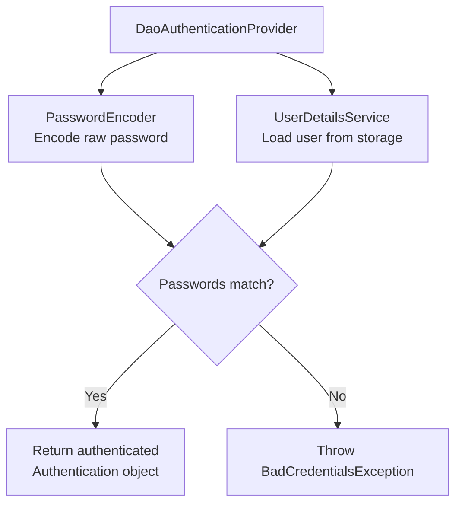
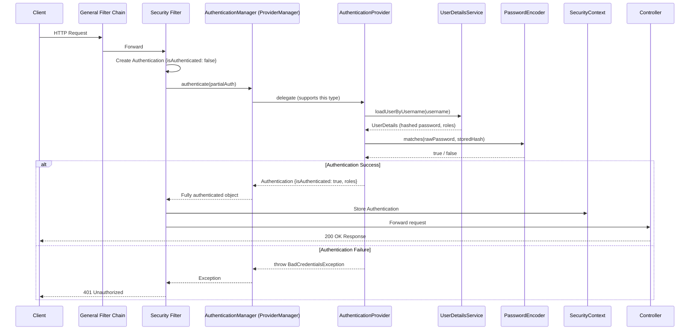
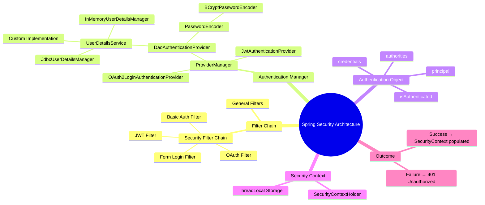
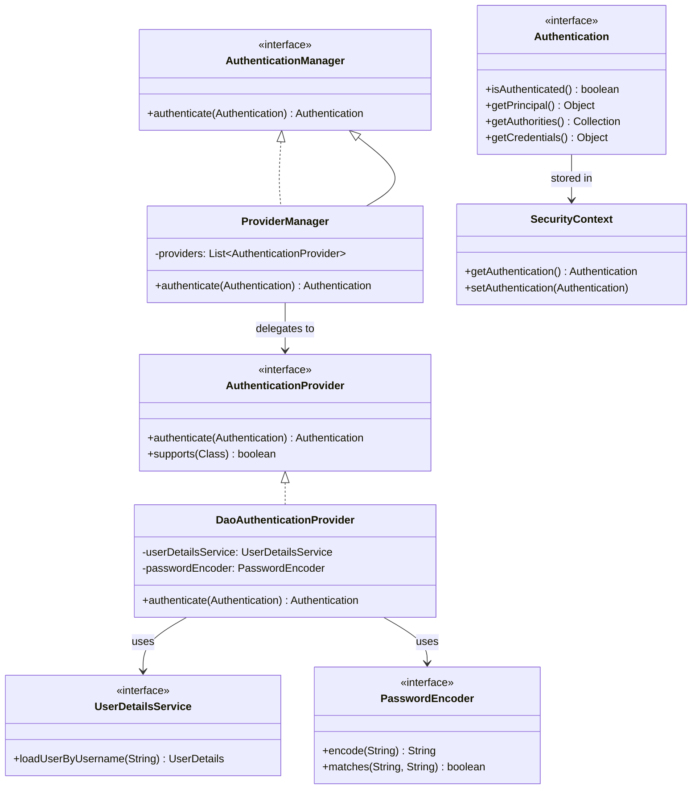
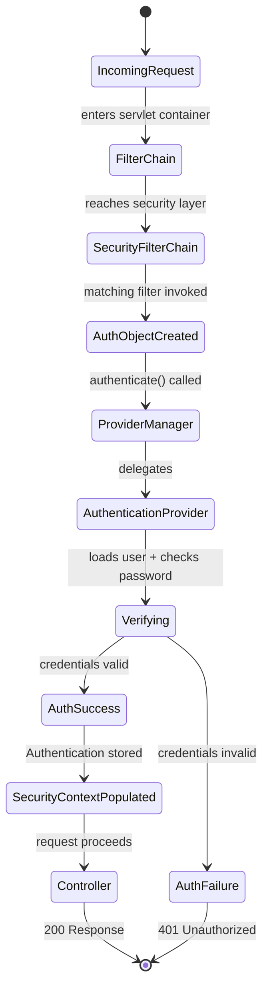

# 📌 Spring Boot Security — Architecture Deep Dive

> A complete, professional study guide based on the "Concept and Coding" Spring Boot Security lecture series — Part 1: Architecture.

---

## Table of Contents

1. [Prerequisites](#1-prerequisites)
2. [Authentication vs Authorization](#2-authentication-vs-authorization)
3. [Where Spring Security Fits — The Filter Chain](#3-where-spring-security-fits--the-filter-chain)
4. [Security Filter Chain](#4-security-filter-chain)
5. [Authentication Manager & Provider Manager](#5-authentication-manager--provider-manager)
6. [Authentication Providers](#6-authentication-providers)
7. [UserDetailsService & Password Encoding](#7-userdetailsservice--password-encoding)
8. [The Authentication Object](#8-the-authentication-object)
9. [Security Context](#9-security-context)
10. [Full Request Flow — End to End](#10-full-request-flow--end-to-end)
11. [Architecture as a Template for Each Auth Method](#11-architecture-as-a-template-for-each-auth-method)
12. [Setting Up Spring Security — Dependencies](#12-setting-up-spring-security--dependencies)
13. [Diagrams](#13-diagrams)
14. [Key Observations](#14-key-observations)
15. [Common Mistakes](#15-common-mistakes)
16. [Best Practices](#16-best-practices)
17. [Interview Notes](#17-interview-notes)
18. [Comparison Tables](#18-comparison-tables)
19. [Practice Questions](#19-practice-questions)
20. [Summary](#20-summary)

---

## 1. Prerequisites

### What You Should Know Before This Topic

Before studying Spring Boot Security architecture, you should be familiar with:

- **Java Servlet Filters** — what they are, how they intercept HTTP requests, and how the filter chain works.
- **Dispatcher Servlet** — how Spring MVC routes requests through the servlet.
- **Spring Interceptors** — how they differ from filters and where they sit.
- **Common Web Security Attacks** — CSRF, XSS, SQL Injection. Understanding *why* we need security makes the architecture more meaningful.

### Quick Recap: The Standard Spring MVC Request Flow (No Security)

```
HTTP Request
     ↓
Servlet Container (e.g., Tomcat)
     ↓
Filter Chain (Filter 1 → Filter 2 → ... → Filter N)
     ↓
Dispatcher Servlet
     ↓
Interceptors (Pre-handle)
     ↓
Controller (your API / business logic)
     ↓
Interceptors (Post-handle)
     ↓
HTTP Response
```

Spring Security **does not replace** this flow. It **integrates into** the existing Filter Chain.

---

## 2. Authentication vs Authorization

### Overview

These are the two foundational pillars of any security system. They are often confused but serve entirely different purposes.

### Authentication

> **Authentication** = *Verify WHO you are.*

The process of confirming the identity of a user or system. A user proves their identity, typically by providing credentials like a username and password.

**Example:** You enter your username `john@example.com` and password `secret123`. The system verifies these match a known user. If they do — you are **authenticated**.

### Authorization

> **Authorization** = *Check WHAT you are allowed to do.*

Even after a user is authenticated (we know who they are), we must determine what resources or actions they are permitted to access.

**Example:** John is authenticated. But John has the role `VIEWER` — he can read articles but cannot publish or delete them. That restriction is **authorization**.

### Key Distinction

| Concept | Question Answered | When It Happens | Example |
|---------|------------------|-----------------|---------|
| Authentication | Who are you? | First — on login | Username + password check |
| Authorization | What can you do? | After authentication | Role-based access control |

> [!IMPORTANT]
> A user can be **authenticated but not authorized** for a specific action. For example, a logged-in user attempting to access an admin-only page will pass authentication but fail authorization.

### Real-World Analogy

Think of entering a corporate office building:

- **Authentication** = Showing your employee ID badge at the front desk. Security confirms you work there.
- **Authorization** = Your ID badge only unlocks the floors you're assigned to. The executive floor requires a higher clearance.

---

## 3. Where Spring Security Fits — The Filter Chain

### The Filter Chain Without Spring Security

Before Spring Security is introduced, a typical Spring Boot app has a filter chain that requests pass through sequentially:

```
Servlet Container
     ↓
Filter 1 (e.g., Logging Filter)
     ↓
Filter 2 (e.g., CORS Filter)
     ↓
Filter N
     ↓
Dispatcher Servlet
     ↓
Controller
```

### Adding Spring Security to the Filter Chain

When you add `spring-boot-starter-security` as a dependency, Spring Security **inserts a Security Filter Chain** into the existing filter chain. It does not create a parallel system — it plugs into the existing one.

```
Servlet Container
     ↓
Filter 1
     ↓
Filter 2
     ↓
[Security Filter Chain] ← injected by Spring Security
     ↓
Filter N
     ↓
Dispatcher Servlet
     ↓
Controller
```

> [!NOTE]
> The Security Filter Chain is not a single filter. It is itself a **chain of multiple security-specific filters**, each responsible for a different aspect of security (authentication type handling, CSRF, session management, etc.).

---

## 4. Security Filter Chain

### What It Is

The Security Filter Chain is a sequence of security filters that Spring Boot automatically adds to your application's filter pipeline when Spring Security is enabled. Each filter in this chain handles a specific security concern.

### Authentication-Method-Specific Filters

Spring Security ships with filters for every major authentication mechanism. However, **not all filters are active for every request** — only the filters relevant to the authentication method you have configured are invoked.

| Authentication Method | Example Active Filters |
|----------------------|----------------------|
| Form-based login | `UsernamePasswordAuthenticationFilter` |
| Basic Authentication | `BasicAuthenticationFilter` |
| JWT (Stateless) | Custom `JwtAuthenticationFilter` |
| OAuth 2.0 | `OAuth2LoginAuthenticationFilter` |

> [!IMPORTANT]
> If you configure Basic Authentication, filters for Form Login and JWT are **skipped**. Each request only passes through the filters relevant to the chosen authentication method. This is by design — it avoids unnecessary processing.

### How Spring Boot Decides Which Filter to Invoke

Spring Security evaluates incoming requests and routes them through the appropriate filter based on your security configuration (e.g., `SecurityFilterChain` bean definition). You declare which filters are active via your configuration, and Spring Security respects that during runtime.

### Conceptual Visualization

```
Security Filter Chain
┌────────────────────────────────────────────┐
│  UsernamePasswordAuthenticationFilter      │ ← Form Login only
│  BasicAuthenticationFilter                 │ ← Basic Auth only
│  BearerTokenAuthenticationFilter (JWT)     │ ← JWT only
│  OAuth2LoginAuthenticationFilter           │ ← OAuth only
│  CsrfFilter                               │ ← Active for stateful
│  SessionManagementFilter                   │ ← Stateful sessions
│  ExceptionTranslationFilter                │ ← Always active
│  FilterSecurityInterceptor                 │ ← Authorization
└────────────────────────────────────────────┘
```

> [!NOTE]
> We will explore each filter in detail when covering individual authentication methods (Form Login, Basic Auth, JWT, OAuth). For now, understand the structure.

---

## 5. Authentication Manager & Provider Manager

### The Flow After the Filter

Once a security filter has intercepted the request and identified it as needing authentication, it doesn't perform the authentication itself. Instead, it delegates to the **Authentication Manager**.

```
Security Filter
     ↓
Creates (partially populated) Authentication object
     ↓
Passes to AuthenticationManager.authenticate(Authentication)
```

### AuthenticationManager (Interface)

`AuthenticationManager` is a **Spring Security interface** with a single method:

```java
public interface AuthenticationManager {
    Authentication authenticate(Authentication authentication)
        throws AuthenticationException;
}
```

It receives a partially-populated `Authentication` object (credentials provided, but `isAuthenticated = false`) and returns a fully-populated one (with roles, and `isAuthenticated = true`) — or throws an exception if authentication fails.

### ProviderManager (Default Implementation)

`ProviderManager` is the **default implementation** of `AuthenticationManager`. Its role is to act as a **bridge** between the security filter and the correct `AuthenticationProvider`.

```java
// Conceptual internal behavior of ProviderManager
for (AuthenticationProvider provider : providers) {
    if (provider.supports(authentication.getClass())) {
        return provider.authenticate(authentication);
    }
}
throw new ProviderNotFoundException("No provider found");
```

It iterates through a list of registered `AuthenticationProvider` implementations and delegates to the one that **supports** the type of `Authentication` object received.

> [!TIP]
> `ProviderManager` can have a **parent** `AuthenticationManager`. If no provider in the current list can handle the authentication, it delegates to the parent. This supports hierarchical security configurations.

### The Bridge Role of ProviderManager

```
Filter (knows: "this is a Form Login request")
     ↓ creates Authentication object
ProviderManager (knows: "Form Login → DaoAuthenticationProvider")
     ↓ delegates to correct provider
DaoAuthenticationProvider (actually performs the verification)
```

---

## 6. Authentication Providers

### What is an AuthenticationProvider?

An `AuthenticationProvider` is the component that **actually performs** the authentication logic. It knows how to verify a specific type of credential.

```java
public interface AuthenticationProvider {
    Authentication authenticate(Authentication authentication)
        throws AuthenticationException;

    boolean supports(Class<?> authentication);
}
```

- `supports()` — tells `ProviderManager` whether this provider can handle the given `Authentication` type.
- `authenticate()` — performs the actual credential verification and returns a fully authenticated `Authentication` object.

### Common Providers and Their Roles

| Provider | Authentication Method | What It Does |
|---------|----------------------|-------------|
| `DaoAuthenticationProvider` | Username/Password (Form, Basic) | Verifies password hash, loads user from DB |
| `JwtAuthenticationProvider` | JWT (Stateless) | Validates JWT token signature and claims |
| `OAuth2LoginAuthenticationProvider` | OAuth 2.0 | Handles OAuth authorization code exchange |

### DaoAuthenticationProvider (Most Common)

Used for **username/password-based** authentication (both form login and basic auth). It:

1. Takes the raw password from the incoming request.
2. Encodes it using the configured `PasswordEncoder`.
3. Loads the stored user details using `UserDetailsService`.
4. Compares the encoded incoming password against the stored encoded password.
5. Returns a fully authenticated `Authentication` object if they match.



---

## 7. UserDetailsService & Password Encoding

### UserDetailsService (Interface)

`UserDetailsService` is the interface responsible for **loading user data** from a storage system. `DaoAuthenticationProvider` calls it to retrieve the stored user (including their hashed password and roles).

```java
public interface UserDetailsService {
    UserDetails loadUserByUsername(String username)
        throws UsernameNotFoundException;
}
```

It returns a `UserDetails` object containing:
- Username
- Password (stored as a hash)
- Granted authorities (roles/permissions)
- Account status flags (expired, locked, enabled)

### Two Built-in Implementations

| Implementation | Storage | Use Case |
|---------------|---------|----------|
| `InMemoryUserDetailsManager` | Application memory (in-memory) | Development, testing, demos |
| `JdbcUserDetailsManager` | Relational database (via JDBC) | Production applications |

> [!WARNING]
> `InMemoryUserDetailsManager` stores users only while the application is running. All user data is lost on restart. **Never use it for production.**

### Custom Implementation (Most Common in Production)

In real-world Spring Boot apps, you typically write your own `UserDetailsService` implementation that loads users from a custom JPA repository:

```java
@Service
public class CustomUserDetailsService implements UserDetailsService {

    @Autowired
    private UserRepository userRepository;

    @Override
    public UserDetails loadUserByUsername(String username)
            throws UsernameNotFoundException {
        User user = userRepository.findByUsername(username)
            .orElseThrow(() ->
                new UsernameNotFoundException("User not found: " + username));

        return org.springframework.security.core.userdetails.User
            .withUsername(user.getUsername())
            .password(user.getPassword()) // already hashed
            .roles(user.getRole())
            .build();
    }
}
```

### Password Encoding

> [!IMPORTANT]
> Passwords must **never** be stored in plain text. Spring Security enforces this by requiring a `PasswordEncoder` in all authentication configurations.

The most commonly used encoder is `BCryptPasswordEncoder`:

```java
@Bean
public PasswordEncoder passwordEncoder() {
    return new BCryptPasswordEncoder();
}
```

#### How Password Encoding Works

**During Registration (storing the user):**
```
raw password: "secret123"
     ↓ BCryptPasswordEncoder.encode()
stored hash:  "$2a$10$EixZaYVK1fsbw1Zfbx3OXePaWxn96p36..."`
```

**During Login (verifying the user):**
```
incoming raw password: "secret123"
stored hash:           "$2a$10$EixZaYVK1fsbw1Zfbx3OX..."
     ↓ BCryptPasswordEncoder.matches(raw, hash)
result: true → authenticated ✅
```

> [!NOTE]
> BCrypt is a one-way hashing function. You cannot "decode" a hash to get the original password. Every time you encode the same password, a different hash is produced (due to a random salt). The `matches()` method handles this correctly.

---

## 8. The Authentication Object

### What Is It?

The `Authentication` interface is the central data object passed through the entire security pipeline — from filter → provider manager → provider → security context.

```java
public interface Authentication extends Principal, Serializable {
    Collection<? extends GrantedAuthority> getAuthorities();
    Object getCredentials();   // password / token
    Object getDetails();       // additional request info
    Object getPrincipal();     // the authenticated entity (username or UserDetails)
    boolean isAuthenticated();
    void setAuthenticated(boolean isAuthenticated);
}
```

### Lifecycle of the Authentication Object

| Stage | `isAuthenticated` | Contents |
|-------|------------------|----------|
| Created by Filter | `false` | Username + raw password (partial) |
| After `ProviderManager` delegates | `false` (still in progress) | Passed to provider |
| After `AuthenticationProvider` succeeds | `true` | Username, roles, no raw password |
| Stored in `SecurityContext` | `true` | Complete principal + authorities |

> [!NOTE]
> Once authentication succeeds, the raw password (credential) is typically **cleared** from the `Authentication` object for security reasons before it is stored in the `SecurityContext`.

### Example: Before and After Authentication

**Before (created by filter):**
```json
{
  "principal": "john@example.com",
  "credentials": "secret123",
  "authorities": [],
  "isAuthenticated": false
}
```

**After (returned by DaoAuthenticationProvider):**
```json
{
  "principal": { "username": "john@example.com", "roles": ["ROLE_USER"] },
  "credentials": null,
  "authorities": ["ROLE_USER"],
  "isAuthenticated": true
}
```

---

## 9. Security Context

### What Is It?

The `SecurityContext` is a **thread-local storage** that holds the `Authentication` object for the currently authenticated user, for the duration of a request.

```java
public interface SecurityContext extends Serializable {
    Authentication getAuthentication();
    void setAuthentication(Authentication authentication);
}
```

### SecurityContextHolder

The `SecurityContextHolder` is the mechanism through which the `SecurityContext` is stored and accessed. By default, it uses a `ThreadLocal` strategy — meaning each thread (each HTTP request) has its own isolated security context.

```java
// Accessing the current authenticated user anywhere in your app
Authentication auth = SecurityContextHolder.getContext().getAuthentication();
String username = auth.getName();
Collection<? extends GrantedAuthority> roles = auth.getAuthorities();
```

### What Happens After the Filter Stores the Authentication

Once the filter receives the fully authenticated `Authentication` object from `AuthenticationManager`:

1. It stores it in the `SecurityContext` via `SecurityContextHolder`.
2. The request continues through the filter chain → Dispatcher Servlet → Interceptors → Controller.
3. At every point in that chain, including your controller, the `SecurityContext` is accessible.

```java
// In your Controller — accessing authenticated user
@GetMapping("/profile")
public ResponseEntity<String> getProfile() {
    Authentication auth = SecurityContextHolder.getContext().getAuthentication();
    String username = auth.getName(); // "john@example.com"
    return ResponseEntity.ok("Hello, " + username);
}
```

### What Happens on Authentication Failure

If the `AuthenticationProvider` cannot verify the credentials, it throws `BadCredentialsException` (or another `AuthenticationException` subclass). The filter catches this and:

- Does **NOT** store anything in `SecurityContext`.
- Returns an appropriate HTTP error response (typically `401 Unauthorized`).

---

## 10. Full Request Flow — End to End

### Complete Architecture Flow

```
Incoming HTTP Request
         ↓
Servlet Container (Tomcat)
         ↓
General Filter Chain (Logging, CORS, etc.)
         ↓
Security Filter Chain
    ↓
    [Relevant Authentication Filter invoked]
    (e.g., BasicAuthenticationFilter / UsernamePasswordAuthenticationFilter)
         ↓
    Creates Authentication object { isAuthenticated: false }
         ↓
    AuthenticationManager.authenticate(authObject)
         ↓
    ProviderManager (bridge — selects appropriate provider)
         ↓
    AuthenticationProvider (e.g., DaoAuthenticationProvider)
         ├─→ PasswordEncoder (hash & compare password)
         └─→ UserDetailsService (load user from memory/DB)
         ↓
    Returns Authentication object { isAuthenticated: true, roles: [...] }
         ↓
    ProviderManager returns to Filter
         ↓
    ┌─────────────────────────────────────────┐
    │ Authentication Success?                  │
    │ YES → Store in SecurityContextHolder     │
    │ NO  → Throw BadCredentialsException (401)│
    └─────────────────────────────────────────┘
         ↓ (on success)
Dispatcher Servlet
         ↓
Interceptors
         ↓
Controller (SecurityContext accessible here)
         ↓
HTTP Response
```

---



---

## 11. Architecture as a Template for Each Auth Method

### The Base Architecture is Universal

The architecture described above is a **template** — a base pattern that applies to every authentication method Spring Security supports. Each method (Form Login, Basic Auth, JWT, OAuth) uses the same architecture but with **different components plugged in** at each stage.

### What Changes Per Authentication Method

| Stage | Form Login | Basic Auth | JWT | OAuth 2.0 |
|-------|-----------|-----------|-----|-----------|
| Filter | `UsernamePasswordAuthenticationFilter` | `BasicAuthenticationFilter` | Custom `JwtFilter` | `OAuth2LoginAuthenticationFilter` |
| Auth Object Created | `UsernamePasswordAuthenticationToken` | `UsernamePasswordAuthenticationToken` | `BearerTokenAuthenticationToken` | `OAuth2LoginAuthenticationToken` |
| Provider | `DaoAuthenticationProvider` | `DaoAuthenticationProvider` | `JwtAuthenticationProvider` | `OAuth2LoginAuthenticationProvider` |
| Extra Steps | Redirect to login page | Base64 decode header | Validate JWT signature & claims | Authorization code exchange |
| Session | Stateful (stores session) | Stateless | Stateless | Depends |
| SecurityContext stored? | Yes | Yes | Yes | Yes |

> [!NOTE]
> The diagram's core structure (filter → auth manager → provider → security context) stays the same for every method. Only the *specific implementations* at each stage change.

### What We'll Explore Per Authentication Method

For each authentication type covered in the series:
- Which specific **filter** gets invoked
- What the **`Authentication` object** looks like at each stage
- Which **provider** is delegated to
- What the provider **does internally**
- What gets stored in the **SecurityContext**
- How the **controller** uses the security context

---

## 12. Setting Up Spring Security — Dependencies

### Maven Dependencies

```xml
<!-- pom.xml -->

<!-- Required: Core Spring Security dependency -->
<!-- Provides: filter chain, authentication manager, providers, annotations -->
<dependency>
    <groupId>org.springframework.boot</groupId>
    <artifactId>spring-boot-starter-security</artifactId>
</dependency>

<!-- Optional: Only if you want DB-backed HTTP session storage -->
<!-- Required for: Stateful session-based auth with session stored in DB -->
<dependency>
    <groupId>org.springframework.session</groupId>
    <artifactId>spring-session-jdbc</artifactId>
</dependency>
```

### What `spring-boot-starter-security` Provides

Adding this single dependency gives you:

- The entire **Security Filter Chain** infrastructure
- `AuthenticationManager` and `ProviderManager`
- Default `AuthenticationProvider` implementations (`DaoAuthenticationProvider`, etc.)
- `UserDetailsService` interface + in-memory and JDBC implementations
- `PasswordEncoder` support (BCrypt, etc.)
- Auto-configured basic security (a generated password printed to console on startup)
- CSRF protection (enabled by default for stateful apps)
- Endpoint `/logout` (configured by default for form login)

### What `spring-session-jdbc` Provides

- Stores HTTP sessions in a relational database table.
- Allows session persistence across application restarts.
- Enables session sharing across multiple application instances (for clustered deployments).

> [!NOTE]
> `spring-session-jdbc` is **only needed for stateful (session-based) authentication** where you want sessions stored in the DB. For stateless authentication (JWT, OAuth), it is not needed.

### Setting Up via Spring Initializr

When creating a new project at [start.spring.io](https://start.spring.io):

1. Add **Spring Web** — for REST controllers and MVC.
2. Add **Spring Security** — for authentication/authorization infrastructure.
3. Optionally add **Spring Session JDBC** — only for DB-backed session storage.

### What Happens on First Run (Default Behavior)

Once `spring-boot-starter-security` is on the classpath with no custom configuration:

- All endpoints are **protected** (returns 401/redirect to login for unauthenticated requests).
- A **default login page** is served at `/login`.
- A **default user** `user` is created with a **randomly generated password** printed to the console:

```
Using generated security password: 3f7e9a2c-81b4-4d5a-9e12-a2f8c3d7e4b1
```

> [!TIP]
> This default behavior is great for verifying your security setup during development. You should always replace it with your own `UserDetailsService` and `SecurityFilterChain` configuration before going to production.

---

## 13. Diagrams

### Full Architecture Mind Map



### Component Relationship Diagram



### Request State Machine



---

## 14. Key Observations

- **Spring Security is filter-based.** It integrates into the existing Servlet filter chain — it does not replace it.
- **Not all security filters run for every request.** Only the filters matching the configured authentication method are invoked.
- **`AuthenticationManager` is an interface.** `ProviderManager` is its default implementation and acts as a bridge between filters and providers.
- **`AuthenticationProvider` does the actual work.** `ProviderManager` just routes to the right one.
- **The `Authentication` object travels the pipeline.** It starts partial (`isAuthenticated = false`) and ends complete (`isAuthenticated = true`) — or an exception is thrown.
- **Security context is thread-local.** Each request thread has its own security context, keeping users isolated.
- **Passwords must always be hashed.** Spring Security enforces use of `PasswordEncoder` and never compares raw passwords.
- **This architecture is a template.** Form Login, Basic Auth, JWT, and OAuth all follow the same base structure with different components swapped in.
- **`spring-session-jdbc` is optional** and only needed for database-persisted HTTP sessions (stateful auth).

---

## 15. Common Mistakes

### Mistake 1: Confusing Authentication and Authorization

```
// ❌ Wrong thinking:
"The user is blocked — must be an authentication error"
// Could be an authorization error (user authenticated but lacks permission)
```

**Fix:** Check the HTTP status code — `401 Unauthorized` = authentication failure. `403 Forbidden` = authorization failure.

---

### Mistake 2: Assuming all security filters run for every request

```
// ❌ Wrong assumption:
"Every request runs through ALL security filters"
```

**Fix:** Only the filter(s) matching your configured authentication method are invoked per request.

---

### Mistake 3: Storing raw passwords

```java
// ❌ Never do this
user.setPassword(rawPassword); // storing plain text
userRepo.save(user);
```

```java
// ✅ Always encode
user.setPassword(passwordEncoder.encode(rawPassword));
userRepo.save(user);
```

---

### Mistake 4: Not understanding that `SecurityContext` is thread-local

```java
// ❌ Dangerous: sharing security context across threads without care
CompletableFuture.runAsync(() -> {
    // SecurityContextHolder may be empty here in a new thread!
    Authentication auth = SecurityContextHolder.getContext().getAuthentication();
});
```

**Fix:** Use `SecurityContextHolder.setStrategyName(SecurityContextHolder.MODE_INHERITABLETHREADLOCAL)` or explicitly pass the `Authentication` object when using async operations.

---

### Mistake 5: Skipping security architecture study and jumping to implementation

Understanding the full flow (filter → auth manager → provider → security context) prevents confusion when debugging authentication issues in production.

---

## 16. Best Practices

1. **Always implement a custom `UserDetailsService`** backed by your own user repository for production apps.

2. **Always use `BCryptPasswordEncoder`** (or `Argon2PasswordEncoder` for even stronger security) — never plain text or MD5.

3. **Follow the principle of least privilege for authorization** — grant only the permissions each role genuinely needs.

4. **Keep the `Authentication` object clean** — after authentication, credentials (raw password/token) should be cleared. Spring Security does this automatically for most providers.

5. **Do not hardcode credentials** in `application.properties` for production. Use environment variables or a secrets manager (e.g., AWS Secrets Manager, HashiCorp Vault).

6. **Understand stateful vs stateless early** — choose before designing your security configuration, as it affects session management, CSRF handling, and which providers/filters you need.

7. **Use `spring-session-jdbc` only when needed** — for horizontally-scaled apps requiring shared sessions across instances.

8. **Test your security configuration** with Spring Security's test utilities (`@WithMockUser`, `@WithUserDetails`, `MockMvc` security integration tests).

---

## 17. Interview Notes

### Commonly Asked Questions

**Q: What is the difference between authentication and authorization?**

Authentication verifies the identity of a user (who they are). Authorization determines what that authenticated user is allowed to do (what they can access or modify).

---

**Q: Where does Spring Security fit in the Spring Boot request lifecycle?**

Spring Security integrates into the Servlet filter chain as a `SecurityFilterChain`. It sits between the general filters and the Dispatcher Servlet. Requests must pass through the security filters before reaching controllers.

---

**Q: What is `ProviderManager` and what is its role?**

`ProviderManager` is the default implementation of `AuthenticationManager`. It acts as a bridge between security filters and `AuthenticationProvider` implementations. It iterates through registered providers, finds one that supports the given `Authentication` type, and delegates to it.

---

**Q: What is `UserDetailsService` and why is it needed?**

`UserDetailsService` is an interface with one method: `loadUserByUsername()`. It is used by `DaoAuthenticationProvider` to load stored user data (hashed password, roles) from a data source (in-memory, DB, or custom) so it can verify the incoming credentials.

---

**Q: What is the `Authentication` object and how does its state change during the request?**

`Authentication` is a Spring Security interface that holds identity information. It starts as a partial object with `isAuthenticated = false` (created by the filter). After `AuthenticationProvider` successfully verifies credentials, it is returned as a complete object with `isAuthenticated = true` and populated roles/authorities.

---

**Q: What is the `SecurityContext` and how is it accessed?**

`SecurityContext` stores the current `Authentication` object for the duration of a request. It is held in `SecurityContextHolder`, which uses a `ThreadLocal` strategy by default. It can be accessed anywhere in the application via `SecurityContextHolder.getContext().getAuthentication()`.

---

**Q: What HTTP status codes does Spring Security return on failure?**

- `401 Unauthorized` — authentication failed (bad credentials, missing token).
- `403 Forbidden` — authentication succeeded but authorization failed (insufficient role/permission).

---

**Q: Is `spring-session-jdbc` always required with Spring Security?**

No. It is only needed for stateful (session-based) authentication when you want sessions stored in a database. For stateless authentication (JWT, OAuth), it is not needed.

---

## 18. Comparison Tables

### Authentication Methods Supported by Spring Security

| Method | Stateful? | Filter Used | Provider Used | Best For |
|--------|----------|-------------|--------------|---------|
| Form Login | Yes | `UsernamePasswordAuthenticationFilter` | `DaoAuthenticationProvider` | Traditional web apps |
| Basic Auth | No | `BasicAuthenticationFilter` | `DaoAuthenticationProvider` | Simple APIs, internal services |
| JWT | No | Custom JWT Filter | Custom JWT Provider | REST APIs, SPAs, mobile |
| OAuth 2.0 | Depends | `OAuth2LoginAuthenticationFilter` | `OAuth2LoginAuthenticationProvider` | Social login, SSO |

### UserDetailsService Implementations

| Implementation | Storage | Persistence | Use Case |
|---------------|---------|------------|---------|
| `InMemoryUserDetailsManager` | JVM memory | None (lost on restart) | Development, testing |
| `JdbcUserDetailsManager` | Relational DB | Persistent | Simple production use |
| Custom (JPA-based) | Any (JPA/NoSQL/LDAP) | Persistent | Most real-world apps |

### `AuthenticationManager` vs `AuthenticationProvider`

| Aspect | AuthenticationManager | AuthenticationProvider |
|--------|----------------------|----------------------|
| Role | Routes to the right provider | Actually performs authentication |
| Implementation | `ProviderManager` (default) | `DaoAuthenticationProvider`, etc. |
| Knows about filters? | Yes (via delegation chain) | No |
| Knows about users? | No | Yes (via `UserDetailsService`) |
| Number per app | Typically one | Multiple (one per auth method) |

---

## 19. Practice Questions

### Easy

1. What is the difference between authentication and authorization? Give a real-world example of each.
2. What HTTP status code does Spring Security return when authentication fails? When authorization fails?
3. Where in the Spring request lifecycle does the Security Filter Chain sit?
4. Which class is the default implementation of `AuthenticationManager`?
5. What does `UserDetailsService.loadUserByUsername()` return?

### Medium

6. Trace the complete flow of an HTTP request from the client to the controller when Spring Security is configured with Basic Authentication.
7. Explain the lifecycle of the `Authentication` object from creation to storage in `SecurityContext`.
8. What is the role of `ProviderManager`? Why is it called a "bridge"?
9. Why is `spring-session-jdbc` not always required with Spring Security?
10. What happens internally in `DaoAuthenticationProvider` when a user logs in with username and password?

### Hard

11. A user is successfully authenticated (confirmed by logs) but receives a `403 Forbidden` response when accessing `/admin`. What is the most likely cause and how would you investigate?
12. Explain why not all security filters run for every request. How does Spring Security decide which filters to invoke?
13. Your application is deployed across three instances behind a load balancer using stateful session authentication. A user logs in on Instance A but their next request goes to Instance B, which doesn't know about the session. How does `spring-session-jdbc` solve this?
14. A developer stores user passwords as plain text in the database. Explain all the security risks this introduces and how Spring Security's `PasswordEncoder` + BCrypt mitigates them.
15. How would the base security architecture diagram change for JWT authentication compared to form-based login? Which components would be the same, and which would be different?

---

## 20. Summary

> **Revision Bullets**

- **Authentication** = verifying identity ("who are you?"). **Authorization** = checking permissions ("what can you do?").
- Spring Security integrates into the **existing Servlet filter chain** — it does not replace it.
- The **Security Filter Chain** is a set of security-specific filters added to the app when Spring Security is enabled.
- **Not all security filters run for each request** — only the filter(s) for the configured auth method are invoked.
- The **`Authentication` object** travels through the pipeline: partial (filter) → fully authenticated (provider) → stored (security context).
- **`AuthenticationManager`** is an interface. **`ProviderManager`** is its default implementation — a bridge between filters and providers.
- **`AuthenticationProvider`** performs the actual credential verification (e.g., `DaoAuthenticationProvider` for username/password).
- **`UserDetailsService`** loads stored user data. Built-in: `InMemoryUserDetailsManager`, `JdbcUserDetailsManager`. Typically: custom JPA implementation.
- **Passwords are always hashed** — never stored or compared as plain text. `BCryptPasswordEncoder` is the standard choice.
- On success: `Authentication` stored in **`SecurityContextHolder`** (thread-local). On failure: `401 Unauthorized` thrown.
- The **`SecurityContext`** is accessible throughout the request lifecycle, including in controllers.
- This architecture is a **base template** — each auth method (Form Login, Basic Auth, JWT, OAuth) uses the same structure with different components.
- **`spring-boot-starter-security`** provides the entire infrastructure. **`spring-session-jdbc`** is optional and only needed for DB-backed stateful sessions.

---

*Study guide generated from the "Concept and Coding" Spring Boot Security lecture series — Part 1: Architecture.*
