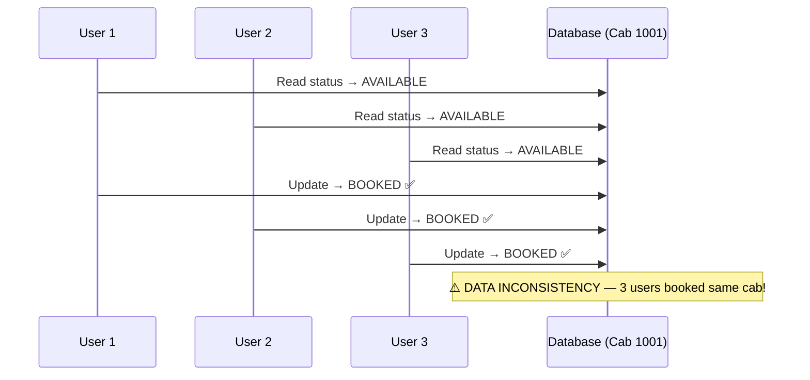
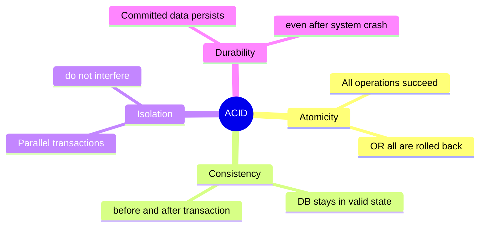
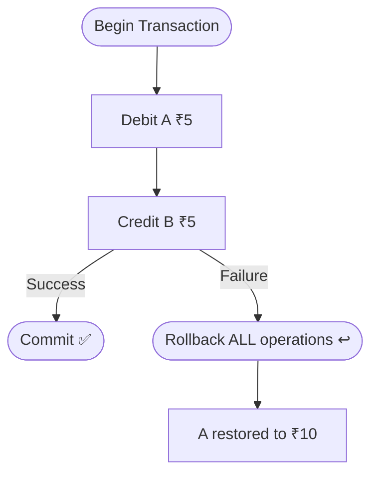
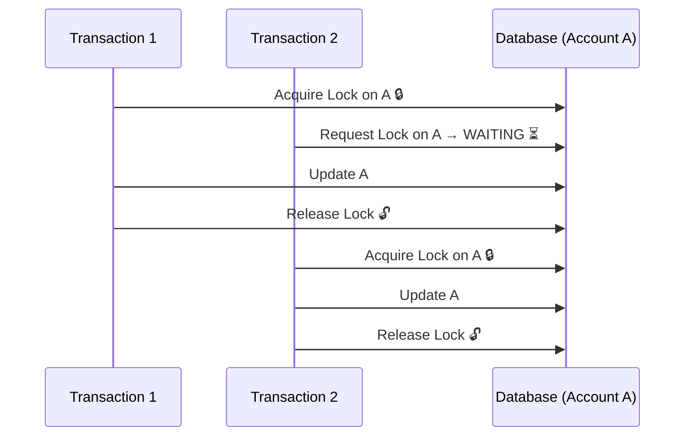
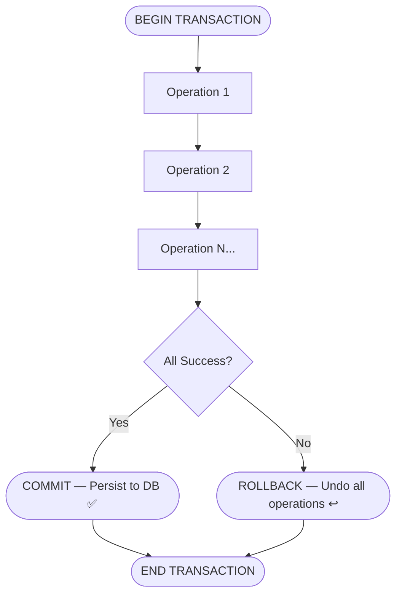
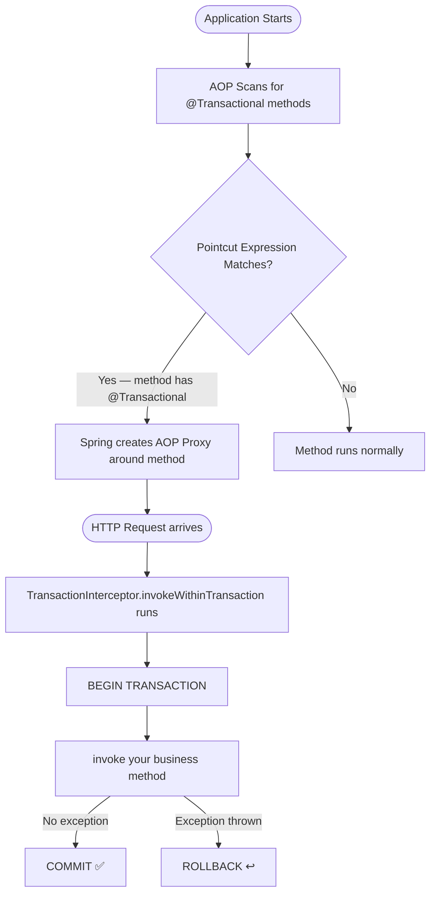
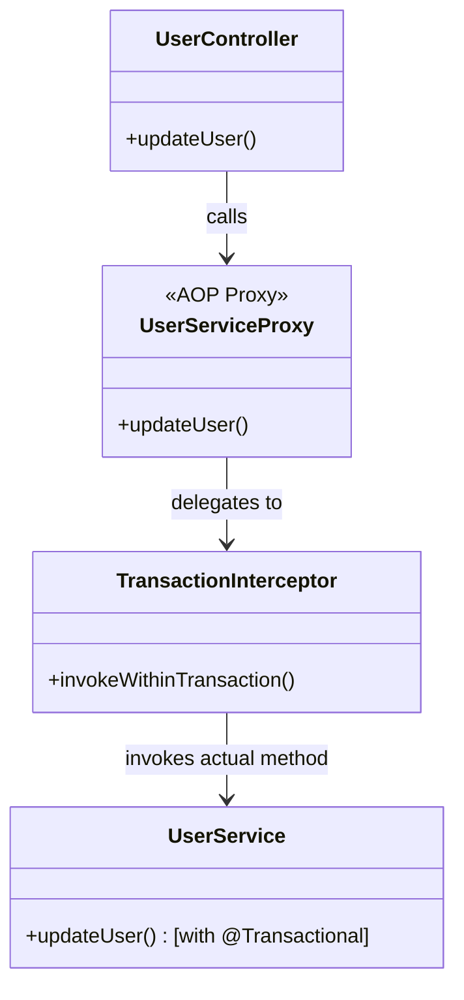
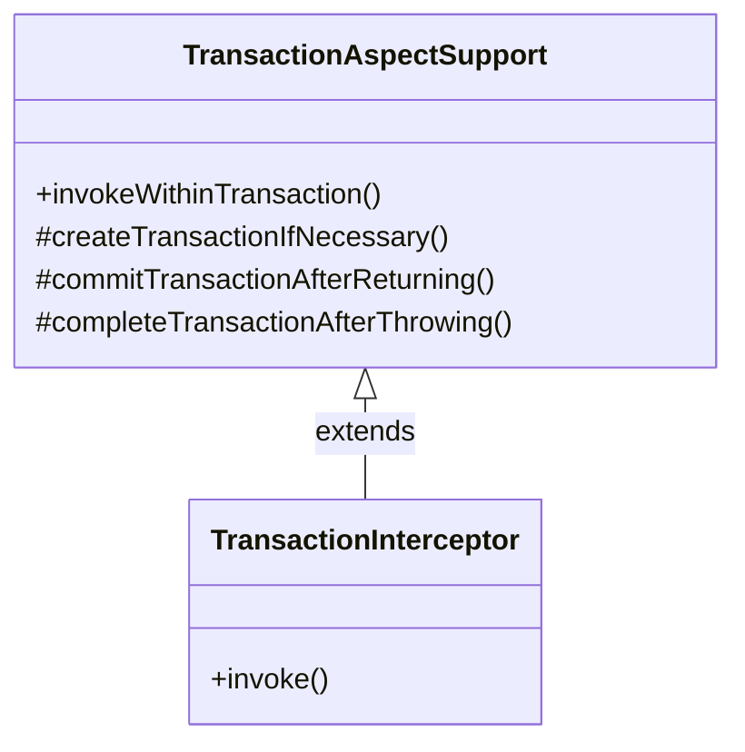
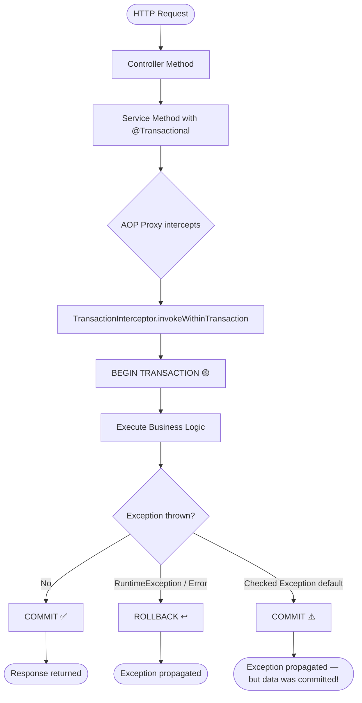

# 📌 Spring Boot `@Transactional` Annotation — Complete Study Guide

> **Course:** Spring Boot Series  
> **Instructor:** Shreyansh  
> **Prerequisites:** Spring Boot AOP, Concurrency Control Basics

---

## Table of Contents

1. [Prerequisites](#prerequisites)
2. [Critical Section](#critical-section)
3. [ACID Properties](#acid-properties)
4. [What Is a Transaction?](#what-is-a-transaction)
5. [The Problem Without Transactions](#the-problem-without-transactions)
6. [The @Transactional Annotation](#the-transactional-annotation)
7. [Dependencies & Setup](#dependencies--setup)
8. [How @Transactional Works Internally (AOP)](#how-transactional-works-internally-aop)
9. [Practical Code Examples](#practical-code-examples)
10. [Transaction Lifecycle Flowchart](#transaction-lifecycle-flowchart)
11. [Key Observations](#key-observations)
12. [Common Mistakes](#common-mistakes)
13. [Best Practices](#best-practices)
14. [Interview Notes](#interview-notes)
15. [Topics Coming Next](#topics-coming-next)
16. [Summary](#summary)

---

## Prerequisites

Before studying `@Transactional`, you must understand two foundational concepts:

| Prerequisite | Why It Matters |
|---|---|
| **Concurrency Control** | Explains what happens when multiple threads/requests access shared resources simultaneously |
| **Spring Boot AOP (Aspect-Oriented Programming)** | `@Transactional` is implemented using AOP under the hood — without AOP knowledge, the internal workings will not make sense |

> [!IMPORTANT]
> Understanding **Pointcut**, **Advice**, **Join Point**, and **Around Advice** from AOP is mandatory before going further. The `@Transactional` annotation relies entirely on these AOP concepts to function.

---

## Critical Section

### Overview

Before understanding transactions, you must understand the **Critical Section** — the core problem that transactions are designed to solve.

### Definition

> A **Critical Section** is a code segment where shared resources are being accessed and modified.

### Real-World Analogy

Imagine a cab (taxi) in a ride-booking application.

- The cab has `ID: 1001`
- Its current `status: AVAILABLE`

This cab record in the database is a **shared resource**. Any code that reads and updates this record is a **critical section**.

### The Problem — Data Inconsistency

Consider **4 users** trying to book the same cab in parallel:

```
User 1 → reads cab 1001 → status = AVAILABLE → books it → "Car is booked!"
User 2 → reads cab 1001 → status = AVAILABLE → books it → "Car is booked!"
User 3 → reads cab 1001 → status = AVAILABLE → books it → "Car is booked!"
User 4 → reads cab 1001 → status = AVAILABLE → books it → "Car is booked!"
```

**All 4 users get a booking confirmation for the same cab!** This is **data inconsistency**, and it happens because the critical section is not properly handled when multiple requests execute in parallel.



### Solution

The solution is the proper use of **Transactions**, which provide the **ACID properties** to prevent such inconsistencies.

---

## ACID Properties

Transactions guarantee the **ACID** properties — a set of four rules that ensure data integrity.



---

### A — Atomicity

**Definition:** In a transaction, if **any single operation fails**, the **entire transaction is rolled back**. All operations are treated as a single atomic unit — either all succeed or none do.

#### Example

Suppose Account A has ₹10 and Account B has ₹20. A transaction transfers ₹5 from A to B:

| Step | Operation | Result |
|---|---|---|
| Operation 1 | Debit A by ₹5 | A = ₹5 ✅ |
| Operation 2 | Credit B by ₹5 | ❌ FAILED |

Without atomicity: A = ₹5, B = ₹20 → **₹5 has vanished from the system!**

With atomicity: Operation 1 is also **rolled back** → A = ₹10, B = ₹20 → System is consistent again.



---

### C — Consistency

**Definition:** Before **and** after a transaction, the database must be in a **consistent (valid) state**. There must be no partially applied changes.

#### Example

- **Before Transaction:** A = ₹10, B = ₹20 → Total = ₹30 ✅ (consistent)
- **After Successful Transaction:** A = ₹5, B = ₹25 → Total = ₹30 ✅ (consistent)
- **After Failed + Rolled-Back Transaction:** A = ₹10, B = ₹20 → Total = ₹30 ✅ (consistent)
- **Inconsistent State (no rollback):** A = ₹5, B = ₹20 → Total = ₹25 ❌ (₹5 missing!)

Atomicity **leads to** Consistency. They are directly linked.

---

### I — Isolation

**Definition:** Even if multiple transactions run **in parallel**, they must not **interfere** with each other. Each transaction behaves as though it is running **in isolation**, unaware of other concurrent transactions.

#### How It Works Internally

Transactions use **locking** mechanisms to serialize access to shared data:

- Transaction 1 wants to update Account A → **acquires a lock** on A
- Transaction 2 also wants to update Account A → **waits** for the lock
- Once Transaction 1 releases the lock → Transaction 2 proceeds



> [!NOTE]
> From the **outside world**, it appears all transactions run in parallel. Internally, transactions are **serialized** through locking to prevent interference.

---

### D — Durability

**Definition:** Once a transaction is **committed**, the data is **permanently persisted**. Even if the system crashes immediately after commit, the data must not be lost.

This is typically achieved through **write-ahead logging (WAL)** or similar mechanisms at the database level.

---

### ACID Summary Table

| Property | Question It Answers | Guarantee |
|---|---|---|
| **Atomicity** | What if one operation fails? | All operations rollback |
| **Consistency** | Is the DB always valid? | DB state is always consistent |
| **Isolation** | Do parallel transactions interfere? | Each transaction runs independently |
| **Durability** | Is committed data safe? | Data persists even after crashes |

> [!IMPORTANT]
> Financial applications (banking, payment gateways, e-commerce) almost exclusively use databases that provide ACID guarantees — such as **PostgreSQL**, **MySQL**, **Oracle**, etc.

---

## What Is a Transaction?

### Definition

A **Transaction** is a sequence of database operations that are treated as a single unit of work. All operations in a transaction either **succeed together** (commit) or **fail together** (rollback).

### Transaction Lifecycle



### Manual Transaction Code (Without Spring Boot)

In raw Java/JDBC, you would write this manually for **every** database method:

```java
// Pseudocode — raw transaction management
connection.setAutoCommit(false);  // BEGIN TRANSACTION

try {
    // Operation 1: Debit A
    debitFromA(connection, 5);

    // Operation 2: Credit B
    creditToB(connection, 5);

    connection.commit();  // ALL SUCCESS → COMMIT
} catch (Exception e) {
    connection.rollback();  // ANY FAILURE → ROLLBACK
} finally {
    connection.setAutoCommit(true);  // END TRANSACTION
}
```

### The Problem With Manual Transaction Management

Imagine you have **1000 methods** that touch the database:

```java
updateUser(...)          // Touches DB
updateBulkUsers(...)     // Touches DB
updateUserById(...)      // Touches DB
updateUserByEmail(...)   // Touches DB
// ... 996 more methods
```

Each of these needs the **same boilerplate**:

```java
BEGIN TRANSACTION
  // your actual business logic
IF all success → COMMIT
ELSE → ROLLBACK
END TRANSACTION
```

This is:
- **Duplicate code** repeated in every single method
- **Error-prone** — easy to forget in one method
- **Hard to maintain** — if the pattern changes, you update 1000 places
- **Pollutes business logic** with infrastructure concerns

**Your actual business logic is just this:**

```java
debitFromA(5);
creditToB(5);
```

**Everything else is verbose boilerplate.** This is exactly the problem `@Transactional` solves.

---

## The `@Transactional` Annotation

### Overview

`@Transactional` is a Spring Boot annotation that **automatically manages transactions** for you. By simply annotating a method (or class), Spring Boot handles `begin`, `commit`, and `rollback` — eliminating all the boilerplate.

### Import

```java
import org.springframework.transaction.annotation.Transactional;
```

> [!NOTE]
> The `@Transactional` annotation from `org.springframework.transaction.annotation.Transactional` is the recommended one for Spring Boot applications. There is also `javax.transaction.Transactional` (JEE), but the Spring one provides more configuration options.

### Basic Syntax

```java
@Transactional
public void updateUser(User user) {
    // Your business logic only
    // Spring handles begin, commit, rollback automatically
    userRepository.save(user);
}
```

### Class-Level vs Method-Level

| Level | Syntax | Effect |
|---|---|---|
| **Method Level** | `@Transactional` on a method | Applies only to that specific method |
| **Class Level** | `@Transactional` on a class | Applies to **all public methods** in the class |

> [!CAUTION]
> When `@Transactional` is applied at the **class level**, it does **NOT** apply to **private methods**. Only public methods are intercepted by the AOP proxy.

```java
// Class-level — all public methods get transaction management
@Transactional
@Service
public class UserService {

    public void updateUser(User user) { ... }    // ✅ Transactional
    public void deleteUser(Long id) { ... }      // ✅ Transactional
    private void helperMethod() { ... }          // ❌ NOT Transactional
}
```

```java
// Method-level — only annotated method gets transaction management
@Service
public class UserService {

    @Transactional
    public void updateUser(User user) { ... }    // ✅ Transactional

    public void readUser(Long id) { ... }        // ❌ NOT Transactional
}
```

---

## Dependencies & Setup

### Required Dependencies (pom.xml)

#### Dependency 1 — Spring Data JPA (for relational databases)

```xml
<dependency>
    <groupId>org.springframework.boot</groupId>
    <artifactId>spring-boot-starter-data-jpa</artifactId>
</dependency>
```

> [!NOTE]
> This dependency provides the `@Transactional` annotation for **relational databases** (MySQL, PostgreSQL, H2, etc.). If you are using a **NoSQL database** (MongoDB, Cassandra, etc.) that supports transactions, the dependency will differ — check the Spring Boot documentation for the correct starter.

#### Dependency 2 — Database Driver

You must also include the driver for your specific database. Example for **MySQL**:

```xml
<dependency>
    <groupId>com.mysql</groupId>
    <artifactId>mysql-connector-j</artifactId>
    <scope>runtime</scope>
</dependency>
```

For **H2 (in-memory, for testing)**:

```xml
<dependency>
    <groupId>com.h2database</groupId>
    <artifactId>h2</artifactId>
    <scope>runtime</scope>
</dependency>
```

### application.properties Configuration

```properties
spring.datasource.url=jdbc:mysql://localhost:3306/mydb
spring.datasource.username=root
spring.datasource.password=yourpassword
spring.jpa.hibernate.ddl-auto=update
```

> [!NOTE]
> The exact properties depend on your database. Refer to Spring Boot documentation for the specific database driver and connection properties. These will be covered in depth in the next topic after `@Transactional`.

### Optional — @EnableTransactionManagement

In your main Spring Boot application class:

```java
@SpringBootApplication
@EnableTransactionManagement  // Optional — Spring Boot auto-configures this
public class MyApplication {
    public static void main(String[] args) {
        SpringApplication.run(MyApplication.class, args);
    }
}
```

> [!TIP]
> `@EnableTransactionManagement` is **optional** in Spring Boot because Spring Boot's **auto-configuration** adds it automatically. However, it is good practice to add it explicitly so that:
> - The intent is clear to other developers
> - If auto-configuration fails for any reason, transactions will still work
>
> Without `@EnableTransactionManagement`, methods annotated with `@Transactional` will be **ignored** and no transaction management will happen.

---

## How `@Transactional` Works Internally (AOP)

This is the most important section for deep understanding. Spring Boot's `@Transactional` is implemented using **AOP (Aspect-Oriented Programming)**.

### The Big Picture



### Step-by-Step Internal Mechanism

#### Step 1 — Application Startup: Pointcut Expression Matching

When the Spring Boot application starts, the AOP framework **scans all beans** and looks for methods annotated with `@Transactional`. The Pointcut expression used internally looks something like:

```java
@within(org.springframework.transaction.annotation.Transactional)
// OR
@annotation(org.springframework.transaction.annotation.Transactional)
```

This expression matches any class or method that carries the `@Transactional` annotation.

#### Step 2 — AOP Proxy Creation

Once a match is found, Spring **wraps the bean in an AOP proxy**. This proxy intercepts all calls to `@Transactional` methods.



#### Step 3 — The Advice: `TransactionInterceptor`

The **Advice** that runs is located inside the `TransactionInterceptor` class (which extends `TransactionAspectSupport`).

The key method is:

```java
// Inside TransactionInterceptor (Spring Framework source)
protected Object invokeWithinTransaction(Method method, Class<?> targetClass, 
                                          final InvocationCallback invocation) {
    // 1. Create / obtain a transaction
    TransactionInfo txInfo = createTransactionIfNecessary(...);
    
    Object retVal;
    try {
        // 2. Invoke YOUR method (the business logic)
        retVal = invocation.proceedWithInvocation();
        
    } catch (Throwable ex) {
        // 3. Exception occurred → ROLLBACK
        completeTransactionAfterThrowing(txInfo, ex);
        throw ex;
    } finally {
        cleanupTransactionInfo(txInfo);
    }
    
    // 4. No exception → COMMIT
    commitTransactionAfterReturning(txInfo);
    return retVal;
}
```

**This is the "magic" behind `@Transactional`** — the begin/commit/rollback logic exists here. It is not magic; it is simply hidden from you in the Spring framework's code.

#### Step 4 — Advice Type: Around Advice

The advice used by `@Transactional` is **Around Advice** — the most powerful type of AOP advice. Around advice:

- Runs **before** the method → begins transaction
- Invokes the **actual method** → your business logic executes
- Runs **after** the method → commits or rolls back based on outcome

| Advice Type | When It Runs | Used by @Transactional? |
|---|---|---|
| Before | Before the method | ❌ No |
| After | After the method (always) | ❌ No |
| AfterReturning | After successful return | ❌ No |
| AfterThrowing | After exception | ❌ No |
| **Around** | **Wraps the entire method** | ✅ **Yes** |

### Class Hierarchy



`TransactionInterceptor` extends `TransactionAspectSupport`. The `invokeWithinTransaction` method is defined in `TransactionAspectSupport` (the parent class) and called by `TransactionInterceptor`.

---

## Practical Code Examples

### Example 1 — Basic @Transactional (Happy Path)

#### Controller

```java
@RestController
@RequestMapping("/api")
public class UserController {

    @Autowired
    private UserService userService;

    @GetMapping("/update-user")  // Should be @PostMapping in production
    public String updateUser() {
        userService.updateUser();
        return "User updated successfully";
    }
}
```

#### Service

```java
@Component
public class UserService {

    @Autowired
    private UserRepository userRepository;

    @Transactional
    public void updateUser() {
        // Your business logic only — no begin/commit/rollback needed
        User user = userRepository.findById(1L).orElseThrow();
        user.setName("Updated Name");
        userRepository.save(user);

        // No exception → Spring will COMMIT automatically
    }
}
```

#### What Happens Internally

```
1. HTTP GET /api/update-user
2. UserController.updateUser() is called
3. userService.updateUser() is called
   └── But actually: UserServiceProxy.updateUser() is called (AOP Proxy)
4. TransactionInterceptor.invokeWithinTransaction() executes
5. BEGIN TRANSACTION
6. UserService.updateUser() (actual method) is invoked
7. DB operations execute successfully
8. No exception → COMMIT ✅
9. Response returned
```

**Output:**

```
User updated successfully
```

**Console logs (with transaction logging enabled):**

```
Creating new transaction with name [com.example.UserService.updateUser]
Opened new EntityManager [SessionImpl] for JPA transaction
Committing JPA transaction on EntityManager [SessionImpl]
```

---

### Example 2 — Exception Causes Rollback

#### Service

```java
@Component
public class UserService {

    @Transactional
    public void updateUser() {
        // Some DB operation
        userRepository.save(someUser);

        // Simulating a failure
        throw new RuntimeException("Something went wrong!");

        // Code after this never executes
        // The save above will be ROLLED BACK
    }
}
```

#### What Happens Internally

```
1. HTTP GET /api/update-user
2. TransactionInterceptor.invokeWithinTransaction() executes
3. BEGIN TRANSACTION
4. UserService.updateUser() invoked
5. userRepository.save(someUser) executes
6. RuntimeException thrown!
7. TransactionInterceptor catches the exception
8. completeTransactionAfterThrowing() called → ROLLBACK ↩️
9. The save from step 5 is undone
10. Exception propagates to caller
```

**Console logs:**

```
Creating new transaction with name [com.example.UserService.updateUser]
Opened new EntityManager [SessionImpl] for JPA transaction
Rolling back JPA transaction on EntityManager [SessionImpl]
```

> [!WARNING]
> By default, `@Transactional` only rolls back on **unchecked exceptions** (`RuntimeException` and its subclasses) and **Errors**. It does **NOT** roll back for **checked exceptions** unless explicitly configured with `rollbackFor`.
>
> ```java
> // To rollback on checked exceptions too:
> @Transactional(rollbackFor = Exception.class)
> public void updateUser() throws Exception { ... }
> ```

---

### Example 3 — Multiple Classes, No Duplicate Code

Without `@Transactional`, you'd write begin/commit/rollback in every method:

```java
// ❌ Without @Transactional — massive duplication
public class UserService {
    public void updateUser() {
        beginTransaction();
        try {
            // business logic
            commit();
        } catch (Exception e) {
            rollback();
        }
    }
}

public class EmployeeService {
    public void updateEmployee() {
        beginTransaction();
        try {
            // business logic
            commit();
        } catch (Exception e) {
            rollback();
        }
    }
}

public class OrderService {
    public void processOrder() {
        beginTransaction();
        try {
            // business logic
            commit();
        } catch (Exception e) {
            rollback();
        }
    }
}
```

With `@Transactional`:

```java
// ✅ With @Transactional — clean, DRY code
@Service
public class UserService {
    @Transactional
    public void updateUser() {
        // Just your business logic
    }
}

@Service
public class EmployeeService {
    @Transactional
    public void updateEmployee() {
        // Just your business logic
    }
}

@Service
public class OrderService {
    @Transactional
    public void processOrder() {
        // Just your business logic
    }
}
```

The boilerplate code exists **once** inside Spring's `TransactionInterceptor` — not in your code at all.

---

## Transaction Lifecycle Flowchart



> [!CAUTION]
> Notice that **checked exceptions do NOT trigger rollback by default**. This is a very common gotcha. If your service method throws a checked exception (e.g., `IOException`, custom checked exceptions), the transaction will **commit** even though an exception was thrown.

---

## Key Observations

1. **@Transactional is AOP-based** — it uses Around Advice via `TransactionInterceptor` to wrap your method with begin/commit/rollback logic.

2. **No magic** — all the transaction management code exists in Spring's source code (`TransactionInterceptor`, `TransactionAspectSupport`). It is just hidden from the developer.

3. **Class-level applies to all public methods** — private methods are not intercepted by the AOP proxy.

4. **Default rollback behavior** — only `RuntimeException` and `Error` trigger rollback. Checked exceptions do NOT unless you configure `rollbackFor`.

5. **@EnableTransactionManagement is optional** in Spring Boot — auto-configuration handles it. But if transaction management doesn't work, check if this annotation is missing.

6. **The annotation eliminates code duplication** — the boilerplate exists once in Spring Framework, not in your application code.

7. **Works with any Spring-managed bean** — `@Service`, `@Component`, `@Repository`, etc.

---

## Common Mistakes

### Mistake 1 — Forgetting `@EnableTransactionManagement` (in non-Boot projects)

```java
// ❌ Missing @EnableTransactionManagement in pure Spring (non-Boot) apps
@Configuration
public class AppConfig { }

// ✅ Correct
@Configuration
@EnableTransactionManagement
public class AppConfig { }
```

**Why it happens:** Developers assume Spring auto-configures everything. In pure Spring (without Spring Boot), it does not. In Spring Boot, it is auto-configured.

---

### Mistake 2 — Using `@Transactional` on Private Methods

```java
// ❌ @Transactional on private method — has NO effect
@Transactional
private void updateUser() {
    // This transaction annotation is IGNORED
}

// ✅ Must be public
@Transactional
public void updateUser() {
    // This works correctly
}
```

**Why it happens:** AOP proxies cannot intercept private methods. The proxy can only wrap public method calls.

---

### Mistake 3 — Self-Invocation Bypasses the Proxy

```java
@Service
public class UserService {

    public void processRequest() {
        // ❌ Calling @Transactional method from within the SAME class
        // This bypasses the AOP proxy — @Transactional has NO effect!
        this.updateUser();
    }

    @Transactional
    public void updateUser() {
        // Transaction does NOT start here when called via this.updateUser()
    }
}
```

**Why it happens:** The AOP proxy wraps the `UserService` bean. When code inside `UserService` calls `this.updateUser()`, it calls the **actual object** — not the proxy. The proxy is bypassed, and the transaction never starts.

**Fix:** Extract the method into a separate bean, or use `ApplicationContext` to get a reference to the proxy.

---

### Mistake 4 — Expecting Rollback on Checked Exceptions

```java
// ❌ Checked exception does NOT trigger rollback by default
@Transactional
public void updateUser() throws IOException {
    userRepository.save(user);
    throw new IOException("File not found");  // Transaction COMMITS despite this!
}

// ✅ Must explicitly configure rollback for checked exceptions
@Transactional(rollbackFor = IOException.class)
public void updateUser() throws IOException {
    userRepository.save(user);
    throw new IOException("File not found");  // Now properly ROLLBACK
}
```

---

## Best Practices

1. **Apply `@Transactional` at the service layer**, not the repository or controller layer. The service layer is where business transactions belong.

2. **Keep transactions short** — long-running transactions hold database locks, reducing throughput and potentially causing deadlocks.

3. **Use `@Transactional(readOnly = true)`** for read-only operations. This is a performance optimization hint that allows the database to skip dirty-checking.

   ```java
   @Transactional(readOnly = true)
   public User getUser(Long id) {
       return userRepository.findById(id).orElseThrow();
   }
   ```

4. **Never swallow exceptions** inside a `@Transactional` method — if you catch an exception and don't rethrow it, the transaction will commit even though an error occurred.

5. **Specify `rollbackFor` for checked exceptions** when your method can throw checked exceptions that should trigger a rollback.

6. **Be aware of self-invocation** — do not call `@Transactional` methods from within the same class using `this.methodName()`.

7. **Use declarative transactions (`@Transactional`)** over programmatic transactions unless you have very specific, fine-grained control needs.

---

## Interview Notes

> [!IMPORTANT]
> The following are commonly asked interview topics related to `@Transactional`.

### Q1: What is a Critical Section?

**Answer:** A critical section is a code segment where shared resources are accessed and modified. When multiple threads or requests access a critical section simultaneously without proper synchronization, data inconsistency can occur.

---

### Q2: What are ACID properties?

**Answer:**
- **Atomicity** — All operations in a transaction succeed or all are rolled back.
- **Consistency** — The database is in a valid state before and after the transaction.
- **Isolation** — Concurrent transactions do not interfere with each other.
- **Durability** — Committed data persists even after system failure.

---

### Q3: How does `@Transactional` work internally in Spring Boot?

**Answer:** `@Transactional` uses **AOP (Aspect-Oriented Programming)**. When the application starts, Spring's AOP framework scans for `@Transactional` methods using a Pointcut expression. A proxy is created around annotated beans. When a `@Transactional` method is called, the proxy delegates to `TransactionInterceptor.invokeWithinTransaction()`, which begins a transaction, invokes the actual method, and commits on success or rolls back on exception.

---

### Q4: What is the difference between class-level and method-level `@Transactional`?

**Answer:**
- **Class-level:** Applies to all **public** methods in the class. Private methods are not affected.
- **Method-level:** Applies only to the specific annotated method.

---

### Q5: Does `@Transactional` roll back on checked exceptions?

**Answer:** **No, by default it does not.** `@Transactional` only rolls back on `RuntimeException` (unchecked) and `Error`. For checked exceptions, you must explicitly configure `rollbackFor = Exception.class` or `rollbackFor = YourCheckedException.class`.

---

### Q6: Why doesn't `@Transactional` work when called from within the same class?

**Answer:** This is the **self-invocation problem**. Spring AOP uses proxies. When a method calls another method in the same class using `this`, it bypasses the proxy and calls the actual object directly, so the `@Transactional` AOP advice never executes.

---

### Q7: What is `@EnableTransactionManagement`?

**Answer:** It enables Spring's annotation-driven transaction management capability. In Spring Boot, this is auto-configured and not required. In pure Spring, it must be explicitly added.

---

### Q8: What advice type does `@Transactional` use internally?

**Answer:** **Around Advice.** It wraps the entire method — beginning a transaction before, and committing or rolling back after.

---

## Topics Coming Next

The following topics will be covered in subsequent parts of this series:

| Topic | Description |
|---|---|
| **Transaction Context** | What transaction context is and how it is maintained |
| **Transaction Manager Types** | Different implementations (JpaTransactionManager, DataSourceTransactionManager, etc.) |
| **Programmatic vs Declarative Transactions** | Using `TransactionTemplate` vs `@Transactional` |
| **Propagation** | How transactions behave when one `@Transactional` method calls another |
| **Isolation Levels** | READ_UNCOMMITTED, READ_COMMITTED, REPEATABLE_READ, SERIALIZABLE |
| **Transaction Timeout** | Configuring how long a transaction can run |
| **Read-Only Transactions** | Performance optimization for read operations |

---

## Summary

| Concept | Key Point |
|---|---|
| **Critical Section** | Code that accesses/modifies shared resources — vulnerable to race conditions |
| **Data Inconsistency** | Happens when multiple requests access a critical section without proper handling |
| **ACID** | Atomicity, Consistency, Isolation, Durability — properties guaranteed by transactions |
| **@Transactional** | Spring annotation that automatically manages begin/commit/rollback |
| **Dependency** | `spring-boot-starter-data-jpa` + database driver |
| **@EnableTransactionManagement** | Optional in Spring Boot; auto-configured |
| **Class-level** | Applies to all public methods |
| **Method-level** | Applies to specific method only |
| **AOP** | @Transactional uses Around Advice via TransactionInterceptor |
| **Pointcut** | Matches all methods annotated with @Transactional |
| **Advice** | TransactionInterceptor.invokeWithinTransaction() |
| **Rollback** | Default: RuntimeException and Error only |
| **Self-invocation** | Bypasses proxy — @Transactional has no effect |

> [!TIP]
> **One-line mental model:** `@Transactional` tells Spring: *"Wrap this method in a transaction — begin before it runs, commit if it succeeds, rollback if it throws a RuntimeException."* Everything else is taken care of by Spring's AOP infrastructure.

---

*End of Study Guide — Part 1 of @Transactional Series*
