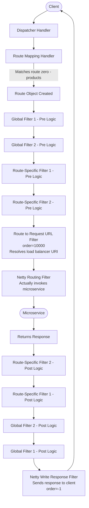
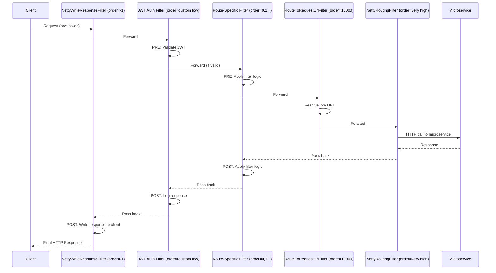
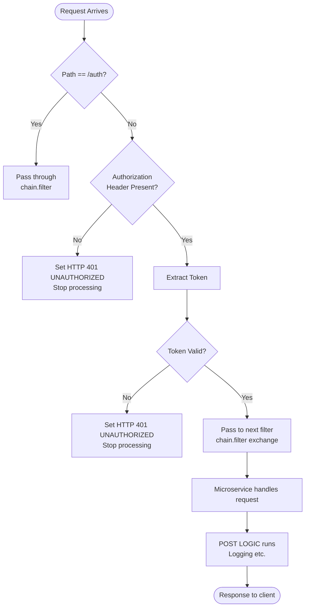
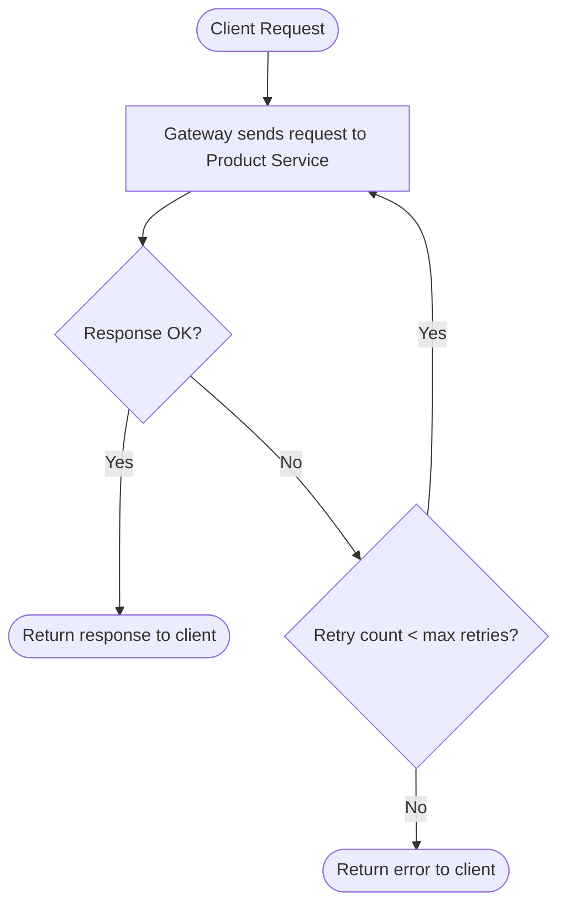
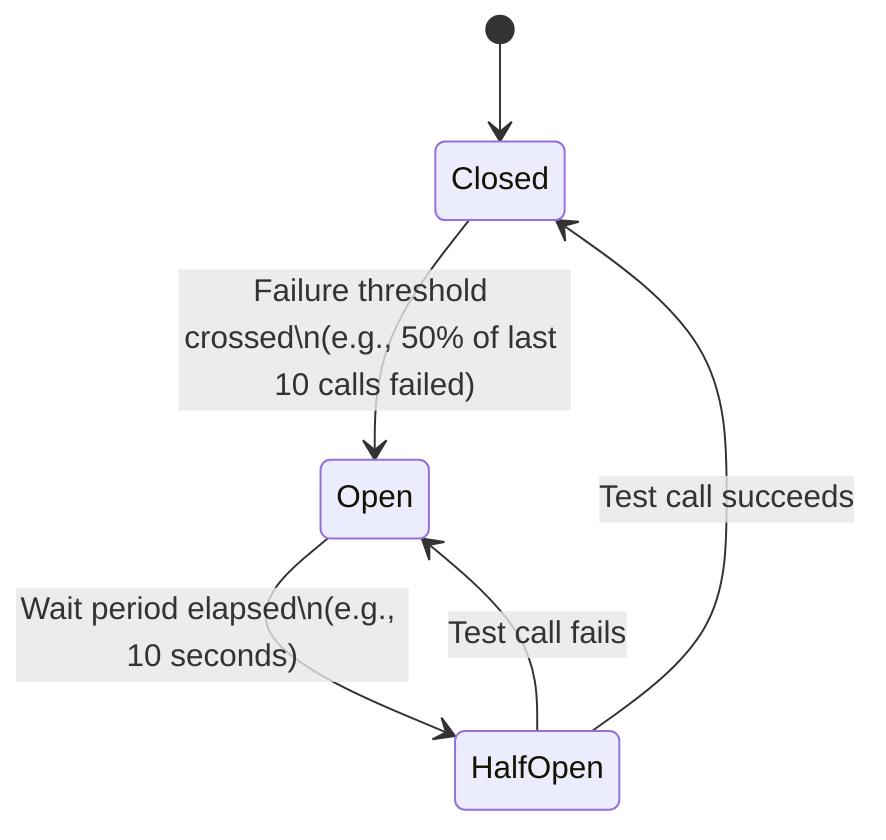
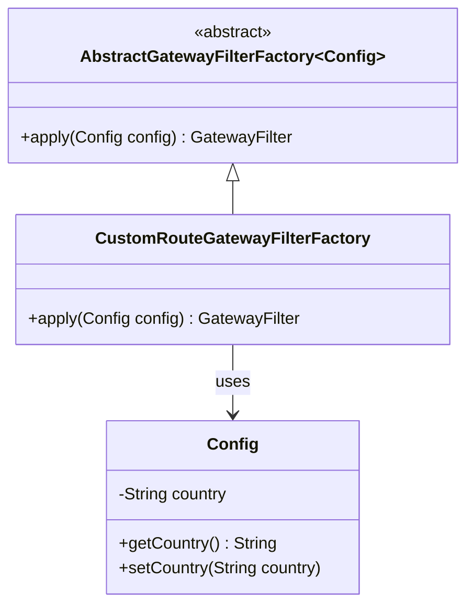
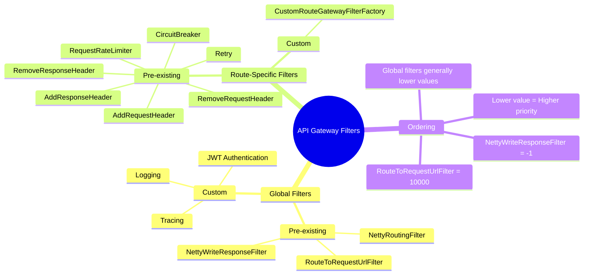

# 📌 Spring Cloud Gateway — Filters, Authentication, Circuit Breaker, Retry & Rate Limiting

> **Series Context:** This is part of a Spring Boot Microservices series. Previous sessions covered routing and load balancing in API Gateway. This session covers Filters — including Global Filters, Route-Specific Filters, and how to implement authentication, circuit breaker, retry, and rate limiting.

---

## Table of Contents

1. [What is a Filter in API Gateway?](#1-what-is-a-filter-in-api-gateway)
2. [Types of Filters](#2-types-of-filters)
3. [Complete Request Lifecycle in API Gateway](#3-complete-request-lifecycle-in-api-gateway)
4. [Filter Ordering](#4-filter-ordering)
5. [Pre-existing Global Filters](#5-pre-existing-global-filters)
6. [Writing a Custom Global Filter — JWT Authentication](#6-writing-a-custom-global-filter--jwt-authentication)
7. [Route-Specific Filters — Pre-existing Filters](#7-route-specific-filters--pre-existing-filters)
8. [Retry Filter](#8-retry-filter)
9. [Circuit Breaker Filter](#9-circuit-breaker-filter)
10. [Rate Limiter Filter](#10-rate-limiter-filter)
11. [Writing a Custom Route-Specific Filter](#11-writing-a-custom-route-specific-filter)
12. [Summary Decision Table](#12-summary-decision-table)
13. [Interview Notes](#13-interview-notes)
14. [Practice Questions](#14-practice-questions)

---

## 1. What is a Filter in API Gateway?

### Overview

In Spring Cloud Gateway, a **filter** is a component that can **intercept and modify HTTP requests and responses** as they pass through the gateway. Filters sit between the client and your microservices, allowing you to apply cross-cutting concerns (authentication, logging, rate limiting, circuit breaking, header manipulation, etc.) in one centralized place — without modifying individual microservices.

### Why This Concept Exists

In a microservices architecture, you might have dozens of services. If each service independently handles authentication, logging, retries, and circuit breaking, you get massive code duplication and inconsistency. An API Gateway with filters solves this by:

- Applying shared logic **once**, at the gateway level
- Keeping individual microservices focused on business logic
- Allowing centralized control over security, resilience, and observability

### Real-world Analogy

Think of an API Gateway as a **security checkpoint at an airport**. Every passenger (request) must pass through the checkpoint (global filters) regardless of destination. Once cleared, passengers go to their specific gate (route-specific filters) where additional checks may apply (e.g., customs for international flights).

---

## 2. Types of Filters

Spring Cloud Gateway provides two categories of filters:

| Type | Scope | Applied To | Typical Use Cases |
|---|---|---|---|
| **Global Filter** | All requests | Every request passing through the gateway | Authentication, Logging, Tracing |
| **Route-Specific Filter** (Gateway Filter) | Selected requests | Only requests matching a specific route | Rate Limiting, Circuit Breaker, Retry, Header Manipulation |

### Global Filters

> [!NOTE]
> Global filters are applied to **every single request** that passes through the gateway — no exceptions.

**Use cases:**
- JWT authentication (you want to validate tokens for all incoming requests)
- Logging (you want to log every request/response)
- Request tracing / correlation ID injection

### Route-Specific Filters

> [!NOTE]
> Route-specific filters are applied **only to requests matching a particular route**. You can define different configurations for different microservices.

**Use cases:**
- Different circuit breaker configurations per microservice (Product Service vs Order Service may have different thresholds)
- Rate limiting on specific endpoints only
- Retry only on idempotent routes (GET/DELETE)
- Adding/removing headers specific to one service

---

## 3. Complete Request Lifecycle in API Gateway

This is the full flow of a request from client to microservice and back. Understanding this flow is essential for working effectively with filters.

### Example Request

```
Client → GET http://localhost:8083/products/1
```

Here, `8083` is the API Gateway port.

### Flow Diagram



### Step-by-Step Breakdown

**Step 1 — Dispatcher Handler**
The request hits the API Gateway and is first received by the `DispatcherHandler`. This is Spring's central dispatcher, similar to what `DispatcherServlet` does in Spring MVC.

**Step 2 — Route Mapping Handler**
The `Route Mapping Handler` inspects the request path (`/products/1`) and matches it against the routes defined in `application.properties`.

```properties
# application.properties — route definitions
spring.cloud.gateway.routes[0].id=route0
spring.cloud.gateway.routes[0].uri=lb://PRODUCT-SERVICE
spring.cloud.gateway.routes[0].predicates[0]=Path=/products/**

spring.cloud.gateway.routes[1].id=route1
spring.cloud.gateway.routes[1].uri=lb://ORDER-SERVICE
spring.cloud.gateway.routes[1].predicates[0]=Path=/orders/**
```

Since the path is `/products/1`, it matches `route0` → a **Route Object** is created.

**Step 3 — Global Filter Pre Logic**
Every global filter runs its **pre logic** in order. Pre logic runs BEFORE the request is forwarded to the microservice.

**Step 4 — Route-Specific Filter Pre Logic**
Filters specific to the matched route run their pre logic.

**Step 5 — Route to Request URL Filter (Global, order=10,000)**
This special global filter resolves the actual microservice URL. Since the URI is `lb://PRODUCT-SERVICE` (load balancer), it:
1. Contacts the **Service Discovery** (e.g., Eureka)
2. Gets the list of available instances
3. Picks one instance via **load balancing**
4. Replaces the URI with the actual instance URL (e.g., `http://192.168.1.10:8081`)

**Step 6 — Netty Routing Filter (Global, very high order)**
This filter actually **invokes the microservice** using the resolved URL. It is an HTTP client embedded in the gateway.

**Step 7 — Microservice processes the request and returns a response**

**Step 8 — Response travels back through filters in REVERSE order**
- Route-specific filters execute their **post logic** (innermost first)
- Global filters execute their **post logic**

**Step 9 — Netty Write Response Filter (Global, order=-1)**
This special global filter **sends the final response back to the client**. Because its order is `-1` (very high priority), it runs first during the pre phase (doing nothing there) but runs **last** during the post phase — exactly when we need to send the response.

### Pre vs Post Logic — Code Pattern

Understanding how pre and post logic works in a filter:

```java
@Override
public Mono<Void> filter(ServerWebExchange exchange, GatewayFilterChain chain) {

    // ============ PRE FILTER LOGIC ============
    // Everything here runs BEFORE the request reaches the microservice
    System.out.println("PRE LOGIC: Validating token...");

    return chain.filter(exchange)  // Pass request to next filter in chain
        .then(Mono.fromRunnable(() -> {
            // ============ POST FILTER LOGIC ============
            // Everything here runs AFTER the microservice responds
            System.out.println("POST LOGIC: Response received, logging...");
        }));
}
```

> [!IMPORTANT]
> Spring Cloud Gateway uses **Reactive Programming** (Project Reactor / Spring WebFlux) internally. `chain.filter(exchange)` is **asynchronous** — it does not block. The `.then(Mono.fromRunnable(...))` ensures post logic runs only **after** the async chain completes and the response arrives. This is why we use `Mono.fromRunnable()` for post logic.

---

## 4. Filter Ordering

### Why Ordering Matters

Every filter — whether global or route-specific — is assigned an **order value**. This determines execution sequence.

| Order Value | Priority | Execution |
|---|---|---|
| **Lower number** (e.g., -1, 0) | **Higher priority** | Runs **earlier** in the chain |
| **Higher number** (e.g., 10000) | **Lower priority** | Runs **later** in the chain |

### Built-in Filter Order Values

| Filter | Order Value | Purpose |
|---|---|---|
| `NettyWriteResponseFilter` | `-1` | Sends response to client — must run last in post phase |
| Custom Global Filters | You control it | Authentication, Logging etc. |
| Route-Specific Filters | 0, 1, 2... (by index) | Route-level concerns |
| `RouteToRequestUrlFilter` | `10,000` | Resolves lb:// URI — must run late |
| `NettyRoutingFilter` | Very high | Actually calls the microservice — must be last |

### Why Global Filters Run Before Route-Specific Filters (Generally)

Most global filters (like authentication) intentionally get **low order values** so they run early. Route-specific filters get higher values (0, 1, 2 by index). This is why global filters generally precede route-specific filters.

However, `RouteToRequestUrlFilter` and `NettyRoutingFilter` are exceptions — they are global filters but have **very high order values** so they run late (after all other filters).

### Default Ordering Behavior

```
Global Filters (no order defined) → lowest precedence (run last)

Route-Specific Filters (no order defined) → assigned index: 0, 1, 2, 3...
  Filter 0 → order 0
  Filter 1 → order 1
  Filter 2 → order 2
```

### Sequence Diagram — Filter Execution Order



---

## 5. Pre-existing Global Filters

Spring Cloud Gateway ships with several built-in global filters that run automatically:

| Filter | Description |
|---|---|
| `NettyWriteResponseFilter` | Writes the final response back to the client |
| `RouteToRequestUrlFilter` | Converts `lb://SERVICE-NAME` to a real URL via service discovery |
| `NettyRoutingFilter` | Executes the actual HTTP call to the downstream microservice |
| `ReactiveLoadBalancerClientFilter` | Handles client-side load balancing |
| `WebsocketRoutingFilter` | Routes WebSocket connections |

These run transparently. You don't configure them — they're always active.

---

## 6. Writing a Custom Global Filter — JWT Authentication

### Use Case

You want to validate a **JWT token** on **every request** to the gateway (except the `/auth` endpoint, which is used to create tokens).

### Why a Global Filter?

Since authentication must apply to **all routes**, a global filter is the right choice. You don't want to repeat this logic for each route.

### Implementation

```java
package com.example.gateway.filter;

import org.springframework.cloud.gateway.filter.GatewayFilterChain;
import org.springframework.cloud.gateway.filter.GlobalFilter;
import org.springframework.core.Ordered;
import org.springframework.http.HttpStatus;
import org.springframework.stereotype.Component;
import org.springframework.web.server.ServerWebExchange;
import reactor.core.publisher.Mono;

@Component  // ① Managed by Spring Boot (bean)
public class JwtAuthGlobalFilter implements GlobalFilter, Ordered {  // ② Implements both interfaces

    @Override
    public int getOrder() {
        return -1;  // ③ Low value = high priority = runs early in the filter chain
    }

    @Override
    public Mono<Void> filter(ServerWebExchange exchange, GatewayFilterChain chain) {

        // ④ Extract the request path
        String path = exchange.getRequest().getURI().getPath();

        // ⑤ Skip authentication for /auth endpoint (token creation)
        if (path.equals("/auth")) {
            return chain.filter(exchange);  // Pass through without checking token
        }

        // ⑥ Extract the Authorization header
        String authHeader = exchange.getRequest()
                                    .getHeaders()
                                    .getFirst("Authorization");

        // ⑦ If header is missing, reject the request
        if (authHeader == null) {
            exchange.getResponse().setStatusCode(HttpStatus.UNAUTHORIZED);
            return exchange.getResponse().setComplete();  // Stop processing
        }

        // ⑧ Extract the token (typically "Bearer <token>")
        String token = authHeader.replace("Bearer ", "");

        try {
            // ⑨ Verify the JWT token (your custom verification logic)
            verifyJwtToken(token);

            // ⑩ Token is valid — pass to next filter (PRE LOGIC complete)
            return chain.filter(exchange)
                .then(Mono.fromRunnable(() -> {
                    // ⑪ POST FILTER LOGIC — runs after microservice responds
                    System.out.println("POST FILTER: Response returned for path: " + path);
                }));

        } catch (Exception e) {
            // ⑫ Token invalid — reject
            exchange.getResponse().setStatusCode(HttpStatus.UNAUTHORIZED);
            return exchange.getResponse().setComplete();
        }
    }

    private void verifyJwtToken(String token) {
        // JWT verification logic (using jjwt or spring-security)
        // Refer to JWT Authentication video for full implementation
        // This will throw an exception if the token is invalid
    }
}
```

### Line-by-Line Explanation

| Line/Block | Explanation |
|---|---|
| `@Component` | Registers this class as a Spring Bean — Spring Boot manages its lifecycle |
| `implements GlobalFilter` | Marks this as a global filter; must override `filter()` method |
| `implements Ordered` | Allows us to define execution priority via `getOrder()` |
| `getOrder() { return -1; }` | Returns -1 (high priority) — this filter runs very early in the chain |
| `ServerWebExchange exchange` | Represents the full HTTP request + response context in reactive Spring |
| `GatewayFilterChain chain` | Represents the remaining filters; calling `chain.filter(exchange)` passes control forward |
| `path.equals("/auth")` | Bypass check: if endpoint is `/auth`, don't require a token (it's the login/token-creation endpoint) |
| `getFirst("Authorization")` | Reads the `Authorization` HTTP header |
| `setStatusCode(UNAUTHORIZED)` | Sets HTTP 401 response status |
| `setComplete()` | Terminates request processing — no further filters run |
| `chain.filter(exchange).then(Mono.fromRunnable(...))` | Asynchronously passes to next filter; the `.then()` block is the post-filter logic |
| `Mono.fromRunnable(...)` | Wraps synchronous code (Runnable) into a reactive Mono so it executes in the reactive pipeline |

### Flowchart — JWT Auth Global Filter



> [!TIP]
> For the complete JWT token creation and verification logic, refer to the JWT Authentication video in the Spring Boot series. The `verifyJwtToken()` method is where you put that logic.

> [!IMPORTANT]
> The `/auth` endpoint must be excluded from JWT validation. This is the endpoint responsible for **creating** tokens. If you try to validate a token before the user has logged in and received a token, all authentication calls will fail with 401.

---

## 7. Route-Specific Filters — Pre-existing Filters

Spring Cloud Gateway ships with many built-in **Gateway Filter Factories** (route-specific filters). You configure them in `application.properties` without writing any Java code.

### How the Naming Convention Works

When you write a filter name in configuration, the gateway automatically appends `GatewayFilterFactory` to find the implementation class:

```
Config name:   AddRequestHeader
Actual class:  AddRequestHeaderGatewayFilterFactory

Config name:   Retry
Actual class:  RetryGatewayFilterFactory

Config name:   CircuitBreaker
Actual class:  CircuitBreakerGatewayFilterFactory
```

> [!NOTE]
> You never need to type `GatewayFilterFactory` in the configuration. The framework adds it automatically during mapping.

### How Config Fields Are Mapped

Each `GatewayFilterFactory` class defines an inner `Config` class with fields. You populate those fields dynamically through `application.properties`:

```
spring.cloud.gateway.routes[0].filters[0].args.<field-name>=<value>
```

For example, `RemoveRequestHeaderGatewayFilterFactory` has a `Config` with one field: `name`. So:

```properties
spring.cloud.gateway.routes[0].filters[0].name=RemoveRequestHeader
spring.cloud.gateway.routes[0].filters[0].args.name=X-My-Header
```

### Pre-existing Route-Specific Filters Reference

| Filter Name | Class Suffix | Config Fields | Purpose |
|---|---|---|---|
| `AddRequestHeader` | GatewayFilterFactory | `name`, `value` | Add a header to the request |
| `AddResponseHeader` | GatewayFilterFactory | `name`, `value` | Add a header to the response |
| `RemoveRequestHeader` | GatewayFilterFactory | `name` | Remove a header from the request |
| `RemoveResponseHeader` | GatewayFilterFactory | `name` | Remove a header from the response |
| `Retry` | GatewayFilterFactory | `retries`, `methods`, `statuses` | Retry on failure |
| `RequestRateLimiter` | GatewayFilterFactory | various | Apply rate limiting |
| `CircuitBreaker` | GatewayFilterFactory | `name`, `fallbackUri` | Circuit breaker pattern |

### Configuration Example — Multiple Filters for One Route

```properties
# Route 0 — Product Service
spring.cloud.gateway.routes[0].id=route0
spring.cloud.gateway.routes[0].uri=lb://PRODUCT-SERVICE
spring.cloud.gateway.routes[0].predicates[0]=Path=/products/**

# Filter 0 — Add a custom request header
spring.cloud.gateway.routes[0].filters[0].name=AddRequestHeader
spring.cloud.gateway.routes[0].filters[0].args.name=X-Request-Source
spring.cloud.gateway.routes[0].filters[0].args.value=API-Gateway

# Filter 1 — Add a custom response header
spring.cloud.gateway.routes[0].filters[1].name=AddResponseHeader
spring.cloud.gateway.routes[0].filters[1].args.name=X-Test-Response-Header
spring.cloud.gateway.routes[0].filters[1].args.value=API-Gateway-Response

# Filter 2 — Remove a request header
spring.cloud.gateway.routes[0].filters[2].name=RemoveRequestHeader
spring.cloud.gateway.routes[0].filters[2].args.name=X-Unwanted-Header
```

After this configuration, the response from the Product Service will include:
```
X-Test-Response-Header: API-Gateway-Response
```

### How RemoveRequestHeaderGatewayFilterFactory Works Internally

```java
// Simplified view of RemoveRequestHeaderGatewayFilterFactory
public class RemoveRequestHeaderGatewayFilterFactory 
    extends AbstractGatewayFilterFactory<RemoveRequestHeaderGatewayFilterFactory.Config> {

    public static class Config {
        private String name; // dynamically set from application.properties
        // getter and setter
    }

    @Override
    public GatewayFilter apply(Config config) {
        return (exchange, chain) -> {
            // Remove the header with the configured name
            ServerHttpRequest request = exchange.getRequest()
                .mutate()
                .headers(headers -> headers.remove(config.getName()))
                .build();

            return chain.filter(exchange.mutate().request(request).build());
        };
    }
}
```

---

## 8. Retry Filter

### Overview

The **Retry Filter** automatically retries a failed request a configured number of times before returning an error to the client. This is useful when microservices experience transient failures.

> [!NOTE]
> Retry in Spring Cloud Gateway has its own built-in implementation — it does **not** use Resilience4j. Resilience4j is used by the Circuit Breaker filter, not Retry.

### Configuration

```properties
# Product Service Route
spring.cloud.gateway.routes[0].id=route0
spring.cloud.gateway.routes[0].uri=lb://PRODUCT-SERVICE
spring.cloud.gateway.routes[0].predicates[0]=Path=/products/**

# Retry Filter
spring.cloud.gateway.routes[0].filters[0].name=Retry
spring.cloud.gateway.routes[0].filters[0].args.retries=4
spring.cloud.gateway.routes[0].filters[0].args.methods=GET,DELETE
```

### Configuration Fields Explained

| Field | Value | Meaning |
|---|---|---|
| `retries` | `4` | Total **attempts** = 4 (1 original + 3 retries) |
| `methods` | `GET,DELETE` | Only retry for these HTTP methods (idempotent operations) |
| `statuses` | e.g., `500,503` | Retry only on these HTTP response status codes |

> [!IMPORTANT]
> The `retries` value is the **total number of attempts**, not the number of retries after the first failure. So `retries=4` means: 1 original call + 3 retries = 4 total calls.

### Why Only Retry GET and DELETE?

Retrying `POST` or `PUT` requests can cause **duplicate data** — e.g., creating an order twice. Only retry idempotent operations (where sending the same request multiple times has the same effect as sending it once).

### Test Scenario

**Microservice controller (for testing)**:
```java
@RestController
public class ProductController {

    private int callCount = 0;

    @GetMapping("/products/{id}")
    public String getProduct(@PathVariable int id) {
        callCount++;
        if (callCount <= 3) {
            throw new RuntimeException("Simulated failure on attempt " + callCount);
        }
        return "Fetched product details on attempt " + callCount; // succeeds on 4th call
    }
}
```

**Result with `retries=4`:**
```
GET http://localhost:8083/products/1

Response: "Fetched product details on attempt 4"
```

The gateway transparently retried 3 times after the initial failure, succeeding on the 4th attempt — no changes required in the client code.

### Retry Flowchart



---

## 9. Circuit Breaker Filter

### Overview

The **Circuit Breaker** pattern prevents cascading failures. When a microservice is down or slow, the circuit breaker "opens" and immediately returns a fallback response instead of waiting and failing repeatedly.

### Circuit States



| State | Behavior |
|---|---|
| **Closed** | Normal operation; requests pass through |
| **Open** | All requests immediately go to fallback; microservice is not called |
| **Half-Open** | A limited number of test requests are sent; if they succeed, moves to Closed |

### Dependency Required

Unlike the Retry filter, the Circuit Breaker filter requires the **Resilience4j** dependency:

```xml
<!-- pom.xml -->
<dependency>
    <groupId>org.springframework.cloud</groupId>
    <artifactId>spring-cloud-starter-circuitbreaker-reactor-resilience4j</artifactId>
</dependency>
```

### Fallback Endpoint (in API Gateway)

You need a controller **inside the API Gateway itself** to handle fallback responses:

```java
// Inside API Gateway project
@RestController
public class FallbackController {

    @GetMapping("/fallback")
    public String fallback() {
        return "Service is temporarily unavailable. Please try again later.";
    }
}
```

### Configuration

```properties
# Product Service Route
spring.cloud.gateway.routes[0].id=route0
spring.cloud.gateway.routes[0].uri=lb://PRODUCT-SERVICE
spring.cloud.gateway.routes[0].predicates[0]=Path=/products/**

# Circuit Breaker Filter
spring.cloud.gateway.routes[0].filters[0].name=CircuitBreaker
spring.cloud.gateway.routes[0].filters[0].args.name=productServiceCB
spring.cloud.gateway.routes[0].filters[0].args.fallbackUri=forward:/fallback

# Resilience4j Circuit Breaker Config for 'productServiceCB'
resilience4j.circuitbreaker.instances.productServiceCB.sliding-window-size=10
resilience4j.circuitbreaker.instances.productServiceCB.failure-rate-threshold=50
resilience4j.circuitbreaker.instances.productServiceCB.wait-duration-in-open-state=10s
resilience4j.circuitbreaker.instances.productServiceCB.sliding-window-type=COUNT_BASED
```

### Configuration Explained

| Property | Value | Meaning |
|---|---|---|
| `args.name` | `productServiceCB` | Name of the Resilience4j circuit breaker instance to use |
| `args.fallbackUri` | `forward:/fallback` | Internal redirect to gateway's own `/fallback` endpoint |
| `sliding-window-size` | `10` | Consider the last 10 calls |
| `failure-rate-threshold` | `50` | If 50% or more of calls fail, open the circuit |
| `wait-duration-in-open-state` | `10s` | Stay open for 10 seconds before transitioning to Half-Open |

> [!NOTE]
> The `forward:/fallback` prefix tells the gateway this is an **internal call** — it does not go to any external microservice. It calls the `/fallback` endpoint defined within the gateway itself.

### Testing Circuit Breaker

1. Stop the Product microservice (simulate it being down)
2. Send more than 5 requests (crossing the 50% threshold over 10 calls)
3. Observe: Circuit transitions from **Closed → Open**
4. All subsequent requests immediately return: `"Service is temporarily unavailable"`
5. Wait 10 seconds → Circuit moves to **Half-Open**
6. Start the Product microservice → test call succeeds → Circuit moves back to **Closed**

**Log output during circuit state transitions:**
```
INFO  CircuitBreaker 'productServiceCB' changed state from CLOSED to OPEN
INFO  CircuitBreaker 'productServiceCB' changed state from OPEN to HALF_OPEN
INFO  CircuitBreaker 'productServiceCB' changed state from HALF_OPEN to CLOSED
```

---

## 10. Rate Limiter Filter

### Overview

The **Rate Limiter** filter restricts the number of requests a client can make within a time window, protecting microservices from being overwhelmed.

### Dependency

```xml
<!-- pom.xml — Rate Limiter requires Redis -->
<dependency>
    <groupId>org.springframework.boot</groupId>
    <artifactId>spring-boot-starter-data-redis-reactive</artifactId>
</dependency>
```

### Configuration

```properties
# Rate Limiter Filter
spring.cloud.gateway.routes[0].filters[0].name=RequestRateLimiter
spring.cloud.gateway.routes[0].filters[0].args.redis-rate-limiter.replenishRate=10
spring.cloud.gateway.routes[0].filters[0].args.redis-rate-limiter.burstCapacity=20
spring.cloud.gateway.routes[0].filters[0].args.key-resolver=#{@userKeyResolver}
```

The rate limiter filter, like Circuit Breaker and Retry, uses a pre-existing `GatewayFilterFactory` class. You configure it via properties and the framework handles the rest.

---

## 11. Writing a Custom Route-Specific Filter

### Overview

While pre-existing filters cover most use cases, you may need to write your own route-specific filter with custom logic.

### Naming Convention

The class name **must** follow the pattern:

```
<YourName>GatewayFilterFactory
```

The prefix (before `GatewayFilterFactory`) is what you use in `application.properties`:

```
Class:   CustomRouteGatewayFilterFactory
Config:  spring.cloud.gateway.routes[0].filters[0].name=CustomRoute
```

### Implementation

```java
package com.example.gateway.filter;

import org.springframework.cloud.gateway.filter.GatewayFilter;
import org.springframework.cloud.gateway.filter.factory.AbstractGatewayFilterFactory;
import org.springframework.stereotype.Component;
import reactor.core.publisher.Mono;

@Component  // ① Register as Spring Bean
public class CustomRouteGatewayFilterFactory
        extends AbstractGatewayFilterFactory<CustomRouteGatewayFilterFactory.Config> {  // ② Extend with your Config type

    public CustomRouteGatewayFilterFactory() {
        super(Config.class);
    }

    // ③ Custom Config class — fields here are dynamically configurable
    public static class Config {
        private String country;  // configurable field

        public String getCountry() { return country; }
        public void setCountry(String country) { this.country = country; }
    }

    @Override
    public GatewayFilter apply(Config config) {
        return (exchange, chain) -> {

            // ④ PRE FILTER LOGIC
            System.out.println("PRE FILTER LOGIC — Country: " + config.getCountry());

            // ⑤ Pass to next filter in the chain
            return chain.filter(exchange)
                .then(Mono.fromRunnable(() -> {
                    // ⑥ POST FILTER LOGIC
                    System.out.println("POST FILTER LOGIC — Response returned");
                }));
        };
    }
}
```

### Configuration for Custom Filter

```properties
# Applying the custom filter to route 0 (Product Service)
spring.cloud.gateway.routes[0].filters[4].name=CustomRoute
spring.cloud.gateway.routes[0].filters[4].args.country=India
```

### Output When Request Hits Product Service

```
PRE FILTER LOGIC — Country: India
[... microservice processes the request ...]
POST FILTER LOGIC — Response returned
```

### Key Points About Custom Route Filters

1. **Class must extend** `AbstractGatewayFilterFactory<YourConfig>`
2. **Class must be annotated** with `@Component`
3. **Class name must end** with `GatewayFilterFactory`
4. **Config class** holds the fields you want to configure dynamically
5. **`apply()` method** returns a `GatewayFilter` lambda with your logic
6. **Pre logic** goes before `chain.filter(exchange)`
7. **Post logic** goes inside `.then(Mono.fromRunnable(...))`

### Class Diagram



---

## 12. Summary Decision Table

### When to Use Which Filter Type

| Scenario | Filter Type | Reason |
|---|---|---|
| JWT authentication for all APIs | **Global Filter** | Applies to every request |
| Logging every request/response | **Global Filter** | Universal concern |
| Request tracing / correlation IDs | **Global Filter** | All requests need tracing |
| Circuit breaker for Product Service only | **Route-Specific Filter** | Different config per service |
| Retry only GET/DELETE on Order Service | **Route-Specific Filter** | Service-specific configuration |
| Rate limiting on a public-facing route | **Route-Specific Filter** | Applied to specific traffic |
| Adding a debug header to responses | **Route-Specific Filter** | Route-specific need |

### Complete Filter Ecosystem Mind Map



---

## 13. Interview Notes

> [!IMPORTANT]
> These are frequently asked interview topics related to API Gateway filters.

**Q1: What is the difference between Global Filter and Route-Specific (Gateway) Filter?**

Global filters apply to every request passing through the gateway. Route-specific filters apply only to requests matching a specific route. Use global filters for cross-cutting concerns (auth, logging); use route-specific for service-level concerns (retry, circuit breaker with different configs per service).

**Q2: Explain the request lifecycle in Spring Cloud Gateway.**

Request → Dispatcher Handler → Route Mapping Handler → Global Filters (pre) → Route-Specific Filters (pre) → RouteToRequestUrlFilter → NettyRoutingFilter → Microservice → Route-Specific Filters (post) → Global Filters (post) → NettyWriteResponseFilter (sends response).

**Q3: How does filter ordering work?**

Every filter has an `order` value. Lower value = higher priority = runs earlier. Global filters typically have lower values than route-specific filters. `NettyWriteResponseFilter` has -1 (runs first in chain, but its post logic runs last). `RouteToRequestUrlFilter` has 10,000 (runs late, needs all filters to process first).

**Q4: Why does `NettyWriteResponseFilter` have order -1?**

It has no pre-logic (passes through immediately). Its important work is in the **post** phase — sending the response. Because it runs "first" in the chain (order -1), when the chain unwinds on the response, it runs **last**, ensuring it sends the client response after all other post-processing is done.

**Q5: How do you implement a custom Global Filter?**

Implement `GlobalFilter` and `Ordered` interfaces, annotate with `@Component`, override `filter()` for logic, override `getOrder()` for priority. Use `chain.filter(exchange)` to pass to next filter, and `.then(Mono.fromRunnable(...))` for post-filter logic.

**Q6: Why does the Retry filter not use Resilience4j?**

Spring Cloud Gateway's Retry filter has its own built-in retry mechanism. Resilience4j is only needed for the Circuit Breaker filter, which uses Resilience4j's circuit breaker capabilities.

**Q7: What does `forward:/fallback` mean in circuit breaker configuration?**

It means the fallback is an **internal call** within the API gateway itself — not a call to another microservice. The gateway has its own controller at `/fallback` that returns a friendly error message.

**Q8: How do you write a custom route-specific filter?**

Create a class ending in `GatewayFilterFactory`, extend `AbstractGatewayFilterFactory<YourConfig>`, annotate with `@Component`. Define a `Config` inner class with configurable fields. Override `apply(Config config)` to return a `GatewayFilter` with pre and post logic.

---

## 14. Practice Questions

### Easy

1. What are the two types of filters in Spring Cloud Gateway?
2. Which filter is responsible for sending the HTTP response back to the client?
3. What does a lower `order` value mean for a filter?
4. Name three use cases for global filters.
5. What annotation is required on a custom filter class to make it a Spring-managed bean?

### Medium

6. Explain why the `/auth` endpoint should be excluded from JWT authentication in a global filter.
7. A developer configures `retries=3` on the Retry filter but expects 3 retries after the first failure. What is wrong and what should the value be?
8. What dependency is required in `pom.xml` to use the Circuit Breaker filter? Why?
9. How does the naming convention for custom route-specific filters work? Give an example.
10. Explain the difference between pre-filter logic and post-filter logic with a code example.

### Hard

11. Trace the full lifecycle of a request `GET /products/1` through Spring Cloud Gateway, naming every filter that runs in order.
12. Explain why `Mono.fromRunnable()` is used for post-filter logic instead of writing code directly after `chain.filter(exchange)`.
13. Design a production-ready Global Filter that: validates a JWT token, skips public endpoints, logs request duration, and adds a `X-Request-Id` header to every downstream call.
14. You have two microservices — Product Service (must allow max 100 req/s) and Order Service (max 10 req/s, circuit break if >30% fail). Design the complete `application.properties` configuration.
15. Why would you intentionally give a Global Filter a very high order value? Name the built-in filters that do this and explain why.

---

## Summary — Key Revision Bullets

- **Global Filters** apply to every request; **Route-Specific Filters** apply to matched routes only
- Filter ordering: **lower value = higher priority = runs earlier**
- `NettyWriteResponseFilter` (order=-1): no pre-logic; its post-logic sends the client response (runs last in post phase)
- `RouteToRequestUrlFilter` (order=10,000): resolves `lb://` URIs via service discovery
- `NettyRoutingFilter` (very high order): actually invokes the microservice via HTTP
- Pre-logic: code **before** `chain.filter(exchange)` — runs before microservice call
- Post-logic: code inside `.then(Mono.fromRunnable(...))` — runs after microservice responds
- Spring Cloud Gateway uses **reactive programming** (Project Reactor / WebFlux) internally
- **Custom Global Filter**: implement `GlobalFilter` + `Ordered`, annotate `@Component`
- **Custom Route Filter**: extend `AbstractGatewayFilterFactory<Config>`, class name must end in `GatewayFilterFactory`
- Pre-existing filter names in config auto-append `GatewayFilterFactory` for class lookup
- `Retry` filter: does NOT use Resilience4j; has its own built-in implementation
- `CircuitBreaker` filter: DOES use Resilience4j; requires `spring-cloud-starter-circuitbreaker-reactor-resilience4j` dependency
- `forward:/fallback` = internal API gateway endpoint, not an external microservice
- Decision rule: **all requests** → Global Filter; **specific route** → Route-Specific Filter

---

*Study Guide generated from Spring Cloud Gateway — Filters, Authentication, Circuit Breaker, Retry & Rate Limiting lecture.*
