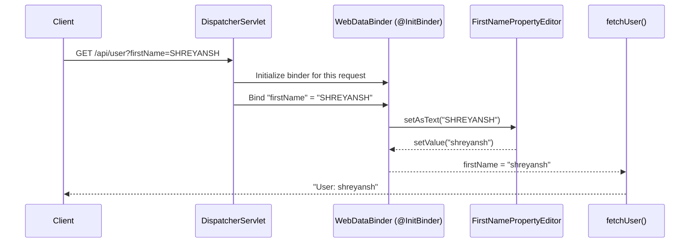
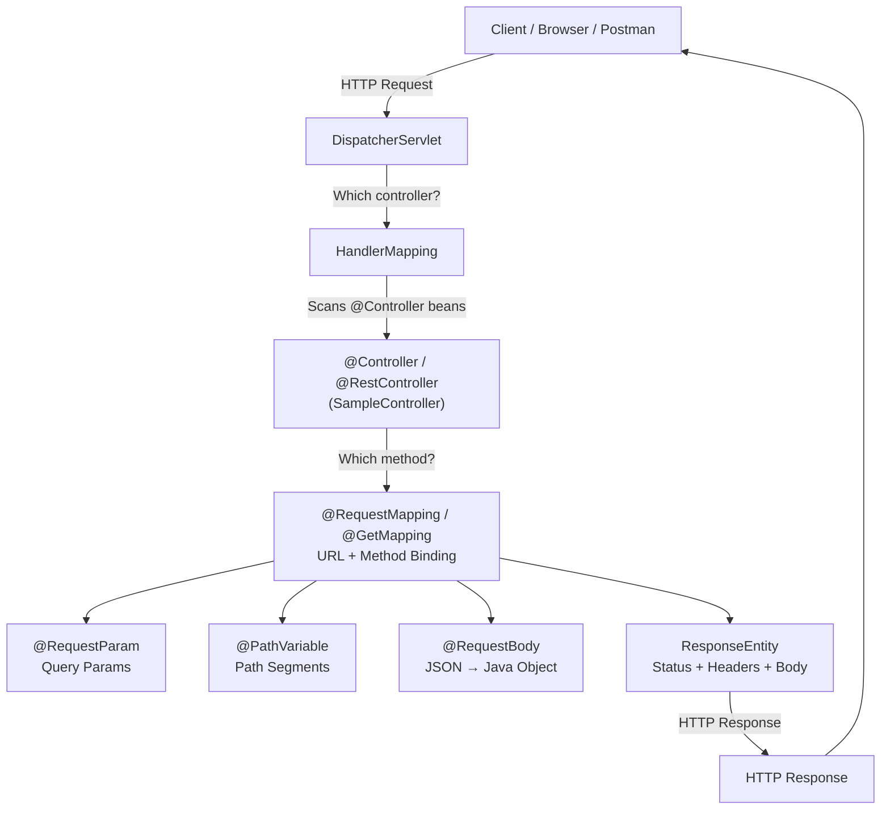
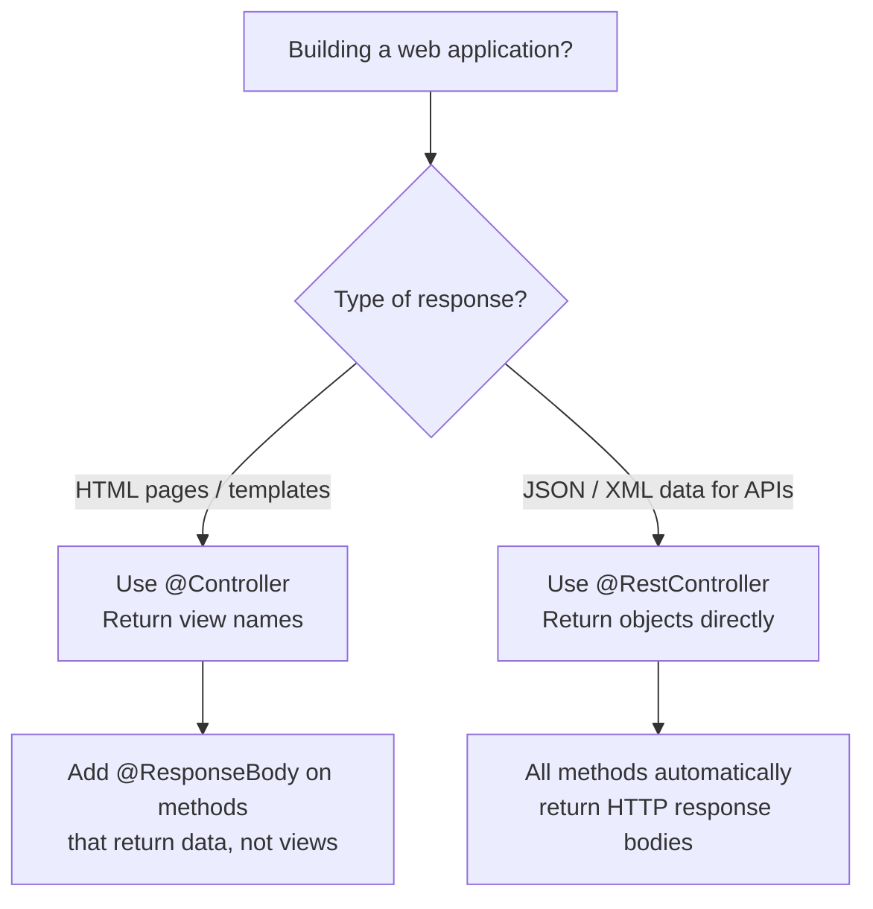
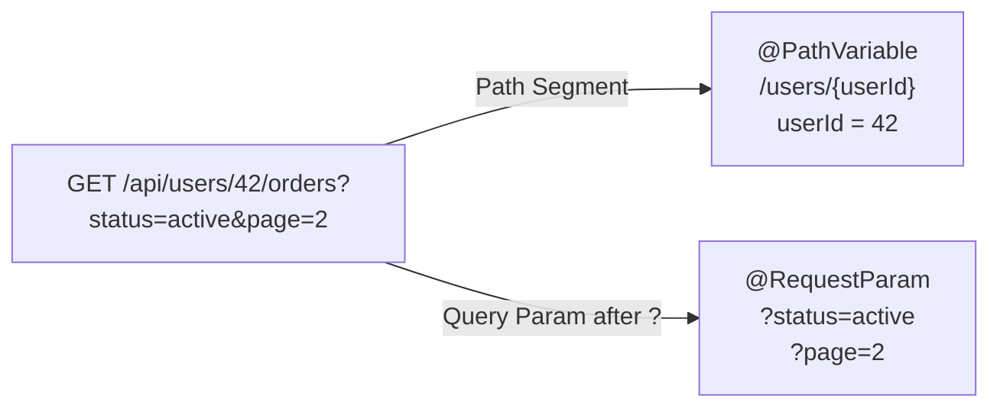
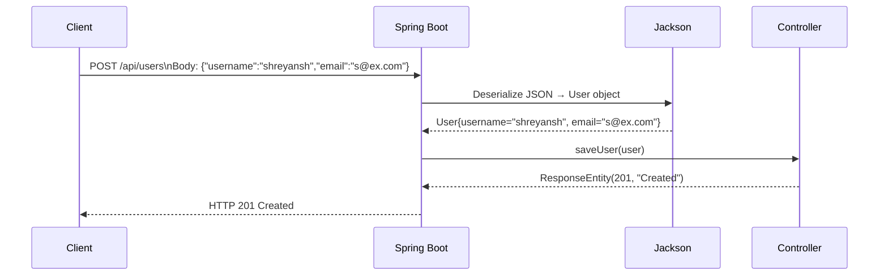
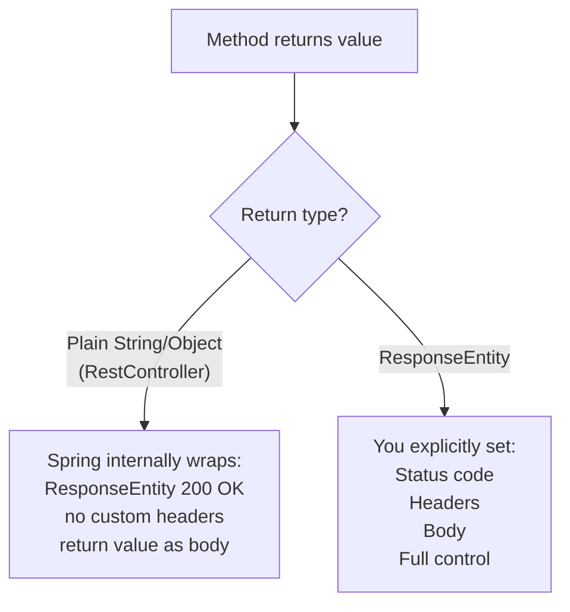

# 🌱 Spring Boot Annotations — Comprehensive Study Guide
### Spring Boot Series | Concept and Coding

---

> [!IMPORTANT]
> These notes are fully self-contained. A student can learn all covered Spring Boot annotations entirely from this guide without watching the original lecture.

---

## Table of Contents

1. [How HTTP Requests Reach Your Code — The Big Picture](#1-how-http-requests-reach-your-code--the-big-picture)
2. [@Controller](#2-controller)
3. [@RestController](#3-restcontroller)
4. [@Controller vs @RestController](#4-controller-vs-restcontroller)
5. [@ResponseBody](#5-responsebody)
6. [@RequestMapping](#6-requestmapping)
7. [@GetMapping, @PostMapping and Shorthand Annotations](#7-getmapping-postmapping-and-shorthand-annotations)
8. [@RequestParam](#8-requestparam)
9. [Type Conversion and Custom Property Editors (@InitBinder)](#9-type-conversion-and-custom-property-editors-initbinder)
10. [@PathVariable](#10-pathvariable)
11. [@RequestBody](#11-requestbody)
12. [ResponseEntity](#12-responseentity)
13. [Putting It All Together — Full Example](#13-putting-it-all-together--full-example)
14. [Key Diagrams](#14-key-diagrams)
15. [Interview Notes](#15-interview-notes)
16. [Common Mistakes](#16-common-mistakes)
17. [Summary Cheat Sheet](#17-summary-cheat-sheet)

---

# 1. How HTTP Requests Reach Your Code — The Big Picture

## Overview

Before diving into individual annotations, it's critical to understand **how Spring Boot routes an incoming HTTP request to the correct Java method**. This routing mechanism is called the **Dispatcher Servlet pattern**.

## The Request Flow

When a user or client sends an HTTP request (e.g., `GET /api/fetchUser`), this is what happens internally:

```
User/Client
    │
    │  HTTP Request: GET /api/fetchUser
    ▼
DispatcherServlet          ← Front controller — receives ALL requests
    │
    │  "Which controller can handle this?"
    ▼
HandlerMapping             ← Scans all @Controller/@RestController classes
    │                         and their @RequestMapping annotations
    │  "SampleController.getUserDetails() handles GET /api/fetchUser"
    ▼
SampleController           ← Your class with business logic
    │
    │  Executes the method, gets a result
    ▼
HttpMessageConverter       ← Converts Java object → JSON/XML
    │
    ▼
HTTP Response → User/Client
```

## What Annotations Enable This

The annotations covered in this guide are what **tell Spring Boot** how to build the HandlerMapping table:

| Annotation | Role in Request Handling |
|---|---|
| `@Controller` / `@RestController` | Marks a class as eligible to handle HTTP requests |
| `@RequestMapping` / `@GetMapping` etc. | Maps a specific URL + HTTP method to a specific Java method |
| `@RequestParam` | Extracts query parameters from the URL |
| `@PathVariable` | Extracts values embedded in the URL path |
| `@RequestBody` | Binds the request body (JSON/XML) to a Java object |
| `ResponseEntity` | Gives full control over the HTTP response (status, headers, body) |

---

# 2. @Controller

## Overview

`@Controller` is a **Spring stereotype annotation** that marks a class as a **web controller** — meaning it is responsible for handling incoming HTTP requests.

## Why This Exists

The DispatcherServlet needs to know which classes in your application are capable of handling HTTP requests. Among potentially hundreds of classes, only those annotated with `@Controller` (or `@RestController`) are considered for request handling.

## Definition

> `@Controller` tells Spring Boot: *"This class may contain methods that handle HTTP requests. Include it in the handler mapping scan."*

## Internal Working

When Spring Boot starts up:
1. It performs **component scanning** — scanning all classes in the application
2. Classes annotated with `@Controller` are registered in the **ApplicationContext** as beans
3. Spring's `RequestMappingHandlerMapping` inspects these beans for `@RequestMapping` annotations
4. A mapping table is built: URL + HTTP method → Java method

This scanning and registration happens through **Java Reflection** — Spring reads annotations at runtime and uses them to configure routing.

## Syntax

```java
import org.springframework.stereotype.Controller;

@Controller
public class SampleController {
    // Handler methods go here
}
```

## Important Behaviour — Without @ResponseBody

`@Controller` alone does NOT automatically treat method return values as HTTP responses. If you return a `String` from a method in a plain `@Controller`, Spring Boot **treats it as a View name** and tries to resolve it to a template file (e.g., `hello.jsp`, `hello.html`).

```java
@Controller
public class SampleController {

    @GetMapping("/hello")
    public String sayHello() {
        return "hello"; // Spring treats this as: find a view named "hello.jsp" or "hello.html"
    }
}
```

If no matching view is found, Spring throws an error. This behaviour is intentional — `@Controller` was designed for **server-side rendering** applications (like JSP or Thymeleaf) where you return view names.

> [!NOTE]
> `@Controller` was the original annotation before REST APIs became common. In modern Spring Boot REST API development, `@RestController` is almost always used instead.

---

# 3. @RestController

## Overview

`@RestController` is a **composed annotation** — it is a shortcut that combines two annotations into one:

```
@RestController = @Controller + @ResponseBody
```

## Why This Exists

In REST API development, every single method in a controller returns data (JSON/XML) — not a view name. Writing `@ResponseBody` on every method is tedious and repetitive. `@RestController` applies `@ResponseBody` at the class level, so all methods inherit it automatically.

## Definition

> `@RestController` tells Spring Boot: *"This class handles HTTP requests, AND all its methods return data that should be sent directly as HTTP response bodies — never treated as view names."*

## Syntax

```java
import org.springframework.web.bind.annotation.RestController;

@RestController
public class SampleController {
    // Every method's return value is automatically an HTTP response body
}
```

## Code Example

```java
@RestController
@RequestMapping("/api")
public class UserController {

    @GetMapping("/user")
    public String getUser() {
        return "Shreyansh";  // Sent as HTTP response body: Shreyansh
    }

    @GetMapping("/message")
    public String getMessage() {
        return "Hello World";  // Sent as HTTP response body: Hello World
    }
}
```

**Output when calling `GET /api/user`:**
```
Shreyansh
```

No `@ResponseBody` needed on either method — `@RestController` handles it for the whole class.

---

# 4. @Controller vs @RestController

## Side-by-Side Comparison

```java
// ---- Using @Controller ----
@Controller
public class ViewController {

    @GetMapping("/page")
    public String showPage() {
        return "home"; // Spring looks for home.jsp / home.html — renders a VIEW
    }

    @GetMapping("/data")
    @ResponseBody              // ← Must add this explicitly on each method
    public String getData() {
        return "some data";    // Now treated as HTTP response, not a view
    }
}
```

```java
// ---- Using @RestController ----
@RestController
public class ApiController {

    @GetMapping("/page")
    public String showPage() {
        return "home"; // Sent as HTTP response body (text "home") — NOT a view lookup
    }

    @GetMapping("/data")
    public String getData() {
        return "some data"; // Sent as HTTP response body — no @ResponseBody needed
    }
}
```

## Comparison Table

| Feature | `@Controller` | `@RestController` |
|---|---|---|
| Marks class for request handling | ✅ | ✅ |
| Returns view names by default | ✅ | ❌ |
| Includes `@ResponseBody` | ❌ (must add manually) | ✅ (built-in) |
| Used for | Server-side rendering (JSP, Thymeleaf) | REST APIs |
| Convenience for REST APIs | Low | High |

> [!TIP]
> In modern Spring Boot REST API projects, always use `@RestController`. Only use `@Controller` if you are doing server-side HTML rendering with a template engine.

---

# 5. @ResponseBody

## Overview

`@ResponseBody` is the annotation that tells Spring Boot: *"Do not treat this method's return value as a view name. Treat it as the actual HTTP response body and send it directly to the client."*

## Why This Exists

Spring's default behaviour for `@Controller` methods is to look up a view. `@ResponseBody` overrides this default and instructs Spring to use an `HttpMessageConverter` to serialize the return value (e.g., convert a Java object to JSON) and write it to the HTTP response.

## Definition

> `@ResponseBody` instructs Spring to bind the return value of a method to the HTTP response body, bypassing view resolution entirely.

## Syntax

```java
// On a method inside a @Controller class
@Controller
public class SampleController {

    @GetMapping("/data")
    @ResponseBody              // ← Overrides view resolution for this method
    public String fetchData() {
        return "fetch user details of Shreyansh";
    }
}
```

## What Happens Without @ResponseBody (inside @Controller)

```java
@Controller
public class SampleController {

    @GetMapping("/fetchUser")
    public String fetchUserDetails() {
        return "fetch user details of Shreyansh";
    }
}
```

Spring Boot tries to find a view file named `fetch user details of Shreyansh.jsp` (or `.html`). It fails and throws:

```
javax.servlet.ServletException: Could not resolve view with name
'fetch user details of Shreyansh'
```

## Internally — How @ResponseBody Works

When `@ResponseBody` is present, Spring:
1. Inspects the method's return type
2. Looks at the `Accept` header in the HTTP request (e.g., `application/json`)
3. Selects an appropriate `HttpMessageConverter` (e.g., `MappingJackson2HttpMessageConverter` for JSON)
4. Serializes the Java return value to the appropriate format
5. Writes the serialized content to the `HttpServletResponse` output stream

---

# 6. @RequestMapping

## Overview

`@RequestMapping` is the **core mapping annotation** in Spring MVC. It maps HTTP requests to specific handler methods in controller classes. Every other mapping annotation (`@GetMapping`, `@PostMapping`, etc.) is built on top of `@RequestMapping`.

## Why This Exists

The DispatcherServlet needs to know which method to call for which URL and HTTP method combination. `@RequestMapping` provides this configuration.

## Definition

> `@RequestMapping` maps a web request (URL path + HTTP method + other constraints) to a specific handler method or class.

## Syntax — On a Method

```java
@RequestMapping(path = "/fetchUser", method = RequestMethod.GET)
public String getUserDetails() {
    // handle GET /fetchUser
}
```

## Syntax — On a Class (Base Path)

```java
@RestController
@RequestMapping("/api")           // ← All methods in this class use "/api" as base
public class UserController {

    @RequestMapping(path = "/fetchUser", method = RequestMethod.GET)
    public String fetchUser() {
        // Handles: GET /api/fetchUser
    }

    @RequestMapping(path = "/saveUser", method = RequestMethod.POST)
    public String saveUser() {
        // Handles: POST /api/saveUser
    }
}
```

## Parameters of @RequestMapping

| Parameter | Alias | Description | Example |
|---|---|---|---|
| `path` | `value` | URL path to match | `path = "/fetchUser"` |
| `method` | — | HTTP method to match | `method = RequestMethod.GET` |
| `params` | — | Required query parameters | `params = "version=2"` |
| `headers` | — | Required HTTP headers | `headers = "X-Custom=true"` |
| `consumes` | — | Required Content-Type | `consumes = "application/json"` |
| `produces` | — | Response Content-Type | `produces = "application/json"` |

> [!NOTE]
> `path` and `value` are **aliases** for each other. `path = "/fetchUser"` and `value = "/fetchUser"` are identical. Most developers prefer `path` for readability since it clearly communicates intent.

## Class-Level vs Method-Level Mapping

When multiple endpoints share a common path prefix:

```java
// ❌ Without class-level mapping — repetitive
@RestController
public class UserController {

    @RequestMapping(path = "/api/fetchUser", method = RequestMethod.GET)
    public String fetchUser() { ... }

    @RequestMapping(path = "/api/saveUser", method = RequestMethod.POST)
    public String saveUser() { ... }

    @RequestMapping(path = "/api/deleteUser", method = RequestMethod.DELETE)
    public String deleteUser() { ... }
}
```

```java
// ✅ With class-level mapping — clean and DRY
@RestController
@RequestMapping("/api")           // ← Common prefix defined once
public class UserController {

    @RequestMapping(path = "/fetchUser", method = RequestMethod.GET)
    public String fetchUser() { ... }    // Handles: GET /api/fetchUser

    @RequestMapping(path = "/saveUser", method = RequestMethod.POST)
    public String saveUser() { ... }    // Handles: POST /api/saveUser

    @RequestMapping(path = "/deleteUser", method = RequestMethod.DELETE)
    public String deleteUser() { ... }  // Handles: DELETE /api/deleteUser
}
```

The class-level path is **prepended** to the method-level path. If class path is `/api` and method path is `/fetchUser`, the final mapped URL is `/api/fetchUser`.

---

# 7. @GetMapping, @PostMapping and Shorthand Annotations

## Overview

Spring provides **shorthand composed annotations** for each common HTTP method. These are convenience wrappers around `@RequestMapping` with the HTTP method pre-set.

## The Complete Set

| Annotation | Equivalent To | HTTP Method | Typical Use |
|---|---|---|---|
| `@GetMapping` | `@RequestMapping(method = RequestMethod.GET)` | GET | Retrieve data |
| `@PostMapping` | `@RequestMapping(method = RequestMethod.POST)` | POST | Create new resource |
| `@PutMapping` | `@RequestMapping(method = RequestMethod.PUT)` | PUT | Replace entire resource |
| `@PatchMapping` | `@RequestMapping(method = RequestMethod.PATCH)` | PATCH | Partially update resource |
| `@DeleteMapping` | `@RequestMapping(method = RequestMethod.DELETE)` | DELETE | Delete resource |

## Code Example

```java
@RestController
@RequestMapping("/api")
public class UserController {

    // GET /api/users
    @GetMapping("/users")
    public String getAllUsers() {
        return "List of all users";
    }

    // POST /api/users
    @PostMapping("/users")
    public String createUser(@RequestBody User user) {
        return "User created: " + user.getUsername();
    }

    // PUT /api/users/1
    @PutMapping("/users/{id}")
    public String updateUser(@PathVariable int id, @RequestBody User user) {
        return "User " + id + " updated";
    }

    // DELETE /api/users/1
    @DeleteMapping("/users/{id}")
    public String deleteUser(@PathVariable int id) {
        return "User " + id + " deleted";
    }
}
```

## Why Prefer Shorthand Annotations?

```java
// Verbose — using @RequestMapping
@RequestMapping(path = "/users", method = RequestMethod.GET)
public String getUsers() { ... }

// Clean — using @GetMapping
@GetMapping("/users")
public String getUsers() { ... }
```

`@GetMapping` is preferred because:
- Less code to write
- Intent is immediately obvious from the annotation name
- Reduces risk of accidentally setting the wrong HTTP method

> [!TIP]
> In real projects, `@GetMapping`, `@PostMapping`, etc. are almost always used instead of the verbose `@RequestMapping(method = ...)` form. Reserve `@RequestMapping` for class-level base path declarations.

---

# 8. @RequestParam

## Overview

`@RequestParam` is used to **extract query parameters** from the URL and bind them to controller method parameters.

## What Are Query Parameters?

Query parameters appear **after the `?`** in a URL, separated by `&`:

```
https://example.com/api/fetchUser?firstName=Shreyansh&lastName=Gupta&age=25
                                   ↑─────────────────  ↑──────────────  ↑────
                                   Param 1             Param 2          Param 3
```

Each `key=value` pair separated by `&` is one query parameter.

## Definition

> `@RequestParam` binds the value of a URL query parameter to a Java method parameter in a controller method.

## Syntax

```java
@GetMapping("/fetchUser")
public String getUserDetails(
        @RequestParam(name = "firstName") String firstName,
        @RequestParam(name = "lastName", required = false) String lastName,
        @RequestParam(name = "age") int age) {

    return "User: " + firstName + " " + lastName + ", Age: " + age;
}
```

## Parameters of @RequestParam

| Parameter | Default | Description |
|---|---|---|
| `name` / `value` | — | The name of the query parameter in the URL |
| `required` | `true` | If `true`, the request fails if this param is absent |
| `defaultValue` | — | Value to use if the parameter is absent (makes it effectively optional) |

> [!NOTE]
> `name` and `value` are aliases in `@RequestParam`, just like in `@RequestMapping`.

## Full Code Example

```java
@RestController
@RequestMapping("/api")
public class SampleController {

    @GetMapping("/user")
    public String fetchUserDetails(
            @RequestParam(name = "firstName") String firstName,           // required by default
            @RequestParam(name = "lastName", required = false) String lastName) {  // optional

        return "Fetch user details of " + firstName + " and " + lastName;
    }
}
```

### Scenario 1 — All required params present

```
GET /api/user?firstName=Shreyansh&lastName=Gupta
```

**Output:**
```
Fetch user details of Shreyansh and Gupta
```

### Scenario 2 — Optional param absent

```
GET /api/user?firstName=Shreyansh
```

**Output:**
```
Fetch user details of Shreyansh and null
```

`lastName` is `null` because it was marked `required = false` and not provided.

### Scenario 3 — Required param missing

```
GET /api/user?lastName=Gupta
```

**Output:**
```
HTTP 400 Bad Request
MissingServletRequestParameterException: Required request parameter 'firstName' is not present
```

The request is rejected because `firstName` is required but missing.

## Using `defaultValue`

```java
@GetMapping("/user")
public String fetchUser(
        @RequestParam(name = "page", defaultValue = "1") int page,
        @RequestParam(name = "size", defaultValue = "10") int size) {

    return "Page: " + page + ", Size: " + size;
}
```

```
GET /api/user           → Page: 1, Size: 10 (defaults used)
GET /api/user?page=3    → Page: 3, Size: 10 (only size uses default)
```

## Automatic Type Conversion

Spring Boot automatically converts the **String** representation of query parameters to the **declared Java type** of the method parameter:

```java
@GetMapping("/user")
public String fetchUser(
        @RequestParam("age") int age,               // String "25" → int 25
        @RequestParam("active") boolean active,     // String "true" → boolean true
        @RequestParam("score") double score) {      // String "98.6" → double 98.6
    ...
}
```

Supported automatic conversions:

| URL String Value | Java Type | Example |
|---|---|---|
| `"25"` | `int` / `Integer` | `?age=25` |
| `"true"` / `"false"` | `boolean` / `Boolean` | `?active=true` |
| `"98.6"` | `double` / `Double` | `?score=98.6` |
| `"hello"` | `String` | `?name=hello` |
| `"RED"` | `enum Color` | `?color=RED` |

> [!WARNING]
> If a user passes `?age=abc` and the method expects `int age`, Spring throws a `MethodArgumentTypeMismatchException` (HTTP 400). Always validate or handle this gracefully.

---

# 9. Type Conversion and Custom Property Editors (@InitBinder)

## Overview

For cases where automatic type conversion is insufficient — for example, normalizing string casing, cleaning input, or converting to a complex custom type — Spring provides a **Custom Property Editor** mechanism, configurable via `@InitBinder`.

## Why This Exists

Automatic type conversion handles primitives and standard types. But what if you need to:
- Trim whitespace from a string input
- Convert all input to lowercase regardless of what the user sends
- Parse a custom date format string into a `LocalDate` object
- Map a raw string like `"23/04/1999"` to a `Date` object

These scenarios require custom logic that runs **before** the value is bound to the method parameter.

## @InitBinder

`@InitBinder` marks a method inside a controller that **configures a `WebDataBinder`** for that controller. The binder runs before every handler method in the controller, applying registered custom editors to parameters.

## Syntax

```java
@InitBinder
public void initBinder(WebDataBinder binder) {
    // Register custom editors here
}
```

## Complete Custom Property Editor Example

**Goal:** No matter what case the user sends for `firstName` (e.g., `SHREYANSH`, `shreyansh`, `ShReYaNsH`), always normalize it to lowercase and trimmed.

### Step 1 — Create the Custom Property Editor

```java
import java.beans.PropertyEditorSupport;

public class FirstNamePropertyEditor extends PropertyEditorSupport {

    @Override
    public void setAsText(String text) {
        // text is the raw String value from the URL
        // Apply custom transformation before binding
        String normalized = text.trim().toLowerCase();
        setValue(normalized);  // setValue() sets the final value that gets bound to the parameter
    }
}
```

**Line-by-line explanation:**
- `extends PropertyEditorSupport` — required; this is the base class Spring uses for custom editors
- `setAsText(String text)` — called with the raw URL string value
- `text.trim().toLowerCase()` — our custom logic: remove spaces, convert to lowercase
- `setValue(normalized)` — sets the transformed value; Spring binds this to the method parameter

### Step 2 — Register the Editor with @InitBinder

```java
@RestController
@RequestMapping("/api")
public class SampleController {

    @InitBinder
    public void initBinder(WebDataBinder binder) {
        binder.registerCustomEditor(
            String.class,                  // Target type: the method param is a String
            "firstName",                   // Only apply to the param named "firstName"
            new FirstNamePropertyEditor()  // Our custom editor
        );
    }

    @GetMapping("/user")
    public String fetchUser(
            @RequestParam("firstName") String firstName,
            @RequestParam(name = "lastName", required = false) String lastName) {

        return "User: " + firstName + ", " + lastName;
    }
}
```

### Step 3 — Test It

```
GET /api/user?firstName=SHREYANSH&lastName=Gupta
```

**Without editor:** `firstName = "SHREYANSH"`
**With editor:** `firstName = "shreyansh"`

**Output:**
```
User: shreyansh, Gupta
```

## How @InitBinder Works — Execution Flow



## Custom Object Type Conversion

`@InitBinder` also supports converting strings to complex objects:

```java
public class DatePropertyEditor extends PropertyEditorSupport {

    private static final DateTimeFormatter FORMATTER =
        DateTimeFormatter.ofPattern("dd/MM/yyyy");

    @Override
    public void setAsText(String text) {
        LocalDate date = LocalDate.parse(text.trim(), FORMATTER);
        setValue(date);
    }
}
```

```java
@InitBinder
public void initBinder(WebDataBinder binder) {
    binder.registerCustomEditor(LocalDate.class, new DatePropertyEditor());
}

@GetMapping("/events")
public String getEvents(@RequestParam("date") LocalDate date) {
    return "Events on: " + date;  // date is a proper LocalDate object
}
```

```
GET /api/events?date=23/04/1999
→ Events on: 1999-04-23
```

---

# 10. @PathVariable

## Overview

`@PathVariable` extracts values that are **embedded directly in the URL path** (not after `?`) and binds them to controller method parameters.

## Path Variable vs Query Parameter

```
Query Parameter:  /api/fetchUser?id=12345
                                  ↑
                                  After "?" — use @RequestParam

Path Variable:    /api/fetchUser/12345
                                  ↑
                                  Part of the path — use @PathVariable
```

## Why This Exists

RESTful API design convention uses path variables for **resource identifiers** — the ID of the specific resource you're operating on. For example:
- `GET /api/users/42` — get user with ID 42
- `DELETE /api/users/42` — delete user with ID 42
- `GET /api/users/42/orders/7` — get order 7 of user 42

## Definition

> `@PathVariable` extracts a dynamic value from a URI template variable (denoted by `{variableName}` in the path) and binds it to a method parameter.

## Syntax

```java
// In the path: {firstName} is a URI template variable
@GetMapping("/fetchUser/{firstName}")
public String fetchUser(@PathVariable("firstName") String firstName) {
    return "Fetching user: " + firstName;
}
```

The `{firstName}` in the mapping path is a **placeholder**. Whatever value appears at that position in the URL is extracted and bound to the method parameter.

## Complete Code Example

```java
@RestController
@RequestMapping("/api")
public class SampleController {

    // Single path variable
    @GetMapping("/fetchUser/{firstName}")
    public String fetchUser(@PathVariable("firstName") String firstName) {
        return "Fetching details for: " + firstName;
    }

    // Multiple path variables
    @GetMapping("/users/{userId}/orders/{orderId}")
    public String getOrder(
            @PathVariable("userId") int userId,
            @PathVariable("orderId") int orderId) {
        return "Order " + orderId + " for user " + userId;
    }
}
```

### Calling the API

```
GET /api/fetchUser/Shreyansh
→ Fetching details for: Shreyansh

GET /api/fetchUser/JohnDoe
→ Fetching details for: JohnDoe

GET /api/users/42/orders/7
→ Order 7 for user 42
```

## Shorthand — When Variable Name Matches Parameter Name

If the URI template variable name matches the Java parameter name exactly, you can omit the name argument:

```java
// Explicit
@GetMapping("/users/{userId}")
public String getUser(@PathVariable("userId") int userId) { ... }

// Shorthand (name inferred from parameter name)
@GetMapping("/users/{userId}")
public String getUser(@PathVariable int userId) { ... }   // "userId" inferred
```

## @PathVariable vs @RequestParam — Summary

| Aspect | `@PathVariable` | `@RequestParam` |
|---|---|---|
| URL position | Inside the path | After `?` |
| Example URL | `/api/users/42` | `/api/users?id=42` |
| REST convention | Resource identifiers | Filters, pagination, sorting |
| Required | Always present (it's in the path) | Optional (with `required=false`) |
| URL looks like | `/api/users/{id}` | `/api/users?id=...` |

---

# 11. @RequestBody

## Overview

`@RequestBody` binds the **body of an HTTP request** (typically JSON or XML) to a Java object — the controller method parameter.

## Why This Exists

When a client sends a `POST`, `PUT`, or `PATCH` request, it typically includes a **request body** containing the data to be created or updated. This data arrives as a JSON string. `@RequestBody` tells Spring to convert that JSON into a Java object automatically.

## Definition

> `@RequestBody` instructs Spring to deserialize the HTTP request body into the annotated method parameter using an `HttpMessageConverter` (typically Jackson for JSON).

## Syntax

```java
@PostMapping("/saveUser")
public String saveUser(@RequestBody User user) {
    return "Saved: " + user.getUsername();
}
```

## The Conversion Process

```
HTTP Request Body (JSON String)          Java Object
────────────────────────────────         ──────────────────────────
{                                        User {
  "username": "shreyansh",    ──────▶      String username = "shreyansh"
  "email": "s@example.com"                 String email = "s@example.com"
}                                        }
```

Spring uses the **Jackson library** (included automatically in Spring Boot) to perform this deserialization.

## Complete Code Example

### The Domain Class (POJO)

```java
public class User {

    private String username;
    private String email;

    // Getters and setters are REQUIRED — Jackson uses them to set values
    public String getUsername() { return username; }
    public void setUsername(String username) { this.username = username; }

    public String getEmail() { return email; }
    public void setEmail(String email) { this.email = email; }
}
```

### The Controller

```java
@RestController
@RequestMapping("/api")
public class UserController {

    @PostMapping("/saveUser")
    public String saveUser(@RequestBody User user) {
        return "Saved user: " + user.getUsername() + ", Email: " + user.getEmail();
    }
}
```

### HTTP Request (e.g., from Postman)

```
POST /api/saveUser
Content-Type: application/json

{
    "username": "shreyansh",
    "email": "shreyansh@example.com"
}
```

**Output:**
```
Saved user: shreyansh, Email: shreyansh@example.com
```

## JSON Key Mismatch — @JsonProperty

By default, Jackson maps JSON keys to Java field names by **exact name match**. If names differ, use `@JsonProperty`:

```json
// JSON coming from the client
{
    "user_name": "shreyansh",
    "email": "s@example.com"
}
```

```java
public class User {

    @JsonProperty("user_name")     // ← Maps JSON key "user_name" to this field
    private String username;       // ← Java field name is "username" (different)

    private String email;          // ← "email" matches exactly — no annotation needed

    // Getters and setters...
}
```

Without `@JsonProperty("user_name")`, Jackson looks for a JSON key `"username"` (matching the field name), doesn't find it, and `username` remains `null`.

## How Jackson Mapping Works Internally

1. Spring receives the HTTP request with `Content-Type: application/json`
2. Spring selects `MappingJackson2HttpMessageConverter` to handle it
3. Jackson reads the JSON string from the request body
4. For each JSON key, Jackson looks for a matching setter method in the Java class (e.g., key `"email"` → calls `setEmail(...)`)
5. If `@JsonProperty` is present, the annotation value is used for matching instead of the field name
6. The fully populated Java object is passed to the controller method

> [!IMPORTANT]
> Jackson uses **getter and setter methods** for serialization/deserialization, not direct field access. Always provide getters and setters in your domain classes, or use Lombok's `@Data` annotation.

---

# 12. ResponseEntity

## Overview

`ResponseEntity` gives you **complete control over the HTTP response** — including the status code, response headers, and response body — all from within a controller method.

## The Three Parts of an HTTP Response

```
HTTP/1.1 200 OK                    ← Status Line (Status Code + Reason Phrase)
Content-Type: application/json     ← Response Headers
X-Custom-Header: value

{                                  ← Response Body
    "username": "shreyansh"
}
```

| Part | Controlled by |
|---|---|
| Body | `@ResponseBody` / `@RestController` return value |
| Status code | Default 200 OK (or `@ResponseStatus`) |
| Headers | Not easily controlled without `ResponseEntity` |

`ResponseEntity` wraps all three parts into one object you return from your method.

## Definition

> `ResponseEntity<T>` represents the complete HTTP response — status code, headers, and body. The generic type `T` is the type of the response body.

## Syntax

```java
// Full constructor
ResponseEntity<String> response = new ResponseEntity<>(
    "response body",         // body
    HttpStatus.OK            // status code
);

// Builder pattern (preferred)
ResponseEntity.ok("response body");                        // 200 OK with body
ResponseEntity.status(HttpStatus.CREATED).body("created"); // 201 Created with body
ResponseEntity.notFound().build();                          // 404 Not Found, no body
```

## Complete Code Example

```java
@RestController
@RequestMapping("/api")
public class UserController {

    @GetMapping("/user/{id}")
    public ResponseEntity<String> getUser(@PathVariable int id) {

        if (id <= 0) {
            // Return 400 Bad Request
            return ResponseEntity
                    .status(HttpStatus.BAD_REQUEST)
                    .body("Invalid user ID: " + id);
        }

        String userData = fetchFromDatabase(id); // your business logic

        if (userData == null) {
            // Return 404 Not Found
            return ResponseEntity
                    .status(HttpStatus.NOT_FOUND)
                    .body("User not found");
        }

        // Return 200 OK with data
        return ResponseEntity
                .ok(userData);
    }

    @PostMapping("/user")
    public ResponseEntity<String> createUser(@RequestBody User user) {
        // ... save logic ...

        // Return 201 Created with custom header
        return ResponseEntity
                .status(HttpStatus.CREATED)
                .header("X-User-Created", user.getUsername())   // custom header
                .body("User created successfully");
    }

    private String fetchFromDatabase(int id) {
        return "Shreyansh"; // placeholder
    }
}
```

## Common HTTP Status Codes

| Code | Name | When to Use |
|---|---|---|
| 200 | OK | Successful GET, PUT, PATCH |
| 201 | Created | Successful POST (resource created) |
| 204 | No Content | Successful DELETE (no body to return) |
| 400 | Bad Request | Invalid input, validation failure |
| 401 | Unauthorized | Not authenticated |
| 403 | Forbidden | Authenticated but not authorized |
| 404 | Not Found | Resource doesn't exist |
| 500 | Internal Server Error | Unexpected server error |

## What @RestController Returns vs ResponseEntity

```java
// Without ResponseEntity — Spring creates it internally
@RestController
public class Controller {

    @GetMapping("/data")
    public String getData() {
        return "hello"; // Spring wraps this in ResponseEntity<String> with 200 OK
    }
}

// With ResponseEntity — you control everything explicitly
@RestController
public class Controller {

    @GetMapping("/data")
    public ResponseEntity<String> getData() {
        return ResponseEntity
                .status(HttpStatus.OK)
                .header("X-App-Version", "1.0")
                .body("hello");
    }
}
```

When you return a plain value from a `@RestController`, Spring **internally** creates a `ResponseEntity` with:
- Status: 200 OK
- Body: your return value (serialized)
- No custom headers

`ResponseEntity` is used when you need anything beyond this default.

> [!TIP]
> As a best practice, use `ResponseEntity` in all REST API controllers. It makes your API responses explicit, predictable, and easier to test.

---

# 13. Putting It All Together — Full Example

Below is a complete, realistic controller that uses all the annotations covered:

```java
import org.springframework.http.HttpStatus;
import org.springframework.http.ResponseEntity;
import org.springframework.web.bind.annotation.*;

@RestController
@RequestMapping("/api/users")          // Base path for all endpoints in this controller
public class UserController {

    // ─── GET /api/users/{id} ─────────────────────────────────────────────────
    // Uses @PathVariable to extract the user ID from the URL
    @GetMapping("/{id}")
    public ResponseEntity<String> getUserById(@PathVariable("id") int id) {
        if (id <= 0) {
            return ResponseEntity.status(HttpStatus.BAD_REQUEST)
                                 .body("ID must be positive");
        }
        return ResponseEntity.ok("User with ID: " + id);
    }

    // ─── GET /api/users?firstName=X&lastName=Y ───────────────────────────────
    // Uses @RequestParam to extract query parameters
    @GetMapping("/search")
    public ResponseEntity<String> searchUser(
            @RequestParam("firstName") String firstName,
            @RequestParam(name = "lastName", required = false) String lastName) {

        String result = "Searching for: " + firstName;
        if (lastName != null) result += " " + lastName;
        return ResponseEntity.ok(result);
    }

    // ─── POST /api/users ─────────────────────────────────────────────────────
    // Uses @RequestBody to deserialize the JSON body into a User object
    @PostMapping
    public ResponseEntity<String> createUser(@RequestBody User user) {
        // Save user logic here...
        return ResponseEntity.status(HttpStatus.CREATED)
                             .body("Created user: " + user.getUsername());
    }

    // ─── DELETE /api/users/{id} ───────────────────────────────────────────────
    @DeleteMapping("/{id}")
    public ResponseEntity<Void> deleteUser(@PathVariable("id") int id) {
        // Delete logic here...
        return ResponseEntity.noContent().build();  // 204 No Content
    }
}
```

---

# 14. Key Diagrams

## Full Annotation Architecture



---

## @Controller vs @RestController Decision



---

## URL Parameter Types — Comparison



---

## Request Body Processing



---

## ResponseEntity vs Plain Return



---

# 15. Interview Notes

## Common Interview Questions and Answers

### Q1: What is the difference between @Controller and @RestController?

**Answer:**
- `@Controller` marks a class as a request handler. By default, return values are treated as **view names** for server-side rendering.
- `@RestController` = `@Controller` + `@ResponseBody`. Return values are treated as **HTTP response bodies** (serialized to JSON/XML). No view resolution happens.
- Use `@Controller` for MVC apps with HTML templates (Thymeleaf, JSP). Use `@RestController` for REST APIs.

---

### Q2: What does @ResponseBody do?

**Answer:** It tells Spring to write the method's return value directly to the HTTP response body, bypassing view resolution. With `@RestController`, `@ResponseBody` is applied implicitly on all methods.

---

### Q3: What is the difference between @RequestParam and @PathVariable?

| | `@RequestParam` | `@PathVariable` |
|---|---|---|
| URL location | After `?` | Inside path |
| Example | `/users?id=42` | `/users/42` |
| Optional | Yes (`required=false`) | No (always in URL) |
| Use case | Filters, pagination | Resource IDs |

---

### Q4: What is @RequestMapping and how does @GetMapping differ from it?

**Answer:** `@RequestMapping` is the base annotation for mapping HTTP requests to handler methods. It supports all HTTP methods via the `method` attribute. `@GetMapping` is a shorthand for `@RequestMapping(method = RequestMethod.GET)`. Similarly, `@PostMapping`, `@PutMapping`, `@DeleteMapping`, `@PatchMapping` exist for other methods.

---

### Q5: How does Spring convert JSON to a Java object in @RequestBody?

**Answer:** Spring uses `HttpMessageConverter` — specifically `MappingJackson2HttpMessageConverter` (Jackson library, auto-configured in Spring Boot). Jackson matches JSON keys to Java field names and uses setter methods to populate the object. For mismatched names, `@JsonProperty` annotation specifies the JSON key to use.

---

### Q6: What is ResponseEntity and when would you use it?

**Answer:** `ResponseEntity<T>` represents the entire HTTP response — status code, headers, and body. Use it when you need to:
- Return a non-200 status code (e.g., 201 Created, 404 Not Found)
- Add custom response headers
- Return different status codes based on business logic

When you return a plain object from `@RestController`, Spring internally creates a `ResponseEntity` with status 200 and no custom headers.

---

### Q7: What is @InitBinder used for?

**Answer:** `@InitBinder` marks a method that configures a `WebDataBinder` for the controller. It's used to register **custom property editors** that pre-process request parameters before they are bound to method parameters. Common use cases: normalizing input, custom date parsing, complex type conversion.

---

### Q8: Can @RequestMapping be placed at both class and method level? What happens?

**Answer:** Yes. Class-level `@RequestMapping` defines a **base path** that is prepended to all method-level paths. For example:
- Class: `@RequestMapping("/api")`
- Method: `@GetMapping("/users")`
- Result: Maps to `GET /api/users`

---

### Q9: What happens if `required = true` (default) and the @RequestParam is not provided?

**Answer:** Spring throws `MissingServletRequestParameterException`, resulting in an HTTP 400 Bad Request response.

---

### Q10: What is the role of @JsonProperty?

**Answer:** `@JsonProperty` is a Jackson annotation that maps a JSON key name to a Java field when the names don't match. Example: JSON key `"user_name"` maps to Java field `username` with `@JsonProperty("user_name")`.

---

# 16. Common Mistakes

## Mistake 1 — Using @Controller for REST APIs Without @ResponseBody

```java
// ❌ Wrong — returns view name, not JSON
@Controller
public class UserController {

    @GetMapping("/user")
    public String getUser() {
        return "Shreyansh";  // Spring looks for "Shreyansh.jsp" — 500 error
    }
}
```

```java
// ✅ Correct — use @RestController for REST APIs
@RestController
public class UserController {

    @GetMapping("/user")
    public String getUser() {
        return "Shreyansh";  // Sent as HTTP response body
    }
}
```

## Mistake 2 — Forgetting Getters/Setters in @RequestBody Classes

```java
// ❌ Jackson can't set values without setters
public class User {
    private String username;
    private String email;
    // No getters or setters!
}
// Result: username = null, email = null after @RequestBody binding
```

```java
// ✅ Always include getters and setters (or use Lombok @Data)
public class User {
    private String username;
    private String email;

    public String getUsername() { return username; }
    public void setUsername(String username) { this.username = username; }
    public String getEmail() { return email; }
    public void setEmail(String email) { this.email = email; }
}
```

## Mistake 3 — JSON Key Mismatch Without @JsonProperty

```json
{ "user_name": "shreyansh" }   ← JSON uses snake_case
```

```java
// ❌ Jackson looks for key "username" not "user_name" → null
private String username;

// ✅ Tell Jackson the correct JSON key
@JsonProperty("user_name")
private String username;
```

## Mistake 4 — Confusing @PathVariable and @RequestParam

```
// ❌ Using @RequestParam for a path segment
GET /api/users/42
@RequestParam("id") int id  ← Wrong — "42" is in the path, not a query param
```

```
// ✅ Correct
GET /api/users/42
@PathVariable("id") int id
```

## Mistake 5 — Forgetting to Handle Optional @RequestParam

```java
// ❌ lastName is optional but used without null check
@RequestParam(name = "lastName", required = false) String lastName
return "Hello " + lastName.toUpperCase();  // NullPointerException if lastName is null!
```

```java
// ✅ Always null-check optional params
@RequestParam(name = "lastName", required = false) String lastName
String name = (lastName != null) ? lastName.toUpperCase() : "unknown";
return "Hello " + name;
```

## Mistake 6 — Always Returning 200 OK Regardless of Outcome

```java
// ❌ Returns 200 even when resource is not found
@GetMapping("/user/{id}")
public String getUser(@PathVariable int id) {
    User user = findUser(id);
    if (user == null) return "User not found";  // Still HTTP 200 — misleading!
    return user.getUsername();
}
```

```java
// ✅ Return appropriate status codes
@GetMapping("/user/{id}")
public ResponseEntity<String> getUser(@PathVariable int id) {
    User user = findUser(id);
    if (user == null) return ResponseEntity.status(HttpStatus.NOT_FOUND)
                                           .body("User not found");
    return ResponseEntity.ok(user.getUsername());
}
```

---

# 17. Summary Cheat Sheet

## Annotations Quick Reference

| Annotation | Level | Purpose |
|---|---|---|
| `@Controller` | Class | Marks class as HTTP request handler (view-based) |
| `@RestController` | Class | `@Controller` + `@ResponseBody` (for REST APIs) |
| `@ResponseBody` | Method | Return value = HTTP response body, not view name |
| `@RequestMapping` | Class / Method | Maps URL + HTTP method to a handler |
| `@GetMapping` | Method | Shorthand for `@RequestMapping(method=GET)` |
| `@PostMapping` | Method | Shorthand for `@RequestMapping(method=POST)` |
| `@PutMapping` | Method | Shorthand for `@RequestMapping(method=PUT)` |
| `@PatchMapping` | Method | Shorthand for `@RequestMapping(method=PATCH)` |
| `@DeleteMapping` | Method | Shorthand for `@RequestMapping(method=DELETE)` |
| `@RequestParam` | Parameter | Extracts query parameters (`?key=value`) |
| `@PathVariable` | Parameter | Extracts path segments (`/resource/{id}`) |
| `@RequestBody` | Parameter | Deserializes request body (JSON → Java object) |
| `@InitBinder` | Method | Registers custom type converters for request params |
| `@JsonProperty` | Field | Maps JSON key name to Java field name |

## URL Anatomy Reference

```
https://example.com/api/users/42/orders?status=active&page=2
                    │          │         │             │
                    │          │         │             └── @RequestParam("page") = "2"
                    │          │         └── @RequestParam("status") = "active"
                    │          └── @PathVariable("id") = 42
                    └── @RequestMapping("/api") base path
```

## Response Building

```java
ResponseEntity.ok(body)                          // 200 OK
ResponseEntity.created(uri).body(body)           // 201 Created
ResponseEntity.noContent().build()              // 204 No Content
ResponseEntity.badRequest().body(msg)            // 400 Bad Request
ResponseEntity.notFound().build()               // 404 Not Found
ResponseEntity.status(HttpStatus.XXX).body(b)   // Any status
```

## Key Decision Guide

```
Need to handle HTTP requests?
  → @RestController (REST APIs) or @Controller (HTML templates)

Mapping a URL to a method?
  → @GetMapping / @PostMapping / etc. (preferred)
  → @RequestMapping (when you need multiple HTTP methods or complex rules)

Reading URL data?
  → Query params (?key=val) → @RequestParam
  → Path segments (/resource/{id}) → @PathVariable
  → Request body (JSON) → @RequestBody

Controlling response?
  → Plain return (simple cases, always 200 OK)
  → ResponseEntity (when you need status codes, headers, or conditional responses)
```

---

*Study Guide — Spring Boot Annotations | Spring Boot Series | Concept and Coding*
