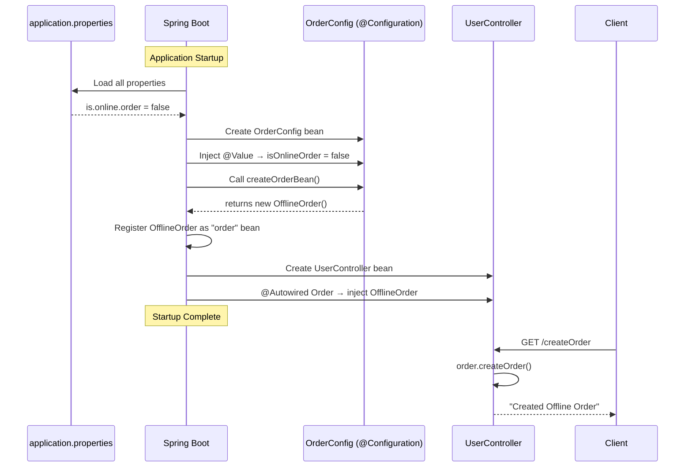
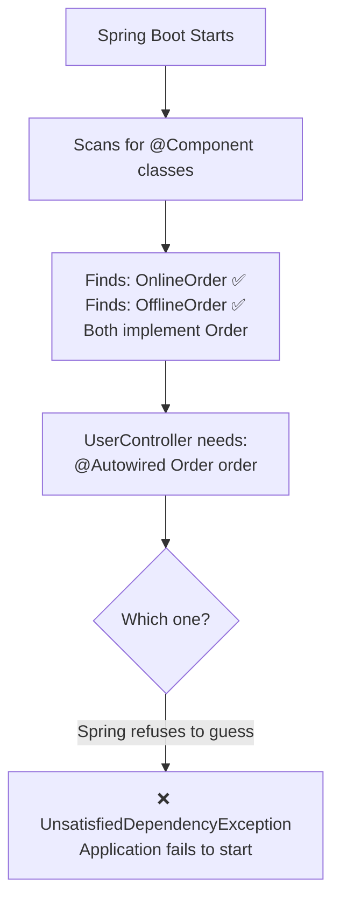
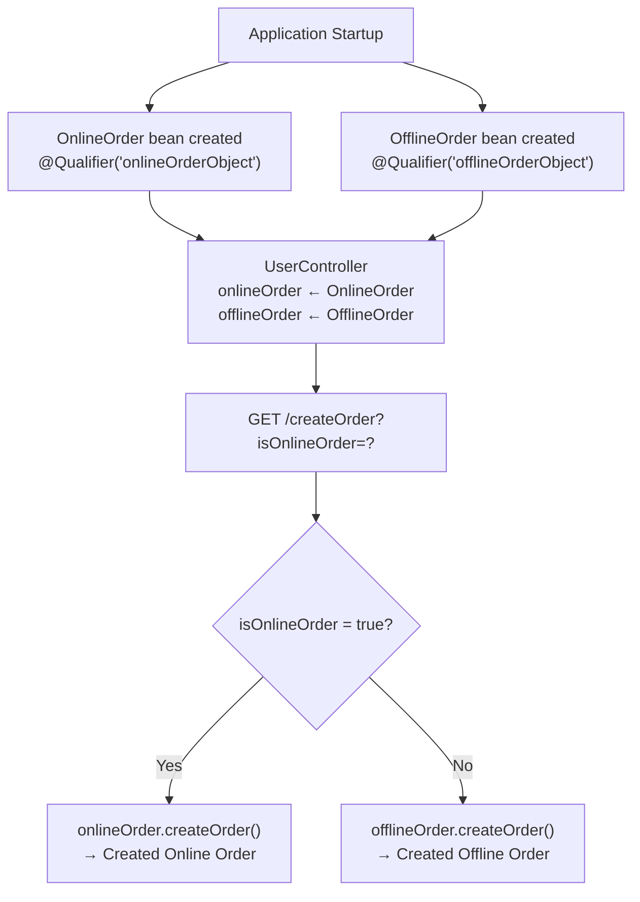
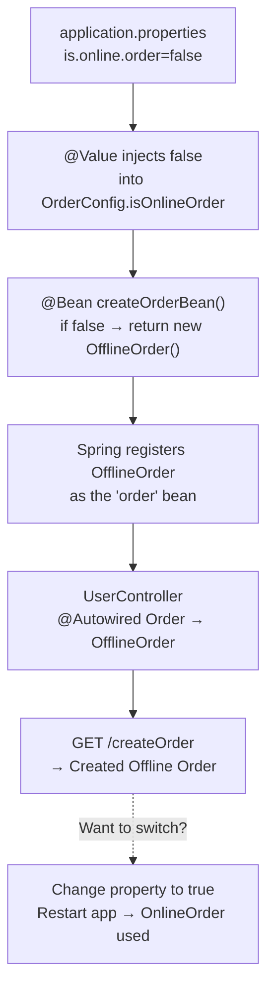

# 🌱 Dynamic Bean Initialization — @Value, @Qualifier & @Bean
### Spring Boot Series | Concept and Coding

---

> [!IMPORTANT]
> These notes are fully self-contained. A student can learn dynamic bean initialization in Spring Boot entirely from this guide without watching the original lecture.

---

## Table of Contents

1. [Prerequisites — What You Need to Know First](#1-prerequisites--what-you-need-to-know-first)
2. [The Problem — Unsatisfied Dependency](#2-the-problem--unsatisfied-dependency)
3. [Quick Fix Recap — @Qualifier](#3-quick-fix-recap--qualifier)
4. [Why @Qualifier Breaks Dependency Inversion](#4-why-qualifier-breaks-dependency-inversion)
5. [Solution 1 — Dynamic Selection via @Qualifier at Runtime (Industry Standard)](#5-solution-1--dynamic-selection-via-qualifier-at-runtime-industry-standard)
6. [Solution 2 — Dynamic Bean Initialization via @Value and @Bean](#6-solution-2--dynamic-bean-initialization-via-value-and-bean)
7. [@Value Annotation — Deep Dive](#7-value-annotation--deep-dive)
8. [application.properties — The Configuration File](#8-applicationproperties--the-configuration-file)
9. [Complete Execution Flow](#9-complete-execution-flow)
10. [Solution 1 vs Solution 2 — Comparison](#10-solution-1-vs-solution-2--comparison)
11. [Key Diagrams](#11-key-diagrams)
12. [Interview Notes](#12-interview-notes)
13. [Common Mistakes](#13-common-mistakes)
14. [Summary Cheat Sheet](#14-summary-cheat-sheet)

---

# 1. Prerequisites — What You Need to Know First

Before understanding dynamic bean initialization, you need to be comfortable with these concepts. They are briefly summarized here so the notes remain self-contained.

## Dependency Injection (DI)

Spring Boot manages objects (called **beans**) and automatically provides them wherever they are needed — this is called Dependency Injection.

```java
@Component
public class UserService {

    @Autowired
    private OrderService orderService;   // Spring injects this — you don't create it manually
}
```

## @Component

Marks a class so Spring automatically detects it during component scanning and registers it as a bean in the Spring ApplicationContext.

## @Autowired

Tells Spring to inject a matching bean into this field, constructor, or setter.

## Dependency Inversion Principle (DIP)

A software design principle from SOLID that states:

> *High-level modules should not depend on low-level modules. Both should depend on abstractions (interfaces).*

In practice this means: instead of depending on a concrete class (`OnlineOrder`), depend on an interface (`Order`). This allows the concrete implementation to be **swapped at runtime** without changing the high-level code.

## @Bean and @Configuration

`@Bean` is used inside a `@Configuration` class to manually declare a bean — telling Spring exactly how to create it. This is an alternative to `@Component`.

```java
@Configuration
public class AppConfig {

    @Bean
    public Order createOrderBean() {
        return new OnlineOrder();  // You control what Spring creates
    }
}
```

---

# 2. The Problem — Unsatisfied Dependency

## Setup

Consider this design:

```java
// The abstraction (interface)
public interface Order {
    void createOrder();
}

// Implementation 1
@Component
public class OnlineOrder implements Order {

    @Override
    public void createOrder() {
        System.out.println("Created Online Order");
    }
}

// Implementation 2
@Component
public class OfflineOrder implements Order {

    @Override
    public void createOrder() {
        System.out.println("Created Offline Order");
    }
}
```

```java
// The controller that depends on Order
@RestController
public class UserController {

    @Autowired
    private Order order;   // Which one? OnlineOrder or OfflineOrder?

    @GetMapping("/createOrder")
    public String createOrder() {
        order.createOrder();
        return "Order created";
    }
}
```

## What Happens at Startup

```
Application Start
      │
      ▼
Spring scans for components
      │
      ▼
Spring finds UserController (singleton — created eagerly at startup)
      │
      ▼
Spring tries to resolve dependency: Order
      │
      ▼
Spring finds TWO beans implementing Order:
  - OnlineOrder  (via @Component)
  - OfflineOrder (via @Component)
      │
      ▼
Spring doesn't assume which one to pick
      │
      ▼
❌ APPLICATION FAILS TO START
```

**Error:**
```
UnsatisfiedDependencyException: Error creating bean with name 'userController':
Unsatisfied dependency expressed through field 'order';
expected single matching bean but found 2: onlineOrder, offlineOrder
```

## Why Spring Doesn't Just Pick One

Spring follows the **principle of least surprise**. Silently picking an implementation could cause wrong business behaviour. Spring prefers to fail loudly and let you decide explicitly.

---

# 3. Quick Fix Recap — @Qualifier

`@Qualifier` was introduced to resolve ambiguity — you explicitly name the bean you want injected.

## How It Works

```java
// Tag OnlineOrder with a qualifier name
@Component
@Qualifier("onlineOrderObject")
public class OnlineOrder implements Order {
    @Override
    public void createOrder() {
        System.out.println("Created Online Order");
    }
}

// Tag OfflineOrder with a qualifier name
@Component
@Qualifier("offlineOrderObject")
public class OfflineOrder implements Order {
    @Override
    public void createOrder() {
        System.out.println("Created Offline Order");
    }
}
```

```java
@RestController
public class UserController {

    @Autowired
    @Qualifier("onlineOrderObject")   // ← Tell Spring exactly which bean to inject
    private Order order;

    @GetMapping("/createOrder")
    public String createOrder() {
        order.createOrder();
        return "Order created";
    }
}
```

**Result:** Spring always injects `OnlineOrder`. The ambiguity is resolved.

---

# 4. Why @Qualifier Breaks Dependency Inversion

## The Problem with Hard-Coding the Qualifier

```java
@Autowired
@Qualifier("onlineOrderObject")   // ← This is HARD-CODED
private Order order;
```

By hard-coding `"onlineOrderObject"`, you have permanently decided that `UserController` will **always** use `OnlineOrder`. This violates the Dependency Inversion Principle because:

- `UserController` (high-level) is now rigidly tied to `OnlineOrder` (low-level implementation)
- You cannot switch to `OfflineOrder` without modifying `UserController`
- The interface `Order` provides no real abstraction benefit — the implementation is fixed

## What DIP Promises vs What We Have

| Expectation (DIP) | Reality with Hard-Coded @Qualifier |
|---|---|
| Implementation can be swapped dynamically | Implementation is fixed at compile time |
| High-level module doesn't know about low-level | Controller explicitly references `"onlineOrderObject"` |
| Easy to extend with new implementations | Adding a new implementation requires code changes in controller |

## The Goal

We need a way to decide **at runtime** (or via configuration) which implementation to use — without hard-coding the choice in the controller. Two solutions achieve this:

1. **Solution 1** — Select between pre-injected beans based on runtime input (client request)
2. **Solution 2** — Configure which bean Spring creates using `@Value` and `application.properties`

---

# 5. Solution 1 — Dynamic Selection via @Qualifier at Runtime (Industry Standard)

## Overview

Instead of injecting one bean and hard-coding which one, **inject both beans** into the controller and choose between them at runtime based on input (e.g., a request parameter from the client).

> [!NOTE]
> This is the **industry-standard approach** used in real production codebases.

## Full Code

```java
// Interface — unchanged
public interface Order {
    void createOrder();
}

// OnlineOrder — with qualifier
@Component
@Qualifier("onlineOrderObject")
public class OnlineOrder implements Order {
    @Override
    public void createOrder() {
        System.out.println("Created Online Order");
    }
}

// OfflineOrder — with qualifier
@Component
@Qualifier("offlineOrderObject")
public class OfflineOrder implements Order {
    @Override
    public void createOrder() {
        System.out.println("Created Offline Order");
    }
}
```

```java
@RestController
public class UserController {

    // Inject BOTH beans — each identified by its qualifier
    @Autowired
    @Qualifier("onlineOrderObject")
    private Order onlineOrder;          // OnlineOrder bean injected here

    @Autowired
    @Qualifier("offlineOrderObject")
    private Order offlineOrder;         // OfflineOrder bean injected here

    @GetMapping("/createOrder")
    public String createOrder(@RequestParam boolean isOnlineOrder) {
        // Choose dynamically based on client input
        if (isOnlineOrder) {
            onlineOrder.createOrder();
            return "Online order created";
        } else {
            offlineOrder.createOrder();
            return "Offline order created";
        }
    }
}
```

## How It Works

```
Application Startup (Singleton beans created):
  OnlineOrder  bean ──────────────────► injected into "onlineOrder"  field
  OfflineOrder bean ──────────────────► injected into "offlineOrder" field

Runtime (Client sends request):
  GET /createOrder?isOnlineOrder=true  → onlineOrder.createOrder()  → "Created Online Order"
  GET /createOrder?isOnlineOrder=false → offlineOrder.createOrder() → "Created Offline Order"
```

## Why This Doesn't Fully Break DIP

- Both beans are singletons — created once at startup
- The controller holds references to both
- The **decision** of which to use is made at runtime based on external input
- Adding a new order type (e.g., `InternationalOrder`) only requires adding a new bean and adding a new branch in the selection logic — the interface is unchanged

## Testing

```
GET /createOrder?isOnlineOrder=true
→ Output: Created Online Order

GET /createOrder?isOnlineOrder=false
→ Output: Created Offline Order
```

---

# 6. Solution 2 — Dynamic Bean Initialization via @Value and @Bean

## Overview

Instead of injecting both beans and choosing between them, **configure Spring to create only one bean** — and control which one through `application.properties`. Changing a property value switches the implementation without touching Java code.

## Key Difference from Solution 1

| | Solution 1 | Solution 2 |
|---|---|---|
| Who decides? | Client (runtime request param) | Configuration file (deploy-time property) |
| Both beans created? | Yes (both singletons exist) | No (only one bean created) |
| Change requires? | Different request param | Change in `application.properties` |
| Use case | User-driven selection per request | Environment/deployment-driven selection |

## The Classes — No @Component

```java
// Interface — unchanged
public interface Order {
    void createOrder();
}

// OnlineOrder — NO @Component (Spring won't auto-create this)
public class OnlineOrder implements Order {
    @Override
    public void createOrder() {
        System.out.println("Created Online Order");
    }
}

// OfflineOrder — NO @Component (Spring won't auto-create this)
public class OfflineOrder implements Order {
    @Override
    public void createOrder() {
        System.out.println("Created Offline Order");
    }
}
```

> [!IMPORTANT]
> There is **no `@Component`** on either implementation class. Spring will not auto-create beans for them. We are taking full manual control via `@Configuration` and `@Bean`.

## The Configuration Class

```java
@Configuration
public class OrderConfig {

    @Value("${is.online.order}")      // Read value from application.properties
    private boolean isOnlineOrder;

    @Bean
    public Order createOrderBean() {
        if (isOnlineOrder) {
            return new OnlineOrder();    // Spring manages this OnlineOrder as the "order" bean
        } else {
            return new OfflineOrder();   // Spring manages this OfflineOrder as the "order" bean
        }
    }
}
```

## The Configuration File — application.properties

```properties
# application.properties
is.online.order=false
```

## The Controller — Clean, No Qualifier Logic

```java
@RestController
public class UserController {

    @Autowired
    private Order order;    // Spring injects whichever bean was created by OrderConfig

    @GetMapping("/createOrder")
    public String createOrder() {
        order.createOrder();
        return "Order created";
    }
}
```

## What Happens at Startup

```
Application Starts
      │
      ▼
Spring reads application.properties
  is.online.order = false
      │
      ▼
@Value injects false into OrderConfig.isOnlineOrder
      │
      ▼
Spring calls createOrderBean()
  isOnlineOrder = false → returns new OfflineOrder()
      │
      ▼
Spring registers OfflineOrder as the "order" bean
      │
      ▼
UserController is initialized (singleton)
  @Autowired Order → OfflineOrder is injected
      │
      ▼
GET /createOrder → order.createOrder() → "Created Offline Order"
```

## Switching Implementations

To switch to `OnlineOrder`, change one line in `application.properties`:

```properties
# Change this:
is.online.order=false

# To this:
is.online.order=true
```

Restart the application. Now `OnlineOrder` is created and injected. **No Java code changed.**

---

# 7. @Value Annotation — Deep Dive

## Overview

`@Value` is a Spring annotation used to inject values from **external sources** into Spring-managed beans. It is one of the most versatile configuration tools in Spring Boot.

## Definition

> `@Value` injects a value into a Spring bean field, constructor parameter, or method parameter. The value can come from property files, environment variables, system properties, or be a literal provided inline.

## Syntax

```java
@Value("${property.key}")           // From application.properties / environment variable
@Value("${property.key:default}")   // With a default value if key is not found
@Value("literal value")             // Inline literal — direct value
@Value("#{expression}")             // Spring Expression Language (SpEL)
```

## The Placeholder Syntax

```
@Value("${is.online.order}")
          │─────────────│
          This is the KEY in application.properties
```

The `${}` syntax is a **property placeholder**. Spring resolves it by:
1. Looking in `application.properties`
2. Looking in environment variables
3. Looking in system properties
4. If still not found and no default provided — throws `IllegalArgumentException`

## Sources @Value Can Inject From

### 1. application.properties

```properties
# application.properties
is.online.order=true
app.name=MyApplication
server.timeout=30
```

```java
@Value("${is.online.order}")
private boolean isOnlineOrder;     // true

@Value("${app.name}")
private String appName;            // "MyApplication"

@Value("${server.timeout}")
private int timeout;               // 30
```

### 2. Environment Variables

If your OS or Docker container has an environment variable set:

```bash
export IS_ONLINE_ORDER=true
```

Spring Boot can pick this up (with some naming convention mapping). This is common in cloud/containerized deployments.

### 3. Inline Literals

You can directly embed a value without a property file:

```java
@Value("true")
private boolean isOnlineOrder;     // Always true — hardcoded

@Value("Shreyansh")
private String name;               // Always "Shreyansh"

@Value("42")
private int port;                  // Always 42
```

> [!NOTE]
> Inline literals are generally used for testing or demonstrations. In real applications, values come from property files or environment variables so they can be changed without recompiling.

### 4. Default Values

If the property might not always be defined, provide a fallback:

```java
@Value("${is.online.order:true}")   // If key not found, use "true" as default
private boolean isOnlineOrder;
```

The syntax is `${key:default}` — a colon separates the key from the default.

## Type Conversion

Like `@RequestParam`, Spring automatically converts the property string to the declared Java type:

```java
@Value("${server.port}")
private int port;          // "8080" (String) → 8080 (int)

@Value("${feature.enabled}")
private boolean enabled;   // "true" (String) → true (boolean)

@Value("${max.retries}")
private double maxRetries; // "3.5" (String) → 3.5 (double)
```

## @Value in Different Injection Points

```java
// Field injection
@Component
public class MyService {
    @Value("${app.name}")
    private String appName;
}

// Constructor injection (preferred for testability)
@Component
public class MyService {
    private final String appName;

    public MyService(@Value("${app.name}") String appName) {
        this.appName = appName;
    }
}

// Method parameter injection (in @Bean methods)
@Configuration
public class AppConfig {

    @Bean
    public Order createOrderBean(@Value("${is.online.order}") boolean isOnlineOrder) {
        return isOnlineOrder ? new OnlineOrder() : new OfflineOrder();
    }
}
```

---

# 8. application.properties — The Configuration File

## What It Is

`application.properties` is Spring Boot's primary configuration file. It lives in:

```
src/
└── main/
    └── resources/
        └── application.properties    ← here
```

## Format

Simple `key=value` pairs, one per line:

```properties
# Server configuration
server.port=8080

# Database
spring.datasource.url=jdbc:mysql://localhost:3306/mydb
spring.datasource.username=root
spring.datasource.password=secret

# Custom application properties
is.online.order=true
app.name=ConceptAndCoding
max.order.limit=100
```

## How Spring Reads It

At application startup, Spring Boot automatically:
1. Finds `application.properties` in `src/main/resources/`
2. Loads all key-value pairs into the `Environment`
3. Resolves `@Value("${key}")` placeholders by looking up the key in the `Environment`

## Naming Convention

Property keys follow a **dot-separated, lowercase** convention:

```properties
# Good — follows convention
is.online.order=true
app.max.connections=10
feature.dark.mode.enabled=false

# Works but not idiomatic
IsOnlineOrder=true       ← avoid camelCase
IS_ONLINE_ORDER=true     ← environment variable style
```

## Multiple Environments with Profiles

Spring Boot supports environment-specific property files:

```
application.properties           ← default (always loaded)
application-dev.properties       ← loaded when profile "dev" is active
application-prod.properties      ← loaded when profile "prod" is active
```

```properties
# application-dev.properties
is.online.order=true

# application-prod.properties
is.online.order=false
```

Activate a profile:
```properties
# application.properties
spring.profiles.active=dev
```

---

# 9. Complete Execution Flow

## Solution 2 — Step-by-Step Bean Creation



## Changing the Configuration

```
Step 1: Change application.properties
  is.online.order=false  →  is.online.order=true

Step 2: Restart the application

Step 3: Spring re-reads properties
  isOnlineOrder = true
  createOrderBean() → returns new OnlineOrder()

Step 4: OnlineOrder is now the "order" bean
  UserController gets OnlineOrder injected

Step 5: API call
  GET /createOrder → "Created Online Order"
```

---

# 10. Solution 1 vs Solution 2 — Comparison

## Full Comparison Table

| Aspect | Solution 1 (@Qualifier at Runtime) | Solution 2 (@Value + @Bean) |
|---|---|---|
| **Decision maker** | Client (per-request parameter) | Configuration file (at startup) |
| **When decided** | At runtime, each request | At startup (once per application lifecycle) |
| **Both beans created?** | Yes — both OnlineOrder and OfflineOrder beans exist | No — only one bean is created |
| **Flexibility** | Per-request — different users can get different order types | Per-deployment — all users get same order type |
| **Code complexity** | Slightly more (two @Autowired fields + if/else in method) | Slightly more initial setup (@Configuration class) |
| **Change requires** | Different client input | Property file change + restart |
| **Use case** | Feature toggles per user, A/B testing, user-specific behavior | Environment-based config (dev/staging/prod differences) |
| **Industry usage** | Very common for user-driven routing | Very common for environment configuration |

## When to Use Which

```
Is the choice made per-request based on user input?
  YES → Solution 1 (@Qualifier with both beans injected, runtime if/else)

Is the choice made per-deployment based on environment?
  YES → Solution 2 (@Value reading from application.properties)
```

## Real-World Examples

**Solution 1 (Runtime Selection):**
- Payment gateway: PayPal vs Stripe — user chooses at checkout
- Notification: Email vs SMS — user preference setting
- Order type: Online vs In-store — user selects at order creation

**Solution 2 (Config-Based Selection):**
- Development environment uses a mock payment gateway; production uses real one
- Local environment uses H2 in-memory DB; production uses MySQL
- Feature flag: new recommendation algorithm enabled in production only

---

# 11. Key Diagrams

## The Unsatisfied Dependency Problem



---

## Solution 1 — Both Beans, Runtime Choice



---

## Solution 2 — @Value + @Bean, Config-Based Choice



---

## @Value Sources Mind Map

```mermaid
mindmap
  root((@Value))
    application.properties
      Key-value pairs
      Type auto-converted
      Dot-separated keys
    Environment Variables
      OS-level
      Docker / Kubernetes
      CI/CD pipelines
    Inline Literals
      Direct string value
      Used for testing
      No external file needed
    Default Values
      Syntax - ${key:default}
      Fallback when key missing
    Spring Profiles
      application-dev.properties
      application-prod.properties
      spring.profiles.active
```

---

# 12. Interview Notes

## Common Interview Questions and Answers

### Q1: What is the Unsatisfied Dependency problem in Spring?

**Answer:** When Spring finds two or more beans of the same type and tries to autowire a field of that type, it cannot determine which bean to inject. Since Spring doesn't assume, it throws `UnsatisfiedDependencyException` and the application fails to start.

---

### Q2: How does @Qualifier resolve the Unsatisfied Dependency problem?

**Answer:** `@Qualifier` lets you assign a name to a bean and then reference that specific name at the injection point. Spring injects the bean whose qualifier name matches, resolving the ambiguity.

---

### Q3: Why does @Qualifier break Dependency Inversion?

**Answer:** When you hard-code a qualifier name at the injection point (e.g., `@Qualifier("onlineOrderObject")`), you permanently bind the high-level module (controller) to a specific low-level implementation. The choice of implementation is made at compile time, not at runtime, so you lose the flexibility to swap implementations without modifying the controller.

---

### Q4: What is @Value used for in Spring Boot?

**Answer:** `@Value` injects values into Spring beans from external sources — primarily `application.properties`, environment variables, or as inline literals. It allows configuration values to be externalized from code, supporting different behavior across environments without code changes.

---

### Q5: What is the difference between `@Value("${key}")` and `@Value("literal")`?

**Answer:**
- `@Value("${key}")` is a **property placeholder** — Spring looks up the key in `application.properties` (or environment) and injects the value found there. The value is external and configurable.
- `@Value("literal")` is an **inline literal** — the string `"literal"` is directly assigned. It doesn't look anything up. Useful for testing, but removes configurability.

---

### Q6: What happens if a @Value key is not found in application.properties?

**Answer:** Spring throws `IllegalArgumentException` at startup: `Could not resolve placeholder 'key' in value "${key}"`. To avoid this, provide a default: `@Value("${key:defaultValue}")`.

---

### Q7: What is the difference between Solution 1 and Solution 2 for dynamic bean selection?

**Answer:**
- **Solution 1** injects multiple beans and selects between them at runtime per request using if/else logic — suitable when user input determines the implementation.
- **Solution 2** uses `@Value` to read a property at startup and creates only one bean based on that property — suitable when the environment or deployment configuration determines the implementation.

---

### Q8: Why is @Component removed in Solution 2?

**Answer:** In Solution 2, we use a `@Configuration` class with `@Bean` to manually control bean creation. If `@Component` were still present on `OnlineOrder` and `OfflineOrder`, Spring would auto-create beans for both AND the `@Bean` method would create another — leading back to the ambiguity problem. Removing `@Component` means Spring only creates beans through the explicit `@Bean` method.

---

### Q9: Can @Value inject values into non-Spring-managed classes?

**Answer:** No. `@Value` only works in classes managed by the Spring container (i.e., classes annotated with `@Component`, `@Service`, `@Repository`, `@Controller`, `@Configuration`, or registered via `@Bean`). Plain Java objects (POJOs) not managed by Spring cannot use `@Value`.

---

### Q10: What is the difference between @Value and @ConfigurationProperties?

| | `@Value` | `@ConfigurationProperties` |
|---|---|---|
| Binds | Single property | Group of related properties |
| Syntax | `@Value("${key}")` per field | One annotation on the class |
| Type safety | Manual per field | Fully type-safe |
| Best for | A few individual values | Structured configuration groups |

---

# 13. Common Mistakes

## Mistake 1 — Using @Component Alongside @Bean for the Same Class

```java
// ❌ Wrong — @Component creates a bean AND @Bean creates another → ambiguity
@Component
public class OnlineOrder implements Order { ... }

@Configuration
public class OrderConfig {
    @Bean
    public Order createOrderBean() {
        return new OnlineOrder();  // Now TWO OnlineOrder beans exist
    }
}
```

```java
// ✅ Correct — choose one approach
// Either use @Component (auto-managed):
@Component
public class OnlineOrder implements Order { ... }

// OR use @Bean (manually managed) — remove @Component:
public class OnlineOrder implements Order { ... }

@Configuration
public class OrderConfig {
    @Bean
    public Order createOrderBean() { ... }
}
```

## Mistake 2 — @Value on a Non-Spring-Managed Class

```java
// ❌ Wrong — plain POJO, not managed by Spring
public class OrderConfig {

    @Value("${is.online.order}")   // Spring never sees this — value stays null/false
    private boolean isOnlineOrder;
}
```

```java
// ✅ Correct — must be a Spring-managed bean
@Configuration                     // ← Makes this a Spring bean
public class OrderConfig {

    @Value("${is.online.order}")   // Now Spring injects the value
    private boolean isOnlineOrder;
}
```

## Mistake 3 — Mismatched Property Key

```properties
# application.properties
is.online.order=true
```

```java
// ❌ Wrong — key doesn't match
@Value("${isOnlineOrder}")         // Looks for "isOnlineOrder" — not found!
private boolean isOnlineOrder;     // Throws IllegalArgumentException at startup
```

```java
// ✅ Correct — key must match exactly
@Value("${is.online.order}")       // Matches "is.online.order" in properties file
private boolean isOnlineOrder;
```

## Mistake 4 — No Default Value for Optional Properties

```java
// ❌ Risky — if "is.online.order" is missing from properties, app crashes
@Value("${is.online.order}")
private boolean isOnlineOrder;
```

```java
// ✅ Safe — provide a default value
@Value("${is.online.order:true}")   // Defaults to true if key is absent
private boolean isOnlineOrder;
```

## Mistake 5 — Using @Value in a Static Field

```java
// ❌ Wrong — @Value doesn't work with static fields
@Component
public class Config {

    @Value("${is.online.order}")
    private static boolean isOnlineOrder;    // Always false (default) — @Value ignored
}
```

```java
// ✅ Correct — use instance fields only
@Component
public class Config {

    @Value("${is.online.order}")
    private boolean isOnlineOrder;           // Works correctly
}
```

## Mistake 6 — Forgetting to Restart After Property Change (Solution 2)

In Solution 2, `@Value` is read **at startup only**. If you change `application.properties` while the app is running, the change has no effect until you restart.

> [!TIP]
> Spring Boot DevTools or Spring Cloud Config can provide dynamic property refresh without restart in development/cloud environments.

---

# 14. Summary Cheat Sheet

## The Problem and Solutions

```
Problem: Two beans implement the same interface → Spring can't choose → UnsatisfiedDependencyException

Solution 1: Inject both beans, choose at runtime
  - Both beans exist (singletons)
  - if/else selects based on request input
  - Best for: per-request, user-driven selection

Solution 2: Create one bean conditionally via @Value
  - Only one bean exists
  - Property file controls which one
  - Best for: environment/deployment-level configuration
```

## @Value Quick Reference

| Syntax | Source | Example |
|---|---|---|
| `@Value("${key}")` | application.properties | `@Value("${is.online.order}")` |
| `@Value("${key:default}")` | Properties with fallback | `@Value("${timeout:30}")` |
| `@Value("literal")` | Inline literal | `@Value("true")` |
| `@Value("#{expression}")` | Spring Expression Language | `@Value("#{2 * 3}")` |

## Annotation Roles in This Topic

| Annotation | Role |
|---|---|
| `@Qualifier` | Names a bean and specifies which bean to inject |
| `@Value` | Injects external configuration values into a bean field |
| `@Bean` | Manually declares a bean in a `@Configuration` class |
| `@Configuration` | Marks a class as a source of bean definitions |
| `@Component` | Auto-registers a class as a Spring bean |
| `@Autowired` | Tells Spring to inject a dependency |

## Decision Guide

```
Multiple implementations of an interface?
      │
      ├── User chooses per request?
      │     → Solution 1: Inject all with @Qualifier, if/else at runtime
      │
      └── Environment determines which one?
            → Solution 2: @Configuration + @Bean + @Value from application.properties
```

## application.properties Location

```
src/
└── main/
    └── resources/
        └── application.properties    ← Spring Boot reads this automatically
```

---

*Study Guide — Dynamic Bean Initialization | Spring Boot Series | Concept and Coding*
