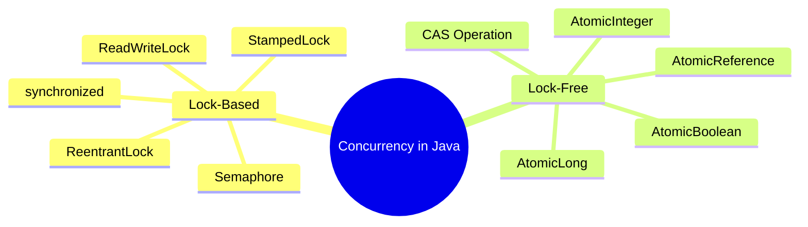
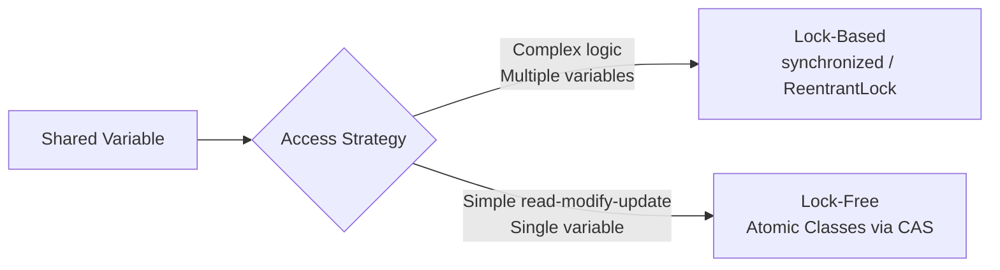
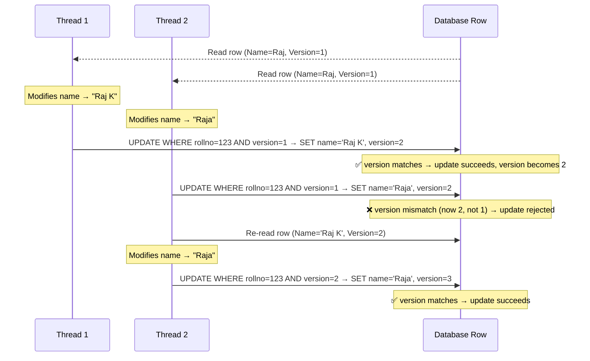
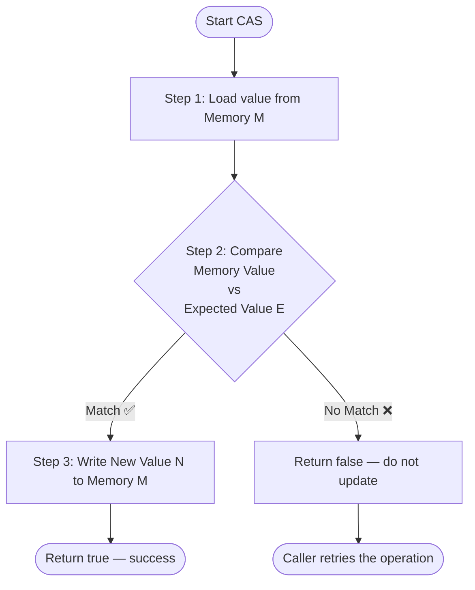
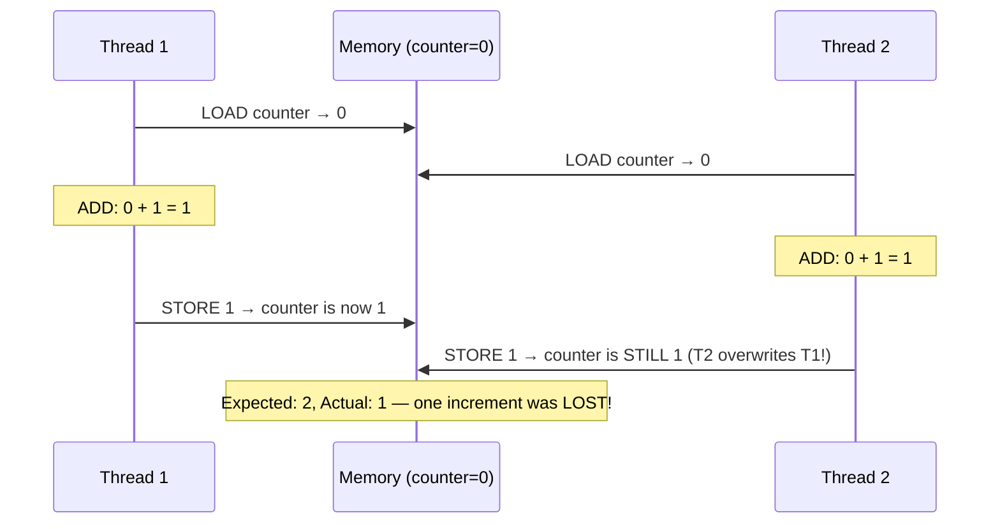
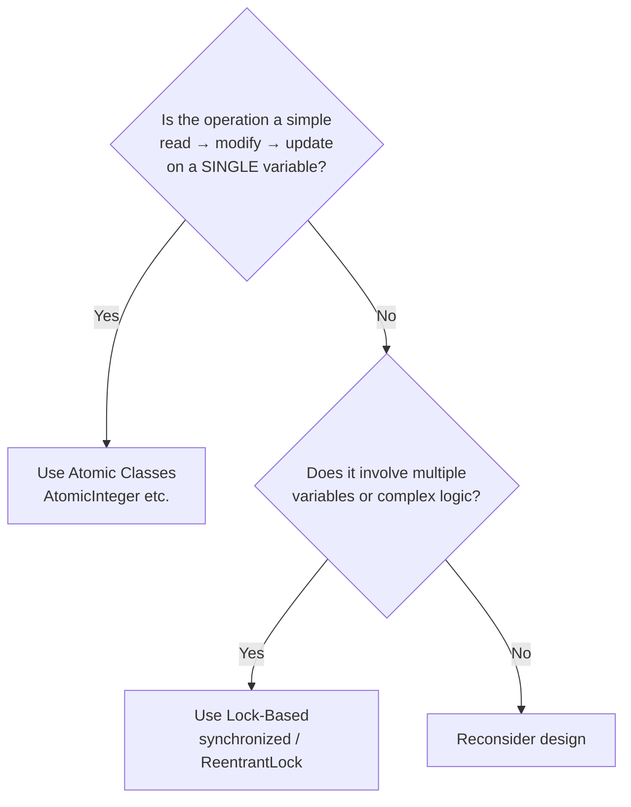
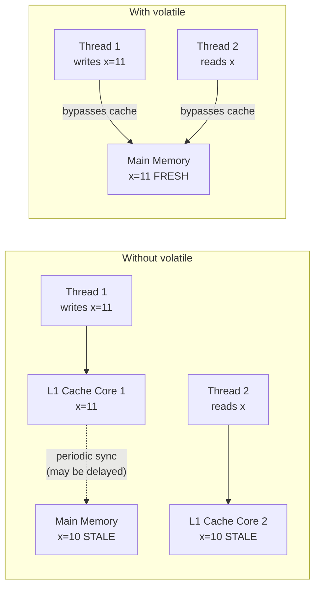
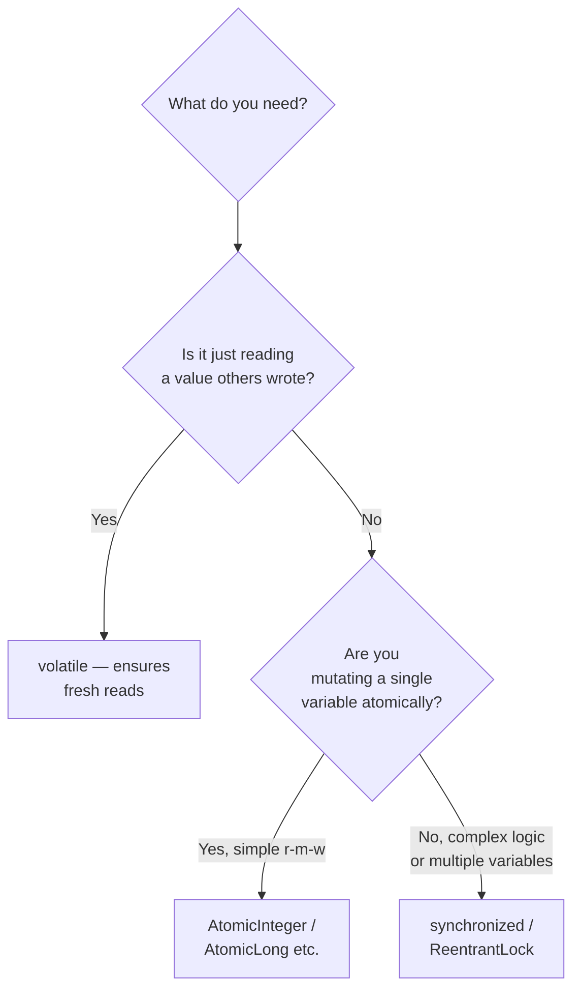
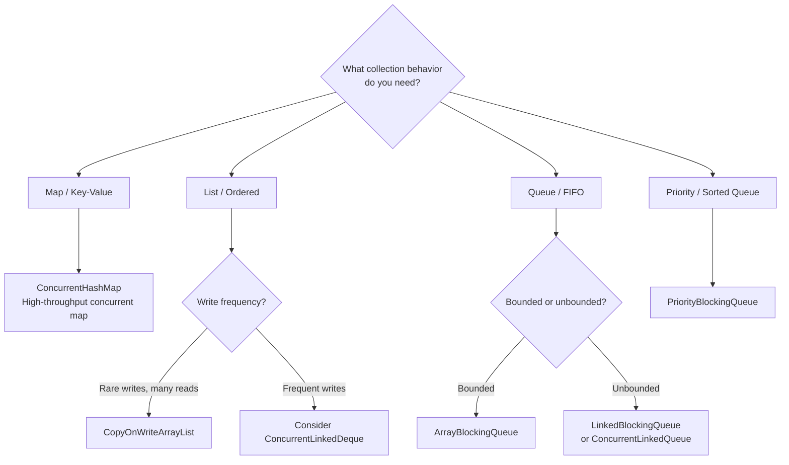
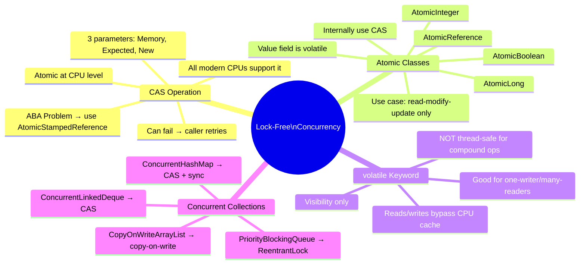

# Java Multithreading: Atomic Variables, CAS, Volatile & Concurrent Collections

> A comprehensive study guide covering lock-free concurrency, the Compare-And-Swap operation,
> atomic classes, the volatile keyword, and thread-safe concurrent collections.

---

## Table of Contents

1. [Ways to Achieve Concurrency](#1-ways-to-achieve-concurrency)
2. [Lock-Based vs Lock-Free Mechanisms](#2-lock-based-vs-lock-free-mechanisms)
3. [Optimistic Concurrency Control — A Quick Recap](#3-optimistic-concurrency-control--a-quick-recap)
4. [Compare-And-Swap (CAS) Operation](#4-compare-and-swap-cas-operation)
5. [ABA Problem in CAS](#5-aba-problem-in-cas)
6. [The Problem with Non-Atomic Operations](#6-the-problem-with-non-atomic-operations)
7. [Atomic Variables in Java](#7-atomic-variables-in-java)
8. [How `AtomicInteger` Internally Uses CAS](#8-how-atomicinteger-internally-uses-cas)
9. [The `volatile` Keyword](#9-the-volatile-keyword)
10. [Atomic vs Volatile — Key Differences](#10-atomic-vs-volatile--key-differences)
11. [Concurrent Collections in Java](#11-concurrent-collections-in-java)
12. [Interview Notes](#12-interview-notes)
13. [Practice Questions](#13-practice-questions)
14. [Summary Cheat Sheet](#14-summary-cheat-sheet)

---

# 1. Ways to Achieve Concurrency

## Overview

In Java, concurrency means allowing multiple threads to execute work simultaneously while keeping shared data consistent. There are exactly **two fundamental approaches** to achieving concurrency.

## The Two Mechanisms

| # | Mechanism | Description | Examples |
|---|-----------|-------------|---------|
| 1 | **Lock-Based** | Threads acquire a lock before entering a critical section. Only one thread proceeds at a time. | `synchronized`, `ReentrantLock`, `ReadWriteLock`, `StampedLock`, `Semaphore` |
| 2 | **Lock-Free** | No locks are used. Threads compete atomically at the CPU level. | `AtomicInteger`, `AtomicBoolean`, `AtomicLong`, `AtomicReference` |



> [!IMPORTANT]
> Lock-free is **not** a general replacement for lock-based concurrency. It is effective only in very specific, simple scenarios (primarily the **read → modify → update** pattern). For complex business logic with multiple variables or coordinated state, lock-based mechanisms remain the correct tool.

---

# 2. Lock-Based vs Lock-Free Mechanisms

## Lock-Based Mechanism

When a thread wants to access shared data, it first **acquires a lock**. Other threads that need the same resource must wait (block) until the lock is released. This guarantees that only one thread executes the critical section at a time.

**Characteristics:**
- Safe for complex business logic spanning multiple steps or multiple shared variables
- Threads block while waiting → context switching overhead
- Risk of deadlock if locks are acquired in inconsistent orders
- Risk of thread starvation if one thread monopolizes the lock

## Lock-Free Mechanism

Instead of blocking, threads **retry operations atomically** using CPU-level hardware instructions (CAS). No thread ever blocks waiting for a lock.

**Characteristics:**
- No blocking, no context switching overhead for lock acquisition
- Works best for simple **read → modify → update** patterns on a single variable
- Can have liveness issues (a thread retrying infinitely if contention is very high — called **livelock**)
- Faster than lock-based in the specific use case it targets



> [!TIP]
> Think of lock-free as a scalpel — extremely effective for a precise task, but not a substitute for the versatility of a full surgical toolkit (lock-based concurrency).

---

# 3. Optimistic Concurrency Control — A Quick Recap

## Overview

Before diving into CAS, it helps to understand **Optimistic Concurrency Control (OCC)**, which is the same conceptual idea applied at the database level. CAS is the hardware-level equivalent.

## How OCC Works (Database Example)

Consider a database table with a **row version** column:

| Roll Number | Name | Row Version |
|-------------|------|-------------|
| 123 | Raj | 1 |

**Scenario: Two threads read and try to update the same row simultaneously.**



**Key takeaway:** OCC allows multiple readers but detects conflicts at write time using a **version number**. If a conflict is detected, the losing thread re-reads and retries. No locks are ever held.

---

# 4. Compare-And-Swap (CAS) Operation

## Overview

**Compare-And-Swap (CAS)** is a low-level atomic instruction supported natively by all modern CPUs. It is the hardware foundation that makes lock-free programming possible in Java.

> CAS is to hardware what Optimistic Concurrency Control is to databases. They solve the same problem at different levels of the system.

## Definition

CAS is an **atomic CPU instruction** that performs three steps — read, compare, and conditionally write — as a single indivisible unit, even across multiple CPU cores.

## Parameters

CAS accepts exactly **three parameters**:

| Parameter | Description |
|-----------|-------------|
| **Memory Address (M)** | The location in memory where the variable is stored |
| **Expected Value (E)** | The value you expect to currently be in that memory location |
| **New Value (N)** | The value you want to write if the expectation holds |

## How CAS Works — Step by Step



## Detailed Example

```
Memory M1 contains variable x = 10

CAS(M1, expected=10, newValue=12)

Step 1: Load x from M1 → reads 10
Step 2: Compare 10 (memory) == 10 (expected) → ✅ Match
Step 3: Write 12 to M1 → x is now 12
Result: Success
```

```
CAS(M1, expected=10, newValue=15)
// Meanwhile, another thread changed x to 12

Step 1: Load x from M1 → reads 12
Step 2: Compare 12 (memory) == 10 (expected) → ❌ No match
Step 3: Nothing written
Result: Failure — caller must retry
```

## Why CAS is Atomic

All modern CPUs implement CAS as a single hardware instruction (e.g., `CMPXCHG` on x86). The CPU guarantees that no other core can interfere between the load and the conditional store. This guarantee holds regardless of how many cores the CPU has.

> [!NOTE]
> CAS atomicity is guaranteed by the **CPU hardware**, not by the operating system or the JVM. This is what makes it fundamentally faster than lock-based mechanisms — no OS-level thread blocking is involved.

---

# 5. ABA Problem in CAS

## What is the ABA Problem?

The ABA problem occurs when a memory location's value changes from **A → B → A** between a thread's read and its CAS attempt. Because the value looks the same as the originally read value, CAS succeeds — even though the data was modified in the interim.

## Example

```
Thread 1 reads M1 → value is 10 (version A)

Meanwhile:
  Some thread changes M1 from 10 → 12
  Another thread changes M1 from 12 → 10 (back to A)

Thread 1 runs CAS(M1, expected=10, newValue=13)
  Step 1: Load M1 → 10 ✅
  Step 2: Compare 10 == 10 → ✅ Match
  Step 3: Write 13 → succeeds

But Thread 1's "10" expectation was based on the ORIGINAL "10".
The memory has been changed and restored — Thread 1 doesn't know.
```

## Solution: Add a Version or Timestamp

Pair each value with a **version counter** (or timestamp). CAS then checks both the value AND the version.

| Event | Value | Version |
|-------|-------|---------|
| Initial | 10 | 1 |
| Changed to 12 | 12 | 2 |
| Changed back to 10 | 10 | 3 |

Thread 1 originally read `(value=10, version=1)`. When it attempts CAS, the memory holds `(value=10, version=3)`. The version mismatch causes CAS to fail correctly.

**Java provides `AtomicStampedReference<V>` and `AtomicMarkableReference<V>` to solve ABA:**

```java
// AtomicStampedReference carries both value and integer stamp (version)
AtomicStampedReference<Integer> ref = new AtomicStampedReference<>(10, 1);

int[] stampHolder = new int[1];
int currentValue = ref.get(stampHolder); // reads value AND stamp
int currentStamp = stampHolder[0];

// CAS now requires both value and stamp to match
boolean success = ref.compareAndSet(
    currentValue,    // expected value
    newValue,        // new value
    currentStamp,    // expected stamp
    currentStamp + 1 // new stamp
);
```

> [!CAUTION]
> If your lock-free code involves values that could cycle back to a previously-seen state (e.g., counters that reset, object pools), be aware of the ABA problem and use `AtomicStampedReference` to guard against it.

---

# 6. The Problem with Non-Atomic Operations

## The `counter++` Illusion

A very common mistake is assuming `counter++` is a single atomic operation. It is **not**.

### What `counter++` Actually Does

The seemingly simple `counter++` expands into **three separate operations**:

```
1. LOAD   → Read the current value of counter from memory
2. ADD    → Increment the loaded value by 1
3. STORE  → Write the incremented value back to memory
```

In single-threaded code this is irrelevant. In multi-threaded code, another thread can slip between any of these three steps.

## Demonstration: The Race Condition

```java
public class SharedResource {
    private int counter = 0;

    public void increment() {
        counter++; // NOT atomic — 3 steps!
    }

    public int get() {
        return counter;
    }
}
```

```java
// Single-threaded: works perfectly
SharedResource resource = new SharedResource();
for (int i = 0; i < 400; i++) {
    resource.increment();
}
System.out.println(resource.get()); // Always 400 ✅
```

```java
// Multi-threaded: BROKEN
SharedResource resource = new SharedResource();

Thread t1 = new Thread(() -> {
    for (int i = 0; i < 200; i++) resource.increment();
});
Thread t2 = new Thread(() -> {
    for (int i = 0; i < 200; i++) resource.increment();
});

t1.start();
t2.start();
t1.join();
t2.join();

System.out.println(resource.get()); // Might print 371, 385, 357... NOT 400 ❌
```

### Why the Output is Wrong — Timeline Visualization



Both threads read `0`, both compute `1`, and both write `1`. The second write overwrites the first. One increment is silently lost.

---

# 7. Atomic Variables in Java

## Overview

Java's `java.util.concurrent.atomic` package provides a set of classes that wrap primitive types (and object references) and expose them through **thread-safe, lock-free atomic operations** built on CAS.

## Available Atomic Classes

| Class | Wraps | Use Case |
|-------|-------|----------|
| `AtomicInteger` | `int` | Thread-safe integer counter/flag |
| `AtomicLong` | `long` | Thread-safe long counter |
| `AtomicBoolean` | `boolean` | Thread-safe boolean flag |
| `AtomicReference<V>` | any object | Thread-safe object reference updates |
| `AtomicIntegerArray` | `int[]` | Thread-safe int array element updates |
| `AtomicLongArray` | `long[]` | Thread-safe long array element updates |
| `AtomicStampedReference<V>` | object + stamp | ABA-safe reference updates |
| `AtomicMarkableReference<V>` | object + boolean | Reference with a mark bit |

## Fixing the Counter Problem with `AtomicInteger`

```java
import java.util.concurrent.atomic.AtomicInteger;

public class SharedResource {
    // Replace plain int with AtomicInteger
    private AtomicInteger counter = new AtomicInteger(0);

    public void increment() {
        counter.incrementAndGet(); // Atomic! Internally uses CAS
    }

    public int get() {
        return counter.get();
    }
}
```

```java
SharedResource resource = new SharedResource();

Thread t1 = new Thread(() -> {
    for (int i = 0; i < 200; i++) resource.increment();
});
Thread t2 = new Thread(() -> {
    for (int i = 0; i < 200; i++) resource.increment();
});

t1.start();
t2.start();
t1.join();
t2.join();

System.out.println(resource.get()); // Always 400 ✅
```

## Key `AtomicInteger` Methods

| Method | Description |
|--------|-------------|
| `get()` | Returns the current value |
| `set(int newValue)` | Sets to the given value |
| `getAndIncrement()` | Returns current value, then increments (post-increment) |
| `incrementAndGet()` | Increments, then returns new value (pre-increment) |
| `getAndDecrement()` | Returns current value, then decrements |
| `decrementAndGet()` | Decrements, then returns new value |
| `addAndGet(int delta)` | Adds delta, returns new value |
| `getAndAdd(int delta)` | Returns current, then adds delta |
| `compareAndSet(int expected, int update)` | CAS — sets if current == expected |
| `compareAndExchange(int expected, int update)` | Like CAS but returns the witnessed value |

> [!TIP]
> Use `addAndGet(n)` when you need to increment by a specific value other than 1.

## When to Use Atomic Classes



> [!IMPORTANT]
> Atomic classes are NOT a general-purpose replacement for locks. They solve one specific class of problem: thread-safe mutation of a single shared value through read-modify-update. For anything more complex (e.g., atomically updating two related variables together), you need locks.

---

# 8. How `AtomicInteger` Internally Uses CAS

## Internal Field: `value`

Inside `AtomicInteger`, there is a single field:

```java
private volatile int value;
```

The `volatile` keyword here ensures that reads and writes to `value` go directly to main memory — no stale CPU cache copies. (More on `volatile` in Section 9.)

## `incrementAndGet()` — Internal Implementation

The method effectively does this (simplified from the JDK source):

```java
public final int incrementAndGet() {
    return unsafe.getAndAddInt(this, valueOffset, 1) + 1;
}
```

Which internally loops:

```java
// Conceptual equivalent of the native CAS loop
public final int incrementAndGet() {
    for (;;) {                              // Spin until CAS succeeds
        int expected = get();               // Step 1: Read current value from memory
        int newValue = expected + 1;        // Step 2: Compute new value
        if (compareAndSet(expected, newValue)) { // Step 3: CAS
            return newValue;                // CAS succeeded — return
        }
        // CAS failed — another thread changed the value — retry
    }
}
```

## Step-by-Step Execution with Two Threads

```mermaid
sequenceDiagram
    participant T1 as Thread 1
    participant CAS as CPU CAS Hardware
    participant M as Memory (value=0)
    participant T2 as Thread 2

    T1->>M: Read value → 0 (expected=0)
    T2->>M: Read value → 0 (expected=0)

    Note over CAS: CAS is atomic — only one thread enters at a time

    T1->>CAS: CAS(M, expected=0, new=1)
    CAS->>M: Read M → 0; Compare 0==0 ✅; Write 1
    CAS-->>T1: Success → return 1

    T2->>CAS: CAS(M, expected=0, new=1)
    CAS->>M: Read M → 1; Compare 1==0 ❌; Do nothing
    CAS-->>T2: Failure

    Note over T2: Retry loop
    T2->>M: Read value → 1 (expected=1)
    T2->>CAS: CAS(M, expected=1, new=2)
    CAS->>M: Read M → 1; Compare 1==1 ✅; Write 2
    CAS-->>T2: Success → return 2

    Note over M: Final value = 2 ✅ Both increments counted
```

## `compareAndSet` — The Raw CAS Call

You can call CAS directly on an `AtomicInteger`:

```java
AtomicInteger counter = new AtomicInteger(10);

// Only update if current value is 10
boolean updated = counter.compareAndSet(10, 20);
System.out.println(updated);       // true
System.out.println(counter.get()); // 20

// Try again — current is now 20, not 10
boolean updated2 = counter.compareAndSet(10, 30);
System.out.println(updated2);      // false
System.out.println(counter.get()); // still 20
```

## The Native Layer

`AtomicInteger.compareAndSet` ultimately calls down to `sun.misc.Unsafe.compareAndSwapInt`, which is a **native method implemented in C/C++** that maps directly to the CPU's `CMPXCHG` instruction (on x86). Java developers cannot access `Unsafe` directly; the atomic classes are the safe, public API surface for this capability.

---

# 9. The `volatile` Keyword

## The CPU Cache Architecture Problem

To understand `volatile`, you must first understand how modern CPUs cache memory.

```
┌──────────────────────────────────────────────────────┐
│                        RAM                           │
│                  (Main Memory)                       │
└─────────────────────────┬────────────────────────────┘
                          │
         ┌────────────────┴────────────────┐
         │                                 │
┌────────▼────────┐               ┌────────▼────────┐
│   CPU Core 1    │               │   CPU Core 2    │
│                 │               │                 │
│  ┌───────────┐  │               │  ┌───────────┐  │
│  │ L1 Cache  │  │               │  │ L1 Cache  │  │
│  │  (fast)   │  │               │  │  (fast)   │  │
│  └───────────┘  │               │  └───────────┘  │
│  Thread 1 runs  │               │  Thread 2 runs  │
└─────────────────┘               └─────────────────┘
```

Each CPU core has its own **L1 cache** (and often L2). When a thread writes a variable, the updated value may sit in the core's L1 cache for a while before being flushed to main memory. Another core's thread reading the same variable may read from its own cache — getting a **stale (outdated) value**.

## The Visibility Problem (Without `volatile`)

```java
// Without volatile — BROKEN
boolean running = true; // stored in main memory

// Thread 1 (Core 1):
running = false;  // writes to Core 1's L1 cache
                  // main memory may NOT be updated yet

// Thread 2 (Core 2):
while (running) { // reads from Core 2's L1 cache or main memory
    // may never see running=false
    // could loop forever
}
```

## What `volatile` Does

Declaring a variable `volatile` makes two guarantees:

1. **Write guarantee**: Every write to this variable goes directly to **main memory**, bypassing any CPU cache.
2. **Read guarantee**: Every read of this variable comes directly from **main memory**, bypassing any CPU cache.

```java
volatile boolean running = true;

// Thread 1 (Core 1):
running = false;  // ✅ written directly to main memory

// Thread 2 (Core 2):
while (running) { // ✅ always reads directly from main memory
    // will see running=false correctly
}
```

## Memory Model: Without vs With `volatile`



## `volatile` Does NOT Provide Thread Safety

This is the **most important distinction** between `volatile` and `AtomicInteger`:

```java
volatile int counter = 0;

// Thread 1:
counter++; // STILL NOT ATOMIC — still 3 steps (LOAD, ADD, STORE)
           // volatile only ensures each individual read/write is from main memory
           // but it does NOT make the compound read-modify-write atomic
```

`volatile` solves the **visibility** problem. It does not solve the **atomicity** problem.

> [!WARNING]
> Do not use `volatile` as a substitute for `synchronized` or `AtomicInteger` when you need thread-safe mutation. `volatile int counter` with `counter++` in multiple threads is still a race condition, even though each read/write goes to main memory.

## When `volatile` is the Right Tool

`volatile` is appropriate when:
- Only **one thread writes** to the variable, and **other threads only read** it
- You need a **status/stop flag** that one thread sets and others observe
- The operation on the variable is a single, inherently atomic read or write (assigning a primitive value is a single hardware instruction)

```java
// ✅ Correct use of volatile: one writer, many readers
public class TaskRunner {
    private volatile boolean stopRequested = false;

    public void requestStop() {
        stopRequested = true; // single atomic write
    }

    public void run() {
        while (!stopRequested) { // single atomic read
            // do work
        }
    }
}
```

---

# 10. Atomic vs Volatile — Key Differences

| Aspect | `AtomicInteger` (Atomic Classes) | `volatile` |
|--------|----------------------------------|-----------|
| **Purpose** | Thread-safe mutation (read-modify-update) | Ensures visibility of single reads/writes |
| **Thread Safety** | ✅ Yes — full thread safety for the operation | ❌ No — does not make compound ops atomic |
| **Mechanism** | CAS (hardware lock-free instruction) | Bypasses CPU cache; reads/writes go to main memory |
| **Atomicity** | ✅ Guaranteed for compound operations | Only for individual reads or writes |
| **Concurrency Control** | ✅ Yes | ❌ No |
| **Performance** | Fast for simple r-m-w (no OS lock) | Very fast (single memory fence instruction) |
| **Use Case** | Shared counter, shared flag with compound update | Stop flag, status variable, one-writer scenarios |
| **ABA Problem** | Possible; use `AtomicStampedReference` if needed | Not applicable |
| **Can replace `synchronized`?** | For simple r-m-w operations, yes | No — never a substitute for locks |



> [!NOTE]
> Interestingly, inside `AtomicInteger`, the `value` field is declared `volatile`. This combination — `volatile` for visibility and CAS for atomicity — is what makes the atomic classes work correctly.

---

# 11. Concurrent Collections in Java

## Overview

Java provides thread-safe versions of all standard collection classes. These are found in the `java.util.concurrent` package and are designed for use in multi-threaded environments.

## Standard Collections vs Thread-Safe Alternatives

| Standard Collection | Thread-Safe Alternative | Internal Mechanism |
|--------------------|--------------------------|--------------------|
| `ArrayList` | `CopyOnWriteArrayList` | Copy-on-write (new array on each write) |
| `LinkedList` | `ConcurrentLinkedDeque` | CAS (lock-free) |
| `HashMap` | `ConcurrentHashMap` | Segmented locking / CAS (Java 8+) |
| `TreeMap` | `ConcurrentSkipListMap` | CAS (lock-free skip list) |
| `TreeSet` | `ConcurrentSkipListSet` | CAS (lock-free skip list) |
| `PriorityQueue` | `PriorityBlockingQueue` | `ReentrantLock` |
| `ArrayDeque` | `LinkedBlockingDeque` | Two `ReentrantLock`s (head/tail) |
| `Queue` | `LinkedBlockingQueue` | `ReentrantLock` |
| — | `ArrayBlockingQueue` | Single `ReentrantLock` |
| — | `SynchronousQueue` | CAS (transferer mechanism) |

> [!NOTE]
> The collections already listed as thread-safe (e.g., `Vector`, `Hashtable`, `Collections.synchronizedList(...)`) are legacy/wrapper solutions. The `java.util.concurrent` classes are preferred for modern code due to better performance and richer APIs.

## How Concurrent Collections Achieve Thread Safety

Different collections use different internal strategies:

### `PriorityBlockingQueue` — Uses `ReentrantLock`

When adding an element to a `PriorityBlockingQueue`, internally it acquires a `ReentrantLock` to ensure only one thread modifies the heap at a time:

```java
// Simplified internal structure of PriorityBlockingQueue.offer()
public boolean offer(E e) {
    lock.lock(); // ReentrantLock
    try {
        siftUp(n, e); // heap operation
        return true;
    } finally {
        lock.unlock();
    }
}
```

### `ConcurrentLinkedDeque` — Uses CAS (Lock-Free)

The `ConcurrentLinkedDeque` (underlying `LinkedList`'s concurrent alternative) uses CAS operations to link and unlink nodes without any locks:

```java
// Conceptual internal CAS usage in ConcurrentLinkedDeque
// When adding a node, it uses compareAndSet to atomically update pointers
node.next.compareAndSet(null, newNode); // CAS on next pointer
```

### `ConcurrentHashMap` — Hybrid Approach (Java 8+)

`ConcurrentHashMap` uses CAS for empty bucket insertion and synchronized blocks for bucket updates with existing entries — combining both techniques for maximum performance.

## Choosing the Right Concurrent Collection



---

# 12. Interview Notes

## Common Interview Questions

### Q1: What are the two ways to achieve concurrency in Java?
**Answer:** Lock-based (synchronized, ReentrantLock, Semaphore, etc.) and lock-free (atomic classes using the CAS operation).

### Q2: What is CAS (Compare-And-Swap)?
**Answer:** CAS is a low-level, atomic CPU instruction that takes three parameters — a memory address, an expected value, and a new value. It reads the memory, compares it with the expected value, and only writes the new value if they match. This entire sequence is atomic at the hardware level.

### Q3: What is the difference between `volatile` and `AtomicInteger`?
**Answer:**
- `volatile` ensures **visibility** — reads and writes go directly to main memory, so changes made by one thread are immediately visible to others. It does not provide atomicity for compound operations.
- `AtomicInteger` provides **thread-safe atomic operations** (read-modify-update) via CAS. It also uses `volatile` internally for visibility.

### Q4: Is `counter++` thread-safe?
**Answer:** No. `counter++` is three separate operations (load, increment, store). In a multi-threaded environment, threads can interleave between these steps, causing lost updates. Use `AtomicInteger.incrementAndGet()` or `synchronized` instead.

### Q5: What is the ABA problem?
**Answer:** The ABA problem occurs in CAS-based systems when a value changes from A to B and back to A between a thread's read and its CAS attempt. Because CAS only checks the value (not the history), it incorrectly succeeds. `AtomicStampedReference` solves this by tracking a version alongside the value.

### Q6: When should you use `AtomicInteger` over `synchronized`?
**Answer:** Use `AtomicInteger` when you have a simple **read-modify-update** operation on a **single** variable and need the best performance. Use `synchronized` when:
- You need to atomically update multiple variables together
- You have complex business logic in the critical section
- You need explicit locking semantics (wait/notify, etc.)

### Q7: What is optimistic concurrency control? How is it related to CAS?
**Answer:** Optimistic concurrency control is a database-level pattern where transactions proceed without locks and check for conflicts (via a version column) at commit time. CAS is the same concept implemented in CPU hardware — check the current value against what was expected and only update if they match. OCC was inspired by the CAS hardware operation.

### Q8: How does `ConcurrentHashMap` achieve thread safety?
**Answer:** In Java 8+, `ConcurrentHashMap` uses CAS for inserting into empty buckets and synchronized blocks for operations on non-empty buckets. It avoids locking the entire map, allowing much higher concurrency than `Hashtable` or `Collections.synchronizedMap()`.

### Q9: Why is lock-free NOT always better than lock-based?
**Answer:** Lock-free (CAS) works well only for simple read-modify-update on a single variable. For complex logic or coordinating multiple shared variables, CAS is insufficient — you'd need to use locks. Additionally, under very high contention, CAS loops (spinning and retrying) can consume more CPU than a lock that puts a thread to sleep.

### Tricky Points to Remember
- `volatile` ≠ thread-safe. It only solves visibility, not atomicity.
- `AtomicInteger` is internally backed by a `volatile int value` — it uses both concepts together.
- CAS can fail and must be retried in a loop — this is called a **spin loop** or **busy-wait**.
- Atomic classes are part of `java.util.concurrent.atomic`, not `java.util.concurrent` directly.
- `AtomicReference<V>` allows you to do CAS on object references, not just primitives.

---

# 13. Practice Questions

## Easy

1. What does `AtomicInteger.incrementAndGet()` return?
2. How many parameters does a CAS operation take? What are they?
3. What keyword ensures that reads/writes go directly to main memory?
4. Is `volatile` the same as `synchronized`? Explain.
5. Name three classes in the `java.util.concurrent.atomic` package.

## Medium

6. Write a thread-safe counter class using `AtomicInteger`. Then rewrite it using `synchronized`. Compare the two approaches.
7. Explain why `counter++` is not atomic even if `counter` is declared `volatile`.
8. Describe a scenario where using `volatile` is sufficient and `AtomicInteger` is unnecessary.
9. What happens if two threads both call `compareAndSet(0, 1)` on the same `AtomicInteger` simultaneously?
10. Write code that uses `AtomicInteger.compareAndSet()` to implement a simple spinlock.

## Hard

11. Implement a lock-free stack using `AtomicReference` and CAS.
12. Demonstrate the ABA problem with a concrete code example and then fix it using `AtomicStampedReference`.
13. Explain how `ConcurrentHashMap` differs internally from `Collections.synchronizedMap(new HashMap<>())`. Why does `ConcurrentHashMap` have better throughput?
14. Design a thread-safe producer-consumer system using `LinkedBlockingQueue`. Why is `LinkedBlockingQueue` preferred over a manually synchronized `LinkedList`?
15. If `AtomicInteger` uses a spin loop internally, under what conditions could it be slower than `synchronized`? Describe such a scenario.

---

# 14. Summary Cheat Sheet



## Key Rules to Remember

| Rule | Detail |
|------|--------|
| `counter++` is NOT atomic | It is 3 steps: load, add, store |
| `volatile` ≠ thread safety | Visibility only; no atomicity for compound ops |
| CAS = Compare-And-Swap | Read → Compare → Conditionally Write, all atomic |
| Atomic classes use CAS | `incrementAndGet()` loops until CAS succeeds |
| Lock-free ≠ always better | Works only for simple single-variable r-m-u |
| ABA problem | Value cycles A→B→A; CAS can't detect the change |
| Fix ABA | Use `AtomicStampedReference<V>` with version |
| Concurrent collections | Some use locks, some use CAS — check the type |

---

> [!NOTE]
> These notes cover the complete lecture on atomic variables, CAS, volatile, and concurrent collections.
> For hands-on learning, implement the practice questions starting from Medium difficulty.
> The difference between `volatile` (visibility) and `AtomicInteger` (atomicity) is the single most
> frequently confused concept in this area — master that distinction first.
