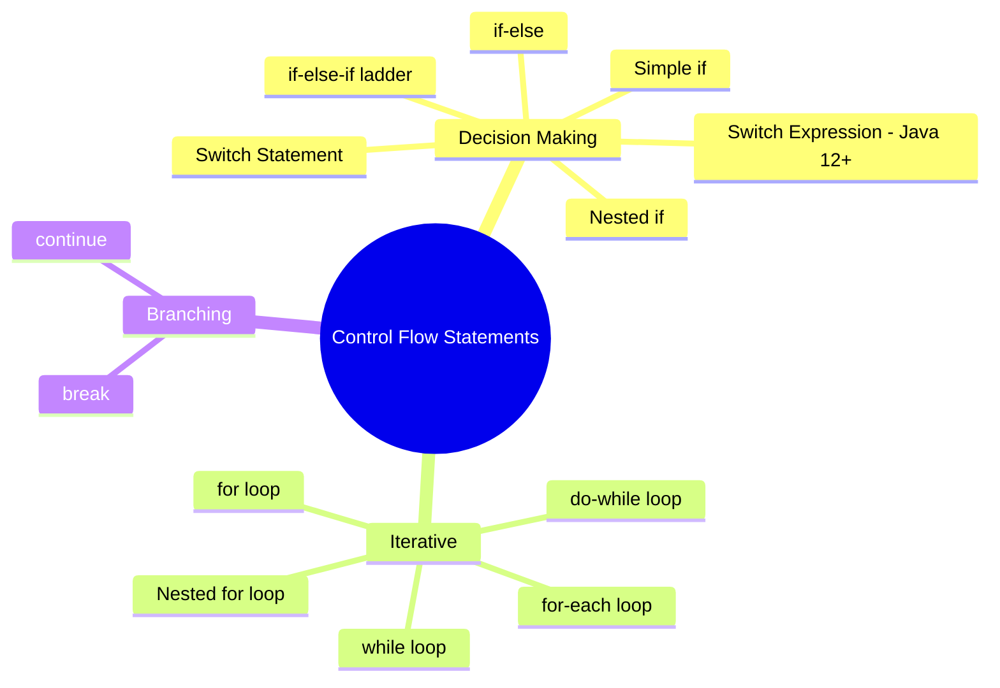
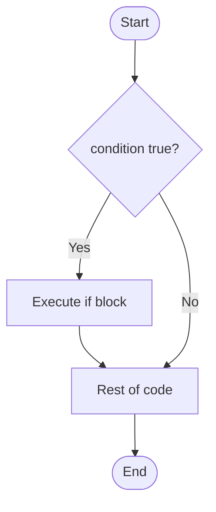
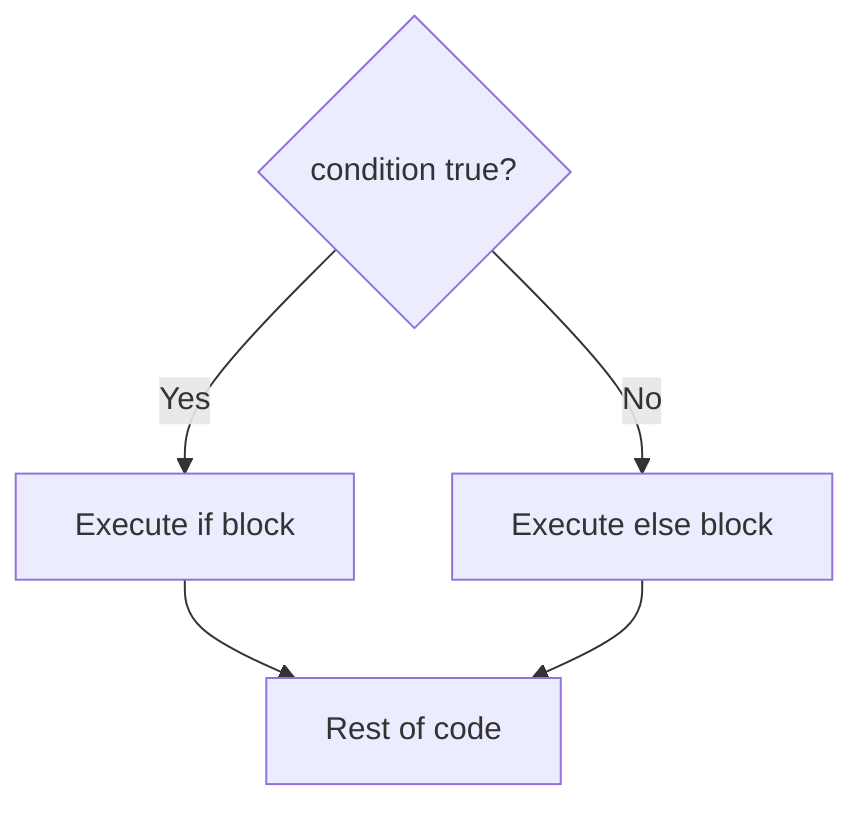
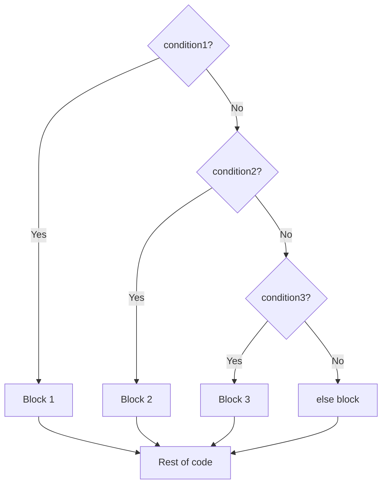
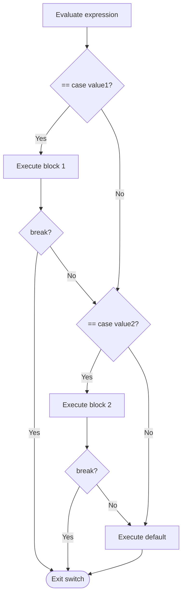
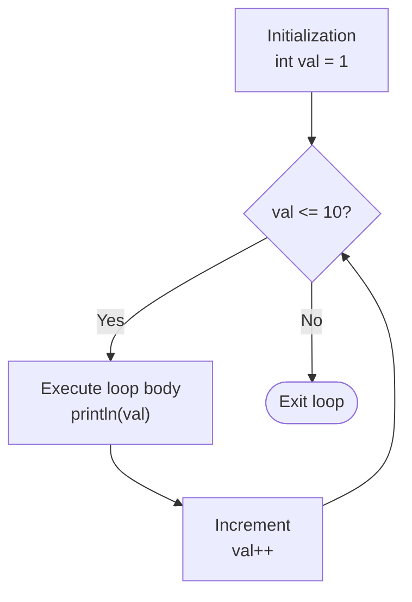
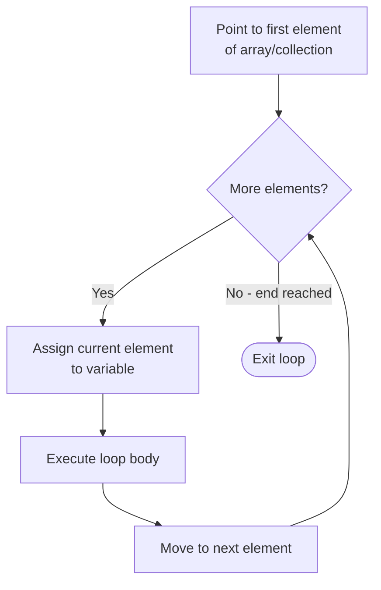
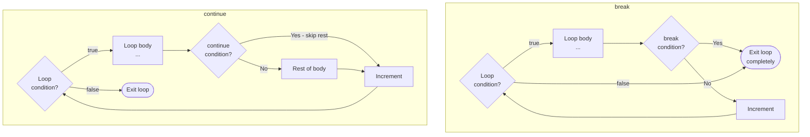

# 📚 Java Control Flow Statements — Complete Study Guide

> **Series:** Java Core Concepts | **Chapter:** Control Flow Statements  
> **Audience:** Beginner to Intermediate Java Developers  
> **Coverage:** Decision Making (if, if-else, if-else-if, nested if, switch), Iterative (for, while, do-while, for-each), Branching (break, continue)

---

## 🗂️ Table of Contents

1. [Overview — Three Types of Control Flow](#1-overview--three-types-of-control-flow)
2. [Decision Making Statements](#2-decision-making-statements)
   - [Simple `if`](#simple-if)
   - [`if-else`](#if-else)
   - [`if-else-if` Ladder](#if-else-if-ladder)
   - [Nested `if`](#nested-if)
3. [Switch Statement](#3-switch-statement)
4. [Switch Expression (Java 12+)](#4-switch-expression-java-12)
5. [Iterative Statements](#5-iterative-statements)
   - [`for` Loop](#for-loop)
   - [Nested `for` Loop](#nested-for-loop)
   - [`while` Loop](#while-loop)
   - [`do-while` Loop](#do-while-loop)
   - [`for-each` Loop](#for-each-loop)
6. [Branching Statements](#6-branching-statements)
   - [`break`](#break)
   - [`continue`](#continue)
7. [Interview Question Bank](#7-interview-question-bank)
8. [Master Summary](#8-master-summary)

---

## Mind Map — Control Flow Overview



---

# 1. Overview — Three Types of Control Flow

| Category | What it Does | Keywords / Constructs |
|----------|-------------|----------------------|
| **Decision Making** | Executes code conditionally based on true/false expressions | `if`, `if-else`, `if-else-if`, `switch` |
| **Iterative** | Repeats a block of code multiple times | `for`, `while`, `do-while`, `for-each` |
| **Branching** | Alters the flow inside loops or switch blocks | `break`, `continue` |

> [!NOTE]
> **Switch Expression** is a newer, cleaner form of switch available from **Java 12**. If you're using an older JDK, switch expression syntax will not compile. Switch Statement (the traditional form) works on all Java versions.

---

# 2. Decision Making Statements

---

## Simple `if`

### Definition
Executes a block of code **only if** the given condition evaluates to `true`. If the condition is `false`, the block is skipped entirely and execution continues after it.

### Syntax

```java
if (condition) {
    // executed only if condition is true
}
// always executed after the if block (whether condition was true or false)
```

### Flowchart



### Code Example

```java
public class Main {
    public static void main(String[] args) {
        int value = 10;

        if (value > 8) {
            System.out.println("Only executed when value is greater than 8");
        }

        System.out.println("This always executes");
    }
}
```

**Output:**
```
Only executed when value is greater than 8
This always executes
```

### Step-by-Step
1. `value = 10`
2. `10 > 8` → `true`
3. Print inside the if block
4. Continue to the statement after the block

---

## `if-else`

### Definition
Provides **two paths**: if the condition is `true`, the `if` block runs; if `false`, the `else` block runs. Exactly one of the two blocks always executes.

### Syntax

```java
if (condition) {
    // runs when condition is true
} else {
    // runs when condition is false
}
```

### Flowchart



### Code Example

```java
int value = 7;

if (value > 8) {
    System.out.println("Value is greater than 8");
} else {
    System.out.println("Value is less than or equal to 8");
}

System.out.println("Rest of the code");
```

**Output:**
```
Value is less than or equal to 8
Rest of the code
```

### Step-by-Step
1. `value = 7`
2. `7 > 8` → `false`
3. `if` block skipped → `else` block executes
4. "Rest of the code" executes

---

## `if-else-if` Ladder

### Definition
A chain of `if` followed by one or more `else if` blocks (and optionally a final `else`). Conditions are evaluated **top to bottom** — the first `true` condition's block executes; all others are skipped.

### Syntax

```java
if (condition1) {
    // runs if condition1 is true
} else if (condition2) {
    // runs if condition1 is false AND condition2 is true
} else if (condition3) {
    // runs if condition1 and condition2 are false AND condition3 is true
} else {
    // runs if NONE of the above conditions are true (optional)
}
```

### Flowchart



### Code Example

```java
int value = 13;

if (value == 1) {
    System.out.println("Value is 1");
} else if (value == 2) {
    System.out.println("Value is 2");
} else if (value == 3) {
    System.out.println("Value is 3");
} else {
    System.out.println("Value is " + value); // none matched
}
```

**Output:**
```
Value is 13
```

### Key Points
- Evaluation is always **top to bottom**
- As soon as one condition is `true`, its block executes and the rest are **skipped**
- The `else` block is **optional** — use it when you need a fallback for "none matched"
- You can have as many `else if` blocks as needed

---

## Nested `if`

### Definition
An `if-else` statement placed **inside** another `if` block or `else` block. There is no limit on nesting depth.

### Syntax

```java
if (outerCondition) {
    // outer if block
    if (innerCondition) {
        // inner if block
    } else {
        // inner else block
    }
} else {
    // outer else block
    if (anotherCondition) {
        // ...
    }
}
```

### Code Example

```java
int value = 13;

if (value > 8) {
    System.out.println("Value is greater than 8");

    // Nested if inside the outer if
    if (value < 15) {
        System.out.println("Value is greater than 8 but less than 15");
    } else {
        System.out.println("Value is 15 or more");
    }

} else {
    System.out.println("Value is 8 or less");
}
```

**Output:**
```
Value is greater than 8
Value is greater than 8 but less than 15
```

### Step-by-Step
1. `13 > 8` → `true` → enter outer if block
2. Print "Value is greater than 8"
3. `13 < 15` → `true` → enter inner if block
4. Print "Value is greater than 8 but less than 15"
5. Outer else is skipped

> [!TIP]
> Deeply nested `if` blocks (more than 2-3 levels) hurt readability. Consider refactoring with early returns or extracting logic into methods.

---

# 3. Switch Statement

## Overview

The **switch statement** is functionally similar to the `if-else-if` ladder — it evaluates an expression and matches it against several `case` values, executing the matching block. It is often more readable than a long chain of `else-if` when comparing one variable against many fixed values.

---

## Syntax

```java
switch (expression) {
    case value1:
        // code
        break;
    case value2:
        // code
        break;
    // ... more cases
    default:
        // runs if no case matched
        break; // optional if default is last
}
```

---

## How It Works — Flowchart



---

## Basic Example

```java
int a = 1, b = 2;

switch (a + b) {  // expression evaluates to 3
    case 1:
        System.out.println("a + b is 1");
        break;
    case 2:
        System.out.println("a + b is 2");
        break;
    case 3:
        System.out.println("a + b is 3"); // ✅ matches
        break;
    default:
        System.out.println("a + b is something else");
}
```

**Output:**
```
a + b is 3
```

---

## The `break` Statement — Why It Matters

If `break` is omitted from a matched case, execution **falls through** to the next case, running its code regardless of whether the case value matches.

### Without `break` — Fall-Through Example

```java
int a = 1, b = 2; // a + b = 3

switch (a + b) {
    case 1:
        System.out.println("a + b is 1");
        // no break!
    case 2:
        System.out.println("a + b is 2");
        // no break!
    case 3:
        System.out.println("a + b is 3"); // matches here
        // no break!
    case 4:
        System.out.println("a + b is 4"); // fall-through!
        // no break!
    default:
        System.out.println("default");   // fall-through!
}
```

**Output:**
```
a + b is 3
a + b is 4
default
```

> [!WARNING]
> Forgetting `break` is one of the most common bugs in switch statements. Always add `break` unless you intentionally want fall-through behavior.

---

## `default` Can Be Anywhere

The `default` block does not have to be at the bottom. However, if it is **not at the end**, it must have a `break` to prevent fall-through.

```java
int a = 9, b = 1; // a + b = 10

switch (a + b) {
    case 1:
        System.out.println("one");
        break;
    default:
        System.out.println("default: " + (a + b)); // matches here
        // no break — falls through to case 2
    case 2:
        System.out.println("a + b is 2");
        break;  // stops here
    case 3:
        System.out.println("three");
        break;
}
```

**Output:**
```
default: 10
a + b is 2
```

> [!IMPORTANT]
> If `default` is used **before** the last case and has no `break`, it falls through to the next case below it. Best practice: keep `default` at the end, or always use `break` after it.

---

## Combining Cases (Clubbing)

When multiple case values should run the same code, you can club them:

```java
String month = "March";

// Method 1 — stacked cases (separate lines)
switch (month) {
    case "January":
    case "February":
    case "March":
        System.out.println("Month is in Quarter 1");
        break;
    case "April":
    case "May":
    case "June":
        System.out.println("Month is in Quarter 2");
        break;
    default:
        System.out.println("Other quarter");
}
```

**Output:**
```
Month is in Quarter 1
```

You can also write multiple values on one line (Java 14+):

```java
switch (month) {
    case "January", "February", "March":
        System.out.println("Quarter 1");
        break;
}
```

---

## Switch Statement Rules

| Rule | Detail |
|------|--------|
| **No duplicate case values** | Two cases with the same value = compile error |
| **Expression and case types must match** | `switch(intVal)` → cases must be `int`; `switch(stringVal)` → cases must be `String` |
| **Case values must be literals or constants** | Variables are allowed only if declared `final` |
| **Not all cases need to be handled** | Default is optional in switch statement; missing cases just don't execute |
| **Nested switch** | A switch inside another switch is fully supported |

---

## Case Value Must Be Literal or Constant

```java
int caseValue = 1; // not final — NOT allowed as case value
final int CONST_VALUE = 1; // final — allowed as case value

switch (someExpression) {
    case 1:           // ✅ literal
    case CONST_VALUE: // ✅ final constant
    // case caseValue: // ❌ compile error — non-final variable
}
```

---

## Supported Data Types in Switch

Switch expressions/statements support **10 types**:

| Category | Types |
|----------|-------|
| **Primitive** | `byte`, `short`, `int`, `char` |
| **Wrapper** | `Byte`, `Short`, `Integer`, `Character` |
| **Other** | `String`, `enum` |

> [!IMPORTANT]
> `float`, `double`, `long`, and `boolean` are **NOT** supported in switch. Switch works by equality comparison (`==`), and floating-point equality is unreliable.

---

## Nested Switch

```java
Day day = Day.MONDAY;

switch (day) {
    case MONDAY:
        int outputValue = 1;

        switch (outputValue) { // nested switch inside case MONDAY
            case 1:
                System.out.println("Output value is one");
                break;
        }
        break;
    default:
        System.out.println("Other day");
}
```

**Output:**
```
Output value is one
```

---

# 4. Switch Expression (Java 12+)

## What's Different?

The **switch expression** allows the switch to **return a value** that can be assigned to a variable. It also introduces the arrow `->` syntax that eliminates the need for `break` and prevents accidental fall-through.

> [!IMPORTANT]
> Switch expressions require **Java 12 or later**. Attempting to use them on an older JDK produces a compile error.

---

## The Problem Switch Expression Solves

In a switch statement, you cannot directly return a value:

```java
// ❌ This does NOT work — return is not allowed inside switch case
String result = switch (value) {
    case 1: return "one"; // ❌ Compile error
};
```

The traditional workaround:

```java
String result = "";
switch (value) {
    case 1:
        result = "one";
        break;
    case 2:
        result = "two";
        break;
}
// result is now set
```

This is verbose and error-prone. Switch expression fixes this.

---

## Arrow Label Syntax (`->`)

```java
int value = 1;

String outputVal = switch (value) {
    case 1 -> "one";   // returns "one" when value == 1
    case 2 -> "two";
    case 3 -> "three";
    default -> "other";
};

System.out.println(outputVal); // one
```

**Output:**
```
one
```

### Key Properties of Arrow Syntax

| Property | Detail |
|----------|--------|
| **No `break` needed** | The arrow automatically exits after the expression |
| **No fall-through** | Each case is isolated — arrow prevents fall-through |
| **Returns a value** | The right side of `->` is the value returned for that case |
| **Must cover all cases** | Switch expression must handle every possible input (or have a `default`) |

---

## All Cases Must Be Covered

Switch expression assigns a value to a variable, so every possible input must produce a result:

```java
int value = 1;

// ❌ Compile error — switch expression does not cover all possible inputs
String outputVal = switch (value) {
    case 1 -> "one";
    case 2 -> "two";
    // Missing default — compiler complains even if value is always 1
};
```

**Fix — add `default`:**

```java
String outputVal = switch (value) {
    case 1 -> "one";
    case 2 -> "two";
    default -> "other"; // ✅ covers all remaining cases
};
```

> [!IMPORTANT]
> For `enum` types, if you handle every enum constant explicitly, you don't need a `default`. For other types like `int`, you always need `default` since the range of possible values is too large to enumerate.

---

## Using Blocks with `yield`

The arrow `->` returns a single expression — you cannot write multiple lines. If you need a code block (multiple statements before returning), use **`yield`**:

```java
int value = 2;

String outputVal = switch (value) {
    case 1 -> "one"; // single expression — no yield needed

    case 2 -> {      // block — yield required to return
        String temp = "tw";
        temp = temp + "o"; // some logic
        yield temp;        // return value using yield
    }

    case 3 -> {
        System.out.println("Preparing three...");
        yield "three";
    }

    default -> "other"; // single expression
};

System.out.println(outputVal); // two
```

**Output:**
```
Preparing three... (only if value = 3)
two
```

### Arrow vs Block in Switch Expression

| Form | When to Use | `break` needed? | `yield` needed? |
|------|-------------|-----------------|-----------------|
| `case X -> expression` | Single return value, no extra logic | ❌ No | ❌ No |
| `case X -> { ... yield val; }` | Multiple statements before returning | ❌ No | ✅ Yes |

---

## Switch Statement vs Switch Expression — Full Comparison

| Feature | Switch Statement | Switch Expression (Java 12+) |
|---------|-----------------|------------------------------|
| Returns a value | ❌ No | ✅ Yes |
| `break` required | ✅ Yes (to prevent fall-through) | ❌ No (arrow syntax handles it) |
| Fall-through possible | ✅ Yes (if `break` omitted) | ❌ No (with arrow syntax) |
| All cases must be handled | ❌ No | ✅ Yes (compile error otherwise) |
| `yield` keyword | ❌ N/A | ✅ Used to return from a block |
| Arrow `->` syntax | ❌ Not available | ✅ Available |
| Java version | All versions | Java 12+ |

---

# 5. Iterative Statements

---

## `for` Loop

### Definition
Repeats a block of code a **known number of times**. Contains three parts: initialization, condition check, and increment/decrement — all in one line.

### Syntax

```java
for (initialization; condition; increment/decrement) {
    // executed while condition is true
}
```

### Three Parts Explained

| Part | Purpose | Example |
|------|---------|---------|
| **Initialization** | Declare and set the loop variable (runs once at start) | `int val = 1` |
| **Condition** | Checked before each iteration; loop runs while `true` | `val <= 10` |
| **Increment/Decrement** | Updates the loop variable after each iteration | `val++` |

### Execution Flow



### Code Example

```java
for (int val = 1; val <= 10; val++) {
    System.out.println(val);
}
```

**Output:**
```
1
2
3
4
5
6
7
8
9
10
```

### Step-by-Step

| Iteration | `val` | `val <= 10` | Action |
|-----------|-------|-------------|--------|
| 1 | 1 | ✅ true | Print 1, `val` → 2 |
| 2 | 2 | ✅ true | Print 2, `val` → 3 |
| ... | ... | ... | ... |
| 10 | 10 | ✅ true | Print 10, `val` → 11 |
| 11 | 11 | ❌ false | Exit loop |

---

## Nested `for` Loop

Two (or more) for loops where the inner loop runs **completely** for each iteration of the outer loop. Most commonly used for 2D matrix traversal.

### Code Example

```java
for (int x = 1; x <= 3; x++) {
    for (int y = 1; y <= 3; y++) {
        System.out.print("(" + x + "," + y + ") ");
    }
    System.out.println(); // new line after each row
}
```

**Output:**
```
(1,1) (1,2) (1,3) 
(2,1) (2,2) (2,3) 
(3,1) (3,2) (3,3) 
```

### Execution Pattern

```
x=1: y runs 1, 2, 3
x=2: y runs 1, 2, 3
x=3: y runs 1, 2, 3
Total iterations = 3 × 3 = 9
```

> [!TIP]
> For 2D arrays/matrices, the **outer loop** iterates rows (x-axis) and the **inner loop** iterates columns (y-axis).

---

## `while` Loop

### Definition
Repeats a block while the condition is `true`. The condition is checked **before each iteration** — if it's false from the start, the loop body never executes.

### Syntax

```java
initialization;
while (condition) {
    // loop body
    increment/decrement;
}
```

### Code Example

```java
int value = 1;

while (value <= 5) {
    System.out.println(value);
    value++;
}
```

**Output:**
```
1
2
3
4
5
```

---

## `do-while` Loop

### Definition
Similar to `while`, but the condition is checked **after** the loop body executes. This guarantees the loop body runs **at least once**, even if the condition is initially false.

### Syntax

```java
initialization;
do {
    // loop body — runs at least once
    increment/decrement;
} while (condition); // semicolon required here
```

> [!IMPORTANT]
> Note the **semicolon** after the closing parenthesis of `while`. This is unique to `do-while` and is a common syntax mistake.

### Code Example

```java
int val = 1;

do {
    System.out.println(val);
    val++;
} while (val <= 5);
```

**Output:**
```
1
2
3
4
5
```

### The "At Least Once" Guarantee

```java
int val = 100; // condition is false from start

while (val <= 5) {
    System.out.println("while: " + val); // NEVER executes
}

do {
    System.out.println("do-while: " + val); // executes ONCE
    val++;
} while (val <= 5);
```

**Output:**
```
do-while: 100
```

---

## `while` vs `do-while` — Comparison

| Feature | `while` | `do-while` |
|---------|---------|-----------|
| Condition checked | Before each iteration | After each iteration |
| Minimum executions | 0 (condition false initially → never runs) | 1 (always runs at least once) |
| Use when | May need to run 0 times | Must run at least once |
| Semicolon after `while` | ❌ No | ✅ Yes — `} while (cond);` |

---

## `for-each` Loop

### Definition
Designed specifically to **iterate over arrays or collections**. Simpler and less error-prone than a regular `for` loop when you don't need the index.

### Syntax

```java
for (DataType variable : arrayOrCollection) {
    // use variable — it holds the current element
}
```

### Code Example — Iterating an Array

```java
int[] numbers = {1, 2, 3, 4, 5};

for (int val : numbers) {
    System.out.println(val);
}
```

**Output:**
```
1
2
3
4
5
```

### How It Works



### `for-each` vs `for` Loop

| Feature | `for` Loop | `for-each` Loop |
|---------|-----------|----------------|
| Index access | ✅ Yes | ❌ No |
| Modify array elements | ✅ Yes (via index) | ❌ No (variable is a copy) |
| Readability | ❌ More verbose | ✅ Cleaner |
| Works with collections | ✅ With iterator | ✅ Directly |
| Use when | Need index or modifying elements | Just reading/processing elements |

---

## Loop Comparison — All Four

| Loop | Condition Check | Min Runs | Best For |
|------|----------------|----------|----------|
| `for` | Before each iteration | 0 | Known iteration count |
| `while` | Before each iteration | 0 | Unknown count, check first |
| `do-while` | After each iteration | 1 (always) | Must run at least once |
| `for-each` | After each element | 0 (empty collection) | Iterating arrays/collections |

---

# 6. Branching Statements

Branching statements alter the normal flow of execution inside loops (and switch statements).

---

## `break`

### Definition
Immediately **exits** the **nearest enclosing loop or switch block**. Execution continues with the first statement after that loop/switch.

### Syntax

```java
break; // exits the immediately enclosing loop or switch
```

### Code Example

```java
for (int val = 1; val <= 10; val++) {
    if (val == 3) {
        break; // exit the loop when val is 3
    }
    System.out.println(val);
}
System.out.println("After loop");
```

**Output:**
```
1
2
After loop
```

### `break` in Nested Loops — Important!

`break` only exits the **immediately enclosing** loop. The outer loop continues:

```java
for (int x = 1; x <= 3; x++) {
    for (int y = 1; y <= 3; y++) {
        if (y == 2) {
            break; // exits INNER loop only
        }
        System.out.println("x=" + x + ", y=" + y);
    }
}
```

**Output:**
```
x=1, y=1
x=2, y=1
x=3, y=1
```

The inner loop breaks at `y=2` every time, but the outer loop (`x`) continues normally.

---

## `continue`

### Definition
Skips the **remaining statements** in the current iteration and moves to the **next iteration** of the loop. Does NOT exit the loop — it just skips the current cycle.

### Syntax

```java
continue; // skip rest of current iteration, go to next
```

### Code Example

```java
for (int value = 1; value <= 10; value++) {
    if (value == 3) {
        continue; // skip printing 3, go to val=4
    }
    System.out.println(value);
}
```

**Output:**
```
1
2
4
5
6
7
8
9
10
```

(3 is skipped — the `continue` jumped straight to `value++` when `value == 3`)

---

## `break` vs `continue` — Step-by-Step Comparison

### For a loop printing 1 to 5, stopping/skipping at 3:

| Value | With `break` | With `continue` |
|-------|-------------|----------------|
| 1 | Print 1 | Print 1 |
| 2 | Print 2 | Print 2 |
| 3 | Exit loop | Skip — go to next iteration |
| 4 | (loop ended) | Print 4 |
| 5 | (loop ended) | Print 5 |
| **Output** | `1 2` | `1 2 4 5` |

---

## Flowchart — `break` vs `continue`



---

## `break` vs `continue` — Summary

| Feature | `break` | `continue` |
|---------|---------|-----------|
| Effect | Exits the loop entirely | Skips current iteration only |
| Loop continues? | ❌ No — loop ends | ✅ Yes — next iteration runs |
| Works with | `for`, `while`, `do-while`, `switch` | `for`, `while`, `do-while` |
| Targets | Immediately enclosing loop/switch | Immediately enclosing loop |

---

# 7. Interview Question Bank

## Decision Making

| Question | Key Answer |
|----------|-----------|
| What are the types of control flow statements in Java? | Decision making, iterative, branching |
| What is the difference between `if-else` and `switch`? | `switch` compares one expression against fixed constants; `if-else` can evaluate any boolean expression |
| Can you use a `return` inside a switch statement? | Not to return from the switch itself; `return` exits the enclosing method |
| What data types can be used in a switch expression? | `byte`, `short`, `int`, `char`, their wrappers, `String`, `enum` — 10 total; no `float`, `double`, `long`, `boolean` |
| Can two switch cases have the same value? | No — compile error |
| Must case values be constants? | Yes — literals or `final` variables only |
| Is `default` mandatory in switch? | In switch statement — no; in switch expression — yes (or all cases must be covered) |
| Can `default` be placed anywhere in switch? | Yes — but needs `break` if not at the end to prevent fall-through |

## Switch Expression

| Question | Key Answer |
|----------|-----------|
| When was switch expression introduced? | Java 12 |
| What is the `->` arrow in switch expression? | Returns value from that case; eliminates need for `break`; prevents fall-through |
| What is `yield`? | Keyword to return a value from a code block (`{ }`) inside a switch expression case |
| Must switch expressions handle all cases? | Yes — compile error otherwise; add `default` to cover remaining cases |
| Difference between switch statement and switch expression? | Expression returns a value, uses `->`, no `break` needed, all cases must be covered |

## Loops

| Question | Key Answer |
|----------|-----------|
| What is the difference between `while` and `do-while`? | `while` checks condition first (0+ runs); `do-while` checks after (1+ runs — always runs at least once) |
| When would you use `do-while` over `while`? | When the loop body must execute at least once regardless of the condition |
| What is `for-each` and when is it used? | Enhanced for loop to iterate over arrays/collections; cleaner but no index access |
| Can you modify array elements inside a `for-each`? | No — the loop variable is a copy of the element, not the element itself |
| What are the three parts of a `for` loop? | Initialization, condition check, increment/decrement |

## Branching

| Question | Key Answer |
|----------|-----------|
| What does `break` do inside a loop? | Immediately exits the nearest enclosing loop or switch |
| What does `continue` do? | Skips the rest of the current iteration and moves to the next one |
| Does `break` in an inner loop affect the outer loop? | No — only exits the immediately enclosing loop |
| What is the difference between `break` and `continue`? | `break` exits the loop; `continue` skips current iteration but continues the loop |

---

# 8. Master Summary

## Quick Revision Bullets

**Decision Making:**
- ✅ **Simple `if`** — runs block if condition `true`; skips otherwise
- ✅ **`if-else`** — exactly one of two blocks always executes
- ✅ **`if-else-if` ladder** — top-to-bottom evaluation; first match wins; `else` is optional fallback
- ✅ **Nested `if`** — `if-else` inside another `if-else`; no depth limit
- ✅ **Switch statement** — compares expression against constant case values; similar to `if-else-if` ladder
- ✅ **`break` in switch** — exits the switch block; without it, execution falls through to next case
- ✅ **`default`** in switch — runs if no case matches; optional in switch statement; can be anywhere (use `break` if not last)
- ✅ **Switch data types** — `byte`, `short`, `int`, `char`, wrappers, `String`, `enum` — 10 types; NOT `float`, `double`, `long`
- ✅ **Case values** — must be literals or `final` constants; no non-final variables
- ✅ **Two cases cannot have same value** — compile error

**Switch Expression (Java 12+):**
- ✅ Returns a value; assignable to a variable
- ✅ Arrow `->` syntax: no `break` needed, no fall-through
- ✅ All cases must be handled — compiler error otherwise; always add `default`
- ✅ For multi-line blocks: use `{ }` and return value with `yield`

**Iterative:**
- ✅ **`for`** — `init; condition; increment` — use when iteration count is known
- ✅ **Nested `for`** — inner loop runs completely for each outer iteration; used in 2D matrix traversal
- ✅ **`while`** — condition checked first; may run 0 times
- ✅ **`do-while`** — condition checked after; always runs at least once; `;` after `while(...)`
- ✅ **`for-each`** — iterates arrays/collections; cleaner but no index access, can't modify elements

**Branching:**
- ✅ **`break`** — exits the immediately enclosing loop or switch; outer loops unaffected
- ✅ **`continue`** — skips rest of current iteration; loop continues with next iteration
- ✅ **`break` output** (skipping 3 in 1-5): `1 2`
- ✅ **`continue` output** (skipping 3 in 1-5): `1 2 4 5`

---

*End of Chapter — Java Control Flow Statements*
