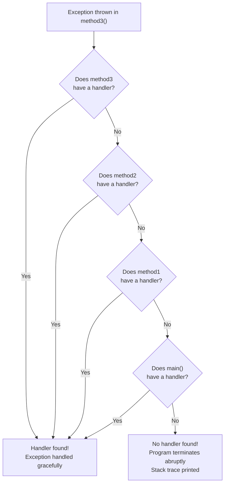
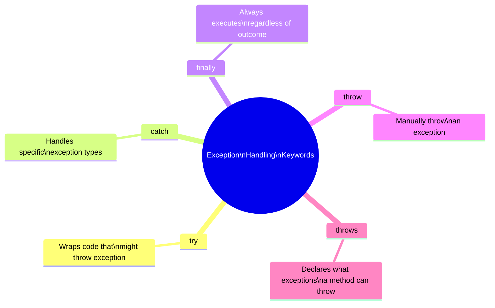
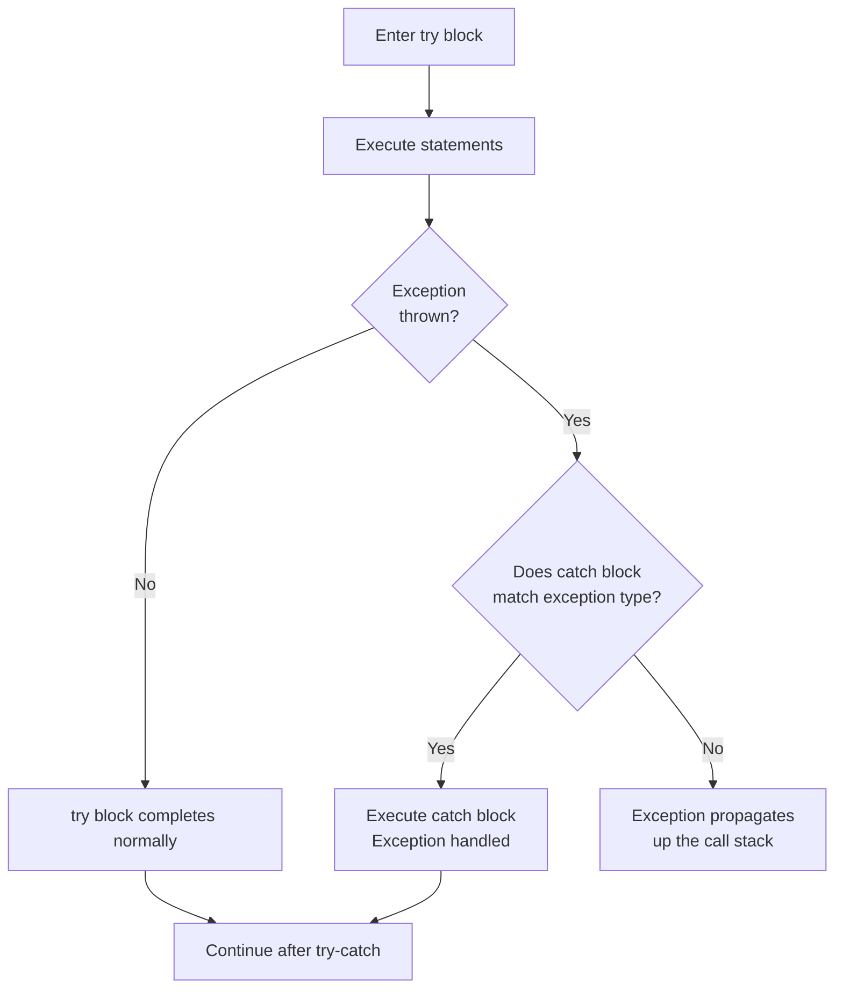
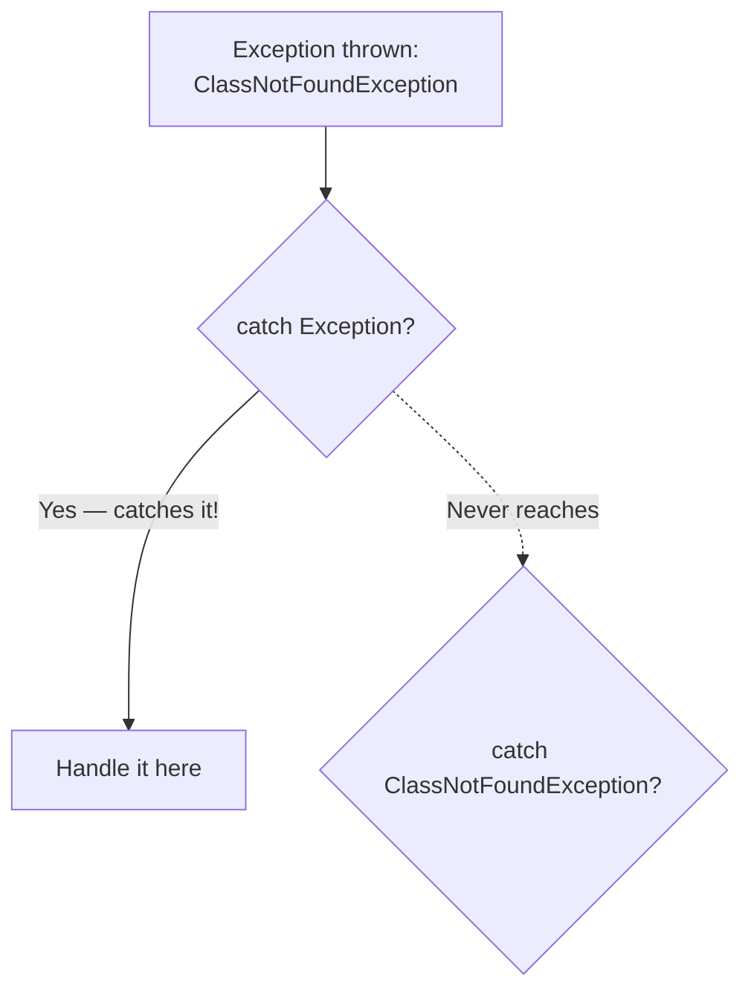
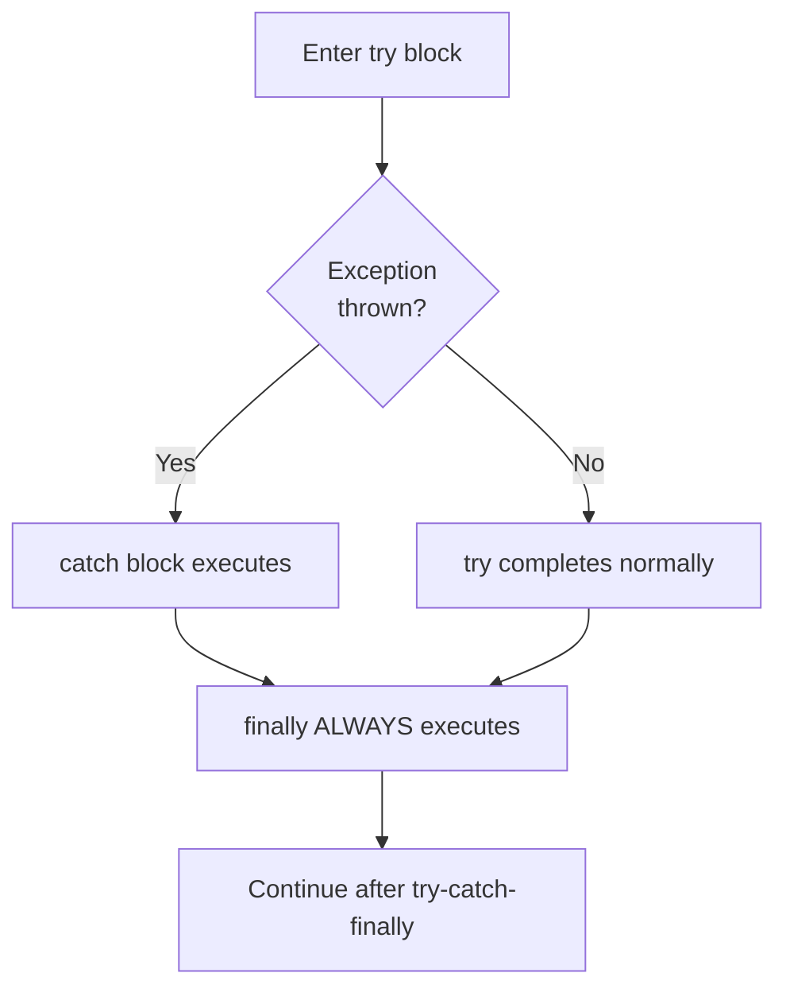
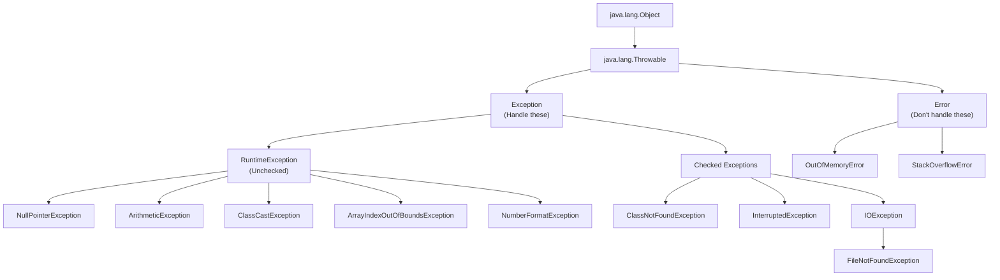
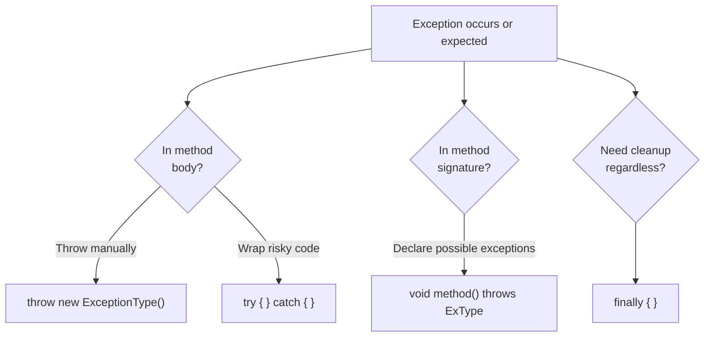

# ☕ Exception Handling in Java — Comprehensive Study Guide
### *Java Basics to Advanced | Lecture — Exception Handling*

---

> [!NOTE]
> This guide is a complete self-contained study resource covering Java Exception Handling — one of the most important topics for both interviews and real-world development. A student should be able to learn the full topic from this document alone — no video required.

---

## 📚 Table of Contents

1. [What is an Exception?](#1-what-is-an-exception)
2. [Exception Object and Stack Trace](#2-exception-object-and-stack-trace)
3. [Exception Hierarchy](#3-exception-hierarchy)
4. [Error vs. Exception](#4-error-vs-exception)
5. [Checked vs. Unchecked Exceptions](#5-checked-vs-unchecked-exceptions)
   - [Unchecked (Runtime) Exceptions](#51-unchecked-runtime-exceptions)
   - [Checked (Compile-Time) Exceptions](#52-checked-compile-time-exceptions)
6. [Five Keywords of Exception Handling](#6-five-keywords-of-exception-handling)
7. [The `try-catch` Block](#7-the-try-catch-block)
   - [Basic try-catch](#71-basic-try-catch)
   - [Multiple catch Blocks](#72-multiple-catch-blocks)
   - [Catching Parent Exceptions — Order Matters](#73-catching-parent-exceptions--order-matters)
   - [Multiple Exceptions in One catch Block](#74-multiple-exceptions-in-one-catch-block)
8. [The `finally` Block](#8-the-finally-block)
9. [The `throw` Keyword](#9-the-throw-keyword)
10. [The `throws` Keyword](#10-the-throws-keyword)
11. [`throw` vs. `throws` — Complete Comparison](#11-throw-vs-throws--complete-comparison)
12. [Custom (User-Defined) Exceptions](#12-custom-user-defined-exceptions)
13. [Handling Runtime Exceptions (Optional but Recommended)](#13-handling-runtime-exceptions-optional-but-recommended)
14. [Advantages of Exception Handling](#14-advantages-of-exception-handling)
15. [When to Avoid Exception Handling](#15-when-to-avoid-exception-handling)
16. [Common Runtime Exceptions — Reference](#16-common-runtime-exceptions--reference)
17. [Summary Diagrams](#17-summary-diagrams)
18. [Common Mistakes](#18-common-mistakes)
19. [Best Practices](#19-best-practices)
20. [Interview Notes](#20-interview-notes)
21. [Practice Questions](#21-practice-questions)
22. [Quick Revision Summary](#22-quick-revision-summary)

---

# 1. What is an Exception?

## Definition

> An **exception** is an **event that occurs during the execution of a program** that disrupts its normal flow of instructions.

When Java encounters an exceptional condition — dividing by zero, accessing an array index that doesn't exist, trying to use a null reference — it creates a special object that describes the problem. This object is called an **exception object**, and the act of creating and signaling this event is called **throwing an exception**.

---

## Real-World Analogy

> Think of your program as a car on a highway. Normal execution is smooth driving. An exception is a sudden roadblock — the car cannot continue on its current path. Exception handling is your detour plan: a pre-defined alternate route that lets you reach your destination despite the obstruction.

---

## Normal Flow vs. Exceptional Flow

```
Normal Flow:
main() → method1() → method2() → method3() → completes normally → returns to main() → program ends

Exceptional Flow:
main() → method1() → method2() → method3() → EXCEPTION OCCURS
                                               ↓
                                    Exception object created
                                               ↓
                                    JVM searches for handler
                                    (method3 → method2 → method1 → main)
                                               ↓
                              If no handler found → program terminates abruptly
                              If handler found → exception handled → continues
```

---

# 2. Exception Object and Stack Trace

## What Is an Exception Object?

When an exception occurs, the Java runtime system automatically creates an **exception object** containing three key pieces of information:

| Field | What It Contains | Example |
|---|---|---|
| **Type** | The class of the exception | `ArithmeticException` |
| **Message** | Human-readable description of the problem | `"/ by zero"` |
| **Stack Trace** | The chain of method calls from where the error occurred back to `main()` | See below |

---

## The Stack Trace Explained

The stack trace is the most valuable debugging tool Java gives you. It shows the **exact path** execution took from the program entry point to the point where the exception occurred.

### Example Code

```java
public class Main {
    public static void main(String[] args) {
        method1();                    // line 6
    }

    static void method1() {
        method2();                    // line 10
    }

    static void method2() {
        method3();                    // line 14
    }

    static void method3() {
        int result = 5 / 0;           // line 18 ← exception here
    }
}
```

### Output (Program Terminates)

```
Exception in thread "main" java.lang.ArithmeticException: / by zero
    at Main.method3(Main.java:18)    ← where exception ACTUALLY happened
    at Main.method2(Main.java:14)    ← method3 was called from here
    at Main.method1(Main.java:10)    ← method2 was called from here
    at Main.main(Main.java:6)        ← method1 was called from here
```

### Reading the Stack Trace

```
java.lang.ArithmeticException: / by zero
    ↑ Type of exception               ↑ Message

at Main.method3(Main.java:18)
    ↑ Class name  ↑ Method name  ↑ File  ↑ Line number
```

- Read from **top to bottom**: the top entry is where the exception originated
- Read from **bottom to top**: to see how execution arrived at the error point
- **Line numbers** tell you exactly where to look in your source code

---

## How JVM Searches for a Handler

When an exception is thrown, JVM traverses the **call stack** looking for a method that can handle it:



---

# 3. Exception Hierarchy

Java organizes all exceptions and errors in a class hierarchy rooted at `java.lang.Object`:

```
java.lang.Object
    └── java.lang.Throwable
            ├── java.lang.Error                    ← NOT for us to handle
            │       ├── OutOfMemoryError
            │       ├── StackOverflowError
            │       └── (other JVM errors)
            │
            └── java.lang.Exception                ← We handle these
                    ├── RuntimeException            ← Unchecked (runtime)
                    │       ├── ArithmeticException
                    │       ├── ClassCastException
                    │       ├── NullPointerException
                    │       ├── IndexOutOfBoundsException
                    │       │       ├── ArrayIndexOutOfBoundsException
                    │       │       └── StringIndexOutOfBoundsException
                    │       ├── NumberFormatException
                    │       └── IllegalArgumentException
                    │
                    ├── ClassNotFoundException      ← Checked (compile-time)
                    ├── InterruptedException
                    ├── IOException
                    │       └── FileNotFoundException
                    └── (other checked exceptions)
```

> [!IMPORTANT]
> The two key things to memorize about this hierarchy:
> 1. `Throwable` is the parent of both `Error` and `Exception`
> 2. `RuntimeException` (and its subclasses) are **unchecked**; everything else under `Exception` is **checked**

---

# 4. Error vs. Exception

This is one of the **most frequently asked interview questions** on this topic.

## Error

> **Errors** represent **serious problems related to the JVM environment** that are outside the control of the application. You should **not try to catch or handle Errors**.

### Examples

```java
// OutOfMemoryError — heap is exhausted
String[] hugArray = new String[Integer.MAX_VALUE];   // JVM can't allocate this
// → java.lang.OutOfMemoryError: Java heap space

// StackOverflowError — stack is exhausted (infinite recursion)
public static void recurse() {
    recurse();   // calls itself forever
}
recurse();
// → java.lang.StackOverflowError
```

### Why You Should Not Handle Errors

- They indicate that the **JVM itself** is in an unhealthy state
- Even if you caught one, you likely couldn't do anything meaningful to fix it
- The recommended approach is to let the JVM terminate and fix the root cause (increase heap size, fix infinite recursion, etc.)

---

## Exception

> **Exceptions** represent **problems in application code** that can often be anticipated, handled, and recovered from.

```java
// NullPointerException — using a null reference
String s = null;
s.length();   // → NullPointerException (we caused this; we can fix it)

// ClassNotFoundException — class not found at runtime
Class.forName("com.example.NonExistent");   // → ClassNotFoundException
```

---

## Error vs. Exception Comparison

| Feature | Error | Exception |
|---|---|---|
| **Cause** | JVM environment / system problem | Application code problem |
| **Examples** | `OutOfMemoryError`, `StackOverflowError` | `NullPointerException`, `IOException` |
| **Can we handle?** | ❌ Should not try | ✅ Yes, and we should |
| **Type** | Unchecked (runtime) | Checked or Unchecked |
| **Hierarchy** | Extends `Error` | Extends `Exception` |

> [!TIP]
> **Interview answer to "Is Error checked or unchecked?"**
> Error is **unchecked** (runtime). Errors occur at runtime (when the JVM runs out of memory, for example). The compiler does not force you to handle them.

---

# 5. Checked vs. Unchecked Exceptions

## The Core Distinction

| | Checked Exception | Unchecked Exception |
|---|---|---|
| **Also called** | Compile-time exception | Runtime exception |
| **When detected** | At **compile time** | At **runtime** |
| **Compiler forces handling?** | ✅ Yes — code won't compile if unhandled | ❌ No — compiles fine |
| **Hierarchy** | Extends `Exception` (but not `RuntimeException`) | Extends `RuntimeException` |
| **Examples** | `ClassNotFoundException`, `IOException`, `InterruptedException` | `NullPointerException`, `ArithmeticException`, `ArrayIndexOutOfBoundsException` |

---

## 5.1 Unchecked (Runtime) Exceptions

> **Unchecked exceptions** are exceptions that occur **during program execution**. The compiler does **not** force you to handle them — your code compiles successfully even if they are present and unhandled.

---

### Type 1: `ClassCastException`

Thrown when you try to cast an object to an incompatible type.

```java
public class Main {
    public static void main(String[] args) {
        Object val = Integer.valueOf(0);     // val holds an Integer
        System.out.println((String) val);   // trying to cast Integer → String
    }
}
```

**Output:**
```
Exception in thread "main" java.lang.ClassCastException:
class java.lang.Integer cannot be cast to class java.lang.String
```

**Compiles fine → fails at runtime.**

---

### Type 2: `ArithmeticException`

Thrown when an illegal arithmetic operation occurs, most commonly division by zero.

```java
public class Main {
    public static void main(String[] args) {
        int result = 5 / 0;   // division by zero
        System.out.println(result);
    }
}
```

**Output:**
```
Exception in thread "main" java.lang.ArithmeticException: / by zero
    at Main.main(Main.java:3)
```

**Compiles fine → fails at runtime.**

---

### Type 3: `ArrayIndexOutOfBoundsException`

Thrown when you try to access an array element with an invalid index.

```java
public class Main {
    public static void main(String[] args) {
        int[] arr = new int[2];   // valid indices: 0, 1
        System.out.println(arr[3]);   // index 3 doesn't exist!
    }
}
```

**Output:**
```
Exception in thread "main" java.lang.ArrayIndexOutOfBoundsException:
Index 3 out of bounds for length 2
```

---

### Type 4: `StringIndexOutOfBoundsException`

Thrown when you try to access a character at an invalid position in a String.

```java
public class Main {
    public static void main(String[] args) {
        String val = "Hello";   // valid indices: 0, 1, 2, 3, 4
        char c = val.charAt(5); // index 5 doesn't exist!
    }
}
```

**Output:**
```
Exception in thread "main" java.lang.StringIndexOutOfBoundsException:
String index out of range: 5
```

---

### Type 5: `NullPointerException`

Thrown when you try to use a reference that points to `null` — calling a method, accessing a field, or any other operation on it.

```java
public class Main {
    public static void main(String[] args) {
        String val = null;
        char c = val.charAt(0);   // val is null — you're calling null.charAt(0)!
    }
}
```

**Output:**
```
Exception in thread "main" java.lang.NullPointerException:
Cannot invoke "String.charAt(int)" because "val" is null
```

> [!TIP]
> In Java 14+, NullPointerException messages are much more descriptive, telling you exactly which variable was null. This is called "Helpful NPEs."

---

### Type 6: `NumberFormatException`

Thrown when you try to convert a String to a number but the String does not have a valid format.

```java
public class Main {
    public static void main(String[] args) {
        int num = Integer.parseInt("ABC");   // "ABC" is not a valid integer
    }
}
```

**Output:**
```
Exception in thread "main" java.lang.NumberFormatException:
For input string: "ABC"
```

```java
// This works fine:
int num = Integer.parseInt("53");   // → 53
```

---

## 5.2 Checked (Compile-Time) Exceptions

> **Checked exceptions** are exceptions that the **compiler verifies at compile time**. If your code might throw a checked exception and you haven't handled it, **compilation fails**.

---

### Example: `ClassNotFoundException` (checked)

```java
public class Main {
    public static void main(String[] args) {
        method1();
    }

    static void method1() {
        throw new ClassNotFoundException("Class not found");
        // ❌ COMPILE ERROR:
        // unreported exception ClassNotFoundException; must be caught or declared to be thrown
    }
}
```

The compiler refuses to compile this code. It demands that you either:
1. Handle the exception with a `try-catch` block, OR
2. Declare that the method can throw it using `throws`

---

### Comparison: Runtime vs. Checked

```java
// ✅ COMPILES FINE — runtime exception, compiler doesn't care
static void method1() {
    throw new ArithmeticException("divide by zero");
}

// ❌ COMPILE ERROR — checked exception, compiler demands handling
static void method1() {
    throw new ClassNotFoundException("not found");
}
```

---

# 6. Five Keywords of Exception Handling

Java provides exactly five keywords for exception handling:



| Keyword | Used With | Purpose |
|---|---|---|
| `try` | Block of code | Wraps code that might throw an exception |
| `catch` | Follows `try` | Catches and handles a specific exception type |
| `finally` | Follows `try` or `catch` | Always executes — cleanup code |
| `throw` | Inside a method | Manually throws an exception object |
| `throws` | Method signature | Declares the exceptions a method might throw |

---

# 7. The `try-catch` Block

## 7.1 Basic try-catch

### Syntax

```java
try {
    // Code that might throw an exception
    // If exception occurs here, control jumps to catch
} catch (ExceptionType exceptionObject) {
    // Handle the exception
    // exceptionObject contains type, message, stack trace
}
// Execution continues here after catch (if exception was handled)
```

---

### How It Works



---

### Handling a Checked Exception with try-catch

```java
public class Main {
    public static void main(String[] args) {
        method1();
    }

    static void method1() {
        try {
            // Code that might throw ClassNotFoundException
            throw new ClassNotFoundException("Demo class not found");
        } catch (ClassNotFoundException e) {
            // Handle the exception — execution continues here
            System.out.println("Caught exception: " + e.getMessage());
            // You can: log it, set a default value, retry, etc.
        }
        System.out.println("Method1 continues after exception handling");
    }
}
```

**Output:**
```
Caught exception: Demo class not found
Method1 continues after exception handling
```

The program does **not** terminate. The exception is caught and handled, and execution resumes normally after the `catch` block.

---

### Key Points

- Code inside `try` that comes **after** the line that throws the exception is **skipped**
- Execution jumps directly to the matching `catch` block
- After the `catch` block, execution continues normally **after** the entire `try-catch` construct

```java
try {
    System.out.println("Line 1");   // ← executes
    throw new Exception("oops");    // ← exception thrown here
    System.out.println("Line 3");   // ← NEVER executes (skipped)
} catch (Exception e) {
    System.out.println("Caught: " + e.getMessage());   // ← executes
}
System.out.println("After try-catch");   // ← executes
```

**Output:**
```
Line 1
Caught: oops
After try-catch
```

---

## 7.2 Multiple catch Blocks

A single `try` block can be followed by **multiple catch blocks**, each handling a different exception type.

### Syntax

```java
try {
    // code
} catch (ExceptionType1 e) {
    // handle ExceptionType1
} catch (ExceptionType2 e) {
    // handle ExceptionType2
} catch (ExceptionType3 e) {
    // handle ExceptionType3
}
```

### Example

```java
public class Main {
    public static void main(String[] args) {
        method1();
    }

    // method1 declares it can throw two checked exceptions
    static void method1() throws ClassNotFoundException, InterruptedException {
        throw new ClassNotFoundException("Demo");
    }
}
```

```java
// Handling in main with multiple catch blocks:
public static void main(String[] args) {
    try {
        method1();
        method2();   // might throw FileNotFoundException
    } catch (ClassNotFoundException e) {
        System.out.println("Class not found: " + e.getMessage());
    } catch (InterruptedException e) {
        System.out.println("Thread interrupted: " + e.getMessage());
    } catch (FileNotFoundException e) {
        System.out.println("File not found: " + e.getMessage());
    }
}
```

> [!IMPORTANT]
> A `catch` block can **only** catch exceptions that could actually be thrown inside the corresponding `try` block. If you write a `catch` for an exception type that nothing in the `try` block can throw, you get a compile error.
>
> ```java
> try {
>     method1();   // throws ClassNotFoundException only
> } catch (FileNotFoundException e) {   // ❌ COMPILE ERROR
>     // nobody throws FileNotFoundException in the try block!
> }
> ```

---

## 7.3 Catching Parent Exceptions — Order Matters

Since `Exception` is the parent of all exceptions, a `catch (Exception e)` block can catch **any** exception. This has an important implication for ordering.

### Rule: More Specific → More General

**Always place more specific catch blocks BEFORE more general ones.**

```java
// ✅ CORRECT ORDER — specific first, general last
try {
    method1();   // throws ClassNotFoundException
} catch (ClassNotFoundException e) {
    System.out.println("Specific: Class not found");
} catch (Exception e) {
    System.out.println("General: Some other exception");
}
```

```java
// ❌ WRONG ORDER — general first, specific second
try {
    method1();
} catch (Exception e) {           // catches EVERYTHING
    System.out.println("General");
} catch (ClassNotFoundException e) {   // ← COMPILE ERROR: already caught above
    System.out.println("Specific");    // unreachable!
}
```

**Why?** If `Exception` is first, it catches every exception before the specific ones get a chance. Java detects this at compile time and throws an error saying the specific catch is "already caught."



---

## 7.4 Multiple Exceptions in One catch Block

Since Java 7, you can catch multiple exception types in a **single catch block** using the pipe `|` operator:

```java
try {
    method1();   // can throw ClassNotFoundException or InterruptedException
} catch (ClassNotFoundException | InterruptedException e) {
    // handles either one
    System.out.println("Caught: " + e.getMessage());
}
```

This is cleaner when both exceptions are handled the same way, instead of:

```java
// Verbose — same body in both catch blocks
} catch (ClassNotFoundException e) {
    System.out.println("Caught: " + e.getMessage());
} catch (InterruptedException e) {
    System.out.println("Caught: " + e.getMessage());   // identical!
}
```

You can also combine a multi-exception catch with a general catch:

```java
try {
    method1();
    method2();
} catch (ClassNotFoundException | InterruptedException e) {
    System.out.println("Specific handling: " + e.getMessage());
} catch (Exception e) {
    System.out.println("General fallback: " + e.getMessage());
}
```

---

# 8. The `finally` Block

## Definition

> The **`finally` block** contains code that **always executes** regardless of whether an exception was thrown or caught — even if a `return` statement is executed inside `try` or `catch`.

---

## Syntax Options

```java
// Option 1: try-catch-finally
try { } catch (Exception e) { } finally { }

// Option 2: try-finally (no catch)
try { } finally { }
```

> [!NOTE]
> Unlike `catch` (multiple allowed), you can have **at most one `finally` block** per `try`.

---

## How finally Works



---

## Example: finally Always Runs

```java
public class Main {

    static void method1() {
        try {
            System.out.println("Inside try");
            return;   // ← returning from try block
        } finally {
            System.out.println("Inside finally");   // ← still executes!
        }
    }

    public static void main(String[] args) {
        method1();
        System.out.println("After method1");
    }
}
```

**Output:**
```
Inside try
Inside finally        ← executed BEFORE the method actually returns
After method1
```

Even though `try` has a `return` statement, `finally` executes before the method actually exits.

---

## Example: finally with Exception

```java
static void method1() throws ClassNotFoundException {
    try {
        System.out.println("Before exception");
        throw new ClassNotFoundException("test");
    } catch (ClassNotFoundException e) {
        System.out.println("In catch: " + e.getMessage());
    } finally {
        System.out.println("In finally — always runs");
    }
}
```

**Output:**
```
Before exception
In catch: test
In finally — always runs
```

---

## try-finally Without catch (Delegating to Caller)

```java
// method1 has try-finally but NO catch — it still delegates the exception!
static void method1() throws ClassNotFoundException {
    try {
        throw new ClassNotFoundException("test");
    } finally {
        System.out.println("Finally executes, but exception still propagates");
    }
    // Exception propagates to caller — method1 doesn't handle it
}
```

> [!WARNING]
> A `finally` block is **not** a substitute for a `catch` block. If there is no `catch`, the exception still propagates to the caller — `finally` only ensures its code runs before the exception leaves the method.

---

## Primary Use Cases for finally

| Use Case | Why finally? |
|---|---|
| **Closing file streams** | File may remain open if exception occurs before `close()` |
| **Releasing database connections** | DB connections are limited; must always be released |
| **Releasing locks** | Deadlock occurs if a lock is never released |
| **Logging** | Ensure logging happens whether success or failure |
| **Cleanup code** | Any resource that must be freed regardless of outcome |

---

## When finally Does NOT Execute

In the rare cases when `finally` is skipped:

1. **JVM-level errors** — `OutOfMemoryError`, `StackOverflowError`
2. **System shutdown** — `System.exit()` called, process killed, power failure
3. **Infinite loop in try/catch** — `finally` never gets a turn

---

# 9. The `throw` Keyword

## Definition

> The **`throw`** keyword is used to **explicitly throw an exception** from within code.

---

## Usage 1: Throwing a New Exception

```java
// Syntax
throw new ExceptionType("message");
```

```java
public class Main {
    static void validateName(String name) {
        if (name.equals("dummy")) {
            throw new IllegalArgumentException("Name cannot be 'dummy'");
        }
        System.out.println("Valid name: " + name);
    }

    public static void main(String[] args) {
        validateName("Alice");   // works fine
        validateName("dummy");   // throws exception
    }
}
```

**Output:**
```
Valid name: Alice
Exception in thread "main" java.lang.IllegalArgumentException: Name cannot be 'dummy'
```

---

## Usage 2: Re-throwing a Caught Exception

You can catch an exception, do some processing (like logging), and then re-throw it for the caller to handle:

```java
public class Main {
    public static void main(String[] args) {
        try {
            method1();
        } catch (ClassNotFoundException e) {
            System.out.println("Main caught and handled: " + e.getMessage());
        }
    }

    static void method1() throws ClassNotFoundException {
        // method1 delegates to main
        throw new ClassNotFoundException("Class missing");
    }
}
```

```java
// Re-throw pattern: catch, log, then throw again
static void method1() throws ClassNotFoundException {
    try {
        throw new ClassNotFoundException("original");
    } catch (ClassNotFoundException e) {
        System.out.println("Logging in method1: " + e.getMessage());
        throw e;   // ← re-throw: let caller also handle it
    }
}
```

**When is re-throw useful?** When you want to:
- Add logging or additional context at this level
- Transform the exception to a different type
- Perform partial cleanup, then let the caller do the rest

---

## What Can You `throw`?

You can only `throw` objects that are instances of `Throwable` or any of its subclasses:

```java
throw new Exception("valid");           // ✅
throw new RuntimeException("valid");    // ✅
throw new ArithmeticException("valid"); // ✅
throw new Error("valid");               // ✅ (though you shouldn't)
throw new String("invalid");            // ❌ COMPILE ERROR — String is not Throwable
throw new Main();                       // ❌ COMPILE ERROR — Main is not Throwable
```

---

# 10. The `throws` Keyword

## Definition

> The **`throws`** keyword is used in a **method signature** to declare that the method **might throw** one or more exceptions. It is a warning to the caller that they must handle or further propagate these exceptions.

---

## Syntax

```java
accessModifier returnType methodName(parameters) throws ExceptionType1, ExceptionType2 {
    // method body
}
```

---

## Example: Using `throws` to Delegate

```java
public class Main {
    public static void main(String[] args) throws ClassNotFoundException {
        // main delegates to its caller (JVM) — program will terminate if thrown
        method1();
    }

    static void method1() throws ClassNotFoundException {
        // method1 doesn't handle it — delegates to main
        throw new ClassNotFoundException("Class missing");
    }
}
```

Chain of delegation:
```
method1() throws → main() throws → JVM → program terminates
```

---

## Example: `throws` Forcing the Caller to Handle

```java
static void method1() throws ClassNotFoundException, InterruptedException {
    // This method might throw either exception
}

// Caller MUST handle both, or re-declare throws:
public static void main(String[] args) {
    try {
        method1();
    } catch (ClassNotFoundException e) {
        System.out.println("Class not found");
    } catch (InterruptedException e) {
        System.out.println("Interrupted");
    }
}
```

---

## `throws` with Multiple Exceptions

```java
// Declare multiple exceptions using comma separation
static void method1() throws ClassNotFoundException, InterruptedException, IOException {
    // ...
}
```

---

## Key Point: `throws` is a Declaration, Not a Guarantee

> [!NOTE]
> `throws` says "this method **might** throw this exception." It does not mean it **will always** throw it. It is a compile-time contract that tells the caller to be prepared.

---

# 11. `throw` vs. `throws` — Complete Comparison

| Feature | `throw` | `throws` |
|---|---|---|
| **Purpose** | Actually throws an exception | Declares that a method may throw an exception |
| **Where used** | Inside a method body | In the method signature |
| **Followed by** | An exception **object** (instance) | An exception **class name** (type) |
| **Number** | Throws one exception at a time | Can declare multiple (comma-separated) |
| **Example** | `throw new IOException("error");` | `void m() throws IOException` |
| **Action** | Immediately creates and throws | Just a warning/declaration |

```java
// throw — inside body, throws an INSTANCE
static void method1() throws ClassNotFoundException {   // throws — in SIGNATURE, declares TYPE
    throw new ClassNotFoundException("not found");      // throw — in BODY, throws OBJECT
}
```

---

# 12. Custom (User-Defined) Exceptions

## Why Create Custom Exceptions?

Built-in exceptions are generic. Custom exceptions let you:
- Give domain-specific names (`InsufficientFundsException`, `InvalidAgeException`)
- Attach custom messages and data
- Make your code's intent clearer

---

## How to Create a Custom Exception

Extend `Exception` (for checked) or `RuntimeException` (for unchecked):

```java
// Custom CHECKED exception (extends Exception)
public class MyCustomException extends Exception {

    // Constructor that accepts a message
    public MyCustomException(String message) {
        super(message);   // pass message to parent Exception class
    }
}
```

```java
// Custom UNCHECKED exception (extends RuntimeException)
public class MyCustomRuntimeException extends RuntimeException {

    public MyCustomRuntimeException(String message) {
        super(message);
    }
}
```

---

## Using a Custom Exception

```java
public class Main {
    public static void main(String[] args) {
        try {
            method1();
        } catch (MyCustomException e) {
            System.out.println("Custom exception caught: " + e.getMessage());
        }
    }

    static void method1() throws MyCustomException {
        // Some condition triggers the exception
        boolean someIssueArose = true;
        if (someIssueArose) {
            throw new MyCustomException("Some issue arose — custom message here");
        }
    }
}
```

**Output:**
```
Custom exception caught: Some issue arose — custom message here
```

---

## Custom Exception Hierarchy — Where to Place It

```
Throwable
└── Exception
    ├── RuntimeException
    │   └── MyCustomRuntimeException   ← extends RuntimeException (unchecked)
    │
    └── MyCustomException              ← extends Exception (checked)
        └── MyMoreSpecificException    ← extends MyCustomException
```

You can extend any class in the hierarchy:
- Extend `Exception` → your custom exception is **checked**
- Extend `RuntimeException` → your custom exception is **unchecked**
- Extend a specific exception → your custom exception inherits its behavior

---

## Custom Exception with Extra Fields

```java
public class InsufficientFundsException extends Exception {
    private double amount;   // how much was short

    public InsufficientFundsException(String message, double amount) {
        super(message);
        this.amount = amount;
    }

    public double getAmount() {
        return amount;
    }
}

// Usage
try {
    throw new InsufficientFundsException("Not enough funds", 150.00);
} catch (InsufficientFundsException e) {
    System.out.println(e.getMessage() + " | Short by: " + e.getAmount());
}
// Output: Not enough funds | Short by: 150.0
```

---

# 13. Handling Runtime Exceptions (Optional but Recommended)

Even though the compiler doesn't force you to handle runtime exceptions, it is often **good practice** to handle them:

```java
public class Main {
    public static void main(String[] args) {
        try {
            int result = 5 / 0;   // ArithmeticException — runtime
            System.out.println(result);
        } catch (ArithmeticException e) {
            System.out.println("Cannot divide by zero: " + e.getMessage());
            // Set a default, retry, log — do something meaningful
        }
        System.out.println("Program continues normally");
    }
}
```

**Output:**
```
Cannot divide by zero: / by zero
Program continues normally
```

Without the `try-catch`, the program would terminate at the division. With it, the program recovers and continues.

---

# 14. Advantages of Exception Handling

## 1. Separates Error Handling from Regular Code

### Without Exception Handling (Messy):

```java
// Everything mixed together — hard to read
static int processStudentClass(int classNumber) {
    if (classNumber > 0 && classNumber <= 12) {
        int numberOfStudents = getStudentCapacity(classNumber);
        if (numberOfStudents != 0) {
            String[] names = new String[numberOfStudents];
            if (names != null && names.length > 0) {
                names[0] = "New Value";
                return 0;   // success
            } else {
                return -3;  // error code 3
            }
        } else {
            return -2;      // error code 2
        }
    } else {
        return -1;          // error code 1
    }
}
```

### With Exception Handling (Clean):

```java
// Regular code is clear; error handling is separated
static void processStudentClass(int classNumber) {
    try {
        int numberOfStudents = getStudentCapacity(classNumber);
        String[] names = new String[numberOfStudents];
        names[0] = "New Value";
    } catch (IllegalArgumentException e) {
        System.out.println("Invalid class number: " + e.getMessage());
    } catch (ArrayIndexOutOfBoundsException e) {
        System.out.println("Array error: " + e.getMessage());
    } catch (Exception e) {
        System.out.println("Unexpected error: " + e.getMessage());
    }
}
```

The actual logic is clear. All error handling is in the `catch` blocks.

---

## 2. Eliminates Error Code Cascading

Without exception handling, errors must be propagated as return codes:

```java
// Without exception handling — error codes cascade
int code = method3();   // returns -1 on error
if (code == -1) {
    return -1;          // method2 must pass it up
}
// method1 must also check and pass up...
// main must also check...
```

With exception handling, exceptions propagate automatically:

```java
// With exception handling — automatic propagation
method3();   // throws exception if error
// method2, method1, main don't need to check return codes
// The exception travels up the stack on its own
```

---

## 3. Allows Program Recovery

```java
try {
    // Attempt something risky
    connectToDatabase();
} catch (ConnectionException e) {
    // Recover: try a backup connection
    System.out.println("Primary DB failed, trying backup...");
    connectToBackupDatabase();
}
// Program continues running instead of crashing
```

---

## 4. Aids Debugging with Stack Trace

The exception object provides:
- **Type** — what kind of problem
- **Message** — description of the problem
- **Stack trace** — exactly where it happened and how execution arrived there

---

## 5. Improves Security

You can catch exceptions and log only safe information, hiding sensitive data:

```java
catch (DatabaseException e) {
    // Don't log the full exception (might contain SQL, passwords, etc.)
    logger.error("Database error occurred for user: " + userId);
    // Don't expose: e.getMessage() (might contain sensitive query details)
}
```

---

## The One Disadvantage

> [!CAUTION]
> **Exception handling is expensive** when the stack trace is large and the exception is not handled early.
>
> When an exception propagates through many methods (method100 → method99 → ... → method1 → main) without being caught, the JVM must traverse the entire call stack. This is costly.
>
> **Rule of thumb:** Handle exceptions as close to their source as possible.

---

# 15. When to Avoid Exception Handling

For simple, predictable conditions, use **conditional logic** instead of `try-catch`:

### Avoid This (Expensive):

```java
static int divide(int a, int b) {
    try {
        return a / b;
    } catch (ArithmeticException e) {
        return -1;   // b was zero
    }
}
```

### Prefer This (Simple and Cheap):

```java
static int divide(int a, int b) {
    if (b == 0) {
        return -1;   // handle directly
    }
    return a / b;
}
```

The second version is:
- Faster (no exception object created)
- Clearer in intent
- Avoids unnecessary JVM overhead

> [!TIP]
> Use exceptions for **exceptional** conditions — situations that are genuinely unexpected and outside the normal flow. Use `if-else` for expected, predictable conditions.

---

# 16. Common Runtime Exceptions — Reference

| Exception | Common Cause | Example |
|---|---|---|
| `NullPointerException` | Using a null reference | `null.length()` |
| `ArithmeticException` | Illegal arithmetic | `5 / 0` |
| `ArrayIndexOutOfBoundsException` | Invalid array index | `arr[arr.length]` |
| `StringIndexOutOfBoundsException` | Invalid string position | `"hello".charAt(10)` |
| `ClassCastException` | Invalid type cast | `(String) integerObj` |
| `NumberFormatException` | Invalid string-to-number | `Integer.parseInt("abc")` |
| `StackOverflowError` | Infinite recursion | Recursive call with no base case |
| `OutOfMemoryError` | Heap exhausted | Creating too many/large objects |
| `IllegalArgumentException` | Invalid method argument | Passing negative to `sqrt()` |
| `IllegalStateException` | Method called at wrong time | Iterator modified during iteration |

---

# 17. Summary Diagrams

## Complete Exception Hierarchy



## Five Keywords Decision Flow



---

# 18. Common Mistakes

## Mistake 1: Catching a More General Exception Before a Specific One

```java
// ❌ WRONG — Exception catches everything; ClassNotFoundException unreachable
try { method1(); }
catch (Exception e) { }
catch (ClassNotFoundException e) { }   // COMPILE ERROR

// ✅ CORRECT — specific first, general last
try { method1(); }
catch (ClassNotFoundException e) { }
catch (Exception e) { }
```

---

## Mistake 2: Catching an Exception That Can't Be Thrown

```java
static void method1() throws ClassNotFoundException { }

try {
    method1();
} catch (FileNotFoundException e) { }   // ❌ COMPILE ERROR
// method1 can only throw ClassNotFoundException, not FileNotFoundException
```

---

## Mistake 3: Empty catch Blocks (Swallowing Exceptions)

```java
// ❌ BAD — silently swallows the exception, hides the problem
try {
    riskyOperation();
} catch (Exception e) {
    // nothing here
}

// ✅ GOOD — at minimum, log the exception
try {
    riskyOperation();
} catch (Exception e) {
    e.printStackTrace();   // or use a proper logger
}
```

---

## Mistake 4: Using `throws` Instead of `throw` (and Vice Versa)

```java
// ❌ WRONG — throw is for objects, not type names
throw ClassNotFoundException;

// ❌ WRONG — throws is for signatures, not inside body
void method() {
    throws new ClassNotFoundException();
}

// ✅ CORRECT
void method() throws ClassNotFoundException {
    throw new ClassNotFoundException("message");
}
```

---

## Mistake 5: Forgetting `finally` Still Runs After `return`

```java
try {
    return 1;      // ← you might think the method returns 1 here
} finally {
    return 2;      // ← WRONG: finally runs and overrides the return value!
}
// Method returns 2, not 1!
```

> [!CAUTION]
> Never use `return` inside a `finally` block. It overrides any return value from `try` or `catch`, which is confusing and error-prone.

---

## Mistake 6: Using Exception Handling for Normal Control Flow

```java
// ❌ BAD — using exception for expected condition
try {
    int[] arr = new int[5];
    int i = 0;
    while (true) {
        process(arr[i++]);   // expects ArrayIndexOutOfBoundsException to stop the loop
    }
} catch (ArrayIndexOutOfBoundsException e) {
    // done
}

// ✅ GOOD — use normal conditional logic
int[] arr = new int[5];
for (int i = 0; i < arr.length; i++) {
    process(arr[i]);
}
```

---

# 19. Best Practices

1. **Always handle specific exceptions** — catch `ClassNotFoundException` rather than `Exception` wherever possible. Generic catches hide problems.
2. **Never swallow exceptions** — at minimum, log the exception. Silent catch blocks are production bugs waiting to happen.
3. **Use `finally` for resource cleanup** — or better yet, use **try-with-resources** (Java 7+) for `Closeable` resources.
4. **Handle exceptions as early as possible** — the closer to the source, the smaller the stack trace and the lower the overhead.
5. **Use custom exceptions for domain logic** — `InvalidAgeException` communicates intent far better than `IllegalArgumentException`.
6. **Don't use exceptions for flow control** — exceptions are expensive; use `if-else` for expected conditions.
7. **Order catch blocks from specific to general** — most specific first, `Exception` last as a catch-all.
8. **Include meaningful messages** — `throw new IOException("Failed to read config.properties")` is better than `throw new IOException()`.
9. **Re-throw with context when needed** — add logging or context before re-throwing so debugging is easier.
10. **Avoid `return` in `finally`** — it suppresses exceptions and return values in confusing ways.

---

# 20. Interview Notes

## Commonly Asked Questions

### Q1: What is an exception in Java?
**Answer:** An exception is an event that occurs during program execution that disrupts the normal flow of instructions. When it occurs, the runtime creates an exception object containing the type, message, and stack trace, and searches the call stack for a handler.

---

### Q2: What is the difference between `Error` and `Exception`?
**Answer:** `Error` represents serious JVM-level problems (out of memory, stack overflow) that are outside the application's control and should not be handled. `Exception` represents problems in application code that can be anticipated and handled. Both extend `Throwable`.

---

### Q3: What is the difference between checked and unchecked exceptions?
**Answer:**
- **Checked (compile-time)** — compiler forces you to handle or declare them. Code won't compile if unhandled. Examples: `ClassNotFoundException`, `IOException`.
- **Unchecked (runtime)** — compiler does not force handling. Code compiles fine; exception occurs at runtime. Examples: `NullPointerException`, `ArithmeticException`.

---

### Q4: What is the difference between `throw` and `throws`?
**Answer:**
- `throw` — used **inside** a method body to manually throw an exception instance: `throw new IOException()`
- `throws` — used in **method signature** to declare that the method might throw an exception: `void m() throws IOException`

---

### Q5: What is the `finally` block? When is it NOT executed?
**Answer:** `finally` always executes after `try` and any `catch` block, regardless of whether an exception was thrown or a `return` statement was executed. It is not executed when: a JVM-level Error occurs, `System.exit()` is called, or the process is forcefully killed.

---

### Q6: Can you have a `try` without `catch`?
**Answer:** Yes. `try-finally` is valid (no `catch`). However, the exception still propagates — `finally` just ensures cleanup code runs. You can also have `try-catch-finally` or just `try-catch`.

---

### Q7: What is a stack trace?
**Answer:** A stack trace is the chain of method calls from where an exception occurred back to the entry point (`main()`). It shows the exception type, message, and each method name, class name, and line number in the call chain. It is the primary debugging tool for exceptions.

---

### Q8: Can we catch multiple exceptions in one `catch` block?
**Answer:** Yes, since Java 7: `catch (ClassNotFoundException | InterruptedException e) { }`. Useful when the handling logic is identical for multiple exception types.

---

### Q9: When would you create a custom exception?
**Answer:** When the built-in exception types don't convey enough domain-specific meaning. For example, `InsufficientFundsException` is far clearer than `IllegalArgumentException` in a banking context. Custom exceptions can also carry additional fields (like the amount that was short).

---

### Q10: What is the disadvantage of exception handling?
**Answer:** Exception handling is expensive when exceptions propagate through a large call stack. JVM must traverse the stack looking for a handler. If exceptions are not handled near their source, the overhead increases. It should not be used for expected control flow — use `if-else` for predictable conditions.

---

### Q11: Is `Error` checked or unchecked?
**Answer:** **Unchecked**. Errors are runtime events (they occur when JVM runs out of memory or the stack overflows). The compiler does not force you to handle them.

---

### Q12: What happens if an exception is never caught?
**Answer:** The exception propagates up the call stack. If no method handles it, the JVM terminates the program abruptly and prints the stack trace to the console.

---

# 21. Practice Questions

## Easy

1. What is an exception? What disrupts the "normal flow"?
2. What three pieces of information does an exception object contain?
3. What is the difference between `Error` and `Exception`?
4. Name three checked exceptions and three unchecked exceptions.
5. What is the difference between `throw` and `throws`?
6. Is `finally` block guaranteed to always execute? Give a case where it doesn't.
7. Can a `try` block exist without a `catch` block? Without a `finally` block?

## Medium

8. Write a method that throws a `ClassNotFoundException`. Write two versions of a caller — one using `throws`, one using `try-catch`.
9. Explain why catch blocks must be ordered from most specific to most general. What compile error do you get if they are reversed?
10. What is the difference between runtime and compile-time exceptions? Give two examples of each and show code that demonstrates how the compiler treats them differently.
11. Write a `try-catch-finally` block and trace through it for two cases: (a) no exception thrown, (b) exception thrown and caught.
12. Create a custom checked exception `InvalidAgeException` and use it in a method that validates a person's age (must be between 0 and 150).
13. Explain with code how re-throwing works. When would you use it?
14. What is the output of this code? Explain why.
    ```java
    try {
        System.out.println("try");
        return;
    } finally {
        System.out.println("finally");
    }
    ```

## Hard

15. Write a program that demonstrates ALL five exception keywords (`try`, `catch`, `finally`, `throw`, `throws`) in a realistic scenario (e.g., a file reader).
16. Explain the call-stack propagation of an exception through five nested method calls. At what point should you handle the exception, and why?
17. Why is exception handling considered "expensive"? What specifically makes it costly when the stack trace is long? How would you measure this cost?
18. Rewrite this code to avoid exception handling and explain why your version is preferable:
    ```java
    static int divide(int a, int b) {
        try { return a / b; }
        catch (ArithmeticException e) { return -1; }
    }
    ```
19. What is the difference between catching `Exception` and catching `Throwable`? When would each be appropriate?
20. Design a complete exception hierarchy for a banking application with at minimum: a base `BankingException`, `InsufficientFundsException`, `AccountNotFoundException`, and `DailyLimitExceededException`. Show how they would be used in a `transfer()` method.

---

# 22. Quick Revision Summary

```
☕ JAVA EXCEPTION HANDLING — KEY POINTS

📌 WHAT IS AN EXCEPTION:
   Event during execution that disrupts normal flow
   Creates exception object with: type + message + stack trace
   JVM searches call stack for a handler; if none → program terminates

🏗️ HIERARCHY:
   Object → Throwable → Error        (don't handle)
                      → Exception    (handle these)
                           → RuntimeException     (UNCHECKED)
                           → Other exceptions     (CHECKED)

⚡ ERROR vs EXCEPTION:
   Error     → JVM problems (OutOfMemory, StackOverflow)
               Should NOT be handled
               Unchecked (runtime)
   Exception → Application problems
               Should be handled
               Checked or Unchecked

🔍 CHECKED vs UNCHECKED:
   Checked (Compile-time):
     → Compiler FORCES you to handle
     → Code won't compile if unhandled
     → Examples: ClassNotFoundException, IOException, InterruptedException
   
   Unchecked (Runtime):
     → Compiler does NOT force handling
     → Code compiles; exception occurs at runtime
     → Examples: NullPointerException, ArithmeticException,
                 ArrayIndexOutOfBoundsException, ClassCastException,
                 NumberFormatException

🔑 FIVE KEYWORDS:
   try     → wraps risky code
   catch   → handles specific exception type (can have multiple)
   finally → ALWAYS executes (cleanup); only one allowed
   throw   → inside method body; throws an exception OBJECT
   throws  → in method SIGNATURE; declares exception TYPE that may be thrown

📋 try-catch RULES:
   • catch only what can be thrown in the try block
   • Order: SPECIFIC → GENERAL (specific catch first)
   • Multiple catch blocks allowed
   • Multi-exception catch: catch(TypeA | TypeB e) since Java 7

🧹 finally RULES:
   • Always executes after try/catch (even after return)
   • Only ONE finally block per try
   • NOT executed if: JVM Error, System.exit(), process killed
   • Use for: closing streams, releasing locks, cleanup

🎯 throw vs throws:
   throw  → throws an INSTANCE:   throw new IOException()
   throws → declares a TYPE:      void m() throws IOException

🛠️ CUSTOM EXCEPTIONS:
   Extend Exception       → checked exception
   Extend RuntimeException → unchecked exception
   Call super(message) in constructor

✅ ADVANTAGES:
   • Separates error handling from regular code (clean code)
   • Eliminates error code cascading
   • Allows recovery from errors
   • Stack trace aids debugging
   • Can hide sensitive information in logs

⚠️ DISADVANTAGES:
   • Expensive if stack trace is large and exception not handled early
   • Don't use for predictable, expected conditions

🚫 AVOID EXCEPTION HANDLING WHEN:
   Simple if-else can handle the condition
   Use: if (b == 0) return -1;
   Not: try { a/b } catch (ArithmeticException e) { return -1; }

⚠️ KEY INTERVIEW POINTS:
   • Error = unchecked (not our problem to handle)
   • Checked = compile-time = MUST handle or declare
   • Unchecked = runtime = compiler won't force you
   • finally always runs (except JVM crash/System.exit)
   • throw (object) vs throws (declaration in signature)
   • Catch order: specific first, general (Exception) last
   • Exception handling is expensive — don't overuse
```

---

*End of Chapter — Exception Handling in Java*

---

> [!TIP]
> **Next Topics:**
> - **File Handling in Java** — `FileReader`, `BufferedReader`, streams, try-with-resources
> - **Multithreading** — `Thread`, `Runnable`, synchronization, `InterruptedException` handling
> - **Collections Framework** — `ArrayList`, `HashMap` and how they throw exceptions like `ConcurrentModificationException`

---

*Study Guide generated from: Java Basics to Advanced — Exception Handling*
