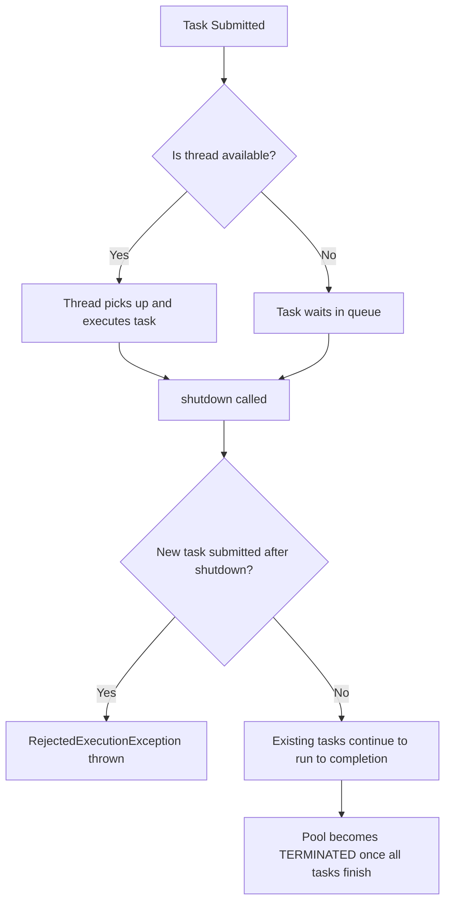
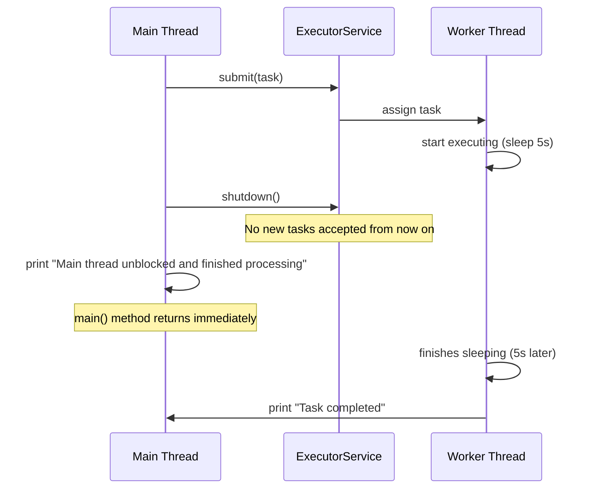
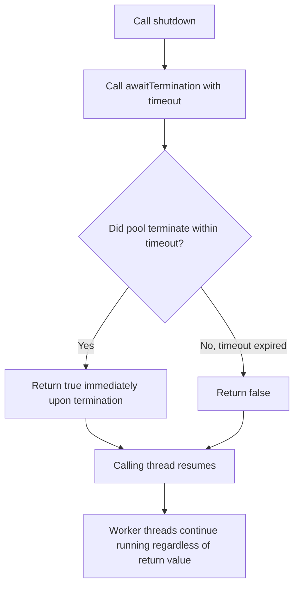
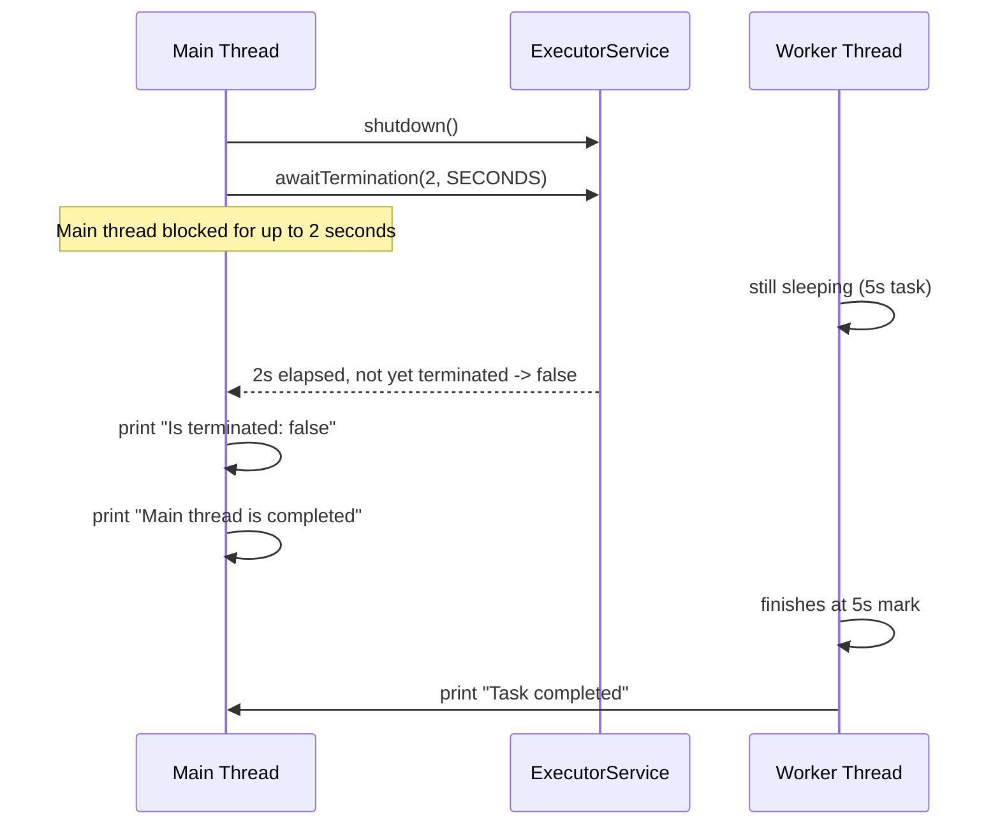
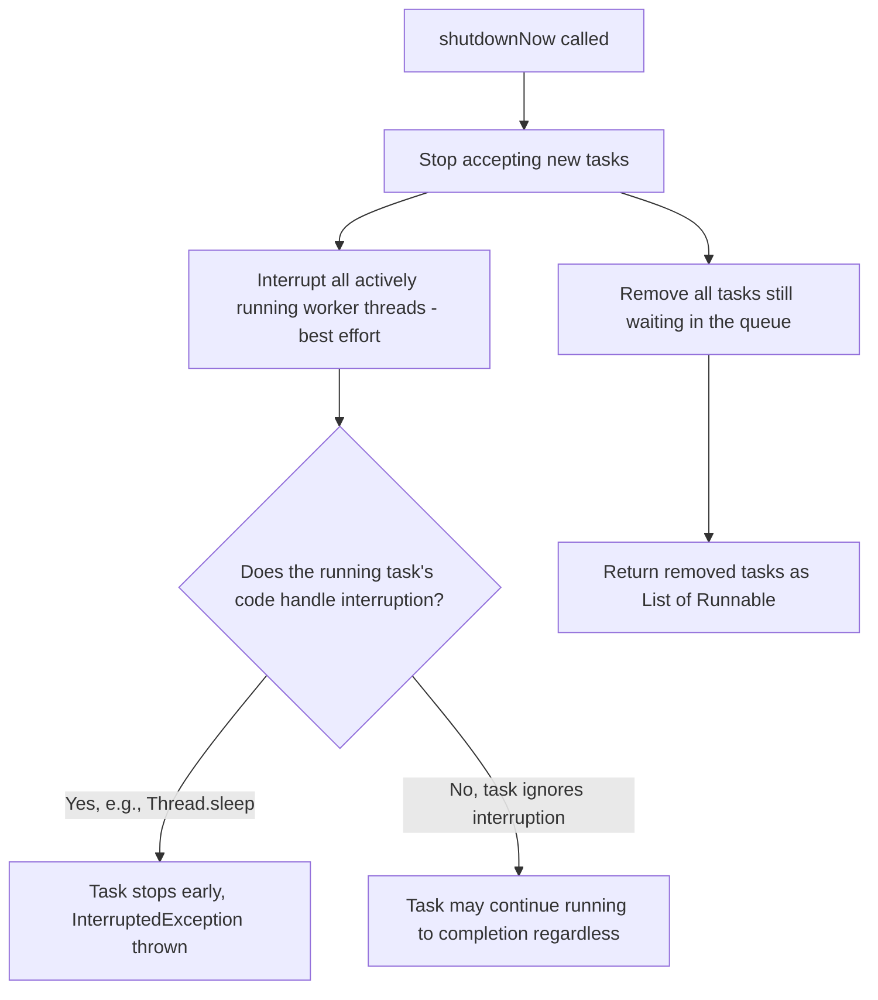
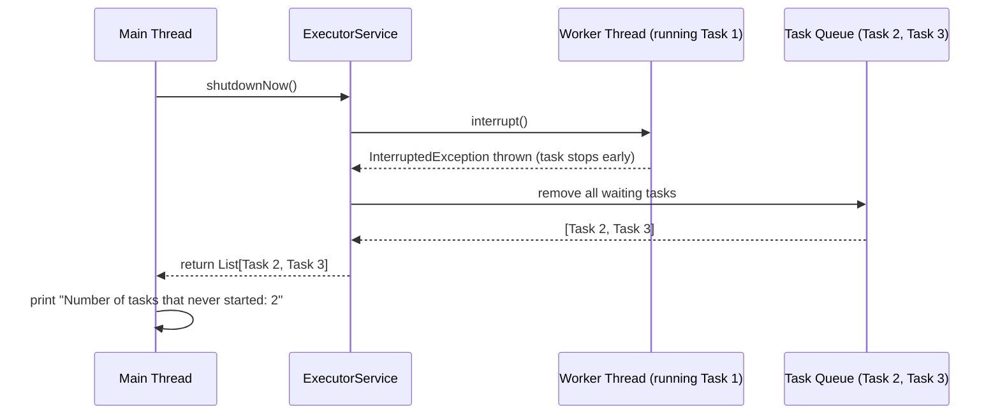
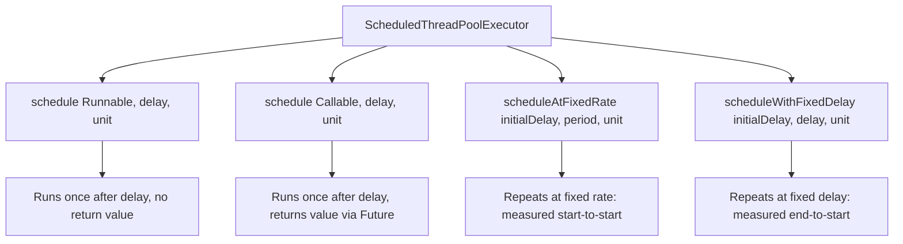
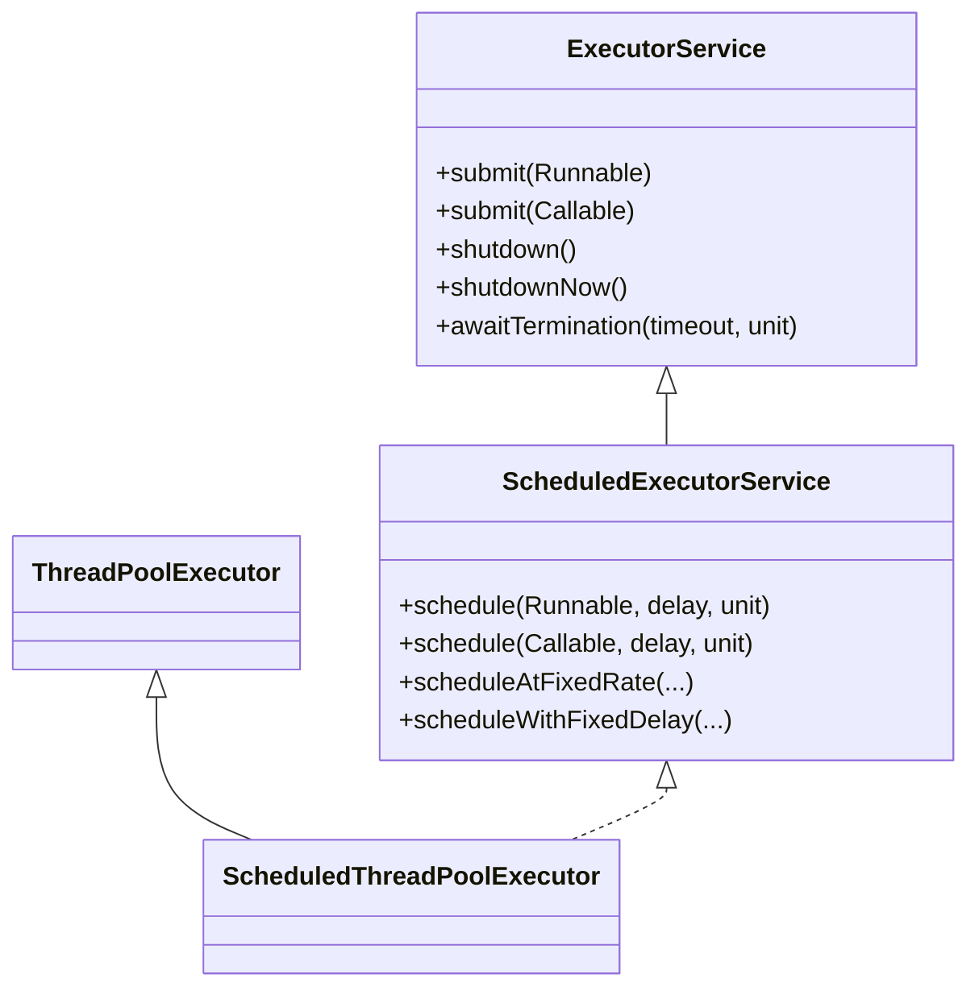
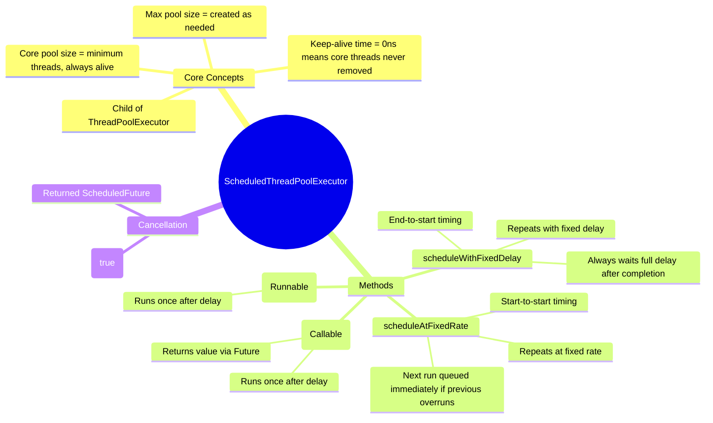

# Java Multithreading Deep Dive: `shutdown()` vs `shutdownNow()` vs `awaitTermination()` and `ScheduledThreadPoolExecutor`

> This chapter is based on a lecture covering four key `ExecutorService` interview topics:
> 1. `shutdown()`
> 2. `awaitTermination()`
> 3. `shutdownNow()`
> 4. Virtual Thread vs Normal Thread (mentioned as an upcoming topic, covered in a future lecture — not detailed in this transcript)
> 5. `ScheduledThreadPoolExecutor` and its four scheduling methods

These topics are frequently asked in Java interviews, especially around understanding the **lifecycle of a thread pool** and how tasks behave when a thread pool is shutting down.

---

# 📌 Topic 1: `shutdown()` Method

## Overview

`shutdown()` is a method on `ExecutorService` that initiates an **orderly shutdown** of the executor service. It is the "graceful" way to stop a thread pool from accepting further work while letting existing work finish naturally.

## Why This Concept Exists

When an application no longer needs a thread pool (e.g., during application shutdown, or when a particular workflow finishes), you need a controlled way to:
- Stop accepting new work.
- Let already-running and already-queued tasks complete without being abruptly killed.
- Avoid data corruption or incomplete processing that could happen if threads were killed mid-task.

Java provides `shutdown()` precisely to solve this "graceful stop" problem, as opposed to a hard/forced stop.

## Definition

> [!IMPORTANT]
> `shutdown()` **initiates an orderly shutdown** of the executor service. After calling `shutdown()`:
> 1. The executor **will not accept any new task submissions**. Any new task submitted after this call will be **rejected** (a `RejectedExecutionException` is thrown).
> 2. **Already submitted tasks will continue to execute** to completion. Threads that are currently executing a task, or tasks that are already sitting in the internal queue waiting to be picked up, are **not interrupted** and are **not stopped**.

In short: `shutdown()` closes the "front door" (no new tasks) but does not disturb the tasks already inside the building.

## Real-world Analogy

Think of a restaurant putting up a sign that says **"No new customers will be seated"** at closing time. However, customers who are already seated and eating their meal are **not asked to leave** — they get to finish their meal in peace. The kitchen keeps cooking for orders already placed, but the host stops seating new walk-ins.

## Internal Working

- `ExecutorService` internally maintains a **thread pool** (a set of worker threads) and typically a **task queue** (e.g., `BlockingQueue<Runnable>`) that holds tasks waiting for a free thread.
- When you call `submit()`, the task is handed to the executor, which either:
  - Assigns it to an idle worker thread immediately, or
  - Places it in the internal queue if all threads are busy.
- When `shutdown()` is invoked:
  - An internal state flag changes (the executor transitions to a "SHUTDOWN" state).
  - The executor stops accepting new tasks — any call to `submit()` or `execute()` after this point results in a `RejectedExecutionException`.
  - Worker threads that are currently executing a `Runnable`/`Callable` **keep running that task to completion** — they are not interrupted.
  - Once all currently running and currently queued tasks finish, and no threads remain active, the executor moves to the "TERMINATED" state.
- Importantly, `shutdown()` **does not block the calling (main) thread**. The main thread immediately proceeds to the next line of code after calling `shutdown()` — it does **not** wait for the pool to actually finish or terminate.

## Syntax

```java
ExecutorService executorService = Executors.newFixedThreadPool(5);
executorService.submit(() -> {
    // some task
});
executorService.shutdown();
```

## Syntax Breakdown

| Element | Explanation |
|---|---|
| `Executors.newFixedThreadPool(5)` | Factory method that creates a thread pool with a **fixed number of 5 threads**. |
| `executorService.submit(...)` | Submits a `Runnable` or `Callable` task to be executed by one of the pool's threads. |
| `executorService.shutdown()` | Initiates orderly shutdown — no return value (`void`). Does not block. |

## Code Examples

### Beginner Example — Submitting a task, then shutting down

```java
import java.util.concurrent.ExecutorService;
import java.util.concurrent.Executors;

public class ShutdownDemo {
    public static void main(String[] args) {
        ExecutorService executorService = Executors.newFixedThreadPool(5);

        // Submit a task that sleeps for 5 seconds to simulate long-running work
        executorService.submit(() -> {
            try {
                Thread.sleep(5000);
            } catch (InterruptedException e) {
                e.printStackTrace();
            }
            System.out.println("Task completed");
        });

        // Initiate shutdown
        executorService.shutdown();

        System.out.println("Main thread unblocked and finished processing");
    }
}
```

### Output

```
Main thread unblocked and finished processing
Task completed
```

### Line-by-Line Explanation

1. `ExecutorService executorService = Executors.newFixedThreadPool(5);` — Creates a thread pool with 5 worker threads ready to accept tasks.
2. `executorService.submit(() -> {...})` — Submits a lambda (a `Runnable`) to the pool. One of the 5 threads picks it up and begins executing it. Inside, `Thread.sleep(5000)` pauses that specific worker thread for 5 seconds to simulate a long task.
3. `executorService.shutdown();` — This is called immediately after submission. It tells the executor: "Don't accept any more new tasks going forward." It does **not** affect the task already running.
4. `System.out.println("Main thread unblocked and finished processing");` — Since `shutdown()` does not block, this line executes **immediately**, without waiting for the submitted task to finish.
5. After 5 seconds pass (in the background worker thread), `"Task completed"` is printed once the sleeping task finishes naturally.

### Step-by-Step Execution

| Time | Main Thread | Worker Thread |
|---|---|---|
| t = 0s | Submits task, calls `shutdown()`, prints "Main thread unblocked..." then exits `main()` | Starts executing the submitted task, begins `Thread.sleep(5000)` |
| t = 0s → 5s | (Main thread has already finished its logical work) | Still sleeping (executing the task) |
| t = 5s | — | Wakes up, prints "Task completed" |

> [!NOTE]
> Even though the `main()` method's logic finishes almost instantly, the **JVM process itself does not exit** until all non-daemon threads (including the pool's worker threads) complete, because thread pool worker threads created by `Executors` are **non-daemon threads** by default.

### Intermediate Example — Demonstrating Rejection of New Tasks After Shutdown

```java
import java.util.concurrent.ExecutorService;
import java.util.concurrent.Executors;

public class ShutdownRejectionDemo {
    public static void main(String[] args) {
        ExecutorService executorService = Executors.newFixedThreadPool(5);

        // Submit first task
        executorService.submit(() -> {
            try {
                Thread.sleep(3000);
            } catch (InterruptedException e) {
                e.printStackTrace();
            }
            System.out.println("First task completed");
        });

        // Shut down the pool
        executorService.shutdown();

        // Try submitting another task after shutdown
        try {
            executorService.submit(() -> System.out.println("Second task"));
        } catch (Exception e) {
            System.out.println("Rejected because thread pool has been shut down: " + e);
        }
    }
}
```

### Output

```
Rejected because thread pool has been shut down: java.util.concurrent.RejectedExecutionException: ...
First task completed
```

### Line-by-Line Explanation

- The first task is submitted successfully and begins sleeping for 3 seconds.
- `shutdown()` is called, transitioning the pool into the "no new tasks" state.
- When we try to submit a **second** task after shutdown, the executor throws a `RejectedExecutionException` — this is caught and printed.
- Meanwhile, the **first task**, which was already submitted before `shutdown()` was called, is **not affected** and continues running to completion, eventually printing "First task completed" after 3 seconds.

## Memory Representation

- The `ExecutorService` object itself lives on the **heap**.
- Each worker thread has its **own thread stack** (on the stack memory area), holding its own local variables and call frames (e.g., the stack frame for the lambda/task being executed).
- The **task queue** (if using a bounded/unbounded `BlockingQueue`) lives on the heap and holds references to `Runnable`/`Callable` objects awaiting execution.
- Calling `shutdown()` only changes an internal **state variable** of the executor (heap-allocated) — it does **not** remove or destroy any thread stacks that are actively running.

## Flowchart



## Diagrams



## Key Observations

- `shutdown()` is **non-blocking** — the calling thread does not wait for the pool to finish.
- Already submitted tasks (both running and queued) are guaranteed to complete.
- No new tasks can be submitted after `shutdown()` is called — attempting to do so throws `RejectedExecutionException`.
- `shutdown()` is the **recommended, safe way** to stop an executor service in most cases.

## Common Mistakes

> [!WARNING]
> **Mistake:** Assuming `shutdown()` immediately stops all threads and cleans up resources.
> **Why it happens:** The name "shutdown" sounds like an instant stop.
> **Correct approach:** Understand that `shutdown()` only stops *new* task acceptance. Already-running tasks continue. If you need to *wait* for termination, you must additionally call `awaitTermination()` (covered next).

> [!WARNING]
> **Mistake:** Submitting tasks after calling `shutdown()` and not handling the exception.
> **Why it happens:** Developers forget the pool has already entered the "no new task" state.
> **Correct approach:** Wrap post-shutdown submissions in a try-catch for `RejectedExecutionException`, or better, redesign the application flow so no submissions happen after shutdown.

## Best Practices

- Always call `shutdown()` (not just letting the object go out of scope) when you are done using a thread pool, to allow proper cleanup and to let the JVM exit cleanly.
- Pair `shutdown()` with `awaitTermination()` when you need to know when the pool has fully terminated (e.g., before proceeding with dependent cleanup logic).
- Avoid submitting new tasks in a "shutdown hook" or finalization code without checking pool state.

## Interview Notes

- **Q: Does `shutdown()` stop already running tasks?** No — already running and already queued tasks complete normally.
- **Q: Is `shutdown()` blocking?** No — it returns immediately; it does not wait for termination.
- **Q: What happens if you submit a task after `shutdown()`?** A `RejectedExecutionException` is thrown.

## Related Concepts

- `shutdownNow()` (forceful shutdown)
- `awaitTermination()` (waiting/checking for termination)
- `isShutdown()` and `isTerminated()` (state-check methods)
- Executor lifecycle states: RUNNING → SHUTDOWN → STOP → TIDYING → TERMINATED (conceptually, per the internal implementation of `ThreadPoolExecutor`)

## Practice Questions

**Easy:** What does `shutdown()` do to newly submitted tasks?

**Medium:** If a thread pool has 5 threads, 2 of which are executing tasks and 3 tasks are waiting in the queue, what happens to all of them after `shutdown()` is called?

**Hard:** Write code to demonstrate that calling `submit()` after `shutdown()` throws an exception, and explain why the main thread does not wait for the pool to terminate.

## Summary

- `shutdown()` = orderly, graceful shutdown.
- New tasks → rejected.
- Existing tasks (running + queued) → allowed to finish.
- Non-blocking call — main thread proceeds immediately.

---

# 📌 Topic 2: `awaitTermination()` Method

## Overview

`awaitTermination()` is an **optional** utility method used **after** calling `shutdown()` (or `shutdownNow()`). It blocks the **calling thread** for a specified timeout period, waiting to see if the executor service has fully terminated within that time.

## Why This Concept Exists

After calling `shutdown()`, the main thread does not wait — it just moves on. But sometimes you need to know: **"Has the thread pool actually finished all its work yet?"** — for example, before proceeding to a step that depends on all tasks being done (like generating a final report after batch processing). `awaitTermination()` solves this by letting you block for a bounded amount of time and check the termination status.

## Definition

> [!IMPORTANT]
> `awaitTermination(timeout, unit)`:
> - It is an **optional functionality** — it does **not force** the executor service to shut down or do anything to the tasks.
> - It should be used **after** calling `shutdown()` (calling it before `shutdown()` is mostly useless, since the pool hasn't started shutting down).
> - It **blocks the calling thread** for the specified timeout period, waiting for the `ExecutorService` to reach the terminated state.
> - It **returns `true`** if the executor service actually terminates within the given timeout.
> - It **returns `false`** if the timeout elapses before termination completes.

In essence, `awaitTermination()` is a **checking mechanism** — "wait up to X seconds, then tell me whether the pool is fully done or not."

## Real-world Analogy

Imagine you've told the restaurant kitchen to stop taking new orders (`shutdown()`). Now you (the manager) want to know if the kitchen has actually finished cooking everything and cleaned up. You decide to **wait at the door for up to 2 minutes** (`awaitTermination(2, MINUTES)`). If the kitchen finishes within those 2 minutes, you get a "yes, all done" (`true`). If 2 minutes pass and they're still cooking, you get a "not yet" (`false`) — but the kitchen keeps cooking regardless; your waiting doesn't affect their work.

## Internal Working

- `awaitTermination()` internally uses thread synchronization (condition variables / locks within `ThreadPoolExecutor`) to **block the calling thread**.
- It periodically (or via a signal upon state transition) checks whether the executor's internal state has reached `TERMINATED`.
- If the state becomes `TERMINATED` before the timeout expires, the method returns `true` **immediately** (it does not necessarily wait for the *entire* timeout duration once termination is detected).
- If the timeout expires first, it returns `false`, and the calling thread resumes execution — meanwhile, the executor's worker threads **continue running** in the background, completely unaffected by the timeout expiry.
- This method throws a checked `InterruptedException`, since blocking calls in Java that can be interrupted must declare or handle this exception — hence it must be wrapped in a `try-catch` block.

## Syntax

```java
executorService.shutdown();
try {
    boolean isTerminated = executorService.awaitTermination(2, TimeUnit.SECONDS);
    System.out.println("Is terminated: " + isTerminated);
} catch (InterruptedException e) {
    e.printStackTrace();
}
```

## Syntax Breakdown

| Element | Explanation |
|---|---|
| `awaitTermination(2, TimeUnit.SECONDS)` | Waits at most 2 seconds for termination. |
| Return type `boolean` | `true` if terminated within timeout, `false` otherwise. |
| `throws InterruptedException` | Must be handled with try-catch since it's a checked exception. |

## Code Examples

### Beginner Example

```java
import java.util.concurrent.ExecutorService;
import java.util.concurrent.Executors;
import java.util.concurrent.TimeUnit;

public class AwaitTerminationDemo {
    public static void main(String[] args) {
        ExecutorService executorService = Executors.newFixedThreadPool(5);

        executorService.submit(() -> {
            try {
                Thread.sleep(5000); // Simulate a 5-second task
            } catch (InterruptedException e) {
                e.printStackTrace();
            }
            System.out.println("Task completed");
        });

        executorService.shutdown();

        try {
            boolean isTerminated = executorService.awaitTermination(2, TimeUnit.SECONDS);
            System.out.println("Is terminated: " + isTerminated);
        } catch (InterruptedException e) {
            e.printStackTrace();
        }

        System.out.println("Main thread is completed");
    }
}
```

### Output

```
Is terminated: false
Main thread is completed
Task completed
```

### Line-by-Line Explanation

1. A task is submitted that sleeps for 5 seconds — simulating a long-running task.
2. `shutdown()` is called — no new tasks accepted, but the running task continues.
3. `awaitTermination(2, TimeUnit.SECONDS)` **blocks the main thread for up to 2 seconds**, checking whether the pool has fully terminated.
4. Since the task takes 5 seconds and only 2 seconds have passed, the pool is **not yet terminated**, so this call returns `false` after the 2-second wait.
5. `"Is terminated: false"` is printed.
6. The main thread then continues and prints `"Main thread is completed"`.
7. After the remaining time elapses (5 seconds total from task start), the worker thread finishes sleeping and prints `"Task completed"`.

### Step-by-Step Execution

| Time | Event |
|---|---|
| t = 0s | Task submitted, starts sleeping for 5s |
| t = 0s | `shutdown()` called |
| t = 0s → 2s | Main thread blocked inside `awaitTermination(2, SECONDS)` |
| t = 2s | Timeout expires; pool not yet terminated → returns `false`; prints `"Is terminated: false"` |
| t = 2s | Main thread proceeds, prints `"Main thread is completed"` |
| t = 5s | Worker thread finishes sleeping, prints `"Task completed"` |

## Memory Representation

- The blocking behavior of `awaitTermination()` involves the calling thread's stack frame being **parked/waiting** (similar to `Object.wait()` internally using locks/conditions) — it is not busy-spinning, so it doesn't consume CPU while waiting.
- The `boolean isTerminated` local variable lives on the main thread's **stack**.
- The worker thread executing the sleeping task has a completely separate **stack**, unaffected by the main thread's wait.

## Flowchart



## Diagrams



## Key Observations

- `awaitTermination()` is purely a **checking/waiting mechanism** — it has **no power to force** shutdown or interrupt tasks.
- It should always be called **after** `shutdown()` (or `shutdownNow()`), not before.
- It returns a `boolean`: `true` = terminated within the timeout, `false` = timeout expired first.
- It is described in the lecture as an **"optional functionality"** — useful only if your application logic actually needs to know/wait for termination completion (e.g., to perform cleanup steps afterward).
- If termination happens **before** the timeout, the method can return early with `true` — it doesn't necessarily wait for the full timeout duration.

## Common Mistakes

> [!WARNING]
> **Mistake:** Calling `awaitTermination()` without first calling `shutdown()`.
> **Why it happens:** Developers assume `awaitTermination()` on its own will stop the pool.
> **Correct approach:** Always call `shutdown()` (or `shutdownNow()`) first; `awaitTermination()` is meant to be used afterward to check/wait for the shutdown to actually complete.

> [!WARNING]
> **Mistake:** Assuming a `false` return means something went wrong.
> **Why it happens:** The boolean naming can be misleading.
> **Correct approach:** `false` simply means the timeout elapsed before all tasks finished — it is not an error condition. The tasks are still running fine in the background.

## Best Practices

- Use `awaitTermination()` in a loop with reasonable timeouts if you must guarantee full termination before proceeding (a common pattern is to call `shutdown()`, then `awaitTermination()`, and if it returns `false`, call `shutdownNow()` as a fallback).
- Choose a timeout value appropriate to your expected task durations.
- Always handle `InterruptedException` properly (e.g., re-interrupt the current thread or log and handle gracefully), rather than swallowing it silently.

## Interview Notes

- **Q: Is `awaitTermination()` mandatory after `shutdown()`?** No, it's optional — used only if you need to wait/check.
- **Q: What does `awaitTermination()` return?** A `boolean` — `true` if terminated within the timeout, `false` otherwise.
- **Q: Does `awaitTermination()` interrupt running tasks if the timeout expires?** No — it has no effect on the tasks at all; it is purely observational/blocking for the calling thread.

## Related Concepts

- `shutdown()`
- `shutdownNow()`
- `isTerminated()` (non-blocking state check)
- `isShutdown()` (non-blocking state check)

## Practice Questions

**Easy:** What does `awaitTermination()` return if the pool finishes before the timeout expires?

**Medium:** Why is it recommended to call `awaitTermination()` only after `shutdown()`?

**Hard:** Design a shutdown routine that calls `shutdown()`, waits up to 60 seconds via `awaitTermination()`, and if the pool still hasn't terminated, forcefully calls `shutdownNow()`.

## Summary

- Optional method used after `shutdown()`/`shutdownNow()`.
- Blocks the calling thread for a given timeout.
- Returns `true` if the pool terminates within the timeout, `false` otherwise.
- Does **not** force termination — it's purely a wait-and-check mechanism.

---

# 📌 Topic 3: `shutdownNow()` Method

## Overview

`shutdownNow()` is the **forceful** counterpart to `shutdown()`. It attempts to stop the executor service **as soon as possible**, using a **best-effort attempt** to interrupt actively executing tasks.

## Why This Concept Exists

Sometimes an application needs to shut down **immediately** — for example, during an emergency shutdown, application crash recovery, or when tasks are no longer relevant and continuing to run them would waste resources or cause harm. `shutdownNow()` exists to provide this "stop everything now" capability, as opposed to the graceful wait-it-out approach of `shutdown()`.

## Definition

> [!IMPORTANT]
> `shutdownNow()`:
> 1. It is a **best-effort attempt** to **stop or interrupt actively executing tasks**. (It is "best effort" because Java cannot forcibly kill a thread — it can only send an interrupt signal via `Thread.interrupt()`, and the task's code must cooperate by checking/responding to the interrupt for it to actually stop.)
> 2. It **halts the processing of tasks that are waiting** in the queue (i.e., tasks that have been submitted but not yet started).
> 3. It **returns a list of the tasks that were awaiting execution** (i.e., the tasks that were in the queue but never got a chance to start) — this is the return type: `List<Runnable>`.

## Real-world Analogy

Continuing the restaurant analogy: `shutdownNow()` is like the manager suddenly shouting **"Kitchen's closing right now — stop what you're cooking and put down your utensils!"** The chefs currently cooking try to stop immediately (best effort — they might still finish plating whatever's on the stove if it can't be safely abandoned mid-step). Meanwhile, any orders that were waiting in the order queue (not yet started) are **cancelled entirely**, and the manager hands you back a list of those cancelled/un-started orders.

## Internal Working

- `shutdownNow()` first transitions the executor to a "STOP" state (internally), preventing new task acceptance (just like `shutdown()`).
- It then iterates over the **currently running worker threads** and calls `Thread.interrupt()` on each of them. This sets the thread's **interrupted status flag** to `true`.
  - If the task's code contains blocking calls that respond to interruption (like `Thread.sleep()`, `Object.wait()`, or blocking I/O operations), those calls will throw an `InterruptedException`, which typically causes the task to stop early (unless the code catches and ignores it).
  - If the task's code does **not** check for interruption or handle `InterruptedException`, the task may **continue running to completion** despite `shutdownNow()` being called — hence, it is only a **"best-effort"** mechanism, not a guarantee.
- Any tasks still sitting in the internal task queue (not yet picked up by a worker thread) are **removed from the queue** and are **not started at all**.
- These un-started, removed tasks are collected and returned as a `List<Runnable>` from the `shutdownNow()` call, so the caller has the option to log them, retry them elsewhere, or otherwise handle them.

## Syntax

```java
List<Runnable> notExecutedTasks = executorService.shutdownNow();
```

## Syntax Breakdown

| Element | Explanation |
|---|---|
| `shutdownNow()` | Attempts immediate shutdown; interrupts running tasks; discards queued tasks. |
| Return type `List<Runnable>` | The tasks that were waiting in the queue and never got executed. |

## Code Examples

### Beginner Example — Contrasting `shutdown()` and `shutdownNow()`

```java
import java.util.concurrent.ExecutorService;
import java.util.concurrent.Executors;

public class ShutdownNowDemo {
    public static void main(String[] args) throws InterruptedException {
        ExecutorService executorService = Executors.newFixedThreadPool(5);

        executorService.submit(() -> {
            try {
                Thread.sleep(15000); // Simulate a long 15-second task
            } catch (InterruptedException e) {
                System.out.println("Task was interrupted!");
                return;
            }
            System.out.println("Task completed after full 15 seconds");
        });

        // Using shutdownNow instead of shutdown
        executorService.shutdownNow();

        System.out.println("Task completed as soon as possible (main thread continues)");
    }
}
```

### Output

```
Task completed as soon as possible (main thread continues)
Task was interrupted!
```

### Line-by-Line Explanation

1. A task is submitted that would normally sleep for 15 seconds before printing a completion message.
2. `shutdownNow()` is called immediately after submission.
3. Internally, `shutdownNow()` sends an **interrupt signal** to the worker thread that is currently executing `Thread.sleep(15000)`.
4. Since `Thread.sleep()` is interruptible, it immediately throws an `InterruptedException`, which is caught inside the task, printing `"Task was interrupted!"` — the task does **not** wait the full 15 seconds.
5. Meanwhile, the main thread does not block on `shutdownNow()` either — it proceeds straight to the next line and prints its own message.

> [!NOTE]
> Contrast this with using plain `shutdown()` on the same code: the task would **not** be interrupted, and it would sleep the entire 15 seconds before printing `"Task completed after full 15 seconds"`.

### Intermediate Example — Demonstrating the Returned List of Un-started Tasks

```java
import java.util.List;
import java.util.concurrent.ExecutorService;
import java.util.concurrent.Executors;

public class ShutdownNowQueueDemo {
    public static void main(String[] args) {
        ExecutorService executorService = Executors.newFixedThreadPool(1); // Only 1 thread

        // Task 1 will occupy the only available thread
        executorService.submit(() -> {
            try {
                Thread.sleep(10000);
            } catch (InterruptedException e) {
                System.out.println("Task 1 interrupted");
            }
        });

        // Task 2 and Task 3 will wait in the queue since there's only 1 thread
        executorService.submit(() -> System.out.println("Task 2"));
        executorService.submit(() -> System.out.println("Task 3"));

        List<Runnable> notExecutedTasks = executorService.shutdownNow();

        System.out.println("Number of tasks that never started: " + notExecutedTasks.size());
    }
}
```

### Output

```
Number of tasks that never started: 2
Task 1 interrupted
```

### Line-by-Line Explanation

- A single-threaded pool is created, so only one task can run at a time.
- Task 1 starts running immediately (sleeping 10 seconds), occupying the only thread.
- Task 2 and Task 3 are placed into the **internal queue**, waiting for the thread to become free.
- `shutdownNow()` is called: it interrupts Task 1 (currently running) and **removes Task 2 and Task 3 from the queue** without ever starting them.
- The returned list `notExecutedTasks` contains these two un-started tasks, so its size is `2`.
- Task 1, since it was interrupted during `Thread.sleep()`, throws an `InterruptedException`, caught and printed as `"Task 1 interrupted"`.

## Memory Representation

- Interrupting a thread sets a boolean **interrupt status flag** on the `Thread` object itself (heap-allocated `Thread` instance) — this is checked internally by interruptible blocking methods like `sleep()`, `wait()`, or `join()`.
- The task queue is a heap-allocated data structure (e.g., `LinkedBlockingQueue<Runnable>`); calling `shutdownNow()` drains this queue and converts its remaining elements into the returned `List<Runnable>`.
- The worker thread's own **stack frame** for the currently executing task may be unwound abruptly if an `InterruptedException` propagates and isn't caught, terminating that thread's task execution early.

## Flowchart



## Diagrams



## Key Observations

- `shutdownNow()` is **best-effort** — it cannot guarantee that a currently running task actually stops, since Java threads cannot be forcibly killed; the task's code must cooperate with interruption.
- Queued (not-yet-started) tasks are **always** removed and returned, regardless of whether the running task actually stops.
- The return type `List<Runnable>` lets the caller inspect or reschedule the tasks that never got a chance to run.
- Like `shutdown()`, `shutdownNow()` is also **non-blocking** for the calling thread.

## Common Mistakes

> [!WARNING]
> **Mistake:** Assuming `shutdownNow()` guarantees all running tasks stop immediately.
> **Why it happens:** The name suggests an absolute, forced stop.
> **Correct approach:** Understand it's "best effort" — only tasks that check for interruption (or use interruptible blocking calls) will actually stop early. Non-cooperative tasks may run to completion despite `shutdownNow()`.

> [!WARNING]
> **Mistake:** Ignoring the returned `List<Runnable>` from `shutdownNow()`.
> **Why it happens:** Developers don't realize valuable "never executed" task information is available.
> **Correct approach:** Capture and inspect/log/retry the returned list if your application needs to account for work that was dropped.

## Best Practices

- Use `shutdownNow()` only when you genuinely need an **urgent/forced** stop (e.g., app is crashing, user cancelled an operation, resource limits reached).
- Design your `Runnable`/`Callable` tasks to be **interruption-aware** (e.g., periodically checking `Thread.currentThread().isInterrupted()` in long loops) so `shutdownNow()` can actually stop them promptly.
- Always inspect the returned `List<Runnable>` if you need to know which tasks were dropped.
- Consider combining `shutdown()` + `awaitTermination()` + a fallback `shutdownNow()` for a robust two-phase shutdown strategy — this is a widely recommended production pattern.

## Interview Notes

- **Q: What is the key difference between `shutdown()` and `shutdownNow()`?** `shutdown()` lets running and queued tasks finish naturally; `shutdownNow()` tries to interrupt running tasks immediately and discards queued tasks.
- **Q: Why is `shutdownNow()` called "best-effort"?** Because Java cannot force-kill a thread; it can only signal an interrupt, and the task must cooperate for the interruption to actually take effect.
- **Q: What does `shutdownNow()` return?** A `List<Runnable>` of tasks that were waiting in the queue and never started.

## Related Concepts

- `shutdown()`
- `awaitTermination()`
- `Thread.interrupt()` and interruption handling
- `InterruptedException`

## Practice Questions

**Easy:** What is the return type of `shutdownNow()`?

**Medium:** Why might a task continue running even after `shutdownNow()` is called on its executor?

**Hard:** Write code showing a task that ignores interruption (does not check `isInterrupted()` and uses no interruptible blocking calls) and demonstrate that it still runs to completion despite `shutdownNow()`.

## Summary

- `shutdownNow()` = forceful/urgent shutdown attempt.
- Interrupts actively running tasks (best-effort — not guaranteed to actually stop them).
- Discards and returns not-yet-started queued tasks as `List<Runnable>`.
- Non-blocking for the calling thread, just like `shutdown()`.

---

# 📊 Comparison Table: `shutdown()` vs `awaitTermination()` vs `shutdownNow()`

| Aspect | `shutdown()` | `awaitTermination()` | `shutdownNow()` |
|---|---|---|---|
| Purpose | Orderly/graceful shutdown | Wait/check for termination | Forceful/urgent shutdown |
| Accepts new tasks after call? | No | N/A (doesn't change this) | No |
| Effect on running tasks | None — allowed to finish | None — purely observational | Interrupted (best-effort) |
| Effect on queued tasks | Allowed to run eventually | None | Removed and returned |
| Blocking? | No | Yes (up to timeout) | No |
| Return type | `void` | `boolean` | `List<Runnable>` |
| When to use | Normal graceful shutdown | After `shutdown()`/`shutdownNow()`, when you need to know completion status | Urgent/emergency shutdown |
| Mandatory to call? | Commonly, yes, for cleanup | No — optional | No — only when needed |

---

# 📌 Topic 4: `ScheduledThreadPoolExecutor`

## Overview

`ScheduledThreadPoolExecutor` is a thread pool executor specialized in **scheduling tasks** to run after a delay, or repeatedly at fixed intervals. As its name suggests, it extends the regular pooling capability with **time-based scheduling**.

## Why This Concept Exists

Many real-world applications need to run tasks **not immediately**, but:
- After a certain delay (e.g., "send a reminder email in 10 minutes").
- Repeatedly on a schedule (e.g., "run a health-check every 30 seconds", "clean up temp files every hour").

Without a scheduling-aware executor, developers would need to manually manage `Thread.sleep()` loops or custom timer logic, which is error-prone and does not integrate well with thread pooling, resource management, or graceful shutdown. `ScheduledThreadPoolExecutor` solves this cleanly by combining thread pooling with scheduling.

## Definition

> [!IMPORTANT]
> `ScheduledThreadPoolExecutor` is a **child of `ThreadPoolExecutor`** — meaning it inherits all the standard capabilities of a regular thread pool executor (like `submit()`, `execute()`, `shutdown()`, `shutdownNow()`, `awaitTermination()`, etc.), **plus** it adds **four new scheduling methods**:
> 1. `schedule(Runnable command, long delay, TimeUnit unit)`
> 2. `schedule(Callable<V> callable, long delay, TimeUnit unit)`
> 3. `scheduleAtFixedRate(Runnable command, long initialDelay, long period, TimeUnit unit)`
> 4. `scheduleWithFixedDelay(Runnable command, long initialDelay, long delay, TimeUnit unit)`

## Real-world Analogy

Think of `ScheduledThreadPoolExecutor` as a **personal assistant with an alarm clock**. You can tell your assistant:
- "Remind me once, in 5 minutes" (→ `schedule`).
- "Remind me once, in 5 minutes, and also tell me what the answer is when it's ready" (→ `schedule` with `Callable`).
- "Remind me every 5 minutes starting 3 minutes from now, no matter how long each reminder takes" (→ `scheduleAtFixedRate`).
- "Remind me 5 minutes after my *previous* reminder task actually finishes" (→ `scheduleWithFixedDelay`).

## Internal Working

- `ScheduledThreadPoolExecutor` internally uses a specialized **delay queue** (conceptually similar to a `DelayedWorkQueue`) that orders tasks based on their scheduled execution time rather than simple FIFO order.
- Each scheduled task is wrapped in an internal representation that tracks:
  - The task itself (`Runnable`/`Callable`).
  - The time at which it should next run.
  - For repeating tasks: the **period** (fixed-rate) or **delay** (fixed-delay) governing subsequent executions.
- Threads in the pool continuously check the delay queue; when a task's scheduled time arrives, an available worker thread picks it up and executes it.
- The constructor parameters for the pool (via `Executors` factory methods, or direct `ThreadPoolExecutor`/`ScheduledThreadPoolExecutor` construction) include:
  - **Core pool size**: the **minimum** number of threads. Even if these threads are sitting idle, they are **not removed** from the pool (this is why "keep-alive time" for core threads is typically not relevant unless explicitly configured otherwise).
  - **Maximum pool size**: the **maximum** number of threads the pool may create as demand requires.
  - **Keep-alive time**: how long excess idle threads (beyond the core size) wait before being terminated. In the lecture's example, this is described as `0 nanoseconds`, meaning: the 5 core threads described will **always remain**, even when idle — they will not be removed due to inactivity.

## Syntax

```java
ScheduledExecutorService scheduledExecutorService = Executors.newScheduledThreadPool(5);
```

## Syntax Breakdown

| Element | Explanation |
|---|---|
| `Executors.newScheduledThreadPool(5)` | Factory method creating a `ScheduledThreadPoolExecutor` with a **core pool size of 5** threads. |
| Return type | `ScheduledExecutorService` — the interface exposing the four scheduling methods plus all standard `ExecutorService` methods. |

---

## Method 1: `schedule(Runnable, delay, unit)`

### Definition

Schedules a `Runnable` task to run **once**, after a specified delay. It does **not** repeat.

### Syntax

```java
scheduledExecutorService.schedule(() -> {
    System.out.println("Hello");
}, 3, TimeUnit.SECONDS);
```

### Code Example

```java
import java.util.concurrent.Executors;
import java.util.concurrent.ScheduledExecutorService;
import java.util.concurrent.TimeUnit;

public class ScheduleRunnableDemo {
    public static void main(String[] args) {
        ScheduledExecutorService scheduledExecutorService = Executors.newScheduledThreadPool(5);

        scheduledExecutorService.schedule(() -> {
            System.out.println("Hello");
        }, 5, TimeUnit.SECONDS);
    }
}
```

### Output

```
(waits 5 seconds)
Hello
```

### Line-by-Line Explanation

1. A `ScheduledExecutorService` is created with a core pool of 5 threads.
2. `schedule(runnable, 5, TimeUnit.SECONDS)` tells the executor: "Run this `Runnable` **exactly once**, after waiting 5 seconds."
3. After 5 seconds elapse, one of the pool's threads picks up and executes the task, printing `"Hello"`.
4. The task runs **only once** — it will not repeat.

---

## Method 2: `schedule(Callable, delay, unit)`

### Definition

Same as the `Runnable` version, but accepts a `Callable<V>` instead — meaning the task **returns a value** (wrapped in a `Future<V>`), rather than returning nothing.

> [!NOTE]
> Recall the key difference between `Runnable` and `Callable`: `Runnable.run()` returns `void` and cannot throw checked exceptions, while `Callable<V>.call()` **returns a value of type `V`** and **can throw checked exceptions**.

### Syntax

```java
Future<String> future = scheduledExecutorService.schedule(() -> {
    return "Hello";
}, 5, TimeUnit.SECONDS);
```

### Code Example

```java
import java.util.concurrent.Executors;
import java.util.concurrent.Future;
import java.util.concurrent.ScheduledExecutorService;
import java.util.concurrent.TimeUnit;
import java.util.concurrent.ExecutionException;

public class ScheduleCallableDemo {
    public static void main(String[] args) {
        ScheduledExecutorService scheduledExecutorService = Executors.newScheduledThreadPool(5);

        Future<String> future = scheduledExecutorService.schedule(() -> {
            return "Hello";
        }, 5, TimeUnit.SECONDS);

        try {
            String result = future.get(); // Blocks until the result is available
            System.out.println(result);
        } catch (InterruptedException | ExecutionException e) {
            e.printStackTrace();
        }

        scheduledExecutorService.shutdown();
    }
}
```

### Output

```
(waits 5 seconds)
Hello
```

### Line-by-Line Explanation

1. A `Callable<String>` lambda is scheduled to run once after a 5-second delay.
2. `schedule()` immediately returns a `Future<String>` object — this represents the **eventual result** of the task.
3. `future.get()` **blocks the calling thread** until the scheduled task has actually run and produced its result.
4. After 5 seconds, the task runs, returns `"Hello"`, and `future.get()` unblocks, returning that value.
5. The result is printed.
6. `try-catch` is required because `future.get()` can throw `InterruptedException` (if the waiting thread is interrupted) or `ExecutionException` (if the task itself threw an exception during execution).

---

## Method 3: `scheduleAtFixedRate(Runnable, initialDelay, period, unit)`

### Definition

Schedules a `Runnable` task for **repeated execution at a fixed rate**. The task first runs after `initialDelay`, and then is scheduled to run again every `period` units of time, **measured from the start time of each execution** (not from when the previous execution finished).

> [!IMPORTANT]
> If a given execution of the task takes **longer** than the `period`, the **next execution will start immediately after the current one finishes** (it does not run concurrently/overlap, since it's still a single-threaded conceptual sequence for a *given scheduled task* — but it also does not wait an additional full period once delayed). Essentially, fixed-rate scheduling tries to maintain the fixed frequency, but subsequent executions cannot overlap; if a task runs long, the next one is queued to start immediately after, effectively "catching up."

### Syntax

```java
scheduledExecutorService.scheduleAtFixedRate(() -> {
    System.out.println("Hello");
}, 3, 5, TimeUnit.SECONDS);
```

### Syntax Breakdown

| Parameter | Meaning |
|---|---|
| `Runnable` | The task to run repeatedly. |
| `initialDelay` (e.g., `3`) | How long to wait before the **first** execution. |
| `period` (e.g., `5`) | The fixed rate interval between the **start** of successive executions. |
| `TimeUnit` | The unit for both `initialDelay` and `period` (e.g., seconds). |

### Code Example — Basic Repeated Execution

```java
import java.util.concurrent.Executors;
import java.util.concurrent.ScheduledExecutorService;
import java.util.concurrent.ScheduledFuture;
import java.util.concurrent.TimeUnit;

public class ScheduleAtFixedRateDemo {
    public static void main(String[] args) throws InterruptedException {
        ScheduledExecutorService scheduledExecutorService = Executors.newScheduledThreadPool(5);

        ScheduledFuture<?> future = scheduledExecutorService.scheduleAtFixedRate(() -> {
            System.out.println("Hello");
        }, 3, 5, TimeUnit.SECONDS);

        // Let it run for 10 seconds, then cancel it
        Thread.sleep(10000);
        future.cancel(true); // true = interrupt if running

        scheduledExecutorService.shutdown();
    }
}
```

### Output

```
(3 seconds pass)
Hello
(5 seconds pass)
Hello
(task cancelled around the 10-second mark; may or may not print one more "Hello" depending on timing)
```

### Line-by-Line Explanation

1. `scheduleAtFixedRate` is set up with an `initialDelay` of 3 seconds and a `period` of 5 seconds.
2. The task first runs at **t = 3s**, printing `"Hello"`.
3. It then runs again at **t = 3+5 = 8s**, printing `"Hello"` again.
4. It would continue every 5 seconds indefinitely (at t=13s, t=18s, ...) **unless explicitly cancelled**.
5. The `ScheduledFuture<?>` object returned by `scheduleAtFixedRate()` allows cancellation via `future.cancel(true)` — the `true` argument requests that the task be interrupted if it's currently running.
6. `Thread.sleep(10000)` pauses the main thread for 10 seconds, then `future.cancel(true)` stops future scheduled executions.

> [!WARNING]
> The lecture states that without cancellation, the task "will not stop, otherwise it will not stop" — meaning a repeatedly scheduled task via `scheduleAtFixedRate` (or `scheduleWithFixedDelay`) **continues indefinitely** until explicitly cancelled (via the returned `ScheduledFuture`) or until the executor service itself is shut down.

### Advanced Example — Demonstrating Fixed Rate Behavior When a Task Takes Longer Than the Period

```java
import java.util.concurrent.Executors;
import java.util.concurrent.ScheduledExecutorService;
import java.util.concurrent.TimeUnit;

public class FixedRateOverlapDemo {
    public static void main(String[] args) {
        ScheduledExecutorService scheduledExecutorService = Executors.newScheduledThreadPool(5);

        scheduledExecutorService.scheduleAtFixedRate(() -> {
            System.out.println("Thread picked the task");
            try {
                Thread.sleep(6000); // Task itself takes 6 seconds to run
            } catch (InterruptedException e) {
                e.printStackTrace();
            }
            System.out.println("Thread completed the task");
        }, 1, 3, TimeUnit.SECONDS);
    }
}
```

### Output

```
(1 second passes)
Thread picked the task
(6 seconds pass - task is still running; the "3 second" mark for next scheduled run passes during this time)
Thread completed the task
(next task starts immediately since it was already due)
Thread picked the task
...
```

### Line-by-Line Explanation

1. The first execution is scheduled to start after 1 second (`initialDelay = 1`).
2. Once started, this execution takes 6 seconds to complete (`Thread.sleep(6000)`), because the task itself is slow.
3. Meanwhile, based on the fixed **period of 3 seconds**, another execution would technically be "due" starting at the 4-second mark (1s initial delay + 3s period = 4s) — but since the previous execution is **still running** (it doesn't finish until the 7-second mark: 1s + 6s), the next execution **cannot start yet**.
4. This due-but-waiting execution is placed into a queue, waiting for the current execution to free up a thread.
5. As soon as the current (6-second) execution finishes at the 7-second mark, the **next already-due execution is immediately picked up from the queue and starts right away** — this is why the lecture describes both executions as effectively "coming together" back-to-back, since the next one was already overdue by the time the first one finished.

> [!NOTE]
> This demonstrates a key property of `scheduleAtFixedRate`: it tries to maintain the fixed frequency (start-to-start), but successive executions of the *same* scheduled task **never run concurrently** with each other. If a task overruns its period, the next execution is queued and starts immediately once the previous one finishes, rather than waiting for another full period to elapse.

---

## Method 4: `scheduleWithFixedDelay(Runnable, initialDelay, delay, unit)`

### Definition

Very similar to `scheduleAtFixedRate`, but with a key difference: the delay between executions is measured from the **end (completion) of the previous execution** to the **start of the next execution** — not from the start of the previous execution.

### Syntax

```java
scheduledExecutorService.scheduleWithFixedDelay(() -> {
    System.out.println("Hello");
}, 1, 3, TimeUnit.SECONDS);
```

### Syntax Breakdown

| Parameter | Meaning |
|---|---|
| `Runnable` | The task to run repeatedly. |
| `initialDelay` | Delay before the first execution starts. |
| `delay` | The delay to wait **after one execution completes** before starting the next one. |
| `TimeUnit` | Unit for both delays. |

### Code Example

```java
import java.util.concurrent.Executors;
import java.util.concurrent.ScheduledExecutorService;
import java.util.concurrent.TimeUnit;

public class ScheduleWithFixedDelayDemo {
    public static void main(String[] args) {
        ScheduledExecutorService scheduledExecutorService = Executors.newScheduledThreadPool(5);

        scheduledExecutorService.scheduleWithFixedDelay(() -> {
            System.out.println("Thread picked the task");
            try {
                Thread.sleep(6000); // Task takes 6 seconds
            } catch (InterruptedException e) {
                e.printStackTrace();
            }
            System.out.println("Thread completed the task");
        }, 1, 3, TimeUnit.SECONDS);
    }
}
```

### Output

```
(1 second passes)
Thread picked the task
(6 seconds pass while executing)
Thread completed the task
(3 seconds pass - the fixed delay, counted AFTER completion)
Thread picked the task
(6 seconds pass)
Thread completed the task
...
```

### Line-by-Line Explanation

1. The first execution starts after the `initialDelay` of 1 second.
2. The task runs for 6 seconds (due to `Thread.sleep(6000)`), then completes.
3. **Only after** the task completes does the `delay` of 3 seconds begin counting.
4. After that 3-second delay, the next execution starts.
5. This cycle repeats indefinitely: run (6s) → wait (3s) → run (6s) → wait (3s) → ...

### Comparison: `scheduleAtFixedRate` vs `scheduleWithFixedDelay`

| Aspect | `scheduleAtFixedRate` | `scheduleWithFixedDelay` |
|---|---|---|
| Timing reference point | Start-to-start (measured from when each execution *begins*) | End-to-start (measured from when each execution *completes*) |
| Behavior if task overruns period | Next execution is already "due" and starts immediately once the current one finishes | Next execution always waits the full delay *after* completion, regardless of how long the previous execution took |
| Use case | When you want executions to start at consistent intervals regardless of duration (as much as possible) | When you want a guaranteed "cool-down" gap between the end of one execution and the start of the next |

---

## Memory Representation (for Scheduled Tasks)

- The `ScheduledThreadPoolExecutor` maintains its scheduled tasks in a specialized **priority-based delay queue** on the heap, ordered by the next scheduled execution time.
- Each scheduled task is wrapped internally (conceptually as something like a `ScheduledFutureTask`) holding:
  - A reference to the original `Runnable`/`Callable`.
  - The next execution time.
  - The period or delay value for repeating tasks.
- Worker threads pull tasks off this delay queue only once their scheduled time has arrived.
- The `ScheduledFuture` object returned to the caller lives on the heap and provides a handle (via `cancel()`) for the calling code to interact with a task that may execute far in the future or repeatedly.

## Flowchart — Overview of All Four Scheduling Methods



## Diagrams — Class Relationship



## Mind Map



## Key Observations

- `ScheduledThreadPoolExecutor` is a **child class of `ThreadPoolExecutor`**, so it inherits all standard executor methods (`submit`, `shutdown`, `shutdownNow`, `awaitTermination`, etc.) in addition to its four scheduling-specific methods.
- **Core pool size** threads are **never removed** even when idle (in the lecture's example, keep-alive time is effectively 0 nanoseconds for core threads, meaning they persist regardless of idle time) — while additional threads (beyond core size, up to max pool size) may be created on demand.
- `schedule(Runnable, ...)` and `schedule(Callable, ...)` both run **only once**.
- `scheduleAtFixedRate` and `scheduleWithFixedDelay` both run **repeatedly**, but differ in **how the interval between runs is measured** (start-to-start vs. end-to-start).
- Repeating scheduled tasks **do not stop on their own** — they must be explicitly cancelled via the returned `ScheduledFuture.cancel()`, or the executor service must be shut down.

## Common Mistakes

> [!WARNING]
> **Mistake:** Confusing `scheduleAtFixedRate` and `scheduleWithFixedDelay`.
> **Why it happens:** Both look similar and both repeat tasks — the difference in timing reference (start-to-start vs. end-to-start) is subtle.
> **Correct approach:** Remember: **fixed RATE** = measured from **start** of each execution (so it tries to maintain a consistent frequency); **fixed DELAY** = measured from the **end** of the previous execution (so there's always a guaranteed gap after completion).

> [!WARNING]
> **Mistake:** Forgetting to cancel a repeating scheduled task, causing it to run forever and leak resources.
> **Why it happens:** Developers assume the task will "just stop" on its own.
> **Correct approach:** Always retain the `ScheduledFuture` reference from `scheduleAtFixedRate`/`scheduleWithFixedDelay` and explicitly call `cancel()` when the repeating behavior is no longer needed, or ensure the executor itself is properly shut down.

## Best Practices

- Use `newScheduledThreadPool(n)` with a sensible core pool size based on how many concurrent scheduled tasks you expect to run at once.
- Prefer `scheduleWithFixedDelay` when task execution time is variable and you want a predictable "cool-down" gap between runs (e.g., polling an external API where you don't want back-to-back hammering).
- Prefer `scheduleAtFixedRate` when you want executions to happen on a strict clock-like cadence, understanding that overruns will cause "catch-up" executions.
- Always keep a handle to the `ScheduledFuture` for any repeating task so you can cancel it during shutdown.

## Interview Notes

- **Q: What's the difference between `scheduleAtFixedRate` and `scheduleWithFixedDelay`?** Fixed rate measures the period from the start of one execution to the start of the next; fixed delay measures from the end of one execution to the start of the next.
- **Q: Is `ScheduledThreadPoolExecutor` related to `ThreadPoolExecutor`?** Yes — it's a child/subclass, inheriting all standard executor functionality plus scheduling methods.
- **Q: What happens if a fixed-rate task takes longer than its period?** The next execution, which was already due, starts immediately once the current one finishes (no overlap, but no additional waiting either).
- **Q: How do you stop a repeating scheduled task?** By calling `cancel()` on the `ScheduledFuture` returned when scheduling it, or by shutting down the executor service.

## Related Concepts

- `ThreadPoolExecutor` (parent class)
- `Future` and `Callable`
- `ScheduledFuture` (extends `Future`, adds `getDelay()`)
- `DelayQueue` (conceptually related internal data structure)
- `shutdown()` / `shutdownNow()` / `awaitTermination()` (all inherited, applicable to scheduled executors as well)

## Practice Questions

**Easy:** Which method would you use to run a task exactly once after a 10-second delay?

**Medium:** If a task scheduled with `scheduleAtFixedRate(task, 2, 5, SECONDS)` takes 8 seconds to run each time, describe the timing of the first three executions.

**Hard:** Compare the timing of the first three executions of the same task (8-second runtime) if scheduled instead with `scheduleWithFixedDelay(task, 2, 5, SECONDS)`.

## Summary

- `ScheduledThreadPoolExecutor` extends `ThreadPoolExecutor` and adds time-based scheduling.
- Core pool size threads persist even when idle.
- `schedule(Runnable/Callable, delay, unit)` → runs once.
- `scheduleAtFixedRate(...)` → repeats; interval measured start-to-start; can "catch up" if overrun.
- `scheduleWithFixedDelay(...)` → repeats; interval measured end-to-start; always waits full delay after completion.
- Repeating tasks must be explicitly cancelled via `ScheduledFuture.cancel()` or executor shutdown — they do not stop automatically.

---

# 🧾 Master Summary (All Topics)

| Concept | One-Line Takeaway |
|---|---|
| `shutdown()` | Graceful stop — no new tasks, but running/queued tasks finish naturally; non-blocking. |
| `awaitTermination()` | Optional wait-and-check mechanism used after shutdown; blocks for a timeout, returns `true`/`false`. |
| `shutdownNow()` | Forceful stop — best-effort interrupt of running tasks, discards and returns queued tasks; non-blocking. |
| `ScheduledThreadPoolExecutor` | Extends `ThreadPoolExecutor` with 4 scheduling methods for delayed/repeated task execution. |
| `schedule()` | Runs a task once after a delay (Runnable or Callable variant). |
| `scheduleAtFixedRate()` | Repeats at a fixed rate, start-to-start timing; can "catch up" on overruns. |
| `scheduleWithFixedDelay()` | Repeats with a fixed delay, end-to-start timing; always waits the full delay after completion. |

> [!NOTE]
> The original lecture mentions that **Virtual Thread vs Normal Thread** would be covered as a related upcoming interview topic, but the transcript provided ends before that discussion begins — it is deferred to a future lecture/chapter and is therefore not included in this study guide.
