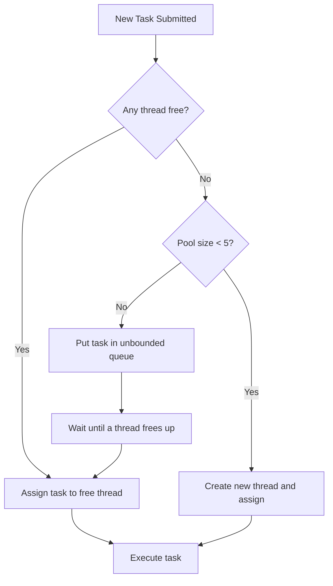
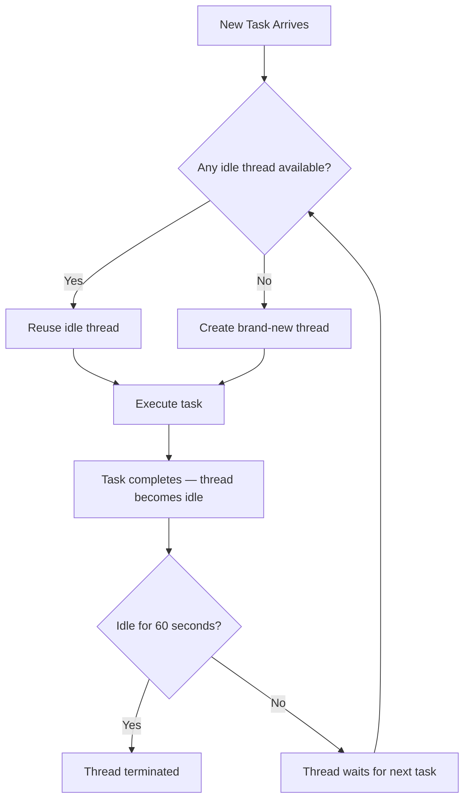
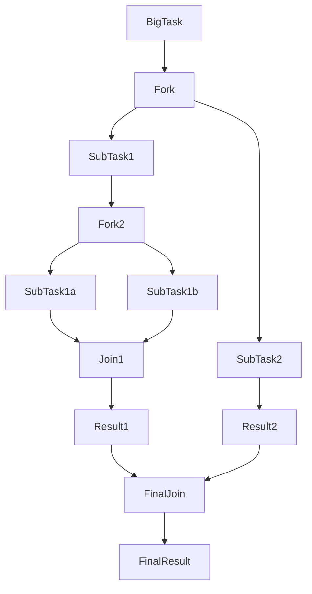
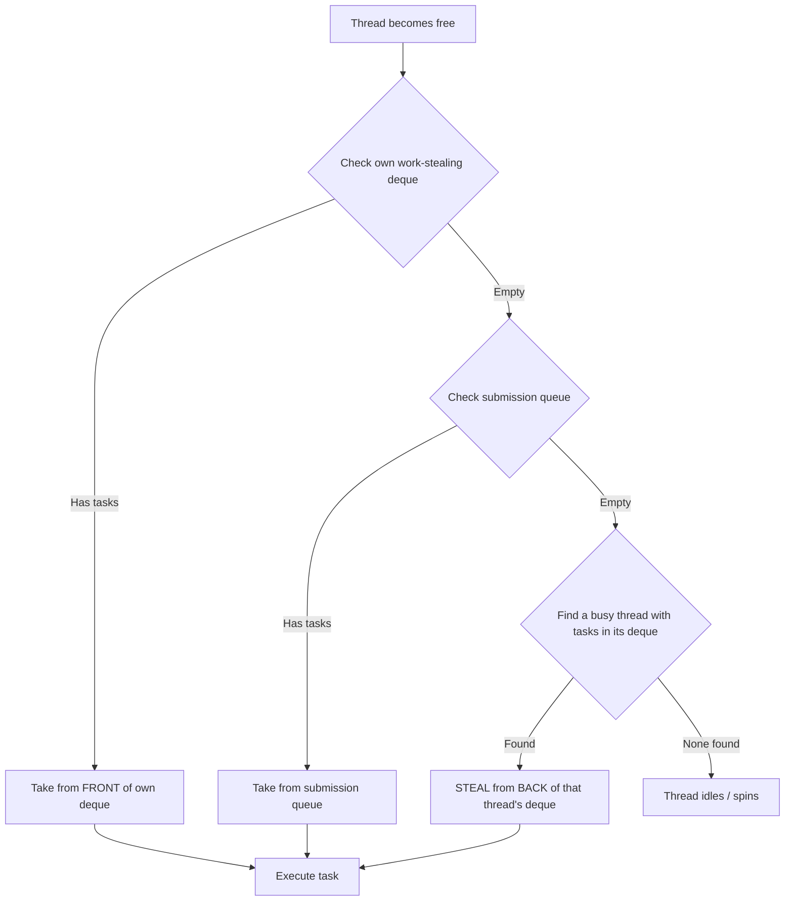
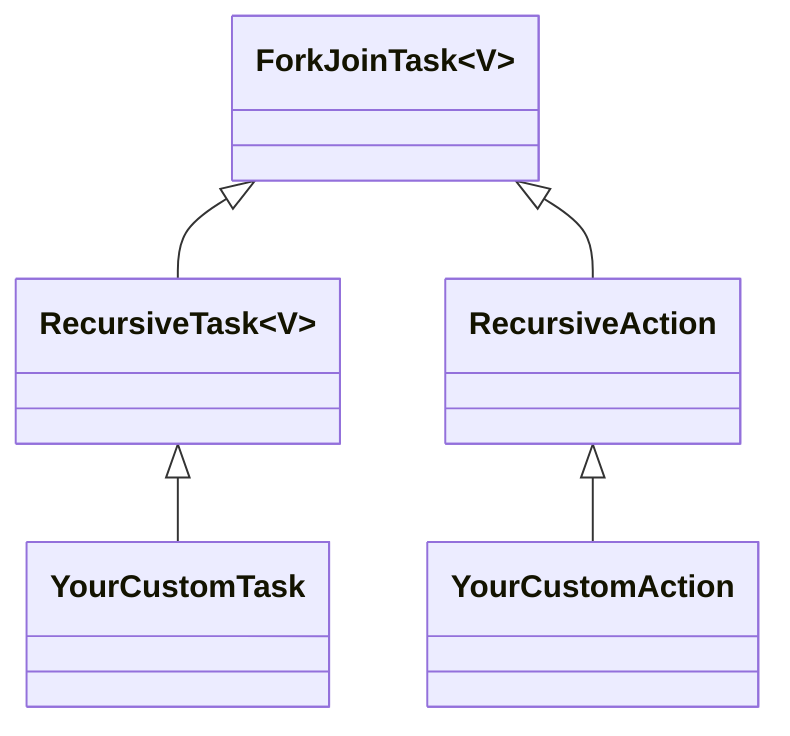
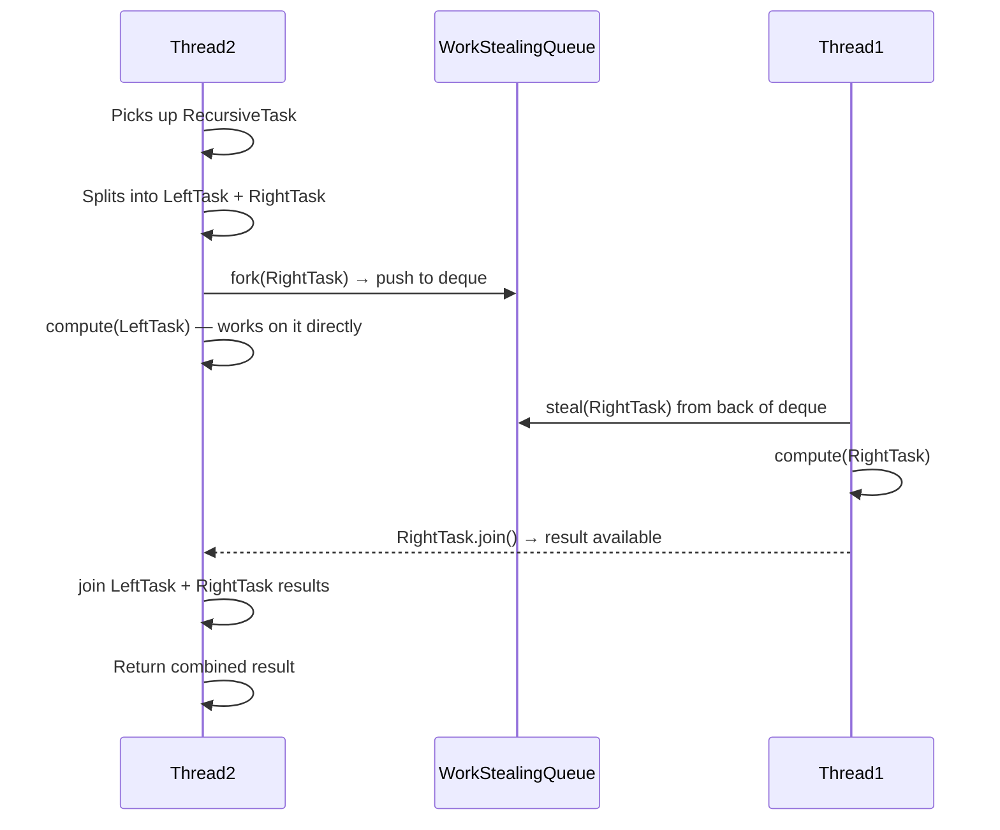
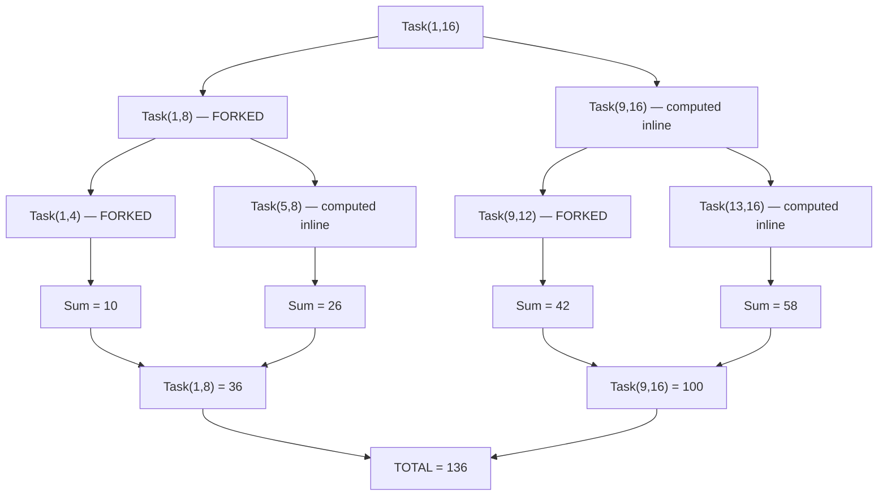
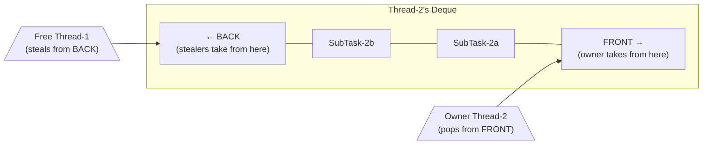

# 📌 Java Multi-Threading: Executors Utility Class & Fork-Join Pool

> A comprehensive study guide covering the `Executors` factory class, all standard thread pool types, the Fork-Join framework, Work-Stealing pools, and recursive task decomposition.

---

## Table of Contents

1. [Background: Custom Thread Pool Executor](#1-background-custom-thread-pool-executor)
2. [The `Executors` Utility Class](#2-the-executors-utility-class)
3. [Fixed Thread Pool Executor](#3-fixed-thread-pool-executor)
4. [Cached Thread Pool Executor](#4-cached-thread-pool-executor)
5. [Single Thread Executor](#5-single-thread-executor)
6. [Work-Stealing Pool Executor & Fork-Join Pool](#6-work-stealing-pool-executor--fork-join-pool)
7. [How Work-Stealing Works — Deep Dive](#7-how-work-stealing-works--deep-dive)
8. [RecursiveTask and RecursiveAction](#8-recursivetask-and-recursiveaction)
9. [Fork and Join — The Core Mechanism](#9-fork-and-join--the-core-mechanism)
10. [Complete Code Example: Parallel Sum](#10-complete-code-example-parallel-sum)
11. [Submission Queue vs Work-Stealing Queue](#11-submission-queue-vs-work-stealing-queue)
12. [Thread Count in Fork-Join Pool](#12-thread-count-in-fork-join-pool)
13. [Comparison Table of All Pool Types](#13-comparison-table-of-all-pool-types)
14. [Memory & JVM Behavior](#14-memory--jvm-behavior)
15. [Interview Notes](#15-interview-notes)
16. [Common Mistakes](#16-common-mistakes)
17. [Best Practices](#17-best-practices)
18. [Practice Questions](#18-practice-questions)
19. [Summary](#19-summary)

---

## 1. Background: Custom Thread Pool Executor

### Overview

Before the `Executors` utility class, developers created thread pools manually using `ThreadPoolExecutor` — often called a **custom thread pool executor**. This gave full control over every configuration parameter.

### Syntax

```java
import java.util.concurrent.*;

ThreadPoolExecutor executor = new ThreadPoolExecutor(
    corePoolSize,         // minimum number of threads always alive
    maximumPoolSize,      // maximum threads allowed
    keepAliveTime,        // idle time before extra threads die
    TimeUnit.SECONDS,     // unit of keepAliveTime
    new LinkedBlockingQueue<>(queueCapacity) // work queue
);
```

### Why It Existed

When you need precise control — e.g. a specific rejection policy, a specific queue type, or different min/max pool sizes — the custom `ThreadPoolExecutor` is the right tool. However, for common use cases, this is verbose. The `Executors` class provides **factory methods** that cover the most frequent patterns with a single method call.

---

## 2. The `Executors` Utility Class

### Overview

`Executors` is a **utility class** located in the `java.util.concurrent` package. It provides a collection of **static factory methods** that create pre-configured `ThreadPoolExecutor` (or `ForkJoinPool`) instances for common use cases.

### Package

```java
import java.util.concurrent.Executors;
import java.util.concurrent.ExecutorService;
```

### Why This Class Exists

| Problem | Solution |
|---|---|
| Creating a `ThreadPoolExecutor` manually is verbose and error-prone | `Executors` provides one-liner factory methods |
| Common configurations (fixed, cached, single) are reinvented repeatedly | Factory methods encode best-practice configurations |
| Hard to choose the right queue type and keep-alive settings | Factory methods bundle correct defaults |

### Available Factory Methods (covered in this guide)

| Method | Returns |
|---|---|
| `Executors.newFixedThreadPool(n)` | Fixed-size `ThreadPoolExecutor` |
| `Executors.newCachedThreadPool()` | Dynamically-scaling `ThreadPoolExecutor` |
| `Executors.newSingleThreadExecutor()` | Single-thread `ThreadPoolExecutor` |
| `Executors.newWorkStealingPool()` | `ForkJoinPool` with work-stealing |
| `Executors.newWorkStealingPool(n)` | `ForkJoinPool` with explicit parallelism |

---

## 3. Fixed Thread Pool Executor

### Overview

Creates a thread pool with a **fixed, unchanging number of threads**. The minimum pool size and the maximum pool size are identical — whatever number you supply.

### Definition

A `ThreadPoolExecutor` where `corePoolSize == maximumPoolSize`, backed by an **unbounded** `LinkedBlockingQueue`.

### Syntax

```java
ExecutorService executor = Executors.newFixedThreadPool(5);
```

### Configuration Properties

| Property | Value |
|---|---|
| Core Pool Size (minimum) | `n` (the number you provide) |
| Maximum Pool Size | `n` (same as core — fixed!) |
| Queue Type | `LinkedBlockingQueue` (unbounded) |
| Queue Capacity | Unbounded (grows as needed, limited only by memory) |
| Thread Keep-Alive When Idle | Threads stay alive forever — never terminated even if idle |

### Code Example

```java
import java.util.concurrent.ExecutorService;
import java.util.concurrent.Executors;

public class FixedThreadPoolDemo {
    public static void main(String[] args) {
        // Create a fixed pool of 5 threads
        ExecutorService executor = Executors.newFixedThreadPool(5);

        for (int i = 1; i <= 10; i++) {
            final int taskId = i;
            executor.submit(() -> {
                System.out.println("Task " + taskId + " running on: "
                        + Thread.currentThread().getName());
                try {
                    Thread.sleep(1000); // simulate work
                } catch (InterruptedException e) {
                    Thread.currentThread().interrupt();
                }
            });
        }

        executor.shutdown();
    }
}
```

### Expected Output (approximate)

```
Task 1 running on: pool-1-thread-1
Task 2 running on: pool-1-thread-2
Task 3 running on: pool-1-thread-3
Task 4 running on: pool-1-thread-4
Task 5 running on: pool-1-thread-5
Task 6 running on: pool-1-thread-1   ← thread reused after Task 1 finishes
Task 7 running on: pool-1-thread-2
...
```

### Line-by-Line Explanation

| Line | Explanation |
|---|---|
| `Executors.newFixedThreadPool(5)` | Creates exactly 5 threads. Min = Max = 5. |
| `executor.submit(...)` | Submits a `Runnable` task. If all 5 threads are busy, task waits in the unbounded queue. |
| `executor.shutdown()` | Stops accepting new tasks; completes pending ones before terminating. |

### When to Use

- You know **exactly** how many concurrent tasks you need.
- You want a predictable, stable resource footprint.
- Example: a server handling exactly N parallel database connections.

### Disadvantage

> [!WARNING]
> If workload suddenly becomes heavier than anticipated, the fixed pool cannot expand beyond `n` threads. Tasks pile up in the unbounded queue. Under extreme load this can cause **memory exhaustion** because the queue grows without limit.

### Equivalent Custom Configuration

```java
// This is what newFixedThreadPool(5) does internally:
ThreadPoolExecutor equivalent = new ThreadPoolExecutor(
    5,                           // corePoolSize
    5,                           // maximumPoolSize (same = fixed)
    0L,                          // keepAliveTime (irrelevant, core threads never die)
    TimeUnit.MILLISECONDS,
    new LinkedBlockingQueue<>()  // unbounded queue
);
```

### Flowchart



---

## 4. Cached Thread Pool Executor

### Overview

Creates a thread pool that **dynamically creates new threads on demand** and terminates idle threads after 60 seconds. There is no fixed upper limit on threads (up to `Integer.MAX_VALUE`).

### Definition

A `ThreadPoolExecutor` with `corePoolSize = 0`, `maximumPoolSize = Integer.MAX_VALUE`, a `SynchronousQueue` (which has zero capacity — tasks are handed off directly to a thread or a new thread is created), and a keep-alive time of **60 seconds**.

### Syntax

```java
ExecutorService executor = Executors.newCachedThreadPool();
```

### Configuration Properties

| Property | Value |
|---|---|
| Core Pool Size (minimum) | `0` — no threads kept permanently |
| Maximum Pool Size | `Integer.MAX_VALUE` (~2.1 billion) |
| Queue Type | `SynchronousQueue` (capacity = 0; a direct hand-off queue) |
| Queue Capacity | **Zero** — tasks are never queued; a thread is always created |
| Thread Keep-Alive When Idle | **60 seconds** — idle threads are terminated after 60 s |

> [!NOTE]
> The queue size being zero does **not** mean tasks are dropped. It means as soon as a task arrives, if no thread is free, a brand-new thread is created immediately to handle it. The queue only exists as a handoff mechanism.

### Code Example

```java
import java.util.concurrent.ExecutorService;
import java.util.concurrent.Executors;

public class CachedThreadPoolDemo {
    public static void main(String[] args) throws InterruptedException {
        ExecutorService executor = Executors.newCachedThreadPool();

        // Simulate a burst of 10 short-lived tasks
        for (int i = 1; i <= 10; i++) {
            final int taskId = i;
            executor.submit(() -> {
                System.out.println("Task " + taskId + " on: "
                        + Thread.currentThread().getName());
                try {
                    Thread.sleep(200); // short task
                } catch (InterruptedException e) {
                    Thread.currentThread().interrupt();
                }
            });
        }

        // After tasks complete, threads sit idle for 60 seconds then die
        executor.shutdown();
    }
}
```

### Expected Output

```
Task 1 on: pool-1-thread-1
Task 2 on: pool-1-thread-2
Task 3 on: pool-1-thread-3
...
Task 10 on: pool-1-thread-10
```

All 10 threads are created simultaneously because all 10 tasks arrive before any thread completes.

### When to Use

- **Burst of short-lived tasks** — many tasks arrive suddenly but each completes quickly.
- Workloads that are spiky and unpredictable in size.

### Disadvantage

> [!WARNING]
> If many **long-running** tasks are submitted rapidly, the pool creates a new thread for **each one** (since threads do not become free quickly). With thousands of tasks this can create thousands of threads, causing excessive memory usage and potentially an `OutOfMemoryError`.
>
> **Rule:** Only use `newCachedThreadPool()` for short-lived tasks.

### Equivalent Custom Configuration

```java
ThreadPoolExecutor equivalent = new ThreadPoolExecutor(
    0,                         // corePoolSize: no permanent threads
    Integer.MAX_VALUE,         // maximumPoolSize: unlimited
    60L,                       // keepAliveTime: 60 seconds
    TimeUnit.SECONDS,
    new SynchronousQueue<>()   // zero-capacity direct handoff
);
```

### Flowchart



---

## 5. Single Thread Executor

### Overview

Creates a thread pool with **exactly one worker thread**. All submitted tasks are executed **sequentially**, one at a time, in submission order.

### Definition

A `ThreadPoolExecutor` with both `corePoolSize` and `maximumPoolSize` set to `1`, backed by an unbounded `LinkedBlockingQueue`.

### Syntax

```java
ExecutorService executor = Executors.newSingleThreadExecutor();
```

### Configuration Properties

| Property | Value |
|---|---|
| Core Pool Size (minimum) | `1` |
| Maximum Pool Size | `1` |
| Queue Type | `LinkedBlockingQueue` (unbounded) |
| Queue Capacity | Unbounded |
| Thread Keep-Alive When Idle | Thread stays alive forever |

### Code Example

```java
import java.util.concurrent.ExecutorService;
import java.util.concurrent.Executors;

public class SingleThreadExecutorDemo {
    public static void main(String[] args) {
        ExecutorService executor = Executors.newSingleThreadExecutor();

        for (int i = 1; i <= 5; i++) {
            final int taskId = i;
            executor.submit(() -> {
                System.out.println("Task " + taskId + " on: "
                        + Thread.currentThread().getName());
                try {
                    Thread.sleep(500);
                } catch (InterruptedException e) {
                    Thread.currentThread().interrupt();
                }
            });
        }

        executor.shutdown();
    }
}
```

### Expected Output

```
Task 1 on: pool-1-thread-1
Task 2 on: pool-1-thread-1
Task 3 on: pool-1-thread-1
Task 4 on: pool-1-thread-1
Task 5 on: pool-1-thread-1
```

Always the **same thread**, always **in order**.

### When to Use

- Tasks must be processed **strictly sequentially** (ordering matters).
- You need to serialize access to a shared resource from multiple callers.
- Example: writing log entries in order, processing a queue of database writes sequentially.

### Disadvantage

> [!CAUTION]
> **No concurrency at all.** Only one task runs at a time. If tasks are slow, the queue grows indefinitely. Not suitable for high-throughput scenarios.

---

## 6. Work-Stealing Pool Executor & Fork-Join Pool

### Overview

`Executors.newWorkStealingPool()` creates a **`ForkJoinPool`** internally — a specialized thread pool designed for **divide-and-conquer parallelism**. It uses a technique called **work stealing** to maximize CPU utilization.

### The Core Idea: Fork-Join

The Fork-Join framework operates on a simple principle:

1. **Fork** — Split a large task into smaller subtasks.
2. **Execute** — Each subtask runs (possibly splitting further — recursively).
3. **Join** — Wait for all subtasks to finish, then combine their results.



### Why Fork-Join Exists

In a standard thread pool, a single large task is handled by **one thread** from start to finish. If that task could logically be split into independent sub-computations, the other idle threads sit unused. The Fork-Join framework solves this by enabling **task decomposition** and distributing the sub-pieces across all available threads.

### Real-World Analogy

Imagine computing the sum of 1 billion numbers:
- **Old way:** One accountant adds all numbers one by one.
- **Fork-Join way:** Divide the list into chunks. Give each chunk to a different accountant. Each accountant sums their chunk. Collect all partial sums and add them together.

More accountants working in parallel → faster result.

---

## 7. How Work-Stealing Works — Deep Dive

### The Problem With Standard Thread Pools

In a standard `ThreadPoolExecutor`:

```
Thread Pool:  [Thread-1]  [Thread-2]
                  ↑            ↑
              Shared Queue: [Task3] [Task4] [Task5]
```

- All threads share a **single queue**.
- Threads pick from the **front** of the queue.
- If a thread is busy, it cannot help another busy thread.
- There is **no mechanism** for one thread to take over part of another thread's work.

### The Work-Stealing Innovation

Fork-Join pools introduce **per-thread work-stealing deques (double-ended queues)**:

```
[Thread-1] ←→ [Its own Deque: SubTask-A | SubTask-B]
[Thread-2] ←→ [Its own Deque: SubTask-C | SubTask-D]
                          ↑
           Global Submission Queue: [Task3] [Task4]
```

Each thread has its **own private deque**. This is the **work-stealing queue**.

### Detailed Step-by-Step Flow

Let's walk through a complete scenario:

#### Initial State

```
Thread Pool: Thread-1 (free), Thread-2 (free)
Submission Queue: []
Thread-1's Work-Stealing Deque: []
Thread-2's Work-Stealing Deque: []
```

#### Step 1 — Task-1 arrives (a simple task)

```
Task-1 submitted → Thread-1 picks it up → Thread-1: BUSY with Task-1
```

#### Step 2 — Task-2 arrives (a RecursiveTask — can be split)

```
Task-2 submitted → Thread-2 picks it up → Thread-2: BUSY with Task-2
```

#### Step 3 — Task-3 arrives (both threads busy)

```
Task-3 submitted → Both threads busy → Task-3 goes into Submission Queue
Submission Queue: [Task-3]
```

#### Step 4 — Thread-2 forks Task-2 into SubTask-2a and SubTask-2b

```
Thread-2 splits Task-2:
  Thread-2 begins working on SubTask-2a (from the FRONT of its deque)
  SubTask-2b pushed to Thread-2's work-stealing deque

Thread-2's Deque: [SubTask-2b]   ← can be stolen from the BACK
Thread-2: Working on SubTask-2a
```

#### Step 5 — Thread-1 completes Task-1, looks for work

**Priority order for a free thread:**

| Priority | Check | Action |
|---|---|---|
| 1st | Own work-stealing deque | Take from **front** |
| 2nd | Global submission queue | Take from **front** |
| 3rd | Other threads' deques | **Steal from the back** |

```
Thread-1 finishes Task-1.
→ Check own deque: empty
→ Check submission queue: Task-3 is there!
→ Thread-1 picks Task-3 from submission queue
Thread-1: BUSY with Task-3
```

#### Step 6 — Thread-1 completes Task-3, still SubTask-2b is pending

```
Thread-1 finishes Task-3.
→ Check own deque: empty
→ Check submission queue: empty
→ Check other threads' deques: Thread-2 has SubTask-2b in its deque!
→ Thread-1 STEALS SubTask-2b from the BACK of Thread-2's deque

Thread-2's Deque: []   (SubTask-2b stolen)
Thread-1: Now working on SubTask-2b
```

This is the **work-stealing** act. Thread-1 steals work from Thread-2's queue to keep itself busy.

### Why Steal from the BACK?

> [!IMPORTANT]
> **The deque is double-ended for a reason:**
> - The **owning thread** consumes tasks from the **FRONT** (most recently forked, smallest granularity — better cache locality).
> - **Stealing threads** take from the **BACK** (oldest, largest tasks — reduces contention with the owning thread, and larger tasks give the stealer more work to do before needing to steal again).
>
> This design minimizes synchronization overhead.

### Work-Stealing Flow Diagram



---

## 8. RecursiveTask and RecursiveAction

### Overview

To use the Fork-Join framework, your task class must extend either `RecursiveTask<V>` or `RecursiveAction`. Both live in `java.util.concurrent`.

### The Difference

| | `RecursiveTask<V>` | `RecursiveAction` |
|---|---|---|
| Return value | Yes — generic type `V` | No — `void` |
| `compute()` signature | `protected V compute()` | `protected void compute()` |
| Use case | Task that produces a result (e.g. sum, count) | Task that performs side effects (e.g. sorting in place, file processing) |

### Class Hierarchy



### The `compute()` Method

Both classes require you to override the `compute()` method. This is where you:
1. Check whether the task is small enough to solve directly (the **base case**).
2. If not, **split** the task into subtasks, **fork** them, and **join** their results.

### Syntax — RecursiveTask

```java
class MyTask extends RecursiveTask<Integer> {
    @Override
    protected Integer compute() {
        if (/* base case: task is small enough */) {
            return directComputation();
        } else {
            MyTask leftTask = new MyTask(/* left half */);
            MyTask rightTask = new MyTask(/* right half */);
            leftTask.fork();  // schedule leftTask for async execution
            int rightResult = rightTask.compute(); // execute right inline
            int leftResult = leftTask.join(); // wait for leftTask result
            return leftResult + rightResult;
        }
    }
}
```

### Syntax — RecursiveAction

```java
class MyAction extends RecursiveAction {
    @Override
    protected void compute() {
        if (/* base case */) {
            performDirectWork();
        } else {
            MyAction leftAction = new MyAction(/* left half */);
            MyAction rightAction = new MyAction(/* right half */);
            invokeAll(leftAction, rightAction); // fork both and wait
        }
    }
}
```

---

## 9. Fork and Join — The Core Mechanism

### `fork()`

```java
leftTask.fork();
```

**What it does:**
- Schedules the task for **asynchronous execution** in the Fork-Join pool.
- The current thread does **not** block.
- The forked task is placed into the current thread's **work-stealing deque** (pushed to the front).
- Other free threads may steal it from the back of that deque.

**Analogy:** You hand off a sub-problem to a colleague and immediately start working on your own part without waiting.

### `join()`

```java
int result = leftTask.join();
```

**What it does:**
- Blocks the calling thread until the task completes.
- Returns the result (for `RecursiveTask`).
- While waiting, the calling thread can execute **other tasks** from its deque (it does not simply sit idle — this is a key performance feature called **helping**).

**Analogy:** You've finished your part. Now you wait for your colleague's result so you can combine them.

### `invoke()`

```java
int result = task.invoke();
```

Equivalent to `fork()` followed immediately by `join()`. Executes the task and returns the result. Used at the top level.

### `invokeAll(task1, task2)`

Forks both tasks and waits for both to complete. Convenient shorthand.

### Sequence Diagram



---

## 10. Complete Code Example: Parallel Sum

### Problem

Compute the sum of all integers from `start` to `end` (inclusive) using Fork-Join parallelism.

### Strategy

- **Base case:** If the range has 4 or fewer elements, sum them directly (no further splitting).
- **Recursive case:** Split the range in half, create two subtasks, fork one, compute the other, join and sum.

### Code

```java
import java.util.concurrent.ForkJoinPool;
import java.util.concurrent.RecursiveTask;

// Task class: extends RecursiveTask<Integer> because it returns an Integer
class ComputeSumTask extends RecursiveTask<Integer> {

    private final int start;
    private final int end;

    // Constructor: sets the range this task will sum
    public ComputeSumTask(int start, int end) {
        this.start = start;
        this.end = end;
    }

    @Override
    protected Integer compute() {
        // Base case: range is small enough to compute directly
        if (end - start <= 4) {
            int sum = 0;
            for (int i = start; i <= end; i++) {
                sum += i;
            }
            System.out.println(Thread.currentThread().getName()
                + " summing [" + start + ", " + end + "] = " + sum);
            return sum;
        }

        // Recursive case: split the range
        int mid = start + (end - start) / 2;

        ComputeSumTask leftTask = new ComputeSumTask(start, mid);
        ComputeSumTask rightTask = new ComputeSumTask(mid + 1, end);

        // Fork the left task → pushes it to this thread's work-stealing deque
        leftTask.fork();

        // Compute the right task on the current thread (inline)
        int rightResult = rightTask.compute();

        // Join: wait for left task to finish, get its result
        int leftResult = leftTask.join();

        return leftResult + rightResult;
    }
}

public class ForkJoinDemo {
    public static void main(String[] args) {
        // Method 1: Using ForkJoinPool.commonPool()
        ForkJoinPool pool = ForkJoinPool.commonPool();

        ComputeSumTask task = new ComputeSumTask(1, 16);

        int result = pool.invoke(task); // submit and wait for result

        System.out.println("Total Sum (1 to 16) = " + result);
        // Expected: 1+2+...+16 = 136

        // Method 2: Using newWorkStealingPool (equivalent)
        // ExecutorService wsPool = Executors.newWorkStealingPool();
        // Future<Integer> future = wsPool.submit(task);
        // int r = future.get();
    }
}
```

### Expected Output (thread names vary)

```
ForkJoinPool.commonPool-worker-1 summing [1, 4] = 10
ForkJoinPool.commonPool-worker-2 summing [5, 8] = 26
ForkJoinPool.commonPool-worker-3 summing [9, 12] = 42
ForkJoinPool.commonPool-worker-4 summing [13, 16] = 58
Total Sum (1 to 16) = 136
```

### Step-by-Step Execution

```
Task(1,16)
  → mid = 8
  → leftTask = Task(1,8)   → forked (goes to work-stealing deque)
  → rightTask = Task(9,16) → computed inline

Task(9,16)
  → mid = 12
  → leftTask = Task(9,12)   → forked
  → rightTask = Task(13,16) → computed inline

Task(13,16): end-start = 3 ≤ 4 → sum directly = 58

Task(9,12): end-start = 3 ≤ 4 → sum directly = 42
  → join returns 42
  → Task(9,16) returns 42 + 58 = 100

Meanwhile, Task(1,8) was stolen/executed:
Task(1,8)
  → mid = 4
  → leftTask = Task(1,4)  → forked
  → rightTask = Task(5,8) → computed inline

Task(5,8): end-start = 3 ≤ 4 → sum directly = 26
Task(1,4): end-start = 3 ≤ 4 → sum directly = 10
  → Task(1,8) returns 10 + 26 = 36

Final join:
  leftResult = 36   (from Task(1,8))
  rightResult = 100 (from Task(9,16))
  Total = 136 ✓
```

### Task Decomposition Tree



---

## 11. Submission Queue vs Work-Stealing Queue

### Two Types of Queues in Fork-Join Pool

| Property | Submission Queue | Work-Stealing Queue |
|---|---|---|
| **Number** | One — shared globally | One **per thread** |
| **Type** | Regular blocking queue | **Deque** (double-ended queue) |
| **Who adds to it** | External callers (`submit()`, `invoke()`) | The owning thread (`fork()`) |
| **Who reads from it** | Any free thread | Owner reads from **front**; others steal from **back** |
| **Can be stolen?** | No — tasks cannot be stolen from the submission queue | Yes — other threads steal from the **back** |

### When Does a Task Go to the Submission Queue?

When you call:
```java
pool.submit(task);
pool.invoke(task);
```
The task enters the **submission queue**. Any free thread picks it up.

### When Does a Task Go to the Work-Stealing Queue?

When you call:
```java
subtask.fork();
```
The subtask is pushed to the **front** of the **current thread's work-stealing deque**.

### Why a Deque and Not a Simple Queue?

A **deque** (double-ended queue) allows:
- The **owning thread** to push/pop from the **front** (LIFO for the owner — better cache locality, works on the most recently created/smallest task first).
- **Stealing threads** to pop from the **back** (FIFO for stealers — they get the oldest, largest tasks, which is more efficient to steal because larger tasks give stealers more work per steal).



---

## 12. Thread Count in Fork-Join Pool

### Default: Based on Available Processors

```java
// No argument — uses all available CPU cores
ExecutorService pool = Executors.newWorkStealingPool();
```

Internally calls:
```java
Runtime.getRuntime().availableProcessors()
```

| CPU Cores | Threads Created |
|---|---|
| 4 | 4 |
| 8 | 8 |
| 16 | 16 |

This is **parallelism level** — matching threads to cores avoids context-switching overhead.

### Explicit Parallelism

```java
// Specify exactly how many threads you want
ExecutorService pool = Executors.newWorkStealingPool(8);
```

Both min and max are set to the given value. The pool maintains this many threads continuously.

### Accessing the Common Pool

```java
// The JVM-wide shared Fork-Join pool (parallelism = available CPUs)
ForkJoinPool commonPool = ForkJoinPool.commonPool();
int result = commonPool.invoke(new ComputeSumTask(1, 100));
```

> [!TIP]
> `ForkJoinPool.commonPool()` is a shared pool used by parallel streams and other JDK frameworks. Be mindful that blocking tasks in it can affect the entire JVM.

---

## 13. Comparison Table of All Pool Types

| Feature | Fixed Thread Pool | Cached Thread Pool | Single Thread Executor | Work-Stealing Pool |
|---|---|---|---|---|
| **Min Threads** | `n` | 0 | 1 | parallelism level |
| **Max Threads** | `n` | `Integer.MAX_VALUE` | 1 | parallelism level |
| **Queue Type** | `LinkedBlockingQueue` (unbounded) | `SynchronousQueue` (capacity 0) | `LinkedBlockingQueue` (unbounded) | Submission Queue + per-thread deque |
| **Thread Lifespan When Idle** | Forever | 60 seconds then terminated | Forever | Varies |
| **Task Decomposition** | No | No | No | Yes (fork-join) |
| **Work Stealing** | No | No | No | Yes |
| **Best For** | Known fixed concurrency | Burst short tasks | Sequential processing | Divide-and-conquer / parallel computation |
| **Worst For** | Heavy variable workloads | Long-running tasks | Concurrent tasks | Tasks that cannot be subdivided |

---

## 14. Memory & JVM Behavior

### Stack Memory

Each thread has its own **call stack**. When `compute()` is called recursively (or new task objects call `compute()`), each invocation gets a new stack frame.

For deep recursion on large tasks (e.g. summing 10 million elements with base case 1), this can cause `StackOverflowError`. Always use a reasonably large base-case threshold.

### Heap Memory

- Task objects (`ComputeSumTask` instances) are allocated on the **heap**.
- Each fork creates a new object. For very fine-grained decomposition, GC pressure increases.

### Method Area (Metaspace)

Class definitions for `ComputeSumTask`, `ForkJoinPool`, `RecursiveTask`, etc. are loaded once into the Metaspace.

### Thread Memory

Each thread in the pool has:
- Its own **stack** (default ~512KB–1MB per thread, configurable).
- A reference to its own **work-stealing deque** (on the heap).

### Memory Diagram

```
JVM Memory
├── Heap
│   ├── Task objects (ComputeSumTask instances)
│   ├── ForkJoinPool object
│   └── Deque objects (one per thread, holding task references)
│
├── Stack (per thread)
│   ├── Thread-1 Stack: compute() frame → compute() frame → ...
│   ├── Thread-2 Stack: compute() frame → ...
│   └── Thread-N Stack: ...
│
└── Metaspace
    ├── ForkJoinPool.class
    ├── RecursiveTask.class
    └── ComputeSumTask.class
```

---

## 15. Interview Notes

> [!IMPORTANT]
> These are commonly discussed in Java concurrency interviews.

### Q1: What is the difference between `ExecutorService` and `ForkJoinPool`?

| `ExecutorService` (ThreadPoolExecutor) | `ForkJoinPool` |
|---|---|
| Tasks run independently | Tasks can be split into subtasks |
| Single shared queue | Submission queue + per-thread deques |
| No work stealing | Work stealing between threads |
| Good for I/O-bound tasks | Good for CPU-bound parallel tasks |

### Q2: What is the purpose of the `fork()` method?

`fork()` submits a subtask for asynchronous parallel execution by placing it into the current thread's work-stealing deque. It does **not** block. Other free threads may steal and execute it.

### Q3: What does `join()` do internally?

`join()` waits for the task to complete. If the calling thread is a Fork-Join thread, it may **help** execute other tasks while waiting (cooperative scheduling), rather than blocking.

### Q4: What is work stealing and why is it efficient?

Work stealing allows idle threads to take tasks from the **back** of busy threads' deques. This maximizes CPU utilization without a central bottleneck (no single shared queue lock). The use of a deque minimizes contention because the owner works from the front and stealers take from the back.

### Q5: Why does `newCachedThreadPool()` use a `SynchronousQueue`?

A `SynchronousQueue` has zero capacity. A task can only be inserted if a thread is immediately ready to take it. This forces the pool to create a new thread if none is available — which is the desired behavior for the cached pool.

### Q6: When should you NOT use `newCachedThreadPool()`?

When tasks are long-running. If 1000 long tasks are submitted, 1000 threads are created simultaneously, leading to excessive memory consumption and CPU context-switching.

### Q7: What is `ForkJoinPool.commonPool()`?

A JVM-wide singleton `ForkJoinPool` shared across the application. Java's parallel streams use it internally. Tasks submitted to it should be short and non-blocking to avoid starving other users of the pool.

### Q8: What is the difference between `RecursiveTask` and `RecursiveAction`?

`RecursiveTask<V>` returns a value (`compute()` returns `V`). `RecursiveAction` is void (`compute()` returns nothing). Use `RecursiveTask` when you need a result, `RecursiveAction` for side-effect-only operations.

### Q9: Why does the work-stealing deque use the front for the owner and back for stealers?

- **Owner takes from front** (LIFO): More recently forked tasks are at the front. They are smaller, faster to process, and still hot in CPU cache.
- **Stealers take from back** (FIFO): Older tasks are at the back. They tend to be larger (less subdivided), giving the stealer more work per steal and reducing how frequently stealing needs to happen.

### Q10: What is the priority order for a thread looking for work in a Fork-Join pool?

1. Check its own work-stealing deque (take from **front**).
2. Check the global submission queue.
3. Steal from another thread's deque (take from **back**).

---

## 16. Common Mistakes

### Mistake 1: Using `newCachedThreadPool()` for long-running tasks

```java
// ❌ WRONG: submitting slow tasks to cached pool
ExecutorService ex = Executors.newCachedThreadPool();
for (int i = 0; i < 10000; i++) {
    ex.submit(() -> {
        Thread.sleep(60000); // 1 minute task!
    });
}
// Creates 10,000 threads → OutOfMemoryError
```

```java
// ✅ CORRECT: use fixed pool for known long-running tasks
ExecutorService ex = Executors.newFixedThreadPool(
    Runtime.getRuntime().availableProcessors()
);
```

### Mistake 2: Calling `compute()` recursively instead of using `fork()`

```java
// ❌ WRONG: directly calling compute() is just normal recursion — no parallelism
protected Integer compute() {
    leftTask.compute(); // sequential, not parallel
    rightTask.compute(); // sequential, not parallel
}
```

```java
// ✅ CORRECT: fork one, compute the other inline
protected Integer compute() {
    leftTask.fork();              // async — another thread may pick this up
    int right = rightTask.compute(); // do this work on the current thread
    int left = leftTask.join();   // wait for leftTask
    return left + right;
}
```

### Mistake 3: Forgetting to call `join()`

```java
// ❌ WRONG: fork but never join — result is lost
leftTask.fork();
return rightTask.compute(); // leftTask result ignored!
```

```java
// ✅ CORRECT: always join after fork
leftTask.fork();
int right = rightTask.compute();
int left = leftTask.join(); // collect leftTask's result
return left + right;
```

### Mistake 4: Base case too small

```java
// ❌ WRONG: splitting down to 1 element each
if (end - start <= 1) { return end; }
```

Splitting to 1-element tasks creates enormous numbers of task objects and deque operations. Choose a threshold (e.g. 100–1000 elements) that balances parallelism with overhead.

### Mistake 5: Blocking operations inside Fork-Join tasks

```java
// ❌ WRONG: blocking I/O inside a RecursiveTask
protected Integer compute() {
    String data = readFromDatabase(); // blocks the thread!
    // ...
}
```

Fork-Join threads are designed for **CPU-bound** work. Blocking operations stall a precious pool thread and can cause all parallelism to seize up. For I/O-bound work, use a standard `ThreadPoolExecutor`.

### Mistake 6: Submitting to `newFixedThreadPool()` and expecting it to grow

```java
ExecutorService ex = Executors.newFixedThreadPool(4);
// Submitting 1000 tasks — only 4 run at a time.
// The other 996 wait in the unbounded queue. That is by design.
// If you expected auto-scaling, use newCachedThreadPool() instead (with care).
```

---

## 17. Best Practices

1. **Choose the right pool for the job:**
   - Known, fixed parallelism → `newFixedThreadPool(n)`
   - Burst of short tasks → `newCachedThreadPool()`
   - Sequential task processing → `newSingleThreadExecutor()`
   - Divide-and-conquer CPU computation → `newWorkStealingPool()` / `ForkJoinPool`

2. **Set the base case threshold carefully.** Too small → too many task objects and overhead. Too large → insufficient parallelism. A common heuristic is to split until each chunk takes ~1ms to execute.

3. **Always shut down executors** to avoid resource leaks:
   ```java
   executor.shutdown();
   executor.awaitTermination(60, TimeUnit.SECONDS);
   ```

4. **Do not block inside Fork-Join tasks.** Fork-Join excels at CPU-bound, non-blocking computation. For I/O-bound work, use a standard thread pool with a larger thread count.

5. **Use `ForkJoinPool.commonPool()` cautiously.** If your tasks block, you starve every other user of the common pool (including Java parallel streams).

6. **Prefer `invokeAll()` for multiple independent subtasks** to simplify code:
   ```java
   invokeAll(leftTask, rightTask);
   int left = leftTask.join();
   int right = rightTask.join();
   ```

7. **Do not share mutable state between fork-join tasks** without synchronization. The whole point of task decomposition is independent sub-problems — if tasks share data, you reintroduce race conditions.

---

## 18. Practice Questions

### Easy

1. What class provides factory methods for creating thread pools in Java?
2. What is the difference between `corePoolSize` and `maximumPoolSize` in a `newFixedThreadPool`?
3. How long does an idle thread survive in a cached thread pool?
4. Write one line of code to create a fixed thread pool of 8 threads.
5. What package contains `Executors`, `ForkJoinPool`, and `RecursiveTask`?

### Medium

6. You have a server that handles exactly 10 simultaneous database queries. Which `Executors` factory method would you use and why?
7. Explain why `newCachedThreadPool()` should not be used for long-running tasks.
8. Describe the three-priority order in which a Fork-Join thread looks for work.
9. What is the difference between the submission queue and the work-stealing queue in a Fork-Join pool?
10. Rewrite the `ComputeSumTask` example to work with an array of `long` values instead of a range.

### Hard

11. Implement a parallel merge-sort using `RecursiveAction` (no return value — sort the array in place).
12. A `ForkJoinPool` with 4 threads is processing tasks. Thread-1, Thread-2, Thread-3, Thread-4 all pick tasks simultaneously. Thread-1's task forks into 6 subtasks. Trace exactly how the work-stealing queues change over time.
13. Explain why using `fork()` on **both** subtasks (instead of fork-one, compute-one) is less efficient. What is lost?
14. How does `join()` avoid simply blocking the calling thread? Describe the "helping" mechanism.
15. Compare the memory overhead of `newFixedThreadPool(100)` vs `newWorkStealingPool()` on a 4-core machine when processing 1000 tasks.

---

## 19. Summary

```mermaid
mindmap
  root((Java Thread Pools))
    Executors Utility Class
      java.util.concurrent
      Static factory methods
      Handy alternatives to manual ThreadPoolExecutor
    Fixed Thread Pool
      Min == Max == n
      Unbounded LinkedBlockingQueue
      Threads never die when idle
      Use when concurrency level is known
    Cached Thread Pool
      Min = 0, Max = Integer.MAX_VALUE
      SynchronousQueue - zero capacity
      Threads die after 60s idle
      Use for burst of short-lived tasks only
    Single Thread Executor
      Exactly 1 thread
      Unbounded LinkedBlockingQueue
      Sequential processing guaranteed
    Work-Stealing Pool / ForkJoinPool
      Internally creates ForkJoinPool
      Per-thread work-stealing deques
      Global submission queue
      Work stealing from back of deques
      Fork-Join task decomposition
      RecursiveTask - returns value
      RecursiveAction - void
      fork() - async schedule
      join() - wait for result
      Threads = available CPUs by default
```

### Key Bullet Points

- `Executors` is a utility class in `java.util.concurrent` with static factory methods for common thread pool configurations.
- **Fixed thread pool:** min = max = n; unbounded queue; threads never die; limited by fixed concurrency.
- **Cached thread pool:** min = 0, max = unlimited; zero-capacity `SynchronousQueue`; threads die after 60s idle; for short-lived bursts only.
- **Single thread executor:** 1 thread; sequential; no concurrency.
- **Work-stealing pool** internally creates a `ForkJoinPool`. Its key innovation is per-thread deques and work stealing.
- **Fork-Join** = divide a large task using `fork()`, execute parts in parallel, wait with `join()`, combine results.
- A free thread checks: (1) own deque → (2) submission queue → (3) steal from another thread's deque.
- Owner takes from the **front** of its deque; stealers take from the **back** — minimizing contention.
- Extend `RecursiveTask<V>` when you need a return value; extend `RecursiveAction` for void tasks.
- `fork()` is async (non-blocking); `join()` waits for completion (can help execute other tasks while waiting).
- `ForkJoinPool.commonPool()` is the JVM-wide shared pool; avoid blocking tasks in it.
- Default thread count in `newWorkStealingPool()` = `Runtime.getRuntime().availableProcessors()`.
- Fork-Join is ideal for CPU-bound, non-blocking, recursively decomposable problems.

---

*End of Chapter — Java Executors Utility Class & Fork-Join Pool*
