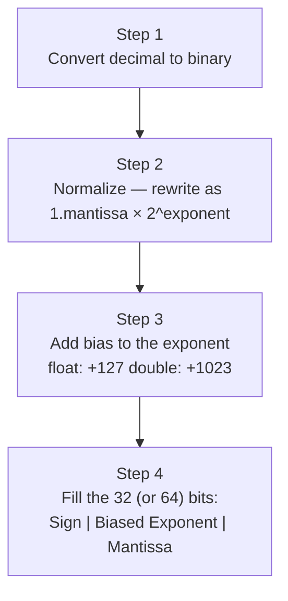
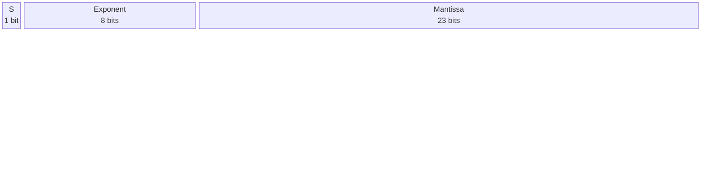
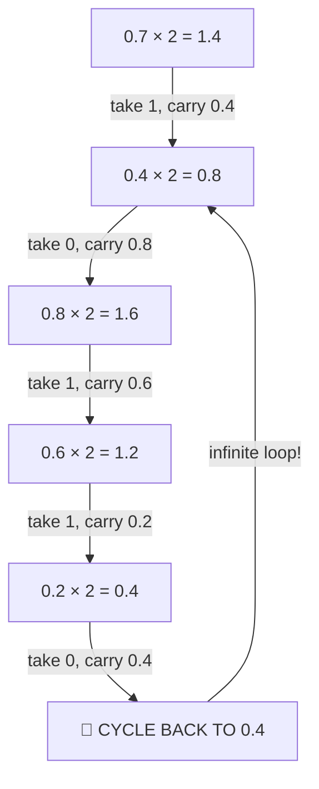
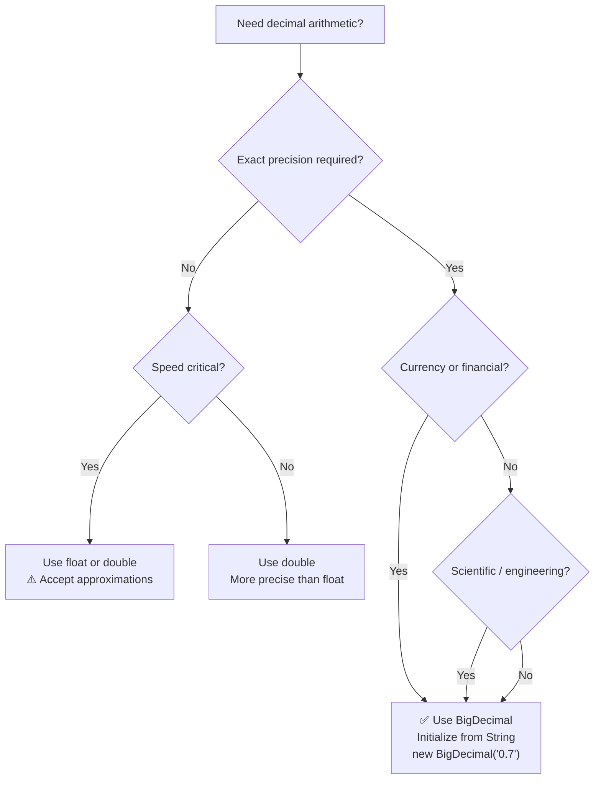

# 📚 Java Float & Double — IEEE 754 Internal Memory Representation

> Part of the *Concept and Coding* Java lecture series.
> These notes are fully self-contained — no prior lecture viewing is required.
> This chapter is a deep-dive continuation of the Variables series, focusing on **how** `float` and `double` values are physically stored in memory and **why** they sometimes produce unexpected results.

---

## Table of Contents

1. [The Problem — Why 0.7f ≠ 0.7](#1-the-problem--why-07f--07)
2. [IEEE 754 Standard — Overview](#2-ieee-754-standard--overview)
3. [Float Memory Layout (32-bit)](#3-float-memory-layout-32-bit)
4. [Double Memory Layout (64-bit)](#4-double-memory-layout-64-bit)
5. [The Four-Step Encoding Process](#5-the-four-step-encoding-process)
6. [Worked Example 1 — Storing 4.125f (Clean Case)](#6-worked-example-1--storing-4125f-clean-case)
7. [Worked Example 2 — Storing 0.7f (Imprecise Case)](#7-worked-example-2--storing-07f-imprecise-case)
8. [The Retrieval Formula — Decoding from Memory](#8-the-retrieval-formula--decoding-from-memory)
9. [Decoding Worked Example 1 — Retrieving 4.125f](#9-decoding-worked-example-1--retrieving-4125f)
10. [Decoding Worked Example 2 — Retrieving 0.7f](#10-decoding-worked-example-2--retrieving-07f)
11. [Why the Bias Exists](#11-why-the-bias-exists)
12. [Repeating Binary Fractions — Root Cause of Imprecision](#12-repeating-binary-fractions--root-cause-of-imprecision)
13. [Float vs Double — Precision Comparison](#13-float-vs-double--precision-comparison)
14. [BigDecimal — The Correct Solution](#14-bigdecimal--the-correct-solution)
15. [Quick-Reference Tables](#15-quick-reference-tables)
16. [Mermaid Diagrams](#16-mermaid-diagrams)
17. [Common Mistakes](#17-common-mistakes)
18. [Best Practices](#18-best-practices)
19. [Interview Notes](#19-interview-notes)
20. [Practice Questions](#20-practice-questions)
21. [Summary Cheat Sheet](#21-summary-cheat-sheet)

---

# 1. The Problem — Why 0.7f ≠ 0.7

## The Surprising Output

```java
public class FloatProblem {
    public static void main(String[] args) {
        float f = 0.7f;
        System.out.println(f);
    }
}
```

**Expected output:**
```
0.7
```

**Actual output:**
```
0.6999998
```

This surprises many developers, including experienced ones. The value `0.7` was stored, but something slightly different came back out.

## Why Does This Happen?

The answer lies in **how Java (and every language using IEEE 754) stores decimal numbers in memory**. In short:

- Computers store numbers in **binary (base-2)**, not decimal (base-10).
- Many decimal fractions that terminate neatly in base-10 (like `0.7`) **cannot be represented exactly in binary** — they become infinitely repeating binary fractions.
- Because memory is finite, the repeating binary fraction is **truncated** at 23 bits (for `float`) or 52 bits (for `double`).
- When that truncated value is read back and converted to decimal, it is no longer exactly `0.7`.

> [!IMPORTANT]
> This is **not a Java bug**. It is a fundamental property of binary floating-point arithmetic, defined by the **IEEE 754** standard, which is used by virtually every modern programming language and processor.

---

# 2. IEEE 754 Standard — Overview

## What is IEEE 754?

**IEEE 754** is the international standard that specifies how floating-point numbers are stored in binary computer memory. It was established by the Institute of Electrical and Electronics Engineers (IEEE) and is used by Java, C, C++, Python, JavaScript, and almost every other language.

## Why a Standard?

Before IEEE 754, different hardware vendors stored floating-point numbers in incompatible formats. A program compiled for one computer might produce different floating-point results on another. IEEE 754 (adopted in 1985) unified this into a single format.

## Two Formats Relevant to Java

| Java Type | IEEE 754 Format | Total Bits |
|-----------|-----------------|------------|
| `float` | Single Precision | 32 bits |
| `double` | Double Precision | 64 bits |

## The Core Idea

Any floating-point number is stored as three components:

1. **Sign** — is the number positive or negative?
2. **Exponent** — how large or small is the number (the "scale")?
3. **Mantissa (Significand)** — what are the actual significant digits?

This is analogous to **scientific notation** in base-10:

```
−3.14159 × 10^6
  ↑         ↑
sign      exponent
  mantissa = 3.14159
```

IEEE 754 does the same thing but in **base-2** (binary).

---

# 3. Float Memory Layout (32-bit)

## Bit Allocation

A `float` occupies exactly **32 bits**, divided as follows:

```
 31  30        23  22                    0
┌───┬──────────────┬───────────────────────┐
│ S │   Exponent   │       Mantissa        │
│ 1 │    8 bits    │       23 bits         │
└───┴──────────────┴───────────────────────┘
```

| Field | Bits | Position | Purpose |
|-------|------|----------|---------|
| Sign (S) | 1 | Bit 31 | `0` = positive, `1` = negative |
| Exponent (E) | 8 | Bits 30–23 | Stores the power of 2 (with bias added) |
| Mantissa (M) | 23 | Bits 22–0 | Stores the significant binary digits after the leading `1.` |

## Key Constants for float

| Constant | Value | Explanation |
|----------|-------|-------------|
| Bias | **127** | Added to the real exponent before storage (= 2^7 − 1) |
| Mantissa bits | **23** | Determines precision (~7 significant decimal digits) |

---

# 4. Double Memory Layout (64-bit)

## Bit Allocation

A `double` occupies exactly **64 bits**, divided as follows:

```
 63  62              52  51                               0
┌───┬──────────────────┬──────────────────────────────────┐
│ S │    Exponent      │           Mantissa               │
│ 1 │    11 bits       │           52 bits                │
└───┴──────────────────┴──────────────────────────────────┘
```

| Field | Bits | Position | Purpose |
|-------|------|----------|---------|
| Sign (S) | 1 | Bit 63 | `0` = positive, `1` = negative |
| Exponent (E) | 11 | Bits 62–52 | Stores the power of 2 (with bias added) |
| Mantissa (M) | 52 | Bits 51–0 | Stores the significant binary digits after the leading `1.` |

## Key Constants for double

| Constant | Value | Explanation |
|----------|-------|-------------|
| Bias | **1023** | Added to the real exponent before storage (= 2^10 − 1) |
| Mantissa bits | **52** | Determines precision (~15–16 significant decimal digits) |

---

# 5. The Four-Step Encoding Process

To store any decimal number as an IEEE 754 float, follow these four steps:



Let's walk through both steps with two carefully chosen examples.

---

# 6. Worked Example 1 — Storing 4.125f (Clean Case)

We'll store `4.125` as a 32-bit IEEE 754 float. This is a **clean** example because it converts to a terminating binary fraction.

## Step 1: Convert to Binary

We need to convert both the integer part (`4`) and the fractional part (`0.125`) to binary separately.

### Integer Part: 4

Divide repeatedly by 2 and read remainders **bottom to top**:

```
4 ÷ 2 = 2  remainder 0
2 ÷ 2 = 1  remainder 0
1 ÷ 2 = 0  remainder 1
              ↑ read upward
Result: 100
```

So `4` in binary = **`100`**

### Fractional Part: 0.125

Multiply repeatedly by 2 and take the integer part **top to bottom**:

```
0.125 × 2 = 0.25   → integer part: 0
0.25  × 2 = 0.50   → integer part: 0
0.50  × 2 = 1.00   → integer part: 1  ← stop (fraction is now 0)
              ↓ read downward
Result: 001
```

So `0.125` in binary = **`0.001`**

### Combined

```
4.125 in binary = 100.001
```

---

## Step 2: Normalize

Rewrite the binary number in the form `1.something × 2^n` by moving the binary point.

```
100.001
```

Move the binary point **2 places to the left** to get a leading `1.`:

```
100.001  =  1.00001 × 2^2
```

- **Mantissa** (the part after `1.`) = `00001`
- **Exponent** = `2` (we moved 2 places left, so power is positive 2)

> [!NOTE]
> The leading `1` is **implicit** — it is NOT stored in memory. IEEE 754 always assumes a leading `1.` in the normalized form, so storing it would waste a bit. This "free" extra bit gives one extra digit of precision.

---

## Step 3: Add Bias to the Exponent

For `float`, the bias is **127**.

```
Stored exponent = real exponent + bias
Stored exponent = 2 + 127 = 129
```

Convert 129 to 8-bit binary:

```
129 = 128 + 1 = 10000001
```

---

## Step 4: Fill in the 32 Bits

Now assemble all three fields:

```
Sign = 0           (4.125 is positive)
Exponent = 10000001  (129 in 8-bit binary)
Mantissa = 00001000000000000000000  (23 bits, padded with zeros)
```

Full 32-bit memory layout:

```
┌───┬──────────┬───────────────────────────┐
│ 0 │ 10000001 │ 00001000000000000000000   │
└───┴──────────┴───────────────────────────┘
  S    Exponent        Mantissa (23 bits)
```

This is exactly how `4.125f` is stored in your computer's memory!

---

# 7. Worked Example 2 — Storing 0.7f (Imprecise Case)

Now we try to store `0.7`. This example reveals **why floating-point imprecision occurs**.

## Step 1: Convert to Binary

There is no integer part (it's `0`). We only need to convert `0.7`:

```
0.7   × 2 = 1.4   → integer part: 1,  fraction remaining: 0.4
0.4   × 2 = 0.8   → integer part: 0,  fraction remaining: 0.8
0.8   × 2 = 1.6   → integer part: 1,  fraction remaining: 0.6
0.6   × 2 = 1.2   → integer part: 1,  fraction remaining: 0.2
0.2   × 2 = 0.4   → integer part: 0,  fraction remaining: 0.4  ← SAME AS ROW 2!
0.4   × 2 = 0.8   → integer part: 0,  fraction remaining: 0.8  ← SAME AS ROW 3!
0.8   × 2 = 1.6   → integer part: 1,  fraction remaining: 0.6  ← REPEATING!
...
```

The fraction **0.4 → 0.8 → 0.6 → 0.2 → 0.4 → ...** repeats infinitely!

Reading the integer parts top to bottom:

```
0.7 in binary = 0.10110011001100110011001100110011...  (repeating forever)
```

> [!CAUTION]
> **This is the root cause of all floating-point imprecision.** The decimal value `0.7` cannot be expressed as a finite binary fraction — just like `1/3` cannot be expressed as a finite decimal (`0.333...`). No matter how many bits you use, you can only store an **approximation**.

---

## Step 2: Normalize

```
0.10110011001100110011...
```

Move the binary point **1 place to the right** to get a leading `1.`:

```
0.10110011001100110011...  =  1.0110011001100110011... × 2^(−1)
```

- **Exponent** = `−1` (moved 1 place right → negative power)
- **Mantissa** = `0110011001100110011...` (repeating)

---

## Step 3: Add Bias

```
Stored exponent = −1 + 127 = 126
```

Convert 126 to 8-bit binary:

```
126 = 64 + 32 + 16 + 8 + 4 + 2 = 01111110
```

---

## Step 4: Fill in the 32 Bits

The mantissa is an **infinite repeating sequence** — we can only store the first **23 bits**, and the rest are **truncated**:

```
Full mantissa:  0110011001100110011001100110011...  (infinite)
Stored 23 bits: 01100110011001100110011
                └──────────────────────┘
                         truncated here ← precision lost!
```

Full 32-bit memory layout:

```
┌───┬──────────┬───────────────────────────┐
│ 0 │ 01111110 │ 01100110011001100110011   │
└───┴──────────┴───────────────────────────┘
  S    Exponent        Mantissa (23 bits)
```

Notice that the stored mantissa (`01100110011001100110011`) is a **truncated approximation** of the true repeating value. When we decode this back to decimal, we will NOT get exactly `0.7`.

---

# 8. The Retrieval Formula — Decoding from Memory

When Java reads a `float` from memory and converts it back to a decimal number for display, it applies this formula:

## Formula

```
Value = (−1)^S  ×  (1 + Mantissa)  ×  2^(E − Bias)
```

Where:
- `S` = sign bit (`0` = positive, `1` = negative)
- `Mantissa` = the decimal value of the stored mantissa bits
- `E` = the stored exponent value (the biased exponent)
- `Bias` = 127 for float, 1023 for double

## How to Compute the Mantissa's Decimal Value

Each mantissa bit position represents a power of 2, starting from **2^(−1)** and decreasing:

```
Bit position:  1    2    3    4    5    6  ... 23
Power of 2: 2^-1  2^-2  2^-3  2^-4  2^-5  2^-6 ... 2^-23
Decimal:    0.5   0.25  0.125  ...
```

For each bit that is `1`, you add its corresponding power. For bits that are `0`, you add nothing.

## Breaking Down the Formula

| Part | Meaning |
|------|---------|
| `(−1)^S` | If S=0 → `(−1)^0 = 1` (positive). If S=1 → `(−1)^1 = −1` (negative). |
| `(1 + Mantissa)` | The `1` is the implicit leading bit that was not stored. Mantissa is the fractional part. |
| `2^(E − Bias)` | Reverse the bias to recover the real exponent, then scale accordingly. |

---

# 9. Decoding Worked Example 1 — Retrieving 4.125f

Recall the stored bits:

```
S = 0
Exponent bits = 10000001  →  decimal 129
Mantissa bits = 00001000000000000000000
```

## Step 1: Compute the Real Exponent

```
Real exponent = Stored exponent − Bias = 129 − 127 = 2
```

## Step 2: Compute the Mantissa Value

Mantissa bits: `00001 00000000000000000`

Only the 5th bit is `1`, which corresponds to `2^(−5)`:

```
Mantissa value = 2^(−5) = 0.03125
```

## Step 3: Apply the Formula

```
Value = (−1)^0  ×  (1 + 0.03125)  ×  2^2
      = 1  ×  1.03125  ×  4
      = 4.125
```

**Result: 4.125** ✅ — Perfect! Because `4.125` is representable as a finite binary fraction, it encodes and decodes without any loss.

---

# 10. Decoding Worked Example 2 — Retrieving 0.7f

Recall the stored bits:

```
S = 0
Exponent bits = 01111110  →  decimal 126
Mantissa bits = 01100110011001100110011
```

## Step 1: Compute the Real Exponent

```
Real exponent = 126 − 127 = −1
```

## Step 2: Compute the Mantissa Value

Mantissa bits: `01100110011001100110011`

Identify which bit positions are `1`:

```
Position:   1  2  3  4  5  6  7  8  9  10  11  12  13  14  15  16  17  18  19  20  21  22  23
Bit:        0  1  1  0  0  1  1  0  0   1   1   0   0   1   1   0   0   1   1   0   0   1   1
```

Bits set to `1` are at positions: 2, 3, 6, 7, 10, 11, 14, 15, 18, 19, 22, 23

Corresponding powers and decimal values:

| Bit Position | Power | Decimal Value |
|-------------|-------|---------------|
| 2 | 2^(−2) | 0.25 |
| 3 | 2^(−3) | 0.125 |
| 6 | 2^(−6) | 0.015625 |
| 7 | 2^(−7) | 0.0078125 |
| 10 | 2^(−10) | 0.0009765625 |
| 11 | 2^(−11) | 0.00048828125 |
| 14 | 2^(−14) | 0.00006103515625 |
| 15 | 2^(−15) | 0.000030517578125 |
| 18 | 2^(−18) | 0.000003814697... |
| 19 | 2^(−19) | 0.000001907348... |
| 22 | 2^(−22) | 0.000000238418... |
| 23 | 2^(−23) | 0.000000119209... |

Summing these (approximate, computed through position 10 here for clarity):

```
Mantissa ≈ 0.25 + 0.125 + 0.015625 + 0.0078125 + 0.0009765625 + ... ≈ 0.39941...
```

## Step 3: Apply the Formula

```
Value = (−1)^0  ×  (1 + 0.39941...)  ×  2^(−1)
      = 1  ×  1.39941...  ×  0.5
      = 0.69970...
```

**Result: approximately 0.6997...** — which rounds and prints as **`0.6999998`** ← NOT `0.7`!

> [!NOTE]
> The lecture computes a partial mantissa sum up to `2^(-10)`, arriving at approximately `0.699707`. A more complete computation over all 23 mantissa bits converges to the value Java actually prints: `0.6999998`. The slight discrepancy in the lecture is because not all 23 bit positions were summed — but the concept and conclusion are identical.

---

# 11. Why the Bias Exists

## The Problem Without Bias

The exponent field must represent **both positive and negative exponents** (e.g., `2^3` and `2^(-3)`).

One option would be to use **signed two's complement** (as Java does for integers). However, IEEE 754 made a different choice for a specific reason:

**Comparing floats as integers becomes possible with the bias approach.**

With a biased exponent (also called "excess-N" or "offset binary"):
- The smallest possible exponent is stored as `00000000` (all zeros).
- The largest possible exponent is stored as `11111111` (all ones).
- A larger stored exponent **always** means a larger value.

This means you can compare two IEEE 754 floats **by comparing their raw bit patterns as unsigned integers** — a much faster operation on hardware.

## How the Bias Works

For `float`, bias = **127**:

| Real Exponent | Stored Exponent (real + 127) |
|---------------|------------------------------|
| −127 | 0 (reserved for special values) |
| −3 | 124 |
| −1 | 126 |
| 0 | 127 |
| 1 | 128 |
| 2 | 129 |
| 127 | 254 |
| 128 | 255 (reserved for ±∞, NaN) |

For `double`, bias = **1023**:

| Real Exponent | Stored Exponent (real + 1023) |
|---------------|-------------------------------|
| −3 | 1020 |
| −1 | 1022 |
| 0 | 1023 |
| 2 | 1025 |

## Example

In our `0.7f` example:
- Real exponent = **−1**
- Stored exponent = **−1 + 127 = 126**
- In binary: **01111110**

If it were stored as two's complement:
- −1 in two's complement = `11111111`
- This would be ambiguous — the same as a very large positive exponent in unsigned comparison

The bias avoids this ambiguity entirely.

---

# 12. Repeating Binary Fractions — Root Cause of Imprecision

## The Analogy

In **base-10**, the fraction `1/3` cannot be written as a finite decimal:

```
1/3 = 0.33333333333...  (repeats forever)
```

If you round it to 6 decimal places: `0.333333`, you get a close approximation — but not exact.

In **base-2**, the fraction `7/10` (which is `0.7`) cannot be written as a finite binary fraction:

```
0.7 in base 2 = 0.1011001100110011001100110011... (repeats forever)
```

If you round it to 23 bits, you get a close approximation — but not exact.

## Which Decimals Are Exact in Binary?

A decimal fraction `n/d` is exactly representable in binary **only if** `d` is a power of 2 (i.e., d = 1, 2, 4, 8, 16, 32, ...).

| Decimal | Fraction | Denominator | Exact in binary? |
|---------|----------|-------------|-----------------|
| 0.5 | 1/2 | 2 = 2^1 | ✅ Yes |
| 0.25 | 1/4 | 4 = 2^2 | ✅ Yes |
| 0.125 | 1/8 | 8 = 2^3 | ✅ Yes |
| 0.75 | 3/4 | 4 = 2^2 | ✅ Yes |
| 4.125 | 33/8 | 8 = 2^3 | ✅ Yes |
| 0.1 | 1/10 | 10 (not a power of 2) | ❌ No |
| 0.2 | 1/5 | 5 (not a power of 2) | ❌ No |
| 0.3 | 3/10 | 10 (not a power of 2) | ❌ No |
| 0.7 | 7/10 | 10 (not a power of 2) | ❌ No |

> [!IMPORTANT]
> Most "everyday" decimal values — 0.1, 0.2, 0.3, 0.7 — are **not exactly representable in binary**. This means **every `float`/`double` storing these values is already an approximation the moment you write it in code**.

---

# 13. Float vs Double — Precision Comparison

`double` does NOT solve the fundamental problem — it only **reduces** the magnitude of the error.

| Property | float | double |
|----------|-------|--------|
| Total bits | 32 | 64 |
| Mantissa bits | 23 | 52 |
| Bias | 127 | 1023 |
| Exponent bits | 8 | 11 |
| Decimal precision | ~7 significant digits | ~15–16 significant digits |
| 0.7 stored as | 0.6999998... | 0.6999999999999999... |

With `double`, the error is smaller but still present:

```java
double d = 0.7;
System.out.println(d);  // Output: 0.7  (Java's display rounds this)

System.out.printf("%.20f%n", d);  // Output: 0.69999999999999995559
```

`double` hides the imprecision better due to more mantissa bits, but the fundamental limitation remains.

---

# 14. BigDecimal — The Correct Solution

## What is BigDecimal?

`java.math.BigDecimal` is a Java class that performs **exact decimal arithmetic** by storing numbers as a combination of an **unscaled integer value** and a **scale** (number of decimal places). It does not use binary floating-point at all.

## Why BigDecimal is Exact

`BigDecimal` stores `0.7` as the integer `7` with scale `1` — meaning `7 × 10^(-1) = 0.7`. No binary conversion, no repeating fraction, no approximation.

## Code Example

```java
import java.math.BigDecimal;
import java.math.RoundingMode;

public class BigDecimalDemo {
    public static void main(String[] args) {
        // ❌ Float: imprecise
        float f1 = 0.7f;
        float f2 = 0.3f;
        System.out.println("float result: " + (f1 - f2));
        // Output: float result: 0.39999998

        // ❌ Double: still imprecise
        double d1 = 0.7;
        double d2 = 0.3;
        System.out.println("double result: " + (d1 - d2));
        // Output: double result: 0.39999999999999997

        // ✅ BigDecimal: exact
        BigDecimal bd1 = new BigDecimal("0.7");
        BigDecimal bd2 = new BigDecimal("0.3");
        System.out.println("BigDecimal result: " + bd1.subtract(bd2));
        // Output: BigDecimal result: 0.4
    }
}
```

**Output:**
```
float result: 0.39999998
double result: 0.39999999999999997
BigDecimal result: 0.4
```

## Critical: Always Initialize BigDecimal from String

```java
// ❌ WRONG — the double 0.7 is already imprecise before BigDecimal sees it
BigDecimal bad = new BigDecimal(0.7);
System.out.println(bad);
// Output: 0.6999999999999999555910790149937383830547332763671875

// ✅ CORRECT — pass as String to preserve exact value
BigDecimal good = new BigDecimal("0.7");
System.out.println(good);
// Output: 0.7
```

> [!WARNING]
> **Never construct `BigDecimal` from a `double` or `float` literal** — doing so defeats the purpose entirely, because the imprecision is introduced at the `double` stage, before `BigDecimal` even gets involved.

## Common BigDecimal Operations

```java
import java.math.BigDecimal;
import java.math.RoundingMode;

BigDecimal a = new BigDecimal("10.5");
BigDecimal b = new BigDecimal("3.2");

BigDecimal sum        = a.add(b);               // 13.7
BigDecimal difference = a.subtract(b);           // 7.3
BigDecimal product    = a.multiply(b);           // 33.60
BigDecimal quotient   = a.divide(b, 2, RoundingMode.HALF_UP);  // 3.28
```

> [!NOTE]
> Division with `BigDecimal` **requires** specifying a scale and rounding mode if the result is non-terminating (e.g., `10 / 3 = 3.333...`). Without these, it throws an `ArithmeticException`.

---

# 15. Quick-Reference Tables

## float vs double vs BigDecimal

| Feature | `float` | `double` | `BigDecimal` |
|---------|---------|---------|--------------|
| Storage | 32-bit IEEE 754 | 64-bit IEEE 754 | Arbitrary precision |
| Precision | ~7 decimal digits | ~15–16 decimal digits | Exact (no limit) |
| Performance | Fast (hardware-accelerated) | Fast (hardware-accelerated) | Slower (software) |
| Exact for 0.7? | ❌ No | ❌ No | ✅ Yes |
| Use for currency? | ❌ Never | ❌ Never | ✅ Always |
| Suffix needed | `f` (e.g., `3.14f`) | `d` optional (e.g., `3.14`) | N/A (use String constructor) |

## IEEE 754 Format Comparison

| Field | float (32-bit) | double (64-bit) |
|-------|---------------|-----------------|
| Sign bits | 1 | 1 |
| Exponent bits | 8 | 11 |
| Mantissa bits | 23 | 52 |
| Bias | 127 (2^7 − 1) | 1023 (2^10 − 1) |

## The Four-Step Encoding Summary

| Step | Action |
|------|--------|
| 1 | Convert decimal number to binary |
| 2 | Normalize: write as `1.mantissa × 2^exponent` |
| 3 | Add bias to exponent (127 for float, 1023 for double) |
| 4 | Lay out bits: Sign (1) | Exponent (8 or 11) | Mantissa (23 or 52) |

## Retrieval Formula

```
Value = (−1)^S  ×  (1 + Mantissa)  ×  2^(StoredExponent − Bias)
```

---

# 16. Mermaid Diagrams

## IEEE 754 Float Bit Layout



## Encoding Flowchart

```mermaid
flowchart TD
    A[Decimal number e.g. 4.125] --> B[Step 1: Convert to binary\nInteger part: divide by 2\nFractional part: multiply by 2]
    B --> C[Step 2: Normalize\nMove point to get 1.xxx × 2^n]
    C --> D{Does fraction terminate?}
    D -- Yes --> E[Exact representation possible\n✅ e.g. 4.125]
    D -- No --> F[Infinite repeating fraction\n❌ Must truncate at 23 bits\ne.g. 0.7]
    E --> G[Step 3: Add bias\nfloat: n + 127\ndouble: n + 1023]
    F --> G
    G --> H[Step 4: Write 32 bits\nS 1-bit | Exponent 8-bit | Mantissa 23-bit]
    H --> I[Value stored in memory]
```

## Why 0.7 is Imprecise — The Repeating Fraction



## BigDecimal vs float/double Decision Tree



---

# 17. Common Mistakes

## Mistake 1: Comparing Floats with `==`

```java
float a = 0.1f + 0.2f;
float b = 0.3f;

if (a == b) {
    System.out.println("Equal");
} else {
    System.out.println("Not equal");  // ← This prints!
}
```

Because `0.1f + 0.2f` ≈ `0.30000001` (not exactly `0.3f`), the `==` comparison fails.

**Correct approach — use an epsilon (tolerance):**

```java
float epsilon = 0.000001f;
if (Math.abs(a - b) < epsilon) {
    System.out.println("Approximately equal");  // ✅
}
```

Or use `BigDecimal`:

```java
BigDecimal x = new BigDecimal("0.1").add(new BigDecimal("0.2"));
BigDecimal y = new BigDecimal("0.3");
System.out.println(x.equals(y));  // true ✅
```

---

## Mistake 2: Constructing BigDecimal from a double

```java
BigDecimal wrong = new BigDecimal(0.1);      // ❌ already imprecise!
BigDecimal right = new BigDecimal("0.1");    // ✅ exact

System.out.println(wrong);
// 0.1000000000000000055511151231257827021181583404541015625

System.out.println(right);
// 0.1
```

---

## Mistake 3: Using float/double for Money

```java
double price = 19.99;
double tax = 0.08;
double total = price * tax;
System.out.println(total);
// Expected: 1.5992
// Actual:   1.5992000000000002
```

In a financial application, this tiny error multiplied across millions of transactions causes real money discrepancies.

**Always use BigDecimal for money:**

```java
BigDecimal price = new BigDecimal("19.99");
BigDecimal tax   = new BigDecimal("0.08");
BigDecimal total = price.multiply(tax);
System.out.println(total);  // Output: 1.5992 ✅
```

---

## Mistake 4: Trusting the Default `println` Output for doubles

```java
double d = 0.7;
System.out.println(d);         // Output: 0.7   ← looks fine!
System.out.printf("%.20f%n", d); // Output: 0.69999999999999995559 ← truth revealed!
```

Java's `println` rounds the output for display purposes, hiding the underlying imprecision. Use `printf` with many decimal places to see the real stored value.

---

## Mistake 5: Forgetting to Specify Scale When Dividing with BigDecimal

```java
BigDecimal a = new BigDecimal("10");
BigDecimal b = new BigDecimal("3");

BigDecimal result = a.divide(b);  // ❌ ArithmeticException: Non-terminating decimal expansion
```

```java
BigDecimal result = a.divide(b, 5, RoundingMode.HALF_UP);  // ✅
System.out.println(result);  // Output: 3.33333
```

---

# 18. Best Practices

1. **Never use `float` or `double` for currency, financial, or any domain requiring exact decimal precision.** Use `BigDecimal`.

2. **Always construct `BigDecimal` from a `String`**, not from a `float` or `double` literal.

3. **Do not compare floating-point values with `==`.** Use an epsilon tolerance or `BigDecimal.compareTo()`.

4. **Prefer `double` over `float`** when you must use binary floating-point, because its greater precision reduces (but does not eliminate) rounding errors.

5. **Use `printf` or `String.format` with explicit decimal places** when you need consistent output formatting for floating-point numbers.

6. **Document clearly** whenever a method returns an approximated float/double, so callers know not to rely on exact equality.

7. **For performance-critical scientific calculations** where absolute precision is not required (e.g., 3D graphics, physics simulations), `float` and `double` are appropriate — just never for money.

---

# 19. Interview Notes

## Frequently Asked Interview Questions

**Q1: Why does `0.7f` print as `0.6999998` in Java?**

A: Because `0.7` cannot be represented exactly as a finite binary fraction. IEEE 754 stores a truncated 23-bit approximation, and when decoded back to decimal, the result is `0.6999998...` rather than `0.7`.

---

**Q2: Explain the IEEE 754 format for `float`.**

A: A 32-bit float is stored as:
- 1 bit for sign (0 = positive, 1 = negative)
- 8 bits for the biased exponent (real exponent + 127)
- 23 bits for the mantissa (fractional part after the implicit leading `1.`)

---

**Q3: What is the bias in IEEE 754 and why is it used?**

A: For `float`, the bias is 127 (= 2^7 − 1). For `double`, it is 1023 (= 2^10 − 1). The bias is added to the real exponent before storage so that all stored exponents are non-negative. This allows floating-point numbers to be compared as unsigned integers efficiently.

---

**Q4: What is the mantissa in IEEE 754?**

A: The mantissa (also called the significand) is the fractional portion of the normalized binary number. IEEE 754 stores only the bits after the implicit leading `1.` — this "hidden bit" gives one extra bit of precision for free.

---

**Q5: Why does `double` have more precision than `float`?**

A: `double` uses 52 mantissa bits vs. `float`'s 23. More mantissa bits means the truncated approximation is closer to the true value, giving ~15–16 significant decimal digits vs. ~7.

---

**Q6: Does `double` solve the floating-point precision problem?**

A: No. It reduces the magnitude of the error but does not eliminate it. `0.7` is still not exactly representable in 64-bit double precision. For exact results, use `BigDecimal`.

---

**Q7: What is `BigDecimal` and when should you use it?**

A: `BigDecimal` is a Java class in `java.math` that represents decimal numbers with arbitrary precision using base-10 arithmetic (no binary floating-point). Use it whenever exact decimal results are required: currency, taxes, interest rates, scientific measurements, etc.

---

**Q8: What is wrong with `new BigDecimal(0.7)`?**

A: The `double` literal `0.7` is already an approximation when passed to the constructor. BigDecimal then represents that approximation exactly, giving a value like `0.6999999999999999555...`. Use `new BigDecimal("0.7")` (String constructor) for exact behavior.

---

**Q9: How do you convert `4.125` to its IEEE 754 binary representation?**

A:
1. `4 = 100₂`, `0.125 = 0.001₂` → `4.125 = 100.001₂`
2. Normalize: `1.00001 × 2²`
3. Stored exponent: `2 + 127 = 129 = 10000001₂`
4. Mantissa: `00001` padded to 23 bits: `00001000000000000000000`
5. Full: `0 | 10000001 | 00001000000000000000000`

---

**Q10: How many significant decimal digits can `float` and `double` represent?**

A: `float` ≈ 7 significant decimal digits; `double` ≈ 15–16 significant decimal digits.

---

# 20. Practice Questions

## Easy

1. What is the output of `System.out.println(0.1f + 0.2f)`?
2. How many bits does a `float` use in total? Break down the allocation.
3. What is the bias value for `float`? For `double`?
4. What does the sign bit value `0` mean in IEEE 754?
5. Why should you never use `float` for storing money values?

## Medium

6. Convert the decimal `0.5` to its IEEE 754 32-bit float representation. Is it exact?
7. Convert the decimal `0.25` to binary. Is it exact?
8. What is the mantissa and what is the exponent for `0.7` after IEEE 754 normalization?
9. Explain why `new BigDecimal(0.1)` does NOT give you exactly `0.1`.
10. Write a Java program using `BigDecimal` to correctly add `0.1 + 0.2` and confirm it equals `0.3`.

## Hard

11. Convert `−6.75` to its full 32-bit IEEE 754 float representation (show all four steps).
12. Given the 32-bit pattern `0 10000000 10000000000000000000000`, what decimal value does it represent? (Use the retrieval formula.)
13. Why does the bias in IEEE 754 use `2^(k-1) − 1` where k is the number of exponent bits, rather than simply `2^(k-1)`?
14. A bank stores account balances as `double`. A deposit of `$0.10` is made 100 times. Will the balance be exactly `$10.00`? Write code to demonstrate, then fix it with `BigDecimal`.
15. Explain the difference in precision between `float` and `double` for `0.7` — show both stored mantissa values and the resulting decoded values.

---

# 21. Summary Cheat Sheet

```
┌─────────────────────────────────────────────────────────────────────────────┐
│         JAVA FLOAT & DOUBLE — IEEE 754 QUICK SUMMARY                        │
├─────────────────────────────────────────────────────────────────────────────┤
│ THE PROBLEM                                                                  │
│  float f = 0.7f;  System.out.println(f);  →  0.6999998  ← NOT 0.7!        │
│  Root cause: 0.7 = 0.1011001100110011... in binary (repeating forever)     │
│  Only 23 bits stored → truncated → approximation                            │
├─────────────────────────────────────────────────────────────────────────────┤
│ IEEE 754 MEMORY LAYOUT                                                       │
│  float  (32-bit): [S:1][Exponent:8][Mantissa:23]  Bias = 127              │
│  double (64-bit): [S:1][Exponent:11][Mantissa:52] Bias = 1023             │
├─────────────────────────────────────────────────────────────────────────────┤
│ 4-STEP ENCODING                                                              │
│  1. Convert decimal → binary                                                │
│  2. Normalize → 1.mantissa × 2^exponent                                    │
│  3. Store exponent + bias  (float: +127, double: +1023)                    │
│  4. Fill bits: S | biased exponent | mantissa (pad with zeros)              │
├─────────────────────────────────────────────────────────────────────────────┤
│ RETRIEVAL FORMULA                                                            │
│  Value = (-1)^S × (1 + Mantissa) × 2^(StoredExponent - Bias)              │
├─────────────────────────────────────────────────────────────────────────────┤
│ EXACTNESS RULE                                                               │
│  Exact in binary ↔ denominator is a power of 2                             │
│  ✅ 0.5, 0.25, 0.125, 4.125                                                 │
│  ❌ 0.1, 0.2, 0.3, 0.7 (denominator 10 = 2 × 5, 5 is not a power of 2)   │
├─────────────────────────────────────────────────────────────────────────────┤
│ SOLUTION                                                                     │
│  Use BigDecimal for exact decimal arithmetic                                │
│  ✅ new BigDecimal("0.7")    — exact                                         │
│  ❌ new BigDecimal(0.7)      — still imprecise (double passed in)           │
│  Never use float/double for money                                           │
└─────────────────────────────────────────────────────────────────────────────┘
```

---

*End of Chapter — Float & Double IEEE 754 Internals*

> Next Topics: Non-Primitive / Reference Types · Wrapper Classes · Arrays · String internals
