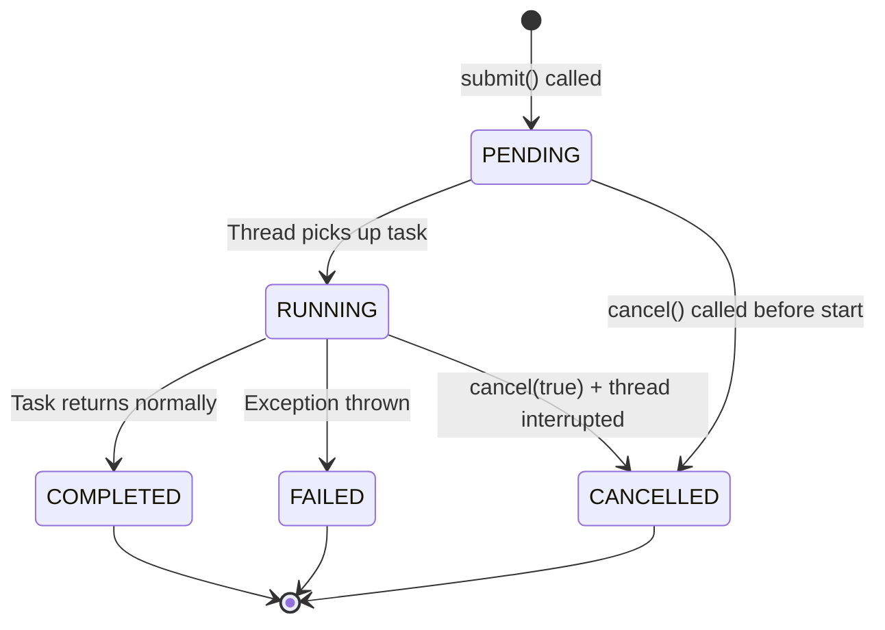
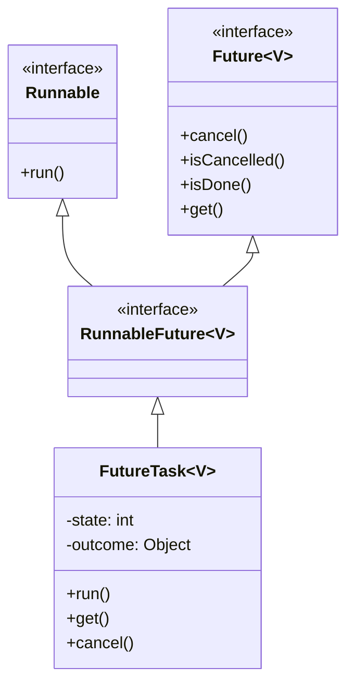
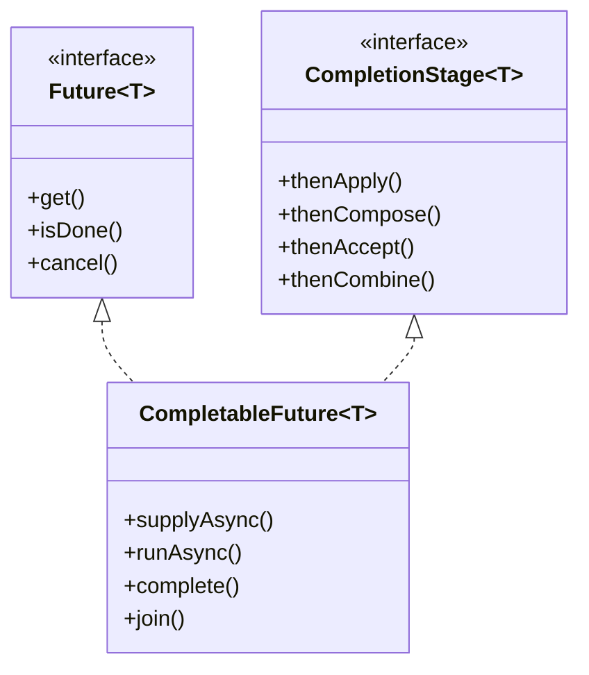
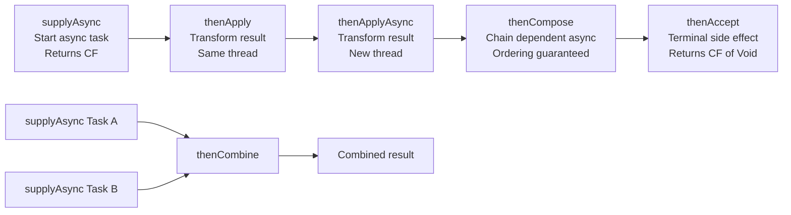

# 📘 Java Concurrency: Future, Callable & CompletableFuture
### Complete Study Guide — Chapter: Asynchronous Programming in Java

---

> [!NOTE]
> This guide assumes prior familiarity with `ThreadPoolExecutor`, `Runnable`, and basic Java threading. Where those concepts are referenced, enough context is provided to keep this guide self-contained.

---

## 🗂️ Table of Contents

1. [The Problem: Tracking Async Tasks](#1-the-problem-tracking-async-tasks)
2. [Future — The Interface](#2-future--the-interface)
3. [Callable — Returning Values from Threads](#3-callable--returning-values-from-threads)
4. [Three Flavors of `submit()`](#4-three-flavors-of-submit)
5. [Internal Working: FutureTask](#5-internal-working-futuretask)
6. [CompletableFuture — Advanced Async](#6-completablefuture--advanced-async)
7. [CompletableFuture Methods In Depth](#7-completablefuture-methods-in-depth)
8. [Interview Notes](#8-interview-notes)
9. [Common Mistakes](#9-common-mistakes)
10. [Best Practices](#10-best-practices)
11. [Practice Questions](#11-practice-questions)
12. [Summary](#12-summary)

---

# 1. The Problem: Tracking Async Tasks

## Overview

When you submit a task to a `ThreadPoolExecutor`, the calling thread (e.g., the `main` thread) does **not** wait for the submitted task to complete. A worker thread from the pool picks up the task and runs it independently.

This is the essence of *asynchronous execution*: the caller continues processing while the task runs elsewhere.

## Why This Creates a Problem

Consider this scenario:

```
Main Thread          Worker Thread (T1)
─────────────        ──────────────────
submit task ──────►  [running task...]
continue...          [still running...]
                     [done]
```

After submitting the task, the main thread has **no reference** to that task. It cannot know:
- Has the task completed?
- Did the task fail with an exception?
- What result did the task produce?

```java
// Without Future — no way to track the task
ExecutorService pool = Executors.newFixedThreadPool(1);
pool.submit(() -> {
    System.out.println("Task running...");
    Thread.sleep(2000);
});
// Main continues here — has zero knowledge of task status
```

> [!IMPORTANT]
> Without a `Future` reference, the caller has **no mechanism** to observe task state, retrieve results, or handle exceptions.

This is precisely the problem that `Future` was designed to solve.

---

# 2. Future — The Interface

## Definition

`Future<V>` is a Java interface (in `java.util.concurrent`) that represents the **result of an asynchronous computation**. It provides a handle through which the caller can:

- **Check** if the computation is complete
- **Retrieve** the result once complete
- **Cancel** the task if it is still pending
- **Detect exceptions** that occurred during execution

## Real-world Analogy

Think of ordering food at a restaurant.

- You place an order (submit a task) and get a **receipt/token** (the `Future` object).
- You don't stand in the kitchen watching — you continue sitting, chatting (main thread continues).
- When you want to check, you look at the token: "Is my order ready?"
- You can also choose to wait at the counter until the food arrives (`future.get()`).
- You could even cancel the order before it is prepared (`future.cancel()`).

## Interface Declaration

```java
public interface Future<V> {
    boolean cancel(boolean mayInterruptIfRunning);
    boolean isCancelled();
    boolean isDone();
    V get() throws InterruptedException, ExecutionException;
    V get(long timeout, TimeUnit unit)
        throws InterruptedException, ExecutionException, TimeoutException;
}
```

---

## Methods of Future — Detailed

### Method 1: `cancel(boolean mayInterruptIfRunning)`

```java
boolean result = futureObj.cancel(true);
```

| Parameter | Description |
|---|---|
| `true` | Attempt to interrupt the thread if it is running |
| `false` | Cancel only if the task has not yet started |

**Return values:**
- `true` — Task was successfully canceled (was pending or was interrupted)
- `false` — Task **cannot be canceled** (already completed, already canceled, or could not be interrupted)

> [!WARNING]
> If the task is already completed, `cancel()` always returns `false`. There is nothing to cancel.

---

### Method 2: `isCancelled()`

```java
boolean canceled = futureObj.isCancelled();
```

Returns `true` if the task was **canceled before it completed normally**.

- Use this to confirm that a `cancel()` call actually took effect.
- Distinct from `cancel()` — `isCancelled()` just *queries* the state; it does not change it.

---

### Method 3: `isDone()`

```java
boolean done = futureObj.isDone();
```

Returns `true` if the task **finished**, regardless of how it finished:
- Normal completion ✅
- Exception thrown ✅
- Task was canceled ✅

Returns `false` **only if** the task is still in progress.

> [!TIP]
> `isDone()` is a non-blocking check. It returns immediately without waiting for the task.

---

### Method 4: `get()`

```java
V result = futureObj.get();
```

**Blocks the calling thread** until the async task completes. Once it completes, retrieves and returns the result.

- If the task threw an exception internally, `get()` wraps it in an `ExecutionException`.
- If the calling thread is interrupted while waiting, throws `InterruptedException`.

> [!CAUTION]
> Using `get()` without a timeout can block indefinitely if the async task hangs or never completes. Use with care in production code.

---

### Method 5: `get(long timeout, TimeUnit unit)`

```java
V result = futureObj.get(3, TimeUnit.SECONDS);
```

Like `get()` but with a **maximum wait time**. If the task does not complete within the timeout, throws `TimeoutException`.

After a `TimeoutException`, you can choose to:
- Log the timeout and move on
- Retry with `get()` again
- Cancel the task

---

## Diagram: Future State Machine



---

## Full Code Example: Future in Action

```java
import java.util.concurrent.*;

public class FutureDemo {
    public static void main(String[] args) throws Exception {
        // Create a thread pool with one thread
        ExecutorService pool = Executors.newFixedThreadPool(1);

        // Submit a task — takes 7 seconds to complete
        Future<?> futureObj = pool.submit(() -> {
            try {
                System.out.println("Task started by: " + Thread.currentThread().getName());
                Thread.sleep(7000); // simulate long computation
                System.out.println("Task completed!");
            } catch (InterruptedException e) {
                System.out.println("Task was interrupted.");
            }
        });

        // Non-blocking check immediately after submission
        System.out.println("Is task done? " + futureObj.isDone()); // false

        // Try to get result with 2-second timeout
        try {
            futureObj.get(2, TimeUnit.SECONDS); // task takes 7s, so this will time out
        } catch (TimeoutException e) {
            System.out.println("Timeout exception happened — task not done in 2 seconds.");
        }

        // Block indefinitely until task finishes
        futureObj.get(); // waits remaining ~5 seconds

        // Now the task is done
        System.out.println("Is task done now? " + futureObj.isDone()); // true
        System.out.println("Is task cancelled? " + futureObj.isCancelled()); // false

        pool.shutdown();
    }
}
```

### Expected Output

```
Task started by: pool-1-thread-1
Is task done? false
Timeout exception happened — task not done in 2 seconds.
Task completed!
Is task done now? true
Is task cancelled? false
```

### Step-by-Step Execution

| Step | Thread | Action |
|---|---|---|
| 1 | main | Creates pool, submits task |
| 2 | pool-1-thread-1 | Starts executing task, sleeps 7s |
| 3 | main | `isDone()` → false (task still sleeping) |
| 4 | main | `get(2, SECONDS)` → blocks 2 seconds, then throws `TimeoutException` |
| 5 | main | Catches `TimeoutException`, prints message |
| 6 | main | `get()` → blocks until task finishes (≈5 more seconds) |
| 7 | pool-1-thread-1 | Wakes up, prints "Task completed!" |
| 8 | main | Unblocks, continues |
| 9 | main | `isDone()` → true, `isCancelled()` → false |

---

# 3. Callable — Returning Values from Threads

## The Gap in Runnable

`Runnable` has one method:

```java
@FunctionalInterface
public interface Runnable {
    void run(); // No return value
}
```

This works for fire-and-forget tasks. But what if the async computation needs to **produce a result**?

## Definition

`Callable<V>` is a functional interface (in `java.util.concurrent`) that represents a task that:
- Can be executed by a thread
- **Returns a result** of type `V`
- Can **throw a checked exception**

```java
@FunctionalInterface
public interface Callable<V> {
    V call() throws Exception;
}
```

## Comparison: Runnable vs Callable

| Feature | `Runnable` | `Callable<V>` |
|---|---|---|
| Method | `void run()` | `V call()` |
| Return type | None (`void`) | Generic type `V` |
| Throws checked exception | No | Yes |
| Used with `Future` | Yes (result is `null`) | Yes (result is actual value) |
| Introduced in | Java 1.0 | Java 5 |

> [!NOTE]
> Both `Runnable` and `Callable` represent tasks to be executed. The only meaningful difference is whether the task produces a return value.

---

# 4. Three Flavors of `submit()`

`ExecutorService.submit()` is **overloaded** with three signatures. Understanding each is essential.

## Flavor 1: `submit(Runnable task)` — No Result

```java
Future<?> future = pool.submit(() -> {
    System.out.println("Doing work, no return value.");
});
```

- The task is a `Runnable` — no return value.
- `Future<?>` uses a **wildcard** because there is no meaningful result type.
- When you call `future.get()`, it returns `null` (the framework hardcodes `null` as the result for `Runnable` tasks).
- You can still use `isDone()`, `isCancelled()`, `cancel()`.

```java
Object result = future.get(); // Returns null
System.out.println(result == null); // true
```

> [!TIP]
> The `?` wildcard in `Future<?>` means "the result type is unknown/irrelevant." Since the task returns nothing, you capture it as `Object` or simply ignore the return.

---

## Flavor 2: `submit(Runnable task, T result)` — Runnable with a Predefined Result

```java
List<Integer> output = new ArrayList<>(); // shared object

Future<List<Integer>> future = pool.submit(() -> {
    // Runnable modifies the shared object
    output.add(300);
}, output); // pass the object as the "result"
```

- The second parameter `result` is returned by `future.get()` when the task completes.
- The framework does not look at the `Runnable`'s internal logic to figure out the result — you hand it the object upfront.
- The thread modifies that object during `run()`. Since you hold a reference to the same object, you can read the updated state from either side.

```java
List<Integer> result = future.get(); // blocks until done
System.out.println(result.get(0)); // prints 300
System.out.println(output.get(0)); // also prints 300 — same reference
```

> [!NOTE]
> This is a **workaround** that lets a `Runnable` task "return" a value by mutating a shared object. It works but is less clean than using `Callable`.

---

## Flavor 3: `submit(Callable<T> task)` — Clean Return Value

This is the cleanest and most common pattern when a task must return a computed value.

```java
Future<List<Integer>> future = pool.submit(() -> {
    List<Integer> result = new ArrayList<>();
    result.add(300);
    return result; // Callable returns value
});

List<Integer> result = future.get(); // blocks, then returns the list
System.out.println(result.get(0)); // prints 300
```

- The lambda returns a value → Java infers it as `Callable<List<Integer>>`.
- `Future<List<Integer>>` captures the exact return type.
- No shared mutable state needed.

---

## Diagrams: Three Flavors

```mermaid
flowchart TD
    A[pool.submit] --> B{Does task return a value?}
    B -- No --> C[submit Runnable]
    B -- Yes, via shared obj --> D[submit Runnable + T result]
    B -- Yes, cleanly --> E[submit Callable]
    C --> F[Future<?> — get() returns null]
    D --> G[Future<T> — get() returns pre-passed object]
    E --> H[Future<T> — get() returns computed value]
```

---

# 5. Internal Working: FutureTask

## How `submit()` Works Internally

When you call `pool.submit(runnable)` or `pool.submit(callable)`, the `ThreadPoolExecutor` does not execute the task directly. It **wraps** it inside a `FutureTask`.



`FutureTask<V>` is the concrete class that:
1. Implements `Runnable` (so the executor can call `.run()` on it)
2. Implements `Future<V>` (so the caller can call `.get()`, `.isDone()`, etc.)
3. Internally maintains a **state integer** tracking task progress
4. Stores the **outcome** (result or exception) once the task finishes

### FutureTask Internal States

| State Value | Meaning |
|---|---|
| `0` — NEW | Task created, not yet started |
| `1` — COMPLETING | Task finished, result being set |
2 — NORMAL | Task completed normally |
| `3` — EXCEPTIONAL | Task threw an exception |
| `4` — CANCELLED | Task was canceled |
| `5` — INTERRUPTING | Cancel with interrupt in progress |
| `6` — INTERRUPTED | Thread was interrupted |

When a `Runnable` is submitted:
```
submit(Runnable r)  →  new FutureTask(r, null)  →  queued in pool
```
When a `Callable` is submitted:
```
submit(Callable<T> c)  →  new FutureTask(c)  →  queued in pool
```

The pool's worker thread calls `futureTask.run()`, which in turn calls the underlying `Runnable.run()` or `Callable.call()`, captures the result, and transitions the state to `NORMAL` (or `EXCEPTIONAL` on failure).

---

# 6. CompletableFuture — Advanced Async

## Overview

`CompletableFuture<T>` was introduced in **Java 8** as part of `java.util.concurrent`. It is described as an "advanced version" of `Future`.

`CompletableFuture` **extends** the capabilities of `Future` by adding:
- **Chaining** of async operations (pipeline-style)
- **Combining** results of multiple futures
- **Non-blocking callbacks** instead of blocking `.get()`
- **Manual completion** (you can complete a future programmatically)

## Class Hierarchy



> [!IMPORTANT]
> `CompletableFuture` implements **both** `Future<T>` and `CompletionStage<T>`. Everything `Future` can do, `CompletableFuture` can do — plus much more.

## Default Thread Pool: ForkJoinPool

When you use `CompletableFuture` without providing a custom `Executor`, it internally uses the **common ForkJoinPool** (`ForkJoinPool.commonPool()`).

The common pool:
- Is shared across the JVM
- Dynamically sizes itself based on available CPU cores (typically `cores - 1` threads)
- You have **no control** over its min/max thread count

To gain control, always pass your own `ExecutorService`:

```java
ExecutorService pool = Executors.newFixedThreadPool(4);
CompletableFuture.supplyAsync(() -> "result", pool);
```

---

# 7. CompletableFuture Methods In Depth

## Method 1: `supplyAsync()` — Start an Async Operation

### Purpose

`supplyAsync()` is the entry point for starting an async computation that **produces a result**.

It is the `CompletableFuture` equivalent of `pool.submit(callable)`.

### Signatures

```java
// Uses ForkJoinPool.commonPool()
static <U> CompletableFuture<U> supplyAsync(Supplier<U> supplier)

// Uses the provided Executor
static <U> CompletableFuture<U> supplyAsync(Supplier<U> supplier, Executor executor)
```

### What is a `Supplier<U>`?

`Supplier<U>` is a functional interface:

```java
@FunctionalInterface
public interface Supplier<T> {
    T get(); // No input, returns a value
}
```

It represents a task that takes no input but produces an output — perfect for async computations.

### Code Example

```java
import java.util.concurrent.*;

public class SupplyAsyncDemo {
    public static void main(String[] args) throws Exception {
        ExecutorService pool = Executors.newFixedThreadPool(2);

        CompletableFuture<String> cf = CompletableFuture.supplyAsync(() -> {
            System.out.println("Running in: " + Thread.currentThread().getName());
            return "Task Completed";
        }, pool);

        // get() blocks main thread until result is available
        String result = cf.get();
        System.out.println("Result: " + result);

        pool.shutdown();
    }
}
```

### Output

```
Running in: pool-1-thread-1
Result: Task Completed
```

---

## Method 2: `thenApply()` and `thenApplyAsync()` — Transform the Result

### Purpose

After `supplyAsync()` finishes, `thenApply()` lets you **apply a transformation** to the result — similar to `map()` in Streams.

This enables **chaining**: the output of one stage becomes the input to the next.

### Signatures

```java
// Synchronous — same thread as the previous stage
<U> CompletableFuture<U> thenApply(Function<? super T, ? extends U> fn)

// Asynchronous — new thread from common pool
<U> CompletableFuture<U> thenApplyAsync(Function<? super T, ? extends U> fn)

// Asynchronous — new thread from provided executor
<U> CompletableFuture<U> thenApplyAsync(Function<? super T, ? extends U> fn, Executor executor)
```

### Thread Behavior

| Method | Thread Used |
|---|---|
| `thenApply()` | **Same thread** that completed the previous stage |
| `thenApplyAsync()` | **New thread** from ForkJoinPool (or provided executor) |

### Code Example — `thenApply` (same thread)

```java
ExecutorService pool = Executors.newFixedThreadPool(2);

CompletableFuture<String> result = CompletableFuture
    .supplyAsync(() -> {
        System.out.println("supplyAsync thread: " + Thread.currentThread().getName());
        try { Thread.sleep(5000); } catch (InterruptedException e) {}
        return "Concept";
    }, pool)
    .thenApply(val -> {
        System.out.println("thenApply thread: " + Thread.currentThread().getName());
        return val + " and Coding";
    });

System.out.println(result.get());
```

### Output — `thenApply`

```
supplyAsync thread: pool-1-thread-1
thenApply thread: pool-1-thread-1
Concept and Coding
```

Both stages run on the **same thread** (`pool-1-thread-1`).

---

### Code Example — `thenApplyAsync` (new thread)

```java
CompletableFuture<String> result = CompletableFuture
    .supplyAsync(() -> {
        System.out.println("supplyAsync thread: " + Thread.currentThread().getName());
        try { Thread.sleep(5000); } catch (InterruptedException e) {}
        return "Concept";
    }, pool)
    .thenApplyAsync(val -> {
        System.out.println("thenApplyAsync thread: " + Thread.currentThread().getName());
        return val + " and Coding";
    });

System.out.println(result.get());
```

### Output — `thenApplyAsync`

```
supplyAsync thread: pool-1-thread-1
thenApplyAsync thread: ForkJoinPool.commonPool-worker-1
Concept and Coding
```

A **different thread** picks up the `thenApplyAsync` stage.

> [!TIP]
> To ensure `thenApplyAsync` uses your custom pool (not ForkJoinPool), pass the executor:
> ```java
> .thenApplyAsync(val -> val + "!", pool)
> ```

---

### Chaining Multiple `thenApply`

```java
CompletableFuture<String> cf = CompletableFuture
    .supplyAsync(() -> "Hello")
    .thenApply(s -> s + " World")
    .thenApply(s -> s + "!")
    .thenApply(String::toUpperCase);

System.out.println(cf.get()); // HELLO WORLD!
```

Each stage receives the result of the previous stage.

---

## Method 3: `thenCompose()` and `thenComposeAsync()` — Dependent Async Operations

### Purpose

`thenApply()` transforms a value. But what if the next step itself is an **async operation** (returns a `CompletableFuture`)?

If you used `thenApply()` for that, you'd get `CompletableFuture<CompletableFuture<T>>` — a nested future. That's ugly and hard to work with.

`thenCompose()` **flattens** this nesting: it chains two async operations such that the second starts only when the first finishes, and returns a single `CompletableFuture<T>`.

> [!NOTE]
> `thenCompose` is to `CompletableFuture` what `flatMap()` is to `Stream` or `Optional`.

### Signatures

```java
<U> CompletableFuture<U> thenCompose(Function<? super T, ? extends CompletionStage<U>> fn)

<U> CompletableFuture<U> thenComposeAsync(Function<? super T, ? extends CompletionStage<U>> fn)

<U> CompletableFuture<U> thenComposeAsync(Function<? super T, ? extends CompletionStage<U>> fn, Executor executor)
```

### Ordering Guarantee

`thenCompose` and `thenComposeAsync` **guarantee ordering**: the second async operation starts only after the first completes. Even with `Async` variants, the ordering is maintained.

### Code Example

```java
ExecutorService pool = Executors.newFixedThreadPool(4);

CompletableFuture<String> result = CompletableFuture
    .supplyAsync(() -> "Hello", pool)
    .thenCompose(val ->
        CompletableFuture.supplyAsync(() -> val + " World", pool)
    )
    .thenCompose(val ->
        CompletableFuture.supplyAsync(() -> val + " All", pool)
    );

System.out.println(result.get()); // Always: Hello World All
```

### Chaining with `thenComposeAsync`

```java
CompletableFuture<String> result = CompletableFuture
    .supplyAsync(() -> "Hello", pool)
    .thenComposeAsync(val ->
        CompletableFuture.supplyAsync(() -> val + " World", pool), pool
    )
    .thenComposeAsync(val ->
        CompletableFuture.supplyAsync(() -> val + " All", pool), pool
    );

System.out.println(result.get()); // Always: Hello World All
```

> [!IMPORTANT]
> No matter how many `thenCompose` or `thenComposeAsync` you chain, the **output order is always preserved**. The framework internally maintains a stack of dependent actions.

---

### `thenApply` vs `thenCompose`

| Aspect | `thenApply` | `thenCompose` |
|---|---|---|
| Input function type | `Function<T, U>` | `Function<T, CompletableFuture<U>>` |
| Next step is async? | No | Yes |
| Risk of nesting? | No | Yes (without compose) |
| Ordering guaranteed? | Same-thread only | Always |
| Analogy | `Stream.map()` | `Stream.flatMap()` |

---

## Method 4: `thenAccept()` and `thenAcceptAsync()` — End of Chain

### Purpose

`thenAccept()` is a **terminal operation** in a `CompletableFuture` chain. It receives the result of the previous stage but **does not return a value**.

It is used for **side effects**: logging, printing, writing to a database, etc.

### Signature

```java
CompletableFuture<Void> thenAccept(Consumer<? super T> action)
CompletableFuture<Void> thenAcceptAsync(Consumer<? super T> action)
```

### Why Is It "Terminal"?

The return type is `CompletableFuture<Void>`. Since `Void` has no meaningful value, you **cannot meaningfully chain further** with `thenApply` or `thenCompose`.

> [!NOTE]
> While you technically can chain off a `thenAccept`, it's semantically incorrect because there's no result to pass to the next stage. Treat it as the end of the pipeline.

### Code Example

```java
CompletableFuture<String> cf = CompletableFuture.supplyAsync(() -> "Hello", pool);

CompletableFuture<Void> end = cf.thenAccept(val -> {
    System.out.println("Received: " + val); // Received: Hello
    // No return — this is Void
});

end.get(); // Wait for the terminal stage to complete
```

### Output

```
Received: Hello
```

---

## Method 5: `thenCombine()` and `thenCombineAsync()` — Merge Two Futures

### Purpose

`thenCombine()` is used when you have **two independent async tasks** running in parallel, and you want to combine their results once **both** are finished.

```
Task 1 ──────────────────►  result1 ─┐
                                       ├─► combine ──► final result
Task 2 ──────────────────►  result2 ─┘
```

### Signature

```java
<U, V> CompletableFuture<V> thenCombine(
    CompletionStage<? extends U> other,
    BiFunction<? super T, ? super U, ? extends V> fn
)
```

- `other` — The second `CompletableFuture` to combine with
- `fn` — A `BiFunction` that takes both results and produces a combined output

### Code Example

```java
ExecutorService pool = Executors.newFixedThreadPool(4);

CompletableFuture<Integer> task1 = CompletableFuture
    .supplyAsync(() -> {
        System.out.println("Task1 thread: " + Thread.currentThread().getName());
        return 10;
    }, pool);

CompletableFuture<String> task2 = CompletableFuture
    .supplyAsync(() -> {
        System.out.println("Task2 thread: " + Thread.currentThread().getName());
        return "K";
    }, pool);

// Combine: integer + string → string
CompletableFuture<String> combined = task1.thenCombine(task2, (num, str) -> num + str);

System.out.println("Combined result: " + combined.get()); // 10K

pool.shutdown();
```

### Output

```
Task1 thread: pool-1-thread-1
Task2 thread: pool-1-thread-2
Combined result: 10K
```

Note: Both tasks run **in parallel** on separate threads. `thenCombine` waits until **both** are done, then calls the `BiFunction`.

---

## Complete Pipeline Diagram



---

## Summary Table: All CompletableFuture Methods

| Method | Input | Output | Thread | Use Case |
|---|---|---|---|---|
| `supplyAsync()` | `Supplier<T>` | `CF<T>` | New (pool) | Start async operation |
| `thenApply()` | `Function<T,U>` | `CF<U>` | Same | Transform result synchronously |
| `thenApplyAsync()` | `Function<T,U>` | `CF<U>` | New | Transform result asynchronously |
| `thenCompose()` | `Function<T, CF<U>>` | `CF<U>` | Same | Chain dependent async ops |
| `thenComposeAsync()` | `Function<T, CF<U>>` | `CF<U>` | New | Chain with ordering, new thread |
| `thenAccept()` | `Consumer<T>` | `CF<Void>` | Same | Terminal: consume result |
| `thenAcceptAsync()` | `Consumer<T>` | `CF<Void>` | New | Terminal: consume async |
| `thenCombine()` | Two CFs + `BiFunction` | `CF<V>` | Same | Merge two parallel results |
| `thenCombineAsync()` | Two CFs + `BiFunction` | `CF<V>` | New | Merge two parallel results async |

---

# 8. Interview Notes

> [!IMPORTANT]
> These are frequently asked in Java backend and concurrent programming interviews.

### Q1: What is the difference between `Future` and `CompletableFuture`?

| Aspect | `Future` | `CompletableFuture` |
|---|---|---|
| Java version | Java 5 | Java 8 |
| Blocking | `get()` is always blocking | Can use callbacks (non-blocking) |
| Chaining | Not supported | Fully supported |
| Combining futures | Not supported | `thenCombine()`, etc. |
| Manual completion | Not possible | `complete()`, `completeExceptionally()` |
| Exception handling | Only via `ExecutionException` | `exceptionally()`, `handle()` |

---

### Q2: What is `FutureTask` and how does it relate to `Future`?

`FutureTask` is the concrete implementation of the `Future` interface. It implements `RunnableFuture`, which extends both `Runnable` and `Future`. When you call `pool.submit(callable)`, the executor wraps it in a `FutureTask` internally.

---

### Q3: What is the difference between `thenApply` and `thenCompose`?

- `thenApply` is used when the next transformation is a **plain value** (not async).
- `thenCompose` is used when the next step itself returns a **`CompletableFuture`** — it flattens the nesting.
- `thenApply` is analogous to `Stream.map()`; `thenCompose` is analogous to `Stream.flatMap()`.

---

### Q4: What thread runs `thenApply` vs `thenApplyAsync`?

- `thenApply` → **same thread** that completed the previous stage.
- `thenApplyAsync` → a **new thread** (from `ForkJoinPool` or your provided executor).

---

### Q5: What happens if you call `get()` and the task throws an exception?

The exception is wrapped in a `java.util.concurrent.ExecutionException`. You must catch it and call `.getCause()` to get the original exception.

```java
try {
    future.get();
} catch (ExecutionException e) {
    Throwable original = e.getCause();
}
```

---

### Q6: Why does `cancel()` sometimes return `false`?

- The task is **already completed** — nothing to cancel.
- The task is **already canceled**.
- The thread could **not be interrupted** (`mayInterruptIfRunning` was `false` and the task already started).

---

### Q7: What is the default thread pool used by `CompletableFuture`?

`ForkJoinPool.commonPool()`. It's a shared pool across the JVM. For production code with predictable performance, always pass a custom `ExecutorService`.

---

### Q8: What is the difference between `Callable` and `Supplier`?

| Aspect | `Callable<V>` | `Supplier<T>` |
|---|---|---|
| Package | `java.util.concurrent` | `java.util.function` |
| Method | `call()` | `get()` |
| Checked exception | Yes (`throws Exception`) | No |
| Used with | `ExecutorService.submit()` | `CompletableFuture.supplyAsync()` |

---

# 9. Common Mistakes

### ❌ Mistake 1: Calling `get()` immediately after `submit()`

```java
Future<String> f = pool.submit(() -> {
    Thread.sleep(5000);
    return "done";
});
String result = f.get(); // Blocks immediately — defeats the purpose of async!
```

✅ **Correct approach**: Do other work first, then call `get()` only when you actually need the result.

---

### ❌ Mistake 2: Ignoring `TimeoutException`

```java
f.get(2, TimeUnit.SECONDS); // May throw TimeoutException — must handle it!
```

✅ Always wrap timed `get()` in a try-catch for `TimeoutException`.

---

### ❌ Mistake 3: Using `thenApply` when the function returns a `CompletableFuture`

```java
// WRONG — results in CompletableFuture<CompletableFuture<String>>
CompletableFuture<CompletableFuture<String>> bad = cf.thenApply(val ->
    CompletableFuture.supplyAsync(() -> val + "!")
);
```

✅ Use `thenCompose` to flatten:

```java
CompletableFuture<String> good = cf.thenCompose(val ->
    CompletableFuture.supplyAsync(() -> val + "!")
);
```

---

### ❌ Mistake 4: Not shutting down the `ExecutorService`

```java
ExecutorService pool = Executors.newFixedThreadPool(4);
// ... use pool ...
// Forgot pool.shutdown() — JVM never exits!
```

✅ Always call `pool.shutdown()` (or `pool.shutdownNow()`) when done.

---

### ❌ Mistake 5: Assuming ordering with `thenApplyAsync` chaining

When using `thenApplyAsync` across multiple stages without `thenCompose`, there is **no ordering guarantee** between dependent async stages.

✅ Use `thenCompose` / `thenComposeAsync` for dependent ordered operations.

---

# 10. Best Practices

1. **Always use a custom Executor** with `CompletableFuture` in production. The common `ForkJoinPool` is shared and can starve.

2. **Prefer `Callable` over the `Runnable + shared object` workaround** when the task must return a result.

3. **Use `thenAccept` as the terminal stage** of a pipeline — do not try to chain after it.

4. **Use `thenCompose` for dependent async tasks** to ensure ordering and avoid nested `CompletableFuture`.

5. **Handle exceptions explicitly** using `exceptionally()` or `handle()` on `CompletableFuture` instead of catching only in `get()`.

```java
CompletableFuture<String> cf = CompletableFuture
    .supplyAsync(() -> { throw new RuntimeException("Oops!"); })
    .exceptionally(ex -> "Fallback value: " + ex.getMessage());

System.out.println(cf.get()); // Fallback value: Oops!
```

6. **Use `thenCombine` for truly independent parallel tasks** that need their results merged.

7. **Avoid `get()` without timeout** in latency-sensitive paths.

---

# 11. Practice Questions

### 🟢 Easy

1. What is `Future` in Java? What interface does it belong to?
2. List all five methods of the `Future` interface and describe each.
3. What is the return type of `ExecutorService.submit(Runnable)`?
4. What is the difference between `Runnable` and `Callable`?
5. What does `isDone()` return when a task is canceled?

### 🟡 Medium

6. Write a program that submits three `Callable` tasks to a thread pool, waits for all of them using `Future.get()`, and prints each result.
7. Explain what happens step-by-step when `future.get(2, TimeUnit.SECONDS)` is called and the task takes 5 seconds.
8. Write a `CompletableFuture` chain that: (a) fetches a user name asynchronously, (b) converts it to uppercase, (c) prints the result.
9. What is `FutureTask`? How does it relate to both `Runnable` and `Future`?
10. What thread executes `thenApply` if the previous `supplyAsync` used a custom thread pool?

### 🔴 Hard

11. Implement two independent async computations using `CompletableFuture`, then combine their results with `thenCombine`. One returns a price (`Double`), the other returns a currency symbol (`String`). Combine them as `"$25.00"`.
12. Explain the difference between `thenApply`, `thenCompose`, and `thenCombine` with a concrete use case for each.
13. What are the risks of using `ForkJoinPool.commonPool()` in a web application? How do you mitigate them?
14. Write a pipeline where Step 1, Step 2, and Step 3 are all async but strictly ordered using `thenComposeAsync`. Verify the ordering by printing thread names and sequence numbers.
15. What happens when you call `cancel(true)` on a `Future` whose task is already sleeping in `Thread.sleep()`? Walk through the exception flow.

---

# 12. Summary

```mermaid
mindmap
  root((Async Java))
    Future
      Interface in java.util.concurrent
      cancel()
      isCancelled()
      isDone()
      get()
      get timeout
    Callable
      Returns a value
      throws Exception
      Used with submit Callable
    submit Overloads
      submit Runnable
      submit Runnable T result
      submit Callable T
    FutureTask
      Wraps Runnable or Callable
      Implements Future
      Has internal state machine
    CompletableFuture
      Java 8
      Implements Future and CompletionStage
      supplyAsync
      thenApply / thenApplyAsync
      thenCompose / thenComposeAsync
      thenAccept / thenAcceptAsync
      thenCombine / thenCombineAsync
```

### Revision Bullets

- `Future<V>` provides a handle to track an async task — check status, retrieve result, cancel.
- Five methods: `cancel()`, `isCancelled()`, `isDone()`, `get()`, `get(timeout, unit)`.
- `Runnable` returns nothing. `Callable<V>` returns a value of type `V`.
- Three `submit()` overloads: Runnable (result = null), Runnable + T (result = pre-set object), Callable (result = computed value).
- Internally, `submit()` wraps tasks in `FutureTask`, which implements both `Runnable` and `Future`.
- `CompletableFuture` is the advanced version of `Future` — supports chaining, combining, non-blocking callbacks.
- `supplyAsync()` starts an async task; uses ForkJoinPool by default; pass your own Executor for control.
- `thenApply()` = synchronous transform on same thread; `thenApplyAsync()` = async transform on new thread.
- `thenCompose()` = chain dependent async operations with guaranteed ordering; analogous to `flatMap`.
- `thenAccept()` = terminal consumer stage; returns `CompletableFuture<Void>`.
- `thenCombine()` = merge results of two independent parallel futures with a `BiFunction`.
- In production: always use a custom `ExecutorService` with `CompletableFuture`, always handle `ExecutionException`, always shut down your pools.

---

*End of Chapter — Future, Callable & CompletableFuture*
