# ☕ Java Overview — Comprehensive Study Guide
### *Java Basics to Advanced | Lecture 2*

---

> [!NOTE]
> This guide is a complete self-contained study resource derived from the Java Basics to Advanced lecture series (Video 2). A student should be able to learn the full topic from this document alone — no video required.

---

## 📚 Table of Contents

1. [What is Java?](#1-what-is-java)
2. [WORA — Write Once, Run Anywhere](#2-wora--write-once-run-anywhere)
3. [Three Core Components: JVM, JRE, JDK](#3-three-core-components-jvm-jre-jdk)
   - [JVM — Java Virtual Machine](#31-jvm--java-virtual-machine)
   - [JRE — Java Runtime Environment](#32-jre--java-runtime-environment)
   - [JDK — Java Development Kit](#33-jdk--java-development-kit)
4. [Java Editions: JSE, JEE, JME](#4-java-editions-jse-jee-jme)
5. [How Java Code Flows: Compilation to Execution](#5-how-java-code-flows-compilation-to-execution)
6. [Writing Your First Java Program](#6-writing-your-first-java-program)
   - [Class Structure](#61-class-structure)
   - [The main Method](#62-the-main-method)
   - [Comments in Java](#63-comments-in-java)
   - [Variables and Output](#64-variables-and-output)
   - [Compiling and Running](#65-compiling-and-running)
7. [Platform Dependence vs. Platform Independence](#7-platform-dependence-vs-platform-independence)
8. [Summary Tables and Diagrams](#8-summary-tables-and-diagrams)
9. [Common Mistakes](#9-common-mistakes)
10. [Best Practices](#10-best-practices)
11. [Interview Notes](#11-interview-notes)
12. [Practice Questions](#12-practice-questions)
13. [Quick Revision Summary](#13-quick-revision-summary)

---

# 1. What is Java?

## Overview

Java is one of the most widely used programming languages in the world. Before diving into syntax and programs, it is essential to understand *what Java is*, *why it exists*, and *what makes it special*.

---

## Definition

> **Java** is a platform-independent, object-oriented programming language and computing platform first released by Sun Microsystems in 1995 (now maintained by Oracle).

When asked *"What is Java?"* in an interview or exam, a complete answer is:

> *"Java is a platform-independent, highly popular object-oriented programming language. Its biggest advantage is portability, which is described by the principle WORA — Write Once, Run Anywhere."*

---

## Key Characteristics of Java

| Characteristic | Description |
|---|---|
| **Platform Independent** | Java programs can run on any OS without modification |
| **Object-Oriented** | Built around the OOP principles: Inheritance, Polymorphism, Encapsulation, Abstraction |
| **Portable** | Compiled bytecode runs on any system with a JVM |
| **Strongly Typed** | All variables must be declared with a type |
| **Compiled + Interpreted** | Source code is compiled to bytecode, then interpreted/JIT-compiled at runtime |
| **Automatic Memory Management** | Built-in Garbage Collector handles memory |
| **Multi-threaded** | Built-in support for concurrent programming |

---

## OOP Features in Java

Java is built on the four pillars of Object-Oriented Programming:

```
┌────────────────────────────────────────────┐
│         Object-Oriented Programming        │
│                                            │
│  1. Inheritance    2. Polymorphism         │
│  3. Encapsulation  4. Abstraction          │
└────────────────────────────────────────────┘
```

These will be covered in dedicated lectures, but they form the foundation of every Java program.

---

# 2. WORA — Write Once, Run Anywhere

## Overview

The single biggest advantage of Java is **portability**. This is captured in the famous acronym:

> **WORA = Write Once, Run Anywhere**

---

## What WORA Means

Imagine you write a Java program on your **mobile phone**. Without any modifications, that same program can be run on:

- A **Windows** desktop
- A **Mac** laptop
- A **Linux** server
- Any other device

This is not possible in languages like C or C++, where you need to recompile the source code for each target platform separately. Java achieves this through a two-step process involving **bytecode** and the **JVM**.

---

## Why WORA Matters

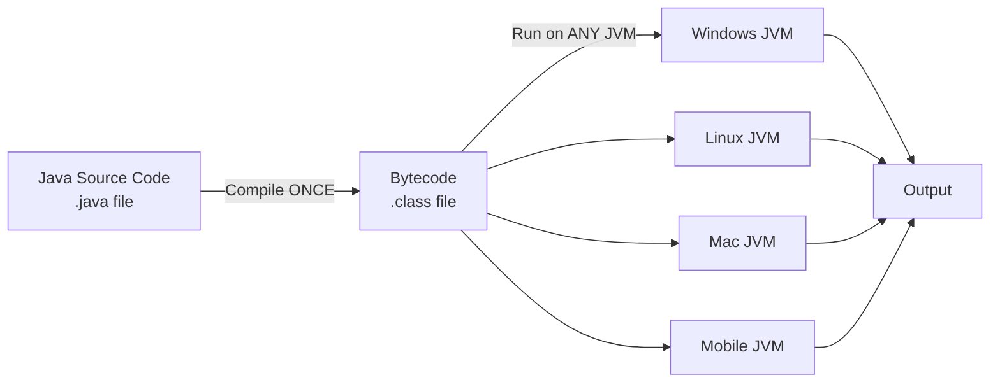

The key insight: **you compile the source code once**, and the resulting bytecode can be **run anywhere** a JVM is installed.

---

# 3. Three Core Components: JVM, JRE, JDK

## Overview

Java's architecture is built on three nested components. Understanding these is **fundamental** — they are asked about in almost every Java interview.

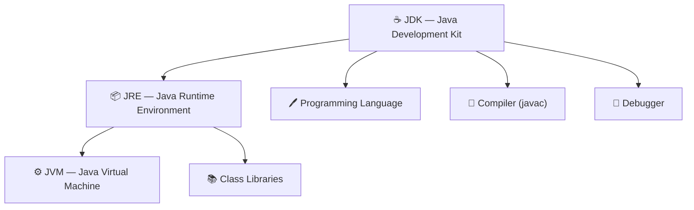

---

## 3.1 JVM — Java Virtual Machine

### Definition

> **JVM (Java Virtual Machine)** is an **abstract machine** — it does not physically exist as hardware. It is a software-based virtual machine that provides a runtime environment in which Java bytecode can be executed.

The word *abstract* here means: **there is no physical machine called JVM**. It is a software specification/implementation that behaves like a machine.

---

### What JVM Does

The JVM sits between the bytecode (`.class` file) and the underlying hardware/OS. Its job is to:

1. **Accept bytecode** as input
2. **Convert bytecode to machine code** using its built-in **JIT Compiler**
3. **Execute the machine code** on the host hardware

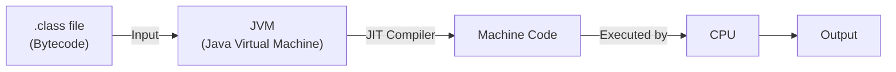

---

### JIT Compiler — Just-In-Time Compiler

Inside the JVM lives a special compiler called the **JIT (Just-In-Time) Compiler**.

> **JIT Compiler** translates bytecode into native machine code at **runtime**, just before each piece of code is executed. This is different from traditional compilers that translate the entire source code before any execution begins.

| Compiler Type | When it compiles | Input | Output |
|---|---|---|---|
| **javac** (Java Compiler) | Before runtime | `.java` source file | `.class` bytecode |
| **JIT Compiler** (inside JVM) | At runtime | `.class` bytecode | Native machine code |

---

### Is JVM Platform Independent or Dependent?

This is a **critical concept** that confuses many beginners:

> [!IMPORTANT]
> **Java programs (bytecode) are platform independent.**
> **JVM itself is platform dependent.**

This means:
- If you are on **Windows**, you need the **Windows JVM**
- If you are on **macOS**, you need the **macOS JVM**
- If you are on **Linux**, you need the **Linux JVM**

Each operating system has its own specific JVM implementation. But **all JVMs understand the same bytecode**. That is the secret of WORA.

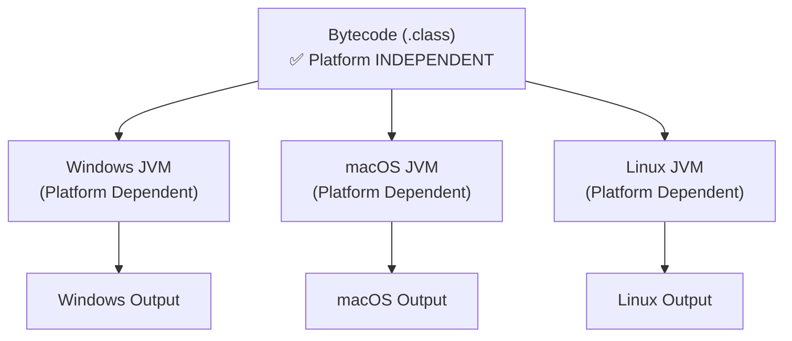

---

### Memory and Execution in JVM

The JVM manages several memory areas internally:

| Memory Area | Purpose |
|---|---|
| **Method Area** | Stores class-level data: class names, method bytecode, static variables |
| **Heap** | Runtime memory for all objects (created with `new`) |
| **Stack** | Each thread has its own stack; stores local variables, method call frames |
| **PC Register** | Program Counter — tracks which instruction is currently executing |
| **Native Method Stack** | For native (non-Java) code calls |

We will explore these in detail when we cover memory management in future lectures.

---

## 3.2 JRE — Java Runtime Environment

### Definition

> **JRE (Java Runtime Environment)** is the environment required to **run** Java programs. It contains:
> 1. **JVM** — to execute bytecode
> 2. **Class Libraries** — pre-written Java code that programs can use

```
JRE = JVM + Class Libraries
```

---

### Class Libraries

Java ships with a massive collection of pre-written, ready-to-use code called **class libraries** (also called the Java API or standard library).

Examples used in the lecture:

```java
// From java.lang package (Math library)
int result = Math.abs(-10);  // Returns 10

// From java.util package (Arrays library)
int[] arr = {5, 3, 1, 4, 2};
Arrays.sort(arr);  // Sorts the array: [1, 2, 3, 4, 5]
```

These libraries are already compiled and bundled with JRE. When your bytecode uses them, JVM resolves them at runtime using the class libraries bundled in JRE.

---

### What You Can and Cannot Do with Just JRE

| Task | JRE Only |
|---|---|
| **Run** a Java program (from `.class` bytecode) | ✅ Yes |
| **Write** Java source code | ❌ No |
| **Compile** Java source code | ❌ No |
| **Debug** Java programs | ❌ No |

> [!TIP]
> If you only need to **run** a Java application (like end users of software), JRE is sufficient. If you need to **develop** Java programs, you need JDK.

---

### How JRE Resolves Libraries at Runtime

Consider this scenario:

1. You write Java code that calls `Arrays.sort(arr)`
2. You compile it → `.class` bytecode is created
3. JVM starts executing the bytecode
4. JVM encounters the `Arrays.sort` call
5. JVM looks up `java.util.Arrays` from the **class libraries in JRE**
6. The library code is loaded and executed
7. Execution continues

This is why JRE needs both JVM (to run bytecode) AND class libraries (to resolve library calls).

---

## 3.3 JDK — Java Development Kit

### Definition

> **JDK (Java Development Kit)** is the full package for **developing** Java programs. It includes everything in JRE plus additional development tools.

```
JDK = JRE + Programming Language + Compiler (javac) + Debugger + Other Tools
JDK = JVM + Class Libraries + Programming Language + Compiler + Debugger
```

---

### What JDK Provides

| Component | Tool | Purpose |
|---|---|---|
| Programming Language | Java syntax, keywords | Write Java source code |
| Compiler | `javac` | Compiles `.java` → `.class` (bytecode) |
| Debugger | `jdb` | Debug Java programs step by step |
| JRE | (included) | Run compiled programs |
| JVM | (via JRE) | Execute bytecode |
| Class Libraries | (via JRE) | Standard library access |
| Other Tools | `jar`, `javadoc`, etc. | Package and document code |

---

### Nesting Relationship

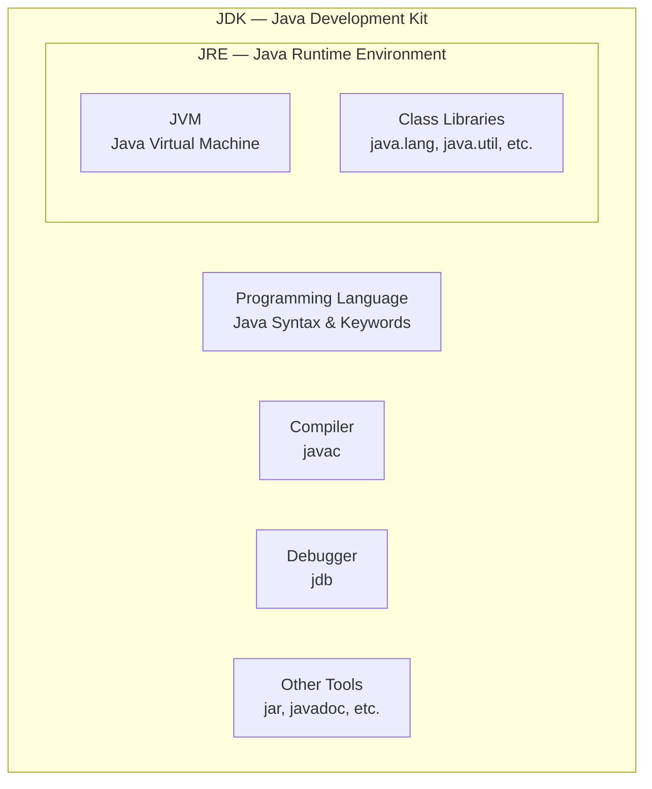

---

### Platform Dependence Summary

> [!IMPORTANT]
> **JVM, JRE, and JDK are ALL platform dependent.**
> Only the **bytecode (.class file)** is platform independent.

| Component | Platform Dependent? |
|---|---|
| JVM | ✅ Yes — different for each OS |
| JRE | ✅ Yes — different for each OS |
| JDK | ✅ Yes — different for each OS |
| `.java` source file | ✅ Yes — needs compilation |
| `.class` bytecode | ❌ No — runs on any JVM (WORA) |

---

## Comparison Table: JVM vs JRE vs JDK

| Feature | JVM | JRE | JDK |
|---|---|---|---|
| Full Form | Java Virtual Machine | Java Runtime Environment | Java Development Kit |
| Purpose | Execute bytecode | Run Java programs | Develop + Run Java programs |
| Contains | JIT Compiler, Memory Mgmt | JVM + Class Libraries | JRE + Compiler + Debugger + Tools |
| Can run `.class` files? | ✅ (core function) | ✅ | ✅ |
| Can compile `.java` files? | ❌ | ❌ | ✅ |
| Platform Dependent? | ✅ Yes | ✅ Yes | ✅ Yes |
| Who needs it? | Part of JRE | End users running Java apps | Developers |

---

## How to Download JDK

> [!TIP]
> Always download JDK from the **official Oracle website** — it is the authentic source.

Steps:
1. Go to [https://www.oracle.com/java/technologies/downloads/](https://www.oracle.com/java/technologies/downloads/)
2. Choose the version (e.g., Java 8, Java 11, Java 17, Java 21 LTS)
3. Download the installer for your OS (Windows x64, macOS, Linux)
4. Install it following the installer instructions

After installation, verify from terminal/command prompt:

```bash
java -version
```

Expected output (example for Java 17):
```
java version "17.0.x" 2023-xx-xx LTS
Java(TM) SE Runtime Environment (build 17.0.x+x-LTS)
Java HotSpot(TM) 64-Bit Server VM (build 17.0.x+x-LTS, mixed mode, sharing)
```

> [!CAUTION]
> When you download JDK, you get JRE and JVM automatically included. You do NOT need to download them separately.

---

# 4. Java Editions: JSE, JEE, JME

## Overview

Java comes in three major editions, each targeting a different type of application development.

---

## The Three Editions

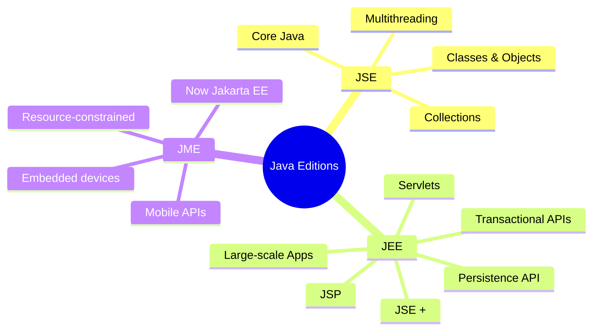

---

## Detailed Breakdown

### JSE — Java Standard Edition

> **JSE (Java Standard Edition)** is what most people refer to as "Core Java". It is the foundation of all Java development.

Everything covered in a typical Java course — classes, objects, inheritance, polymorphism, collections, multithreading — is part of **JSE**.

**What it includes:**
- Core language features
- Basic class libraries (`java.lang`, `java.util`, `java.io`, etc.)
- Collections Framework
- Multithreading
- Exception Handling
- I/O Streams
- Generics

---

### JEE — Java Enterprise Edition

> **JEE (Java Enterprise Edition)** = JSE + additional enterprise-grade APIs.

Used for building **large-scale, distributed applications** such as:
- E-commerce platforms
- Banking systems
- Enterprise resource planning (ERP) systems

**Additional features in JEE:**
- **Servlets** — Handle HTTP requests/responses (web layer)
- **JSP (JavaServer Pages)** — Dynamic web pages with Java
- **Transactional API** — `commit`, `rollback` for database transactions
- **Persistence API (JPA)** — ORM for relational databases
- **EJB (Enterprise JavaBeans)** — Business logic components
- **JMS (Java Message Service)** — Messaging between applications

---

### JME — Java Micro/Mobile Edition

> **JME (Java Micro Edition / Java Mobile Edition)** provides APIs for building applications on resource-constrained devices.

Originally designed for:
- Mobile phones (feature phones)
- Embedded systems
- IoT devices

> [!NOTE]
> JME's name has evolved. It is now often referred to as **Jakarta EE** in modern contexts. The Jakarta EE project is managed by the Eclipse Foundation and represents the evolution of Java enterprise technologies.

---

## Edition Comparison Table

| Edition | Full Name | Also Called | Target | Key Features |
|---|---|---|---|---|
| **JSE** | Java Standard Edition | Core Java | Desktop / General | Classes, OOP, Collections, Threads |
| **JEE** | Java Enterprise Edition | Java EE / Jakarta EE | Enterprise / Web | Servlets, JSP, JPA, Transactions |
| **JME** | Java Micro Edition | Java ME / Jakarta EE | Mobile / Embedded | Mobile APIs, Resource-constrained |

> [!TIP]
> When you see "JSE JDK version X" on the download page, it means you are downloading the Java Standard Edition (Core Java) Development Kit. This is what you want for learning Java.

---

# 5. How Java Code Flows: Compilation to Execution

## Overview

Understanding the complete flow from writing code to getting output is essential. This is the mechanism behind WORA.

---

## The Complete Flow

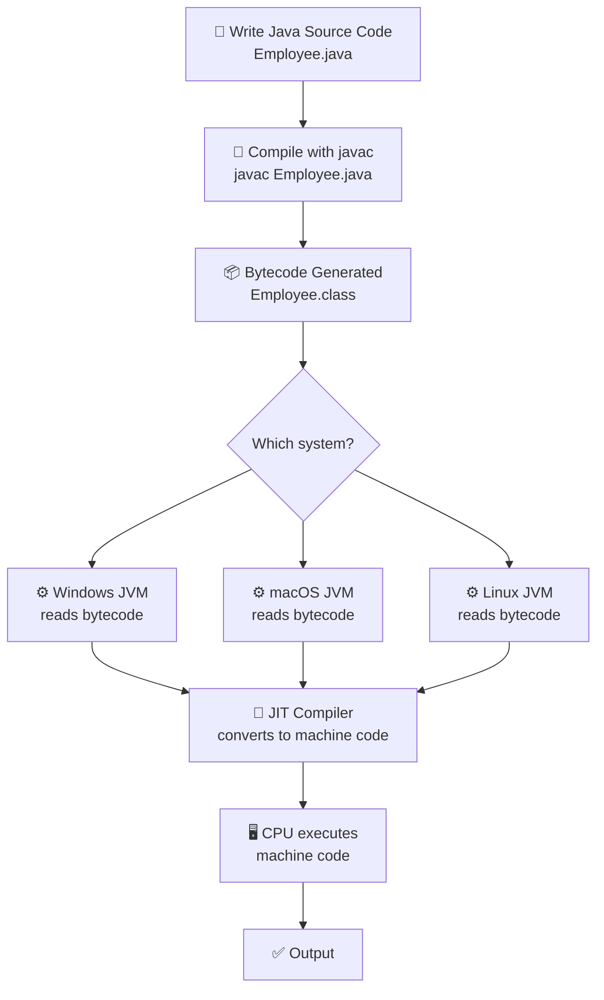

---

## Step-by-Step Breakdown

### Step 1: Write Source Code
- You write Java code in a `.java` file
- Example: `Employee.java`

### Step 2: Compile
```bash
javac Employee.java
```
- The `javac` compiler (part of JDK) reads the `.java` file
- It checks for syntax errors
- It translates the source code into **bytecode**

### Step 3: Bytecode Generated
- A new file `Employee.class` is created
- This `.class` file contains **bytecode** — not machine code, not source code
- Bytecode is a compact, intermediate representation

### Step 4: JVM Reads Bytecode
```bash
java Employee
```
- The `java` command starts the JVM
- JVM reads `Employee.class` (bytecode)
- JVM calls the `main` method to start execution

### Step 5: JIT Compilation
- Inside the JVM, the **JIT Compiler** converts bytecode → native machine code
- This happens at runtime, line by line (or method by method)

### Step 6: CPU Executes
- The CPU runs the native machine code
- Output is produced

---

## File Extensions Reference

| File | Extension | Contains | Created By |
|---|---|---|---|
| Source File | `.java` | Human-readable Java source code | Developer |
| Bytecode File | `.class` | Platform-independent bytecode | `javac` compiler |

---

## Key Insight: Why Bytecode Instead of Machine Code?

Traditional languages like C/C++ compile directly to machine code. The problem: machine code is **platform-specific**. Code compiled on Windows won't run on Linux.

Java's solution: compile to **bytecode** (a neutral intermediate format), then let each platform's JVM translate bytecode to its own machine code at runtime.

```
C/C++ Approach:
Source → Machine Code (Windows) → ❌ Cannot run on Linux

Java Approach:
Source → Bytecode → JVM(Windows) → Machine Code(Windows) ✅
                  → JVM(Linux)   → Machine Code(Linux)   ✅
                  → JVM(macOS)   → Machine Code(macOS)   ✅
```

---

# 6. Writing Your First Java Program

## Overview

Let's build a complete Java program from scratch, understanding every single element.

---

## 6.1 Class Structure

In Java, **everything lives inside a class**. A class can contain:

```
Class
├── Variables (Fields/Attributes)
├── Methods (Functions/Behaviors)
├── Constructors (Special initialization methods)
└── Nested/Inner Classes
```

We will explore each of these deeply in future lectures. For now, let's focus on the minimum required structure.

---

## File Naming Rule

> [!IMPORTANT]
> **The file name MUST match the public class name exactly** (case-sensitive).

| File Name | Class Name | Valid? |
|---|---|---|
| `Employee.java` | `Employee` | ✅ Yes |
| `employee.java` | `Employee` | ❌ No |
| `Employee.java` | `Emp` | ❌ No |
| `MyClass.java` | `MyClass` | ✅ Yes |

Also:
> [!IMPORTANT]
> **One `.java` file can have only ONE `public` class.**

You can have multiple classes in one file, but only one of them can be declared `public`, and it must match the filename.

---

## Basic Class Skeleton

```java
public class Employee {
    // variables, methods, constructors go here
}
```

---

## 6.2 The `main` Method

### What Is the `main` Method?

> The `main` method is the **entry point** of every Java application. When you run a Java program, the **JVM looks for and calls the `main` method first** to begin execution.

No matter how many classes, files, or methods exist in your project — execution always begins from `main`.

---

### Syntax

```java
public static void main(String[] args) {
    // Your code here
}
```

---

### Keyword-by-Keyword Breakdown


| Keyword | Meaning |
|---|---|
| `public` | Access modifier — the method can be called from **anywhere** (including from outside the package, which is what JVM needs) |
| `static` | The method belongs to the **class itself**, not to any object — JVM can call it without creating an object first |
| `void` | Return type — this method does **not return any value** |
| `main` | The **name** of the method — JVM specifically looks for this name |
| `String[] args` | Parameter — an array of Strings for **command-line arguments** passed by the user at runtime |

---

### Why `public`?

JVM needs to call `main` from outside the class (from outside the package, technically). If `main` were `private`, JVM couldn't access it. Making it `public` means anyone — including JVM — can call it.

---

### Why `static`?

Normally, to call a method in Java, you need to create an **object** of the class first:

```java
// Normal method — needs an object
Employee emp = new Employee();   // create object
emp.someMethod();                // call through object
```

But `main` is special — JVM needs to call it **before any objects are created**. If `main` were not `static`, JVM would need to create an `Employee` object first, but it doesn't know how to do that automatically.

`static` means the method belongs to the **class**, not an instance (object). JVM can call it directly:

```java
// Static method — no object needed
Employee.main(args);   // JVM calls it like this internally
```

---

### Why `void`?

`void` means the method **returns nothing**. The `main` method doesn't need to return a value to JVM — it just runs the program. When `main` finishes, the program ends.

---

### Why `String[] args`?

This allows users to pass **command-line arguments** when running the program:

```bash
java Employee arg1 arg2 arg3
```

These arguments are received in the `args` array:
- `args[0]` = `"arg1"`
- `args[1]` = `"arg2"`
- `args[2]` = `"arg3"`

We will explore this in detail in a future lecture.

---

### JVM and `main` — The Connection

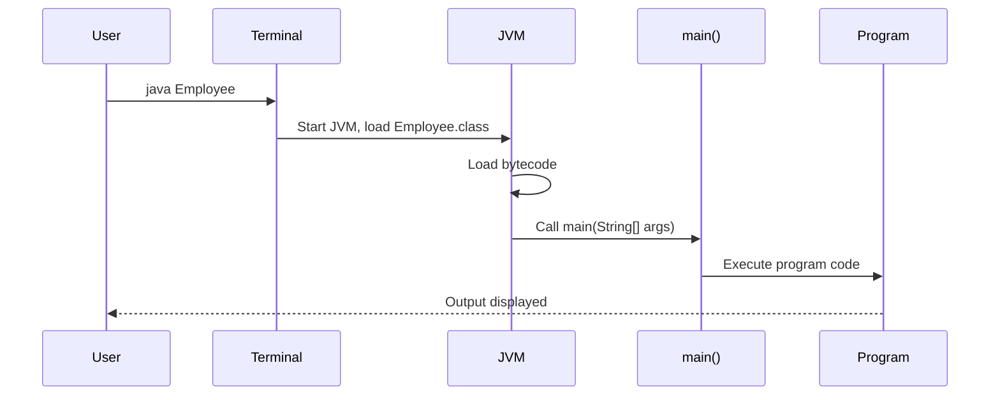

---

## 6.3 Comments in Java

Comments are lines that the **compiler ignores**. They are purely for human readers — they do not affect program execution.

### Types of Comments

#### 1. Single-Line Comment

```java
// This is a single-line comment
int a = 10;  // This comment is after code on the same line
```

Use `//` — everything after it on that line is ignored by the compiler.

#### 2. Multi-Line Comment

```java
/* This is a multi-line comment.
   It can span multiple lines.
   The compiler ignores everything between the opening and closing. */
int a = 10;
```

Use `/* ... */` — everything between the `/*` and `*/` is ignored.

#### 3. Javadoc Comment (special multi-line)

```java
/**
 * This is a Javadoc comment.
 * Used to generate API documentation automatically.
 * @param name The name of the employee
 * @return void
 */
public void setName(String name) {
    // ...
}
```

Used with the `javadoc` tool to auto-generate HTML documentation.

---

### Comment Comparison Table

| Type | Syntax | Spans Multiple Lines? | Use Case |
|---|---|---|---|
| Single-line | `// comment` | ❌ No | Quick notes, end-of-line remarks |
| Multi-line | `/* comment */` | ✅ Yes | Longer explanations, disabling code blocks |
| Javadoc | `/** comment */` | ✅ Yes | API documentation generation |

---

## 6.4 Variables and Output

### Declaring a Variable

```java
int a = -10;
```

| Part | Meaning |
|---|---|
| `int` | Data type — integer (whole number) |
| `a` | Variable name |
| `=` | Assignment operator |
| `-10` | Value assigned |
| `;` | Statement terminator (required in Java) |

---

### Printing to Console

```java
System.out.println("This is my first program and output of a is " + a);
```

| Part | Meaning |
|---|---|
| `System` | A built-in class in `java.lang` package |
| `out` | A static field of `System` — represents the standard output stream (console) |
| `println` | Method that prints the argument and then moves to a new line |
| `"..."` | String literal — text in double quotes |
| `+` | String concatenation operator — joins text with variable value |
| `a` | Variable whose value is appended to the string |

---

### `println` vs `print`

| Method | Behavior |
|---|---|
| `System.out.println(x)` | Prints `x` and moves to the **next line** |
| `System.out.print(x)` | Prints `x` but **stays on the same line** |

---

## 6.5 Compiling and Running

### The Complete First Program

```java
public class Employee {

    public static void main(String[] args) {

        // Single-line comment — compiler ignores this
        
        /* Multi-line comment
           This is also ignored by compiler */

        int a = -10;

        System.out.println("This is my first program and output of a is " + a);
    }
}
```

---

### Step-by-Step Execution

**Line 1:** `public class Employee {`
- Declares a public class named `Employee`
- File must be named `Employee.java`

**Line 3:** `public static void main(String[] args) {`
- Declares the entry point method
- JVM will call this when the program starts

**Lines 5-8:** Comments
- Completely ignored by compiler
- No effect on execution

**Line 10:** `int a = -10;`
- Declares an integer variable `a` and assigns it the value `-10`
- Memory is allocated on the stack for variable `a`

**Line 12:** `System.out.println(...)`
- Evaluates the expression `"This is my first program and output of a is " + a`
- The `+` operator converts `a` (which is `-10`) to a String `"-10"` and concatenates
- Result: `"This is my first program and output of a is -10"`
- `println` prints this string to the console and moves to a new line

---

### Output

```
This is my first program and output of a is -10
```

---

### Compiling from Terminal

```bash
# Step 1: Navigate to the directory containing Employee.java
cd /path/to/your/project

# Step 2: Compile the source file
javac Employee.java

# After this, Employee.class appears in the same directory
# (You can verify by listing files: ls or dir)

# Step 3: Run the compiled bytecode
java Employee
```

> [!NOTE]
> When compiling: `javac Employee.java` (include the `.java` extension)
> When running: `java Employee` (do NOT include `.class` extension)

---

### What Happens in the File System

**Before compilation:**
```
project/
└── Employee.java    ← source file (you wrote this)
```

**After compilation:**
```
project/
├── Employee.java    ← source file (unchanged)
└── Employee.class   ← bytecode (generated by javac)
```

---

### Critical Observation: `.java` vs `.class`

> [!WARNING]
> If you modify `Employee.java` but do NOT recompile, the output will NOT change.
> 
> JVM reads ONLY the `.class` file (bytecode), NOT the `.java` file.

**Demonstration:**

```bash
# Initial state: a = -10
java Employee
# Output: This is my first program and output of a is -10

# Now change the source: a = -11 (save Employee.java)
# But DO NOT recompile

java Employee
# Output: This is my first program and output of a is -10   ← STILL -10!
# Because Employee.class hasn't been updated yet

# Now recompile
javac Employee.java

java Employee
# Output: This is my first program and output of a is -11   ← NOW -11
```

This demonstrates perfectly that JVM executes bytecode (`.class`), not source code (`.java`).

---

# 7. Platform Dependence vs. Platform Independence

## Summary Diagram

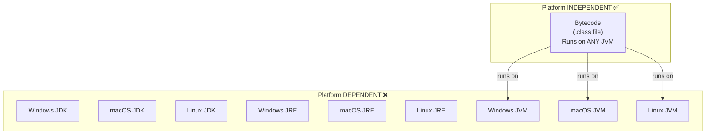

---

## The Magic Explained

1. **You write** `Employee.java` on any machine
2. **You compile** it once → `Employee.class` (bytecode)
3. The `.class` file is **platform independent** — it is the same on every OS
4. **You take** the `.class` file to any system that has a JVM
5. **That JVM** (which is platform-specific) translates the bytecode to native machine code
6. **The program runs** — same output, any platform

This is WORA in action.

---

# 8. Summary Tables and Diagrams

## Complete Architecture Mind Map

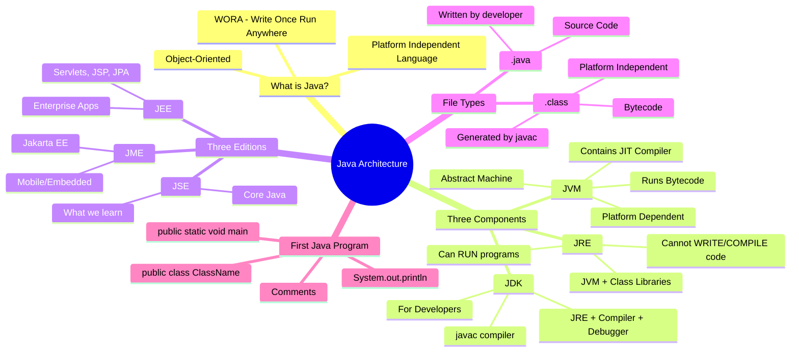

---

## Java Execution Flow Summary

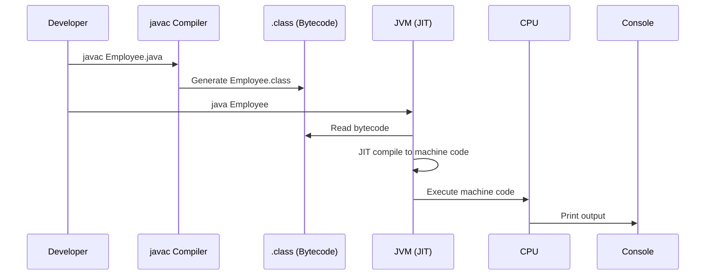

---

# 9. Common Mistakes

## Mistake 1: File Name Doesn't Match Class Name

```java
// File: emp.java  ← WRONG
public class Employee {   // Class name is Employee but file is emp.java
    // ...
}
```

**Error:** `class Employee is public, should be declared in a file named Employee.java`

**Fix:**
```java
// File: Employee.java  ← CORRECT
public class Employee {
    // ...
}
```

---

## Mistake 2: Running Without Compiling First

```bash
java Employee   # ← WRONG — running before compiling
```

**Error:** `Error: Could not find or load main class Employee`

**Fix:**
```bash
javac Employee.java   # compile first
java Employee         # then run
```

---

## Mistake 3: Including `.class` Extension When Running

```bash
java Employee.class   # ← WRONG
```

**Error:** `Error: Could not find or load main class Employee.class`

**Fix:**
```bash
java Employee   # ← CORRECT — no extension
```

---

## Mistake 4: Forgetting to Recompile After Editing

```bash
# Edited Employee.java (changed value from -10 to 100)
java Employee   # ← runs old .class file, shows -10 not 100
```

**Fix:** Always recompile after editing source code:
```bash
javac Employee.java   # recompile
java Employee         # run updated version
```

---

## Mistake 5: Wrong `main` Method Signature

```java
// WRONG — various incorrect signatures
static void main(String[] args) { }           // missing public
public void main(String[] args) { }           // missing static
public static void Main(String[] args) { }    // capital M — wrong name
public static int main(String[] args) { }     // wrong return type
public static void main() { }                 // missing String[] args
```

**Fix:** The signature must be **exactly**:
```java
public static void main(String[] args) { }
```

> [!NOTE]
> Since Java 21, `void main()` (without `public static` and `String[] args`) works as a preview feature for simple programs. But for standard Java, always use the full signature.

---

## Mistake 6: Confusing Platform Independence of JVM vs Bytecode

> [!WARNING]
> A very common misconception:
> 
> ❌ "JVM is platform independent" — **WRONG**
> 
> ✅ "Java bytecode (.class files) is platform independent" — **CORRECT**
> 
> ✅ "JVM is platform dependent" — **CORRECT**

---

# 10. Best Practices

1. **Always name your file exactly as your public class** — Java requires this.
2. **Always recompile after changes** — JVM runs bytecode, not source code.
3. **Use meaningful variable names** — `employeeAge` is better than `a`.
4. **Always use comments** for non-obvious code sections.
5. **Use Java's class libraries** — don't reinvent the wheel. `Arrays.sort()`, `Math.abs()`, etc. are already tested and optimized.
6. **Download JDK from official Oracle website** — avoid unofficial sources.
7. **Keep one public class per file** — Java enforces this; it's also good organization.
8. **Understand that `main` is the entry point** — structure your program's logic to flow naturally from `main`.

---

# 11. Interview Notes

## Commonly Asked Questions

### Q1: What is Java?
**Answer:** Java is a platform-independent, object-oriented programming language. Its biggest advantage is portability, captured by WORA — Write Once, Run Anywhere. This is achieved through bytecode and JVM.

---

### Q2: What is the difference between JVM, JRE, and JDK?
**Answer:**
- **JVM** — Abstract machine that executes bytecode. Contains JIT compiler. Platform dependent.
- **JRE** — JVM + Class Libraries. Can run Java programs. Cannot develop them.
- **JDK** — JRE + Compiler (javac) + Debugger. Required for development.

---

### Q3: Is JVM platform independent?
**Answer:** No. JVM is **platform dependent**. You need a specific JVM for each OS (Windows, macOS, Linux). However, **Java bytecode (.class files) is platform independent** — the same bytecode can run on any JVM.

---

### Q4: What is bytecode?
**Answer:** Bytecode is the intermediate, platform-independent code generated by the Java compiler (`javac`) from `.java` source files. It is stored in `.class` files and is the input to the JVM. The JVM's JIT compiler converts it to native machine code at runtime.

---

### Q5: Why is `main` method `public static void`?
**Answer:**
- `public` — JVM must be able to call it from outside the class/package
- `static` — JVM calls it without creating an object of the class first
- `void` — It doesn't return any value to JVM

---

### Q6: What is WORA?
**Answer:** WORA = Write Once, Run Anywhere. It means you write Java source code once, compile it to bytecode once, and that bytecode can run on any system that has a JVM — regardless of the underlying OS or hardware.

---

### Q7: What is the difference between `.java` and `.class` files?
**Answer:**
- `.java` — Source file written by the developer in Java syntax
- `.class` — Bytecode file generated by `javac` compiler; this is what JVM reads and executes

---

### Q8: What is JIT Compiler?
**Answer:** JIT (Just-In-Time) Compiler is a component inside the JVM that converts bytecode to native machine code at **runtime**. Unlike the `javac` compiler (which compiles before execution), JIT compiles during execution, enabling performance optimizations.

---

### Q9: What happens if you change `.java` but don't recompile?
**Answer:** The output does not change. JVM reads only the `.class` (bytecode) file. Changes to `.java` have no effect until you recompile using `javac`.

---

### Q10: What are the three Java editions?
**Answer:**
- **JSE** — Java Standard Edition (Core Java) — what developers learn/use daily
- **JEE** — Java Enterprise Edition — adds Servlets, JSP, JPA, Transactions for large apps
- **JME** — Java Micro/Mobile Edition — for mobile and resource-constrained devices (now Jakarta EE)

---

# 12. Practice Questions

## Easy

1. What does WORA stand for? What makes Java WORA?
2. What is the file extension of a Java source file? A bytecode file?
3. What command compiles a Java file named `Hello.java`?
4. What command runs a compiled Java class named `Hello`?
5. What is the role of the `main` method?
6. Which component of JDK is used for compilation?
7. Can you run a Java program with just JRE? Can you write and compile one?

## Medium

8. Explain the complete flow from writing Java code to seeing output on the console.
9. Why is JVM platform dependent but Java programs are platform independent?
10. What is the difference between JRE and JDK? When would you install each?
11. Why must `main` be `static`? What would happen if it weren't?
12. What does the JIT compiler do and when does it run?
13. You modified `Employee.java` and saved it. Without recompiling, what will `java Employee` output?

## Hard

14. A colleague claims "JVM is platform independent because Java is platform independent." How would you correct this misunderstanding with a clear explanation?
15. Explain why Java's two-step compilation (source → bytecode → machine code) is both a strength and potentially a performance concern, and how JIT mitigates the concern.
16. What would happen at runtime if your bytecode calls `Arrays.sort()` but the `java.util` library is not available? Where in JVM's architecture does library resolution happen?
17. Design a diagram showing how a Java program written on a Linux machine can be run on Windows without any changes to the source or bytecode.
18. If JVM is platform dependent, how does Oracle (or OpenJDK) provide JVM for so many different platforms? What does each platform-specific JVM implementation do?

---

# 13. Quick Revision Summary

```
☕ JAVA OVERVIEW — KEY POINTS

✅ Java = Platform Independent + OOP Language
✅ WORA = Write Once, Run Anywhere = Portability

📦 THREE COMPONENTS:
   JVM = Executes bytecode (platform DEPENDENT)
   JRE = JVM + Class Libraries (can run programs)
   JDK = JRE + Compiler + Debugger (can develop programs)

📁 FILE TYPES:
   .java = Source code (you write this)
   .class = Bytecode (compiler generates this)

🔄 EXECUTION FLOW:
   .java → javac → .class → JVM → JIT → Machine Code → Output

📱 THREE EDITIONS:
   JSE = Core Java (what we learn)
   JEE = Enterprise (Servlets, JPA, Transactions)
   JME = Mobile/Embedded (Jakarta EE)

⚠️ CRITICAL RULES:
   • File name = Public class name
   • One public class per file
   • main = entry point (JVM calls it first)
   • public static void main(String[] args)
   • Always recompile after editing source code

💡 INTERVIEW TRICK:
   • JVM is platform DEPENDENT
   • Bytecode (.class) is platform INDEPENDENT
   • Java (the language/program) is platform INDEPENDENT
```

---

*End of Chapter — Java Overview*

---

> [!TIP]
> **Next Steps:** In the upcoming lectures, you'll dive into:
> - Classes and Objects in detail
> - Access Modifiers (public, private, protected, default)
> - Static vs. Instance members
> - Constructors
> - The four pillars of OOP in Java

---

*Study Guide generated from: Java Basics to Advanced — Lecture 2: Java Overview*
