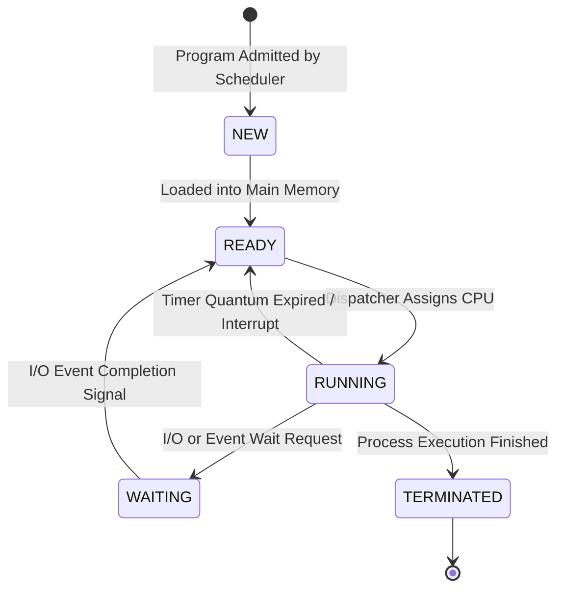

# 4. Operating System (OS)

---

4 OPERATING SYSTEM

## 1. Introduction

Operating System is software that works as an interface between a user and the  computer hardware. The primary
objective of an operating system is to make computer system convenient to use and to utilize computer hardware in
an efficient manner. The operating system performs the  basic tasks such as receiving input from the keyboard,
processing instructions and sending output to the screen.

1.1. FUNCTIONS OF OPERATING SYSTEM:

- **Memory Management** — Processor Management

- **Device Management** — File Management

- **Security** — Control over system performance

- **Job accounting** — Error detecting aids

- Coordination between other software and users

1.2. TYPES OF OPERATING SYSTEM:
(a) Batch operating system
The users of a batch operating system do not interact with the computer directly. Each user prepares h is job on an
off-line device like punch cards an d submits it to the computer operator. To speed up processing, jobs with similar
needs are batched together and run as a group. The programmers leave their programs with the operator and the
operator then sorts the programs with similar requirements into batches.
The problems with Batch Systems are as follows −

- Lack of interaction between the user and the job.

- CPU is often idle, because the speed of the mechanical I/O devices is slower than the CPU.

- Difficult to provide the desired priority.

(b) Time-sharing operating systems
Time-sharing is a technique which enables many people, located at various terminals, to use a particular computer
system at the same time. Time -sharing or multitasking is a logical extens ion of multiprogramming. Processor's t ime
which is shared among multiple users simultaneously is termed as time-sharing.

The main difference between Multiprogrammed Batch Systems and Time -Sharing Systems is that in case of
Multiprogrammed batch systems, the objective is to maximize processor u se, whereas in Time -Sharing Systems, the
objective is to minimize response time.

Multiple jobs are executed by the CPU by switching between them, but the switches occur so frequently. Thus, the
user can receive an imm ediate response. For example, in a tra nsaction processing, the processor executes each user
program in a short burst or quantum of computation. That is, if  n users are present, then each user can get a time
quantum. When the user submits the command, the response time is in few seconds at most.
Computer systems that were designed primarily as batch systems have been modified to time-sharing systems.
Advantages of Timesharing operating systems are as follows −

- Provides the advantage of quick response.

- Avoids duplication of software.

- Reduces CPU idle time.
Disadvantages of Time-sharing operating systems are as follows −

- Problem of reliability.

- Question of security and integrity of user programs and data.

- Problem of data communication.

(c) Multiprocessor system
A multiprocessor system consists of several processors that share a common physical memory. Multiprocessor system
provides higher computing power and speed. In multiprocessor system all processors operate under single operating
system. Multiplicity of the processors and how they do act together are transparent to the others.
Following are some advantages of this type of system.

- **Enhanced performance** — Execution of several tasks by different processors concurrently, increases the system's throughput without
speeding up the execution of a single task.

- If possible, system divides task into many subtasks and then these subtasks can be executed in parallel in different
processors. Thereby speeding up the execution of single tasks.

(d)Distributed operating System
Distributed systems use multiple central processors to serve multiple real -time applications and multiple users. Data
processing jobs are distributed among the processors accordingly.
Processors in a distributed system may vary in size and function. These  processors are referred as sites, nodes,
computers, and so on.
The motivation behind developing distributed operating system is the availability of pow er and inexpensive
microprocessor and advances in communication technology.

The advantages of distributed systems are as follows −

- With resource sharing facility, a user at one site may be able to use the resources available at another.

- Speedup the exchange of data with one another via electronic mail.

- If one site fails in a distributed system, the remaining sites can potentially continue operating.

- Better service to the customers.

- Reduction of the load on the host computer.

- Reduction of delays in data processing.

(e) Real Time operating System
A real-time system is defined as a data processing system in which the time interval required to process and respond
to inputs is so small that it controls the environment. The time taken by the system to respond to an input and display
of required updated information is termed as the response time. So, in this method, the response time is very less as
compared to online processing.

Real-time systems are used when there are rigid time requirements on the operation of a processor or the flow of data
and real-time systems can be used as a control device in a dedicated  application. A real-time operating system must
have well-defined, fixed time constraints, otherwise the system will fail. For example, Scientific experiments, medical
imaging systems, industrial control systems, weapon systems, robots, air traffic control systems, etc.
There are two types of real-time operating systems.

Hard real-time systems
Hard real-time systems guarantee that critical tasks complete on time. In hard real-time systems, secondary storage is
limited or missing, and the data is stored in ROM. In these systems, virtual memory is almost never found.

Soft real-time systems
Soft real -time systems are less restrictive. A critical real -time task gets priority over other tasks and retains the
priority until it completes. Soft real -time systems h ave limited utility than hard real -time systems. For example,
multimedia, virtual reality, Advanced Scientific Projects like undersea exploration and planetary rovers, etc.

(f)Embedded Operating System:
These are embedded in a device, which is located in ROM. These are applicable and developed only for the needed
resources and accordingly developed. These OS are less resource intensiv e. Mainly, applicable in appliances like
microwaves, washing machines, traffic control systems etc.

1.3. Tasks of OS:

## 1. Process Management

### Visual Concept: 5-State Process Lifecycle & Interrupt Transitions

> [!IMPORTANT]
> **Context Switching Overhead**: When switching CPU execution between processes, the operating system saves the active process state into its Process Control Block (PCB) and loads the saved PCB of the newly scheduled process.:
The operating system manages many kinds of activities ranging from user programs to system programs.
Each of these activities is encapsulated in a process. There are many processes can be running the same program. The
five major activities of an operating system in regard to process management are

- Creation and deletion of user and system processes.

- Suspension and resumption of processes.

- A mechanism for process synchronization.

- A mechanism for process communication.

- A mechanism for deadlock handling.

2.Memory Management:

- Keeping track of which parts of memory are currently being used and by whom.

- Deciding which processes (or parts thereof) and data to move into and out of memory.

- Allocating and reallocating memory space as needed.

## 3. Device Management:
The assembling-disassembling of I/O peripherals devices are managed by the OS.

## 4. Storage Management:
The three major activities of an operating system in regard to secondary storage management are:

- Managing the free space available on the secondary-storage device.

- Allocation of storage space when new files have to be written.

- Scheduling the requests for memory access.

1.4. Operating System - Services
An Operating System provides services to both the users and to the programs.

- It provides programs an environment to execute.

- It provides users the services to execute the programs in a convenient manner.
Following are a few common services provided by an operating system −

- **Program execution** — I/O operations

- **File System manipulation** — Communication

- **Error Detection** — Resource Allocation

- Protection

Program execution
Operating systems handle many kinds of activities from user programs to system programs like printer spooler, name
servers, file server, etc. Each of these activities is encapsulated as a process.
A process includes the complete execution context (code to execute, data to manipulate, registers, OS resources in use).
Following are the major activities of an operating system with respect to program management −

- Loads a program into memory.

- Executes the program.

- Handles program's execution.

- Provides a mechanism for process synchronization.

- Provides a mechanism for process communication.

- Provides a mechanism for deadlock handling.

I/O Operation
An I/O subsystem comprises of I/O devices and their corresponding driver software. Drivers hide the peculiarities of
specific hardware devices from the users.
An Operating System manages the communication between user and device drivers.

- I/O operation means read or write operation with any file or any specific I/O device.

- Operating system provides the access to the required I/O device when required.

File system manipulation
A file represents a collection of related information. Computers can store files on the disk (secondary storage), for
long-term storage purpose. Examples of storage media include magnetic tape, magnetic disk and opt ical disk drives
like CD, DVD. Eac h of these media has its own properties like speed, capacity, data transfer rate and data access
methods.
A file system is normally organized into directories for easy navigation and usage. These directories may contain files
and other directions. Following are the major activities of an operating system with respect to file management −

- Program needs to read a file or write a file.

- The operating system gives the permission to the program for operation on file.

- **Permission varies from read** — only, read-write, denied and so on.

- Operating System provides an interface to the user to create/delete files.

- Operating System provides an interface to the user to create/delete directories.

- Operating System provides an interface to create the backup of file system.

Communication
In case of distributed systems which are a collection of processors that do not share memory, peripheral devices, or a
clock, the operating system manages communications between all the processes. Multiple processes communicate
with one another through communication lines in the network.
The OS handles routing and connection strategies, and the problems of contention and security. Following are the
major activities of an operating system with respect to communication −

- Two processes often require data to be transferred between them

- Both the processes can be on one computer or on different computers, but are connected through a computer
network.

- Communication may be implemented by two methods, either by Shared Memory or by Message Passing.

Error handling
Errors can occur anytime and anywhere. An error may occur in CPU, in I/O devices or in the memory hardware.
Following are the major activities of an operating system with respect to error handling −

- The OS constantly checks for possible errors.

- The OS takes an appropriate action to ensure correct and consistent computing.

- Resource Management
In case of multi-user or multi-tasking environment, resources such as main memory, CPU cycles and files storage are
to be allocated to each user or job. Following are the major activities of an operating system with respect to resource
management −

- The OS manages all kinds of resources using schedulers.

- CPU scheduling algorithms are used for better utilization of CPU.

Protection
Considering a computer system having mul tiple users and concurrent execution of multiple processes, the various
processes must be protected from each other's activities.
Protection refers to a mechanism or a way to control the access of programs, pr ocesses, or users to the resources
defined by a computer system. Following are the major activities of an operating system with respect to protection −

- The OS ensures that all access to system resources is controlled.

- The OS ensures that external I/O devices are protected from invalid access attempts.

- The OS provides authentication features for each user by means of passwords.

## 2. Process Management:

A program in execution is a process. A process is executed sequentially, one instruction at a time. A program is a
passive entity. For example, a file on the  disk. A process on the other hand is an active entity. In addition to program
code, it includes the values of the program counter, the contents of the CPU registers, the global variables in the data
section and the contents of the stack that is used for s ubroutine calls. A program becomes a process when the
executable file of a program is loaded in memory. There can be a possibility in large programs that more than one
process is needed to completely r un the program, but there are nevertheless considered t wo separate execution
sequences.
Process after being loaded in memory, the above diagram shows the process memory state when it is in execution.
The stack region is used to store temporary data being u sed by the process. The Heap is the dynamic memory regi on
i.e. i.e. on run -time allocated to the process. It consumes the free space in memory (Random access memory). Data
region holds the computed results and values, and the global variables being used by  the process. The text region
holds the code or the executable instructions for the process.

2.1. PROCESS STATE

A process being an active entity changes state as execution proceeds. A process can be any one of the following states:

- New: Process being created.

- Running: Instructions being executed.

- Waiting: Process waiting for an event to occur.

- Ready: Process waiting for CPU.

- Terminated: Process has finished execution.
A state diagram is used to diagrammatically represent the states and also the events that trigger the change of state of
a process in execution.

### 2.2 PROCESS CONTROL BLOCK

Every process has a number and a process control block (PCB) represents a process in an operating system. The PCB
contains information that makes the process an active entity.
The PCB consists of the number of the process, i ts state, value of the program counter, contents of the CPU registers
and much more as given below. The PCB serves as a repository of information about a process and varies from
process to process.

Information associated with each process:
1. Process State – The state, may be any of the 5 states shown in process state diagram such as New, ready, running,
waiting and terminated.
2. Program Counter – It indicates the address of the next instruction to be executed for this process.
3. CPU registers - the registers hi ghly vary based on number and type and also depending on the computer
architecture. They include accumulators, index registers, stack pointers and general-purpose registers. Along with
the program counter, this state information must be saved when an inter rupt occurs to allow the process to be
continued correctly after it recovers from the interrupt.
4. CPU scheduling information – it includes information such as process priority, pointers to scheduling queues and
other scheduling parameters.
5. Memory-management information – this information contains value of base register and limit register, page
tables, segment tables. These tables are used for referring the right locations of memory to be used by the process.

6. Accounting information – this includes amount of p rocessor time and real time used, time limits, account
numbers etc.
7. I/O status information – This includes list of I/O devices allocated to the process, list of open files, etc.

2.3. Inter-process Communication

Processes executing concurrently in the ope rating system may be either independent process or cooperating process.
A process is called cooperating if it is affected by the other processes executing in the system, whereas it is called
Independent when its execution is not dependent on execution of o ther processes. Cooperating processes require
Inter-process communication (IPC) mechanisms that enable them to send and receive data. Since processes frequently
need to communicate wit h other processes therefore, there is a need for a well -structured communication, without
using interrupts, among processes. Inter-process communication has two models:
(a)Message passing system model
(b)Shared memory system model

Message passing is useful for exchanging smaller amounts of data, because no conflicts need be avoided. Message
passing is also easier to implement than is shared memory for intercomputer communication. Shared memory
allows maximum speed and convenience of communication. Shared  memory is faster than message passing, as
message-passing systems are typically implemented using system calls and thus require the more time-consuming
task of kernel intervention.

NOTE: If two processes want to communicate, a communication link must exist between them. This link can
be implements in a various ways. But we  are concerned here not with the link’s physical implementation, rather
with its logical implementation. Here are several methods for logically implementing a link and the send/ receive
operation.

## 1. Direct or Indirect Communication
Under Direct communication, Process A should explicitly name the recipient of the message i.e. Process B. In this
the send( ) and receive( ) are defined as
SEND ( A , MESSAGE ) – Sends a message to process A.
RECEIVE( B, MESSAGE) – Receive a message from process B.
Three characteristics of Direct communication
a) A link is automatically established between every pair of processes that want to communicate. The process
only needs to know about other process identity.
b) A link is established with exactly two of the processes.
c) Between each pair of process, there exists only a single link.

Under Indirect communication, messages are sent and received via mailboxes also known as ports. Mailboxes can
be simply understood as an object in which messages are temporarily stored by first process and removed by the
other process In Indirect communication, the send( ) and receive( ) are defined as
SEND (X, MESSAGE ) – Send/store message to mailbox X
RECEIVE(X, MESSAGE) – Receive/remove message from mailbox X
Three characteristics of Indirect communication
a) A link is established between every pair of processes only if both processes share a common mailbox.
b) A link can be established between two or more processes.
c) Between each pair of process, there may exists more than a single link

## 2. Synchronous or Asynchronous Communication
Communication between processes takes places through calls to send( ) and receive( ) calls. There are different
design options for implementing each function. Message passing may be either synchronous and asynchronous or
blocking and nonblocking.
Blocking Send – sending is blocking until the message. Is received by receiving process
Non-Blocking Send – sending process sends message and resumes operation
Blocking Receive – receiver blocks until a message is available
Non-Blocking Receive – receiver retrieves either a valid message or a NULL.

## 3. Automatic or Explicit Buffering
Whether communication is direct or indirect, mes sages exchanged by communicating processes reside in a
temporary queue. Depending on how the queue is implement ed, the method of execution of message -passing
model varies:
(a). Zero Capacity – Queue has a maximum length zero, hence link can’t have any mess ages waiting in it. So
sender must wait until recipient retrieves the message.
(b). Bounded Capacity – Finite size queue. Till queue is not full, sender can send messages. Receiver can retrieve
messages until queue is empty.
(c). Unbounded Capacity – Queue length is assumed to be infinite. Thus any number of messages can wait in it.
The sender is never delayed.

2.4. Client-Server Communication

In section above, we explained how communication was done between 2 processes via shared memory or message
passing model. This can be used for client – server communications as well, but we have special techniques available,
that is especially suited for client – server communication viz Sockets and Remote procedure calls.

#### 2.4.1 Sockets

- A socket is defined as an endpoint for communication

- It is a concatenation of IP address and port

- The socket 192.168.10.1:808 refers to port 808 on host 192.168.10.1

- Communication takes place between a pair of sockets

When a client process initiates a request for com munication, it is assigned a port by the host computer. This port is a
random number and is greater than 1024. The scenario ca n be something as shown in diagram above. The packets
travelling between the hosts are delivered to the appropriate process based on the destination port number. All
connection must be unique. Therefore, if another process also on host X wishes to establis h another communication
with the same web server, it would be assigned a port number greater than 1024, but not equal to 1625. Thi s thus
ensures all connections consist of a unique pair of sockets.

#### 2.4.2 Remote Procedure Calls

Remote procedure calls (RPC) is a powerful technique for constructing client-server based applications. It is based on
extending the notion of conventional, or local procedure calling, so that the called procedure need not exist in the
same address space as the calling procedure.

The two processes may be on the same system, or they may be on different systems with a network connecting them.
By using RPC, prog rammers of distributed applications avoid the details of the interface with the network. The
transport independence of RPC iso lates the application from the physical and logical elements of the data
communications mechanism and allows the application to use a variety of transports.
RPC is similar in many respects to IPC mechanism, and is often built on top of them. But usually RP C is used when
the processes are executing on two different systems, client and server. The RPC allows a user to do the
communication as if the processes are in same address space, and the complexity of the network, the
packing-unpacking of data packets from client-server-client is handled in background by the background stubs.

How RPC Works
An RPC is analogous to a function call. Like a function call, when an RPC is made, the calling arguments are passed to
the remote procedure and the caller waits for a response to be returned from the remote procedure. The client makes a
procedure call that sends a request to the server and waits. When the request arrives, the server calls a dispatch route
that performs the requested service, and sends the reply to the c lient. After the RPC call is completed, the client
program continues. RPC specifically supports network applications.
The diagram clearly explains how the remote procedure call works.

2.5. THREAD

A thread is a flow of execution through the process cod e, with its own program counter that keeps track of which
instruction to execute next, system registers which hold its current working variables, and a stack which contains the
execution history. A thread shares with its peer threads few information like c ode segment, data segment and open
files. When one thread alters a code segment memory item, all other threads see that.
A thread is also called a  lightweight process. Threads provide a way to improve application performance through
parallelism. Threads represent a software approach to improving performance of operating system by reducing the
overhead thread is equivalent to a classical process.
Each thread belongs to exactly one process and no thread c an exist outside a process. Each thread represents a
separate flow of control. Threads have been successfully used in implementing network servers and web server. They
also provide a suitable foundation for parallel execution of applications on shared memory multiprocessors.

2.5.1. Benefits
1. Responsiveness. Multithreading an interactive application may allow a program to continue running even if part
of it is blocked or is performing a lengthy operation, thereby increasing responsiveness to the user. For instance, a
multithreaded web browser could still allo w user interaction in one thread while an image was being loaded in
another thread.

2. Resource sharing. By default, threads share the memory and the resources of the process to which they belong.
The benefit of sharing code and data is that it allows an appl ication to have several different threads of activity
within the same address space.
3. Economy. Allocating memory and resources for process creation is costly. Because threads share resources of the
process to which they belong, it is more economical to create and context-switch threads. Empirically gauging the
difference in overhead can be difficult, but in general it is much more time consuming to create and manage
processes than threads. In Solaris, fo r example, creating a process is about thirty times slo wer than is creating a
thread, and context switching is about five times slower.
4. Utilization of multiprocessor architectures. The benefits of multithreading can be greatly increased in a
multiprocessor architecture, where threads may be running in parallel  on different processors. A single threaded
process can only run on one CPU, no matter how many are available. Multithreading on a multi -CPU machine
increases concurrency.

2.5.2. Types of Thread

## 1. User-Level Threads
User-level threads implement in user -level libraries, rather than via systems calls, so thread switching does not need
to call operating system and to cause interrupt to the kernel. In fact, the kernel knows nothing about user -level
threads and manages them as if they were single-threaded processes. Three primary thread libraries: POSIX Pthreads,
Win32 threads, Java threads.

Advantages

- Thread switching does not require Kernel mode privileges.

- User level thread can run on any operating system.

- Scheduling can be application specific in the user level thread.

- User level threads are fast to create and manage.

Disadvantages

- In a typical operating system, most system calls are blocking.

- Multithreaded application cannot take advantage of multiprocessing.

## 2. Kernel-Level Threads
In this method, the kernel knows about and manages the threads. No runtime system is needed in this case. Instead of
thread table in each process, the kernel has a thread table that keeps track of all threads in the system. In addition, the
kernel also maintains the tradition al process table to keep track of processes. Operating Systems kernel provides
system call to create and manage threads.
Examples: Windows XP/2000, Solaris, Linux, Tru64 UNIX, Mac OS X

Advantages:

- Because kernel has full knowledge of all threads, Schedule r may decide to give more time to a process having
large number of threads than process having small number of threads.

- **Kernel** — level threads are especially good for applications that frequently block.

Disadvantages:

- **The kernel** — level threads are slow and i nefficient. For instance, threads operations are hundreds of times slower
than that of user-level threads.

- Since kernel must manage and schedule threads as well as processes. It requires a full thread control block (TCB)
for each thread to maintain informa tion about threads. As a result, there is significant overhead and increased in
kernel complexity.

2.5.3. Multithread Model
As seen above, there may be user thread s, and kernel level threads. The way they can relate to each other in
multi-thread process are as follows,

## 1. Many-to-One Model:

- **In the many-to** — one model, many user-level threads are all mapped onto a single kernel thread.

- Thread management is handled by the thread library in user space, which is efficient in nature.

## 2. One to One Model:

- **The one-to** — one model creates a separate kernel thread to handle each and every user thread.

- Most implementations of this model place a limit on how many threads can be created.

- Linux and Windows from 95 to XP implement the one-to-one model for threads.

## 3. Many to Many Model :

- **The many-to** — many model multiplexes any number of user threads onto an equal or smaller number of kernel
threads, combining the best features of the one-to-one and many-to-one models.

- Users can create any number of the threads.

- Blocking the kernel system calls does not block the entire process.

- Processes can be split across multiple processors.

Difference between User-Level & Kernel-Level Thread:
User- Level  Thread  Kernel -level  Thread
User  thread  are  implemented  by  user  Kernel  thread  implemented by
operating system
User-level thread are faster to create and manage Kernel-level threads are slower to create
and manage
User-level thread is generic and can run on any operating system Kernel –level thread is specific to the
operating system
Multi-threaded application cannot take advantage of
multiprocessing
Kernel routines themselves can be
multithreaded
Context switch required no hardware support Hardware support is needed

2.5.4. Difference between Process and Thread:

Process Thread
Process is heavy weight or resource intensive. Thread is light weight, taking lesser resources than
a process.
Process switching needs interaction with operating system. Thread switching does not need to interact with
operating system.
In multiple processing environments, each process
executes the same code but has its own memory and file
resources.
All threads can share same set of open files, child
processes.
Multiple processes without using threads use more
resources.
Multiple threaded processes use fewer resources.
If one process is blocked, then no other process can execute
until the first process is unblocked.
While one thread is blocked and waiting, a second
thread in the same task can run.
In multiple processes each process operates independently
of the others.
One thread can read, write or change another
thread's data.

2.6. Schedulers

Schedulers are special system software which handles process scheduling in various ways. Their main task is to select
the jobs to be submitted into the system and to decide which process to run. Schedulers are of three types −

- **Long** — Term Scheduler: It is also called a  job scheduler. A long -term scheduler determines which programs are
admitted to the system for processing. It selects processes from th e queue and loads them into memory for
execution. Process loads into the memory for CPU scheduling. The primary objective of the job scheduler is to
provide a balanced mix of jobs, such as I/O bound and processor bound. It also controls the degree of
multiprogramming. If the degree of multiprogramming is stable, then the average rate of proce ss creation must
be equal to the average departure rate of processes leaving the system.

- **Short** — Term Scheduler: It is also called as CPU scheduler. Its main objective is to increase system performance in
accordance with the chosen set of criteria. It is the  change of ready state to running state of the process. CPU
scheduler selects a process among the processes that are ready to execute and allocates CPU to one of them.
Short-term schedulers, also known as dispatchers, make the decision of which process    to execute next.
Short-term schedulers are faster than long-term schedulers.

- **Medium** — Term Scheduler: This scheduler removes the processes from memory (and from active contention for
the CPU), and thus reduces the degree of multiprogramming. At some later time, the process can be reintroduced
into memory and its execution van be continued where it left off. This scheme is called  swapping. The process is
swapped out, and is later swapped in, by the medium -term scheduler. Swapping may be necessary to improve
the process mix, or because a change in memory requirements has overcommitted available memory, requiring
memory to be freed up. This complete process is descripted in the below diagram:

2.7. Dispatcher:

Another component involved in the CPU-scheduling function is the dispatcher. The dispatcher is the module that gives
control of the CPU to the process selected by the short-term scheduler. This function involves the following:

- **Switching context** — Switching to user mode

- Jumping to the proper location in the user program to restart that program
The dispatcher should be as fast as possible, since it is invoked during every process switch. The time it takes for the
dispatcher to stop one process and start another running is known as the dispatch latency.

2.8. Scheduling Criteria

Many criteria exist for comparing and deciding on CPU scheduling algorithms. Which characteristics are used for
comparison can make a substantial d ifference in which algorithm is judged to be best. The criteria include the
following:
1. CPU utilization: We want to keep the CPU as busy as possible. Conceptually, CPU utilization can range from 0 to
100 percent. In a real system, it should range from 40 pe rcent (for a lightly loaded system) to 90 percent (for a
heavily used system).

2. Throughput: If the CPU is busy executing processes, then work is being done. One measure of work is the
number of processes that are completed per time unit, called throughput. For long processes, this rate may be one
process per hour; for short transactions, it may be 10 processes per second.

3. Turnaround time: From the point of view of a particular process, the important criterion is how long it takes to
execute that process. Th e interval from the time of submission of a process to the time of completion is the
turnaround time. Turnaround time is the sum of the periods spent waiting to get into memory, waiting in the
ready queue, executing on the CPU, and doing I/O.

5. Waiting time: The CPU scheduling algorithm does not affect the amount of time during which a process executes
or does I/O; it affects only the amount of time that a process spends waiting in the ready queue. Waiting time is
the sum of the periods spent waiting in the ready queue.

6. Response time: In an interactive system, turnaround time may not be the best criterion. Often, a process can
produce some output fairly early and can continue computing new results while previous results are being output
to the user. Thus, an other measure is the time fr om the submission of a request until the first response is
produced. This measure, called response time, is the time it takes to start responding, not the time it takes to
output the response. The turnaround time is generally limited by the speed of the output device.

It is needed to maximize the CPU utilization and the throughput and also to minimize turnaround time, waiting time,
and response time. In most cases, we optimize the average measure.

2.9. Scheduling Algorithms:

## 1. First Come First Serve Scheduling
The simplest of all scheduling algorithm is the first come first serve algorithm also known as FCFS. It implies that, the
process that request for CPU firsts, gets the CPU allocated to it firsts. It can be easily impleme nted using a Queue
(FIFO).
Average waiting time is usually high in case of FCFS.

Example 1: Let processes come in order P1, P2, P3 and request for CPU
process Burst time
P1    24
P2   3
P3  3

If process arrive in the order P1, P2, P3 and are server in FCFS order, the result is:

P1   P2     P3
0                                             24               27                     30

The waiting time is 0 milliseconds for process P1, 24 milliseconds for process P2 and 27 milliseconds for process P3.
Thus, the average waiting time is - (0+24+27)/3= 17 milliseconds
If the processes arrive in the order P2, P3, P1, however, the result will be shown:

P2 P3                                           P1
0            3     6                30
The average waiting time is now (6+0+3)/3=3 milliseconds
This reduction is substantial. Thus, the average waiting times under FCFS policy is generally not minimal and varies
substantially if the process's CPU burst times vary greatly.

The FCFS scheduling algorithm is nonpreemptive. Once the CPU has been allocated for a process that process keeps
the CPU until it releases the CPU either by terminating or by requesting I/O. The FCFS algorithm is thus particularly
troublesome for time-sharing systems, where it is important that each user get a share of the CPU at regular intervals.
It would be disastrous to allow one process to keep the CPU for an extended period.

## 2. Shortest Job First Scheduling

This algorithm associates with each process the length of the proce ss's next CPU burst. When the CPU is available, it
is assigned to the process that has the smallest next CPU burst. If the next CPU bursts of two processes are the same,
FCFS scheduling is used to break the tie. Note that a more appropriate term for this s cheduling method would be the
shortest-next-CPU-burst algorithm, because scheduling depends on the length of the next CPU burst of a process,
rather than its total length.

Shortest Job First Scheduling algorithm is the best approach to minimize waiting time.

But, the real difficulty with the SJF algorithm knows the length of the next CPU request. Although the SJF algorithm is
optimal, it cannot be implemented at the level of short -term CPU scheduling. There is no way to know the length of
the next CPU burst, but we can predict it; i.e. we may not know the length of the next CPU burst, but we may be able
to predict its value. We expect that the next CPU burst will be similar in length to the previous ones. Thus, by
computing an approximation of the length of the next CPU burst, we can pick the process with the shortest predicted
CPU burst.
The SJF algorithm may be preemptive or non-preemptive depending on the kernel, or CPU requirement.

Example: consider the following set of processes, with the length of the CPU burst given in milliseconds:
Process Burst
time
P1 6
P2 8
P3 7
P4 3

Using SJF scheduling, we would schedule these process:

P4 P1 P3 P2
0      3    9  16  24

The waiting time is 3 milliseconds for process P1, 16 milliseconds for process P2, 9 milliseconds for process P3, and 0
milliseconds for process P4.
Thus the average waiting time is- (3+16+9+0)/4= 7 milliseconds
The average waiting time of SJF is less in comparison to FCFS.

3.Priority Scheduling
In this CPU scheduling algorithm, a priority is associated with each process, and the CPU is allocated to the process
with the highest priority. Equal-priority processes are scheduled in FCFS order. We can think of priority algorithm as
simply a SJF algorithm where th e priority (p) is the inverse of the (predicted) next CPU burst. The larger the CPU
burst, the lower the priority, and vice versa. Thus only difference is we decide on scheduling in terms of high priority
and low priority. Priorities are generally indicated by some fixed range of numbers, such as 0 to 7 or 0 to 4095.

Example:  consider the set of process P1, P2, P3, P4, P5.
Process Burst Time Priority
P1 10 3
P2 1 1
P3 2 4
P4 1 5
P5 5 2

Using priority scheduling we would schedule these process:

P2  P5                   P1             P3 P4

0       1             6                             16                 18       19

The average waiting time is-(6+0+16+18+1)/5= 8.2 milliseconds
Priority scheduling can be either preemptive or non -preemptive. When a process arrives at the r eady queue, its
priority is compared with the priority of the currently running process. A preemptive priority scheduling algorithm
will preempt the CPU if the priority of the newly arrived proce ss is higher than the priority of the current running
process.
A non preemptive priority scheduling algorithm will simply put the new process at the head of the ready queue. A
major problem with priority scheduling algorithms is of starvation. A process th at is ready to run but waiting for the
CPU can be considered blocked. A priority scheduling algorithm can leave some low -priority processes waiting
indefinitely. In a heavily loaded computer system, a steady stream of higher -priority processes can prevent a
low-priority process from ever getting the CPU. This is hig hly undesirable, and this problem can be solved by using
the concept of Aging of a process, which means that as the process waits in ready queue, it’s priority gradually keeps
on increasing. This ensures that even low priority process get CPU allocated to it, after some waiting time.

4.Round Robin Scheduling
The round-robin CPU scheduling algorithm is basically a preemptive scheduling algorithm designed for time-sharing
systems. One unit of time is called a time slice. Duration of a time slice may range be tween 10 milliseconds to about
100 milliseconds. The CPU scheduler allocates to each process in the ready queue one time slice at a time in a
round-robin fashion. Hence the name round-robin.
The ready queue in this case is a FIFO queue with new processes j oining the tail of the queue. The CPU scheduler
picks processes from the head of the queue for allocating the CPU. The first process at the head of the queue gets to
execute on the CPU at the start of the current time slice and is deleted from the ready queue. The process allocated the
CPU may have the current CPU burst either equal to the time slice or smaller than the time slice or greater than the
time slice. In the first two cases, the cur rent process will release the CPU on its own and there by the nex t process in
the ready queue will be allocated the CPU for the next time slice. In the third case, the current process is preempted,
stops executing, goes back and joins the ready queue at the tail there by making way for the next process.

Example:
Process  Burst Time
P1 24
P2 3
P3 3

If we use a time quantum of 4 milliseconds, then process P1 gets the first 4 milliseconds. since It require another 20
milliseconds, it is preempted after the first time quantum, the CPU is given to the next process in t he queue, process
P2. Process p2 does not need 4 milliseconds, so it quite before its time quantum expires. The CPU is given to the next
process, Process P3. Once each process  has received 1 time quantum, the CPU is returned to process P1 for an
additional time quantum.

P1 P2 P3 P1 P1 P1 P1 P1
0         4         7    10    14    18         22  26   30
The average waiting time for the above schedule. P1 waits for 6 milliseconds (10 -4), P2 waits for 4 milliseconds, and
P3 waits for 7 milliseconds.
Thus the average waiting time is - (6+4+7)/3 = 5.66 milliseconds

If there are n. processes in the ready que ue and the time quantum is q, then each process gets 1/n of the CPU time in
chunks of at most q time units. Each process must wait no longer than (n - 1) x  q time units until its next time
quantum. The performance of the RR algorithm is very much dependent on the length of the time slice. If the duration
of the time slice is indefinitely large then the RR algorithm is the same as FCFS algorithm. If the time slice is too small,
then the performance of the algorithm deteriorates because of the effect of frequent context switching.

## 5. MULTILEVEL QUEUE SCHEDULING:
Processes can be classified into groups. For example, interactive processes, system processes, batch processes, student
processes and so on. Processes belonging to a group have a specified priority. This algorithm partitions the ready
queue into as many separate queues as there are groups. Hence the name multilevel queue. Based on certain
properties is process is assigned to one of the ready queues. Each queue can have its own scheduling alg orithm like
FCFS or RR. For example, Queue for interactive processes could be scheduled using RR algorithm where queue for
batch processes may use FCFS algorithm. An illustration of multilevel queues is shown below

Queues themselves have priorities. Each  queue has absolute priority over low priority queues that is a process in a
queue with lower priority will not be executed until all processes in a queue with higher  priority have finished
executing.
This priority on the queues themselves may lead to starvation. To overcome this problem, time slices may be assigned
to queues when each queue gets some amount of CPU time. The duration of the time slices may be differen t for
queues depending on the priority of the queues.

## 6. MULTILEVEL FEEDBACK QUEUE SCHEDULING
In a multilevel queue -scheduling algorithm, processes are permanently assigned to a queue on entry to the system.
Processes do not move between queues. This setu p has the advantage of low scheduling overhead, but the
disadvantage of being inflexible.
Multilevel feedback queue scheduling, however, allows a process to move between queues. The idea is to separate
processes with different CPU -burst characteristics. If  a process uses too much CPU time, it will be moved to a
lower-priority queue. Similarly, a process that waits too long in a lower -priority queue may be moved to a
higher-priority queue. This form of aging prevents starvation.

An example of a multilevel feedback queue can be seen in the below figure.
In general, a multilevel feedback queue scheduler is defined by the following parameters:

- The number of queues.

- The scheduling algorithm for each queue.

- The method used to determine when to upgrade a process to a higher-priority queue.

- The method used to determine when to demote a process to a lower-priority queue.

- The method used to determine which queue a process will enter when that process needs service.
The definition of a multilevel feedback queue scheduler makes it the most general CPU-scheduling algorithm. It can be
configured to match a specific system under design. Unfortunately, it also requires some means of selecting values for
all the parameters to define the best scheduler. Although a multilevel feedback queue is the most general scheme, it is
also the most complex.

2.9.Process synchronization:

Process Synchronization means sharing system resources by processes in a such a way that, Concurrent access to
shared data is handled thereby minimizing the chance of inconsistent data. Maintaining data consistency demands
mechanisms to ensure synchronized execution of cooperating processes.

Race Condition
When several processes access and manipulate the same data concurrently, the outcome of the executio n depends
on the particular order in which the access takes place, is called race condition.
Example – Let’s take a common variable counter which is shared by 2 processes P1 and P2. At any instance, value
of counter is 7.
Also counter++ may be implemented in machine language as
register1 = counter
register1 = register1 + 1
counter= register1.
counter-- can be implemented in the same way.
Now P1 executes counter++ and at the same time P2 executes counter--.
The concurrent execution of both statements may be sequentially implemented as
register1 = counter
register1 = register1 + 1
register2 = counter
register2= register2 – 1
counter = register1
counter = register2
Thus depending on which statement gets executed first the value of counter, after the execution o f counter++ and
counter-- simultaneously, is 6, 7 or 8 i.e. unpredicta ble. Thus processes race to modify the shared variable and this
condition is called Race Condition.

Process Synchronization was introduced to handle problems that arose while multiple process executions. Some of the
problems are discussed below.

## 1. Critical Section
A critical section is a piece of code that accesses a shared resource (data structure or device), writing a file or updating
a table that must not be concurrently accessed b y more than one thread of execution. Thus, execution of critical
sections by the processes is mutually exclusive in time.
General structure of a process is:
do
{
Entry section
Critical section
Exit section
Remainder section
}while(TRUE);

Each process must  request permission to enter its critical section, which is done i n entry section. The critical section
problem is to design a protocol that the processes can use to co-operate. A solution to the critical section problem must
satisfy the three requirements:
1) Mutual Exclusion: If a process Pi is executing in its critical section, then no other process can enter it.
2) Progress: If no process is executing in its critical section and some processes wish to enter, then only those process
which are not in remainder section can enter and the selection cannot be postponed indefinitely.
3) Bounded Waiting: After a process makes a request to enter critical section, then there is a bound on the number of
times other processes are allowed to enter critical section before this process.

Software solution for critical section problem:
## 1. Two – process solution
The processes share two variables:
booleanflag[2];
int turn;
Initially flag[0]=flag[1]= false and turn can be 0 or 1;
do
{
flag[i] = true;
turn = j;
while (flag[j] && turn == j);

Critical section
flag[i] = false;
Remainder section
}while(TRUE);

## 2. Multiple process solution
This algorithm is also called Bakery algorithm. The common data structures for n processes is
boolean choosing: array [n];
int: array [n];
Initially, these data structures are initialized to false and 0, respectively. For convenience, the following notation is
used in the solution:
(a, b) < (c, d) if a < c or if a== c and b < d.
max(a0,a1..., an-1) is a number, k, such that k >= a ; for i = 0,..., n — 1
do
{
choosing[i] := true;
number[i] := max(number[Q], number^}, ..,, number[n — 1]) + 1;
choosing[i] := false;
for(j=0; j<n; j++)
{
while ( choosing [j] );
while ( (number[j]!=0) && (number[j], j)< (number[i], i) );
}
critical section
number[i] :=0;
remainder section
}while(1);

Hardware solution for critical section problem
Features of the hardware can make the programming task easier and improve system efficiency. The critical -section
problem could be solved simply in a uniprocessor environment i f we could disallow interrupts t o occur while a
shared variable is being modified. Unfortunately, this solution is not feasible in a multiprocessor environment.
Many machines provide special hardware instructions that allow us either to test and modify the content of a word, or
to swap the contents of two words, atomically.
The most common instructions provided by hardware are TestAndSet instruction and the Swap instruction.

The Test-and-Set instruction can be defined as
booleanTestAndSet (boolean&target) {
booleanrv = target;
target = true;
return rv;
}
The solution which satisfies all requirements of critical section problem is the following algorithm. Following data
structures are common with processes.
boolean waiting[n];
boolean lock;
In addition each process has a local boolean variable key.
Initially these data structures have value set to false.
do {
waiting[i] = true;
key = true;
while (waiting [i] && key)
key = TestAndSet (lock);
waiting[i] = false;
Critical section
j = (i+1) % n;
while ((j!=i) && !waiting[j])
j = (j+1) % n;
if ( j == i)

lock = false;
else
waiting[j] = false;
Remainder section
} while(1);

Semaphores
Semaphores are used for synchronization mechanisms. A semaphore is an integer variable that, apart from
initialization, is accessed only through two standard atomic operations: wait and signal.
Definition of wait and signal operation. Let S be a semaphore.
wait(S) {
While (S <= 0); // no-operation
S-- ;
}
signal(S) {
S++;
}
Using semaphores, implementing mutual exclusion becomes very easier.
do {
wait (mutex)
Critical section
signal (mutex)
Remainder section
} while (1);

In this solution, if a process is in critical section, then any other process trying to get into CS must loop continuously in
the entry code. This continuous looping is  called Busy Waiting and it wastes CPU cycles. This type of semaphore is
called Spinlock because the process spins while waiting for the lock.
Spinlocks are useful in multiprocessor systems where context switch is highly expensive and if locks are to be held for
smaller time than spinning is beneficial.

Binary Semaphores
A binary semaphore is a semaphore with an integer value that can range only between 0 and 1. A binary semaphore
can be simpler to implement rather than a counting semaphore, depending on the underlying hardware.

Bounded buffer problem
Bounded buffer problem is a classical synchronization problem for co -operating sequential processes. A perfect
example of co -operating sequential processes is producer and consumer processes. Producer produce s an item and
the consumer consumes. In bounded buffer environment producer cannot produces items more than the size of buffer
and consumer cannot consume items more than buffer size.
A shared memory solution to this problem exist which makes use of a shar ed variable co unter initialized to 0.
Producer can produce at max Buffer-1 items.
Code for Producer process
while (1) {
/* produce a newItem*/
while ( counter == Buffer_Size);
buffer [in] = newItem;
in = (in +1) % Buffer_Size;
counter ++;
}
Code for Consumer Process
while (1) {
while ( counter == 0);
item = buffer [out];
out = (out +1) % Buffer_Size;
counter --;
/* consume item */
}

Here buffer and counter variable is shared between the 2 processes and in and out are local variables for producer and
consumer respectively.
Although both producer and consumer codes are correct separately but on concurrent execution may not produce
correct result due to race condition as no proper synchronization mechanism exists.
Another solution to bounded buffer problem wher e there is no race condition exists. This solution makes use of
semaphores. In this problem it is assumed that there exist n buffers each of size 1 instead of a single buffer of size n.
Also, three semaphores are used. One is mutex used for providing mutua l exclusion in  critical section and it is
initialized to 1.
The empty and full semaphores count the number of empty and full buffers, and are initialized to n and 0
respectively.
The structure of producer process is
do {
produce an item
wait(empty);
wait(mutex);
add item to buffer
signal(mutex);
signaltfull);
}while(1);
The structure of consumer process is
do {
wait(full);
wait(mutex);
remove item from buffer
signal(mutex);
signal(empty);
consume the item
}while(1);

2.10.Deadlock
In a multiprogrammin g envi ronment, several processes may compete for a finite number of resources. A process
requests resources; if the resources are not available at that time, the process enters a wait state. It may happen that
waiting processes will never again change stat e, because the resources they have requested are held by other waiting
processes. This situation is called a deadlock.
A system consists of finite number of resources to be distributed among a number of competing resources. The
resources are partitioned into types each of which may have several instances.
A process must request a resource before using it and must release it after using it. A process can request as many
resources for carrying out its task; obviously this number has to be less than total avai lable resources. A system table
records whether each resource is free or allocated, and, if a resource is allocated, to which process. If a process
requests a resource that is currently allocated to another process, it can be added to a queue of processes waiting for
this resource.
A set of processes is in a deadlock state when every process in the set is waiting for an event that can be caused by
only another process in the set. The events with which we are mainly concerned here are resource acquisition an d
release. For example, consider a system with three tape drives. Suppose that there are three processes, each holding
one of these tape drives. If each process now requests another tape drive, the three processes will be in a deadlock
state. Each is waiti ng for the event "tape drive is released," which can be caused only by one of the other waiting
processes. This example illustrates a deadlock involving processes competing for the same resource type. Deadlocks
may also involve different resource types.

2.10.1. Necessary condition for deadlocks

A deadlock situation can arise if the following four conditions hold simultaneously in a system.
1. Mutual exclusion: At least one resource must be held in a non -sharable mode; that is, only one process at a time
can use th e resource. If another process requests that resource, the requesting process must be delayed until the
resource has been released.
2. Hold and wait: A process must be holding at least one resource and waiting to acquire additional resources that
are currently being held by other processes.

3. No preemption: Resources cannot be preempted; that is, a resource can be released only voluntarily by the
process holding it, after that process has completed its task.
4. Circular wait: There must exist a set {P1, P2, ..., Pn} of waiting processes such that P0 is waiting for a resource that
is held by P1, P1 is waiting for a resource that is held by P2,..., Pn -1 is waiting for a resource that is held by Pn ,
and Pn is waiting for a resource that is held by P0.

2.10.2. Resource Allocation Graph
A deadlock can be described more precisely in terms of a directed graph called a system resource allocation graph. In
this graph the vertices represent two different types of nodes, one for active processes and other for resourc es. A
directed edge from process Pi to resource type Rj denoted by Pi —>Rj signifies that process Pi requested an instance of
resource type Rj and is currently waiting for that resource. A directed edge from resource type Rj to process Pi
denoted by Rj —> Pi signifies that an instance of resource type Rj has been allocated to process Pi. A directed edge Pi
—>Rj is called, a request edge and a directed edge Rj —> Pi is called an assignment edge.

When process P, requests an instance of resource type R , a request edge is inserted in the resource -allocation graph.
When this request can be fulfilled, the request edge is instantaneously transformed to an assignment edge. When the
process no longer needs access to the resource it releases the resource, and as a result the assignment edge is deleted.

If the graph contains no cycles, then no process in the system is deadlocked. If, on the other hand, the graph contains a
cycle, then a deadlock may exist. If the cycle involves only a set of resource types, each of which has only a single
instance, then a deadlock has occurred. Each process involved in the cycle is deadlocked. In this case, a cycle in the
graph is both a necessary and a sufficient condition for existence of deadlock.

If each resource type has severa l instances, then a cycle does not necessarily imply that a deadlock occurred. In this
case, a cycle in the graph is a necessary but not a sufficient condition for the existence of deadlock.
If a resource-allocation graph does not have a cycle, then the sy stem is not in a deadlock state. On the other hand, if
there is a cycle, then the system may or may not be in a deadlock state.

2.10.3. Methods for handling deadlocks

Principally, there are three different methods for dealing with the deadlock problem:

- We can use a protocol to ensure that the system will never enter a deadlock state. To ensure this, the system can
use either deadlock prevention or deadlock avoidance scheme. Deadlock prevention is a set of methods for
ensuring that at least one o f the necessary conditions of deadlock cannot hold. Deadlock avoidance , on the other
hand, requires that the operating system be given in advance additional information concerning which resources
a process will request and use during its lifetime. With this additional knowledge, we can decide for each request
whether or not the process should wait.

- We can allow the system to enter a deadlock state and then recover. In this environment, the system can provide
an algorithm that examines the state of the syste m to determine wheth er a deadlock has occurred, and an
algorithm to recover (if a deadlock has indeed occurred) from the deadlock.

- We can ignore the deadlock problem all together, and pretend that they never occur in the system. This solution is
the one us ed by most operating  systems, including UNIX. Although this method does not seem to be a viable

approach to the deadlock problem, it is nevertheless used in some operating systems. In many systems, deadlocks
occur rarely (say, once per year); thus, it is c heaper to use this m ethod instead of the costly deadlock prevention,
deadlock avoidance, or deadlock detection and recovery methods that must be used constantly.

2.10.4. Deadlock Prevention

By ensuring that at least one of the necessary conditions cannot hold, deadlock can be prevented.
1) Mutual Exclusion – This condition must hold for non -sharable resources like printer, which cannot be used
simultaneously by several processes. Thus, deadlocks cannot be prevented b denying mutual exclus ion condition.
Some resources are intrinsically non-sharable.

2) Hold and Wait – To ensure that the hold -and-wait condition never occurs in the system, we must guarantee that,
whenever a process requests a resource, it does not hold any other resources. T his can be done in 2 ways. First, a
process should ask for all the resources it needs before it starts executing. Second, if it asks for a resource in between,
it must release all the resources previously held by it and then ask again for all the resources it needs.
These protocols have 2 main disadvantages –

- Resource utilization is low, since many resources may be held for long time, even when required for less time.

- Starvation is possible. A process needing many resources may not get a chance to execute a s getting many
resources may not be possible.

3) No Preemption – To ensure this condition does not hold, following protocol is followed. If a process requests some
resources, check whether they are available. If they are, allocate them. If they are not available, check whether they are
allocated to some other process that is waiting for additional resources. If so, preempt the desired resources from the
waiting process and allocate them to the requesting process. If the resources are not either available o r held by a
waiting process, the requ esting process must wait. While it is waiting, some of its resources may be preempted, but
only if another process requests them. This protocol cannot be applied to resources like printers and tape drives.

4) Circular Wait – To ensure that the circular-wait condition never holds, impose a total ordering of all resource types,
and ensure that each process requests resources in an increasing order of enumeration. Example - assign to each
resource type a unique in teger number, which allows to compare two reso urces and to determine whether one
precedes another in our ordering. Then the following protocol can be used to prevent deadlocks: Each process can
request resources only in an increasing order of enumeration. That is, a process can initially request any n umber of
instances of a resource type, say Ri. After that, the process can request instances of resource type Rj if and only if
F(Rj) > F(Ri). If several instances of the same resource type are needed, a single request for all of them must be issued.
Let the set of processes involved in the circular wait be {P0, P1, … ,Pn}, where Pi is waiting for a resource Rj, which is
held by process Pi+1. (Modulo arithmetic is used on the indexes, so that Pn is waiting for a  resource Rn held by P0.)
Then, since process Pi+i is holding resource Ri, while requesting resource Ri+1, we must have F(Ri) < F(Ri+1), for all i.
But this condition means that F(R0) < F(R1) < ... < F(Rn) < F(R0). By transitivity, F(R0) < F(R0), which is impossible.
Therefore, there can be no circular wait.

2.10.5. Deadlock Avoidance

A deadlock-avoidance algorithm dynamically examines the resource-allocation state to ensure that there can never be
a circular-wait condition. The resource-allocation state is defined by the number of available and allo cated resources,
and the maximum demands of the processes.

Safe state - A state is safe if the system can allocate resources to each process (up to its maximum) in some order and
still avoid a deadlock. A sequence of processes <P1, P2, ..., Pn> is a safe sequence for the current allocation state if, for
each Pi, the resources that Pi can still request can be satisfied by the currently available resources plus the resources
held by all the Pj with j<i.

A safe state is not a deadlock state. Conversely, a de adlock state is an unsafe state. However, not all unsafe states are
deadlocks. An unsafe state may lead to a deadlock. As long as the state is safe, the operating system can avoid unsafe
(and deadlock) st ate. In an unsafe state, the operating system cannot  prevent process from requesting resources in
such a way that a deadlock occurs. The behavior of the process controls unsafe states.

Figure: safe, unsafe, and deadlocked state spaces

Banker’s Algorithm
The resource-allocation graph algorithm is not appl icable to a resource allocation system with multiple instances of
each resource type. The deadlock avoidance algorithm that we describe next is applicable to such a system but is less
efficient than the resource allocation graph scheme. This algorithm is commonly known as the banker's algorithm.
When a new process enters the system, it must declare the maximum number of instances of each resource type that it
may need. This number may not exceed the total number of resources in the system. When a user reque sts a set of
resources the system must determine the allocation of these resources will leave the system in a safe state. If it will, the
resources are allocated; otherwise the process must wait until some other process releases enough resources.
Several data structures must be maintained to implement the banker's algorithm. These data structures encode the
state of the resource -allocation system. Let n be the number of processes in the system and m be the  number of
resource types. We need the following data structures:

Available: A vector of length m indicates the number of available resources of each type.
If Available[j] = k, there are k instances of resource type Rj available.
Max: An n x m matrix defi nes the maximum demand of each process. If Max [i, j ] = k, then Pi may request at most k
instances of resource type Rj.
Allocation: An n x m matrix defines the number of resources of each type currently allocated to each process. If
Allocation [i, j] = k, then process Pi is currently allocated k instances of resource type Rj.
Need: An n x m matrix indicates the remaining resource need of each process. If Need[i,j] = k, then Pi may need k
more instances of resource type Rj to complete its task. Note that Need [i, j] = Max [i, j] – Allocation [i, j].

#### 2.10.6 Deadlock Detection

These algorithms are needed when the system does not have mechanisms to prevent deadlock or avoid it. Thus,
chances of deadlocks occurring in the system are increased and system ten employs algorithms to detect the deadlock
and then recover from it. This detection and recovery scheme requires overhead that includes not only the run -time
costs of maintaining the necessary information and executing algorithm but also potential losses in herent in
recovering from the deadlock.

For single instance of resources
When all the resources existing in the system have single instance, then a variant of resource allocation graph called
wait-for graph can be used to detect deadlocks. A wait for grap h is obtained by removing the nodes of type resource
and collapsing the appropriate edges from the resource -allocation graph. More precisely, an edge from Pi to Pj in a
wait-for graph implies that process Pi is waiting for process Pj to release a resource that Pi needs. An edge Pi —>Pj
exists in a wait-for graph if and only if the corresponding resource allocation graph contains two edges Pi —>Rq and
Rq —>Pj for some resource Rq.

For several instances of resource, an algorithm similar to banker’s algorithm is used to detect deadlock.
Available: A vector of length m indicates the number of available resources of each type.

Allocation: An n x m matrix defines the number of resources of each type currently allocated to each process.

Request: An n x m matrix indicates the current request of each process. If Request [i, j]=k then process Pi is requesting
k more instances of resource of type Rj.

The algorithm works as follows:
1. Let Work and Finish be vectors of length m and n, respectively. Initialize
Work=Available. For i = l, 2… n, if Allocationi ≠ 0, then Finish[i] = false; otherwise,
Finish[i] = true.
## 2. Find an index i such that both
a. Finish[i]= = false.
b. Requesti≤ Work.
If no such i exists, go to step 4.
## 3. Work = Work + Allocationi
Finish[i] = true
go to step 2.
4. If Finish[i] == false, for some i, 0 ≤ i < n, then the system is in a deadlock state.
Moreover, if Finish[i]= =false, then process Pi is deadlocked.
It also requires m x n2 operations to detect whether the system is in a deadlocked state.

#### 2.10.7 Recovery from deadlock

When a detection algor ithm determines that a deadlock exist the system must recover from the deadlock. One
solution is simply to abort one or more processes to break the circular wait. The second option is to preempt some
resources from one or more of the deadlocked processes.

(a) Process Termination
To eliminate deadlocks by aborting a process, we use one of two methods. In both methods, the system  reclaims all
resources allocated to the terminated processes.

- Abort all deadlocked processes: This method clearly will break the d eadlock cycle, but at a great expense, since
these processes may have computed for a long time, and the results of these part ial computations must be
discarded, and probably must be recomputed later.

- Abort one process at a time until the deadlock cycle is eliminated: This method incurs considerable overhead,
since, after each process is aborted, a deadlock -detection algorithm mu st be invoked to determine whether any
processes are still deadlocked. Aborting a process may not be easy. If the process was in th e midst of updating a
file, terminating it in the middle will leave that file in an incorrect state. Many factors may determi ne which
process is chosen for abortion, including:
## 1. What the priority of the process is?
2. How long the process has computed, and how  much longer the process will compute before completing its
designated task?
3. How many and what type of resources the process has used (for example, whether the resources are simple to
preempt)?
## 4. How many more resources the process needs in order to complete?
## 5. How many processes will need to be terminated?
## 6. Whether the process is interactive or batch?

(b) Resource Preemption
To eliminate deadlocks using resource preemption, we successively preempt some resources from processes and give
these resources to other processes until the deadlock cycle is broken.
If preemption is required to deal with deadlocks, then three issues need to be addressed:
1. Selecting a victim: As in process termination, we must determine the order of preemption to minimize cost. Cost
factors may include such parameters as the number of resources a deadlock process is holding, and the amount of
time a deadlocked process has thus far consumed during its execution.

2. Rollback: If we preempt a resource from a process, what should be done with that process? Clearly, it cannot
continue with its normal execution; it is missing some needed resource. We must roll back the process to some
safe state, and restart it from that state.
3. Starvation: How do we ensure that starvation will not occur? That is, how can we guarantee that resources will
not always be preempted from the same process? In a system where victim  selection is based primarily on cost
factors, it may happen that the same process is always picked as a victim. As a result, this process never completes
its designated task, a starvation situation that needs to be dealt with in any practical system. Clea rly, we must
ensure that a process can be picked as a victim only a (small) finite number of times.

## 3. Memory Management:

Main Memory refers to a physical memory that is the internal memory to the computer. The word main is used to
distinguish it from ex ternal mass storage devices such as disk drives. Main memory is also known as RAM. The
computer is able to change only data that is in main memory. Therefore, every program we execute and every file we
access must be copied from a storage device into main memory.

3.1. Memory Organization

The main purpose of a computer system is to execute programs. These programs, together with the data they access,
must be in main memory (at least partially) during execution. To improve both the utilization of CPU and the speed
of its response to its users, the computer must keep several processes in memory. There are many different
memory-management schemes. Since main memory is usually too small to accommodate all the data and programs
permanently, the computer system must provide secondary storage to back-up main memory.

Address mapping and translation
Most systems allow a user process to reside in any part of th e physical memory. Although the address space of the
computer starts at 00000, the first address of the user process does not need to be 00000. In most cases, a user program
goes through several steps before being executed. Addresses may be represented in different ways during these steps.
Addresses in the source program are generally symbolic. A compiler ty pically binds these symbolic addresses to
relocatable addresses. The linkage editor or loader will in turn bind these relocatable addresses to absolute addresses.
Each binding is a mapping from one address space to another. The addresses are translated usi ng the relocation
registers.
As in the diagram, the binding of instructions and data to memory can be done at any step along the way:

- Compile time: If it is known at compile time where the process will reside in memory, then absolute code can be
generated. For example, if it is known in advance that a user process resides starting at location R, then the
generated compiler code will start at that location  and extend up from there. If, at some later time, the starting
location changes, then it will be necessary to recompile this code.

- Load time: If it is not known at compile time where the process will reside in memory, then the compiler must
generate relocatable code. In this case, final binding is delayed until load time. If the starting address changes, we
need only to reload the user code to incorporate this changed value.

- Execution time: If the process can be moved during its execution from one memory s egment to another, then
binding must be delayed until run rime.

Logical and physical addresses
An addre ss generated by the CPU is commonly referred to as a logical address, whereas an address seen by the
memory unit, i.e., the one loaded into the memory a ddress register of the memory, is called physical address. The
logical address space may also be referre d to as virtual address space. Now, since as user we only see the logical
address, but the system works with physical addresses, some mapping must be do ne to allow correct working. This
mapping is done by the memory-management unit (MMU).

Base and Limit Registers
Base and limit registers are special registers in the system which are used by MMU to convert logical addresses to
physical addresses. Base reg ister keep the starting address of physical memory where the program resides where as
the limit register keeps the length of the program. These registers allow protecting the OS code and data as well as a
simpler model of executable (user) code. The purpos e of having base -limit register pairs is to address specific sub
regions of the memory unit.

3.2.Memory management unit

A memory management unit (MMU) is a computer hardware component responsible for handling accesses to
memory requested by the central processing unit (CPU). Its functions include translation of virtual addresses to
physical addresses, memory protection etc.

The MMU uses a base register also called relocation register. The value in this register is added to the logical address,
to get th e physical address. That means, depending on the value of the relocation register, the logical address i s
relocated to its actual physical location.

3.3. Memory Partitioning

The main memory must accommodate both the operating system and the various user processes. The memory is
usually divided into two partitions, one for the resident operating system, and one for the user processes. If single
partition scheme is used, then we need to protect the operating -system code and data from changes by the user
processes and also protect the user processes from one another. This can be done by loading the relocation and limit
registers with the correct values as part of the context switch.

For multiple partitions, one of the simplest methods is to divide memory int o several fixed -size partitions. Each
partition may contain exactly one process. Thus, the de gree of multiprogramming is bound by the number of
partitions. When a partition is free, a process is selected from the input queue and is loaded into the free par tition.
When the process terminates, the partition becomes available for another process. Oth er method is to consider all
memory as one large block, a hole. When a process arrives and needs memory, we search for a hole large enough for
this process. If we find one, we allocate only as much memory as is needed, keeping the rest available to satisfy future
requests. Thus after some time, there is at any time a set of holes, of various sizes, scattered throughout memory. The
operating system keeps a table indicating which parts of memory are available and which are occupied.

The set of holes is searc hed to determine which hole is best to allocate. First -fit, best-fit, and worst -fit are the most
common strategies used to select a free hole from the set of available holes.

Fragmentation
By partitioning the memory and allocating them using various strat egies, the memory is fragmented. Fragmentation
can be internal and external. When fixed size partitions are used, the process may or may not be the same size as th e
partition. Thus, some amount of memory is left unused leading to internal fragmentation.
When variable size partitions are used, problem of external fragmentation is created as a lot of memory may still be
available but since it is not contiguous, it can not be allotted to a process. The solution to the external fragmentation
problem is compaction. The goal is to shuffle the memory contents to place all free memory together in one large
block.

3.4. Memory management techniques

Various memory management t echniques exist such as partitioning memory into various fixed sized partitions or
dynamic memory allocation. Also, overlays and swapping is also used as part of memory management. But the two
most important and widely used strategies are paging and segmentation.
Paging

Paging is a memory management scheme that permits the physical address space of a process to be non -contiguous.
The physical memory is broken into fixed-sized blocks called frames. Logical memory is also broken into blocks of the
same size called pages. When a process is to be executed, its pages are loaded into any available memory frames from
the backing store. The backing store, swap space on disk, is divided into fixed-sized blocks that are of the same size as
the memory frames.

Every address generated by the CPU is divided into two parts: a page number (p) and a page offset (d ). The page
number is used as an index into a page table. The page table contains the base address of each page in physical
memory. This base address is combined with the page offset to define the physical memory address that is sent to the
memory unit.

The page size (like the frame size) is defined by the hardware. The size of a page is typically a power of 2. The
selection of a power of 2 as a page size makes th e translation of a logical address into a page number and page offset
particularly easy. If the size of logical address space is 2m and a page size is 2n addressing units (bytes or words), then
the high-order m - n bits of a logical address designate the p age number, and the n low order bits designate the page
offset. Thus, the logical address is as follows:
Page number Page Offset
p d
m-n n
Where p is an index into the page table and d is the displacement within the page.
Paging is to deal with external  fragmentation problem. This is to allow the logical address space of a process to be
noncontiguous, which makes the process to be allocated physical memory.

Translation Lookaside Buffer
Each operating system has its own methods for storing page tables. Most allocate a page table for each process and
store a pointer to it in the process control block. The hardware implementation of this page table can be done in
several ways. In the simplest case, the page table is implemented as a set of dedicated registers. These registers should
be built with very high -speed logic to make the p aging-address translation efficient. The use of registers for the page
table is satisfactory if the page table is reasonably small (for example, 256 entries). Most contemporary co mputers,
however, allow the page table to be very large (for example, 1 milli on entries). For these machines, the use of fast
registers to implement the page table is not feasible. Rather, the page table is kept in main memory, and a page table
base regist er (PTBR) points to the page table. Changing page tables requires changing on ly this one register,
substantially reducing context-switch time.
The problem with this approach is the time required to access a user memory location.
The standard solution to th is problem is to use a special, small, fast lookup hardware cache, called a t ranslation look
aside buffer (TLB). The TLB is associative, high -speed memory. Each entry in the TLB consists of two parts: a key (or
tag) and a value. When the associative memory  is presented with an item, the item is compared with all keys
simultaneously. If the item is found, the corresponding value field is returned. The search is fast; the hardware,
however, is expensive. Typically, the number of entries in a TLB is small, often numbering between 64 and 1,024.

Segmentation
Segmentation is a memory -management scheme that supports this user view of memory. In this scheme, logical
address space is a collection of segments. Each segment has a name and a length. The addresses speci fy both the
segment name and the offset within the segment.
For simplicity of implementation, segments are numbered and are referred to by a segment number, rather than by a
segment name. Thus, a logical address consists of a two tuple:
<Segment-number, offset>.
Although the user can now refer to objects in the program by a two-dimensional address, the actual physical memory
is still, of course, a one -dimensional sequence of bytes. Thus, we must define an implementation to map two
dimensional user-defined addresses into one-dimensional physical addresses. This mapping is affected by a segment
table. Each entry of the segment table has a segment base and a segment limit. The segment base contains the starting
physical address where the segment resides in memory, and the segment limit specifies the length of the segment.

3.5. Virtual memory

Virtual memory is a technique that allows the execution of processes that may not be completely in memory i.e.,
programs can be larger than physical memory. Further, it abs tracts main memory into an extremely large, uniform
array of storage, separat ing logical memory as viewed by the user from physical memory. This technique frees
programmers from concern over memory storage limitations. Virtual memory also allows processes to share files
easily and to implement shared memory. In addition, it provides an efficient mechanism for process creation.

Virtual memory is commonly implemented by demand paging. A demand -paging system is similar to a paging
system with swapping. Processes reside on secondary memory. When we want (on demand) to execute a process, we
swap it into memory. Rather than swapping the entire process into memory, however, we use a lazy swapper. A lazy
swapper never swaps a page into memory unless that page will be needed.

Page Fault:
A page fault is a type of interrupt, raised by the ha rdware when a running program accesses a memory page that is
mapped into the virtual address space, but not loaded in physical memory.

Page Replacement
Whenever a page fault occ urs, a new page has to be loaded into memory. But since other process are also running,
chances that a free frame does not exist increases. Thus page replacement is a possibility to continue with the running
of the program. When the page being replaced is needed by the program, another page is replaced to bring in that
page again. This series continues.
Some of the common page replacement algorithms used for this purpose are:

1. FIFO – this is the simplest page replacement algorithm where with each page the time when that page was brought
into memory is associated. For the repla cement of the page, the oldest page is selected. Thus, the name of this
algorithm. The page that is paged in first is also the one which is paged out first. This algorithm suffers from Belady’s
Anomaly, which is for some page replacement algorithms, the page-fault rate increases with increase in the number of
available frames. Normally with increase in number of frames, page-fault rate decreases.

2. Optimal Page Replacement – this algorithm replaces the page that will not be used for the longest period of time.
This is called optimal because it guarantees the lowest possible page -fault rate for a fixed number of frames. But, this
algorithm is not practical as it requires the knowledge of usage of pages in advance, which is not always possible.
3. LRU Page Replacement – this algorithm like its name replaces the least recently used page. For this it keeps track of
the time of last usage of each page. According to simulation res ults, this algorithm performs better than FIFO but has
higher page fault rate than optimal page replacement algorithm.

3.6. Thrashing
To make the effective utilization of CPU and virtual memory, we increase the degree of multiprogramming by
starting more process and reducing the number of frames for each process. This can be done as if we need a new page
for a process, it can be page in using any of the page replacement algorithm. Thus, if it so happens, that the degree of
multiprogramming becomes so high that more of the CPU time is consumed in swapping in and out of pages than
execution of the programs, the condition is called thrashing.

## 4. File System:

File system provides the mechanism for on -line storage of and access to both data and programs of the operating
system and all the users of the computer system. The file system consists of two distinct parts: a collection of files,
each storing related data, and a directory structure, which organizes and provides information about all the files in
the system.
Computers store information on several different storage media, such as magnetic disks, magnetic tapes, and optical
disks. The operating system provides a uniform logical view of information storage by abstracting the physical
properties of the storage  devices to define a logical storage unit, the file. A file is a named collection of related
information that is recorded on secondary storage.
Data cannot be written to secondary storage unless they are within a file. Commonly, files represent programs an d
data. Data files may be numeric, alphabetic, alphanumeric, or binary. In general, a file is a sequence of bits, bytes, lines,
or records whose meaning is defined by the file's creator and user. The information in a file is defined by its creator.
Many different types of information may be stored in a file: source programs, object programs, executable programs,

numeric data, text, payroll records, graphic images, sound recordings, and so on. A file has a certain defined structure
according to its type.

4.1.File Attributes

- **Name ** — Every file has a name which helps users to differentiate between files.

- **Identifier ** — This unique tag (number) identifies the file within the file system.

- **Location ** — This information is a pointer to a device and to the location of the file on that device.

- **Size ** — The current size of the file (in bytes, words or blocks), and possibly the maximum allowed size are included
in this attribute.

- **Protection - Access** — control information controls, who can do reading, writing, executing, and so on.

- Time, date, and user identification - This information is kept for creation, last modification, and last use. These
data can be useful for protection, security, and usage monitoring.

4.2.File Operations

A file is an abstract data type. T o define a file properly, we need to consider the operations that can be performed on
files. The operating system provides system calls to create, write, read, reposition, delete, and truncate files.

- **Creating a file ** — To create a file, space in the file sy stem must be found for th e file and an entry for the new file
must be made in the directory. The directory entry records the name of the file and the location in the file system.

- **Writing a file ** — To write a file, we make a system call specifying both the name of the file and the information to be
written to the file. The system must keep a write pointer to the location in the file where the next write is to take
place.

- **Reading a file ** — To read from a file, we use a system call that specifies the name of the file and where (in memory)
the next block of the file should be put.

- **Repositioning within a file ** — The directory is searched for the appropriate entry, and the current-file-position is set
to a given value. This file operation is also known as file seek.

- **Deleting a file ** — To delete a file, we search the directory for the named file. Having found the associated directory
entry, we release all file space and erase the directory entry.

- **Truncating a file ** — This function allows all attributes to remain unchanged (except for file length) but for the file to
be reset to length zero.

4.3.File Types

Files have various types; most common are text and binary. Depending on the type of file certain operations are
limited to types. Example - a common mistake occurs when a user tries to print t he binary-object form of a program.
This attempt normally produces garbage, but can be prevented if the operating system has been told that the file is a
binary-object program.
A common technique for implementing file types is to include the type as part of the file name. The name is split into
two parts — a name and an extension, usually separated by a period character. The system uses the extension to
indicate the type of the file and the type of operations that can be done on tha t file. For instance, onl y a file with a
".com", ".exe", or ".bat" extension can be executed. Some of the common file types are:
File types Usual Extension Function:

- executable exe, com, bin Run machine language program

- object obj, o Compiled, machine language, not linked

- Source code c, cc, java, asm Source code in various languages

- Batch bat, sh Commands to the command interpreter

- text txt, doc Textual data, documents

- Word processor wp, tex, doc Various word processor formats

- archive arc, zip, tar, rar Related files group into one file,

- **sometimes after compressing** — Multimedia mpeg, mov, rm Binary file containg audio or a/v information.

4.4. Access Methods
Files store information. When it is used, this information must be accessed and read into computer memory. The
information in the file can be accessed in several ways.

Sequential Access - Information in the file is processed in order, one record after the other. A read operation reads the
next portion of the file and automatically advances a fi le pointer, which tracks the I/O locat ion. Similarly, a write
appends to the end of the file and advances to the end of the newly written material.
Direct Access – This method is based on disk model and allows random access to any file block. Direct-access files are
of great use for immediate access to large amounts of information. Databases are often of this type. When a query
concerning a particular subject arrives, we compute which block contains the answer, and then read that block
directly to provide the desired information.
Other Methods – The additional methods generally involve the construction of an index for the file. The index, like an
index in the back of a book, contains pointers to the various blocks. To find a record in the file, we first sear ch the
index, and then use the pointer to access the file directly and to find the desired record.

## 5. INPUT- OUTPUT system

The two main jobs of a computer are I/O and processing. In many cases, the main job is I/O, and the processing is
merely incidental. For instance, when we browse a web page or edit a file, our immediate interest is to read or type in
some information; it is not to compute an answer. The role of the operating system in computer I/O is to manage and
control I/O operations and I/O devices. The operating system provides interfac es to interact with the underlying
hardware. These interfaces abstract away the detailed differences in I/O devices and provide a uniform way for
interaction. The actual differences are encapsulated in kernel modules called device drivers that internally are custom
tailored to each device. The purpose of the device-driver layer is to hide the differences among device controllers from
the I/O subsystem of the kernel.

Devices vary in many aspects. Some of them are:

- **Character-stream or block - A character** — stream device transfers bytes one by one, whereas a block device transfers
a block of bytes as a unit.

- **Sequential or random-access ** — A sequential device transfers data in a fixed order that is determined by the device,
whereas the user of a random -access device can instruct the device to seek to any of the available data storage
locations.

- **Synchronous or asynchronous ** — A synchronous device is one that performs data transfers with predictable
response times while an asynchronous device exhibits irregular or unpredictable response times.

- **Sharable or dedicated ** — A sharable device can be used concurrently by several processes or threads but a
dedicated one cannot.

- **Speed of operation ** — Device speed range from a few bytes per second to a few gigabytes per second.

- **Read** — write, read only, or write only - Some devices perform both input and output, but others support only one
data direction.

Kernels provide many services related to I/O. Several services - I/O scheduling, bufferi ng, caching, spooling, and
error handling - are provided by the kernel's I/O subsystem, and build on the hardware and device -driver
infrastructure.

I/O scheduling  - To schedule a set of I/O requests means to determine a good order in which to execute them .
Scheduling can improve overall system performance, can share device access fairly among processes, and can reduce
the average waiting time for I/O to complete. Operating -system developers implement scheduling by maintaining a
queue of requests for each device. When an application issues a blocking I/O system call, the request is placed on the
queue for that device. The I/O scheduler rearranges the order of the queue to improve the overall system efficiency
and the average response time experienced by applications.

Buffering - A buffer is a memory  area that stores data while they are transferred between two devices or between a
device and an application. Buffering is done for three reasons. One reason is to cope with a speed mismatch between
the producer and consumer of a data stream. Secondly to adapt between devices that have different data-transfer sizes.
Third, to support copy semantics for application I/O.

Caching - A cache is region of fast memory that holds copies of data. Access to the cached copy is more efficient than
access to the original.

Spooling - A spool is a buffer that holds output for a device, such as a printer, that cannot accept interleaved data
stream. Although a printer can serve only one job at a time, several applications may wish to print their output
concurrently, without having their output mixed together. The operating system solves this problem by intercepting

all output to the printer. Ea ch application's output is spooled to a separate disk file. When an application finishes
printing, the spooling system queues the co rresponding spool file for output to the printer. The spooling system
copies the queued spool files to the printer one at a time.

Error handling - An operating system that uses protected memory can guard against many kinds of hardware and
application-errors, so that a complete system failure is not the usual result of each minor mechanical glitch. As a
general rule, an I/O system call will return 1 bit of information about the status of the call, signifying either success or
failure.

## 6. Directory system/structures:

The most common directory structure used by multiuser systems are:
(a) Single level directory - In a single level; d irectory system, all the files are placed in one directory. This is very
common on single user operating system. It has significant limitations when the number of files or when there is more
than one user. Since all the files are in same folder, they must have unique name.

(b) Two level directory- In the two level directory system, the system maintains a master block that has one entr y for
each user. this master block contains the address of directories of the users. the problem with this structure is that it
effectively isolates one user from another.

(c) Tree structure directories - In this structure, the directory are files. This le ad to the possibility of having
sub-directories that can contain files and sub-subdirectories.

(d) Acyclic graph Directories - It is an extension of the tree structure d directory structure. In the tree structure
directory, files and directories starting fr om some fixed directory are owned by one particular user. In the acyclic
structure, this prohibition is taken out and thus a directory or file under directory can be owned by several users

## 7. Short Introduction of UNIX operating system:

7.1. What Is UNIX?

UNIX is an operating system which was first developed in the 1960s, and has been under constant development ever
since. By operating system, we mean the suite of programs which make the computer work. It is a stable, multi -user,
multi-tasking system for servers, desktops and laptops.

UNIX systems also have a graphical user interface (GUI) like Microsoft Windows which provides an easy to use
environment. However, knowledge of UNIX is required for operations which aren't covered by a graphical program,
or for when there is no windows interface available, for example, in a telnet session.

7.2. Types of UNIX
There are many different versions of UNIX, although they sha re similarities. The most popular varieties of UNIX are
Sun Solaris, GNU/Linux, and MacOS X.

7.3. The UNIX Operating System
The UNIX operating system is made up of three parts; the kernel, the shell and the programs.

(a)The kernel:
The kernel of UNIX is the hub of the operating system: it allocates time and memory to programs and handles the file
store and system calls.

(b)The shell:
The shell acts as an interface between the user and the kernel. When a user logs in, the login program checks the
username and password, and then starts another program called the shell. The shell is a command line i nterpreter
(CLI). It interprets the commands the user types in and executes them. The commands are themselves programs. Once
programs terminate, control is ret urned to the shell and the user receives another prompt ($ on our systems),
indicating that another command may be entered.

The shell keeps a list of the commands you have typed in. If you need to repeat a command, use the cursor keys to
scroll up and down the list or type history for a list of previous commands.
(c) The Programs:
Programs are not part of the operating system as such, but they are logical sequences of commands, developed
for implementing specific tasks. They usually include application software running at the user end.

7.4. Some Important UNIX Command:

Command Example Description
Is ls
ls -alF
Lists files in current directory
List in long format
cd cd tempdir
cd ..
cd ~dhyatt/web-docs
Change directory to tempdir
Move back one directory
Move into dhyatt's web-docs directory
mkdir mkdir graphics Make a directory called graphics
rmdir rmdiremptydir Remove directory (must be empty)
cp cp file1 web-docs
cp file1 file1.bak
Copy file into directory
Make backup of file1
rm rm file1.bak
rm *.tmp
Remove or delete file
Remove all file
mv mv old.html new.html Move or rename files
more more index.html Look at file, one page at a time
lpr lpr index.html Send file to printer
man man ls Online manual (help) about command


---

## Interactive Practice Quiz Deck

Test your mastery with our complete interactive multiple-choice assessment deck. Select an answer to evaluate your reasoning and reveal detailed explanatory feedback!

```quiz
[
  {
    "question": "Q1. What is true about an operating system?",
    "options": [
      "An operating system is a program that acts as a n intermediary between the user and the computer hardware.",
      "The purpose of an OS is to provide a convenient environment in which user can execute programs in a convenient and efficient manner.",
      "Both",
      "and",
      "",
      "None of these",
      "An operating system or OS is a hardware program that enables the computer software."
    ],
    "correctIndex": 2,
    "explanation": "2. (e) 3.  (e) 4.  (e) 5.  (b) 6.  (c) 7.  (d)"
  },
  {
    "question": "Q2. Which of the following is not a type of operating systems?",
    "options": [
      "Batched operating systems",
      "Multi-programmed operating systems",
      "Timesharing operating systems",
      "Distributed operating systems",
      "All of the above are types of Operating System"
    ],
    "correctIndex": 0,
    "explanation": "Correct answer based on professional knowledge concepts."
  },
  {
    "question": "Q3. What are the basic functions of an operating system?",
    "options": [
      "Operating system controls and coordinates the use of the hardware among the various applications programs for various uses.",
      "Operating system acts as resource allocator and manager.",
      "Operating system is control program which controls the user programs to prevent errors and improper use of the computer.",
      "Operating system doesn’t concern with the operation and control of I/O devices.",
      "All except",
      ""
    ],
    "correctIndex": 0,
    "explanation": "Correct answer based on professional knowledge concepts."
  },
  {
    "question": "Q4. What do you understan d by the kernel in operating system?",
    "options": [
      "Kernel is the core and essential part of computer operating system that provides basic services for all parts of OS.",
      "Mostly, it is one of the  first programs loaded on start-up (after the boot loader).",
      "None of these",
      "the 'kernel' is the corner component of computer operating systems",
      "Both",
      "and",
      ""
    ],
    "correctIndex": 5,
    "explanation": "Correct answer based on professional knowledge concepts."
  },
  {
    "question": "Q5. Page stealing is a…..",
    "options": [
      "It is a sign of an efficient system",
      "It is taking page frames from other working sets",
      "It should be the tuning goal",
      "It is taking larger disk spaces for pages paged out",
      "None of the above"
    ],
    "correctIndex": 0,
    "explanation": "Correct answer based on professional knowledge concepts."
  },
  {
    "question": "Q6. How will you define a dead lock in operating system?",
    "options": [
      "Deadlock is a situation where the two proce sses are waiting for each other to complete so that they can start. This result both the processes to hang.",
      "A deadlock occurs when a  thread enters a waiting state because a requested resource is held by another waiting process, which in turn is waiting for another resource held by another waiting process.",
      "Both",
      "and",
      "",
      "None of these",
      "A deadlock is a situation in which two computer programs dividing the same resource."
    ],
    "correctIndex": 3,
    "explanation": "Correct answer based on professional knowledge concepts."
  },
  {
    "question": "Q7. Which of the following is not a state of a process?",
    "options": [
      "New",
      "Running",
      "Waiting",
      "Testing",
      "Terminated"
    ],
    "correctIndex": 0,
    "explanation": "Correct answer based on professional knowledge concepts."
  },
  {
    "question": "Q8. What is a process?",
    "options": [
      "A program in execution is called a process.",
      "Process contains the program code and its current activity.",
      "None of these",
      "Both",
      "and",
      "",
      "Process contains the operating system."
    ],
    "correctIndex": 3,
    "explanation": "9.  (e) 10. (d) 11.  (c) 12.  (d) 13.  (c) 14.  (a)"
  },
  {
    "question": "Q9. What is the difference between Complier and Interpreter?",
    "options": [
      "An interpreter translates entire instructions at a time. But a compiler translates a single instruction at a time.",
      "An interpreter reads one instruction at a time and carries out the actions implied by that instruction. It does not perform any translation. But a compiler translates the entire instructions.",
      "None of these",
      "The overall execution time is slower in interpreter but in compiler overall execution tim e is comparatively faster.",
      "Both",
      "and",
      ""
    ],
    "correctIndex": 0,
    "explanation": "Correct answer based on professional knowledge concepts."
  },
  {
    "question": "Q10. What is a thread?",
    "options": [
      "A thread is a program line under execution.",
      "Thread sometimes called a light -weight process, is a basic unit of CPU utilization",
      "Thread comprises a thread id, a program counter, a register set, and a stack",
      "All of the above",
      "None of these"
    ],
    "correctIndex": 0,
    "explanation": "Correct answer based on professional knowledge concepts."
  },
  {
    "question": "Q11. What is Fork ?",
    "options": [
      "The dispatching of a task",
      "The creation of a new job",
      "The creation of a new process",
      "Increasing the priority of a task",
      "None of the above"
    ],
    "correctIndex": 0,
    "explanation": "Correct answer based on professional knowledge concepts."
  },
  {
    "question": "Q12. What is Thrashing?",
    "options": [
      "It is a natural consequence  of virtual memory systems",
      "It can always be avoided by swapping",
      "It always occurs on large computers",
      "It can be caused by poor paging algorithms",
      "None of the above"
    ],
    "correctIndex": 0,
    "explanation": "Correct answer based on professional knowledge concepts."
  },
  {
    "question": "Q13. A system progr am that sets up an executable program in main memory ready for execution is",
    "options": [
      "Assembler",
      "Linker",
      "Loader",
      "Compiler",
      "None of the above"
    ],
    "correctIndex": 0,
    "explanation": "Correct answer based on professional knowledge concepts."
  },
  {
    "question": "Q14. The register or main memory location which contains the address of the operand is known as.",
    "options": [
      "Pointer",
      "Indexed register",
      "Special location",
      "scratch pad",
      "None of the above"
    ],
    "correctIndex": 0,
    "explanation": "Correct answer based on professional knowledge concepts."
  },
  {
    "question": "Q15. Resolution of externally defined symbols is performed by",
    "options": [
      "Linker",
      "Loader",
      "Compiler",
      "Assembler",
      "None of the above"
    ],
    "correctIndex": 0,
    "explanation": "16.  (d) 17.  (d) 18.  (d) 19.  (c) 20.  (d) 21.  (d)"
  },
  {
    "question": "Q16. What do you understand by the logical address space?",
    "options": [
      "Logical address space is generated from CPU",
      "It bound to a separate physical address space is central to proper memory management.",
      "None of these",
      "Both",
      "and",
      "",
      "Either",
      "or",
      ""
    ],
    "correctIndex": 7,
    "explanation": "Correct answer based on professional knowledge concepts."
  },
  {
    "question": "Q17. Which of the following is not true about Caching?",
    "options": [
      "A cache is a temporary storage area.",
      "It is used to served data faster",
      "Caching is for improving computer system performance",
      "All of the above",
      "None of these"
    ],
    "correctIndex": 0,
    "explanation": "Correct answer based on professional knowledge concepts."
  },
  {
    "question": "Q18. Which of the following is true regarding F CFS in operating system?",
    "options": [
      "FCFS stands for First Come, First Served.",
      "It is a type of scheduling algorithm.",
      "In FCFS, if a process requests the CPU first, it is allocated to the CPU first. Its implementation is managed by a FIFO queue.",
      "All",
      ",",
      ", and",
      "are true",
      "None of these"
    ],
    "correctIndex": 4,
    "explanation": "Correct answer based on professional knowledge concepts."
  },
  {
    "question": "Q19. What is true about Fragmentation of the file system?",
    "options": [
      "It occurs only if the file system is used improperly",
      "It increases the access time",
      "Fragmentation causes slow access time because read/write head  accessing the data must find all fragments of a file before it can be opened or executed. It is temporary removed by the compaction.",
      "It is a characteristic of all file systems",
      "None of the above"
    ],
    "correctIndex": 0,
    "explanation": "Correct answer based on professional knowledge concepts."
  },
  {
    "question": "Q20. Which of the following are(is) Languag e Processor(s)",
    "options": [
      "Assembles",
      "Compilers",
      "Interpreters",
      "All of the above",
      "None of the above"
    ],
    "correctIndex": 0,
    "explanation": "Correct answer based on professional knowledge concepts."
  },
  {
    "question": "Q21. What do you understand by micro kernel?",
    "options": [
      "Micro kernel is a kernel which run services those are minimal for operating system performance.",
      "It provides the m inimal number of mechanisms, just enough to run the most basic functions of a system, in order to maximize the implementation flexibility",
      "In it all operating system code is in single executable image.",
      "Both",
      "and",
      "",
      "None of these"
    ],
    "correctIndex": 4,
    "explanation": "Correct answer based on professional knowledge concepts."
  },
  {
    "question": "Q22. Which of the following is true with respect to Belady's Anomaly?",
    "options": [
      "It is also called FIFO anomaly.",
      "Usually, on increasing the number of frames allocated to a process virtual memory, the process execution is faster, because fewer page faults occur.",
      "Both",
      "and",
      "",
      "None of these",
      "It is also called GIGO anomaly"
    ],
    "correctIndex": 2,
    "explanation": "23.  (e) 24.  (e) 25.  (b) 26.  (a) 27.  (b) 28.  (b)"
  },
  {
    "question": "Q23. What is a binary semaphore?",
    "options": [
      "A binary semaphore is one, which takes only 0 and 1 as values.",
      "A binary semaphores are used to implement mutual exclu sion and synchro nize concurrent processes.",
      "A binary semaphore is one, which takes only 0 values.",
      "None of these",
      "Both",
      "and",
      ""
    ],
    "correctIndex": 5,
    "explanation": "Correct answer based on professional knowledge concepts."
  },
  {
    "question": "Q24. Which of the following is not a Coffman's conditions that lead to a deadlock.",
    "options": [
      "Mutual Exclusion",
      "Hold & Wait",
      "No Pre-emption",
      "Circular Wait",
      "All are conditions of Coffman's conditions that lead to a deadlock."
    ],
    "correctIndex": 0,
    "explanation": "Correct answer based on professional knowledge concepts."
  },
  {
    "question": "Q25. A system program that combines the separately compiled modules of a program into a form suitable for execution",
    "options": [
      "Assembler",
      "Linking loader",
      "Cross compiler",
      "Load and go",
      "None of the above"
    ],
    "correctIndex": 0,
    "explanation": "Correct answer based on professional knowledge concepts."
  },
  {
    "question": "Q26. The strategy of allowing processes that are logically runnable to be temporarily suspended is called",
    "options": [
      "Preemptive scheduling",
      "Non preemptive scheduling",
      "Shortest job first",
      "First come first served",
      "None of the above"
    ],
    "correctIndex": 0,
    "explanation": "Correct answer based on professional knowledge concepts."
  },
  {
    "question": "Q27. The FIFO algorithm",
    "options": [
      "Executes first the job that last entered the queue",
      "Executes first the job that first entered the queue",
      "Execute first the job that has been in the queue the longest",
      "Exec utes first the job with the least processor needs",
      "None of the above"
    ],
    "correctIndex": 0,
    "explanation": "Correct answer based on professional knowledge concepts."
  },
  {
    "question": "Q28. In analyzing the compilation of PL/I program, the term \"Lexical analysis\" is associated with",
    "options": [
      "Recognition of basic syntactic constructs through reductions.",
      "Recognition of basic elements and creation of uniform symbols",
      "Creation of more optional matrix.",
      "Use of macro processor to produce more optimal assembly code",
      "None of the above"
    ],
    "correctIndex": 0,
    "explanation": "Correct answer based on professional knowledge concepts."
  },
  {
    "question": "Q29. A non-relocatable program is one which",
    "options": [
      "cannot be made to  execute in any area of storage other than the one designated for it at the time of its coding or translation.",
      "consists of a program and relevant information for its relocation.",
      "can itself performs the relocation of its address-sensitive portions.",
      "all of the above",
      "None of the above"
    ],
    "correctIndex": 0,
    "explanation": "30.  (d) 31.  (a) 32.  (e) 33.  (d) 34.  (a) 35.  (a)"
  },
  {
    "question": "Q30. Which of the following is true about Banker's algorithm?",
    "options": [
      "Banker's algorithm is used to avoid deadlock.",
      "It tests for safety by simulating the allocation of predetermined maximum possible amounts  of all resources",
      "Sometimes referred to as the detection algorithm.",
      "All",
      ",",
      ", and",
      "",
      "None of these"
    ],
    "correctIndex": 4,
    "explanation": "Correct answer based on professional knowledge concepts."
  },
  {
    "question": "Q31. What is the difference between turnaround time and response time?",
    "options": [
      "Turnaround time is the interval between the submission of a j ob and its completion. Response time is the interval between submission of a request, and the first response to that request.",
      "Response time is the interval between the submission of a job and its completion. Turnaround time is the interval between submission of a request, and the first response to that request.",
      "None of these",
      "Response time is the interval between the submission of a job and its completion. Turnaround time is the interval between submission of a request, and the last response to that request.",
      "Both",
      "and",
      ""
    ],
    "correctIndex": 5,
    "explanation": "Correct answer based on professional knowledge concepts."
  },
  {
    "question": "Q32. Which of the following is not an element of a process image?",
    "options": [
      "User data",
      "User program",
      "System Stack",
      "Process control Block",
      "All are element of process image"
    ],
    "correctIndex": 0,
    "explanation": "Correct answer based on professional knowledge concepts."
  },
  {
    "question": "Q33. What do you understand by batc hed operating systems?",
    "options": [
      "In it users gives their jobs to the operator who sorts the programs according to their requirements and executes them.",
      "It is the execution of a series of jobs in a program on a computer without manual intervention.",
      "Either",
      "or",
      "",
      "Both",
      "and",
      "",
      "None of these"
    ],
    "correctIndex": 6,
    "explanation": "Correct answer based on professional knowledge concepts."
  },
  {
    "question": "Q34. What do you understand by throughput?",
    "options": [
      "Number of processes that complete their execution per time unit.",
      "Amount of time to execute a particular process",
      "Amount of time a process has been waiting in the ready queue.",
      "Amount of time it takes from when a request was submitted until the first response is produced",
      "None of these"
    ],
    "correctIndex": 0,
    "explanation": "Correct answer based on professional knowledge concepts."
  },
  {
    "question": "Q35. What is a job queue in operating system?",
    "options": [
      "When a process enters the system it is placed in the job queue.",
      "When a process completes the job then it is placed in job queue",
      "When a process waiting for resources then it is placed in job queue",
      "None of these",
      "Both",
      "and",
      ""
    ],
    "correctIndex": 0,
    "explanation": "Correct answer based on professional knowledge concepts."
  },
  {
    "question": "Q36. Which of the following is true regarding ready queue?",
    "options": [
      "The ready queue  is a queue of all processes that are waiting to be scheduled on a core/CPU.",
      "The ready queue  is a queue of a single process that is waiting to be scheduled on a core/CPU.",
      "None of these",
      "Both",
      "and",
      "",
      "Every ready queue is the job queue"
    ],
    "correctIndex": 3,
    "explanation": "37. (c) 38.  (b) 39. (a) 40.  (a) 41.  (c) 42.  (a)"
  },
  {
    "question": "Q37. Which one of the following is the address generated by CPU?",
    "options": [
      "Physical address",
      "Absolute address",
      "Logical address",
      "None of these",
      "Both",
      "and",
      ""
    ],
    "correctIndex": 5,
    "explanation": "Correct answer based on professional knowledge concepts."
  },
  {
    "question": "Q38. The address of a page table in memory is pointed by",
    "options": [
      "Stack pointer",
      "Page table base register",
      "Page register",
      "Program counter",
      "None of these"
    ],
    "correctIndex": 0,
    "explanation": "Correct answer based on professional knowledge concepts."
  },
  {
    "question": "Q39. Program always deals with",
    "options": [
      "Logical address",
      "Absolute address",
      "Physical address",
      "Relative address",
      "None of these"
    ],
    "correctIndex": 0,
    "explanation": "Correct answer based on professional knowledge concepts."
  },
  {
    "question": "Q40. Operating System maintains the page table for",
    "options": [
      "Each process",
      "Each thread",
      "Each instruction",
      "Each address",
      "None of these"
    ],
    "correctIndex": 0,
    "explanation": "Correct answer based on professional knowledge concepts."
  },
  {
    "question": "Q41. What is compaction in operating system?",
    "options": [
      "It is a technique for overcoming internal fragmentation",
      "It is a paging technique",
      "It is a technique for overcoming external fragmentation",
      "It is a technique for overcoming fatal error",
      "None of these"
    ],
    "correctIndex": 0,
    "explanation": "Correct answer based on professional knowledge concepts."
  },
  {
    "question": "Q42. Which module gives control of the CPU to the process selected by the short-term scheduler?",
    "options": [
      "Dispatcher",
      "Interrupt",
      "Scheduler",
      "None of these",
      "Compiler"
    ],
    "correctIndex": 0,
    "explanation": "Correct answer based on professional knowledge concepts."
  },
  {
    "question": "Q43. Which scheduling algorithm allocates the CPU first to the process that requests the CPU first?",
    "options": [
      "First-come, first-served scheduling",
      "Shortest job scheduling",
      "Priority scheduling",
      "None of these",
      "Real time scheduling"
    ],
    "correctIndex": 0,
    "explanation": "44.  (b) 45.  (b) 46.  (a) 47.  (d) 48.  (a) 49.  (a)"
  },
  {
    "question": "Q44. In priority scheduling algorithm, when a process arrives at the ready queue, its priority is compared with the priority of",
    "options": [
      "All process",
      "Currently running process",
      "Parent process",
      "Init process",
      "None of these"
    ],
    "correctIndex": 0,
    "explanation": "Correct answer based on professional knowledge concepts."
  },
  {
    "question": "Q45. Time quantum is defined in which of the following scheduling algorithm in operating system?",
    "options": [
      "Shortest job scheduling algorithm",
      "Round robin scheduling algorithm",
      "Priority scheduling algorithm",
      "Multilevel queue scheduling algorithm",
      "None of these"
    ],
    "correctIndex": 0,
    "explanation": "Correct answer based on professional knowledge concepts."
  },
  {
    "question": "Q46. In multilevel feedback scheduling algorithm",
    "options": [
      "A process can move to a different classified ready queue",
      "Classification of ready queue is permanent",
      "Processes are not classified into groups",
      "None of these",
      "Classification of job queue is permanent"
    ],
    "correctIndex": 0,
    "explanation": "Correct answer based on professional knowledge concepts."
  },
  {
    "question": "Q47. Which of the following is/are the reasons for the execution of process in two state process model. (i) A process is created when a user at a terminal logs on to the system. (ii) A process is created in response to the submission of a job (iii) A process is created to perform a function on behalf of a user program",
    "options": [
      "i and ii only",
      "ii and iii only",
      "i and iii only",
      "All i, ii and iii",
      "i only"
    ],
    "correctIndex": 0,
    "explanation": "Correct answer based on professional knowledge concepts."
  },
  {
    "question": "Q48. Which of the following are the characteristics of suspended process? (i) The process is not immediately available for execution. (ii) The process may or may not be waiting on an event (iii) The process will remove from this state whether the agent explicitly orders the removal or not.",
    "options": [
      "i and ii only",
      "ii and iii only",
      "i and iii only",
      "All i, ii and iii",
      "None of these"
    ],
    "correctIndex": 0,
    "explanation": "Correct answer based on professional knowledge concepts."
  },
  {
    "question": "Q49. A process in the ……………….. state is moved to the ………….. state if there are no ready processes, then at least one blocked process is swapped out to make room for another process that is not blocked.",
    "options": [
      "blocked, blocked/suspend",
      "ready, ready/suspend",
      "blocked/suspend, ready/suspend",
      "ready/suspend, ready",
      "ready/ suspend"
    ],
    "correctIndex": 0,
    "explanation": "Correct answer based on professional knowledge concepts."
  },
  {
    "question": "Q50. When the operating system has performed a …………….. operation, it has two choices for selecting a process eith er admitting a newly created process or bring in a previously suspended process.",
    "options": [
      "Swapping-in",
      "Swapping-out",
      "Blocked-in",
      "Blocked-out"
    ],
    "correctIndex": 1,
    "explanation": "51.  (c) 52.  (c) 53.  (b) 54.  (b) 55.  (d) 56.  (c)"
  },
  {
    "question": "Q51. In ………….. there is not necessary to l oad all of the segments of a process and non -resident segments that are needed are brought in later automatically.",
    "options": [
      "Fixed partitioning",
      "Simple Paging",
      "Virtual memory segmentation",
      "Simple segmentation",
      "Virtual Paging"
    ],
    "correctIndex": 0,
    "explanation": "Correct answer based on professional knowledge concepts."
  },
  {
    "question": "Q52. 14. Which of the fo llowing is/are the strengths of virtual memory segmentation techni ques used in memory management? (i) No internal fragmentation (ii) Higher degree of multi programming (iii) More efficient to use of main memory (iv) Large virtual address space (v) Protection and sharing support",
    "options": [
      "i, ii, iii and iv only",
      "i, ii, iii and v only",
      "i, ii, iv and v only",
      "ii, iii, iv and v only",
      "i and ii only"
    ],
    "correctIndex": 0,
    "explanation": "Correct answer based on professional knowledge concepts."
  },
  {
    "question": "Q53. ………………. when a process leaves a critical section and more than one process is waiting, the selection of a waiting process is arbitrary.",
    "options": [
      "Busy waiting is employed",
      "Starvation is possible",
      "Deadlock is possible",
      "All of the above",
      "None of these"
    ],
    "correctIndex": 0,
    "explanation": "Correct answer based on professional knowledge concepts."
  },
  {
    "question": "Q54. In ……………….. messages are not send directly from sender to receiver but rather are sent to a shared data structure consisting queues that can temporarily hold messages.",
    "options": [
      "Direct addressing",
      "Indirect addressing",
      "One-to-one-addressing",
      "One -to-many addressing",
      "None of these"
    ],
    "correctIndex": 0,
    "explanation": "Correct answer based on professional knowledge concepts."
  },
  {
    "question": "Q55. For ………….. page to be replaced is chosen from all available frames in main memory.",
    "options": [
      "Fixed allocation in Local Scope",
      "Fixed allocation in Global Scope",
      "Variable allocation in Local Scope",
      "Variable allocation in Global Scope",
      "None of these"
    ],
    "correctIndex": 0,
    "explanation": "Correct answer based on professional knowledge concepts."
  },
  {
    "question": "Q56. What is Mutex in operating system?",
    "options": [
      "Mutex is a program object that allows multiple program threads to share the same resource, such as file access, but not simultaneously.",
      "The Mutex is set to unlock when the data is no longer needed or the routine is finished.",
      "Both",
      "and",
      "",
      "None of these",
      "Some operating system does not support using mutex between process."
    ],
    "correctIndex": 3,
    "explanation": "Correct answer based on professional knowledge concepts."
  },
  {
    "question": "Q57. The …………………  module deals with the device as a logical resource and is not concerned with the details of actually controlling  the device.",
    "options": [
      "Directory Management",
      "Logical I/O",
      "Device I/O",
      "Scheduling and control",
      "Linear buffer"
    ],
    "correctIndex": 1,
    "explanation": "58.  (b) 59.  (b) 60.  (c)"
  },
  {
    "question": "Q58. When a  user process issues an I/O request, the operating system assigns a buffer in the system portion of main memory to the operation is called …………..",
    "options": [
      "Double buffer",
      "Single buffer",
      "Linear buffer",
      "Circular buffer",
      "None of these"
    ],
    "correctIndex": 0,
    "explanation": "Correct answer based on professional knowledge concepts."
  },
  {
    "question": "Q59. In …………………….. file organization, a fixed format is used for records where all records are of the same length, consisting of the same number of fixed length fields in a particular order.",
    "options": [
      "Pile",
      "Sequential",
      "Indexed sequential",
      "Indexed",
      "Buffer"
    ],
    "correctIndex": 0,
    "explanation": "Correct answer based on professional knowledge concepts."
  },
  {
    "question": "Q60. An interactive user or a process has associated with pathname is a current directory which is often referred to as the …………………….",
    "options": [
      "Update directory",
      "List directory",
      "Working directory",
      "Create directory",
      "Name directory"
    ],
    "correctIndex": 0,
    "explanation": "Correct answer based on professional knowledge concepts."
  }
]
```

---

