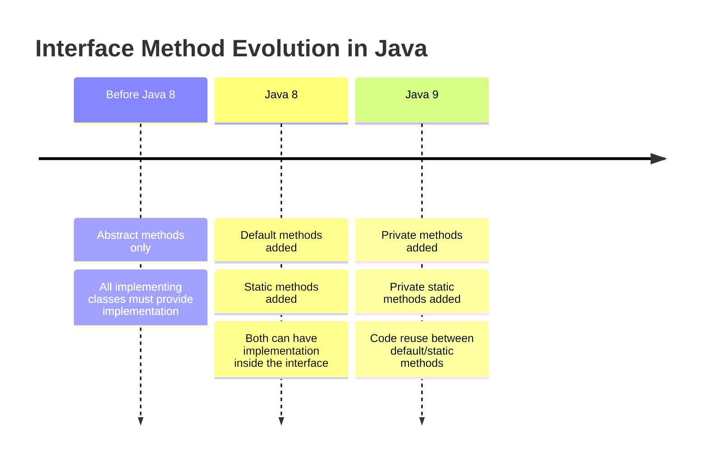
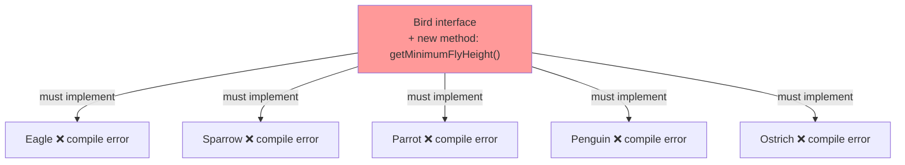
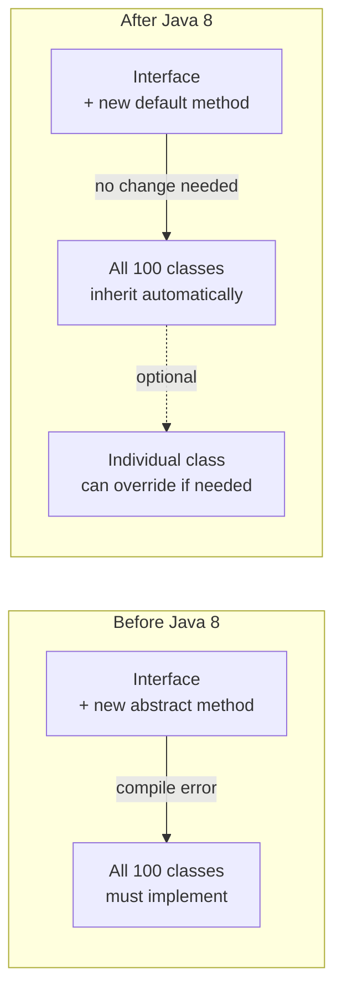
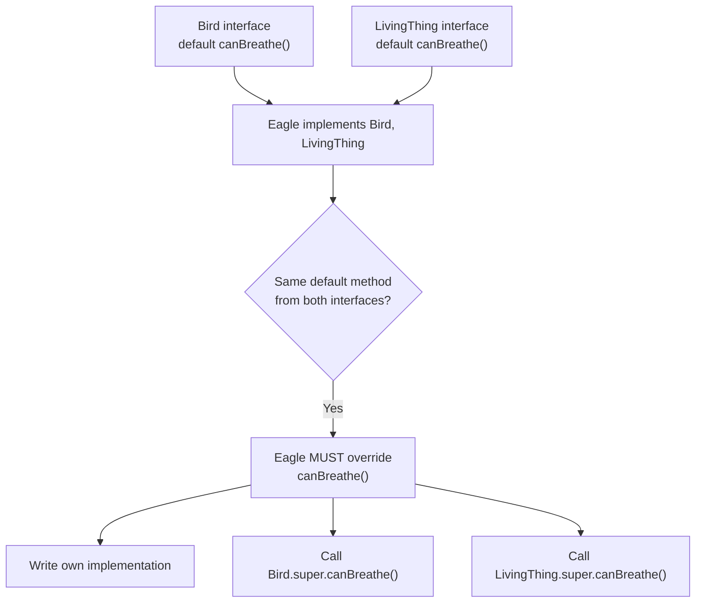
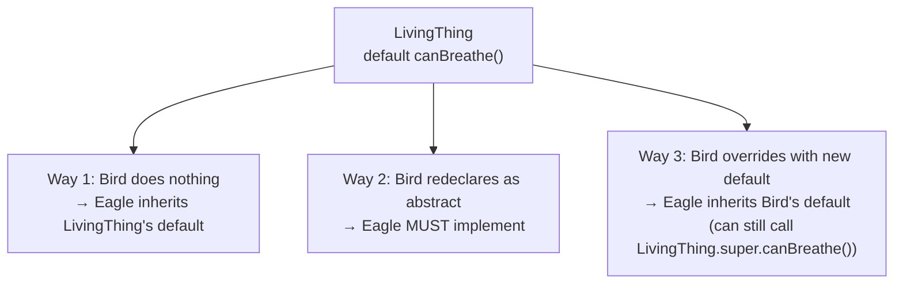
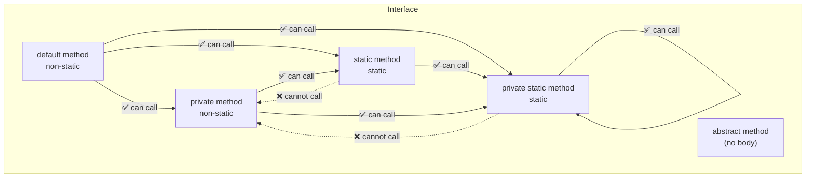

# 📚 Java Interfaces — Java 8 & Java 9 Features

> **Series:** Java Core Concepts | **Chapter:** Interfaces — Part 2  
> **Audience:** Intermediate Java Developers  
> **Coverage:** Default Methods, Static Methods (Java 8), Private Methods, Private Static Methods (Java 9), Interface Method Access Rules

---

## 🗂️ Table of Contents

1. [The Problem Before Java 8](#1-the-problem-before-java-8)
2. [Default Methods — Java 8](#2-default-methods--java-8)
3. [Why Default Methods Were Really Introduced](#3-why-default-methods-were-really-introduced)
4. [Default Method Conflict — Multiple Interfaces](#4-default-method-conflict--multiple-interfaces)
5. [Default Methods During Interface Extension](#5-default-methods-during-interface-extension)
6. [Static Methods in Interfaces — Java 8](#6-static-methods-in-interfaces--java-8)
7. [Private Methods — Java 9](#7-private-methods--java-9)
8. [Private Static Methods — Java 9](#8-private-static-methods--java-9)
9. [Access Rules — Who Can Call What](#9-access-rules--who-can-call-what)
10. [All Four Method Types — Master Comparison](#10-all-four-method-types--master-comparison)
11. [Interview Question Bank](#11-interview-question-bank)
12. [Master Summary](#12-master-summary)

---

## Evolution of Interface Methods — Timeline



---

## Interface Method Types — Quick Overview

| Method Type | Java Version | Has Implementation? | Access Modifier | Can Override? |
|-------------|-------------|---------------------|-----------------|---------------|
| `abstract` | All versions | ❌ No | `public` (implicit) | ✅ Must be overridden |
| `default` | Java 8+ | ✅ Yes | `public` (implicit) | ✅ Optional |
| `static` | Java 8+ | ✅ Yes | `public` (implicit) | ❌ Cannot override |
| `private` | Java 9+ | ✅ Yes | `private` | ❌ Cannot override (only internal use) |
| `private static` | Java 9+ | ✅ Yes | `private` | ❌ Cannot override (only internal use) |

---

# 1. The Problem Before Java 8

## How Interfaces Worked Before Java 8

Before Java 8, an interface could **only contain abstract methods**. Every class that implemented the interface was **required** to provide an implementation for every abstract method.

```java
public interface Bird {
    void canFly(); // abstract by default — must be implemented by all
}

class Eagle implements Bird {
    @Override
    public void canFly() {
        System.out.println("Eagle flies high");
    }
}

class Sparrow implements Bird {
    @Override
    public void canFly() {
        System.out.println("Sparrow flies low");
    }
}
```

This worked fine — until the interface needed to grow.

---

## The Scaling Problem

Imagine you have an interface implemented by **hundreds of classes**. Now a new requirement comes: add a new method to the interface.

```java
public interface Bird {
    void canFly();
    int getMinimumFlyHeight(); // NEW METHOD ADDED
}
```

**Result:** Every single class that implements `Bird` — Eagle, Sparrow, Parrot, Penguin, Ostrich... — now has a **compile error** until it implements `getMinimumFlyHeight()`. Even if the implementation is identical in 99% of them.



This is the **gap** that Java 8's default method was designed to fill.

---

# 2. Default Methods — Java 8

## Definition

> A **default method** is a method in an interface that has a **concrete implementation** (body), marked with the `default` keyword. Implementing classes are **not required** to override it — they inherit the implementation automatically.

---

## Syntax

```java
public interface InterfaceName {
    // Abstract method — must be implemented by classes
    void abstractMethod();

    // Default method — has implementation, optional to override
    default void defaultMethod() {
        System.out.println("Default implementation in interface");
    }
}
```

---

## Code Example — Solving the Scaling Problem

```java
public interface Bird {
    void canFly(); // abstract — must implement

    // Default method — implementing classes DON'T need to implement this
    default int getMinimumFlyHeight() {
        return 10; // common default for all birds
    }
}

class Eagle implements Bird {
    @Override
    public void canFly() {
        System.out.println("Eagle soars at great heights");
    }
    // getMinimumFlyHeight() is inherited — no need to write it here
}

class Sparrow implements Bird {
    @Override
    public void canFly() {
        System.out.println("Sparrow flutters quickly");
    }
    // getMinimumFlyHeight() is inherited — no need to write it here
}

public class Main {
    public static void main(String[] args) {
        Eagle eagle = new Eagle();
        eagle.canFly();                          // Eagle soars at great heights
        System.out.println(eagle.getMinimumFlyHeight()); // 10 — inherited from Bird

        Sparrow sparrow = new Sparrow();
        sparrow.canFly();                          // Sparrow flutters quickly
        System.out.println(sparrow.getMinimumFlyHeight()); // 10 — inherited from Bird
    }
}
```

**Output:**
```
Eagle soars at great heights
10
Sparrow flutters quickly
10
```

---

## Can a Class Override a Default Method?

Yes — overriding is **optional** but fully supported. If a class wants its own behavior, it can override the default method:

```java
class Penguin implements Bird {
    @Override
    public void canFly() {
        System.out.println("Penguin cannot fly");
    }

    @Override
    public int getMinimumFlyHeight() {
        return 0; // Penguins don't fly — override the default
    }
}
```

---

## Before vs After Java 8 — Impact of Adding a New Interface Method



---

# 3. Why Default Methods Were Really Introduced

## The Stream API — The Real Motivation

In Java 8, the **Stream API** was introduced as a major feature. The `stream()` method was added to the `Collection` interface:

```java
// Inside java.util.Collection interface (simplified)
public interface Collection<E> {
    // ... existing abstract methods ...

    default Stream<E> stream() {
        return StreamSupport.stream(spliterator(), false);
    }
}
```

### Why This Required Default Methods

The `Collection` interface is implemented by hundreds of classes in Java's standard library and by countless user-written classes worldwide:

```
Collection
├── List → ArrayList, LinkedList, Vector, Stack...
├── Set → HashSet, TreeSet, LinkedHashSet...
├── Queue → PriorityQueue, ArrayDeque...
└── ... and countless more
```

If `stream()` had been added as an **abstract method**, every single one of these classes would have needed to implement it — breaking backward compatibility for every Java codebase in the world.

By making `stream()` a **default method**, Java 8 could:
- Add the method to the `Collection` interface
- Provide a shared default implementation
- Allow existing classes to work unchanged
- Allow classes that need a custom `stream()` to override it

> [!IMPORTANT]
> **The real reason default methods exist:** Adding new functionality to existing interfaces in the Java standard library without breaking backward compatibility with the thousands of classes that already implement those interfaces.

---

# 4. Default Method Conflict — Multiple Interfaces

## The Problem

A class can implement multiple interfaces. What if two interfaces both define a `default` method with the **same name and signature**?

```java
interface Bird {
    default void canBreathe() {
        System.out.println("Bird breathes");
    }
}

interface LivingThing {
    default void canBreathe() {
        System.out.println("Living thing breathes");
    }
}

// Eagle implements BOTH — which canBreathe() does it inherit?
class Eagle implements Bird, LivingThing {
    // ❌ Compile error if you don't resolve the conflict
}
```

**Compile Error:**
```
Eagle inherits unrelated defaults for canBreathe() from types Bird and LivingThing
```

---

## The Solution — Mandatory Override

When a class implements multiple interfaces with the same default method, it **must** override that method to resolve the ambiguity:

```java
class Eagle implements Bird, LivingThing {
    @Override
    public void canBreathe() {
        // Must provide your own implementation
        System.out.println("Eagle breathes with wings extended");

        // Optionally, you can call one of the interface's defaults:
        Bird.super.canBreathe();         // Calls Bird's default
        // LivingThing.super.canBreathe(); // Calls LivingThing's default
    }
}
```

> [!IMPORTANT]
> **Rule:** When a class implements two or more interfaces that define a default method with the same signature, the class **must** provide its own implementation. The compiler will not guess which interface's default to use.

---

## Calling a Specific Interface's Default

You can explicitly invoke a specific interface's default method from inside the override using:

```java
InterfaceName.super.methodName();
```

```java
class Eagle implements Bird, LivingThing {
    @Override
    public void canBreathe() {
        Bird.super.canBreathe();     // Explicitly call Bird's version
        System.out.println("...and Eagle does more");
    }
}
```

---

## Conflict Resolution Diagram



---

# 5. Default Methods During Interface Extension

## Overview

One interface can extend another using `extends`. When a **child interface** inherits a `default` method from a **parent interface**, there are three things the child interface can do with it.

---

## Setup

```java
interface LivingThing {
    default void canBreathe() {
        System.out.println("LivingThing: Can breathe");
    }
}
```

---

## Way 1 — Do Nothing (Inherit as-is)

The child interface simply does not touch the inherited default method. The default cascades through to any class that implements the child interface.

```java
interface Bird extends LivingThing {
    // Does nothing with canBreathe() — inherits it as-is
    void canFly(); // its own abstract method
}

class Eagle implements Bird {
    @Override
    public void canFly() {
        System.out.println("Eagle flies");
    }
    // Inherits canBreathe() from LivingThing via Bird
}

public class Main {
    public static void main(String[] args) {
        Eagle eagle = new Eagle();
        eagle.canBreathe(); // LivingThing: Can breathe
    }
}
```

**Output:**
```
LivingThing: Can breathe
```

---

## Way 2 — Re-declare as Abstract (Force Override)

The child interface redeclares the same method as an **abstract method**. This removes the default implementation and forces any implementing class to provide its own.

```java
interface Bird extends LivingThing {
    // Re-declares canBreathe as abstract — overrides the default
    void canBreathe(); // No body — abstract again
}

class Eagle implements Bird {
    @Override
    public void canFly() { System.out.println("Eagle flies"); }

    @Override
    public void canBreathe() {
        // Now MANDATORY to implement — Bird made it abstract
        System.out.println("Eagle breathes efficiently");
    }
}
```

> [!NOTE]
> Even though `canBreathe()` was a `default` in `LivingThing`, the child interface `Bird` can "un-default" it by redeclaring it without a body, turning it back into an abstract method.

---

## Way 3 — Override with New Default (Extend the Behavior)

The child interface provides its **own default implementation**, optionally calling the parent's default using `ParentInterface.super.methodName()`.

```java
interface Bird extends LivingThing {
    @Override
    default void canBreathe() {
        LivingThing.super.canBreathe(); // Call parent's default first
        System.out.println("Bird also breathes through air sacs"); // Add more
    }
}

class Eagle implements Bird {
    @Override
    public void canFly() { System.out.println("Eagle flies"); }
    // Inherits Bird's overridden canBreathe()
}

public class Main {
    public static void main(String[] args) {
        new Eagle().canBreathe();
    }
}
```

**Output:**
```
LivingThing: Can breathe
Bird also breathes through air sacs
```

---

## Three Ways — Summary Table

| Way | What Child Interface Does | Implementing Class Must Override? |
|-----|--------------------------|----------------------------------|
| **1 — Inherit** | Does nothing with the method | ❌ No (uses parent's default) |
| **2 — Re-abstract** | Redeclares without body | ✅ Yes (forced to implement) |
| **3 — Override** | Provides new `default` implementation | ❌ No (uses child interface's default) |

---

## Diagram — Three Ways



---

# 6. Static Methods in Interfaces — Java 8

## Definition

> A **static method** in an interface has a full implementation (body), belongs to the interface itself (not to instances or implementing classes), and **cannot be overridden** by implementing classes.

---

## Syntax

```java
public interface Bird {
    static void canBreath() {
        System.out.println("Static method in Bird interface");
    }
}
```

---

## Key Rules

| Rule | Detail |
|------|--------|
| Has implementation | ✅ Yes |
| Access modifier | `public` by default (Java 8) |
| Can be overridden by implementing class | ❌ No |
| How to call | `InterfaceName.methodName()` — via interface name only |
| Can implementing class call it? | ✅ Yes, using the interface name |

---

## Code Example

```java
public interface Bird {
    void canFly(); // abstract

    static void canBreath() {
        System.out.println("Bird static method: breathes");
    }
}

class Eagle implements Bird {
    @Override
    public void canFly() {
        System.out.println("Eagle flies");
        Bird.canBreath(); // ✅ Can call static method using interface name
    }

    // CANNOT override canBreath() here — static methods can't be overridden
    // static void canBreath() { } // ❌ This would be a NEW method on Eagle, not an override
}

public class Main {
    public static void main(String[] args) {
        Bird.canBreath(); // ✅ Called directly on interface name
        new Eagle().canFly();
    }
}
```

**Output:**
```
Bird static method: breathes
Eagle flies
Bird static method: breathes
```

---

## Why Static, Not Default, for Utility Methods?

| Scenario | Use `default` | Use `static` |
|----------|-------------|-------------|
| Behavior classes might want to override | ✅ | ❌ |
| Utility/helper method tied to the interface (not per-object) | ❌ | ✅ |
| Needs to be called on an instance | ✅ | ❌ |
| Needs to be called on the interface name | ❌ | ✅ |

> **Why didn't Java make `stream()` static?**  
> Because several collection classes override `stream()` with their own optimized versions. Static methods can't be overridden — so `default` was the right choice for `stream()`.

---

# 7. Private Methods — Java 9

## Definition

> A **private method** in an interface has a full implementation and is accessible **only within the interface itself**. It cannot be accessed by implementing classes or called from outside the interface.

---

## Why Were Private Methods Needed?

Once Java 8 allowed multiple `default` methods, a new problem emerged: **code duplication between default methods**.

Imagine five default methods each sharing 80% of the same logic:

```java
// BEFORE private methods (Java 8 only)
interface Bird {
    default void swim() {
        // 80% common code — DUPLICATED
        System.out.println("Checking water...");
        System.out.println("Adjusting buoyancy...");
        System.out.println("Swimming");
    }

    default void dive() {
        // Same 80% code — DUPLICATED AGAIN
        System.out.println("Checking water...");
        System.out.println("Adjusting buoyancy...");
        System.out.println("Diving deep");
    }
}
```

**Private methods solve this** by extracting shared code into a reusable private helper:

```java
// AFTER private methods (Java 9)
interface Bird {
    default void swim() {
        waterPrep();         // shared 80% — called here
        System.out.println("Swimming");
    }

    default void dive() {
        waterPrep();         // shared 80% — called here
        System.out.println("Diving deep");
    }

    // Private helper — only used inside this interface
    private void waterPrep() {
        System.out.println("Checking water...");
        System.out.println("Adjusting buoyancy...");
    }
}
```

---

## Code Example — Full Private Method Demo

```java
public interface Bird {
    void canFly(); // abstract

    default void defaultMethod() {
        privateMethod();       // ✅ default can call private
        privateStaticMethod(); // ✅ default can call private static
        staticMethod();        // ✅ default can call static
        System.out.println("Default method");
    }

    static void staticMethod() {
        privateStaticMethod(); // ✅ static can call private static
        // privateMethod();    // ❌ static CANNOT call non-static private
        System.out.println("Static method");
    }

    private void privateMethod() {
        System.out.println("Private method — only inside interface");
    }

    private static void privateStaticMethod() {
        System.out.println("Private static method — only inside interface");
    }
}
```

---

## Key Rules for Private Methods

| Rule | Detail |
|------|--------|
| Has implementation | ✅ Yes — mandatory |
| Can be `abstract` | ❌ No — private + abstract contradicts (abstract needs external implementation; private can't be accessed externally) |
| Accessible by implementing classes | ❌ No |
| Accessible by `default` methods in same interface | ✅ Yes |
| Accessible by `static` methods in same interface | ❌ No — static cannot call non-static members |
| Accessible by `private static` methods in same interface | ❌ No |
| Purpose | Code reuse between default methods |

> [!WARNING]
> **Why can't a private method be abstract?**  
> `abstract` means: "I have no implementation — provide it in a subclass/implementing class." But `private` means: "nothing outside this interface can access me." These are contradictory — if nothing can access the method from outside, nothing can implement it either.

---

# 8. Private Static Methods — Java 9

## Definition

> A **private static method** in an interface has a full implementation, is `static` (belongs to the interface, not an instance), and is accessible **only within the interface itself**.

---

## Purpose

Same as private methods — code reuse — but for use specifically inside `static` methods. A `static` method in an interface cannot call a non-static private method, so private static methods fill that gap.

---

## Code Example

```java
public interface Bird {
    static void staticMethod() {
        privateStaticMethod(); // ✅ static CAN call private static
        // privateMethod();    // ❌ static CANNOT call non-static private
        System.out.println("Doing static work");
    }

    private void privateMethod() {
        System.out.println("Private non-static — only for default methods");
    }

    private static void privateStaticMethod() {
        System.out.println("Private static — shared helper for static methods");
    }
}
```

---

# 9. Access Rules — Who Can Call What

## The Complete Access Matrix

This is one of the most important things to memorize for interviews.

| Caller ↓ \ Callee → | `abstract` | `default` | `static` | `private` | `private static` |
|---------------------|-----------|-----------|----------|-----------|-----------------|
| **`default`** | N/A | ✅ | ✅ | ✅ | ✅ |
| **`static`** | N/A | ❌ | ✅ | ❌ | ✅ |
| **`private`** | N/A | ✅ | ✅ | ✅ | ✅ |
| **`private static`** | N/A | ❌ | ✅ | ❌ | ✅ |

---

## The Core Rule (Easy to Remember)

> **Static methods can only call other static members.**  
> **Non-static methods can call both static and non-static members.**

Applied to interfaces:

- `default` = non-static → can call `private`, `private static`, `static` ✅
- `static` = static → can only call `private static` and other `static` ✅; cannot call `private` (non-static) ❌

---

## Diagram — Access Flow



---

## From Outside the Interface (Implementing Classes)

| Method Type | Implementing Class Can Override? | Implementing Class Can Call? | How to Call |
|-------------|----------------------------------|------------------------------|-------------|
| `abstract` | ✅ Must override | Via `super` after override | `this.method()` |
| `default` | ✅ Optional override | ✅ Directly | `obj.method()` |
| `static` | ❌ Cannot override | ✅ Yes | `InterfaceName.method()` |
| `private` | ❌ Cannot | ❌ Cannot | Not accessible |
| `private static` | ❌ Cannot | ❌ Cannot | Not accessible |

---

# 10. All Four Method Types — Master Comparison

```java
public interface Bird {

    // 1. ABSTRACT — Java 1.0+
    // No body. Implementing classes MUST override.
    void canFly(); // equivalent to: public abstract void canFly();

    // 2. DEFAULT — Java 8+
    // Has body. Implementing classes inherit it, may optionally override.
    default int getMinimumFlyHeight() {
        privateHelper(); // can call private
        return 10;
    }

    // 3. STATIC — Java 8+
    // Has body. Cannot be overridden. Called via Bird.staticHelper().
    static void staticHelper() {
        privateStaticHelper(); // can only call private static
        System.out.println("Static helper");
    }

    // 4. PRIVATE — Java 9+
    // Has body. Only used inside this interface.
    private void privateHelper() {
        System.out.println("Private helper — reused by default methods");
    }

    // 5. PRIVATE STATIC — Java 9+
    // Has body. Only used inside this interface. Called by static methods.
    private static void privateStaticHelper() {
        System.out.println("Private static helper — reused by static methods");
    }
}
```

---

## Full Feature Comparison Table

| Feature | `abstract` | `default` | `static` | `private` | `private static` |
|---------|-----------|-----------|----------|-----------|-----------------|
| **Java version** | All | Java 8+ | Java 8+ | Java 9+ | Java 9+ |
| **Has implementation** | ❌ | ✅ | ✅ | ✅ | ✅ |
| **Access modifier** | `public` (implicit) | `public` (implicit) | `public` (implicit) | `private` | `private` |
| **Implementing class must override** | ✅ Yes | ❌ Optional | ❌ No | ❌ N/A | ❌ N/A |
| **Implementing class can override** | ✅ Yes | ✅ Yes | ❌ No | ❌ No | ❌ No |
| **Accessible outside interface** | Via implementing class | Via implementing class | Via interface name | ❌ No | ❌ No |
| **Can be called by `default`** | N/A | ✅ | ✅ | ✅ | ✅ |
| **Can be called by `static`** | N/A | ❌ | ✅ | ❌ | ✅ |
| **Purpose** | Define contract | Add optional shared behavior | Utility methods | Code reuse between defaults | Code reuse between statics |

---

# 11. Interview Question Bank

## Default Methods

| Question | Key Answer |
|----------|-----------|
| What is a default method in an interface? | A method with implementation in an interface, marked `default`; implementing classes can but don't have to override it |
| Why were default methods introduced in Java 8? | To add new methods to existing interfaces (like `Collection`) without breaking backward compatibility for all implementing classes |
| What real example triggered default methods? | `stream()` added to `Collection` interface in Java 8 — couldn't make it abstract without breaking all existing Collection implementations |
| Can a class override a default method? | Yes — optional but allowed |
| What happens if two interfaces have the same default method and a class implements both? | Compile error — the class must override the method to resolve the ambiguity |
| How do you call a specific interface's default from inside an override? | `InterfaceName.super.methodName()` |

## Static Methods in Interfaces

| Question | Key Answer |
|----------|-----------|
| What is a static method in an interface? | A method with implementation, belonging to the interface itself; not overridable, called via `InterfaceName.method()` |
| Can an implementing class override a static interface method? | No — static methods cannot be overridden |
| How do you call a static interface method? | `InterfaceName.methodName()` — only via interface name |
| Why is `stream()` `default` and not `static`? | Because collection classes may override `stream()` with optimized versions — static methods can't be overridden |

## Private & Private Static Methods (Java 9)

| Question | Key Answer |
|----------|-----------|
| What is a private method in an interface? | Java 9+ feature; has implementation; only accessible within the interface; used to share code between default methods |
| Why were private methods introduced in Java 9? | To allow code reuse between multiple default methods — avoids duplicating shared logic |
| Can a private interface method be abstract? | No — contradictory: abstract needs external implementation, private prevents external access |
| Can an implementing class call a private interface method? | No — private means only within the interface |
| What is a private static interface method? | Same as private but static — used to share code between static methods inside the interface |
| Can a static method call a non-static private method? | No — static methods can only access static members |
| Can a default method call a private method? | Yes — default is non-static; can access both static and non-static private members |

## Interface Extension with Default Methods

| Question | Key Answer |
|----------|-----------|
| What are the three ways a child interface can handle a parent's default method? | (1) Inherit as-is, (2) Re-declare as abstract, (3) Override with a new default |
| When child interface re-declares a default as abstract, what happens? | All implementing classes of the child interface must now provide the implementation |
| How does a child interface call its parent interface's default? | `ParentInterface.super.methodName()` |

---

# 12. Master Summary

## Quick Revision Bullets

**The Problem:**
- ✅ Before Java 8 → interfaces could ONLY have `abstract` methods
- ✅ Adding any new method to an interface required ALL implementing classes to update — a breaking change at scale

**Default Methods (Java 8):**
- ✅ `default` keyword + method body inside interface
- ✅ Implementing classes **inherit** it automatically — no override required
- ✅ Implementing classes **may** override if they need custom behavior
- ✅ Real motivation: `stream()` needed to be added to `Collection` without breaking all implementations
- ✅ **Conflict rule**: if two interfaces have the same default method and a class implements both → the class **must** override and resolve
- ✅ Call parent's default inside override: `InterfaceName.super.method()`

**Three Ways Child Interface Handles Parent Default:**
- ✅ **Way 1 — Inherit**: do nothing → cascades to implementing classes
- ✅ **Way 2 — Re-abstract**: redeclare without body → forces all implementing classes to implement
- ✅ **Way 3 — Override**: provide new default implementation; optionally use `ParentInterface.super.method()`

**Static Methods (Java 8):**
- ✅ Full implementation in interface; `public` by default
- ✅ Called via `InterfaceName.method()` — **never** via object
- ✅ **Cannot be overridden** by implementing classes
- ✅ Useful for utility/helper methods tied to the interface

**Private Methods (Java 9):**
- ✅ Full implementation; accessible **only inside the interface**
- ✅ Purpose: **code reuse** between multiple default methods — eliminates duplication
- ✅ **Cannot be abstract** (contradictory — private blocks external access; abstract demands external implementation)
- ✅ Cannot be called by implementing classes

**Private Static Methods (Java 9):**
- ✅ Same as private but static — for code reuse between static interface methods
- ✅ Only callable by other static (or private static) methods inside the interface

**The Access Rule (memorize this):**
- ✅ **Non-static methods** (`default`, `private`) → can call both static and non-static members
- ✅ **Static methods** (`static`, `private static`) → can ONLY call static members
- ✅ `default` can call: `private`, `private static`, `static` ✅
- ✅ `static` can call: `private static` ✅ only; cannot call `private` ❌

---

> [!TIP]
> **Coming up next:**
> - **Functional Interfaces & Lambda Expressions** — covered in a dedicated video because of their importance; this is the foundation for writing concise, modern Java code with streams and callbacks

---

*End of Chapter — Java Interfaces: Java 8 & Java 9 Features*
