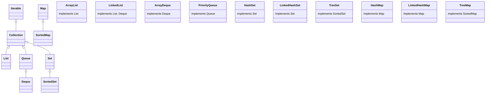
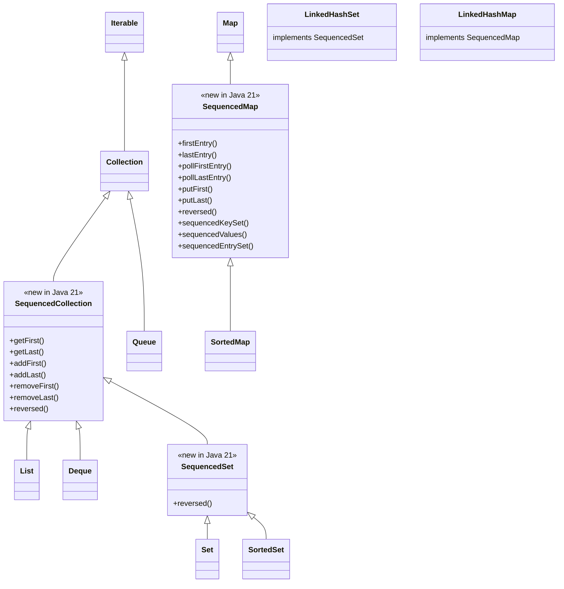
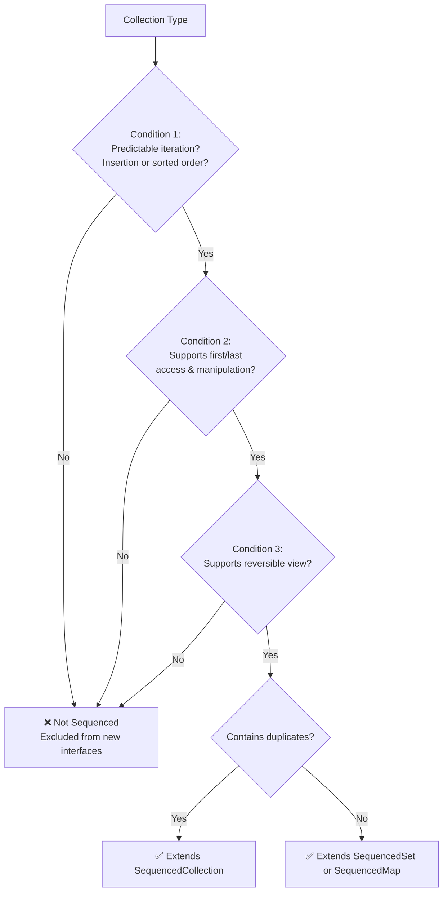
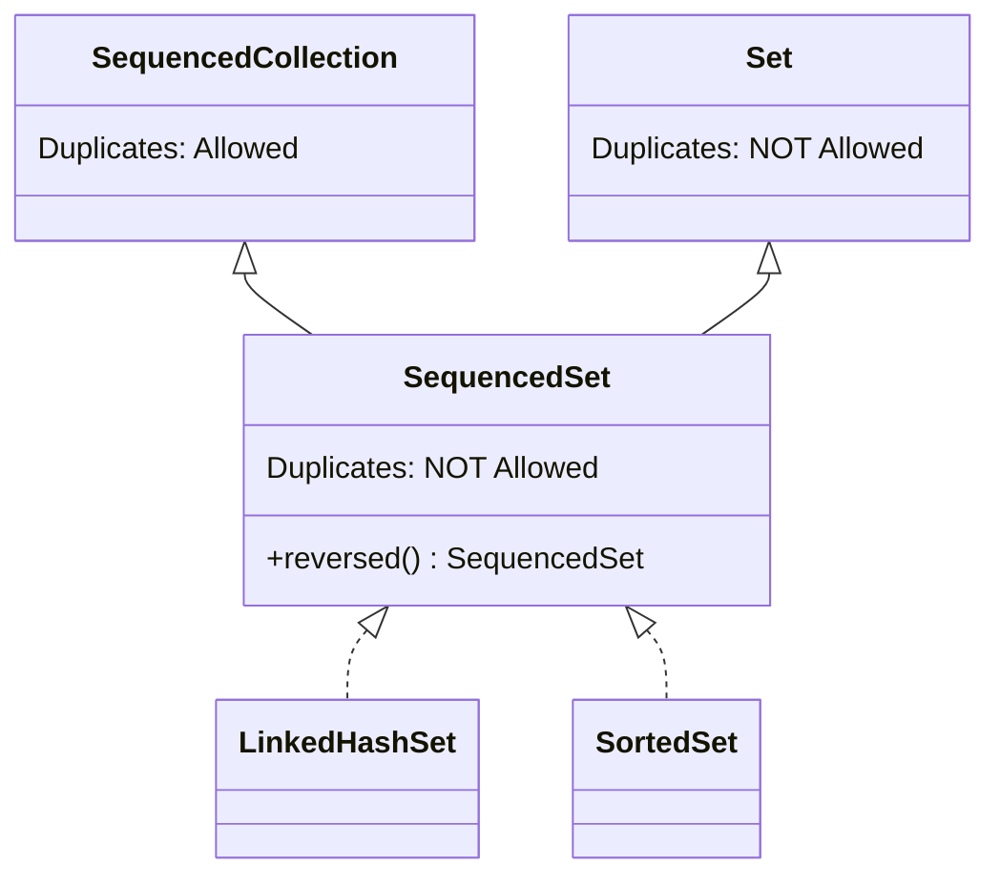
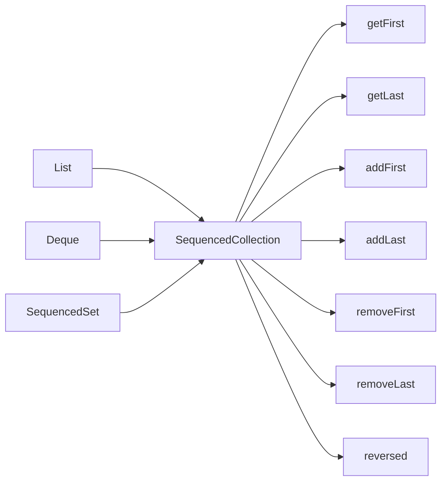
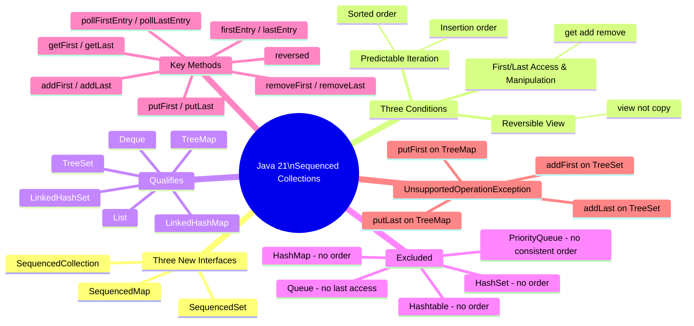

# 📘 Java 21: Sequenced Collections, Sequenced Set & Sequenced Map
### Complete Study Guide — Chapter: New Interfaces in Java 21 Collection Hierarchy

---

> [!NOTE]
> This guide assumes familiarity with the Java Collections Framework (List, Set, Map, Queue, Deque, LinkedHashSet, TreeSet, etc.). Where those are referenced, enough context is provided to keep this guide self-contained.

---

## 🗂️ Table of Contents

1. [Overview & Motivation](#1-overview--motivation)
2. [The Existing Collection Hierarchy (Pre-Java 21)](#2-the-existing-collection-hierarchy-pre-java-21)
3. [The New Collection Hierarchy (Java 21+)](#3-the-new-collection-hierarchy-java-21)
4. [What Makes a Collection "Sequenced"? — The Three Conditions](#4-what-makes-a-collection-sequenced--the-three-conditions)
5. [Applying the Conditions — Which Collections Qualify?](#5-applying-the-conditions--which-collections-qualify)
6. [Why Is SequencedSet Needed Separately?](#6-why-is-sequencedset-needed-separately)
7. [The Gap Being Filled — Why These Interfaces Exist](#7-the-gap-being-filled--why-these-interfaces-exist)
8. [SequencedCollection Interface — Methods & Usage](#8-sequencedcollection-interface--methods--usage)
9. [SequencedSet Interface — Methods & Usage](#9-sequencedset-interface--methods--usage)
10. [SequencedMap Interface — Methods & Usage](#10-sequencedmap-interface--methods--usage)
11. [UnsupportedOperationException — Sorted Types](#11-unsupportedoperationexception--sorted-types)
12. [Interview Notes](#12-interview-notes)
13. [Common Mistakes](#13-common-mistakes)
14. [Best Practices](#14-best-practices)
15. [Practice Questions](#15-practice-questions)
16. [Summary](#16-summary)

---

# 1. Overview & Motivation

## What Was Added in Java 21?

Java 21 introduced **three new interfaces** into the Java Collections Framework:

| Interface | Package |
|---|---|
| `SequencedCollection<E>` | `java.util` |
| `SequencedSet<E>` | `java.util` |
| `SequencedMap<K, V>` | `java.util` |

These interfaces were not created from scratch — they were **inserted into the existing hierarchy**, slotting between existing interfaces and implementation classes.

## The Core Problem They Solve

Before Java 21, certain collections had a well-defined order (insertion order, sorted order), and you could logically speak of a "first element" and a "last element." However:

- Each collection type had **its own differently-named methods** for accessing, adding, and removing first/last elements.
- There was **no common interface** that unified these operations.
- There was **no standard way** to get a reversed view of a collection.

This made code harder to write, harder to read, and harder to maintain.

> [!IMPORTANT]
> The new sequenced interfaces provide a **unified, consistent API** for ordered collections — covering first/last element access, first/last manipulation, and reversed views — all under one common contract.

---

# 2. The Existing Collection Hierarchy (Pre-Java 21)



In this pre-Java 21 world:
- `List`, `Deque`, `LinkedHashSet`, `TreeSet`, `LinkedHashMap`, `TreeMap` — all have a defined order.
- But there is **no shared interface** that groups them together and exposes common first/last operations.

---

# 3. The New Collection Hierarchy (Java 21+)

The three new interfaces slot into the hierarchy like this:



> [!NOTE]
> Yellow/highlighted items in the lecture diagram correspond to the new additions: `SequencedCollection`, `SequencedSet`, and `SequencedMap`, plus the updated parent relationships of existing classes.

**Key structural changes:**

| Before Java 21 | After Java 21 |
|---|---|
| `List` extends `Collection` | `List` extends `SequencedCollection` |
| `Deque` extends `Queue` | `Deque` extends `SequencedCollection` |
| `LinkedHashSet` implements `Set` | `LinkedHashSet` implements `SequencedSet` |
| `SortedSet` extends `Set` | `SortedSet` extends `SequencedSet` |
| `LinkedHashMap` implements `Map` | `LinkedHashMap` implements `SequencedMap` |
| `SortedMap` extends `Map` | `SortedMap` extends `SequencedMap` |

---

# 4. What Makes a Collection "Sequenced"? — The Three Conditions

> [!IMPORTANT]
> This is the most critical section. Understanding the three conditions lets you **derive the entire hierarchy yourself** — no memorization needed.

A collection can be considered "sequenced" (and thus eligible to extend/implement one of the new interfaces) if and only if it satisfies **all three of the following conditions**:

---

## Condition 1: Predictable Iteration

The collection must maintain its elements in a **consistent, well-defined order** every time you iterate over it.

There are two acceptable orderings:

| Ordering Type | Description | Example Collections |
|---|---|---|
| **Insertion Order** | Elements appear in the order they were inserted | `List`, `Deque`, `LinkedHashSet`, `LinkedHashMap` |
| **Sorted Order** | Elements appear in sorted (ascending/descending) order | `TreeSet` (SortedSet), `TreeMap` (SortedMap) |

> [!NOTE]
> "Predictable" does not mean "insertion order only." A sorted set that always gives you `[1, 5, 14]` for those three values is equally predictable — the behavior is **consistent and repeatable**, not random.

**Collections that fail Condition 1:**
- `HashSet` — iteration order is undefined, based on hash codes
- `HashMap` — no order guarantee
- `Hashtable` — no order guarantee
- `PriorityQueue` — only guarantees the head element is min/max; rest of iteration is heap-order (not consistent)

---

## Condition 2: Access and Manipulation of First and Last Elements

The collection must support **reading, adding, and removing** elements at both ends — the first position and the last position.

"Support" here means it is architecturally possible given the underlying data structure, even if the exact API method names differ across types.

| Operation | Description |
|---|---|
| **Access first** | Read the element at the front without removing it |
| **Access last** | Read the element at the end without removing it |
| **Add first** | Insert an element at the front |
| **Add last** | Insert an element at the end |
| **Remove first** | Remove and return the element at the front |
| **Remove last** | Remove and return the element at the end |

**Collections that fail Condition 2:**
- `Queue` — supports insertion only at the tail, removal only at the head; you cannot access or remove the last element, and cannot add at the front.

---

## Condition 3: Reversible View

The collection must support obtaining a **reversed view** — a view of the same underlying collection that presents elements in reverse order.

> [!IMPORTANT]
> A **view** is not a copy. Modifying the reversed view modifies the underlying collection, and vice versa. No new collection is created.

**Collections that fail Condition 3:**
- Any collection that fails Condition 1 or 2 also effectively fails this, because reversing an unordered collection is meaningless.
- `Queue` — no reverse iteration supported.

---

## Decision Flowchart



---

# 5. Applying the Conditions — Which Collections Qualify?

## Full Eligibility Table

| Collection | Condition 1:\nPredictable Order | Condition 2:\nFirst/Last Ops | Condition 3:\nReversible View | Result |
|---|---|---|---|---|
| `List` (ArrayList, LinkedList) | ✅ Insertion order | ✅ Yes (get/add/remove by index) | ✅ `Collections.reverse()` | ✅ Under `SequencedCollection` |
| `Deque` (ArrayDeque, LinkedList) | ✅ Insertion order | ✅ getFirst/getLast/addFirst/addLast | ✅ `reverse()` | ✅ Under `SequencedCollection` |
| `Queue` | ✅ Insertion order | ❌ No last access/add | ❌ Not supported | ❌ Excluded |
| `PriorityQueue` | ❌ No consistent order | ❌ N/A | ❌ N/A | ❌ Excluded |
| `HashSet` | ❌ No order | ❌ N/A | ❌ N/A | ❌ Excluded |
| `LinkedHashSet` | ✅ Insertion order (doubly linked list) | ✅ Possible (doubly linked list) | ✅ Possible (reverse iteration) | ✅ Under `SequencedSet` |
| `TreeSet` (SortedSet) | ✅ Sorted order | ✅ first()/last()/add/remove | ✅ `descendingIterator()` | ✅ Under `SequencedSet` |
| `HashMap` | ❌ No order | ❌ N/A | ❌ N/A | ❌ Excluded |
| `Hashtable` | ❌ No order | ❌ N/A | ❌ N/A | ❌ Excluded |
| `LinkedHashMap` | ✅ Insertion order (doubly linked list) | ✅ Possible | ✅ Possible | ✅ Under `SequencedMap` |
| `TreeMap` (SortedMap) | ✅ Sorted order | ✅ firstKey/lastKey/put/remove | ✅ `descendingMap()` | ✅ Under `SequencedMap` |

---

## Deep Dive: Why Queue Is Excluded

```
Queue — FIFO structure
─────────────────────
Insert → [tail]  ──────  [head] → Remove (peek/poll)

❌ Cannot access the last element
❌ Cannot add at the front
❌ Cannot remove from the back
❌ No reverse view
```

Queue is fundamentally a **one-directional** structure. Even though it maintains insertion order (Condition 1), it fails Conditions 2 and 3.

---

## Deep Dive: Why PriorityQueue Is Excluded

```
PriorityQueue — Heap-based
───────────────────────────
Internally: [heap structure]
Only guarantees: head = min (or max)
Rest of iteration: undefined order

❌ Fails Condition 1 (unpredictable iteration beyond the head)
❌ Conditions 2 and 3 not applicable
```

A `PriorityQueue` does not maintain any consistent end-to-end order. Only the top (head) element is guaranteed to be the minimum/maximum. Everything else is heap-internal ordering, which is not predictable to the caller.

---

## Deep Dive: Why LinkedHashSet Qualifies (Yellow in Lecture)

`LinkedHashSet` internally uses a **doubly linked list** (in addition to a hash table) to maintain insertion order.

Because of the doubly linked list:
- You can traverse from the front (first inserted) to the back (last inserted) ✅
- You can traverse in reverse (from last to first) ✅
- You can add a node at the head or tail of the linked list ✅
- You can remove a node from head or tail ✅

> [!NOTE]
> Prior to Java 21, `LinkedHashSet` did **not expose** public `addFirst()`, `getLast()` etc. methods. The lecture marks these as "yellow" — meaning the underlying data structure **can support** these operations, and Java 21 extends the API to expose them properly via the `SequencedSet` interface.

---

# 6. Why Is SequencedSet Needed Separately?

This is the third key question from the lecture.

## The Distinction: Duplicates vs. No Duplicates

| Interface | Duplicates Allowed? | Example Implementations |
|---|---|---|
| `SequencedCollection` | ✅ Yes | `List`, `Deque` |
| `SequencedSet` | ❌ No | `LinkedHashSet`, `TreeSet` |

`SequencedSet` extends `SequencedCollection` **and** `Set`. The `Set` contract enforces uniqueness. Because `LinkedHashSet` and `TreeSet` do not allow duplicates, they cannot simply implement `SequencedCollection` — they must implement the more specific `SequencedSet` which carries the no-duplicate guarantee from `Set`.



> [!IMPORTANT]
> If `LinkedHashSet` extended `SequencedCollection` directly, it would inherit an interface that permits duplicates — which violates `LinkedHashSet`'s contract. Hence the need for a separate `SequencedSet`.

---

# 7. The Gap Being Filled — Why These Interfaces Exist

## The Pre-Java 21 Problem: Inconsistent APIs

Here is the pre-Java 21 way to perform equivalent first/last operations across different collection types:

| Operation | `List` | `Deque` | `LinkedHashSet` | `SortedSet` (TreeSet) |
|---|---|---|---|---|
| Get first | `list.get(0)` | `deque.getFirst()` | Manual iteration | `sortedSet.first()` |
| Get last | `list.get(list.size()-1)` | `deque.getLast()` | Manual iteration | `sortedSet.last()` |
| Add first | `list.add(0, elem)` | `deque.addFirst(elem)` | Not available | Not meaningful |
| Add last | `list.add(elem)` | `deque.addLast(elem)` | `set.add(elem)` | `set.add(elem)` |
| Remove first | `list.remove(0)` | `deque.removeFirst()` | Manual iteration | `sortedSet.remove(first())` |
| Remove last | `list.remove(list.size()-1)` | `deque.removeLast()` | Manual iteration | `sortedSet.remove(last())` |
| Reverse view | `Collections.reverse(list)` *(mutates!)* | No direct method | No method | `sortedSet.descendingIterator()` |

**The problems with this:**
1. **Different method names** for the same logical operation across types.
2. **Missing operations** — `LinkedHashSet` had no clean API for first/last access.
3. **No polymorphism** — you couldn't write a single method that accepts "any ordered collection" and works with first/last operations generically.
4. **Reverse behavior inconsistency** — `Collections.reverse()` mutates the original list; `descendingIterator()` gives an iterator, not a view.

---

## The Java 21 Solution: A Unified Interface



Now, **regardless** of whether you have a `List`, a `Deque`, a `LinkedHashSet`, or a `TreeSet`, you use the exact same method names. Code becomes:

- Easier to write
- Easier to read
- More generic and reusable
- Self-documenting

---

# 8. SequencedCollection Interface — Methods & Usage

## Interface Definition

```java
public interface SequencedCollection<E> extends Collection<E> {
    SequencedCollection<E> reversed();
    void addFirst(E e);
    void addLast(E e);
    E getFirst();
    E getLast();
    E removeFirst();
    E removeLast();
}
```

## Example: List (Java 21+)

```java
import java.util.*;

public class SequencedListDemo {
    public static void main(String[] args) {
        List<String> list = new ArrayList<>(List.of("B", "C", "D"));

        // Access
        System.out.println(list.getFirst()); // B
        System.out.println(list.getLast());  // D

        // Add
        list.addFirst("A");
        list.addLast("Z");
        System.out.println(list); // [A, B, C, D, Z]

        // Remove
        list.removeFirst(); // removes A
        list.removeLast();  // removes Z
        System.out.println(list); // [B, C, D]

        // Reverse view
        SequencedCollection<String> reversed = list.reversed();
        System.out.println(reversed); // [D, C, B]
    }
}
```

### Output

```
B
D
[A, B, C, D, Z]
[B, C, D]
[D, C, B]
```

### Line-by-Line Explanation

| Line | Operation | Result |
|---|---|---|
| `getFirst()` | Returns first element without removing | `"B"` |
| `getLast()` | Returns last element without removing | `"D"` |
| `addFirst("A")` | Inserts at position 0 | `[A, B, C, D]` |
| `addLast("Z")` | Appends to end | `[A, B, C, D, Z]` |
| `removeFirst()` | Removes element at index 0 | `[B, C, D, Z]` |
| `removeLast()` | Removes last element | `[B, C, D]` |
| `reversed()` | Returns a reversed **view** | `[D, C, B]` |

> [!CAUTION]
> `reversed()` returns a **view**, not a copy. Changes to the view reflect in the original list and vice versa.

---

## Example: Deque (Java 21+)

```java
Deque<String> deque = new ArrayDeque<>(List.of("B", "C", "D"));

System.out.println(deque.getFirst()); // B
System.out.println(deque.getLast());  // D

deque.addFirst("A");
deque.addLast("Z");
System.out.println(deque); // [A, B, C, D, Z]

deque.removeFirst();
deque.removeLast();
System.out.println(deque); // [B, C, D]

System.out.println(deque.reversed()); // [D, C, B]
```

Note: The method names are now **identical** to the `List` example above. This is the power of the common interface.

---

# 9. SequencedSet Interface — Methods & Usage

## Interface Definition

```java
public interface SequencedSet<E> extends SequencedCollection<E>, Set<E> {
    SequencedSet<E> reversed(); // overrides return type to SequencedSet
}
```

`SequencedSet` inherits all methods from `SequencedCollection` and additionally enforces **no duplicates** from `Set`.

## Example: LinkedHashSet (Java 21+)

```java
import java.util.*;

public class SequencedLinkedHashSetDemo {
    public static void main(String[] args) {
        LinkedHashSet<String> set = new LinkedHashSet<>(List.of("B", "C", "D"));

        // Access
        System.out.println(set.getFirst()); // B
        System.out.println(set.getLast());  // D

        // Add — unique values
        set.addFirst("A");
        set.addLast("Z");
        System.out.println(set); // [A, B, C, D, Z]

        // Duplicate handling with addFirst
        set.addFirst("C"); // C already exists!
        // C is moved to the first position
        System.out.println(set); // [C, A, B, D, Z]

        // Remove
        set.removeFirst(); // removes C
        set.removeLast();  // removes Z
        System.out.println(set); // [A, B, D]

        // Reverse view
        System.out.println(set.reversed()); // [D, B, A]
    }
}
```

### Output

```
B
D
[A, B, C, D, Z]
[C, A, B, D, Z]
[A, B, D]
[D, B, A]
```

### Special Behavior: `addFirst()` / `addLast()` with Duplicates

> [!IMPORTANT]
> When you call `addFirst("C")` on a `LinkedHashSet` that already contains `"C"`:
> - The duplicate is **not inserted again** (Set contract: no duplicates).
> - Instead, `"C"` is **moved** to the first position.
> - This is unique behavior specific to `SequencedSet`.

---

## Example: SortedSet / TreeSet (Java 21+)

```java
SortedSet<Integer> sortedSet = new TreeSet<>(Set.of(14, 5, 7));
// Internally stored as: [5, 7, 14]

System.out.println(sortedSet.getFirst()); // 5
System.out.println(sortedSet.getLast());  // 14

// Add — sorted automatically
sortedSet.add(2);   // goes to first (smallest)
sortedSet.add(20);  // goes to last (largest)
System.out.println(sortedSet); // [2, 5, 7, 14, 20]

// Reverse view
System.out.println(sortedSet.reversed()); // [20, 14, 7, 5, 2]
```

> [!WARNING]
> `addFirst()` and `addLast()` throw `UnsupportedOperationException` on `SortedSet`/`TreeSet`.
> Because elements are sorted automatically, "add at first" or "add at last" has no deterministic meaning. Use `add(element)` instead — the set will place it in the correct sorted position.

---

# 10. SequencedMap Interface — Methods & Usage

## Interface Definition

```java
public interface SequencedMap<K, V> extends Map<K, V> {
    SequencedMap<K, V> reversed();
    Map.Entry<K, V> firstEntry();
    Map.Entry<K, V> lastEntry();
    Map.Entry<K, V> pollFirstEntry();
    Map.Entry<K, V> pollLastEntry();
    V putFirst(K k, V v);
    V putLast(K k, V v);
    SequencedSet<K> sequencedKeySet();
    SequencedCollection<V> sequencedValues();
    SequencedSet<Map.Entry<K, V>> sequencedEntrySet();
}
```

### Method Summary

| Method | Description |
|---|---|
| `firstEntry()` | Returns (but does not remove) the first key-value entry |
| `lastEntry()` | Returns (but does not remove) the last key-value entry |
| `pollFirstEntry()` | Removes and returns the first entry |
| `pollLastEntry()` | Removes and returns the last entry |
| `putFirst(k, v)` | Inserts/moves entry to the first position |
| `putLast(k, v)` | Inserts/moves entry to the last position |
| `reversed()` | Returns a reversed view of the map |
| `sequencedKeySet()` | Returns keys as a `SequencedSet` |
| `sequencedValues()` | Returns values as a `SequencedCollection` |
| `sequencedEntrySet()` | Returns entries as a `SequencedSet` |

---

## Example: LinkedHashMap (Java 21+)

```java
import java.util.*;

public class SequencedLinkedHashMapDemo {
    public static void main(String[] args) {
        LinkedHashMap<Integer, String> map = new LinkedHashMap<>();
        map.put(100, "B");
        map.put(200, "C");
        map.put(300, "D");

        // Access entries
        System.out.println(map.firstEntry()); // 100=B
        System.out.println(map.lastEntry());  // 300=D

        // Add at first and last
        map.putFirst(400, "A");
        map.putLast(500, "Z");
        System.out.println(map);
        // {400=A, 100=B, 200=C, 300=D, 500=Z}

        // Remove first and last
        map.pollFirstEntry(); // removes 400=A
        map.pollLastEntry();  // removes 500=Z
        System.out.println(map);
        // {100=B, 200=C, 300=D}

        // Reverse view
        System.out.println(map.reversed());
        // {300=D, 200=C, 100=B}
    }
}
```

### Output

```
100=B
300=D
{400=A, 100=B, 200=C, 300=D, 500=Z}
{100=B, 200=C, 300=D}
{300=D, 200=C, 100=B}
```

---

## Example: SortedMap / TreeMap (Java 21+)

```java
SortedMap<Integer, String> sortedMap = new TreeMap<>();
sortedMap.put(200, "B");
sortedMap.put(50, "A");
sortedMap.put(400, "C");
// Internally sorted by key: {50=A, 200=B, 400=C}

System.out.println(sortedMap.firstEntry()); // 50=A
System.out.println(sortedMap.lastEntry());  // 400=C

// Reverse view
System.out.println(sortedMap.reversed());
// {400=C, 200=B, 50=A}
```

> [!WARNING]
> `putFirst()` and `putLast()` throw `UnsupportedOperationException` on `SortedMap`/`TreeMap`.
> The map is sorted by key. The position of any entry is determined by the key's natural ordering — you cannot force an entry to a specific position. Use `put(key, value)` and let the sort handle placement.

---

# 11. UnsupportedOperationException — Sorted Types

This is a nuanced but frequently tested point.

## Which Methods Throw on Sorted Collections?

| Collection Type | Method | Behavior |
|---|---|---|
| `TreeSet` (SortedSet) | `addFirst(e)` | ❌ `UnsupportedOperationException` |
| `TreeSet` (SortedSet) | `addLast(e)` | ❌ `UnsupportedOperationException` |
| `TreeSet` (SortedSet) | `add(e)` | ✅ Inserts in sorted position |
| `TreeMap` (SortedMap) | `putFirst(k, v)` | ❌ `UnsupportedOperationException` |
| `TreeMap` (SortedMap) | `putLast(k, v)` | ❌ `UnsupportedOperationException` |
| `TreeMap` (SortedMap) | `put(k, v)` | ✅ Inserts in sorted key order |

## Why?

Sorted collections delegate element **positioning to their internal comparator/natural ordering**. Telling a `TreeSet` to "add this at the first position" contradicts its fundamental contract — what if the element doesn't belong at the first position by sort order?

> [!CAUTION]
> If you use `addFirst()` / `addLast()` / `putFirst()` / `putLast()` on a sorted collection, you will get a runtime `UnsupportedOperationException`. Always use plain `add()` / `put()` for sorted types and let the comparator decide placement.

---

# 12. Interview Notes

> [!IMPORTANT]
> These are commonly asked in Java 21 feature-focused interviews and senior engineer discussions.

### Q1: What are the three new interfaces introduced in Java 21's collection framework?

`SequencedCollection<E>`, `SequencedSet<E>`, and `SequencedMap<K,V>` — all in `java.util`.

---

### Q2: Why were these interfaces needed?

Before Java 21, collections with a defined order (insertion or sorted) each used different method names for accessing/adding/removing first and last elements, and there was no unified interface for these operations. The new interfaces provide a **common, consistent API** across all ordered collections.

---

### Q3: What are the three conditions that make a collection "sequenced"?

1. **Predictable iteration** — maintains insertion or sorted order consistently.
2. **First/last element access and manipulation** — supports get, add, and remove at both ends.
3. **Reversible view** — supports obtaining a reversed view of the collection.

---

### Q4: Why is Queue not part of SequencedCollection?

`Queue` fails Conditions 2 and 3. It only allows insertion at the tail and removal at the head (FIFO). You cannot access the last element, cannot add at the front, and cannot reverse a queue. Its one-directional nature disqualifies it.

---

### Q5: Why is PriorityQueue excluded?

`PriorityQueue` fails Condition 1. It uses a heap internally, which only guarantees the head (min or max). The iteration order of the remaining elements is heap-order, which is neither insertion-order nor consistently sorted. Conditions 2 and 3 are therefore also meaningless.

---

### Q6: What is the difference between `SequencedCollection` and `SequencedSet`?

`SequencedCollection` allows duplicates (like `List`, `Deque`). `SequencedSet` extends both `SequencedCollection` and `Set`, enforcing the no-duplicate constraint of `Set`. Collections like `LinkedHashSet` and `TreeSet` implement `SequencedSet`.

---

### Q7: What happens when you call `addFirst("C")` on a `LinkedHashSet` that already contains `"C"`?

Since `Set` does not allow duplicates, `"C"` is **not inserted again**. Instead, the existing `"C"` is **repositioned to the first element**. This move-to-front behavior is the defined semantics for `SequencedSet.addFirst()` when a duplicate is encountered.

---

### Q8: Why do `addFirst()` and `addLast()` throw `UnsupportedOperationException` on `TreeSet`/`TreeMap`?

Sorted collections position elements based on their natural ordering or a comparator. Specifying a position (first or last) contradicts this contract — the sort determines position, not the caller. Use `add()` / `put()` instead.

---

### Q9: What is the difference between `reversed()` and `Collections.reverse()`?

| Aspect | `reversed()` | `Collections.reverse()` |
|---|---|---|
| Type | Returns a **view** | **Mutates** the original list in-place |
| New collection created? | No | No |
| Applicable to | Any `SequencedCollection` | `List` only |
| Reflected in original? | Yes — view is live | N/A (original was changed) |
| Available since | Java 21 | Java 1.2 |

---

### Q10: What does `SequencedMap` add over regular `Map`?

`SequencedMap` adds: `firstEntry()`, `lastEntry()`, `pollFirstEntry()`, `pollLastEntry()`, `putFirst()`, `putLast()`, `reversed()`, `sequencedKeySet()`, `sequencedValues()`, `sequencedEntrySet()`.

---

# 13. Common Mistakes

### ❌ Mistake 1: Using `addFirst()` / `addLast()` on `TreeSet` or `TreeMap`

```java
TreeSet<Integer> ts = new TreeSet<>();
ts.add(5);
ts.addFirst(1); // ❌ UnsupportedOperationException!
```

✅ **Correct**: Use `add()` — the sorted set will place it correctly.

```java
ts.add(1); // ✅ Goes to the front if it's the smallest
```

---

### ❌ Mistake 2: Thinking `reversed()` creates a new independent collection

```java
List<String> original = new ArrayList<>(List.of("A", "B", "C"));
List<String> rev = (List<String>) original.reversed();
rev.addFirst("Z"); // This modifies the ORIGINAL list too!
System.out.println(original); // [A, B, C, Z]  ← Z appears at end (reversed view's first = original's last)
```

> [!WARNING]
> `reversed()` returns a live view backed by the original. Any structural modification through the reversed view is reflected in the original.

---

### ❌ Mistake 3: Assuming `Queue` qualifies as a sequenced collection

`Queue` maintains insertion order, so students sometimes assume it passes Condition 1 and therefore qualifies. It fails Conditions 2 and 3.

---

### ❌ Mistake 4: Confusing `pollFirstEntry()` with `firstEntry()`

```java
map.firstEntry();     // ✅ Reads but does NOT remove
map.pollFirstEntry(); // ✅ Reads AND removes
```

`poll` = remove; `first/last` = peek only.

---

# 14. Best Practices

1. **Prefer `getFirst()` / `getLast()` over index-based access** for `List` — it's more expressive and readable.

2. **Use `SequencedCollection` as the parameter type** in method signatures when you only need ordered first/last operations — this makes your code work with `List`, `Deque`, and `LinkedHashSet` polymorphically.

```java
// Good — generic and reusable
public void printEnds(SequencedCollection<String> col) {
    System.out.println("First: " + col.getFirst());
    System.out.println("Last: " + col.getLast());
}
```

3. **Never use `addFirst()` / `addLast()` on sorted collections** — always use plain `add()` / `put()`.

4. **Use `reversed()` for read-only reverse traversal** and avoid modifying through a reversed view to prevent confusion.

5. **For `SequencedMap`**, prefer `sequencedKeySet()` and `sequencedValues()` over `keySet()` and `values()` when you need to operate on those views in a sequenced manner.

---

# 15. Practice Questions

### 🟢 Easy

1. Name the three new interfaces introduced in Java 21's collection framework.
2. What are the three conditions a collection must satisfy to be considered "sequenced"?
3. Why is `HashSet` not part of `SequencedCollection`?
4. What is the return type of `reversed()` on a `List`?
5. What is the difference between `firstEntry()` and `pollFirstEntry()` on a `SequencedMap`?

### 🟡 Medium

6. Explain why `Queue` was left out of `SequencedCollection` even though it maintains insertion order.
7. What happens when you call `addFirst("X")` on a `LinkedHashSet` that already contains `"X"`?
8. Write a method that accepts a `SequencedCollection<Integer>` and prints the first and last elements without using index-based access.
9. Why is `SequencedSet` needed as a separate interface instead of putting `LinkedHashSet` directly under `SequencedCollection`?
10. Explain the difference between `reversed()` and `Collections.reverse()`.

### 🔴 Hard

11. Draw the complete Java 21 collection hierarchy from memory, including which classes implement which new interfaces. Justify each placement using the three conditions.
12. What happens internally when you call `addFirst("C")` on a `LinkedHashSet` containing `["B", "C", "D"]`? What does the resulting set look like and why?
13. Why do `addFirst()` and `addLast()` throw `UnsupportedOperationException` on `TreeSet`, even though `TreeSet` implements `SequencedSet`? Isn't that a contract violation?
14. Write a generic utility method `<T> void rotateLeft(SequencedCollection<T> col)` that removes the first element and adds it to the last position using the new Java 21 API.
15. A colleague says "I'll use `SequencedCollection` instead of `List` everywhere now." What are the trade-offs of this approach? When is it appropriate and when is it not?

---

# 16. Summary



### Revision Bullets

- Java 21 adds three interfaces: `SequencedCollection`, `SequencedSet`, `SequencedMap` — inserted into the existing hierarchy.
- A collection is "sequenced" if it satisfies: (1) predictable iteration, (2) first/last access + manipulation, (3) reversible view.
- `List` and `Deque` → extend `SequencedCollection`.
- `LinkedHashSet` and `TreeSet` → implement `SequencedSet` (extends `SequencedCollection` + `Set`; no duplicates).
- `LinkedHashMap` and `TreeMap` → implement `SequencedMap`.
- `Queue`, `PriorityQueue`, `HashSet`, `HashMap`, `Hashtable` → excluded; fail one or more conditions.
- `SequencedSet` is separate from `SequencedCollection` because sets prohibit duplicates; a separate interface enforces that contract.
- New unified API: `getFirst()`, `getLast()`, `addFirst()`, `addLast()`, `removeFirst()`, `removeLast()`, `reversed()`.
- `reversed()` returns a **live view** backed by the original — not a copy.
- `addFirst()`/`addLast()` on sorted collections (`TreeSet`, `TreeMap`) throw `UnsupportedOperationException` — sorted position is determined by the comparator, not the caller.
- `SequencedMap` adds: `firstEntry()`, `lastEntry()`, `pollFirstEntry()`, `pollLastEntry()`, `putFirst()`, `putLast()`, `reversed()`, `sequencedKeySet()`, `sequencedValues()`, `sequencedEntrySet()`.
- The core motivation: before Java 21, there was no common interface for ordered collections — each type used different method names for identical logical operations.

---

*End of Chapter — Java 21 Sequenced Collections, SequencedSet & SequencedMap*
