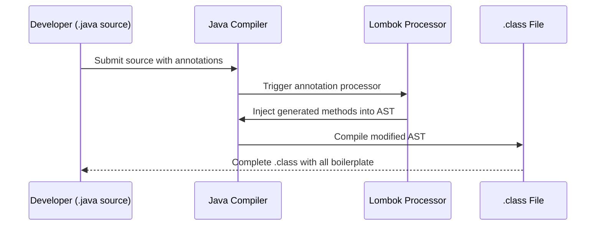
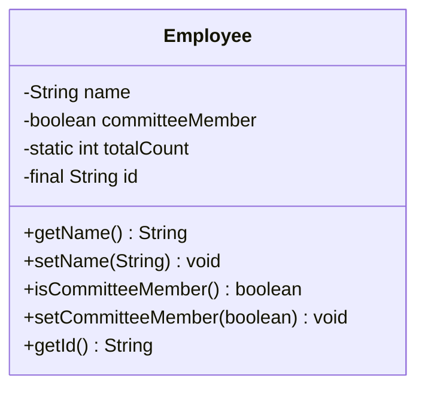
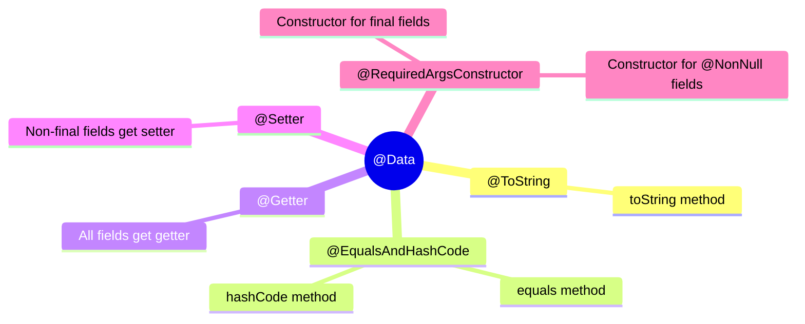
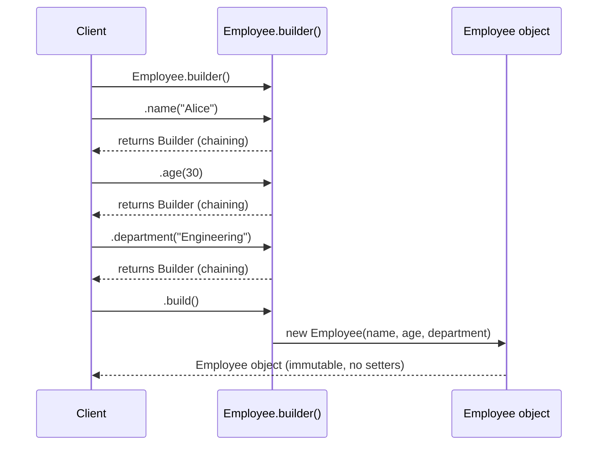
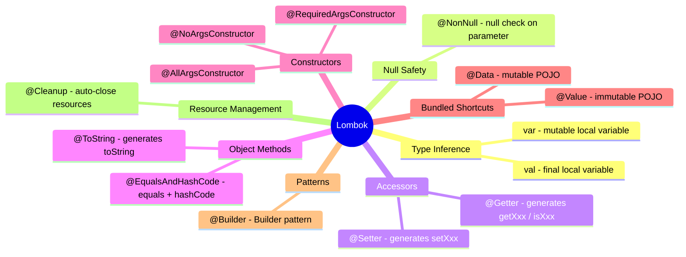

# 📘 Java Lombok — Complete Study Guide

> A professional-quality reference covering every Lombok feature discussed in the lecture, with deep explanations, code examples, diagrams, and interview notes.

---

## Table of Contents

1. [What is Lombok?](#1-what-is-lombok)
2. [Setup & Configuration](#2-setup--configuration)
3. [Feature 1 — `val` and `var`](#3-feature-1--val-and-var)
4. [Feature 2 — `@NonNull`](#4-feature-2--nonnull)
5. [Feature 3 — `@Getter` and `@Setter`](#5-feature-3--getter-and-setter)
6. [Feature 4 — `@ToString`](#6-feature-4--tostring)
7. [Feature 5 — `@NoArgsConstructor`, `@RequiredArgsConstructor`, `@AllArgsConstructor`](#7-feature-5--noargsconstructor-requiredargsconstructor-allargsconstructor)
8. [Feature 6 — `@EqualsAndHashCode`](#8-feature-6--equalsandhashcode)
9. [Feature 7 — `@Data`](#9-feature-7--data)
10. [Feature 8 — `@Value`](#10-feature-8--value)
11. [Feature 9 — `@Builder`](#11-feature-9--builder)
12. [Feature 10 — `@Cleanup`](#12-feature-10--cleanup)
13. [Quick Reference Table](#13-quick-reference-table)
14. [Interview Notes](#14-interview-notes)
15. [Common Mistakes](#15-common-mistakes)
16. [Best Practices](#16-best-practices)
17. [Practice Questions](#17-practice-questions)
18. [Summary](#18-summary)

---

# 1. What is Lombok?

## Overview

Project Lombok is a **Java library** that significantly reduces the amount of repetitive, boilerplate code that Java developers must write. It works through **Java's annotation processing mechanism** — you annotate your classes or fields with Lombok-specific annotations, and during the compilation phase, Lombok reads those annotations and automatically **injects the corresponding code** into your compiled `.class` files.

The result: your source code stays lean and readable while the bytecode contains all the necessary methods.

## Why This Concept Exists

Java is an expressive, strongly typed language — but that comes at a cost. A typical Plain Old Java Object (POJO) requires:

- Private fields
- A no-argument constructor
- Getters and setters for every field
- A meaningful `toString()` method
- Correct `equals()` and `hashCode()` implementations

For a class with just five fields, this can balloon to 80–100 lines of code where the *actual business logic* is zero lines. Critics of Java often cite this as "Java verbosity."

Lombok was created as a direct answer to this criticism. Its goal is to let you **write only what matters** — the fields and the logic — and let the library generate the rest.

## Definition

> **Lombok** is a Java annotation-processing library that generates boilerplate code (getters, setters, constructors, `equals`, `hashCode`, `toString`, and more) at **compile time** by processing annotations placed on classes and fields.

## Key Facts

| Property | Detail |
|---|---|
| Type | Java library (annotation processor) |
| Compatible with | Java 6 and all later versions |
| How it works | Code injection at compile time via annotation processing |
| Impact on runtime | Zero — no runtime dependency needed in production |
| Maven artifact | `org.projectlombok:lombok` |

## Real-world Analogy

Imagine a construction crew where instead of laying every brick manually, an automated brick-laying machine does it for you. You just specify the blueprint (annotations), and the machine fills in all the standard work (boilerplate). Your blueprint document remains short and clean, while the actual building (`.class` file) is complete.

## How Lombok Works Internally — Compile-Time Code Injection

```
Your source code (.java)
        │
        ▼
Java Compiler invokes annotation processors
        │
        ▼
Lombok reads your annotations
        │
        ▼
Lombok injects AST (Abstract Syntax Tree) nodes into the compilation unit
        │
        ▼
Compiler finishes compiling
        │
        ▼
.class file contains all the generated methods
```



> [!IMPORTANT]
> Lombok modifies the **Abstract Syntax Tree (AST)** during compilation — it does not modify your `.java` source file. Your source stays clean; only the compiled output changes.

---

# 2. Setup & Configuration

## Step 1 — Add Maven Dependency

Add the Lombok dependency to your `pom.xml`. Always use the **latest stable version**.

```xml
<dependency>
    <groupId>org.projectlombok</groupId>
    <artifactId>lombok</artifactId>
    <version>1.18.32</version> <!-- use latest -->
    <scope>provided</scope>
</dependency>
```

> [!NOTE]
> The `<scope>provided</scope>` means Lombok is only needed at compile time. It does not need to be bundled in your production JAR — because by then its job is already done.

## Step 2 — Install the IDE Plugin

Without the IDE plugin, your editor will show **red underlines and false compilation errors** — even though the code compiles and runs correctly. This happens because:

- Lombok injects code at compile time
- Your IDE's real-time analysis doesn't run the full compiler
- The IDE doesn't know what Lombok is about to generate

**In IntelliJ IDEA:**

1. Open `Settings` → `Plugins`
2. Search for **"Lombok"**
3. Install the plugin
4. Restart the IDE

## Step 3 — Enable Annotation Processing

Even with the plugin installed, the IDE needs to be told to run annotation processors during its incremental builds.

**In IntelliJ IDEA:**

1. Open `Settings` → `Build, Execution, Deployment` → `Compiler` → `Annotation Processors`
2. Check **"Enable annotation processing"**
3. Apply and OK

> [!TIP]
> These two steps (plugin + annotation processing) together make the IDE fully "Lombok-aware." It will understand what each annotation generates and stop showing false errors.

---

# 3. Feature 1 — `val` and `var`

## Overview

`val` and `var` are Lombok's local variable type inference keywords. Instead of explicitly declaring the type of a local variable, you use `val` or `var` and let Lombok (and the compiler) figure out the type from the assigned value (the initializer expression).

## Definition

| Keyword | Behavior |
|---|---|
| `val` | Infers type from initializer; makes the variable **final** (immutable) |
| `var` | Infers type from initializer; does **not** make the variable final (mutable) |

> [!IMPORTANT]
> Both `val` and `var` work **only on local variables** — variables declared inside a method body or block. They **cannot** be used for:
> - Class fields (instance or static variables)
> - Method parameters
> - Return types

## Why This Exists

In verbose Java code, you often write the type twice:

```java
// Traditional Java — type repeated
ArrayList<String> names = new ArrayList<String>();
```

With `val` or `var`, you eliminate this redundancy. The type is obvious from the right-hand side — no need to repeat yourself.

## Syntax

```java
import lombok.val;
import lombok.var;

val variableName = initializerExpression;   // final, type inferred
var variableName = initializerExpression;   // mutable, type inferred
```

## Code Example

```java
import lombok.val;
import lombok.var;

public class ValVarExample {
    public void demonstrate() {
        // val — inferred as int, made final
        val a = 10;
        // a = 20; // ❌ Compile error: cannot assign to final variable

        // val — inferred as String, made final
        val greeting = "Hello";
        System.out.println(greeting); // Hello

        // var — inferred as int, NOT final
        var count = 5;
        count = 10;  // ✅ Allowed — var is mutable
        System.out.println(count); // 10

        // val with a List — type inferred
        val names = new java.util.ArrayList<String>();
        names.add("Alice");
        names.add("Bob");
        System.out.println(names); // [Alice, Bob]
    }
}
```

### What the Compiled `.class` Looks Like

When you use `val a = 10;`, Lombok rewrites it in the bytecode as:

```java
final int a = 10;
```

And `var greeting = "Hello"` becomes:

```java
String greeting = "Hello";
```

The types are determined from the right-hand side. The IDE plugin shows you these inferred types inline.

## Key Observations

- `val` is equivalent to writing `final` + the inferred type
- `var` is equivalent to writing just the inferred type (no `final`)
- The inference happens at **compile time** — there is no runtime overhead
- Cannot be used for fields, parameters, or return types

> [!WARNING]
> Without the Lombok IDE plugin installed, your editor will underline `val` and `var` in red, claiming a compilation error. The code will still compile and run correctly because Lombok handles it at compile time. Install the plugin to fix false IDE errors.

---

# 4. Feature 2 — `@NonNull`

## Overview

`@NonNull` is a parameter/field annotation that instructs Lombok to automatically generate a **null check** at the top of the method or constructor. If a `null` value is passed for a parameter annotated with `@NonNull`, a `NullPointerException` is thrown immediately with a descriptive message.

## Why This Exists

Null pointer exceptions are among the most common bugs in Java. Without `@NonNull`, developers must write null checks manually:

```java
public void greet(String name) {
    if (name == null) {
        throw new NullPointerException("name is marked non-null but is null");
    }
    System.out.println("Hello, " + name);
}
```

This is repetitive. `@NonNull` generates this check automatically.

## Definition

> `@NonNull` causes Lombok to insert a null check as the **first statement** of the method or constructor body. If the annotated parameter is `null`, a `NullPointerException` is thrown before any other logic executes.

## Usage Scope

| Usage location | Supported? |
|---|---|
| Method parameter | ✅ Yes |
| Constructor parameter | ✅ Yes |
| Field (with constructor annotations) | ✅ Yes (generates null check in constructor) |
| Return type | ❌ No |

## Syntax

```java
import lombok.NonNull;

public void methodName(@NonNull ParameterType paramName) {
    // Lombok inserts null check here automatically
    // Your logic here
}
```

## Code Example — Source Code

```java
import lombok.NonNull;

public class NonNullExample {

    public void greet(@NonNull String name) {
        System.out.println("Hello, " + name);
    }

    public static void main(String[] args) {
        NonNullExample ex = new NonNullExample();
        ex.greet("Alice");   // Prints: Hello, Alice
        ex.greet(null);      // Throws NullPointerException
    }
}
```

## What Lombok Generates (Compiled `.class`)

```java
public void greet(String name) {
    if (name == null) {
        throw new NullPointerException("name is marked non-null but is null");
    }
    System.out.println("Hello, " + name);
}
```

Lombok adds the null check as the **very first statement** inside the method body.

## Output

```
Hello, Alice
Exception in thread "main" java.lang.NullPointerException: name is marked non-null but is null
    at NonNullExample.greet(NonNullExample.java:5)
    at NonNullExample.main(NonNullExample.java:11)
```

## Key Observations

- The null check is always inserted **before** any user-written logic
- The exception message includes the parameter name, making debugging easy
- Works seamlessly with constructor annotations (`@AllArgsConstructor`, etc.) — more on this in Feature 5

---

# 5. Feature 3 — `@Getter` and `@Setter`

## Overview

`@Getter` and `@Setter` are Lombok's most widely used annotations. They automatically generate the standard `getXxx()` and `setXxx()` methods for your fields, following Java naming conventions (with `isXxx()` for boolean fields).

## Why This Exists

Every POJO class in Java requires getters and setters — sometimes dozens of them. Writing them by hand is tedious, error-prone (typos in method names), and inflates your source files with non-logic code.

## Definition

| Annotation | What it generates |
|---|---|
| `@Getter` on a field | A `getFieldName()` method (or `isFieldName()` for `boolean`) |
| `@Setter` on a field | A `setFieldName(Type value)` method |
| `@Getter` on a class | `@Getter` applied to all non-static fields |
| `@Setter` on a class | `@Setter` applied to all non-static, non-final fields |

## Default Access Level

By default, Lombok generates getter and setter methods as **`public`**.

## Syntax — Field Level

```java
import lombok.Getter;
import lombok.Setter;

public class Person {

    @Getter @Setter
    private String name;

    @Getter @Setter
    private boolean committeeMemeber;
}
```

## What Lombok Generates

```java
public String getName() {
    return this.name;
}

public void setName(String name) {
    this.name = name;
}

public boolean isCommitteeMember() {
    return this.committeeMember;
}

public void setCommitteeMember(boolean committeeMember) {
    this.committeeMember = committeeMember;
}
```

> [!NOTE]
> For `boolean` fields, the getter is prefixed with `is` (not `get`). This follows the Java Bean specification.

## Controlling Access Level

You can override the default `public` access level for any getter or setter:

```java
import lombok.AccessLevel;
import lombok.Getter;
import lombok.Setter;

public class Person {

    @Getter(AccessLevel.PRIVATE)
    @Setter(AccessLevel.PROTECTED)
    private String name;

    // No access level specified — defaults to PUBLIC
    @Getter @Setter
    private boolean committeeMember;
}
```

**Available access levels:**

| `AccessLevel` constant | Java visibility |
|---|---|
| `PUBLIC` | `public` (default) |
| `PROTECTED` | `protected` |
| `PACKAGE` | package-private (no keyword) |
| `PRIVATE` | `private` |
| `NONE` | Do not generate this method |

## Class-Level Usage

Apply `@Getter` or `@Setter` to the entire class to generate methods for **all eligible fields at once**:

```java
import lombok.Getter;
import lombok.Setter;

@Getter
@Setter
public class Employee {
    private String name;
    private boolean committeeMember;
    private static int totalCount;  // static — no getter/setter generated
    private final String id = "E001"; // final — no setter generated
}
```

### Rules for Class-Level Annotations

| Field type | `@Getter` generates getter? | `@Setter` generates setter? |
|---|---|---|
| Non-static, non-final | ✅ Yes | ✅ Yes |
| Static | ❌ No | ❌ No |
| Final (non-static) | ✅ Yes | ❌ No (can't reassign final) |

## Skipping a Specific Field with `AccessLevel.NONE`

When using class-level annotations, you can exclude specific fields:

```java
@Getter
@Setter
public class Employee {
    private String name;

    @Setter(AccessLevel.NONE) // No setter for this field
    private boolean committeeMember;
}
```

This overrides the class-level `@Setter` for `committeeMember`, suppressing setter generation for just that field.

## Diagrams



> Static fields and final fields get no setters. Final fields still get a getter. Static fields get nothing.

---

# 6. Feature 4 — `@ToString`

## Overview

`@ToString` generates a `toString()` method for your class. This is extremely useful for logging and debugging — it gives you a human-readable string representation of an object's state without writing the method yourself.

## Why This Exists

The default `toString()` inherited from `Object` returns something like `com.example.Person@3764951d` — the class name and memory address hash. This is useless for debugging. Every POJO should override `toString()`, but writing it manually is repetitive.

## Default Format

```
ClassName(field1=value1, field2=value2, ...)
```

## Syntax

```java
import lombok.ToString;

@ToString
public class Person {
    private String name;
    private boolean committeeMember;
}
```

## Generated Method (Default)

```java
@Override
public String toString() {
    return "Person(name=" + this.name + ", committeeMember=" + this.committeeMember + ")";
}
```

## Configuration Options

### Excluding Specific Fields

Use `@ToString.Exclude` on any field you don't want in the output (e.g., sensitive data, passwords, large objects):

```java
@ToString
public class Person {
    private String name;

    @ToString.Exclude
    private boolean committeeMember; // Won't appear in toString output
}
```

**Output:** `Person(name=Alice)`

### Hiding Field Names

To print only values (smaller log output):

```java
@ToString(includeFieldNames = false)
public class Person {
    private String name;
    private boolean committeeMember;
}
```

**Output:** `Person(Alice, true)`

### Explicitly Selecting Fields

Include only fields you explicitly mark, ignoring all others:

```java
@ToString(onlyExplicitlyIncluded = true)
public class Person {
    @ToString.Include
    private String name;

    private boolean committeeMember; // Not included — not marked
}
```

**Output:** `Person(name=Alice)`

## Options Summary Table

| Option | Default | Description |
|---|---|---|
| `includeFieldNames` | `true` | Print `fieldName=value` pairs |
| `onlyExplicitlyIncluded` | `false` | Only include fields marked `@ToString.Include` |
| `callSuper` | `false` | Include parent class `toString()` in output |
| `@ToString.Exclude` on field | — | Skip this field |
| `@ToString.Include` on field | — | Explicitly include (used with `onlyExplicitlyIncluded=true`) |

---

# 7. Feature 5 — `@NoArgsConstructor`, `@RequiredArgsConstructor`, `@AllArgsConstructor`

## Overview

Lombok provides three annotations to automatically generate constructors. Each generates a different form of constructor based on the fields in the class.

## Definitions

| Annotation | Constructor generated |
|---|---|
| `@NoArgsConstructor` | A constructor with **no parameters** |
| `@AllArgsConstructor` | A constructor with **all fields** as parameters |
| `@RequiredArgsConstructor` | A constructor with only **`final`** fields and **`@NonNull`** fields as parameters |

## Why This Exists

Most POJOs need at least one constructor. Writing them manually (especially when fields change) is tedious and error-prone. These three annotations cover the most common constructor patterns.

## Code Example

```java
import lombok.*;

@NoArgsConstructor
@AllArgsConstructor
@RequiredArgsConstructor
public class Employee {
    private String name;
    private boolean committeeMember;

    @NonNull
    private Integer age;
}
```

### Generated Constructors

**1. `@NoArgsConstructor`**
```java
public Employee() {
}
```

**2. `@AllArgsConstructor`**
```java
public Employee(String name, boolean committeeMember, Integer age) {
    if (age == null) {
        throw new NullPointerException("age is marked non-null but is null");
    }
    this.name = name;
    this.committeeMember = committeeMember;
    this.age = age;
}
```

> Notice: because `age` is `@NonNull`, a null check is automatically inserted in the all-args constructor too.

**3. `@RequiredArgsConstructor`**
```java
public Employee(@NonNull Integer age) {
    if (age == null) {
        throw new NullPointerException("age is marked non-null but is null");
    }
    this.age = age;
}
```

Only `age` appears — because it is the only `final` or `@NonNull` field.

## How `@NonNull` Interacts with Constructor Annotations

This is a frequently asked interview point. `@NonNull` can be placed on a **field**, and when combined with constructor-generating annotations, Lombok will:

1. Include that field as a constructor parameter (in `@RequiredArgsConstructor` and `@AllArgsConstructor`)
2. Insert a null check at the top of the constructor

## Diagram

```mermaid
flowchart TD
    A[Fields in class] --> B{Field type?}
    B -->|All fields| C[@AllArgsConstructor\nAll fields in constructor]
    B -->|final or @NonNull fields| D[@RequiredArgsConstructor\nOnly final and @NonNull fields]
    B -->|No fields| E[@NoArgsConstructor\nEmpty constructor]
```

---

# 8. Feature 6 — `@EqualsAndHashCode`

## Overview

`@EqualsAndHashCode` generates `equals(Object o)` and `hashCode()` methods that follow the **equals-hashCode contract** required by Java's `Object` specification.

## Why This Exists

Correctly implementing `equals()` and `hashCode()` together is notoriously tricky in Java:
- They must be **consistent** — if two objects are equal (`equals()` returns `true`), they must have the same `hashCode()`
- Forgetting to update one when fields change is a common, hard-to-debug bug
- Used extensively by `HashMap`, `HashSet`, `LinkedHashMap` — getting it wrong causes silent data loss

> [!NOTE]
> For a deep explanation of the equals-hashCode contract and how `HashMap` uses it internally, consult the Java HashMap Internal Working topic.

## Default Behavior

By default, `@EqualsAndHashCode` uses **all non-static, non-transient** fields for both `equals()` and `hashCode()`.

## Syntax

```java
import lombok.EqualsAndHashCode;

@EqualsAndHashCode
public class Person {
    private String name;
    private boolean committeeMember;
    private static int count; // static — excluded automatically
}
```

## Excluding Specific Fields

```java
@EqualsAndHashCode
public class Person {
    private String name;

    @EqualsAndHashCode.Exclude
    private boolean committeeMember; // Excluded from equals and hashCode
}
```

## Generated Methods

```java
@Override
public boolean equals(Object o) {
    if (o == this) return true;
    if (!(o instanceof Person)) return false;
    final Person other = (Person) o;
    if (!other.canEqual((Object) this)) return false;
    final Object this$name = this.name;
    final Object other$name = other.name;
    if (this$name == null ? other$name != null : !this$name.equals(other$name)) return false;
    return true;
}

@Override
public int hashCode() {
    final int PRIME = 59;
    int result = 1;
    final Object $name = this.name;
    result = result * PRIME + ($name == null ? 43 : $name.hashCode());
    return result;
}
```

The generated code correctly handles `null` fields and follows the equals-hashCode contract.

## Exclusion/Inclusion Rules Summary

| Field type | Included by default? |
|---|---|
| Non-static, non-transient | ✅ Yes |
| Static | ❌ No |
| Transient | ❌ No |
| Fields marked `@EqualsAndHashCode.Exclude` | ❌ No |

---

# 9. Feature 7 — `@Data`

## Overview

`@Data` is a **convenience shortcut annotation** that bundles several Lombok annotations together into one. It is the most commonly used Lombok annotation in production code.

## Definition

```
@Data = @ToString
       + @EqualsAndHashCode
       + @Getter (on all fields)
       + @Setter (on all non-final fields)
       + @RequiredArgsConstructor
```

## Syntax

```java
import lombok.Data;
import lombok.NonNull;

@Data
public class Employee {
    private String name;
    private final int age;        // final — getter only, no setter
    @NonNull private String address; // @NonNull — in RequiredArgsConstructor
}
```

## What Lombok Generates

From this single `@Data` annotation, Lombok generates:

| Generated method | Reason |
|---|---|
| `toString()` | From `@ToString` |
| `equals()` and `hashCode()` | From `@EqualsAndHashCode` |
| `getName()`, `getAge()`, `getAddress()` | Getters for all fields |
| `setName(String)` | Setter for `name` (non-final) |
| `setAddress(String)` | Setter for `address` (non-final, but with null check from `@NonNull`) |
| *(no setter for `age`)* | `age` is final — no setter |
| Constructor with `age` and `address` | `@RequiredArgsConstructor` — final + `@NonNull` fields |

## Generated Code (Compiled `.class`)

```java
// toString
public String toString() {
    return "Employee(name=" + this.name + ", age=" + this.age + ", address=" + this.address + ")";
}

// equals and hashCode (following contract)
// ... (standard implementation using all non-static fields)

// Getters
public String getName() { return this.name; }
public int getAge() { return this.age; }
public String getAddress() { return this.address; }

// Setters (non-final fields only)
public void setName(String name) { this.name = name; }
public void setAddress(@NonNull String address) {
    if (address == null) throw new NullPointerException("address is marked non-null but is null");
    this.address = address;
}

// RequiredArgsConstructor
public Employee(int age, @NonNull String address) {
    if (address == null) throw new NullPointerException("address is marked non-null but is null");
    this.age = age;
    this.address = address;
}
```

## Diagram



> [!IMPORTANT]
> `@Data` is a very powerful shortcut but **can cause issues in inheritance hierarchies**. Child classes that use `@Data` may have incorrect `equals()` implementations. Prefer explicit annotations or `@EqualsAndHashCode(callSuper = true)` in such cases.

---

# 10. Feature 8 — `@Value`

## Overview

`@Value` is the **immutable counterpart** of `@Data`. It generates all the same methods but applies immutability constraints to the class and all its fields.

## Definition

```
@Value = @ToString
        + @EqualsAndHashCode
        + @Getter (all fields)
        + NO @Setter (immutable — no setters generated)
        + @AllArgsConstructor (because all fields become final)
        + Makes class `final` (cannot be subclassed)
        + Makes all fields `private final`
```

## Key Differences: `@Data` vs `@Value`

| Feature | `@Data` | `@Value` |
|---|---|---|
| Fields | Mutable (unless individually `final`) | All made `private final` |
| Setters | Generated for non-final fields | ❌ Not generated |
| Class modifier | Not `final` | Made `final` (cannot extend) |
| Constructor | `@RequiredArgsConstructor` | `@AllArgsConstructor` (all fields are final) |
| Use case | Mutable POJO | Immutable value object |

## Why `@Value` Uses `@AllArgsConstructor`

Since `@Value` makes **all fields `final`**, every field must be set in the constructor (there are no setters). A `@RequiredArgsConstructor` that only includes `final` fields is effectively the same as an `@AllArgsConstructor` when all fields are final.

## Code Example

```java
import lombok.Value;

@Value
public class Coordinate {
    double latitude;
    double longitude;
    String label;
}
```

**Usage:**
```java
Coordinate coord = new Coordinate(28.61, 77.20, "New Delhi");
System.out.println(coord.getLatitude());  // 28.61
System.out.println(coord);               // Coordinate(latitude=28.61, longitude=77.20, label=New Delhi)
// coord.setLatitude(0.0);  ❌ No setter exists
```

## Generated `.class` (Conceptual)

```java
public final class Coordinate {
    private final double latitude;
    private final double longitude;
    private final String label;

    public Coordinate(double latitude, double longitude, String label) {
        this.latitude = latitude;
        this.longitude = longitude;
        this.label = label;
    }

    public double getLatitude() { return this.latitude; }
    public double getLongitude() { return this.longitude; }
    public String getLabel() { return this.label; }

    // toString, equals, hashCode generated following contract
}
```

## Real-World Use Case

`@Value` is ideal for:
- **DTOs (Data Transfer Objects)** that should not be modified after creation
- **Value objects** in Domain-Driven Design (DDD)
- **Configuration objects** that are set once and read many times

---

# 11. Feature 9 — `@Builder`

## Overview

`@Builder` implements the **Builder design pattern** automatically. It is used to construct objects piece by piece and is especially useful when a class has many fields, some of which are optional.

## Why This Exists

Constructor calls with many parameters are hard to read:

```java
// Which argument is which? Hard to tell!
Employee emp = new Employee("Alice", 30, true, "Engineering", "New York", 75000.0);
```

The Builder pattern makes object creation readable and flexible:

```java
Employee emp = Employee.builder()
    .name("Alice")
    .age(30)
    .committeeMember(true)
    .department("Engineering")
    .build();
```

## Two purposes of Builder Pattern

1. **Part-by-part object construction** — Set only the fields you need, in any order
2. **Achieving immutability** — The built object has no setters; once `build()` is called, the object cannot change

## Syntax

```java
import lombok.Builder;

@Builder
public class Employee {
    private String name;
    private int age;
    private String department;
}
```

## What Lombok Generates

Lombok generates an inner static `Builder` class:

```java
public class Employee {
    private String name;
    private int age;
    private String department;

    // Private all-args constructor (called only by Builder)
    private Employee(String name, int age, String department) { ... }

    // Static builder() factory method
    public static EmployeeBuilder builder() {
        return new EmployeeBuilder();
    }

    // Inner Builder class
    public static class EmployeeBuilder {
        private String name;
        private int age;
        private String department;

        public EmployeeBuilder name(String name) {
            this.name = name;
            return this; // returns Builder — enables method chaining
        }

        public EmployeeBuilder age(int age) {
            this.age = age;
            return this;
        }

        public EmployeeBuilder department(String department) {
            this.department = department;
            return this;
        }

        public Employee build() {
            return new Employee(name, age, department);
        }
    }
}
```

## Usage

```java
Employee emp = Employee.builder()
    .name("Alice")
    .age(30)
    .department("Engineering")
    .build();

System.out.println(emp);
```

Each setter method in the Builder returns `this` (the builder object itself), enabling **method chaining**. Only `build()` returns the final `Employee` object.

## Sequence Diagram



## Immutability with `@Builder`

When you use `@Builder` without `@Setter`, the resulting object has no setter methods — it can only be constructed through the builder. After `build()` is called, the object's state cannot change.

```java
Employee emp = Employee.builder().name("Alice").build();
// emp.setName("Bob"); ❌ No setName() method exists!
```

> [!TIP]
> Combine `@Builder` with `@Value` for a fully immutable object with a convenient builder API. This is a very common pattern in production Java code.

---

# 12. Feature 10 — `@Cleanup`

## Overview

`@Cleanup` ensures that a resource (like an input/output stream, database connection, etc.) is **automatically closed** when the current code block exits — whether normally or due to an exception.

## Why This Exists

Java requires resources like streams, connections, and readers to be explicitly closed. Without cleanup:

```java
FileInputStream fis = new FileInputStream("data.txt");
// If an exception happens here, fis is never closed → resource leak!
int data = fis.read();
fis.close(); // May never be reached
```

You should always use a `try-finally` block:

```java
FileInputStream fis = null;
try {
    fis = new FileInputStream("data.txt");
    int data = fis.read();
} finally {
    if (fis != null) fis.close();
}
```

This is verbose. Java 7 introduced `try-with-resources`, but `@Cleanup` is an alternative that keeps code even simpler.

## Definition

> `@Cleanup` generates a `try-finally` block around the annotated resource, ensuring its `close()` method is called before the execution path exits the current scope.

## Syntax

```java
import lombok.Cleanup;
import java.io.*;

public class FileReader {
    public void readFile() throws IOException {
        @Cleanup FileInputStream fis = new FileInputStream("data.txt");
        // Use fis here — Lombok guarantees it will be closed
        int data = fis.read();
        System.out.println(data);
    } // fis.close() is called here automatically
}
```

## What Lombok Generates (Compiled `.class`)

```java
public void readFile() throws IOException {
    FileInputStream fis = new FileInputStream("data.txt");
    try {
        int data = fis.read();
        System.out.println(data);
    } finally {
        if (fis != null) {
            fis.close();
        }
    }
}
```

Lombok wraps the usage of `fis` in a `try-finally` and calls `.close()` in the `finally` block.

## Comparison with `try-with-resources`

| Feature | `@Cleanup` | `try-with-resources` |
|---|---|---|
| Java version | Java 6+ | Java 7+ |
| Syntax overhead | Very low | Low |
| Multiple resources | Stack annotations | Nest `try` or comma-separate |
| Standard Java | No (Lombok required) | Yes (standard Java) |
| IDE support without plugin | Poor | Full |

> [!TIP]
> In modern Java projects (Java 7+), `try-with-resources` is the standard idiomatic approach. `@Cleanup` is a Lombok alternative that achieves the same result with slightly less syntax, but requires Lombok as a dependency.

---

# 13. Quick Reference Table

| Annotation | What It Does |
|---|---|
| `val` | Final local variable with inferred type |
| `var` | Mutable local variable with inferred type |
| `@NonNull` | Generates null check; throws NPE if null |
| `@Getter` | Generates `getXxx()` / `isXxx()` method |
| `@Setter` | Generates `setXxx()` method |
| `@ToString` | Generates `toString()` method |
| `@NoArgsConstructor` | Generates no-argument constructor |
| `@AllArgsConstructor` | Generates constructor with all fields |
| `@RequiredArgsConstructor` | Generates constructor for `final` and `@NonNull` fields |
| `@EqualsAndHashCode` | Generates `equals()` and `hashCode()` |
| `@Data` | `@ToString` + `@EqualsAndHashCode` + `@Getter` + `@Setter` (non-final) + `@RequiredArgsConstructor` |
| `@Value` | Immutable `@Data` — all fields `private final`, class `final`, no setters |
| `@Builder` | Generates Builder pattern inner class |
| `@Cleanup` | Auto-closes resource via `try-finally` |

---

# 14. Interview Notes

> [!IMPORTANT]
> These are the most frequently asked Lombok interview questions in Java developer interviews.

### Q1: What is Lombok and how does it work?

**Answer:** Lombok is a Java annotation-processing library that reduces boilerplate code. It works at compile time: the Lombok processor reads annotations on your source code and injects generated methods (getters, setters, constructors, etc.) directly into the AST (Abstract Syntax Tree). The resulting `.class` file contains all the generated code, but your `.java` source remains clean. There is no runtime dependency required.

---

### Q2: What is the difference between `val` and `var` in Lombok?

**Answer:** Both infer the type from the initializer expression. `val` makes the variable `final` (immutable); `var` does not. Both only work for local variables, not fields or method parameters.

---

### Q3: What does `@NonNull` generate and where can it be used?

**Answer:** `@NonNull` generates a null check (`if (param == null) throw new NullPointerException(...)`) as the first statement in the method or constructor. It can be used on method parameters, constructor parameters, and fields (the null check appears in the constructor when combined with `@RequiredArgsConstructor` or `@AllArgsConstructor`).

---

### Q4: When using `@Setter` at the class level, which fields get a setter?

**Answer:** Only non-static, non-final fields get setters. Static fields are excluded because setters are instance-level operations. Final fields are excluded because their value cannot be reassigned after initialization.

---

### Q5: What is the difference between `@Data` and `@Value`?

**Answer:** `@Data` generates a mutable POJO (fields are not final, setters are generated for non-final fields). `@Value` generates an immutable class (all fields are made `private final`, the class itself is made `final`, and no setters are generated).

---

### Q6: Why does `@Value` generate `@AllArgsConstructor` while `@Data` generates `@RequiredArgsConstructor`?

**Answer:** `@Data` uses `@RequiredArgsConstructor` because fields can be mutable — you might set optional fields via setters after construction. `@Value` makes all fields `final`, so they must all be initialized in the constructor, which is equivalent to `@AllArgsConstructor`.

---

### Q7: What does the `@Builder` annotation generate?

**Answer:** It generates an inner static `Builder` class with: one setter method per field (returning `this` for chaining), a static `builder()` factory method on the outer class, and a `build()` method that constructs the final object. The builder enables part-by-part object construction and can help achieve immutability.

---

### Q8: What is the difference between `@Cleanup` and `try-with-resources`?

**Answer:** Both ensure resources are closed. `@Cleanup` is a Lombok annotation that generates `try-finally`. `try-with-resources` is standard Java (Java 7+) syntax that also generates cleanup code. `try-with-resources` is preferred in modern Java as it's a language feature with full IDE support and no external library needed.

---

### Q9: Why does my IDE show compilation errors with Lombok even though the code compiles?

**Answer:** The IDE's real-time analysis runs before Lombok's annotation processor. Without the Lombok IDE plugin and annotation processing enabled, the IDE doesn't know what code Lombok will generate. After installing the plugin and enabling annotation processing in settings, the IDE becomes "Lombok-aware" and resolves the false errors.

---

### Q10: Is Lombok a runtime dependency?

**Answer:** No. Lombok is a compile-time tool. The code it generates is written into `.class` files during compilation. At runtime, the generated bytecode runs without any knowledge of Lombok. The dependency can be set to `<scope>provided</scope>` in Maven.

---

# 15. Common Mistakes

> [!WARNING]
> **Mistake 1: Using `val` or `var` on a field (not a local variable)**

```java
// ❌ Wrong — val/var cannot be used as field types
public class Example {
    val name = "Hello"; // Compile error
}

// ✅ Correct — val/var only inside method bodies
public void method() {
    val name = "Hello"; // Works fine
}
```

---

> [!WARNING]
> **Mistake 2: Expecting a setter for a `final` field when using `@Data` or `@Setter` at class level**

```java
@Data
public class Config {
    private final String host = "localhost"; // final — NO setter generated!
}

// ✅ Remember: @Data setters are only generated for non-final fields
```

---

> [!WARNING]
> **Mistake 3: Forgetting that `@Data` on a subclass may produce incorrect `equals()`**

```java
@Data
class Animal { private String name; }

@Data
class Dog extends Animal { private String breed; }

// equals() in Dog may not behave correctly for subclass equality
// ✅ Use @EqualsAndHashCode(callSuper = true) on the subclass
```

---

> [!WARNING]
> **Mistake 4: Not enabling annotation processing in the IDE**

Without enabling annotation processing, Lombok-generated methods aren't visible to the IDE. You'll see red lines everywhere and missing method errors in code that actually compiles and runs fine. Always enable annotation processing alongside the Lombok plugin.

---

# 16. Best Practices

1. **Always use `<scope>provided</scope>`** for the Lombok Maven dependency — it's compile-time only.

2. **Use `@Data` for simple mutable POJOs** — it bundles everything you typically need.

3. **Use `@Value` for immutable value objects** — DTOs, configuration, results.

4. **Use `@Builder`** when constructing objects with many optional fields — avoids telescoping constructors.

5. **Be careful with `@Data` in inheritance** — use `@EqualsAndHashCode(callSuper = true)` explicitly on subclasses.

6. **Prefer `@NonNull` on parameters** over inline null checks — it's self-documenting and consistent.

7. **Use `@ToString.Exclude`** to prevent sensitive fields (passwords, tokens) from appearing in logs.

8. **Commit the Lombok plugin settings** to version control (`.idea` folder or equivalent) so all team members get the same IDE setup.

9. **Don't mix Lombok and manual implementations** of the same method (e.g., don't use `@Getter` and also write a `getName()` by hand — they'll conflict).

10. **Use `@Cleanup`** only if you need Java 6 compatibility; prefer `try-with-resources` in Java 7+ projects.

---

# 17. Practice Questions

### Easy

1. What does `val` do differently from `var` in Lombok?
2. Which fields does `@Setter` at class level skip?
3. What is the default access level of Lombok-generated getters and setters?
4. What annotation would you use to suppress getter generation for a specific field when using `@Getter` at class level?
5. What methods does `@Data` generate?

### Medium

6. Write a class using `@Builder` for a `Product` with fields: `String name`, `double price`, `int stock`. Show how to create an object using the builder.
7. Explain why `@Value` generates an `@AllArgsConstructor` while `@Data` generates a `@RequiredArgsConstructor`.
8. You have a class with a `password` field. You're using `@ToString` at class level. How do you prevent the password from appearing in logs?
9. What happens when you put `@NonNull` on a field and use `@AllArgsConstructor`?
10. Compare `@Cleanup` and Java's `try-with-resources` — when would you prefer each?

### Hard

11. A `Student` class extends `Person`. Both use `@Data`. Explain what problem might arise with `equals()` and how to fix it.
12. Implement an immutable `Address` class using `@Value` and a `Person` class using `@Builder` that contains an `Address`. Show object creation.
13. Why is Lombok's `@NonNull` check inserted before other code in the method body? What are the implications for debugging?
14. Explain how Lombok works at the JVM/compiler level. Why doesn't it modify your `.java` source files?
15. You have a class with 10 fields. 3 are `final`, 2 are `@NonNull`, and 5 are optional. Which constructor annotations would you use and why?

---

# 18. Summary



### Quick Revision Bullets

- **Lombok** reduces boilerplate by injecting code at compile time via annotation processing
- **`val`** = final local variable with inferred type; **`var`** = mutable local variable with inferred type; both only work for local variables
- **`@NonNull`** generates a null check that throws `NullPointerException` if the parameter is null
- **`@Getter`/`@Setter`** generate accessor methods; default access is `public`; use `AccessLevel.NONE` to suppress
- **`@ToString`** generates `toString()`; use `@ToString.Exclude` to hide fields; `includeFieldNames=false` to hide field names
- **`@EqualsAndHashCode`** generates both methods following the equals-hashCode contract; excludes static and transient fields by default
- **`@Data`** = `@ToString` + `@EqualsAndHashCode` + `@Getter` (all) + `@Setter` (non-final) + `@RequiredArgsConstructor`
- **`@Value`** = immutable `@Data`; all fields become `private final`; class becomes `final`; no setters; uses `@AllArgsConstructor`
- **`@Builder`** generates an inner Builder class enabling fluent, part-by-part object construction with method chaining
- **`@Cleanup`** generates `try-finally` block to close resources automatically
- **IDE Setup**: Install Lombok plugin + enable Annotation Processing for full IDE support
- **Maven**: Use `<scope>provided</scope>` — Lombok is compile-time only, no runtime dependency needed

---

*This guide covers the top 10 Lombok features most frequently encountered in Java production codebases. For the complete list of Lombok features, visit [projectlombok.org](https://projectlombok.org/features/).*
