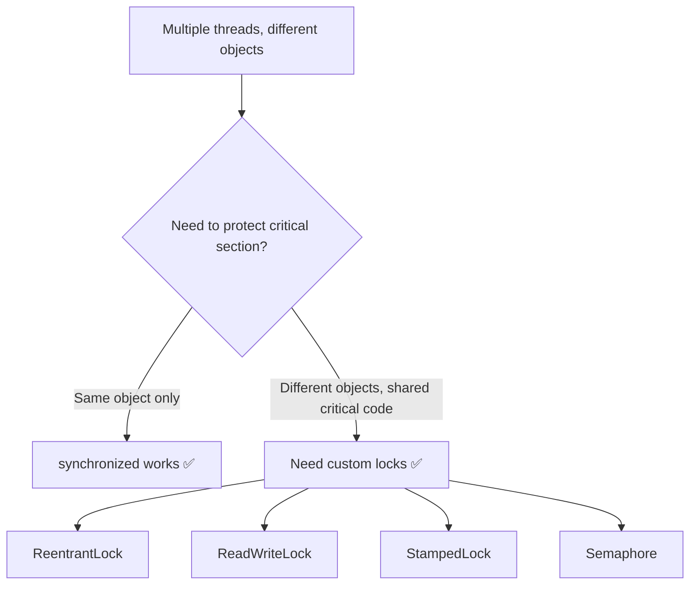
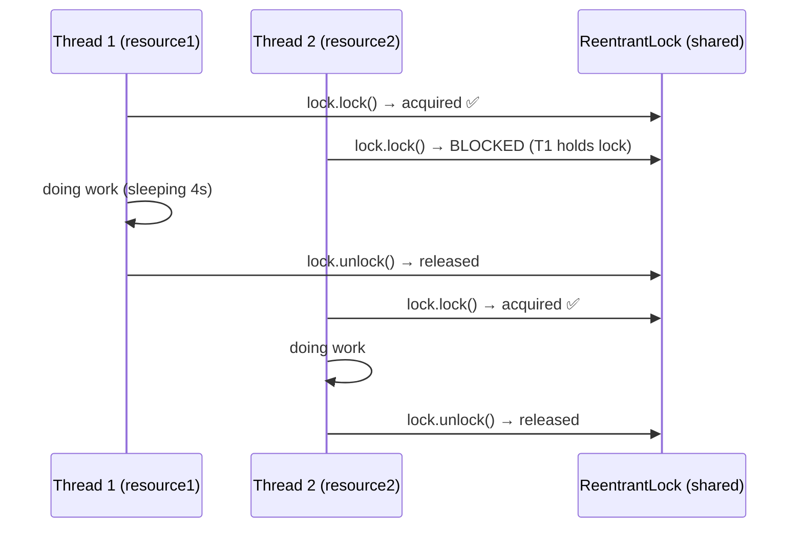
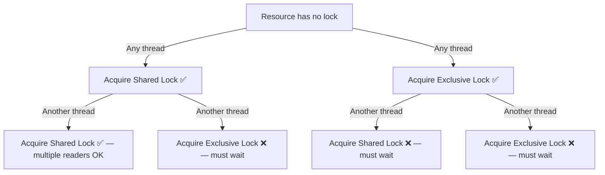
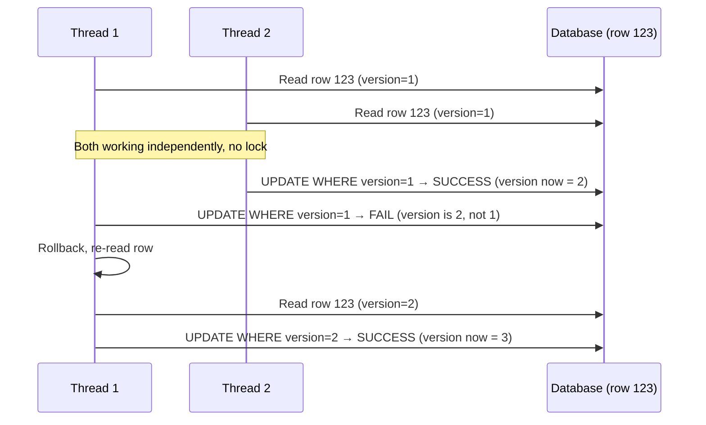
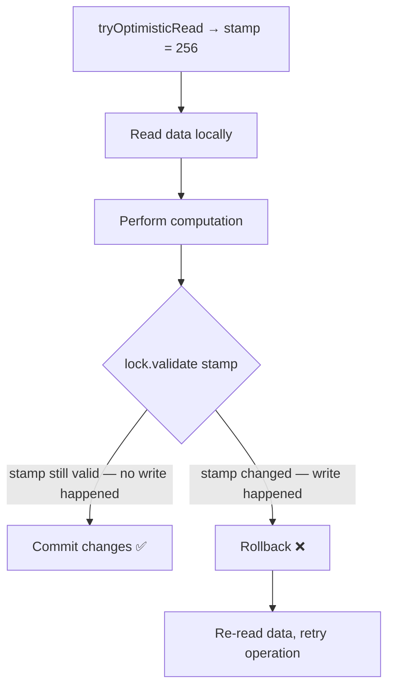

# 📌 Java Multithreading — Advanced Locks: ReentrantLock, ReadWriteLock, StampedLock & Semaphore

> **Series Context:** This is Part 3 of the Java Multithreading series. It assumes you understand `synchronized`, monitor locks, `wait()`, `notify()`, and the thread lifecycle from Parts 1 & 2. This guide covers advanced custom locking mechanisms and inter-thread communication without `synchronized`.

---

## Table of Contents

1. [Why Custom Locks? The Problem with synchronized](#1-why-custom-locks-the-problem-with-synchronized)
2. [Overview of Lock Types](#2-overview-of-lock-types)
3. [ReentrantLock](#3-reentrantlock)
4. [Shared Lock vs Exclusive Lock](#4-shared-lock-vs-exclusive-lock)
5. [ReadWriteLock](#5-readwritelock)
6. [Pessimistic vs Optimistic Locking](#6-pessimistic-vs-optimistic-locking)
7. [StampedLock](#7-stampedlock)
8. [Semaphore](#8-semaphore)
9. [Inter-Thread Communication with Custom Locks — Condition](#9-inter-thread-communication-with-custom-locks--condition)
10. [Full Comparison Table](#10-full-comparison-table)
11. [Common Mistakes](#11-common-mistakes)
12. [Best Practices](#12-best-practices)
13. [Interview Notes](#13-interview-notes)
14. [Practice Questions](#14-practice-questions)
15. [Summary](#15-summary)

---

## 1. Why Custom Locks? The Problem with `synchronized`

### 1.1 Recap — How `synchronized` Monitor Lock Works

When you place `synchronized` on a method or block, Java puts a **monitor lock on the specific object** that called the method. Only one thread at a time can hold the monitor lock for a given object.

```java
class SharedResource {
    synchronized void produce() {
        System.out.println("Lock acquired by: " + Thread.currentThread().getName());
        try { Thread.sleep(4000); } catch (InterruptedException e) { e.printStackTrace(); }
        System.out.println("Lock released by: " + Thread.currentThread().getName());
    }
}
```

```java
SharedResource resource1 = new SharedResource();
SharedResource resource2 = new SharedResource(); // DIFFERENT object

Thread t1 = new Thread(() -> resource1.produce()); // monitor lock on resource1
Thread t2 = new Thread(() -> resource2.produce()); // monitor lock on resource2

t1.start();
t2.start();
```

**Output:**
```
Lock acquired by: Thread-0
Lock acquired by: Thread-1    ← Both acquired simultaneously!
Lock released by: Thread-0
Lock released by: Thread-1
```

Both threads entered the critical section at the same time because the monitor lock is **per-object** — `resource1` and `resource2` are different objects with independent locks.

### 1.2 The Real-World Problem

In many real-world scenarios, **multiple threads use different objects** but access the same critical code. You need a lock that:

> "No matter which object created you, no matter how many objects exist — **only one thread (or a controlled number) may enter this critical section at a time**."

`synchronized` cannot do this. This is exactly where **custom locks** come in.



---

## 2. Overview of Lock Types

| Lock Type | Package | Key Feature | Use Case |
|---|---|---|---|
| `ReentrantLock` | `java.util.concurrent.locks` | Replaces `synchronized`; object-independent lock | Any scenario where `synchronized` doesn't suffice |
| `ReadWriteLock` | `java.util.concurrent.locks` | Multiple readers OR one exclusive writer | Read-heavy workloads |
| `StampedLock` | `java.util.concurrent.locks` | Read/write lock + optimistic reading | Very high read throughput; optimistic concurrency |
| `Semaphore` | `java.util.concurrent` | Allows N threads into critical section simultaneously | Connection pools, resource throttling |

> [!NOTE]
> All four are part of `java.util.concurrent` (JUC), introduced in Java 5. They are **not based on monitor locks** — they use their own internal locking state.

---

## 3. ReentrantLock

### 3.1 What Is ReentrantLock?

`ReentrantLock` is the most direct replacement for `synchronized`. Unlike `synchronized`, the lock is **not tied to any specific object** — it is its own independent object. Any thread that holds a reference to the same `ReentrantLock` instance must compete for it.

The name "reentrant" means that **the same thread that holds the lock can acquire it again** (re-enter a locked section) without deadlocking itself. `synchronized` is also reentrant for the same reason.

### 3.2 Key Methods

| Method | Description |
|---|---|
| `lock()` | Acquires the lock. Blocks if another thread holds it. |
| `unlock()` | Releases the lock. **Must be called in a `finally` block.** |
| `tryLock()` | Tries to acquire the lock. Returns `true` if acquired, `false` otherwise. Non-blocking. |
| `tryLock(long time, TimeUnit unit)` | Like `tryLock()` but waits up to the given timeout. |
| `lockInterruptibly()` | Acquires lock but can be interrupted while waiting. |
| `isLocked()` | Returns `true` if the lock is held by any thread. |
| `getHoldCount()` | Returns the number of times the current thread holds this lock (reentrancy count). |

### 3.3 Why `unlock()` Must Always Be in `finally`

If an exception is thrown inside the locked section and `unlock()` is not in `finally`, the lock is **never released** — causing all waiting threads to hang forever (deadlock).

```java
lock.lock();
try {
    // critical section — exception might happen here
    riskyOperation();
} finally {
    lock.unlock(); // ALWAYS runs, even if exception thrown
}
```

### 3.4 Solving the Multi-Object Problem with ReentrantLock

```java
import java.util.concurrent.locks.ReentrantLock;

class SharedResource {
    void produce(ReentrantLock lock) {
        lock.lock(); // acquire the lock — independent of 'this' object
        try {
            System.out.println("Lock acquired by: " + Thread.currentThread().getName());
            Thread.sleep(4000);
            System.out.println("Lock released by: " + Thread.currentThread().getName());
        } catch (InterruptedException e) {
            Thread.currentThread().interrupt();
        } finally {
            lock.unlock(); // always release
        }
    }
}
```

```java
public class ReentrantLockDemo {
    public static void main(String[] args) {
        ReentrantLock sharedLock = new ReentrantLock(); // ONE shared lock object

        SharedResource resource1 = new SharedResource(); // different objects
        SharedResource resource2 = new SharedResource();

        Thread t1 = new Thread(() -> resource1.produce(sharedLock));
        Thread t2 = new Thread(() -> resource2.produce(sharedLock));

        t1.start();
        t2.start();
    }
}
```

**Output:**
```
Lock acquired by: Thread-0
[... 4 seconds ...]
Lock released by: Thread-0
Lock acquired by: Thread-1
[... 4 seconds ...]
Lock released by: Thread-1
```

Thread-1 **waited** even though it used a different object — because both threads compete on the **same `ReentrantLock` instance**, not on object monitor locks.

### 3.5 Internal Execution Flow



### 3.6 tryLock() — Non-Blocking Lock Attempt

```java
if (lock.tryLock()) {
    try {
        // do work
    } finally {
        lock.unlock();
    }
} else {
    System.out.println("Lock not available — doing something else");
}
```

`tryLock()` never blocks — useful when you want the thread to do alternate work if the lock is busy.

### 3.7 Fair vs Unfair ReentrantLock

By default, `ReentrantLock` is **unfair** — threads are not guaranteed to acquire the lock in the order they requested it (better throughput, but possible starvation).

```java
ReentrantLock fairLock = new ReentrantLock(true);  // fair — FIFO order
ReentrantLock unfairLock = new ReentrantLock(false); // default — unfair
```

`synchronized` is also unfair.

---

## 4. Shared Lock vs Exclusive Lock

Before studying `ReadWriteLock` and `StampedLock`, you must understand these two fundamental lock categories.

### 4.1 Shared Lock (Read Lock)

- **Multiple threads** can hold a shared lock **simultaneously**.
- Threads holding a shared lock can only **read** the resource — they must not modify it.
- If any thread holds a shared lock, **no thread can acquire an exclusive lock** until all shared locks are released.

### 4.2 Exclusive Lock (Write Lock)

- Only **one thread** can hold an exclusive lock at a time.
- Exclusive lock can only be acquired when **no other lock (shared or exclusive)** is held on the resource.
- A thread holding an exclusive lock can **read and write** the resource.

### 4.3 Compatibility Matrix

| Thread B wants → | Shared Lock | Exclusive Lock |
|---|---|---|
| **Thread A holds Shared Lock** | ✅ Allowed | ❌ Blocked |
| **Thread A holds Exclusive Lock** | ❌ Blocked | ❌ Blocked |
| **No lock held** | ✅ Allowed | ✅ Allowed |



---

## 5. ReadWriteLock

### 5.1 What Is ReadWriteLock?

`ReadWriteLock` is an interface with two sub-locks:
- `readLock()` — returns a `Lock` that implements shared locking
- `writeLock()` — returns a `Lock` that implements exclusive locking

The standard implementation is `ReentrantReadWriteLock`.

```java
ReadWriteLock rwLock = new ReentrantReadWriteLock();
Lock readLock  = rwLock.readLock();  // shared lock
Lock writeLock = rwLock.writeLock(); // exclusive lock
```

### 5.2 When to Use ReadWriteLock

Use when your application has **many more reads than writes**. Standard `synchronized` or `ReentrantLock` makes readers wait for each other even though concurrent reads are perfectly safe. `ReadWriteLock` allows all readers through simultaneously, only blocking when a write happens.

**Ideal scenario:** 1000 read operations for every 10 write operations.

### 5.3 ReadWriteLock Code Example

```java
import java.util.concurrent.locks.ReadWriteLock;
import java.util.concurrent.locks.ReentrantReadWriteLock;

class SharedResource {

    // Producer uses a read lock (shared) — multiple threads can read simultaneously
    void produce(ReadWriteLock lock) {
        lock.readLock().lock();
        try {
            System.out.println("Read lock acquired by: " + Thread.currentThread().getName());
            Thread.sleep(8000); // simulate long read
            System.out.println("Read lock released by: " + Thread.currentThread().getName());
        } catch (InterruptedException e) {
            Thread.currentThread().interrupt();
        } finally {
            lock.readLock().unlock();
        }
    }

    // Consumer uses a write lock (exclusive) — must wait for all read locks to be released
    void consume(ReadWriteLock lock) {
        lock.writeLock().lock();
        try {
            System.out.println("Write lock acquired by: " + Thread.currentThread().getName());
            Thread.sleep(4000);
            System.out.println("Write lock released by: " + Thread.currentThread().getName());
        } catch (InterruptedException e) {
            Thread.currentThread().interrupt();
        } finally {
            lock.writeLock().unlock();
        }
    }
}

public class ReadWriteLockDemo {
    public static void main(String[] args) {
        ReadWriteLock rwLock = new ReentrantReadWriteLock();
        SharedResource r1 = new SharedResource();
        SharedResource r2 = new SharedResource();
        SharedResource r3 = new SharedResource();

        Thread t1 = new Thread(() -> r1.produce(rwLock)); // read lock
        Thread t2 = new Thread(() -> r2.produce(rwLock)); // read lock — allowed alongside t1
        Thread t3 = new Thread(() -> r3.consume(rwLock)); // write lock — must wait

        t1.start();
        t2.start();
        t3.start();
    }
}
```

**Output:**
```
Read lock acquired by: Thread-0
Read lock acquired by: Thread-1   ← Both readers run simultaneously ✅
[... 8 seconds ...]
Read lock released by: Thread-0
Read lock released by: Thread-1
Write lock acquired by: Thread-2  ← Writer waited for both readers to finish
[... 4 seconds ...]
Write lock released by: Thread-2
```

### 5.4 Execution Timeline

```mermaid
gantt
    title ReadWriteLock Execution Timeline
    dateFormat  ss
    axisFormat  %S s

    section Thread 0 (Read)
    Read Lock Held : 00, 8s

    section Thread 1 (Read)
    Read Lock Held : 00, 8s

    section Thread 2 (Write)
    Waiting for readers : 00, 8s
    Write Lock Held : 8s, 4s
```

> [!IMPORTANT]
> In `produce()`, we only acquire a **read lock** — the code should **only read** data, not modify it. Acquiring a read lock and then writing data is a semantic violation and can cause race conditions.

---

## 6. Pessimistic vs Optimistic Locking

### 6.1 Pessimistic Locking

All locks seen so far — `synchronized`, `ReentrantLock`, `ReadWriteLock` (write lock) — are **pessimistic**.

**Core assumption:** "Something WILL go wrong if I don't lock. I'll lock first, do my work, then unlock."

- Prevents conflicts by acquiring a lock before any operation.
- Safe but potentially slow under high concurrency — threads queue up to acquire the lock.

### 6.2 Optimistic Locking

**Core assumption:** "Conflicts are RARE. I'll do my work without a lock, but before I commit the result, I'll verify nobody else changed the data while I was working. If they did, I'll retry."

**No lock is acquired.** Instead, a **version number** (or timestamp/stamp) is used to detect conflicts.

### 6.3 How Optimistic Locking Works — Database Row Example

Consider a database table:

| ID | Name | Type | Row Version |
|---|---|---|---|
| 123 | Ram | Student | 1 |
| 456 | SJ | Student | 1 |

**Scenario: Thread 1 and Thread 2 both read row 123 simultaneously.**

```
Time T1: Thread 1 reads row 123 → saves row_version = 1
Time T1: Thread 2 reads row 123 → saves row_version = 1

Time T2: Thread 1 computes: change Type to "Teacher"
Time T2: Thread 2 computes: change Type to "X-Student"

Time T3: Thread 2 updates first:
    UPDATE table SET type = 'X-Student' WHERE id = 123 AND row_version = 1
    → row_version was 1 ✅ → UPDATE SUCCEEDS → row_version auto-incremented to 2

Time T4: Thread 1 tries to update:
    UPDATE table SET type = 'Teacher' WHERE id = 123 AND row_version = 1
    → row_version is now 2 ❌ → UPDATE FAILS → Thread 1 must retry

Thread 1 retries:
    Re-reads row 123 → row_version = 2
    Re-computes change
    UPDATE table SET type = 'Teacher' WHERE id = 123 AND row_version = 2
    → row_version was 2 ✅ → UPDATE SUCCEEDS
```



**Key insight:** No lock is ever held. Conflicts are detected at commit time using the version number.

---

## 7. StampedLock

### 7.1 What Is StampedLock?

`StampedLock` (Java 8+) combines **two** capabilities:

1. **Read/Write Lock** — same shared/exclusive semantics as `ReadWriteLock`
2. **Optimistic Read** — allows reading without any lock, with a validation step

It is generally **faster** than `ReentrantReadWriteLock` because optimistic reads involve no actual locking.

### 7.2 The Stamp

Every `StampedLock` locking operation returns a **stamp** (a `long` value). This stamp represents the lock state at the time it was acquired. You must pass this stamp back when unlocking or validating.

```java
StampedLock lock = new StampedLock();

long stamp = lock.readLock();    // acquire read lock → returns stamp
try {
    // read data
} finally {
    lock.unlockRead(stamp);      // must pass the stamp back
}
```

The stamp is also used by optimistic reads to **validate** whether the lock state changed (i.e., whether a write happened since the read).

### 7.3 StampedLock — Read/Write Lock Functionality

```java
import java.util.concurrent.locks.StampedLock;

class SharedResource {

    // Read lock (shared)
    void produce(StampedLock lock) {
        long stamp = lock.readLock();
        try {
            System.out.println("Read lock acquired by: " + Thread.currentThread().getName());
            Thread.sleep(6000);
            System.out.println("Read lock released by: " + Thread.currentThread().getName());
        } catch (InterruptedException e) {
            Thread.currentThread().interrupt();
        } finally {
            lock.unlockRead(stamp); // must pass the stamp
        }
    }

    // Write lock (exclusive)
    void consume(StampedLock lock) {
        long stamp = lock.writeLock();
        try {
            System.out.println("Write lock acquired by: " + Thread.currentThread().getName());
            Thread.sleep(4000);
            System.out.println("Write lock released by: " + Thread.currentThread().getName());
        } catch (InterruptedException e) {
            Thread.currentThread().interrupt();
        } finally {
            lock.unlockWrite(stamp);
        }
    }
}
```

Behavior is identical to `ReadWriteLock` — multiple readers can hold the read lock simultaneously; the write lock is exclusive.

### 7.4 StampedLock — Optimistic Read

```java
class SharedResource {
    private int value = 10;
    private final StampedLock lock = new StampedLock();

    void optimisticProducer() throws InterruptedException {
        // Step 1: Try an optimistic read — NO actual lock acquired
        long stamp = lock.tryOptimisticRead();
        System.out.println("Took optimistic read. stamp = " + stamp);

        // Step 2: Read current value (no lock — just reading)
        int localValue = value;
        System.out.println("Read value: " + localValue + ". Changing to: " + (localValue + 1));

        // Step 3: Simulate work delay — during this, another thread might write
        Thread.sleep(6000);

        // Step 4: Validate — did any write happen since tryOptimisticRead()?
        if (lock.validate(stamp)) {
            // No write occurred — safe to commit our change
            value = localValue + 1;
            System.out.println("Validation SUCCESS. Value updated to: " + value);
        } else {
            // A write happened while we were working — our data is stale — rollback
            System.out.println("Validation FAILED. Rolling back. value stays: " + value);
        }
    }

    void writeConsumer() {
        long stamp = lock.writeLock();
        try {
            System.out.println("Write lock acquired by: " + Thread.currentThread().getName());
            // performs some write operation
            System.out.println("Write lock released by: " + Thread.currentThread().getName());
        } finally {
            lock.unlockWrite(stamp); // incrementing stamp internally
        }
    }
}

public class StampedLockDemo {
    public static void main(String[] args) {
        SharedResource resource = new SharedResource();

        Thread producer = new Thread(() -> {
            try { resource.optimisticProducer(); }
            catch (InterruptedException e) { Thread.currentThread().interrupt(); }
        });

        Thread consumer = new Thread(() -> resource.writeConsumer());

        producer.start();
        consumer.start();
    }
}
```

**Output (write happens during optimistic read window):**
```
Took optimistic read. stamp = 256
Read value: 10. Changing to: 11
Write lock acquired by: Thread-1
Write lock released by: Thread-1
Validation FAILED. Rolling back. value stays: 10
```

**Output (no write during optimistic read window):**
```
Took optimistic read. stamp = 256
Read value: 10. Changing to: 11
Validation SUCCESS. Value updated to: 11
```

### 7.5 How `validate()` Works Internally

When `writeLock()` is acquired and `unlockWrite()` is called, `StampedLock` **increments an internal version counter** (the stamp value changes). `validate(stamp)` checks whether the current internal version still matches the stamp taken at `tryOptimisticRead()` time. If they differ, a write occurred — validation fails.

This is exactly the same concept as the **database row version** approach from Section 6.3.



### 7.6 StampedLock Limitations

> [!WARNING]
> `StampedLock` is **NOT reentrant**. If the same thread tries to acquire a write lock it already holds, it will deadlock. Use `ReentrantReadWriteLock` if reentrancy is needed.

> [!WARNING]
> `StampedLock` does **not** support `Condition` objects (explained in Section 9). For inter-thread communication, use `ReentrantLock` with `Condition` instead.

---

## 8. Semaphore

### 8.1 What Is a Semaphore?

A `Semaphore` maintains a set of **permits**. Each `acquire()` call takes one permit; each `release()` returns one permit. If no permits are available, `acquire()` blocks until one is released.

The key difference from all previous locks: **more than one thread can be inside the critical section simultaneously** — you control exactly how many.

```java
Semaphore semaphore = new Semaphore(N); // N = max simultaneous threads allowed
```

### 8.2 Key Methods

| Method | Description |
|---|---|
| `acquire()` | Acquires one permit. Blocks if none available. |
| `acquire(int n)` | Acquires n permits. |
| `release()` | Releases one permit. |
| `release(int n)` | Releases n permits. |
| `tryAcquire()` | Tries to acquire without blocking. Returns `true`/`false`. |
| `availablePermits()` | Returns the number of currently available permits. |

### 8.3 Code Example — Semaphore with 2 Permits

```java
import java.util.concurrent.Semaphore;

class SharedResource {

    void produce(Semaphore semaphore) {
        try {
            semaphore.acquire(); // take one permit — blocks if 0 available
            System.out.println("Lock acquired by: " + Thread.currentThread().getName());
            Thread.sleep(4000);
            System.out.println("Lock released by: " + Thread.currentThread().getName());
        } catch (InterruptedException e) {
            Thread.currentThread().interrupt();
        } finally {
            semaphore.release(); // always return the permit
        }
    }
}

public class SemaphoreDemo {
    public static void main(String[] args) {
        Semaphore semaphore = new Semaphore(2); // ONLY 2 threads allowed simultaneously

        SharedResource resource = new SharedResource();

        Thread t1 = new Thread(() -> resource.produce(semaphore), "Thread-0");
        Thread t2 = new Thread(() -> resource.produce(semaphore), "Thread-1");
        Thread t3 = new Thread(() -> resource.produce(semaphore), "Thread-2");
        Thread t4 = new Thread(() -> resource.produce(semaphore), "Thread-3");

        t1.start();
        t2.start();
        t3.start();
        t4.start();
    }
}
```

**Output:**
```
Lock acquired by: Thread-0
Lock acquired by: Thread-1      ← 2 threads inside simultaneously ✅
                                   Thread-2 and Thread-3 are BLOCKED
Lock released by: Thread-0      ← one permit freed
Lock acquired by: Thread-2      ← Thread-2 gets the freed permit
Lock released by: Thread-1      ← another permit freed
Lock acquired by: Thread-3      ← Thread-3 gets the freed permit
Lock released by: Thread-2
Lock released by: Thread-3
```

### 8.4 Semaphore Execution Timeline

```mermaid
gantt
    title Semaphore (2 permits) Execution
    dateFormat  ss
    axisFormat  %S s

    section Thread 0
    Running (permit held) : 00, 4s

    section Thread 1
    Running (permit held) : 00, 4s

    section Thread 2
    Waiting for permit : 00, 4s
    Running (permit held) : 4s, 4s

    section Thread 3
    Waiting for permit : 00, 4s
    Running (permit held) : 4s, 4s
```

### 8.5 Real-World Use Cases for Semaphore

**Connection Pool:**
```
Database has max 5 connections.
Semaphore(5) → at most 5 threads can hold connections simultaneously.
Thread 6, 7, 8... wait until a connection is returned (released).
```

**Printer Queue:**
```
Office has 2 printers.
Semaphore(2) → at most 2 print jobs run at once.
Others wait in queue.
```

**Rate Limiting:**
```
API allows 10 concurrent requests.
Semaphore(10) → enforces this limit.
```

### 8.6 Semaphore as a Binary Semaphore (mutex)

A `Semaphore(1)` behaves like a mutex — only one thread at a time:

```java
Semaphore mutex = new Semaphore(1); // equivalent to a lock
```

Unlike `ReentrantLock`, a `Semaphore(1)` can be **released by a different thread** than the one that acquired it. This makes it useful for signaling scenarios.

### 8.7 Fair vs Unfair Semaphore

```java
Semaphore fairSemaphore   = new Semaphore(2, true);  // FIFO — prevents starvation
Semaphore unfairSemaphore = new Semaphore(2, false); // default — better throughput
```

---

## 9. Inter-Thread Communication with Custom Locks — `Condition`

### 9.1 The Problem

`wait()` and `notify()` only work with `synchronized` (monitor locks). When using `ReentrantLock`, `ReadWriteLock`, or `StampedLock`, you **cannot use `wait()`/`notify()`** — they throw `IllegalMonitorStateException`.

```java
ReentrantLock lock = new ReentrantLock();
lock.lock();
try {
    wait();    // ❌ IllegalMonitorStateException — not on a monitor lock!
    notify();  // ❌ same
} finally {
    lock.unlock();
}
```

### 9.2 The Solution — `Condition`

`Condition` is the custom-lock equivalent of `wait()`/`notify()`. It is obtained from a `Lock` object:

```java
ReentrantLock lock = new ReentrantLock();
Condition condition = lock.newCondition(); // condition tied to this lock
```

| `synchronized` method | `Condition` equivalent |
|---|---|
| `wait()` | `condition.await()` |
| `notify()` | `condition.signal()` |
| `notifyAll()` | `condition.signalAll()` |

**Rules (same as `wait()`/`notify()`):**
- `await()` and `signal()` must be called while the thread **holds the lock**.
- `await()` releases the lock and puts the thread in WAITING state.
- `signal()` / `signalAll()` wakes up waiting threads.

### 9.3 Condition Interface Methods

```java
void await() throws InterruptedException          // equivalent to wait()
void awaitUninterruptibly()                       // await() that ignores interrupts
long awaitNanos(long nanosTimeout)                // timed await
boolean await(long time, TimeUnit unit)           // timed await
boolean awaitUntil(Date deadline)                 // await until a specific time
void signal()                                     // equivalent to notify()
void signalAll()                                  // equivalent to notifyAll()
```

### 9.4 Producer-Consumer with ReentrantLock + Condition

```java
import java.util.concurrent.locks.Condition;
import java.util.concurrent.locks.ReentrantLock;

class SharedResource {
    private boolean itemAvailable = false;
    private final ReentrantLock lock = new ReentrantLock();
    private final Condition condition = lock.newCondition();

    void addItem() throws InterruptedException {
        lock.lock();
        try {
            // If item is already available, wait for it to be consumed first
            while (itemAvailable) {
                System.out.println("[Producer] Item already present. Waiting...");
                condition.await(); // releases lock, enters WAITING
            }
            // Produce the item
            itemAvailable = true;
            System.out.println("[Producer] Item added. Signaling consumer...");
            condition.signal(); // wake up the consumer
        } finally {
            lock.unlock();
        }
    }

    void consumeItem() throws InterruptedException {
        lock.lock();
        try {
            // If item is not yet available, wait for producer
            while (!itemAvailable) {
                System.out.println("[Consumer] Item not available. Waiting...");
                condition.await(); // releases lock, enters WAITING
            }
            // Consume the item
            itemAvailable = false;
            System.out.println("[Consumer] Item consumed. Signaling producer...");
            condition.signal(); // wake up the producer
        } finally {
            lock.unlock();
        }
    }
}

public class ConditionDemo {
    public static void main(String[] args) {
        SharedResource resource = new SharedResource();

        Thread producer = new Thread(() -> {
            for (int i = 0; i < 3; i++) {
                try { resource.addItem(); }
                catch (InterruptedException e) { Thread.currentThread().interrupt(); }
            }
        }, "ProducerThread");

        Thread consumer = new Thread(() -> {
            for (int i = 0; i < 3; i++) {
                try { resource.consumeItem(); }
                catch (InterruptedException e) { Thread.currentThread().interrupt(); }
            }
        }, "ConsumerThread");

        producer.start();
        consumer.start();
    }
}
```

**Output:**
```
[Consumer] Item not available. Waiting...
[Producer] Item added. Signaling consumer...
[Consumer] Item consumed. Signaling producer...
[Producer] Item added. Signaling consumer...
[Consumer] Item consumed. Signaling producer...
[Producer] Item added. Signaling consumer...
[Consumer] Item consumed. Signaling producer...
```

### 9.5 Multiple Conditions on One Lock

A key advantage of `Condition` over `wait()`/`notifyAll()` is that **one lock can have multiple condition queues**:

```java
ReentrantLock lock = new ReentrantLock();
Condition notFull  = lock.newCondition(); // producer waits here when buffer full
Condition notEmpty = lock.newCondition(); // consumer waits here when buffer empty

// Producer:
while (bufferFull) notFull.await();
// ... add item ...
notEmpty.signal(); // wake only consumers, not producers

// Consumer:
while (bufferEmpty) notEmpty.await();
// ... consume item ...
notFull.signal(); // wake only producers, not consumers
```

With `notifyAll()` on a `synchronized` block, you'd wake ALL waiting threads (both producers and consumers). With `Condition`, you can wake only the right category. This improves efficiency significantly.

---

## 10. Full Comparison Table

| Feature | `synchronized` | `ReentrantLock` | `ReadWriteLock` | `StampedLock` | `Semaphore` |
|---|---|---|---|---|---|
| **Lock type** | Monitor (per object) | Exclusive | Shared + Exclusive | Shared + Exclusive + Optimistic | Permit-based (N threads) |
| **Object independence** | ❌ Per-object | ✅ Independent | ✅ Independent | ✅ Independent | ✅ Independent |
| **Reentrant** | ✅ | ✅ | ✅ | ❌ | ❌ |
| **Multiple readers** | ❌ | ❌ | ✅ | ✅ | ✅ (N permits) |
| **Optimistic read** | ❌ | ❌ | ❌ | ✅ | ❌ |
| **tryLock / non-blocking** | ❌ | ✅ | ✅ | ✅ | ✅ |
| **Fair ordering** | ❌ | ✅ (optional) | ✅ (optional) | ❌ | ✅ (optional) |
| **Inter-thread comm** | `wait`/`notify` | `Condition.await/signal` | `Condition.await/signal` | ❌ Not supported | ❌ Not supported |
| **Must unlock in finally** | ❌ (auto) | ✅ | ✅ | ✅ | ✅ |
| **Best use case** | Simple mutual exclusion, same object | Multi-object mutual exclusion | Read-heavy | Very high read throughput | Throttle N concurrent threads |

---

## 11. Common Mistakes

### ❌ Mistake 1: Forgetting `unlock()` in `finally`

```java
lock.lock();
doWork(); // if this throws → unlock() never called → deadlock!
lock.unlock();
```

**Fix:**
```java
lock.lock();
try {
    doWork();
} finally {
    lock.unlock(); // guaranteed to run
}
```

### ❌ Mistake 2: Using `wait()`/`notify()` with Custom Locks

```java
ReentrantLock lock = new ReentrantLock();
lock.lock();
try {
    wait(); // ❌ IllegalMonitorStateException
} finally {
    lock.unlock();
}
```

**Fix:** Use `Condition`:
```java
Condition condition = lock.newCondition();
lock.lock();
try {
    condition.await(); // ✅
} finally {
    lock.unlock();
}
```

### ❌ Mistake 3: Calling `StampedLock` Reentrantly

```java
StampedLock lock = new StampedLock();
long s1 = lock.writeLock();
long s2 = lock.writeLock(); // ❌ DEADLOCK — StampedLock is not reentrant
```

**Fix:** Use `ReentrantReadWriteLock` if reentrancy is needed.

### ❌ Mistake 4: Trusting `tryOptimisticRead()` Without `validate()`

```java
long stamp = lock.tryOptimisticRead();
int value = sharedValue; // read without lock
// ... forgot to validate! ...
use(value); // ❌ may use stale data if a write happened
```

**Fix:** Always validate before using optimistically read data:
```java
long stamp = lock.tryOptimisticRead();
int value = sharedValue;
if (!lock.validate(stamp)) {
    // re-read with a proper read lock
    stamp = lock.readLock();
    try { value = sharedValue; }
    finally { lock.unlockRead(stamp); }
}
use(value); // ✅ safe
```

### ❌ Mistake 5: Writing Inside a Read Lock

```java
lock.readLock().lock();
try {
    sharedValue = 42; // ❌ modifying during shared lock — other readers see partial state
} finally {
    lock.readLock().unlock();
}
```

**Fix:** Use write lock for any modification.

### ❌ Mistake 6: Not Releasing Semaphore Permits in `finally`

```java
semaphore.acquire();
doWork(); // exception thrown → release() never called → permits leak
semaphore.release();
```

**Fix:**
```java
semaphore.acquire();
try {
    doWork();
} finally {
    semaphore.release(); // always returns the permit
}
```

---

## 12. Best Practices

1. **Always unlock in `finally`** for all custom locks — it's the most important rule.

2. **Use the simplest lock that solves your problem:**
   - Same-object mutual exclusion → `synchronized`
   - Cross-object mutual exclusion → `ReentrantLock`
   - Read-heavy workload → `ReadWriteLock` or `StampedLock`
   - Throttle concurrent access → `Semaphore`

3. **Use `while` loop with `condition.await()`** just like with `wait()` — to guard against spurious wakeups:
   ```java
   while (!condition) {
       cond.await();
   }
   ```

4. **Prefer `signalAll()` over `signal()`** unless you are certain which thread to wake.

5. **Use multiple `Condition` objects** to avoid waking the wrong category of threads.

6. **Validate after every `tryOptimisticRead()`** — never skip this step.

7. **Never call `StampedLock` reentrantly** — it will deadlock.

8. **Consider `java.util.concurrent` higher-level tools** (`BlockingQueue`, `CountDownLatch`, `CyclicBarrier`, `Exchanger`) before reaching for raw locks — they are safer and clearer.

9. **Name your threads and add logging** around lock acquisition and release — makes debugging far easier.

---

## 13. Interview Notes

**Q1: What is the difference between `synchronized` and `ReentrantLock`?**

`synchronized` puts a monitor lock on a specific object — different objects get different locks. `ReentrantLock` is an independent lock object — any thread with a reference to the same instance competes for it regardless of which target object they're calling. `ReentrantLock` also supports `tryLock()`, `lockInterruptibly()`, fair ordering, and `Condition` for inter-thread communication.

**Q2: What is the difference between shared lock and exclusive lock?**

A shared lock (read lock) allows multiple threads to hold it simultaneously — used for read-only access. An exclusive lock (write lock) allows only one thread to hold it — used when data is being modified. If any shared lock is held, no exclusive lock can be acquired; if an exclusive lock is held, no other lock of any kind can be acquired.

**Q3: When would you use `ReadWriteLock`?**

When the application has significantly more reads than writes. Multiple reader threads can proceed concurrently since reading doesn't corrupt data. Writers still get exclusive access. A typical scenario is a cache, configuration store, or any read-heavy data structure.

**Q4: What is optimistic locking? How is it different from pessimistic locking?**

Pessimistic locking acquires a lock before any operation, preventing conflicts. Optimistic locking assumes conflicts are rare — it reads data without a lock, performs work, then validates at commit time whether the data changed (using a version number or stamp). If validation fails, it rolls back and retries. It performs better under low contention but wastes work under high contention.

**Q5: How does `StampedLock` implement optimistic locking in Java?**

`tryOptimisticRead()` returns a stamp (a version number) without acquiring any lock. After reading/computing, `validate(stamp)` checks whether any `writeLock()` was acquired and released since the stamp was taken. If yes, the stamp is invalidated (a write changed the version), and the thread must re-read with a proper lock. This mirrors database row-version optimistic concurrency control.

**Q6: How does `Semaphore` differ from `ReentrantLock`?**

`ReentrantLock` allows only one thread at a time (binary mutex). `Semaphore(N)` allows up to N threads simultaneously. `Semaphore` is not reentrant and a permit can be released by a different thread than the one that acquired it (unlike `ReentrantLock`).

**Q7: Why can't `wait()` and `notify()` be used with custom locks like `ReentrantLock`?**

`wait()` and `notify()` are tied to the **monitor lock** of an object (the one acquired by `synchronized`). Custom locks use their own internal state — they don't use the monitor. So `wait()` would throw `IllegalMonitorStateException` because the thread doesn't hold a monitor lock. The equivalent is `Condition.await()` and `Condition.signal()`, obtained via `lock.newCondition()`.

**Q8: What is the advantage of `Condition` over `notifyAll()`?**

With `notifyAll()` on a `synchronized` block, **all** waiting threads are woken — both producers and consumers — causing unnecessary context switching. With `Condition`, one lock can have multiple condition queues. You can create `notFull` and `notEmpty` conditions and signal only producers or only consumers, improving efficiency.

**Q9: Is `StampedLock` reentrant?**

No. If a thread holding a `StampedLock` write lock tries to acquire it again, it will deadlock. Use `ReentrantReadWriteLock` if reentrancy is required.

**Q10: In which real scenarios would you use a `Semaphore`?**

Connection pools (limit N concurrent DB connections), thread pools (limit active workers), API rate limiting (max N concurrent requests), printer queues (N physical printers), or any scenario where a fixed-capacity shared resource must be accessed by limited concurrent threads.

---

## 14. Practice Questions

### Easy

1. Create a `ReentrantLock` example where three threads call the same method on **different objects** but the lock ensures they run one at a time.

2. Demonstrate `lock.tryLock()` — have a thread print "lock busy, doing alternate work" if the lock isn't immediately available.

3. Create a `Semaphore(3)` and start 6 threads. Show that only 3 run at a time.

4. Write a `ReadWriteLock` example where 3 reader threads run simultaneously but a writer thread must wait.

5. Demonstrate that calling `wait()` inside a `ReentrantLock` block throws `IllegalMonitorStateException`.

### Medium

6. Implement producer-consumer using `ReentrantLock` + `Condition` (single item, matching the lecture example). Verify the producer waits when item is already available.

7. Implement a fair `ReentrantLock` and demonstrate that threads acquire the lock in FIFO order.

8. Create a `ReadWriteLock` cache where multiple threads read cached values concurrently, but a write invalidates and refreshes the cache with exclusive access.

9. Write a thread-safe connection pool using `Semaphore` that tracks available and in-use connections.

10. Implement producer-consumer with two `Condition` objects (`notFull`, `notEmpty`) on one `ReentrantLock`. Verify producers only signal consumers and vice versa.

### Hard

11. Implement the `StampedLock` optimistic read example: one thread reads and computes, another thread performs a write during the computation window. Verify rollback occurs. Then run without the writer — verify success.

12. Implement a bounded blocking queue (`put()` blocks when full, `take()` blocks when empty) using `ReentrantLock` and two `Condition` objects.

13. Show a deadlock with two `ReentrantLock` objects (Thread 1 holds Lock A, waits for Lock B; Thread 2 holds Lock B, waits for Lock A). Then fix it using consistent lock ordering.

14. Build a read-heavy counter class using `StampedLock` with optimistic reads for `get()` and a write lock for `increment()`. Compare throughput against a `synchronized` version under a 100:1 read-to-write ratio.

15. Explain and demonstrate the difference between `Semaphore.release()` being called by a **different thread** than the one that called `acquire()`. Why is this possible with `Semaphore` but not `ReentrantLock`?

---

## 15. Summary

```mermaid
mindmap
  root((Advanced Locks))
    ReentrantLock
      Object-independent lock
      lock() and unlock()
      Must unlock in finally
      tryLock() non-blocking
      Fair or unfair
      Reentrant
    ReadWriteLock
      readLock() shared
        Multiple readers OK
        No writer allowed
      writeLock() exclusive
        No other locks allowed
      Best for read-heavy apps
    StampedLock
      Read lock with stamp
      Write lock with stamp
      tryOptimisticRead()
        No lock acquired
        validate() checks version
      NOT reentrant
      No Condition support
    Semaphore
      N permits
      acquire() and release()
      Controls concurrency level
      Use cases
        Connection pools
        Rate limiting
        Printer queues
    Condition
      Replaces wait/notify
      For custom locks
      await() = wait()
      signal() = notify()
      signalAll() = notifyAll()
      Multiple conditions per lock
    Locking Concepts
      Pessimistic
        Lock before access
        synchronized, ReentrantLock
      Optimistic
        No lock, validate at commit
        Row version / stamp
      Shared lock
        Multiple readers
      Exclusive lock
        One writer, blocks all
```

**Revision Bullets:**

- `synchronized` puts monitor lock per object — doesn't work when different objects need to share a critical section.
- `ReentrantLock` is object-independent — same lock instance enforces mutual exclusion across any number of objects.
- Always call `unlock()` in a `finally` block for all custom locks.
- Shared lock (read lock) = multiple threads can hold simultaneously, read only. Exclusive lock (write lock) = one thread only, read/write.
- `ReadWriteLock` = multiple concurrent readers OR one exclusive writer. Best for read-heavy workloads.
- Pessimistic locking = lock first, do work, unlock. Optimistic locking = do work without lock, validate version at commit, rollback if version changed.
- `StampedLock` supports read/write locks plus optimistic reads via `tryOptimisticRead()` + `validate()`. **Not reentrant.**
- `Semaphore(N)` allows exactly N threads inside the critical section simultaneously. Use for connection pools, rate limiting, resource throttling.
- `wait()`/`notify()` **do not work** with custom locks. Use `Condition` instead: `condition.await()` = `wait()`, `condition.signal()` = `notify()`, `condition.signalAll()` = `notifyAll()`.
- A single `ReentrantLock` can have **multiple** `Condition` objects, allowing precise signaling (only wake producers, or only wake consumers).
- Always use `while` loops with `await()`, never `if`, to guard against spurious wakeups.
