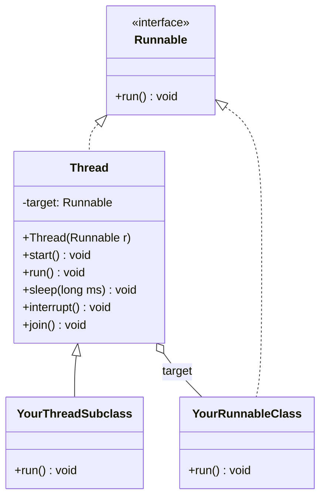
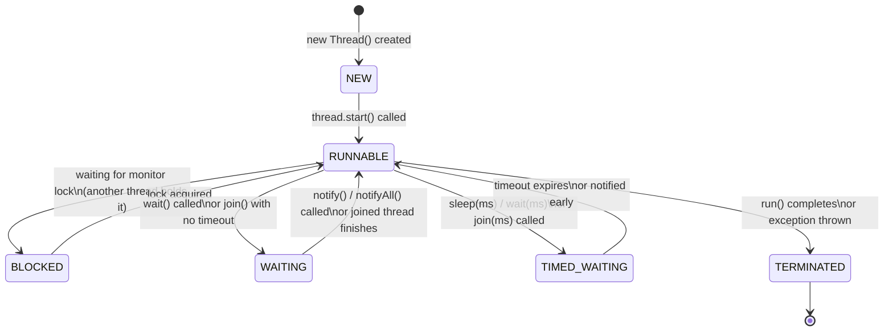
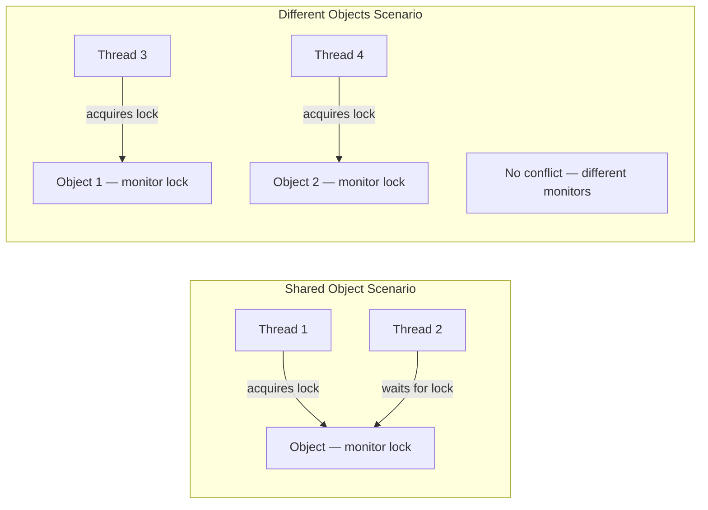
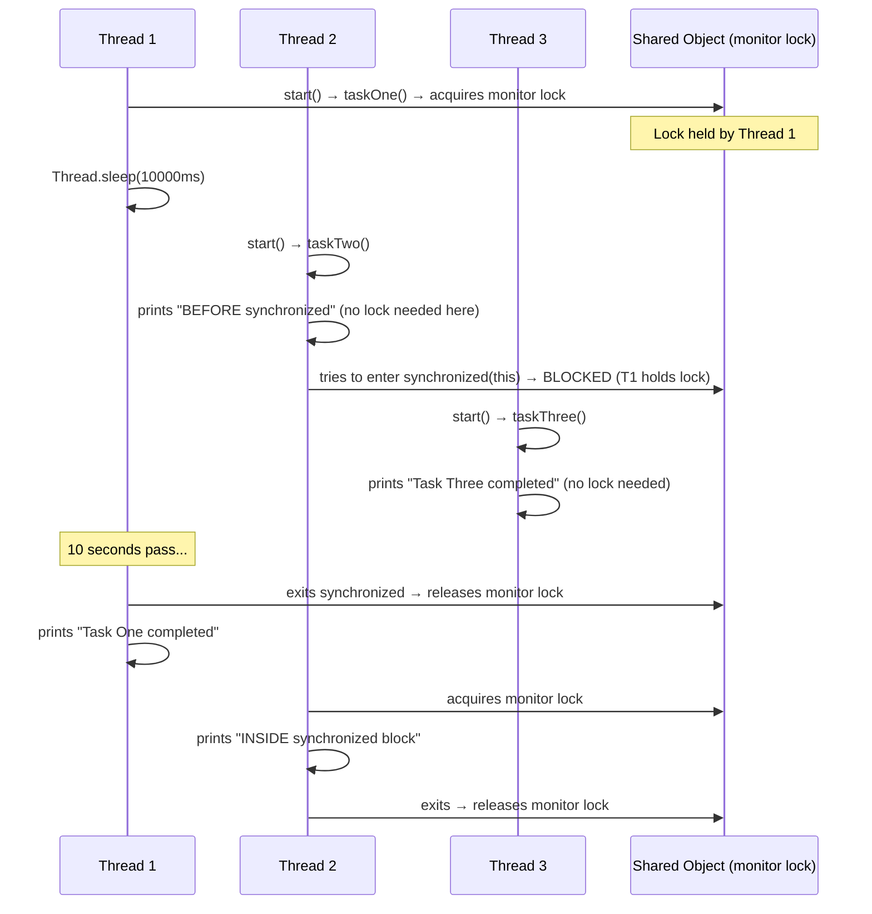
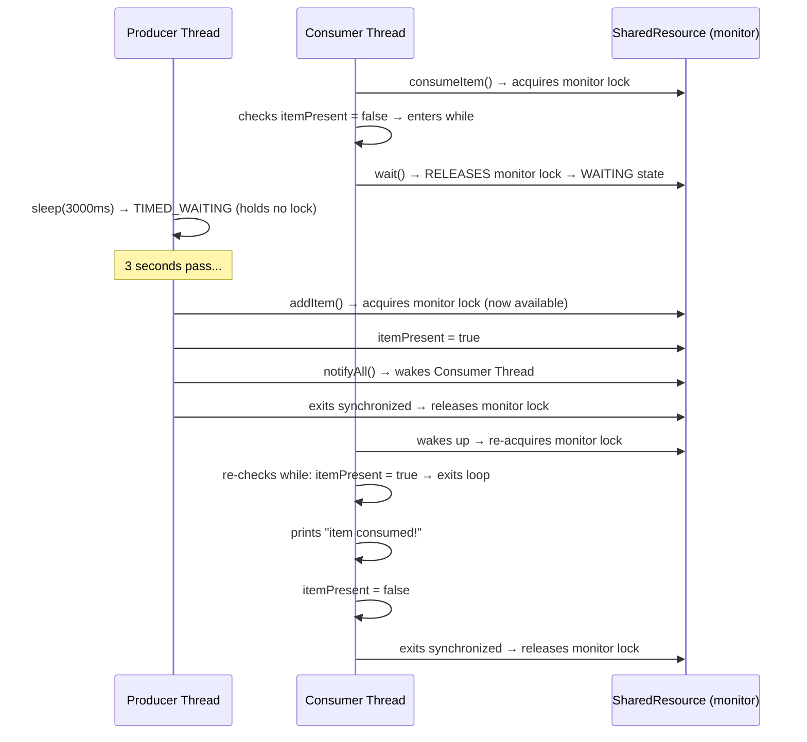

# 📌 Java Multithreading — Part 2: Thread Creation, Lifecycle, Synchronization & Inter-Thread Communication

> **Series Context:** This is Part 2 of the Java Multithreading series. It covers thread creation mechanisms, the full thread lifecycle, monitor locks, synchronization, and inter-thread communication via `wait()`, `notify()`, and `notifyAll()`.

---

## Table of Contents

1. [Two Ways to Create a Thread](#1-two-ways-to-create-a-thread)
2. [Runnable Interface — Architecture & Internal Working](#2-runnable-interface--architecture--internal-working)
3. [Method 1: Implementing the Runnable Interface](#3-method-1-implementing-the-runnable-interface)
4. [Method 2: Extending the Thread Class](#4-method-2-extending-the-thread-class)
5. [Comparison: Runnable vs Extending Thread](#5-comparison-runnable-vs-extending-thread)
6. [Thread Lifecycle](#6-thread-lifecycle)
7. [Thread States — Detailed Breakdown](#7-thread-states--detailed-breakdown)
8. [Monitor Lock (Object Lock)](#8-monitor-lock-object-lock)
9. [Synchronized Block vs Synchronized Method](#9-synchronized-block-vs-synchronized-method)
10. [Monitor Lock Example — Practical Demo](#10-monitor-lock-example--practical-demo)
11. [Inter-Thread Communication — wait(), notify(), notifyAll()](#11-inter-thread-communication--wait-notify-notifyall)
12. [Producer-Consumer Problem — Implementation](#12-producer-consumer-problem--implementation)
13. [Spurious Wakeup — Why while Instead of if](#13-spurious-wakeup--why-while-instead-of-if)
14. [Deprecated Thread Methods — stop(), suspend(), resume()](#14-deprecated-thread-methods--stop-suspend-resume)
15. [Assignment — Full Producer-Consumer with Queue](#15-assignment--full-producer-consumer-with-queue)
16. [Common Mistakes](#16-common-mistakes)
17. [Best Practices](#17-best-practices)
18. [Interview Notes](#18-interview-notes)
19. [Practice Questions](#19-practice-questions)
20. [Summary](#20-summary)

---

## 1. Two Ways to Create a Thread

Java provides **two mechanisms** to create a thread:

| Approach | How |
|---|---|
| **Implement `Runnable` interface** | Create a class that implements `Runnable`, pass it to a `Thread` constructor |
| **Extend `Thread` class** | Create a class that extends `Thread`, override `run()`, call `start()` directly |

### Why Does Java Provide Two Ways?

This is a **very important interview question**.

In Java, a class can **extend only one parent class**, but it can **implement multiple interfaces**.

Consider this scenario:

```java
class MyClass extends SomeOtherClass {
    // MyClass already has a parent — cannot also extend Thread!
}
```

If your class already extends another class, you **cannot also extend `Thread`**, because Java does not support multiple inheritance through classes.

However, you **can** implement `Runnable` in addition to extending another class:

```java
class MyClass extends SomeOtherClass implements Runnable {
    @Override
    public void run() {
        // thread work here
    }
}
```

This is why Java provides both options — to handle all design scenarios without forcing the programmer to give up class inheritance.

```mermaid
flowchart TD
    A[Need threading capability?]
    A --> B{Already extending another class?}
    B -->|Yes| C[Implement Runnable interface]
    B -->|No| D[Either: implement Runnable OR extend Thread]
    C --> E[Pass Runnable object to Thread constructor]
    D --> F[If extending Thread: call start() directly]
    D --> C
```

---

## 2. Runnable Interface — Architecture & Internal Working

Understanding the internal class architecture is essential before writing code.

### 2.1 The `Runnable` Interface

```java
@FunctionalInterface
public interface Runnable {
    void run();
}
```

- `Runnable` is a **functional interface** — it has exactly one abstract method: `run()`.
- It is **not a thread**. It is a plain interface that defines a task to be executed.
- Because it is a functional interface, you can use a **lambda expression** to implement it.

### 2.2 The `Thread` Class

```java
public class Thread implements Runnable {
    private Runnable target;

    public Thread(Runnable target) {
        this.target = target;
    }

    @Override
    public void run() {
        if (target != null) {
            target.run(); // delegates to your Runnable
        }
    }

    public synchronized void start() {
        // native method — creates OS-level thread and eventually calls run()
    }
    // ... sleep, interrupt, join, getName, etc.
}
```

Key observations:
- `Thread` **itself implements `Runnable`**.
- `Thread` holds a field `target` — a reference to the `Runnable` object you pass to the constructor.
- When `start()` is called → the JVM creates a new OS thread → that thread calls `run()` → `run()` delegates to `target.run()` if a target was set.



---

## 3. Method 1: Implementing the Runnable Interface

### 3.1 Step-by-Step Process

**Step 1 — Create a class that implements `Runnable` and override `run()`:**

```java
class MultithreadingLearning implements Runnable {
    @Override
    public void run() {
        System.out.println("Code executed by thread: "
            + Thread.currentThread().getName());
    }
}
```

> [!IMPORTANT]
> This class is **NOT a thread**. It is a plain class that describes the *task* a thread should perform. The `Thread` class is what actually creates and manages the OS thread.

**Step 2 — Create an instance of your Runnable class:**

```java
MultithreadingLearning runnableObj = new MultithreadingLearning();
```

**Step 3 — Pass the Runnable object to the `Thread` constructor:**

```java
Thread thread = new Thread(runnableObj);
```

At this point the thread exists as a Java object but **has not started**. The state is **NEW**.

**Step 4 — Start the thread:**

```java
thread.start();
```

This transitions the thread from NEW → RUNNABLE. Internally, `start()` calls `run()`, which checks `if (target != null)` and calls `target.run()` — invoking your `MultithreadingLearning.run()`.

### 3.2 Complete Example

```java
public class RunnableDemo {

    // Step 1: Runnable implementation
    static class MultithreadingLearning implements Runnable {
        @Override
        public void run() {
            System.out.println("Code executed by thread: "
                + Thread.currentThread().getName());
        }
    }

    public static void main(String[] args) {
        System.out.println("Main thread: " + Thread.currentThread().getName());

        // Step 2: Create Runnable object
        MultithreadingLearning runnableObj = new MultithreadingLearning();

        // Step 3: Pass to Thread constructor
        Thread thread = new Thread(runnableObj);

        // Step 4: Start the thread
        thread.start();

        System.out.println("Main thread finished.");
    }
}
```

**Output (order may vary):**
```
Main thread: main
Main thread finished.
Code executed by thread: Thread-0
```

> [!NOTE]
> "Main thread finished." may print before the new thread's output because both run concurrently. The JVM doesn't guarantee which finishes first unless you use `join()`.

### 3.3 Lambda Expression Shortcut

Since `Runnable` is a functional interface, you can skip creating a separate class and use a **lambda**:

```java
Thread thread = new Thread(() -> {
    System.out.println("Code executed by thread: "
        + Thread.currentThread().getName());
});
thread.start();
```

This is functionally identical to the class-based approach. The lambda `() -> { ... }` is the implementation of `Runnable.run()`.

### 3.4 Internal Execution Flow

```mermaid
sequenceDiagram
    participant Main as Main Thread
    participant T as Thread object
    participant R as MultithreadingLearning (Runnable)
    participant OS as JVM/OS

    Main->>R: new MultithreadingLearning()
    Main->>T: new Thread(runnableObj)
    Note over T: target = runnableObj; state = NEW
    Main->>T: thread.start()
    T->>OS: create native OS thread
    OS->>T: call run()
    T->>R: target.run()
    R->>R: prints "Code executed by thread: Thread-0"
    Main->>Main: continues executing (concurrently)
```

### 3.5 Why Runnable is Preferred in Industry

Because a class implementing `Runnable` can:
- **Extend another class** (not limited to one parent)
- **Implement multiple other interfaces**
- **Do many other things** besides threading
- Be passed to `ExecutorService`, thread pools, etc.

```java
// This is perfectly valid with Runnable approach:
class MyService extends BaseService implements Runnable, Serializable {
    @Override
    public void run() { /* thread task */ }
}
```

This would be **impossible** if `MyService` had to extend `Thread`.

---

## 4. Method 2: Extending the Thread Class

### 4.1 Step-by-Step Process

**Step 1 — Create a class that extends `Thread` and override `run()`:**

```java
class MultithreadingLearning extends Thread {
    @Override
    public void run() {
        System.out.println("Code executed by thread: "
            + Thread.currentThread().getName());
    }
}
```

This class **IS a thread** — it inherits all thread lifecycle methods (`start()`, `sleep()`, `interrupt()`, etc.) directly from `Thread`.

**Step 2 — Create an instance of your subclass:**

```java
MultithreadingLearning myThread = new MultithreadingLearning();
```

No separate `Thread` object is needed — your object **is** the thread.

**Step 3 — Start the thread:**

```java
myThread.start();
```

`start()` is inherited from `Thread`. It calls `run()` on `myThread` — which is your **overridden** `run()` method (polymorphism).

### 4.2 Why You Must Override `run()`

If you don't override `run()`, the parent `Thread.run()` is called:
```java
@Override
public void run() {
    if (target != null) {
        target.run();
    }
    // otherwise: does nothing and returns
}
```

Since no `target` was set (you didn't pass a Runnable to the constructor), it does **nothing**. So always override `run()` when extending `Thread`.

### 4.3 Complete Example

```java
public class ExtendThreadDemo {

    static class MultithreadingLearning extends Thread {
        @Override
        public void run() {
            System.out.println("Code executed by thread: "
                + Thread.currentThread().getName());
        }
    }

    public static void main(String[] args) {
        System.out.println("Main thread: " + Thread.currentThread().getName());

        MultithreadingLearning myThread = new MultithreadingLearning();
        myThread.start(); // internally calls overridden run()

        System.out.println("Main thread finished.");
    }
}
```

**Output (order may vary):**
```
Main thread: main
Main thread finished.
Code executed by thread: Thread-0
```

---

## 5. Comparison: Runnable vs Extending Thread

| Feature | `implements Runnable` | `extends Thread` |
|---|---|---|
| **Multiple inheritance** | ✅ Can still extend another class | ❌ Cannot extend any other class |
| **Object is a Thread?** | ❌ No — just a task | ✅ Yes — directly a thread |
| **Need separate Thread object?** | ✅ Yes — `new Thread(runnableObj)` | ❌ No — object itself is the thread |
| **Works with thread pools?** | ✅ Yes (ExecutorService, etc.) | ❌ Not natively |
| **Preferred in industry?** | ✅ Yes | ❌ Generally avoided |
| **Flexibility** | ✅ High | ❌ Limited |
| **Override required** | `run()` | `run()` |

> [!IMPORTANT]
> In production/industry code, **`implements Runnable` (or `Callable`) is almost always preferred**. Extending `Thread` is taught for conceptual understanding but rarely used in real applications.

---

## 6. Thread Lifecycle

Every thread in Java passes through well-defined states during its lifetime.



> [!NOTE]
> "RUNNING" is **not an official Java thread state**. The `Thread.State` enum has: `NEW`, `RUNNABLE`, `BLOCKED`, `WAITING`, `TIMED_WAITING`, `TERMINATED`. When a thread is actually executing on the CPU, it is still in the `RUNNABLE` state — the JVM doesn't distinguish between "waiting for CPU" and "currently on CPU" at the Java level.

---

## 7. Thread States — Detailed Breakdown

### 7.1 NEW

```java
Thread t = new Thread(() -> System.out.println("hello"));
// t is in NEW state — object exists, OS thread not created yet
```

- Thread object is created in memory.
- **No OS-level thread** has been created yet.
- `start()` has not been called.

---

### 7.2 RUNNABLE

```java
t.start(); // transitions to RUNNABLE
```

- Thread is **ready to execute** and waiting for CPU time.
- Once the OS scheduler assigns it CPU time, it begins executing `run()`.
- Switching between "waiting for CPU" and "executing" is called **context switching** — the thread moves back and forth rapidly, giving the illusion of parallel execution on a single core.

---

### 7.3 BLOCKED

A thread enters the BLOCKED state when it tries to **acquire a monitor lock** (enter a `synchronized` block/method) that is **currently held by another thread**.

```
Thread 1 → holds lock on object A → inside synchronized block
Thread 2 → tries to enter synchronized block on same object A → BLOCKED
```

**Key rule:** When a thread enters the BLOCKED state, it **releases all monitor locks** it currently holds.

Once the lock is released by Thread 1, Thread 2 can acquire it and transitions back to RUNNABLE.

---

### 7.4 WAITING

A thread enters the WAITING state when `wait()` is called **explicitly**. It stays WAITING indefinitely until another thread calls `notify()` or `notifyAll()` on the same object.

```java
synchronized(obj) {
    obj.wait(); // thread goes to WAITING — releases monitor lock
}
```

**Key rules:**
- `wait()` can only be called from inside a `synchronized` block/method.
- When entering WAITING, the thread **releases the monitor lock**.
- It will not automatically wake up — it waits until `notify()` / `notifyAll()` is called.

---

### 7.5 TIMED_WAITING

Similar to WAITING, but with a **timeout**. The thread automatically returns to RUNNABLE after the time expires, even if no `notify()` is called.

Common causes:
- `Thread.sleep(milliseconds)`
- `obj.wait(milliseconds)`
- `thread.join(milliseconds)`

```java
Thread.sleep(5000); // TIMED_WAITING for 5 seconds
```

**Key rule:** During `TIMED_WAITING` (e.g., `sleep()`), the thread **does NOT release monitor locks** it holds. This is a critical difference from `WAITING` (caused by `wait()`).

| State | Releases monitor lock? | Wakes up automatically? |
|---|---|---|
| `BLOCKED` | ✅ Yes | ✅ When lock is available |
| `WAITING` | ✅ Yes | ❌ Only via `notify()` |
| `TIMED_WAITING` | ❌ No | ✅ After timeout |

---

### 7.6 TERMINATED

Thread has finished executing `run()` — either normally or due to an uncaught exception.

```java
// After run() completes:
System.out.println(t.getState()); // TERMINATED
```

> [!WARNING]
> A terminated thread **cannot be restarted**. Calling `start()` on a terminated thread throws `IllegalThreadStateException`.

---

## 8. Monitor Lock (Object Lock)

### 8.1 What Is a Monitor Lock?

Every Java object has an **intrinsic lock**, also called a **monitor lock** or **object lock**. It is built into the JVM — you don't create it; it exists automatically for every object.

**Purpose:** Ensure that only **one thread at a time** can execute a critical section (a `synchronized` block or method) on a particular object.

### 8.2 How Monitor Locks Work

```
Object obj = new Object();

Thread 1 → enters synchronized(obj) → acquires monitor lock on obj
Thread 2 → tries to enter synchronized(obj) → must wait (BLOCKED)

Thread 1 exits synchronized block → releases monitor lock
Thread 2 → acquires monitor lock → proceeds
```

### 8.3 Monitor Lock is Per-Object

Each object has its **own** monitor lock. Two threads using **different objects** do not block each other:

```java
class Counter {
    synchronized void increment() { ... }
}

Counter c1 = new Counter();
Counter c2 = new Counter();

Thread t1 = new Thread(() -> c1.increment()); // locks c1's monitor
Thread t2 = new Thread(() -> c2.increment()); // locks c2's monitor — no conflict
t1.start();
t2.start(); // both run concurrently — they use different objects
```

But if both threads share the **same object**:

```java
Counter shared = new Counter();

Thread t1 = new Thread(() -> shared.increment()); // locks shared's monitor
Thread t2 = new Thread(() -> shared.increment()); // must wait for t1 to release
```



### 8.4 Monitor Lock and Thread States

| Thread action | Monitor lock effect |
|---|---|
| Enters `synchronized` block | Acquires monitor lock |
| Exits `synchronized` block | Releases monitor lock |
| Calls `wait()` | Releases monitor lock, enters WAITING |
| Returns from `wait()` (notified) | Re-acquires monitor lock |
| Enters `sleep()` | Does NOT release monitor lock |
| Enters BLOCKED state | Releases monitor lock |

---

## 9. Synchronized Block vs Synchronized Method

### 9.1 Synchronized Method

```java
class Counter {
    synchronized void increment() {
        // entire method is a critical section
        // monitor lock is on 'this' (the Counter object)
    }
}
```

The lock is placed on **`this`** — the instance of the class. Only one thread can execute any `synchronized` method on the same instance at a time.

### 9.2 Synchronized Block

```java
class Counter {
    void doWork() {
        System.out.println("Before sync — any thread can be here");

        synchronized (this) {
            // only this block is critical
            // monitor lock on 'this'
        }

        System.out.println("After sync — any thread can be here");
    }
}
```

**Advantage of synchronized block:** More granular control. Code outside the block runs concurrently; only the critical section is protected. This improves throughput.

You can also lock on a **specific object** instead of `this`:

```java
private final Object lock = new Object();

void doWork() {
    synchronized (lock) {
        // critical section locked on 'lock' object
    }
}
```

### 9.3 Static Synchronized Methods

When `synchronized` is placed on a `static` method, the monitor lock is on the **Class object** (not an instance):

```java
class Counter {
    static synchronized void staticIncrement() {
        // lock is on Counter.class
    }
}
```

All instances of `Counter` share this one class-level lock.

---

## 10. Monitor Lock Example — Practical Demo

### 10.1 Scenario

Three threads operate on the same object:
- **Thread 1** → calls `taskOne()` — synchronized, sleeps for 10 seconds
- **Thread 2** → calls `taskTwo()` — has code before the synchronized block, then enters a synchronized block
- **Thread 3** → calls `taskThree()` — no synchronization

```java
public class MonitorLockExample {

    // Synchronized method — locks the entire method on 'this'
    synchronized void taskOne() {
        System.out.println("Inside Task One — Thread: "
            + Thread.currentThread().getName());
        try {
            Thread.sleep(10000); // sleeps 10s — holds the lock while sleeping
        } catch (InterruptedException e) {
            e.printStackTrace();
        }
        System.out.println("Task One completed");
    }

    void taskTwo() {
        // This runs before the lock is needed — any thread can be here
        System.out.println("Task Two: BEFORE synchronized block — Thread: "
            + Thread.currentThread().getName());

        synchronized (this) {
            // must wait for taskOne's lock to be released
            System.out.println("Task Two: INSIDE synchronized block");
        }
    }

    void taskThree() {
        // No synchronization — runs freely
        System.out.println("Task Three completed — Thread: "
            + Thread.currentThread().getName());
    }

    public static void main(String[] args) {
        MonitorLockExample obj = new MonitorLockExample(); // ONE shared object

        Thread t1 = new Thread(() -> obj.taskOne());
        Thread t2 = new Thread(() -> obj.taskTwo());
        Thread t3 = new Thread(() -> obj.taskThree());

        t1.start();
        t2.start();
        t3.start();
    }
}
```

### 10.2 Step-by-Step Execution



**Expected Output:**
```
Inside Task One — Thread: Thread-0
Task Two: BEFORE synchronized block — Thread: Thread-1
Task Three completed — Thread: Thread-2
[... 10 seconds pass ...]
Task One completed
Task Two: INSIDE synchronized block
```

> [!NOTE]
> Thread 3 completes almost instantly because `taskThree()` has no synchronization. Thread 2's "BEFORE synchronized" line also prints immediately — only the part inside the `synchronized` block waits.

---

## 11. Inter-Thread Communication — wait(), notify(), notifyAll()

### 11.1 Why Do We Need Inter-Thread Communication?

When two threads share a resource and one thread's work **depends on the state set by another thread**, they need a way to coordinate. Without communication, you'd have to use "busy waiting" (a thread constantly checking a condition in a loop), which wastes CPU.

Java's solution: **`wait()`, `notify()`, `notifyAll()`** — defined in `Object` (not `Thread`), so every object supports them.

### 11.2 Rules for wait(), notify(), notifyAll()

> [!IMPORTANT]
> All three methods — `wait()`, `notify()`, `notifyAll()` — **MUST be called from inside a `synchronized` block or synchronized method**. Calling them outside throws `IllegalMonitorStateException`.

| Method | Behaviour |
|---|---|
| `wait()` | Releases the monitor lock and puts the thread into WAITING state until notified |
| `wait(long ms)` | Same as `wait()` but auto-wakes after `ms` milliseconds (TIMED_WAITING) |
| `notify()` | Wakes up **one** arbitrary waiting thread on this object's monitor |
| `notifyAll()` | Wakes up **all** threads waiting on this object's monitor |

### 11.3 Method Signatures

```java
// All defined in java.lang.Object
public final void wait() throws InterruptedException
public final void wait(long timeoutMillis) throws InterruptedException
public final native void notify()
public final native void notifyAll()
```

### 11.4 Shared Resource — Single Item Example

**Scenario:** One producer thread produces a single item. One consumer thread consumes it. The consumer must wait if no item is available.

```java
class SharedResource {
    private boolean itemPresent = false;

    synchronized void addItem() {
        itemPresent = true;
        System.out.println("Producer thread: item added. Calling notifyAll()...");
        notifyAll(); // wake up threads waiting on this object
    }

    synchronized void consumeItem() throws InterruptedException {
        System.out.println("Consumer thread: inside consumeItem()");

        while (!itemPresent) {
            System.out.println("Consumer thread: item not available — waiting...");
            wait(); // releases monitor lock and waits
            // after notify, re-checks the while condition
        }

        System.out.println("Consumer thread: item consumed!");
        itemPresent = false;
    }
}

public class InterThreadComm {
    public static void main(String[] args) {
        SharedResource resource = new SharedResource();

        Thread producerThread = new Thread(() -> {
            try {
                System.out.println("Producer thread started. Sleeping 3 seconds...");
                Thread.sleep(3000); // ensure consumer runs and waits first
                resource.addItem();
            } catch (InterruptedException e) {
                e.printStackTrace();
            }
        });

        Thread consumerThread = new Thread(() -> {
            try {
                resource.consumeItem();
            } catch (InterruptedException e) {
                e.printStackTrace();
            }
        });

        producerThread.start();
        consumerThread.start();
    }
}
```

**Output:**
```
Producer thread started. Sleeping 3 seconds...
Consumer thread: inside consumeItem()
Consumer thread: item not available — waiting...
[... 3 seconds ...]
Producer thread: item added. Calling notifyAll()...
Consumer thread: item consumed!
```

### 11.5 Step-by-Step Execution Flow



---

## 12. Producer-Consumer Problem — Implementation

### 12.1 Class: SharedResource

```java
class SharedResource {
    private boolean itemPresent = false;

    // Called by the producer thread
    synchronized void addItem() {
        itemPresent = true;
        System.out.println("[" + Thread.currentThread().getName()
            + "] Item added. Notifying waiting threads...");
        notifyAll();
    }

    // Called by the consumer thread
    synchronized void consumeItem() throws InterruptedException {
        System.out.println("[" + Thread.currentThread().getName()
            + "] consumeItem() called.");

        // While loop — guards against spurious wakeups
        while (!itemPresent) {
            System.out.println("[" + Thread.currentThread().getName()
                + "] Item not available. Waiting...");
            wait(); // releases lock, enters WAITING
        }

        System.out.println("[" + Thread.currentThread().getName()
            + "] Item consumed.");
        itemPresent = false;
    }
}
```

### 12.2 Class: ProduceTask (Runnable)

```java
class ProduceTask implements Runnable {
    private final SharedResource sharedResource;

    ProduceTask(SharedResource sharedResource) {
        this.sharedResource = sharedResource;
    }

    @Override
    public void run() {
        System.out.println("[" + Thread.currentThread().getName()
            + "] Producer thread started. Sleeping 5 seconds...");
        try {
            Thread.sleep(5000); // simulate production delay
            sharedResource.addItem();
        } catch (InterruptedException e) {
            Thread.currentThread().interrupt();
        }
    }
}
```

### 12.3 Class: ConsumeTask (Runnable)

```java
class ConsumeTask implements Runnable {
    private final SharedResource sharedResource;

    ConsumeTask(SharedResource sharedResource) {
        this.sharedResource = sharedResource;
    }

    @Override
    public void run() {
        System.out.println("[" + Thread.currentThread().getName()
            + "] Consumer thread started.");
        try {
            sharedResource.consumeItem();
        } catch (InterruptedException e) {
            Thread.currentThread().interrupt();
        }
    }
}
```

### 12.4 Main Class

```java
public class ProducerConsumerDemo {
    public static void main(String[] args) {
        System.out.println("Main method started.");

        SharedResource sharedResource = new SharedResource();

        // Both threads share the SAME SharedResource object
        Thread producerThread = new Thread(new ProduceTask(sharedResource), "ProducerThread");
        Thread consumerThread = new Thread(new ConsumeTask(sharedResource), "ConsumerThread");

        producerThread.start();
        consumerThread.start();
    }
}
```

**Output:**
```
Main method started.
[ProducerThread] Producer thread started. Sleeping 5 seconds...
[ConsumerThread] Consumer thread started.
[ConsumerThread] consumeItem() called.
[ConsumerThread] Item not available. Waiting...
[ProducerThread] Item added. Notifying waiting threads...
[ConsumerThread] Item consumed.
```

### 12.5 Lambda Version (Equivalent, No Separate Classes)

```java
public class ProducerConsumerLambda {
    public static void main(String[] args) {
        SharedResource resource = new SharedResource();

        Thread producerThread = new Thread(() -> {
            try {
                System.out.println("Producer: sleeping 3 seconds...");
                Thread.sleep(3000);
                resource.addItem();
            } catch (InterruptedException e) {
                Thread.currentThread().interrupt();
            }
        }, "ProducerThread");

        Thread consumerThread = new Thread(() -> {
            try {
                resource.consumeItem();
            } catch (InterruptedException e) {
                Thread.currentThread().interrupt();
            }
        }, "ConsumerThread");

        producerThread.start();
        consumerThread.start();
    }
}
```

---

## 13. Spurious Wakeup — Why `while` Instead of `if`

### 13.1 What Is Spurious Wakeup?

A **spurious wakeup** is when a thread waiting in `wait()` wakes up **without being notified** — caused by low-level OS or JVM signal noise. This is rare but possible, and the Java specification explicitly permits it.

### 13.2 The Problem with `if`

```java
// DANGEROUS — if condition
synchronized void consumeItem() throws InterruptedException {
    if (!itemPresent) {
        wait(); // wakes up spuriously — itemPresent is STILL false!
    }
    // proceeds to consume even though item isn't ready — BUG!
    System.out.println("consuming..."); // could crash or produce wrong result
}
```

If the thread wakes up spuriously (without `notify()`), `itemPresent` is still `false`, but the `if` block won't check again — it just falls through and consumes a non-existent item.

### 13.3 The Fix — `while` Loop

```java
// CORRECT — while loop
synchronized void consumeItem() throws InterruptedException {
    while (!itemPresent) {   // re-checks condition every time it wakes up
        wait();
    }
    // Only reaches here if itemPresent is ACTUALLY true
    System.out.println("consuming...");
}
```

If the thread wakes spuriously, `while` re-evaluates the condition. If `itemPresent` is still `false`, it calls `wait()` again. This is the **standard pattern** recommended by Oracle's Java documentation.

> [!IMPORTANT]
> **Always use a `while` loop, never an `if` statement, when checking the condition around `wait()`.**

---

## 14. Deprecated Thread Methods — stop(), suspend(), resume()

### 14.1 `Thread.stop()` — Deprecated

```java
thread.stop(); // ❌ DEPRECATED — do not use
```

**Why deprecated:** `stop()` immediately kills the thread and **forcibly releases all monitor locks** it holds. This can leave shared data in an **inconsistent/corrupted state** — other threads might see a half-written object.

**How to properly stop a thread — use a volatile flag:**

```java
class StoppableTask implements Runnable {
    private volatile boolean running = true;

    public void stop() {
        running = false;
    }

    @Override
    public void run() {
        while (running) {
            // do work
        }
        System.out.println("Thread stopped gracefully.");
    }
}

// Usage:
StoppableTask task = new StoppableTask();
Thread t = new Thread(task);
t.start();

Thread.sleep(2000);
task.stop(); // signals the thread to stop gracefully
```

The `volatile` keyword ensures the `running` flag update is **visible to the thread immediately** (no CPU cache caching issues).

### 14.2 `Thread.suspend()` and `Thread.resume()` — Deprecated

```java
thread.suspend(); // ❌ DEPRECATED
thread.resume();  // ❌ DEPRECATED
```

**Why deprecated:** `suspend()` pauses the thread **while still holding its monitor locks**. If another thread tries to acquire those same locks, it deadlocks forever (the suspended thread never releases its locks, so nothing can resume it).

**Correct alternative:** Use `wait()` / `notify()` for controlled pause/resume behavior.

---

## 15. Assignment — Full Producer-Consumer with Queue

This is a classic Computer Science concurrency problem. Implement the following:

**Problem Statement:**

Two threads — a **Producer** and a **Consumer** — share a common fixed-size buffer (a `Queue`):

- The **Producer** generates data and adds it to the queue.
- The **Consumer** reads and removes data from the queue.
- **If the queue is FULL**, the producer must **wait** — it should not add more items.
- **If the queue is EMPTY**, the consumer must **wait** — there is nothing to consume.

**Skeleton to complete:**

```java
import java.util.LinkedList;
import java.util.Queue;

class SharedBuffer {
    private final Queue<Integer> queue = new LinkedList<>();
    private final int MAX_SIZE = 5;

    synchronized void produce(int item) throws InterruptedException {
        while (queue.size() == MAX_SIZE) {
            // TODO: buffer full — producer must wait
        }
        // TODO: add item to queue
        // TODO: notify consumer
    }

    synchronized void consume() throws InterruptedException {
        while (queue.isEmpty()) {
            // TODO: buffer empty — consumer must wait
        }
        // TODO: remove and print item from queue
        // TODO: notify producer
    }
}

public class ProducerConsumerQueue {
    public static void main(String[] args) {
        SharedBuffer buffer = new SharedBuffer();

        Thread producer = new Thread(() -> {
            for (int i = 1; i <= 10; i++) {
                try {
                    buffer.produce(i);
                } catch (InterruptedException e) {
                    Thread.currentThread().interrupt();
                }
            }
        }, "Producer");

        Thread consumer = new Thread(() -> {
            for (int i = 1; i <= 10; i++) {
                try {
                    buffer.consume();
                } catch (InterruptedException e) {
                    Thread.currentThread().interrupt();
                }
            }
        }, "Consumer");

        producer.start();
        consumer.start();
    }
}
```

> [!TIP]
> Hint: Use `wait()` when the condition is not met. Use `notifyAll()` after each produce/consume to wake the waiting thread. Use `while` loops (not `if`) for all condition checks.

---

## 16. Common Mistakes

### ❌ Mistake 1: Calling `start()` Twice on Same Thread

```java
Thread t = new Thread(() -> System.out.println("hello"));
t.start();
t.start(); // ❌ IllegalThreadStateException
```

**Fix:** Create a new `Thread` object for each execution.

### ❌ Mistake 2: Calling `run()` Instead of `start()`

```java
Thread t = new Thread(() -> System.out.println(Thread.currentThread().getName()));
t.run(); // prints "main" — runs on the CURRENT thread, not a new one!
```

**Fix:** Always call `start()`. It creates the OS thread and then calls `run()` on the new thread.

### ❌ Mistake 3: Calling `wait()` Outside Synchronized Block

```java
obj.wait(); // ❌ IllegalMonitorStateException
```

**Fix:**
```java
synchronized (obj) {
    obj.wait(); // ✅ correct
}
```

### ❌ Mistake 4: Using `if` Instead of `while` with `wait()`

```java
synchronized (obj) {
    if (!condition) obj.wait(); // ❌ vulnerable to spurious wakeup
    doWork(); // may run even if condition is still false
}
```

**Fix:**
```java
synchronized (obj) {
    while (!condition) obj.wait(); // ✅ re-checks after every wakeup
    doWork();
}
```

### ❌ Mistake 5: Using `Thread.stop()` to Stop a Thread

```java
thread.stop(); // ❌ deprecated — corrupts shared state
```

**Fix:** Use a `volatile boolean` flag and cooperative stopping.

### ❌ Mistake 6: Assuming Thread Execution Order

```java
t1.start();
t2.start();
// Do NOT assume t1 finishes before t2
```

**Fix:** Use `join()` if you need ordering:
```java
t1.start();
t1.join(); // waits for t1 to finish before proceeding
t2.start();
```

---

## 17. Best Practices

1. **Prefer `Runnable` over extending `Thread`** — keeps your class flexible and compatible with thread pools.

2. **Use lambda expressions** for simple runnable tasks to reduce boilerplate.

3. **Always use `while` loops around `wait()`** — never `if`.

4. **Prefer `notifyAll()` over `notify()`** in most cases — `notify()` wakes only one arbitrary thread, which may not be the right one. `notifyAll()` is safer.

5. **Minimize the scope of `synchronized`** — synchronize only the critical section, not the whole method, to maximize concurrency.

6. **Never call `Thread.stop()`, `suspend()`, or `resume()`** — use cooperative cancellation with `volatile` flags or `Thread.interrupt()`.

7. **Name your threads** — makes debugging and log analysis much easier:
   ```java
   new Thread(task, "ProducerThread");
   ```

8. **Handle `InterruptedException` properly** — restore the interrupt flag:
   ```java
   catch (InterruptedException e) {
       Thread.currentThread().interrupt(); // restore interrupted status
   }
   ```

9. **Consider `java.util.concurrent` for production code** — `ExecutorService`, `BlockingQueue`, `CountDownLatch`, `Semaphore` etc. are higher-level and less error-prone than raw `synchronized`/`wait()`/`notify()`.

---

## 18. Interview Notes

**Q1: What are the two ways to create a thread in Java? Which is preferred and why?**

Two ways: `implements Runnable` and `extends Thread`. `Runnable` is preferred because a class implementing `Runnable` can still extend another class (Java allows only single inheritance), can implement multiple interfaces, and works with thread pools/`ExecutorService`. Extending `Thread` limits flexibility.

**Q2: What is the difference between `start()` and `run()`?**

`start()` creates a new OS thread and then calls `run()` on that new thread. Calling `run()` directly doesn't create a new thread — it executes `run()` on the calling thread (same as a normal method call).

**Q3: What are the thread states in Java?**

`NEW`, `RUNNABLE`, `BLOCKED`, `WAITING`, `TIMED_WAITING`, `TERMINATED`. "RUNNING" is not a separate state — a thread executing code is still technically in `RUNNABLE`.

**Q4: What is a monitor lock? Which object owns it?**

Every Java object has one intrinsic (monitor) lock. A `synchronized` method/block acquires the lock on `this` (the instance) or on a specified object. Only one thread can hold the lock at a time. When the thread exits the synchronized block, the lock is released.

**Q5: What is the difference between `BLOCKED` and `WAITING`?**

`BLOCKED` — thread is waiting to *acquire a monitor lock* held by another thread (automatic transition when lock is released). `WAITING` — thread explicitly called `wait()` and is waiting to be *notified* via `notify()`/`notifyAll()`. Both release the monitor lock.

**Q6: Does `sleep()` release the monitor lock?**

No. `Thread.sleep()` puts the thread in `TIMED_WAITING` but **does NOT release any monitor locks**. `wait()` does release the lock.

**Q7: Why must `wait()`, `notify()`, `notifyAll()` be called inside a `synchronized` block?**

Because they operate on the object's monitor. If a thread calls `wait()` without holding the monitor, it can't safely pause execution or guarantee visibility of state changes. The JVM enforces this — calling outside `synchronized` throws `IllegalMonitorStateException`.

**Q8: What is a spurious wakeup? How do you guard against it?**

A spurious wakeup is when a thread wakes from `wait()` without being notified — allowed by the Java spec due to OS-level signal behavior. Guard against it by checking the wait condition in a `while` loop, not an `if` statement, so the thread re-checks and re-waits if the condition is still not met.

**Q9: Why are `Thread.stop()`, `suspend()`, and `resume()` deprecated?**

`stop()` forcibly kills the thread and releases all its locks, potentially leaving shared data in an inconsistent state. `suspend()` pauses the thread while it still holds its locks, causing potential deadlock if another thread tries to acquire those locks. The correct alternative is cooperative stopping using a `volatile boolean` flag.

**Q10: What is the difference between `notify()` and `notifyAll()`?**

`notify()` wakes up one arbitrary thread waiting on the object's monitor. `notifyAll()` wakes up all waiting threads. `notifyAll()` is generally safer because `notify()` may wake the wrong thread, leaving the right thread waiting indefinitely.

---

## 19. Practice Questions

### Easy

1. Create a thread using `implements Runnable` that prints numbers 1 to 10. Run it and observe which thread name prints.

2. Create the same thread using `extends Thread`. Compare the code.

3. Create two threads that both print "Hello from Thread X". Run them and observe the interleaving.

4. Write a program that demonstrates what happens when you call `run()` instead of `start()`.

5. Demonstrate that a `TERMINATED` thread cannot be restarted (catch the exception).

### Medium

6. Create two threads sharing a `Counter` object with a `synchronized increment()` method. Run both threads 1000 times each and verify the final count is always 2000. Then remove `synchronized` and observe the inconsistency.

7. Write a program where Thread 1 sleeps for 5 seconds inside a `synchronized` block. Show that Thread 2 cannot enter a `synchronized` block on the same object during those 5 seconds.

8. Demonstrate that `synchronized` on different objects does NOT provide mutual exclusion.

9. Implement the single-item producer-consumer from the lecture and add proper logging showing thread names and state transitions.

10. Write a program with two threads where `wait()` and `notify()` coordinate them — Thread A prints odd numbers, Thread B prints even numbers, alternating: 1, 2, 3, 4, 5...

### Hard

11. Implement the full **Producer-Consumer with a bounded queue** from the assignment (Section 15) using `synchronized`, `wait()`, and `notifyAll()`.

12. Implement a thread-safe **Singleton** class using the double-checked locking pattern.

13. Create a deadlock scenario with two threads and two objects, then identify and fix it.

14. Implement a custom **thread pool** from scratch that manages a fixed number of worker threads and a task queue.

15. Implement graceful thread stopping using a `volatile` flag and `Thread.interrupt()` correctly, ensuring that a thread blocked in `sleep()` is also interrupted properly.

---

## 20. Summary

```mermaid
mindmap
  root((Java Multithreading))
    Thread Creation
      implements Runnable
        Preferred in industry
        Can extend other classes
        Works with thread pools
      extends Thread
        Simple, direct
        Cannot extend others
        Rarely used in production
    Thread Lifecycle
      NEW
      RUNNABLE
      BLOCKED
        Waiting for monitor lock
        Releases monitor lock
      WAITING
        wait() called explicitly
        Releases monitor lock
        Needs notify to wake
      TIMED_WAITING
        sleep() / wait with timeout
        Does NOT release lock
      TERMINATED
        Cannot restart
    Monitor Lock
      Per-object intrinsic lock
      Acquired on synchronized enter
      Released on synchronized exit
      Released on wait()
      NOT released on sleep()
    Synchronization
      synchronized method
        Locks on this
      synchronized block
        Finer-grained control
        Locks on any object
    Inter-Thread Communication
      wait()
        Release lock, pause thread
        Must be in synchronized block
        Use while not if
      notify()
        Wakes one waiting thread
      notifyAll()
        Wakes all waiting threads
        Preferred over notify
    Deprecated Methods
      stop() → volatile flag instead
      suspend() → wait/notify instead
      resume() → notify instead
```

**Revision Bullets:**

- Two ways to create a thread: `implements Runnable` (preferred) and `extends Thread`.
- `Runnable` is preferred because it doesn't sacrifice single inheritance and works with thread pools.
- `Thread` class itself implements `Runnable`. When you pass a `Runnable` to `Thread`, it stores it as `target` and calls `target.run()` inside its own `run()`.
- Always call `start()`, never `run()` directly. `start()` creates a new OS thread; `run()` just executes on the current thread.
- Thread states: `NEW → RUNNABLE → (BLOCKED/WAITING/TIMED_WAITING) → TERMINATED`.
- Every object has a monitor lock. `synchronized` blocks/methods acquire this lock.
- `BLOCKED` = waiting for another thread's lock. `WAITING` = called `wait()`. `TIMED_WAITING` = called `sleep()` or `wait(ms)`.
- `wait()` and `BLOCKED` both release the monitor lock. `sleep()` does NOT release the monitor lock.
- `wait()`, `notify()`, `notifyAll()` must be called inside a `synchronized` block, or `IllegalMonitorStateException` is thrown.
- Always use `while (!condition) { wait(); }` — never `if` — to guard against spurious wakeups.
- `notifyAll()` is generally safer than `notify()`.
- `Thread.stop()`, `suspend()`, `resume()` are deprecated. Use `volatile` flags for cooperative stopping.
- A terminated thread cannot be restarted — calling `start()` on it throws `IllegalThreadStateException`.
