# 📚 Object-Oriented Programming (OOP) — Java Fundamentals

> **Series:** Java Core Concepts | **Chapter:** OOP Fundamentals  
> **Audience:** Beginner to Intermediate Java Developers  
> **Coverage:** Objects, Classes, Four Pillars of OOP, Relationships, Interview Prep

---

## 🗂️ Table of Contents

1. [What is OOP?](#1-what-is-oop)
2. [Procedural vs Object-Oriented Programming](#2-procedural-vs-object-oriented-programming)
3. [Objects and Classes](#3-objects-and-classes)
4. [The Four Pillars of OOP](#4-the-four-pillars-of-oop)
   - [Pillar 1 — Abstraction](#pillar-1--data-abstraction)
   - [Pillar 2 — Encapsulation](#pillar-2--data-encapsulation)
   - [Pillar 3 — Inheritance](#pillar-3--inheritance)
   - [Pillar 4 — Polymorphism](#pillar-4--polymorphism)
5. [OOP Relationships](#5-oop-relationships)
   - [IS-A Relationship](#is-a-relationship-inheritance)
   - [HAS-A Relationship](#has-a-relationship-association)
   - [Aggregation vs Composition](#aggregation-vs-composition)
6. [Interview Question Bank](#6-interview-question-bank)
7. [Master Summary](#7-master-summary)

---

# 1. What is OOP?

## Overview

**OOP** stands for **Object-Oriented Programming**. As the name suggests, it is a programming paradigm that orients all software design around **objects**. Whenever you design a system, the first question you should ask is: *What are the objects present in this problem?*

Everything revolves around objects — their properties, their behaviors, and how they interact with each other.

> [!NOTE]
> Java is an object-oriented language. Python is also OOP-capable, but Java enforces OOP more strictly. The concepts and syntax in this guide are from the **Java perspective**.

---

## Real-world Analogy

Think of any real-world thing: a **car**, a **dog**, an **ATM machine**. Each of these is an *entity* you can observe. Each has:

- Things you can **describe** just by looking at it (e.g., a car's color, brand, type)
- Things it can **do** (e.g., a car can accelerate, brake, honk)

These two aspects — *what it is* and *what it does* — are the foundation of every object in OOP.

---

## Every Object Has Two Things

| Aspect | OOP Term | Also Called | Example (Dog) |
|--------|----------|-------------|---------------|
| Descriptive characteristics | **Properties** | State / Data Members / Fields | color, breed, age |
| Actions it can perform | **Behavior** | Methods / Functions / Data Methods | bark(), sleep(), eat() |

---

## Mind Map — OOP Overview

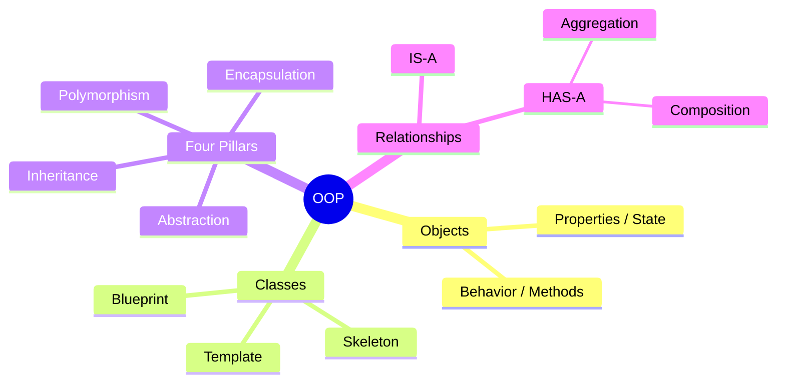

---

# 2. Procedural vs Object-Oriented Programming

## What is Procedural Programming?

Before OOP existed, developers used **procedural programming** (C is a classic example). In this style:

- A program is broken into **functions** (also called procedures)
- Functions are called one after another, passing data between them
- Data moves **freely** from function to function

### Visualizing Procedural Flow

```
Task → function1(data) → function2(data) → function3(data) → Result
         ↑                     ↑
     can change data      can change data
```

Any function in the chain can read **and modify** shared data. The creator of the data has no control over what others do with it.

---

## Problems with Procedural Programming

| Problem | Explanation |
|---------|-------------|
| **No data hiding** | Data moves freely; any function can modify it |
| **Tight coupling** | Functions are highly dependent on each other's data |
| **No code reusability** | Logic is hard to reuse across different programs |
| **Priority on functions** | Focus is on *what to do*, not *what data to protect* |
| **No inheritance** | Cannot build on existing code structures cleanly |

> [!IMPORTANT]
> **Tight coupling** means: if one function changes how data is structured, *every other function* that uses that data may break. This is a nightmare in large codebases.

---

## How OOP Solves This

OOP **binds data and functions together** inside a unit called a **class**. This means:

- Data does not move freely
- Only the class's own methods can directly modify its data
- Other classes must go through controlled access (via methods)
- This brings **loose coupling** — classes can change internally without breaking others

| Feature | Procedural | OOP |
|---------|-----------|-----|
| Priority | Functions | Data |
| Data movement | Freely passed | Controlled via methods |
| Coupling | Tight | Loose |
| Reusability | Difficult | Achieved via Inheritance |
| Data hiding | ❌ | ✅ via Encapsulation |
| Overloading | ❌ | ✅ |
| Inheritance | ❌ | ✅ |

---

# 3. Objects and Classes

---

## 📌 What is an Object?

### Definition

An **object** is a real-world entity that has both **properties (state)** and **behavior (functionality)**. In Java, an object is a concrete instance of a class that lives in memory (heap).

### Identifying an Object

Ask two questions:
1. Can I describe it by just observing it? → Those are its **properties**
2. Does it do something / perform actions? → Those are its **behaviors**

If yes to both → it qualifies as an object.

### Example 1 — Dog

| Component | Values |
|-----------|--------|
| **Properties** | color: black, breed: Labrador, age: 3 |
| **Behaviors** | bark(), sleep(), eat() |

### Example 2 — Car

| Component | Values |
|-----------|--------|
| **Properties** | brand: Toyota, type: SUV, color: white |
| **Behaviors** | applyBrake(), drive(), increaseSpeed(), honk() |

---

## 📌 What is a Class?

### Definition

A **class** is a **blueprint** or **template** or **skeleton** from which objects are created. It defines what properties and behaviors an object of that type will have — but it doesn't hold actual data itself. The object holds the actual data.

> **Analogy:** A class is like an architectural blueprint of a house. The blueprint describes the rooms, doors, windows — but it is not a house itself. You build actual houses (objects) from the blueprint (class).

### What a Class Contains

```
Class
├── Data Variables (Properties / State / Fields)
│     └── int age, String address, String id
└── Data Methods (Behavior / Functions)
      └── getAge(), setAge(), updateAddress()
```

### Syntax — Defining a Class in Java

```java
class Student {
    // --- Data Variables (Properties) ---
    int age;
    String address;
    String id;

    // --- Data Methods (Behaviors) ---
    void updateAddress(String newAddress) {
        this.address = newAddress;
    }

    int getAge() {
        return age;
    }

    void setAge(int age) {
        this.age = age;
    }
}
```

### Syntax Breakdown

| Keyword/Symbol | Meaning |
|----------------|---------|
| `class` | Declares a class |
| `Student` | Name of the class (PascalCase convention) |
| `int age` | Data variable (field) storing an integer |
| `String address` | Data variable storing text |
| `void updateAddress(...)` | Data method that modifies a field |
| `int getAge()` | Data method that returns the age field |
| `this.address` | Refers to the current object's field (covered in depth later) |

---

## Creating Objects from a Class

A class alone does nothing — you must **instantiate** it (create an object) using the `new` keyword.

```java
// Syntax: ClassName variableName = new ClassName();

Student engineeringStudent = new Student();
Student mbaStudent = new Student();
Student csStudent = new Student();
```

Each object created is **independent**. Setting age on `engineeringStudent` does not affect `mbaStudent`.

### Object in Memory

```
Heap Memory
┌─────────────────────────────────┐
│  engineeringStudent             │
│  ├── age = 23                   │
│  ├── address = "Jaipur"         │
│  └── methods: getAge, setAge... │
├─────────────────────────────────┤
│  mbaStudent                     │
│  ├── age = 25                   │
│  ├── address = "Delhi"          │
│  └── methods: getAge, setAge... │
└─────────────────────────────────┘
```

> [!TIP]
> Each object gets its own copy of **data variables**. Methods are shared (stored in the Method Area of JVM), but act on the specific object's data.

---

## Class vs Object — Summary Table

| Aspect | Class | Object |
|--------|-------|--------|
| What it is | Blueprint / Template | Real instance in memory |
| Where it lives | Method Area (JVM) | Heap Memory |
| How many | One class definition | Can create unlimited objects |
| Holds data? | No — defines structure | Yes — holds actual values |
| Created using | `class` keyword | `new` keyword |

---

## Diagram — Class to Objects

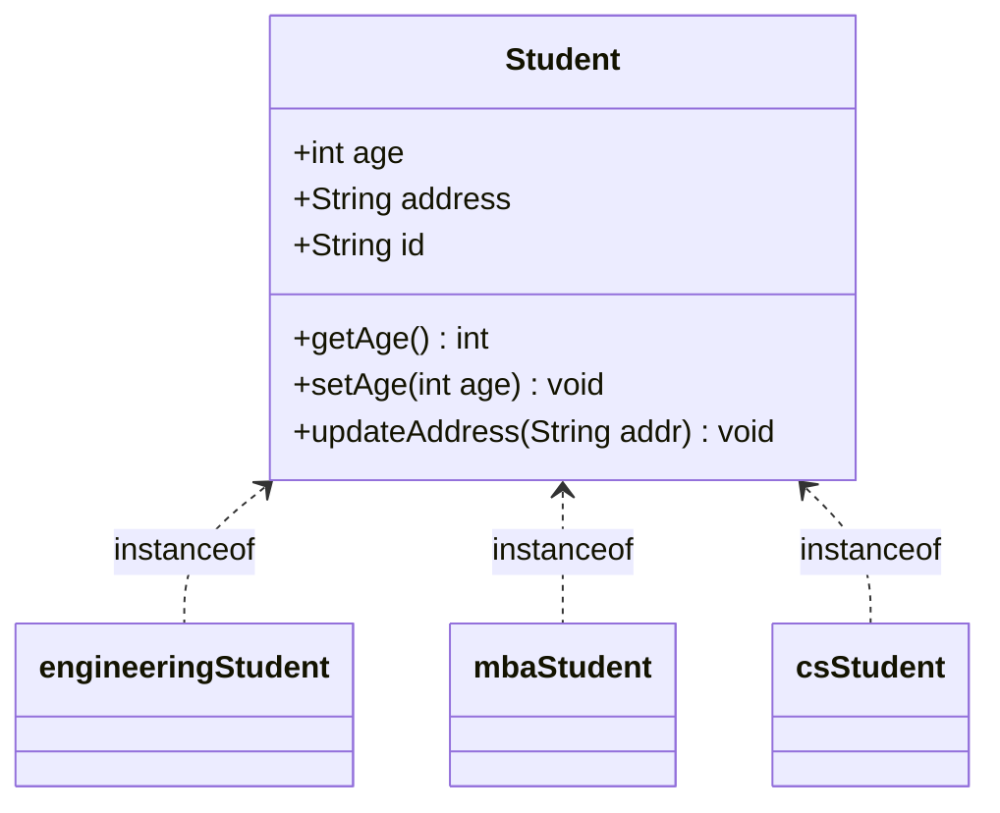

---

# 4. The Four Pillars of OOP

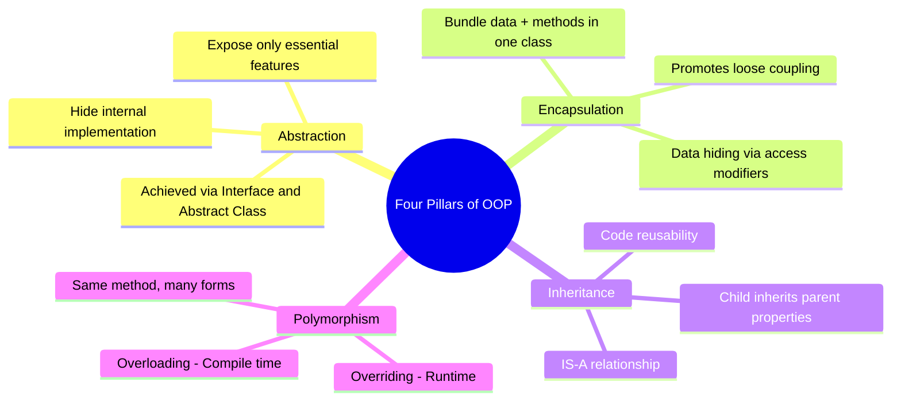

---

## Pillar 1 — Data Abstraction

### Overview

**Abstraction** means *hiding the internal implementation details* and exposing only what is necessary to the user. The user interacts with a simplified interface without knowing how things work internally.

---

### Why This Concept Exists

- Users don't need to know *how* something works — only *that* it works
- Prevents information overload (client code becomes simpler)
- Protects internal implementation from external interference
- Provides security and confidentiality

---

### Real-world Analogies

**Example 1 — Car Brake Pedal:**
When you press the brake pedal, the car slows down. But do you know what happens internally? Engine braking, hydraulic pressure, ABS kick-in, friction pads? No — and you don't need to. The *essential feature* exposed to you is: "Press this → car slows down." Everything else is **abstracted**.

**Example 2 — Mobile Phone Call:**
You dial a number and press the green button → call connects. You don't know how the signal is encoded, transmitted via towers, routed through networks, and decoded at the receiver. All of that is hidden. You see only the essential feature.

---

### Definition

> **Abstraction** hides the internal implementation and shows only the essential functionality to the user.

---

### How to Achieve Abstraction in Java

Abstraction is achieved through:
1. **Interfaces** — define *what* to do, not *how*
2. **Abstract Classes** — partially implemented, partially abstract (covered in depth in later chapters)

### Code Example — Abstraction via Interface

```java
// Step 1: Define the Interface (what the user sees)
interface Car {
    void applyBrake();
    void pressAccelerator();
    void pressHorn();
}

// Step 2: Implement the Interface (hidden from user)
class CarImplementation implements Car {

    @Override
    public void applyBrake() {
        // Internal implementation — user doesn't see this
        // Step 1: Reduce fuel supply
        // Step 2: Engage hydraulic brakes
        // Step 3: ABS kicks in
        // Step 4: Friction pads engage
        // Step 5: Speed reduces
        System.out.println("Brake applied. Speed reduced.");
    }

    @Override
    public void pressAccelerator() {
        System.out.println("Accelerating...");
    }

    @Override
    public void pressHorn() {
        System.out.println("Beep beep!");
    }
}

// Step 3: User interacts only with the interface
public class Main {
    public static void main(String[] args) {
        Car myCar = new CarImplementation();
        myCar.applyBrake();        // User just calls this
        myCar.pressAccelerator();  // User just calls this
    }
}
```

**Output:**
```
Brake applied. Speed reduced.
Accelerating...
```

### Line-by-Line Explanation

| Line | Explanation |
|------|-------------|
| `interface Car` | Declares an interface — only method signatures, no implementation |
| `void applyBrake()` | Method signature only — no body allowed in an interface (by default) |
| `class CarImplementation implements Car` | Concrete class that provides the actual implementation |
| `@Override` | Annotation indicating this method overrides the interface's method |
| `Car myCar = new CarImplementation()` | User holds a reference of type `Car` — only sees interface methods |

---

### Advantages of Abstraction

| Advantage | Explanation |
|-----------|-------------|
| **Security** | Internal steps are hidden from external code |
| **Confidentiality** | Sensitive logic cannot be accessed or misused |
| **Simplicity** | Client code is cleaner — fewer things to know |
| **Flexibility** | Implementation can change without breaking client code |

---

### Flowchart — How Abstraction Works

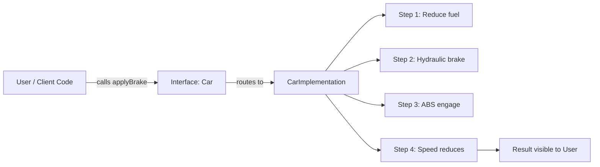

---

### Interview Notes — Abstraction

> [!IMPORTANT]
> **Common interview questions:**
> - "What is abstraction? Explain it to a 14-year-old."
> - "What is the difference between abstraction and encapsulation?"
> - "How do you achieve abstraction in Java?"
> - "Can you give a real-world example?"

**Simple answer for interview:**
> Abstraction is showing only what is needed, and hiding how it works. Like a TV remote — you press volume up, it increases. You don't know the infrared signals, the receiver circuit, or the firmware. That's abstraction.

**How to achieve:** Through `interface` and `abstract class`.

---

## Pillar 2 — Data Encapsulation

### Overview

**Encapsulation** is the bundling of **data (fields)** and the **methods that operate on that data** into a single unit called a **class**. It is also referred to as **data hiding** because the class controls how its data is accessed and modified by external code.

---

### Why This Concept Exists

- Gives the class **full control** over its own data
- Prevents uncontrolled modification of data by outside code
- Promotes **loose coupling** between classes
- Makes code easier to maintain and debug

---

### Real-world Analogy

> Think of a **medicine capsule**. The actual medicine (data) is inside the capsule. The capsule shell is the class — it **protects** the medicine inside and controls how it is released. You don't directly touch the medicine; it is administered through the capsule's design.

---

### Definition

> **Encapsulation** bundles data (fields) and the methods that operate on that data into a single unit (class), providing full control over how data is accessed or modified.

---

### Code Example — Encapsulation

```java
class Dog {
    // Data Member (private = hidden from outside)
    private String color;

    // Data Method — Getter (public = accessible from outside)
    public String getColor() {
        return color;
    }

    // Data Method — Setter (public = accessible from outside)
    public void setColor(String color) {
        this.color = color;
    }
}

public class Main {
    public static void main(String[] args) {
        Dog rottweiler = new Dog();    // Create object
        rottweiler.setColor("black");  // Set color via method
        System.out.println(rottweiler.getColor()); // Get color via method
    }
}
```

**Output:**
```
black
```

---

### Access Modifiers — The Control Mechanism

Access modifiers control who can access fields and methods. This is how encapsulation enforces data hiding.

| Modifier | Same Class | Same Package | Subclass | Any Class |
|----------|-----------|--------------|----------|-----------|
| `private` | ✅ | ❌ | ❌ | ❌ |
| `default` (no keyword) | ✅ | ✅ | ❌ | ❌ |
| `protected` | ✅ | ✅ | ✅ | ❌ |
| `public` | ✅ | ✅ | ✅ | ✅ |

> [!NOTE]
> The standard **encapsulation pattern** in Java:
> - Make fields `private` — hide the data
> - Make getter/setter methods `public` — expose controlled access

---

### What Happens Without Encapsulation?

```java
// BAD — No encapsulation
class Dog {
    public String color; // Anyone can change this directly
}

public class Main {
    public static void main(String[] args) {
        Dog d = new Dog();
        d.color = "INVALID_COLOR_12345"; // No validation, no control!
    }
}
```

With encapsulation, you can add **validation** inside the setter:

```java
public void setColor(String color) {
    if (color != null && !color.isEmpty()) {
        this.color = color;
    } else {
        System.out.println("Invalid color.");
    }
}
```

---

### Can Another Class Access a Private Field?

This was a great question raised during the lecture. Let's fully address it.

```java
class Cat {
    void doSomething() {
        Dog rottweiler = new Dog();
        rottweiler.setColor("black");         // ✅ Allowed — method is public
        // rottweiler.color = "black";        // ❌ Compile error — field is private
        String col = rottweiler.getColor();   // ✅ Allowed — method is public
        System.out.println("Dog color: " + col);
    }
}
```

> [!IMPORTANT]
> **Getting information from another class is allowed and necessary** — programs cannot be self-sufficient. The key point is *who controls the data*. The `Dog` class controls its own `color`. The `Cat` class can **request** the color, but cannot **directly manipulate** it.

---

### Encapsulation Promotes Loose Coupling

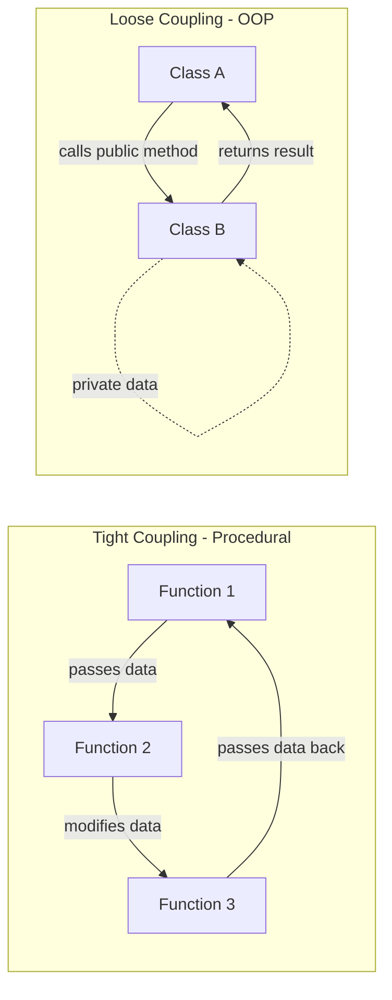

---

### Interview Notes — Encapsulation

> [!IMPORTANT]
> **Common interview questions:**
> - "What is encapsulation? What is data hiding?"
> - "How do you achieve encapsulation in Java?"
> - "What are access modifiers and why are they important?"
> - "What is the difference between abstraction and encapsulation?"

**Key differentiation — Abstraction vs Encapsulation:**

| | Abstraction | Encapsulation |
|--|-------------|---------------|
| **What it does** | Hides complexity / implementation | Hides data |
| **Focus** | What is exposed to user | How data is protected |
| **Achieved via** | Interface, Abstract Class | Private fields + public methods |
| **Analogy** | Car brake pedal hides engine internals | Medicine capsule protects medicine |

---

## Pillar 3 — Inheritance

### Overview

**Inheritance** is the mechanism by which one class (child/subclass) acquires the properties and behaviors of another class (parent/superclass). The child class gets everything the parent has, and can also add its own new properties and behaviors.

---

### Why This Concept Exists

- **Code reusability** — don't rewrite what already exists in the parent
- **Hierarchical classification** — models real-world "is-a" relationships
- **Foundation for Polymorphism** — overriding requires inheritance

---

### Real-world Analogy

> A child inherits traits from their parent — eye color, height tendency, talents. The child also has their own unique traits. Similarly, a subclass inherits fields and methods from the parent class, while also having its own additions.

---

### Syntax

```java
class Parent {
    // parent members
}

class Child extends Parent {
    // inherited members from Parent + own members
}
```

The keyword `extends` is used to establish inheritance.

---

### Code Example — Basic Inheritance

```java
// Parent Class
class Vehicle {
    boolean hasEngine;

    boolean getEngine() {
        return hasEngine;
    }
}

// Child Class
class Car extends Vehicle {
    String type; // e.g., "Hatchback", "SUV", "Sedan"

    String getCarType() {
        return type;
    }
}

public class Main {
    public static void main(String[] args) {
        Car swift = new Car();
        swift.hasEngine = true;
        swift.type = "Hatchback";

        System.out.println(swift.getEngine());   // ✅ Inherited from Vehicle
        System.out.println(swift.getCarType());  // ✅ Own method

        Vehicle myVehicle = new Vehicle();
        // myVehicle.getCarType(); // ❌ Compile error — parent can't access child methods
    }
}
```

**Output:**
```
true
Hatchback
```

---

### Key Rules of Inheritance

| Rule | Explanation |
|------|-------------|
| Child accesses parent members | ✅ Child can use all non-private parent fields and methods |
| Parent accesses child members | ❌ Parent cannot access child-specific members |
| `extends` keyword | Used by a class to inherit from another class |
| Single parent only (via `extends`) | A class can `extend` only ONE class in Java |
| `private` members not inherited | Private fields/methods are not directly accessible in child |

---

### Types of Inheritance in Java

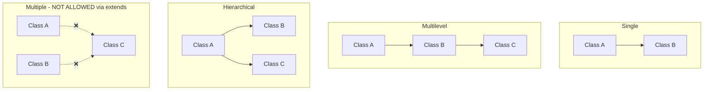

| Type | Description | Allowed in Java? |
|------|-------------|-----------------|
| **Single** | One parent, one child | ✅ Yes |
| **Multilevel** | A → B → C (chain) | ✅ Yes |
| **Hierarchical** | One parent, multiple children | ✅ Yes |
| **Multiple** | One child, multiple parents | ❌ Not via `extends` |

---

### The Diamond Problem

**Multiple inheritance via `extends` is NOT allowed in Java.** Here's why:

```java
class A {
    boolean getEngine() {
        return true; // implementation A
    }
}

class B {
    boolean getEngine() {
        return false; // implementation B
    }
}

// HYPOTHETICAL — This is NOT valid Java
// class C extends A, B { ... }

// If it were allowed:
// C obj = new C();
// obj.getEngine(); // Which one? A's or B's? AMBIGUITY!
```

This ambiguity is called the **Diamond Problem**. Java avoids it by not allowing a class to extend more than one class.

---

### Solving Diamond Problem via Interface

```java
interface A {
    void getEngine(); // No implementation — just declaration
}

interface B {
    void getEngine(); // No implementation — just declaration
}

// This IS valid in Java
class C implements A, B {
    @Override
    public void getEngine() {
        // C provides its OWN single implementation
        System.out.println("C's engine implementation");
    }
}
```

Because interfaces don't have implementation (only method signatures), there is **no ambiguity** — class C is forced to provide its own single implementation.

> [!IMPORTANT]
> **Why interfaces solve the Diamond Problem:**
> An interface only declares *what* a method should do — not *how*. So when a class implements two interfaces with the same method name, the implementing class writes its own single concrete implementation. No conflict.

---

### Advantages of Inheritance

1. **Code Reusability** — write once in parent, reuse in all children
2. **Enables Polymorphism** — method overriding requires inheritance
3. **Logical Hierarchy** — mirrors real-world classification (Vehicle → Car → ElectricCar)

---

### Interview Notes — Inheritance

> [!IMPORTANT]
> **Common interview questions:**
> - "What is inheritance? Explain with an example."
> - "What are the types of inheritance in Java?"
> - "Why is multiple inheritance not supported in Java?"
> - "What is the Diamond Problem? How is it solved?"
> - "What is the difference between extends and implements?"

---

## Pillar 4 — Polymorphism

### Overview

**Polymorphism** comes from Greek: *poly* = many, *morphism* = forms. It means the **same method can behave differently in different situations**.

> A person can be a father, a husband, and an employee — the same person taking different forms depending on context. Water can be liquid, solid, or gas — same substance, different forms.

---

### Two Types of Polymorphism

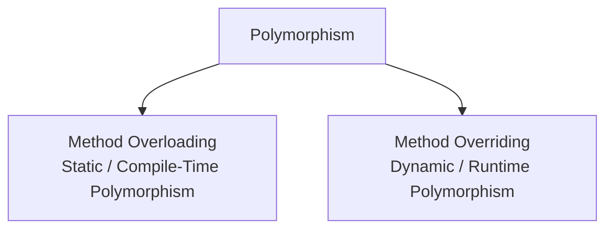

---

### Type 1 — Method Overloading (Compile-Time / Static Polymorphism)

#### Definition

**Method Overloading** means having **multiple methods with the same name in the same class**, but with **different parameters** (different type, different number, or different order).

Java resolves which method to call at **compile time** — hence "compile-time polymorphism."

#### Syntax

```java
class Sum {
    // Same method name — different parameter types
    int doSum(int a, int b) {
        return a + b;
    }

    String doSum(String a, String b) {
        return a + b;
    }

    // Same method name — different number of parameters
    int doSum(int a, int b, int c) {
        return a + b + c;
    }
}
```

#### Code Example with Output

```java
public class Main {
    public static void main(String[] args) {
        Sum calc = new Sum();

        System.out.println(calc.doSum(5, 2));          // calls doSum(int, int)
        System.out.println(calc.doSum("Hello ", "World")); // calls doSum(String, String)
        System.out.println(calc.doSum(3, 4, 2));       // calls doSum(int, int, int)
    }
}
```

**Output:**
```
7
Hello World
9
```

#### How Java Resolves Overloading (Compile Time)

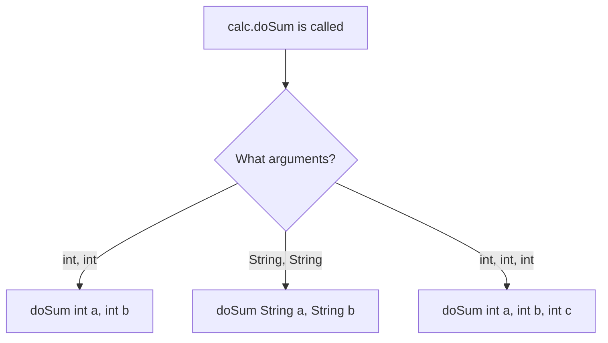

At compile time, the Java compiler looks at the **argument types and count** and resolves which method to invoke. The decision is made **before the program even runs**.

---

#### ❌ Can You Overload by Return Type Only?

**NO.** This is a very common interview trap.

```java
class Sum {
    int doSum(int x, int y) {
        return x + y;
    }

    // ❌ NOT valid overloading — same name, same parameters, only return type differs
    String doSum(int x, int y) {
        return String.valueOf(x + y);
    }
}
```

> [!WARNING]
> **Overloading based only on return type is NOT allowed.**
>
> **Why?** The Java compiler determines which method to call based on the arguments passed. If the caller writes `calc.doSum(5, 2)` without capturing the return value, the compiler cannot determine which method to invoke — both match the argument signature. Return type is not part of the method's binding signature.

---

#### Overloading Rules — Summary Table

| Rule | Allowed? |
|------|---------|
| Different number of parameters | ✅ Yes |
| Different types of parameters | ✅ Yes |
| Different order of parameter types | ✅ Yes |
| Different return type only | ❌ No |
| Different parameter names only | ❌ No |
| Inside the same class | ✅ Yes (required) |

---

### Type 2 — Method Overriding (Runtime / Dynamic Polymorphism)

#### Definition

**Method Overriding** means a **child class provides its own implementation** of a method that is already defined in the parent class. The method signature must be **exactly the same** — same name, same return type, same parameters.

Java resolves which method to call at **runtime** based on the actual object — hence "runtime polymorphism."

---

#### Syntax

```java
class A {
    boolean getEngine() {
        return true; // Parent's implementation
    }
}

class B extends A {
    @Override
    boolean getEngine() {
        // Child's own implementation
        // Performs different computation
        return false;
    }
}
```

#### Code Example with Output

```java
class A {
    void getEngine() {
        System.out.println("A's engine — always available");
    }
}

class B extends A {
    @Override
    void getEngine() {
        System.out.println("B's engine — high performance");
    }
}

public class Main {
    public static void main(String[] args) {
        A objA = new A();
        objA.getEngine(); // Calls A's method

        B objB = new B();
        objB.getEngine(); // Calls B's overridden method

        A ref = new B(); // Polymorphic reference
        ref.getEngine(); // Calls B's method at RUNTIME
    }
}
```

**Output:**
```
A's engine — always available
B's engine — high performance
B's engine — high performance
```

> [!NOTE]
> The third call `ref.getEngine()` is the key insight: even though `ref` is declared as type `A`, at runtime the JVM looks at the **actual object** (`new B()`) and calls B's method. This is **dynamic dispatch**.

---

#### How Java Resolves Overriding (Runtime)

```mermaid
sequenceDiagram
    participant Main
    participant JVM
    participant A
    participant B

    Main->>JVM: A ref = new B(); ref.getEngine()
    JVM->>JVM: Check actual object type at runtime → it's B
    JVM->>B: Call B's getEngine()
    B-->>Main: "B's engine — high performance"
```

---

#### Method Lookup Order

When `obj.method()` is called:
1. JVM checks what the **actual object type** is (not the declared reference type)
2. Looks for the method in **that class** first
3. If not found, goes **up the inheritance chain** to the parent

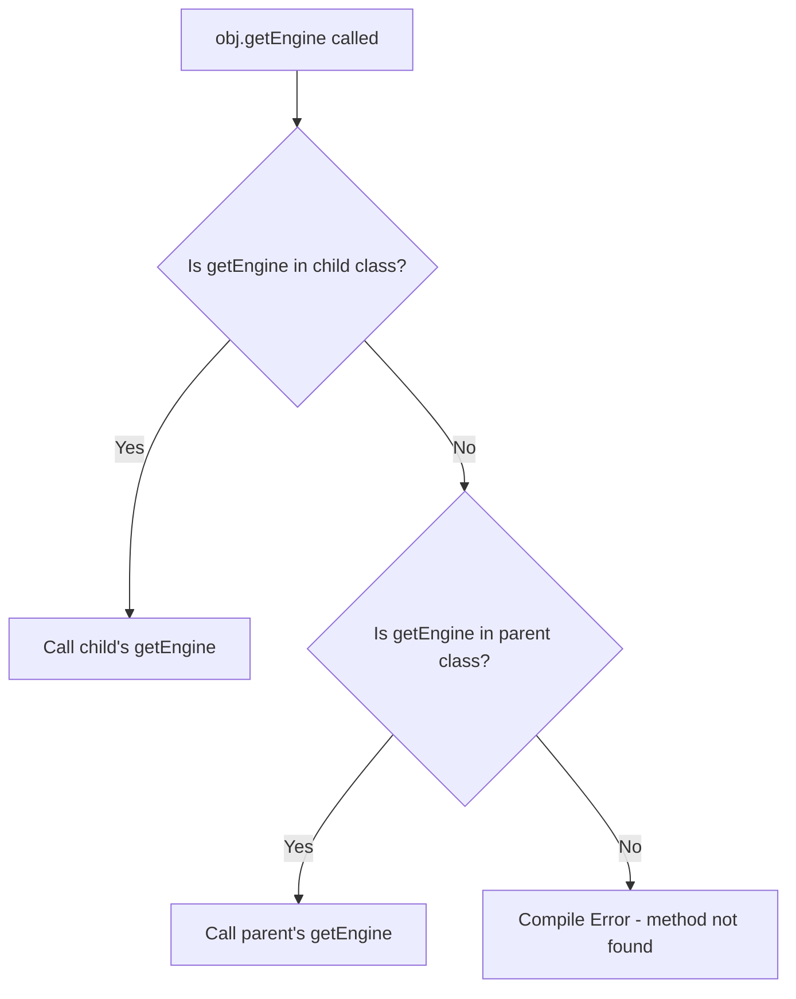

---

#### Overloading vs Overriding — Master Comparison

| Feature | Method Overloading | Method Overriding |
|---------|-------------------|-------------------|
| **Also called** | Static / Compile-time Polymorphism | Dynamic / Runtime Polymorphism |
| **Where** | Same class | Parent + Child class |
| **Method name** | Same | Same |
| **Parameters** | Must differ | Must be exactly the same |
| **Return type** | Can differ (if params also differ) | Must be same (or covariant) |
| **Resolved at** | Compile time | Runtime |
| **Requires inheritance** | ❌ No | ✅ Yes |
| **`@Override` annotation** | Not used | Should be used |
| **Access modifier** | Can differ | Cannot be more restrictive |

---

#### Interview Notes — Polymorphism

> [!IMPORTANT]
> **Common interview questions:**
> - "What is polymorphism? Give real-world examples."
> - "What is the difference between method overloading and method overriding?"
> - "Can you overload methods by changing only the return type?"
> - "What is compile-time polymorphism vs runtime polymorphism?"
> - "What is dynamic dispatch?"

---

# 5. OOP Relationships

Understanding relationships between classes is the **foundation of Low Level Design (LLD)**. Two fundamental relationships in OOP are:

1. **IS-A** (Inheritance)
2. **HAS-A** (Association)

---

## IS-A Relationship (Inheritance)

### Definition

An **IS-A relationship** means one class *is a type of* another class. It is achieved through **inheritance** (`extends`).

### Examples

| Statement | Interpretation |
|-----------|----------------|
| `Car extends Vehicle` | Car IS-A Vehicle ✅ |
| `Dog extends Animal` | Dog IS-A Animal ✅ |
| `ElectricCar extends Car` | ElectricCar IS-A Car ✅ |

> [!TIP]
> In interviews: "IS-A relationship" = **Inheritance**. When someone asks about IS-A, they want you to talk about `extends` and the parent-child class hierarchy.

---

## HAS-A Relationship (Association)

### Definition

A **HAS-A relationship** means one class **contains an object of another class** as a field (data member). This is also called **Association** or **Composition/Aggregation** depending on the strength of the relationship.

### Example

```java
class Engine {
    int cc;
    String type;
}

class Bike {
    String brand;
    Engine engine; // Bike HAS-A Engine
}

class School {
    String name;
    List<Student> students; // School HAS-A list of Students
}
```

### Types of HAS-A Relationships

| Type | Multiplicity | Example |
|------|-------------|---------|
| One-to-One | 1 student → 1 course | A student enrolled in exactly one course |
| One-to-Many | 1 student → many courses | A student enrolled in multiple courses |
| Many-to-Many | many students ↔ many courses | Each course has many students; each student has many courses |

---

## Aggregation vs Composition

Both are forms of the HAS-A relationship, but they differ in the **strength of dependency** between the two objects.

---

### Aggregation — Weak HAS-A Relationship

#### Definition

**Aggregation** is a HAS-A relationship where both objects can **exist independently**. Destroying one object does **not** destroy the other.

#### Example — School and Student

A School has Students. But if a school is closed, the students don't cease to exist — they go to another school. And if a student leaves, the school continues to exist.

```java
class Student {
    String name;
    int age;
}

class School {
    String name;
    List<Student> students; // Aggregation — weak relationship
}
```

> If `school` object is destroyed → students still exist  
> If all `student` objects are removed → school still exists (empty)

---

### Composition — Strong HAS-A Relationship

#### Definition

**Composition** is a HAS-A relationship where the **contained object cannot exist without the container**. Destroying the container also destroys the contained objects.

#### Example — School and Rooms

A school has rooms (classrooms). If the school building is demolished, the rooms are demolished too. The rooms have no independent existence outside of the school.

```java
class Room {
    int roomNumber;
    int capacity;
}

class School {
    String name;
    List<Room> rooms; // Composition — strong relationship
    // Rooms are created inside School and die with it
}
```

> If `school` object is destroyed → `rooms` objects are also destroyed  
> Rooms **cannot exist** independently of the School

---

### Aggregation vs Composition — Summary Table

| Feature | Aggregation | Composition |
|---------|-------------|-------------|
| **Also called** | Weak HAS-A | Strong HAS-A |
| **Dependency** | Weak — independent existence | Strong — dependent existence |
| **Object lifecycle** | Objects exist independently | Child dies with parent |
| **Example** | School HAS-A Student | School HAS-A Room |
| **Relationship type** | "Uses" | "Owns" |

---

### Diagram — Relationships Overview

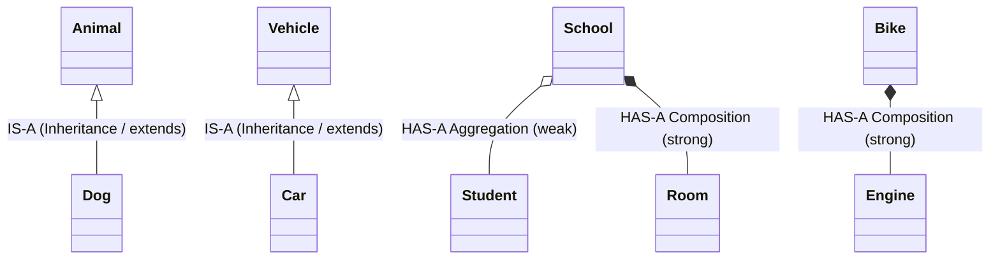

---

### Interview Notes — Relationships

> [!IMPORTANT]
> **Common interview questions:**
> - "What is IS-A relationship? What is HAS-A relationship?"
> - "What is the difference between Aggregation and Composition?"
> - "Can you give a real-world example of composition vs aggregation?"
> - "How does IS-A relate to inheritance in Java?"

---

# 6. Interview Question Bank

## Foundational Questions

| Question | Key Points to Cover |
|----------|---------------------|
| What is OOP? | Object-oriented, everything revolves around objects, objects have properties and behavior |
| What is a class? | Blueprint/template, contains data variables and data methods |
| What is an object? | Real-world entity, instance of a class, has properties and behavior |
| What is the difference between a class and an object? | Class is blueprint (method area), object is instance (heap memory) |
| What is the difference between procedural and OOP? | Procedural = function-first, data moves freely; OOP = data-first, bundled with methods |

## Four Pillars Questions

| Pillar | Key Interview Question | Answer Hint |
|--------|----------------------|-------------|
| Abstraction | Explain with a real-world example | Car brake, phone call — expose only essential |
| Abstraction | How to achieve in Java? | Interface and Abstract Class |
| Encapsulation | What is data hiding? | Private fields + public getters/setters |
| Encapsulation | What are access modifiers? | private, default, protected, public |
| Inheritance | Types of inheritance in Java? | Single, multilevel, hierarchical — NOT multiple via extends |
| Inheritance | What is Diamond Problem? How solved? | Ambiguity with multiple parents; solved via interfaces |
| Polymorphism | Overloading vs Overriding | Compile-time vs runtime, same class vs parent-child |
| Polymorphism | Can we overload by return type only? | NO — compiler uses parameters for binding, not return type |

## Relationship Questions

| Question | Answer |
|----------|--------|
| What is IS-A? | Inheritance — child IS-A type of parent |
| What is HAS-A? | Composition/Aggregation — one class has an object of another |
| Aggregation vs Composition? | Aggregation = weak (objects independent); Composition = strong (child dies with parent) |

---

# 7. Master Summary

## All Four Pillars — Quick Revision

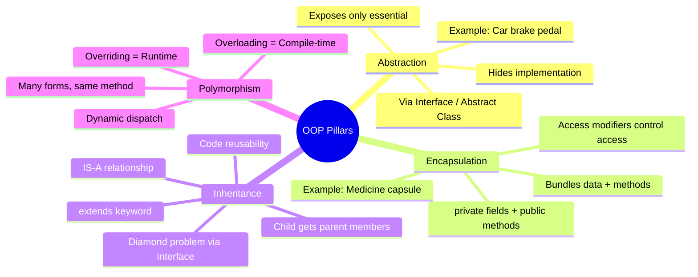

---

## Quick Revision Bullets

- ✅ **OOP** = everything revolves around objects (properties + behavior)
- ✅ **Class** = blueprint; **Object** = instance with real data in heap
- ✅ **Abstraction** = hide implementation, expose essential → via `interface` / `abstract class`
- ✅ **Encapsulation** = bundle data + methods in a class → `private` fields + `public` methods → loose coupling
- ✅ **Inheritance** = child gets parent members → `extends` → IS-A relationship → code reuse
- ✅ **Multiple inheritance** via `extends` NOT allowed → Diamond Problem
- ✅ **Diamond Problem solved** via `interface` — no ambiguity since interface has no implementation
- ✅ **Polymorphism** = same method, different forms
- ✅ **Overloading** = same name, different params, same class → compile-time
- ✅ **Overriding** = same name, same params, parent-child → runtime (dynamic dispatch)
- ✅ **Cannot overload by return type only** — Java doesn't use return type in method binding
- ✅ **IS-A** = Inheritance | **HAS-A** = Association (Aggregation/Composition)
- ✅ **Aggregation** = weak HAS-A (objects independent) | **Composition** = strong HAS-A (child dies with parent)

---

## Relationships Cheat Sheet

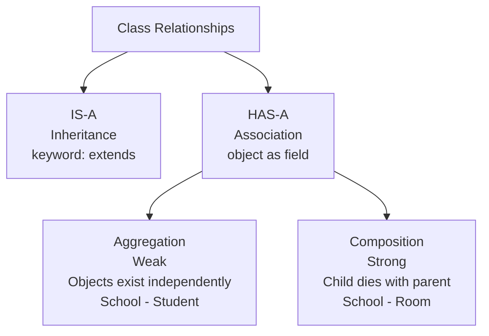

---

> [!TIP]
> **Study progression:**
> 1. Master objects & classes (this chapter)
> 2. Go deep into `interface` and `abstract class` (next chapter — unlocks abstraction fully)
> 3. Learn `this`, `super`, constructors
> 4. Practice inheritance chains
> 5. Master polymorphism with runtime examples
> 6. Apply everything in Low Level Design (LLD) problems

---

*End of Chapter — OOP Fundamentals in Java*
