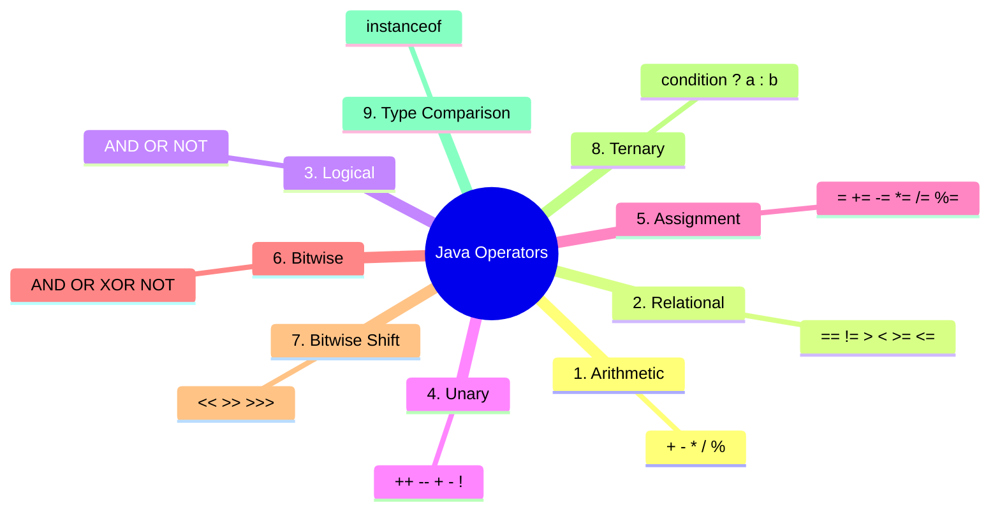
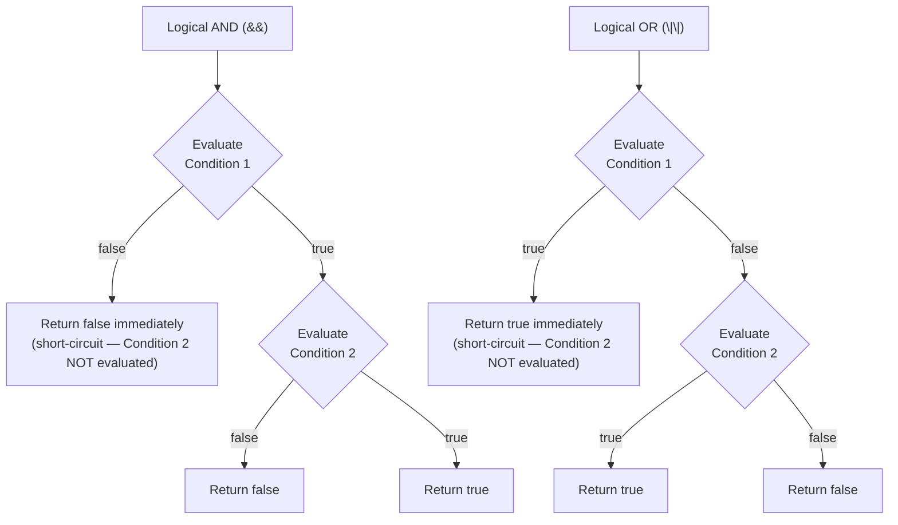
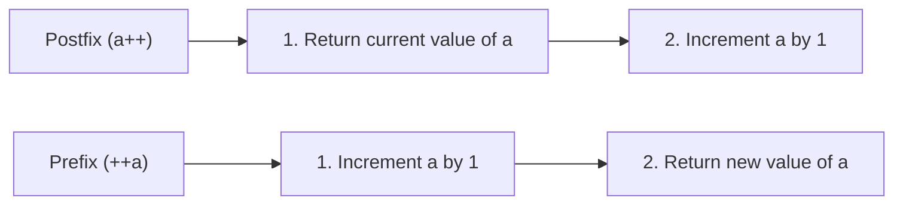
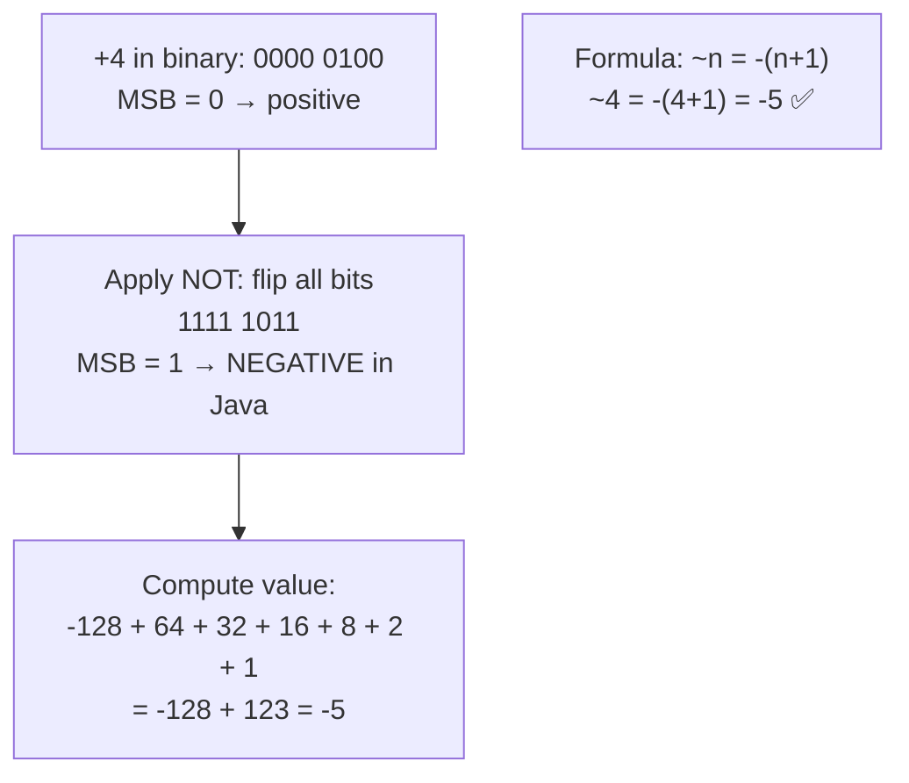
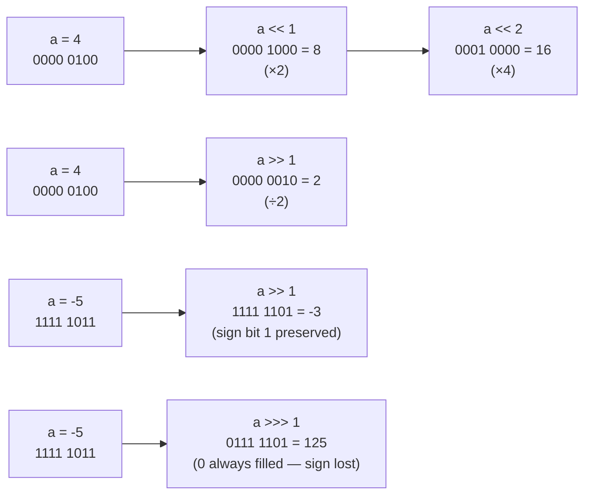

# 📚 Java Operators — Comprehensive Study Guide

> Part of the *Concept and Coding* Java lecture series.
> These notes are fully self-contained — no prior lecture viewing is required.
> This chapter covers all nine categories of Java operators in depth, with special focus on bitwise operators, bitwise shift operators, operator precedence, and associativity.

---

## Table of Contents

1. [Core Terminology — Operator, Operand, Expression](#1-core-terminology--operator-operand-expression)
2. [Categories of Operators in Java](#2-categories-of-operators-in-java)
3. [Arithmetic Operators](#3-arithmetic-operators)
4. [Relational (Comparison) Operators](#4-relational-comparison-operators)
5. [Logical Operators](#5-logical-operators)
6. [Unary Operators](#6-unary-operators)
7. [Assignment Operators](#7-assignment-operators)
8. [Bitwise Operators](#8-bitwise-operators)
9. [Bitwise Shift Operators](#9-bitwise-shift-operators)
10. [Ternary Operator](#10-ternary-operator)
11. [Type Comparison Operator — `instanceof`](#11-type-comparison-operator--instanceof)
12. [Operator Precedence & Associativity](#12-operator-precedence--associativity)
13. [Solving Complex Expressions Step by Step](#13-solving-complex-expressions-step-by-step)
14. [Mermaid Diagrams](#14-mermaid-diagrams)
15. [Quick-Reference Tables](#15-quick-reference-tables)
16. [Common Mistakes](#16-common-mistakes)
17. [Best Practices](#17-best-practices)
18. [Interview Notes](#18-interview-notes)
19. [Practice Questions](#19-practice-questions)
20. [Summary Cheat Sheet](#20-summary-cheat-sheet)

---

# 1. Core Terminology — Operator, Operand, Expression

## Operator

> An **operator** is a symbol that indicates what **action** to perform on one or more values.

Examples:
- `+` → addition
- `-` → subtraction
- `*` → multiplication
- `>` → greater-than comparison

## Operand

> An **operand** is the value or variable on which the operator acts.

Operands can be:
- **Constants (literals):** `5 + 3` — both `5` and `3` are constant operands
- **Variables:** `a + b` — both `a` and `b` are variable operands

```java
int a = 3, b = 4;
int result = a + b;
//           ↑   ↑     ← operands
//             ↑       ← operator
```

## Expression

> An **expression** consists of **one or more operands** and **zero or more operators** that together evaluate to a single value.

```java
5 + 3 * 4 - a    // an expression with operands (5, 3, 4, a) and operators (+, *, -)
true             // a single operand, zero operators — still an expression
```

---

# 2. Categories of Operators in Java

Java has **nine** categories of operators:



---

# 3. Arithmetic Operators

## Definition

Arithmetic operators perform basic **mathematical operations** on numeric operands.

## Operators

| Operator | Name | Example | Result |
|----------|------|---------|--------|
| `+` | Addition | `5 + 3` | `8` |
| `-` | Subtraction | `5 - 3` | `2` |
| `*` | Multiplication | `5 * 3` | `15` |
| `/` | Division | `5 / 2` | `2` (integer division) |
| `%` | Modulus (remainder) | `5 % 2` | `1` |

> [!IMPORTANT]
> **Integer Division:** When both operands are integers, `/` performs integer division — the fractional part is discarded (not rounded).
> ```java
> int result = 5 / 2;   // result = 2, NOT 2.5
> double d   = 5.0 / 2; // d = 2.5 — at least one operand must be double
> ```

## Code Example

```java
public class ArithmeticDemo {
    public static void main(String[] args) {
        int a = 5, b = 2;

        System.out.println("a + b = " + (a + b));   // 7
        System.out.println("a - b = " + (a - b));   // 3
        System.out.println("a * b = " + (a * b));   // 10
        System.out.println("a / b = " + (a / b));   // 2  (integer division)
        System.out.println("a % b = " + (a % b));   // 1  (remainder)
    }
}
```

**Output:**
```
a + b = 7
a - b = 3
a * b = 10
a / b = 2
a % b = 1
```

---

# 4. Relational (Comparison) Operators

## Definition

> Relational operators **compare two operands** and always return a **boolean** result (`true` or `false`).

## Operators

| Operator | Meaning | Example (`a=4, b=7`) | Result |
|----------|---------|----------------------|--------|
| `==` | Equal to | `a == b` | `false` |
| `!=` | Not equal to | `a != b` | `true` |
| `>` | Greater than | `a > b` | `false` |
| `<` | Less than | `a < b` | `true` |
| `>=` | Greater than or equal | `a >= b` | `false` |
| `<=` | Less than or equal | `a <= b` | `true` |

> [!WARNING]
> A very common mistake is confusing `=` (assignment) with `==` (comparison):
> ```java
> if (a = 5)   { }  // ❌ COMPILE ERROR in Java (assigns 5 to a, not a comparison)
> if (a == 5)  { }  // ✅ correct comparison
> ```

## Code Example

```java
public class RelationalDemo {
    public static void main(String[] args) {
        int a = 4, b = 7;

        System.out.println("a == b : " + (a == b));  // false
        System.out.println("a != b : " + (a != b));  // true
        System.out.println("a >  b : " + (a >  b));  // false
        System.out.println("a <  b : " + (a <  b));  // true
        System.out.println("a >= b : " + (a >= b));  // false
        System.out.println("a <= b : " + (a <= b));  // true
    }
}
```

**Output:**
```
a == b : false
a != b : true
a >  b : false
a <  b : true
a >= b : false
a <= b : true
```

---

# 5. Logical Operators

## Definition

> Logical operators **combine two or more boolean conditions** and return a single `true` or `false`.

## Operators

| Operator | Symbol | Meaning |
|----------|--------|---------|
| Logical AND | `&&` | `true` only if **both** conditions are `true` |
| Logical OR | `\|\|` | `true` if **at least one** condition is `true` |
| Logical NOT | `!` | Inverts the boolean value |

## Truth Tables

### AND (`&&`)

| Condition 1 | Condition 2 | Result |
|-------------|-------------|--------|
| `false` | `false` | `false` |
| `false` | `true` | `false` |
| `true` | `false` | `false` |
| `true` | `true` | ✅ `true` |

### OR (`||`)

| Condition 1 | Condition 2 | Result |
|-------------|-------------|--------|
| `false` | `false` | `false` |
| `false` | `true` | ✅ `true` |
| `true` | `false` | ✅ `true` |
| `true` | `true` | ✅ `true` |

## Short-Circuit Evaluation

This is one of the most important behaviors of logical operators.

### Short-Circuit AND (`&&`)

> If the **first condition is `false`**, Java **immediately returns `false`** without evaluating the second condition.

**Why?** Because if any condition in an AND chain is false, the whole result is false — no need to check further.

```java
int a = 4, b = 7;

// Condition 1: a < 3 → false
// Since first is false, Condition 2 is NEVER evaluated
boolean result = (a < 3) && (a != b);
System.out.println(result);  // false
```

### Short-Circuit OR (`||`)

> If the **first condition is `true`**, Java **immediately returns `true`** without evaluating the second condition.

**Why?** Because if any condition in an OR chain is true, the whole result is true.

```java
// Condition 1: a > 3 → true
// Since first is true, Condition 2 is NEVER evaluated
boolean result = (a > 3) || (a != b);
System.out.println(result);  // true
```

> [!IMPORTANT]
> Short-circuit evaluation is not just a performance optimization — it is frequently used to **prevent runtime errors**:
> ```java
> // Safe null check — if obj is null, obj.method() is never called
> if (obj != null && obj.method()) { }
> ```

## Code Example

```java
public class LogicalDemo {
    public static void main(String[] args) {
        int a = 4, b = 7;

        // AND examples
        System.out.println((a < 3)  && (a != b));  // false && true  → false
        System.out.println((a > 3)  && (a != b));  // true  && true  → true

        // OR examples
        System.out.println((a < 3)  || (a != b));  // false || true  → true
        System.out.println((a > 3)  || (a != b));  // true  || true  → true (short-circuit)

        // NOT example
        boolean flag = true;
        System.out.println(!flag);                  // false
    }
}
```

**Output:**
```
false
true
true
true
false
```

---

# 6. Unary Operators

## Definition

> **Unary operators** work on a **single operand** only.

## The Five Unary Operators

| Operator | Name | Example | Effect |
|----------|------|---------|--------|
| `++` | Increment | `a++` or `++a` | Increases value by 1 |
| `--` | Decrement | `a--` or `--a` | Decreases value by 1 |
| `+` | Unary Plus | `+a` | Makes value positive (no real effect on positives) |
| `-` | Unary Minus | `-a` | Negates the value |
| `!` | Logical NOT | `!flag` | Flips `true`↔`false` |

## Increment & Decrement — Prefix vs Postfix

This is a **very common interview topic** and source of confusion.

### Postfix (`a++`, `a--`)

> **Return first, then change the value.**

```
Step 1: Return current value of a
Step 2: Then increment (or decrement) a
```

### Prefix (`++a`, `--a`)

> **Change the value first, then return.**

```
Step 1: Increment (or decrement) a
Step 2: Then return the new value
```

## Code Example — Step by Step

```java
public class UnaryDemo {
    public static void main(String[] args) {
        int a = 5;

        // POSTFIX increment: return 5, then a becomes 6
        System.out.println(a++);  // prints 5   (a is now 6)

        // PREFIX increment: a becomes 7, then return 7
        System.out.println(++a);  // prints 7   (a is now 7)

        // POSTFIX decrement: return 7, then a becomes 6
        System.out.println(a--);  // prints 7   (a is now 6)

        // PREFIX decrement: a becomes 5, then return 5
        System.out.println(--a);  // prints 5   (a is now 5)

        // Unary minus
        System.out.println(-a);   // prints -5  (a stays 5)

        // Logical NOT
        boolean flag = true;
        System.out.println(!flag); // prints false
        System.out.println(!flag); // prints false (flag unchanged)
    }
}
```

**Output:**
```
5
7
7
5
-5
false
false
```

### Memory Trace

| Statement | Before | Action | Printed | After |
|-----------|--------|--------|---------|-------|
| `a++` | `a=5` | Return 5, then `a=6` | `5` | `a=6` |
| `++a` | `a=6` | `a=7`, then return 7 | `7` | `a=7` |
| `a--` | `a=7` | Return 7, then `a=6` | `7` | `a=6` |
| `--a` | `a=6` | `a=5`, then return 5 | `5` | `a=5` |

---

# 7. Assignment Operators

## Definition

> Assignment operators **assign a value** to a variable. The left side is always a variable; the right side is a value or expression.

## Operators

| Operator | Expanded Form | Example | Equivalent |
|----------|---------------|---------|------------|
| `=` | — | `a = 5` | assign 5 to a |
| `+=` | `a = a + x` | `a += 4` | `a = a + 4` |
| `-=` | `a = a - x` | `a -= 3` | `a = a - 3` |
| `*=` | `a = a * x` | `a *= 5` | `a = a * 5` |
| `/=` | `a = a / x` | `a /= 5` | `a = a / 5` |
| `%=` | `a = a % x` | `a %= 3` | `a = a % 3` |

## Code Example — Full Trace

```java
public class AssignmentDemo {
    public static void main(String[] args) {
        int a = 5;
        int variable = 0;

        variable = a;              // variable = 5
        System.out.println(variable);  // 5

        variable += a;             // variable = 5 + 5 = 10
        System.out.println(variable);  // 10

        variable -= 3;             // variable = 10 - 3 = 7
        System.out.println(variable);  // 7

        variable *= a;             // variable = 7 * 5 = 35
        System.out.println(variable);  // 35

        variable /= a;             // variable = 35 / 5 = 7
        System.out.println(variable);  // 7

        variable %= 3;             // variable = 7 % 3 = 1
        System.out.println(variable);  // 1
    }
}
```

**Output:**
```
5
10
7
35
7
1
```

## Chained Assignment (Right-to-Left Associativity)

Assignment operators evaluate **right to left**:

```java
int a, b, c;
a = b = c = 10;
// Step 1: c = 10
// Step 2: b = c (= 10)
// Step 3: a = b (= 10)
System.out.println(a + " " + b + " " + c);  // 10 10 10
```

---

# 8. Bitwise Operators

## Why Bitwise Operators?

Bitwise operators work directly on the **binary bit patterns** of integers. Processors handle single bit operations as single machine instructions — making bitwise operations **extremely fast**. They are heavily used in:
- Low-level programming (networking, embedded systems)
- Performance-critical algorithms
- DSA problems (checking even/odd, swapping, flags)
- Cryptography and encoding

## The Four Bitwise Operators

| Operator | Symbol | Operation |
|----------|--------|-----------|
| Bitwise AND | `&` | Both bits must be `1` → result is `1` |
| Bitwise OR | `\|` | Either bit is `1` → result is `1` |
| Bitwise XOR | `^` | Bits are **different** → result is `1` |
| Bitwise NOT | `~` | Flips all bits |

## Bit-by-Bit Truth Tables

### AND (`&`)

| Bit A | Bit B | A & B |
|-------|-------|-------|
| 0 | 0 | 0 |
| 0 | 1 | 0 |
| 1 | 0 | 0 |
| 1 | 1 | **1** |

### OR (`|`)

| Bit A | Bit B | A \| B |
|-------|-------|--------|
| 0 | 0 | 0 |
| 0 | 1 | **1** |
| 1 | 0 | **1** |
| 1 | 1 | **1** |

### XOR (`^`)

| Bit A | Bit B | A ^ B |
|-------|-------|-------|
| 0 | 0 | 0 |
| 0 | 1 | **1** |
| 1 | 0 | **1** |
| 1 | 1 | 0 |

> [!TIP]
> XOR mnemonic: **"Same = 0, Different = 1"**

### NOT (`~`)

| Bit | ~Bit |
|-----|------|
| 0 | 1 |
| 1 | 0 |

## Worked Example — AND, OR, XOR

```
a = 4  → binary:  0 1 0 0
b = 6  → binary:  0 1 1 0
```

### AND: `a & b`

```
  0 1 0 0   (4)
& 0 1 1 0   (6)
-----------
  0 1 0 0   = 4
```

### OR: `a | b`

```
  0 1 0 0   (4)
| 0 1 1 0   (6)
-----------
  0 1 1 0   = 6
```

### XOR: `a ^ b`

```
  0 1 0 0   (4)
^ 0 1 1 0   (6)
-----------
  0 0 1 0   = 2
```

## Code Example

```java
public class BitwiseDemo {
    public static void main(String[] args) {
        int a = 4;   // 0100
        int b = 6;   // 0110

        System.out.println("a & b = " + (a & b));   // 4  (0100)
        System.out.println("a | b = " + (a | b));   // 6  (0110)
        System.out.println("a ^ b = " + (a ^ b));   // 2  (0010)
        System.out.println("~a    = " + (~a));       // -5
    }
}
```

**Output:**
```
a & b = 4
a | b = 6
a ^ b = 2
~a    = -5
```

---

## 8.1 Bitwise NOT (`~`) — In-Depth Explanation

The `~` operator is the most confusing bitwise operator in Java because it interacts with Java's **signed integer representation (two's complement)**.

### Why `~4` gives `-5` and not `3`

**Step 1: Represent +4 in 8-bit binary**

```
+4  =  0000 0100
        ↑
        MSB = 0 → positive number
```

**Step 2: Apply NOT (flip every bit)**

```
~(0000 0100)
= 1111 1011
   ↑
   MSB = 1 → this is a NEGATIVE number in Java
```

**Step 3: Find the decimal value of `1111 1011`**

In Java, integers are **signed** (no unsigned `int`). When MSB = 1, the number is negative.

To find the decimal value of a negative two's complement number:

```
1111 1011
= -128 + 64 + 32 + 16 + 8 + 0 + 2 + 1
= -128 + 123
= -5
```

OR use the formula:

> `~n = -(n + 1)`

```
~4 = -(4 + 1) = -5  ✅
~0 = -(0 + 1) = -1
~(-1) = -(-1 + 1) = 0
```

### Verifying with Two's Complement

We can verify that `1111 1011` is indeed `-5` by computing the two's complement of `5`:

```
+5  = 0000 0101

Step 1: One's complement (flip bits)
      = 1111 1010

Step 2: Add 1
      = 1111 1011   ← this IS -5 ✅
```

`~4` gives `1111 1011`, and two's complement confirms that `1111 1011 = -5`. ✅

### Key Takeaway

> In Java, `~n` always equals `-(n + 1)` because Java integers are always signed (two's complement). There is no unsigned `int` in Java.

---

# 9. Bitwise Shift Operators

## Overview

Shift operators move all bits of a number **left** or **right** by a specified number of positions. They are essentially very fast **multiplication or division by powers of 2**.

## Three Types

| Operator | Symbol | Name | Effect |
|----------|--------|------|--------|
| Left shift | `<<` | Signed left shift | Shift bits left; fill right with `0` |
| Right shift | `>>` | Signed right shift | Shift bits right; fill left with **sign bit** |
| Unsigned right shift | `>>>` | Unsigned right shift | Shift bits right; fill left with `0` always |

> [!TIP]
> **Memory trick for direction:**
> Just look where the arrow points:
> - `<<` → arrows point LEFT → bits move left
> - `>>` → arrows point RIGHT → bits move right

---

## 9.1 Left Shift (`<<`)

### How It Works

- Shift all bits to the **left** by `n` positions.
- The leftmost bits are **discarded**.
- The rightmost vacated positions are **always filled with `0`**.

### Effect: Multiply by 2^n

```
a << n  ≡  a × 2^n
```

### Worked Example

```
a = 4  →  binary: 0000 0100

a << 1 :   shift left by 1
           0000 1000  = 8    (4 × 2 = 8)

a << 2 :   shift left by 2
           0001 0000  = 16   (4 × 4 = 16)
```

Visual representation:

```
Original:   0 0 0 0 0 1 0 0    (4)
After <<1:  0 0 0 0 1 0 0 0    (8)  ← new 0 inserted at right
After <<2:  0 0 0 1 0 0 0 0    (16) ← two 0s inserted at right
```

### Why There Is No Unsigned Left Shift

The **least significant bit (LSB)** — the rightmost bit — does not determine sign. Only the **most significant bit (MSB)** determines sign. Since left shift always fills the LSB positions with `0`, there is no ambiguity about sign behavior. Unsigned vs signed distinction is only meaningful for the MSB (which matters when filling on the right during a *right* shift). Therefore, Java has no `<<<` operator.

---

## 9.2 Signed Right Shift (`>>`)

### How It Works

- Shift all bits to the **right** by `n` positions.
- The rightmost bits are **discarded**.
- The leftmost vacated positions are filled with the **sign bit** (MSB):
  - Positive number (MSB = 0) → fill with `0`
  - Negative number (MSB = 1) → fill with `1`

### Effect: Divide by 2^n (rounding toward negative infinity)

```
a >> n  ≡  a / 2^n   (for positive numbers)
```

### Worked Example — Positive Number

```
a = 4  →  0000 0100

a >> 1:   shift right by 1
           0000 0010  = 2    (4 / 2 = 2)
           ↑ filled with 0 (because original MSB was 0)
```

### Worked Example — Negative Number

```
a = -5  → 1111 1011   (two's complement of 5)

a >> 1:   shift right by 1
           1111 1101  = -3   
           ↑ filled with 1 (because original MSB was 1 — sign is preserved)
```

Visual:

```
-5:  1 1 1 1 1 0 1 1
>>1: 1 1 1 1 1 1 0 1   ← 1 inserted at left (sign preserved)
                  ↑ rightmost bit discarded
Result = -3
```

---

## 9.3 Unsigned Right Shift (`>>>`)

### How It Works

- Shift all bits to the **right** by `n` positions.
- The rightmost bits are **discarded**.
- The leftmost vacated positions are **always filled with `0`**, regardless of the sign bit.

### Difference from `>>`

| | `>>` | `>>>` |
|-|------|-------|
| Fill bit | Sign bit (0 or 1) | Always `0` |
| Preserves sign? | ✅ Yes | ❌ No |
| Use case | Arithmetic division | Treating bits as unsigned |

### Worked Example

```
a = -5  →  1111 1011

a >>> 1:   shift right by 1
            0111 1101  = 125
            ↑ always filled with 0 — sign NOT preserved
```

Compared to signed:
```
-5 >> 1  = -3     (sign preserved, filled with 1)
-5 >>> 1 = 125    (no sign, filled with 0)
```

## Code Example — All Three Shift Operators

```java
public class ShiftDemo {
    public static void main(String[] args) {
        int a = 4;

        // Left shift
        System.out.println("4 << 1 = " + (a << 1));   // 8   (4 × 2)
        System.out.println("4 << 2 = " + (a << 2));   // 16  (4 × 4)

        // Signed right shift
        System.out.println("4 >> 1 = " + (a >> 1));   // 2   (4 / 2)

        int neg = -5;
        System.out.println("-5 >> 1  = " + (neg >> 1));  // -3  (sign preserved)
        System.out.println("-5 >>> 1 = " + (neg >>> 1)); // 2147483645 (sign not preserved)
    }
}
```

**Output:**
```
4 << 1 = 8
4 << 2 = 16
4 >> 1 = 2
-5 >> 1  = -3
-5 >>> 1 = 2147483645
```

## Shift Operators and Powers of 2 — Summary

| Operation | Mathematical Equivalent | Example |
|-----------|------------------------|---------|
| `a << n` | `a × 2^n` | `4 << 3 = 32` |
| `a >> n` | `a / 2^n` (floor) | `32 >> 3 = 4` |
| `a >>> n` | `a / 2^n` (unsigned) | `-5 >>> 1 = large positive` |

> [!TIP]
> Shift operators are extremely useful in DSA:
> - Check if bit `n` is set: `(num >> n) & 1`
> - Set bit `n`: `num | (1 << n)`
> - Clear bit `n`: `num & ~(1 << n)`
> - Check even/odd: `num & 1` (0 = even, 1 = odd)

---

# 10. Ternary Operator

## Definition

> The **ternary operator** (`? :`) is a compact, single-line alternative to an `if-else` statement. It evaluates a condition and returns one of two expressions depending on whether the condition is `true` or `false`.

It is called "ternary" because it works on **three operands**: the condition, the true-expression, and the false-expression.

## Syntax

```java
result = condition ? expressionIfTrue : expressionIfFalse;
```

| Part | Role |
|------|------|
| `condition` | A boolean expression — evaluates to `true` or `false` |
| `?` | Separates condition from the true branch |
| `expressionIfTrue` | Returned/executed if condition is `true` |
| `:` | Separates true branch from false branch (the "else") |
| `expressionIfFalse` | Returned/executed if condition is `false` |

## Equivalent if-else

```java
// if-else version
int maxValue;
if (a > b) {
    maxValue = a;
} else {
    maxValue = b;
}

// Ternary version — identical behavior, one line
int maxValue = (a > b) ? a : b;
```

## Code Example

```java
public class TernaryDemo {
    public static void main(String[] args) {
        int a = 4, b = 5;

        // Find maximum
        int max = (a > b) ? a : b;
        System.out.println("Max: " + max);     // 5

        // Check even or odd
        String parity = (a % 2 == 0) ? "even" : "odd";
        System.out.println("a is: " + parity); // even

        // Nested ternary (use sparingly — reduces readability)
        int x = 10, y = 20, z = 15;
        int largest = (x > y) ? ((x > z) ? x : z) : ((y > z) ? y : z);
        System.out.println("Largest: " + largest); // 20
    }
}
```

**Output:**
```
Max: 5
a is: even
Largest: 20
```

> [!TIP]
> Use the ternary operator for **simple, single-value expressions**. For complex conditions or multiple statements, prefer explicit `if-else` for readability.

---

# 11. Type Comparison Operator — `instanceof`

## Definition

> The `instanceof` operator checks whether an **object is an instance of a specific class** (or its subclass, or implements an interface). It always returns a `boolean`.

## Syntax

```java
object instanceof ClassName
```

Returns `true` if `object` is of type `ClassName` (or a subtype). Returns `false` otherwise.

## Why It's Useful

Because a parent class reference can hold objects of any child class, `instanceof` lets you safely check the **actual runtime type** before casting:

```java
Parent ref = new Child2();   // parent reference holds Child2 object
if (ref instanceof Child2) {
    Child2 c = (Child2) ref; // safe cast — we verified the type first
}
```

## Code Example

```java
class Parent { }
class ChildClass1 extends Parent { }
class ChildClass2 extends Parent { }

public class InstanceOfDemo {
    public static void main(String[] args) {
        Object obj = new ChildClass2();

        System.out.println(obj instanceof ChildClass2);  // true
        System.out.println(obj instanceof ChildClass1);  // false
        System.out.println(obj instanceof Parent);       // true (Child IS a Parent)

        // With child reference
        ChildClass1 child = new ChildClass1();
        System.out.println(child instanceof Parent);     // true — subtype
        System.out.println(child instanceof ChildClass1);// true

        // With Object (parent of all)
        Object unknownObj = new ChildClass2();
        System.out.println(unknownObj instanceof ChildClass1);  // false
        System.out.println(unknownObj instanceof ChildClass2);  // true

        // String check
        String text = "Hello";
        System.out.println(text instanceof String);  // true
    }
}
```

**Output:**
```
true
false
true
true
true
false
true
true
```

> [!NOTE]
> **Java 16+ Pattern Matching for `instanceof`:** Java 16 introduced a cleaner syntax that combines the `instanceof` check with casting:
> ```java
> // Old way (pre-Java 16)
> if (obj instanceof ChildClass2) {
>     ChildClass2 c = (ChildClass2) obj;
>     c.someMethod();
> }
>
> // New way (Java 16+)
> if (obj instanceof ChildClass2 c) {
>     c.someMethod();   // c is automatically cast
> }
> ```

---

# 12. Operator Precedence & Associativity

## What is Precedence?

> When an expression contains **multiple operators**, **precedence** determines **which operator is evaluated first**.

Example:
```java
5 + 2 * 3
```
Is this `(5 + 2) * 3 = 21` or `5 + (2 * 3) = 11`?

Because `*` has **higher precedence** than `+`, the multiplication happens first:
```
5 + (2 * 3) = 5 + 6 = 11
```

## What is Associativity?

> When two operators have the **same precedence**, **associativity** determines the **evaluation direction** (left-to-right or right-to-left).

Example:
```java
10 * 5 / 2
```
Both `*` and `/` have the same precedence. Their associativity is **left-to-right**, so:
```
(10 * 5) / 2 = 50 / 2 = 25
```

## Java Operator Precedence Table

(Higher row = Higher precedence = Evaluated first)

| Priority | Category | Operators | Associativity |
|----------|----------|-----------|---------------|
| 1 (Highest) | Postfix | `expr++`, `expr--` | Left → Right |
| 2 | Unary prefix | `++expr`, `--expr`, `+expr`, `-expr`, `~`, `!` | Right → Left |
| 3 | Multiplicative | `*`, `/`, `%` | Left → Right |
| 4 | Additive | `+`, `-` | Left → Right |
| 5 | Shift | `<<`, `>>`, `>>>` | Left → Right |
| 6 | Relational | `<`, `>`, `<=`, `>=`, `instanceof` | Left → Right |
| 7 | Equality | `==`, `!=` | Left → Right |
| 8 | Bitwise AND | `&` | Left → Right |
| 9 | Bitwise XOR | `^` | Left → Right |
| 10 | Bitwise OR | `\|` | Left → Right |
| 11 | Logical AND | `&&` | Left → Right |
| 12 | Logical OR | `\|\|` | Left → Right |
| 13 | Ternary | `? :` | Right → Left |
| 14 (Lowest) | Assignment | `=`, `+=`, `-=`, `*=`, `/=`, `%=`, etc. | Right → Left |

> [!TIP]
> You don't need to memorize the entire table. Use **parentheses** to make the intended order explicit:
> ```java
> int result = (5 + 2) * 3;   // clearly 21
> int result = 5 + (2 * 3);   // clearly 11
> ```

## Worked Precedence Example

```java
int result = 5 + 2 * 3 - 8 / 4;
```

Step-by-step (apply highest precedence first):

```
Step 1: 2 * 3 = 6      (multiplicative)
Step 2: 8 / 4 = 2      (multiplicative)
Step 3: 5 + 6 = 11     (additive, left-to-right)
Step 4: 11 - 2 = 9     (additive)
Result: 9
```

## Worked Associativity Example

```java
// Assignment — right to left
int a, b, c;
a = b = c = 10;
// Step 1 (rightmost first): c = 10
// Step 2: b = c (b = 10)
// Step 3: a = b (a = 10)
```

```java
// Same-precedence multiplicative — left to right
int x = 10 * 5 / 2;
// Step 1 (left first): 10 * 5 = 50
// Step 2: 50 / 2 = 25
```

---

# 13. Solving Complex Expressions Step by Step

## The Strategy

When you encounter a complex expression with `++`, `--`, and multiple operators, follow this process:

1. **Identify and substitute all operand current values** (handle postfix: return value first, then update; handle prefix: update first, then return value).
2. **Build the simplified numeric expression**.
3. **Apply operator precedence** (multiplication before addition, etc.).
4. **Compute the final result**.

## Worked Example from the Lecture

```java
int a = 4;
int result = a++ + ++a * --a + a--;
```

### Step 1: Substitute Operand Values

Track `a`'s value as you go left to right:

| Token | Current `a` | Action | Value Used | `a` after |
|-------|------------|--------|------------|-----------|
| `a++` | 4 | Postfix: use 4, then a++ | **4** | 5 |
| `++a` | 5 | Prefix: a++ first → 6, then use 6 | **6** | 6 |
| `--a` | 6 | Prefix: a-- first → 5, then use 5 | **5** | 5 |
| `a--` | 5 | Postfix: use 5, then a-- | **5** | 4 |

Substituted expression:
```
4 + 6 * 5 + 5
```

After the statement completes, `a = 4`.

### Step 2: Apply Precedence

`*` has higher precedence than `+`:

```
4 + (6 * 5) + 5
= 4 + 30 + 5
= 39
```

**Result: 39**, and `a = 4` after the statement.

---

## Practice Expression (from the lecture)

```java
int x = 2;
int z = ++x + x++ / x++ - 1;
```

### Trace

| Token | Current `x` | Action | Value Used | `x` after |
|-------|------------|--------|------------|-----------|
| `++x` | 2 | Prefix: x=3, use 3 | **3** | 3 |
| `x++` | 3 | Postfix: use 3, then x=4 | **3** | 4 |
| `x++` | 4 | Postfix: use 4, then x=5 | **4** | 5 |

Substituted:
```
3 + 3 / 4 - 1
```

Apply precedence (`/` before `+` and `-`):
```
3 + (3 / 4) - 1
= 3 + 0 - 1      ← integer division: 3/4 = 0
= 2
```

**z = 2**, **x = 5** after the statement.

---

# 14. Mermaid Diagrams

## Logical Operator Short-Circuit Flow



## Prefix vs Postfix Execution Flow



## Bitwise NOT — Why ~4 = -5



## Bit Shift Visual



---

# 15. Quick-Reference Tables

## All Nine Operator Categories

| Category | Operators | Returns | Example |
|----------|-----------|---------|---------|
| Arithmetic | `+ - * / %` | Numeric | `5 % 2 = 1` |
| Relational | `== != > < >= <=` | `boolean` | `4 < 7 = true` |
| Logical | `&& \|\| !` | `boolean` | `true && false = false` |
| Unary | `++ -- + - !` | Numeric / boolean | `++a`, `!flag` |
| Assignment | `= += -= *= /= %=` | Assigns value | `a += 3` |
| Bitwise | `& \| ^ ~` | Numeric (bit level) | `4 & 6 = 4` |
| Shift | `<< >> >>>` | Numeric | `4 << 1 = 8` |
| Ternary | `? :` | Value of chosen branch | `a>b ? a : b` |
| Type comparison | `instanceof` | `boolean` | `obj instanceof String` |

## Bitwise Operator Truth Table (Combined)

| A | B | A & B | A \| B | A ^ B |
|---|---|-------|--------|-------|
| 0 | 0 | 0 | 0 | 0 |
| 0 | 1 | 0 | 1 | 1 |
| 1 | 0 | 0 | 1 | 1 |
| 1 | 1 | 1 | 1 | 0 |

## Shift Operators — Fill Bit Rules

| Operator | Direction | Fill Bit | Sign Preserved? |
|----------|-----------|----------|----------------|
| `<<` | Left | `0` (always) | N/A (affects MSB) |
| `>>` | Right | Sign bit (0 or 1) | ✅ Yes |
| `>>>` | Right | `0` (always) | ❌ No |

## Prefix vs Postfix

| | Postfix (`a++`) | Prefix (`++a`) |
|-|----------------|----------------|
| Step 1 | Return current value | Increment/decrement |
| Step 2 | Increment/decrement | Return new value |
| Value used in expression | **Old** value | **New** value |

---

# 16. Common Mistakes

## Mistake 1: `=` vs `==`

```java
if (a = 5) { }   // ❌ COMPILE ERROR — assignment, not comparison
if (a == 5) { }  // ✅ comparison
```

---

## Mistake 2: Integer Division Surprise

```java
int result = 5 / 2;
System.out.println(result);  // ❌ prints 2, NOT 2.5
```

**Fix:** Use `double`:

```java
double result = 5.0 / 2;     // ✅ 2.5
double result = (double) 5 / 2;  // ✅ also 2.5
```

---

## Mistake 3: Confusing Postfix and Prefix in Expressions

```java
int a = 5;
int b = a++;   // b = 5 (old value), a = 6
int c = ++a;   // a = 7 first, then c = 7
```

Many beginners assume `a++` increments before the assignment. It does not — the assignment gets the old value.

---

## Mistake 4: Expecting `~n` to Give the Bitwise Complement as Positive

```java
int a = 4;
System.out.println(~a);  // prints -5, NOT 3
```

Java uses signed two's complement — `~n` always gives `-(n+1)`, not just a bit flip to a positive number.

---

## Mistake 5: Using `>>` instead of `>>>` for Unsigned Shift

```java
int n = -5;
System.out.println(n >> 1);   // -3 (sign preserved — may not be intended)
System.out.println(n >>> 1);  // 2147483645 (treats bits as unsigned)
```

If you want to treat bits as unsigned, always use `>>>`.

---

## Mistake 6: Precedence Assumption Without Parentheses

```java
boolean result = 4 + 3 > 5 && 2 * 3 == 6;
// Actual evaluation:
// (4+3) > 5  →  7 > 5  → true
// (2*3) == 6  →  6 == 6  → true
// true && true → true
```

While this happens to be correct, always use parentheses to make intent explicit.

---

## Mistake 7: `instanceof` on `null`

```java
Object obj = null;
System.out.println(obj instanceof String);  // false — does NOT throw NullPointerException
```

`instanceof` safely returns `false` for `null` — it never throws `NullPointerException`. This can be used as a safe null check.

---

# 17. Best Practices

1. **Use parentheses generously** to make operator precedence explicit. Code is read more than it is written — don't make readers memorize precedence tables.

2. **Avoid complex chained `++`/`--` expressions** in a single line. Split them across multiple statements for clarity.

3. **Use shift operators for power-of-2 arithmetic** in performance-critical code:
   - `x * 2` → `x << 1`
   - `x / 4` → `x >> 2`
   - But prefer readable `x * 2` in normal code unless performance is critical.

4. **Use `>>>` instead of `>>` when working with raw bit patterns** (e.g., hashing, encoding) to avoid sign-extension surprises.

5. **Use `instanceof` before casting** to prevent `ClassCastException`:
   ```java
   if (obj instanceof Dog) {
       Dog dog = (Dog) obj;  // safe
   }
   ```

6. **Prefer `&&` and `||` over `&` and `|`** for boolean conditions — the short-circuit versions are safer and often more efficient.

7. **Use ternary for simple assignments only.** Nested ternaries are hard to read — use `if-else` instead.

8. **Use `BigDecimal` when precision matters** for arithmetic — never rely on `float`/`double` for exact results.

---

# 18. Interview Notes

## Frequently Asked Questions

**Q1: What is the difference between `&` and `&&`?**

A: `&` is a **bitwise AND** — it operates on individual bits of integers. `&&` is a **logical AND** for booleans with **short-circuit evaluation** — if the first condition is `false`, the second is never evaluated. When used with booleans, `&` still works but does NOT short-circuit.

---

**Q2: What is the difference between `>>` and `>>>`?**

A: `>>` is **signed right shift** — the vacated MSB positions are filled with the original sign bit (preserving the sign). `>>>` is **unsigned right shift** — vacated positions are always filled with `0`, regardless of sign.

---

**Q3: What is the output of `~4` in Java?**

A: `-5`. Because `~n = -(n+1)` in Java's signed two's complement representation. `4` in binary is `00000100`; flipping all bits gives `11111011`, which in two's complement equals `-5`.

---

**Q4: What is the difference between prefix (`++a`) and postfix (`a++`) increment?**

A: Postfix returns the **current value** and then increments. Prefix increments **first** and then returns the new value. Both increment the variable by 1, but the value returned to the expression differs.

---

**Q5: What does the left shift operator `<<` do mathematically?**

A: `a << n` is equivalent to `a × 2^n`. Each left shift by 1 doubles the value. The vacated right bits are always filled with `0`.

---

**Q6: Why is there no `<<<` (unsigned left shift) operator in Java?**

A: Because left shift only affects the right (least significant) bits, which are always filled with `0`. The sign bit (MSB) is on the left — unsigned vs signed distinction only matters when filling from the left, which happens in right shifts. Since left shift always fills with `0` on the right, a separate unsigned version is unnecessary.

---

**Q7: What is short-circuit evaluation in logical operators?**

A: In `&&`, if the first operand is `false`, Java skips evaluating the second operand and immediately returns `false`. In `||`, if the first operand is `true`, Java skips the second and returns `true`. This is used to prevent side effects and runtime errors (e.g., null pointer checks).

---

**Q8: What does `instanceof` return for `null`?**

A: It returns `false` — it never throws a `NullPointerException`. `null instanceof AnyClass` is always `false`.

---

**Q9: What is operator precedence and associativity?**

A: Precedence determines which operator is evaluated first when multiple operators appear in one expression (e.g., `*` before `+`). Associativity determines the evaluation direction when two operators have the same precedence (most Java operators are left-to-right; assignment is right-to-left).

---

**Q10: What is the value of `z` and `x` after: `int x = 2; int z = ++x + x++ / x++ - 1;`?**

A:
- `++x` → x=3, use 3
- `x++` → use 3, then x=4
- `x++` → use 4, then x=5
- Expression: `3 + 3/4 - 1` → `3 + 0 - 1 = 2` (integer division)
- z = 2, x = 5

---

# 19. Practice Questions

## Easy

1. What is the output of `5 / 2` and `5.0 / 2` in Java?
2. What is the difference between `==` and `=`?
3. What does `a++` return when `a = 7`? What is `a` after the statement?
4. What does `~0` evaluate to in Java?
5. What is `8 >> 2`? What is `8 << 2`?

## Medium

6. Trace through this expression and find the output:
   ```java
   int a = 5;
   System.out.println(a++ + ++a - a--);
   // What is printed? What is a afterward?
   ```

7. What is the output? Explain using short-circuit evaluation:
   ```java
   int x = 0;
   boolean result = (x != 0) && (10 / x > 1);
   System.out.println(result);
   ```

8. Compute `13 & 10`, `13 | 10`, and `13 ^ 10` by hand using binary. Verify with Java code.

9. What is the result of `-8 >> 1` and `-8 >>> 1`? Explain the difference.

10. What is the output?
    ```java
    Object obj = null;
    System.out.println(obj instanceof String);
    ```

## Hard

11. Prove that `a ^ b ^ b == a` for any integer `a` and `b` using the XOR truth table. What is this property called, and what is it used for in algorithms?

12. Write a Java method using only bitwise operators (no `%` or `/`) to check if a number is even or odd.

13. Trace the full execution of:
    ```java
    int a = 4;
    int result = a++ + ++a * --a + a--;
    System.out.println(result);
    System.out.println(a);
    ```

14. Explain why `(int)(2.9 + 0.1)` gives `3` but `(int)(1.0 / 3.0 * 3.0)` may not give `1`. Which operator-related concept does this illustrate?

15. Use only the `<<`, `>>`, `&`, and `|` operators to write a method that extracts the `n`-th bit of an integer, and another that sets the `n`-th bit.

---

# 20. Summary Cheat Sheet

```
┌─────────────────────────────────────────────────────────────────────────────┐
│                    JAVA OPERATORS — QUICK SUMMARY                            │
├─────────────────────────────────────────────────────────────────────────────┤
│ CATEGORIES (9 total)                                                         │
│  Arithmetic: + - * / %         Relational: == != > < >= <=                 │
│  Logical: && || !              Unary: ++ -- + - !                           │
│  Assignment: = += -= *= /= %=  Bitwise: & | ^ ~                            │
│  Shift: << >> >>>              Ternary: cond ? a : b                        │
│  Type comparison: instanceof                                                 │
├─────────────────────────────────────────────────────────────────────────────┤
│ POSTFIX vs PREFIX                                                            │
│  a++ → use THEN increment     ++a → increment THEN use                     │
│  a-- → use THEN decrement     --a → decrement THEN use                     │
├─────────────────────────────────────────────────────────────────────────────┤
│ BITWISE OPERATORS                                                            │
│  & AND:  both 1 → 1           | OR:  any 1 → 1                             │
│  ^ XOR:  different → 1        ~ NOT: flip all bits                         │
│  ~n = -(n+1)  always (Java is signed, no unsigned int)                     │
├─────────────────────────────────────────────────────────────────────────────┤
│ SHIFT OPERATORS                                                              │
│  a << n  = a × 2^n  (fill right with 0)                                    │
│  a >> n  = a ÷ 2^n  (fill left with SIGN BIT — preserves sign)            │
│  a >>> n = a ÷ 2^n  (fill left with 0 ALWAYS — no sign preservation)      │
│  No <<< exists — left shift always fills LSB with 0 (no sign issue)        │
├─────────────────────────────────────────────────────────────────────────────┤
│ SHORT-CIRCUIT EVALUATION                                                     │
│  && : first false → skip rest, return false                                 │
│  || : first true  → skip rest, return true                                  │
├─────────────────────────────────────────────────────────────────────────────┤
│ PRECEDENCE (high → low, simplified)                                          │
│  Postfix (a++) > Prefix (++a) > Multiplicative (* / %) >                   │
│  Additive (+ -) > Shift (<<>>>>>>) > Relational (><>= <=) >               │
│  Equality (== !=) > Bitwise & > ^ > | > && > || > ?: > Assignment (=)     │
│  Associativity: most = left-to-right; assignment & ternary = right-to-left │
├─────────────────────────────────────────────────────────────────────────────┤
│ SOLVING COMPLEX EXPRESSIONS                                                  │
│  1. Substitute operand values (handle ++ / -- order)                        │
│  2. Build the numeric expression                                             │
│  3. Apply precedence (multiply before add, etc.)                            │
│  4. Compute final result                                                     │
└─────────────────────────────────────────────────────────────────────────────┘
```

---

*End of Chapter — Java Operators*

> Next Topics: Control Flow (if-else, switch) · Loops (for, while, do-while) · Arrays · Strings
