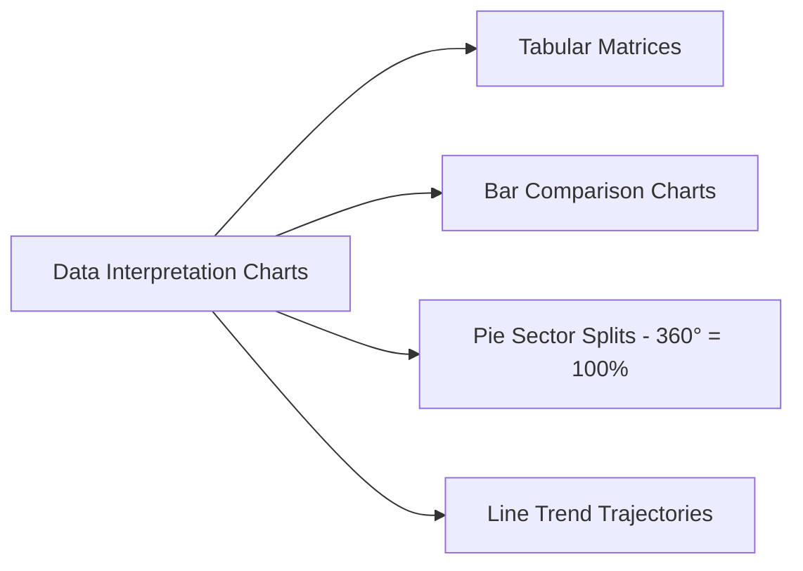

# 20. Data Interpretation (DI)

---

## 1. Tables, Bar, Line & Pie Chart Mastery



- **Pie Chart Angle Conversion**: A full circle ($360^\circ$) maps directly to $100\%$.
  - **$1^\circ = \frac{5}{18}\%$**, **$1\% = 3.6^\circ$**.

---

## Interactive Practice Quiz Deck

```quiz
[
  {
    "id": 2001,
    "question": "In a corporate budget Pie Chart total of Rs. 360,000, the research sector subtends a central geometric angle of 72°. What is the actual financial budget allocated to research?",
    "options": [
      "Rs. 72,000",
      "Rs. 54,000",
      "Rs. 36,000",
      "Rs. 80,000"
    ],
    "correctIndex": 0,
    "explanation": "360° corresponds to Rs. 360,000 -> 1° = Rs. 1,000. An angle of 72° represents 72 × 1,000 = Rs. 72,000."
  },
  {
    "id": 2002,
    "question": "If an expenditure category represents exactly 15% of a company's financial budget in a circular pie chart, what degree central angle does this sector subtend?",
    "options": [
      "45°",
      "54°",
      "60°",
      "36°"
    ],
    "correctIndex": 1,
    "explanation": "Every 1% in a pie chart equals 3.6°. Thus, 15% corresponds directly to 15 × 3.6° = 54°."
  }
]
```