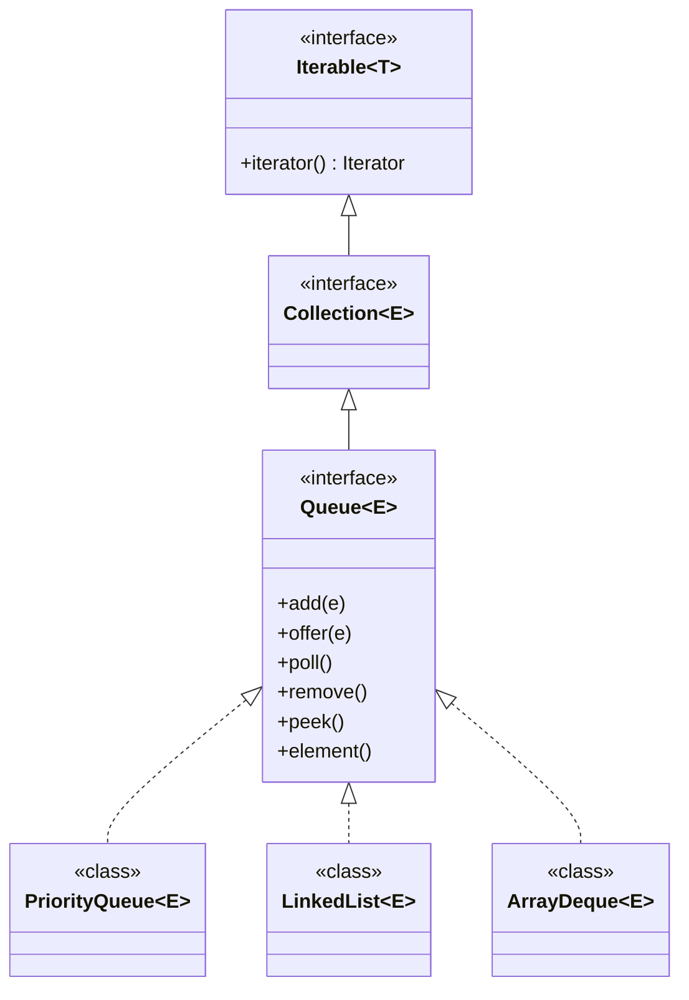
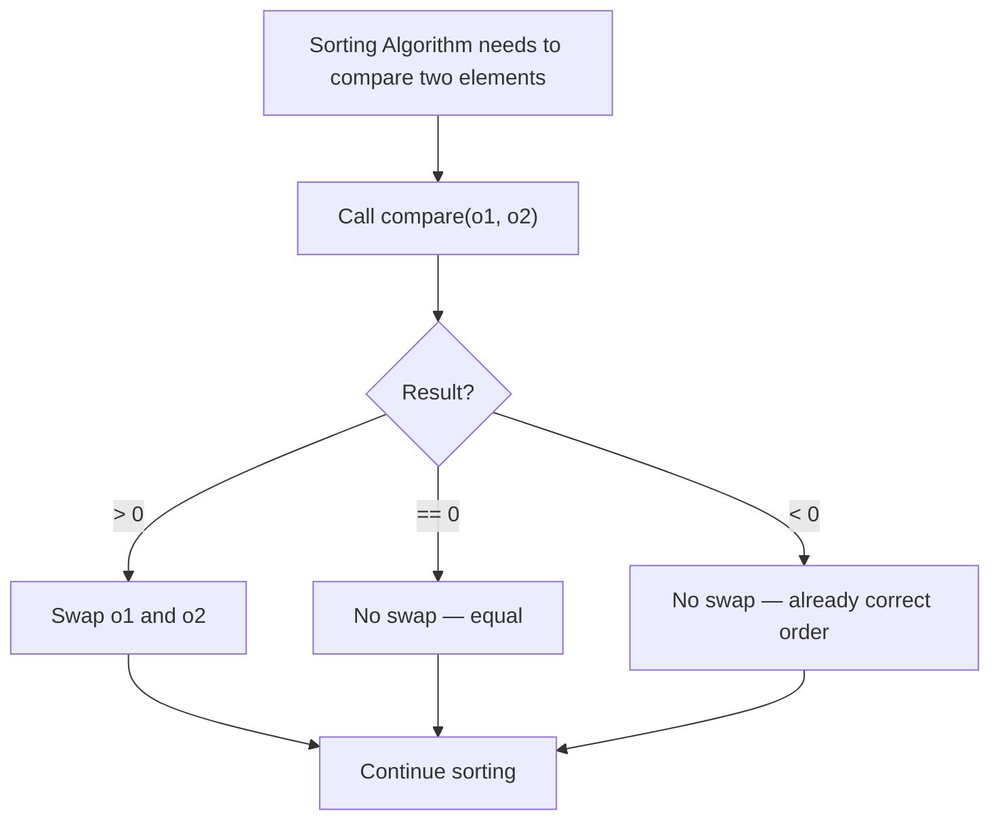
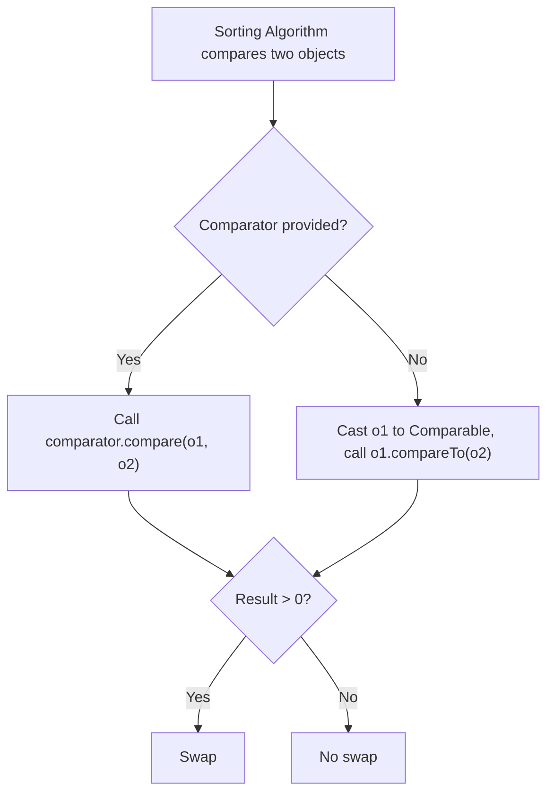
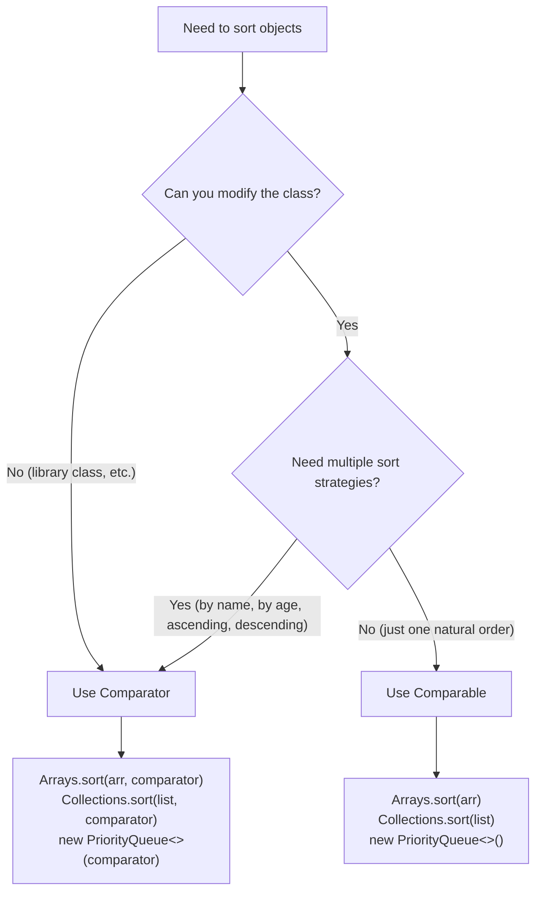
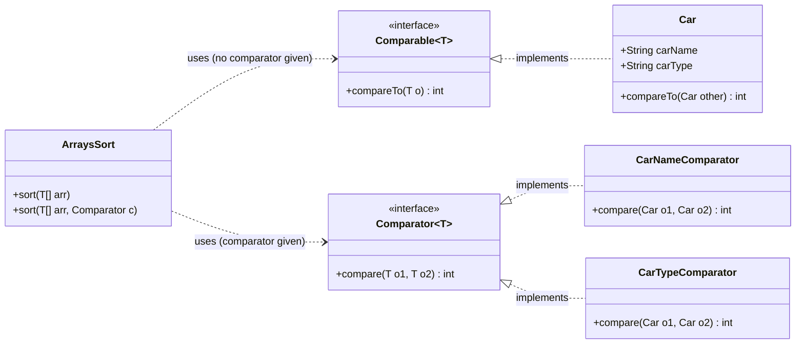

# 📚 Java Collections — Part 2: Queue, PriorityQueue, Comparator & Comparable

> [!NOTE]
> This document is a self-contained, professional-quality study guide covering **Queue**, **PriorityQueue**, **Comparator**, and **Comparable** in Java. It is designed so that no prior lecture or external resource is needed.

---

## 📋 Table of Contents

1. [Queue Interface](#1-queue-interface)
2. [Queue Methods — Detailed Reference](#2-queue-methods--detailed-reference)
3. [PriorityQueue](#3-priorityqueue)
4. [Min PriorityQueue (Default)](#4-min-priorityqueue-default)
5. [Max PriorityQueue (with Comparator)](#5-max-priorityqueue-with-comparator)
6. [PriorityQueue Time Complexities](#6-priorityqueue-time-complexities)
7. [The Sorting Problem — Why Comparator & Comparable Exist](#7-the-sorting-problem--why-comparator--comparable-exist)
8. [Comparator Interface](#8-comparator-interface)
9. [Sorting Primitives vs Objects](#9-sorting-primitives-vs-objects)
10. [Comparable Interface](#10-comparable-interface)
11. [Comparator vs Comparable — Full Comparison](#11-comparator-vs-comparable--full-comparison)
12. [Practice Questions](#12-practice-questions)
13. [Interview Notes](#13-interview-notes)
14. [Summary Revision Bullets](#14-summary-revision-bullets)

---

# 1. Queue Interface

## Overview

A **Queue** is a linear data structure that models the concept of a real-world queue (line of people). In Java, `Queue` is an **interface** in the `java.util` package and is a child (sub-interface) of the `Collection` interface.

---

## Why This Concept Exists

In many programming problems you need to process elements in the **order they arrive** — first come, first served. The Queue interface formalizes this ordering and provides a standard API for it.

---

## Definition

> A Queue is a collection designed for holding elements prior to processing. It follows — by default — the **FIFO (First In, First Out)** principle: the element added first is the one removed first.

---

## Real-world Analogy

Imagine a **movie-theater ticket counter**:
- People join the line at the **rear (back)**.
- People get their ticket and leave from the **front**.
- Whoever arrived first gets served first — **First In, First Out**.

---

## FIFO Principle — Illustrated

```
Rear → [New items added here]
Front ← [Items removed here]

Queue state after adding 10, 20, 30:
Front → [ 10 | 20 | 30 ] ← Rear

After one remove (poll):
Front → [ 20 | 30 ] ← Rear   (10 was returned and removed)
```

---

## Queue in the Java Collection Hierarchy



> [!IMPORTANT]
> `Queue` is a **sub-interface** of `Collection`, which is itself a sub-interface of `Iterable`. Therefore, every Queue implementation inherits all methods from both `Collection` and `Iterable`, plus the Queue-specific methods.

---

## Key Observations

- Queue generally follows **FIFO**, but **not always** — `PriorityQueue` is a notable exception.
- Queue is an **interface**, not a class — you cannot instantiate it directly.
- Concrete implementations: `PriorityQueue`, `LinkedList`, `ArrayDeque`.

---

# 2. Queue Methods — Detailed Reference

Queue adds **six new methods** on top of everything inherited from `Collection`. These six methods come in **three pairs**, where each pair does the same operation but differs in how it handles failure (exception vs. special return value).

---

## The Six Methods at a Glance

| Operation | Throws Exception on Failure | Returns Special Value on Failure |
|-----------|----------------------------|----------------------------------|
| **Insert** | `add(e)` | `offer(e)` |
| **Remove & Return Head** | `remove()` | `poll()` |
| **Inspect Head (no remove)** | `element()` | `peek()` |

---

## Method 1: `add(e)`

**Purpose:** Insert an element into the queue.

**Behavior:**
- Returns `true` if insertion is successful.
- Throws an **exception** if insertion fails (e.g., capacity-restricted queue is full).
- Throws `NullPointerException` if you try to insert `null`.

```java
Queue<Integer> queue = new LinkedList<>();
queue.add(5);     // Inserts 5 — returns true
queue.add(null);  // Throws NullPointerException
```

---

## Method 2: `offer(e)`

**Purpose:** Insert an element into the queue.

**Behavior:**
- Exactly the same as `add(e)` in most cases.
- The only difference: if insertion **fails**, `offer` returns `false` instead of throwing an exception.
- This is preferred for **capacity-constrained** queues.

```java
Queue<Integer> queue = new LinkedList<>();
boolean result = queue.offer(10);  // returns true
```

| Aspect | `add(e)` | `offer(e)` |
|--------|----------|------------|
| On success | Returns `true` | Returns `true` |
| On failure | Throws exception | Returns `false` |
| Null allowed? | No (NPE) | No (NPE) |

---

## Method 3: `poll()`

**Purpose:** Retrieve **and remove** the head (front) of the queue.

**Behavior:**
- Returns the element at the head.
- Also **removes** that element from the queue.
- Returns `null` if the queue is empty (does NOT throw an exception).

```java
Queue<Integer> queue = new LinkedList<>();
queue.add(1);
queue.add(2);
Integer head = queue.poll();  // Returns 1, queue now contains [2]
queue.poll();                 // Returns 2, queue is now empty
queue.poll();                 // Returns null (queue empty, no exception)
```

---

## Method 4: `remove()`

**Purpose:** Retrieve **and remove** the head of the queue.

**Behavior:**
- Same as `poll()`, but if the queue is **empty**, it throws `NoSuchElementException` instead of returning `null`.

```java
Queue<Integer> queue = new LinkedList<>();
queue.add(42);
queue.remove();  // Returns 42
queue.remove();  // Throws NoSuchElementException — queue is empty
```

| Aspect | `poll()` | `remove()` |
|--------|----------|------------|
| Removes head? | Yes | Yes |
| Returns head value? | Yes | Yes |
| If queue empty | Returns `null` | Throws `NoSuchElementException` |

---

## Method 5: `peek()`

**Purpose:** Retrieve (look at) the head of the queue **without removing it**.

**Behavior:**
- Returns the element at the front.
- Does **not** modify the queue.
- Returns `null` if the queue is empty.

```java
Queue<Integer> queue = new LinkedList<>();
queue.add(7);
queue.add(8);
Integer head = queue.peek();  // Returns 7, queue still contains [7, 8]
```

---

## Method 6: `element()`

**Purpose:** Retrieve (look at) the head of the queue **without removing it**.

**Behavior:**
- Same as `peek()`, but if the queue is **empty**, throws `NoSuchElementException`.

```java
Queue<Integer> queue = new LinkedList<>();
queue.element();  // Throws NoSuchElementException — empty queue
```

| Aspect | `peek()` | `element()` |
|--------|----------|-------------|
| Removes head? | No | No |
| Returns head value? | Yes | Yes |
| If queue empty | Returns `null` | Throws `NoSuchElementException` |

---

## Complete Method Summary Table

| Method | Action | Failure Behavior |
|--------|--------|-----------------|
| `add(e)` | Insert at rear | Exception |
| `offer(e)` | Insert at rear | Return `false` |
| `remove()` | Remove & return head | Exception |
| `poll()` | Remove & return head | Return `null` |
| `element()` | Inspect head | Exception |
| `peek()` | Inspect head | Return `null` |

> [!TIP]
> A simple memory trick: the methods that **throw exceptions** (`add`, `remove`, `element`) are the "strict" ones. The methods that return special values (`offer`, `poll`, `peek`) are the "safe" ones.

---

# 3. PriorityQueue

## Overview

`PriorityQueue` is the most commonly used concrete implementation of the `Queue` interface in Java. Unlike a standard FIFO queue, **PriorityQueue does not follow FIFO order**. Instead, elements are ordered based on their **priority**.

---

## Why PriorityQueue Exists

In many real-world scenarios, you don't want to process things in arrival order — you want to process the **most important (or least important) item first**. Examples:
- Task scheduling (highest-priority task runs first).
- Dijkstra's shortest-path algorithm (always process the nearest node).
- Heap Sort.
- Finding the k-th largest/smallest element efficiently.

---

## Definition

> `PriorityQueue` is a class that implements the `Queue` interface and internally uses a **heap data structure** to maintain element ordering. By default it is a **min-heap** (minimum element is always at the front/head).

---

## PriorityQueue is Heap in Disguise

| PriorityQueue Type | Equivalent Heap |
|-------------------|-----------------|
| Default (no comparator) | **Min-Heap** |
| With reverse comparator | **Max-Heap** |

> [!IMPORTANT]
> In Java, whenever a DSA problem requires a **heap**, use `PriorityQueue`. There is no separate `Heap` class in Java's standard library.

---

## Internal Structure — Heap

A heap is a **complete binary tree** stored as an array where:
- **Min-Heap:** Every parent node ≤ its children. The smallest element is at the root.
- **Max-Heap:** Every parent node ≥ its children. The largest element is at the root.

When you add or remove an element, the heap performs a **heapify** operation to restore the heap property.

```
Min-Heap example with elements 1, 2, 5, 8:

        1         ← root (minimum)
       / \
      2   5
     /
    8
```

---

## How Elements Are Ordered

```
Elements are ordered according to:
1. Natural ordering (default) — ascending for numbers, lexicographic for strings
2. A Comparator provided at construction time
```

---

# 4. Min PriorityQueue (Default)

## Creating a Default (Min) PriorityQueue

When you create a `PriorityQueue` with an **empty constructor**, it uses **natural ordering**, which for integers means **ascending order** — the smallest element is always at the head. This is equivalent to a **min-heap**.

```java
PriorityQueue<Integer> minPQ = new PriorityQueue<>();
```

---

## Step-by-Step Insertion Example

Let's insert: **5, 2, 8, 1**

**Step 1 — Insert 5:**
```
        5
```

**Step 2 — Insert 2:** (2 < 5, so heapify upward — swap 2 and 5)
```
        2
       /
      5
```

**Step 3 — Insert 8:** (8 > 2, no heapify needed)
```
        2
       / \
      5   8
```

**Step 4 — Insert 1:** (1 < 5, swap; then 1 < 2, swap again)
```
        1
       / \
      2   8
     /
    5
```

---

## Full Code Example — Min PriorityQueue

```java
import java.util.PriorityQueue;

public class MinPriorityQueueExample {

    public static void main(String[] args) {

        // Step 1: Create a default (min) PriorityQueue
        PriorityQueue<Integer> minPQ = new PriorityQueue<>();

        // Step 2: Insert elements
        minPQ.add(5);
        minPQ.add(2);
        minPQ.add(8);
        minPQ.add(1);

        // Step 3: Print internal level-order representation
        System.out.println("Internal state: " + minPQ);

        // Step 4: Remove elements one by one using poll()
        System.out.println("Removing elements:");
        while (!minPQ.isEmpty()) {
            System.out.println(minPQ.poll());
        }
    }
}
```

### Output

```
Internal state: [1, 2, 8, 5]
Removing elements:
1
2
5
8
```

### Line-by-Line Explanation

| Line | Explanation |
|------|-------------|
| `new PriorityQueue<>()` | Creates a min-heap. No comparator provided → natural (ascending) order. |
| `minPQ.add(5)` | Inserts 5 as root. |
| `minPQ.add(2)` | Inserts 2; heapify pushes 2 above 5. |
| `minPQ.add(8)` | Inserts 8; 8 > 2, no swap needed. |
| `minPQ.add(1)` | Inserts 1; heapify swaps 1 up to root. |
| `System.out.println(minPQ)` | Prints the internal array representation (level-order). **Not sorted output** — it shows the heap array. |
| `minPQ.poll()` | Removes and returns the minimum (root). After each poll, heapify re-establishes heap property. |

> [!WARNING]
> Printing a `PriorityQueue` with `System.out.println()` does **not** print elements in sorted order. It prints the internal heap array. To get sorted output, use `poll()` in a loop.

---

### Why Poll Gives Sorted Output

- Each `poll()` removes the **root** (minimum) and then heapifies.
- After removing 1: heap becomes `[2, 5, 8]`; root is 2.
- After removing 2: heap becomes `[5, 8]`; root is 5.
- After removing 5: heap becomes `[8]`; root is 8.
- Polling repeatedly always gives the next minimum → **ascending order output**.

---

> [!NOTE]
> In a standard FIFO queue, the removal order would mirror insertion order: 5, 2, 8, 1. But PriorityQueue removes by **priority**, not arrival order, giving: 1, 2, 5, 8.

---

# 5. Max PriorityQueue (with Comparator)

## Creating a Max PriorityQueue

To create a **max-heap** (largest element at the head), you must provide a **Comparator** that reverses the natural ordering.

```java
PriorityQueue<Integer> maxPQ = new PriorityQueue<>((a, b) -> b - a);
```

This comparator tells the PriorityQueue: "Store elements in **reverse (descending) order**."

---

## Full Code Example — Max PriorityQueue

```java
import java.util.PriorityQueue;

public class MaxPriorityQueueExample {

    public static void main(String[] args) {

        // Create a max-heap using a reverse-order comparator
        PriorityQueue<Integer> maxPQ = new PriorityQueue<>((a, b) -> b - a);

        // Insert elements
        maxPQ.add(5);
        maxPQ.add(2);
        maxPQ.add(8);
        maxPQ.add(1);

        // Internal state
        System.out.println("Internal state: " + maxPQ);

        // Remove elements one by one
        System.out.println("Removing elements:");
        while (!maxPQ.isEmpty()) {
            System.out.println(maxPQ.poll());
        }
    }
}
```

### Output

```
Internal state: [8, 2, 5, 1]
Removing elements:
8
5
2
1
```

---

## Step-by-Step Insertion into Max PQ

Inserting: **5, 2, 8, 1**

**After 5:** `[5]`

**After 2:** 2 < 5, no swap (max-heap: parent must be ≥ child, 5 ≥ 2 ✓)
```
        5
       /
      2
```

**After 8:** 8 > 5, swap (heapify up)
```
        8
       / \
      2   5
```

**After 1:** 1 < 2, no swap needed
```
        8
       / \
      2   5
     /
    1
```

Polling gives: 8 → 5 → 2 → 1 (descending order).

---

## Why `(a, b) -> b - a` Creates a Max-Heap

The comparator returns `b - a`. When `b > a`, this is positive → the sorting algorithm interprets this as "a should come after b" → larger elements bubble to the front. See the full explanation in Section 8.

---

# 6. PriorityQueue Time Complexities

| Operation | Time Complexity | Reason |
|-----------|----------------|--------|
| `add(e)` / `offer(e)` | **O(log N)** | Heapify-up after insertion |
| `peek()` / `element()` | **O(1)** | Just read the root — no traversal |
| `poll()` / `remove()` (head) | **O(log N)** | Remove root, heapify-down |
| `remove(Object o)` (arbitrary) | **O(N)** | Must find element (linear scan) then heapify |
| Build heap from N elements | **O(N log N)** | N insertions, each O(log N) |

> [!TIP]
> `peek()` is O(1) because the minimum (or maximum) is always at index 0 of the internal array — it's instantly accessible without any traversal.

---

# 7. The Sorting Problem — Why Comparator & Comparable Exist

## The Core Problem

Sorting algorithms need to **compare two elements** to decide their order. The key question is: **"Should these two elements be swapped?"**

For **primitive types** (int, double, char), comparison is trivial — use `<`, `>`, `==`.

But for **custom objects** (like a `Car` class), Java has no idea how to compare them. Should two `Car` objects be compared by name? By price? By year? Java cannot guess — **you must tell it**.

---

## Problem 1 — Sorting in a Different Order

Even for primitive wrappers like `Integer`, `Arrays.sort()` always sorts in **ascending order** by default. If you want **descending order**, you need a way to override the comparison logic.

---

## Problem 2 — Sorting Custom Objects Throws an Exception

```java
class Car {
    String carName;
    String carType;

    Car(String carName, String carType) {
        this.carName = carName;
        this.carType = carType;
    }
}

Car[] carArray = new Car[3];
carArray[0] = new Car("SUV", "Petrol");
carArray[1] = new Car("Sedan", "Diesel");
carArray[2] = new Car("Hatchback", "CNG");

Arrays.sort(carArray); // ❌ ClassCastException: Car cannot be cast to Comparable
```

### Why This Exception Occurs

Internally, `Arrays.sort()` calls `compareTo()` on the objects being compared. `Integer` and `String` implement `Comparable`, so they have a `compareTo()` method. But our `Car` class does **not** implement `Comparable` and has no `compareTo()` method — so Java cannot compare two `Car` objects and throws `ClassCastException`.

---

## The Solution

Java provides two mechanisms to define comparison logic for objects:

| Mechanism | How it works |
|-----------|-------------|
| **Comparable** | The object defines its own comparison logic (`compareTo`) |
| **Comparator** | An external class/lambda defines the comparison logic (`compare`) |

---

## How the Sorting Algorithm Uses Comparison

All of Java's sorting algorithms (merge sort, tim sort, quicksort) follow this contract internally:

```
if compare(objectOne, objectTwo) > 0  →  swap them
if compare(objectOne, objectTwo) == 0 →  do nothing (equal)
if compare(objectOne, objectTwo) < 0  →  do nothing (already in correct order)
```

So the comparison method only needs to return a **positive**, **zero**, or **negative** number. The sorting algorithm does the rest.

---

# 8. Comparator Interface

## Overview

`Comparator<T>` is a **functional interface** in `java.util` that defines a single abstract method `compare(T o1, T o2)`. It allows you to define comparison logic **externally** — without modifying the class being compared.

---

## Definition

```java
@FunctionalInterface
public interface Comparator<T> {
    int compare(T o1, T o2);
}
```

---

## The `compare` Contract

```
compare(o1, o2) > 0   →  o1 is "greater than" o2 (swap: put o2 before o1)
compare(o1, o2) == 0  →  o1 equals o2 (no swap)
compare(o1, o2) < 0   →  o1 is "less than" o2 (no swap: o1 stays before o2)
```

---

## How the Sorting Algorithm Uses `compare`



---

## Example 1 — Sorting Integer Array in Ascending Order

```java
import java.util.Arrays;

public class ComparatorAscending {
    public static void main(String[] args) {
        Integer[] arr = {17, 3, 5, 1, 10};

        Arrays.sort(arr, (val1, val2) -> val1 - val2);

        System.out.println(Arrays.toString(arr));
    }
}
```

### Output
```
[1, 3, 5, 10, 17]
```

### Why `val1 - val2` Produces Ascending Order

Let's trace: comparing 6 and 11.
- `val1 = 6`, `val2 = 11`
- `val1 - val2 = 6 - 11 = -5` → negative → **do not swap**
- So 6 stays before 11 → small numbers stay at front → **ascending order** ✓

Let's trace: comparing 9 and 1.
- `val1 = 9`, `val2 = 1`
- `val1 - val2 = 9 - 1 = 8` → positive → **swap**
- 1 moves before 9 → small numbers move to front → **ascending order** ✓

---

## Example 2 — Sorting Integer Array in Descending Order

```java
import java.util.Arrays;

public class ComparatorDescending {
    public static void main(String[] args) {
        Integer[] arr = {6, 4, 1, 9, 2, 11};

        Arrays.sort(arr, (val1, val2) -> val2 - val1);  // <-- reversed

        System.out.println(Arrays.toString(arr));
    }
}
```

### Output
```
[11, 9, 6, 4, 2, 1]
```

### Why `val2 - val1` Produces Descending Order

Let's trace: comparing 6 and 11.
- `val1 = 6`, `val2 = 11`
- `val2 - val1 = 11 - 6 = 5` → positive → **swap** (put 11 before 6)
- Larger numbers move to front → **descending order** ✓

Let's trace: comparing 9 and 1.
- `val1 = 9`, `val2 = 1`
- `val2 - val1 = 1 - 9 = -8` → negative → **do not swap** (9 stays before 1)
- Larger numbers stay at front → **descending order** ✓

> [!IMPORTANT]
> **The sorting algorithm never changes.** The only thing that changes is what `compare` returns. By swapping `val1 - val2` to `val2 - val1`, we flip the sign of every comparison result, which flips the entire sort order.

---

## The Ascending vs Descending Formula

| Desired Order | Formula | Logic |
|---------------|---------|-------|
| Ascending | `val1 - val2` | Positive when val1 > val2 → swap → smaller stays first |
| Descending | `val2 - val1` | Positive when val2 > val1 → swap → larger stays first |

---

## Example 3 — Sorting Custom Object (Car) by Type, Descending

```java
import java.util.Arrays;

public class CarSortByTypeDesc {
    public static void main(String[] args) {
        Car[] carArray = {
            new Car("SUV", "Petrol"),
            new Car("Sedan", "Diesel"),
            new Car("Hatchback", "CNG")
        };

        Arrays.sort(carArray, (o1, o2) -> o2.carType.compareTo(o1.carType));

        for (Car c : carArray) {
            System.out.println(c.carName + " - " + c.carType);
        }
    }
}
```

### Output
```
SUV - Petrol
Sedan - Diesel
Hatchback - CNG
```
*(Sorted by carType in descending/reverse-lexicographic order: Petrol → Diesel → CNG)*

### Explanation

- `o2.carType.compareTo(o1.carType)` is the **string equivalent** of `val2 - val1`.
- `String.compareTo()` returns positive if the calling string is lexicographically greater, negative if less, zero if equal.
- By putting `o2` first, we get **descending** lexicographic order on `carType`.

---

## Example 4 — Sorting Custom Object (Car) by Name, Ascending

```java
Arrays.sort(carArray, (o1, o2) -> o1.carName.compareTo(o2.carName));
```

- `o1.carName.compareTo(o2.carName)` → ascending lexicographic order on `carName`.
- Hatchback < Sedan < SUV (alphabetically) → output: Hatchback, Sedan, SUV.

---

## Example 5 — Sorting Custom Object (Car) by Name, Descending

```java
Arrays.sort(carArray, (o1, o2) -> o2.carName.compareTo(o1.carName));
```

- Reversed: SUV > Sedan > Hatchback → output: SUV, Sedan, Hatchback.

---

## Three Ways to Provide a Comparator

Since `Comparator<T>` is a functional interface, there are three equivalent ways to implement it:

### Way 1 — Lambda Expression (Recommended)

```java
Arrays.sort(carArray, (o1, o2) -> o1.carName.compareTo(o2.carName));
```

### Way 2 — Anonymous Inner Class

```java
Arrays.sort(carArray, new Comparator<Car>() {
    @Override
    public int compare(Car o1, Car o2) {
        return o1.carName.compareTo(o2.carName);
    }
});
```

### Way 3 — Separate Named Class

```java
class CarNameComparator implements Comparator<Car> {
    @Override
    public int compare(Car o1, Car o2) {
        return o2.carName.compareTo(o1.carName); // descending
    }
}

// Usage:
Arrays.sort(carArray, new CarNameComparator());

// Or with a List:
List<Car> carList = new ArrayList<>();
carList.add(new Car("SUV", "Petrol"));
carList.add(new Car("Sedan", "CNG"));
Collections.sort(carList, new CarNameComparator());
```

> [!TIP]
> Lambda expressions are the modern, concise way. Named Comparator classes are useful when you want to **reuse** the same comparator in multiple places, or when you want to give it a descriptive name.

---

## How `Collections.sort` and `Arrays.sort` Relate

Internally, `Collections.sort(list)` converts the list to an array and then calls `Arrays.sort()` on it. So understanding `Arrays.sort` with comparators gives you a complete understanding of both.

---

## Using Comparator in PriorityQueue Constructor

```java
// Max-Heap: elements stored in descending order
PriorityQueue<Integer> maxPQ = new PriorityQueue<>((a, b) -> b - a);

// The constructor accepts: PriorityQueue(Comparator<? super E> comparator)
// The comparator tells the PQ how to order elements.
// b - a → when b > a, result is positive → b comes before a → largest first
```

---

## Key Observations on Comparator

- `Comparator` is **external** to the class being compared.
- You can have **multiple** `Comparator` implementations for the same class (by name, by type, ascending, descending, etc.).
- You do **not** need to modify the class you are sorting.
- Since it's a functional interface, lambda expressions work perfectly.
- The sorting algorithm itself never changes — only the `compare` implementation changes.

---

# 9. Sorting Primitives vs Objects

## Why `Arrays.sort(int[])` Works Without Comparator

```java
int[] arr = {1, 2, 3, 4};
Arrays.sort(arr); // Works fine
```

For **primitive** arrays, Java uses a direct quicksort implementation that uses `<` and `>` operators directly. No `compare` method is needed — comparing primitives is trivial.

---

## Why `Arrays.sort(Object[])` Needs Comparable or Comparator

For object arrays (like `Integer[]`, `Car[]`, `String[]`), Java's sorting algorithm calls `compareTo()` on the objects (via the `Comparable` interface) or calls `compare()` on a provided `Comparator`.

- `Integer` → implements `Comparable<Integer>` → has `compareTo()` → **works without a Comparator**
- `String` → implements `Comparable<String>` → has `compareTo()` → **works without a Comparator**
- `Car` (custom) → does NOT implement `Comparable` → has no `compareTo()` → **must provide Comparator or implement Comparable**

---

# 10. Comparable Interface

## Overview

`Comparable<T>` is an interface in `java.lang` that allows an object to define its **own natural ordering**. A class that implements `Comparable<T>` can be sorted by `Arrays.sort()` or `Collections.sort()` **without providing any external Comparator**.

---

## Definition

```java
public interface Comparable<T> {
    int compareTo(T o);
}
```

Note: `Comparable` has only **one parameter** (`T o`) — the object being compared TO. The first object is **`this`** (the object calling the method).

---

## The `compareTo` Contract

```
this.compareTo(o) > 0   →  this is "greater than" o (swap: put o before this)
this.compareTo(o) == 0  →  this equals o
this.compareTo(o) < 0   →  this is "less than" o (no swap: this stays before o)
```

---

## Integer's Built-in `compareTo`

`Integer` implements `Comparable<Integer>`:

```java
// Inside the Integer class (simplified):
public int compareTo(Integer anotherInteger) {
    int x = this.value;
    int y = anotherInteger.value;
    return (x < y) ? -1 : ((x == y) ? 0 : 1);
}
```

- `x < y` → return -1 (negative) → no swap → ascending order.
- `x == y` → return 0 → equal.
- `x > y` → return 1 (positive) → swap → ascending order.

This is why `Arrays.sort(Integer[])` always gives **ascending order** when no comparator is provided — because `Integer.compareTo()` is hardcoded for ascending order.

---

## How the Sorting Algorithm Uses `compareTo`



---

## Example — Making Car Implement Comparable

```java
import java.util.ArrayList;
import java.util.Collections;
import java.util.List;

class Car implements Comparable<Car> {
    String carName;
    String carType;

    Car(String carName, String carType) {
        this.carName = carName;
        this.carType = carType;
    }

    @Override
    public int compareTo(Car other) {
        // Sort by carType in ascending (lexicographic) order
        return this.carType.compareTo(other.carType);
    }

    @Override
    public String toString() {
        return carName + " (" + carType + ")";
    }
}

public class ComparableExample {
    public static void main(String[] args) {
        List<Car> carList = new ArrayList<>();
        carList.add(new Car("SUV", "Petrol"));
        carList.add(new Car("Sedan", "Diesel"));
        carList.add(new Car("Hatchback", "CNG"));

        Collections.sort(carList); // No comparator needed — uses compareTo()

        for (Car car : carList) {
            System.out.println(car);
        }
    }
}
```

### Output
```
Hatchback (CNG)
Sedan (Diesel)
SUV (Petrol)
```
*(Sorted by carType: CNG < Diesel < Petrol — ascending lexicographic)*

### Step-by-Step Execution

1. `Collections.sort(carList)` is called without a Comparator.
2. Internally converts to array, calls `Arrays.sort()`.
3. Since no Comparator provided, the algorithm casts each element to `Comparable` and calls `compareTo()`.
4. Our `compareTo` compares `carType` strings lexicographically.
5. Elements reorder accordingly.

---

## Key Difference: `compareTo` has ONE parameter

Because `compareTo(T o)` has only **one** parameter (`o`), the first object of comparison is always `this` — the object that owns the method. This means:
- You **must** implement `Comparable` inside the class itself.
- You can only define **one** natural ordering per class.

---

## Why Comparable Limits Flexibility

```java
class Car implements Comparable<Car> {
    // This compareTo is FIXED — always sorts by carType ascending.
    // You CANNOT change this at call time.
    public int compareTo(Car other) {
        return this.carType.compareTo(other.carType);
    }
}
```

If you now want to sort `Car` objects by `carName`, or in descending order — **you cannot change `compareTo`** without modifying the `Car` class. This is where `Comparator` shines.

---

## String's Built-in `compareTo`

`String` also implements `Comparable<String>`:

```java
"apple".compareTo("banana") // negative — apple < banana
"banana".compareTo("apple") // positive — banana > apple
"apple".compareTo("apple")  // 0 — equal
```

This gives `String` a natural ordering that is lexicographic (dictionary order), which is why `Collections.sort(list)` on a `List<String>` always sorts alphabetically by default.

---

# 11. Comparator vs Comparable — Full Comparison

## Side-by-Side Comparison

| Aspect | `Comparator<T>` | `Comparable<T>` |
|--------|----------------|----------------|
| **Package** | `java.util` | `java.lang` |
| **Interface type** | Functional interface | Regular interface |
| **Abstract method** | `compare(T o1, T o2)` | `compareTo(T o)` |
| **Number of parameters** | 2 (two objects to compare) | 1 (compared to `this`) |
| **Where implemented** | External class / lambda | Inside the class itself |
| **Modifies original class?** | No | Yes |
| **Multiple sorting strategies?** | Yes (create many Comparators) | No (only one `compareTo`) |
| **Can sort without modifying class?** | Yes | No |
| **Used with** | `Arrays.sort(arr, comparator)`, `Collections.sort(list, comparator)`, `PriorityQueue(comparator)` | `Arrays.sort(arr)`, `Collections.sort(list)` |
| **Flexibility** | High | Low |

---

## When to Use Which



---

## Mental Model

> **Comparable** = "I know how to compare myself to another object of my type."  
> **Comparator** = "I am a third-party judge that knows how to compare two objects."

---

## Complete Code — Both Together

```java
import java.util.*;

// Car implements Comparable for its "natural" ordering (by carName, ascending)
class Car implements Comparable<Car> {
    String carName;
    String carType;

    Car(String carName, String carType) {
        this.carName = carName;
        this.carType = carType;
    }

    // Natural ordering: by carName, ascending
    @Override
    public int compareTo(Car other) {
        return this.carName.compareTo(other.carName);
    }

    @Override
    public String toString() {
        return carName + " (" + carType + ")";
    }
}

public class BothDemo {
    public static void main(String[] args) {
        List<Car> cars = new ArrayList<>();
        cars.add(new Car("SUV", "Petrol"));
        cars.add(new Car("Sedan", "Diesel"));
        cars.add(new Car("Hatchback", "CNG"));

        // 1. Using Comparable (natural order — by carName ascending)
        Collections.sort(cars);
        System.out.println("Natural order (Comparable):");
        cars.forEach(System.out::println);

        // 2. Using Comparator (by carType, descending)
        cars.sort((o1, o2) -> o2.carType.compareTo(o1.carType));
        System.out.println("\nBy carType descending (Comparator):");
        cars.forEach(System.out::println);

        // 3. Using Comparator (by carName, descending)
        cars.sort((o1, o2) -> o2.carName.compareTo(o1.carName));
        System.out.println("\nBy carName descending (Comparator):");
        cars.forEach(System.out::println);
    }
}
```

### Output
```
Natural order (Comparable):
Hatchback (CNG)
Sedan (Diesel)
SUV (Petrol)

By carType descending (Comparator):
SUV (Petrol)
Sedan (Diesel)
Hatchback (CNG)

By carName descending (Comparator):
SUV (Petrol)
Sedan (Diesel)
Hatchback (CNG)
```

---

## Architecture Diagram



---

## Common Mistakes

### Mistake 1 — Printing PriorityQueue Directly and Expecting Sorted Output

```java
PriorityQueue<Integer> pq = new PriorityQueue<>();
pq.add(5); pq.add(2); pq.add(8);
System.out.println(pq); // Prints [2, 5, 8] — this is the HEAP ARRAY, not sorted output!
```

**Fix:** Use `poll()` in a loop to get sorted output.

---

### Mistake 2 — Sorting Custom Objects Without Comparator or Comparable

```java
Car[] cars = { new Car("SUV","Petrol"), new Car("Sedan","Diesel") };
Arrays.sort(cars); // ❌ ClassCastException at runtime
```

**Fix:** Either implement `Comparable` in `Car`, or provide a `Comparator`.

---

### Mistake 3 — Expecting PriorityQueue to be FIFO

```java
PriorityQueue<Integer> pq = new PriorityQueue<>();
pq.add(10); pq.add(1); pq.add(5);
System.out.println(pq.poll()); // Prints 1, NOT 10 (min first, not insertion order)
```

**Fix:** Understand that PriorityQueue is a **min-heap by default**. Use `LinkedList` or `ArrayDeque` for FIFO behavior.

---

### Mistake 4 — Integer Overflow in Comparator

```java
// Dangerous for large integers:
(a, b) -> a - b  // Can overflow if a is large positive and b is large negative
```

**Fix:** Use `Integer.compare(a, b)` instead of `a - b` for safety.

```java
Arrays.sort(arr, (a, b) -> Integer.compare(a, b));   // ascending, safe
Arrays.sort(arr, (a, b) -> Integer.compare(b, a));   // descending, safe
```

---

## Best Practices

1. **Prefer Comparator over Comparable** when you need multiple sort strategies or when you can't modify the class.
2. **Implement Comparable** only for the "natural" ordering of a class (e.g., `Student` naturally ordered by student ID).
3. **Always use `Integer.compare(a, b)`** instead of `a - b` in Comparators to avoid integer overflow.
4. **Use lambda expressions** for Comparators — they are concise and readable.
5. **Use `Comparator.comparing()`** from the Java 8 Comparator API for even cleaner code:
   ```java
   cars.sort(Comparator.comparing(car -> car.carName));
   cars.sort(Comparator.comparing((Car car) -> car.carName).reversed());
   ```
6. For **DSA problems requiring heap**: always use `PriorityQueue`. Default = min-heap. Pass `(a, b) -> b - a` for max-heap.

---

# 12. Practice Questions

## Easy

1. Create a `PriorityQueue<Integer>` (min-heap), insert 10 random integers, and print them in ascending order using `poll()`.
2. What is the difference between `poll()` and `remove()` in a Queue?
3. What does `peek()` return when called on an empty `PriorityQueue`?
4. Write a Comparator to sort `String[]` in **reverse alphabetical** order.
5. What exception is thrown when you call `Arrays.sort()` on an array of custom objects that don't implement `Comparable`?

## Medium

6. Create a max-heap using `PriorityQueue` and find the **k-th largest element** in an array.
7. Sort a list of `Employee` objects (with fields `name` and `salary`) first by `salary` ascending, then by `name` alphabetically for ties. Use a Comparator.
8. Why does `System.out.println(priorityQueue)` not print elements in sorted order?
9. Implement `Comparable<Book>` in a `Book` class so that books are sorted by `pageCount` ascending.
10. When would you choose `Comparator` over `Comparable`? Give two scenarios.

## Hard

11. Implement a **custom PriorityQueue** that supports both min and max behavior by switching a flag — without using Java's built-in PriorityQueue comparator.
12. You have a stream of integers. Using a `PriorityQueue`, implement a running **median** finder.
13. What is the time complexity of building a `PriorityQueue` of N elements one by one? Is there a more efficient approach?
14. Given a `PriorityQueue<Car>` where `Car` has `make`, `model`, and `year` — write a Comparator that sorts by `year` descending, then `make` ascending, then `model` ascending for ties.
15. Can a `Comparator` be stateful? If yes, give an example where statefulness is useful.

---

# 13. Interview Notes

> [!IMPORTANT]
> These are the most commonly asked topics in Java interviews related to this lecture.

---

## Frequently Asked Interview Questions

### Q1: What is the difference between Comparator and Comparable?

**Answer:**
- `Comparable` is in `java.lang`; `Comparator` is in `java.util`.
- `Comparable` defines the natural ordering of a class via `compareTo(T o)` (one parameter — compared to `this`).
- `Comparator` is an external comparison strategy via `compare(T o1, T o2)` (two parameters).
- `Comparable` modifies the original class; `Comparator` does not.
- `Comparable` allows only one sort order per class; `Comparator` allows unlimited sort strategies.

---

### Q2: How does PriorityQueue work internally?

**Answer:** PriorityQueue uses a **binary heap** stored as an array. By default, it's a **min-heap** — the smallest element is always at the root (index 0). On `add()`, the element is inserted at the end and **heapified upward**. On `poll()`, the root is removed, the last element moves to the root, and the tree is **heapified downward**.

---

### Q3: What is the default ordering in PriorityQueue?

**Answer:** **Natural ordering** — ascending for numbers, lexicographic for strings. Internally this is implemented as a **min-heap**.

---

### Q4: How do you create a max-heap using PriorityQueue?

**Answer:**
```java
PriorityQueue<Integer> maxPQ = new PriorityQueue<>((a, b) -> b - a);
// or safely:
PriorityQueue<Integer> maxPQ = new PriorityQueue<>(Comparator.reverseOrder());
```

---

### Q5: What happens when you sort a custom object array without implementing Comparable?

**Answer:** A `ClassCastException` is thrown at runtime because the sorting algorithm tries to cast the object to `Comparable` to call `compareTo()`, but the class doesn't implement it.

---

### Q6: What is the time complexity of `peek()` in PriorityQueue?

**Answer:** **O(1)** — the minimum (or maximum) element is always at index 0 of the internal array.

---

### Q7: What is the time complexity of `add()` in PriorityQueue?

**Answer:** **O(log N)** — insertion goes to the end of the array and heapifies upward, which is O(log N) in the worst case.

---

### Q8: Can you store `null` in a PriorityQueue?

**Answer:** No. `PriorityQueue` does not permit `null` elements and will throw a `NullPointerException`.

---

### Q9: Is Queue thread-safe in Java?

**Answer:** `PriorityQueue` and `LinkedList` are **not thread-safe**. For thread-safe queues, use `PriorityBlockingQueue`, `ConcurrentLinkedQueue`, or `ArrayBlockingQueue` from `java.util.concurrent`.

---

### Q10: What is the difference between `Queue` and `Deque`?

**Answer:** A `Queue` allows insertion at the rear and removal at the front (one-ended). A `Deque` (Double-Ended Queue) allows insertion and removal at **both ends**.

---

### Tricky Points

- `PriorityQueue.poll()` on an empty queue returns `null`. `PriorityQueue.remove()` on an empty queue throws `NoSuchElementException`.
- Printing a `PriorityQueue` directly prints the **heap array**, not elements in sorted order.
- The formula `a - b` in a Comparator can cause **integer overflow** with extreme values. Use `Integer.compare(a, b)` instead.
- `Comparator` is a **functional interface** (one abstract method); `Comparable` is not annotated as `@FunctionalInterface` but also has only one abstract method.
- `Collections.sort()` internally calls `Arrays.sort()` after converting the list to an array.

---

# 14. Summary Revision Bullets

## Queue

- `Queue` is an interface, child of `Collection`, grandchild of `Iterable`.
- Generally follows **FIFO**, but `PriorityQueue` is an exception.
- Six methods in three pairs: insert (`add`/`offer`), remove-head (`remove`/`poll`), inspect-head (`element`/`peek`).
- The first method in each pair throws an exception on failure; the second returns `null` or `false`.

## PriorityQueue

- Implements `Queue` using an internal **binary heap**.
- Default: **min-heap** (natural ordering, ascending for numbers).
- To get **max-heap**: pass `(a, b) -> b - a` or `Comparator.reverseOrder()` to constructor.
- `peek()` = O(1), `add()` / `poll()` = O(log N), arbitrary `remove(o)` = O(N).
- Never use PriorityQueue when you need FIFO — use `LinkedList` or `ArrayDeque`.
- Use PriorityQueue for **DSA heap problems** in Java.

## Comparator

- External comparison strategy — does not modify the class being compared.
- Functional interface with `int compare(T o1, T o2)`.
- Returns: positive → swap, zero → equal, negative → no swap.
- `val1 - val2` = ascending; `val2 - val1` = descending.
- Allows **multiple** sort strategies for the same class.
- Can be provided as lambda, anonymous class, or named class.
- Passed to: `Arrays.sort(arr, cmp)`, `Collections.sort(list, cmp)`, `new PriorityQueue<>(cmp)`.

## Comparable

- Natural ordering defined **inside** the class.
- Interface with `int compareTo(T o)` — one parameter (compared to `this`).
- `Integer`, `String`, `Double`, etc. all implement `Comparable`.
- Implementing `Comparable` enables `Arrays.sort(arr)` and `Collections.sort(list)` **without** a Comparator.
- Only **one** sort order possible per class.
- Must modify the original class.

## Comparator vs Comparable

| | Comparator | Comparable |
|--|--|--|
| Where? | External | Inside class |
| Parameters | 2 | 1 (`this` + 1) |
| Sort strategies | Many | One |
| Modify class? | No | Yes |

---

*End of Chapter — Queue, PriorityQueue, Comparator & Comparable*
