# 📚 Java Variables — Part 2: Reference Data Types, Wrapper Classes & Constants

> **Series:** Java Core Concepts | **Chapter:** Variables — Part 2  
> **Audience:** Beginner to Intermediate Java Developers  
> **Coverage:** Reference Data Types, String Constant Pool, Wrapper Classes, Autoboxing/Unboxing, Constant Variables

---

## 🗂️ Table of Contents

1. [What are Reference Data Types?](#1-what-are-reference-data-types)
2. [Reference Type 1 — Class](#2-reference-type-1--class)
3. [Reference Type 2 — String](#3-reference-type-2--string)
4. [Reference Type 3 — Interface](#4-reference-type-3--interface)
5. [Reference Type 4 — Array](#5-reference-type-4--array)
6. [Wrapper Classes](#6-wrapper-classes)
7. [Autoboxing and Unboxing](#7-autoboxing-and-unboxing)
8. [Constant Variables](#8-constant-variables)
9. [Interview Question Bank](#9-interview-question-bank)
10. [Master Summary](#10-master-summary)

---

## Data Type Taxonomy — Quick Recap

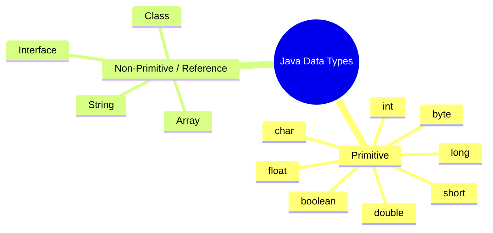

> [!NOTE]
> **Part 1** covered primitive data types and float memory representation in depth. This chapter covers everything non-primitive — also called **reference data types**.

---

# 1. What are Reference Data Types?

## Overview

A **reference data type** is any type whose variable does **not store the actual value** directly. Instead, the variable stores a **reference** (memory address) pointing to the location in **heap memory** where the actual data lives.

This is the fundamental distinction from primitive types, which store values directly.

---

## Why the Name "Reference"?

When you create an object using the `new` keyword, Java:
1. Allocates a block of memory in the **heap**
2. Stores the object's data there
3. Gives the variable a **reference** (pointer-like address) to that memory location

The variable itself doesn't *hold* the object — it *points to* where the object lives.

---

## Heap Memory — What it is

Java's memory is divided into regions. The two most important for now:

| Memory Region | What lives here |
|---------------|----------------|
| **Stack** | Primitive variables, method call frames, local variable references |
| **Heap** | All objects created with `new`, String literals (in String Constant Pool) |

> [!NOTE]
> Memory management (heap, stack, garbage collector) is covered in depth in the next chapter. For now, just understand that **objects live in the heap**, and variables in your code hold **references** to those objects.

---

## Diagram — Reference vs Value

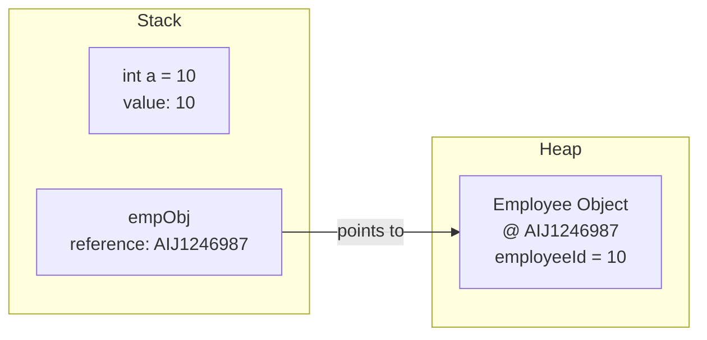

The primitive `int a` holds the value `10` directly. The reference variable `empObj` holds only an **address** — the actual Employee object data is in the heap.

---

## Pass By Value in Java — The Critical Concept

> [!IMPORTANT]
> **In Java, everything is passed by value. There is no pass-by-reference and no concept of pointers.**

This is a statement that surprises many developers — especially those from a C++ background. Here's what it actually means:

- When you pass a **primitive** to a method → a **copy of the value** is passed. Changes inside the method do **not** affect the original.
- When you pass an **object** to a method → a **copy of the reference** (address) is passed. Both the original and the method's copy **point to the same heap object**. So changes to the object's fields **are reflected** in the caller.

This is why reference types give you similar power to C++ pointers — without Java ever literally using pointer syntax.

---

# 2. Reference Type 1 — Class

## Overview

A **class** is the most fundamental reference data type in Java. When you instantiate a class using `new`, an object is created in heap memory, and the variable holds a reference to it.

---

## Code Example — Class Reference and Shared Memory

```java
class Employee {
    int employeeId;

    int getEmployeeId() {
        return employeeId;
    }

    void setEmployeeId(int id) {
        this.employeeId = id;
    }
}

public class Main {
    static void modify(Employee emp) {
        emp.employeeId = 20; // modifies the object in heap
    }

    public static void main(String[] args) {
        Employee empObj = new Employee();
        empObj.employeeId = 10;

        System.out.println("Before: " + empObj.employeeId); // 10

        modify(empObj); // passing the reference by value

        System.out.println("After: " + empObj.employeeId);  // 20
    }
}
```

**Output:**
```
Before: 10
After: 20
```

---

## Step-by-Step Execution

| Step | What Happens |
|------|-------------|
| `Employee empObj = new Employee()` | JVM allocates heap memory for an Employee object. `empObj` stores the address (e.g., `AIJ1246987`) |
| `empObj.employeeId = 10` | Via the reference, `employeeId` at that heap address is set to `10` |
| `modify(empObj)` is called | A **copy of the reference** (`AIJ1246987`) is passed into `emp` parameter |
| `emp.employeeId = 20` | `emp` points to the SAME heap object → sets `employeeId` to `20` |
| Back in `main`, print `empObj.employeeId` | `empObj` still points to same heap address → sees `20` |

> [!IMPORTANT]
> The reference itself was copied (pass by value), but since both the original and the copy point to the **same heap memory**, mutations to the object's fields are visible everywhere.

---

## Multiple References to the Same Object

```java
Employee empObj = new Employee();
empObj.employeeId = 10;

Employee obj2 = empObj; // obj2 now points to the SAME heap object

obj2.employeeId = 30;

System.out.println(empObj.employeeId); // 30 — same object!
```

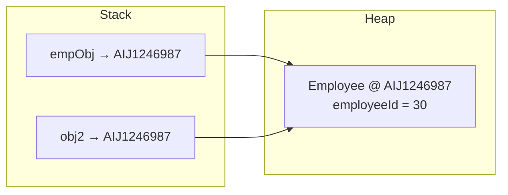

Both `empObj` and `obj2` are **different variables** holding **the same reference**. Changing the object via either variable affects both.

---

## Primitive Pass-by-Value — Contrast

```java
static void modifyPrimitive(int x) {
    x = 20; // only changes local copy
}

public static void main(String[] args) {
    int a = 10;
    modifyPrimitive(a);
    System.out.println(a); // 10 — unchanged
}
```

With primitives, `a` lives on the **stack**. A copy of `10` is sent to `modifyPrimitive`. Changing `x` inside the method has zero effect on `a`.

---

## Primitive vs Reference — Key Difference Table

| Aspect | Primitive | Reference (Object) |
|--------|-----------|--------------------|
| Stored in | Stack | Heap (reference on Stack) |
| Variable holds | Actual value | Memory address |
| Pass to method | Copy of value | Copy of reference |
| Method changes reflected? | ❌ No | ✅ Yes (if mutating fields) |
| Default value | `0`, `false`, `'\0'` | `null` |

---

# 3. Reference Type 2 — String

## Overview

`String` in Java is special. It is **predefined by Java** (like `int` or `boolean`), yet it is treated as a **reference data type**, not a primitive. Understanding why requires understanding the **String Constant Pool** and **immutability**.

---

## The String Constant Pool

Inside the heap, Java maintains a special region called the **String Constant Pool** (also called the String Pool or String Intern Pool).

When you create a string using a **string literal** (text in double quotes), Java:
1. Checks whether that exact string already exists in the pool
2. If it **does** → reuses it (both variables point to the same pool entry)
3. If it **doesn't** → creates a new entry in the pool

```mermaid
flowchart TD
    S1["String s1 = \"hello\""] --> CHECK{Is \"hello\" in pool?}
    CHECK -->|No| CREATE[Create \"hello\" in String Constant Pool]
    CREATE --> S1_REF[s1 → pool entry]
    CHECK -->|Yes| REUSE[s1 → existing pool entry]

    S2["String s2 = \"hello\""] --> CHECK2{Is \"hello\" in pool?}
    CHECK2 -->|Yes| REUSE2[s2 → same pool entry as s1]
```

---

## String Literals vs `new String()`

There are two ways to create a String in Java, with very different behavior:

```java
String s1 = "hello";             // String literal → goes to String Constant Pool
String s2 = "hello";             // Same literal → points to SAME pool entry as s1
String s3 = new String("hello"); // new keyword → creates a NEW object in heap (outside pool)
```

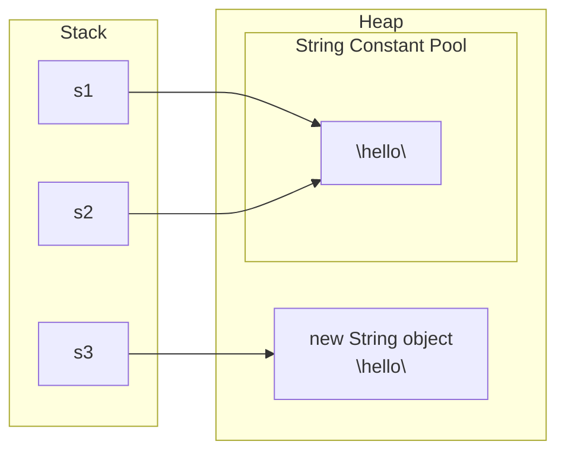

---

## `==` vs `.equals()` for Strings — Critical Concept

| Operator / Method | What it checks |
|-------------------|---------------|
| `==` | Are both references pointing to the **exact same memory location**? |
| `.equals()` | Do both strings contain the **same characters** (same value)? |

```java
String s1 = "hello";
String s2 = "hello";
String s3 = new String("hello");

System.out.println(s1 == s2);        // true  — both point to same pool entry
System.out.println(s1 == s3);        // false — s3 is a separate heap object
System.out.println(s1.equals(s2));   // true  — same content
System.out.println(s1.equals(s3));   // true  — same content
```

**Output:**
```
true
false
true
true
```

> [!WARNING]
> **Never use `==` to compare String values in Java.** It compares references (memory addresses), not content. Always use `.equals()` for value comparison.

---

## String Immutability

**Strings are immutable in Java** — once a String object is created, its value **cannot be changed**.

What appears to be "changing" a String actually creates a **new String object** and updates the reference:

```java
String s1 = "hello";   // pool: ["hello"], s1 → "hello"
s1 = "hello world";    // pool: ["hello", "hello world"], s1 → "hello world"
                       // "hello" is still in the pool — it was NOT modified
```

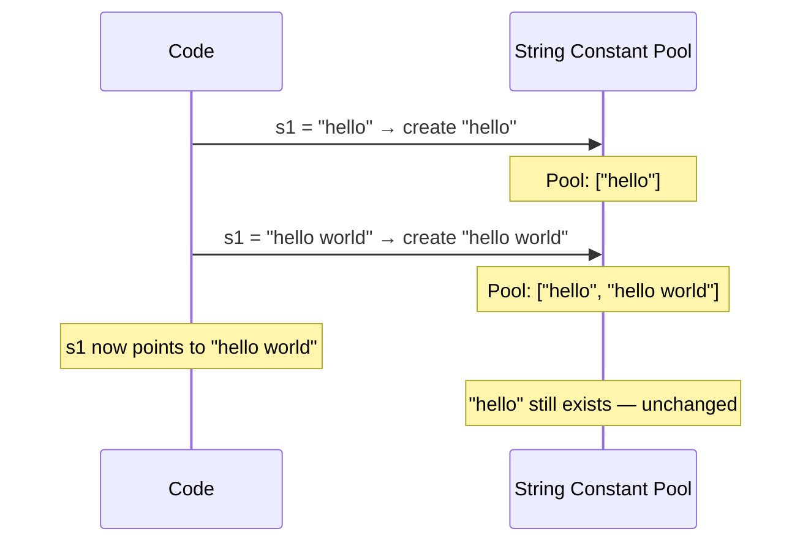

> [!IMPORTANT]
> **Why immutable?** The String Constant Pool's reuse mechanism only works safely if strings cannot be changed. If `s1` could mutate `"hello"` to `"world"`, then `s2` (which also points to `"hello"`) would unexpectedly see `"world"`. Immutability prevents this and also makes strings safe to use as HashMap keys, in multi-threaded programs, etc.

---

## Why is String a Reference Type?

Even though Java defines `String` for you (unlike `Employee` which you write yourself), it is still a reference type because:

- A `String` variable holds a **reference** to a string object (either in the pool or on the heap)
- It is not stored directly on the stack like a primitive
- It can be `null` (a primitive cannot be null)
- It behaves like an object: has methods like `.length()`, `.equals()`, `.substring()`, etc.

---

# 4. Reference Type 3 — Interface

## Overview

An **interface** is also a reference data type in Java. It works very similarly to a class from a reference perspective — variables of an interface type hold references to objects of classes that **implement** that interface.

---

## Code Example

```java
interface Person {
    String profession();
}

class Teacher implements Person {
    @Override
    public String profession() {
        return "Teaching";
    }
}

class Engineer implements Person {
    @Override
    public String profession() {
        return "Software Engineer";
    }
}

public class Main {
    public static void main(String[] args) {
        // Valid: interface reference holds child object
        Person p1 = new Engineer();   // ✅
        Person p2 = new Teacher();    // ✅

        // Also valid: concrete type reference
        Engineer e = new Engineer();  // ✅
        Teacher t = new Teacher();    // ✅

        // INVALID: cannot instantiate an interface directly
        // Person p3 = new Person();  // ❌ Compile error

        System.out.println(p1.profession()); // Software Engineer
        System.out.println(p2.profession()); // Teaching
    }
}
```

**Output:**
```
Software Engineer
Teaching
```

---

## Key Rules for Interface References

| Rule | Valid? | Reason |
|------|--------|--------|
| `Person p = new Engineer()` | ✅ | Parent interface ref can hold child object |
| `Person p = new Teacher()` | ✅ | Same as above |
| `Engineer e = new Engineer()` | ✅ | Concrete type ref holding its own object |
| `Person p = new Person()` | ❌ | Cannot instantiate an interface — no implementation exists |

> [!IMPORTANT]
> **You cannot create an object of an interface.** An interface only declares *what* methods exist — it has no implementation. Only concrete classes that implement the interface have actual implementations and can be instantiated.

---

## Memory Diagram — Interface Reference

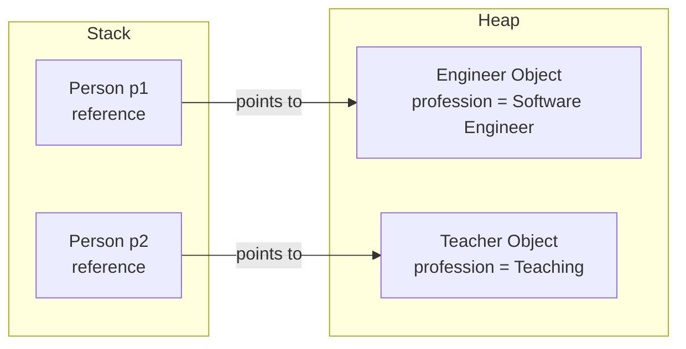

`p1` is declared as type `Person`, but it actually points to an `Engineer` object in the heap. This is **polymorphism at work** — the same interface reference can point to different implementing classes.

---

# 5. Reference Type 4 — Array

## Overview

An **array** in Java is a reference data type that stores a **fixed-size, ordered sequence of elements of the same data type** in contiguous memory locations in the heap.

---

## Creating a 1D Array

There are two main ways to create a 1D array:

### Method 1 — Declare Size, Then Assign Values

```java
int[] arr = new int[5]; // allocate 5 integer slots in heap

arr[0] = 10;
arr[3] = 40;
// Default value for int is 0, so unset indices are 0
// Result: [10, 0, 0, 40, 0]
```

### Method 2 — Declare and Initialize in One Line

```java
int[] arr = {30, 20, 10, 40, 50};
// Java automatically sets size to 5 and fills values
// Result: [30, 20, 10, 40, 50]
```

Both syntaxes for declaring the array variable are valid:
```java
int[] arr = new int[5];   // bracket after type — preferred
int arr[] = new int[5];   // bracket after name — also valid (C-style)
```

---

## Memory Representation — 1D Array

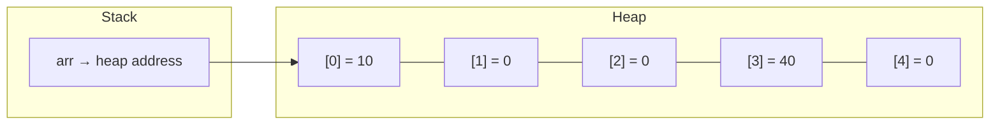

Array elements are stored in **contiguous memory**. `arr` is a reference variable on the stack pointing to the first element in the heap.

---

## Creating a 2D Array

A 2D array is essentially an **array of arrays**. Think of it as a table with rows and columns.

### Method 1 — Declare Size, Then Assign

```java
int[][] arr = new int[5][4]; // 5 rows, 4 columns
// Default values: all zeros

arr[2][2] = 20; // row 2, column 2 → set to 20
arr[1][3] = 30; // row 1, column 3 → set to 30
```

### Method 2 — Declare and Initialize

```java
int[][] arr = {
    {1, 5, 7},
    {4, 2, 3}
};
// 2 rows, 3 columns
// arr[1][2] → row 1, col 2 → value = 3
```

---

## 2D Array — Visual Representation

For `new int[5][4]` (5 rows, 4 columns), default state:

```
        Col 0  Col 1  Col 2  Col 3
Row 0  [  0     0     0     0  ]
Row 1  [  0     0     0    30  ]  ← arr[1][3] = 30
Row 2  [  0     0    20     0  ]  ← arr[2][2] = 20
Row 3  [  0     0     0     0  ]
Row 4  [  0     0     0     0  ]
```

---

## Why is Array a Reference Type?

- Created with `new` → lives in **heap memory**
- The variable holds a **reference** to the heap memory block
- Passing an array to a method passes the reference → modifications inside the method affect the original array

```java
static void modify(int[] a) {
    a[0] = 999; // modifies heap memory
}

public static void main(String[] args) {
    int[] nums = {1, 2, 3};
    modify(nums);
    System.out.println(nums[0]); // 999 — changed!
}
```

---

# 6. Wrapper Classes

## Overview

Java provides a **wrapper class** for each of the 8 primitive types. A wrapper class is a class that "wraps" a primitive value inside an object, giving it reference-type capabilities.

---

## Primitive to Wrapper Mapping

| Primitive | Wrapper Class |
|-----------|--------------|
| `byte` | `Byte` |
| `short` | `Short` |
| `int` | `Integer` |
| `long` | `Long` |
| `float` | `Float` |
| `double` | `Double` |
| `char` | `Character` |
| `boolean` | `Boolean` |

> [!NOTE]
> Notice the pattern: most wrapper class names are just the capitalized primitive name. Two exceptions: `int` → `Integer` and `char` → `Character`.

---

## Why Do Wrapper Classes Exist?

### Reason 1 — Reference Capability (Modification Reflection)

When you pass a primitive to a method and modify it there, the original is **unchanged**. This is because primitives are stored on the stack and passed by value (a copy).

```java
// With primitive — change NOT reflected
static void modify(int x) {
    x = 20;
}

public static void main(String[] args) {
    int a = 10;
    modify(a);
    System.out.println(a); // 10 — unchanged
}
```

With a wrapper class (which is an object), you get reference behaviour:

```java
// With wrapper — object in heap, reference passed
static void modify(int[] holder) {
    holder[0] = 20; // modifying heap object
}

public static void main(String[] args) {
    int[] a = {10};
    modify(a);
    System.out.println(a[0]); // 20 — changed
}
```

> [!NOTE]
> `Integer` itself is immutable in Java (similar to String), so typically you use mutable containers or `AtomicInteger` for this use case. But conceptually, wrapper classes give you the **object/reference** nature you need.

### Reason 2 — Java Collections Only Work With Objects

Java's Collections Framework (`ArrayList`, `HashMap`, `HashSet`, etc.) can only store **objects** — not primitives.

```java
// ❌ NOT VALID — ArrayList cannot hold primitives
// ArrayList<int> list = new ArrayList<int>();

// ✅ VALID — ArrayList can hold wrapper objects
ArrayList<Integer> list = new ArrayList<Integer>();
list.add(10);  // 10 is auto-converted to Integer (autoboxing)
list.add(20);
```

Without wrapper classes, you could not use Java's powerful collections with numeric or boolean data.

---

## Wrapper Class Diagram

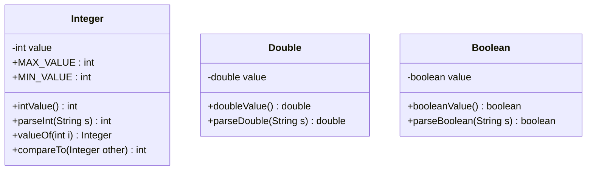

Wrapper classes also provide **utility methods** that primitives don't have — like `Integer.parseInt()`, `Integer.MAX_VALUE`, `Integer.toBinaryString()`, etc.

---

# 7. Autoboxing and Unboxing

## Overview

Java performs automatic conversions between primitives and their wrapper types. These conversions are so common that Java handles them **automatically** (since Java 5).

---

## Definitions

| Term | Direction | What happens |
|------|-----------|--------------|
| **Autoboxing** | Primitive → Wrapper | Java automatically wraps a primitive into its wrapper object |
| **Unboxing** | Wrapper → Primitive | Java automatically extracts the primitive value from a wrapper object |

---

## Code Examples

```java
// AUTOBOXING — primitive int to Integer object
int a = 10;
Integer a1 = a;           // autoboxing: int → Integer
// equivalent to: Integer a1 = Integer.valueOf(a);

// UNBOXING — Integer object to primitive int
Integer x = 20;
int x1 = x;              // unboxing: Integer → int
// equivalent to: int x1 = x.intValue();
```

---

## Autoboxing in Collections

The most common place you'll see autoboxing in practice:

```java
ArrayList<Integer> list = new ArrayList<>();

list.add(5);    // autoboxing: int 5 → Integer.valueOf(5)
list.add(10);   // autoboxing: int 10 → Integer.valueOf(10)

int first = list.get(0); // unboxing: Integer → int
System.out.println(first); // 5
```

---

## Flowchart — Autoboxing and Unboxing

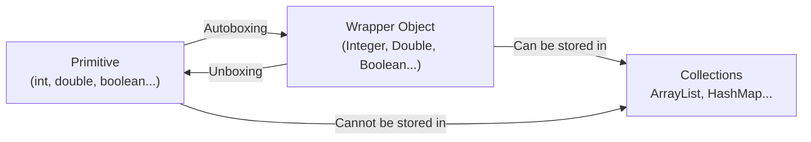

---

## Common Autoboxing Pitfall — `==` with Integer Cache

> [!WARNING]
> Java caches `Integer` objects for values between **-128 and 127**. This means `==` may return `true` for small values but `false` for large ones — a subtle trap.

```java
Integer a = 100;
Integer b = 100;
System.out.println(a == b); // true — both from cache, same object

Integer c = 200;
Integer d = 200;
System.out.println(c == d); // false — outside cache range, different objects

System.out.println(c.equals(d)); // true — always use .equals() for value comparison
```

> [!TIP]
> Always use `.equals()` to compare wrapper objects by value, just like with Strings.

---

# 8. Constant Variables

## Overview

A **constant variable** is a variable whose value is set once and **can never be changed**. In Java, constants are created using a combination of `static` and `final` keywords.

---

## Recap — `static` Variables

A `static` variable belongs to the **class**, not to any individual object. All objects share a single copy.

```java
class Employee {
    static int employeeId = 10;
}

Employee obj1 = new Employee();
Employee obj2 = new Employee();

obj1.employeeId = 20; // changes shared value to 20
System.out.println(obj2.employeeId); // 20 — same variable!
```

But `static` alone doesn't prevent modification — both `obj1` and `obj2` can change it.

---

## Making it a Constant — `static final`

Adding `final` means the value is **assigned once and locked**. Any attempt to reassign it causes a **compile error**.

```java
class Employee {
    public static final int EMPLOYEE_ID = 10;
}

// Anywhere in code:
// Employee.EMPLOYEE_ID = 20; // ❌ Compile error: cannot assign to final variable
System.out.println(Employee.EMPLOYEE_ID); // ✅ Reading is fine
```

---

## Naming Convention for Constants

By Java convention, constant variable names are written in **ALL_CAPS_WITH_UNDERSCORES** (SCREAMING_SNAKE_CASE):

```java
public static final int MAX_RETRY_COUNT = 3;
public static final double PI = 3.14159265;
public static final String APP_NAME = "MyApp";
```

---

## `static` vs `final` vs `static final`

| Modifier | One copy shared? | Can be changed? | Constant? |
|----------|-----------------|-----------------|-----------|
| `static` | ✅ Yes | ✅ Yes | ❌ No |
| `final` | ❌ No (per object) | ❌ No | Per-object constant |
| `static final` | ✅ Yes | ❌ No | ✅ **True constant** |

---

## Code Example — Full Constant Demo

```java
class AppConfig {
    public static final int MAX_CONNECTIONS = 100;
    public static final String DB_NAME = "production_db";
}

public class Main {
    public static void main(String[] args) {
        System.out.println(AppConfig.MAX_CONNECTIONS); // 100
        System.out.println(AppConfig.DB_NAME);         // production_db

        // AppConfig.MAX_CONNECTIONS = 200; // ❌ Compile error
    }
}
```

**Output:**
```
100
production_db
```

---

## Constant Variables — Summary

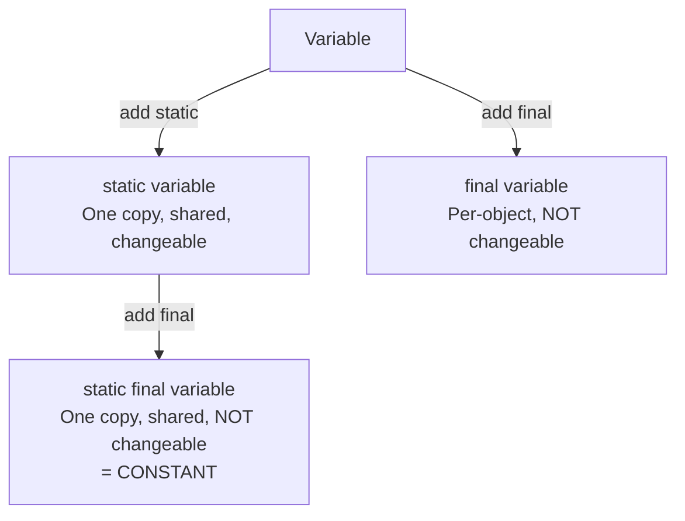

---

# 9. Interview Question Bank

## Reference Data Types

| Question | Key Answer |
|----------|-----------|
| What is a reference data type? | Variable holds a memory address (reference) pointing to heap, not the value itself |
| What are the four main reference data types in Java? | Class, String, Interface, Array |
| Is Java pass-by-value or pass-by-reference? | Always pass-by-value — but for objects, the value being passed is the reference |
| How do reference types give us pointer-like behavior? | Multiple variables can reference the same heap object; mutations are shared |
| What is the default value of a reference type? | `null` |

## String Specific

| Question | Key Answer |
|----------|-----------|
| What is the String Constant Pool? | A special area in heap where string literals are stored and reused |
| Why are Strings immutable in Java? | To safely allow pool reuse — if literals could change, shared references would be corrupted |
| What is the difference between `==` and `.equals()` for Strings? | `==` checks same memory reference; `.equals()` checks same content |
| What happens when you use `new String("hello")`? | Creates a new heap object outside the pool — even if the pool has "hello" |
| Why is String a reference type even though Java defines it? | It holds a reference to heap memory (pool or regular heap); it has methods; it can be null |

## Wrapper Classes

| Question | Key Answer |
|----------|-----------|
| What is a wrapper class? | A class that wraps a primitive to give it object/reference capabilities |
| Name all 8 primitive-wrapper pairs | int/Integer, double/Double, char/Character, boolean/Boolean, byte/Byte, short/Short, long/Long, float/Float |
| Why do we need wrapper classes? | (1) Reference/mutation capability; (2) Java Collections only accept objects |
| What is autoboxing? | Automatic conversion from primitive to wrapper (e.g., `int` → `Integer`) |
| What is unboxing? | Automatic conversion from wrapper to primitive (e.g., `Integer` → `int`) |
| Integer cache trap | `Integer` caches -128 to 127; `==` may give unexpected results outside that range |

## Constant Variables

| Question | Key Answer |
|----------|-----------|
| How do you declare a constant in Java? | `public static final TYPE NAME = value;` |
| What does `static` do? | One shared copy across all instances |
| What does `final` do? | Prevents reassignment after initial value is set |
| What is the naming convention for constants? | ALL_CAPS_WITH_UNDERSCORES |

---

# 10. Master Summary

## Complete Mind Map

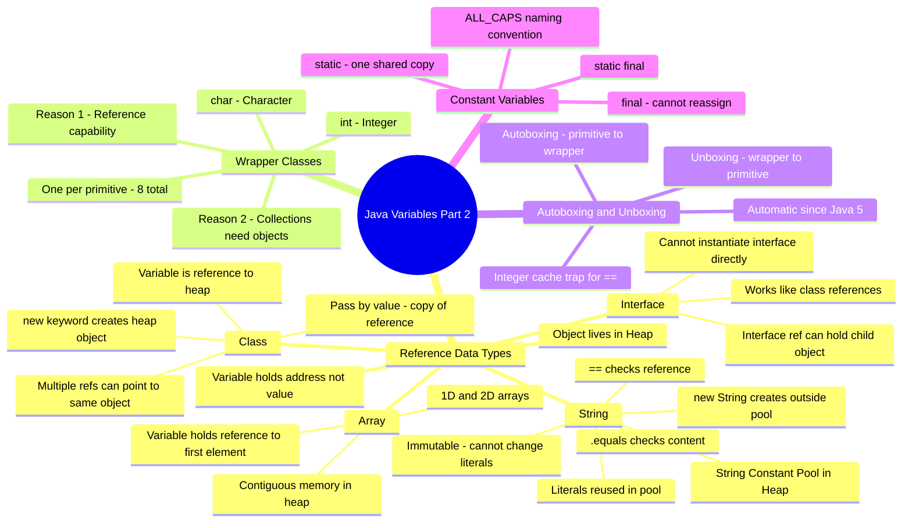

---

## Quick Revision Bullets

- ✅ **Reference data type** = variable holds a **memory address**, not the actual value
- ✅ **Object lives in heap**; reference lives on stack
- ✅ Java is always **pass-by-value** — for objects, the *value* passed is the reference
- ✅ Multiple variables can reference the **same heap object** — mutations are shared
- ✅ **String Constant Pool** — string literals are stored and reused in a pool inside heap
- ✅ `String s = "hello"` → pool entry; `String s = new String("hello")` → separate heap object
- ✅ **`==` for Strings** = same memory location; **`.equals()` for Strings** = same content
- ✅ **Strings are immutable** — "changing" a string creates a new object; old one stays in pool
- ✅ **Interface reference** can hold any object of a class that implements it; cannot use `new Interface()`
- ✅ **Array** = fixed-size, same-type, contiguous heap memory; variable is a reference to it
- ✅ **Wrapper classes** — one per primitive; `int` → `Integer`, `char` → `Character`, etc.
- ✅ **Two reasons for wrapper classes**: (1) reference/mutation capability, (2) Collections need objects
- ✅ **Autoboxing** = primitive → wrapper (automatic); **Unboxing** = wrapper → primitive (automatic)
- ✅ **Integer cache** (-128 to 127): `==` may return `true` for cached values; always use `.equals()`
- ✅ **Constant variable** = `public static final TYPE NAME = value;` in ALL_CAPS
- ✅ `static` alone = shared, changeable. `static final` = shared, **immutable** = true constant

---

> [!TIP]
> **Coming up next in the series:**
> 1. **Methods** — how Java methods work, parameter passing, return types
> 2. **Memory Management & Garbage Collector** — heap vs stack in full detail, how GC reclaims unused objects

---

*End of Chapter — Java Variables Part 2: Reference Data Types, Wrapper Classes & Constants*
