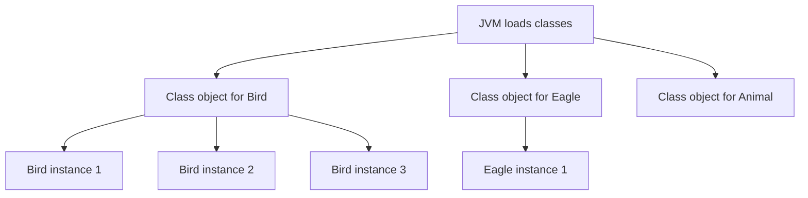
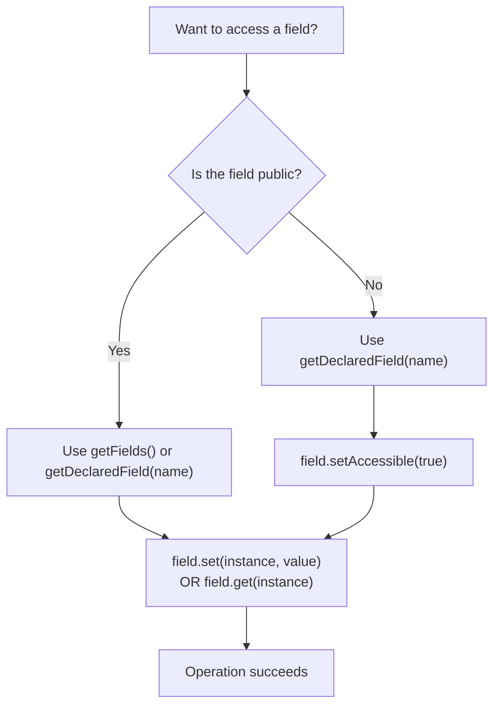
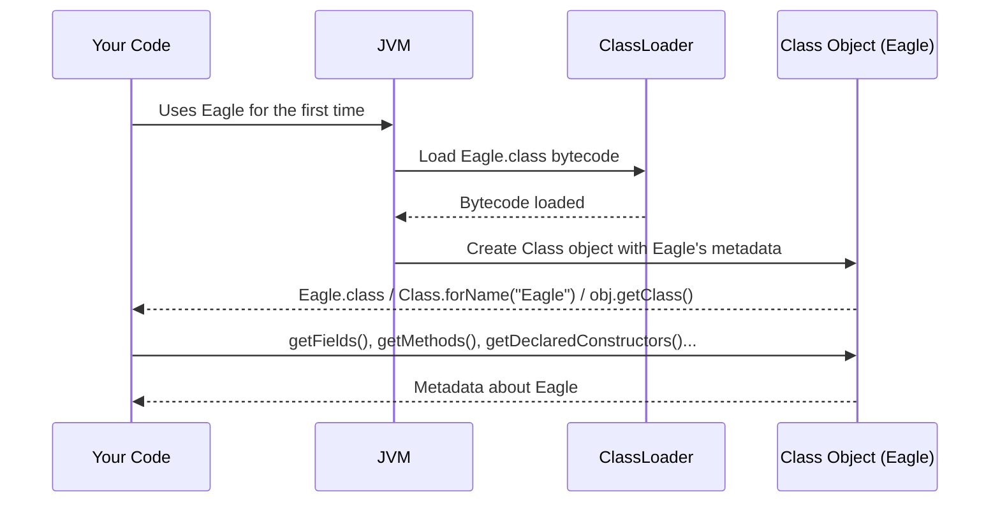
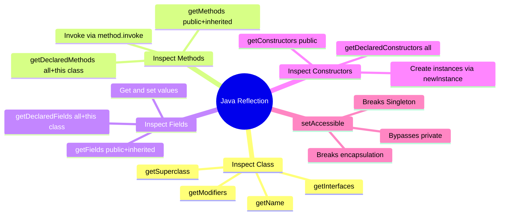
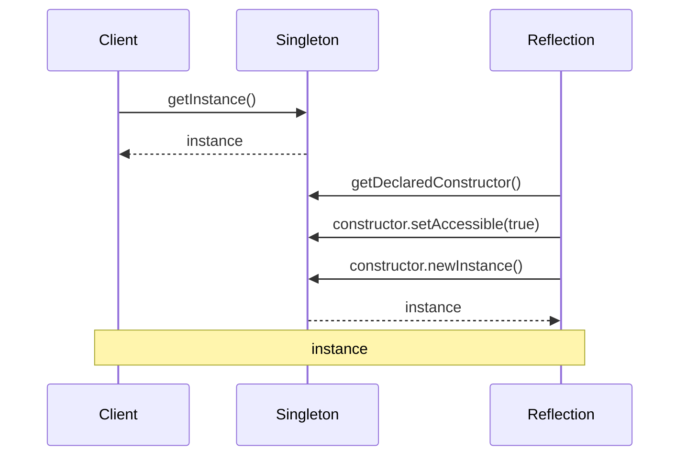

# 📚 Java Reflection — Comprehensive Study Guide

> Part of the *Concept and Coding* Java lecture series.
> These notes are fully self-contained — no prior lecture viewing is required.
> This chapter covers Java Reflection in depth: what it is, how it works internally, how to reflect classes / methods / fields / constructors, invoking private members, and why reflection is dangerous and slow.

---

## Table of Contents

1. [What is Reflection?](#1-what-is-reflection)
2. [The `Class` Object — Foundation of Reflection](#2-the-class-object--foundation-of-reflection)
3. [Three Ways to Get a Class Object](#3-three-ways-to-get-a-class-object)
4. [Reflecting a Class](#4-reflecting-a-class)
5. [Reflecting Methods](#5-reflecting-methods)
6. [Invoking a Method via Reflection](#6-invoking-a-method-via-reflection)
7. [Reflecting Fields](#7-reflecting-fields)
8. [Changing Field Values via Reflection](#8-changing-field-values-via-reflection)
9. [Reflecting Constructors](#9-reflecting-constructors)
10. [How Reflection Breaks Singleton](#10-how-reflection-breaks-singleton)
11. [getFields vs getDeclaredFields — The Difference](#11-getfields-vs-getdeclaredfields--the-difference)
12. [Why Reflection Should Be Avoided](#12-why-reflection-should-be-avoided)
13. [When Reflection IS Used](#13-when-reflection-is-used)
14. [Mermaid Diagrams](#14-mermaid-diagrams)
15. [Quick-Reference Tables](#15-quick-reference-tables)
16. [Common Mistakes](#16-common-mistakes)
17. [Best Practices](#17-best-practices)
18. [Interview Notes](#18-interview-notes)
19. [Practice Questions](#19-practice-questions)
20. [Summary Cheat Sheet](#20-summary-cheat-sheet)

---

# 1. What is Reflection?

## Overview

Reflection is a powerful and advanced feature of Java that allows a program to **examine and modify itself at runtime**. With reflection, you can look inside any class, discover its methods, fields, and constructors, and even invoke them — all while the program is running, without knowing the class at compile time.

## Real-World Analogy

Imagine a doctor performing an X-ray on a patient. The patient doesn't need to do anything differently. The X-ray machine (reflection) looks *inside* the body (class) and reveals its internal structure — bones, organs, sizes — without the patient's active cooperation. The doctor can then act on what they find.

Reflection does the same for Java classes. It peeks inside them at runtime and exposes their internal structure.

## Formal Definition

> **Java Reflection** is an API (`java.lang.reflect` package) that allows a program to **inspect** and **manipulate** the internal structure of classes, interfaces, methods, fields, and constructors **at runtime**, even if they are `private`.

## What Reflection Can Do

| Capability | Description |
|-----------|-------------|
| Inspect a class | Get class name, modifier, interfaces implemented |
| Inspect methods | Get method names, return types, parameters, modifiers |
| Inspect fields | Get field names, types, modifiers |
| Inspect constructors | Get constructor parameters and modifiers |
| **Invoke methods** | Call any method (including private) at runtime |
| **Change field values** | Set any field (including private) at runtime |
| **Create objects** | Call any constructor (including private) at runtime |

## Package Location

All reflection classes live in `java.lang.reflect`:

```java
import java.lang.reflect.Method;
import java.lang.reflect.Field;
import java.lang.reflect.Constructor;
import java.lang.reflect.Modifier;
```

The `Class` class itself lives in `java.lang` (no import needed).

---

# 2. The `Class` Object — Foundation of Reflection

## What is the `Class` Class?

Before you can reflect anything, you need to understand `java.lang.Class`. This is a special class whose name is literally `Class` — and it is the **entry point** for all reflection.

> Every Java class, when loaded by the JVM, gets an associated `Class` object automatically. This `Class` object holds all the **metadata** about that class — its name, modifier, methods, fields, constructors, superclass, and implemented interfaces.

## Who Creates Class Objects?

**The JVM creates them — not you.**

When the JVM loads a class (e.g., `Bird`), it:
1. Reads the compiled `.class` bytecode file.
2. Creates an instance of `java.lang.Class` internally.
3. Populates that `Class` instance with metadata about `Bird`.

You can then **retrieve** this pre-created `Class` object using one of three methods (Section 3).

## What Metadata Does a Class Object Hold?

```
Class Object for "Eagle"
┌────────────────────────────────────────────┐
│  getName()          → "Eagle"              │
│  getModifiers()     → public               │
│  getMethods()       → [fly, eat, ...]      │
│  getFields()        → [breed, ...]         │
│  getConstructors()  → [Eagle()]            │
│  getSuperclass()    → Object               │
│  getInterfaces()    → [Flyable, ...]       │
└────────────────────────────────────────────┘
```

## How Many Class Objects Exist?

**Exactly one per class, per JVM instance.** If `Bird` is loaded once, there is exactly one `Class` object for `Bird`. Even if you create 100 `Bird` objects, they all share the same single `Class` object.



---

# 3. Three Ways to Get a Class Object

The JVM creates `Class` objects; you only need to retrieve them. There are three ways:

## Method 1 — `Class.forName(String className)`

Pass the fully qualified class name as a `String`. This is useful when you **don't have the class available at compile time** (the most dynamic approach).

```java
Class<?> eagleClass = Class.forName("Eagle");
// or with full package path:
Class<?> listClass = Class.forName("java.util.ArrayList");
```

> [!NOTE]
> `Class.forName()` throws a checked exception `ClassNotFoundException` if the class name is wrong or the class cannot be found on the classpath. Always handle it.

```java
try {
    Class<?> eagleClass = Class.forName("Eagle");
} catch (ClassNotFoundException e) {
    e.printStackTrace();
}
```

---

## Method 2 — `.class` Literal

If you have access to the class type at compile time, use the `.class` literal directly on the class name. This is the safest and most readable approach.

```java
Class<Eagle> eagleClass = Eagle.class;
Class<Integer> intClass  = Integer.class;
Class<String>  strClass  = String.class;
```

No exception handling required — this is resolved at compile time.

---

## Method 3 — `object.getClass()`

If you already have an **instance** of the class, call `getClass()` on it. This is inherited from `java.lang.Object`, so every Java object has this method.

```java
Eagle eagle = new Eagle();
Class<?> eagleClass = eagle.getClass();
```

This is useful when you receive an object of unknown type and want to inspect it dynamically.

---

## Side-by-Side Comparison

| Method | Syntax | Compile-time class needed? | Exception? | Best Used When |
|--------|--------|---------------------------|-----------|----------------|
| `Class.forName()` | `Class.forName("Eagle")` | ❌ No — string only | ✅ Yes — `ClassNotFoundException` | Class name known only at runtime (plugins, frameworks) |
| `.class` literal | `Eagle.class` | ✅ Yes | ❌ No | Class known at compile time |
| `getClass()` | `obj.getClass()` | ✅ Yes (object exists) | ❌ No | You already have an instance |

---

# 4. Reflecting a Class

## The Subject Class

Throughout all examples, we will use this simple class:

```java
public class Eagle {
    public String breed;          // public field
    private boolean canSwim;      // private field

    public void fly() {
        System.out.println("Eagle is flying.");
    }

    private void eat() {
        System.out.println("Eagle is eating.");
    }
}
```

## Getting Basic Class Metadata

```java
import java.lang.reflect.Modifier;

public class ReflectClass {
    public static void main(String[] args) {
        // Step 1: Get the Class object
        Class<Eagle> eagleClass = Eagle.class;

        // Step 2: Fetch metadata
        System.out.println("Class name: " + eagleClass.getName());
        System.out.println("Simple name: " + eagleClass.getSimpleName());
        System.out.println("Modifier: " + Modifier.toString(eagleClass.getModifiers()));
        System.out.println("Superclass: " + eagleClass.getSuperclass().getName());
        System.out.println("Package: " + eagleClass.getPackageName());
    }
}
```

**Output:**
```
Class name: Eagle
Simple name: Eagle
Modifier: public
Superclass: java.lang.Object
Package: (default package)
```

### Line-by-Line Explanation

| Line | What It Does |
|------|-------------|
| `Eagle.class` | Retrieves the JVM-created `Class` object for `Eagle` |
| `getName()` | Returns the fully qualified class name |
| `getSimpleName()` | Returns just the class name without the package |
| `getModifiers()` | Returns an `int` encoding the modifier; `Modifier.toString()` converts it to readable text |
| `getSuperclass()` | Returns the `Class` object of the parent class (`Object` here) |

## Useful Class-Level Methods

| Method | Returns | Example Output |
|--------|---------|---------------|
| `getName()` | Fully qualified class name | `"com.example.Eagle"` |
| `getSimpleName()` | Class name only | `"Eagle"` |
| `getModifiers()` | `int` modifier code | Use `Modifier.toString()` to read |
| `getSuperclass()` | Parent `Class` object | `java.lang.Object` |
| `getInterfaces()` | Array of implemented interfaces | `[Flyable, ...]` |
| `getPackageName()` | Package name | `"com.example"` |
| `isInterface()` | `boolean` | `false` |
| `isAbstract()` | `boolean` (via Modifier) | `false` |
| `getDeclaredClasses()` | Nested classes | array |

---

# 5. Reflecting Methods

## Getting All PUBLIC Methods — `getMethods()`

`getMethods()` returns all **public** methods of the class **and all its superclasses** (including `Object`).

```java
import java.lang.reflect.Method;

public class ReflectMethods {
    public static void main(String[] args) {
        Class<Eagle> eagleClass = Eagle.class;

        Method[] methods = eagleClass.getMethods();  // public only, including inherited

        for (Method method : methods) {
            System.out.println("Method: "        + method.getName());
            System.out.println("Return Type: "   + method.getReturnType());
            System.out.println("Declared in: "   + method.getDeclaringClass());
            System.out.println("---");
        }
    }
}
```

**Output (abbreviated):**
```
Method: fly
Return Type: void
Declared in: class Eagle
---
Method: wait
Return Type: void
Declared in: class java.lang.Object
---
Method: notify
Return Type: void
Declared in: class java.lang.Object
---
... (other Object methods)
```

> [!IMPORTANT]
> `getMethods()` also returns inherited methods from `Object` (like `wait`, `notify`, `equals`, `toString`). This is because every Java class implicitly extends `Object`.

---

## Getting ALL Methods (Including Private) — `getDeclaredMethods()`

`getDeclaredMethods()` returns **all** methods declared directly in that class — both `public` and `private` — but does **not** include inherited methods from parent classes.

```java
import java.lang.reflect.Method;
import java.lang.reflect.Modifier;

public class ReflectDeclaredMethods {
    public static void main(String[] args) {
        Class<Eagle> eagleClass = Eagle.class;

        Method[] methods = eagleClass.getDeclaredMethods(); // all in Eagle, no Object methods

        for (Method method : methods) {
            System.out.println("Method: "    + method.getName());
            System.out.println("Modifier: "  + Modifier.toString(method.getModifiers()));
            System.out.println("Return Type: " + method.getReturnType());
            System.out.println("---");
        }
    }
}
```

**Output:**
```
Method: fly
Modifier: public
Return Type: void
---
Method: eat
Modifier: private
Return Type: void
---
```

Both `fly` (public) and `eat` (private) appear — but `wait`, `notify`, etc. from `Object` do **not**.

---

## Method Metadata — All Available Get Methods

Once you have a `Method` object, you can extract:

| Method | Returns |
|--------|---------|
| `getName()` | Method name (`"fly"`) |
| `getReturnType()` | Return type (`void`, `int`, etc.) |
| `getParameterTypes()` | Array of parameter types |
| `getParameterCount()` | Number of parameters |
| `getModifiers()` | Modifier int (use `Modifier.toString()`) |
| `getDeclaringClass()` | The class in which this method is declared |
| `getExceptionTypes()` | Exceptions the method declares it throws |
| `getAnnotations()` | Annotations on the method |

---

## getMethods() vs getDeclaredMethods()

| Feature | `getMethods()` | `getDeclaredMethods()` |
|---------|---------------|----------------------|
| Access scope | `public` only | All — `public` + `private` + `protected` + default |
| Inherited methods? | ✅ Yes — includes `Object` methods | ❌ No — current class only |
| Private methods? | ❌ No | ✅ Yes |
| Use when | You want all publicly accessible behavior | You want to inspect exactly what this class defines |

---

# 6. Invoking a Method via Reflection

Reflection doesn't just let you read metadata — you can also **call methods** at runtime.

## The Subject Class

```java
public class Eagle {
    public void fly(int speed, boolean gliding, String direction) {
        System.out.println("Flying at speed " + speed +
                           ", gliding=" + gliding +
                           ", direction=" + direction);
    }
}
```

## Step-by-Step Invocation

```java
import java.lang.reflect.Constructor;
import java.lang.reflect.Method;

public class InvokeMethodReflection {
    public static void main(String[] args) throws Exception {

        // Step 1: Get the Class object
        Class<?> eagleClass = Class.forName("Eagle");

        // Step 2: Create an instance of Eagle using reflection
        Object eagleInstance = eagleClass.getDeclaredConstructor().newInstance();

        // Step 3: Get the specific method by name and parameter types
        Method flyMethod = eagleClass.getMethod("fly",
                int.class, boolean.class, String.class);

        // Step 4: Invoke the method on the instance, passing arguments
        flyMethod.invoke(eagleInstance, 120, true, "North");
    }
}
```

**Output:**
```
Flying at speed 120, gliding=true, direction=North
```

### Step-by-Step Explanation

| Step | Code | What Happens |
|------|------|-------------|
| 1 | `Class.forName("Eagle")` | Retrieves the JVM `Class` object for Eagle |
| 2 | `getDeclaredConstructor().newInstance()` | Calls the no-arg constructor, creates an Eagle object |
| 3 | `getMethod("fly", int.class, boolean.class, String.class)` | Finds the method named `fly` with exactly these three parameter types |
| 4 | `flyMethod.invoke(eagleInstance, 120, true, "North")` | Calls `eagleInstance.fly(120, true, "North")` |

> [!NOTE]
> `invoke(object, args...)` takes the object on which to call the method as the first argument, followed by the actual method arguments. For static methods, pass `null` as the first argument.

## Invoking a Private Method

To invoke a private method, you must use `getDeclaredMethod()` (not `getMethod()`) and call `setAccessible(true)`:

```java
Method eatMethod = eagleClass.getDeclaredMethod("eat");
eatMethod.setAccessible(true);   // bypass private access restriction
eatMethod.invoke(eagleInstance);
```

> [!WARNING]
> `setAccessible(true)` bypasses Java's access control. This breaks encapsulation and should be used with extreme caution.

---

# 7. Reflecting Fields

## Getting All PUBLIC Fields — `getFields()`

Returns all `public` fields of the class and its superclasses.

```java
import java.lang.reflect.Field;

public class ReflectFields {
    public static void main(String[] args) {
        Class<Eagle> eagleClass = Eagle.class;

        Field[] fields = eagleClass.getFields();   // public only

        for (Field field : fields) {
            System.out.println("Field name:     " + field.getName());
            System.out.println("Field type:     " + field.getType());
            System.out.println("Modifier:       " +
                java.lang.reflect.Modifier.toString(field.getModifiers()));
            System.out.println("---");
        }
    }
}
```

**Output:**
```
Field name:     breed
Field type:     class java.lang.String
Modifier:       public
---
```

Only `breed` appears — `canSwim` is private and is excluded.

---

## Getting ALL Fields — `getDeclaredFields()`

Returns all fields in the class (public and private), but not inherited ones.

```java
Field[] allFields = eagleClass.getDeclaredFields();

for (Field field : allFields) {
    System.out.println(field.getName() + " | " +
                       field.getType().getSimpleName() + " | " +
                       Modifier.toString(field.getModifiers()));
}
```

**Output:**
```
breed | String | public
canSwim | boolean | private
```

Both fields appear now.

---

## Field Metadata — Available Methods

| Method | Returns |
|--------|---------|
| `getName()` | Field name (`"breed"`) |
| `getType()` | Field type (`String`, `boolean`, etc.) |
| `getModifiers()` | Modifier int |
| `get(object)` | Current value of the field on that object |
| `set(object, value)` | Sets the value of the field on that object |
| `isAccessible()` | Whether access override is set |

---

# 8. Changing Field Values via Reflection

## Setting a Public Field

```java
import java.lang.reflect.Field;

public class SetPublicField {
    public static void main(String[] args) throws Exception {
        Class<Eagle> eagleClass = Eagle.class;

        // Get the specific field by name
        Field breedField = eagleClass.getDeclaredField("breed");

        // Create an Eagle instance
        Eagle eagleInstance = (Eagle) eagleClass.getDeclaredConstructor().newInstance();

        // Set the value
        breedField.set(eagleInstance, "Golden Eagle");

        // Verify by reading the field directly
        System.out.println("Breed: " + eagleInstance.breed);
    }
}
```

**Output:**
```
Breed: Golden Eagle
```

---

## Setting a Private Field — The setAccessible Hack

Trying to set a private field without `setAccessible(true)` throws an exception:

```java
Field canSwimField = eagleClass.getDeclaredField("canSwim");
canSwimField.set(eagleInstance, true);
// ❌ throws: IllegalAccessException
// "class Main cannot access a member of class Eagle with modifiers 'private'"
```

**Fix — use `setAccessible(true)`:**

```java
import java.lang.reflect.Field;

public class SetPrivateField {
    public static void main(String[] args) throws Exception {
        Class<Eagle> eagleClass = Eagle.class;

        Field canSwimField = eagleClass.getDeclaredField("canSwim");

        // ⚠️ This bypasses the private access restriction
        canSwimField.setAccessible(true);

        Eagle eagleInstance = (Eagle) eagleClass.getDeclaredConstructor().newInstance();

        // Now we can set the private field
        canSwimField.set(eagleInstance, true);

        // Read it back
        System.out.println("Can Swim: " + canSwimField.get(eagleInstance));
    }
}
```

**Output:**
```
Can Swim: true
```

### What `setAccessible(true)` Does Internally

Normally, Java's access control checks whether the calling class has permission to access a field (based on `public`/`private`/`protected`). When you call `setAccessible(true)`, you **instruct the JVM to bypass this check** for that specific `Field`, `Method`, or `Constructor` object. It does not actually change the modifier in the class — it just suppresses the runtime check.

> [!CAUTION]
> `setAccessible(true)` is a serious breach of encapsulation. It allows any class to read or modify private state of any other class. This is one of the primary reasons reflection is discouraged in production code.

---

## Complete Field Reflection Flowchart



---

# 9. Reflecting Constructors

## The Subject Class

```java
public class Eagle {
    private Eagle() {    // private constructor
        System.out.println("Eagle created via private constructor.");
    }

    public void fly() {
        System.out.println("Eagle is flying.");
    }
}
```

Since the constructor is `private`, you normally **cannot** create an `Eagle` object:

```java
Eagle e = new Eagle();  // ❌ COMPILE ERROR — Eagle() has private access
```

## Inspecting Constructors via Reflection

```java
import java.lang.reflect.Constructor;
import java.lang.reflect.Modifier;

public class ReflectConstructor {
    public static void main(String[] args) throws Exception {
        Class<Eagle> eagleClass = Eagle.class;

        Constructor<?>[] constructors = eagleClass.getDeclaredConstructors();

        for (Constructor<?> constructor : constructors) {
            System.out.println("Constructor: " + constructor.getName());
            System.out.println("Modifier: " + Modifier.toString(constructor.getModifiers()));
            System.out.println("Parameter count: " + constructor.getParameterCount());
        }
    }
}
```

**Output:**
```
Constructor: Eagle
Modifier: private
Parameter count: 0
```

## Invoking a Private Constructor via Reflection

```java
import java.lang.reflect.Constructor;

public class InvokePrivateConstructor {
    public static void main(String[] args) throws Exception {
        Class<Eagle> eagleClass = Eagle.class;

        // Get the private no-arg constructor
        Constructor<Eagle> constructor = eagleClass.getDeclaredConstructor();

        // Bypass private access restriction
        constructor.setAccessible(true);

        // Call the private constructor — creates a new Eagle object!
        Eagle eagle = constructor.newInstance();

        // Call a method on the illegally created object
        eagle.fly();
    }
}
```

**Output:**
```
Eagle created via private constructor.
Eagle is flying.
```

Even though `Eagle()`'s constructor is `private`, reflection bypasses all access rules and creates the object anyway.

---

# 10. How Reflection Breaks Singleton

## Background — What is Singleton?

The **Singleton pattern** ensures that only **one instance** of a class ever exists. It is implemented using:
1. A `private` constructor (prevents external instantiation via `new`)
2. A `static` method that controls access to the single instance

```java
public class Singleton {
    private static Singleton instance;

    private Singleton() { }   // private — no one can call 'new Singleton()'

    public static Singleton getInstance() {
        if (instance == null) {
            instance = new Singleton();
        }
        return instance;
    }
}
```

## How Reflection Destroys Singleton

```java
import java.lang.reflect.Constructor;

public class BreakSingleton {
    public static void main(String[] args) throws Exception {
        // Normal way — gets the single instance
        Singleton s1 = Singleton.getInstance();

        // Reflection way — creates a SECOND instance illegally
        Class<Singleton> singletonClass = Singleton.class;
        Constructor<Singleton> constructor = singletonClass.getDeclaredConstructor();
        constructor.setAccessible(true);               // bypass private
        Singleton s2 = constructor.newInstance();      // second object!

        System.out.println("s1 == s2: " + (s1 == s2));  // false — two objects!
        System.out.println("s1 hash: " + s1.hashCode());
        System.out.println("s2 hash: " + s2.hashCode());
    }
}
```

**Output:**
```
s1 == s2: false
s1 hash: 1829164700
s2 hash: 2018699554
```

Two different objects now exist — Singleton is broken.

## How to Protect Singleton from Reflection

Add a guard inside the constructor — if an instance already exists and someone tries to call the constructor again, throw an exception:

```java
public class Singleton {
    private static Singleton instance;

    private Singleton() {
        // Guard against reflection attacks
        if (instance != null) {
            throw new RuntimeException(
                "Use getInstance() — reflection-based instantiation is not allowed.");
        }
    }

    public static Singleton getInstance() {
        if (instance == null) {
            instance = new Singleton();
        }
        return instance;
    }
}
```

Now if reflection tries to call the private constructor after the first instance exists:

```java
Singleton s1 = Singleton.getInstance();         // ✅ works fine
Singleton s2 = constructor.newInstance();        // ❌ throws RuntimeException
```

> [!IMPORTANT]
> The most **reflection-proof** way to implement Singleton in Java is using an **enum**:
> ```java
> public enum Singleton {
>     INSTANCE;
>     public void doSomething() { ... }
> }
> ```
> Java guarantees that enum instances cannot be created via reflection (`newInstance()` throws an `IllegalArgumentException` for enums).

---

# 11. getFields vs getDeclaredFields — The Difference

This distinction applies equally to `getMethods`/`getDeclaredMethods` and `getConstructors`/`getDeclaredConstructors`.

## The Rule

| Method | Scope | Access Level Returned |
|--------|-------|----------------------|
| `getFields()` | Class + all superclasses | `public` only |
| `getDeclaredFields()` | This class only | `public` + `private` + `protected` + default |
| `getMethods()` | Class + all superclasses | `public` only |
| `getDeclaredMethods()` | This class only | All access levels |
| `getConstructors()` | This class only | `public` only |
| `getDeclaredConstructors()` | This class only | All access levels |

## Memory Diagram

```
Eagle.class
 ├── public field: breed              ← returned by BOTH getFields() and getDeclaredFields()
 ├── private field: canSwim           ← returned by getDeclaredFields() ONLY
 └── (inherited from Object)
      └── no public fields            ← getFields() searches here too, finds nothing

getMethods() → [fly (Eagle), wait (Object), notify (Object), equals (Object), ...]
getDeclaredMethods() → [fly (Eagle), eat (Eagle)]   ← private eat included, no Object methods
```

---

# 12. Why Reflection Should Be Avoided

There are two strong reasons to avoid reflection in normal application code:

## Reason 1 — It Breaks Encapsulation

Object-oriented programming is built on the principle of **encapsulation**: private members are private for a reason. They represent internal implementation details that other classes should not access or modify.

Reflection completely bypasses this:

```java
// Developer's intention:
private String secretApiKey = "sk-abc123";

// Reflection destroys that intention:
Field f = obj.getClass().getDeclaredField("secretApiKey");
f.setAccessible(true);
String stolen = (String) f.get(obj);  // reads private data
f.set(obj, "tampered-key");           // overwrites private data
```

There is **no way** to prevent this in standard Java (short of a SecurityManager, which is deprecated in Java 17+).

## Reason 2 — It is Slow

Reflection works at **runtime** by doing name-based lookups. Every time you call `getMethod("fly")`, the JVM must:
1. Search through the class's method list by string comparison.
2. Resolve parameter types.
3. Perform access checks (or bypass them).
4. Call the method dynamically.

Compare this to a **direct method call**, which is resolved at compile time, inlined by the JIT compiler, and executed as a single machine instruction.

**Reflection overhead is typically 10–100x slower** than direct access for individual operations.

```java
// Direct call — compiled, JIT-optimized, fast:
eagle.fly();

// Reflection — runtime lookup, no JIT optimization, slow:
Method m = Eagle.class.getDeclaredMethod("fly");
m.invoke(eagle);
```

## Reason 3 — It Defeats IDE and Compiler Safety

When you use reflection with string-based names:
- The IDE cannot check if `"fly"` actually exists.
- The compiler cannot catch typos.
- Errors only surface at runtime as `NoSuchMethodException`.

```java
// Typo — compiler is silent, IDE is silent, crashes at runtime:
Method m = Eagle.class.getDeclaredMethod("fyl");  // NoSuchMethodException at runtime
```

## Summary of Disadvantages

| Disadvantage | Impact |
|-------------|--------|
| Breaks encapsulation | Private members can be accessed/modified by anyone |
| Runtime performance | 10–100x slower than direct access |
| No compile-time safety | Typos in method/field names only fail at runtime |
| Breaks Singleton | Private constructors can be invoked |
| Complexity | Code is harder to read, debug, and maintain |

---

# 13. When Reflection IS Used

Despite its dangers, reflection is used in specific scenarios where there is **no alternative**:

| Use Case | Example |
|----------|---------|
| **Frameworks and libraries** | Spring, Hibernate, JUnit all use reflection to instantiate classes, inject dependencies, and call test methods at runtime |
| **Serialization** | Java serialization reads and writes private fields via reflection |
| **Dependency Injection** | Spring's `@Autowired` uses reflection to find and set fields |
| **ORM frameworks** | Hibernate maps database columns to Java fields, including private ones |
| **Plugin systems** | Loading and calling classes by name from config files at runtime |
| **Testing frameworks** | JUnit uses reflection to discover and invoke test methods |
| **IDE tools** | Code completion, refactoring, debuggers inspect class structure |
| **Annotation processing** | Frameworks read annotations on classes and methods at runtime |

> [!NOTE]
> In all these cases, reflection is used by **framework developers** who need maximum flexibility. Application code written on top of these frameworks typically never needs to use reflection directly.

---

# 14. Mermaid Diagrams

## JVM Class Loading and Class Object Creation



## Three Ways to Get a Class Object

```mermaid
flowchart TD
    A[Need a Class object?] --> B{Do you have an instance?}
    B -- Yes --> C["obj.getClass()\n✅ No exception\n✅ Dynamic type"]
    B -- No --> D{Is class known at compile time?}
    D -- Yes --> E["Eagle.class\n✅ No exception\n✅ Compile-time safe"]
    D -- No --> F["Class.forName(\"Eagle\")\n⚠️ Handle ClassNotFoundException\n✅ Most dynamic"]
```

## Reflection Capability Map



## How Reflection Breaks Singleton



---

# 15. Quick-Reference Tables

## All Reflection Methods at a Glance

| Target | Public + Inherited | All in This Class Only |
|--------|--------------------|----------------------|
| Methods | `getMethods()` | `getDeclaredMethods()` |
| Fields | `getFields()` | `getDeclaredFields()` |
| Constructors | `getConstructors()` | `getDeclaredConstructors()` |
| Single method | `getMethod(name, paramTypes...)` | `getDeclaredMethod(name, paramTypes...)` |
| Single field | `getField(name)` | `getDeclaredField(name)` |
| Single constructor | `getConstructor(paramTypes...)` | `getDeclaredConstructor(paramTypes...)` |

## `java.lang.reflect` Key Classes

| Class | Purpose |
|-------|---------|
| `Class<T>` | Entry point — represents a class/interface at runtime |
| `Method` | Represents a method; can be invoked |
| `Field` | Represents a field; can be read/written |
| `Constructor<T>` | Represents a constructor; can be invoked |
| `Modifier` | Utility to decode modifier integers to readable strings |
| `Parameter` | Represents a method/constructor parameter |
| `Annotation` | Base for all annotations — readable via reflection |

## Private Access Bypass

| Step | Code |
|------|------|
| Get the private member | `getDeclaredMethod()` / `getDeclaredField()` / `getDeclaredConstructor()` |
| Bypass access check | `.setAccessible(true)` |
| Use it | `.invoke()` / `.get()` / `.set()` / `.newInstance()` |

---

# 16. Common Mistakes

## Mistake 1: Using `getMethod()` to Find a Private Method

```java
Method m = eagleClass.getMethod("eat");   // ❌ NoSuchMethodException
// getMethod only returns public methods
```

**Fix:** Use `getDeclaredMethod()`:

```java
Method m = eagleClass.getDeclaredMethod("eat");  // ✅
m.setAccessible(true);
```

---

## Mistake 2: Forgetting `setAccessible(true)` for Private Members

```java
Field canSwim = eagleClass.getDeclaredField("canSwim");
canSwim.set(instance, true);   // ❌ IllegalAccessException
```

**Fix:**

```java
canSwim.setAccessible(true);   // ✅
canSwim.set(instance, true);
```

---

## Mistake 3: Wrong Parameter Types in `getMethod()`

```java
// Eagle.fly(int, boolean, String) — correct signature
Method m = eagleClass.getMethod("fly", Integer.class, Boolean.class, String.class);
// ❌ NoSuchMethodException — must use primitive types, not wrappers
```

**Fix:** Use primitive class literals for primitive parameters:

```java
Method m = eagleClass.getMethod("fly", int.class, boolean.class, String.class);  // ✅
```

---

## Mistake 4: Passing Wrong Argument Types to `invoke()`

```java
// Method signature: fly(int, boolean, String)
method.invoke(instance, "120", "true", "North");  // ❌ IllegalArgumentException
// Strings passed for int and boolean
```

**Fix:** Match argument types exactly:

```java
method.invoke(instance, 120, true, "North");  // ✅
```

---

## Mistake 5: Not Handling Checked Exceptions

```java
Class<?> cls = Class.forName("Eagle");  // ❌ unhandled ClassNotFoundException
```

**Fix:**

```java
try {
    Class<?> cls = Class.forName("Eagle");
} catch (ClassNotFoundException e) {
    e.printStackTrace();
}
// or declare: throws ClassNotFoundException
```

---

## Mistake 6: Using `newInstance()` (Deprecated)

```java
Eagle e = (Eagle) eagleClass.newInstance();  // ❌ deprecated in Java 9+
```

**Fix:** Use `getDeclaredConstructor().newInstance()`:

```java
Eagle e = eagleClass.getDeclaredConstructor().newInstance();  // ✅
```

---

# 17. Best Practices

1. **Avoid reflection in application code.** Use it only in framework/library code where it is truly necessary.

2. **Prefer compile-time type safety** wherever possible. Reflection sacrifices this, making code harder to maintain and debug.

3. **Always handle exceptions** thrown by reflection methods (`ClassNotFoundException`, `NoSuchMethodException`, `IllegalAccessException`, `InvocationTargetException`).

4. **Never use `setAccessible(true)` on production business logic** — it is a code smell indicating poor design. Consider if the design can be changed to make the member accessible through a proper API.

5. **Cache reflection results** if you must use them repeatedly. Calling `getMethod()` in a loop is extremely slow. Store the `Method`/`Field` object and reuse it:
   ```java
   // ❌ Slow — method lookup on every call
   for (Data d : dataList) {
       eagleClass.getMethod("fly").invoke(eagle);
   }

   // ✅ Cache the Method object
   Method flyMethod = eagleClass.getMethod("fly");
   for (Data d : dataList) {
       flyMethod.invoke(eagle);
   }
   ```

6. **Protect Singleton from reflection** by throwing an exception in the constructor if an instance already exists, or use `enum`-based Singleton.

7. **Document clearly** when and why reflection is used — it is never obvious to the reader.

---

# 18. Interview Notes

## Most Frequently Asked Questions

**Q1: What is Java Reflection?**

A: Java Reflection is an API (`java.lang.reflect`) that allows a program to inspect and manipulate the structure of classes, methods, fields, and constructors at runtime — even private ones. It is typically used by frameworks like Spring, Hibernate, and JUnit.

---

**Q2: What is the `Class` class in Java?**

A: `java.lang.Class` is a class whose instances represent classes and interfaces at runtime. The JVM automatically creates one `Class` object for every class it loads, containing that class's metadata (methods, fields, constructors, modifiers, superclass, etc.).

---

**Q3: What are the three ways to get a `Class` object?**

A:
1. `Class.forName("ClassName")` — string-based, most dynamic, throws `ClassNotFoundException`
2. `ClassName.class` — compile-time literal, safest and fastest
3. `object.getClass()` — when you already have an instance

---

**Q4: What is the difference between `getMethods()` and `getDeclaredMethods()`?**

A: `getMethods()` returns all `public` methods of the class and its inherited superclasses. `getDeclaredMethods()` returns all methods (public AND private) declared directly in that class, with no inherited methods.

---

**Q5: How can you access a private field using reflection?**

A:
1. `getDeclaredField("fieldName")` — gets the private field
2. `field.setAccessible(true)` — bypasses access restriction
3. `field.get(instance)` / `field.set(instance, value)` — read or write

---

**Q6: Can reflection break the Singleton pattern?**

A: Yes. By using `getDeclaredConstructor()` and `setAccessible(true)`, you can call a private constructor and create additional instances, breaking the Singleton guarantee. Protection: throw an exception inside the constructor if an instance already exists, or use an `enum`-based Singleton.

---

**Q7: Why is reflection slow?**

A: Reflection operates at runtime, performing string-based name lookups for methods and fields. These lookups cannot be compiled or JIT-optimized the way direct calls are. The overhead is typically 10–100x compared to direct method invocation.

---

**Q8: What is `setAccessible(true)` and why is it dangerous?**

A: It instructs the JVM to suppress its access control checks for a specific `Method`, `Field`, or `Constructor`. This allows you to access `private` members from any class. It is dangerous because it breaks encapsulation — the fundamental OOP principle that `private` members are internal implementation details.

---

**Q9: When is reflection legitimately used?**

A: In frameworks and tools: Spring (dependency injection), Hibernate (ORM), JUnit (test discovery), Java serialization, IDE tools, annotation processors, and plugin/extension systems. Application-level code generally should not use it.

---

**Q10: What is `InvocationTargetException` in reflection?**

A: When a method invoked via `method.invoke()` throws an exception, that exception is wrapped in `InvocationTargetException`. You need to call `e.getCause()` to get the original exception.

---

# 19. Practice Questions

## Easy

1. What package contains the reflection API classes (`Method`, `Field`, `Constructor`)?
2. Name the three ways to get a `Class` object in Java.
3. What is the difference between `getFields()` and `getDeclaredFields()`?
4. Which method do you call to bypass private access in reflection?
5. Does `getMethods()` return private methods? Does it return inherited methods?

## Medium

6. Write a program that uses reflection to print the name, return type, and modifier of every method declared in a class `Person` (including private methods).

7. Write a program that uses reflection to read and then change the value of a `private` field named `salary` in an `Employee` class.

8. Write a program that uses `Class.forName("java.util.ArrayList")` and prints all public methods of `ArrayList`.

9. Demonstrate how reflection breaks the Singleton pattern. Then modify the Singleton class to protect against it.

10. Why does `getMethod("fly", Integer.class)` fail when the actual method signature is `fly(int)`? What is the fix?

## Hard

11. Write a program that uses reflection to invoke a private method `calculateTax(double amount)` on an `Invoice` class without modifying that class.

12. Create a generic method `printClassInfo(Object obj)` that uses reflection to print the class name, all field names and values, and all method names of the passed object.

13. Explain the full execution flow when `method.invoke(obj, args)` is called — from the Java code down to JVM method dispatch.

14. Implement a simple dependency injection framework (like Spring's `@Autowired`) using reflection — scan a class for fields annotated with a custom `@Inject` annotation and set their values automatically.

15. Why is an `enum`-based Singleton immune to reflection attacks? Show the Java specification behavior that prevents it.

---

# 20. Summary Cheat Sheet

```
┌─────────────────────────────────────────────────────────────────────────────┐
│                   JAVA REFLECTION — QUICK SUMMARY                            │
├─────────────────────────────────────────────────────────────────────────────┤
│ DEFINITION                                                                   │
│  API to inspect and modify classes/methods/fields/constructors at runtime.  │
│  Package: java.lang.reflect   Entry point: java.lang.Class                  │
├─────────────────────────────────────────────────────────────────────────────┤
│ GET THE CLASS OBJECT (3 ways)                                                │
│  Class.forName("Eagle")  → dynamic, throws ClassNotFoundException           │
│  Eagle.class             → compile-time safe, no exception                  │
│  obj.getClass()          → when you have an instance                        │
├─────────────────────────────────────────────────────────────────────────────┤
│ WHAT YOU CAN DO WITH IT                                                      │
│  getMethods()            → public methods + inherited (from Object too)     │
│  getDeclaredMethods()    → all methods (public+private), this class only    │
│  getFields()             → public fields + inherited                        │
│  getDeclaredFields()     → all fields (public+private), this class only     │
│  getDeclaredConstructors()  → all constructors including private            │
├─────────────────────────────────────────────────────────────────────────────┤
│ ACCESSING PRIVATE MEMBERS                                                    │
│  1. getDeclaredMethod/Field/Constructor (name, types...)                    │
│  2. .setAccessible(true)    ← bypasses private access check                │
│  3. .invoke() / .get() / .set() / .newInstance()                           │
├─────────────────────────────────────────────────────────────────────────────┤
│ REFLECTION BREAKS SINGLETON                                                  │
│  getDeclaredConstructor() → setAccessible(true) → newInstance()            │
│  Fix: throw exception if instance != null inside constructor                │
│  Best fix: use enum-based Singleton (immune to reflection)                  │
├─────────────────────────────────────────────────────────────────────────────┤
│ WHY TO AVOID REFLECTION                                                      │
│  ❌ Breaks encapsulation (private is no longer private)                      │
│  ❌ Slow (runtime name lookup, no JIT optimization)                          │
│  ❌ No compile-time safety (typos only caught at runtime)                    │
│  ❌ Increases code complexity                                                 │
├─────────────────────────────────────────────────────────────────────────────┤
│ WHEN IT IS USED                                                              │
│  ✅ Frameworks: Spring, Hibernate, JUnit, Jackson                            │
│  ✅ Serialization, annotation processing, plugin systems                     │
│  ✅ IDE tools and debuggers                                                  │
│  ❌ NOT in normal application code                                           │
└─────────────────────────────────────────────────────────────────────────────┘
```

---

*End of Chapter — Java Reflection*

> Next Topics: Exception Handling · Singleton Pattern (in depth) · Design Patterns · Java 8 Features
