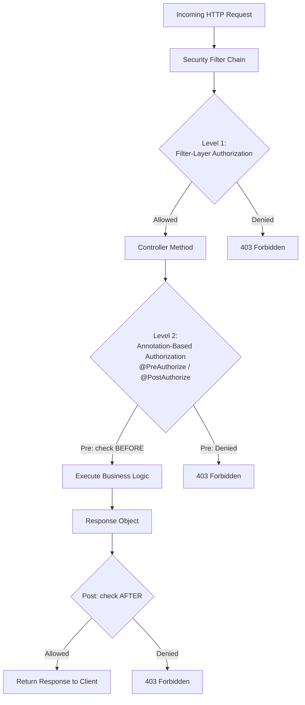
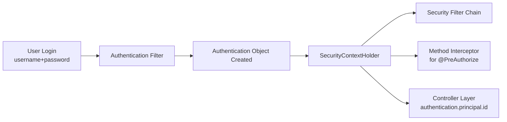
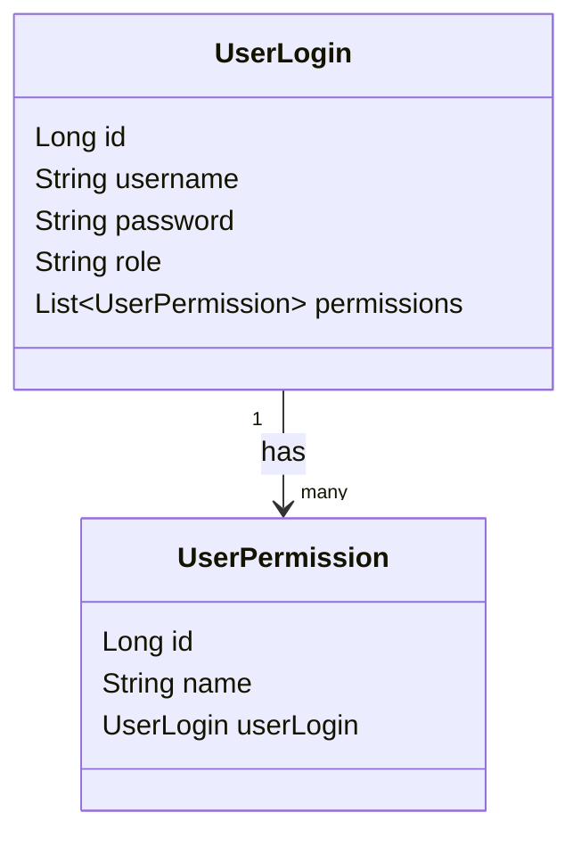
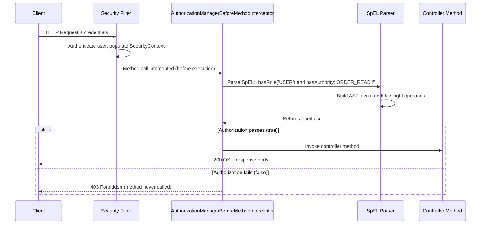
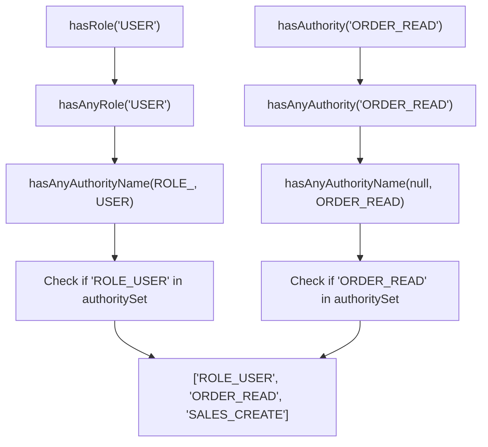
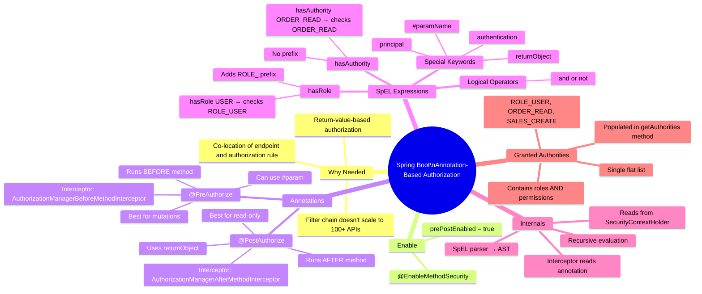

# 📌 Spring Boot — Annotation-Based Authorization: Comprehensive Study Guide

> [!IMPORTANT]
> **Prerequisites:** Before reading this guide, ensure you understand:
> - **Spring Boot Security basics** — SecurityFilterChain, authentication flow
> - **JWT / Basic Authentication** — how tokens carry user identity
> - **Spring Security Filter Chain** — how requests flow through filters
> - **Spring Interceptors** — how method-level interception works
> - **Spring Expression Language (SpEL)** — expression parsing mechanism
> - **JPA / Hibernate** — entity relationships (One-to-Many used in user model)

---

## Table of Contents

1. [Overview — Two Levels of Authorization in Spring Security](#1-overview--two-levels-of-authorization-in-spring-security)
2. [Why Annotation-Based Authorization?](#2-why-annotation-based-authorization)
3. [Authentication Object & Granted Authorities](#3-authentication-object--granted-authorities)
4. [Database Model — Users, Roles & Permissions](#4-database-model--users-roles--permissions)
5. [Implementing UserDetailsService — Loading Roles and Permissions](#5-implementing-userdetailsservice--loading-roles-and-permissions)
6. [Enabling Annotation-Based Security](#6-enabling-annotation-based-security)
7. [@PreAuthorize — Authorization Before Method Execution](#7-preauthorize--authorization-before-method-execution)
8. [@PostAuthorize — Authorization After Method Execution](#8-postauthorize--authorization-after-method-execution)
9. [hasRole() vs hasAuthority() — Deep Dive](#9-hasrole-vs-hasauthority--deep-dive)
10. [Spring Expression Language (SpEL) in Authorization Annotations](#10-spring-expression-language-spel-in-authorization-annotations)
11. [Internal Mechanics — How @PreAuthorize is Intercepted](#11-internal-mechanics--how-preauthorize-is-intercepted)
12. [Accessing the Authentication Object in Annotations](#12-accessing-the-authentication-object-in-annotations)
13. [Complete Working Example — End to End](#13-complete-working-example--end-to-end)
14. [Common Mistakes](#14-common-mistakes)
15. [Best Practices](#15-best-practices)
16. [Interview Notes](#16-interview-notes)
17. [Summary](#17-summary)
18. [Practice Questions](#18-practice-questions)

---

# 1. Overview — Two Levels of Authorization in Spring Security

Spring Security supports two distinct places where you can implement authorization logic:



## Level 1: Filter-Layer Authorization (SecurityFilterChain)

```java
@Bean
public SecurityFilterChain securityFilterChain(HttpSecurity http) throws Exception {
    http.authorizeHttpRequests(auth -> auth
        .requestMatchers("/api/orders").hasRole("USER")
        .requestMatchers("/api/admin").hasRole("ADMIN")
        .anyRequest().authenticated()
    );
    return http.build();
}
```

**Problem with this approach at scale:**
- Every single API endpoint must be listed here
- Large applications can have **hundreds of APIs**
- This file becomes a maintenance nightmare
- Security config is decoupled from the actual endpoint definition — hard to reason about

## Level 2: Annotation-Based Authorization (@PreAuthorize / @PostAuthorize)

```java
@GetMapping("/api/orders")
@PreAuthorize("hasRole('USER') and hasAuthority('ORDER_READ')")
public ResponseEntity<List<Order>> getOrders() { ... }
```

**Advantages:**
- Authorization is defined **right next to the endpoint** — easy to read and maintain
- Scales naturally — each controller owns its own authorization rules
- Supports fine-grained, granular permissions beyond just roles
- Supports post-execution logic using the return value

---

# 2. Why Annotation-Based Authorization?

## The Scalability Problem

Consider an enterprise application with 200+ REST endpoints:

```java
// This becomes unmanageable at scale:
http.authorizeHttpRequests(auth -> auth
    .requestMatchers("/api/orders/read").hasRole("USER")
    .requestMatchers("/api/orders/create").hasRole("MANAGER")
    .requestMatchers("/api/orders/delete").hasRole("ADMIN")
    .requestMatchers("/api/sales/read").hasRole("USER")
    .requestMatchers("/api/sales/create").hasAuthority("SALES_CREATE")
    .requestMatchers("/api/inventory/read").hasRole("USER")
    // ... 190 more entries
);
```

**Problems:**
- All authorization logic is in one place, disconnected from the code it governs
- Adding a new API requires editing the security config file
- Impossible to enforce per-field or return-value-based authorization
- Testing is complex because authorization is centralized

## The Annotation Solution

```java
// OrderController.java — authorization lives with the endpoint:
@RestController
public class OrderController {

    @GetMapping("/api/orders")
    @PreAuthorize("hasRole('USER') and hasAuthority('ORDER_READ')")
    public String getOrders() { ... }

    @DeleteMapping("/api/orders/{id}")
    @PreAuthorize("hasRole('ADMIN')")
    public String deleteOrder(@PathVariable Long id) { ... }
}
```

Authorization intent is **co-located** with the business code. Any developer reading this file immediately understands who can call each method.

---

# 3. Authentication Object & Granted Authorities

Understanding this is critical — it's the foundation of annotation-based authorization.

## The Authentication Object

When a user successfully authenticates (via Basic Auth, JWT, OAuth, etc.), Spring Security creates an **`Authentication` object** and stores it in the `SecurityContextHolder`. This object travels through the entire request lifecycle — including all the way to the controller.



## Structure of the Authentication Object

```java
public interface Authentication extends Principal, Serializable {
    Collection<? extends GrantedAuthority> getAuthorities(); // ← ROLES + PERMISSIONS
    Object getCredentials();    // password (cleared after auth)
    Object getPrincipal();      // UserDetails object (your User entity)
    boolean isAuthenticated();
}
```

## Granted Authorities — The Single List

> [!IMPORTANT]
> In Spring Security, **roles and permissions (authorities) are both stored in the same flat list** — `getAuthorities()`. There is no structural difference between a role and an authority inside the framework. The only distinction is a naming convention: roles are prefixed with `ROLE_`.

```
Authentication.getAuthorities() =
[
  "ROLE_USER",          ← Role (note the ROLE_ prefix)
  "ORDER_READ",         ← Permission/Authority (no prefix)
  "SALES_CREATE"        ← Permission/Authority (no prefix)
]
```

This list is **populated from your `getAuthorities()` implementation** in `UserDetails`. How you populate it determines what gets checked by `hasRole()` and `hasAuthority()`.

---

# 4. Database Model — Users, Roles & Permissions

To implement granular permission control, a two-table model is used:

## Table Design

```sql
-- Table 1: user_login
-- Stores the user's top-level role (e.g., USER, ADMIN)
CREATE TABLE user_login (
    id       BIGINT PRIMARY KEY AUTO_INCREMENT,
    username VARCHAR(255) UNIQUE NOT NULL,
    password VARCHAR(255) NOT NULL,
    role     VARCHAR(50) NOT NULL   -- e.g., 'USER', 'ADMIN'
);

-- Table 2: user_permission
-- Stores granular permissions for each user (one-to-many)
CREATE TABLE user_permission (
    id      BIGINT PRIMARY KEY AUTO_INCREMENT,
    user_id BIGINT NOT NULL,
    name    VARCHAR(100) NOT NULL,  -- e.g., 'ORDER_READ', 'SALES_CREATE'
    FOREIGN KEY (user_id) REFERENCES user_login(id)
);
```

## Entity Classes

```java
@Entity
@Table(name = "user_login")
public class UserLogin {

    @Id
    @GeneratedValue(strategy = GenerationType.IDENTITY)
    private Long id;

    private String username;
    private String password;
    private String role;            // High-level role: "USER" or "ADMIN"

    // One user → many permissions
    @OneToMany(mappedBy = "userLogin", fetch = FetchType.EAGER)
    private List<UserPermission> permissions;

    // Getters and setters...
}

@Entity
@Table(name = "user_permission")
public class UserPermission {

    @Id
    @GeneratedValue(strategy = GenerationType.IDENTITY)
    private Long id;

    private String name;            // Granular permission: "ORDER_READ", "SALES_CREATE"

    @ManyToOne
    @JoinColumn(name = "user_id")
    private UserLogin userLogin;

    // Getters and setters...
}
```

## Sample Data

```
user_login table:
+----+----------+----------+------+
| id | username | password | role |
+----+----------+----------+------+
|  1 | shreyans | $2a$...  | USER |
+----+----------+----------+------+

user_permission table:
+----+---------+------------+
| id | user_id | name       |
+----+---------+------------+
|  1 |       1 | ORDER_READ |
+----+---------+------------+
```

The user `shreyans` has:
- **Role:** `USER` (high-level)
- **Permission:** `ORDER_READ` (granular)
- No `SALES_READ` permission → cannot access sales endpoints



---

# 5. Implementing UserDetailsService — Loading Roles and Permissions

This is where roles and permissions are assembled into the `GrantedAuthority` list that Spring Security uses for all authorization checks.

```java
@Service
public class UserEntityService implements UserDetailsService {

    @Autowired
    private UserLoginRepository userLoginRepository;

    @Override
    public UserDetails loadUserByUsername(String username)
            throws UsernameNotFoundException {

        UserLogin user = userLoginRepository.findByUsername(username)
                .orElseThrow(() ->
                    new UsernameNotFoundException("User not found: " + username));

        return new User(
            user.getUsername(),
            user.getPassword(),
            getAuthorities(user)           // ← Critical: build the authority list
        );
    }

    private Collection<GrantedAuthority> getAuthorities(UserLogin user) {
        List<GrantedAuthority> authorities = new ArrayList<>();

        // 1. Add the high-level role (Spring expects ROLE_ prefix)
        authorities.add(new SimpleGrantedAuthority("ROLE_" + user.getRole()));
        // Result: "ROLE_USER"

        // 2. Add all granular permissions
        for (UserPermission permission : user.getPermissions()) {
            authorities.add(new SimpleGrantedAuthority(permission.getName()));
            // Result: "ORDER_READ", "SALES_CREATE", etc.
        }

        return authorities;
    }
}
```

## What the Final List Contains

For the user `shreyans` (role=USER, permissions=[ORDER_READ]):

```
getAuthorities() returns:
[
  SimpleGrantedAuthority("ROLE_USER"),
  SimpleGrantedAuthority("ORDER_READ")
]
```

This list is what every `hasRole()` and `hasAuthority()` check runs against.

> [!IMPORTANT]
> You manually add the `ROLE_` prefix when building the `SimpleGrantedAuthority`. `hasRole('USER')` in SpEL will also add `ROLE_` automatically before checking — so `hasRole('USER')` checks for `ROLE_USER` in the list. That's why you must store it as `ROLE_USER`.

---

# 6. Enabling Annotation-Based Security

Before `@PreAuthorize` and `@PostAuthorize` will work, you **must** explicitly enable method-level security in your security configuration class.

```java
@Configuration
@EnableWebSecurity
@EnableMethodSecurity(prePostEnabled = true)   // ← THIS IS REQUIRED
public class SecurityConfig {

    @Bean
    public SecurityFilterChain securityFilterChain(HttpSecurity http) throws Exception {
        http
            .csrf(csrf -> csrf.disable())
            .authorizeHttpRequests(auth -> auth
                .anyRequest().authenticated()  // All requests must be authenticated
            )
            .httpBasic(Customizer.withDefaults()); // Using Basic Auth for testing

        return http.build();
    }
}
```

## What `@EnableMethodSecurity(prePostEnabled = true)` Does

Without this annotation, Spring Security **ignores** `@PreAuthorize` and `@PostAuthorize` annotations entirely. The methods execute without any authorization check.

With `prePostEnabled = true`, Spring registers the necessary **AOP interceptors** that intercept annotated methods before/after execution.

> [!NOTE]
> In older Spring versions (before Spring Boot 3.x), this was `@EnableGlobalMethodSecurity(prePostEnabled = true)`. In Spring Boot 3.x / Spring Security 6.x, the replacement is `@EnableMethodSecurity(prePostEnabled = true)`. The `prePostEnabled = true` is actually the **default** in `@EnableMethodSecurity`, but it is good practice to be explicit.

---

# 7. @PreAuthorize — Authorization Before Method Execution

## Overview

`@PreAuthorize` runs the authorization check **before** the annotated method body executes. If the check fails, the method is never called — a `403 Forbidden` (or `AccessDeniedException`) is returned immediately.

## Syntax

```java
@PreAuthorize("SpEL expression that returns boolean")
public ReturnType methodName(params) { ... }
```

## Example: Role + Permission Check

```java
@RestController
@RequestMapping("/api")
public class OrderController {

    // Requires ROLE_USER AND ORDER_READ permission
    @GetMapping("/orders")
    @PreAuthorize("hasRole('USER') and hasAuthority('ORDER_READ')")
    public ResponseEntity<String> getAllOrders() {
        return ResponseEntity.ok("All orders have been fetched successfully.");
    }
}
```

```java
@RestController
@RequestMapping("/api")
public class SalesController {

    // Requires SALES_READ permission (regardless of role)
    @GetMapping("/sales")
    @PreAuthorize("hasAuthority('SALES_READ')")
    public ResponseEntity<String> getAllSales() {
        return ResponseEntity.ok("All sales have been fetched successfully.");
    }
}
```

## Testing the Behavior

**Setup:**
- User `shreyans` has: `ROLE_USER`, `ORDER_READ`

| Request | Endpoint | Result | Reason |
|---|---|---|---|
| `shreyans` calls `/api/orders` | GET /api/orders | ✅ 200 OK | Has `ROLE_USER` AND `ORDER_READ` — both conditions met |
| `shreyans` calls `/api/sales` | GET /api/sales | ❌ 403 Forbidden | Does NOT have `SALES_READ` permission |

## Execution Flow for @PreAuthorize



---

# 8. @PostAuthorize — Authorization After Method Execution

## Overview

`@PostAuthorize` runs the authorization check **after** the annotated method executes but **before** the response is sent to the client. The method's return value is accessible via the special keyword `returnObject`.

## When to Use @PostAuthorize

Use `@PostAuthorize` when the authorization decision depends on **data that only exists after the business logic runs** — for example, when you need to verify that the returned data belongs to the requesting user.

## Syntax

```java
@PostAuthorize("SpEL expression using returnObject")
public SomeDTO methodName(params) { ... }
```

## The `returnObject` Keyword

Inside a `@PostAuthorize` expression, `returnObject` is a special variable that holds the method's return value. Spring Security automatically type-casts it — you don't need to cast it manually.

```java
@PostAuthorize("returnObject.userId == authentication.principal.id")
// returnObject is typed as the method's return type (OrderDTO in this case)
```

## Example: User Can Only Access Their Own Data

**Scenario:** Both User A (id=1) and User B (id=2) have `ROLE_USER` and `ORDER_READ`. But User B should not be able to read User A's orders.

```java
@Entity
public class OrderDTO {
    private Long orderId;
    private Long userId;     // Which user this order belongs to
    private String details;
    // Getters and setters...
}
```

```java
@RestController
@RequestMapping("/api")
public class OrderController {

    @GetMapping("/orders")
    @PreAuthorize("hasRole('USER') and hasAuthority('ORDER_READ')")
    @PostAuthorize("returnObject.userId == authentication.principal.id")
    public OrderDTO getOrder() {

        // Business logic runs first (DB fetch, computation, etc.)
        // For demonstration, hardcoded to return order belonging to user ID 1
        OrderDTO dto = new OrderDTO();
        dto.setOrderId(101L);
        dto.setUserId(1L);        // This order belongs to user with ID = 1
        dto.setDetails("Order details here");

        return dto;
        // AFTER this returns, @PostAuthorize checks the condition
    }
}
```

## Testing the Behavior

**Setup:**
- User A: `id=1`, `username=auser`, `ROLE_USER`, `ORDER_READ`
- User B: `id=2`, `username=buser`, `ROLE_USER`, `ORDER_READ`

| Caller | returnObject.userId | authentication.principal.id | Result |
|---|---|---|---|
| User A (id=1) | 1 | 1 | 1 == 1 → ✅ 200 OK |
| User B (id=2) | 1 | 2 | 1 == 2 → ❌ 403 Forbidden |

User B's request:
1. Passes `@PreAuthorize` (has `ROLE_USER` and `ORDER_READ`) ✅
2. The method executes (DB is queried, OrderDTO is built)
3. `@PostAuthorize` evaluates: `returnObject.userId (1) == authentication.principal.id (2)` → `false`
4. Response is blocked → 403 Forbidden

> [!CAUTION]
> **Be aware:** With `@PostAuthorize`, the business logic **always runs**, even if authorization will ultimately fail. If the method has side effects (writes to DB, sends emails, etc.), those side effects happen before the authorization check blocks the response. Use `@PreAuthorize` for mutation operations. Reserve `@PostAuthorize` for read operations where the decision depends on the returned data.

## Execution Flow for @PostAuthorize

```mermaid
sequenceDiagram
    participant C as Client
    participant F as Security Filter
    participant PI as @PreAuthorize Interceptor
    participant M as Controller Method
    participant PAI as @PostAuthorize Interceptor

    C->>F: HTTP Request + credentials
    F->>F: Authenticate, populate SecurityContext
    F->>PI: Check @PreAuthorize
    PI->>PI: Evaluate SpEL expression
    alt @PreAuthorize fails
        PI-->>C: 403 Forbidden
    else @PreAuthorize passes
        PI->>M: Invoke method
        M->>M: Execute business logic
        M-->>PAI: Return returnObject (OrderDTO)
        PAI->>PAI: Evaluate @PostAuthorize SpEL\n(using returnObject)
        alt @PostAuthorize fails
            PAI-->>C: 403 Forbidden (data NOT sent)
        else @PostAuthorize passes
            PAI-->>C: 200 OK + returnObject
        end
    end
```



---

# 9. hasRole() vs hasAuthority() — Deep Dive

This is a very commonly misunderstood topic. The key insight: **at the code level, they are the same**.

## Conceptual Distinction

| | `hasRole()` | `hasAuthority()` |
|---|---|---|
| **Intended for** | High-level role distinction | Granular permission distinction |
| **Example usage** | `hasRole('USER')`, `hasRole('ADMIN')` | `hasAuthority('ORDER_READ')`, `hasAuthority('SALES_CREATE')` |
| **Prefix behavior** | Automatically prepends `ROLE_` | No prefix added — used as-is |
| **What gets checked** | `ROLE_USER` in authorities list | `ORDER_READ` in authorities list |

## Internal Code — They Call the Same Method

```java
// SecurityExpressionRoot.java (Spring Security source code)

public boolean hasAuthority(String authority) {
    return hasAnyAuthority(authority);              // calls hasAnyAuthority
}

public boolean hasAnyAuthority(String... authorities) {
    return hasAnyAuthorityName(null, authorities);  // no prefix added
}

public boolean hasRole(String role) {
    return hasAnyRole(role);                        // calls hasAnyRole
}

public boolean hasAnyRole(String... roles) {
    return hasAnyAuthorityName(this.defaultRolePrefix, roles);
    //                         ↑ this.defaultRolePrefix = "ROLE_"
}

// The single unified method both paths lead to:
private boolean hasAnyAuthorityName(String prefix, String... roles) {
    Set<String> roleSet = getAuthoritySet();   // Get the flat list of granted authorities
    for (String role : roles) {
        String defaultedRole = getRoleWithDefaultPrefix(prefix, role);
        // For hasRole: defaultedRole = "ROLE_" + role
        // For hasAuthority: defaultedRole = role (prefix is null)
        if (roleSet.contains(defaultedRole)) {
            return true;
        }
    }
    return false;
}
```

## Visual Comparison



## Practical Rule

```java
// Convention: use hasRole for top-level access control
@PreAuthorize("hasRole('ADMIN')")       // checks for ROLE_ADMIN in list

// Convention: use hasAuthority for granular permissions
@PreAuthorize("hasAuthority('ORDER_READ')")   // checks for ORDER_READ in list

// Combining both:
@PreAuthorize("hasRole('USER') and hasAuthority('ORDER_READ')")
```

> [!NOTE]
> You **do not** need to write `ROLE_USER` in `hasRole()`. Spring Security adds the `ROLE_` prefix automatically. But in `hasAuthority()`, whatever string you write is checked as-is with no modification.

---

# 10. Spring Expression Language (SpEL) in Authorization Annotations

The strings inside `@PreAuthorize` and `@PostAuthorize` are **Spring Expression Language (SpEL)** expressions. They are evaluated at runtime as boolean expressions.

## Available Built-in Security Expressions

| Expression | Description | Example |
|---|---|---|
| `hasRole('ROLE')` | User has the specified role | `hasRole('ADMIN')` |
| `hasAnyRole('R1','R2')` | User has any of the specified roles | `hasAnyRole('USER','ADMIN')` |
| `hasAuthority('AUTH')` | User has the specified authority/permission | `hasAuthority('ORDER_READ')` |
| `hasAnyAuthority('A1','A2')` | User has any of the specified authorities | `hasAnyAuthority('ORDER_READ','SALES_READ')` |
| `isAuthenticated()` | User is authenticated | `isAuthenticated()` |
| `isAnonymous()` | User is not authenticated | `isAnonymous()` |
| `permitAll` | Always allow | `permitAll` |
| `denyAll` | Always deny | `denyAll` |
| `authentication` | The Authentication object | `authentication.name` |
| `principal` | The principal (UserDetails) | `principal.id` |
| `returnObject` | The method's return value (@PostAuthorize only) | `returnObject.userId` |
| `#paramName` | A method parameter | `#id == authentication.principal.id` |

## Logical Operators

```java
// AND — both conditions must be true
@PreAuthorize("hasRole('USER') and hasAuthority('ORDER_READ')")

// OR — at least one condition must be true
@PreAuthorize("hasRole('ADMIN') or hasAuthority('ORDER_DELETE')")

// NOT — condition must be false
@PreAuthorize("not hasRole('GUEST')")

// Combining multiple
@PreAuthorize("(hasRole('USER') or hasRole('MANAGER')) and hasAuthority('ORDER_READ')")
```

## Relational Operators with Method Parameters

You can reference **method parameters** in SpEL using `#parameterName` syntax:

```java
@GetMapping("/user/{id}")
@PreAuthorize("#id == authentication.principal.id")
public UserDTO getUserById(@PathVariable Long id) {
    // Only allows the user to fetch their OWN profile
    // e.g., user with id=2 cannot call /user/1
    return userService.findById(id);
}
```

**Explanation:**
- `#id` → refers to the `@PathVariable Long id` method parameter
- `authentication.principal.id` → the ID of the currently authenticated user
- If they don't match → 403 Forbidden (user is trying to fetch someone else's data)

## Comparing #id (PreAuthorize) vs returnObject (PostAuthorize)

| Technique | Annotation | When to Use |
|---|---|---|
| `#paramName` | `@PreAuthorize` | When the parameter itself is enough to make the decision (before DB call) |
| `returnObject` | `@PostAuthorize` | When you need the fetched data (after DB call) to make the decision |

```java
// PreAuthorize with parameter — efficient (no method call if check fails)
@GetMapping("/user/{id}")
@PreAuthorize("#id == authentication.principal.id")
public UserDTO getUser(@PathVariable Long id) { ... }

// PostAuthorize with returnObject — method runs first, then check
@GetMapping("/orders")
@PostAuthorize("returnObject.userId == authentication.principal.id")
public OrderDTO getOrder() { ... }
```

---

# 11. Internal Mechanics — How @PreAuthorize is Intercepted

Understanding the internals is important for deep interviews and for debugging.

## The Interceptor Architecture

Spring Security uses **AOP (Aspect-Oriented Programming) interceptors** to intercept method calls annotated with `@PreAuthorize` and `@PostAuthorize`.

| Annotation | Interceptor Class |
|---|---|
| `@PreAuthorize` | `AuthorizationManagerBeforeMethodInterceptor` |
| `@PostAuthorize` | `AuthorizationManagerAfterMethodInterceptor` |

These interceptors are registered automatically when `@EnableMethodSecurity(prePostEnabled = true)` is set.

## Step-by-Step: What Happens When @PreAuthorize is Evaluated

```mermaid
flowchart TD
    CALL[Controller method called] --> INT[AuthorizationManagerBeforeMethodInterceptor\ninvoked via AOP proxy]
    INT --> READ[Read SpEL string from @PreAuthorize annotation\ne.g., "hasRole('USER') and hasAuthority('ORDER_READ')"]
    READ --> PARSE[SpEL Expression Parser\nparses string → Abstract Syntax Tree AST]
    PARSE --> AST["AST:\nAND\n├── hasRole('USER')  [left operand]\n└── hasAuthority('ORDER_READ')  [right operand]"]
    AST --> RESOLVE[Recursively resolve each node\nLeft: invoke hasRole → true/false\nRight: invoke hasAuthority → true/false]
    RESOLVE --> EVAL[Apply logical operator AND\ntrue AND true → true\ntrue AND false → false]
    EVAL --> |true| INVOKE[Invoke controller method]
    EVAL --> |false| DENY[Throw AccessDeniedException → 403]
```

## SpEL Abstract Syntax Tree (AST)

When Spring parses `"hasRole('USER') and hasAuthority('ORDER_READ')"`, it builds a tree:

```
      AND (OpAnd)
     /            \
hasRole('USER')   hasAuthority('ORDER_READ')
[MethodReference] [MethodReference]
```

For a more complex expression like `"(hasRole('USER') or hasRole('ADMIN')) and hasAuthority('ORDER_READ')"`:

```
           AND
          /    \
        OR      hasAuthority('ORDER_READ')
       /  \
hasRole   hasRole
('USER') ('ADMIN')
```

The resolver:
1. Evaluates the OR subtree (left of AND)
2. Evaluates `hasAuthority` (right of AND)
3. Applies AND to the results

The recursion handles arbitrarily complex expressions automatically.

## How the Interceptor Accesses the Authentication Object

```java
// Inside AuthorizationManagerBeforeMethodInterceptor (Spring Security source):
public Object invoke(MethodInvocation invocation) throws Throwable {

    // Fetch the Authentication object from SecurityContextHolder
    // This was populated by the authentication filter earlier in the request lifecycle
    Authentication authentication =
        SecurityContextHolder.getContext().getAuthentication();

    // Evaluate the SpEL expression with access to:
    // - authentication object
    // - method parameters
    // - target object
    AuthorizationDecision decision = authorizationManager.check(
        () -> authentication, invocation
    );

    if (decision != null && !decision.isGranted()) {
        throw new AccessDeniedException("Access Denied");
    }

    // If granted, proceed with the actual method call
    return invocation.proceed();
}
```

---

# 12. Accessing the Authentication Object in Annotations

Both `@PreAuthorize` and `@PostAuthorize` give you full access to the `Authentication` object via the `authentication` keyword in SpEL.

## Accessing Authentication Fields

```java
// authentication.name → username string
@PreAuthorize("authentication.name == 'shreyans'")

// authentication.principal → the UserDetails object (your User entity)
@PreAuthorize("authentication.principal.id == #userId")

// authentication.authorities → collection of granted authorities
// (rarely used directly in SpEL — use hasRole/hasAuthority instead)
```

## Using principal.id for Row-Level Security

This is the most important real-world use case — ensuring a user can only access **their own data**:

```java
@RestController
@RequestMapping("/api/user")
public class UserController {

    @GetMapping("/{id}")
    @PreAuthorize("#id == authentication.principal.id")
    public UserDTO getUserById(@PathVariable Long id) {
        // User A (id=1) can call /api/user/1 ✅
        // User A (id=1) cannot call /api/user/2 ❌ → 403
        return userService.findById(id);
    }
}
```

> [!NOTE]
> For `authentication.principal.id` to work, your `UserDetails` implementation (or the `User` object returned by `loadUserByUsername`) must expose an `id` field. If you're using Spring Security's built-in `User` class (which only has username, password, authorities), you'll need a custom `UserDetails` implementation that includes `id`.

## Custom UserDetails with ID

```java
// Custom UserDetails implementation
public class CustomUserDetails implements UserDetails {

    private Long id;           // ← Exposed for authentication.principal.id
    private String username;
    private String password;
    private Collection<? extends GrantedAuthority> authorities;

    public CustomUserDetails(UserLogin user,
                             Collection<? extends GrantedAuthority> authorities) {
        this.id = user.getId();
        this.username = user.getUsername();
        this.password = user.getPassword();
        this.authorities = authorities;
    }

    public Long getId() { return id; }   // ← SpEL accesses this via .id

    @Override
    public String getUsername() { return username; }

    @Override
    public String getPassword() { return password; }

    @Override
    public Collection<? extends GrantedAuthority> getAuthorities() {
        return authorities;
    }

    // isAccountNonExpired, isAccountNonLocked, isCredentialsNonExpired,
    // isEnabled — return true for simplicity
}
```

---

# 13. Complete Working Example — End to End

This section ties everything together with a complete, runnable example.

## Project Structure

```
src/main/java/com/example/security/
├── config/
│   └── SecurityConfig.java
├── controller/
│   ├── OrderController.java
│   ├── SalesController.java
│   └── UserController.java
├── entity/
│   ├── UserLogin.java
│   └── UserPermission.java
├── dto/
│   └── OrderDTO.java
├── repository/
│   └── UserLoginRepository.java
└── service/
    └── UserEntityService.java
```

## SecurityConfig.java

```java
@Configuration
@EnableWebSecurity
@EnableMethodSecurity(prePostEnabled = true)   // Enable @PreAuthorize and @PostAuthorize
public class SecurityConfig {

    @Autowired
    private UserEntityService userEntityService;

    @Bean
    public SecurityFilterChain securityFilterChain(HttpSecurity http) throws Exception {
        http
            .csrf(csrf -> csrf.disable())
            .authorizeHttpRequests(auth -> auth
                .anyRequest().authenticated()
            )
            .httpBasic(Customizer.withDefaults())  // Basic auth for testing
            .userDetailsService(userEntityService);

        return http.build();
    }

    @Bean
    public PasswordEncoder passwordEncoder() {
        return new BCryptPasswordEncoder();
    }
}
```

## UserEntityService.java (UserDetailsService)

```java
@Service
public class UserEntityService implements UserDetailsService {

    @Autowired
    private UserLoginRepository repository;

    @Override
    public UserDetails loadUserByUsername(String username) throws UsernameNotFoundException {
        UserLogin user = repository.findByUsername(username)
                .orElseThrow(() ->
                    new UsernameNotFoundException("User not found: " + username));

        return new CustomUserDetails(user, getAuthorities(user));
    }

    private Collection<GrantedAuthority> getAuthorities(UserLogin user) {
        List<GrantedAuthority> authorities = new ArrayList<>();

        // Add role with ROLE_ prefix
        authorities.add(new SimpleGrantedAuthority("ROLE_" + user.getRole()));

        // Add all granular permissions
        user.getPermissions().forEach(p ->
            authorities.add(new SimpleGrantedAuthority(p.getName()))
        );

        return authorities;
    }
}
```

## OrderController.java

```java
@RestController
@RequestMapping("/api")
public class OrderController {

    // Requires ROLE_USER AND ORDER_READ
    @GetMapping("/orders")
    @PreAuthorize("hasRole('USER') and hasAuthority('ORDER_READ')")
    public ResponseEntity<String> getAllOrders() {
        return ResponseEntity.ok("All orders have been fetched successfully.");
    }

    // Only allows user to fetch their OWN orders (using path variable check)
    @GetMapping("/orders/user/{userId}")
    @PreAuthorize("#userId == authentication.principal.id")
    public ResponseEntity<String> getOrdersByUser(@PathVariable Long userId) {
        return ResponseEntity.ok("Orders for user " + userId);
    }

    // PostAuthorize: check returned data belongs to caller
    @GetMapping("/order/latest")
    @PreAuthorize("hasRole('USER') and hasAuthority('ORDER_READ')")
    @PostAuthorize("returnObject.body.userId == authentication.principal.id")
    public ResponseEntity<OrderDTO> getLatestOrder() {
        // Simulating DB fetch — in real app, this would query the DB
        OrderDTO dto = new OrderDTO();
        dto.setOrderId(101L);
        dto.setUserId(1L);   // This order belongs to user ID 1
        return ResponseEntity.ok(dto);
    }
}
```

## SalesController.java

```java
@RestController
@RequestMapping("/api")
public class SalesController {

    // Requires SALES_READ permission (regardless of role)
    @GetMapping("/sales")
    @PreAuthorize("hasAuthority('SALES_READ')")
    public ResponseEntity<String> getAllSales() {
        return ResponseEntity.ok("All sales have been fetched successfully.");
    }
}
```

## UserController.java (Create User — No Auth Required)

```java
@RestController
@RequestMapping("/api")
public class UserController {

    @Autowired
    private UserLoginRepository repository;

    @Autowired
    private PasswordEncoder passwordEncoder;

    @PostMapping("/user")
    public ResponseEntity<String> createUser(@RequestBody CreateUserRequest request) {
        UserLogin user = new UserLogin();
        user.setUsername(request.getUsername());
        user.setPassword(passwordEncoder.encode(request.getPassword()));
        user.setRole(request.getRole());

        // Create permission entities
        List<UserPermission> permissions = request.getPermissions().stream()
            .map(p -> {
                UserPermission perm = new UserPermission();
                perm.setName(p);
                perm.setUserLogin(user);
                return perm;
            })
            .collect(Collectors.toList());

        user.setPermissions(permissions);
        repository.save(user);

        return ResponseEntity.ok("User created successfully.");
    }
}
```

## Test Scenarios

### Create Users via API

```http
POST /api/user
Content-Type: application/json

{
  "username": "shreyans",
  "password": "123",
  "role": "USER",
  "permissions": ["ORDER_READ"]
}
```

```http
POST /api/user
Content-Type: application/json

{
  "username": "auser",
  "password": "123",
  "role": "USER",
  "permissions": ["ORDER_READ", "SALES_READ"]
}
```

### Test Authorization

```http
# Test 1: shreyans accessing orders — should PASS
GET /api/orders
Authorization: Basic c2hyZXlhbnM6MTIz   (shreyans:123 encoded)
# Response: 200 "All orders have been fetched successfully."

# Test 2: shreyans accessing sales — should FAIL
GET /api/sales
Authorization: Basic c2hyZXlhbnM6MTIz
# Response: 403 Forbidden (no SALES_READ permission)

# Test 3: auser accessing sales — should PASS
GET /api/sales
Authorization: Basic YXVzZXI6MTIz   (auser:123 encoded)
# Response: 200 "All sales have been fetched successfully."
```

---

# 14. Common Mistakes

## Mistake 1: Forgetting @EnableMethodSecurity

```java
// ❌ WRONG — @PreAuthorize is silently ignored
@Configuration
@EnableWebSecurity
public class SecurityConfig { ... }

// ✅ CORRECT
@Configuration
@EnableWebSecurity
@EnableMethodSecurity(prePostEnabled = true)
public class SecurityConfig { ... }
```

**Why it happens:** The annotations compile and run without errors — they just have no effect. This is a subtle bug that can lead to security holes in production.

---

## Mistake 2: Wrong Prefix in hasRole()

```java
// ❌ WRONG — hasRole already adds ROLE_ prefix internally
@PreAuthorize("hasRole('ROLE_USER')")
// This checks for "ROLE_ROLE_USER" in the authorities list → always false

// ✅ CORRECT
@PreAuthorize("hasRole('USER')")
// This checks for "ROLE_USER" in the authorities list
```

---

## Mistake 3: Storing Roles Without ROLE_ Prefix in getAuthorities()

```java
// ❌ WRONG — stored without prefix
authorities.add(new SimpleGrantedAuthority(user.getRole()));
// Stores "USER" — but hasRole('USER') checks for "ROLE_USER" → mismatch

// ✅ CORRECT — stored with prefix
authorities.add(new SimpleGrantedAuthority("ROLE_" + user.getRole()));
// Stores "ROLE_USER" — hasRole('USER') checks for "ROLE_USER" → match
```

---

## Mistake 4: Using @PostAuthorize for Mutating Operations

```java
// ❌ DANGEROUS — side effects happen before authorization check
@PostMapping("/orders")
@PostAuthorize("returnObject.userId == authentication.principal.id")
public OrderDTO createOrder(@RequestBody OrderRequest request) {
    // This saves to DB even if the user is unauthorized!
    return orderService.save(request);
}

// ✅ CORRECT — use @PreAuthorize for mutations
@PostMapping("/orders")
@PreAuthorize("#request.userId == authentication.principal.id")
public OrderDTO createOrder(@RequestBody OrderRequest request) {
    return orderService.save(request);
}
```

---

## Mistake 5: Putting Sensitive Logic in Both Layers Without Understanding Priority

```java
// If @PreAuthorize fails, @PostAuthorize is never reached
// If @PreAuthorize passes but @PostAuthorize fails, the method HAS already run

// This means: @PostAuthorize cannot undo side effects from the method body
```

---

# 15. Best Practices

| Practice | Explanation |
|---|---|
| **Use `@PreAuthorize` for most cases** | Checks before method execution — more efficient, no side effects |
| **Reserve `@PostAuthorize` for read-only, data-dependent checks** | Only use when you need the return value for the authorization decision |
| **Combine role + permission checks** | `hasRole('USER') and hasAuthority('ORDER_READ')` — role for coarse, authority for fine-grained |
| **Use `#param` for path variable/body checks in PreAuthorize** | More efficient than PostAuthorize when the decision can be made from input alone |
| **Never put passwords or secrets in JWT payload/Claims** | Even if using JWE for OAuth — minimize sensitive data in tokens |
| **Explicit is better** | Annotate every controller method, even if just `@PreAuthorize("isAuthenticated()")` — makes security intent clear |
| **Use `@EnableMethodSecurity` instead of deprecated `@EnableGlobalMethodSecurity`** | Updated annotation for Spring Boot 3.x / Spring Security 6.x |
| **Test both passing and failing cases** | Security tests should verify 403 responses as much as 200 responses |
| **Custom UserDetails for richer SpEL expressions** | Add `id`, `email`, etc. to your `UserDetails` implementation to use them in SpEL |
| **Apply method security at the service layer too** | Annotate `@Service` methods for defense-in-depth when controllers and services can both be entry points |

---

# 16. Interview Notes

## Common Interview Questions

### Basics

| Question | Key Points |
|---|---|
| What is the difference between authentication and authorization in Spring Security? | Authentication = who you are (identity). Authorization = what you can do (permission). Spring Security handles both. |
| What are the two levels of authorization in Spring Security? | Security Filter Chain (URL-level) and Method-level (@PreAuthorize/@PostAuthorize) |
| Why would you prefer annotation-based authorization over filter-chain authorization? | Scalability — co-located with endpoint, avoids giant security config file, supports return-value checks |
| What annotation must be added to the config class to enable @PreAuthorize? | `@EnableMethodSecurity(prePostEnabled = true)` |

### @PreAuthorize vs @PostAuthorize

| Question | Key Points |
|---|---|
| What is the difference between @PreAuthorize and @PostAuthorize? | Pre: authorization check BEFORE method executes. Post: check AFTER method executes, using returnObject |
| When would you use @PostAuthorize? | When the authorization decision depends on data returned by the method (e.g., verify returned record belongs to the caller) |
| Can you have both @PreAuthorize and @PostAuthorize on the same method? | Yes. PreAuthorize runs first. If it passes, method executes. Then PostAuthorize checks returnObject. |
| What is `returnObject` in @PostAuthorize? | Special SpEL keyword that holds the method's return value. Spring Security auto-casts it to the method's return type. |

### hasRole vs hasAuthority

| Question | Key Points |
|---|---|
| What is the difference between hasRole() and hasAuthority()? | Both call the same underlying code. hasRole() prepends `ROLE_` prefix automatically. hasAuthority() checks as-is. |
| If I call hasRole('USER'), what does Spring actually check for in the authorities list? | `ROLE_USER` |
| Why shouldn't I write hasRole('ROLE_USER')? | hasRole already adds ROLE_ prefix. hasRole('ROLE_USER') would check for ROLE_ROLE_USER — always false. |

### Internals

| Question | Key Points |
|---|---|
| How does @PreAuthorize actually get invoked before the method? | AOP interceptor: `AuthorizationManagerBeforeMethodInterceptor` intercepts the method call |
| What language is used inside @PreAuthorize strings? | Spring Expression Language (SpEL) |
| How does Spring parse the expression string inside @PreAuthorize? | SpEL parser converts it to an Abstract Syntax Tree (AST), then recursively evaluates each node |
| How can you check a method parameter in @PreAuthorize? | Using `#paramName` syntax: `@PreAuthorize("#id == authentication.principal.id")` |
| How does the interceptor know the current user's identity? | It reads the Authentication object from `SecurityContextHolder.getContext().getAuthentication()` |

### Tricky/Advanced

| Question | Key Points |
|---|---|
| What happens if @EnableMethodSecurity is missing? | @PreAuthorize and @PostAuthorize are silently ignored — no error, but no security either |
| Can you use @PreAuthorize on a private method? | No. Spring AOP uses JDK dynamic proxies or CGLIB, which only intercept public methods on Spring beans |
| If @PostAuthorize fails, do the DB writes from the method body still persist? | Yes. The method runs fully. PostAuthorize only blocks the response, not the execution. This is why PostAuthorize should only be used for read operations. |

---

# 17. Summary



## Quick Revision Bullets

- **Two authorization levels:** Filter-chain (URL-level) and Annotation-based (method-level). For large apps, annotation-based scales better.
- **@EnableMethodSecurity(prePostEnabled = true)** must be on your `@Configuration` class — without this, the annotations do nothing.
- **@PreAuthorize** — authorization check before method executes. Method never runs if check fails.
- **@PostAuthorize** — authorization check after method executes using `returnObject`. Method always runs; only the response is blocked.
- **hasRole('USER')** → checks for `ROLE_USER` in authorities list (prefix added automatically)
- **hasAuthority('ORDER_READ')** → checks for `ORDER_READ` in authorities list (no prefix)
- **Both hasRole and hasAuthority** call the same underlying `hasAnyAuthorityName` method. Difference is only the prefix.
- **Granted authorities** = single flat list containing both roles and permissions. Populated in `getAuthorities()` of `UserDetailsService`.
- **SpEL keywords:** `authentication`, `principal`, `returnObject`, `#paramName`, `hasRole()`, `hasAuthority()`, `and`, `or`, `not`
- **Interceptors:** `AuthorizationManagerBeforeMethodInterceptor` (for Pre), `AuthorizationManagerAfterMethodInterceptor` (for Post)
- **AST:** SpEL expression is parsed into an Abstract Syntax Tree and recursively evaluated
- **Row-level security:** `@PreAuthorize("#id == authentication.principal.id")` prevents users from accessing other users' data
- **@PostAuthorize with returnObject:** `returnObject.userId == authentication.principal.id` — verifies returned data belongs to caller
- **Never use @PostAuthorize for mutating operations** — side effects (DB writes) happen before the authorization check

---

# 18. Practice Questions

### Easy

1. What annotation must be added to the Spring Security configuration class to enable `@PreAuthorize`?
2. What is the difference between `@PreAuthorize` and `@PostAuthorize`?
3. Write a `@PreAuthorize` expression that allows only users with the role `ADMIN`.
4. What does `returnObject` refer to inside `@PostAuthorize`?
5. What is the automatic prefix added by `hasRole()` and what does that mean for how you store roles?
6. Name the two AOP interceptor classes used for `@PreAuthorize` and `@PostAuthorize`.
7. How do you reference a method parameter in a `@PreAuthorize` expression?

### Medium

8. Explain why a user with `ROLE_USER` stored in their authorities list would fail a `hasRole('ROLE_USER')` check. What is the correct fix?
9. Write an entity model and `UserDetailsService` implementation that supports both role-level and permission-level authorization.
10. A `GET /api/orders` endpoint should be accessible to any user who has the role `USER` AND either the permission `ORDER_READ` or `ORDER_MANAGE`. Write the `@PreAuthorize` expression.
11. A user with id=5 calls `GET /api/user/3`. Using `@PreAuthorize` with a path variable, write the annotation that blocks this request.
12. Explain the internal flow from a `@PreAuthorize` annotation being present on a method to the final `true`/`false` authorization decision. Mention: interceptor, SpEL, AST, SecurityContextHolder.
13. What is the difference between filter-chain authorization and annotation-based authorization? When would you use each?

### Hard

14. A `GET /api/order/latest` endpoint is annotated with both `@PreAuthorize` and `@PostAuthorize`. `@PreAuthorize` passes. The method executes and sends an email notification. Then `@PostAuthorize` fails. What happens? How should you redesign this?
15. Trace exactly what happens in the Spring Security internals (interceptor → SpEL parser → AST → method invocation) when the expression `"hasRole('USER') and (hasAuthority('ORDER_READ') or hasAuthority('ORDER_MANAGE'))"` is evaluated.
16. You need to implement row-level security: each user should only be able to update their own profile. The user ID is in the request body (not a path variable). Write the controller method, DTO, and `@PreAuthorize` annotation.
17. An intern suggests: "Since `hasRole()` and `hasAuthority()` call the same code, let's just use `hasAuthority('ROLE_USER')` everywhere to avoid confusion." Evaluate this proposal — what are the pros, cons, and risks?
18. Design the complete authorization strategy (entities, `getAuthorities()`, `SecurityConfig`, controller annotations) for an e-commerce platform with roles `CUSTOMER`, `SELLER`, `ADMIN` and granular permissions `PRODUCT_READ`, `PRODUCT_CREATE`, `ORDER_READ`, `ORDER_CANCEL`, `USER_MANAGE`.

---

> [!TIP]
> **Quick Testing Tip:** When testing annotation-based security, always test with:
> 1. A user that **should** have access → expect 200
> 2. A user that is authenticated but **lacks the permission** → expect 403
> 3. An **unauthenticated** request → expect 401
>
> All three cases are needed to confirm your security annotations are actually working, not just silently being ignored due to missing `@EnableMethodSecurity`.
