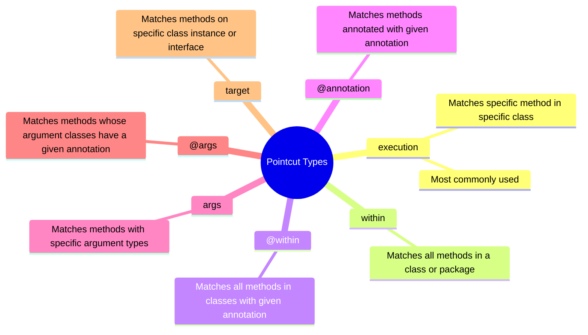
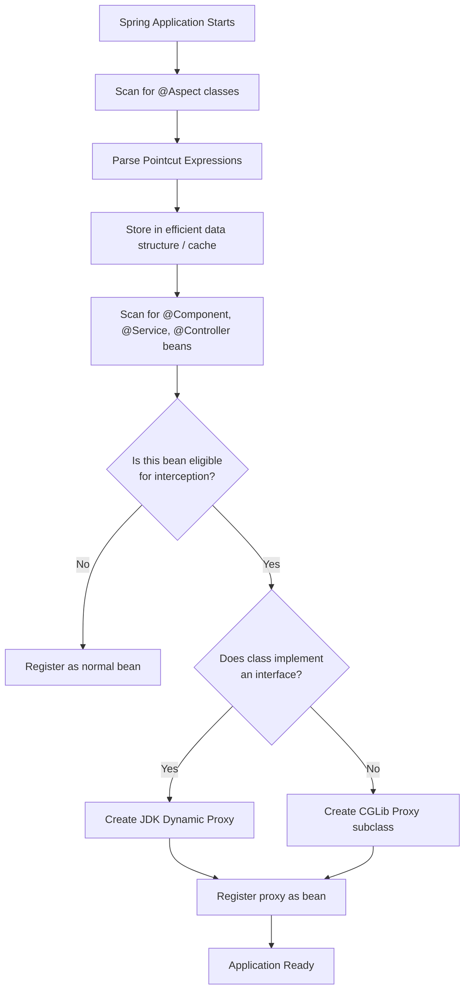
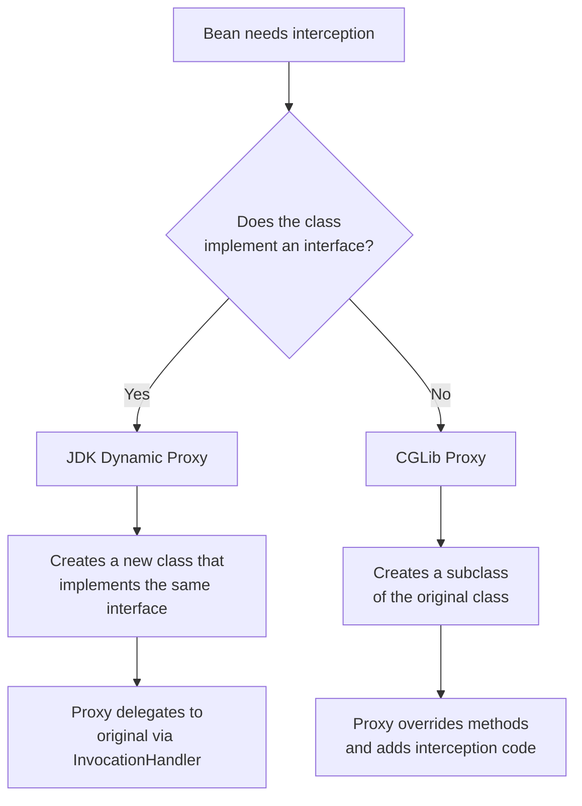
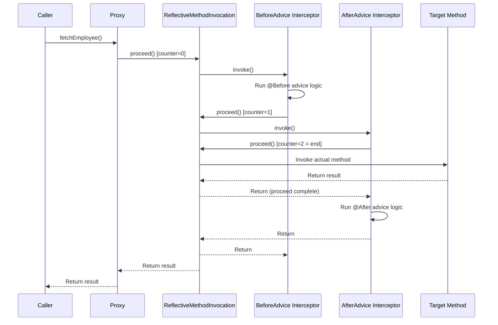
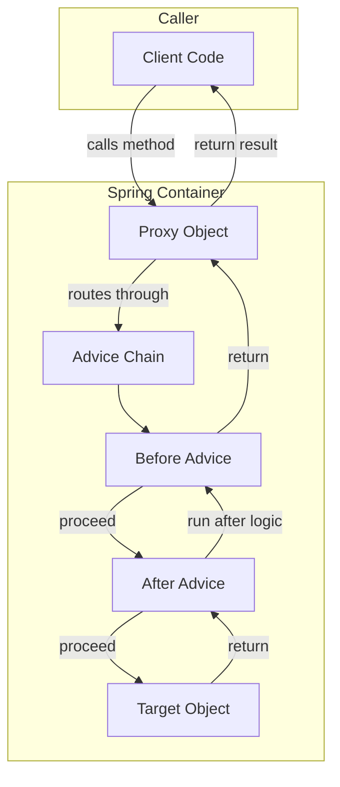
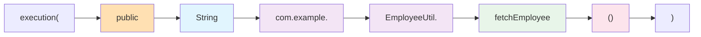
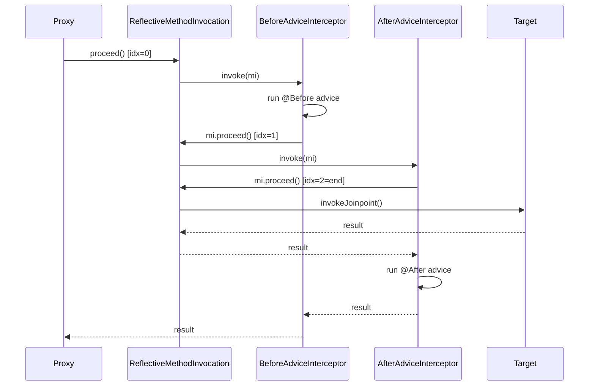
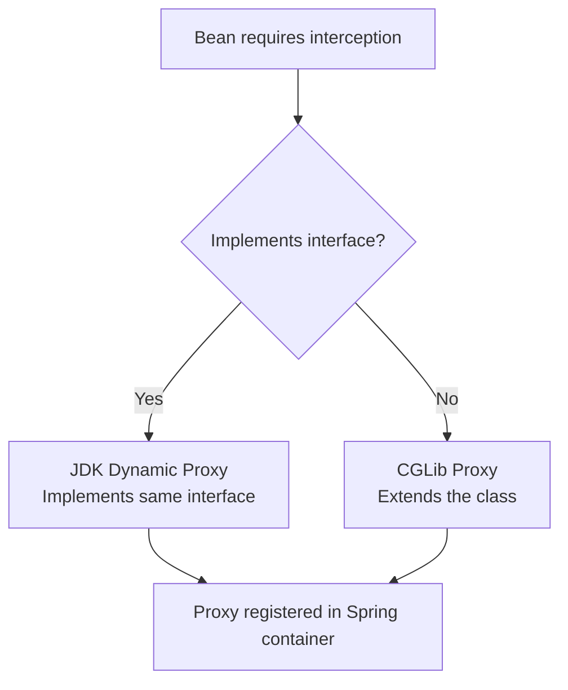

# 📌 Spring AOP — Aspect Oriented Programming

> **Series:** Spring Boot Deep Dive | **Topic:** Spring AOP  
> **Level:** Intermediate → Advanced | **Prerequisite:** Spring Beans, Dependency Injection, Java Proxies

---

## Table of Contents

1. [Overview](#overview)
2. [Why AOP Exists — The Problem it Solves](#why-aop-exists)
3. [Core Terminology](#core-terminology)
4. [Maven Dependency](#maven-dependency)
5. [Pointcut — Deep Dive](#pointcut)
   - [execution](#execution-pointcut)
   - [within](#within-pointcut)
   - [@within](#atwithin-pointcut)
   - [@annotation](#atannotation-pointcut)
   - [args](#args-pointcut)
   - [@args](#atargs-pointcut)
   - [target](#target-pointcut)
   - [Combining Pointcuts](#combining-pointcuts)
   - [Named Pointcuts](#named-pointcuts)
6. [Advice — Deep Dive](#advice)
   - [@Before](#before-advice)
   - [@After](#after-advice)
   - [@Around](#around-advice)
7. [JoinPoint](#joinpoint)
8. [How AOP Works Internally](#how-aop-works-internally)
   - [Application Startup Flow](#application-startup-flow)
   - [JDK Dynamic Proxy vs CGLib Proxy](#jdk-vs-cglib)
   - [Advice Chain — Chain of Responsibility](#advice-chain)
9. [Complete Code Examples](#complete-code-examples)
10. [Mermaid Diagrams](#mermaid-diagrams)
11. [Key Observations](#key-observations)
12. [Common Mistakes](#common-mistakes)
13. [Best Practices](#best-practices)
14. [Interview Notes](#interview-notes)
15. [Summary](#summary)

---

## Overview

Aspect Oriented Programming (AOP) is a programming paradigm that **separates cross-cutting concerns** from core business logic. In the context of Spring Boot, it provides a mechanism to **intercept method invocations** and execute additional logic before, after, or around the target method — without modifying the target method itself.

Think of it as placing invisible "hooks" around your methods that spring into action at the right moment.

---

## Why AOP Exists

### The Problem — Cross-Cutting Concerns

In any enterprise application, business logic is not the only concern. Developers must also handle:

- **Logging** — printing diagnostic information before/after method calls
- **Transaction Management** — starting, committing, and rolling back database transactions
- **Security** — checking whether the caller has permission
- **Auditing** — recording who called what and when
- **Performance Monitoring** — timing method execution

Without AOP, these concerns bleed into every class and method:

```java
// ❌ Without AOP — business logic polluted with boilerplate
public String fetchEmployee() {
    logger.info("Entering fetchEmployee");           // Logging
    transactionManager.begin();                      // Transaction
    try {
        String result = employeeRepository.find();   // ← Actual business logic
        transactionManager.commit();                 // Transaction
        logger.info("Exiting fetchEmployee");        // Logging
        return result;
    } catch (Exception e) {
        transactionManager.rollback();               // Transaction
        throw e;
    }
}
```

If you have 100 methods, you repeat this boilerplate 100 times. Changing the logging strategy requires modifying all 100 methods.

### The AOP Solution

```java
// ✅ With AOP — business logic is clean
public String fetchEmployee() {
    return employeeRepository.find();   // ← Only business logic
}

// Logging, transactions, security handled separately in Aspects
```

AOP says: *"You focus on business logic. The boilerplate and repetitive code — I will take care of it."*

### Benefits

| Benefit | Description |
|---|---|
| **Reusability** | Write the logging/transaction logic once; apply it everywhere |
| **Maintainability** | One place to update when logic changes |
| **Separation of Concerns** | Business logic is clean; cross-cutting logic is isolated |
| **Non-invasive** | No changes needed to target classes |

---

## Core Terminology

| Term | Definition |
|---|---|
| **Aspect** | A module (class) that contains cross-cutting logic (logging, transactions, etc.) |
| **Pointcut** | An expression that identifies *which* methods the advice should target |
| **Advice** | The actual code/action to execute (the method inside the Aspect class) |
| **JoinPoint** | The specific point during program execution where advice is applied (typically a method invocation) |
| **Target Object** | The bean whose method is being intercepted |
| **Proxy** | A wrapper object created by Spring around the target object to enable interception |
| **Weaving** | The process of linking aspects with the application code (Spring does this at runtime) |

### Real-World Analogy

Imagine a hotel. The **guest** just wants to sleep (business logic). But the hotel has:
- **Security** that checks every guest at entry (Before advice)
- **Housekeeping** that cleans up after every guest leaves (After advice)
- **CCTV** that records entry and exit (Around advice)

The guest doesn't know about security or housekeeping — they just use the room. This separation is AOP.

---

## Maven Dependency

To use Spring AOP, add this dependency to your `pom.xml`:

```xml
<dependency>
    <groupId>org.springframework.boot</groupId>
    <artifactId>spring-boot-starter-aop</artifactId>
</dependency>
```

> [!NOTE]
> This dependency includes AspectJ, which Spring AOP uses for pointcut expression parsing and proxy generation.

---

## Core Annotations

| Annotation | Where Used | Purpose |
|---|---|---|
| `@Aspect` | Aspect class | Marks the class as an aspect |
| `@Component` | Aspect class | Registers it as a Spring bean |
| `@Before` | Advice method | Runs before the matched method |
| `@After` | Advice method | Runs after the matched method (finally block equivalent) |
| `@Around` | Advice method | Runs before AND after; you control when the target is called |
| `@Pointcut` | Empty method | Names/reuses a pointcut expression |

> [!IMPORTANT]
> An Aspect class must be annotated with **both** `@Aspect` AND `@Component`. Without `@Component`, Spring will not manage it as a bean, and the aspect will never execute.

---

## Pointcut

### Definition

A **Pointcut** is an expression that tells Spring AOP: *"For which method(s) should this advice be applied?"*

It acts as a filter — Spring evaluates the pointcut expression against every managed bean's methods during startup to determine which ones need interception.

### Pointcut Types Overview



---

### `execution` Pointcut

#### Overview

The most powerful and commonly used pointcut type. It matches a **specific method in a specific class**.

#### Syntax

```
execution([access_modifier] return_type [declaring_type].method_name(parameters) [throws])
```

| Part | Required | Description |
|---|---|---|
| `access_modifier` | ❌ Optional | `public`, `private`, `protected`. If omitted, matches all. |
| `return_type` | ✅ Required | The return type of the method. Use `*` for any. |
| `declaring_type` | ✅ Required | Full package + class path |
| `method_name` | ✅ Required | Method name. Use `*` for any. |
| `parameters` | ✅ Required | Parameter types. Use `()` for none, `(..)` for any, `(*)` for exactly one. |

#### Wildcards

| Wildcard | Meaning |
|---|---|
| `*` | Matches any **single** item (one return type, one class name, one method name, one parameter) |
| `..` | Matches **zero or more** items (zero or more parameters, any sub-packages) |

#### Examples

**Example 1 — Exact method, exact class, no parameters:**
```java
execution(public String com.conceptandcoding.learningspringboot.Employee.fetchEmployee())
```
- Access modifier: `public`
- Return type: `String`
- Class: `com.conceptandcoding.learningspringboot.Employee`
- Method: `fetchEmployee`
- Parameters: none (empty parentheses)

**Example 2 — Any return type, exact class, exact method, no parameters:**
```java
execution(* com.conceptandcoding.learningspringboot.Employee.fetchEmployee())
```
- `*` for return type → matches `String`, `int`, `void`, any object

**Example 3 — Any return type, exact class, any method, one String parameter:**
```java
execution(* com.conceptandcoding.learningspringboot.Employee.*(String))
```
- `*` for method name → matches `fetchEmployee`, `updateEmployee`, etc.
- `(String)` → method must accept exactly one `String` argument

**Example 4 — Any return type, exact class, exact method, any parameters (zero or more):**
```java
execution(* com.conceptandcoding.learningspringboot.Employee.fetchEmployee(..))
```
- `(..)` → matches `fetchEmployee()`, `fetchEmployee(String)`, `fetchEmployee(String, int)`, etc.

**Example 5 — Any return type, any class in package and sub-packages, exact method name:**
```java
execution(* com.conceptandcoding..fetchEmployee(..))
```
- `com.conceptandcoding..` → matches `com.conceptandcoding` and all its sub-packages
- Finds any class in those packages with a method named `fetchEmployee`

**Example 6 — Any return type, exact class, all methods, any parameters:**
```java
execution(* com.conceptandcoding.learningspringboot.EmployeeUtil.*(..))
```
- This matches **every method** in `EmployeeUtil` regardless of name, return type, or parameters

> [!TIP]
> `execution` is the workhorse of Spring AOP. When in doubt, use `execution`. It gives you the most control.

---

### `within` Pointcut

#### Overview

Matches **all methods within a class or package**. No need to specify return type or method name — you just specify the class or package boundary.

#### Syntax

```
within(fully.qualified.ClassName)
within(com.package.*)        // All classes in the package
within(com.package..*)       // All classes in package and sub-packages
```

#### Examples

```java
// All methods in EmployeeController class
within(com.conceptandcoding.learningspringboot.EmployeeController)

// All methods in all classes under learningspringboot package and sub-packages
within(com.conceptandcoding.learningspringboot..*)
```

#### Comparison — `execution` vs `within`

| Feature | `execution` | `within` |
|---|---|---|
| Granularity | Method-level | Class/package-level |
| Specify return type | Yes | No |
| Specify method name | Yes | No |
| Use case | Precise targeting | Broad class/package targeting |

---

### `@within` Pointcut

#### Overview

Works like `within`, but instead of specifying a class path, you specify an **annotation**. It matches all methods in any class that carries the given annotation.

#### Syntax

```
@within(fully.qualified.AnnotationPath)
```

#### Example

```java
@Aspect
@Component
public class LoggingAspect {

    @Before("@within(org.springframework.stereotype.Service)")
    public void beforeServiceMethod() {
        System.out.println("Inside before method aspect");
    }
}
```

**How it works:**
- Spring scans all beans
- If a bean's class has `@Service` annotation → all its methods are intercepted
- If the class does NOT have `@Service` → no interception

#### Execution Flow Example

```java
@RestController
public class EmployeeController {
    @Autowired
    private EmployeeUtil employeeUtil;

    @GetMapping("/api/fetchEmployee")
    public String fetchEmployee() {
        return employeeUtil.employeeHelperMethod();  // ← This triggers the aspect
    }
}

@Service
public class EmployeeUtil {
    public String employeeHelperMethod() {       // ← @Service class → intercepted
        System.out.println("Employee helper method call");
        return "item fetch";
    }
}
```

When `fetchEmployee` API is called:
1. `EmployeeController.fetchEmployee()` runs → **NOT intercepted** (no `@Service`)
2. `EmployeeUtil.employeeHelperMethod()` is called → **IS intercepted** (`@Service` present)
3. Advice prints: `Inside before method aspect`
4. Then actual method prints: `Employee helper method call`
5. Returns `"item fetch"`

---

### `@annotation` Pointcut

#### Overview

Matches any method that is **directly annotated** with a given annotation.

#### Syntax

```
@annotation(fully.qualified.AnnotationPath)
```

#### Example

```java
@Aspect
@Component
public class LoggingAspect {

    @Before("@annotation(org.springframework.web.bind.annotation.GetMapping)")
    public void beforeGetMappingMethod() {
        System.out.println("Inside before method aspect");
    }
}
```

```java
@RestController
public class EmployeeController {

    @GetMapping("/api/fetchEmployee")   // ← Has @GetMapping → intercepted
    public String fetchEmployee() {
        return "item fetch";
    }
}
```

When `/api/fetchEmployee` is called, Spring sees the `@GetMapping` annotation on the method → advice fires before the method executes.

> [!NOTE]
> `@within` targets **classes** with an annotation. `@annotation` targets **methods** with an annotation. They are different scopes.

---

### `args` Pointcut

#### Overview

Matches methods based on the **type of arguments** they accept, regardless of class or method name.

#### Syntax

```
args(TypeA, TypeB, ...)
```

#### Examples

```java
// Match any method that takes exactly one String and one int argument
args(String, int)

// Match any method that takes an Employee object
args(com.conceptandcoding.learningspringboot.Employee)
```

#### Full Example

```java
@Aspect
@Component
public class LoggingAspect {

    @Before("args(String, int)")
    public void beforeMethod() {
        System.out.println("Inside before method aspect");
    }
}
```

```java
@Service
public class EmployeeUtil {

    // This method has (String, int) args → INTERCEPTED
    public void employeeHelperMethod(String name, int id) {
        System.out.println("Employee helper method call");
    }

    // This method has no args → NOT intercepted
    public String fetchEmployee() {
        return "item fetch";
    }
}
```

---

### `@args` Pointcut

#### Overview

Similar to `args`, but matches methods whose **argument's class** is annotated with a given annotation.

#### Syntax

```
@args(fully.qualified.AnnotationPath)
```

#### Example

```java
// Match any method that accepts an argument whose class has @Service annotation
@Before("@args(org.springframework.stereotype.Service)")
public void beforeMethod() {
    System.out.println("Inside before method aspect");
}
```

```java
@Service   // ← EmployeeDao class has @Service
public class EmployeeDao { ... }

public class EmployeeUtil {
    // Accepts EmployeeDao which has @Service → INTERCEPTED
    public void processEmployee(EmployeeDao dao) {
        System.out.println("Processing employee");
    }
}
```

> [!TIP]
> Use `@args` when you want to intercept based on the nature of what is being passed, not the method signature itself.

---

### `target` Pointcut

#### Overview

Matches any method invoked **on a specific class instance** (or on an instance of any class implementing a given interface).

#### Syntax

```
target(fully.qualified.ClassName)
target(fully.qualified.InterfaceName)   // matches all implementing classes
```

#### Example — Specific Class

```java
@Aspect
@Component
public class LoggingAspect {

    @Before("target(com.conceptandcoding.learningspringboot.EmployeeUtil)")
    public void beforeMethod() {
        System.out.println("Inside before method aspect");
    }
}
```

Whenever any method is called on an instance of `EmployeeUtil`, the advice fires.

#### Example — Interface (Polymorphism Support)

```java
public interface Employee {
    String fetchEmployee();
}

@Service
public class TempEmployee implements Employee {
    public String fetchEmployee() { return "temp"; }
}

@Service
public class PermanentEmployee implements Employee {
    public String fetchEmployee() { return "permanent"; }
}
```

```java
// Pointcut targets the interface
@Before("target(com.conceptandcoding.learningspringboot.Employee)")
public void beforeMethod() {
    System.out.println("Inside before method aspect");
}
```

Both `TempEmployee` and `PermanentEmployee` instances will trigger this advice because they both implement `Employee`.

> [!IMPORTANT]
> `target` with an interface is very powerful — it handles all current and future implementations automatically.

---

### Combining Pointcuts

You can combine multiple pointcut expressions using **Boolean operators**:

| Operator | Java AOP Syntax | Meaning |
|---|---|---|
| AND | `&&` | Both expressions must match |
| OR | `\|\|` | At least one expression must match |
| NOT | `!` | Expression must NOT match |

#### AND Example

```java
@Before("execution(* com.conceptandcoding.learningspringboot.EmployeeController.*(..)) " +
        "&& @within(org.springframework.web.bind.annotation.RestController)")
public void beforeAndMethod() {
    System.out.println("Inside before AND method aspect");
}
```

This fires only when:
1. The method is inside `EmployeeController` **AND**
2. The class has `@RestController` annotation

Both must be true.

#### OR Example

```java
@Before("execution(* com.conceptandcoding.learningspringboot.EmployeeController.*(..)) " +
        "|| @within(org.springframework.stereotype.Component)")
public void beforeOrMethod() {
    System.out.println("Inside before OR method aspect");
}
```

This fires when either condition is true.

#### Execution Trace for Combined Pointcuts

When `fetchEmployee()` is called on `EmployeeController`:

**For AND:**
- `execution(...)` → matches ✅
- `@within(@RestController)` → `EmployeeController` has `@RestController` → matches ✅
- AND result → **TRUE** → advice fires

**For OR:**
- `execution(...)` → matches ✅
- OR short-circuits → **TRUE** → advice fires

---

### Named Pointcuts

#### Overview

Instead of writing the same pointcut expression multiple times, you can **name** a pointcut using `@Pointcut` annotation on an empty method. Other advice methods can then reference this name.

#### Syntax

```java
@Pointcut("execution(* com.conceptandcoding.learningspringboot.EmployeeUtil.*(..))")
public void customPointCutName() {}  // Empty method — just a name container
```

Then reference it:

```java
@Before("customPointCutName()")
public void beforeMethod() {
    System.out.println("Inside before method aspect");
}
```

#### Full Example

```java
@Aspect
@Component
public class LoggingAspect {

    // Define the named pointcut
    @Pointcut("execution(* com.conceptandcoding.learningspringboot.EmployeeUtil.*(..))")
    public void employeeUtilPointcut() {}

    // Use it in multiple advice methods
    @Before("employeeUtilPointcut()")
    public void beforeAdvice() {
        System.out.println("Before advice");
    }

    @After("employeeUtilPointcut()")
    public void afterAdvice() {
        System.out.println("After advice");
    }
}
```

#### Benefits of Named Pointcuts

| Benefit | Description |
|---|---|
| **DRY** | Don't repeat the expression across multiple advice methods |
| **Maintainability** | Change the expression in one place; all advice methods updated |
| **Readability** | A descriptive method name communicates intent better than a raw expression |

---

## Advice

Advice is the **action** that executes when a matched pointcut is triggered. It's the actual method inside your Aspect class that contains the logic (logging, etc.).

### Advice Types

```mermaid
flowchart LR
    M[Target Method] 
    B[@Before Advice] --> M
    M --> A[@After Advice]
    
    subgraph AR ["@Around Advice"]
        direction LR
        B2[Before logic] --> PJ[proceed] --> A2[After logic]
    end
```

---

### `@Before` Advice

Executes **before** the target method runs. Spring automatically calls the target method after the advice completes — you don't need to do anything manually.

```java
@Aspect
@Component
public class LoggingAspect {

    @Before("execution(* com.conceptandcoding.learningspringboot.EmployeeUtil.*())")
    public void beforeMethod() {
        System.out.println("Inside before method aspect");
    }
}
```

**Execution order:**
1. Advice method runs → prints `"Inside before method aspect"`
2. Target method runs automatically

---

### `@After` Advice

Executes **after** the target method completes. Works like a `finally` block — runs regardless of whether the method threw an exception or not.

```java
@After("execution(* com.conceptandcoding.learningspringboot.EmployeeUtil.*())")
public void afterMethod() {
    System.out.println("Inside after method aspect");
}
```

**Execution order:**
1. Target method runs
2. Advice method runs → prints `"Inside after method aspect"`

> [!NOTE]
> There is also `@AfterReturning` (runs only on successful return) and `@AfterThrowing` (runs only when an exception is thrown). The lecture focuses on `@After` which covers both cases.

---

### `@Around` Advice

The most powerful advice type. It **surrounds** the method execution — you control both:
- What happens before the target method
- When the target method actually executes (`proceed()`)
- What happens after the target method

#### Key Difference from @Before/@After

With `@Before` and `@After`, Spring automatically calls the target method. With `@Around`, **you** must explicitly call `proceedingJoinPoint.proceed()`, or the target method will never execute.

#### Syntax

```java
@Around("execution(* com.conceptandcoding.learningspringboot.EmployeeUtil.*())")
public Object aroundMethod(ProceedingJoinPoint proceedingJoinPoint) throws Throwable {
    // Before logic
    System.out.println("Before the method");

    // Call the actual method
    Object result = proceedingJoinPoint.proceed();

    // After logic
    System.out.println("After the method");

    return result;
}
```

> [!WARNING]
> Always call `proceedingJoinPoint.proceed()` inside `@Around` advice unless you intentionally want to skip the method execution (e.g., for caching). Forgetting to call `proceed()` will silently skip your business logic.

#### Use Cases for @Around

| Use Case | Example |
|---|---|
| Performance monitoring | Time the method execution |
| Caching | Return cached result without calling method |
| Retry logic | Retry the method on failure |
| Transaction management | Begin before, commit/rollback after |
| Security | Check permission before, log result after |

---

## JoinPoint

A **JoinPoint** represents the specific point in program execution where advice is applied — in Spring AOP, this is always a **method invocation**.

### JoinPoint vs ProceedingJoinPoint

| Type | Used With | Purpose |
|---|---|---|
| `JoinPoint` | `@Before`, `@After` | Read-only access to method info (name, args, target) |
| `ProceedingJoinPoint` | `@Around` | All of JoinPoint + ability to call `proceed()` |

### Accessing JoinPoint Information

```java
@Before("execution(* com.conceptandcoding.learningspringboot.EmployeeUtil.*(..))")
public void beforeMethod(JoinPoint joinPoint) {
    System.out.println("Method: " + joinPoint.getSignature().getName());
    System.out.println("Args: " + Arrays.toString(joinPoint.getArgs()));
    System.out.println("Target: " + joinPoint.getTarget().getClass().getName());
}
```

---

## How AOP Works Internally

This is where AOP becomes truly elegant. Understanding the internals removes the "magic" and reveals a well-designed system.

### Application Startup Flow



#### Step 1 — Scan for @Aspect Classes

Spring Boot scans the classpath and finds all classes annotated with `@Aspect`. It knows these classes contain pointcut expressions and advice methods.

#### Step 2 — Parse Pointcut Expressions

Spring uses **AspectJ's PointcutParser** to parse and compile the pointcut expressions (like `execution(* com.example.EmployeeUtil.*(..))`) into an efficient internal representation (AST/data structure). This is done **once at startup**, not on every method call — that's why there is no runtime overhead per method invocation for matching.

#### Step 3 — Store in Cache

The parsed expressions are cached so that during actual method invocations, matching is fast (no re-parsing).

#### Step 4 — Scan All Beans

Spring then scans all other beans (`@Component`, `@Service`, `@RestController`, etc.). For each bean, it checks: *"Does any parsed pointcut expression match any method in this class?"*

#### Step 5 — Create Proxy if Eligible

If a bean requires interception, Spring **does not register the original bean**. Instead, it creates a **proxy object** that wraps the original. The proxy is what gets injected everywhere.

---

### JDK Dynamic Proxy vs CGLib Proxy



| Feature | JDK Dynamic Proxy | CGLib Proxy |
|---|---|---|
| Mechanism | Implements the same interface | Creates a subclass |
| Requirement | Class must implement an interface | Works for any class |
| Speed | Slightly slower (reflection) | Slightly faster (bytecode generation) |
| `final` methods | Not applicable | Cannot proxy `final` methods |

> [!IMPORTANT]
> Spring Boot 2.x and later **defaults to CGLib proxying** even when interfaces are available, because CGLib is faster and avoids some interface-related issues. You can force JDK proxying with `spring.aop.proxy-target-class=false`.

#### What the Proxy Looks Like (Conceptual)

Original class:
```java
public class EmployeeUtil {
    public String fetchEmployee() {
        return "Fetching employee details";
    }
}
```

CGLib-generated proxy (conceptual — not actual code):
```java
public class EmployeeUtil$$EnhancerByCGLIB$$abc123 extends EmployeeUtil {
    @Override
    public String fetchEmployee() {
        // Generated intercept code
        return SpringAopInterceptor.intercept(this, "fetchEmployee", args, ...);
    }
}
```

The proxy class overrides every intercepted method and routes the call through Spring's advice chain.

---

### Advice Chain — Chain of Responsibility

When a method call is intercepted, Spring builds an **ordered chain of advice** and processes them using a recursive proceed mechanism.



#### Internal Code Flow (Simplified)

**Step 1:** Caller calls a method on the proxy object.

**Step 2:** Proxy routes to `CglibAopProxy.intercept()` (or `JdkDynamicAopProxy.invoke()`)

**Step 3:** Spring creates a `ReflectiveMethodInvocation` with the list of matched interceptors (advice chain).

**Step 4:** `proceed()` is called. It iterates through the chain using a counter:
- Each interceptor gets control, runs its "before" part, then calls `proceed()` again
- When the counter reaches the end of the chain, the **actual target method** is invoked
- As the recursion unwinds, "after" parts of each interceptor run

**Step 5:** The result propagates back up the chain.

#### Why This is Elegant

The chain-of-responsibility pattern means:
- Adding/removing advice doesn't change the target class
- The order of advice can be controlled with `@Order`
- Multiple aspects can apply to the same method transparently

> [!NOTE]
> This is the same pattern used by Servlet Filters in web applications. Each filter calls `chain.doFilter()` to pass control forward, then does cleanup when it returns — identical to how AOP advice works.

---

## Complete Code Examples

### Example 1 — Basic @Before Advice

```java
// Target class
@Service
public class EmployeeUtil {
    public String fetchEmployee() {
        System.out.println("Fetching employee details");
        return "item fetch";
    }
}

// Controller
@RestController
public class EmployeeController {
    @Autowired
    private EmployeeUtil employeeUtil;

    @GetMapping("/api/fetchEmployee")
    public String fetchEmployee() {
        return employeeUtil.fetchEmployee();
    }
}

// Aspect
@Aspect
@Component
public class LoggingAspect {

    @Before("execution(* com.conceptandcoding.learningspringboot.EmployeeUtil.fetchEmployee())")
    public void beforeMethod() {
        System.out.println("Inside before method aspect");
    }
}
```

**Output when `/api/fetchEmployee` is called:**
```
Inside before method aspect
Fetching employee details
```

---

### Example 2 — @Before and @After Together

```java
@Aspect
@Component
public class LoggingAspect {

    @Before("execution(* com.conceptandcoding.learningspringboot.EmployeeUtil.*())")
    public void beforeMethod() {
        System.out.println("Inside before method aspect");
    }

    @After("execution(* com.conceptandcoding.learningspringboot.EmployeeUtil.*())")
    public void afterMethod() {
        System.out.println("Inside after method aspect");
    }
}
```

**Output:**
```
Inside before method aspect
Fetching employee details
Inside after method aspect
```

---

### Example 3 — @Around Advice with Timing

```java
@Aspect
@Component
public class PerformanceAspect {

    @Around("execution(* com.conceptandcoding.learningspringboot.EmployeeUtil.*(..))")
    public Object measureTime(ProceedingJoinPoint proceedingJoinPoint) throws Throwable {
        long start = System.currentTimeMillis();
        System.out.println("Before method: " + proceedingJoinPoint.getSignature().getName());

        Object result = proceedingJoinPoint.proceed();  // Call actual method

        long end = System.currentTimeMillis();
        System.out.println("After method. Time taken: " + (end - start) + "ms");

        return result;
    }
}
```

**Output:**
```
Before method: fetchEmployee
Fetching employee details
After method. Time taken: 3ms
```

---

### Example 4 — Named Pointcut + Multiple Advice

```java
@Aspect
@Component
public class LoggingAspect {

    // Named pointcut
    @Pointcut("execution(* com.conceptandcoding.learningspringboot.EmployeeUtil.*(..))")
    public void employeeUtilMethods() {}

    @Before("employeeUtilMethods()")
    public void beforeAdvice(JoinPoint joinPoint) {
        System.out.println("Before: " + joinPoint.getSignature().getName());
    }

    @After("employeeUtilMethods()")
    public void afterAdvice(JoinPoint joinPoint) {
        System.out.println("After: " + joinPoint.getSignature().getName());
    }
}
```

---

### Example 5 — @annotation Pointcut (targets @GetMapping methods)

```java
@Aspect
@Component
public class ApiLoggingAspect {

    @Before("@annotation(org.springframework.web.bind.annotation.GetMapping)")
    public void logGetRequest(JoinPoint joinPoint) {
        System.out.println("GET request to: " + joinPoint.getSignature().getName());
    }
}
```

---

### Example 6 — target with Interface (Polymorphism)

```java
public interface Employee {
    String fetchEmployee();
}

@Service
@Qualifier("tempEmployee")
public class TempEmployee implements Employee {
    public String fetchEmployee() {
        return "Temp Employee";
    }
}

@Service
@Qualifier("permanentEmployee")
public class PermanentEmployee implements Employee {
    public String fetchEmployee() {
        return "Permanent Employee";
    }
}

// Aspect
@Aspect
@Component
public class LoggingAspect {

    @Before("target(com.conceptandcoding.learningspringboot.Employee)")
    public void beforeMethod() {
        System.out.println("Inside before method aspect");
    }
}
```

Both `TempEmployee.fetchEmployee()` and `PermanentEmployee.fetchEmployee()` trigger the advice.

---

## Mermaid Diagrams

### AOP Architecture Overview



---

### Pointcut Expression Anatomy



| Color | Part | Required |
|---|---|---|
| 🟠 Orange | Access Modifier | Optional |
| 🔵 Blue | Return Type | Required |
| 🟣 Purple | Package + Class | Required |
| 🟢 Green | Method Name | Required |
| 🔴 Red | Parameters | Required |

---

### Advice Chain Internals



---

### JDK vs CGLib Proxy Decision



---

## Key Observations

1. **@Aspect alone is not enough** — you must also add `@Component` (or other stereotype annotation) so Spring manages the class as a bean.

2. **Pointcut expressions are parsed once at startup**, not re-evaluated on every method call. This makes AOP performant even with many aspects.

3. **The proxy is what gets injected**, not the original bean. When you `@Autowire` an `EmployeeUtil`, you receive `EmployeeUtil$$EnhancerByCGLib$$...`, not the original.

4. **Self-invocation does NOT trigger AOP**. If `methodA()` calls `this.methodB()` in the same class, `methodB()` will NOT be intercepted because the call goes through `this` (the original object), not through the proxy.

5. **`@Around` requires explicit `proceed()` call**. Forgetting it silently skips the target method.

6. **`final` methods cannot be proxied by CGLib** — they cannot be overridden. Avoid `final` on methods that need AOP.

7. **`private` methods cannot be proxied** — Spring AOP works at the proxy level, which only intercepts public/protected calls from outside.

---

## Common Mistakes

### Mistake 1 — Forgetting @Component on Aspect Class

```java
// ❌ Wrong — Spring won't manage this; aspect never fires
@Aspect
public class LoggingAspect {
    @Before("execution(* com.example.EmployeeUtil.*())")
    public void before() { ... }
}

// ✅ Correct
@Aspect
@Component
public class LoggingAspect {
    @Before("execution(* com.example.EmployeeUtil.*())")
    public void before() { ... }
}
```

---

### Mistake 2 — Self-Invocation Bypass

```java
@Service
public class OrderService {
    public void placeOrder() {
        // This will NOT trigger AOP on processPayment!
        this.processPayment();   // ← 'this' is the raw object, not the proxy
    }

    public void processPayment() { ... }  // Has @Around aspect
}
```

**Fix:** Inject the service into itself (self-injection) or use `ApplicationContext` to get the proxy:

```java
@Service
public class OrderService {
    @Autowired
    private OrderService self;  // Injects the proxy

    public void placeOrder() {
        self.processPayment();  // Now goes through proxy → AOP fires
    }
}
```

---

### Mistake 3 — Forgetting `proceed()` in @Around

```java
// ❌ Wrong — target method never executes!
@Around("execution(* com.example.EmployeeUtil.*())")
public Object around(ProceedingJoinPoint pjp) throws Throwable {
    System.out.println("Before");
    // Missing pjp.proceed() → target method skipped!
    System.out.println("After");
    return null;
}

// ✅ Correct
@Around("execution(* com.example.EmployeeUtil.*())")
public Object around(ProceedingJoinPoint pjp) throws Throwable {
    System.out.println("Before");
    Object result = pjp.proceed();  // Target method runs here
    System.out.println("After");
    return result;
}
```

---

### Mistake 4 — Placing Aspect on final Methods

```java
@Service
public class EmployeeUtil {
    // ❌ CGLib cannot override final methods — aspect will NOT fire
    public final String fetchEmployee() {
        return "item fetch";
    }
}
```

Remove `final` from methods that need to be intercepted.

---

## Best Practices

1. **Name your pointcuts** — use `@Pointcut` to give reusable names instead of repeating raw expressions.

2. **Keep aspects focused** — one aspect per concern (one for logging, one for transactions, one for security).

3. **Use `execution` as default** — it gives the most control. Switch to `within` or `@annotation` only when you genuinely need class/annotation-level matching.

4. **Use `@Around` for transaction management** — it's the only advice type that can rollback (control the call flow) and wrap the entire operation cleanly.

5. **Order your aspects** — use `@Order(n)` on Aspect classes to control which advice fires first when multiple aspects apply to the same method.

6. **Avoid logic in pointcut expressions** — keep pointcuts simple. Complex logic belongs in the advice method.

7. **Log with JoinPoint** — always accept `JoinPoint` in your advice methods to log meaningful context (method name, arguments, target class).

---

## Interview Notes

### Commonly Asked Questions

**Q: What is the difference between @Before, @After, and @Around?**  
A: `@Before` runs before the method; Spring automatically calls the method. `@After` runs after the method (like finally). `@Around` surrounds the method — you must call `proceed()` to execute it and can run logic before and after.

**Q: What is the difference between JDK Dynamic Proxy and CGLib proxy?**  
A: JDK Dynamic Proxy requires the target class to implement an interface; it creates a proxy that also implements the interface. CGLib works for any class by creating a subclass. Spring Boot 2.x defaults to CGLib.

**Q: Why doesn't AOP work on private methods?**  
A: Spring AOP uses proxies. A proxy can only intercept calls that go through it (external calls). Private methods are only accessible within the class (`this`), so they bypass the proxy entirely.

**Q: What is the difference between `@within` and `@annotation`?**  
A: `@within` matches all methods in classes annotated with the given annotation. `@annotation` matches methods that are directly annotated with the given annotation.

**Q: What is self-invocation problem in AOP?**  
A: When a method in a class calls another method in the same class using `this`, the call bypasses the proxy and AOP does not intercept it. Solution: use self-injection to call through the proxy.

**Q: How are pointcut expressions evaluated — at startup or at runtime?**  
A: Pointcut expressions are parsed and cached **at application startup**. At runtime, the proxy simply calls the pre-computed advice chain, so there is no repeated matching overhead.

**Q: What is weaving?**  
A: Weaving is the process of applying aspects to target objects. Spring performs **runtime weaving** — aspects are applied when the application starts by creating proxies. AspectJ also supports compile-time and load-time weaving.

**Q: Can you apply multiple aspects to the same method?**  
A: Yes. Spring builds an ordered advice chain. Use `@Order` on Aspect classes to control the sequence.

---

## Related Concepts

- **`@Transactional`** — implemented internally using AOP (`@Around` advice that manages transactions)
- **`@Cacheable`** — implemented using AOP (checks cache before calling method)
- **Spring Security** — method-level security (`@PreAuthorize`) uses AOP
- **AspectJ** — the full AspectJ framework supports compile-time and load-time weaving (Spring AOP uses only runtime proxy-based weaving)
- **Decorator Pattern** — AOP proxy is conceptually a decorator
- **Chain of Responsibility** — the advice chain follows this pattern

---

## Practice Questions

### Easy

1. What annotation do you need on an Aspect class in addition to `@Aspect`?
2. Write a pointcut expression that matches all methods in `com.example.UserService`.
3. What wildcard matches zero or more items in a pointcut expression?
4. What is a JoinPoint?

### Medium

5. Write a `@Around` advice that logs the time taken by every method in the `ServiceLayer` package.
6. What is the difference between `target(EmployeeUtil)` and `within(EmployeeUtil)`?
7. Why does self-invocation bypass AOP, and how do you fix it?
8. Write a named pointcut that matches all `@GetMapping` methods, then use it in a `@Before` advice.

### Hard

9. Explain in detail how Spring builds and processes the advice chain when a proxied method is called.
10. If a class implements `Employee` interface, what type of proxy does Spring create by default in Spring Boot 2.x? Why?
11. Write an `@Around` aspect that retries a method up to 3 times if it throws a specific exception.
12. How would you order two aspects that both apply to the same method? What happens if you don't specify order?

---

## Summary

| Concept | Key Point |
|---|---|
| **AOP Purpose** | Separate cross-cutting concerns (logging, transactions) from business logic |
| **Aspect** | Class annotated with `@Aspect` + `@Component` that contains advice |
| **Pointcut** | Expression defining which methods to intercept |
| **Advice** | Method in the Aspect that contains the actual logic to run |
| **JoinPoint** | The intercepted method invocation point |
| **Proxy** | Wrapper object created by Spring; the actual bean injected into dependents |
| **@Before** | Runs before target method; Spring handles calling the target |
| **@After** | Runs after target method (like finally) |
| **@Around** | Surrounds the method; must call `proceed()` to invoke the target |
| **execution** | Pointcut for specific method in specific class; most flexible |
| **within** | Pointcut for all methods in a class/package |
| **@within** | Like `within` but matches by annotation on the class |
| **@annotation** | Matches methods annotated with a given annotation |
| **args** | Matches methods by argument types |
| **target** | Matches methods called on a specific class or interface |
| **JDK Proxy** | Used when class implements interface; implements same interface |
| **CGLib Proxy** | Used when class has no interface; extends the class |
| **Self-invocation** | `this.method()` bypasses the proxy — AOP does not fire |
| **Named Pointcut** | `@Pointcut` on empty method to reuse expression across advice |
| **Advice Chain** | Spring builds a recursive chain; each interceptor calls `proceed()` |

> [!IMPORTANT]
> `@Transactional` is one of the most common uses of AOP in Spring. Understanding AOP internals fully explains why `@Transactional` doesn't work on private methods or self-invoked methods — the same proxy limitations apply.

---

*End of Spring AOP Study Guide*
