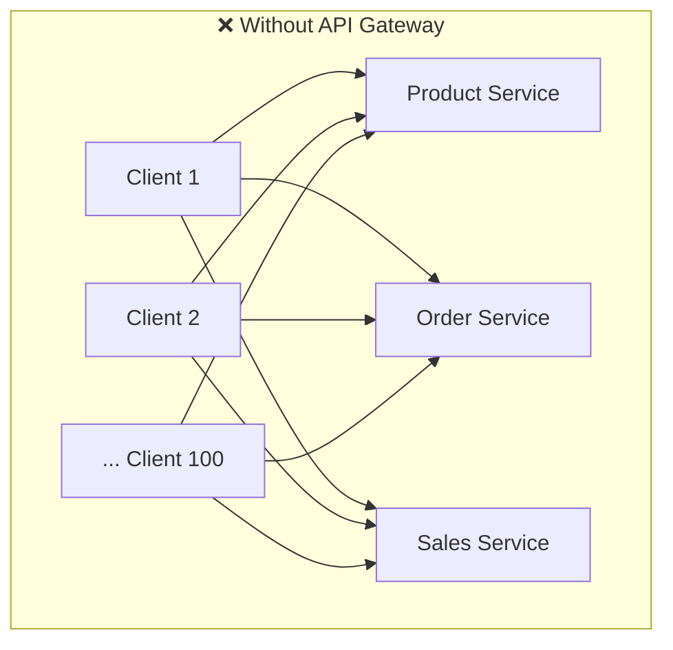
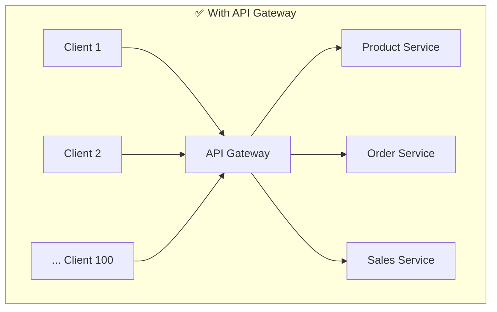
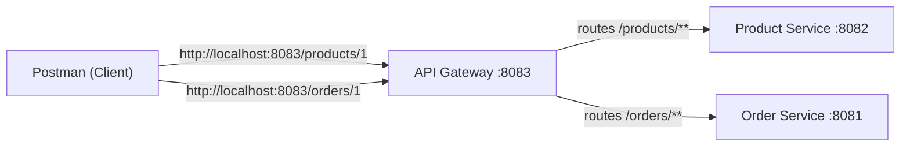
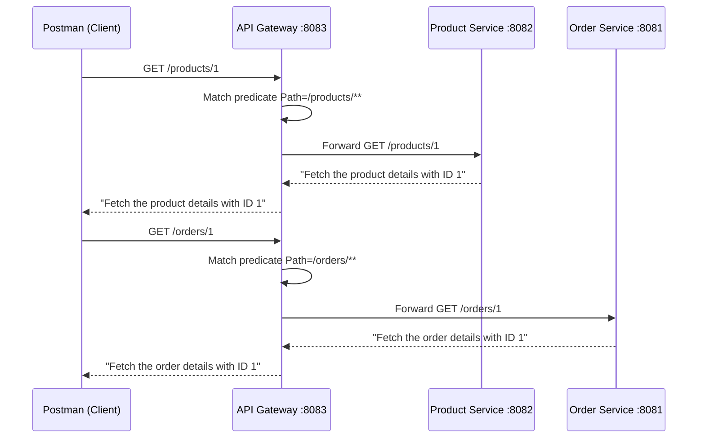
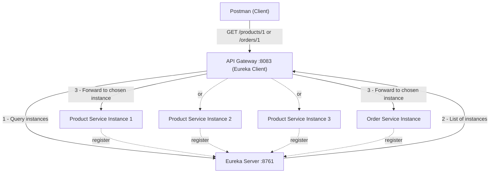
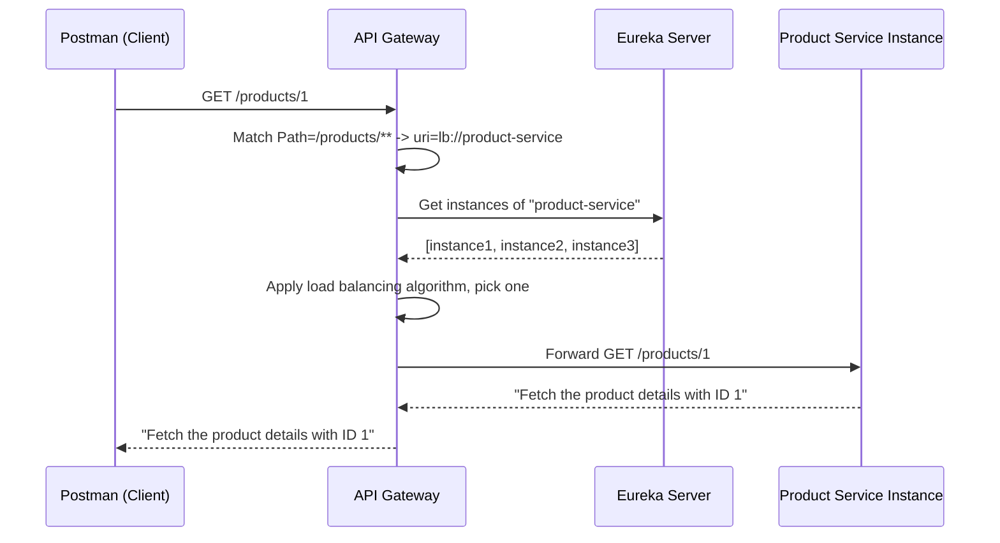

# 📌 API Gateway in Microservices

---

## Overview

An **API Gateway** is a server that acts as a **single entry point** for all client requests destined for a system built out of microservices. Instead of clients calling each microservice directly, every client request is routed **through** the API Gateway, which then forwards ("routes") the request to the correct backend microservice.

In a real-world, product-based company there is typically:

- **Many clients** — web apps, mobile apps, third-party integrations, internal tools (potentially hundreds of distinct client applications).
- **Many microservices** — e.g., `invoice-service`, `order-service`, `sales-service`, `product-service`, `payment-service`, and so on (large companies can have hundreds of microservices).

Without an API Gateway, every one of those clients would need to know the host and port of every microservice it wants to talk to, and would need to update that information whenever a microservice's location, name, or boundaries changed.

The API Gateway sits **logically between** the clients and the microservices:

```
Client(s)  --->  API Gateway  --->  Microservices (Product, Order, Sales, Invoice, ...)
```

All traffic passes through this one component, which is why it is called a **single entry point**.

---

## Why This Concept Exists

The API Gateway exists to solve several real, painful problems that show up once a system grows beyond a handful of services:

1. **Decoupling clients from service topology.** If clients called microservices directly, every client would need to hard-code the host/port (or service name) of every microservice. As soon as microservices are added, removed, merged, or split, *every single client* would need to be updated. In an organization with 100 clients, that is 100 places to change for one internal reorganization — a huge, risky, and slow operation.
2. **Centralizing cross-cutting concerns.** Many concerns are not specific to any one microservice's business logic but apply to *every* incoming request: authentication, rate limiting, logging, monitoring, and resilience (circuit breaking/retries). Implementing these individually inside every microservice causes **code duplication** and inconsistency. The Gateway lets you implement these once, at the front door.
3. **Flexibility to evolve the backend.** Microservices are not static. A single microservice might later be split into two smaller ones, or two microservices might be merged into one. If clients talk to the Gateway only, this kind of internal restructuring requires updating **just the Gateway's routing configuration** — not every client application.
4. **Load balancing across multiple instances.** In production, a microservice is rarely a single instance — it usually runs as multiple replicas for scalability and fault-tolerance. The Gateway (in cooperation with service discovery) can distribute incoming traffic across these instances.

> [!NOTE]
> The core theme is: **push the decision of "who owns the client-facing contract" onto one component (the Gateway) instead of onto every client.** This lets the internal microservice landscape evolve freely.

---

## Definition

**API Gateway**: A server/component in a microservices architecture that receives all external client requests, and — based on configured routing rules (predicates) — forwards ("routes") each request to the appropriate downstream microservice, while optionally applying cross-cutting concerns such as authentication, rate limiting, load balancing, request/response transformation, monitoring, logging, and resilience patterns (circuit breaker, retry) before/after doing so.

---

## Real-world Analogy

Think of the API Gateway like the **reception desk / switchboard** of a large corporate office building:

- Visitors (clients) don't wander the building looking for the right department (microservice) themselves.
- They arrive at the reception desk (API Gateway), state what they need ("I need Invoicing", "I need Sales"), and the receptionist directs them to the right department/floor.
- The receptionist can also check ID at the door (authentication), stop too many people from entering at once (rate limiting), log who came in and when (monitoring/logging), and redirect people to another available staff member if one is busy (load balancing).
- If the company reorganizes — merges the Sales and Order departments into one — visitors don't need to know that. They still ask the receptionist, and only the receptionist's directory needs updating.

---

## Internal Working

At a conceptual level, when a request arrives at the API Gateway, the following flow occurs:

1. **Request reception** — The Gateway receives an incoming HTTP request from a client (e.g., a `GET /products/1` call).
2. **Predicate matching (routing rule evaluation)** — The Gateway evaluates its configured routes. Each route has one or more **predicates** (conditions), such as path matching (`/products/**`) or HTTP method matching (`GET`, `POST`, etc.). The Gateway checks each configured route in order and finds the one whose predicates match the incoming request.
3. **(Optional) Cross-cutting logic** — Before or during routing, the Gateway can apply authentication checks (e.g., validating a JWT), rate limiting, and request transformation.
4. **Destination resolution:**
   - **Static/hardcoded mode:** The route's URI directly specifies a host and port (e.g., `http://localhost:8082`), and the request is forwarded there as-is.
   - **Service-discovery + load-balanced mode:** Instead of a hardcoded host/port, the route's URI references a **logical service name** registered with a service registry (e.g., Eureka). The Gateway asks the service discovery server for the list of all currently registered instances of that service, then applies a **client-side load balancing algorithm** (via Spring Cloud Load Balancer) to pick one specific instance, and forwards the request there.
5. **Forwarding** — The request is forwarded to the resolved microservice instance.
6. **Response handling** — The microservice's response travels back through the Gateway, which can optionally transform it before returning it to the original client.

> [!TIP]
> The Gateway does **not** contain business logic for Products, Orders, etc. It only contains **routing and cross-cutting logic**. The actual business logic (e.g., "fetch product details by ID") lives inside the respective microservices.

### Why Service Discovery Is Needed for Load Balancing

If a microservice has multiple running instances (e.g., `product-service` instance 1, instance 2, instance 3), the Gateway cannot hardcode a single host/port — that would only ever hit one instance. Instead:

- Each microservice instance registers itself with a **service discovery server** (in this lecture, **Eureka**) as a **Eureka client**, so the registry always has an up-to-date list of "who is alive and where."
- The Gateway (also a Eureka client) asks the registry for the current list of instances of a given service name.
- The Gateway then uses **Spring Cloud Load Balancer** — the same client-side load balancing framework used by any generic Eureka client — to pick one instance from that list using a load-balancing algorithm.

> [!IMPORTANT]
> This means the API Gateway's internal load-balancing mechanism is **not a new/separate technology** — it reuses the same client-side load balancer and service discovery mechanisms that any Eureka client uses. If you understand client-side load balancing and service discovery in general, you already understand how the Gateway load-balances.

---

## Benefits of an API Gateway (Feature Summary)

| Benefit | What It Does |
|---|---|
| **Routing** | Forwards each incoming request to the correct backend microservice based on rules like URL path. |
| **Load Balancing** | Distributes requests across multiple instances of the same microservice. |
| **Authentication** | Centralizes identity/JWT verification at the entry point instead of duplicating it in every microservice. |
| **Rate Limiting** | Restricts how many requests are allowed through in a given time window, protecting backend services from being flooded. |
| **Resilience (Circuit Breaker / Retry)** | Detects failing downstream services and can short-circuit calls to them, or automatically retry failed calls. |
| **Request/Response Transformation** | Can modify the incoming request or the outgoing response before passing it along. |
| **Monitoring & Logging** | Provides a centralized place to log and monitor all traffic flowing through the system. |

> [!NOTE]
> This lecture (the "first basic part") focuses on **Routing** and **Load Balancing**. Authentication, rate limiting, and resilience (circuit breaker/retry) are explicitly deferred to a follow-up part of the series.

---

## Problem Without an API Gateway (Direct Client-to-Microservice Communication)

**Scenario:** Clients call microservices directly, with no Gateway in between.

- Every client must know and maintain the host/port of every microservice it needs (Product, Order, Sales, Invoice, etc.).
- If the backend topology changes — e.g., the **Order microservice is merged into the Sales microservice** — then **every single client** (potentially hundreds of them) must update its routing/configuration to point requests that used to go to "Order" toward the new merged "Order+Sales" service instead.
- Because this update has to ripple out to every client, **the organizational decision to merge or split microservices becomes very risky and costly** — teams become reluctant to refactor their service boundaries even when it would be technically beneficial, purely because of the blast radius on client applications.

**With an API Gateway in place:**

- Clients only ever talk to the API Gateway's single, stable address.
- If Order and Sales microservices merge, **only the API Gateway's routing configuration needs to change** (i.e., update the route that used to point at the Order service to now point at the merged service).
- Clients are completely unaffected and require zero changes.





> [!IMPORTANT]
> Only **one** application (the API Gateway) needs to change when microservices are added, removed, split, or merged — not hundreds of client applications. This is the single biggest architectural win an API Gateway provides.

---

## Building Blocks Used in This Implementation

The lecture walks through building a small, complete example system consisting of:

1. **`product-service`** — a simple Spring Boot microservice exposing `GET /products/{id}`, running on port **8082**.
2. **`order-service`** — a simple Spring Boot microservice exposing `GET /orders/{id}`, running on port **8081**.
3. **`api-gateway`** — a Spring Cloud Gateway application, running on port **8083**, configured with routing rules that forward:
   - Any request starting with `/products` → `product-service`
   - Any request starting with `/orders` → `order-service`
4. **Eureka Server** (service discovery) — running on port **8761**, used later so the Gateway can perform load balancing across multiple instances of `product-service` / `order-service`.



---

## Setting Up the Product Microservice

### Overview

A minimal Spring Boot application that exposes one REST endpoint to fetch product details by ID.

### Steps

1. Go to **Spring Initializr**.
2. Choose **Java**, a recent version (Java 17 or Java 21).
3. Add the **Spring Web** dependency (a normal web application — no special gateway dependency needed here).
4. Create a REST controller exposing: `GET /products/{id}`.
5. The controller simply returns something like *"fetch the product details with ID {id}"*.
6. Configure the application to run on **port 8082** (via `application.properties`, using `server.port=8082`).

### Code Example (Beginner Level)

```java
@RestController
@RequestMapping("/products")
public class ProductController {

    @GetMapping("/{id}")
    public String getProductById(@PathVariable String id) {
        return "Fetch the product details with ID " + id;
    }
}
```

```properties
# application.properties
server.port=8082
```

#### Line-by-Line Explanation

- `@RestController` — A Spring stereotype annotation that marks this class as a controller whose method return values are written directly into the HTTP response body (as opposed to being resolved to a view template). It is a combination of `@Controller` + `@ResponseBody`.
- `@RequestMapping("/products")` — Declares the base path for all endpoints inside this controller. Every method's mapping is appended to `/products`.
- `public class ProductController` — The controller class itself; a plain Java class enhanced by Spring annotations.
- `@GetMapping("/{id}")` — Maps HTTP `GET` requests at `/products/{id}` to the method below it. `{id}` is a **path variable placeholder**.
- `public String getProductById(@PathVariable String id)` — The handler method. `@PathVariable` tells Spring to extract the value in the URL's `{id}` segment and bind it to the `id` parameter.
- `return "Fetch the product details with ID " + id;` — Since the class is `@RestController`, this `String` is written directly as the HTTP response body (as plain text).
- `server.port=8082` — Configuration property telling the embedded servlet container (Tomcat, by default) to listen on port 8082 instead of the default 8080.

#### Output

Calling `GET http://localhost:8082/products/1` directly returns:

```
Fetch the product details with ID 1
```

---

## Setting Up the Order Microservice

Structurally identical to the Product microservice:

1. New Spring Boot project via Spring Initializr, with **Spring Web** dependency.
2. Controller exposing `GET /orders/{id}`.
3. Returns something like *"fetch the order details with ID {id}"*.
4. Runs on **port 8081**.

### Code Example

```java
@RestController
@RequestMapping("/orders")
public class OrderController {

    @GetMapping("/{id}")
    public String getOrderById(@PathVariable String id) {
        return "Fetch the order details with ID " + id;
    }
}
```

```properties
# application.properties
server.port=8081
```

#### Output

Calling `GET http://localhost:8081/orders/1` directly returns:

```
Fetch the order details with ID 1
```

---

## Setting Up the API Gateway (Static/Hardcoded Routing)

### Steps

1. Go to **Spring Initializr**.
2. Choose **Java**, **Maven**, name it e.g. `api-gateway`, Java 17.
3. Add the **Reactive Gateway** dependency. This pulls in `spring-cloud-starter-gateway` into `pom.xml`.
4. Configure the Gateway to run on **port 8083**.
5. Define routing rules in `application.properties` — one route per downstream microservice.

> [!NOTE]
> Spring Cloud Gateway is built on a **reactive** (non-blocking) foundation, which is why the Spring Initializr dependency is called "Reactive Gateway."

### Syntax — Route Configuration Structure

Spring Cloud Gateway routes are configured as an **indexed array** of route definitions:

```properties
spring.cloud.gateway.routes[0].id=product-service
spring.cloud.gateway.routes[0].uri=http://localhost:8082
spring.cloud.gateway.routes[0].predicates[0]=Path=/products/**

spring.cloud.gateway.routes[1].id=order-service
spring.cloud.gateway.routes[1].uri=http://localhost:8081
spring.cloud.gateway.routes[1].predicates[0]=Path=/orders/**
```

### Syntax Breakdown

| Property | Meaning |
|---|---|
| `spring.cloud.gateway.routes[N]` | The Nth route definition in an array of routes. There can be as many as you need — one per microservice, or more if a microservice needs multiple distinct routing rules. |
| `routes[N].id` | A unique, arbitrary identifier for this route (e.g., `product-service`). Used only for identification purposes; you can name it anything. |
| `routes[N].uri` | The destination this route forwards matching requests to. In this hardcoded setup, it is a literal `host:port` (e.g., `http://localhost:8082`). |
| `routes[N].predicates[M]` | The Mth **predicate** (matching condition) for this route. Predicates function like filters/conditions that must be satisfied for this route to be selected. There can be multiple predicates per route (path, method, header, etc.). |
| `Path=/products/**` | A predicate that matches any request whose path starts with `/products` (the `**` wildcard means "any number of further path segments"). |
| `Method=GET,POST` | (Optional additional predicate) Restricts matching to only `GET` and `POST` HTTP methods. |

> [!TIP]
> You can stack multiple predicates on the same route. For example, adding both a `Path` predicate and a `Method` predicate means a request must satisfy **both** conditions (path starts with `/products` **and** method is GET or POST) for the route to match. In the lecture's actual working example, however, **only the Path predicate is used** — meaning any HTTP method (GET, POST, PUT, DELETE) hitting `/products/**` is forwarded, since no method restriction was configured.

> [!NOTE]
> Common predicate types include **Path** and **Method**; there are a handful of others (e.g., header-based predicates) supported by Spring Cloud Gateway, but **Path is by far the most commonly used**, and **Method is used comparatively rarely** in practice.

### Full Example — `application.properties` for the Gateway

```properties
server.port=8083

# Route 0: Product Service
spring.cloud.gateway.routes[0].id=product-service
spring.cloud.gateway.routes[0].uri=http://localhost:8082
spring.cloud.gateway.routes[0].predicates[0]=Path=/products/**

# Route 1: Order Service
spring.cloud.gateway.routes[1].id=order-service
spring.cloud.gateway.routes[1].uri=http://localhost:8081
spring.cloud.gateway.routes[1].predicates[0]=Path=/orders/**
```

#### Line-by-Line Explanation

- `server.port=8083` — The Gateway itself listens on port 8083; this is the single address clients will call.
- `routes[0].id=product-service` — Names the first route "product-service" (purely descriptive/unique identifier).
- `routes[0].uri=http://localhost:8082` — Any request matching this route's predicates is forwarded to `http://localhost:8082` (where the Product microservice is running).
- `routes[0].predicates[0]=Path=/products/**` — This route matches when the incoming request path begins with `/products`.
- `routes[1].*` — The mirrored configuration for the Order microservice, pointing to port 8081 and matching `/orders/**`.

### Step-by-Step Execution (Runtime Flow)

1. Start all three applications: Product Service (8082), Order Service (8081), API Gateway (8083).
2. From Postman, call `GET http://localhost:8083/products/1` (note: calling the **Gateway's** port, not the Product service's port directly).
3. The Gateway receives the request and checks its configured routes in order.
4. Route 0's predicate `Path=/products/**` matches `/products/1`, so the Gateway selects Route 0.
5. The Gateway forwards the request to `http://localhost:8082/products/1`.
6. The Product microservice's controller handles it and returns `"Fetch the product details with ID 1"`.
7. The Gateway relays this response back to Postman.
8. Similarly, calling `GET http://localhost:8083/orders/1` matches Route 1 (`Path=/orders/**`) and is forwarded to `http://localhost:8081/orders/1`, returning `"Fetch the order details with ID 1"`.

### Output

```
GET http://localhost:8083/products/1
→ Fetch the product details with ID 1

GET http://localhost:8083/orders/1
→ Fetch the order details with ID 1
```

### Sequence Diagram



> [!WARNING]
> **Limitation of this setup:** the Gateway's `uri` for each route is a **hardcoded** `host:port`. This works only when there is exactly **one instance** of each microservice. It cannot handle multiple running instances of the same service, and it cannot load balance. This limitation is addressed in the next section.

---

## Adding Load Balancing via Service Discovery (Eureka)

### Overview

In production, a microservice is rarely a single instance. To make the Gateway capable of **load balancing across multiple instances**, it must first know *which instances exist and where* — this is the job of **service discovery**.

> [!NOTE]
> This section assumes familiarity with **Service Discovery** and **Client-Side Load Balancing** concepts, since the API Gateway's internal load-balancing mechanism directly reuses those same mechanisms (rather than introducing a new one).

### Why This Concept Exists (Load Balancing Piece)

If `product-service` has 3 running instances (for scalability/fault tolerance), and the Gateway's route `uri` is hardcoded to one host:port, then:

- All traffic always goes to that one instance.
- The other instances sit idle, defeating the purpose of running multiple instances.
- There is no automatic failover if that one hardcoded instance goes down.

The fix: instead of hardcoding a host:port, register every instance with a **service registry** (Eureka in this lecture), and have the Gateway ask that registry, at request time, "give me the current list of instances for `product-service`" — then apply a **load-balancing algorithm** to choose one.

### Internal Working

1. **Eureka Server** is started as the central service registry (running on port 8761 in this lecture).
2. Each microservice (Product, Order) is configured as a **Eureka Client**:
   - Add the Eureka client dependency.
   - In `application.properties`, configure the Eureka server's URL so the microservice knows where to register itself.
   - On startup, the microservice instance **registers itself** with Eureka under a **service name** (e.g., `product-service`, `order-service`).
3. The **API Gateway** is *also* configured as a Eureka Client (so it can query the registry).
4. In the Gateway's route configuration, instead of a hardcoded `http://localhost:8082`, the `uri` becomes:

   ```
   lb://product-service
   ```

   - `lb://` stands for **load-balanced** — it's a special URI scheme recognized by Spring Cloud Gateway that tells it: "Don't treat this as a literal address; resolve it through service discovery + client-side load balancing instead."
   - `product-service` here is the **logical service name** the Product microservice registered itself under with Eureka — **not** a literal host/port.

5. At request time, the Gateway:
   - Recognizes the `lb://` scheme.
   - Asks the Eureka server: "What are the currently registered, healthy instances of `product-service`?"
   - Applies **Spring Cloud Load Balancer**'s algorithm to pick exactly one instance from that list.
   - Forwards the request to that specific instance's actual host and port.

> [!IMPORTANT]
> The Gateway's load balancing is powered by **the exact same Spring Cloud Load Balancer framework** used by any generic Eureka client doing client-side load balancing. There is no separate/special load-balancing engine built specifically for the Gateway — it reuses the existing client-side load balancer internals.

### Updated Configuration Files

**Product Service — `application.properties`:**

```properties
server.port=8082
spring.application.name=product-service
eureka.client.service-url.defaultZone=http://localhost:8761/eureka/
```

**Order Service — `application.properties`:**

```properties
server.port=8081
spring.application.name=order-service
eureka.client.service-url.defaultZone=http://localhost:8761/eureka/
```

**Eureka Server — `application.properties`:**

```properties
server.port=8761
eureka.client.register-with-eureka=false
eureka.client.fetch-registry=false
```

**API Gateway — `application.properties` (updated for load balancing):**

```properties
server.port=8083
spring.application.name=api-gateway
eureka.client.service-url.defaultZone=http://localhost:8761/eureka/

# Route 0: Product Service (now load-balanced)
spring.cloud.gateway.routes[0].id=product-service
spring.cloud.gateway.routes[0].uri=lb://product-service
spring.cloud.gateway.routes[0].predicates[0]=Path=/products/**

# Route 1: Order Service (now load-balanced)
spring.cloud.gateway.routes[1].id=order-service
spring.cloud.gateway.routes[1].uri=lb://order-service
spring.cloud.gateway.routes[1].predicates[0]=Path=/orders/**
```

#### Syntax Breakdown

- `spring.application.name=product-service` — Sets the **logical service name** this application registers itself under with Eureka. This is the name the Gateway will later reference via `lb://product-service`.
- `eureka.client.service-url.defaultZone=http://localhost:8761/eureka/` — Tells this application (as a Eureka client) where the Eureka server lives, so it knows where to register/query.
- `eureka.client.register-with-eureka=false` (on the Eureka **server**) — The Eureka server itself does not register with another Eureka server (it isn't a client of itself, so this is disabled).
- `eureka.client.fetch-registry=false` (on the Eureka **server**) — The Eureka server does not need to fetch a registry from elsewhere, since it *is* the registry.
- `uri=lb://product-service` — The `lb://` scheme signals Spring Cloud Gateway to use **service-discovery-backed, load-balanced routing** instead of a static address, resolving `product-service` to one of its live registered instances at request time.

> [!CAUTION]
> The `eureka.client.register-with-eureka=false` and `eureka.client.fetch-registry=false` flags are specific to the Eureka **server's own** configuration and were explained in more depth in a prior video on Service Discovery; this guide summarizes their purpose but assumes that context for full depth.

### Step-by-Step Execution (With Load Balancing Enabled)

1. Start the **Eureka Server** first (port 8761).
2. Start **Product Service** and **Order Service** — on startup, each registers itself with Eureka under its `spring.application.name`.
3. Start the **API Gateway** — it also registers with Eureka (as it is configured as a Eureka client), and its routes now reference `lb://product-service` and `lb://order-service`.
4. A client calls `GET http://localhost:8083/products/1`.
5. The Gateway matches the `Path=/products/**` predicate on Route 0.
6. The Gateway sees the route's `uri` is `lb://product-service` and triggers load-balanced resolution:
   a. Query Eureka for all live instances registered as `product-service`.
   b. Apply the load balancing algorithm (via Spring Cloud Load Balancer) to select one instance.
   c. Forward the request to that instance's actual `host:port`.
7. The chosen Product Service instance handles the request and returns the response.
8. The response flows back through the Gateway to the client.

### Architecture Diagram



### Sequence Diagram (Load-Balanced Call)



---

## Key Observations

- The API Gateway itself contains **no business logic** — only routing and cross-cutting concerns.
- **Only one place** (the Gateway's route config) needs updating when microservices are added, merged, or split — not every client.
- Routes are defined as an **indexed array**; each route has an `id`, a `uri`, and one or more `predicates`.
- `Path` is the **most commonly used** predicate; `Method` is used far less frequently; a request must satisfy **all** configured predicates on a route for it to match.
- Static routing (`http://host:port`) only works for a **single instance** per service.
- Load-balanced routing uses the `lb://service-name` scheme, which requires the target service to be registered with a service discovery server (Eureka) and requires the Gateway to also be a Eureka client.
- The Gateway's client-side load balancing reuses **the same underlying framework** (Spring Cloud Load Balancer) used elsewhere for generic client-side load balancing — there is nothing gateway-specific about the load-balancing algorithm itself.
- Authentication, rate limiting, resilience (circuit breaker/retry), and request/response transformation are **not covered** in this specific lecture — they are deferred to a follow-up part.

---

## Common Mistakes

> [!WARNING]
> **Mistake 1: Calling the microservice directly during testing, then being confused when Gateway routing "isn't working."**
> If you accidentally call `http://localhost:8082/products/1` (the Product service's own port) instead of `http://localhost:8083/products/1` (the Gateway's port), you bypass the Gateway entirely. This can mask configuration errors in the Gateway because the direct call still "works," giving a false sense that the Gateway config is correct.

> [!WARNING]
> **Mistake 2: Hardcoding `http://host:port` in the route `uri` when multiple instances exist.**
> If a microservice has multiple running instances but the Gateway route still uses a literal `http://localhost:8082`-style URI, all traffic will pile onto that single hardcoded instance, and the other instances will never receive traffic. The fix is switching to `lb://service-name` once service discovery is in place.

> [!WARNING]
> **Mistake 3: Forgetting to register the Gateway itself as a Eureka client.**
> The Gateway needs to be a Eureka client too — it must query the registry to know the live instances of a service. If the Gateway isn't configured with the Eureka client dependency and the Eureka server URL, `lb://` resolution won't be able to find any instances.

> [!WARNING]
> **Mistake 4: Forgetting to set `spring.application.name`.**
> The name a microservice registers under with Eureka comes from `spring.application.name`. If this is missing or misconfigured, the Gateway's `lb://` route referencing that service name will not find matching instances.

---

## Best Practices

- Give each route a clear, unique `id` that reflects the microservice it targets (e.g., `product-service`, `order-service`) for readability and easier debugging.
- Prefer `lb://service-name` over hardcoded `http://host:port` URIs as soon as service discovery is available, even if you currently run only one instance — it future-proofs the setup for scaling out.
- Keep the number of predicates per route minimal and purposeful; only add a `Method` predicate if you genuinely need to restrict which HTTP verbs are allowed through that route.
- Centralize cross-cutting concerns (auth, rate limiting, logging) at the Gateway layer rather than duplicating them inside every microservice.
- Treat the Gateway's routing configuration as the **single source of truth** for "which client-facing paths map to which backend service" — avoid letting any client maintain its own separate mapping.
- Start infrastructure components in a sensible order during local development/testing: Eureka Server → individual microservices → API Gateway, so that services have a registry to register with before the Gateway starts querying it.

---

## Interview Notes

- **Q: What problem does an API Gateway solve in microservices architecture?**
  It removes the need for every client to know about, and maintain routing/configuration for, every individual microservice. It centralizes routing and cross-cutting concerns (auth, rate limiting, logging, resilience) in one place, and isolates clients from backend topology changes (merges/splits of services).

- **Q: What predicates are available in Spring Cloud Gateway, and which are most common?**
  Multiple predicate types exist (Path, Method, Header, among others), but **Path** is by far the most frequently used; **Method** is used but far less commonly.

- **Q: How does the API Gateway achieve load balancing?**
  By combining **service discovery** (e.g., Eureka) with **Spring Cloud Load Balancer** — the same client-side load balancing mechanism used elsewhere. The Gateway queries the registry for live instances of a logical service name (referenced via `lb://service-name`), then picks one using the load balancing algorithm.

- **Q: What is the difference between a hardcoded route URI and a load-balanced route URI in Spring Cloud Gateway?**
  A hardcoded URI (`http://localhost:8082`) always points at exactly one fixed address and cannot adapt to multiple instances. A load-balanced URI (`lb://service-name`) is resolved dynamically at request time by querying service discovery and applying a load-balancing algorithm across all currently registered instances.

- **Q: Why is it risky, without an API Gateway, for an organization to merge or split microservices?**
  Because every client that talks directly to those microservices would need to update its own routing/configuration to reflect the change — this blast radius across potentially hundreds of clients makes such backend restructuring slow and risky. An API Gateway confines that update to a single component.

- **Tricky point:** The Gateway's routing config uses an **array-like indexed structure** (`routes[0]`, `routes[1]`, ...; `predicates[0]`, `predicates[1]`, ...) in `application.properties` — interviewers may probe whether you understand that predicates within a single route are combined with **AND** logic (all must match), not OR logic.

---

## Related Concepts

- **Service Discovery** (e.g., Netflix Eureka) — a registry where service instances register themselves and can be looked up by logical name.
- **Client-Side Load Balancing** (Spring Cloud Load Balancer) — the algorithmic selection of one instance from a set of registered instances, performed on the calling side rather than by a separate dedicated load balancer.
- **Circuit Breaker / Retry (Resilience patterns)** — mentioned as Gateway capabilities but deferred to a future lecture.
- **JWT-based Authentication** — mentioned as a Gateway capability but deferred to a future lecture.
- **Rate Limiting** — mentioned as a Gateway capability but deferred to a future lecture.
- **Request/Response Transformation** — mentioned as a Gateway capability but not implemented in this lecture.
- **Monitoring and Centralized Logging** — mentioned as a Gateway capability but not implemented in this lecture.

---

## Practice Questions

### Easy

1. What is the main purpose of an API Gateway in a microservices architecture?
2. In Spring Cloud Gateway configuration, what do the `id`, `uri`, and `predicates` fields of a route represent?
3. Which predicate type is most commonly used in Spring Cloud Gateway route configuration?

### Medium

4. Explain what happens, step by step, when a client calls `GET http://localhost:8083/products/1` given the static (hardcoded URI) Gateway configuration shown in this guide.
5. Why can't a hardcoded `http://host:port` route URI support load balancing across multiple service instances?
6. What two dependencies/pieces of configuration must the API Gateway have in order to perform `lb://`-based load-balanced routing?

### Hard

7. Design (in words or as route configuration snippets) how you would add a third route for a new `sales-service` running with multiple instances, registered with Eureka, to the existing Gateway configuration in this guide.
8. Explain, internally, the full request lifecycle for a load-balanced route from the moment a client sends a request to the moment a response is returned — including the role of Eureka and Spring Cloud Load Balancer.
9. A company decides to split `order-service` into `order-service` and `refund-service`. Describe, referencing the concepts in this guide, exactly what changes are needed (a) with an API Gateway in place vs (b) without one.

---

## Summary

- An **API Gateway** provides a **single entry point** through which all client requests to a microservices system pass.
- It solves the problem of clients needing to know about, and update configuration for, every individual microservice — instead, only the Gateway's routing config changes when the backend topology changes (merges, splits, additions).
- Key benefits: **routing**, **load balancing**, **authentication**, **rate limiting**, **resilience (circuit breaker/retry)**, **request/response transformation**, and **monitoring/logging**. This lecture implements **routing** and **load balancing** only.
- Routes are configured as an indexed array (`spring.cloud.gateway.routes[N]`), each with an `id`, a `uri` (destination), and one or more `predicates` (matching conditions, most commonly **Path**, less commonly **Method**).
- A **static/hardcoded** route URI (`http://host:port`) only supports a single fixed instance.
- A **load-balanced** route URI (`lb://service-name`) requires the target microservice(s) — and the Gateway itself — to be registered as **Eureka clients**, so the Gateway can query the registry for live instances and apply **Spring Cloud Load Balancer**'s algorithm to pick one at request time.
- The Gateway's load balancing mechanism is **not a separate system** — it reuses the same client-side load balancing framework used elsewhere in the ecosystem.
- Authentication, rate limiting, resilience patterns, and transformation/logging are planned for a follow-up lecture.
