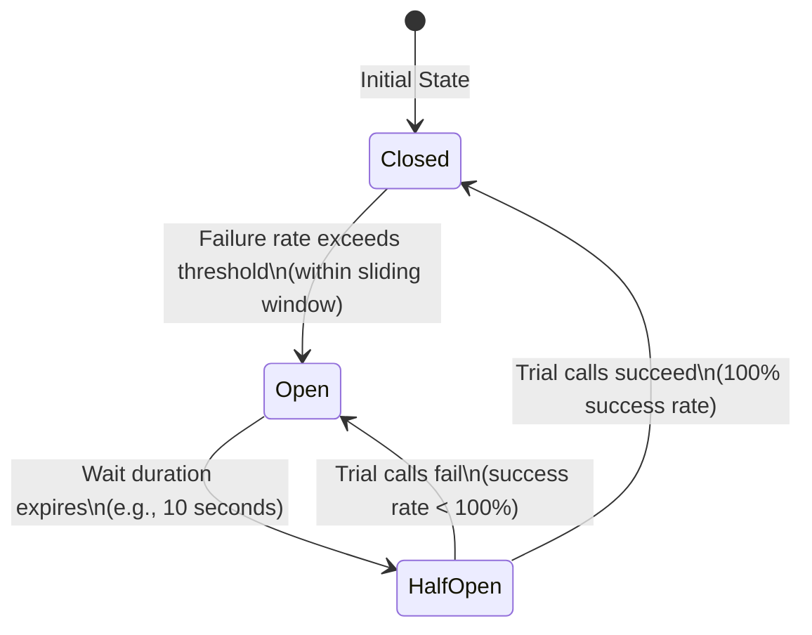
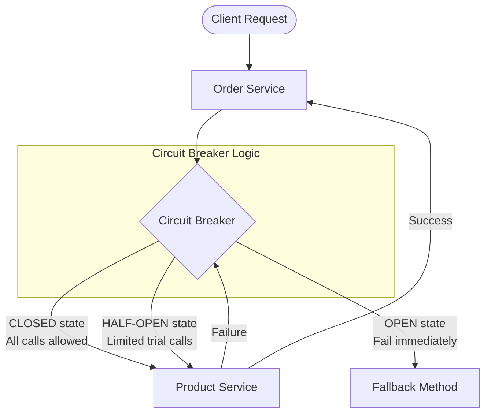
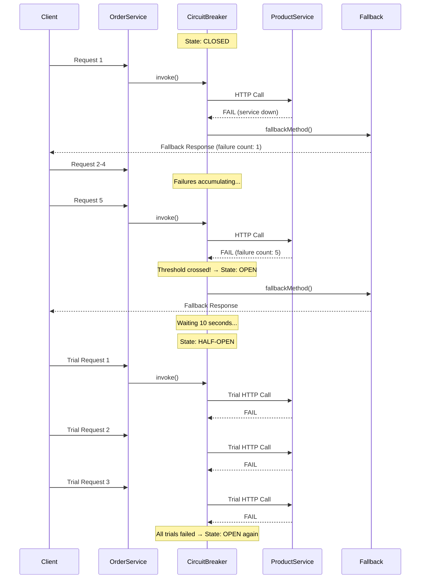
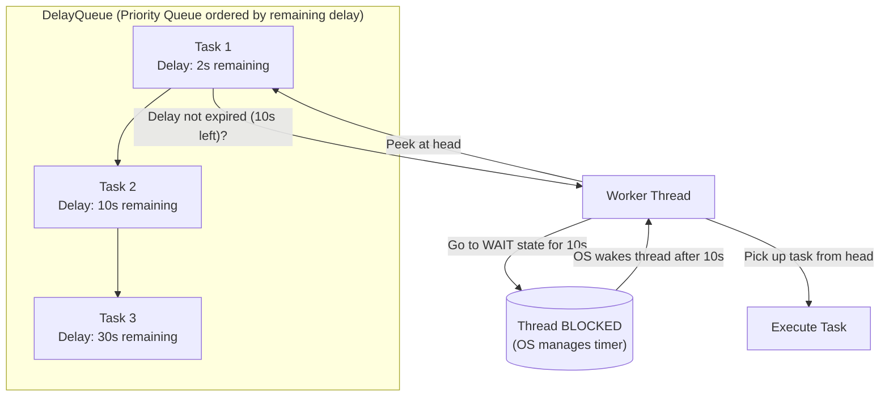
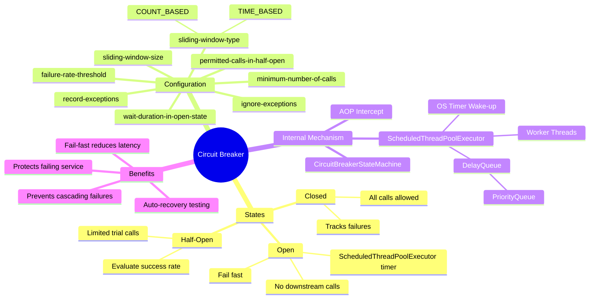

# 📌 Circuit Breaker Pattern — Fault-Tolerant Microservices

> [!IMPORTANT]
> This is part of the **Fault-Tolerant Microservices** series, which also covers Rate Limiter, Bulkhead, and Retry patterns. The Circuit Breaker pattern builds upon these concepts and is one of the most critical resilience patterns in distributed systems.

---

## Overview

The **Circuit Breaker** pattern is a design pattern used in microservices architecture to prevent an application from making repeated calls to a downstream service that is likely to fail. It acts as a protective mechanism between services, monitoring failures and automatically stopping calls to a failing service to allow it time to recover.

The name "Circuit Breaker" comes from electrical engineering — just like a physical circuit breaker in your home that trips when there is a power surge to protect your appliances, the software circuit breaker "trips" (opens) when too many failures are detected, protecting the system from cascading failures.

---

## Why This Concept Exists

### The Problem

Consider a microservices architecture where an **Order Service** calls a **Product Service**:

```
Order Service ──────────────▶ Product Service
```

Now assume **Product Service goes down**. Every call from Order Service to Product Service will fail. Two major problems arise:

1. **Unnecessary load on the failing service:** Every failed call adds load to Product Service. Since it is already struggling, this extra load can delay its recovery. We are essentially kicking a service while it is down.

2. **Resource waste in Order Service:** Each call to the (unavailable) Product Service:
   - **Blocks a thread** while waiting for a response or timeout
   - **Increases latency** — Order Service must wait until the connection times out before it can send an error to the client
   - If there are thousands of concurrent calls, thousands of threads are blocked and wasted

### The Solution

The Circuit Breaker solves this by giving Order Service **awareness** of the downstream service's health. When too many failures are detected, it stops further calls entirely and fails them immediately — without waiting. After some time, it tests whether the downstream service has recovered and, if so, resumes normal operation.

---

## Definition

> **Circuit Breaker** is a fault-tolerance pattern that wraps calls to external services and monitors failures. When the failure rate exceeds a configured threshold, the circuit "opens" and all further calls are immediately rejected (fail-fast) without actually reaching the downstream service. After a wait period, the circuit transitions to a half-open state to test recovery, then either closes (resumes normal calls) or opens again (still failing).

---

## Real-World Analogy

Think of the **circuit breaker in your home's electrical panel**:

- **Closed (normal):** Current flows freely through the circuit. All devices work.
- **Open (tripped):** Current is blocked. No electricity flows to the circuit. This protects devices from damage.
- **Half-Open (testing):** You reset the breaker to see if the fault has been cleared. If electricity flows normally, it stays closed. If it trips again, it opens once more.

> [!NOTE]
> A common confusion: Engineers sometimes assume "circuit is closed = no calls allowed." This is **wrong**. Think like a real circuit: **closed = current flows = calls allowed**. **Open = current blocked = calls blocked.**

---

## State Diagram



---

## The Three States — Detailed Explanation

### 1. 🟢 CLOSED State (Normal Operation)

- **All calls are allowed** to the downstream service.
- The circuit breaker monitors each call, tracking successes and failures within a **sliding window**.
- If the **failure rate crosses the configured threshold**, the circuit transitions to the **Open** state.

### 2. 🔴 OPEN State (Blocking All Calls)

- **No calls are allowed** to the downstream service.
- All incoming calls are **immediately rejected** (fail-fast) — no waiting, no thread blocking.
- The fallback method is invoked for every rejected call.
- The circuit breaker **schedules a timer** (using `ScheduledThreadPoolExecutor`) for the configured wait duration (e.g., 10 seconds).
- After the wait duration expires, it automatically transitions to the **Half-Open** state.

### 3. 🟡 HALF-OPEN State (Testing Recovery)

- A **limited number of trial calls** are allowed to the downstream service (e.g., 3 calls).
- The circuit breaker tracks the success rate of these trial calls.
- **If 100% of trial calls succeed:** Transition back to **Closed** state.
- **If any trial call fails (success rate < 100%):** Transition back to **Open** state and wait again.

---

## Architecture Diagram



---

## Sequence Diagram — Full Circuit Breaker Lifecycle



---

## Implementation with Resilience4j

### Dependency (pom.xml)

The Circuit Breaker in Spring Boot is provided by the **Resilience4j** library. No separate dependency is required — it is included in the Resilience4j starter:

```xml
<dependency>
    <groupId>io.github.resilience4j</groupId>
    <artifactId>resilience4j-spring-boot3</artifactId>
</dependency>

<!-- Also required for AOP support -->
<dependency>
    <groupId>org.springframework.boot</groupId>
    <artifactId>spring-boot-starter-aop</artifactId>
</dependency>
```

> [!NOTE]
> If you have already added Resilience4j for Rate Limiter, Bulkhead, or Retry — **no additional dependency is needed**. The circuit breaker is already included.

---

### The `@CircuitBreaker` Annotation

```java
@CircuitBreaker(name = "productService", fallbackMethod = "productServiceFallback")
public String invokeProductAPI(String productId) {
    // Call to downstream Product Service via Feign Client
    return productClient.getProductById(productId);
}

public String productServiceFallback(String productId, Throwable throwable) {
    // This method is invoked for EVERY failed attempt
    System.out.println("Fallback triggered for productId: " + productId);
    System.out.println("Reason: " + throwable.getMessage());
    return "Product service is currently unavailable. Please try later.";
}
```

**Line-by-Line Explanation:**

| Line | Explanation |
|------|-------------|
| `@CircuitBreaker(name = "productService", ...)` | Declares a circuit breaker with the name `productService`. This name must match the configuration key in `application.properties`. |
| `fallbackMethod = "productServiceFallback"` | When the circuit breaker rejects a call (either because the call failed or the circuit is open), this method is invoked. |
| `invokeProductAPI(String productId)` | The protected method. Any exception thrown here is tracked by the circuit breaker. |
| `productServiceFallback(String productId, Throwable throwable)` | **Must have the same parameters as the original method**, plus a `Throwable` parameter at the end. |

> [!IMPORTANT]
> The **fallback method is called for every failure**, regardless of the circuit state. It is called:
> - When the actual call fails (circuit is CLOSED but the call throws an exception)
> - When the circuit is OPEN (call is immediately rejected without hitting downstream)
> - When trial calls fail in HALF-OPEN state

---

### Feign Client (No Change from Previous Patterns)

```java
@FeignClient(name = "product-service")  // Uses Eureka for service discovery
public interface ProductClient {
    @GetMapping("/products/{id}")
    String getProductById(@PathVariable String id);
}
```

Since Eureka is used for service discovery, no URL is hardcoded. This is the same setup used in earlier lessons on Retry and Bulkhead.

---

### Configuration — `application.properties`

```properties
# ─── Circuit Breaker Configuration ───────────────────────────────────────────

# Name matches the name in @CircuitBreaker annotation
resilience4j.circuitbreaker.instances.productService.sliding-window-type=COUNT_BASED
resilience4j.circuitbreaker.instances.productService.sliding-window-size=10
resilience4j.circuitbreaker.instances.productService.minimum-number-of-calls=5
resilience4j.circuitbreaker.instances.productService.failure-rate-threshold=50
resilience4j.circuitbreaker.instances.productService.wait-duration-in-open-state=10s
resilience4j.circuitbreaker.instances.productService.permitted-number-of-calls-in-half-open-state=3

# Optional: Control which exceptions are tracked
# resilience4j.circuitbreaker.instances.productService.record-exceptions=java.io.IOException
# resilience4j.circuitbreaker.instances.productService.ignore-exceptions=java.lang.IllegalArgumentException
```

---

## Configuration Parameters — Deep Dive

### 1. `sliding-window-type`

| Value | Meaning |
|-------|---------|
| `COUNT_BASED` | Track the last **N calls** (N = sliding-window-size). Evaluate failure rate over these N calls. |
| `TIME_BASED` | Track all calls in the last **N seconds** (N = sliding-window-size). Evaluate failure rate over this time window. |

**Example:**
- `COUNT_BASED` with size `10` → The last 10 calls are evaluated.
- `TIME_BASED` with size `10` → All calls in the last 10 seconds are evaluated.

> [!NOTE]
> Do **not** confuse this sliding window with the Rate Limiter's sliding window. They are completely different concepts.

---

### 2. `sliding-window-size`

- For `COUNT_BASED`: The number of recent calls to track (e.g., `10` = last 10 calls).
- For `TIME_BASED`: The time period in seconds (e.g., `10` = last 10 seconds).

---

### 3. `minimum-number-of-calls`

**Purpose:** Prevents false positives when the sample size is too small.

**Why it matters:**
Imagine your threshold is 50% failures. If only 2 calls have been made and 1 fails, that's 50% failure — but it would be a false alarm to open the circuit from just one failure.

With `minimum-number-of-calls=5`, the circuit breaker **will not evaluate the failure rate until at least 5 calls have been made**. This ensures the failure rate calculation is statistically meaningful.

```
Window size: 10
Minimum calls: 5
Threshold: 50%

Call 1: FAIL  → failure count = 1, minimum not reached, stay CLOSED
Call 2: FAIL  → failure count = 2, minimum not reached, stay CLOSED
Call 3: FAIL  → failure count = 3, minimum not reached, stay CLOSED
Call 4: FAIL  → failure count = 4, minimum not reached, stay CLOSED
Call 5: FAIL  → failure count = 5, minimum REACHED, evaluate now!
               → 5 failures out of 5 calls (within window of 10) = 100% failure
               → 100% > 50% threshold → OPEN circuit!
```

---

### 4. `failure-rate-threshold`

- A **percentage** (0–100).
- If the failure rate **within the sliding window** exceeds this percentage, the circuit opens.
- Example: `50` means if 50% or more of the calls in the window fail → open the circuit.

With `sliding-window-size=10` and `failure-rate-threshold=50`:
- Threshold = 50% of 10 = **5 failures out of 10 calls**
- Once 5 calls fail in any window of 10, the circuit opens.

---

### 5. `wait-duration-in-open-state`

- How long the circuit stays in **OPEN** state before transitioning to **HALF-OPEN**.
- Format: `10s`, `5s`, `30s`, etc.
- During this period, all calls are immediately rejected.
- Internally, a `ScheduledThreadPoolExecutor` is used to schedule the state transition (see Internal Working section below).

---

### 6. `permitted-number-of-calls-in-half-open-state`

- The **maximum number of test/trial calls** allowed when the circuit is in HALF-OPEN state.
- Example: `3` → Only 3 calls will be sent to the downstream service as a test.
- After these 3 calls, the circuit evaluates:
  - 100% success → transition to **CLOSED**
  - Any failure → transition back to **OPEN**

---

### 7. Exception Tracking (Optional Configuration)

By default, Resilience4j tracks **all `RuntimeException`s and `Error`s** as failures.

You can override this behavior:

```properties
# Track ONLY these exceptions as failures
resilience4j.circuitbreaker.instances.productService.record-exceptions=\
  java.io.IOException,\
  java.net.ConnectException

# Ignore these exceptions (do not count them as failures)
resilience4j.circuitbreaker.instances.productService.ignore-exceptions=\
  java.lang.IllegalArgumentException
```

| Configuration | Behavior |
|--------------|----------|
| `record-exceptions` | Only the listed exception types are counted as failures |
| `ignore-exceptions` | The listed exception types are **not** counted as failures |
| Neither specified | **All** `RuntimeException`s and `Error`s are counted as failures |

---

## Configuration Summary Table

| Property | Example Value | Description |
|----------|--------------|-------------|
| `sliding-window-type` | `COUNT_BASED` | How the window is measured (by calls or by time) |
| `sliding-window-size` | `10` | Size of the window (10 calls or 10 seconds) |
| `minimum-number-of-calls` | `5` | Minimum calls before failure rate is evaluated |
| `failure-rate-threshold` | `50` | Failure % that triggers OPEN state |
| `wait-duration-in-open-state` | `10s` | How long circuit stays OPEN before HALF-OPEN |
| `permitted-number-of-calls-in-half-open-state` | `3` | Trial calls in HALF-OPEN state |
| `record-exceptions` | `IOException` | Only count these as failures (optional) |
| `ignore-exceptions` | `IllegalArgumentException` | Ignore these exceptions (optional) |

---

## Step-by-Step Execution Walkthrough

Based on the configuration:
- `sliding-window-type=COUNT_BASED`
- `sliding-window-size=10`
- `minimum-number-of-calls=5`
- `failure-rate-threshold=50`
- `wait-duration-in-open-state=10s`
- `permitted-number-of-calls-in-half-open-state=3`

Product Service is **not started** (unavailable).

```
Call 1 → Circuit: CLOSED → Tries to reach Product Service → FAIL
         Fallback invoked. Failure count: 1. Minimum (5) not reached.

Call 2 → Circuit: CLOSED → Tries to reach Product Service → FAIL
         Fallback invoked. Failure count: 2. Minimum not reached.

Call 3 → Circuit: CLOSED → Tries to reach Product Service → FAIL
         Fallback invoked. Failure count: 3. Minimum not reached.

Call 4 → Circuit: CLOSED → Tries to reach Product Service → FAIL
         Fallback invoked. Failure count: 4. Minimum not reached.

Call 5 → Circuit: CLOSED → Tries to reach Product Service → FAIL
         Fallback invoked. Failure count: 5.
         ✅ Minimum reached! Evaluate now:
         5 failures / 5 calls in window = 100% > 50% threshold
         ⚡ Circuit transitions: CLOSED → OPEN
         ScheduledThreadPoolExecutor schedules transition to HALF-OPEN after 10s.

[Calls 6, 7, 8...] → Circuit: OPEN → Immediately rejected (no downstream call)
         Fallback invoked instantly. No thread blocking. No latency.

[After 10 seconds] ⏰
         ScheduledThreadPoolExecutor triggers: OPEN → HALF-OPEN

Trial Call 1 → Circuit: HALF-OPEN → Tries to reach Product Service → FAIL
Trial Call 2 → Circuit: HALF-OPEN → Tries to reach Product Service → FAIL
Trial Call 3 → Circuit: HALF-OPEN → Tries to reach Product Service → FAIL
         All 3 trial calls failed. Success rate = 0%.
         ⚡ Circuit transitions: HALF-OPEN → OPEN again.
         ScheduledThreadPoolExecutor schedules next HALF-OPEN after 10s.
```

---

## Internal Working — How State Transitions Work

### How Does CLOSED → OPEN Happen?

Resilience4j uses **AOP (Aspect-Oriented Programming)**. When you annotate a method with `@CircuitBreaker`, Resilience4j wraps it with an aspect (a proxy).

Every time an exception occurs, the AOP interceptor invokes the **`CircuitBreakerStateMachine`** class (internal Resilience4j class).

The logic is approximately:

```java
// Pseudocode of CircuitBreakerStateMachine
public void onError(long duration, TimeUnit durationUnit, Throwable throwable) {
    if (currentState == CLOSED) {
        boolean thresholdExceeded = checkIfThresholdExceeded();
        if (thresholdExceeded) {
            transitionToOpenState();  // CLOSED → OPEN
        }
    } else if (currentState == HALF_OPEN) {
        boolean successRateAchieved = checkSuccessRate();
        if (!successRateAchieved) {
            transitionToOpenState();  // HALF_OPEN → OPEN
        }
    }
}
```

**Every failure triggers a threshold check. If the threshold is crossed, the state changes.**

---

### How Does OPEN → HALF-OPEN Happen Automatically?

This is the most interesting internal mechanism.

When the circuit transitions to **OPEN**, Resilience4j internally does this:

```java
// Inside CircuitBreakerStateMachine - openState() method (pseudocode)
private void transitionToOpenState() {
    this.currentState = OPEN;
    
    // Schedule automatic transition to HALF-OPEN after waitDuration
    scheduledExecutor.schedule(
        () -> transitionToHalfOpenState(),   // Task: change to HALF-OPEN
        waitDurationInOpenState,              // Delay: e.g., 10 seconds
        TimeUnit.MILLISECONDS
    );
}
```

It uses a **`ScheduledThreadPoolExecutor`** to schedule the state transition. This is how a task can be executed after a specific delay without manually sleeping a thread.

---

## Internal Working — ScheduledThreadPoolExecutor

### What Is ScheduledThreadPoolExecutor?

`ScheduledThreadPoolExecutor` is a Java class that allows you to schedule tasks to run:
- After a specific **delay** (one-time)
- At a fixed **rate** or **interval** (recurring)

```java
ScheduledExecutorService executor = Executors.newScheduledThreadPool(1);

// Run task after 10 seconds
executor.schedule(
    () -> System.out.println("Transitioning to HALF-OPEN"),
    10,
    TimeUnit.SECONDS
);
```

---

### Internal Data Structure — DelayQueue

`ScheduledThreadPoolExecutor` internally uses a **`DelayQueue`** to manage scheduled tasks.



**How DelayQueue Works:**

1. **Tasks are ordered** by expiry time — the task that expires soonest is always at the **head**.
2. A **worker thread** peeks at the head to see if the task is ready.
3. If the task's delay **has not expired**, the thread goes into a **WAIT/BLOCKED state** for the remaining delay duration.
4. The **OS wakes the thread** after that duration using native timers.
5. The thread picks up the now-ready task and executes it.
6. Other worker threads handle remaining tasks in the queue similarly.

**The underlying data structure is a `PriorityQueue`**, sorted by delay (ascending — smallest delay at the head).

---

### Thread Locking in DelayQueue

When multiple worker threads are available:
- All threads attempt to peek at the head of the `DelayQueue`.
- If the task is not yet ready, **all threads go into wait state** for the same remaining duration.
- When the OS wakes the threads, only **one thread acquires the lock** and picks up the task.
- The remaining threads look at the **next item** in the queue and repeat the process.

---

## Interview Questions

### Q1: What is the Circuit Breaker pattern?

**Answer:** A resilience pattern that monitors failures to a downstream service. When failures exceed a threshold within a sliding window, the circuit "opens" and all further calls are immediately failed (fail-fast) without reaching the downstream service. After a wait period, a limited number of trial calls are made (half-open state). If they succeed, the circuit closes; otherwise, it opens again.

---

### Q2: What are the three states of a Circuit Breaker?

**Answer:**
- **Closed:** Normal operation. All calls reach the downstream service.
- **Open:** All calls are immediately rejected. No downstream calls.
- **Half-Open:** A limited number of test calls are made to check recovery.

---

### Q3: How does Resilience4j transition from OPEN to HALF-OPEN automatically?

**Answer:** It uses a `ScheduledThreadPoolExecutor` to schedule a state-transition task with a delay equal to `wait-duration-in-open-state`. When this delay expires, the executor runs the task which transitions the circuit to HALF-OPEN.

---

### Q4: How does ScheduledThreadPoolExecutor work internally?

**Answer:** It uses a `DelayQueue` (backed by a `PriorityQueue`) to store tasks sorted by their expiry time. Worker threads peek at the head — if the delay hasn't expired, the thread blocks for the remaining duration. The OS wakes the thread when the delay expires, and the thread executes the task.

---

### Q5: How would you implement a "disappearing message" feature (like WhatsApp's 24-hour view-once message)?

**Answer:** Using a `DelayQueue`. Each message is wrapped in a `Delayed` object with an expiry of 24 hours. A consumer thread monitors the queue; when a message's delay expires (i.e., it reaches the head of the queue), the consumer picks it up and deletes it. This is the same mechanism used internally by `ScheduledThreadPoolExecutor`.

---

### Q6: What is the difference between COUNT_BASED and TIME_BASED sliding windows?

| Feature | COUNT_BASED | TIME_BASED |
|---------|------------|------------|
| Window defined by | Number of calls (e.g., last 10) | Time period (e.g., last 10 seconds) |
| Call count | Fixed: always last N calls | Variable: could be 5 or 500 in 10s |
| Use case | Consistent traffic patterns | Bursty or variable traffic |

---

### Q7: What happens if the minimum-number-of-calls is too low?

**Answer:** You risk **false positives**. For example, if `minimum-number-of-calls=2` and `failure-rate-threshold=50%`, a single failure out of 2 calls (50%) would open the circuit — even though just 1 failed request could be a transient network glitch that would pass on retry.

---

### Q8: What is the role of AOP in Resilience4j's Circuit Breaker?

**Answer:** Resilience4j uses Spring AOP to intercept method calls annotated with `@CircuitBreaker`. The AOP proxy wraps the method and delegates execution through the `CircuitBreakerStateMachine`, which tracks successes and failures and manages state transitions. You do not need to write any state-management code yourself.

---

## Common Mistakes

### ❌ Mistake 1: Confusing Open/Closed State

```
"Circuit is CLOSED" → Beginners think: no calls allowed ❌
"Circuit is CLOSED" → Correct: all calls ALLOWED ✅

"Circuit is OPEN" → Beginners think: calls are open/allowed ❌
"Circuit is OPEN" → Correct: circuit is tripped, calls BLOCKED ✅
```

> [!TIP]
> Remember it as an electrical circuit: **closed = electricity flows = calls flow**. **Open = break in circuit = calls blocked**.

---

### ❌ Mistake 2: Fallback Method Signature Mismatch

```java
// ❌ Wrong — missing Throwable parameter
public String productServiceFallback(String productId) { ... }

// ✅ Correct — Throwable must be the last parameter
public String productServiceFallback(String productId, Throwable throwable) { ... }
```

---

### ❌ Mistake 3: Name Mismatch Between Annotation and Config

```java
// Annotation uses "productService"
@CircuitBreaker(name = "productService", ...)

# ❌ Config uses different name
resilience4j.circuitbreaker.instances.product.sliding-window-size=10

# ✅ Config must match exactly
resilience4j.circuitbreaker.instances.productService.sliding-window-size=10
```

---

### ❌ Mistake 4: Setting minimum-number-of-calls Higher Than sliding-window-size

```properties
# ❌ This means the threshold is never evaluated (minimum > window)
resilience4j.circuitbreaker.instances.productService.sliding-window-size=5
resilience4j.circuitbreaker.instances.productService.minimum-number-of-calls=10

# ✅ Minimum should be ≤ window size
resilience4j.circuitbreaker.instances.productService.sliding-window-size=10
resilience4j.circuitbreaker.instances.productService.minimum-number-of-calls=5
```

---

## Best Practices

1. **Set `minimum-number-of-calls` to avoid false positives.** A low minimum on low-traffic services will cause unnecessary circuit opens.

2. **Choose `COUNT_BASED` for steady traffic, `TIME_BASED` for bursty traffic.**

3. **Configure `wait-duration-in-open-state` based on the expected recovery time** of your downstream service. Too short = the circuit will keep flipping to HALF-OPEN and back to OPEN. Too long = users experience prolonged degradation.

4. **Always provide a meaningful fallback method.** Return cached data, a default response, or a user-friendly error — never let the fallback throw its own exception.

5. **Use `record-exceptions` and `ignore-exceptions`** to control what counts as a circuit breaker failure. Not every exception indicates the service is down (e.g., a `404 Not Found` might be expected business logic).

6. **Monitor circuit breaker state** using Resilience4j's metrics integration with Micrometer and expose them via Spring Boot Actuator. This allows dashboards (Grafana) to show circuit states in production.

7. **Test your fallback logic.** The circuit breaker is only as good as its fallback. Ensure your fallback does not cause more harm.

---

## Related Concepts

| Concept | Relationship |
|---------|-------------|
| **Retry Pattern** | Complements Circuit Breaker. Retry handles transient failures; Circuit Breaker handles sustained failures. Use together carefully to avoid retry storms. |
| **Bulkhead Pattern** | Limits concurrent calls to prevent resource exhaustion. Works alongside Circuit Breaker. |
| **Rate Limiter** | Limits the rate of calls. Prevents overloading a service. |
| **Fallback Pattern** | Used with Circuit Breaker to provide degraded responses. |
| **AOP (Aspect-Oriented Programming)** | Resilience4j uses AOP to intercept annotated methods. |
| **Feign Client** | HTTP client used to call downstream services in Spring Boot. Circuit Breaker wraps Feign calls. |
| **Eureka Service Discovery** | Used for dynamic service resolution without hardcoding URLs. |
| **ScheduledThreadPoolExecutor** | Java class used internally to schedule the OPEN → HALF-OPEN transition. |
| **DelayQueue / PriorityQueue** | Internal data structures used by ScheduledThreadPoolExecutor. |

---

## Mind Map



---

## Practice Questions

### Easy

1. What are the three states of a Circuit Breaker? Briefly describe each.
2. What does `failure-rate-threshold=50` mean in the configuration?
3. What is the purpose of `minimum-number-of-calls`?
4. When is the fallback method invoked?

### Medium

5. Given: `sliding-window-size=10`, `minimum-number-of-calls=5`, `failure-rate-threshold=50`. How many failures are needed to open the circuit? At what point does evaluation begin?
6. Explain the difference between `COUNT_BASED` and `TIME_BASED` sliding windows. When would you use each?
7. What happens to calls made while the circuit is in OPEN state?
8. What happens if all 3 trial calls (in HALF-OPEN state) succeed? What if 1 fails?

### Hard

9. Explain the internal mechanism by which the Circuit Breaker automatically transitions from OPEN to HALF-OPEN after the wait duration. Name the Java class and data structure involved.
10. How does `ScheduledThreadPoolExecutor` use `DelayQueue` internally? Describe what happens when a worker thread finds a task whose delay has not yet expired.
11. A team is using Circuit Breaker + Retry together. Explain the potential problem of "retry storms" and how to mitigate it.
12. Design a "disappearing message" feature (like WhatsApp's view-once). What Java data structure would you use? How does it relate to `ScheduledThreadPoolExecutor`?

---

## Summary

- **Circuit Breaker** prevents an application from making calls to a likely-failing downstream service.
- Three states: **CLOSED** (normal), **OPEN** (fail-fast, no calls), **HALF-OPEN** (trial calls).
- **Closed = calls flow. Open = calls blocked.** (Think: electrical circuit analogy.)
- **CLOSED → OPEN**: When failure rate in the sliding window exceeds the threshold.
- **OPEN → HALF-OPEN**: Automatically after `wait-duration-in-open-state`, using `ScheduledThreadPoolExecutor`.
- **HALF-OPEN → CLOSED**: If all permitted trial calls succeed (100% success rate).
- **HALF-OPEN → OPEN**: If any trial call fails.
- Implemented in Spring Boot via `@CircuitBreaker` annotation from **Resilience4j** (no extra dependency needed).
- Fallback method is invoked for **every failure**, regardless of circuit state.
- `minimum-number-of-calls` prevents false positives on small samples.
- Internally, `ScheduledThreadPoolExecutor` uses a **`DelayQueue`** (backed by `PriorityQueue`) to schedule state transitions.
- Worker threads **block** until the task's delay expires; the OS wakes them at the right time.
- This same pattern is used to implement features like "disappearing messages" in chat applications.
