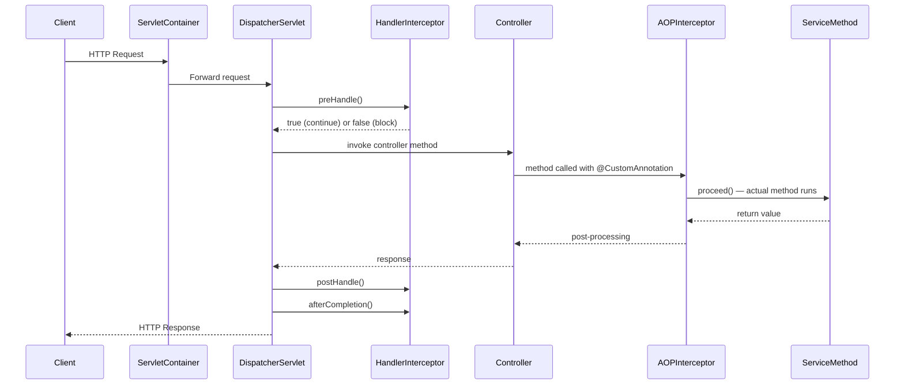
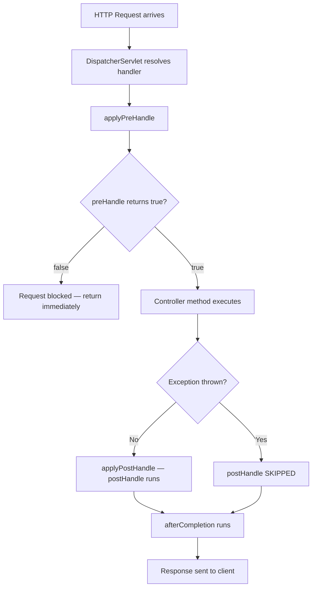
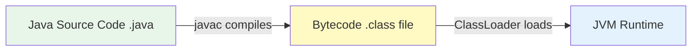
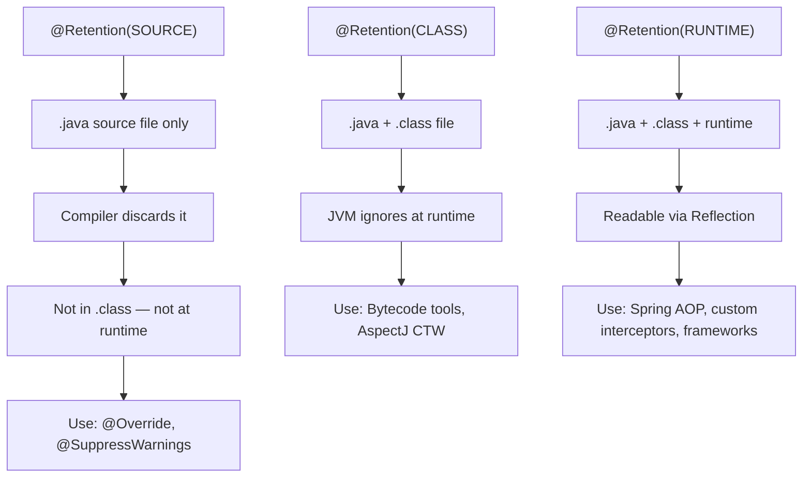
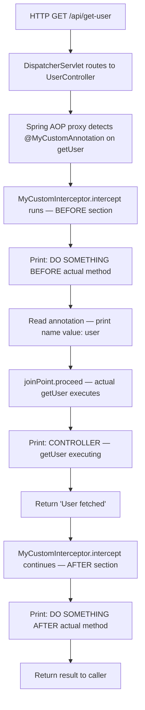
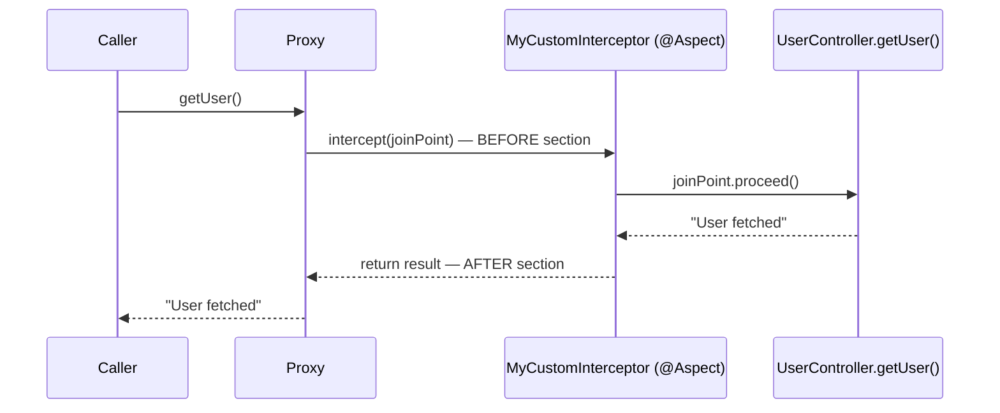
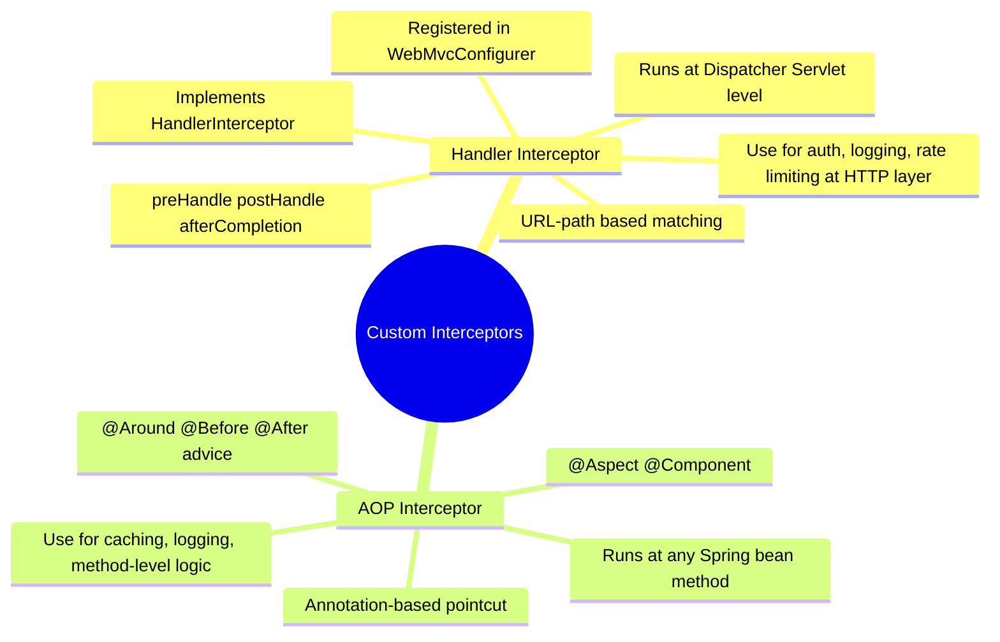

# 📌 Spring Boot — Custom Interceptors
### Handler Interceptors · Custom Annotations · AOP-Based Method Interceptors

---

> [!NOTE]
> **Prerequisites for this guide:**
> - Spring Boot basics (Controllers, Beans, `@Component`, `@Autowired`)
> - **AOP (Aspect-Oriented Programming)** in Spring — pointcuts, advice, join points, `@Around`, `@Aspect`
> - **Java Annotations** — how annotations work, meta-annotations
>
> If AOP or Annotations are unfamiliar, study those topics first. This guide will reference them directly.

---

## Table of Contents

1. [What Is an Interceptor?](#1-what-is-an-interceptor)
2. [Where Interceptors Fit in the Spring Request Lifecycle](#2-where-interceptors-fit-in-the-spring-request-lifecycle)
3. [Type 1 — Handler Interceptor (Before Controller)](#3-type-1--handler-interceptor-before-controller)
4. [Custom Annotations — Foundation for Method-Level Interceptors](#4-custom-annotations--foundation-for-method-level-interceptors)
5. [Meta-Annotations — `@Target` and `@Retention`](#5-meta-annotations--target-and-retention)
6. [Passing Data Through Annotations (Annotation Fields)](#6-passing-data-through-annotations-annotation-fields)
7. [Type 2 — AOP-Based Method Interceptor (After Controller, Around a Method)](#7-type-2--aop-based-method-interceptor-after-controller-around-a-method)
8. [Comparison — Handler Interceptor vs AOP Interceptor](#8-comparison--handler-interceptor-vs-aop-interceptor)
9. [Summary & Quick Reference](#9-summary--quick-reference)
10. [Interview Notes](#10-interview-notes)
11. [Practice Questions](#11-practice-questions)

---

## 1. What Is an Interceptor?

### Definition

An **interceptor** is a mediator component that gets invoked **before or after your actual code executes**, without modifying the original code itself.

Think of it like a security checkpoint at an airport — every passenger (request) passes through it before reaching their gate (controller/method), regardless of where they are going.

### Why Interceptors Exist

Without interceptors, cross-cutting concerns (things that apply to many methods/classes) would have to be manually written in every method. Examples:
- Logging every request
- Checking authentication on every API
- Starting/stopping a cache
- Measuring execution time

Interceptors allow you to write this logic **once** in a centralized place, and have it applied automatically wherever needed.

### Real-World Analogy

> A hotel concierge (interceptor) greets every guest (request) before they reach their room (controller). The guest doesn't need to know the concierge exists — the concierge operates transparently.

---

## 2. Where Interceptors Fit in the Spring Request Lifecycle

When an HTTP request arrives at a Spring Boot application, it travels through several layers:



### Two Interception Points

| Interception Point | Mechanism | When It Runs |
|--------------------|-----------|-------------|
| **Before the Controller** | `HandlerInterceptor` | After `DispatcherServlet` picks the controller, before the controller method executes |
| **Around a specific method** | AOP (`@Aspect`, `@Around`) | When a method annotated with a custom annotation is invoked, anywhere in the application |

---

## 3. Type 1 — Handler Interceptor (Before Controller)

### Overview

`HandlerInterceptor` is a Spring interface that lets you intercept HTTP requests **at the dispatcher servlet level** — after routing is resolved but before (and after) the controller executes.

### Use Cases

- Authentication / Authorization checks
- Request logging
- Rate limiting
- Adding common response headers

---

### Step 1 — Create the Custom Interceptor Class

Implement the `HandlerInterceptor` interface:

```java
@Component
public class MyCustomInterceptor implements HandlerInterceptor {

    @Override
    public boolean preHandle(HttpServletRequest request,
                             HttpServletResponse response,
                             Object handler) throws Exception {
        // Runs BEFORE the controller method
        System.out.println("PRE HANDLE — request intercepted before controller");
        // Return true to continue the request chain
        // Return false to block the request (e.g., auth failed)
        return true;
    }

    @Override
    public void postHandle(HttpServletRequest request,
                           HttpServletResponse response,
                           Object handler,
                           ModelAndView modelAndView) throws Exception {
        // Runs AFTER the controller method — only if no exception occurred
        System.out.println("POST HANDLE — controller executed successfully");
    }

    @Override
    public void afterCompletion(HttpServletRequest request,
                                HttpServletResponse response,
                                Object handler,
                                Exception ex) throws Exception {
        // Runs AFTER everything — even if an exception occurred
        // Similar to a finally block in Java
        System.out.println("AFTER COMPLETION — runs always, success or exception");
    }
}
```

#### The Three Methods Explained

| Method | When It Runs | Exception Behavior | Analogy |
|--------|-------------|-------------------|---------|
| `preHandle()` | Before controller | Runs before anything | Security checkpoint before entry |
| `postHandle()` | After controller, before response sent | **Skipped** if exception thrown | Receptionist after a successful meeting |
| `afterCompletion()` | After response is complete | **Always runs**, even on exception | `finally` block — guaranteed cleanup |

> [!IMPORTANT]
> `preHandle()` returns a **boolean**:
> - `true` → allow the request to proceed to the controller
> - `false` → block the request immediately (no controller invoked, no further interceptors)

> [!TIP]
> `afterCompletion` behaves like a `finally` block — use it for resource cleanup (closing connections, clearing thread-locals, etc.) that must happen regardless of success or failure.

---

### Step 2 — Register the Interceptor in Configuration

Simply creating the interceptor class is not enough. You must **register** it and specify which URL paths it applies to.

```java
@Configuration
public class AppConfig implements WebMvcConfigurer {

    @Autowired
    private MyCustomInterceptor myCustomInterceptor;
    // @Autowired works because @Component is on MyCustomInterceptor

    @Override
    public void addInterceptors(InterceptorRegistry registry) {
        registry.addInterceptor(myCustomInterceptor)
                .addPathPatterns("/api/*")          // Apply to all /api/* paths
                .excludePathPatterns(               // Exclude specific paths
                    "/api/update-user",
                    "/api/delete-user"
                );
    }
}
```

#### Configuration Breakdown

| Configuration Call | Purpose |
|--------------------|---------|
| `addInterceptor(interceptor)` | Register which interceptor to use |
| `addPathPatterns("/api/*")` | Comma-separated patterns where interceptor applies. `*` is a wildcard |
| `excludePathPatterns(...)` | Specific paths to exclude from interception |

> [!NOTE]
> **`@Component` vs `@Bean`:**
> - If your interceptor has `@Component`, Spring creates the bean automatically → inject with `@Autowired`.
> - Without `@Component`, declare it manually in `AppConfig`:
>   ```java
>   registry.addInterceptor(new MyCustomInterceptor());
>   ```

---

### How `DispatcherServlet` Triggers the Interceptor Internally

Inside `DispatcherServlet.doDispatch()`, Spring executes this sequence:

```
1. applyPreHandle()   → calls preHandle() on all matched interceptors
2. handle()           → your actual controller method executes
3. applyPostHandle()  → calls postHandle() on all matched interceptors (only on success)
4. afterCompletion()  → always called in the finally block
```

This means Spring's own source code confirms the same flow described above.

---

### Full Execution Flow — Handler Interceptor



---

### Complete Example — Handler Interceptor

**Controller:**
```java
@RestController
public class UserController {

    @GetMapping("/api/get-user")
    public String getUser() {
        System.out.println("CONTROLLER — getUser() executing");
        return "User fetched successfully";
    }
}
```

**Interceptor:**
```java
@Component
public class MyCustomInterceptor implements HandlerInterceptor {

    @Override
    public boolean preHandle(HttpServletRequest request,
                             HttpServletResponse response,
                             Object handler) {
        System.out.println("PRE HANDLE");
        return true; // allow request to proceed
    }

    @Override
    public void postHandle(HttpServletRequest request,
                           HttpServletResponse response,
                           Object handler,
                           ModelAndView modelAndView) {
        System.out.println("POST HANDLE");
    }

    @Override
    public void afterCompletion(HttpServletRequest request,
                                HttpServletResponse response,
                                Object handler,
                                Exception ex) {
        System.out.println("AFTER COMPLETION");
    }
}
```

**AppConfig:**
```java
@Configuration
public class AppConfig implements WebMvcConfigurer {

    @Autowired
    private MyCustomInterceptor myCustomInterceptor;

    @Override
    public void addInterceptors(InterceptorRegistry registry) {
        registry.addInterceptor(myCustomInterceptor)
                .addPathPatterns("/api/*")
                .excludePathPatterns("/api/update-user", "/api/delete-user");
    }
}
```

**Output when `GET /api/get-user` is called:**
```
PRE HANDLE
CONTROLLER — getUser() executing
POST HANDLE
AFTER COMPLETION
```

---

## 4. Custom Annotations — Foundation for Method-Level Interceptors

### Why Custom Annotations?

For **Type 2** interception (intercepting specific methods via AOP), we need a way to **mark** which methods should be intercepted. Custom annotations serve as these markers.

Additionally, annotations can carry **metadata** (values, keys, names) that the interceptor can read at runtime — essential for features like caching (what cache name?), logging (what log level?), etc.

---

### How to Create a Custom Annotation

Use the `@interface` keyword:

```java
public @interface MyCustomAnnotation {
    // fields (declared as methods) go here
}
```

This creates an annotation named `MyCustomAnnotation`. You can now use it like any built-in annotation:

```java
@MyCustomAnnotation
public void someMethod() { }
```

> [!NOTE]
> At this point, the annotation does **nothing** by itself. It's just a marker. You must write an interceptor (AOP aspect) that reads this annotation and acts on it.

---

## 5. Meta-Annotations — `@Target` and `@Retention`

**Meta-annotations** are annotations applied **on top of other annotations** to configure their behavior. When creating a custom annotation, two meta-annotations are almost always required: `@Target` and `@Retention`.

---

### `@Target` — Where Can This Annotation Be Used?

`@Target` specifies the **program elements** on which the annotation is valid.

```java
@Target(ElementType.METHOD)
public @interface MyCustomAnnotation { }
```

If you try to use `@MyCustomAnnotation` on a class or field after declaring `@Target(ElementType.METHOD)`, the **compiler will reject it**.

#### Common `ElementType` Values

| Value | Applies To |
|-------|-----------|
| `ElementType.METHOD` | Methods |
| `ElementType.TYPE` | Classes, interfaces, enums |
| `ElementType.FIELD` | Instance variables |
| `ElementType.CONSTRUCTOR` | Constructors |
| `ElementType.PARAMETER` | Method parameters |
| `ElementType.LOCAL_VARIABLE` | Local variables |
| `ElementType.ANNOTATION_TYPE` | Other annotations (meta-annotation use) |

**Multiple targets:**
```java
@Target({ElementType.METHOD, ElementType.CONSTRUCTOR, ElementType.PARAMETER})
public @interface MyCustomAnnotation { }
```

---

### `@Retention` — How Long Is the Annotation Kept?

`@Retention` controls **when** the annotation is available during the Java compilation/runtime pipeline.

#### The Three Retention Policies



| Policy | In `.java` source | In `.class` bytecode | At JVM Runtime |
|--------|------------------|---------------------|----------------|
| `RetentionPolicy.SOURCE` | ✅ Present | ❌ Discarded by compiler | ❌ Not available |
| `RetentionPolicy.CLASS` | ✅ Present | ✅ Recorded | ❌ Ignored by JVM |
| `RetentionPolicy.RUNTIME` | ✅ Present | ✅ Recorded | ✅ Available via Reflection |

#### `RetentionPolicy.SOURCE`

```java
@Retention(RetentionPolicy.SOURCE)
@Target(ElementType.METHOD)
public @interface MyCustomAnnotation { }
```

- The annotation exists in your `.java` source file.
- The compiler **discards it** — it does NOT appear in the `.class` file.
- Zero runtime impact.
- **Real-world example:** `@Override` — exists only to help developers and the compiler catch override mistakes. Not needed at runtime.

#### `RetentionPolicy.CLASS`

```java
@Retention(RetentionPolicy.CLASS)
@Target(ElementType.METHOD)
public @interface MyCustomAnnotation { }
```

- The annotation IS written into the `.class` bytecode file.
- The JVM **ignores it** at runtime — you cannot read it via reflection.
- Useful for bytecode-level tools (e.g., static analyzers, bytecode weavers like AspectJ compile-time weaving).

#### `RetentionPolicy.RUNTIME`

```java
@Retention(RetentionPolicy.RUNTIME)
@Target(ElementType.METHOD)
public @interface MyCustomAnnotation { }
```

- Annotation is in `.class` file **and** available at runtime via **Java Reflection**.
- This is what you need for AOP interceptors and Spring features.
- You can call `method.getAnnotation(MyCustomAnnotation.class)` at runtime.

> [!IMPORTANT]
> **For any custom annotation intended to be used with Spring AOP, always use `RetentionPolicy.RUNTIME`.**
> Without it, the Spring AOP proxy cannot detect the annotation at runtime.

---

### Visual: Retention Policy Flow



---

## 6. Passing Data Through Annotations (Annotation Fields)

### Overview

Annotations can carry **data values** — similar to fields in a class. These values can then be read by the interceptor to customize behavior (e.g., "which cache should I use?", "what log level?", "which key?").

### Syntax — Declaring Fields in an Annotation

Inside `@interface`, you declare fields as **methods with no parameters and restricted return types**:

```java
@Retention(RetentionPolicy.RUNTIME)
@Target(ElementType.METHOD)
public @interface MyCustomAnnotation {
    String name() default "";          // String field with default empty string
}
```

#### Rules for Annotation Fields

| Rule | Detail |
|------|--------|
| **No parameters** | `String name()` ✅ — `String name(int x)` ❌ |
| **No body** | Just a declaration — no `{ }` implementation |
| **Restricted return types** | Only: primitives (`int`, `boolean`, `double`, etc.), `String`, `Class<?>`, `Enum`, another `Annotation`, or arrays of these |
| **Optional default** | Use `default <value>` to make the field optional when using the annotation |

> [!NOTE]
> **Why restricted types?**
> Annotations are designed to be extremely lightweight compile-time metadata. Allowing arbitrary objects would make them complex and hard to process by the compiler and JVM. Keeping types simple ensures annotations remain fast and easy to process.

---

### Example — Single Field

```java
@Retention(RetentionPolicy.RUNTIME)
@Target(ElementType.METHOD)
public @interface MyCustomAnnotation {
    String name() default "";
}
```

**Usage:**
```java
@MyCustomAnnotation(name = "user")
public String getUser() {
    return "User data";
}
```

---

### Example — Multiple Fields of Different Types

```java
@Retention(RetentionPolicy.RUNTIME)
@Target(ElementType.METHOD)
public @interface MyCustomAnnotation {

    int intKey() default 0;

    String stringKey() default "";

    Class<?> classTypeKey() default String.class;

    MyEnum enumKey() default MyEnum.DEFAULT;

    String[] stringArrayKey() default {};
}
```

**Usage:**
```java
@MyCustomAnnotation(
    intKey = 10,
    stringKey = "userService",
    classTypeKey = User.class,
    enumKey = MyEnum.ACTIVE,
    stringArrayKey = {"read", "write"}
)
public String getUser() {
    return "User data";
}
```

---

### Reading Annotation Values via Reflection (Used by the Interceptor)

```java
Method method = ...; // obtained from JoinPoint

if (method.isAnnotationPresent(MyCustomAnnotation.class)) {
    MyCustomAnnotation annotation = method.getAnnotation(MyCustomAnnotation.class);
    String name = annotation.name(); // reads "user"
    System.out.println("Annotation name value: " + name);
}
```

This is exactly what the AOP interceptor does — at runtime, it reads the annotation's values to make decisions.

---

## 7. Type 2 — AOP-Based Method Interceptor (After Controller, Around a Method)

### Overview

This type of interception uses **Spring AOP** to intercept specific method calls — identified by a **custom annotation** on those methods. This goes deeper than the controller level; it can intercept any Spring-managed bean's method.

### When to Use

- Intercept a service-layer method (not just controllers)
- Execute logic before/after methods annotated with a specific annotation
- Caching: intercept `@Cacheable`-annotated methods
- Logging: intercept `@Loggable`-annotated methods
- Authorization: intercept `@RequiresRole`-annotated methods

---

### Step 1 — Create the Custom Annotation

```java
@Retention(RetentionPolicy.RUNTIME)
@Target(ElementType.METHOD)
public @interface MyCustomAnnotation {
    String name() default "";
}
```

---

### Step 2 — Annotate the Target Method

```java
@Component
public class UserController {

    @GetMapping("/api/get-user")
    @MyCustomAnnotation(name = "user")   // ← mark this method for interception
    public String getUser() {
        System.out.println("CONTROLLER — getUser() executing");
        return "User fetched";
    }
}
```

---

### Step 3 — Create the AOP Interceptor

```java
@Component
@Aspect
public class MyCustomInterceptor {

    // Pointcut: intercept any method annotated with @MyCustomAnnotation
    @Around("@annotation(com.conceptencoding.learningspringboot.custominterceptor.MyCustomAnnotation)")
    public Object intercept(ProceedingJoinPoint joinPoint) throws Throwable {

        // === BEFORE actual method ===
        System.out.println("DO SOMETHING BEFORE actual method");

        // Get the Method object from the join point
        MethodSignature signature = (MethodSignature) joinPoint.getSignature();
        Method method = signature.getMethod();

        // Check if the annotation is present (always true given our pointcut, but good practice)
        if (method.isAnnotationPresent(MyCustomAnnotation.class)) {
            MyCustomAnnotation annotation = method.getAnnotation(MyCustomAnnotation.class);
            System.out.println("Annotation name value: " + annotation.name()); // prints "user"
        }

        // === Invoke the actual method ===
        Object result = joinPoint.proceed(); // calls getUser()

        // === AFTER actual method ===
        System.out.println("DO SOMETHING AFTER actual method");

        return result; // return the original method's return value
    }
}
```

#### Line-by-Line Explanation

| Line | Explanation |
|------|-------------|
| `@Aspect` | Marks this class as an AOP aspect — Spring will scan it for pointcuts and advice |
| `@Component` | Spring creates a bean of this class |
| `@Around(...)` | This advice runs **before AND after** the matched method (`@Around` wraps both sides) |
| `"@annotation(...)"` | Pointcut expression: match any method annotated with the fully-qualified annotation class |
| `ProceedingJoinPoint joinPoint` | Represents the intercepted method call — gives access to metadata and control |
| `joinPoint.getSignature()` | Returns the method signature (name, return type, parameters) |
| `method.isAnnotationPresent(...)` | Checks at runtime (reflection) if the annotation is on this method |
| `method.getAnnotation(...)` | Reads the annotation instance — gives access to field values like `name()` |
| `annotation.name()` | Reads the `name` field value — "user" in this example |
| `joinPoint.proceed()` | **Calls the actual method.** Without this call, the real method never executes |
| Return `result` | Returns the original method's return value to the caller |

> [!CAUTION]
> **Never forget `joinPoint.proceed()`** in an `@Around` advice. If you omit it, the actual controller/service method will **never execute** — the request silently returns null or the advice's return value.

---

### Step-by-Step Execution Flow



**Console Output:**
```
DO SOMETHING BEFORE actual method
Annotation name value: user
CONTROLLER — getUser() executing
DO SOMETHING AFTER actual method
```

---

### How AOP Proxy Works (Internal)

When Spring starts up and sees `@Aspect`, it:
1. Scans all beans for methods matching the pointcut expression.
2. Wraps those beans in a **proxy object** (either JDK dynamic proxy or CGLIB).
3. When a matched method is called, the proxy intercepts the call, runs the advice, and then (optionally) delegates to the real method.



---

### Fully Qualified Annotation Path in Pointcut

The `@annotation(...)` pointcut requires the **fully qualified class name** of the annotation:

```java
@Around("@annotation(com.conceptencoding.learningspringboot.custominterceptor.MyCustomAnnotation)")
```

This means:
- Package: `com.conceptencoding.learningspringboot.custominterceptor`
- Annotation class: `MyCustomAnnotation`

> [!TIP]
> If you see `@annotation` not matching your methods at runtime, double-check the fully qualified name. A single typo will cause the interceptor to silently never fire.

---

## 8. Comparison — Handler Interceptor vs AOP Interceptor



| Feature | `HandlerInterceptor` | AOP (`@Aspect`) |
|---------|---------------------|-----------------|
| **Level** | HTTP / Dispatcher Servlet level | Spring bean method level |
| **Matching** | URL path patterns | Annotation, method name, package, etc. |
| **Scope** | Only Spring MVC controllers | Any Spring-managed bean |
| **Configuration** | `WebMvcConfigurer.addInterceptors()` | `@Aspect` + `@Component` auto-detected |
| **Access to HTTP** | Yes (`HttpServletRequest`, `HttpServletResponse`) | No (only method metadata) |
| **Typical use cases** | Auth checks, request logging, rate limiting | Caching, method-level logging, custom behavior |
| **Can block request?** | Yes — `preHandle()` returns `false` | Yes — don't call `joinPoint.proceed()` |

---

## 9. Summary & Quick Reference

### Handler Interceptor Checklist

- [ ] Create class implementing `HandlerInterceptor`
- [ ] Add `@Component` to the class
- [ ] Override `preHandle`, `postHandle`, `afterCompletion` as needed
- [ ] In `AppConfig`, implement `WebMvcConfigurer`
- [ ] Override `addInterceptors()` and register with path patterns

### AOP Method Interceptor Checklist

- [ ] Create custom annotation with `@interface`, `@Retention(RUNTIME)`, `@Target(METHOD)`
- [ ] Add fields (optional) with restricted return types and `default` values
- [ ] Add `@MyCustomAnnotation` on the target method
- [ ] Create `@Aspect @Component` class
- [ ] Write `@Around("@annotation(fully.qualified.AnnotationName)")` method
- [ ] Use `joinPoint.proceed()` to invoke the real method
- [ ] Read annotation values via reflection (`method.getAnnotation(...)`)

### Key Bullets

- An **interceptor** is a mediator that runs before/after your actual code without changing it.
- `HandlerInterceptor` has 3 methods: `preHandle` (before controller), `postHandle` (after controller, success only), `afterCompletion` (always — like `finally`).
- `preHandle` returning `false` **blocks** the request.
- Custom annotations use `@interface` keyword.
- `@Target` controls where the annotation can be used; `@Retention` controls how long it lives.
- `RetentionPolicy.RUNTIME` is required for Spring AOP to read annotations at runtime.
- Annotation fields have restricted types: primitives, `String`, `Class<?>`, `Enum`, `Annotation`, and arrays of these.
- AOP interceptors use `@Aspect`, `@Component`, and `@Around("@annotation(...)")`.
- `joinPoint.proceed()` invokes the actual method — **never omit it in `@Around`**.
- Annotation values are read at runtime via Java Reflection: `method.getAnnotation(...)`.

---

## 10. Interview Notes

> [!IMPORTANT]
> Commonly asked in Spring Boot / Java interviews.

**Q1: What is a Spring interceptor? Name the two types.**
- A mediator that executes before or after your code. Types: `HandlerInterceptor` (HTTP/controller level) and AOP-based interceptors (method level via `@Aspect`).

**Q2: What are the three methods of `HandlerInterceptor` and when does each run?**
- `preHandle()` — before controller; `postHandle()` — after controller (success only); `afterCompletion()` — always, even on exception (like `finally`).

**Q3: What does returning `false` from `preHandle()` do?**
- It stops the request chain. The controller never executes; no further interceptors run.

**Q4: What is the difference between `postHandle` and `afterCompletion`?**
- `postHandle` runs only when no exception is thrown. `afterCompletion` always runs, even when there's an exception — making it suitable for cleanup.

**Q5: What keyword is used to create a custom annotation in Java?**
- `@interface`.

**Q6: What are meta-annotations? Name the two most important ones.**
- Annotations applied on top of another annotation. Most important: `@Target` (where the annotation can be placed) and `@Retention` (how long the annotation is available).

**Q7: Which `RetentionPolicy` must you use for Spring AOP interceptors and why?**
- `RetentionPolicy.RUNTIME` — because the AOP proxy reads the annotation at runtime via reflection. `SOURCE` or `CLASS` would make the annotation invisible to the JVM at runtime.

**Q8: What types are allowed as fields in a custom annotation?**
- Primitives, `String`, `Class<?>`, `Enum`, another `Annotation`, or arrays of these. No arbitrary objects.

**Q9: What is the AOP pointcut expression to intercept methods annotated with a custom annotation?**
- `@annotation(fully.qualified.path.AnnotationName)`

**Q10: What happens if you forget `joinPoint.proceed()` in an `@Around` advice?**
- The actual method is **never called**. The caller receives `null` (or whatever the advice returns), and the real business logic is silently skipped.

**Q11: What is the difference between `HandlerInterceptor` and AOP-based interception?**
- `HandlerInterceptor` works at the HTTP/Dispatcher level (URL-pattern matching, access to request/response). AOP works at the Spring bean method level (annotation/pattern matching, no HTTP context).

---

## 11. Practice Questions

### Easy

1. What interface must you implement to create a `HandlerInterceptor`?
2. In which Spring configuration method do you register a `HandlerInterceptor`?
3. Which `RetentionPolicy` value makes an annotation available at runtime?
4. What Java keyword creates a custom annotation?
5. What does `joinPoint.proceed()` do in an `@Around` advice?

### Medium

6. Write a `HandlerInterceptor` that logs the URL of every incoming request and blocks any request containing the word "admin" in the URL.
7. Create a custom annotation `@RateLimit(maxRequests = 5)` with a single `int` field. Describe how an AOP interceptor could use it to count method invocations.
8. What happens if `preHandle()` throws an exception — does `afterCompletion()` still run?
9. Explain why `@Retention(RetentionPolicy.SOURCE)` would cause an AOP interceptor to silently never fire.
10. How does Spring create the AOP proxy — what are the two proxy strategies used?

### Hard

11. Design a complete `@Loggable` annotation-based AOP interceptor that: logs the method name, logs input parameters, logs return value, and logs execution time in milliseconds. Write the full annotation class and the full `@Aspect` class.
12. Can a `HandlerInterceptor` and an AOP interceptor both apply to the same controller method? Describe the exact execution order.
13. If you have two `HandlerInterceptor`s registered in `addInterceptors()`, in what order do `preHandle` and `afterCompletion` execute? (Hint: they are not the same order.)
14. What would you use for authentication at the HTTP layer vs. authorization at the method level — `HandlerInterceptor` or AOP? Justify your answer.
15. Explain how `@Transactional` in Spring uses the same AOP interception mechanism described in this guide. What is the pointcut? What is the advice? What does `joinPoint.proceed()` correspond to in the transaction flow?

---

> [!NOTE]
> **Coming Up Next:**
> These interceptor patterns are the foundation for caching (`@Cacheable`), logging, and authentication/authorization topics covered in later parts of this series.
