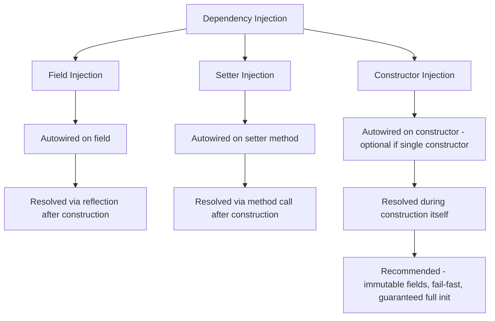

# 📌 Spring Boot Dependency Injection — Complete Study Guide

> [!NOTE]
> **Prerequisite:** This topic assumes you already understand **Spring Beans** and the **Bean Lifecycle** (creation → dependency injection → `@PostConstruct` → use → `@PreDestroy` → destruction). If any of that is unclear, review the Bean & Bean Lifecycle guide first — this guide builds directly on top of it.

---

## Table of Contents

1. [The Problem Dependency Injection Solves](#-the-problem-dependency-injection-solves)
2. [What Is Dependency Injection?](#-what-is-dependency-injection)
3. [Types of Dependency Injection](#-types-of-dependency-injection)
   - [Field Injection](#field-injection)
   - [Setter Injection](#setter-injection)
   - [Constructor Injection](#constructor-injection)
   - [Comparison Table](#comparison-table-of-injection-types)
4. [Common Dependency Injection Problems](#-common-dependency-injection-problems)
   - [Circular Dependency](#circular-dependency)
   - [Unsatisfied Dependency](#unsatisfied-dependency)
5. [Practice Questions](#-practice-questions)
6. [Summary](#-summary)

---

# 📌 The Problem Dependency Injection Solves

## Overview

Before understanding *what* Dependency Injection (DI) is, it's essential to understand the specific design problem it exists to fix: **tight coupling** between classes.

## Definition

> **Tight coupling** occurs when one class directly creates and depends on the concrete implementation of another class, such that changes to one class force changes in the other.

## Real-World Analogy

Imagine a lamp that has its light bulb **permanently soldered** into it rather than screwed into a socket. If the bulb burns out or you want a different type of bulb (LED instead of incandescent), you can't just swap it — you have to rebuild the entire lamp. A **socket** (like a well-designed interface) lets you plug in *any* compatible bulb without touching the lamp itself. Dependency Injection is essentially Spring providing that "socket" mechanism for your classes.

## Internal Working — Illustrating the Problem

Consider two very basic classes:

```java
public class Order {
    public Order() {
        System.out.println("Order created");
    }
}
```

```java
public class User {

    private Order order;

    public User() {
        this.order = new Order(); // User directly creates its own dependency
    }
}
```

Here, `User` is **directly creating** an instance of `Order` inside its own constructor. On the surface this looks harmless, but it introduces two serious problems.

### Problem 1 — Any Structural Change to `Order` Breaks `User`

Suppose business requirements evolve, and `Order` needs to be restructured — for example, converted from a concrete class into an **interface**, with multiple implementations:

```java
public interface Order {
    // common order behavior
}

public class OnlineOrder implements Order {
    public OnlineOrder() {
        System.out.println("Online order created");
    }
}

public class OfflineOrder implements Order {
    public OfflineOrder() {
        System.out.println("Offline order created");
    }
}
```

Now the original code inside `User`:

```java
this.order = new Order(); // ❌ This will no longer compile
```

> [!WARNING]
> You **cannot instantiate an interface directly** in Java (`new Order()` where `Order` is now an interface will fail to compile). Since `User` was tightly coupled to the *concrete* `Order` class, this restructuring **directly breaks** `User`, forcing you to go in and manually change its code to something like:
>
> ```java
> this.order = new OnlineOrder(); // now depends on a specific concrete implementation
> ```

This demonstrates the core issue: **any future change in the structure of `Order` ripples outward and forces changes in `User`**, even though `User` shouldn't logically need to know or care about those internal details.

### Problem 2 — Violation of the Dependency Inversion Principle (SOLID)

Even after "fixing" the compile error by writing `new OnlineOrder()`, a **second**, more subtle problem remains.

> [!IMPORTANT]
> The **Dependency Inversion Principle** (the "D" in **SOLID**) states: *"Do not depend on concrete implementations; depend on abstractions."*

By writing `new OnlineOrder()` directly inside `User`, you are **still** depending on a specific concrete implementation (`OnlineOrder`) rather than the abstraction (`Order` interface) — you've simply moved the tight coupling from one concrete class to another. This is a direct violation of the Dependency Inversion Principle.

### The Correct Fix — Depend on Abstraction, Injected from Outside

The proper solution, according to the Dependency Inversion Principle, is:

1. `User` should depend only on the **abstraction** (`Order` interface), never on a concrete implementation directly.
2. The actual concrete object (whether `OnlineOrder`, `OfflineOrder`, or any future implementation) should be **supplied from an external source** — not created internally by `User` itself.

```java
public class User {

    private Order order; // depends only on the abstraction

    public User(Order order) {
        this.order = order; // supplied from outside, not created internally
    }
}
```

Whoever is responsible for creating the `User` object decides — from the outside — whether to pass in an `OnlineOrder` or `OfflineOrder` instance. `User` itself remains completely unaware of which concrete implementation it's using.

## Key Observations

- Tight coupling causes **cascading changes**: modifying one class forces modifications in every class that directly depends on its concrete structure.
- Tight coupling also tends to violate the **Dependency Inversion Principle**, since it typically means depending on concrete classes rather than abstractions.
- The fix for both problems is the same: **depend on abstractions**, and have the actual concrete object **supplied externally** rather than created internally.

## Related Concepts

- SOLID Principles (specifically the Dependency Inversion Principle)
- Interfaces and polymorphism in Java
- Inversion of Control (IOC)

---

# 📌 What Is Dependency Injection?

## Overview

**Dependency Injection (DI)** is the mechanism Spring Boot uses to implement the Dependency Inversion Principle in practice — it is *how* Spring actually solves the tight-coupling problem described above.

## Definition

> **Dependency Injection** is a design pattern in which a class's dependencies are supplied ("injected") to it from an external source — rather than the class creating those dependencies itself — resulting in **loose coupling** between classes.

## Why This Concept Exists

As shown above, when a class creates its own dependencies directly, it becomes tightly bound to specific concrete implementations, making the system fragile and hard to change or extend. Dependency Injection exists to **decouple** classes from the responsibility of constructing their own dependencies, handing that responsibility over to an external authority — in this case, the **Spring IOC container**.

## Real-World Analogy

Think of a restaurant again: a chef (the `User` class) doesn't grow their own vegetables or raise their own livestock (create their own `Order` dependency). Instead, a supplier (Spring, the external source) delivers exactly the ingredients needed. The chef doesn't care whether the vegetables came from Farm A or Farm B (`OnlineOrder` or `OfflineOrder`) — they just use whatever is handed to them, as long as it satisfies what a "vegetable" (the `Order` abstraction) is supposed to provide.

## Internal Working — DI in Spring Boot

Rewriting the earlier example using Spring Boot's dependency injection:

```java
@Component
public class Order {
    public Order() {
        System.out.println("Order created");
    }
}
```

```java
@Component
public class User {

    @Autowired
    private Order order;

    public User() {
        System.out.println("User created");
    }
}
```

Here:
- `User` is marked `@Component` — Spring manages its bean.
- `Order` is marked `@Component` — Spring manages its bean too.
- Crucially, `User` **no longer creates `new Order()` itself**. Instead, the field is marked `@Autowired`.

### What `@Autowired` Tells Spring

> [!NOTE]
> `@Autowired` tells Spring: *"First look for a bean of the required type already present in the IOC container. If it exists, use that existing bean and inject it. If it does not exist, create it first, then inject it."*

The responsibility for creating and supplying the `Order` object has now been **handed over to Spring** (the external source) — `User` is no longer responsible for constructing its own dependency.

## Syntax

```java
@Component
public class ClassName {

    @Autowired
    private DependencyType dependency;
}
```

## Syntax Breakdown

| Element | Meaning |
|---|---|
| `@Component` | Registers the class as a Spring-managed bean |
| `@Autowired` | Instructs Spring to resolve and inject the dependency automatically — check container first, create if missing |
| `private DependencyType dependency;` | The dependency field itself — no manual `new` used |

## Key Observations

- Dependency Injection achieves **loose coupling** by removing the responsibility of object creation from the dependent class.
- It directly implements the **Dependency Inversion Principle**: classes depend on abstractions (or at least, they no longer manually construct their dependencies), and the actual object is supplied from an external source (Spring's IOC container).
- The actual mechanics of *how* Spring performs this injection (field, setter, or constructor) are covered next.

## Related Concepts

- SOLID Principles / Dependency Inversion Principle
- IOC Container
- Bean Lifecycle (DI happens as **Stage 4** of the bean lifecycle — after construction, before `@PostConstruct`)

---

# 📌 Types of Dependency Injection

## Overview

Spring provides **three distinct mechanisms** for actually injecting a resolved dependency into a bean:

1. **Field Injection**
2. **Setter Injection**
3. **Constructor Injection** — the most heavily used and most recommended in industry.

---

## Field Injection

### Definition

> **Field Injection** is where the dependency is set directly onto the field of the class, using `@Autowired` placed directly on the field itself.

### Syntax

```java
@Component
public class Order {
    public Order() {
        System.out.println("Order initialized");
    }
}
```

```java
@Component
public class User {

    @Autowired
    private Order order;

    public User() {
        System.out.println("User initialized");
    }
}
```

### Syntax Breakdown

| Element | Meaning |
|---|---|
| `@Autowired` (on the field) | Tells Spring to resolve and inject this field's dependency directly, bypassing constructor/setter |
| `private Order order;` | The field that will receive the injected dependency |

### Internal Working

> [!IMPORTANT]
> Spring uses **Java Reflection** internally to perform field injection. It iterates over all the fields of the bean and checks which ones are annotated with `@Autowired`. For each such field, it resolves the dependency (reusing an existing bean if present, or constructing a new one if not) and sets it directly onto the field — even if the field is `private`.

### Step-by-Step Execution

Using the example above (assume `Order` is marked `@Lazy` so its construction timing is clearly observable):

1. Application starts → IOC container is invoked.
2. IOC scans and finds both `User` and `Order` as `@Component`-annotated classes.
3. `User` is constructed first (assuming it's eagerly initialized) → `"User initialized"` prints.
4. `Order` is marked `@Lazy`, so it is **not** constructed yet at this point.
5. IOC now looks for dependencies to resolve on the `User` bean — it uses **reflection** to iterate over `User`'s fields.
6. It finds the `order` field marked `@Autowired`.
7. Spring checks: *is an `Order` bean already present in the container?* — No (it was lazy, so not yet created).
8. Spring constructs the `Order` bean at this point → `"Order initialized"` prints.
9. The newly constructed `Order` object is injected directly into `User`'s `order` field via reflection.

### Best Practices — Advantage

- **Very simple and easy to use.** Just by glancing at the class, you can immediately see which fields are dependencies (`@Autowired` is right there next to the field declaration) — highly readable at a glance.

### Common Mistakes — Disadvantages

> [!WARNING]
> **Disadvantage 1 — Cannot make the field immutable.**
>
> You cannot mark a field-injected dependency as `final`. Since Java requires `final` fields to be initialized exactly once (typically in the constructor), and Spring's reflection-based field injection happens *after* the object is already constructed (not during construction), marking the field `final` is incompatible with this mechanism.
>
> Additionally, **reflection in Java does not honor `final`/access modifiers strictly** — even if a workaround allowed a `final` field to compile, reflection can bypass such restrictions entirely, ultimately breaking true immutability guarantees.

> [!WARNING]
> **Disadvantage 2 — Higher chance of `NullPointerException`.**
>
> Nothing stops other code from manually instantiating the class using `new User()` directly (bypassing Spring entirely). In that case, the default constructor runs, but Spring's reflection-based injection **never happens** — meaning the `order` field remains `null`. If any method on that manually-created object later tries to use `order` (e.g., `order.process()`), it throws a `NullPointerException` at runtime.

> [!WARNING]
> **Disadvantage 3 — Harder unit testing.**
>
> Since there is no constructor parameter or setter method through which to inject a mock dependency, standard testing tools like **Mockito** require special reflection-based helpers — specifically `@Mock` and `@InjectMocks` — to forcibly set mock objects onto the private fields. Internally, `@InjectMocks` uses reflection to iterate over the class's fields and inject the corresponding `@Mock` objects into them, mirroring the same mechanism Spring itself uses.

### Interview Notes

- **Q: Why can't field-injected dependencies be `final`?** → Because injection happens via reflection *after* object construction, not during it — incompatible with `final`'s single-assignment-at-construction-time requirement.
- **Q: Why does field injection increase `NullPointerException` risk?** → Because any code path that bypasses Spring's container (e.g., manual `new`) results in an uninitialized (`null`) dependency, since reflection-based injection is a Spring-container-only behavior.

---

## Setter Injection

### Definition

> **Setter Injection** is where the dependency is set through a **setter method**, with `@Autowired` placed on the setter method itself rather than on the field.

### Syntax

```java
@Component
public class User {

    private Order order;

    @Autowired
    public void setOrderDependency(Order order) {
        this.order = order;
    }
}
```

### Syntax Breakdown

| Element | Meaning |
|---|---|
| `private Order order;` | The field — note: **no** `@Autowired` here |
| `@Autowired` (on the method) | Tells Spring to use **this method** to resolve and inject the dependency |
| `setOrderDependency(Order order)` | An arbitrary method name that accepts the dependency as a parameter and assigns it to the field |

### Internal Working

Spring uses reflection to detect methods annotated with `@Autowired`. When found, Spring resolves the required parameter type (checking the container first, creating if necessary — exactly as with field injection) and then **invokes the setter method**, passing in the resolved dependency as an argument.

### Best Practices — Advantages

> [!TIP]
> **Advantage 1 — Dependency can be changed at any time after object creation.**
>
> Because this is a regular setter method, it can be called again at any later point (not just during initial wiring) to replace the dependency with a different implementation. For example, if you have both `OnlineOrder` and `OfflineOrder`, you could set it to one, and later call the setter again to switch to the other.

> [!TIP]
> **Advantage 2 — Easier unit testing.**
>
> Since a public setter method exists, you can simply call it directly in a test and pass in a mock object — no need for reflection-based tools like `@Mock`/`@InjectMocks`.

### Common Mistakes — Disadvantages

> [!WARNING]
> **Disadvantage 1 — Cannot make the field immutable.**
>
> Since the field is set via a setter method **after** the object has already been constructed, it cannot be marked `final` (Java requires `final` fields be assigned during construction, and a setter call happening afterward is incompatible with that).

> [!WARNING]
> **Disadvantage 2 — Difficult to read and maintain.**
>
> Because `@Autowired` sits on a method rather than directly next to the field declaration, it becomes harder to immediately tell, just by glancing at the field, whether it's managed by Spring or not. A reader has to search through the whole class to find whichever method carries the `@Autowired` annotation.

### Interview Notes

- **Q: What's the key practical advantage setter injection has over field injection?** → Testability (mocks can be passed directly through a public method) and the ability to reassign the dependency after construction.
- **Q: What disadvantage does setter injection share with field injection?** → Neither allows the dependency field to be marked `final`/immutable.

---

## Constructor Injection

### Definition

> **Constructor Injection** is where dependencies are resolved and supplied **at the time the object itself is being instantiated** — via the class's constructor — rather than after construction (as with field or setter injection).

### Why This Concept Exists / Why It's Recommended

Constructor Injection is the **most heavily used and most recommended** approach in real-world industry code, because dependency resolution happens as an intrinsic part of object creation itself — guaranteeing the object is never in a partially-initialized, dependency-less state.

### Syntax

```java
@Component
public class Order {
    public Order() {
        System.out.println("Order created");
    }
}
```

```java
@Component
public class User {

    private final Order order;

    @Autowired
    public User(Order order) {
        this.order = order;
    }
}
```

### Syntax Breakdown

| Element | Meaning |
|---|---|
| `private final Order order;` | Field can now be marked `final`, since it is assigned exactly once, during construction |
| `@Autowired` (on the constructor) | Applies to **all** constructor parameters — Spring resolves each one before invoking the constructor |
| `public User(Order order)` | Standard Java constructor accepting the dependency as a parameter |

### Internal Working — Single vs. Multiple Constructors

> [!NOTE]
> **Since Spring 4.3**, when a class has **only one constructor**, `@Autowired` is **not mandatory** on it — Spring will automatically use that single constructor to resolve and inject dependencies, even without the explicit annotation.

```java
@Component
public class User {

    private final Order order;

    // No @Autowired needed here — this is the ONLY constructor
    public User(Order order) {
        this.order = order;
    }
}
```

> [!IMPORTANT]
> However, **if a class has more than one constructor**, `@Autowired` becomes **mandatory** on exactly one of them — otherwise Spring will throw a **bean creation/initiation exception**, because it has no way of knowing which constructor to use (there's no default constructor to fall back on, and multiple parameterized constructors create ambiguity).

**Example — Multiple Constructors Without `@Autowired` (fails):**

```java
@Component
public class User {

    private Order order;
    private Invoice invoice;

    public User(Order order) {
        this.order = order;
    }

    public User(Invoice invoice) {
        this.invoice = invoice;
    }
}
```

> [!WARNING]
> Starting this application will **fail** with a bean initiation exception. Spring cannot determine which of the two constructors to invoke, and since there is no default (no-argument) constructor either, it has no fallback option.

**Fix — Mark One Constructor with `@Autowired`:**

```java
@Component
public class User {

    private Order order;
    private Invoice invoice;

    public User(Order order) {
        this.order = order;
    }

    @Autowired
    public User(Invoice invoice) {
        this.invoice = invoice;
    }
}
```

### Step-by-Step Execution

Assume `Order` is `@Lazy` and `Invoice` is eagerly initialized:

1. Application starts → IOC container invoked.
2. IOC finds the `User` class, along with `Order` and `Invoice` as `@Component`-annotated dependencies.
3. `Order` is marked `@Lazy` → it is **not** constructed yet.
4. IOC determines it needs to construct `User`. Since `User` has two constructors, and only the `Invoice`-accepting constructor is marked `@Autowired`, Spring knows to use **that specific constructor**.
5. To invoke that constructor, Spring first needs an `Invoice` instance → `Invoice` bean gets constructed (`"Invoice initialized"` prints, or similar).
6. The `Invoice` object is passed into the constructor, and `User` is fully constructed with the `invoice` field set.
7. `Order` is never touched in this flow, since the chosen constructor doesn't require it — `"User initialization with only invoice"` completes; `Order` remains uninitialized (still lazy, not needed by this particular constructor).

### Best Practices — Advantages

> [!TIP]
> **Advantage 1 — All mandatory dependencies are guaranteed at initialization time.**
>
> Since dependencies are resolved as part of constructing the object itself, it is **100% guaranteed** that the object is never in an incomplete or partially-initialized state — by the time you have a reference to it, all its mandatory dependencies are already present.

> [!TIP]
> **Advantage 2 — Fields can be made immutable (`final`).**
>
> Because the dependency is assigned exactly once, during construction, it satisfies Java's requirement for `final` fields — this is a capability **neither** field injection **nor** setter injection can offer.

> [!TIP]
> **Advantage 3 — Fail-fast behavior.**
>
> If a dependency is accidentally missing:
> - With **field injection**, the mistake surfaces only at **runtime**, when some code path actually tries to use the null field, throwing a `NullPointerException` potentially long after the class was instantiated.
> - With **constructor injection**, if you have multiple constructors and forget to mark one with `@Autowired`, Spring will **fail immediately at application startup** with a bean initiation exception — surfacing configuration mistakes far earlier ("fail fast") rather than allowing a broken object to exist silently until some later runtime call fails.

> [!TIP]
> **Advantage 4 — Easier unit testing.**
>
> Just like setter injection, you can directly pass a mock object into the constructor when writing tests (`new User(mockOrder)`), without needing reflection-based tools like `@InjectMocks`.

### Common Mistakes / The One Notable "Disadvantage"

> [!CAUTION]
> **"Disadvantage" — Large constructors when there are many dependencies.**
>
> If a class has, say, 20 dependencies, its constructor parameter list becomes very large (`User(Object1 o1, Object2 o2, Object3 o3, ...)`), which can look unwieldy.
>
> However, this "disadvantage" is generally considered a **hidden advantage** in practice: a constructor with an excessive number of parameters is a strong, early **signal that your class is doing too much and should be refactored** (violating the Single Responsibility Principle). Constructor injection effectively forces good design discipline by making bloated dependency lists visibly obvious.

### Interview Notes

- **Q: Why is constructor injection the most recommended approach in industry?** → It guarantees full, valid initialization at object-creation time, supports field immutability, and fails fast on configuration errors — advantages neither field nor setter injection can fully offer.
- **Q: Since which Spring version is `@Autowired` optional on a single constructor?** → Spring 4.3 and later.
- **Q: What happens if a class has multiple constructors and none is marked `@Autowired`?** → Spring throws a bean creation/initiation exception at startup because it cannot determine which constructor to use.
- **Q: Is a large number of constructor parameters truly a "disadvantage"?** → It's often reframed as an advantage — it acts as an early-warning signal that the class has too many responsibilities and should be refactored.

---

## Comparison Table of Injection Types

| Aspect | Field Injection | Setter Injection | Constructor Injection |
|---|---|---|---|
| Where `@Autowired` is placed | Directly on the field | On the setter method | On the constructor (optional if only one constructor, mandatory if multiple) |
| Dependency resolved | After object construction, via reflection | After object construction, via method call | **During** object construction |
| Can mark field `final` / immutable? | ❌ No | ❌ No | ✅ Yes |
| Risk of `NullPointerException` | Higher (if object created via `new` bypassing Spring) | Lower (setter can still be missed, but explicit) | Lowest — dependency required at construction time |
| Ease of unit testing | Hardest — requires `@Mock`/`@InjectMocks` (reflection-based) | Easy — pass mock directly to setter | Easy — pass mock directly to constructor |
| Dependency reassignable after creation? | Not intended (though reflection technically could) | ✅ Yes — call setter again anytime | ❌ No — fixed at construction |
| Readability | Very high (visible right at field) | Lower (must search for annotated method) | High (all dependencies visible in one constructor signature) |
| Fail-fast at startup on misconfiguration? | No (fails later, at runtime NPE) | No | ✅ Yes (fails at startup if ambiguous/misconfigured) |
| Industry recommendation | Discouraged for production code | Situational (used when reassignment is genuinely needed) | ✅ **Most recommended / heavily used** |

## Diagrams



---

# 📌 Common Dependency Injection Problems

## Overview

Two major categories of problems commonly arise when working with dependency injection in Spring:

1. **Circular Dependency**
2. **Unsatisfied Dependency**

---

## Circular Dependency

### Definition

> A **circular dependency** occurs when two (or more) beans depend on each other, directly or indirectly, forming a cycle — for example, Class A depends on Class B, and Class B depends on Class A.

### Internal Working — Why It Fails

```java
@Component
public class Order {

    @Autowired
    private Invoice invoice;
}
```

```java
@Component
public class Invoice {

    @Autowired
    private Order order;
}
```

Here, `Order` depends on `Invoice`, and `Invoice` depends on `Order` — a **cycle**.

> [!WARNING]
> When you start this application, it will **fail to start**, and Spring will report that a **circular dependency cycle** has been detected among the beans. Spring's default bean-creation strategy needs to fully construct and inject `Order` before it can be considered "ready" to inject into `Invoice" — but doing so requires `Invoice` to already be ready, which itself requires `Order` to already be ready. Neither side can complete first, so the cycle cannot be resolved through normal eager construction.

### Diagrams


### Common Mistakes / Solutions (in priority order)

#### Solution 1 (Highest Priority) — Refactor the Code to Remove the Cycle

> [!TIP]
> The **first and best solution** is to **refactor** your code so that the circular dependency doesn't exist in the first place. Often, both classes need some shared/common logic — instead of each depending directly on the other, **extract that common logic into a separate utility/shared class**, and have both `Order` and `Invoice` depend on that shared class instead of on each other. This breaks the cycle entirely at the design level.

#### Solution 2 — `@Lazy` on the `@Autowired` Field

If refactoring isn't feasible, you can place `@Lazy` **directly on the `@Autowired` field/dependency** (not on the whole class):

```java
@Component
public class Order {

    @Lazy
    @Autowired
    private Invoice invoice;
}
```

```java
@Component
public class Invoice {

    @Autowired
    private Order order;
}
```

> [!NOTE]
> Here, `@Lazy` is placed on the **field**, not the class. This tells Spring: *"Don't fully resolve this dependency right now — inject a proxy instead, and only construct the real object the first time it's actually used."*

**Step-by-Step Execution**

1. IOC starts and finds both `Order` and `Invoice` as `@Component` classes.
2. Suppose `Invoice` is constructed first → `"Invoice initialized"`.
3. IOC then needs to resolve `Invoice`'s dependency on `Order` (`Order`'s field is plain `@Autowired`, no `@Lazy`) → `Order` gets constructed → `"Order initialized"`.
4. Now IOC needs to inject `Order`'s dependency on `Invoice`. It uses reflection, finds the `invoice` field, and sees it's marked `@Lazy`.
5. Since it's lazy, Spring does **not** attempt to fully resolve the actual `Invoice` bean right now (which would re-trigger the unresolved cycle) — instead, it injects a **proxy object** standing in for the real `Invoice`.
6. The real `Invoice` object is only actually constructed/resolved the **first time** the proxy is genuinely used/called.

> [!IMPORTANT]
> Placing `@Lazy` on **either side** of the cyclic pair is sufficient to break the deadlock — you only need it on one of the two `@Autowired` fields involved in the cycle. This same technique (placing `@Lazy` on the dependency) works whether you're using field injection, setter injection, or constructor injection.

#### Solution 3 (Least Recommended / "Hacky") — Manual Wiring via `@PostConstruct`

A third option is to **not** use `@Autowired` at all for one side of the relationship, and instead manually wire the dependency yourself inside a `@PostConstruct` method:

```java
@Component
public class Order {

    private Invoice invoice; // NOT marked @Autowired

    public Order() {
        System.out.println("Order initialized");
    }
}
```

```java
@Component
public class Invoice {

    @Autowired
    private Order order;

    public Invoice() {
        System.out.println("Invoice initialized");
    }

    @PostConstruct
    public void wireOrder() {
        // Developer manually sets the dependency instead of letting Spring do it
        this.order.setInvoice(this); // hypothetical setter exposed on Order
    }
}
```

**Step-by-Step Execution**

1. IOC finds `Order` first (arbitrary order in this example) → `Order` gets constructed → `"Order initialized"` prints. Since `Order`'s `invoice` field has **no `@Autowired`**, it defaults to `null` — but object creation itself still succeeds (no error).
2. IOC needs to construct `Invoice`, which does have `@Autowired private Order order;` → since `Order`'s bean already exists, it's injected directly → `Invoice` is now fully constructed with a valid `order` reference.
3. Because `Invoice`'s bean is now fully constructed and its dependency (`order`) is injected, its `@PostConstruct` method runs.
4. Inside `@PostConstruct`, the **developer manually** sets `Order`'s `invoice` field (e.g., via an exposed setter) — bypassing Spring's automatic wiring entirely for that side.

> [!CAUTION]
> This is explicitly called out as a **"hacky"** approach — it is generally **not recommended**. It works, but it shifts responsibility for wiring the dependency away from Spring and onto the developer, making the code harder to reason about. **Refactoring to remove the cycle remains the preferred, first-choice solution**; the other two approaches (`@Lazy` on the field, or manual `@PostConstruct` wiring) exist as fallback techniques for situations where a clean refactor isn't immediately possible.

### Best Practices

1. **First priority:** refactor to eliminate the cycle (extract shared logic into a separate class).
2. **Second priority:** use `@Lazy` on one of the two `@Autowired` dependency fields involved in the cycle.
3. **Last resort:** manually wire the dependency yourself using `@PostConstruct`, understanding this bypasses Spring's normal DI mechanism and is considered a workaround/hack rather than a clean solution.

### Interview Notes

- **Q: What causes a circular dependency in Spring?** → Two or more beans depending on each other, directly or transitively, forming a cycle that Spring's normal eager construction process cannot resolve.
- **Q: What is the recommended first step to resolve a circular dependency?** → Refactor the code to remove the cycle (e.g., extract shared logic into a separate class), rather than reaching for `@Lazy` or manual wiring immediately.
- **Q: How does `@Lazy` help resolve a circular dependency?** → It causes Spring to inject a proxy instead of eagerly resolving the actual dependent bean, deferring full resolution until the proxy is actually used — breaking the immediate resolution deadlock.

---

## Unsatisfied Dependency

### Definition

> An **unsatisfied dependency** error occurs when Spring finds **multiple candidate beans** of the required type and has no way of determining which one to inject — resulting in an ambiguous dependency that Spring cannot automatically resolve.

### Internal Working — Illustrating the Problem

```java
public interface Order {
}

@Component
public class OnlineOrder implements Order {
    public OnlineOrder() {
        System.out.println("Online order initialized");
    }
}

@Component
public class OfflineOrder implements Order {
    public OfflineOrder() {
        System.out.println("Offline order initialized");
    }
}
```

```java
@Component
public class User {

    @Autowired
    private Order order; // Which implementation should Spring inject??
}
```

> [!WARNING]
> When you try to start this application, it will **fail** with an error resembling: *"Unsatisfied dependency error creating bean with name 'user' — not able to construct the bean."* Spring has **two** valid candidates (`OnlineOrder` and `OfflineOrder`) for the `Order` type and has no built-in way to decide which one you actually want injected into `User`.

### Solutions

#### Solution 1 — `@Primary` Annotation

```java
@Component
@Primary
public class OnlineOrder implements Order {
    public OnlineOrder() {
        System.out.println("Online order initialized");
    }
}

@Component
public class OfflineOrder implements Order {
    public OfflineOrder() {
        System.out.println("Offline order initialized");
    }
}
```

> [!NOTE]
> `@Primary` tells Spring: *"When there are multiple candidate beans of the same type and no other explicit selection is given, give this one first priority."*

**Step-by-Step Execution**

1. Since neither `OnlineOrder` nor `OfflineOrder` is marked `@Lazy` in this example, **both** get constructed at application startup (both are Singleton, eagerly initialized by default) → `"Online order initialized"` and `"Offline order initialized"` both print.
2. When `User`'s `order` dependency needs to be resolved, Spring sees two candidates but notices that `OnlineOrder` is marked `@Primary`.
3. Spring injects the `OnlineOrder` instance into `User`'s `order` field, since it was explicitly given priority.

#### Solution 2 — `@Qualifier` Annotation

```java
@Component
@Qualifier("onlineOrderName")
public class OnlineOrder implements Order {
}

@Component
@Qualifier("offlineOrderName")
public class OfflineOrder implements Order {
}
```

```java
@Component
public class User {

    @Autowired
    @Qualifier("offlineOrderName")
    private Order order;
}
```

> [!NOTE]
> `@Qualifier` lets you assign an explicit **name** to each candidate bean, and then specify **by name** exactly which one should be injected at the point of use. To switch which implementation gets injected, you simply change the `@Qualifier` value referenced in `User` (e.g., from `"offlineOrderName"` to `"onlineOrderName"`).

### Comparison — `@Primary` vs `@Qualifier`

| Aspect | `@Primary` | `@Qualifier` |
|---|---|---|
| Where applied | On the candidate bean class (the "default" one) | On both the candidate bean(s) *and* the injection point |
| Granularity | One global default across the whole application | Per-injection-point explicit choice |
| Use case | You mostly always want one specific implementation by default | Different places in the code need different specific implementations |
| Can be overridden per-injection-point? | Not directly (it's a global default) | Yes — inherently designed for explicit per-site selection |

### Best Practices

- Use `@Primary` when one implementation should be the sensible **default** across your entire application, and only rare exceptions need something different.
- Use `@Qualifier` when different parts of your application genuinely need **different specific implementations** of the same interface, and there is no single sensible "default."

### Interview Notes

- **Q: What causes an "unsatisfied dependency" error?** → Multiple beans of the same required type exist, and Spring cannot automatically determine which one to inject.
- **Q: What are the two ways to resolve it?** → `@Primary` (sets a default candidate) or `@Qualifier` (explicitly names which candidate to use at each injection point).
- **Q: Does `@Primary` prevent the non-primary beans from being created?** → No — all candidate beans are still constructed as normal (per their own scope/laziness rules); `@Primary` only affects **which one gets selected** when there's ambiguity during injection.

---

# 📌 Practice Questions

### Easy

1. What SOLID principle does Dependency Injection help satisfy?
2. Name the three types of dependency injection in Spring.
3. Which annotation is used to give one bean priority over other candidates of the same type?

### Medium

4. Why can't a field-injected or setter-injected dependency be marked `final`, but a constructor-injected one can?
5. Explain why constructor injection is considered "fail-fast" compared to field injection.
6. What is the difference between `@Primary` and `@Qualifier`, and when would you use one over the other?

### Hard

7. Walk through, step by step, what happens internally when two beans (`Order` and `Invoice`) have a circular `@Autowired` dependency on each other and no `@Lazy` is used anywhere — why exactly does the application fail to start?
8. Explain precisely how placing `@Lazy` on one side of a circular dependency's `@Autowired` field resolves the cycle, including what gets injected in place of the real object initially.
9. A class has two constructors, and only one is marked `@Autowired`. Explain exactly which constructor Spring will use, why the *other* constructor's dependency is never resolved, and under what condition the application would instead fail at startup.

---

# 📌 Summary

- **Tight coupling** — where a class directly creates its own dependencies via `new` — leads to two major problems: (1) structural changes to the dependency ripple outward and break dependent classes, and (2) it violates the **Dependency Inversion Principle** (depend on abstractions, not concrete implementations).
- **Dependency Injection (DI)** solves this by having dependencies supplied from an **external source (Spring's IOC container)** rather than created internally by the dependent class — achieving **loose coupling**.
- `@Autowired` tells Spring: *check the container for an existing bean of the required type first; if found, inject it; if not, create it, then inject it.*
- There are **three types of dependency injection**:
  - **Field Injection** — `@Autowired` on the field; simple and readable, but no immutability, higher NPE risk, and harder to unit test (`@InjectMocks` needed).
  - **Setter Injection** — `@Autowired` on a setter method; allows reassigning the dependency later and easier testing, but still no immutability and less readable (annotation isn't next to the field).
  - **Constructor Injection** — `@Autowired` on the constructor (optional if there's only **one** constructor, since **Spring 4.3**; mandatory if there are multiple); the **most recommended** approach — guarantees full initialization, supports immutable (`final`) fields, fails fast at startup on misconfiguration, and is easy to unit test. Large constructors (many dependencies) are often seen as a helpful signal to refactor, rather than a true downside.
- **Circular Dependency** — two or more beans depending on each other in a cycle, causing application startup failure. Resolved by (in priority order): (1) refactoring to remove the cycle, (2) placing `@Lazy` on one side's `@Autowired` field to inject a proxy instead, or (3) manually wiring the dependency in `@PostConstruct` (a discouraged, "hacky" workaround).
- **Unsatisfied Dependency** — multiple candidate beans of the same type exist, and Spring cannot determine which to inject, causing startup failure. Resolved via `@Primary` (sets a global default candidate) or `@Qualifier` (explicitly names which candidate to inject at each specific injection point).
