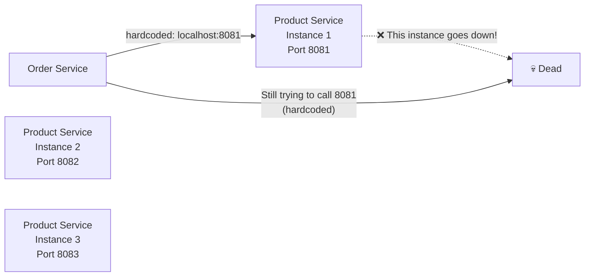
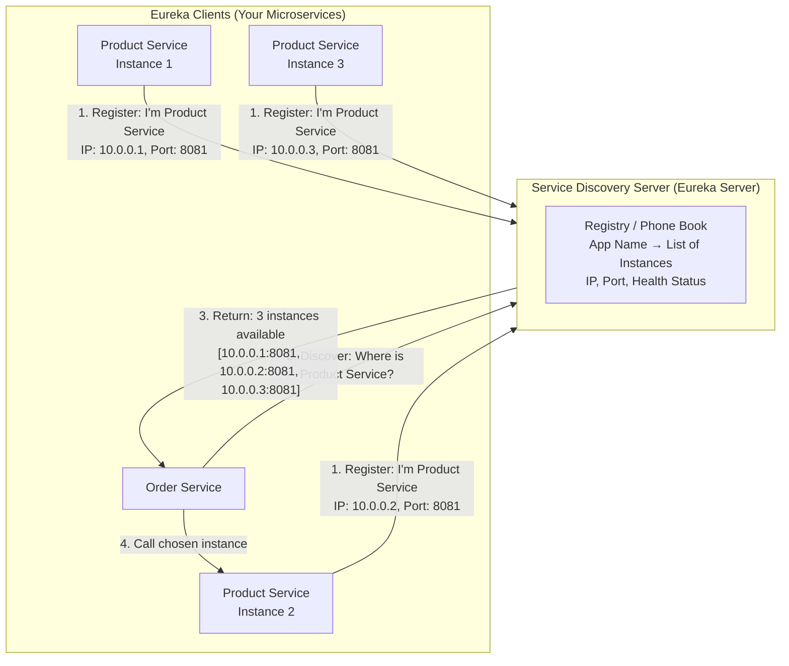
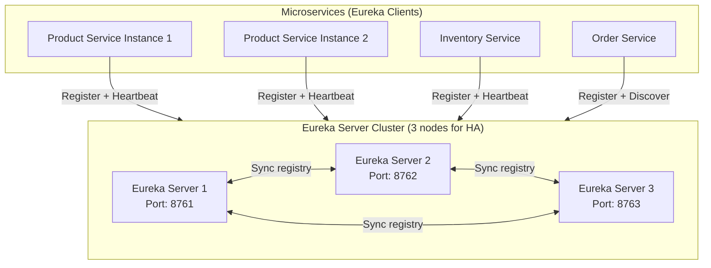
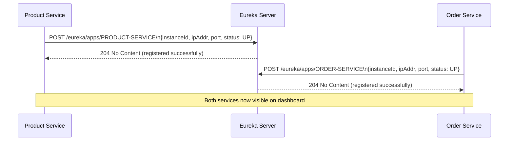
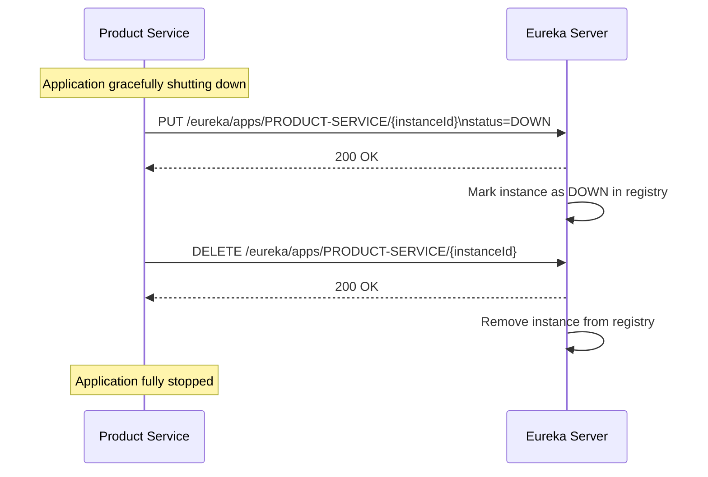
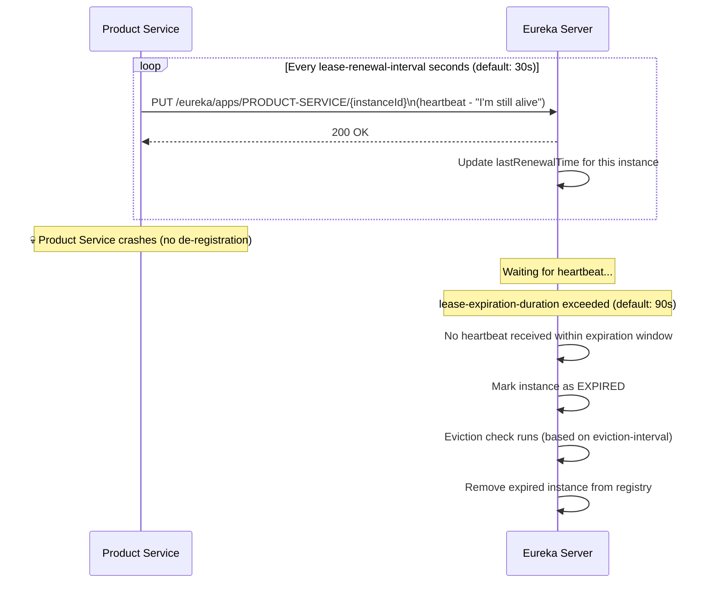
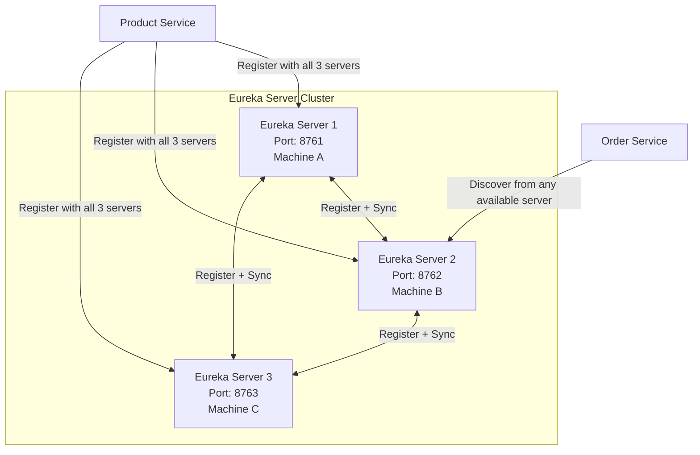
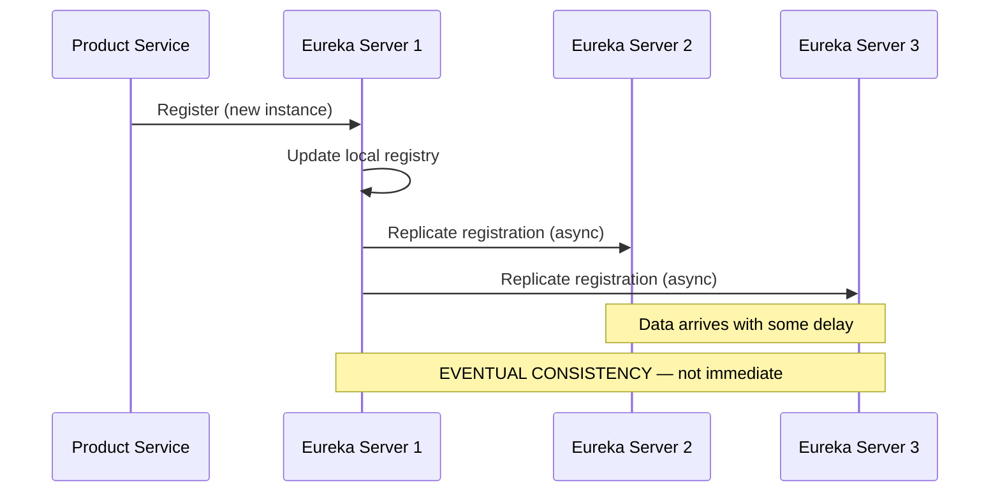
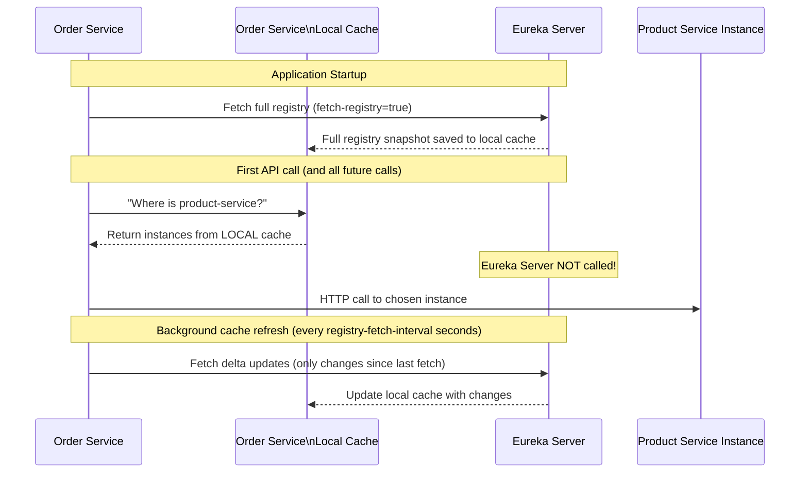
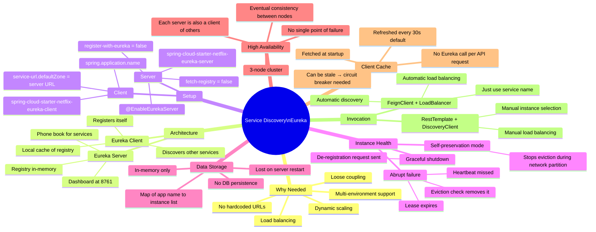

# 📌 Spring Boot Microservices — Service Discovery (Eureka): Comprehensive Study Guide

> [!IMPORTANT]
> **Prerequisites:** Before reading this guide, ensure you understand:
> - **Microservices architecture** — independent services that communicate over HTTP
> - **RestTemplate / FeignClient / RestClient** — inter-service HTTP communication
> - **Spring Cloud basics** — cloud-native Spring framework extensions
> - **Load balancing concepts** — distributing traffic across multiple instances
> - **Application properties / YAML configuration** — Spring Boot config files
> - **DNS and IP addressing** — how services identify each other on a network

---

## Table of Contents

1. [The Problem — Why We Can't Hardcode URLs in Microservices](#1-the-problem--why-we-cant-hardcode-urls-in-microservices)
2. [What is Service Discovery?](#2-what-is-service-discovery)
3. [Eureka — Netflix's Service Discovery Solution](#3-eureka--netflixs-service-discovery-solution)
4. [Setting Up the Eureka Server](#4-setting-up-the-eureka-server)
5. [Setting Up Eureka Clients (Microservices)](#5-setting-up-eureka-clients-microservices)
6. [Invoking Services Using Service Discovery](#6-invoking-services-using-service-discovery)
   - [With RestTemplate + DiscoveryClient (Manual)](#61-with-resttemplate--discoveryclient-manual)
   - [With FeignClient (Automatic)](#62-with-feignclient-automatic)
7. [Deep Dive — How Eureka Server Knows If a Client Is Up or Down](#7-deep-dive--how-eureka-server-knows-if-a-client-is-up-or-down)
8. [How Eureka Server Stores Data](#8-how-eureka-server-stores-data)
9. [High Availability — Eureka Server Cluster](#9-high-availability--eureka-server-cluster)
10. [Client-Side Caching — Solving the Latency Problem](#10-client-side-caching--solving-the-latency-problem)
11. [Complete Configuration Reference](#11-complete-configuration-reference)
12. [Common Mistakes](#12-common-mistakes)
13. [Best Practices](#13-best-practices)
14. [Interview Notes](#14-interview-notes)
15. [Summary](#15-summary)
16. [Practice Questions](#16-practice-questions)

---

# 1. The Problem — Why We Can't Hardcode URLs in Microservices

## The Hardcoded URL Approach

In basic microservices tutorials, inter-service calls are made by hardcoding the target service URL:

```java
// OrderService calling ProductService — the naive approach
RestTemplate restTemplate = new RestTemplate();
String response = restTemplate.getForObject(
    "http://localhost:8081/api/products/123",   // ← HARDCODED URL
    String.class
);
```

This works fine when you have exactly one instance of each service running locally. But it breaks completely in production.

## Why It Fails in Production

### Problem 1: Single Point of Failure



If the hardcoded instance goes down, the order service **cannot reach any of the other running instances** — even though they are healthy and available.

### Problem 2: No Load Balancing

```
OrderService always calls Instance 1 (hardcoded)
  → Instance 1: 100% load 🔥
  → Instance 2: 0% load 😴
  → Instance 3: 0% load 😴
```

Even with multiple healthy instances running, all traffic goes to the hardcoded one. The other instances sit completely idle.

### Problem 3: Tight Coupling

If the product service's IP or port changes (due to migration, containerization, or scaling), you must:
1. Stop order service
2. Update the hardcoded URL
3. Redeploy order service
4. Only THEN migrate product service

The two services are now operationally coupled, defeating the purpose of microservices independence.

### Problem 4: Environment-Specific Configuration Nightmare

| Environment | Product Service URL |
|---|---|
| Local Dev | `http://localhost:8081` |
| Dev Server | `http://dev-server-ip:8081` |
| QA | `http://qa-server-ip:8081` |
| Production | `http://prod-cluster-ip:8081` |

Every environment requires code or config changes. This is error-prone and violates the "build once, deploy anywhere" principle.

## Summary of Hardcoded URL Problems

| Problem | Impact |
|---|---|
| **Single point of failure** | One instance down = entire service unreachable |
| **No load balancing** | Traffic doesn't distribute across healthy instances |
| **Tight coupling** | Changing product service forces order service redeployment |
| **Environment brittleness** | Different URLs per environment = constant config changes |
| **Scaling doesn't help** | Spinning up new instances is useless if no one calls them |

---

# 2. What is Service Discovery?

## Definition

Service Discovery is a mechanism through which microservices **dynamically find each other** without hardcoded addresses. Instead of knowing exactly where a service is, a service asks a central registry: *"Where can I find the product service?"* and the registry returns current, live instance addresses.

## Real-World Analogy

Think of it like a **phone book (directory service)**:

- You don't memorize everyone's phone number
- Instead, you look up "Pizza Shop" in the directory and get the current number
- If Pizza Shop moves or changes their number, the directory is updated — you don't have to change your address book
- If Pizza Shop has 3 branches, the directory can tell you all three

Service Discovery is exactly this, but for microservice instances.

## Two Roles in Service Discovery



### The Server Role

The **Eureka Server** is the central registry. It:
- Maintains a list of all registered client services with their instance details (name, ID, IP, port, health status)
- Acts as the phone book that any registered client can query
- Tracks which instances are alive vs. dead

### The Client Role

Every **Eureka Client** (your microservices like Order Service, Product Service) does two things:

| Action | What it means | Configuration |
|---|---|---|
| **Register** | "Hello Server, I exist at this IP:Port, please track me" | `eureka.client.register-with-eureka=true` |
| **Discover** | "Server, give me the list of instances for service X" | `eureka.client.fetch-registry=true` |

A single microservice can do both — register itself AND discover other services.

---

# 3. Eureka — Netflix's Service Discovery Solution

## Background

**Eureka** was developed by Netflix for their massive microservices infrastructure and later open-sourced. It has been adopted into **Spring Cloud** as the go-to service discovery solution for Spring Boot microservices.

> [!NOTE]
> **Alternative:** **Consul** (by HashiCorp) is another popular service discovery tool. The concepts are nearly identical — if you understand Eureka, you can quickly grasp Consul. Key difference: Consul also provides distributed configuration, health checking, and KV store in one tool, while Eureka is purely focused on service discovery.

## Eureka Architecture Overview



---

# 4. Setting Up the Eureka Server

## Step 1: Add the Dependency

Create a new Spring Boot project (via Spring Initializr) and add the Eureka Server dependency to `pom.xml`:

```xml
<dependencies>
    <dependency>
        <groupId>org.springframework.boot</groupId>
        <artifactId>spring-boot-starter-web</artifactId>
    </dependency>

    <!-- Eureka Server dependency -->
    <dependency>
        <groupId>org.springframework.cloud</groupId>
        <artifactId>spring-cloud-starter-netflix-eureka-server</artifactId>
        <!-- Version managed by Spring Cloud BOM — do NOT hardcode version here -->
    </dependency>
</dependencies>

<!-- Spring Cloud BOM — manages version compatibility across all Spring Cloud libraries -->
<dependencyManagement>
    <dependencies>
        <dependency>
            <groupId>org.springframework.cloud</groupId>
            <artifactId>spring-cloud-dependencies</artifactId>
            <version>2023.0.0</version>  <!-- Use latest compatible version -->
            <type>pom</type>
            <scope>import</scope>
        </dependency>
    </dependencies>
</dependencyManagement>
```

> [!IMPORTANT]
> **Why use `<dependencyManagement>` instead of hardcoding the version?**
>
> Spring Cloud has many sub-libraries (Eureka, Feign, Gateway, Config Server, etc.). Their versions must be **mutually compatible**. Hardcoding each version independently risks incompatibility. The Spring Cloud BOM (Bill of Materials) ensures all Spring Cloud libraries use versions that are tested to work together. Let the BOM manage versions — don't fight it.

## Step 2: Enable the Eureka Server

Add `@EnableEurekaServer` to your main application class:

```java
@SpringBootApplication
@EnableEurekaServer   // ← This is the magic annotation
public class EurekaServerApplication {

    public static void main(String[] args) {
        SpringApplication.run(EurekaServerApplication.class, args);
    }
}
```

**What `@EnableEurekaServer` does:**
- Instructs Spring Boot to create the necessary beans for Eureka Server functionality
- Activates the Eureka Controller (REST API for registration/discovery)
- Activates the Eureka Dashboard (visual UI at `http://localhost:8761`)
- Without this annotation, the application starts as a plain Spring Boot app — no Eureka behavior

## Step 3: Configure application.properties

```properties
# Application identity
spring.application.name=eureka-server
server.port=8761

# === CRITICAL: Disable client behavior on the server ===
# The server should NOT register itself with another Eureka server
eureka.client.register-with-eureka=false

# The server should NOT try to fetch a registry (it IS the registry)
eureka.client.fetch-registry=false
```

> [!IMPORTANT]
> **Why set both to `false` on the server?**
>
> By default, every Spring application with Eureka on the classpath acts as a **client** — it tries to register itself and fetch a registry. These default behaviors make sense for microservices but are meaningless (and error-causing) for the server itself. Setting both to `false` tells the server: "You are the registry, not a client of a registry."
>
> In a **clustered Eureka Server** setup (Section 9), these are set back to `true` so each server registers with its peer servers.

## Step 4: Verify — The Eureka Dashboard

Start the application and navigate to `http://localhost:8761`. You should see:

```
Eureka Dashboard
Spring Eureka

System Status
  Environment: test
  Data center: default
  Current time: [timestamp]
  Uptime: 00:00

DS Replicas: (none)

Instances currently registered with Eureka:
  (No instances registered yet)
```

This dashboard is your live view of all registered services and their health status.

---

# 5. Setting Up Eureka Clients (Microservices)

Every microservice that wants to participate in service discovery (register itself and/or discover other services) is a **Eureka Client**.

## Step 1: Add the Eureka Client Dependency

```xml
<dependencies>
    <dependency>
        <groupId>org.springframework.boot</groupId>
        <artifactId>spring-boot-starter-web</artifactId>
    </dependency>

    <!-- Eureka Client dependency -->
    <dependency>
        <groupId>org.springframework.cloud</groupId>
        <artifactId>spring-cloud-starter-netflix-eureka-client</artifactId>
        <!-- Version managed by Spring Cloud BOM -->
    </dependency>
</dependencies>

<!-- Same Spring Cloud BOM as server -->
<dependencyManagement>
    <dependencies>
        <dependency>
            <groupId>org.springframework.cloud</groupId>
            <artifactId>spring-cloud-dependencies</artifactId>
            <version>2023.0.0</version>
            <type>pom</type>
            <scope>import</scope>
        </dependency>
    </dependencies>
</dependencyManagement>
```

## Step 2: Configure application.properties

### Product Service

```properties
spring.application.name=product-service    # ← This name appears in Eureka dashboard
server.port=8081

# Client behavior (both true by default — shown explicitly for clarity)
eureka.client.register-with-eureka=true    # Register this service with Eureka Server
eureka.client.fetch-registry=true          # Fetch registry from Eureka Server

# === CRITICAL: Tell the client where the Eureka Server is ===
eureka.client.service-url.defaultZone=http://localhost:8761/eureka
```

### Order Service

```properties
spring.application.name=order-service
server.port=8080

eureka.client.register-with-eureka=true
eureka.client.fetch-registry=true

eureka.client.service-url.defaultZone=http://localhost:8761/eureka
```

> [!IMPORTANT]
> `eureka.client.service-url.defaultZone` is the most critical configuration for clients. Without it, the client does not know where the Eureka Server is and **cannot register or discover**. The path `/eureka` at the end is the default Eureka Server endpoint — do not change it unless you have explicitly reconfigured the server endpoint.

## Step 3: Verify Registration

Start the Eureka Server first, then start Product Service and Order Service. Refresh `http://localhost:8761`:

```
Instances currently registered with Eureka:

Application        AMIs    Availability Zones    Status
PRODUCT-SERVICE    n/a     (1)                   UP (1) - 192.168.1.10:product-service:8081
ORDER-SERVICE      n/a     (1)                   UP (1) - 192.168.1.10:order-service:8080
```

The dashboard shows:
- Service name (uppercase of `spring.application.name`)
- Instance ID (IP + service name + port)
- Status (UP = healthy, DOWN = unreachable)
- Number of instances



---

# 6. Invoking Services Using Service Discovery

## 6.1 With RestTemplate + DiscoveryClient (Manual)

This approach uses the `DiscoveryClient` to fetch instance information from Eureka, then manually selects an instance and calls it via RestTemplate.

### The Old Way (Hardcoded — BAD)

```java
@Service
public class OrderService {

    private final RestTemplate restTemplate = new RestTemplate();

    public Product getProduct(Long productId) {
        // ❌ Hardcoded URL — all problems from Section 1 apply
        return restTemplate.getForObject(
            "http://localhost:8081/api/products/" + productId,
            Product.class
        );
    }
}
```

### The New Way (Service Discovery — GOOD)

```java
@Service
public class OrderService {

    @Autowired
    private DiscoveryClient discoveryClient;
    // DiscoveryClient is from: org.springframework.cloud.client.discovery.DiscoveryClient

    @Autowired
    private RestTemplate restTemplate;

    public Product getProduct(Long productId) {

        // Step 1: Fetch all registered instances of "product-service" from Eureka
        // The name MUST match the spring.application.name of the target service
        List<ServiceInstance> instances =
            discoveryClient.getInstances("product-service");

        if (instances.isEmpty()) {
            throw new RuntimeException("No instances of product-service available");
        }

        // Step 2: Choose an instance
        // ⚠️ This is simplified — in production, use a proper load balancing algorithm
        // e.g., round-robin, weighted, least-connections
        ServiceInstance instance = instances.get(0);   // Just picking the first one

        // Step 3: Use the URI from the chosen instance (no hardcoding)
        URI uri = instance.getUri();
        // uri = "http://10.0.0.1:8081" (fetched dynamically from Eureka)

        // Step 4: Make the call using the dynamic URI
        return restTemplate.getForObject(
            uri + "/api/products/" + productId,   // Only the path is hardcoded
            Product.class
        );
    }
}
```

### What ServiceInstance Contains

```java
// ServiceInstance interface provides:
instance.getServiceId()    // "product-service"
instance.getHost()         // "10.0.0.1"
instance.getPort()         // 8081
instance.getUri()          // URI("http://10.0.0.1:8081")
instance.getInstanceId()   // "10.0.0.1:product-service:8081"
instance.isSecure()        // false (http) or true (https)
instance.getMetadata()     // Map of additional metadata
```

### The Load Balancing Gap

```java
// ⚠️ Manual load balancing — you must implement the logic yourself:
List<ServiceInstance> instances = discoveryClient.getInstances("product-service");

// Option A: Always pick first (not balanced — bad)
ServiceInstance instance = instances.get(0);

// Option B: Random selection
ServiceInstance instance = instances.get(new Random().nextInt(instances.size()));

// Option C: Round-robin (stateful — needs counter)
ServiceInstance instance = instances.get(callCount++ % instances.size());

// Option D: Integrate Spring Cloud LoadBalancer (recommended over manual logic)
// → Use @LoadBalanced RestTemplate instead (see below)
```

---

## 6.2 With FeignClient (Automatic)

FeignClient with service discovery is the most elegant approach. The framework handles instance discovery, selection, and load balancing **automatically**. You just provide the service name.

### Required Dependency

```xml
<dependency>
    <groupId>org.springframework.cloud</groupId>
    <artifactId>spring-cloud-starter-openfeign</artifactId>
</dependency>

<!-- Load balancer — required when Feign + Service Discovery -->
<dependency>
    <groupId>org.springframework.cloud</groupId>
    <artifactId>spring-cloud-starter-loadbalancer</artifactId>
</dependency>
```

> [!IMPORTANT]
> When using **FeignClient or RestClient with service discovery**, you **must** add the `spring-cloud-starter-loadbalancer` dependency. Without it, the framework cannot pick which instance to call when multiple instances are available.

### Enable Feign Clients

```java
@SpringBootApplication
@EnableFeignClients   // ← Required to activate Feign client scanning
public class OrderServiceApplication {
    public static void main(String[] args) {
        SpringApplication.run(OrderServiceApplication.class, args);
    }
}
```

### Define the Feign Client

```java
// The old way: url hardcoded
// @FeignClient(name = "product-service", url = "http://localhost:8081")

// The new way: just the service name — NO URL needed
@FeignClient(name = "product-service")   // ← Matches spring.application.name of target
public interface ProductServiceClient {

    @GetMapping("/api/products/{id}")
    Product getProductById(@PathVariable("id") Long id);

    @GetMapping("/api/products")
    List<Product> getAllProducts();
}
```

### Use the Feign Client in OrderService

```java
@Service
public class OrderService {

    @Autowired
    private ProductServiceClient productServiceClient;  // Injected like any Spring bean

    public Product getProduct(Long productId) {
        // Framework internally:
        // 1. Looks up "product-service" in local Eureka cache
        // 2. Gets list of available instances
        // 3. Applies load balancing (round-robin by default)
        // 4. Picks an instance
        // 5. Makes the HTTP call to that instance
        // All of this happens transparently!
        return productServiceClient.getProductById(productId);
    }
}
```

### Comparison: Manual vs Automatic Discovery

| Aspect | RestTemplate + DiscoveryClient | FeignClient + LoadBalancer |
|---|---|---|
| **Instance fetching** | Manual (`discoveryClient.getInstances()`) | Automatic |
| **Load balancing** | Manual (write your own logic or integrate LoadBalancer) | Automatic (round-robin by default) |
| **Code verbosity** | High — explicit URI construction | Low — just a method call |
| **Error handling** | Manual | Can integrate Resilience4j |
| **When to use** | When you need fine-grained control over instance selection | Most production use cases |

---

# 7. Deep Dive — How Eureka Server Knows If a Client Is Up or Down

This is one of the most important interview topics. There are exactly two mechanisms.

## Mechanism 1: Graceful Shutdown — De-registration Request

When a client application **shuts down normally** (e.g., you stop it from your IDE or via `kill` signal), the Eureka client library automatically sends a **de-registration request** to the Eureka Server before shutting down.



**What you see in logs:**

Product Service (client) logs:
```
INFO - Unregistering application PRODUCT-SERVICE with eureka with status DOWN
INFO - Shutting down Eureka Connection
```

Eureka Server logs:
```
INFO - Cancelled instance: PRODUCT-SERVICE/192.168.1.10:product-service:8081
INFO - DS: Registry: cancel called for PRODUCT-SERVICE
```

---

## Mechanism 2: Heartbeat — Detecting Non-Graceful Failures

When a service crashes (power failure, OOM, network partition, `kill -9`), it cannot send a de-registration request. Eureka handles this through **periodic heartbeats**.



### Heartbeat Configuration

**Client-side** (`product-service/application.properties`):

```properties
# How often the client sends a heartbeat to the server (seconds)
# Default: 30 seconds
eureka.instance.lease-renewal-interval-in-seconds=30

# Tell the server: wait at most this long for my heartbeat before removing me
# Default: 90 seconds
# This value MUST be greater than lease-renewal-interval-in-seconds
eureka.instance.lease-expiration-duration-in-seconds=90
```

**Server-side** (`eureka-server/application.properties`):

```properties
# Enable removal of instances when heartbeat is missed
# Default is true (self-preservation mode ON) — set to false for dev/testing
eureka.server.enable-self-preservation=false

# How often the server checks for and evicts expired instances (milliseconds)
# Default: 60000 (60 seconds)
eureka.server.eviction-interval-timer-in-ms=6000   # Check every 6 seconds (for testing)
```

### Understanding Lease Renewal vs Lease Expiration

```
Timeline example (renewal=60s, expiration=90s):

T=0s:   Client registers. lastRenewalTime = T+0
T=60s:  Client sends heartbeat. lastRenewalTime = T+60
T=120s: Client sends heartbeat. lastRenewalTime = T+120
T=121s: Client CRASHES 💀 (no more heartbeats)

Server eviction check runs at T=127s (6s interval):
  currentTime (127) - lastRenewalTime (120) = 7s
  7s < 90s (expiration duration) → NOT yet expired

Server eviction check runs at T=133s:
  currentTime (133) - lastRenewalTime (120) = 13s
  13s < 90s → still not expired

... (server keeps waiting)

Server eviction check runs at T=211s:
  currentTime (211) - lastRenewalTime (120) = 91s
  91s > 90s (expiration duration) → EXPIRED ✅
  Instance removed from registry!
```

### What is Self-Preservation Mode?

Eureka has a built-in defense mechanism called **Self-Preservation Mode** (default: ON).

```
Normally, if >15% of expected heartbeats are missing in the last minute,
Eureka assumes there is a NETWORK PARTITION (not that the services are dead).
In this case, it STOPS removing instances — better to keep stale entries
than to accidentally remove healthy services that just can't send heartbeats
due to a network issue.
```

| Setting | Behavior |
|---|---|
| `enable-self-preservation=true` (default) | Eureka stops evicting instances if too many heartbeats are missed simultaneously. Safe for production. |
| `enable-self-preservation=false` | Eureka always evicts instances with missed heartbeats. Better for local dev/testing. |

> [!WARNING]
> **Never set `enable-self-preservation=false` in production.** In a network partition event, disabling self-preservation would cause Eureka to evict ALL your instances even though they're healthy. Only disable it in development/testing environments where you want fast instance removal.

---

# 8. How Eureka Server Stores Data

## Storage Mechanism

Eureka Server stores all registry data **in memory only** — there is no database persistence.

```java
// Simplified representation of Eureka's internal data structure:
// Key: Application name / Instance ID
// Value: Instance details

Map<String, List<InstanceInfo>> registry = new ConcurrentHashMap<>();

// Example contents:
// "PRODUCT-SERVICE" → [
//     InstanceInfo{
//         appName: "PRODUCT-SERVICE",
//         instanceId: "10.0.0.1:product-service:8081",
//         ipAddr: "10.0.0.1",
//         hostname: "prod-host-1",
//         port: 8081,
//         status: UP,
//         lastRenewalTime: 1716239022000,
//         leaseExpirationDuration: 90
//     },
//     InstanceInfo{
//         appName: "PRODUCT-SERVICE",
//         instanceId: "10.0.0.2:product-service:8081",
//         ...
//         status: UP
//     }
// ]
// "ORDER-SERVICE" → [ ... ]
```

## What Each InstanceInfo Contains

| Field | Description | Example |
|---|---|---|
| `appName` | Service name | `PRODUCT-SERVICE` |
| `instanceId` | Unique identifier | `10.0.0.1:product-service:8081` |
| `ipAddr` | IP address of the instance | `10.0.0.1` |
| `hostname` | Hostname | `prod-host-1` |
| `port` | Port number | `8081` |
| `status` | Current health status | `UP`, `DOWN`, `STARTING`, `OUT_OF_SERVICE` |
| `lastRenewalTime` | Timestamp of last heartbeat | `1716239022000` |
| `leaseExpirationDuration` | Seconds server waits for heartbeat | `90` |

## Why In-Memory? Trade-offs

| Pro | Con |
|---|---|
| Extremely fast reads and writes | All data lost if Eureka Server restarts |
| No DB dependency or latency | Requires clustering for durability |
| Simplicity — no schema, migration, etc. | Not suitable for single-node deployments in production |

> [!NOTE]
> Losing the Eureka Server's in-memory data is not catastrophic in a clustered setup — when the server restarts, clients re-register within seconds (next heartbeat cycle), and the registry is rebuilt automatically.

---

# 9. High Availability — Eureka Server Cluster

## Is a Single Eureka Server a Single Point of Failure?

**Yes — if you run only one Eureka Server.** If it goes down:
- No new instances can register
- Existing clients cannot discover new instances
- Depending on cache freshness, existing calls may still work (from client-side cache) for some time — but degraded

## The Solution: Eureka Server Cluster

In production, **three Eureka Server nodes** are run on different machines/containers. Each server acts as both a server (maintaining a registry) and a **client of the other two servers** (registering with them and syncing data).



## Configuring Eureka Server Cluster

### Server 1 configuration

```properties
# eureka-server-1/application.properties
spring.application.name=eureka-server
server.port=8761
eureka.instance.hostname=eureka-server-1

# ← These are TRUE now (unlike standalone setup)
# Server 1 registers itself with Server 2 and Server 3
eureka.client.register-with-eureka=true
eureka.client.fetch-registry=true

# Point to the OTHER servers (not itself)
eureka.client.service-url.defaultZone=\
  http://eureka-server-2:8762/eureka,\
  http://eureka-server-3:8763/eureka
```

### Server 2 configuration

```properties
# eureka-server-2/application.properties
spring.application.name=eureka-server
server.port=8762
eureka.instance.hostname=eureka-server-2

eureka.client.register-with-eureka=true
eureka.client.fetch-registry=true

# Point to Server 1 and Server 3
eureka.client.service-url.defaultZone=\
  http://eureka-server-1:8761/eureka,\
  http://eureka-server-3:8763/eureka
```

### Server 3 configuration

```properties
# eureka-server-3/application.properties
spring.application.name=eureka-server
server.port=8763
eureka.instance.hostname=eureka-server-3

eureka.client.register-with-eureka=true
eureka.client.fetch-registry=true

eureka.client.service-url.defaultZone=\
  http://eureka-server-1:8761/eureka,\
  http://eureka-server-2:8762/eureka
```

### Client configuration pointing to all 3 servers

```properties
# product-service/application.properties
spring.application.name=product-service
server.port=8081

# All three Eureka Server URLs — client tries them in order, falls back to next if one is down
eureka.client.service-url.defaultZone=\
  http://eureka-server-1:8761/eureka,\
  http://eureka-server-2:8762/eureka,\
  http://eureka-server-3:8763/eureka
```

## Data Replication and Consistency Model



> [!IMPORTANT]
> **Eureka uses Eventual Consistency, not strong consistency.**
>
> When a new instance registers with Server 1, that data is **asynchronously replicated** to Server 2 and Server 3. For a brief window, a client querying Server 2 might not see the newly registered instance. If it retries, it will eventually get the data as replication catches up.
>
> This is an intentional trade-off — Eureka prioritizes **availability over consistency** (AP in CAP theorem), which is the right choice for service discovery.

---

# 10. Client-Side Caching — Solving the Latency Problem

## Does Every Service Call Go Through Eureka?

**No.** This is a critical insight. If every service-to-service call first hit Eureka, you'd have doubled latency and Eureka would become a bottleneck.

Instead, Eureka clients maintain a **local cache** of the registry:



## Cache Refresh Configuration

```properties
# How often the client refreshes its local registry cache from Eureka Server (seconds)
# Default: 30 seconds
eureka.client.registry-fetch-interval-seconds=30
```

## The Stale Cache Problem and Trade-off

This is a critical trade-off that every engineer must understand:

```
Product Service Instance 1: RUNNING (ID: ip1:8081)
Product Service Instance 2: RUNNING (ID: ip2:8081)  ← Goes DOWN at T=100s

Order Service local cache (refreshed at T=90s):
  product-service: [ip1:8081 UP, ip2:8081 UP]   ← Still shows ip2 as UP!

Order Service next refresh: T=90+30=120s

Between T=100s and T=120s:
  Order Service may choose ip2 and call it → CONNECTION REFUSED 💥
```

### The Trade-off Matrix

| `registry-fetch-interval-seconds` | Cache Freshness | Load on Eureka Server |
|---|---|---|
| Very small (e.g., 1s) | Very fresh — stale window is ~1s | Very high — Eureka polled constantly |
| Small (e.g., 5s) | Fresh — stale window is ~5s | High |
| Default (30s) | Acceptable — stale window is ~30s | Low |
| Large (e.g., 300s) | Stale — stale window is 5 minutes | Very low |
| Too large (e.g., 10000s) | Very stale — dangerous | Negligible |

> [!CAUTION]
> **The stale cache problem is real.** If `registry-fetch-interval-seconds` is set too high, your services may attempt to call instances that have been dead for minutes. This leads to timeout errors that must be caught with **retry logic** and **circuit breakers** (Resilience4j).
>
> The default of 30 seconds is a reasonable balance for most production workloads. Adjust based on how quickly your environment scales up/down.

## Handling Stale Cache Calls

Since stale cache calls to dead instances are possible, always add **retry and circuit breaker logic**:

```java
// With Feign + Resilience4j
@FeignClient(name = "product-service")
@CircuitBreaker(name = "product-service", fallbackMethod = "getProductFallback")
@Retry(name = "product-service")
public interface ProductServiceClient {
    @GetMapping("/api/products/{id}")
    Product getProductById(@PathVariable Long id);
}
```

---

# 11. Complete Configuration Reference

## Eureka Server — application.properties

```properties
# ===== SERVER IDENTITY =====
spring.application.name=eureka-server
server.port=8761

# ===== STANDALONE MODE (single server) =====
eureka.client.register-with-eureka=false   # Don't register self
eureka.client.fetch-registry=false         # Don't fetch registry

# ===== SELF-PRESERVATION =====
# true (default): Don't evict instances even if heartbeats missed (safe for production)
# false: Evict instances when heartbeat missed (good for dev/testing)
eureka.server.enable-self-preservation=false

# ===== EVICTION =====
# How often (milliseconds) server checks for and evicts expired instances
# Default: 60000 (60 seconds)
eureka.server.eviction-interval-timer-in-ms=60000

# ===== CLUSTER MODE (uncomment when running multi-node) =====
# eureka.client.register-with-eureka=true
# eureka.client.fetch-registry=true
# eureka.instance.hostname=eureka-server-1
# eureka.client.service-url.defaultZone=http://server2:8762/eureka,http://server3:8763/eureka
```

## Eureka Client (Microservice) — application.properties

```properties
# ===== SERVICE IDENTITY =====
spring.application.name=product-service   # This name used for discovery
server.port=8081

# ===== REGISTRATION =====
eureka.client.register-with-eureka=true   # Default: true
eureka.client.fetch-registry=true         # Default: true

# ===== SERVER LOCATION =====
# Single server:
eureka.client.service-url.defaultZone=http://localhost:8761/eureka
# Cluster (multiple servers):
# eureka.client.service-url.defaultZone=http://s1:8761/eureka,http://s2:8762/eureka,http://s3:8763/eureka

# ===== HEARTBEAT (client → server) =====
# How often client sends heartbeat (seconds). Default: 30
eureka.instance.lease-renewal-interval-in-seconds=30

# Max time server waits for heartbeat before marking instance expired (seconds). Default: 90
# Must be > lease-renewal-interval-in-seconds
eureka.instance.lease-expiration-duration-in-seconds=90

# ===== CACHE REFRESH (client local cache) =====
# How often client refreshes its local registry copy from server (seconds). Default: 30
eureka.client.registry-fetch-interval-seconds=30
```

## Quick Config Decision Guide

| Question | Config Key | Recommendation |
|---|---|---|
| How fast should dead instances be detected? | `lease-expiration-duration-in-seconds` | 90s (default) for production |
| How often should client send heartbeat? | `lease-renewal-interval-in-seconds` | 30s (default) |
| How stale can my instance list get? | `registry-fetch-interval-seconds` | 30s (default) |
| Should server evict dead instances? | `enable-self-preservation` | `true` in prod, `false` in dev |
| How often should server check for dead instances? | `eviction-interval-timer-in-ms` | 60000ms (default) |

---

# 12. Common Mistakes

## Mistake 1: Starting Client Before Server

```
❌ Start Order Service before Eureka Server is running
→ Client logs: "Connection refused to http://localhost:8761/eureka"
→ Client enters retry mode but errors flood the logs
→ Service still starts, but may not register properly

✅ Always start Eureka Server first, then clients
```

---

## Mistake 2: Wrong `spring.application.name` in Discovery Call

```java
// If product-service has: spring.application.name=product-service
// Then in order-service:

// ❌ WRONG name (case mismatch or typo)
discoveryClient.getInstances("ProductService");     // Returns empty list
discoveryClient.getInstances("product_service");    // Returns empty list

// ✅ CORRECT — matches spring.application.name exactly (case-insensitive in Eureka, but be consistent)
discoveryClient.getInstances("product-service");    // Returns instances
```

---

## Mistake 3: Forgetting LoadBalancer Dependency with Feign

```xml
<!-- ❌ Missing — Feign with service discovery will fail to pick an instance -->
<!-- Only have: spring-cloud-starter-openfeign -->

<!-- ✅ Both required -->
<dependency>
    <groupId>org.springframework.cloud</groupId>
    <artifactId>spring-cloud-starter-openfeign</artifactId>
</dependency>
<dependency>
    <groupId>org.springframework.cloud</groupId>
    <artifactId>spring-cloud-starter-loadbalancer</artifactId>
</dependency>
```

---

## Mistake 4: Disabling Self-Preservation in Production

```properties
# ❌ DANGEROUS in production
eureka.server.enable-self-preservation=false

# If a network hiccup causes heartbeats to fail temporarily,
# Eureka will DELETE ALL INSTANCES even though they're healthy.
# Your entire service mesh goes down.

# ✅ Only disable in local dev/testing
# Leave it true (default) in production
```

---

## Mistake 5: Setting lease-renewal > lease-expiration

```properties
# ❌ WRONG — renewal interval is LONGER than expiration window
eureka.instance.lease-renewal-interval-in-seconds=120
eureka.instance.lease-expiration-duration-in-seconds=90

# Client sends heartbeat every 120s, but server removes after 90s
# Server will ALWAYS think the client is dead!

# ✅ CORRECT — renewal must be significantly less than expiration
eureka.instance.lease-renewal-interval-in-seconds=30
eureka.instance.lease-expiration-duration-in-seconds=90
```

---

## Mistake 6: Hardcoding Port in Application Name

```properties
# ❌ WRONG — port is not part of the application name
spring.application.name=product-service-8081

# This creates separate registry entries for each port,
# defeating the purpose of multi-instance discovery

# ✅ CORRECT — same name for all instances
spring.application.name=product-service
server.port=8081   # Port is registered separately in instance metadata
```

---

# 13. Best Practices

| Practice | Explanation |
|---|---|
| **Use Spring Cloud BOM** | Never hardcode Spring Cloud dependency versions. Use BOM for compatibility management. |
| **Run Eureka in 3-node cluster in production** | Eliminates single point of failure. Use odd numbers (3, 5) for quorum. |
| **Keep `enable-self-preservation=true` in production** | Prevents mass eviction during network blips. |
| **Use FeignClient over manual DiscoveryClient** | Less code, automatic load balancing, cleaner interface. |
| **Add `spring-cloud-starter-loadbalancer`** | Required for automatic load balancing with Feign/RestClient. |
| **Pair with circuit breaker (Resilience4j)** | Handle stale cache calls to dead instances gracefully. |
| **Use meaningful `spring.application.name`** | Use `kebab-case` consistently (e.g., `order-service`, not `OrderService` or `order_service`). |
| **Set appropriate `registry-fetch-interval-seconds`** | Default 30s is fine for most cases. Increase only if Eureka load is a concern. |
| **Start Eureka Server before clients** | In Docker Compose, use `depends_on` and health checks. |
| **Monitor the Eureka dashboard** | The dashboard at `:8761` shows instance health in real-time — use it for debugging. |
| **Use different `defaultZone` per environment** | In dev: `localhost:8761`, in prod: cluster addresses. Use Spring profiles. |

---

# 14. Interview Notes

## Common Interview Questions

### Concept Questions

| Question | Key Points |
|---|---|
| What is service discovery? Why is it needed? | Dynamic URL resolution for microservices. Solves hardcoding, single point of failure, no load balancing, tight coupling. |
| What are the two roles in Eureka? | Server (registry/phone book) and Client (registers + discovers). |
| What are the two things a Eureka client does? | Register itself + Fetch/discover other instances. |
| What is the difference between registration and discovery? | Registration: "Here I am." Discovery: "Where is service X?" |
| Can a Eureka Server also be a client? | Yes — in a cluster setup, each server registers with the other servers. |

### Deep Technical Questions

| Question | Key Points |
|---|---|
| How does Eureka Server know if a client is down? | Two ways: (1) Graceful shutdown → de-registration request. (2) Abrupt shutdown → missed heartbeat → lease expiration → eviction. |
| How is data stored in Eureka Server? | In-memory only (`Map<String, List<InstanceInfo>>`). No DB persistence. |
| Is Eureka Server a single point of failure? | Only if you run one instance. Solution: 3-node cluster with each server also acting as a client of the others. |
| Does every API call go through Eureka? | No. Client fetches registry at startup and caches it locally. Future calls use the local cache. Eureka is only called periodically to refresh the cache. |
| What is self-preservation mode? | When >15% of heartbeats are missed, Eureka assumes network partition and stops evicting instances. Prevents mass deletion during transient network issues. |
| What is eventual consistency in Eureka? | Data replicated between server nodes is asynchronous. A newly registered instance may not be visible on all servers immediately. |
| What happens if the local registry cache is stale? | Client may call a dead instance → connection error. Mitigated by circuit breakers and retry logic. |

### Configuration Questions

| Question | Key Points |
|---|---|
| What configs do you set on Eureka Server? | `register-with-eureka=false`, `fetch-registry=false`, `enable-self-preservation`, `eviction-interval-timer-in-ms` |
| What configs do you set on Eureka Client? | `spring.application.name`, `service-url.defaultZone`, `lease-renewal-interval-in-seconds`, `lease-expiration-duration-in-seconds`, `registry-fetch-interval-seconds` |
| Why do you set register-with-eureka=false on the server? | A standalone server doesn't need to register itself with another Eureka server. In cluster mode, it's set back to true. |
| What is the difference between lease-renewal-interval and lease-expiration-duration? | Renewal: how often client sends heartbeat. Expiration: how long server waits before declaring client dead. |

### Tricky / Advanced Questions

| Question | Key Points |
|---|---|
| What is the CAP theorem trade-off in Eureka? | Eureka chooses AP (Availability + Partition tolerance) over CP (Consistency + Partition tolerance). It prefers to show possibly stale data over being unavailable. |
| What happens to in-flight requests when an instance goes down but cache isn't refreshed yet? | Order service calls the dead instance → connection error → must be handled by retry/circuit breaker (Resilience4j) |
| How does FeignClient know which instance to call when there are multiple? | Spring Cloud LoadBalancer (round-robin by default) picks an instance from the client's local cache. |
| How do you implement a custom load balancing strategy? | Implement `ReactorServiceInstanceLoadBalancer` and register it as a Spring bean. |
| What if you only want a service to discover others but not register itself? | `eureka.client.register-with-eureka=false` and `eureka.client.fetch-registry=true` |

---

# 15. Summary



## Quick Revision Bullets

- **Service Discovery** eliminates hardcoded URLs. Services find each other dynamically via a central registry
- **Eureka** = Netflix's service discovery tool, integrated in Spring Cloud
- **Two roles:** Eureka Server (central registry) and Eureka Client (microservices that register + discover)
- **Client does two things:** Register itself (`register-with-eureka=true`) and Discover others (`fetch-registry=true`)
- **`eureka.client.service-url.defaultZone`** = tells client where the Eureka Server is. Most critical client config
- **`@EnableEurekaServer`** = required on server main class. Creates all needed beans
- **`register-with-eureka=false` + `fetch-registry=false`** = required on standalone server
- **Two health detection mechanisms:** (1) De-registration on graceful shutdown. (2) Heartbeat + lease expiration on abrupt failure
- **`lease-renewal-interval-in-seconds`** = how often client sends heartbeat (default 30s)
- **`lease-expiration-duration-in-seconds`** = how long server waits before evicting (default 90s). Must be > renewal interval
- **`eviction-interval-timer-in-ms`** = how often server checks for dead instances (default 60000ms)
- **Self-preservation mode** = prevents mass eviction during network partition. Keep `true` in production
- **Data storage** = in-memory only. No DB. Map of `appName → List<InstanceInfo>`
- **Single node Eureka = SPOF.** Solution: 3-node cluster where each server is also a client of the others
- **Eventual consistency** = registry replicated async between cluster nodes. Brief inconsistency window possible
- **Client-side cache** = registry fetched at startup, cached locally. API calls do NOT hit Eureka — they use the local cache
- **`registry-fetch-interval-seconds`** = how often cache is refreshed (default 30s). Stale cache → dead instance calls → need circuit breaker
- **FeignClient** with service discovery: just use service name in `@FeignClient(name = "product-service")` + add `spring-cloud-starter-loadbalancer` dependency
- **Load balancing** with DiscoveryClient + RestTemplate = manual. With FeignClient = automatic (round-robin)

---

# 16. Practice Questions

### Easy

1. What are the two problems with hardcoding service URLs in microservices?
2. What is the role of the Eureka Server? Use a real-world analogy.
3. What are the two things an Eureka Client can do? Which configs control them?
4. What annotation must be added to the main class of an Eureka Server application?
5. What is the most critical configuration property a client needs to connect to Eureka Server?
6. Why do we set `register-with-eureka=false` on the Eureka Server in standalone mode?
7. What happens on the Eureka dashboard when you start a client service?

### Medium

8. Explain the two mechanisms by which Eureka detects a client is down. When is each used?
9. What is the relationship between `lease-renewal-interval-in-seconds` and `lease-expiration-duration-in-seconds`? What happens if renewal > expiration?
10. Compare using `DiscoveryClient + RestTemplate` vs `FeignClient` for calling a service with multiple instances. What's the key difference in load balancing?
11. Why do you need to add `spring-cloud-starter-loadbalancer` when using FeignClient with service discovery?
12. A product service goes from 1 instance to 3 instances. How does the order service discover and call all three? What Spring configuration is needed?
13. Explain what `eureka.server.enable-self-preservation=false` does. When should and should NOT you set this?
14. How does the client-side cache prevent every API call from hitting the Eureka Server?

### Hard

15. Draw the complete sequence of events from the moment Order Service wants to call Product Service (using FeignClient + Eureka) — from application startup to the final HTTP response.
16. Product Service Instance 2 crashes (OOM — no graceful shutdown). Walk through exactly what happens: from the crash moment to when Order Service stops calling that instance. Mention all timing configurations involved.
17. Eureka Server 1 (of a 3-node cluster) goes down. What happens to: (a) clients that were using Server 1, (b) newly registering services, (c) the data that was in Server 1's memory?
18. Explain the stale cache problem in detail. A client's `registry-fetch-interval-seconds` is set to 300 (5 minutes). What are the risks? How do you mitigate them in application code?
19. You are designing a microservices system with 20 services and 5 instances each (100 total instances). Describe your complete Eureka setup: server configuration, client configuration, HA strategy, and timing parameters. Justify each decision.
20. An interviewer asks: "Service discovery adds an extra network hop (client → Eureka → service). Doesn't that cause latency?" — How do you respond? What is the actual latency profile?

---

> [!TIP]
> **Hands-on Exercise:** The best way to understand service discovery is to:
> 1. Run one Eureka Server
> 2. Run two instances of Product Service on different ports (8081, 8082)
> 3. Watch both register on the dashboard
> 4. Stop one Product Service (graceful — observe de-registration in logs)
> 5. Kill the other (force close — observe heartbeat timeout and eviction)
> 6. Tune `lease-expiration-duration-in-seconds=5` and `eviction-interval-timer-in-ms=3000` to see fast eviction in action
>
> This hands-on sequence makes all the timing concepts concrete and unforgettable.
