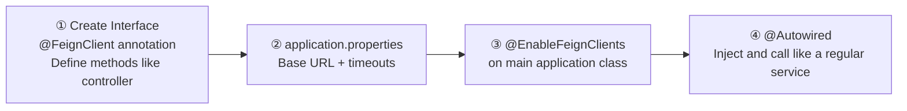
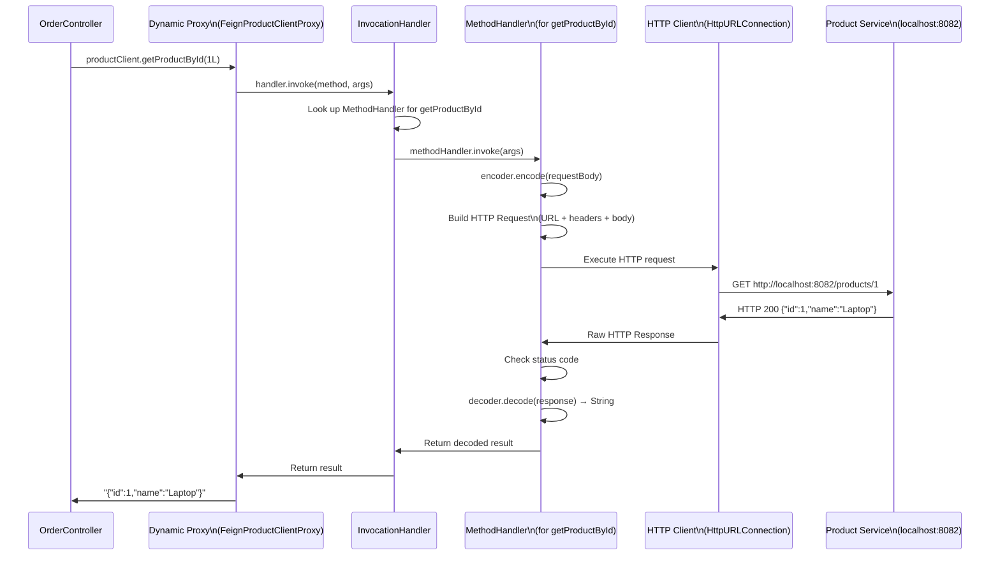
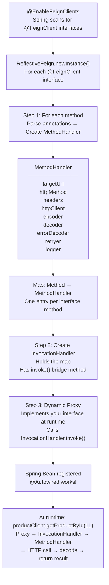
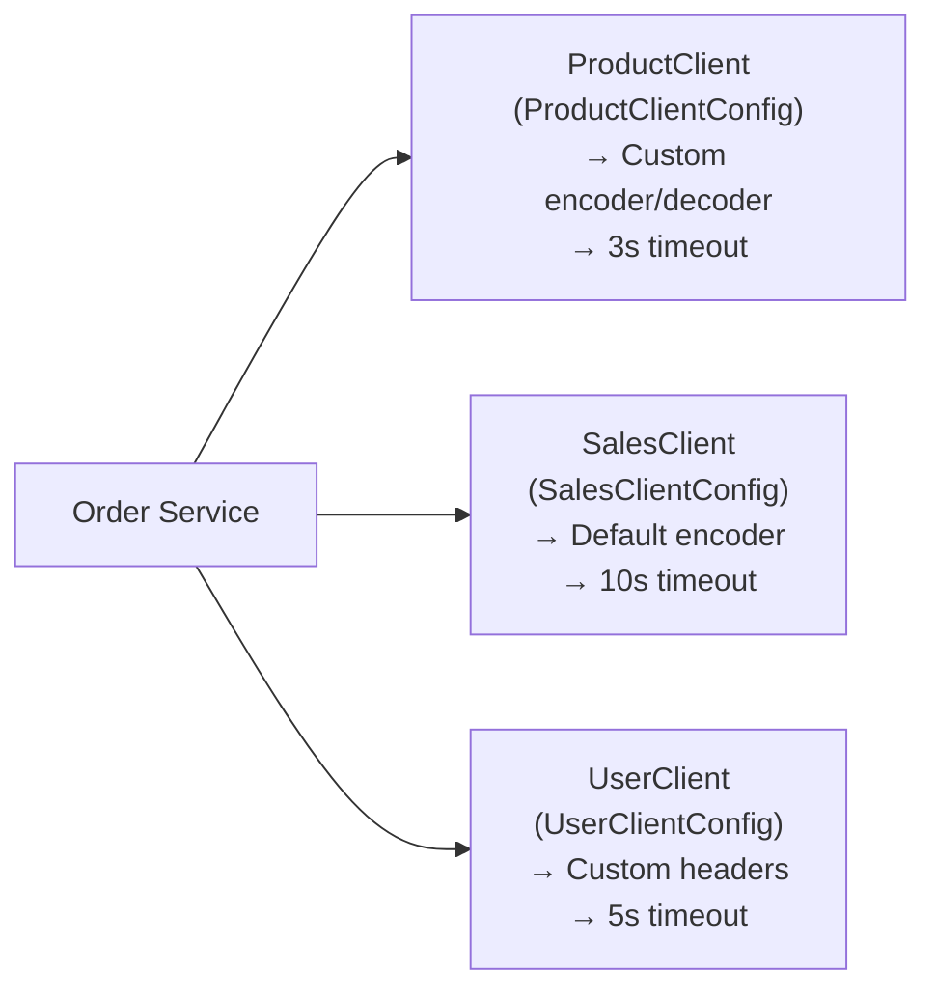
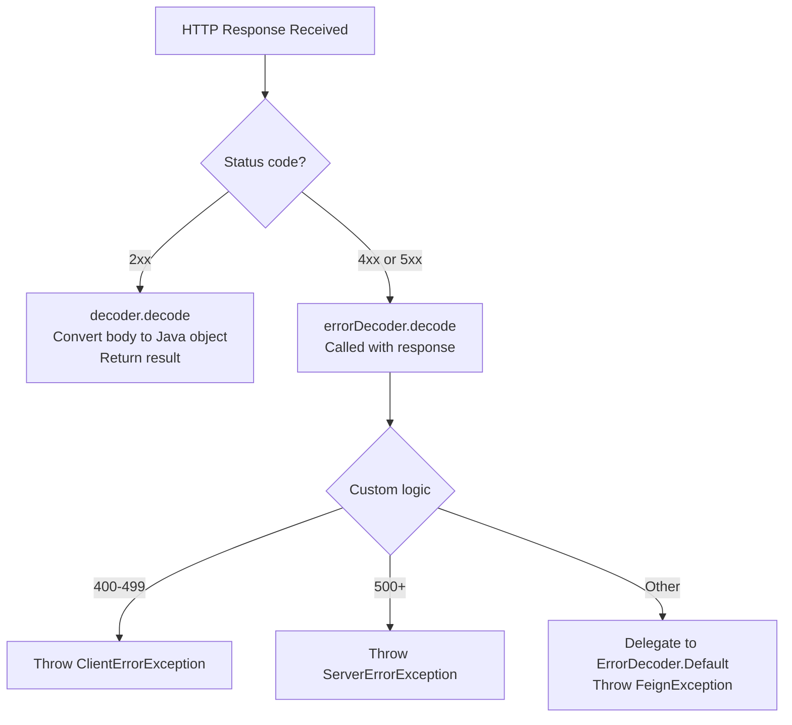
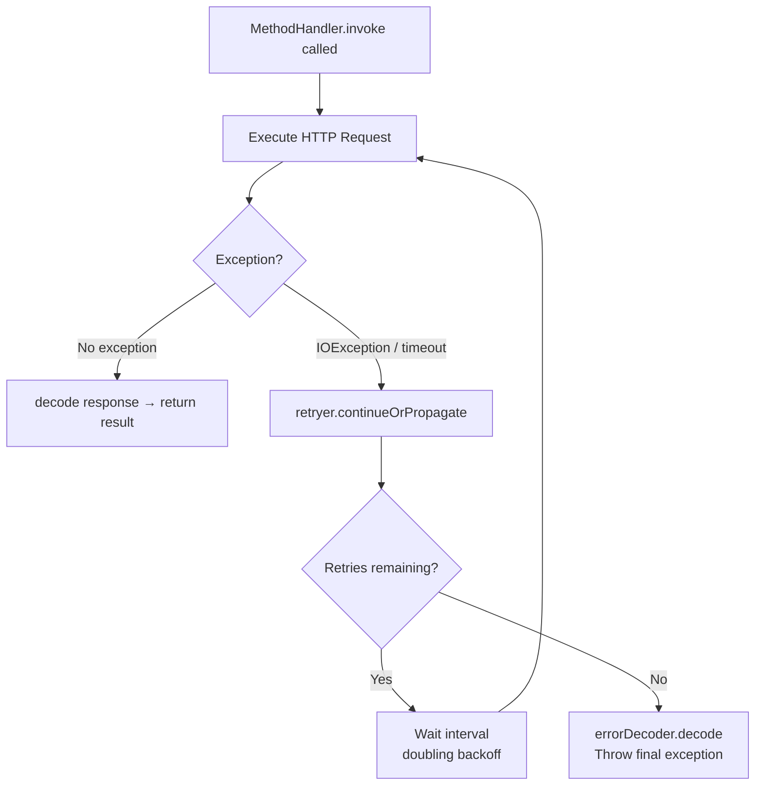
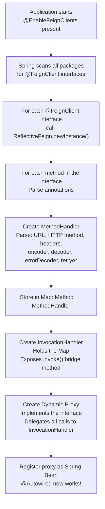
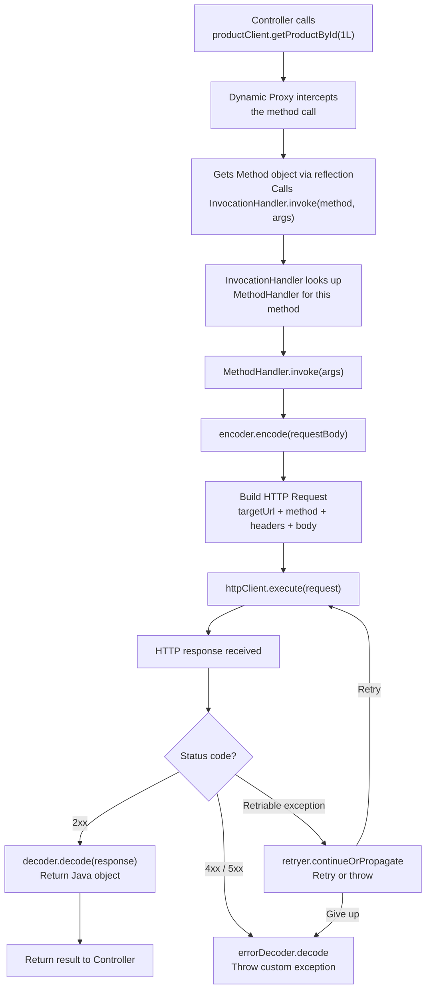

# 📌 Spring Cloud OpenFeign — Complete Spring Boot Study Guide

> A comprehensive reference covering Feign Client concepts, internal mechanics, custom encoder/decoder, error handling, retry logic, and configuration — deep enough to replace watching the original lecture.

---

## Table of Contents

1. [What is Feign Client?](#1-what-is-feign-client)
2. [What is Spring Cloud?](#2-what-is-spring-cloud)
3. [Feign Client vs RestTemplate vs RestClient](#3-feign-client-vs-resttemplate-vs-restclient)
4. [Project Setup — Maven Dependency](#4-project-setup--maven-dependency)
5. [Core Implementation — Four Required Steps](#5-core-implementation--four-required-steps)
6. [How Feign Client Works Internally](#6-how-feign-client-works-internally)
7. [Writing Feign Client Methods — Annotation Reference](#7-writing-feign-client-methods--annotation-reference)
8. [Encoder & Decoder in Feign](#8-encoder--decoder-in-feign)
9. [Error Decoder — Custom Exception Handling](#9-error-decoder--custom-exception-handling)
10. [Retry Mechanism](#10-retry-mechanism)
11. [Per-Client Configuration](#11-per-client-configuration)
12. [Timeout Configuration via application.properties](#12-timeout-configuration-via-applicationproperties)
13. [Complete Internal Flow Diagram](#13-complete-internal-flow-diagram)
14. [Key Observations & Best Practices](#14-key-observations--best-practices)
15. [Common Mistakes](#15-common-mistakes)
16. [Interview Notes](#16-interview-notes)
17. [Summary — Revision Bullets](#17-summary--revision-bullets)

---

## 1. What is Feign Client?

### Overview

**Feign** is a **declarative HTTP client** originally developed by **Netflix**. It is now available in the Spring ecosystem via the **Spring Cloud OpenFeign** library.

The word **declarative** is the defining characteristic of Feign:

| Approach | What You Write |
|---|---|
| **Imperative** (RestTemplate, RestClient) | *How* to make the HTTP call — URL building, connection management, response parsing |
| **Declarative** (Feign) | *What* to call — just an interface with annotations; the framework handles *how* |

### Why Feign Exists

In a microservices architecture, services constantly communicate with each other over HTTP. Without Feign, a developer must repeatedly write boilerplate code for:

- Building URLs (base URL + path variables + query params)
- Setting headers and content types
- Serializing request bodies to JSON
- Deserializing JSON responses to Java objects
- Handling error status codes
- Managing connection/read timeouts
- Implementing retry logic

Feign eliminates all of this by letting you define an interface that looks almost identical to a Spring MVC controller, and the framework generates the implementation at runtime.

### Real-World Analogy

> Think of Feign like ordering food at a restaurant. You (the developer) just say *"I want the pasta"* (declare the endpoint). You don't go into the kitchen and cook it yourself (write HTTP plumbing). The kitchen (Feign framework) knows how to fulfill the order.

---

## 2. What is Spring Cloud?

Spring Cloud is a **set of tools and libraries** built on top of Spring Boot that provides ready-made solutions for building **distributed microservice systems**.

### Features Provided by Spring Cloud

| Feature | Purpose |
|---|---|
| **Service Discovery** | Register and discover services (Eureka, Consul) |
| **Client-Side Load Balancing** | Distribute requests across multiple instances (Spring Cloud LoadBalancer) |
| **Circuit Breaker** | Prevent cascading failures (Resilience4j) |
| **API Gateway** | Central entry point for all services (Spring Cloud Gateway) |
| **Distributed Tracing** | Track requests across services (Micrometer Tracing) |
| **Centralized Configuration** | Manage config for all services in one place (Spring Cloud Config) |
| **OpenFeign** | Declarative HTTP client for inter-service communication |

### Why Use OpenFeign via Spring Cloud?

One major reason to use Feign (over alternatives) is its **seamless integration** with all other Spring Cloud modules. For example:

- Feign automatically integrates with **Eureka** for service discovery (use service name instead of URL).
- Feign integrates with **Spring Cloud LoadBalancer** for client-side load balancing.
- Feign integrates with **Resilience4j** for circuit breaking.

You get all of this with minimal additional configuration because they are all part of the same ecosystem.

---

## 3. Feign Client vs RestTemplate vs RestClient

| Feature | RestTemplate | RestClient | Feign Client |
|---|---|---|---|
| **Style** | Imperative | Imperative (fluent) | Declarative |
| **Code Required** | High | Medium | Minimal |
| **Interface-based** | No | No | Yes |
| **Auto-serialization** | Manual setup | Built-in | Built-in |
| **Error Handling** | Manual | Via `onStatus` | Via `ErrorDecoder` |
| **Retry** | Manual | Manual | Built-in configurable |
| **Spring Cloud Integration** | Limited | Limited | Native |
| **Load Balancing** | Manual | Manual | Auto with Spring Cloud LB |
| **Recommended for** | Legacy apps | Modern single services | Microservices |

---

## 4. Project Setup — Maven Dependency

### Adding the Dependency

```xml
<!-- pom.xml -->
<dependencies>
    <dependency>
        <groupId>org.springframework.cloud</groupId>
        <artifactId>spring-cloud-starter-openfeign</artifactId>
        <!-- No version needed — managed by Spring Cloud BOM -->
    </dependency>
</dependencies>

<dependencyManagement>
    <dependencies>
        <dependency>
            <groupId>org.springframework.cloud</groupId>
            <artifactId>spring-cloud-dependencies</artifactId>
            <version>2023.0.3</version> <!-- Use latest compatible version -->
            <type>pom</type>
            <scope>import</scope>
        </dependency>
    </dependencies>
</dependencyManagement>
```

### Why `dependencyManagement`?

In a real microservices project, you will add **multiple** Spring Cloud libraries over time:

- `spring-cloud-starter-openfeign` (Feign)
- `spring-cloud-starter-netflix-eureka-client` (Service Discovery)
- `spring-cloud-starter-loadbalancer` (Load Balancing)

All Spring Cloud libraries **must be version-compatible** with each other. Managing this manually is error-prone.

The `spring-cloud-dependencies` BOM (Bill of Materials) solves this: declare the BOM once, and every Spring Cloud dependency you add will automatically get the correct compatible version — no version tags needed on individual dependencies.

> [!TIP]
> This is the same concept as Spring Boot's own `spring-boot-dependencies` BOM. It centralizes version management so you never have to worry about compatibility.

---

## 5. Core Implementation — Four Required Steps

This section covers the minimum required to make Feign work. The example scenario:

- **Order Service** runs on port `8081` and needs to call **Product Service**
- **Product Service** runs on port `8082` and exposes a `GET /products/{id}` endpoint

---

### Step 1 — Create the Feign Client Interface

```java
// ProductClient.java (inside Order Service)
import org.springframework.cloud.openfeign.FeignClient;
import org.springframework.web.bind.annotation.GetMapping;
import org.springframework.web.bind.annotation.PathVariable;

@FeignClient(name = "product-service", url = "${feign.client.product-service.url}")
public interface ProductClient {

    @GetMapping("/products/{id}")
    String getProductById(@PathVariable("id") Long id);
}
```

#### Line-by-Line Explanation

- `@FeignClient` — marks this interface as a Feign client; Spring will generate a runtime implementation for it.
- `name = "product-service"` — an arbitrary logical name for this client; used for configuration lookup and Spring Cloud service discovery.
- `url = "${feign.client.product-service.url}"` — the **base URL** of the target service, read from `application.properties`. You can also hardcode it: `url = "http://localhost:8082"`.
- `@GetMapping("/products/{id}")` — exactly like a Spring MVC controller annotation; defines the relative path and HTTP method.
- `@PathVariable("id") Long id` — the `{id}` in the path will be replaced by this value at runtime.

> [!IMPORTANT]
> This is **just an interface**. No implementation class is written by you. The Feign framework generates the implementation automatically at application startup.

---

### Step 2 — Configure `application.properties`

```properties
# application.properties (Order Service)

# Base URL for the Product Service Feign client
feign.client.product-service.url=http://localhost:8082

# Timeouts (optional — covered in detail later)
feign.client.config.product-service.connect-timeout=3000
feign.client.config.product-service.read-timeout=5000
```

> [!NOTE]
> The property path `feign.client.product-service.url` is **not a Spring standard**. It is a custom key you defined in `@FeignClient(url = "${feign.client.product-service.url}")`. You can name it anything you like.

---

### Step 3 — Enable Feign Clients in the Application Class

```java
// OrderServiceApplication.java
import org.springframework.boot.SpringApplication;
import org.springframework.boot.autoconfigure.SpringBootApplication;
import org.springframework.cloud.openfeign.EnableFeignClients;

@SpringBootApplication
@EnableFeignClients  // Critical — tells Spring to scan for @FeignClient interfaces
public class OrderServiceApplication {
    public static void main(String[] args) {
        SpringApplication.run(OrderServiceApplication.class, args);
    }
}
```

#### Why `@EnableFeignClients` Is Required

Without this annotation, Spring Boot does **not** scan for interfaces annotated with `@FeignClient`. The interface will simply be ignored — no implementation will be generated, and autowiring will fail with a `NoSuchBeanDefinitionException`.

> [!WARNING]
> Forgetting `@EnableFeignClients` is one of the most common mistakes when setting up Feign. Always add it to your main application class.

---

### Step 4 — Use the Feign Client in a Controller or Service

```java
// OrderController.java
import org.springframework.beans.factory.annotation.Autowired;
import org.springframework.web.bind.annotation.GetMapping;
import org.springframework.web.bind.annotation.PathVariable;
import org.springframework.web.bind.annotation.RestController;

@RestController
public class OrderController {

    @Autowired
    private ProductClient productClient;  // Autowired like any normal Spring bean

    @GetMapping("/order/{productId}")
    public String placeOrder(@PathVariable Long productId) {
        // Call the Product Service using Feign — one line, no boilerplate
        String productDetails = productClient.getProductById(productId);

        System.out.println("Response from Product API: " + productDetails);
        return "Order call successful. Product: " + productDetails;
    }
}
```

> [!TIP]
> Even though `ProductClient` is an interface (and you cannot normally autowire interfaces without an implementation), Feign creates a **runtime proxy object** — so Spring's dependency injection works perfectly.

---

### The Four Steps — Summary



---

## 6. How Feign Client Works Internally

This is the most important section. It answers the fundamental question:

> **"We created only an interface with no implementation. How does `@Autowired` work? Where does the implementation come from?"**

When the Spring application starts (because of `@EnableFeignClients`), for every interface annotated with `@FeignClient`, Feign's framework invokes `ReflectiveFeign.newInstance()`. This method performs three steps.

---

### Step 1 — Parse Methods → Create `MethodHandler` Objects

For **each method** in the interface, Feign creates a **`MethodHandler`** object by parsing:

- The method's annotations (`@GetMapping`, `@PostMapping`, etc.)
- The method's parameters and their annotations (`@PathVariable`, `@RequestParam`, `@RequestHeader`, `@RequestBody`)

The `MethodHandler` object holds all the information needed to execute an actual HTTP request:

| Field in MethodHandler | How It's Derived |
|---|---|
| `targetUrl` | Base URL (`@FeignClient.url`) + relative path (`@GetMapping`) |
| `httpMethod` | From `@GetMapping` → GET, `@PostMapping` → POST, etc. |
| `headers` | From `@RequestHeader` annotations on method parameters |
| `httpClient` | Default: `HttpURLConnection`; configurable (e.g., Apache HttpClient, OkHttp) |
| `encoder` | Default: Spring's Jackson-based encoder; configurable |
| `decoder` | Default: Spring's Jackson-based decoder; configurable |
| `errorDecoder` | Default: `ErrorDecoder.Default`; configurable |
| `logger` | Default: Feign logger; configurable |
| `retryer` | Default: `Retryer.Default` (5 attempts); configurable |

After all methods are parsed, Feign creates a **map** of `{Method → MethodHandler}`.

```
Map {
    getProductById  →  MethodHandler { url, GET, encoder, decoder, retryer, ... }
    updateProduct   →  MethodHandler { url, PUT, headers, body, encoder, decoder, ... }
}
```

---

### Step 2 — Create `InvocationHandler`

Feign creates an **`InvocationHandler`** object and populates it with the map from Step 1.

The `InvocationHandler` has:
- The `{Method → MethodHandler}` map
- A method called **`invoke()`** — this is the **bridge** between the proxy (Step 3) and the actual HTTP execution

```
InvocationHandler {
    map: { getProductById → MethodHandler, ... }
    invoke(method, args) → looks up MethodHandler → calls MethodHandler.invoke()
}
```

---

### Step 3 — Create Dynamic Proxy (Runtime Implementation)

Feign uses **Java's Dynamic Proxy** (`java.lang.reflect.Proxy`) to create a **runtime implementation** of your interface.

You will never find this class in any source code — it is generated dynamically at runtime. For illustration, it would look something like this:

```java
// This class does NOT exist in source code.
// It is dynamically generated at runtime by Java's Proxy mechanism.
class FeignProductClientProxy implements ProductClient {

    private final InvocationHandler handler;

    FeignProductClientProxy(InvocationHandler handler) {
        this.handler = handler;
    }

    @Override
    public String getProductById(Long id) {
        // Get the Method object for this method via reflection
        Method method = ProductClient.class.getMethod("getProductById", Long.class);
        // Delegate to the InvocationHandler
        return (String) handler.invoke(this, method, new Object[]{id});
    }
}
```

This proxy object is registered as a **Spring bean**, which is why `@Autowired` works.

---

### Step 4 — Runtime Call Flow (When You Actually Call the Method)

When your controller calls `productClient.getProductById(1L)`:



---

### The Full Internal Architecture Diagram



---

## 7. Writing Feign Client Methods — Annotation Reference

Feign method signatures mirror Spring MVC controller methods almost exactly. Here is a comprehensive example:

```java
@FeignClient(name = "product-service", url = "${feign.client.product-service.url}")
public interface ProductClient {

    // Simple GET with path variable
    @GetMapping("/products/{id}")
    String getProductById(@PathVariable("id") Long id);

    // PUT with path variable, request param, custom header, and request body
    @PutMapping(value = "/products/update/{id}", consumes = "application/json")
    String updateProduct(
        @PathVariable("id") Long id,
        @RequestBody ProductDto productDto,
        @RequestParam("sendEmail") boolean sendEmail,
        @RequestHeader("X-Custom-Header") String customHeader
    );

    // POST with request body
    @PostMapping(value = "/products", consumes = "application/json")
    ProductDto createProduct(@RequestBody ProductDto productDto);

    // DELETE
    @DeleteMapping("/products/{id}")
    void deleteProduct(@PathVariable("id") Long id);
}
```

### Parameter Annotation Mapping

| Annotation | Maps To | Example |
|---|---|---|
| `@PathVariable` | URL path segment (`/products/{id}`) | `@PathVariable("id") Long id` |
| `@RequestParam` | Query parameter (`?sendEmail=true`) | `@RequestParam("sendEmail") boolean flag` |
| `@RequestHeader` | HTTP header | `@RequestHeader("X-Auth") String token` |
| `@RequestBody` | HTTP request body (JSON) | `@RequestBody ProductDto dto` |

> [!NOTE]
> The **order of parameters does not need to match** the target service's controller. Feign uses the annotations to determine how each parameter maps. Spring handles the binding correctly regardless of ordering.

### Corresponding Product Service Controller (for reference)

```java
// ProductController.java (Product Service — port 8082)
@RestController
public class ProductController {

    @GetMapping("/products/{id}")
    public String getProduct(@PathVariable Long id) {
        return "Product details for ID: " + id;
    }

    @PutMapping("/products/update/{id}")
    public String updateProduct(
        @PathVariable Long id,
        @RequestBody ProductDto dto,
        @RequestParam boolean sendEmail,
        @RequestHeader("X-Custom-Header") String header
    ) {
        return "Product " + id + " updated";
    }
}
```

---

## 8. Encoder & Decoder in Feign

### What They Do

| Component | Direction | Purpose |
|---|---|---|
| **Encoder** | Java Object → HTTP Body | Serializes your `@RequestBody` objects to JSON (or other format) before sending |
| **Decoder** | HTTP Body → Java Object | Deserializes the response body (JSON) back into a Java object |

This is conceptually the same as **serialization/deserialization** in RestTemplate, but abstracted behind an interface.

### Default Behavior

By default, Feign uses **Spring's encoder/decoder**, which internally uses **Jackson** (`ObjectMapper`):

- **Encoder:** Converts Java object → raw JSON string → places in request body
- **Decoder:** Reads response byte stream → converts JSON → Java object

You generally do not need to override these unless you have a special serialization format or custom logic.

---

### Writing a Custom Encoder

```java
// CustomProductEncoder.java
import feign.codec.Encoder;
import feign.RequestTemplate;
import com.fasterxml.jackson.databind.ObjectMapper;

public class CustomProductEncoder implements Encoder {

    private final ObjectMapper objectMapper = new ObjectMapper();

    @Override
    public void encode(Object object, Type bodyType, RequestTemplate template) {
        try {
            // Convert Java object to JSON string
            String json = objectMapper.writeValueAsString(object);
            // Set JSON as the request body
            template.body(json);
        } catch (Exception e) {
            throw new RuntimeException("Encoding failed", e);
        }
    }
}
```

---

### Writing a Custom Decoder

```java
// CustomProductDecoder.java
import feign.codec.Decoder;
import feign.Response;
import com.fasterxml.jackson.databind.ObjectMapper;

import java.io.InputStream;
import java.lang.reflect.Type;

public class CustomProductDecoder implements Decoder {

    private final ObjectMapper objectMapper = new ObjectMapper();

    @Override
    public Object decode(Response response, Type type) throws Exception {
        // Read the response body as an InputStream
        try (InputStream inputStream = response.body().asInputStream()) {
            // Convert JSON bytes to the expected Java type
            return objectMapper.readValue(inputStream, objectMapper.constructType(type));
        }
    }
}
```

---

### Registering Custom Encoder/Decoder in Configuration

```java
// ProductClientConfig.java
import org.springframework.context.annotation.Bean;
import org.springframework.context.annotation.Configuration;
import feign.codec.Encoder;
import feign.codec.Decoder;

@Configuration
public class ProductClientConfig {

    @Bean
    public Encoder feignEncoder() {
        return new CustomProductEncoder();
    }

    @Bean
    public Decoder feignDecoder() {
        return new CustomProductDecoder();
    }
}
```

---

### Linking the Config to a Specific Feign Client

```java
@FeignClient(
    name = "product-service",
    url = "${feign.client.product-service.url}",
    configuration = ProductClientConfig.class  // Apply config only to this client
)
public interface ProductClient {
    // ...
}
```

> [!IMPORTANT]
> By specifying `configuration = ProductClientConfig.class`, this encoder/decoder applies **only to this Feign client**. A different client (e.g., `SalesClient`) can have its own configuration without any conflict.

---

### Per-Client Configuration — Why It Matters



Each Feign client can have **completely independent** configuration. This is clean, maintainable, and avoids cross-contamination between clients.

---

## 9. Error Decoder — Custom Exception Handling

### What is Error Decoder?

An **Error Decoder** in Feign is the equivalent of exception handling in RestClient. It handles HTTP responses with **non-2xx status codes** (4xx client errors, 5xx server errors).

### Default Behavior

By default, Feign uses `ErrorDecoder.Default`, which wraps all error responses into a `FeignException` containing:
- HTTP status code
- Response body
- Response headers

```java
// What the default error decoder does internally
public class ErrorDecoder.Default implements ErrorDecoder {
    @Override
    public Exception decode(String methodKey, Response response) {
        // Returns a FeignException with status + body + headers
        return FeignException.errorStatus(methodKey, response);
    }
}
```

### Writing a Custom Error Decoder

#### Step 1 — Custom Exception Classes

```java
// ClientErrorException.java (4xx errors)
public class ClientErrorException extends RuntimeException {

    private final int statusCode;

    public ClientErrorException(int statusCode, String message) {
        super(message);
        this.statusCode = statusCode;
    }

    public int getStatusCode() {
        return statusCode;
    }
}

// ServerErrorException.java (5xx errors)
public class ServerErrorException extends RuntimeException {

    private final int statusCode;

    public ServerErrorException(int statusCode, String message) {
        super(message);
        this.statusCode = statusCode;
    }

    public int getStatusCode() {
        return statusCode;
    }
}
```

#### Step 2 — Implement Custom Error Decoder

```java
// CustomErrorDecoder.java
import feign.Response;
import feign.codec.ErrorDecoder;

public class CustomErrorDecoder implements ErrorDecoder {

    // Fallback to the default decoder for unhandled cases
    private final ErrorDecoder defaultDecoder = new ErrorDecoder.Default();

    @Override
    public Exception decode(String methodKey, Response response) {
        int status = response.status();

        if (status >= 400 && status < 500) {
            // 4xx — client-side error
            return new ClientErrorException(status, "Client error: HTTP " + status);
        }

        if (status >= 500) {
            // 5xx — server-side error
            return new ServerErrorException(status, "Server error: HTTP " + status);
        }

        // Unknown error — delegate to the default decoder
        return defaultDecoder.decode(methodKey, response);
    }
}
```

#### Step 3 — Register in Configuration

```java
// ProductClientConfig.java
@Configuration
public class ProductClientConfig {

    @Bean
    public ErrorDecoder errorDecoder() {
        return new CustomErrorDecoder();
    }
}
```

### Error Decoder Flow



> [!NOTE]
> Error Decoder is **only** invoked for non-2xx responses. Normal 2xx responses go through the regular `Decoder`.

---

## 10. Retry Mechanism

### When Does Retry Happen?

Retry in Feign is triggered **only for retriable exceptions** — primarily:
- `IOException` (network errors)
- Connection timeouts

Retry does **not** trigger for HTTP error status codes (4xx/5xx) — those go directly to the Error Decoder.

### Default Retry Behavior

Feign uses `Retryer.Default` out of the box with these settings:

| Setting | Default Value | Meaning |
|---|---|---|
| `maxAttempts` | 5 | Total attempts (1 real + 4 retries) |
| `period` (initial wait) | 100ms | Wait before the first retry |
| `maxPeriod` | 1000ms (1 second) | Maximum wait time between retries |

The wait time **doubles** between each retry (exponential backoff), capped at `maxPeriod`:

| Attempt | Wait Before This Attempt |
|---|---|
| 1st (original) | Immediate |
| 2nd (retry 1) | 100ms |
| 3rd (retry 2) | 200ms |
| 4th (retry 3) | 400ms |
| 5th (retry 4) | 800ms (capped at 1000ms) |

After all attempts are exhausted, the exception is passed to the Error Decoder.

---

### Retry Flow in Method Handler



---

### Option 1 — Disable Retry (Never Retry)

```java
// ProductClientConfig.java
import feign.Retryer;
import org.springframework.context.annotation.Bean;
import org.springframework.context.annotation.Configuration;

@Configuration
public class ProductClientConfig {

    @Bean
    public Retryer retryer() {
        // Only 1 attempt — no retries at all
        return Retryer.NEVER_RETRY;
    }
}
```

---

### Option 2 — Customize Default Retry (Change Values Only)

If you only want to change the timing/attempt values without rewriting the logic:

```java
// CustomRetryer.java
import feign.Retryer;

public class CustomRetryer extends Retryer.Default {

    public CustomRetryer() {
        super(
            200,    // Initial period: 200ms (instead of 100ms)
            2000,   // Max period: 2 seconds (instead of 1 second)
            3       // Max attempts: 3 (instead of 5)
        );
    }
    // All retry logic (doubling, capping) inherited from Default
}
```

---

### Option 3 — Full Custom Retry (Complete Control)

```java
// FullCustomRetryer.java
import feign.RetryableException;
import feign.Retryer;

public class FullCustomRetryer implements Retryer {

    private final int maxAttempts = 3;
    private int attempt = 1;

    @Override
    public void continueOrPropagate(RetryableException e) {
        if (attempt >= maxAttempts) {
            throw e; // Exhausted all attempts — propagate the exception
        }
        attempt++;
        try {
            Thread.sleep(100); // Fixed 100ms wait (no doubling)
        } catch (InterruptedException ignored) {
            Thread.currentThread().interrupt();
        }
    }

    @Override
    public Retryer clone() {
        return new FullCustomRetryer(); // Required — Feign calls clone() per request
    }
}
```

#### Register in Configuration

```java
@Bean
public Retryer retryer() {
    return new CustomRetryer();
    // or: return new FullCustomRetryer();
}
```

---

## 11. Per-Client Configuration

### Full Configuration Class Example

```java
// ProductClientConfig.java
import feign.codec.Decoder;
import feign.codec.Encoder;
import feign.codec.ErrorDecoder;
import feign.Retryer;
import org.springframework.context.annotation.Bean;
import org.springframework.context.annotation.Configuration;

@Configuration
public class ProductClientConfig {

    @Bean
    public Encoder feignEncoder() {
        return new CustomProductEncoder();
    }

    @Bean
    public Decoder feignDecoder() {
        return new CustomProductDecoder();
    }

    @Bean
    public ErrorDecoder errorDecoder() {
        return new CustomErrorDecoder();
    }

    @Bean
    public Retryer retryer() {
        return new CustomRetryer(); // or Retryer.NEVER_RETRY
    }
}
```

### Attaching Configuration to the Client

```java
@FeignClient(
    name = "product-service",
    url = "${feign.client.product-service.url}",
    configuration = ProductClientConfig.class
)
public interface ProductClient {
    // Methods...
}
```

> [!TIP]
> You can have completely different `ProductClientConfig`, `SalesClientConfig`, `UserClientConfig` — each with its own timeouts, encoders, error handlers, and retry policies. They have zero impact on each other.

---

## 12. Timeout Configuration via `application.properties`

Feign allows you to configure timeouts per client (using the `name` from `@FeignClient`) or globally.

### Per-Client Timeout

```properties
# Applies only to the Feign client named "product-service"
feign.client.config.product-service.connect-timeout=3000
feign.client.config.product-service.read-timeout=5000
```

### Global Timeout (All Feign Clients)

```properties
# Applies to ALL Feign clients unless overridden per client
feign.client.config.default.connect-timeout=5000
feign.client.config.default.read-timeout=10000
```

### Priority Rule

When both are set, **per-client configuration takes priority** over the default configuration.

### Timeout Meanings

| Property | Meaning |
|---|---|
| `connect-timeout` | Maximum time (ms) to establish a TCP connection |
| `read-timeout` | Maximum time (ms) to wait for a response after connection is established |

### How Timeouts Relate to MethodHandler

These timeout values ultimately get read and applied when the `MethodHandler` builds its `httpClient` configuration before executing the request. The `httpClient` field in `MethodHandler` uses these values when establishing the connection and waiting for the response.

---

## 13. Complete Internal Flow Diagram

### Startup Flow (Once, When Application Starts)



### Request Flow (Every Time You Call a Feign Method)



---

## 14. Key Observations & Best Practices

### Key Observations

1. **No implementation needed** — Feign generates the implementation at runtime via Java Dynamic Proxy. The `@FeignClient` interface is all you write.

2. **`@EnableFeignClients` is mandatory** — without it, Spring will not scan for Feign interfaces. This is the single most common setup mistake.

3. **`name` in `@FeignClient` has two purposes:**
   - Used as the key for `feign.client.config.<name>.*` properties in `application.properties`
   - Used as the service name for **Spring Cloud service discovery** (Eureka/Consul) — when discovery is active, you don't even need the `url` parameter

4. **Encoder/Decoder default to Jackson** — you rarely need to override these unless you have a non-JSON format or special serialization logic.

5. **ErrorDecoder only handles non-2xx** — it is not a general-purpose exception handler; it specifically handles HTTP error status codes.

6. **Retry only for retriable exceptions** — HTTP 4xx/5xx go directly to ErrorDecoder; retry only triggers on `IOException` and network-level failures.

7. **Per-client configuration is clean** — each Feign client can have its own encoder, decoder, error handler, retry policy, and timeouts without impacting other clients.

### Best Practices

- **Externalize base URLs** to `application.properties` — never hardcode them in the annotation.
- **Use `dependencyManagement`** for Spring Cloud BOM — avoids version conflict headaches.
- **Create separate config classes** per Feign client for isolation.
- **Use `Retryer.NEVER_RETRY`** for non-idempotent operations (POST, PATCH) where retrying could cause duplicate side effects.
- **Implement custom ErrorDecoder** in production — the default `FeignException` is too generic for meaningful error handling.
- **Set explicit timeouts** — never rely on the default, which can cause threads to hang indefinitely in production.
- When using **Spring Cloud service discovery**, remove the `url` from `@FeignClient` and use only `name` — Feign will resolve the URL dynamically.

---

## 15. Common Mistakes

### Mistake 1 — Forgetting `@EnableFeignClients`

```java
// WRONG — Feign interfaces are ignored; @Autowired will fail
@SpringBootApplication
public class OrderServiceApplication { ... }

// CORRECT
@SpringBootApplication
@EnableFeignClients
public class OrderServiceApplication { ... }
```

---

### Mistake 2 — Providing an Implementation for the Feign Interface

```java
// WRONG — Do NOT implement the interface yourself
@Service
public class ProductClientImpl implements ProductClient {
    @Override
    public String getProductById(Long id) {
        // manual HTTP code...
    }
}

// CORRECT — Leave it as an interface; Feign generates the implementation
@FeignClient(name = "product-service", url = "...")
public interface ProductClient {
    @GetMapping("/products/{id}")
    String getProductById(@PathVariable("id") Long id);
}
```

---

### Mistake 3 — Using the Wrong Base URL Format

```properties
# WRONG — missing the protocol
feign.client.product-service.url=localhost:8082

# CORRECT
feign.client.product-service.url=http://localhost:8082
```

---

### Mistake 4 — Using Retry on Non-Idempotent Operations

Retrying a `POST /orders` on a network timeout could create **duplicate orders**. Use `Retryer.NEVER_RETRY` or use retry only for `GET` operations.

---

### Mistake 5 — Putting `@Configuration` on Feign Config Class and Letting It Be Component-Scanned

If `ProductClientConfig` is annotated with `@Configuration` and is in a package scanned by Spring, it becomes a **global** configuration applied to **all** Feign clients, not just the one specified in `configuration = ProductClientConfig.class`.

**Fix:** Either don't annotate with `@Configuration`, or place it in a sub-package that is not component-scanned.

```java
// To make it truly local to one client:
// Option A: Don't use @Configuration, just reference the class
// Option B: Place in a package excluded from @ComponentScan
```

---

## 16. Interview Notes

**Q: What does "declarative" mean in Feign Client?**
> Declarative means you declare *what* you want (which API to call, with what parameters), not *how* to do it (building URLs, managing connections, parsing responses). The framework handles the how.

**Q: How does `@Autowired` work on a Feign interface if there's no implementation class?**
> Feign uses Java's Dynamic Proxy to generate a runtime implementation of the interface during application startup. This proxy object is registered as a Spring bean, making it available for `@Autowired` injection.

**Q: What is `MethodHandler` in Feign?**
> A `MethodHandler` is an object created by Feign for each method in a `@FeignClient` interface. It holds all information derived from the method's annotations (target URL, HTTP method, headers, encoder, decoder, retryer, error decoder) and contains the logic that actually executes the HTTP request.

**Q: What is the role of `InvocationHandler` in Feign?**
> `InvocationHandler` acts as a bridge between the Dynamic Proxy and the `MethodHandler`. When a method is called on the proxy, the proxy calls `InvocationHandler.invoke()`, which looks up the corresponding `MethodHandler` in its map and delegates execution to it.

**Q: What is the difference between `Encoder`/`Decoder` and `ErrorDecoder`?**
> `Encoder` converts a Java request body to JSON (outgoing). `Decoder` converts a JSON response body to a Java object (incoming). Both deal with 2xx responses. `ErrorDecoder` is only invoked for non-2xx responses (4xx/5xx) and is responsible for throwing appropriate exceptions.

**Q: When does Feign retry a request?**
> Only on retriable exceptions — specifically `IOException` and network/connection timeouts. HTTP error status codes (4xx/5xx) go directly to the `ErrorDecoder` and are not retried.

**Q: How do you apply different configurations to different Feign clients?**
> By specifying a `configuration` class in the `@FeignClient` annotation. Each client can reference a different configuration class with its own `@Bean` definitions for encoder, decoder, retryer, and errorDecoder.

**Q: What is the purpose of the `name` in `@FeignClient`?**
> Two purposes: (1) it's the key used in `feign.client.config.<name>.*` properties for per-client timeout configuration; (2) when Spring Cloud service discovery (Eureka) is active, it's the service name used to resolve the actual URL dynamically — eliminating the need for a hardcoded `url`.

**Q: What is the `spring-cloud-dependencies` BOM and why is it important?**
> It's a Bill of Materials that centrally manages compatible versions of all Spring Cloud libraries. Without it, you must manually ensure that openfeign, eureka, loadbalancer, and other spring cloud dependencies are mutually compatible. With the BOM, you omit version tags and Maven resolves compatible versions automatically.

---

## 17. Summary — Revision Bullets

- **Feign** = declarative HTTP client by Netflix; available in Spring via `spring-cloud-starter-openfeign`.
- **Declarative** = you tell *what* to call (interface + annotations); framework handles *how*.
- **Spring Cloud** = ecosystem of tools for distributed microservices; Feign integrates natively with all of them.
- **BOM (`spring-cloud-dependencies`)** = manages compatible versions of all Spring Cloud deps; avoids manual version conflicts.
- **Four steps for basic Feign setup:**
  1. Create `@FeignClient` interface with annotated methods
  2. Set base URL in `application.properties`
  3. Add `@EnableFeignClients` to the main class
  4. `@Autowired` the interface and call its methods
- **Internal mechanics — 3 steps at startup:**
  1. Parse each method → create `MethodHandler` (holds URL, method, encoder, decoder, retryer, etc.)
  2. Create `InvocationHandler` (holds the Method→MethodHandler map; has `invoke()` bridge)
  3. Create Dynamic Proxy (implements the interface; delegates all calls to `InvocationHandler`)
- **`MethodHandler`** is the core object — it holds everything needed to make an HTTP call and actually executes it.
- **Encoder** = Java object → JSON (request body serialization); default uses Jackson.
- **Decoder** = JSON → Java object (response deserialization); default uses Jackson.
- **ErrorDecoder** = handles non-2xx responses; default throws `FeignException`; fully customizable.
- **Retry** = only for `IOException`/network errors (not for 4xx/5xx); default = 5 attempts with doubling backoff; configurable or disable with `Retryer.NEVER_RETRY`.
- **Per-client config** = `configuration = MyConfig.class` on `@FeignClient`; isolates encoder/decoder/retry/errors per client.
- **Timeout config** = `feign.client.config.<name>.connect-timeout` and `read-timeout`; use `default` to apply to all clients.
- **`@EnableFeignClients` is not optional** — without it, Feign interfaces are completely ignored.

---

*End of Study Guide*
