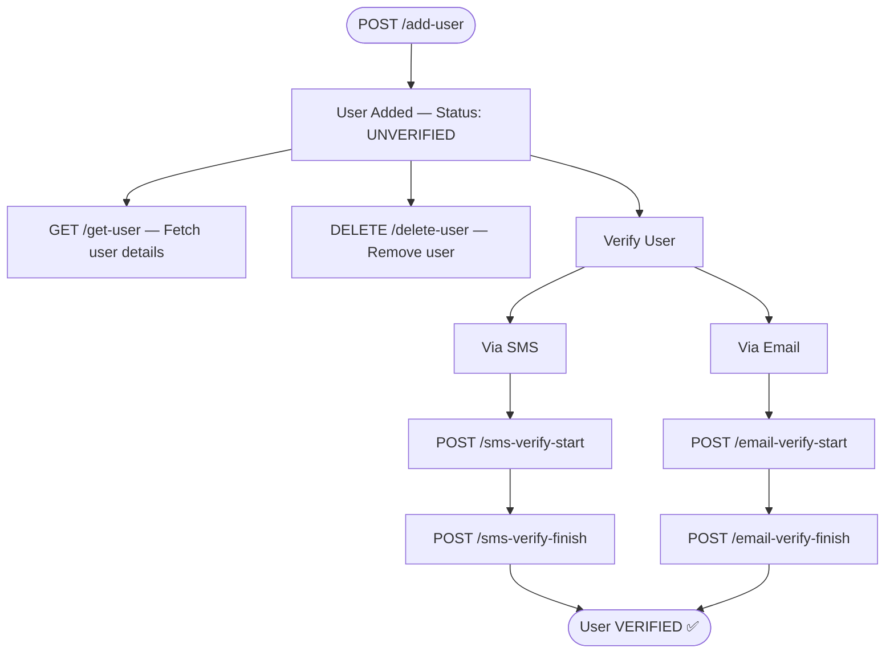
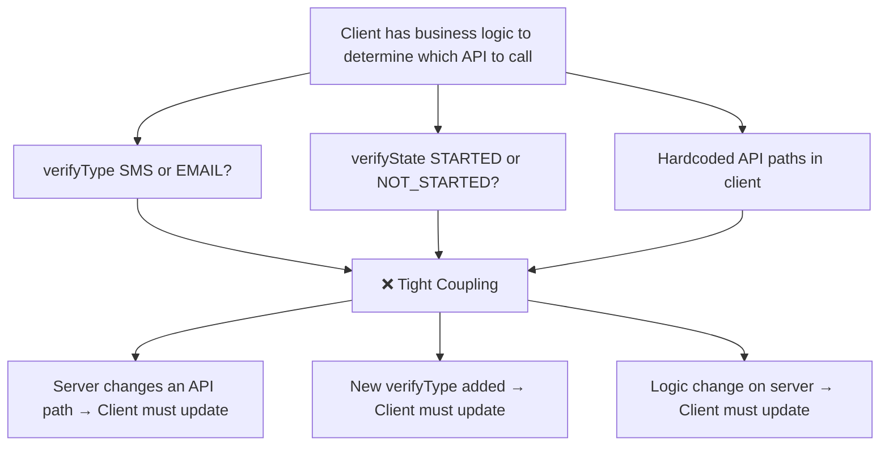
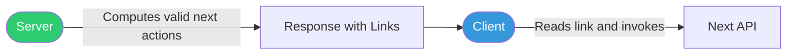
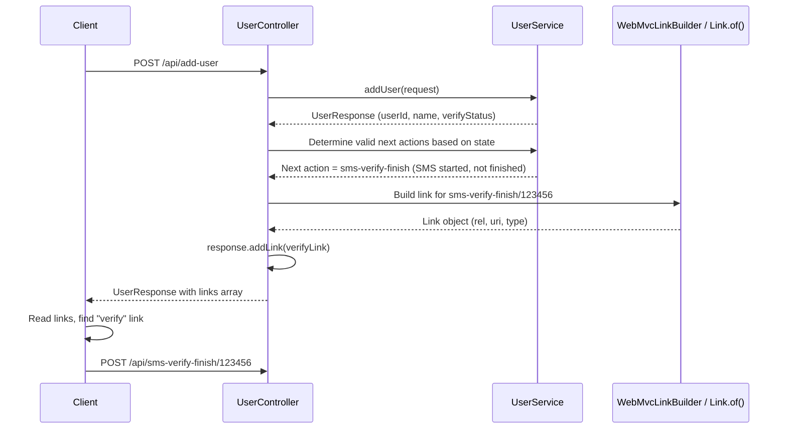

# 📌 Spring Boot HATEOAS RESTful APIs — Complete Study Guide

> **Course:** Spring Boot Series  
> **Instructor:** Shreyansh  
> **Prerequisites:** Spring Boot REST APIs, Spring Boot Basics

---

## Table of Contents

1. [What Is HATEOAS?](#what-is-hateoas)
2. [Real-World Use Case — User Verification Flow](#real-world-use-case--user-verification-flow)
3. [Response Structure — With vs Without HATEOAS](#response-structure--with-vs-without-hateoas)
4. [When to Use HATEOAS](#when-to-use-hateoas)
5. [Why Use HATEOAS — The Two Major Purposes](#why-use-hateoas--the-two-major-purposes)
6. [Tight Coupling vs Loose Coupling — Deep Dive](#tight-coupling-vs-loose-coupling--deep-dive)
7. [When NOT to Use HATEOAS](#when-not-to-use-hateoas)
8. [Dependencies & Setup](#dependencies--setup)
9. [Implementation — How to Add Links](#implementation--how-to-add-links)
10. [Link Structure Explained](#link-structure-explained)
11. [Key Observations](#key-observations)
12. [Common Mistakes](#common-mistakes)
13. [Best Practices](#best-practices)
14. [Interview Notes](#interview-notes)
15. [Summary](#summary)

---

## What Is HATEOAS?

### Full Form

**HATEOAS** = **H**ypermedia **A**s **T**he **E**ngine **O**f **A**pplication **S**tate

### Overview

HATEOAS is a constraint of the REST application architecture. It is one of the levels of the Richardson Maturity Model for RESTful APIs. It extends a plain REST API by including **hypermedia links** in API responses that tell the client what actions can be taken **next**, based on the **current state** of the resource.

In simpler terms: instead of the client needing to know all the available APIs and when to call them, the **server tells the client** — inside the response itself — which APIs are valid and relevant at that moment.

> [!NOTE]
> HATEOAS is sometimes perceived as outdated or unpopular because of its disadvantages when used carelessly. However, it is **actively used in large product companies today**. The key is knowing *when* and *how* to use it correctly — not avoiding it entirely.

### Real-World Analogy

Think of an ATM machine. After you insert your card and enter your PIN, the ATM screen shows you only the options that are **currently valid**: Withdraw, Deposit, Check Balance. It does not show you options that are not applicable to your current state (e.g., it does not show "Withdraw" if your account has zero balance).

HATEOAS works the same way — the server dynamically determines what the client *can* do next and sends those options inside the response.

---

## Real-World Use Case — User Verification Flow

### The Scenario

A user is added via a POST API (`/add-user`). At this point the user is `unverified`. The following actions are possible next, depending on the state:



This diagram represents a **state machine** for the user resource. HATEOAS allows the server to dynamically communicate which of these transitions is valid at any given point in time.

---

## Response Structure — With vs Without HATEOAS

### Without HATEOAS

A standard REST API response after adding a user:

```json
{
  "userId": "123456",
  "name": "John Doe",
  "verifyStatus": "unverified"
}
```

The client receives the data but has **no guidance** on what to do next. The client must have its own logic to decide which API to call.

---

### With HATEOAS

The same response enhanced with HATEOAS links:

```json
{
  "userId": "123456",
  "name": "John Doe",
  "verifyStatus": "unverified",
  "links": [
    {
      "rel": "self",
      "uri": "/api/get-user/123456",
      "type": "GET"
    },
    {
      "rel": "verify",
      "uri": "/api/sms-verify-finish/123456",
      "type": "POST"
    }
  ]
}
```

The client now knows:
- **`self`** — fetch the current user's details with a GET call
- **`verify`** — the next eligible verification step is `sms-verify-finish` (because the server already knows SMS verification has been started)

The client does **not** need to know about SMS vs email, started vs not-started — the server has already resolved that and provided only the valid next action.

---

### Comparison Table

| Aspect | Without HATEOAS | With HATEOAS |
|---|---|---|
| Response contains | Data only | Data + next valid actions (links) |
| Client knowledge required | Must know all APIs and when to use them | Just follow the links provided |
| Business logic location | Split between client and server | Centralized on the server |
| Coupling | Tight coupling | Loose coupling |
| API discovery | Client must know upfront | Server informs client dynamically |

---

## When to Use HATEOAS

HATEOAS is most valuable when:

1. **State-driven workflows exist** — where the valid next action depends on the current state of a resource (e.g., order processing, user verification, payment flows)
2. **You want to reduce client-side business logic** — the client should not need to implement complex decision trees to determine which API to call
3. **API versioning is a concern** — if the server-side API changes, the client does not need to be updated as long as it follows the links from responses
4. **Multiple clients exist** — web, mobile, third-party — all can rely on the same link-based navigation without maintaining separate API maps

---

## Why Use HATEOAS — The Two Major Purposes

### Purpose 1 — Loose Coupling Between Client and Server

Without HATEOAS, the client must have embedded knowledge of:
- Which APIs exist
- When each API is valid
- What conditions determine which API to call

This is **tight coupling** — changes on the server side (new API endpoints, renamed routes, changed conditions) require changes on the client side too.

With HATEOAS, the server communicates the valid next actions dynamically. The client simply follows the links. Changes on the server (new endpoints, modified flow) only require updating the server — the client adapts automatically by reading the new links.

---

### Purpose 2 — API Discovery

In a large system with hundreds of APIs, clients struggle to know which API does what and when to use it.

HATEOAS solves this by making the API **self-documenting at runtime** — after each step, the server lists the APIs that are valid for the next step. The client does not need external documentation to navigate the system; the response itself acts as a guide.

> [!IMPORTANT]
> These two purposes — **loose coupling** and **API discovery** — are the only valid reasons to add HATEOAS links. Do not add links just to add them.

---

## Tight Coupling vs Loose Coupling — Deep Dive

This is the most important section for understanding when HATEOAS genuinely helps.

### The Problem — Tight Coupling (Without HATEOAS)

Suppose the server sends this response after adding a user:

```json
{
  "userId": "123456",
  "name": "John Doe",
  "verifyStatus": "unverified",
  "verifyType": "SMS",
  "verifyState": "NOT_STARTED"
}
```

The client now has to implement this decision logic:

```javascript
// Pseudocode — client-side tight coupling logic
if (response.verifyStatus === "unverified") {
    if (response.verifyType === "SMS") {
        if (response.verifyState === "NOT_STARTED") {
            callAPI("/api/sms-verify-start");
        } else if (response.verifyState === "STARTED") {
            callAPI("/api/sms-verify-finish");
        }
    } else if (response.verifyType === "EMAIL") {
        if (response.verifyState === "NOT_STARTED") {
            callAPI("/api/email-verify-start");
        } else if (response.verifyState === "STARTED") {
            callAPI("/api/email-verify-finish");
        }
    }
}
```

#### Problems With This Approach



This business logic — *what is the next valid action?* — **belongs on the server**, not the client. The client should not be making these decisions.

---

### The Solution — Loose Coupling (With HATEOAS)

The server computes all this logic internally and sends only the result — the valid next link:

```json
{
  "userId": "123456",
  "name": "John Doe",
  "verifyStatus": "unverified",
  "links": [
    {
      "rel": "verify",
      "uri": "/api/sms-verify-finish/123456",
      "type": "POST"
    }
  ]
}
```

The server has already determined:
- User is unverified ✅
- Verify type is SMS (server knows this internally) ✅
- SMS verification has already been started (server knows this internally) ✅
- Therefore, the only valid next step is `sms-verify-finish` ✅

The client logic now becomes:

```javascript
// Pseudocode — client-side loose coupling logic (with HATEOAS)
if (response.verifyStatus === "unverified") {
    const verifyLink = response.links.find(l => l.rel === "verify");
    callAPI(verifyLink.uri, verifyLink.type);  // Just use the link
}
```



The client has **no business logic** about which API to call. It simply reads the link and invokes it. All the decision-making is now centralized on the server where it belongs.

---

## When NOT to Use HATEOAS

> [!CAUTION]
> **Never blindly add all possible next actions to every response.** This is the most common misuse of HATEOAS and the source of most of its bad reputation.

### The Bloat Problem

Consider this bloated response after adding a user:

```json
{
  "userId": "123456",
  "name": "John Doe",
  "verifyStatus": "unverified",
  "links": [
    { "rel": "self",          "uri": "/api/get-user/123456",          "type": "GET"    },
    { "rel": "remove",        "uri": "/api/delete-user/123456",       "type": "DELETE" },
    { "rel": "update",        "uri": "/api/update-user/123456",       "type": "PATCH"  },
    { "rel": "verify-sms",    "uri": "/api/sms-verify-start/123456",  "type": "POST"   },
    { "rel": "verify-email",  "uri": "/api/email-verify-start/123456","type": "POST"   }
  ]
}
```

This looks comprehensive, but it introduces serious problems:

### Disadvantages of Over-Using HATEOAS

| Problem | Explanation |
|---|---|
| **Increased server complexity** | Links are dynamic — generated based on current state. The server must compute which links are valid for every response. More links = more logic. |
| **Bloated payload** | Every response carries extra data (the links array). As the number of links grows, so does the payload size. |
| **Increased latency** | Larger payloads = more data transferred = higher response times. |
| **Maintenance nightmare** | Dynamic link generation logic must be kept in sync with the actual API endpoints. If an endpoint changes, the link generation code must also change. |
| **Harder to test** | Each response must be tested to ensure the correct links are present for each state. |

> [!WARNING]
> The rule is: **add only the links that genuinely help achieve loose coupling or API discovery for the client.** Never add links just because they are technically possible next steps. Be deliberate and selective.

---

## Dependencies & Setup

### Maven Dependency

Add to `pom.xml`:

```xml
<dependency>
    <groupId>org.springframework.boot</groupId>
    <artifactId>spring-boot-starter-hateoas</artifactId>
</dependency>
```

This dependency provides:
- The `Link` class — represents a single hypermedia link
- `WebMvcLinkBuilder` — utility class for building links programmatically
- `RepresentationModel` — base class for response objects that include links

---

## Implementation — How to Add Links

### Step 1 — Create a Base Class for Links

Rather than duplicating the links list in every response DTO, create a reusable base class:

```java
import org.springframework.hateoas.Link;
import java.util.ArrayList;
import java.util.List;

public class HateoasLinks {

    private List<Link> links = new ArrayList<>();

    public void addLink(Link link) {
        this.links.add(link);
    }

    public List<Link> getLinks() {
        return links;
    }
}
```

**Why this approach?**  
You may have 50 response DTOs across your application. Rather than adding a `List<Link>` field to each one individually, extend `HateoasLinks` and the link capability is inherited automatically.

---

### Step 2 — Create Your Response DTO Extending the Base Class

```java
public class UserResponse extends HateoasLinks {

    private String userId;
    private String name;
    private String verifyStatus;

    // Constructors
    public UserResponse(String userId, String name, String verifyStatus) {
        this.userId = userId;
        this.name = name;
        this.verifyStatus = verifyStatus;
    }

    // Getters and Setters
    public String getUserId() { return userId; }
    public String getName() { return name; }
    public String getVerifyStatus() { return verifyStatus; }
}
```

---

### Step 3 — Add Links in the Controller

There are **two ways** to create and add links:

#### Method 1 — Using `WebMvcLinkBuilder` (Programmatic, Type-Safe)

```java
import org.springframework.hateoas.Link;
import static org.springframework.hateoas.server.mvc.WebMvcLinkBuilder.*;

@RestController
@RequestMapping("/api")
public class UserController {

    @PostMapping("/add-user")
    public UserResponse addUser(@RequestBody UserRequest request) {

        // Business logic — add the user
        UserResponse response = userService.addUser(request);

        // Build the link using WebMvcLinkBuilder
        Link verifyLink = linkTo(UserController.class)
                            .slash("sms-verify-finish")
                            .slash(response.getUserId())
                            .withRel("verify")
                            .withType("POST");

        // Add the link to the response
        response.addLink(verifyLink);

        return response;
    }
}
```

**How `WebMvcLinkBuilder` constructs the URI:**

```
linkTo(UserController.class)      → /api          (base path of this controller)
  .slash("sms-verify-finish")     → /api/sms-verify-finish
  .slash(response.getUserId())    → /api/sms-verify-finish/123456
  .withRel("verify")              → rel = "verify"
  .withType("POST")               → type = "POST"
```

**Advantages of `WebMvcLinkBuilder`:**
- Refactoring-safe — if the controller class mapping changes, links update automatically
- No hardcoded strings for the base path
- IDE support for navigation

---

#### Method 2 — Using `Link.of()` (Manual, String-Based)

```java
import org.springframework.hateoas.Link;

@PostMapping("/add-user")
public UserResponse addUser(@RequestBody UserRequest request) {

    UserResponse response = userService.addUser(request);

    // Build the link manually using a URI string
    Link verifyLink = Link.of("/api/sms-verify-finish/" + response.getUserId())
                          .withRel("verify")
                          .withType("POST");

    response.addLink(verifyLink);

    return response;
}
```

**Advantages of `Link.of()`:**
- Simpler, more readable for straightforward cases
- No dependency on controller class structure

**Disadvantages:**
- Hardcoded URI strings — if the path changes, you must update all references manually
- Prone to typos

---

### Adding Multiple Links

```java
@PostMapping("/add-user")
public UserResponse addUser(@RequestBody UserRequest request) {

    UserResponse response = userService.addUser(request);

    // Self link — fetch this user's details
    Link selfLink = linkTo(UserController.class)
                        .slash("get-user")
                        .slash(response.getUserId())
                        .withSelfRel();  // rel = "self"

    // Verify link — next action based on current state
    Link verifyLink = Link.of("/api/sms-verify-finish/" + response.getUserId())
                          .withRel("verify")
                          .withType("POST");

    response.addLink(selfLink);
    response.addLink(verifyLink);

    return response;
}
```

> [!TIP]
> `.withSelfRel()` is a shortcut for `.withRel("self")`. The `self` relation is a de facto standard — it almost always represents a GET call to fetch the current resource's details. Even without specifying the type, `self` is universally understood to be a GET call.

---

### Final Response Produced

```json
{
  "userId": "123456",
  "name": "John Doe",
  "verifyStatus": "unverified",
  "links": [
    {
      "rel": "self",
      "uri": "/api/get-user/123456",
      "type": "GET"
    },
    {
      "rel": "verify",
      "uri": "/api/sms-verify-finish/123456",
      "type": "POST"
    }
  ]
}
```

---

## Link Structure Explained

Every link in the HATEOAS response has three components:

| Field | Description | Example |
|---|---|---|
| `rel` | **Relation** — the semantic relationship between the current resource and the linked action | `"self"`, `"verify"`, `"remove"`, `"update"` |
| `uri` | **Uniform Resource Identifier** — the endpoint to invoke | `"/api/sms-verify-finish/123456"` |
| `type` | **HTTP Method** — the HTTP verb to use when invoking the URI | `"GET"`, `"POST"`, `"PUT"`, `"PATCH"`, `"DELETE"` |

### The `self` Relation — Special Convention

The `self` relation is a **de facto standard** in HATEOAS:

- It always points to the endpoint that returns the current resource's own details
- It is universally understood to be a `GET` call
- Even if `type` is not specified, `rel: "self"` implies GET

```json
{
  "rel": "self",
  "uri": "/api/get-user/123456",
  "type": "GET"
}
```

---

## Internal Architecture Diagram



---

## Key Observations

1. **Links are dynamic, not static** — the set of links returned depends on the current state of the resource. For the same resource at different stages of its lifecycle, different links will appear.

2. **Server centralizes business logic** — the decision of which links to include is made entirely on the server. Clients become "dumb navigators" that simply follow provided links.

3. **`self` is always a de facto GET** — even without specifying the HTTP method type, `rel: "self"` is universally understood to point to the GET endpoint for the current resource.

4. **Two methods to create links** — `WebMvcLinkBuilder` (refactoring-safe, type-safe) and `Link.of()` (simpler, string-based). Both are valid; choose based on context.

5. **Extend a base class for links** — rather than adding `List<Link>` to every DTO, create a `HateoasLinks` base class and extend it in response DTOs that need links.

6. **HATEOAS is still used in industry** — particularly in large product companies where complex, state-driven workflows benefit from the loose coupling it provides.

7. **Add links selectively** — only add links that genuinely achieve loose coupling or aid API discovery. Avoid adding all possible next actions indiscriminately.

---

## Common Mistakes

### Mistake 1 — Adding All Possible Next Links

```json
// ❌ Bloated response — all possible actions added indiscriminately
{
  "links": [
    { "rel": "self",        "uri": "/api/get-user/123456",          "type": "GET"    },
    { "rel": "remove",      "uri": "/api/delete-user/123456",       "type": "DELETE" },
    { "rel": "update",      "uri": "/api/update-user/123456",       "type": "PATCH"  },
    { "rel": "verify-sms",  "uri": "/api/sms-verify-start/123456",  "type": "POST"   },
    { "rel": "verify-email","uri": "/api/email-verify-start/123456","type": "POST"   }
  ]
}
```

**Why it's wrong:** Bloats the response, increases server complexity, and provides little real value — the client still has to decide which link to use from all the options.

**Fix:** Add only the link(s) that are genuinely the next valid action(s) given the current state.

---

### Mistake 2 — Using Static Hardcoded Links for All Resources

```java
// ❌ Static link — will be wrong for different users
Link verifyLink = Link.of("/api/sms-verify-finish/HARDCODED_ID")
                      .withRel("verify");
```

**Fix:** Always use the dynamic resource ID from the response object.

```java
// ✅ Dynamic link
Link verifyLink = Link.of("/api/sms-verify-finish/" + response.getUserId())
                      .withRel("verify");
```

---

### Mistake 3 — Putting Link Logic in the Wrong Layer

```java
// ❌ Client decides which link to use based on raw data
if (verifyType == "SMS" && verifyState == "NOT_STARTED") {
    callAPI("/api/sms-verify-start");
}
```

**Fix:** Move this decision to the server. The server should resolve the condition and place only the valid link in the response.

---

### Mistake 4 — Forgetting the Dependency

```java
// ❌ Link class not found — missing dependency in pom.xml
import org.springframework.hateoas.Link;  // ClassNotFoundException
```

**Fix:** Add `spring-boot-starter-hateoas` to `pom.xml`.

---

## Best Practices

1. **Add links only where they achieve loose coupling or API discovery** — be deliberate and selective, not comprehensive.

2. **Always include a `self` link** — it is the convention and helps clients always know how to re-fetch the current resource.

3. **Use `WebMvcLinkBuilder` over `Link.of()`** for controllers where the base path might change — it is refactoring-safe.

4. **Centralize link-building logic** — if the same link appears in multiple response types, extract the link-building into a utility or service method to avoid duplication.

5. **Use a `HateoasLinks` base class** — do not add `List<Link>` directly to every DTO; use inheritance.

6. **Document the `rel` values** — make sure the semantic meaning of each relation (`verify`, `remove`, `update`, etc.) is documented so client teams know what each link means.

7. **Keep the number of links minimal** — ideally 1-3 links per response. If you find yourself adding 10+ links, reconsider the design.

8. **Compute links based on real state** — never add a link that is not actually valid for the current state of the resource.

---

## Interview Notes

> [!IMPORTANT]
> The following are commonly asked HATEOAS interview questions.

---

### Q1: What is HATEOAS?

**Answer:** HATEOAS stands for Hypermedia As The Engine Of Application State. It is a REST API constraint where the server includes hypermedia links in API responses that tell the client what actions can be performed next, based on the current state of the resource. It enables loose coupling between client and server and supports API discovery.

---

### Q2: What are the two major purposes of HATEOAS?

**Answer:**
1. **Loose Coupling** — The client does not need to hardcode which API to call when. The server dynamically informs the client of valid next actions, so changes on the server do not necessarily require changes on the client.
2. **API Discovery** — In systems with many APIs, clients do not need prior knowledge of all endpoints. The server guides clients through the workflow by including relevant links in each response.

---

### Q3: What are the disadvantages of HATEOAS?

**Answer:**
- Increased server-side complexity — links are dynamic and must be computed based on current resource state
- Bloated API responses — more data transferred per request
- Higher latency — larger payloads take more time to transfer
- Maintenance overhead — link generation logic must stay in sync with actual API endpoints
- Harder to test — every response state must be verified to contain correct links

---

### Q4: When should you NOT use HATEOAS?

**Answer:** You should not add all possible next actions indiscriminately to every response. Only add links where they genuinely reduce tight coupling or aid API discovery. If adding links does not remove business logic from the client, they are unnecessary and only add complexity and payload bloat.

---

### Q5: What does the `self` relation mean in HATEOAS?

**Answer:** `self` is a de facto standard relation that points to the endpoint for fetching the current resource's own details. It is universally understood to represent a GET call, even if the `type` field is not specified.

---

### Q6: What are the two ways to create HATEOAS links in Spring Boot?

**Answer:**
1. **`WebMvcLinkBuilder`** — builds links programmatically by referencing the controller class and path segments. Refactoring-safe because it derives the base path from the controller mapping.
2. **`Link.of()`** — builds links from a manually constructed URI string. Simpler but requires hardcoded string paths that must be maintained manually.

---

### Q7: How do you handle exception handling for async void methods in HATEOAS? *(Trick question)*

**Answer:** This is a trick question — HATEOAS has nothing to do with async exception handling. HATEOAS is purely about including hypermedia links in REST API responses to communicate valid next actions to the client.

---

### Q8: Is HATEOAS still used in the industry?

**Answer:** Yes. Despite criticism — mostly arising from careless overuse — HATEOAS is actively used in large product companies today. It is particularly valuable in complex, state-driven workflows (e.g., order processing, multi-step verification, payment flows) where loose coupling between client and server provides genuine long-term maintainability benefits.

---

## Summary

| Concept | Key Point |
|---|---|
| **HATEOAS** | Hypermedia As The Engine Of Application State |
| **Purpose** | Tell the client what actions are valid next, based on current resource state |
| **Two major uses** | Loose coupling + API discovery |
| **`rel`** | Relation — semantic label for the link (e.g., `self`, `verify`, `remove`) |
| **`uri`** | The endpoint to invoke |
| **`type`** | HTTP method (GET, POST, PATCH, DELETE) |
| **`self` relation** | De facto GET call to fetch current resource details |
| **Dependency** | `spring-boot-starter-hateoas` |
| **Method 1** | `WebMvcLinkBuilder` — type-safe, refactoring-safe |
| **Method 2** | `Link.of()` — string-based, simpler |
| **Base class** | Extend `HateoasLinks` in response DTOs to inherit link management |
| **Key rule** | Add links selectively — only where they genuinely reduce tight coupling |
| **Never do** | Add all possible next actions to every response — bloats payload and adds complexity |
| **Links are** | Dynamic — computed based on current resource state, not static |

> [!TIP]
> **One-line mental model:** HATEOAS is the server saying *"here is what you can do next"* — so the client does not have to figure it out. Use it carefully, only where it removes real business logic from the client.

---

*End of Study Guide — Spring Boot HATEOAS RESTful APIs*
