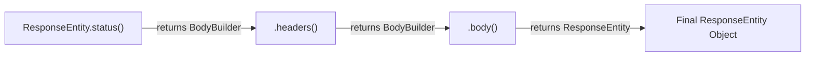
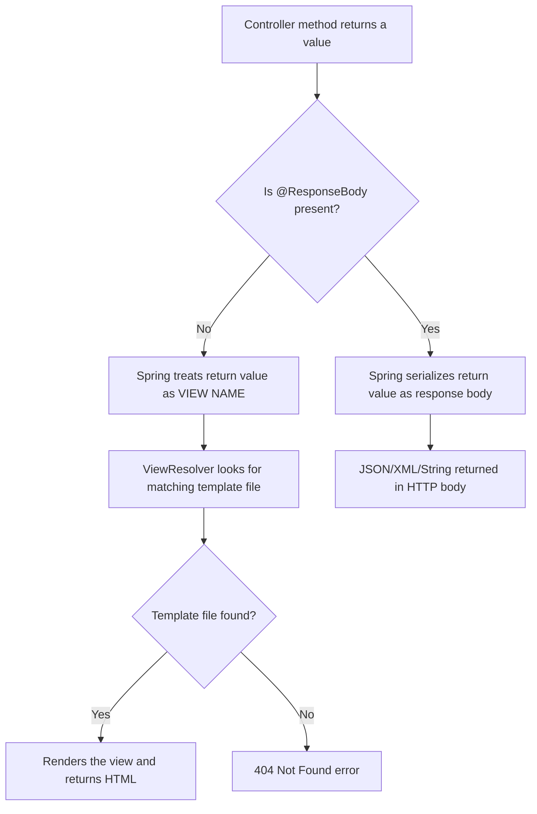
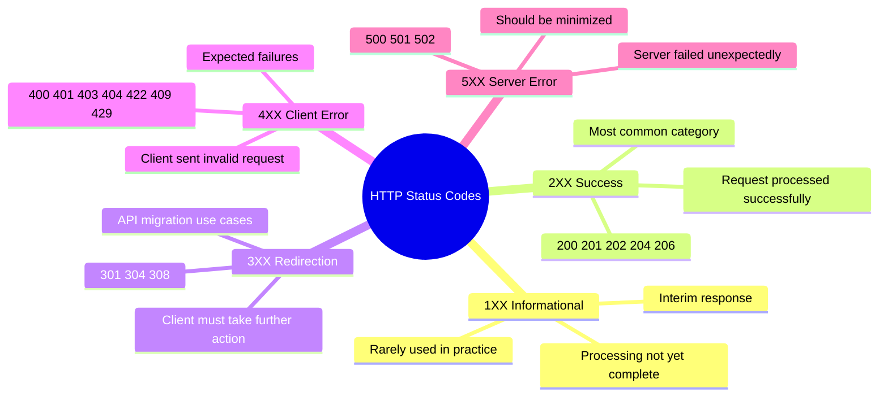
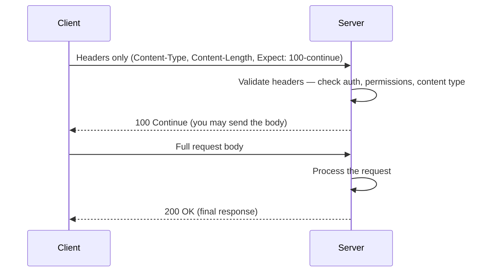
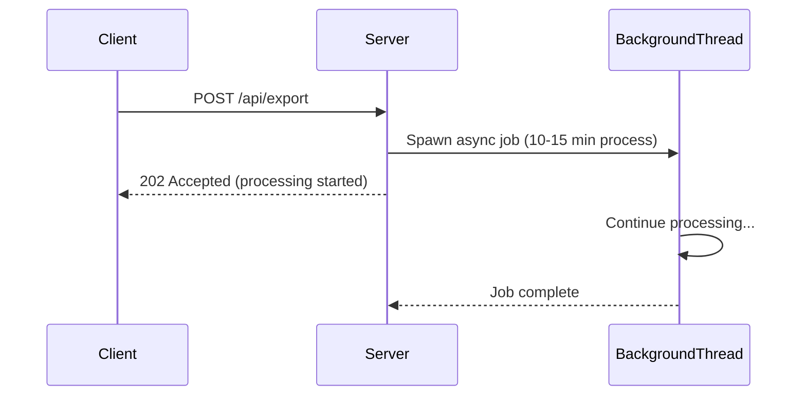
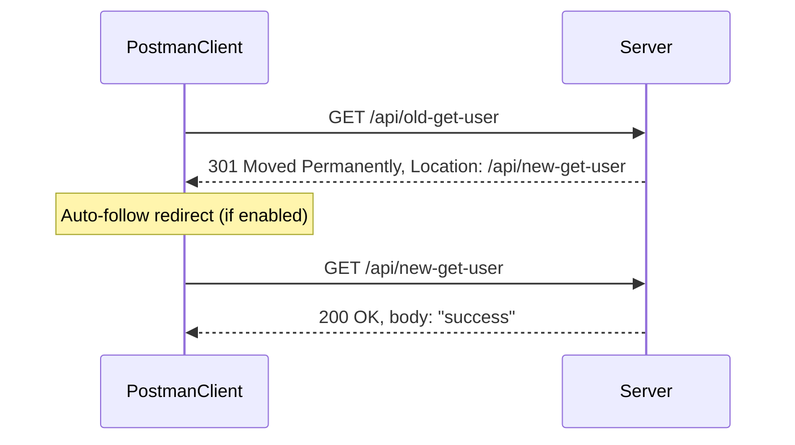
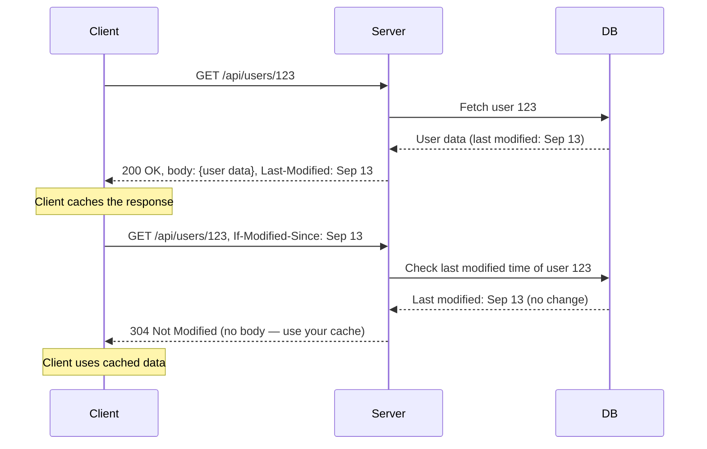

# 📌 Spring Boot — HTTP Response & Status Codes
### ResponseEntity · Builder Pattern · @ResponseBody · Complete HTTP Status Code Reference

---

> [!NOTE]
> **Context:** This guide is a prerequisite to Exception Handling in Spring Boot.
> Understanding response structure and status codes thoroughly is essential before learning how to handle exceptions and return appropriate error responses.

---

## Table of Contents

1. [Anatomy of an HTTP Response](#1-anatomy-of-an-http-response)
2. [ResponseEntity — Sending Responses in Spring Boot](#2-responseentity--sending-responses-in-spring-boot)
3. [Builder Pattern in ResponseEntity](#3-builder-pattern-in-responseentity)
4. [Sending a Response Without a Body](#4-sending-a-response-without-a-body)
5. [Returning Objects Directly (Without ResponseEntity)](#5-returning-objects-directly-without-responseentity)
6. [@ResponseBody — What It Is and Why It Matters](#6-responsebody--what-it-is-and-why-it-matters)
7. [HTTP Status Code Categories](#7-http-status-code-categories)
8. [1XX — Informational](#8-1xx--informational)
9. [2XX — Success](#9-2xx--success)
10. [3XX — Redirection](#10-3xx--redirection)
11. [4XX — Client Errors](#11-4xx--client-errors)
12. [5XX — Server Errors](#12-5xx--server-errors)
13. [Status Code Quick Reference Table](#13-status-code-quick-reference-table)
14. [Common Mistakes & Misuse](#14-common-mistakes--misuse)
15. [Summary & Quick Reference](#15-summary--quick-reference)
16. [Interview Notes](#16-interview-notes)
17. [Practice Questions](#17-practice-questions)

---

## 1. Anatomy of an HTTP Response

Every HTTP response from a Spring Boot application (or any web server) consists of exactly **three parts**:

```
┌─────────────────────────────────────────────┐
│              HTTP Response                  │
├─────────────────┬───────────────────────────┤
│  Status Code    │  200, 201, 404, 500, etc. │
├─────────────────┼───────────────────────────┤
│  Headers        │  Content-Type, Location,  │
│                 │  Last-Modified, etc.       │
├─────────────────┼───────────────────────────┤
│  Body           │  JSON, XML, String, empty  │
└─────────────────┴───────────────────────────┘
```

| Part | Description | Example |
|------|-------------|---------|
| **Status Code** | A 3-digit HTTP code indicating what happened to the request | `200 OK`, `404 Not Found`, `500 Internal Server Error` |
| **Headers** | Key-value metadata attached to the response — additional information beyond the body | `Content-Type: application/json`, `Location: /api/new-user` |
| **Body** | The actual data payload returned to the client | A JSON object, a string, or empty |

---

## 2. ResponseEntity — Sending Responses in Spring Boot

### What Is `ResponseEntity`?

`ResponseEntity` is a **generic class** in Spring that represents the entire HTTP response — status code, headers, and body — all in one object.

```java
ResponseEntity<T>
```

The type parameter `T` defines the **type of the response body**. The body must match this type.

### Internal Structure

`ResponseEntity<T>` extends `HttpEntity<T>`. The generic type `T` flows from `ResponseEntity<T>` through its parent classes and ultimately becomes the type of the body.

| Generic Type | Body Type |
|-------------|-----------|
| `ResponseEntity<String>` | Body must be a `String` |
| `ResponseEntity<User>` | Body must be a `User` object |
| `ResponseEntity<List<User>>` | Body must be a `List<User>` |
| `ResponseEntity<Void>` | No body |

---

### Full Example — Returning a Response with Status, Header, and Body

```java
@RestController
public class UserController {

    @GetMapping("/api/get-user")
    public ResponseEntity<String> getUser() {

        // Create custom headers
        HttpHeaders headers = new HttpHeaders();
        headers.add("X-Custom-Header", "my-header-value");

        // Build and return the response
        return ResponseEntity
                .status(HttpStatus.OK)       // Status: 200 OK
                .headers(headers)            // Custom headers
                .body("my response body");   // Body: a String
    }
}
```

#### Line-by-Line Explanation

| Line | Explanation |
|------|-------------|
| `ResponseEntity<String>` | Declares the return type — body will be a `String` |
| `new HttpHeaders()` | Creates an empty headers container |
| `headers.add("X-Custom-Header", "my-header-value")` | Adds a custom key-value header |
| `ResponseEntity.status(HttpStatus.OK)` | Starts building the response with status 200 |
| `.headers(headers)` | Attaches the custom headers |
| `.body("my response body")` | Sets the body — **always the last call** in the chain |

---

## 3. Builder Pattern in `ResponseEntity`

### Why the Builder Pattern?

Spring uses the **Builder Design Pattern** for constructing `ResponseEntity`. This means you chain method calls, each returning an intermediate builder, and the final call (`body()` or `build()`) produces the actual `ResponseEntity` object.



### Method Return Types

| Method | Returns | Meaning |
|--------|---------|---------|
| `ResponseEntity.status(...)` | `BodyBuilder` | Not final yet — still building |
| `.headers(...)` | `BodyBuilder` | Not final yet — still building |
| `.body(...)` | `ResponseEntity<T>` | **Final object** — building complete |
| `.build()` | `ResponseEntity<T>` | **Final object** — body is null |

> [!IMPORTANT]
> **`.body()` must always be the last call** in the chain. It is the terminal operation that produces the final `ResponseEntity`. You cannot call `.headers()` after `.body()`.

```java
// ✅ CORRECT
ResponseEntity.status(HttpStatus.OK).headers(headers).body("data");

// ❌ WRONG — body() must be last
ResponseEntity.status(HttpStatus.OK).body("data").headers(headers); // Compile error
```

---

## 4. Sending a Response Without a Body

Many operations (especially `DELETE`) succeed without returning any data. In these cases, use `.build()` instead of `.body(null)`.

```java
@DeleteMapping("/api/delete-user/{id}")
public ResponseEntity<Void> deleteUser(@PathVariable Long id) {
    userService.delete(id);

    return ResponseEntity
            .status(HttpStatus.NO_CONTENT)   // 204
            .build();                         // No body — internally calls .body(null)
}
```

### What `.build()` Does Internally

```java
// Spring's internal implementation of build()
public ResponseEntity<T> build() {
    return body(null);   // equivalent to .body(null)
}
```

> [!TIP]
> **Rule of thumb:**
> - Use `.body("some data")` when you have response data to return.
> - Use `.build()` when you explicitly want an empty body (null).
> - If you see `.build()` in code, it means the response body is intentionally empty.

---

## 5. Returning Objects Directly (Without `ResponseEntity`)

You don't always need to use `ResponseEntity`. Spring Boot allows returning a plain object directly from a controller method:

```java
@RestController
public class UserController {

    @GetMapping("/api/get-user")
    public User getUser() {
        User user = new User(1L, "Alice", "alice@example.com");
        return user;  // Spring wraps this in ResponseEntity automatically
    }
}
```

### What Spring Does Internally

When you return a plain object, Spring Boot **automatically wraps it** in a `ResponseEntity`:

```
Your return value: User object
         ↓
Spring wraps it as: ResponseEntity<User>(status=200 OK, body=user)
```

### When to Use Each Approach

| Scenario | Recommendation |
|----------|----------------|
| Need to set a custom status code (e.g., `201 Created`) | Use `ResponseEntity` |
| Need to add custom headers | Use `ResponseEntity` |
| Simple `GET` returning data, status is always 200 | Return object directly |
| `DELETE` with no body and `204` status | Use `ResponseEntity.noContent().build()` |

> [!NOTE]
> If you return a plain object without `ResponseEntity`, the default status code is always **200 OK**. To return any other status code, you must use `ResponseEntity`.

---

## 6. `@ResponseBody` — What It Is and Why It Matters

### The Problem It Solves

When a controller returns a value, Spring needs to decide: **is this a response body or a view name?**

In traditional Spring MVC (server-side rendering with JSP/Thymeleaf), returning a `String` from a controller means: "render the view template with this name." Spring would look for a file like `user.jsp` or `user.html`.

`@ResponseBody` tells Spring: **"Treat this return value as the HTTP response body, not as a view name."**

---

### `@Controller` vs `@RestController`

```java
// @Controller — no @ResponseBody by default
@Controller
public class UserController {

    @GetMapping("/api/get-user")
    public String getUser() {
        return "user"; // Spring treats "user" as a VIEW NAME — looks for user.jsp or user.html
                       // If no view file exists → 404 Not Found error
    }
}
```

```java
// @Controller + @ResponseBody — explicitly marks return value as body
@Controller
public class UserController {

    @GetMapping("/api/get-user")
    @ResponseBody                   // Now "user" is treated as the response body string
    public String getUser() {
        return "user";              // Returns the string "user" as the HTTP body
    }
}
```

```java
// @RestController — combines @Controller + @ResponseBody on all methods
@RestController
public class UserController {

    @GetMapping("/api/get-user")
    public String getUser() {       // @ResponseBody is automatically applied to all methods
        return "user";              // Returns the string "user" as the HTTP body
    }
}
```

### What's Inside `@RestController`?

```java
// Spring's definition of @RestController
@Target(ElementType.TYPE)
@Retention(RetentionPolicy.RUNTIME)
@Documented
@Controller
@ResponseBody       // ← This is included!
public @interface RestController { }
```

`@RestController` = `@Controller` + `@ResponseBody` applied to **all methods** in the class.

> [!IMPORTANT]
> **Use `@RestController`** for REST APIs that always return data (JSON/XML).
> **Use `@Controller`** when building traditional server-rendered web pages (JSP, Thymeleaf). If you need certain methods to return data, add `@ResponseBody` on those specific methods.

---

### Diagram — View vs Body Decision



---

## 7. HTTP Status Code Categories

HTTP status codes are grouped into **five categories** based on their first digit:



| Category | Name | When Used |
|----------|------|-----------|
| **1XX** | Informational | Interim, non-final responses; rarely used |
| **2XX** | Success | Request was received, understood, and processed |
| **3XX** | Redirection | Client must take additional action |
| **4XX** | Client Error | Request was invalid or unauthorized — client's fault |
| **5XX** | Server Error | Server failed despite a valid request — server's fault |

---

## 8. 1XX — Informational

### Characteristics

- Interim responses — **not the final response**.
- Server is communicating progress or status *before* completing the full request.
- Very rarely used in typical REST API development.

### `100 Continue`

**Purpose:** Client checks with the server if it can handle the request before sending the full payload.

**Flow:**



**Why it exists:** If a client is about to upload a 500MB file, it would be wasteful to upload the entire file only to receive a `401 Unauthorized`. With `100 Continue`, the client first checks if the server will accept the request before spending bandwidth on the body.

> [!NOTE]
> In 9+ years of production Spring Boot development, `100 Continue` is almost never manually implemented. HTTP clients and servers handle it transparently in most frameworks.

---

## 9. 2XX — Success

All 2XX codes indicate the request was **successfully received, understood, and processed**.

---

### `200 OK`

**Used with:** `GET`, `POST` (idempotent case), `PATCH`, `PUT`

**Meaning:** Request succeeded. Response body contains the requested/updated data.

**Special case — idempotent POST:**

```
First POST /api/users  { "name": "Alice" }  →  201 Created  (new row inserted)
Second POST /api/users { "name": "Alice" }  →  200 OK       (row already exists, same data returned)
```

An **idempotent** operation produces the same result no matter how many times it's called. When a `POST` detects the resource already exists (no new row created), return `200 OK` with the existing data.

```java
@GetMapping("/api/get-user")
public ResponseEntity<User> getUser() {
    User user = userService.findUser();
    return ResponseEntity.ok(user);   // .ok() is shorthand for .status(200).body(user)
}
```

---

### `201 Created`

**Used with:** `POST`

**Meaning:** Request succeeded and a **new resource was created** in the database/system.

```java
@PostMapping("/api/users")
public ResponseEntity<User> createUser(@RequestBody User user) {
    User created = userService.save(user);
    return ResponseEntity
            .status(HttpStatus.CREATED)   // 201
            .body(created);
}
```

> [!TIP]
> Best practice: Along with `201 Created`, include a `Location` header pointing to the newly created resource's URL:
> ```java
> URI location = URI.create("/api/users/" + created.getId());
> return ResponseEntity.created(location).body(created);
> ```

---

### `202 Accepted`

**Used with:** `POST`

**Meaning:** Request was **accepted for processing, but processing is not yet complete**. The server has started the work (often in a background thread) and will complete it asynchronously.

**Classic use cases:** Export/import jobs, bulk data processing, email sending queues.

**Flow:**



```java
@PostMapping("/api/export")
public ResponseEntity<Void> exportData() {
    exportService.startAsyncExport();    // Spawns background thread
    return ResponseEntity
            .status(HttpStatus.ACCEPTED) // 202 — accepted but not yet done
            .build();
}
```

---

### `204 No Content`

**Used with:** `DELETE`, sometimes `PUT`/`PATCH`

**Meaning:** Request succeeded, processing is **complete**, but there is **no data to return** in the body.

**Key distinction:**

| Status | Body | Use When |
|--------|------|----------|
| `200 OK` | ✅ Has body | Success + data to return |
| `204 No Content` | ❌ Empty body | Success + nothing to return |

```java
@DeleteMapping("/api/users/{id}")
public ResponseEntity<Void> deleteUser(@PathVariable Long id) {
    userService.delete(id);
    return ResponseEntity.noContent().build();   // 204 — success, no body
}
```

---

### `206 Partial Content`

**Used with:** `GET`, `POST` (bulk operations)

**Meaning:** The request was partially successful. Some items succeeded, some failed.

**Use case — Bulk operations:**

```
POST /api/users/bulk  [100 users]
→ 95 users created successfully
→ 5 users failed validation
→ Return 206 Partial Content with details of what succeeded and what failed
```

```java
@PostMapping("/api/users/bulk")
public ResponseEntity<BulkResult> bulkCreate(@RequestBody List<User> users) {
    BulkResult result = userService.bulkSave(users);
    // result.getSuccessCount() = 95, result.getFailureCount() = 5

    if (result.hasFailures()) {
        return ResponseEntity.status(HttpStatus.PARTIAL_CONTENT).body(result);   // 206
    }
    return ResponseEntity.status(HttpStatus.CREATED).body(result);               // 201
}
```

---

## 10. 3XX — Redirection

3XX codes indicate the client must **take additional action** to complete the request — typically following a redirect to a new URL.

**Most common use case:** Migrating from a legacy API to a new API URL.

---

### `301 Moved Permanently`

**Meaning:** The requested resource has been **permanently moved** to a new URI. All future requests should use the new URI. The old URI should never be used again.

**Key behavior:** The HTTP method **can change** during redirect (e.g., a `POST` to the old URI can be redirected and arrive as a `GET` at the new URI).

```java
@GetMapping("/api/old-get-user")
public ResponseEntity<Void> oldGetUser() {
    HttpHeaders headers = new HttpHeaders();
    headers.add("Location", "/api/new-get-user");   // Tell client where to go

    return ResponseEntity
            .status(HttpStatus.MOVED_PERMANENTLY)    // 301
            .headers(headers)
            .build();
}

@GetMapping("/api/new-get-user")
public ResponseEntity<String> newGetUser() {
    return ResponseEntity.ok("success");
}
```

**How clients handle it:**



> [!TIP]
> In Postman, there is a setting called **"Automatically follow redirects"**. When enabled (default), Postman transparently follows the `Location` header and you see the final `200 OK` response. When disabled, you see the raw `301` response with the `Location` header.

---

### `308 Permanent Redirect`

**Meaning:** Same as `301` — permanently moved to a new URI.

**Key difference from `301`:** The HTTP method **must NOT change** during redirect. If the original request was `POST`, the redirected request must also be `POST`.

| Code | Method Change Allowed? |
|------|----------------------|
| `301 Moved Permanently` | ✅ Yes — `POST` can become `GET` |
| `308 Permanent Redirect` | ❌ No — `POST` must stay `POST` |

> [!NOTE]
> `308` is the stricter, more correct version of `301`. It prevents the HTTP method from changing during redirect, which is often the desired behavior for REST APIs. Use `308` when your old and new APIs share the same HTTP method.

---

### `304 Not Modified`

**Purpose:** Browser/client caching optimization — avoid re-downloading data that hasn't changed.

**Flow:**



**Key headers involved:**

| Header | Direction | Purpose |
|--------|-----------|---------|
| `Last-Modified` | Server → Client | When the resource was last updated |
| `If-Modified-Since` | Client → Server | "Only send data if modified after this time" |

```java
@GetMapping("/api/users/{id}")
public ResponseEntity<User> getUser(
        @PathVariable Long id,
        @RequestHeader(value = "If-Modified-Since", required = false) String ifModifiedSince) {

    User user = userService.findById(id);
    String lastModified = user.getLastModifiedDate().toString();

    if (ifModifiedSince != null && lastModified.equals(ifModifiedSince)) {
        return ResponseEntity.status(HttpStatus.NOT_MODIFIED).build();   // 304 — use cache
    }

    return ResponseEntity.ok()
            .header("Last-Modified", lastModified)
            .body(user);   // 200 with fresh data
}
```

> [!WARNING]
> **Common misuse of `304 Not Modified`:**
> Some developers use `304` for PATCH requests when the incoming data matches the existing data (e.g., updating a name to the same value it already has). **This is incorrect.**
>
> `304 Not Modified` is strictly for **GET caching** — it is a mechanism for clients with cached responses to check whether their cache is still valid. It should never be used to indicate "no update was needed" in a PATCH operation.
>
> For a PATCH where no change was needed, return `200 OK` with the existing data, or `204 No Content`.

---

## 11. 4XX — Client Errors

4XX codes indicate the **client made an invalid request**. The server is working correctly; the fault lies with the client (bad data, missing credentials, wrong permissions, etc.). These are **expected, handled failures**.

---

### `400 Bad Request`

**Used with:** All HTTP methods

**Meaning:** The client did not send the required or valid data needed to process the request.

**Examples:**
- Missing required fields in the request body
- Invalid data format (e.g., sending a string where a number is expected)
- Malformed JSON

```java
@PostMapping("/api/users")
public ResponseEntity<String> createUser(@RequestBody @Valid UserRequest request,
                                          BindingResult result) {
    if (result.hasErrors()) {
        return ResponseEntity.badRequest().body("Missing required fields");   // 400
    }
    // ...
}
```

---

### `401 Unauthorized`

**Used with:** All HTTP methods (on protected endpoints)

**Meaning:** The request requires **authentication** but none was provided, or the provided credentials are invalid.

**Examples:**
- Accessing a protected API without a Bearer token
- Providing an expired JWT token
- Wrong username/password in Basic Auth

> [!NOTE]
> Despite the name "Unauthorized," `401` is really about **authentication** (who are you?), not authorization (what are you allowed to do?). The HTTP spec naming is historically confusing.

---

### `403 Forbidden`

**Used with:** All HTTP methods (on permission-protected operations)

**Meaning:** The client is **authenticated** (identity is known) but does **not have permission** to perform the requested operation.

**Example:**
- A regular user trying to access an admin-only endpoint
- A user trying to update another user's data
- An authenticated non-admin attempting to delete a record that only admins can delete

| Code | Authentication | Authorization | Result |
|------|---------------|---------------|--------|
| `401` | ❌ Not provided or invalid | — | Unauthorized |
| `403` | ✅ Valid credentials | ❌ Insufficient permissions | Forbidden |

---

### `404 Not Found`

**Used with:** `GET`, `PATCH`, `DELETE` (not typically `POST`)

**Meaning:** The server cannot find the **specific resource** the client is requesting.

**Examples:**
- `GET /api/users/999` — user with ID 999 does not exist in the database
- `PATCH /api/users/999` — cannot update a user that doesn't exist
- `DELETE /api/users/999` — cannot delete a user that doesn't exist

```java
@GetMapping("/api/users/{id}")
public ResponseEntity<User> getUser(@PathVariable Long id) {
    return userService.findById(id)
            .map(user -> ResponseEntity.ok(user))
            .orElse(ResponseEntity.notFound().build());   // 404
}
```

> [!NOTE]
> `POST` is typically not associated with `404` because `POST` creates a new resource — it doesn't look up an existing one by ID.

---

### `405 Method Not Allowed`

**Meaning:** The endpoint exists, but the **HTTP method used is not supported** for that endpoint.

**Example:** A `GET`-only endpoint hit with a `POST` request.

```java
// This controller only handles GET /api/get-user
@GetMapping("/api/get-user")
public ResponseEntity<String> getUser() {
    return ResponseEntity.ok("User data");
}

// If you send: POST /api/get-user → Spring returns 405 Method Not Allowed automatically
```

Spring Boot handles this automatically — you don't need to write any code.

---

### `409 Conflict`

**Used with:** `POST`, `PATCH`, `DELETE` (not typically `GET`)

**Meaning:** The request conflicts with the **current state of the resource**. Typically used when a concurrent operation is already in progress on the same resource.

**Pattern — Lock-based concurrency control:**

```
Request A: PATCH /api/users/123  →  Acquires lock on user 123, processing...
Request B: PATCH /api/users/123  →  Lock exists → 409 Conflict returned immediately
Request A completes → Lock released
```

**Implementation with a cache-based lock:**

```java
@PatchMapping("/api/users/{id}")
public ResponseEntity<User> updateUser(@PathVariable Long id,
                                        @RequestBody UserUpdateRequest request) {
    String lockKey = "lock:user:" + id;

    if (cacheService.isLocked(lockKey)) {
        return ResponseEntity.status(HttpStatus.CONFLICT)
                .body(null);   // 409 — another request is in progress
    }

    cacheService.lock(lockKey, Duration.ofSeconds(10));   // TTL: auto-release after 10s
    try {
        User updated = userService.update(id, request);
        return ResponseEntity.ok(updated);
    } finally {
        cacheService.unlock(lockKey);   // Or let TTL release it
    }
}
```

> [!TIP]
> Always set a **TTL (Time to Live)** on your lock. If the processing request crashes before releasing the lock, the TTL ensures the lock is automatically released after a safe timeout period (e.g., 10 seconds). Without TTL, a crash could leave the resource permanently locked.

---

### `422 Unprocessable Entity`

**Used with:** All HTTP methods

**Meaning:** The request is syntactically valid (well-formed), but it **cannot be processed due to business logic rules**. This is a semantic validation failure.

**Difference from `400`:**

| Code | When to Use |
|------|------------|
| `400 Bad Request` | Syntactic failure — missing fields, wrong data type, malformed request |
| `422 Unprocessable Entity` | Semantic/business failure — request is valid but violates business rules |

**Example:**

```java
@PostMapping("/api/users")
public ResponseEntity<?> createUser(@RequestBody @Valid UserRequest request) {
    // Request is syntactically valid — all fields present and correct types

    if ("France".equalsIgnoreCase(request.getCountry())) {
        // Business rule: France users cannot be onboarded (no license)
        return ResponseEntity
                .status(HttpStatus.UNPROCESSABLE_ENTITY)   // 422
                .body("Users from France cannot be onboarded at this time.");
    }

    User created = userService.save(request);
    return ResponseEntity.status(HttpStatus.CREATED).body(created);
}
```

---

### `429 Too Many Requests`

**Meaning:** The client has sent **too many requests in a given time period**. Used for rate limiting.

**Example:** A user is allowed 10 API calls per minute. The 11th call within the same minute returns `429`.

```java
@GetMapping("/api/data")
public ResponseEntity<?> getData(@RequestHeader("User-Id") String userId) {
    if (rateLimiter.isExceeded(userId)) {
        return ResponseEntity
                .status(HttpStatus.TOO_MANY_REQUESTS)   // 429
                .header("Retry-After", "60")            // Tell client to wait 60 seconds
                .body("Rate limit exceeded. Max 10 requests per minute.");
    }

    return ResponseEntity.ok(dataService.getData());
}
```

> [!TIP]
> Best practice: Include a `Retry-After` header in `429` responses to tell the client how many seconds to wait before trying again.

---

## 12. 5XX — Server Errors

5XX codes mean the server **failed to fulfill a valid request** due to an error on the server side — not the client's fault. These should be **minimized** in production systems.

> [!IMPORTANT]
> Every 5XX error represents a bug or infrastructure failure that should be investigated and fixed. Your goal as a developer is to keep 5XX rates as close to zero as possible.

---

### `500 Internal Server Error`

**Meaning:** A generic, catch-all server error. Something unexpected went wrong during processing.

**Common causes:**
- `NullPointerException`
- `ClassCastException`
- Database connection failure
- Unhandled exceptions in your code

```java
// This code might throw NullPointerException → 500 Internal Server Error
@GetMapping("/api/users/{id}")
public User getUser(@PathVariable Long id) {
    User user = userService.findById(id);  // Returns null if not found
    return user.getName();                  // NullPointerException if user is null!
}
```

> [!CAUTION]
> `500` is the most common 5XX error. It usually indicates an unhandled exception. Always use proper exception handling (covered in the exception handling guide) to return appropriate 4XX codes instead of letting a `NullPointerException` bubble up as a `500`.

---

### `501 Not Implemented`

**Meaning:** The API endpoint exists and is accessible, but its **implementation is not yet complete**.

**Use case:** During incremental development — the endpoint is created and registered, but the business logic is still being written.

```java
@PostMapping("/api/reports/generate")
public ResponseEntity<String> generateReport() {
    // TODO: Implement report generation
    return ResponseEntity
            .status(HttpStatus.NOT_IMPLEMENTED)   // 501
            .body("Report generation is under development and will be available soon.");
}
```

---

### `502 Bad Gateway`

**Meaning:** The server is acting as a **gateway or proxy** and received an **invalid or no response** from an upstream server.

**Common scenario:** Your application is deployed behind **Nginx** (reverse proxy). If Nginx cannot reach your application (wrong port, app crashed, misconfiguration), Nginx returns `502 Bad Gateway` to the client.

```
Client → Nginx (proxy) → Your App
                    ↑
         502 returned here if
         Nginx can't reach App
```

**Causes:**
- Incorrect port configuration in Nginx
- Application server is down or crashed
- Network timeout between proxy and upstream server

---

## 13. Status Code Quick Reference Table

| Code | Name | HTTP Methods | Description |
|------|------|-------------|-------------|
| **200** | OK | GET, POST, PATCH, PUT | Request succeeded with response body |
| **201** | Created | POST | New resource created |
| **202** | Accepted | POST | Accepted for async processing |
| **204** | No Content | DELETE, PUT | Success, no response body |
| **206** | Partial Content | POST, GET | Bulk operation — partial success |
| **301** | Moved Permanently | All | Resource permanently moved; method can change |
| **304** | Not Modified | GET | Client cache is still valid |
| **308** | Permanent Redirect | All | Resource permanently moved; method must stay same |
| **400** | Bad Request | All | Missing or invalid request data |
| **401** | Unauthorized | All | Authentication required or failed |
| **403** | Forbidden | All | Authenticated but lacks permission |
| **404** | Not Found | GET, PATCH, DELETE | Resource does not exist |
| **405** | Method Not Allowed | All | HTTP method not supported for this endpoint |
| **409** | Conflict | POST, PATCH, DELETE | Concurrent operation conflict |
| **422** | Unprocessable Entity | All | Business logic validation failure |
| **429** | Too Many Requests | All | Rate limit exceeded |
| **500** | Internal Server Error | All | Unexpected server failure |
| **501** | Not Implemented | All | Endpoint not yet implemented |
| **502** | Bad Gateway | All | Proxy/gateway cannot reach upstream |

---

## 14. Common Mistakes & Misuse

> [!WARNING]
> **Mistake 1: Using `304 Not Modified` for PATCH "no-op" scenarios**
>
> **Wrong:** Returning `304` when a PATCH request tries to update a field to its existing value.
> ```java
> // ❌ WRONG
> if (existingUser.getName().equals(request.getName())) {
>     return ResponseEntity.status(304).build();  // 304 is NOT for this
> }
> ```
> **Correct:** Return `200 OK` with the existing data, or `204 No Content`.
> ```java
> // ✅ CORRECT
> if (existingUser.getName().equals(request.getName())) {
>     return ResponseEntity.ok(existingUser);     // 200 — no change needed
> }
> ```

> [!WARNING]
> **Mistake 2: Using `500` for expected business failures**
>
> **Wrong:** Letting a `ResourceNotFoundException` propagate as a `500`.
> ```java
> // ❌ WRONG — unhandled exception becomes 500
> public User getUser(Long id) {
>     return userRepository.findById(id)
>             .orElseThrow(() -> new RuntimeException("User not found"));
> }
> ```
> **Correct:** Map business exceptions to appropriate 4XX codes.
> ```java
> // ✅ CORRECT — return 404 for missing resources
> public ResponseEntity<User> getUser(Long id) {
>     return userRepository.findById(id)
>             .map(ResponseEntity::ok)
>             .orElse(ResponseEntity.notFound().build());
> }
> ```

> [!WARNING]
> **Mistake 3: Always returning `200` regardless of outcome**
>
> **Wrong:** Returning `200 OK` for a `POST` that created a new resource.
> ```java
> // ❌ WRONG — should be 201
> return ResponseEntity.ok(createdUser);
> ```
> **Correct:** Return `201 Created` when a new resource is created.
> ```java
> // ✅ CORRECT
> return ResponseEntity.status(HttpStatus.CREATED).body(createdUser);
> ```

> [!WARNING]
> **Mistake 4: Confusing `401` and `403`**
>
> - `401` = "I don't know who you are" (no/invalid credentials)
> - `403` = "I know who you are, but you can't do this" (valid credentials, insufficient permissions)

---

## 15. Summary & Quick Reference

### `ResponseEntity` Cheat Sheet

```java
// 200 OK with body
ResponseEntity.ok(body);
ResponseEntity.status(HttpStatus.OK).body(body);

// 201 Created
ResponseEntity.status(HttpStatus.CREATED).body(createdResource);
ResponseEntity.created(locationUri).body(createdResource);

// 204 No Content
ResponseEntity.noContent().build();

// 400 Bad Request
ResponseEntity.badRequest().body("Error message");

// 404 Not Found
ResponseEntity.notFound().build();

// Custom status with headers and body
ResponseEntity.status(HttpStatus.ACCEPTED)
        .header("X-Job-Id", jobId)
        .body(result);
```

### Key Rules to Remember

- `ResponseEntity` uses the **Builder Pattern** — `.body()` is always the final call.
- Use `.build()` for **no body**; use `.body(data)` when returning data.
- `@RestController` = `@Controller` + `@ResponseBody` on all methods.
- Without `@ResponseBody`, a return value from `@Controller` is treated as a **view name**.
- Without `ResponseEntity`, Spring returns `200 OK` by default.
- **2XX** = success; **4XX** = client error (expected); **5XX** = server error (unexpected, minimize these).
- `304 Not Modified` is **only** for GET caching — never for PATCH no-ops.
- `401` = not authenticated; `403` = authenticated but not authorized.
- `409 Conflict` = concurrent operation lock; always set TTL on locks.
- `422 Unprocessable Entity` = syntactically valid request that fails business rules.

---

## 16. Interview Notes

> [!IMPORTANT]
> Commonly asked in Spring Boot / REST API interviews.

**Q1: What are the three components of an HTTP response?**
- Status code, headers, body.

**Q2: What is `ResponseEntity` and why is it used?**
- A generic Spring class representing a full HTTP response (status + headers + body). Used when you need to control the status code or headers explicitly, rather than relying on Spring's defaults.

**Q3: Why must `.body()` be the last call when building a `ResponseEntity`?**
- `ResponseEntity` uses the Builder Pattern. `status()` and `header()` return `BodyBuilder` (an intermediate builder). Only `body()` and `build()` return the final `ResponseEntity` object. Calling anything after `body()` is impossible as there is no further builder.

**Q4: What is the difference between `@Controller` and `@RestController`?**
- `@RestController` = `@Controller` + `@ResponseBody`. With `@Controller`, return values are treated as view names unless `@ResponseBody` is added. With `@RestController`, all return values are serialized as HTTP response bodies automatically.

**Q5: What is the difference between `200` and `201`?**
- `200 OK` = request succeeded; existing data returned. `201 Created` = request succeeded and a new resource was created.

**Q6: When do you use `202 Accepted`?**
- When a request is accepted for processing but processing is asynchronous and not yet complete (e.g., bulk imports, export jobs, email queues).

**Q7: What is the difference between `301` and `308`?**
- Both are permanent redirects. `301` allows the HTTP method to change during redirect (e.g., `POST` → `GET`). `308` does not — the same method must be used in the redirect.

**Q8: What is the correct use of `304 Not Modified`?**
- For `GET` request caching. When the client passes `If-Modified-Since` header and the resource hasn't changed, the server returns `304` with no body — the client uses its cached copy.

**Q9: What is the difference between `401` and `403`?**
- `401 Unauthorized` = authentication failure (no credentials or invalid credentials). `403 Forbidden` = valid credentials, but the user lacks permission for the operation.

**Q10: When should `422` be used instead of `400`?**
- `400` for syntactic failures (missing fields, wrong types). `422` for semantic/business rule failures (valid request format but violates business logic).

**Q11: What is `409 Conflict` used for?**
- Concurrent modification conflicts. When one request is already in progress on a resource, a second concurrent request on the same resource returns `409`.

**Q12: What causes a `502 Bad Gateway`?**
- When a proxy or gateway (e.g., Nginx) cannot reach the upstream server (your application). Common causes: app is down, wrong port, network issue between proxy and app.

**Q13: What is the difference between `404` and `405`?**
- `404 Not Found` = the resource/URL doesn't exist. `405 Method Not Allowed` = the URL exists but the HTTP method used (e.g., `POST` to a `GET`-only endpoint) is not supported.

---

## 17. Practice Questions

### Easy

1. What are the three parts of an HTTP response?
2. What is the default status code when you return an object directly from a `@RestController` method?
3. What does `ResponseEntity.noContent().build()` return?
4. Which HTTP method is most commonly paired with `201 Created`?
5. What is the difference between `@Controller` and `@RestController`?

### Medium

6. Write a `GET /api/users/{id}` endpoint that returns `200 OK` with the user body if found, `404 Not Found` if not found, and sets a custom `X-Served-By` header on the response.
7. Explain the Builder Pattern as implemented in `ResponseEntity`. Why can't you call `.headers()` after `.body()`?
8. Write a `DELETE /api/users/{id}` endpoint that returns the correct status code for a successful deletion with no response body.
9. A PATCH request comes in to update a user's email to the same email they already have. What status code should you return and why?
10. Explain the flow of `304 Not Modified` with the relevant request and response headers.

### Hard

11. Design a bulk `POST /api/users/bulk` endpoint that accepts a list of 100 users, processes them, and correctly handles partial success (some created, some failed) with the appropriate status code and a response body explaining which succeeded and which failed.
12. Implement a `409 Conflict` lock pattern for a `PATCH /api/orders/{id}` endpoint using a cache. Include TTL on the lock. What happens if the processing thread crashes before releasing the lock?
13. Explain why always returning `500` for unhandled exceptions is bad practice. Propose a strategy (without using `@ExceptionHandler` yet) to return meaningful 4XX codes for expected business failures.
14. What is the complete sequence of events (including Spring internals) when a client sends a `POST` request to a `@RestController` and the method returns a `ResponseEntity<User>` with status `201 Created`?
15. Compare `429 Too Many Requests` and `409 Conflict`. When would you use each, and what headers should accompany each response?

---

> [!NOTE]
> **Next Topic:** Exception Handling in Spring Boot — using `@ExceptionHandler`, `@ControllerAdvice`, and `@RestControllerAdvice` to map exceptions to the correct HTTP status codes covered in this guide.
