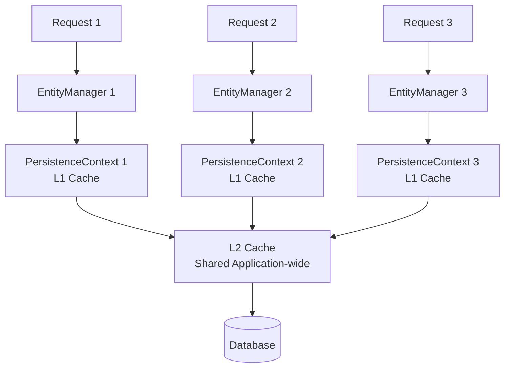
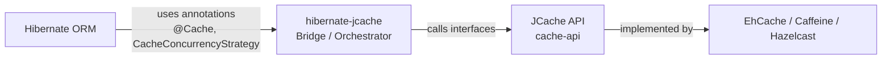
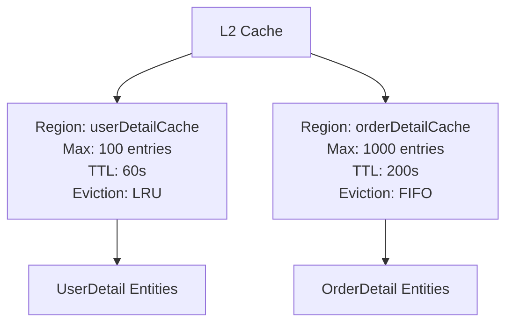
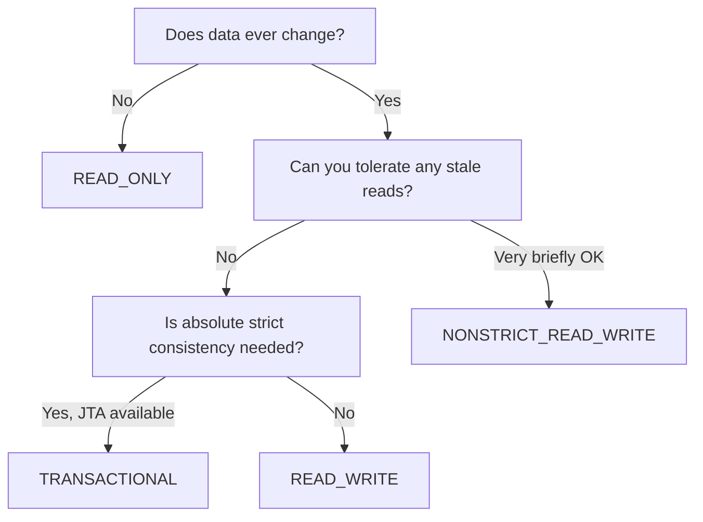
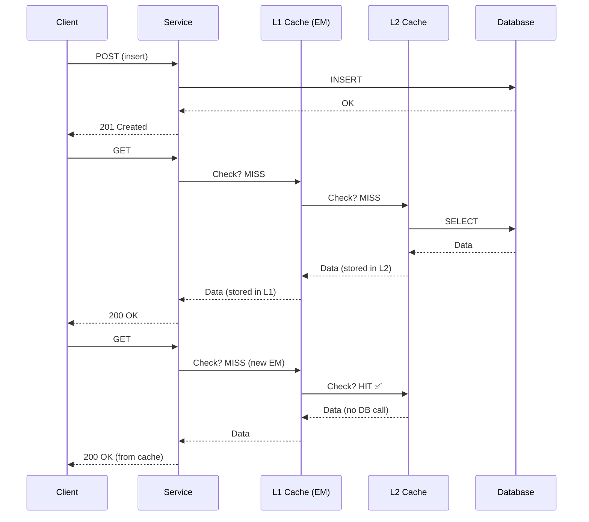
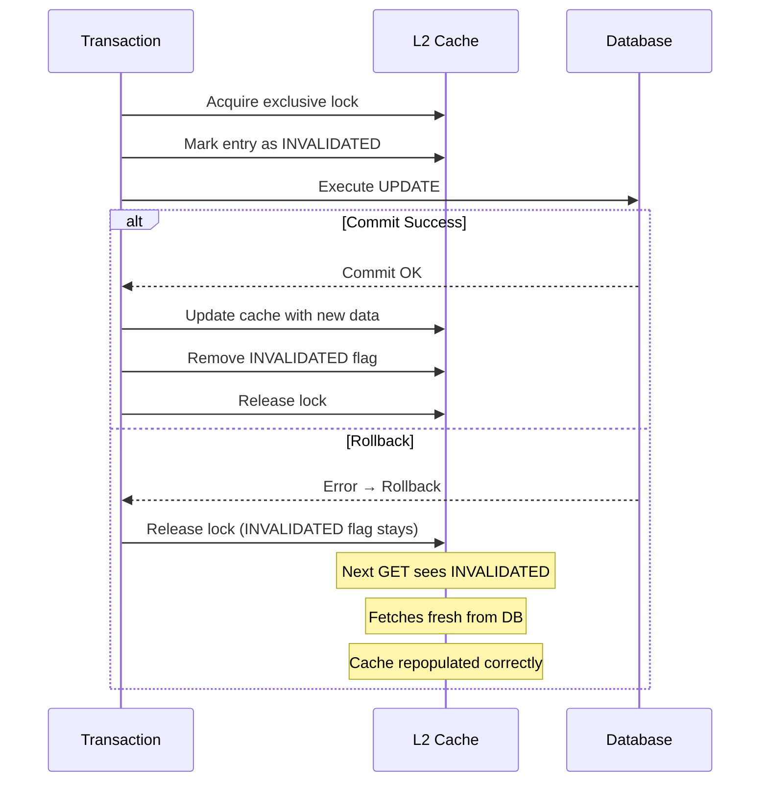
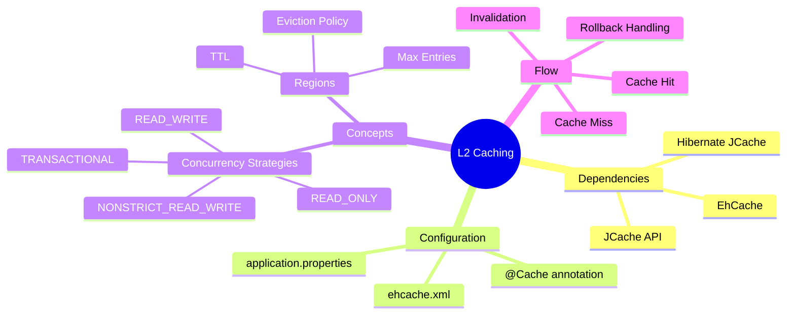
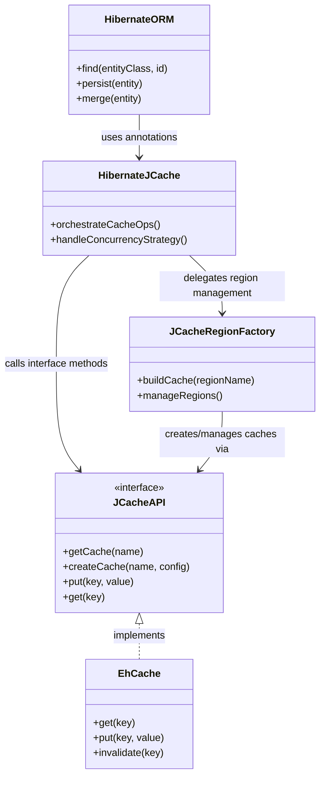

# 📌 Spring Boot — Second Level (L2) Caching

> A complete, professional study guide based on the "Concept and Coding" lecture series on Spring Boot JPA Caching.

---

## Table of Contents

1. [Prerequisites & First Level Cache Recap](#1-prerequisites--first-level-cache-recap)
2. [What is Second Level (L2) Caching?](#2-what-is-second-level-l2-caching)
3. [Architecture: L1 vs L2 Cache](#3-architecture-l1-vs-l2-cache)
4. [Setting Up L2 Caching — Dependencies](#4-setting-up-l2-caching--dependencies)
5. [Application Properties Configuration](#5-application-properties-configuration)
6. [Entity Configuration — @Cache Annotation](#6-entity-configuration--cache-annotation)
7. [Understanding Regions](#7-understanding-regions)
8. [Cache Concurrency Strategies](#8-cache-concurrency-strategies)
9. [Happy Flow: Step-by-Step Request Tracing](#9-happy-flow-step-by-step-request-tracing)
10. [Internal Working of Read-Write During Update](#10-internal-working-of-read-write-during-update)
11. [Diagrams](#11-diagrams)
12. [Key Observations](#12-key-observations)
13. [Common Mistakes](#13-common-mistakes)
14. [Best Practices](#14-best-practices)
15. [Interview Notes](#15-interview-notes)
16. [Comparison Tables](#16-comparison-tables)
17. [Practice Questions](#17-practice-questions)
18. [Summary](#18-summary)

---

## 1. Prerequisites & First Level Cache Recap

### Overview

Before diving into second level caching, it is essential to understand how first level caching works and why it falls short for multi-request scenarios.

### Standard Spring Boot JPA Setup

A typical Spring Boot JPA project has the following layers:

```
HTTP Request
     ↓
Controller  (POST/GET/PUT mappings)
     ↓
Service     (business logic)
     ↓
Repository  (extends JpaRepository)
     ↓
Entity      (annotated with @Entity)
     ↓
Database
```

### First Level Cache (L1) — How It Works

When a request hits the application:

1. A **new `EntityManager` object** is created for that request.
2. Each `EntityManager` has its **own `PersistenceContext`**.
3. The `PersistenceContext` acts as the **L1 cache** — it holds entity objects in memory for the duration of that single `EntityManager` lifecycle.

#### L1 Cache Behavior Across Requests

| Request | EntityManager | PersistenceContext | Cache Behavior |
|---------|--------------|-------------------|----------------|
| GET #1  | EM-1         | PC-1              | Cache miss → hits DB |
| GET #2  | EM-2         | PC-2 (new)        | Cache miss → hits DB again |

> [!IMPORTANT]
> Every new HTTP request creates a **new `EntityManager`** with a **new `PersistenceContext`**. L1 cache is NOT shared across requests. So two separate GET calls for the same entity will **both** hit the database.

#### L1 Cache Hit — When Does It Work?

L1 cache hits happen only when **the same `EntityManager`** (same persistence context) fetches the same entity twice **within a single request/transaction**:

```java
// Within the same transaction — same EntityManager
User user1 = em.find(User.class, 1L);  // → hits DB, stores in PC
User user2 = em.find(User.class, 1L);  // → cache HIT from PC, no DB call
```

> [!NOTE]
> L1 caching is **automatic** in Hibernate and cannot be disabled. It is scoped to a single `EntityManager` (persistence context).

---

## 2. What is Second Level (L2) Caching?

### Overview

Second Level Caching is an **application-scoped cache** that is **shared across all `EntityManager` instances** (i.e., across all requests). It sits between the persistence context and the database, dramatically reducing redundant DB queries.

### Why This Concept Exists

**Problem with L1 alone:**  
Every new HTTP request = new `EntityManager` = new persistence context = no shared cache = repeated DB calls for the same data.

**Solution — L2 Cache:**  
A shared, in-memory store that multiple persistence contexts can read from. If entity data is already loaded and stored in L2, the next request does not need to go to the database.

### Definition

> **Second Level Cache (L2 Cache):** An optional, application-wide cache provided by Hibernate that persists beyond the lifecycle of a single `EntityManager`. It is shared among all persistence contexts within the same application session factory.

### Real-World Analogy

Imagine a library:

- **L1 Cache** = a book you've already pulled from the shelf and placed on your personal desk. Only *you* can use it, and when you leave, it goes back.
- **L2 Cache** = a photocopier room with popular book copies. *Anyone* in the library can use these copies without walking back to the stacks (DB).

---

## 3. Architecture: L1 vs L2 Cache

### Request Flow Without L2

```
Request 1 → EntityManager 1 → PersistenceContext 1 → DB
Request 2 → EntityManager 2 → PersistenceContext 2 → DB  ← no benefit from Request 1
```

### Request Flow With L2

```
Request 1 → EntityManager 1 → PersistenceContext 1 → [L2 Cache: MISS] → DB → store in L2
Request 2 → EntityManager 2 → PersistenceContext 2 → [L2 Cache: HIT]  → return cached data
```

### Full Layered Architecture

```
HTTP Request
     ↓
Entity Manager (new per request)
     ↓
Persistence Context / L1 Cache (new per EM)
     ↓
L2 Cache (shared across all EM instances) ← NEW LAYER
     ↓
Database
```

> [!TIP]
> When data returns from the DB, it flows: **DB → L2 Cache → L1 Cache → caller**. So both caches get populated on a cache miss.

---



---

## 4. Setting Up L2 Caching — Dependencies

### The Three Required Dependencies

To enable L2 caching in a Spring Boot project, you need **three Maven/Gradle dependencies**. Each serves a distinct role.

```xml
<!-- pom.xml -->

<!-- 1. EhCache — the cache provider implementation -->
<dependency>
    <groupId>org.ehcache</groupId>
    <artifactId>ehcache</artifactId>
</dependency>

<!-- 2. JCache API — the standard caching interface (JSR-107) -->
<dependency>
    <groupId>javax.cache</groupId>
    <artifactId>cache-api</artifactId>
</dependency>

<!-- 3. Hibernate JCache — bridge between Hibernate and JCache API -->
<dependency>
    <groupId>org.hibernate.orm</groupId>
    <artifactId>hibernate-jcache</artifactId>
</dependency>
```

> [!NOTE]
> Always verify the latest version compatible with your Spring Boot 3.x version on [mvnrepository.com](https://mvnrepository.com).

### Why Each Dependency is Needed

#### Dependency 1: EhCache (Cache Provider)

- Provides the **actual in-memory cache implementation**.
- EhCache stores, evicts, and manages cached objects.
- Alternatives to EhCache include: **Caffeine Cache**, **Hazelcast**, **Redis**.

> [!TIP]
> You can swap EhCache for Caffeine or Hazelcast with minimal code change, thanks to the JCache API abstraction.

#### Dependency 2: JCache API (`cache-api`)

- Defines the **standard Java Caching API interfaces** (JSR-107).
- Interfaces like `CacheManager`, `Cache`, `CachingProvider` come from here.
- Hibernate's code interacts **only with these interfaces**, not directly with EhCache.
- This decoupling means **changing the provider doesn't break your Hibernate code**.

```
Hibernate Code
     ↓
JCache API Interface (CacheManager, Cache...)
     ↓
EhCache (or Caffeine / Hazelcast) — implementation
```

#### Dependency 3: Hibernate JCache (`hibernate-jcache`)

- Acts as a **bridge (orchestrator)** between Hibernate internals and the JCache API.
- Hibernate does not natively know *when* to call `getCache()`, `putCache()`, etc.
- `hibernate-jcache` understands Hibernate's caching annotations (`@Cache`, `CacheConcurrencyStrategy`) and translates them into JCache API calls.
- It knows what validations and locking to apply based on the chosen concurrency strategy (e.g., `READ_WRITE`, `READ_ONLY`).



> [!IMPORTANT]
> You **always** need all three. EhCache alone is not enough — Hibernate needs the bridge (`hibernate-jcache`) and the standard interface (`cache-api`) to work correctly and remain provider-agnostic.

---

## 5. Application Properties Configuration

Add the following to `application.properties`:

```properties
# 1. Enable second level caching (disabled by default)
spring.jpa.properties.hibernate.cache.use_second_level_cache=true

# 2. Set the region factory class (use JCache region factory for abstraction)
spring.jpa.properties.hibernate.cache.region.factory_class=org.hibernate.cache.jcache.JCacheRegionFactory

# 3. Specify the caching provider (EhCache in this case)
spring.jpa.properties.javax.cache.provider=org.ehcache.jsr107.EhcacheCachingProvider

# Optional: show SQL queries (for debugging cache hits vs DB hits)
spring.jpa.show-sql=true
spring.jpa.properties.hibernate.format_sql=true
```

### Property-by-Property Explanation

#### Property 1: `use_second_level_cache=true`

- **Default:** `false` — L2 cache is completely inactive unless explicitly enabled.
- Setting this to `true` activates the L2 cache infrastructure.

#### Property 2: `region.factory_class`

- Specifies **which class manages the cache regions**.
- `JCacheRegionFactory` (from `hibernate-jcache`) is recommended because it uses the JCache API abstraction.
- This factory handles: creating cache instances, applying eviction policies, managing TTL per region, and applying the correct concurrency strategy.

> [!TIP]
> You **could** use a direct EhCache factory class instead of `JCacheRegionFactory`, but then switching providers would require changing this property and potentially more code. Using `JCacheRegionFactory` keeps you provider-agnostic.

#### Property 3: `javax.cache.provider`

- Even after adding EhCache as a dependency, Hibernate (via `hibernate-jcache`) still needs to be told **which JCache provider implementation to use**.
- This property points to EhCache's JSR-107 adapter class.
- If you switch to Caffeine, you'd change this value to Caffeine's provider class.

---

## 6. Entity Configuration — `@Cache` Annotation

### No Changes Required In:

- ✅ Controller — unchanged
- ✅ Service — unchanged
- ✅ Repository — unchanged

### Change Required In: Entity Class

```java
import org.hibernate.annotations.Cache;
import org.hibernate.annotations.CacheConcurrencyStrategy;

import jakarta.persistence.*;

@Entity
@Table(name = "user_details")
@Cache(usage = CacheConcurrencyStrategy.READ_WRITE, region = "userDetailCache")
public class UserDetail {

    @Id
    @GeneratedValue(strategy = GenerationType.IDENTITY)
    private Long id;

    private String name;

    // getters and setters
}
```

### Annotation Breakdown

| Element | Value | Purpose |
|---------|-------|---------|
| `@Cache` | — | Marks this entity for L2 caching |
| `usage` | `CacheConcurrencyStrategy.READ_WRITE` | Defines how concurrent reads/writes are handled |
| `region` | `"userDetailCache"` | Logical cache region name for this entity |

> [!NOTE]
> `@Cache` is understood by `hibernate-jcache`. Without the `hibernate-jcache` dependency, Hibernate would not know how to process this annotation in the context of a JCache provider.

---

## 7. Understanding Regions

### What is a Region?

A **region** is a **logical grouping** of cached entity data within the L2 cache. Each region can have its own independent configuration.

### Why Regions Exist

Without regions, all entities would share one cache with one eviction policy, one TTL, and one size limit. Regions allow **per-entity-type cache tuning**.

### What You Can Configure Per Region

| Setting | Description |
|---------|-------------|
| **Max Entries** | Maximum number of objects stored in this region |
| **TTL (Time to Live)** | How long an entry lives before expiry |
| **Eviction Policy** | FIFO (First In First Out), LRU (Least Recently Used), LIFO (Last In First Out) |
| **Concurrency Strategy** | READ_ONLY, READ_WRITE, etc. |

### Example: Two Entities, Two Regions

```java
@Entity
@Cache(usage = CacheConcurrencyStrategy.READ_WRITE, region = "userDetailCache")
public class UserDetail { ... }

@Entity
@Cache(usage = CacheConcurrencyStrategy.READ_WRITE, region = "orderDetailCache")
public class OrderDetail { ... }
```

### EhCache XML Configuration for Regions

Instead of `application.properties`, region-specific settings are often provided in a dedicated `ehcache.xml` placed in `src/main/resources`:

```xml
<!-- src/main/resources/ehcache.xml -->
<config xmlns:xsi="http://www.w3.org/2001/XMLSchema-instance"
        xmlns="http://www.ehcache.org/v3">

    <!-- Region for UserDetail -->
    <cache alias="userDetailCache">
        <heap unit="entries">100</heap>
        <expiry>
            <ttl unit="seconds">60</ttl>
        </expiry>
    </cache>

    <!-- Region for OrderDetail — different TTL and size -->
    <cache alias="orderDetailCache">
        <heap unit="entries">1000</heap>
        <expiry>
            <ttl unit="seconds">200</ttl>
        </expiry>
    </cache>

</config>
```

### Region Diagram



---

## 8. Cache Concurrency Strategies

### Overview

`CacheConcurrencyStrategy` defines **how the cache behaves during concurrent read/write/delete operations**. It answers the question: *"How do we prevent stale data from being read when writes are happening in parallel?"*

There are **four strategies**:

```
READ_ONLY  →  READ_WRITE  →  NONSTRICT_READ_WRITE  →  TRANSACTIONAL
     ↑ most restrictive for writes                    ↑ most strict locking
```

---

### Strategy 1: `READ_ONLY`

#### Definition
Suitable for **static/reference data that is never updated**. If you attempt to update or delete a read-only cached entity, Hibernate throws an exception.

#### Use Cases
- Country codes, currency codes, configuration lookup tables, static product categories.

#### Behavior

| Operation | Cache Behavior |
|-----------|---------------|
| INSERT | Data goes directly to DB. Cache is not populated. |
| GET (1st time) | Cache miss → fetch from DB → store in L2 |
| GET (subsequent) | Cache hit — no DB call |
| UPDATE | ❌ **Throws exception** — cannot update read-only entities |
| DELETE | ❌ **Throws exception** |

#### Code Example

```java
@Entity
@Cache(usage = CacheConcurrencyStrategy.READ_ONLY, region = "userDetailCache")
public class UserDetail { ... }
```

#### What Happens on Update Attempt

```java
// Controller
@PutMapping("/user/{id}")
public UserDetail updateUser(@PathVariable Long id, @RequestBody UserDetail updated) {
    return userService.update(id, updated);
}

// Service
public UserDetail update(Long id, UserDetail updated) {
    UserDetail existing = repo.findById(id).orElseThrow();
    existing.setName(updated.getName());
    return repo.save(existing); // ← throws HibernateException!
}
```

**Error:** `org.hibernate.HibernateException: Cannot update a read-only entity: UserDetail`

> [!WARNING]
> `READ_ONLY` means **truly immutable**. Even a single update attempt will throw. Only use this when the data absolutely never changes.

---

### Strategy 2: `READ_WRITE`

#### Definition
Suitable for **frequently read, occasionally written** data where **stale reads are not acceptable**. Uses soft locks to coordinate reads and writes.

#### Use Cases
- Payment data, order data, user profiles — any data where correctness matters.
- Frequently used in **payment and banking industries**.

#### Locking Mechanism

- **During READ:** Acquires a **shared lock** on the cache entry. Multiple concurrent reads allowed. Writes are blocked while shared lock is held.
- **During WRITE (UPDATE):** Acquires an **exclusive lock**. Both reads and writes from cache are blocked.

#### Full Update Flow (Happy Path)

```
1. Transaction begins
2. Exclusive lock acquired on cache entry for this entity
3. Cache entry marked as INVALIDATED (stale flag set)
4. DB UPDATE executed
5. Transaction commits successfully
6. Cache entry updated with latest data (invalidated flag removed)
7. Lock released
```

#### Full Update Flow (Rollback Path)

```
1. Transaction begins
2. Exclusive lock acquired
3. Cache entry marked as INVALIDATED
4. DB UPDATE executed
5. Transaction ROLLBACK (error occurred)
6. Lock released (no cache update)
7. INVALIDATED flag remains on cache entry
→ Future GET sees invalidated flag → fetches fresh from DB → repopulates cache
```

> [!IMPORTANT]
> On rollback, the invalidated flag is intentionally left. This ensures no stale data is ever served from cache after a failed write. Future reads will fetch from DB and rebuild the cache correctly.

#### Cache as "Best Effort"

> [!NOTE]
> Cache operations are **best effort**. Even if the DB commit succeeds but the cache update fails (e.g., cache node down), the transaction is NOT rolled back. The invalidated flag ensures the next read fetches fresh data from DB. This is intentional — cache failure should not destroy data integrity.

#### Code Example

```java
@Entity
@Cache(usage = CacheConcurrencyStrategy.READ_WRITE, region = "userDetailCache")
public class UserDetail { ... }
```

#### Sequence: Insert → Get → Put → Get

```
POST (insert):
  → Data written directly to DB
  → L2 cache NOT populated

GET #1 (first fetch):
  → L1 miss (new EM)
  → L2 miss (not yet cached)
  → DB SELECT executed
  → Data stored in L2
  → Data stored in L1
  → Response returned

PUT (update):
  → Exclusive lock on cache entry
  → Cache entry invalidated
  → DB UPDATE executed
  → Commit success
  → Cache entry updated with new data
  → Lock released

GET #2 (after update):
  → L1 miss (new request, new EM)
  → L2 HIT (cache has latest data!)
  → No DB SELECT
  → Response returned from cache
```

---

### Strategy 3: `NONSTRICT_READ_WRITE`

#### Definition
A **lenient** version of `READ_WRITE`. Tolerates a **small window of stale data** in exchange for reduced locking overhead.

#### Key Differences from `READ_WRITE`

| Aspect | READ_WRITE | NONSTRICT_READ_WRITE |
|--------|-----------|----------------------|
| Read lock | Shared lock acquired | **No lock acquired** |
| Update: cache during TX | Invalidated before commit | **Not invalidated** |
| Update: cache after commit | Updated with fresh data | **Only invalidated** (not refreshed) |
| Rollback behavior | Lock released, invalidate stays | Lock released, no invalidate |
| Risk of stale read | Very low | Small window possible |

#### NONSTRICT_READ_WRITE Update Flow

```
1. Transaction begins
2. (No read lock; reads can proceed freely)
3. DB UPDATE executed
4. Transaction commits successfully
5. Cache entry INVALIDATED (only now)
6. Lock released
→ Future GET sees invalidated → hits DB → rebuilds cache
```

> [!CAUTION]
> If a GET happens **concurrently during an UPDATE** (between step 3 and step 5), the read might return stale cached data. This is a **very small window**, but it exists. Do not use `NONSTRICT_READ_WRITE` for high-accuracy scenarios like financial data.

#### Behavior After PUT

After a PUT call with `NONSTRICT_READ_WRITE`:
- The cache entry is marked as **invalidated** (not refreshed with new data).
- The next GET will trigger a **DB SELECT** and repopulate the cache.
- This is different from `READ_WRITE`, where the cache is actively updated with the new data after a successful commit.

```java
@Entity
@Cache(usage = CacheConcurrencyStrategy.NONSTRICT_READ_WRITE, region = "userDetailCache")
public class UserDetail { ... }
```

---

### Strategy 4: `TRANSACTIONAL`

#### Definition
The **most strictly consistent** strategy. Uses full transactional semantics for cache operations. Compatible only with JTA-managed (XA) transactions.

#### Key Behavior

- Acquires a **hard lock** even during reads.
- While a cache entry is locked (even for read), **other GET requests bypass L2 cache entirely** and go directly to DB.
- Write operations must wait in queue until the lock is released.
- After a successful commit, the cache is updated with the latest data (like `READ_WRITE`).

#### Locking Comparison

| Strategy | Read Lock | Write Lock | Stale Risk |
|----------|-----------|------------|------------|
| READ_ONLY | None | N/A | None |
| READ_WRITE | Shared (non-blocking reads) | Exclusive | Very low |
| NONSTRICT_READ_WRITE | None | Minimal | Small window |
| TRANSACTIONAL | Hard lock (blocks cache reads) | Exclusive | None |

> [!WARNING]
> `TRANSACTIONAL` has the highest consistency but also the **highest overhead**. Use only when absolute cache consistency is required and your environment supports JTA transactions.

---

### Concurrency Strategy Decision Guide



---

## 9. Happy Flow: Step-by-Step Request Tracing

### Scenario: L2 Cache With `READ_WRITE`

#### Step 1: POST (Insert)

```
HTTP POST /users → Controller → Service → Repository → DB
```
- Data saved directly to database.
- **L2 cache is not touched** during insert.

#### Step 2: GET #1 (First Read — Cache Miss)

```
HTTP GET /users/1 → Controller → Service → Repository
→ EntityManager created
→ Check L1 (PersistenceContext): MISS
→ Check L2 Cache: MISS (nothing inserted yet)
→ SELECT query to DB
→ Data loaded into L2 cache
→ Data loaded into L1 cache
→ Response returned
```

**Console output:**
```sql
Hibernate: select u1_0.id, u1_0.name from user_details u1_0 where u1_0.id=?
```

#### Step 3: GET #2 (Second Request — Cache Hit)

```
HTTP GET /users/1 → Controller → Service → Repository
→ New EntityManager created (new request)
→ Check L1 (new PersistenceContext): MISS
→ Check L2 Cache: HIT ✅
→ No DB query
→ Response returned from L2 cache
```

**Console output:** *(no SELECT query)*

#### Full Flow Diagram



---

## 10. Internal Working of Read-Write During Update

### The Full Update Transaction (READ_WRITE)

#### State Before Update

```
L2 Cache: { id: 1, name: "SJ" }
DB:        { id: 1, name: "SJ" }
```

#### PUT Request Arrives

```
Step 1: HTTP PUT /users/1  { name: "SJ Updated" }
Step 2: Transaction begins
Step 3: Exclusive lock acquired on cache entry (id: 1)
Step 4: Cache entry flagged as INVALIDATED
         L2 Cache: { id: 1, name: "SJ", _valid: false }
Step 5: DB UPDATE executed
         DB: { id: 1, name: "SJ Updated" }
Step 6: Transaction commits successfully
Step 7: Cache entry updated
         L2 Cache: { id: 1, name: "SJ Updated", _valid: true }
Step 8: Lock released
```

#### GET After Successful UPDATE

```
L2 Cache: { id: 1, name: "SJ Updated" }   ← fresh data
→ Cache HIT ✅
→ No DB query
```

### Rollback Scenario

```
Step 1–4: Same as above (lock + invalidate)
Step 5: DB UPDATE attempted
Step 6: ERROR → Transaction ROLLBACK
Step 7: Lock is released
         Invalidated flag stays: L2 Cache: { id: 1, name: "SJ", _valid: false }
Step 8: Future GET sees INVALIDATED flag
→ Goes to DB to get fresh data: { id: 1, name: "SJ" }
→ Repopulates L2 Cache with valid data
→ _valid: true restored
```



---

## 11. Diagrams

### Mind Map: L2 Caching Ecosystem



### Architecture Class Diagram



---

## 12. Key Observations

- **L2 cache is disabled by default** — you must explicitly enable it.
- **INSERT does not populate L2 cache.** Only the first GET (after a cache miss) loads data into L2.
- **L2 cache is shared** across all `EntityManager` instances (all HTTP requests) within the same JVM/session factory.
- **L1 + L2 are layered:** on a DB fetch, data is stored in both L2 (for future requests) and L1 (for current request's re-reads).
- **Cache is best-effort:** a cache write failure does not roll back a successful DB transaction.
- **Regions allow granular cache configuration** — different entities can have different TTL, size, and eviction policies.
- **`hibernate-jcache` is the bridge**, not the implementation. The actual implementation is provided by EhCache, Caffeine, etc.
- **Changing the cache provider** (EhCache → Caffeine) only requires changing the dependency and the provider property, not your entity annotations or Hibernate logic.
- **`TRANSACTIONAL` strategy** bypasses L2 cache for reads when an entry is locked — those reads go directly to DB.

---

## 13. Common Mistakes

### Mistake 1: Using `READ_ONLY` on mutable data

```java
// ❌ Wrong: user profiles get updated
@Cache(usage = CacheConcurrencyStrategy.READ_ONLY)
public class UserProfile { ... }
```

**Fix:** Use `READ_WRITE` for any data that can change.

```java
// ✅ Correct
@Cache(usage = CacheConcurrencyStrategy.READ_WRITE)
public class UserProfile { ... }
```

---

### Mistake 2: Expecting L2 cache to be populated after INSERT

```java
// After POST /users → caching is NOT populated
// The first GET will still hit DB
```

> [!WARNING]
> Do not assume that inserting data also inserts it into the L2 cache. L2 is only populated on the first read (GET).

---

### Mistake 3: Forgetting to add `@Cache` on the entity

You can configure all three dependencies and all properties, but without `@Cache` on the entity class, Hibernate will **not** cache that entity in L2.

---

### Mistake 4: Not providing EhCache region configuration

If you define a region name in `@Cache(region = "myRegion")` but don't define it in `ehcache.xml`, EhCache will use default settings or throw an error depending on configuration.

---

### Mistake 5: Using `NONSTRICT_READ_WRITE` for financial data

```java
// ❌ Bad choice for payment records
@Cache(usage = CacheConcurrencyStrategy.NONSTRICT_READ_WRITE)
public class PaymentRecord { ... }
```

**Fix:** Use `READ_WRITE` which ensures updated cache data and proper locking.

---

## 14. Best Practices

1. **Always use `JCacheRegionFactory`** instead of a provider-specific factory class. This keeps your code provider-agnostic.

2. **Define explicit regions** in `ehcache.xml` for each entity type. Rely on defaults only for prototyping.

3. **Match concurrency strategy to data characteristics:**
   - Static reference data → `READ_ONLY`
   - Read-heavy, correctness-critical → `READ_WRITE`
   - Tolerable brief staleness, high throughput → `NONSTRICT_READ_WRITE`
   - Full ACID with JTA → `TRANSACTIONAL`

4. **Use `spring.jpa.show-sql=true`** during development to confirm cache hits (absence of SELECT) vs cache misses.

5. **Set appropriate TTL per region.** Caching data indefinitely can serve increasingly stale results over time.

6. **Do not cache entities that change very frequently** (e.g., real-time stock prices, session counters). The invalidation overhead can outweigh the benefit.

7. **Use debugging tools** (breakpoints in `JCacheRegionFactory`) to trace cache creation, population, and eviction behavior during development.

8. **Monitor cache hit ratio in production** using EhCache statistics or Spring Boot Actuator cache metrics.

---

## 15. Interview Notes

### Commonly Asked Questions

**Q: What is the difference between L1 and L2 cache in Hibernate?**

| Feature | L1 Cache | L2 Cache |
|---------|---------|---------|
| Scope | Per EntityManager (per request) | Application-wide (shared) |
| Default | Always enabled | Disabled by default |
| Configuration | None needed | Requires dependency + config |
| Shared across requests? | No | Yes |
| Provider | Built into Hibernate | External: EhCache, Caffeine |

---

**Q: What is `CacheConcurrencyStrategy` and why is it needed?**

It defines how the cache handles concurrent reads and writes to prevent stale data. Without a strategy, parallel reads and writes could result in one request reading an outdated value while another is in the middle of updating it.

---

**Q: What happens when a transaction rolls back with READ_WRITE?**

The cache entry retains its `INVALIDATED` flag. The exclusive lock is released. The next GET will detect the invalidated flag, fetch fresh data from DB, and repopulate the cache. This ensures correctness without failing the original transaction.

---

**Q: Why are three dependencies needed for L2 caching?**

1. **Cache provider** (EhCache) — actual storage implementation.
2. **JCache API** — standard interface so Hibernate code doesn't bind to a specific provider.
3. **Hibernate JCache** — bridge that translates Hibernate annotations into JCache API calls and manages locking/invalidation logic.

---

**Q: What is a cache region?**

A logical namespace within the L2 cache. Each region can have independent TTL, max entries, and eviction policy. Allows fine-grained cache management per entity type.

---

**Q: When would you choose NONSTRICT_READ_WRITE over READ_WRITE?**

When maximum throughput and low lock contention are priorities, and the business can tolerate an extremely brief window (nanoseconds to milliseconds) during which a concurrent read might see slightly stale data. NOT appropriate for financial, medical, or transactional data.

---

**Q: Does L2 cache get populated on INSERT?**

No. The L2 cache is only populated when a GET (read) is performed and a cache miss occurs, triggering a DB fetch that then stores the result in L2.

---

## 16. Comparison Tables

### L1 vs L2 Cache

| Property | L1 (Persistence Context) | L2 (Second Level) |
|----------|--------------------------|-------------------|
| Scope | Single EntityManager | Application-wide |
| Enabled by default | Yes | No |
| Shared across requests | No | Yes |
| Requires external library | No | Yes |
| Provider | Hibernate built-in | EhCache / Caffeine / Hazelcast |
| Annotation required | No | `@Cache` on entity |
| Can be disabled | No | Yes (don't enable it) |

### Cache Concurrency Strategy Comparison

| Strategy | Read Lock | Write Lock | Cache Updated After Write | Stale Risk | Best For |
|----------|-----------|-----------|--------------------------|------------|---------|
| READ_ONLY | None | N/A | N/A | None | Immutable reference data |
| READ_WRITE | Shared | Exclusive | Yes (with fresh data) | Very low | Financial, transactional data |
| NONSTRICT_READ_WRITE | None | Minimal | No (only invalidate) | Small window | High-read, low-write, tolerable staleness |
| TRANSACTIONAL | Hard lock | Exclusive | Yes | None | Full consistency + JTA |

### Cache Provider Comparison

| Provider | Type | Notes |
|---------|------|-------|
| EhCache | In-process | Most popular for Spring Boot L2 |
| Caffeine | In-process | High-performance, Java 8+ |
| Hazelcast | Distributed | Cross-JVM caching for clustered deployments |
| Redis | Distributed | External store, widely used in microservices |

---

## 17. Practice Questions

### Easy

1. What is the default state of L2 cache in Spring Boot (enabled/disabled)?
2. Which annotation marks a JPA entity for L2 caching?
3. Name the three Maven dependencies required for L2 caching with EhCache.
4. What is a cache region?
5. Which concurrency strategy should be used for data that never changes?

### Medium

6. Explain the difference between `READ_WRITE` and `NONSTRICT_READ_WRITE` concurrency strategies.
7. Trace the full sequence of cache and DB operations for: INSERT → GET → GET → PUT → GET with `READ_WRITE`.
8. What happens in the cache when a transaction using `READ_WRITE` is rolled back after an UPDATE?
9. Why is `JCacheRegionFactory` preferred over a provider-specific factory class?
10. What is the role of `hibernate-jcache` in the L2 caching architecture?

### Hard

11. You have two entities: `ProductCatalog` (rarely updated, high read volume) and `InventoryItem` (frequently updated). What concurrency strategies would you choose and why?
12. A developer reports that after a successful PUT, subsequent GETs are still returning old data. What concurrency strategy might they be using, and why does this happen? How would you fix it?
13. Explain the "best effort" nature of L2 cache writes. What is the implication if a cache update fails after a successful DB commit?
14. Design the `ehcache.xml` for a system with three entities: `Country` (never changes), `UserProfile` (changes occasionally), `OrderItem` (changes frequently). Include appropriate TTL and eviction settings.
15. How does `TRANSACTIONAL` strategy differ from `READ_WRITE` in terms of what happens to concurrent reads while a lock is held?

---

## 18. Summary

> **Revision Bullets**

- **L1 Cache** is scoped per `EntityManager` (per request). No sharing between requests.
- **L2 Cache** is application-wide and shared across all `EntityManager` instances. Requires setup.
- **Three dependencies:** cache provider (EhCache), JCache API (interface), Hibernate JCache (bridge).
- **Three `application.properties` settings:** enable L2, set region factory, set cache provider.
- **`@Cache` annotation** on the entity class activates L2 for that entity.
- **Regions** allow per-entity-type cache configuration (TTL, size, eviction policy).
- **INSERT does not populate L2.** Only a GET (on cache miss) populates L2.
- **READ_ONLY** — no updates allowed, lowest overhead, best for static data.
- **READ_WRITE** — shared lock on read, exclusive lock on write, cache updated after successful commit.
- **NONSTRICT_READ_WRITE** — no read lock, cache only invalidated (not refreshed) after write. Small stale window possible.
- **TRANSACTIONAL** — strictest, hard lock even on reads, other reads go to DB during lock.
- **On rollback (READ_WRITE):** lock released, invalidated flag stays → next read hits DB and rebuilds cache.
- **Cache is best-effort:** a cache update failure after a successful DB commit does NOT roll back the DB transaction.
- **Use `JCacheRegionFactory`** for provider independence — switching providers then only requires changing one dependency and one property.

---

*Study guide generated from the "Concept and Coding" Spring Boot Second Level Caching lecture.*
