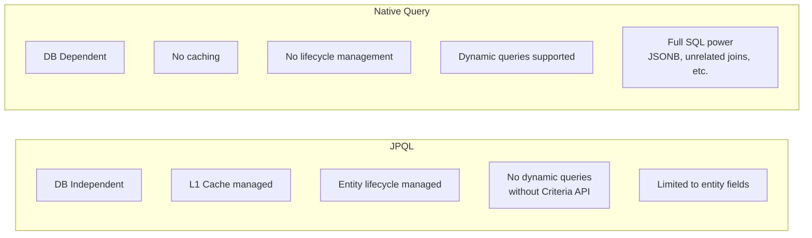
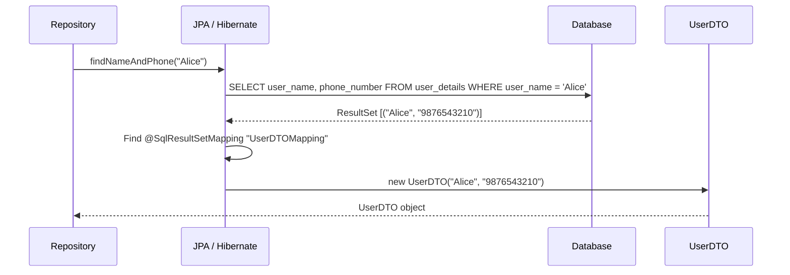
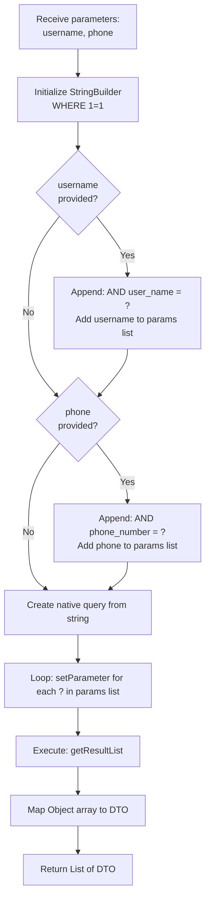
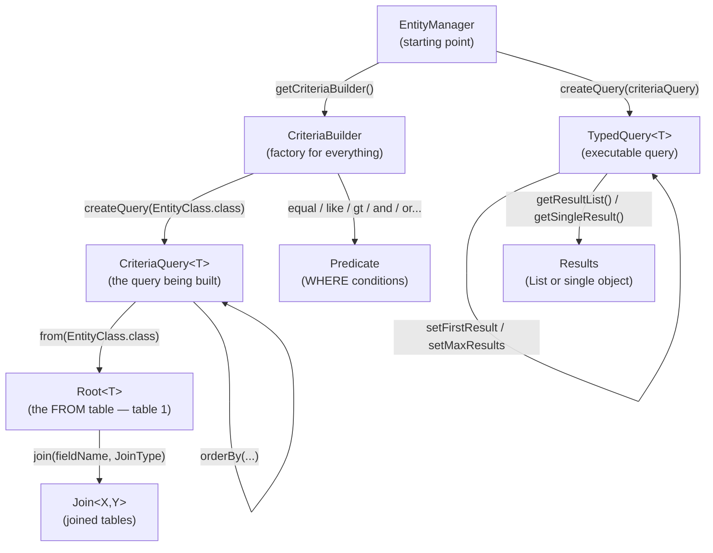

# 📘 JPA — Native Queries & Criteria API

> **Series:** Concept and Coding — JPA Series  
> **Part:** 4 — Custom Queries  
> **Prerequisites:** JPA Parts 1–3 (Architecture, Entity Mappings, JPQL basics)

---

## Table of Contents

1. [Native Queries — Overview](#1-native-queries--overview)
2. [JPQL vs Native Query — When to Use Which](#2-jpql-vs-native-query--when-to-use-which)
3. [Writing a Basic Native Query](#3-writing-a-basic-native-query)
4. [Returning Partial Fields — Mapping Strategies](#4-returning-partial-fields--mapping-strategies)
   - [Strategy 1: SQL Result Set Mapping](#41-strategy-1-sql-result-set-mapping)
   - [Strategy 2: Object Array Manual Mapping](#42-strategy-2-object-array-manual-mapping)
5. [Dynamic Native Queries](#5-dynamic-native-queries)
6. [Pagination and Sorting in Native Queries](#6-pagination-and-sorting-in-native-queries)
7. [Why Criteria API Exists — The Gap](#7-why-criteria-api-exists--the-gap)
8. [Criteria API — Architecture & Hierarchy](#8-criteria-api--architecture--hierarchy)
9. [Criteria API — Step-by-Step: Select All Fields](#9-criteria-api--step-by-step-select-all-fields)
10. [Criteria API — Predicates (Where Conditions)](#10-criteria-api--predicates-where-conditions)
11. [Criteria API — Selecting Specific Fields (Multi-Select)](#11-criteria-api--selecting-specific-fields-multi-select)
12. [Criteria API — Joins](#12-criteria-api--joins)
13. [Criteria API — Pagination and Sorting](#13-criteria-api--pagination-and-sorting)
14. [Comparison Table — JPQL vs Native Query vs Criteria API](#14-comparison-table--jpql-vs-native-query-vs-criteria-api)
15. [Common Mistakes & Best Practices](#15-common-mistakes--best-practices)
16. [Interview Notes](#16-interview-notes)
17. [Practice Questions](#17-practice-questions)
18. [Summary](#18-summary)

---

## 1. Native Queries — Overview

### What Is a Native Query?

A **Native Query** is a plain SQL query written exactly as you would write it in a SQL client (MySQL Workbench, pgAdmin, etc.) and executed directly against the database through JPA.

Unlike JPQL, which operates on **Java entities**, native queries operate on **actual database tables and columns**.

### Key Characteristics

| Property | Behaviour |
|---|---|
| **Language** | Plain SQL (database-specific syntax) |
| **Operates on** | Actual table names and column names (not Java entity names) |
| **Caching** | No Persistence Context (L1) caching |
| **Entity lifecycle** | Not managed — JPA does not track entities fetched via native queries |
| **DB portability** | Not portable — tied to the specific database dialect |
| **Dynamic queries** | Supported (via `EntityManager.createNativeQuery()`) |

### Trade-offs



---

## 2. JPQL vs Native Query — When to Use Which

### Use JPQL When:
- Queries are straightforward CRUD operations on entities
- You need JPA's first-level caching (Persistence Context)
- You want database-independent code (future DB migration safety)
- Entity lifecycle management is important

### Use Native Query When:

| Use Case | Reason JPQL Cannot Handle It |
|---|---|
| Querying **JSONB / JSON columns** | JPQL has no concept of JSON column operations |
| **Unrelated entity joins** | JPQL joins require defined entity relationships |
| **Aggregations** like `COUNT(*) AS cnt` returning non-entity results | JPQL must return entity fields or mapped types |
| **Complex DB-specific functions** (window functions, CTEs, etc.) | JPQL does not support database-specific SQL extensions |
| **Bulk operations requiring raw speed** | Native queries bypass entity management overhead |

> [!IMPORTANT]
> Native queries give you full SQL power but sacrifice JPA's entity management, caching, and DB portability. Always evaluate the trade-off for your specific use case.

---

## 3. Writing a Basic Native Query

### Syntax Comparison

**JPQL query:**
```java
@Query("SELECT u FROM UserDetails u WHERE u.name = :name")
List<UserDetails> findByName(@Param("name") String name);
```

**Native query — same operation:**
```java
@Query(
    value = "SELECT * FROM user_details WHERE user_name = :name",
    nativeQuery = true   // ← This is the only addition
)
List<UserDetails> findByNameNative(@Param("name") String name);
```

### Critical Difference: Entity Names vs Table Names

| Context | Use |
|---|---|
| **JPQL** | Java entity class name (`UserDetails`) and Java field names (`name`, `phone`) |
| **Native Query** | Actual DB table name (`user_details`) and actual DB column names (`user_name`, `phone_number`) |

> [!WARNING]
> In a native query, **never use Java entity class names or Java field names**. Always use the real database table and column names. If your entity field `name` maps to DB column `user_name`, you must write `user_name` in the native query.

### Full Example with Entity and Repository

```java
// Entity
@Entity
@Table(name = "user_details")
public class UserDetails {

    @Id
    @GeneratedValue(strategy = GenerationType.IDENTITY)
    private Long id;

    @Column(name = "user_name")   // DB column: user_name, Java field: name
    private String name;

    @Column(name = "phone_number") // DB column: phone_number, Java field: phone
    private String phone;

    public UserDetails() {}
    // Getters and Setters...
}

// Repository
@Repository
public interface UserDetailRepository extends JpaRepository<UserDetails, Long> {

    // Native query: uses DB table name and DB column names
    @Query(
        value = "SELECT * FROM user_details WHERE user_name = :name",
        nativeQuery = true
    )
    List<UserDetails> findByNameNative(@Param("name") String name);
}
```

### How Does `SELECT *` Mapping Work Automatically?

When you use `SELECT *` in a native query and the return type is an entity:
1. JPA retrieves all columns from the result set
2. JPA **automatically maps DB column names → Java entity field names** using the `@Column(name=...)` annotations
3. You get a fully populated entity object

This mapping is automatic only for `SELECT *` (all fields). For partial fields, you must handle mapping explicitly — covered in the next section.

---

## 4. Returning Partial Fields — Mapping Strategies

When you write a native query that returns **only some columns** (not `SELECT *`), JPA cannot automatically map the result to an entity — because the entity expects all fields, and some will be missing.

**Problem:**
```java
@Query(
    value = "SELECT user_name, phone_number FROM user_details WHERE user_name = :name",
    nativeQuery = true
)
List<UserDetails> findPartialNative(@Param("name") String name);
// ❌ Throws: Column 'id' not found — JPA tries to map all entity fields but id is missing
```

**Solution:** You need a **DTO** (Data Transfer Object) and one of two mapping strategies.

---

### 4.1 Strategy 1: SQL Result Set Mapping

This is the **annotation-based** approach using `@NamedNativeQuery` and `@SqlResultSetMapping`. Both annotations are placed **on the entity class**.

#### Step 1: Create the DTO

```java
public class UserDTO {

    private String name;
    private String phone;

    // Constructor matching the fields returned by the query (ORDER MATTERS)
    public UserDTO(String name, String phone) {
        this.name = name;
        this.phone = phone;
    }

    // Getters
    public String getName() { return name; }
    public String getPhone() { return phone; }
}
```

#### Step 2: Annotate the Entity with `@NamedNativeQuery` and `@SqlResultSetMapping`

```java
@Entity
@Table(name = "user_details")

// Step 2a: Define the named native query
@NamedNativeQuery(
    name = "UserDetails.findNameAndPhone",    // Logical name for this query
    query = "SELECT user_name, phone_number FROM user_details WHERE user_name = :name",
    resultSetMapping = "UserDTOMapping"       // Points to the mapping below
)

// Step 2b: Define how to map the query result to a DTO
@SqlResultSetMapping(
    name = "UserDTOMapping",                  // Must match resultSetMapping above
    classes = @ConstructorResult(
        targetClass = UserDTO.class,          // Which DTO class to instantiate
        columns = {
            @ColumnResult(name = "user_name",     type = String.class),  // 1st constructor arg
            @ColumnResult(name = "phone_number",  type = String.class)   // 2nd constructor arg
        }
    )
)
public class UserDetails {
    // ... entity fields as usual
}
```

#### Step 3: Use the Named Query in the Repository

```java
@Repository
public interface UserDetailRepository extends JpaRepository<UserDetails, Long> {

    // Reference the named query by its logical name
    // No need to write the SQL again
    @Query(
        name = "UserDetails.findNameAndPhone",   // The name given in @NamedNativeQuery
        nativeQuery = true
    )
    List<UserDTO> findNameAndPhone(@Param("name") String name);
}
```

#### How It Works Internally



> [!NOTE]
> The `@NamedNativeQuery` and `@SqlResultSetMapping` annotations **must be placed on an entity class**, not on the repository or DTO. This is a JPA requirement.

---

### 4.2 Strategy 2: Object Array Manual Mapping

This is the **programmatic** approach — simpler to set up but requires manual mapping code in the service layer.

#### Step 1: Repository Returns `List<Object[]>`

```java
@Repository
public interface UserDetailRepository extends JpaRepository<UserDetails, Long> {

    @Query(
        value = "SELECT user_name, phone_number FROM user_details WHERE user_name = :name",
        nativeQuery = true
    )
    List<Object[]> findNameAndPhoneRaw(@Param("name") String name);
    // Each Object[] represents one row
    // Object[0] = user_name value
    // Object[1] = phone_number value
}
```

#### Step 2: Service Layer Maps `Object[]` to DTO

```java
@Service
public class UserService {

    @Autowired
    private UserDetailRepository userRepo;

    public List<UserDTO> getUserNameAndPhone(String name) {
        List<Object[]> rawResults = userRepo.findNameAndPhoneRaw(name);

        return rawResults.stream()
            .map(row -> new UserDTO(
                (String) row[0],   // user_name  → UserDTO.name
                (String) row[1]    // phone_number → UserDTO.phone
            ))
            .collect(Collectors.toList());
    }
}
```

### Comparison: Two Partial Field Strategies

| Aspect | SQL Result Set Mapping | Object Array Manual |
|---|---|---|
| Setup location | Entity class annotations | Service class code |
| Boilerplate | More annotations, less service code | Less annotations, more service code |
| Type safety | Moderate | Low (raw `Object[]`) |
| Flexibility | Less — tied to annotations | More — can transform in code |
| Readability | Annotations can be verbose | Service code is explicit |
| Best for | Stable, reused queries | Ad-hoc or rarely used queries |

> [!TIP]
> If you can use `SELECT *`, do so — JPA handles the mapping automatically. Use partial field strategies only when you genuinely need a subset of columns (for performance or security reasons).

---

## 5. Dynamic Native Queries

### What Is a Dynamic Query?

A **dynamic query** is one where the `WHERE` clause conditions are built at runtime based on what parameters the caller provides. Some parameters may or may not be present.

**Example scenario:**
- If `username` is provided → add `AND user_name = ?`
- If `phone` is provided → add `AND phone_number = ?`
- If neither → return all records
- If both → filter by both

JPQL has no native support for this pattern. The JPA solution is the **Criteria API** (covered later). For native SQL, you build the query string dynamically using `EntityManager.createNativeQuery()`.

### Implementation with EntityManager

```java
@Service
public class UserService {

    @PersistenceContext
    private EntityManager entityManager;

    public List<UserDTO> searchUsers(String username, String phone) {

        // Step 1: Start building the SQL string
        StringBuilder queryBuilder = new StringBuilder();
        queryBuilder.append("SELECT user_name, phone_number FROM user_details ");
        queryBuilder.append("WHERE 1=1 ");  // Trick: always-true condition so we can safely append "AND ..."

        // Step 2: Maintain a list of parameter values in the order they appear as ?
        List<Object> parameters = new ArrayList<>();

        // Step 3: Dynamically append conditions based on input
        if (username != null && !username.isEmpty()) {
            queryBuilder.append("AND user_name = ? ");
            parameters.add(username);   // Position 1 → replaces first ?
        }

        if (phone != null && !phone.isEmpty()) {
            queryBuilder.append("AND phone_number = ? ");
            parameters.add(phone);      // Position 2 → replaces second ?
        }

        // Step 4: Create the native query from the built string
        Query nativeQuery = entityManager.createNativeQuery(queryBuilder.toString());

        // Step 5: Replace ? placeholders with actual values (1-based index)
        for (int i = 0; i < parameters.size(); i++) {
            nativeQuery.setParameter(i + 1, parameters.get(i));  // JPA uses 1-based index
        }

        // Step 6: Execute and get results
        List<Object[]> rawResults = nativeQuery.getResultList();

        // Step 7: Map Object[] to DTO
        return rawResults.stream()
            .map(row -> new UserDTO((String) row[0], (String) row[1]))
            .collect(Collectors.toList());
    }
}
```

### The `WHERE 1=1` Pattern Explained

```java
// WITHOUT the 1=1 trick — complexity:
String query = "SELECT * FROM user_details ";
boolean firstCondition = true;

if (username != null) {
    query += "WHERE user_name = ? ";     // Must add WHERE before first condition
    firstCondition = false;
}
if (phone != null) {
    if (firstCondition) {
        query += "WHERE phone_number = ? ";  // If first condition, need WHERE
    } else {
        query += "AND phone_number = ? ";    // If not first, need AND
    }
}
// Messy! Must track whether WHERE has been added yet

// WITH the 1=1 trick — clean:
String query = "SELECT * FROM user_details WHERE 1=1 ";
if (username != null) query += "AND user_name = ? ";      // Always just AND
if (phone != null)    query += "AND phone_number = ? ";   // Always just AND
// Clean! WHERE is always present; conditions are always AND
```

> [!TIP]
> `WHERE 1=1` is a widely used SQL pattern for building dynamic queries. `1=1` always evaluates to true and costs nothing in the DB optimizer — it is immediately eliminated by the query planner.

### Dynamic Query Flow



---

## 6. Pagination and Sorting in Native Queries

### Method A: Dynamic Native Query (Manual SQL)

When building queries dynamically with `EntityManager`, you add `ORDER BY`, `LIMIT`, and `OFFSET` directly to the SQL string:

```java
public List<UserDTO> searchUsersPaged(
        String username,
        int pageNumber,    // 0-based (page 0, 1, 2...)
        int pageSize,      // records per page
        String sortField,  // e.g. "phone_number"
        String sortDir     // "ASC" or "DESC"
) {
    StringBuilder queryBuilder = new StringBuilder();
    queryBuilder.append("SELECT user_name, phone_number FROM user_details WHERE 1=1 ");

    List<Object> parameters = new ArrayList<>();

    if (username != null && !username.isEmpty()) {
        queryBuilder.append("AND user_name = ? ");
        parameters.add(username);
    }

    // Sorting — append ORDER BY
    queryBuilder.append("ORDER BY ").append(sortField).append(" ").append(sortDir).append(" ");

    // Pagination — append LIMIT and OFFSET
    queryBuilder.append("LIMIT ? OFFSET ? ");
    parameters.add(pageSize);                   // ? → LIMIT (records per page)
    parameters.add(pageNumber * pageSize);      // ? → OFFSET (records to skip)

    Query nativeQuery = entityManager.createNativeQuery(queryBuilder.toString());

    for (int i = 0; i < parameters.size(); i++) {
        nativeQuery.setParameter(i + 1, parameters.get(i));
    }

    List<Object[]> rawResults = nativeQuery.getResultList();
    return rawResults.stream()
        .map(row -> new UserDTO((String) row[0], (String) row[1]))
        .collect(Collectors.toList());
}
```

> [!WARNING]
> Never concatenate user-supplied `sortField` directly into SQL without validation — this opens an **SQL injection** vulnerability. Always validate `sortField` against an allowlist of permitted column names before appending.

```java
// Safe pattern: validate sortField against allowlist
private static final Set<String> ALLOWED_SORT_FIELDS = Set.of("user_name", "phone_number", "id");

if (!ALLOWED_SORT_FIELDS.contains(sortField)) {
    throw new IllegalArgumentException("Invalid sort field: " + sortField);
}
```

---

### Method B: `@Query` with `nativeQuery = true` + `Pageable`

When using the `@Query` annotation approach (non-dynamic), JPA handles pagination automatically — you just add a `Pageable` parameter:

```java
@Repository
public interface UserDetailRepository extends JpaRepository<UserDetails, Long> {

    @Query(
        value = "SELECT * FROM user_details WHERE phone_number = :phone",
        countQuery = "SELECT COUNT(*) FROM user_details WHERE phone_number = :phone",
        nativeQuery = true
    )
    Page<UserDetails> findByPhone(@Param("phone") String phone, Pageable pageable);
}
```

```java
// Calling the paginated query from service
@Service
public class UserService {

    @Autowired
    private UserDetailRepository userRepo;

    public Page<UserDetails> getUsersByPhone(String phone, int page, int size) {
        // Sort descending by phone_number, page 0, 5 records per page
        Pageable pageable = PageRequest.of(
            page,           // page number (0-based)
            size,           // page size
            Sort.by(Sort.Direction.DESC, "phoneNumber")  // Java field name, not DB column
        );

        return userRepo.findByPhone(phone, pageable);
        // JPA automatically appends: ... LIMIT 5 OFFSET 0 for page 0
    }
}
```

**Generated SQL (for page 0, size 5, sort DESC):**
```sql
SELECT * FROM user_details WHERE phone_number = ?
ORDER BY phone_number DESC
LIMIT 5 OFFSET 0
```

> [!NOTE]
> The `countQuery` parameter is required for native query pagination when returning `Page<T>`. JPA needs a count query to calculate total pages. For `List<T>` return types (no total count needed), `countQuery` is not required.

---

## 7. Why Criteria API Exists — The Gap

### The Problem Statement

After learning JPQL and native queries, a natural question arises:

> *"Native query supports dynamic queries. JPQL has JPA management benefits. Why not just always use native queries for dynamic cases?"*

The answer is that native queries sacrifice two critical JPA benefits:

| JPQL Benefit Lost in Native Query | Impact |
|---|---|
| **DB independence** | Changing database requires rewriting all native queries |
| **Entity lifecycle management + L1 caching** | No Persistence Context tracking, no automatic dirty checking |

**The Criteria API fills this gap:**

```
JPQL:          DB independent, JPA managed, but NO dynamic query support
Native Query:  Dynamic queries supported, but DB dependent, no JPA management
Criteria API:  DB independent + JPA managed + Dynamic query support ✅
```

### Type Safety Benefit

Native queries are strings — they compile even if you mistype a column name. Criteria API uses Java objects:

```java
// Native query — typo goes undetected until runtime
"SELECT * FROM user_detail WHERE user_nme = ?"   // ← 'nme' typo compiles fine!

// Criteria API — type-safe Java objects
root.get("name")   // If "name" field doesn't exist on entity → compile-time or startup error
```

---

## 8. Criteria API — Architecture & Hierarchy

Understanding the hierarchy is the key to making Criteria API easy. Every Criteria API query is built through this chain:



### Component Roles

| Component | Role | Created By |
|---|---|---|
| `EntityManager` | Entry point — provides `getCriteriaBuilder()` | Spring injection (`@PersistenceContext`) |
| `CriteriaBuilder` | Factory — creates queries, predicates, expressions | `entityManager.getCriteriaBuilder()` |
| `CriteriaQuery<T>` | The query object — holds FROM, SELECT, WHERE, ORDER BY | `criteriaBuilder.createQuery(T.class)` |
| `Root<T>` | Represents the primary table (FROM clause) | `criteriaQuery.from(T.class)` |
| `Join<X,Y>` | Represents a joined table | `root.join(fieldName, JoinType)` |
| `Predicate` | A single WHERE condition or combination of conditions | `criteriaBuilder.equal()`, `.like()`, `.and()`, etc. |
| `TypedQuery<T>` | Executable query object with pagination support | `entityManager.createQuery(criteriaQuery)` |

---

## 9. Criteria API — Step-by-Step: Select All Fields

### Use Case: Fetch all `UserDetails` where phone matches a given number

```java
@Service
public class UserService {

    @PersistenceContext
    private EntityManager entityManager;

    public List<UserDetails> getUsersByPhone(String phoneNumber) {

        // ─── Step 1: Get CriteriaBuilder ───────────────────────────────
        CriteriaBuilder cb = entityManager.getCriteriaBuilder();
        // cb is the factory — we use it to create everything else

        // ─── Step 2: Create CriteriaQuery ──────────────────────────────
        // UserDetails.class tells JPA: each result row maps to a UserDetails object
        CriteriaQuery<UserDetails> cq = cb.createQuery(UserDetails.class);

        // ─── Step 3: Define FROM clause (Root = table 1) ───────────────
        Root<UserDetails> root = cq.from(UserDetails.class);
        // 'root' represents the user_details table
        // It is used to reference columns: root.get("fieldName")

        // ─── Step 4: Define SELECT clause ──────────────────────────────
        cq.select(root);
        // Equivalent to: SELECT * FROM user_details
        // (select all fields of the entity)

        // ─── Step 5: Build WHERE predicate ─────────────────────────────
        Predicate phonePredicate = cb.equal(
            root.get("phone"),   // Entity field name (Java), not DB column name
            phoneNumber          // Value to compare against
        );

        // ─── Step 6: Apply WHERE clause ────────────────────────────────
        cq.where(phonePredicate);
        // Equivalent to: WHERE phone = :phoneNumber

        // ─── Step 7: Create TypedQuery (executable) ────────────────────
        TypedQuery<UserDetails> typedQuery = entityManager.createQuery(cq);

        // ─── Step 8: Execute and return results ────────────────────────
        return typedQuery.getResultList();
        // Equivalent to: getResultList() → List<UserDetails>
    }
}
```

**Generated SQL:**
```sql
SELECT id, user_name, phone_number
FROM user_details
WHERE phone_number = ?
```

### Dynamic Version — Only Add WHERE If Parameter Is Present

```java
public List<UserDetails> getUsersDynamic(String phoneNumber) {
    CriteriaBuilder cb = entityManager.getCriteriaBuilder();
    CriteriaQuery<UserDetails> cq = cb.createQuery(UserDetails.class);
    Root<UserDetails> root = cq.from(UserDetails.class);
    cq.select(root);

    // Build list of predicates dynamically
    List<Predicate> predicates = new ArrayList<>();

    if (phoneNumber != null && !phoneNumber.isEmpty()) {
        predicates.add(cb.equal(root.get("phone"), phoneNumber));
    }
    // Add more conditions here as needed...

    // Apply all collected predicates as AND conditions
    cq.where(cb.and(predicates.toArray(new Predicate[0])));

    return entityManager.createQuery(cq).getResultList();
}
```

---

## 10. Criteria API — Predicates (Where Conditions)

Predicates are the building blocks of WHERE clauses in Criteria API. The `CriteriaBuilder` provides methods to create all standard SQL conditions.

### Comparison Operators

```java
// cb = CriteriaBuilder, root = Root<UserDetails>

// Equality: WHERE phone = '1234567890'
Predicate eq = cb.equal(root.get("phone"), "1234567890");

// Not equal: WHERE phone <> '1234567890'
Predicate neq = cb.notEqual(root.get("phone"), "1234567890");

// Greater than: WHERE id > 5
Predicate gt = cb.greaterThan(root.get("id"), 5L);

// Greater than or equal: WHERE id >= 5
Predicate gte = cb.greaterThanOrEqualTo(root.get("id"), 5L);

// Less than: WHERE id < 10
Predicate lt = cb.lessThan(root.get("id"), 10L);

// Less than or equal: WHERE id <= 10
Predicate lte = cb.lessThanOrEqualTo(root.get("id"), 10L);
```

### String Operations

```java
// LIKE: WHERE user_name LIKE '%Ali%'
Predicate like = cb.like(root.get("name"), "%Ali%");

// NOT LIKE: WHERE user_name NOT LIKE '%test%'
Predicate notLike = cb.notLike(root.get("name"), "%test%");
```

### Logical Operators — Combining Predicates

```java
// Create two individual predicates
Predicate predPhone = cb.equal(root.get("phone"), "1234567890");
Predicate predName  = cb.notEqual(root.get("name"), "AA");

// AND: WHERE phone = '1234567890' AND name <> 'AA'
Predicate andPred = cb.and(predPhone, predName);

// OR: WHERE phone = '1234567890' OR name <> 'AA'
Predicate orPred = cb.or(predPhone, predName);

// NOT: WHERE NOT (phone = '1234567890')
Predicate notPred = cb.not(predPhone);

// Apply to query
cq.where(andPred);
```

### Collection Operations (IN)

```java
// IN: WHERE phone IN ('111', '222', '333')
Predicate inPred = root.get("phone").in("111", "222", "333");

// NOT IN:
Predicate notInPred = cb.not(root.get("phone").in("111", "222", "333"));

// Apply
cq.where(inPred);
```

### Complete Predicate Reference Table

| SQL Operator | CriteriaBuilder Method |
|---|---|
| `= value` | `cb.equal(path, value)` |
| `<> value` | `cb.notEqual(path, value)` |
| `> value` | `cb.greaterThan(path, value)` |
| `>= value` | `cb.greaterThanOrEqualTo(path, value)` |
| `< value` | `cb.lessThan(path, value)` |
| `<= value` | `cb.lessThanOrEqualTo(path, value)` |
| `LIKE pattern` | `cb.like(path, pattern)` |
| `NOT LIKE pattern` | `cb.notLike(path, pattern)` |
| `AND` | `cb.and(pred1, pred2, ...)` |
| `OR` | `cb.or(pred1, pred2, ...)` |
| `NOT` | `cb.not(predicate)` |
| `IN (...)` | `path.in(value1, value2, ...)` |
| `NOT IN (...)` | `cb.not(path.in(...))` |
| `IS NULL` | `cb.isNull(path)` |
| `IS NOT NULL` | `cb.isNotNull(path)` |
| `BETWEEN a AND b` | `cb.between(path, a, b)` |

---

## 11. Criteria API — Selecting Specific Fields (Multi-Select)

When you want only specific columns (not all entity fields), use `multiSelect` and change the query type to `Object[]`.

### Use Case: Fetch only `name` and `phone` from `UserDetails`

```java
public List<UserDTO> getUserNameAndPhone(String phoneNumber) {

    CriteriaBuilder cb = entityManager.getCriteriaBuilder();

    // Step 1: Query type is Object[] because each row has mixed fields
    CriteriaQuery<Object[]> cq = cb.createQuery(Object[].class);

    // Step 2: FROM clause
    Root<UserDetails> root = cq.from(UserDetails.class);

    // Step 3: SELECT specific fields using multiSelect
    cq.multiSelect(
        root.get("name"),   // First element of Object[] → String
        root.get("phone")   // Second element of Object[] → String
    );
    // Equivalent to: SELECT user_name, phone_number FROM user_details

    // Step 4: WHERE clause
    Predicate phonePredicate = cb.equal(root.get("phone"), phoneNumber);
    cq.where(phonePredicate);

    // Step 5: Execute
    TypedQuery<Object[]> typedQuery = entityManager.createQuery(cq);
    List<Object[]> rawResults = typedQuery.getResultList();

    // Step 6: Map Object[] to DTO
    return rawResults.stream()
        .map(row -> new UserDTO(
            (String) row[0],   // name
            (String) row[1]    // phone
        ))
        .collect(Collectors.toList());
}
```

**Generated SQL:**
```sql
SELECT user_name, phone_number
FROM user_details
WHERE phone_number = ?
```

> [!NOTE]
> When using `multiSelect`, JPA cannot map results to an entity automatically. You receive `Object[]` and must cast and map each element manually. The order of fields in `multiSelect(...)` matches the order in the `Object[]` array.

---

## 12. Criteria API — Joins

### Use Case: Join `UserDetails` with `UserAddress` to fetch name and city

Joins in Criteria API use **entity field names** (not table names), because JPA navigates through entity relationships defined by `@OneToOne`, `@OneToMany`, etc.

```java
public List<Object[]> getUsersWithAddress() {

    CriteriaBuilder cb = entityManager.getCriteriaBuilder();

    // Each row has mixed types → Object[]
    CriteriaQuery<Object[]> cq = cb.createQuery(Object[].class);

    // Step 1: FROM — primary table (Root = Table 1)
    Root<UserDetails> userRoot = cq.from(UserDetails.class);
    // userRoot represents: FROM user_details

    // Step 2: JOIN — use the Java field name of the relationship
    // UserDetails has: @OneToOne UserAddress userAddress;
    // So we reference the field name "userAddress", not the table name
    Join<UserDetails, UserAddress> addressJoin = userRoot.join(
        "userAddress",     // Field name in UserDetails entity
        JoinType.INNER     // INNER JOIN (also: JoinType.LEFT, JoinType.RIGHT)
    );
    // Equivalent to: INNER JOIN user_address ON user_details.id = user_address.user_id

    // Step 3: SELECT specific fields from both tables
    cq.multiSelect(
        userRoot.get("name"),       // From user_details table
        addressJoin.get("city")     // From user_address table (via join)
    );
    // Equivalent to: SELECT u.user_name, a.city

    // Step 4: Optional WHERE clause
    // cq.where(cb.equal(addressJoin.get("city"), "Mumbai"));

    // Step 5: Execute
    TypedQuery<Object[]> typedQuery = entityManager.createQuery(cq);
    return typedQuery.getResultList();
}
```

**Generated SQL:**
```sql
SELECT u.user_name, a.city
FROM user_details u
INNER JOIN user_address a ON u.id = a.user_detail_id
```

### Join Types

| `JoinType` | SQL Equivalent | Behaviour |
|---|---|---|
| `JoinType.INNER` | `INNER JOIN` | Only rows with matches in both tables |
| `JoinType.LEFT` | `LEFT OUTER JOIN` | All rows from left table; NULL for non-matching right |
| `JoinType.RIGHT` | `RIGHT OUTER JOIN` | All rows from right table; NULL for non-matching left |

> [!IMPORTANT]
> The field name passed to `root.join("fieldName", JoinType.X)` must be the **Java entity field name** as defined in the entity class with `@OneToOne`, `@OneToMany`, `@ManyToOne`, or `@ManyToMany` annotations — not the database column name or table name.

---

## 13. Criteria API — Pagination and Sorting

### Pagination with `TypedQuery`

Pagination in Criteria API is applied **on the `TypedQuery` object** (after the query is built):

```java
public List<UserDetails> getUsersPaged(String phone, int pageNumber, int pageSize) {

    CriteriaBuilder cb = entityManager.getCriteriaBuilder();
    CriteriaQuery<UserDetails> cq = cb.createQuery(UserDetails.class);
    Root<UserDetails> root = cq.from(UserDetails.class);
    cq.select(root);

    // WHERE clause
    if (phone != null) {
        cq.where(cb.equal(root.get("phone"), phone));
    }

    // Sorting — applied on CriteriaQuery via orderBy
    cq.orderBy(cb.desc(root.get("phone")));
    // Equivalent to: ORDER BY phone_number DESC
    // Use cb.asc() for ascending

    // Create TypedQuery
    TypedQuery<UserDetails> typedQuery = entityManager.createQuery(cq);

    // Pagination — applied on TypedQuery
    typedQuery.setFirstResult(pageNumber * pageSize);   // OFFSET: records to skip
    typedQuery.setMaxResults(pageSize);                 // LIMIT: records per page

    return typedQuery.getResultList();
}
```

**Generated SQL (page 0, size 5, sort phone DESC):**
```sql
SELECT id, user_name, phone_number
FROM user_details
WHERE phone_number = ?
ORDER BY phone_number DESC
LIMIT 5 OFFSET 0
```

### Pagination Parameters Explained

| Method | SQL Equivalent | Calculation |
|---|---|---|
| `setFirstResult(n)` | `OFFSET n` | `pageNumber * pageSize` (page 0 → offset 0, page 1 → offset 5 for size 5) |
| `setMaxResults(n)` | `LIMIT n` | Page size (records per page) |

### Multiple Sort Criteria

```java
// ORDER BY phone DESC, name ASC
cq.orderBy(
    cb.desc(root.get("phone")),
    cb.asc(root.get("name"))
);
```

---

## 14. Comparison Table — JPQL vs Native Query vs Criteria API

| Feature | JPQL | Native Query | Criteria API |
|---|---|---|---|
| **Language** | JPQL (entity-based) | Plain SQL | Java objects (type-safe) |
| **Operates on** | Entity classes | DB tables/columns | Entity classes |
| **DB independent** | ✅ | ❌ (DB specific) | ✅ |
| **L1 Caching** | ✅ | ❌ | ✅ |
| **Entity lifecycle management** | ✅ | ❌ | ✅ |
| **Dynamic query building** | ❌ | ✅ | ✅ |
| **Type safety** | Partial (strings) | ❌ (full strings) | ✅ (Java objects) |
| **Complex DB features (JSONB, CTE)** | ❌ | ✅ | ❌ |
| **Unrelated entity joins** | Difficult | ✅ | ❌ (needs relationship) |
| **Pagination support** | ✅ (via Pageable) | ✅ (manual or Pageable) | ✅ (via TypedQuery) |
| **Sorting support** | ✅ | ✅ | ✅ |
| **Complexity** | Low | Medium | Medium-High |
| **Best for** | Standard CRUD | Complex SQL, bulk ops | Dynamic JPA queries |

---

## 15. Common Mistakes & Best Practices

### Common Mistakes

#### ❌ Using Entity Names in Native Queries

```java
// WRONG — native query must use DB table/column names
@Query(value = "SELECT * FROM UserDetails WHERE name = :name", nativeQuery = true)

// CORRECT — use actual table and column names
@Query(value = "SELECT * FROM user_details WHERE user_name = :name", nativeQuery = true)
```

#### ❌ Forgetting `countQuery` for Native Paginated Queries

```java
// WRONG — will throw exception when using Page<T> return type
@Query(value = "SELECT * FROM user_details", nativeQuery = true)
Page<UserDetails> findAll(Pageable pageable);

// CORRECT
@Query(
    value = "SELECT * FROM user_details",
    countQuery = "SELECT COUNT(*) FROM user_details",  // ← Required for Page<T>
    nativeQuery = true
)
Page<UserDetails> findAll(Pageable pageable);
```

#### ❌ SQL Injection via String Concatenation in Dynamic Queries

```java
// DANGEROUS — never do this
queryBuilder.append("AND user_name = '" + username + "'");  // SQL injection risk!

// SAFE — always use parameterized queries
queryBuilder.append("AND user_name = ? ");
parameters.add(username);
```

#### ❌ Using DB Column Names in Criteria API

```java
// WRONG — Criteria API uses Java entity field names
root.get("user_name")    // DB column name — will fail!

// CORRECT — use Java field name as declared in the entity class
root.get("name")         // Java field name in UserDetails
```

#### ❌ Not Using `@Transactional` When Required

```java
// WRONG — native queries that modify data need a transaction
public void updateUser(Long id, String name) {
    entityManager.createNativeQuery("UPDATE user_details SET user_name = ? WHERE id = ?")
        .setParameter(1, name)
        .setParameter(2, id)
        .executeUpdate();  // Throws TransactionRequiredException!
}

// CORRECT
@Transactional
public void updateUser(Long id, String name) {
    entityManager.createNativeQuery("UPDATE user_details SET user_name = ? WHERE id = ?")
        .setParameter(1, name)
        .setParameter(2, id)
        .executeUpdate();
}
```

---

### Best Practices

1. **Default to JPQL** for standard operations — use native queries only when JPQL cannot express what you need.
2. **Default to Criteria API** over native queries for dynamic query requirements — it gives JPA management benefits.
3. **Always use parameterized queries** (`?` with `setParameter`) — never string-concatenate values into queries.
4. **Validate sort field names** against an allowlist before appending to SQL strings.
5. **Use DTOs** for partial field projections — never return partial entity objects.
6. **Add `countQuery`** when using native queries with `Page<T>` return type.
7. **Keep Criteria API queries in the service layer** (via `EntityManager`) — they are too complex for repository interfaces.
8. **Create helper methods** for repeated predicates to avoid code duplication in Criteria API.

---

## 16. Interview Notes

### Commonly Asked Questions

**Q: What is a native query in JPA and when would you use it?**
> A native query is a plain SQL query executed directly against the database. Use it when JPQL is insufficient: for JSONB column queries, joins between unrelated entities, database-specific functions, or when raw SQL performance is required for bulk operations.

**Q: What are the disadvantages of native queries?**
> Native queries are database-specific (not portable across DB changes), bypass JPA's first-level caching (no Persistence Context), and don't participate in JPA's entity lifecycle management. Any future DB migration requires rewriting all native queries.

**Q: What is the `WHERE 1=1` pattern and why is it used?**
> It is an always-true dummy condition that allows safely appending `AND condition` clauses dynamically without needing to track whether the WHERE keyword has been added yet. The database query planner eliminates `1=1` at zero cost.

**Q: How do you return partial fields from a native query?**
> Two approaches: (1) Use `@NamedNativeQuery` + `@SqlResultSetMapping` with `@ConstructorResult` on the entity class to automatically map results to a DTO. (2) Return `List<Object[]>` and manually cast and map each array element in service code.

**Q: What is the Criteria API and why does it exist?**
> The Criteria API provides a type-safe, object-oriented way to build dynamic queries in JPA. It fills the gap between JPQL (managed by JPA, DB-independent, but no dynamic queries) and native queries (dynamic, but DB-dependent and unmanaged). Criteria API gives you dynamic query building while keeping JPA's entity management, caching, and DB independence.

**Q: What are `CriteriaBuilder`, `CriteriaQuery`, `Root`, and `TypedQuery`? Explain their roles.**
> `CriteriaBuilder`: factory for creating all query components. `CriteriaQuery<T>`: the query being built (holds FROM, SELECT, WHERE, ORDER BY). `Root<T>`: represents the primary FROM table and is used to reference columns. `TypedQuery<T>`: the executable query object that runs the built criteria query and supports pagination via `setFirstResult`/`setMaxResults`.

**Q: How do you add pagination and sorting to a Criteria API query?**
> Sorting is added via `criteriaQuery.orderBy(cb.desc(root.get("fieldName")))` on the `CriteriaQuery`. Pagination is applied on the `TypedQuery` using `typedQuery.setFirstResult(pageNumber * pageSize)` for offset and `typedQuery.setMaxResults(pageSize)` for limit.

**Q: What is the difference between `select` and `multiSelect` in Criteria API?**
> `cq.select(root)` selects all fields of the entity (equivalent to `SELECT *`) and returns the full entity type. `cq.multiSelect(root.get("field1"), root.get("field2"))` selects specific fields and the result type must be `Object[]`, which you then manually map.

**Q: How do joins work in Criteria API?**
> Joins use entity relationship field names (not table names): `root.join("fieldName", JoinType.INNER)`. The field must be annotated with `@OneToOne`, `@OneToMany`, etc. in the entity. JPA uses the relationship metadata to generate the correct JOIN condition automatically.

---

## 17. Practice Questions

### Easy

1. How do you enable native query mode in a `@Query` annotation?
2. What is the difference between using entity field names and DB column names in a native query?
3. What does `WHERE 1=1` accomplish in a dynamic query?
4. What method on `TypedQuery` is equivalent to SQL `LIMIT`?
5. List three scenarios where a native query is preferred over JPQL.

### Medium

1. Write a native query repository method that returns only `name` and `phone` fields using `@SqlResultSetMapping`.
2. Write a dynamic native query method that filters by `username` and/or `phone` (both optional) using `EntityManager.createNativeQuery()`.
3. Write a Criteria API query that fetches `UserDetails` where `phone` is in a given list and `name` is not null.
4. Explain the full Criteria API hierarchy and the role of each component.
5. Write a paginated, sorted Criteria API query for `UserDetails` sorted by `phone` descending, page size 10.
6. What happens if you omit `countQuery` in a native query that returns `Page<T>`?

### Hard

1. Design a generic search service method that accepts any combination of `name`, `phone`, and `city` (via a join with `UserAddress`) as optional filters and returns paginated `UserDetails`. Implement this using Criteria API with dynamic predicates.
2. Compare native query and Criteria API for a use case where you need to search users by 5 optional filters and return paginated results. Which would you choose and why? What are the trade-offs?
3. Implement `@SqlResultSetMapping` for a native query that joins `user_details` and `user_address` tables and returns a DTO with `name`, `phone`, and `city`.
4. A junior developer writes: `queryBuilder.append("ORDER BY " + userInputField + " DESC")`. What is the security vulnerability and how do you fix it?

---

## 18. Summary

```
NATIVE QUERIES — AT A GLANCE
─────────────────────────────────────────────────────────────────────────

WHEN TO USE:
  • Complex SQL (JSONB, CTEs, window functions, unrelated joins)
  • Bulk operations where speed > JPA management
  • Aggregations returning non-entity types (COUNT, SUM, AVG)

HOW TO USE:
  • @Query(value = "SQL", nativeQuery = true) — static queries
  • entityManager.createNativeQuery(string) — dynamic queries
  • Always use parameterized queries (?) — never string-concatenate values

PARTIAL FIELD MAPPING:
  • SELECT * → JPA maps automatically to entity
  • SELECT field1, field2 → must map manually:
    - Strategy 1: @NamedNativeQuery + @SqlResultSetMapping + @ConstructorResult
    - Strategy 2: Return List<Object[]> and map in service code

DYNAMIC NATIVE QUERIES:
  • StringBuilder + WHERE 1=1 pattern
  • List<Object> parameters → setParameter(index, value) (1-based)
  • Order: build string → create query → set params → execute → map results

PAGINATION (native):
  • Dynamic: append LIMIT ? OFFSET ? to string, add to params
  • @Query: add Pageable parameter + countQuery attribute

─────────────────────────────────────────────────────────────────────────

CRITERIA API — AT A GLANCE
─────────────────────────────────────────────────────────────────────────

WHY IT EXISTS:
  • JPQL = DB-independent, JPA-managed, but NO dynamic queries
  • Native = dynamic, but DB-dependent, NO JPA management
  • Criteria API = DB-independent + JPA-managed + dynamic ✅

HIERARCHY (always follow this order):
  1. EntityManager → getCriteriaBuilder() → CriteriaBuilder
  2. CriteriaBuilder → createQuery(T.class) → CriteriaQuery<T>
  3. CriteriaQuery → from(T.class) → Root<T>
  4. Root → join(field, JoinType) → Join<X,Y>  (if needed)
  5. CriteriaBuilder → equal/like/gt/and/or... → Predicate
  6. CriteriaQuery → where(predicate)
  7. CriteriaQuery → orderBy(cb.desc/asc(root.get(field)))
  8. EntityManager → createQuery(criteriaQuery) → TypedQuery<T>
  9. TypedQuery → setFirstResult(offset) + setMaxResults(limit)
  10. TypedQuery → getResultList() → List<T>

SELECT:
  • All fields: cq.select(root) + CriteriaQuery<EntityClass>
  • Specific fields: cq.multiSelect(root.get("f1"), root.get("f2")) + CriteriaQuery<Object[]>

PREDICATES:
  • cb.equal, notEqual, gt, gte, lt, lte — comparison
  • cb.like, notLike — string matching
  • cb.and, or, not — logical combination
  • path.in(...), cb.not(path.in(...)) — collection membership
  • cb.isNull, isNotNull, between — null checks and range

PAGINATION:
  • typedQuery.setFirstResult(pageNum * pageSize)  → OFFSET
  • typedQuery.setMaxResults(pageSize)             → LIMIT
```

---

> **Next Up:** Spring Security — Authentication, Authorization, JWT, and Security Filters.
