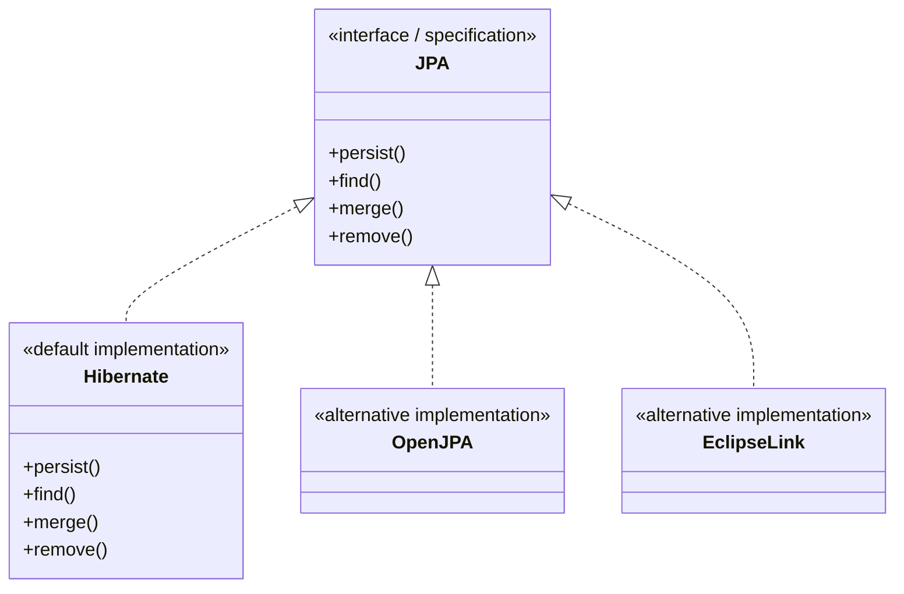
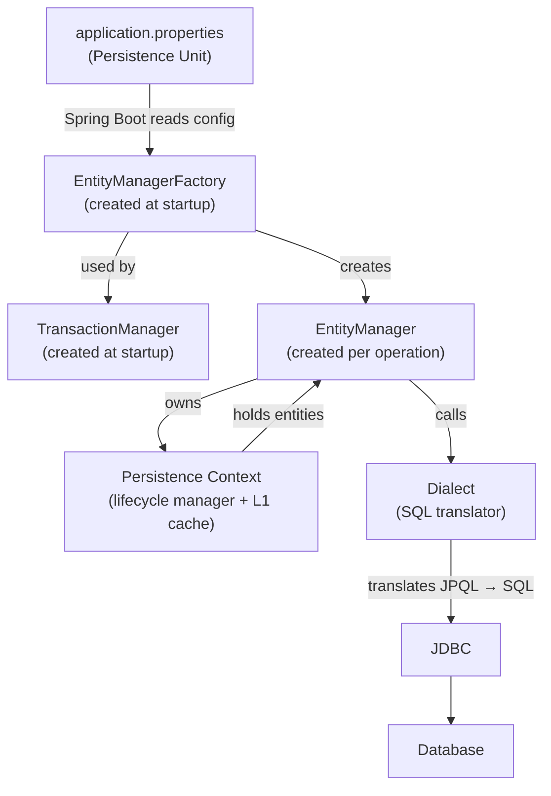
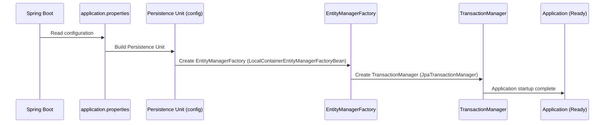
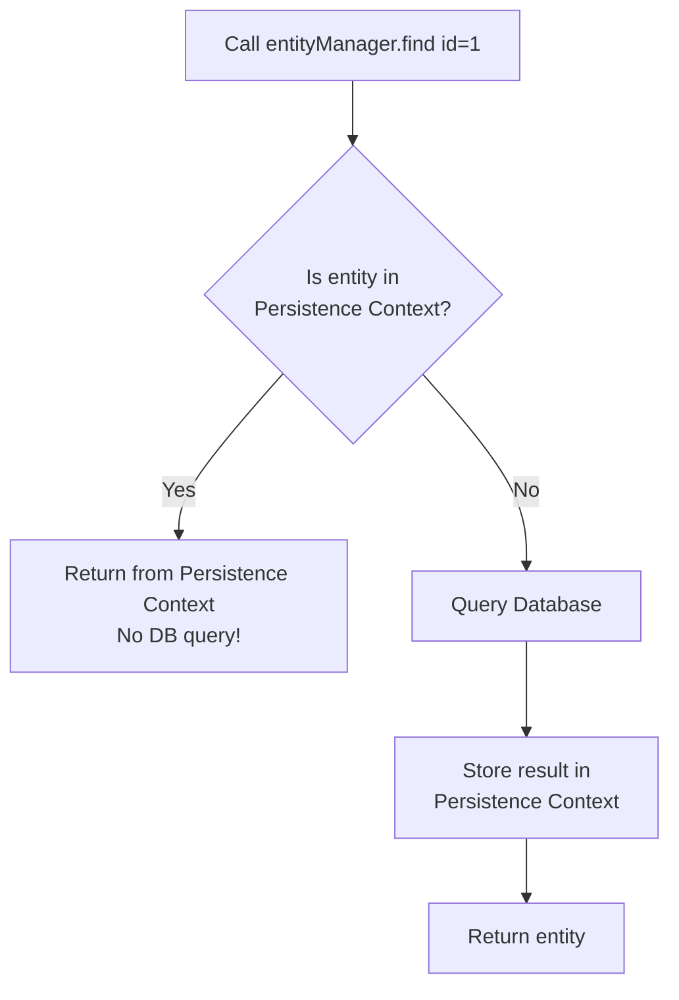
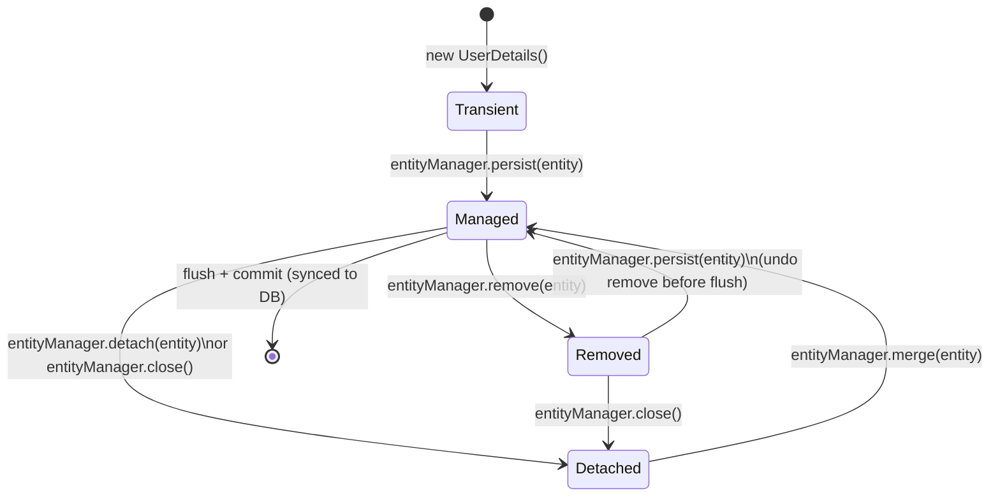

# 📘 Java Persistence API (JPA) — Part 2: Architecture & Internals

> **Series:** Concept and Coding — JPA Series  
> **Part:** 2 of 3  
> **Prerequisites:** Spring Boot JDBC (Part 1)

---

## Table of Contents

1. [ORM — Object Relational Mapping](#1-orm--object-relational-mapping)
2. [JPA vs Hibernate — Interface vs Implementation](#2-jpa-vs-hibernate--interface-vs-implementation)
3. [Minimal JPA Setup — The Four Steps](#3-minimal-jpa-setup--the-four-steps)
4. [JPA Architecture — Deep Dive](#4-jpa-architecture--deep-dive)
   - [Persistence Unit](#41-persistence-unit)
   - [Entity Manager Factory](#42-entity-manager-factory)
   - [Transaction Manager](#43-transaction-manager)
   - [Entity Manager](#44-entity-manager)
   - [Persistence Context](#45-persistence-context)
   - [Dialect](#46-dialect)
5. [Entity Lifecycle Inside Persistence Context](#5-entity-lifecycle-inside-persistence-context)
6. [JPA Repository vs Entity Manager — Why Use JPA Repository?](#6-jpa-repository-vs-entity-manager--why-use-jpa-repository)
7. [First Level Caching (Introduction)](#7-first-level-caching-introduction)
8. [Multi-DB Setup — Manual Configuration](#8-multi-db-setup--manual-configuration)
9. [Common Mistakes & Best Practices](#9-common-mistakes--best-practices)
10. [Interview Notes](#10-interview-notes)
11. [Practice Questions](#11-practice-questions)
12. [Summary](#12-summary)

---

## 1. ORM — Object Relational Mapping

### Overview

In the **JDBC** approach (Part 1), your application code directly connects to the database through JDBC and you write raw SQL queries. You are responsible for every `PreparedStatement`, `ResultSet`, and connection management call.

**ORM (Object Relational Mapping)** is a programming technique that inserts a framework layer between your Java application logic and the underlying JDBC layer. Instead of writing SQL, you interact with the database using plain Java objects.

```
┌────────────────────┐
│  Application Logic │
└────────┬───────────┘
         │ works with Java Objects
┌────────▼───────────┐
│   ORM Framework    │  ← NEW LAYER (JPA + Hibernate)
│  (JPA / Hibernate) │
└────────┬───────────┘
         │ generates and executes SQL
┌────────▼───────────┐
│       JDBC         │
└────────┬───────────┘
         │
┌────────▼───────────┐
│      Database      │
└────────────────────┘
```

### Why ORM Exists

| Problem with JDBC | How ORM Solves It |
|---|---|
| Must write raw SQL for every operation | Interact with DB using Java objects |
| Must manually map `ResultSet` columns to Java fields | Automatic mapping via annotations |
| Boilerplate code for every CRUD operation | Pre-built CRUD methods via repositories |
| No object-level caching | First-level cache (Persistence Context) |
| Transaction management is manual | Automatic transaction management |

> [!NOTE]
> ORM does **not** eliminate SQL — it generates SQL internally. The key benefit is that **you** don't have to write it in most cases.

---

## 2. JPA vs Hibernate — Interface vs Implementation

### Definition

- **JPA (Java Persistence API)** is a **specification** — a set of interfaces and rules defined by the Java EE standard. It does not contain any actual implementation logic. Think of it as a contract.
- **Hibernate**, **OpenJPA**, and **EclipseLink** are **implementations** of JPA. They provide the actual code that fulfills the JPA contract.



### Spring Boot Default

Spring Boot automatically uses **Hibernate** as the JPA implementation. When you add the `spring-boot-starter-data-jpa` dependency, Hibernate is pulled in transitively — you do not need to add Hibernate separately.

If you want to override this with a different provider:

```properties
spring.jpa.properties.javax.persistence.provider=org.eclipse.persistence.jpa.PersistenceProvider
```

> [!TIP]
> For the vast majority of Spring Boot applications, the default Hibernate implementation is exactly what you need. Switching providers is rare in practice.

---

## 3. Minimal JPA Setup — The Four Steps

To get a basic JPA application running in Spring Boot, you need exactly **four things**:

### Step 1 — Add the JPA Dependency (`pom.xml`)

```xml
<dependency>
    <groupId>org.springframework.boot</groupId>
    <artifactId>spring-boot-starter-data-jpa</artifactId>
</dependency>

<!-- Choose your database driver -->
<dependency>
    <groupId>com.h2database</groupId>
    <artifactId>h2</artifactId>
    <scope>runtime</scope>
</dependency>
```

> [!IMPORTANT]
> Adding `spring-boot-starter-data-jpa` **automatically** brings in the Hibernate dependency. You do not need to add it separately.

---

### Step 2 — Database Connection Properties (`application.properties`)

```properties
# Data source configuration
spring.datasource.url=jdbc:h2:mem:userdb
spring.datasource.driver-class-name=org.h2.Driver
spring.datasource.username=sa
spring.datasource.password=

# H2 in-memory console (for development only)
spring.h2.console.enabled=true
spring.h2.console.path=/h2-console

# Show generated SQL in logs (development only)
spring.jpa.show-sql=true
spring.jpa.properties.hibernate.format_sql=true
```

> [!WARNING]
> `spring.jpa.show-sql=true` and `hibernate.format_sql=true` are for **development and debugging only**. Never use them in production — they degrade performance and may expose sensitive data in logs.

---

### Step 3 — Create an Entity Class

An **Entity** is a Java class that maps directly to a database table.

```java
import jakarta.persistence.*;

@Entity                              // Marks this class as a JPA entity (= a table)
@Table(name = "user_details")        // Optional: explicitly name the table
public class UserDetails {

    @Id                              // Marks this field as the primary key
    @GeneratedValue(strategy = GenerationType.IDENTITY)  // Auto-increment
    private Long id;

    private String name;
    private String email;

    // MANDATORY: JPA requires a no-arg constructor
    public UserDetails() {}

    // Getters and Setters (standard POJO)
    public Long getId() { return id; }
    public void setId(Long id) { this.id = id; }

    public String getName() { return name; }
    public void setName(String name) { this.name = name; }

    public String getEmail() { return email; }
    public void setEmail(String email) { this.email = email; }
}
```

#### Mapping Rules

| Java Concept | Database Concept |
|---|---|
| `@Entity` class | Table |
| Class name (default) | Table name |
| Field | Column |
| Field name (default) | Column name |
| `new UserDetails()` | A new row |
| `@Id` field | Primary key column |

> [!IMPORTANT]
> The **default no-arg constructor is mandatory** in any JPA entity. JPA uses reflection to instantiate objects when loading data from the database, and this requires a no-argument constructor to exist.

---

### Step 4 — Create a Repository Interface

```java
import org.springframework.data.jpa.repository.JpaRepository;
import org.springframework.stereotype.Repository;

@Repository
public interface UserDetailRepository extends JpaRepository<UserDetails, Long> {
    // JpaRepository<EntityType, PrimaryKeyType>
    // Pre-built methods available: save(), findAll(), findById(), deleteById(), count(), etc.
    
    // You can add custom queries here when needed:
    // List<UserDetails> findByName(String name);
}
```

#### Why a Separate Repository Per Entity?

- Each repository is tailored to one entity, keeping concerns separated.
- Custom JPQL (Java Persistence Query Language) or native SQL queries for that entity live here.
- Type safety is enforced via generics: `JpaRepository<UserDetails, Long>` means this repo works only with `UserDetails` and its `Long` primary key.

---

### Putting It All Together — Controller → Service → Repository Flow

```java
// Controller
@RestController
@RequestMapping("/api")
public class UserController {

    @Autowired
    private UserService userService;

    @GetMapping("/test-jpa")
    public UserDetails testJpa() {
        userService.saveUser();
        return userService.getUser(1L);
    }
}

// Service
@Service
public class UserService {

    @Autowired
    private UserDetailRepository userDetailRepository;

    public void saveUser() {
        UserDetails user = new UserDetails();
        user.setName("XYZ");
        user.setEmail("xyz@conceptcoding.com");
        userDetailRepository.save(user);   // Internally calls EntityManager.persist()
    }

    public UserDetails getUser(Long id) {
        return userDetailRepository.findById(id).orElse(null);  // Internally: EntityManager.find()
    }
}
```

#### Layered Architecture

```
HTTP Request
     │
     ▼
Controller   ← handles HTTP, delegates to Service
     │
     ▼
Service      ← business logic, calls Repository
     │
     ▼
Repository   ← data access, wraps EntityManager
     │
     ▼
Database
```

> [!NOTE]
> The controller should **never** directly call the repository. This separation of concerns is a Spring Boot best practice. Controllers handle HTTP concerns; services handle business logic; repositories handle data access.

---

## 4. JPA Architecture — Deep Dive

Once the basic flow is understood, it is critical to know what happens **internally** — what components exist, how they are created, and how they interact.

### Architecture Overview



---

### 4.1 Persistence Unit

#### What Is It?

A **Persistence Unit** is a named configuration block that groups:
- Which entities belong together (share the same database)
- Database connection details (URL, driver, username, password)
- JPA provider (Hibernate, EclipseLink, etc.)
- Dialect
- Transaction type

Think of it as a **configuration profile** for one database.

#### In Plain Spring Boot (single DB)

You define it implicitly through `application.properties`. Spring Boot reads these properties and constructs a single Persistence Unit automatically.

#### Without Spring Boot — `persistence.xml`

If you are not using Spring Boot, or if you need **multiple databases**, you create a `persistence.xml` file inside `src/main/resources/META-INF/`:

```xml
<persistence xmlns="https://jakarta.ee/xml/ns/persistence" version="3.0">

    <!-- Persistence Unit for H2 (in-memory) -->
    <persistence-unit name="h2-unit" transaction-type="RESOURCE_LOCAL">
        
        <!-- Entities belonging to this unit -->
        <class>com.example.SampleEntityOne</class>
        <class>com.example.SampleEntityTwo</class>

        <!-- JPA Provider -->
        <provider>org.hibernate.jpa.HibernatePersistenceProvider</provider>

        <properties>
            <property name="jakarta.persistence.jdbc.driver" value="org.h2.Driver"/>
            <property name="jakarta.persistence.jdbc.url" value="jdbc:h2:mem:userdb"/>
            <property name="jakarta.persistence.jdbc.user" value="sa"/>
            <property name="jakarta.persistence.jdbc.password" value=""/>
            <property name="hibernate.dialect" value="org.hibernate.dialect.H2Dialect"/>
        </properties>
    </persistence-unit>

    <!-- Separate Persistence Unit for MySQL -->
    <persistence-unit name="mysql-unit" transaction-type="RESOURCE_LOCAL">
        <class>com.example.OrderDetails</class>
        <provider>org.hibernate.jpa.HibernatePersistenceProvider</provider>
        <properties>
            <property name="jakarta.persistence.jdbc.driver" value="com.mysql.cj.jdbc.Driver"/>
            <property name="jakarta.persistence.jdbc.url" value="jdbc:mysql://localhost:3306/orders"/>
            <property name="jakarta.persistence.jdbc.user" value="root"/>
            <property name="jakarta.persistence.jdbc.password" value="secret"/>
            <property name="hibernate.dialect" value="org.hibernate.dialect.MySQL8Dialect"/>
        </properties>
    </persistence-unit>

</persistence>
```

#### Transaction Types

| Type | Scope | Use Case |
|---|---|---|
| `RESOURCE_LOCAL` | Single database only | Standard Spring Boot apps |
| `JTA` | Spans multiple databases | Distributed transactions, microservices with shared DBs |

> [!IMPORTANT]
> When using `application.properties` in Spring Boot, **you can only configure one database** (one persistence unit). For multiple databases, use `@Configuration` classes.

> [!NOTE]
> In `application.properties`, Spring Boot defaults the transaction type to `RESOURCE_LOCAL` automatically. You do not need to specify it.

---

### 4.2 Entity Manager Factory

#### What Is It?

`EntityManagerFactory` is a **Java object** (created once, at application startup) that:
1. Reads the Persistence Unit configuration
2. Holds all JPA/Hibernate configuration in memory
3. Acts as a **factory** — its sole purpose is to create `EntityManager` instances on demand

#### Relationship: Persistence Unit → EntityManagerFactory

```
One Persistence Unit  →  One EntityManagerFactory

H2 Persistence Unit   →  EntityManagerFactory for H2
MySQL Persistence Unit →  EntityManagerFactory for MySQL
```

> [!IMPORTANT]
> `EntityManagerFactory` is **expensive to create** and is a singleton per Persistence Unit. It is created once during application startup and reused for the lifetime of the application.

#### How Spring Boot Creates It (Automatically)

Spring Boot reads `application.properties`, builds the configuration, and calls internal Spring code to create an `EntityManagerFactory` bean — all automatically. You can observe this by placing a debug breakpoint inside `LocalContainerEntityManagerFactoryBean`.

#### How to Create It Manually (For Multiple DBs)

```java
@Configuration
public class H2DatabaseConfig {

    // Step 1: Define the DataSource (equivalent to JDBC connection info)
    @Bean(name = "h2DataSource")
    public DataSource h2DataSource() {
        DriverManagerDataSource ds = new DriverManagerDataSource();
        ds.setDriverClassName("org.h2.Driver");
        ds.setUrl("jdbc:h2:mem:userdb");
        ds.setUsername("sa");
        ds.setPassword("");
        return ds;
    }

    // Step 2: Define the JPA Vendor Adapter (tells Spring which JPA provider to use)
    @Bean(name = "h2JpaVendorAdapter")
    public JpaVendorAdapter h2JpaVendorAdapter() {
        HibernateJpaVendorAdapter adapter = new HibernateJpaVendorAdapter();
        adapter.setDatabase(Database.H2);
        adapter.setShowSql(true);
        adapter.setGenerateDdl(true);
        return adapter;
    }

    // Step 3: Create the EntityManagerFactory
    @Bean(name = "h2EntityManagerFactory")
    public LocalContainerEntityManagerFactoryBean h2EntityManagerFactory(
            @Qualifier("h2DataSource") DataSource dataSource,
            @Qualifier("h2JpaVendorAdapter") JpaVendorAdapter vendorAdapter) {

        LocalContainerEntityManagerFactoryBean factory = new LocalContainerEntityManagerFactoryBean();
        factory.setDataSource(dataSource);
        factory.setJpaVendorAdapter(vendorAdapter);
        factory.setPackagesToScan("com.example.entity.h2");  // Scan only these entities for H2
        factory.setPersistenceUnitName("h2-unit");
        return factory;
    }
}
```

A second configuration class (`MySQLDatabaseConfig`) would define its own `DataSource`, `JpaVendorAdapter`, and `EntityManagerFactory` in the same way.

---

### 4.3 Transaction Manager

#### What Is It?

A **Transaction Manager** is a Spring bean responsible for:
- Beginning a transaction
- Committing a transaction
- Rolling back a transaction on failure

#### Relationship With EntityManagerFactory

```
One EntityManagerFactory  →  One TransactionManager
H2 EntityManagerFactory   →  H2 TransactionManager (RESOURCE_LOCAL)
MySQL EntityManagerFactory →  MySQL TransactionManager (RESOURCE_LOCAL)
```

#### Types

| Type | Class | Scope |
|---|---|---|
| `RESOURCE_LOCAL` | `JpaTransactionManager` | One DB only |
| `JTA` | `JtaTransactionManager` | Multiple DBs (two-phase commit) |

> [!NOTE]
> JTA (Java Transaction API) enables distributed transactions spanning multiple databases, using a protocol called **Two-Phase Commit (2PC)**. This is a complex topic covered separately. For most Spring Boot apps, `JpaTransactionManager` (RESOURCE_LOCAL) is what you use.

#### Creating a Transaction Manager Manually

```java
@Bean(name = "h2TransactionManager")
public PlatformTransactionManager h2TransactionManager(
        @Qualifier("h2EntityManagerFactory") EntityManagerFactory emf) {
    return new JpaTransactionManager(emf);
    // The EMF already knows the DataSource and all connection details,
    // so the TransactionManager can use it to manage transactions for that specific DB.
}
```

#### Startup Sequence (What Happens When Application Starts)



> [!IMPORTANT]
> Everything up to this point — Persistence Unit, EntityManagerFactory, and TransactionManager — is created **once at application startup**. From here on, requests come in and per-request objects are created.

---

### 4.4 Entity Manager

#### What Is It?

`EntityManager` is the **core JPA interface** you (or JPA Repository) use to interact with the database at runtime.

- It is **not** created at startup — it is created **per operation / per request**.
- It provides the actual CRUD API methods.
- It manages the **Persistence Context** for the duration of its operation.

#### Entity Manager API — Key Methods

| Method | SQL Equivalent | Purpose |
|---|---|---|
| `persist(entity)` | `INSERT` | Save a new entity to DB |
| `merge(entity)` | `UPDATE` | Update an existing entity |
| `find(Class, id)` | `SELECT ... WHERE id = ?` | Fetch a single entity by primary key |
| `remove(entity)` | `DELETE` | Delete an entity |
| `createQuery(jpql)` | Custom `SELECT` | Execute a JPQL query |
| `flush()` | Force sync | Immediately sync in-memory state to DB |
| `detach(entity)` | — | Remove entity from Persistence Context |
| `close()` | — | Close the EntityManager |

#### Who Implements EntityManager?

`EntityManager` is a **JPA interface**. The actual implementation is provided by the JPA vendor:

| Vendor | Implementation Class |
|---|---|
| Hibernate | `SessionImpl` (also known as `Session`) |
| OpenJPA | `OpenJPAEntityManager` |
| EclipseLink | `EclipseLinkEntityManager` |

> [!NOTE]
> In Hibernate terminology, `EntityManager` is called a **Session**. When Hibernate documentation says "open a Session," it means creating an EntityManager object. The two are effectively the same concept with different names.

#### EntityManagerFactory → EntityManager Relationship

```
EntityManagerFactory (1)  →  EntityManager (many)

The factory creates new EntityManager instances as needed.
Each HTTP request / service call typically gets its own EntityManager.
```

#### Directly Using EntityManager (Without JPA Repository)

```java
@Service
public class UserServiceDirect {

    @PersistenceContext   // Spring injects and manages the EntityManager
    private EntityManager entityManager;

    // ❌ This will throw TransactionRequiredException
    public void saveUserWithoutTransaction(UserDetails user) {
        entityManager.persist(user);  // Requires an active transaction!
    }

    // ✅ Correct: add @Transactional
    @Transactional
    public void saveUser(UserDetails user) {
        entityManager.persist(user);
    }

    @Transactional
    public UserDetails getUser(Long id) {
        return entityManager.find(UserDetails.class, id);  // Read — still good practice to have @Transactional
    }
}
```

> [!WARNING]
> When calling `EntityManager.persist()`, `merge()`, or `remove()` directly, you **must** have an active transaction. Without it, a `TransactionRequiredException` is thrown. JPA Repository handles this automatically — it annotates all write operations with `@Transactional` internally.

---

### 4.5 Persistence Context

#### What Is It?

The **Persistence Context** is an in-memory container (cache) that is automatically created alongside every `EntityManager` instance. It:

- Stores all entity objects that the current `EntityManager` is working with
- Acts as the **first-level cache** (L1 cache) — queries hit this before hitting the database
- Manages the **lifecycle** of each entity
- Synchronizes changes with the database at flush time

#### One-to-One Relationship

```
EntityManager (1)  →  Persistence Context (1)

Every EntityManager has exactly one associated Persistence Context.
```

#### Why It Exists — The First-Level Cache Explained

When you call `entityManager.find(UserDetails.class, 1L)`:

1. JPA **first checks the Persistence Context** — "Do I already have this entity in memory?"
2. If **yes** → returns it directly (no database query)
3. If **no** → queries the database, stores the result in the Persistence Context, returns it

This is why in the demo, saving a user and then immediately fetching it showed **only an INSERT in the console, not a SELECT** — the fetch returned the entity from the Persistence Context (L1 cache) without hitting the database.



#### What the Persistence Context Holds

```
Persistence Context
├── UserDetails{id=1, name="Alice", email="alice@example.com"}  ← fetched from DB
├── OrderDetails{id=42, status="PENDING"}                        ← being created
└── InvoiceDetails{id=7, amount=299.99}                          ← being updated
```

All of these entities are "managed" — the Persistence Context tracks every change you make to them and ensures those changes are eventually flushed to the database.

---

### 4.6 Dialect

#### What Is It?

**Dialect** is a Hibernate/JPA class that translates **JPQL (Java Persistence Query Language)** or **HQL (Hibernate Query Language)** into the **native SQL dialect** of the specific database being used.

Different databases have slightly different SQL syntax. The Dialect handles these differences transparently.

```
Your JPQL Query:  "SELECT u FROM UserDetails u WHERE u.name = :name"
                                        │
                               Dialect translates
                                        │
H2 SQL:    "SELECT user_details.id, user_details.name, user_details.email
            FROM user_details WHERE user_details.name = ?"

MySQL SQL:  Same query, but with MySQL-specific optimizations and syntax
```

#### Common Dialect Classes

| Database | Hibernate Dialect Class |
|---|---|
| H2 | `org.hibernate.dialect.H2Dialect` |
| MySQL 8 | `org.hibernate.dialect.MySQL8Dialect` |
| PostgreSQL | `org.hibernate.dialect.PostgreSQLDialect` |
| Oracle | `org.hibernate.dialect.OracleDialect` |
| SQL Server | `org.hibernate.dialect.SQLServerDialect` |

#### In Spring Boot (Auto-Detection)

Spring Boot automatically detects and sets the correct Dialect based on the DataSource driver on the classpath. You typically do not need to specify it in `application.properties`.

However, if you use a `@Configuration` class for manual setup, you must specify it explicitly:

```java
adapter.setDatabasePlatform("org.hibernate.dialect.MySQL8Dialect");
```

#### Dialect in the Architecture Flow

```
EntityManager (Hibernate)
       │ speaks JPQL/HQL
       ▼
    Dialect
       │ translates to native SQL
       ▼
     JDBC
       │ sends SQL
       ▼
   Database
```

---

## 5. Entity Lifecycle Inside Persistence Context

Every entity object goes through defined states within a Persistence Context. Understanding these states is critical for debugging and writing correct JPA code.

### The Four States



### State Descriptions

#### 1. Transient (New)

- The entity object exists **only in Java memory** (heap).
- It has **no connection** to the Persistence Context.
- It has **no corresponding row** in the database.

```java
UserDetails user = new UserDetails();  // Transient state
user.setName("Alice");
user.setEmail("alice@example.com");
// At this point: exists in Java heap, not in DB, not in Persistence Context
```

---

#### 2. Managed

- The entity is **inside the Persistence Context**.
- The Persistence Context tracks **every change** made to this object.
- At flush time, all changes are automatically persisted to the database.

Two ways an entity becomes Managed:

**Way 1 — New entity persisted:**
```java
entityManager.persist(user);
// user is now Managed. Persistence Context tracks it.
// An INSERT will be issued when flush occurs.
```

**Way 2 — Fetched from DB:**
```java
UserDetails user = entityManager.find(UserDetails.class, 1L);
// user is now Managed. It came from the DB and is in Persistence Context.
user.setName("Bob");
// No need to call merge/update — the change is automatically tracked!
// An UPDATE will be issued when flush occurs. (Dirty checking)
```

> [!TIP]
> This automatic change tracking on Managed entities is called **Dirty Checking**. You do not need to explicitly call any "update" method — simply modify a Managed entity, and Hibernate will detect the change and issue an UPDATE at flush time.

---

#### 3. Removed

- The entity is **marked for deletion** but may not yet be deleted from the database.
- Still exists in the Persistence Context in the Removed state.
- The actual `DELETE` SQL is issued when flush occurs.

```java
entityManager.remove(user);
// user is now in Removed state.
// DB still has the row (not yet flushed).

// Change your mind? You can bring it back:
entityManager.persist(user);
// user is back to Managed state. No DELETE will happen.
```

---

#### 4. Detached

- The entity **was** previously Managed (inside a Persistence Context), but the Persistence Context has been closed or the entity was explicitly detached.
- The entity object still exists in Java memory, but **JPA is no longer tracking it**.
- Any changes made to a Detached entity are **not automatically synced** to the database.

```java
entityManager.detach(user);       // Explicitly detach one entity
// OR
entityManager.close();            // Closing the EntityManager detaches ALL its entities

// At this point, user is Detached. Changes won't be auto-synced.
user.setName("Charlie");          // This change is NOT tracked by JPA!

// To bring it back under JPA control:
UserDetails reattached = entityManager.merge(user);
// reattached is now Managed. The changes will be synced.
```

---

### Full Lifecycle Table

| State | In Persistence Context? | In Database? | Changes Tracked? |
|---|---|---|---|
| Transient | ❌ | ❌ | ❌ |
| Managed | ✅ | ✅ (or will be at flush) | ✅ (auto dirty-check) |
| Removed | ✅ (marked) | ✅ (until flush) | ❌ |
| Detached | ❌ | ✅ | ❌ |

---

## 6. JPA Repository vs Entity Manager — Why Use JPA Repository?

Both `JpaRepository` and `EntityManager` can interact with the database, but JPA Repository adds significant convenience on top.

### Comparison Table

| Feature | JpaRepository | EntityManager (Direct) |
|---|---|---|
| Pre-built CRUD methods (`save`, `findAll`, `findById`, `deleteById`) | ✅ | ❌ (must write manually) |
| Pagination and Sorting support | ✅ (`findAll(Pageable)`) | ❌ (must implement manually) |
| Automatic `@Transactional` on write ops | ✅ | ❌ (must add manually) |
| Automatic EntityManager lifecycle management | ✅ | ❌ (must manage) |
| Custom JPQL queries | ✅ (`@Query` annotation) | ✅ (`createQuery`) |
| Batch operations (`findAll`, `deleteAll`) | ✅ | ❌ (must implement) |

### JPA Repository Internally Uses EntityManager

```java
// Simplified internal implementation of SimpleJpaRepository.save()
@Transactional                           // ← Automatically applied
public <S extends T> S save(S entity) {
    if (entityInformation.isNew(entity)) {
        em.persist(entity);              // ← Calls EntityManager.persist()
        return entity;
    } else {
        return em.merge(entity);         // ← Calls EntityManager.merge()
    }
}
```

> [!TIP]
> JPA Repository is a **high-level abstraction** over EntityManager. Use JPA Repository unless you have a specific need to control EntityManager directly (e.g., complex bulk operations, advanced query building).

---

## 7. First Level Caching (Introduction)

> **Note:** Full first-level caching is covered in Part 3. This section provides the foundational understanding from Part 2.

### What Is It?

**First-Level Cache (L1 Cache)** is the **Persistence Context** itself. It is:
- Scoped to a single `EntityManager` (and thus to a single transaction, by default)
- Always enabled — you cannot disable it
- Transparent — it works automatically without any configuration

### How It Works

```
Request 1: findById(1)  → Persistence Context miss → DB query → store in PC → return
Request 1: findById(1)  → Persistence Context hit  → return directly (NO DB query!)
```

### The Demo Observation Explained

In the lecture demo:
1. A user was saved (`INSERT` was logged).
2. The same user was immediately fetched (`findById`).
3. **No `SELECT` appeared in the console.**

This happened because the `save` operation placed the entity in the Persistence Context. When `findById` was called immediately after (within the same transaction), JPA found the entity already in the Persistence Context and returned it directly — no database round-trip needed.

> [!NOTE]
> The L1 cache is per-EntityManager, meaning it is effectively per-transaction in a typical Spring setup. Once the transaction ends and the EntityManager is closed, the L1 cache is discarded. This is why a second separate request would issue a real DB query.

---

## 8. Multi-DB Setup — Manual Configuration

When your Spring Boot application needs to connect to **more than one database**, you cannot use `application.properties` alone. You must create explicit `@Configuration` classes.

### H2 Configuration Class

```java
@Configuration
@EnableJpaRepositories(
    basePackages = "com.example.repository.h2",         // Repositories for H2
    entityManagerFactoryRef = "h2EntityManagerFactory",
    transactionManagerRef = "h2TransactionManager"
)
public class H2Config {

    @Bean
    @ConfigurationProperties("spring.datasource.h2")
    public DataSource h2DataSource() {
        return DataSourceBuilder.create().build();
    }

    @Bean
    public LocalContainerEntityManagerFactoryBean h2EntityManagerFactory(
            @Qualifier("h2DataSource") DataSource dataSource) {

        HibernateJpaVendorAdapter adapter = new HibernateJpaVendorAdapter();
        adapter.setDatabase(Database.H2);
        adapter.setShowSql(true);
        adapter.setGenerateDdl(true);

        LocalContainerEntityManagerFactoryBean factory = new LocalContainerEntityManagerFactoryBean();
        factory.setDataSource(dataSource);
        factory.setJpaVendorAdapter(adapter);
        factory.setPackagesToScan("com.example.entity.h2");
        factory.setPersistenceUnitName("h2-unit");
        return factory;
    }

    @Bean
    public PlatformTransactionManager h2TransactionManager(
            @Qualifier("h2EntityManagerFactory") EntityManagerFactory emf) {
        return new JpaTransactionManager(emf);
    }
}
```

### MySQL Configuration Class

```java
@Configuration
@EnableJpaRepositories(
    basePackages = "com.example.repository.mysql",      // Repositories for MySQL
    entityManagerFactoryRef = "mysqlEntityManagerFactory",
    transactionManagerRef = "mysqlTransactionManager"
)
public class MySQLConfig {

    @Bean
    @ConfigurationProperties("spring.datasource.mysql")
    public DataSource mysqlDataSource() {
        return DataSourceBuilder.create().build();
    }

    @Bean
    public LocalContainerEntityManagerFactoryBean mysqlEntityManagerFactory(
            @Qualifier("mysqlDataSource") DataSource dataSource) {

        HibernateJpaVendorAdapter adapter = new HibernateJpaVendorAdapter();
        adapter.setDatabase(Database.MYSQL);
        adapter.setGenerateDdl(false);  // Don't auto-create tables in MySQL

        LocalContainerEntityManagerFactoryBean factory = new LocalContainerEntityManagerFactoryBean();
        factory.setDataSource(dataSource);
        factory.setJpaVendorAdapter(adapter);
        factory.setPackagesToScan("com.example.entity.mysql");
        factory.setPersistenceUnitName("mysql-unit");
        return factory;
    }

    @Bean
    public PlatformTransactionManager mysqlTransactionManager(
            @Qualifier("mysqlEntityManagerFactory") EntityManagerFactory emf) {
        return new JpaTransactionManager(emf);
    }
}
```

### `application.properties` for Multi-DB

```properties
# H2 DataSource
spring.datasource.h2.url=jdbc:h2:mem:userdb
spring.datasource.h2.driver-class-name=org.h2.Driver
spring.datasource.h2.username=sa
spring.datasource.h2.password=

# MySQL DataSource
spring.datasource.mysql.url=jdbc:mysql://localhost:3306/ordersdb
spring.datasource.mysql.driver-class-name=com.mysql.cj.jdbc.Driver
spring.datasource.mysql.username=root
spring.datasource.mysql.password=secret
```

> [!IMPORTANT]
> When you create a `@Configuration` class for JPA, Spring Boot's **auto-configuration backs off**. You must explicitly configure everything: DataSource, JpaVendorAdapter, EntityManagerFactory, and TransactionManager.

---

## 9. Common Mistakes & Best Practices

### Common Mistakes

#### ❌ Forgetting No-Arg Constructor on Entity

```java
// WRONG — JPA will fail to instantiate when loading from DB
@Entity
public class UserDetails {
    @Id
    private Long id;
    private String name;
    
    public UserDetails(Long id, String name) {  // Only parameterized constructor
        this.id = id;
        this.name = name;
    }
}

// CORRECT — Always include no-arg constructor
@Entity
public class UserDetails {
    @Id
    private Long id;
    private String name;
    
    public UserDetails() {}  // ← MANDATORY
    
    public UserDetails(Long id, String name) {
        this.id = id;
        this.name = name;
    }
}
```

#### ❌ Calling `EntityManager.persist()` Without a Transaction

```java
// WRONG — throws TransactionRequiredException
@Service
public class UserService {
    @PersistenceContext
    private EntityManager em;
    
    public void save(UserDetails user) {
        em.persist(user);  // ❌ No transaction = exception
    }
}

// CORRECT
@Transactional   // ← Must add this
public void save(UserDetails user) {
    em.persist(user);
}
```

#### ❌ Modifying a Detached Entity and Expecting Auto-Sync

```java
UserDetails user = entityManager.find(UserDetails.class, 1L);
entityManager.detach(user);   // Detached!
user.setName("NewName");      // Change NOT tracked
// flush → No UPDATE will happen because entity is Detached
```

#### ❌ Using `application.properties` for Multi-DB Setup

Spring Boot's `application.properties` only supports a single DataSource. Attempting to add a second `spring.datasource.*` block will not work without `@Configuration` classes.

---

### Best Practices

1. **Always use `JpaRepository`** unless you have a specific, justified reason to use `EntityManager` directly.
2. **Keep entities as simple POJOs** — avoid business logic inside entities.
3. **One repository per entity** — maintain clear separation.
4. **Never expose entities directly via REST APIs** — use DTOs (Data Transfer Objects) to avoid serialization issues and over-exposure of data.
5. **Use `@Transactional` at the service layer**, not the repository or controller layer.
6. **Disable SQL logging in production** (`spring.jpa.show-sql=false`).
7. **Use `@Table(name = "...")` explicitly** to avoid relying on naming convention defaults, especially when working with legacy databases.

---

## 10. Interview Notes

### Commonly Asked Questions

**Q: What is the difference between JPA and Hibernate?**
> JPA is a specification (interface/API standard) defined by Jakarta EE. Hibernate is an implementation of JPA. You code against JPA interfaces and Hibernate provides the actual logic underneath.

**Q: What is a Persistence Context?**
> The Persistence Context is an in-memory storage area managed by an EntityManager. It holds all entities the EntityManager is currently working on, acts as the first-level cache, and manages entity lifecycle (Transient → Managed → Removed → Detached).

**Q: What is the difference between `persist()` and `merge()`?**
> `persist()` is for new (Transient) entities — it inserts them. `merge()` is for Detached entities — it re-attaches them to the Persistence Context and issues an UPDATE if needed.

**Q: What is first-level caching in Hibernate?**
> First-level caching is the Persistence Context itself. Within a single transaction/EntityManager, the same entity fetched multiple times returns from cache, not the database.

**Q: What is a Dialect in Hibernate?**
> A Dialect is a class that translates JPQL/HQL into database-specific SQL. Different databases (MySQL, PostgreSQL, H2, Oracle) require different SQL syntax; the Dialect handles this translation transparently.

**Q: What happens when you close an EntityManager?**
> All entities managed by that EntityManager transition to the Detached state. The Persistence Context is destroyed. Any unflushed changes are lost.

**Q: What is `EntityManagerFactory` and why is it a singleton?**
> `EntityManagerFactory` is the factory that creates `EntityManager` instances. It is heavyweight to create (reads all configuration, initializes Hibernate, maps entities) so it is created once at startup and reused. Creating one per request would be extremely slow.

**Q: What is `RESOURCE_LOCAL` vs `JTA` transaction type?**
> `RESOURCE_LOCAL` scopes a transaction to a single database. `JTA` (Java Transaction API) enables distributed transactions spanning multiple databases, using two-phase commit internally.

**Q: What is the difference between `persist()` requiring `@Transactional` but `find()` not?**
> Write operations (INSERT, UPDATE, DELETE) modify the database and must be atomic — they require a transaction. Read operations (`SELECT`) do not modify data, so while they benefit from a transaction (for consistency), they do not strictly require one.

**Q: Why does JpaRepository not require you to add `@Transactional` on write operations?**
> `JpaRepository`'s underlying implementation class (`SimpleJpaRepository`) already annotates all write methods with `@Transactional` internally. This is one of the key benefits of using JPA Repository over direct EntityManager access.

---

## 11. Practice Questions

### Easy

1. What are the four steps required to set up a basic JPA application in Spring Boot?
2. What annotation marks a Java class as a JPA entity?
3. What is the purpose of the `@Id` annotation?
4. What annotation is used for auto-incrementing primary keys?
5. List three methods pre-built into `JpaRepository`.
6. What does ORM stand for and what problem does it solve?

### Medium

1. Explain the relationship between `EntityManagerFactory` and `EntityManager`.
2. Draw the JPA architecture from `application.properties` all the way to the database.
3. What are the four entity lifecycle states? Describe transitions between them.
4. Why is a no-arg constructor mandatory for JPA entities?
5. When would you use `entityManager.merge()` instead of `entityManager.persist()`?
6. What is the Persistence Context and how does it relate to first-level caching?
7. Explain `RESOURCE_LOCAL` vs `JTA` transaction types with a use case for each.

### Hard

1. How would you configure a Spring Boot application to connect to two separate databases (H2 and MySQL) simultaneously? Write the full configuration.
2. Explain what happens internally when you call `userRepository.save(user)` — trace the call from the repository through EntityManagerFactory, EntityManager, Persistence Context, Dialect, and JDBC.
3. Why does fetching an entity immediately after saving it (within the same transaction) not produce a `SELECT` query in the logs? What mechanism prevents this?
4. What would happen if you called `entityManager.detach(user)`, then `user.setName("NewName")`, then `entityManager.flush()`? Would the name be updated in the database?
5. If you have a `@Transactional` service method that calls `findById()`, modifies the returned entity, and then the method returns — will the change be persisted? Explain the mechanism.

---

## 12. Summary

```
JPA Architecture — At a Glance
────────────────────────────────────────────────────────────────────────

STARTUP (happens once):
  application.properties  →  Persistence Unit (config)
  Persistence Unit        →  EntityManagerFactory (1 per DB)
  EntityManagerFactory    →  TransactionManager (1 per EMF)

RUNTIME (happens per request):
  EntityManagerFactory    →  EntityManager (created on demand)
  EntityManager           →  Persistence Context (created alongside EM)
  EntityManager           →  Dialect  →  JDBC  →  Database

KEY CONCEPTS:
  • ORM = bridge between Java objects and DB tables
  • JPA = specification (interface); Hibernate = implementation
  • Persistence Unit = config grouping (≈ one DB)
  • EntityManagerFactory = singleton factory, expensive, created at startup
  • TransactionManager = manages begin/commit/rollback per DB
  • EntityManager = session with DB; all CRUD goes through this
  • Persistence Context = in-memory entity holder; L1 cache; lifecycle mgr
  • Dialect = JPQL → native SQL translator

ENTITY LIFECYCLE:
  Transient → (persist) → Managed → (remove) → Removed
  Managed   → (detach / close) → Detached
  Detached  → (merge) → Managed

JPA REPOSITORY vs ENTITY MANAGER:
  JPA Repository: high-level, pre-built CRUD, auto-@Transactional, pagination
  EntityManager: low-level, full control, manual transaction management required
```

---

> **Next Up:** JPA Part 3 — First Level Caching (deep dive), Second Level Caching, and JPQL Queries.
