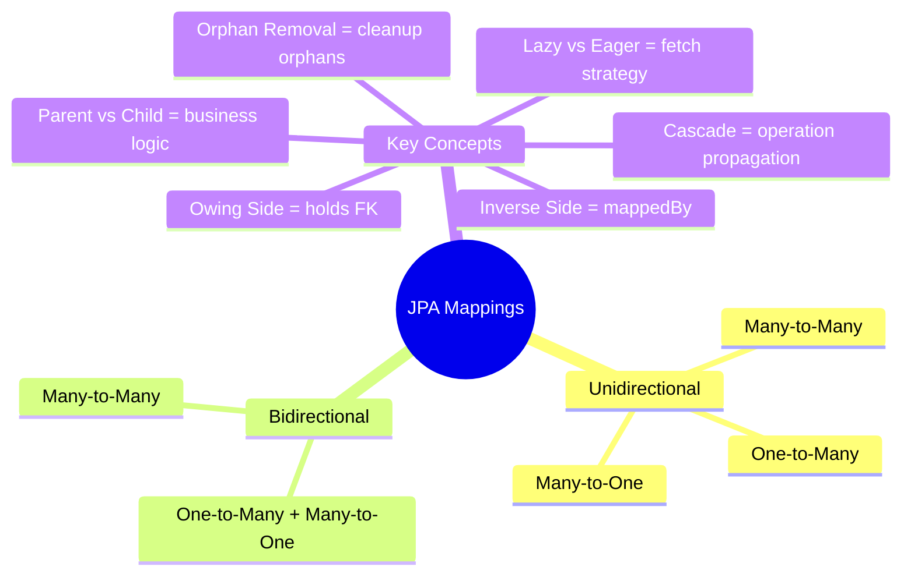
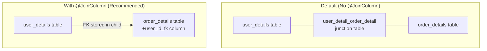
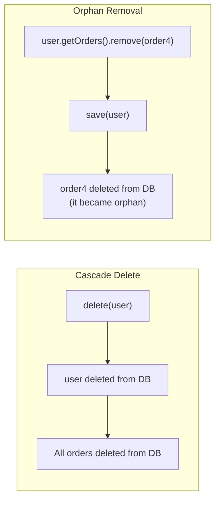
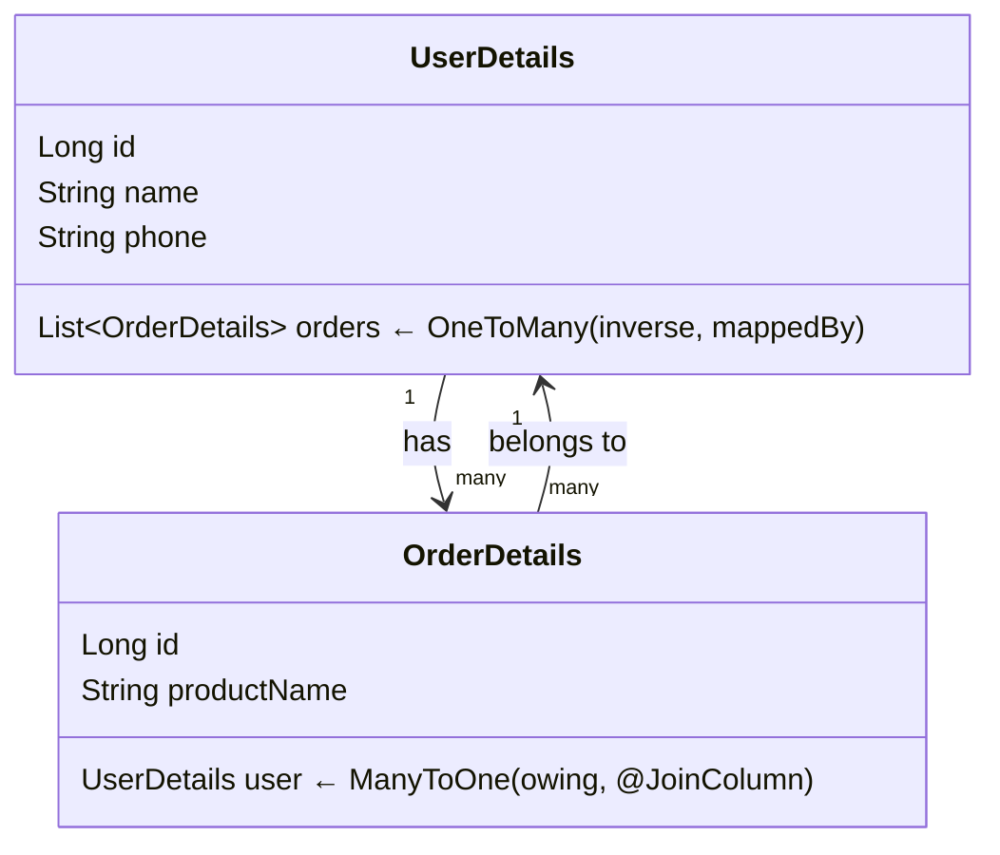
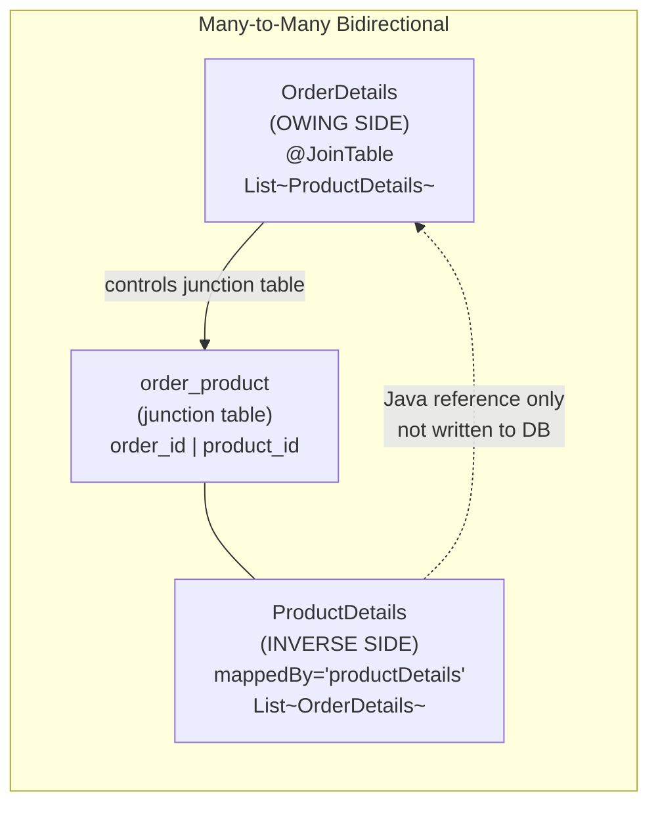

# 📘 JPA Entity Mappings — One-to-Many, Many-to-One & Many-to-Many

> **Series:** Concept and Coding — JPA Series  
> **Part:** 3 — Entity Relationships  
> **Prerequisites:** JPA Part 1 (JDBC basics), JPA Part 2 (Architecture), JPA 1-to-1 Mappings

---

## Table of Contents

1. [Relationship Mapping — Concepts Recap](#1-relationship-mapping--concepts-recap)
2. [One-to-Many — Unidirectional](#2-one-to-many--unidirectional)
3. [Orphan Removal](#3-orphan-removal)
4. [One-to-Many — Bidirectional](#4-one-to-many--bidirectional)
5. [Owing Side vs Inverse Side — Deep Explanation](#5-owing-side-vs-inverse-side--deep-explanation)
6. [Many-to-One — Unidirectional](#6-many-to-one--unidirectional)
7. [Many-to-One — Bidirectional](#7-many-to-one--bidirectional)
8. [Many-to-Many — Unidirectional](#8-many-to-many--unidirectional)
9. [Many-to-Many — Bidirectional](#9-many-to-many--bidirectional)
10. [Comparison Table — All Mappings](#10-comparison-table--all-mappings)
11. [Common Mistakes & Best Practices](#11-common-mistakes--best-practices)
12. [Interview Notes](#12-interview-notes)
13. [Practice Questions](#13-practice-questions)
14. [Summary](#14-summary)

---

## 1. Relationship Mapping — Concepts Recap

Before diving into each mapping type, it is important to firmly establish the vocabulary used throughout this guide. Confusing these terms is the single most common source of mistakes in JPA mapping.

### 1.1 Unidirectional vs Bidirectional

| Term | Meaning |
|---|---|
| **Unidirectional** | Only **one** entity has a reference (field) to the other. Navigation is possible in one direction only. |
| **Bidirectional** | **Both** entities have a reference to each other. Navigation is possible from either side. |

> [!IMPORTANT]
> **Unidirectional vs Bidirectional does NOT change the database schema.** The tables, columns, and foreign keys are identical in both cases. The only difference is in the Java entity classes — which ones hold a reference field to the other.

---

### 1.2 Parent vs Child

- **Parent:** The entity whose existence is not dependent on the other. If the parent is deleted, the child typically cannot exist independently.
- **Child:** The entity whose existence depends on the parent.

**Example:** A `User` can have many `Orders`. If the `User` is deleted, those `Orders` have no owner — so `User` is the parent, `Order` is the child.

---

### 1.3 Owing Side vs Inverse Side

This is the most commonly confused concept in JPA bidirectional mappings.

> [!IMPORTANT]
> **Owing side ≠ Parent. Inverse side ≠ Child.**  
> These are completely independent concepts.

| Term | Definition | Identifier in Code |
|---|---|---|
| **Owing Side** | The entity whose **table holds the foreign key column** | Has `@JoinColumn` annotation |
| **Inverse Side** | The entity whose **table does NOT hold the foreign key** | Has `mappedBy` attribute |

**Rule:** Whichever entity's table contains the foreign key column is the **owing** side, regardless of whether it is the parent or the child.



---

### 1.4 Lazy vs Eager Loading (Quick Recap)

| Strategy | Behaviour | Default For |
|---|---|---|
| **LAZY** | Related entities are loaded **only when accessed** in code | `@OneToMany`, `@ManyToMany` |
| **EAGER** | Related entities are loaded **immediately** with the parent query | `@ManyToOne`, `@OneToOne` |

---

### 1.5 Cascade Types (Quick Recap)

| Type | Effect |
|---|---|
| `PERSIST` | Save child when parent is saved |
| `MERGE` | Update child when parent is updated |
| `REMOVE` | Delete child when parent is deleted |
| `REFRESH` | Refresh child when parent is refreshed |
| `DETACH` | Detach child when parent is detached |
| `ALL` | All of the above |

---

## 2. One-to-Many — Unidirectional

### 2.1 Overview

**One-to-Many** means one record in the parent entity is associated with **multiple** records in the child entity.

**Real-world example:** One `User` can have many `Orders`.

```
User (1) ─────────────────── Order (many)
  │                              │
  │  User 1  ◄──────────────  Order 1
  │          ◄──────────────  Order 2
  │          ◄──────────────  Order 3
  │
  │  User 2  ◄──────────────  Order 4
```

**Unidirectional** means only the `User` entity has a reference to `Order`. The `Order` entity has no reference back to `User` in the Java class.

---

### 2.2 Default Behavior — Junction Table

By default, when you annotate a field with `@OneToMany`, JPA creates a **new join table** to store the relationship. This is because the parent entity (`User`) has only one row — it cannot hold a variable number of foreign keys in a single row.

**Default table structure (without `@JoinColumn`):**

```
user_details table          user_detail_order_detail table      order_detail table
──────────────────          ──────────────────────────────      ─────────────────
id | name | phone           user_id | order_id                  id | product_name
───┼──────┼──────           ────────┼─────────                  ───┼────────────
1  │ Alice│ 9876            1       │ 1                         1  │ Ice Cream
2  │ Bob  │ 5432            1       │ 2                         2  │ Cold Drink
                            1       │ 3                         3  │ Burger
```

This junction table is created **automatically** by JPA. You do not need to create or map it yourself.

---

### 2.3 Better Approach — `@JoinColumn` in Child Table

The recommended approach for **one-to-many** is to store the foreign key directly in the **child table** (order table), avoiding the extra junction table entirely.

To do this, add `@JoinColumn` to the `@OneToMany` annotation. This tells JPA: *"Do not create a new table. Instead, add a foreign key column in the child table."*

**Resulting table structure:**

```
user_details table          order_detail table
──────────────────          ──────────────────────────────────────
id | name | phone           id | product_name | user_id_fk
───┼──────┼──────           ───┼─────────────┼───────────
1  │ Alice│ 9876            1  │ Ice Cream    │ 1
2  │ Bob  │ 5432            2  │ Cold Drink   │ 1
                            3  │ Burger       │ 2
```

---

### 2.4 Entity Classes

#### `UserDetails.java` (Parent — One side)

```java
import jakarta.persistence.*;
import java.util.List;

@Entity
@Table(name = "user_details")
public class UserDetails {

    @Id
    @GeneratedValue(strategy = GenerationType.IDENTITY)
    private Long id;

    private String name;
    private String phone;

    // One User → Many Orders
    @OneToMany(
        cascade = CascadeType.ALL,   // All operations propagate to child
        fetch = FetchType.LAZY       // Orders loaded only when accessed (default)
    )
    @JoinColumn(
        name = "user_id_fk",         // Column name in the ORDER table (child)
        referencedColumnName = "id"  // This references the "id" column in USER table
    )
    private List<OrderDetails> orders;

    // No-arg constructor (mandatory for JPA)
    public UserDetails() {}

    // Getters and Setters
    public Long getId() { return id; }
    public void setId(Long id) { this.id = id; }

    public String getName() { return name; }
    public void setName(String name) { this.name = name; }

    public String getPhone() { return phone; }
    public void setPhone(String phone) { this.phone = phone; }

    public List<OrderDetails> getOrders() { return orders; }
    public void setOrders(List<OrderDetails> orders) { this.orders = orders; }
}
```

#### `OrderDetails.java` (Child — Many side)

```java
import jakarta.persistence.*;

@Entity
@Table(name = "order_details")
public class OrderDetails {

    @Id
    @GeneratedValue(strategy = GenerationType.IDENTITY)
    private Long id;

    private String productName;

    // No-arg constructor (mandatory for JPA)
    public OrderDetails() {}

    // Getters and Setters
    public Long getId() { return id; }
    public void setId(Long id) { this.id = id; }

    public String getProductName() { return productName; }
    public void setProductName(String productName) { this.productName = productName; }
}
```

> [!NOTE]
> In unidirectional one-to-many, the **child entity (`OrderDetails`) has no field referencing `UserDetails`**. Navigation is only possible from `UserDetails → OrderDetails`.

---

### 2.5 Repository

```java
@Repository
public interface UserDetailRepository extends JpaRepository<UserDetails, Long> {}

@Repository
public interface OrderDetailRepository extends JpaRepository<OrderDetails, Long> {}
```

---

### 2.6 Service Layer — Save and Fetch

```java
@Service
public class UserService {

    @Autowired
    private UserDetailRepository userRepo;

    @Transactional
    public UserDetails saveUser() {
        // Create two orders (child entities)
        OrderDetails order1 = new OrderDetails();
        order1.setProductName("Ice Cream");

        OrderDetails order2 = new OrderDetails();
        order2.setProductName("Cold Drink");

        // Create the user (parent entity)
        UserDetails user = new UserDetails();
        user.setName("Alice");
        user.setPhone("9876543210");
        user.setOrders(List.of(order1, order2));

        // CascadeType.ALL ensures orders are also inserted
        return userRepo.save(user);
        // SQL: INSERT INTO user_details ...
        //      INSERT INTO order_details ... (x2)
        //      UPDATE order_details SET user_id_fk = ? ... (x2)
    }

    public UserDetails getUser(Long id) {
        return userRepo.findById(id).orElse(null);
        // SQL: SELECT * FROM user_details WHERE id = ?
        // Orders are NOT fetched yet (LAZY)
        // They are fetched only when getOrders() is called
    }
}
```

---

### 2.7 Demonstrating Lazy Loading

```java
@Service
public class UserService {

    @Autowired
    private UserDetailRepository userRepo;

    @Transactional  // Required to keep session open for lazy loading
    public UserDTO getUserWithOrders(Long id) {
        // Step 1: Only user_details table is queried
        UserDetails user = userRepo.findById(id).orElseThrow();
        // SQL: SELECT * FROM user_details WHERE id = ?

        System.out.println(">> User fetched. Orders NOT yet loaded.");

        // Step 2: Now map to DTO — when getOrders() is called, THEN the query fires
        UserDTO dto = new UserDTO();
        dto.setId(user.getId());
        dto.setName(user.getName());

        System.out.println(">> About to access orders...");

        // Step 3: This triggers the lazy load
        List<OrderDetails> orders = user.getOrders();
        // SQL: SELECT * FROM order_details WHERE user_id_fk = ?

        System.out.println(">> Orders now loaded: " + orders.size());

        dto.setOrders(orders);
        return dto;
    }
}
```

**Console Output:**

```
Hibernate: SELECT * FROM user_details WHERE id = ?
>> User fetched. Orders NOT yet loaded.
>> About to access orders...
Hibernate: SELECT * FROM order_details WHERE user_id_fk = ?
>> Orders now loaded: 2
```

> [!TIP]
> The reason we use a **DTO** in this demo is to control exactly when `getOrders()` is called, making the lazy loading visible. If you return the entity directly from a REST controller, Jackson's serializer will call all getters automatically (including `getOrders()`), triggering the lazy load invisibly and causing confusion.

---

### 2.8 Eager Loading Alternative

```java
@OneToMany(
    cascade = CascadeType.ALL,
    fetch = FetchType.EAGER   // Load orders immediately with the user
)
@JoinColumn(name = "user_id_fk", referencedColumnName = "id")
private List<OrderDetails> orders;
```

**SQL generated with EAGER:**

```sql
SELECT u.*, o.*
FROM user_details u
LEFT OUTER JOIN order_details o ON u.id = o.user_id_fk
WHERE u.id = ?
```

With LAZY, the two queries are separate. With EAGER, they are joined in one query.

---

### 2.9 Architecture Diagram — `@JoinColumn` vs Default



> [!TIP]
> For one-to-many relationships, always prefer `@JoinColumn` over the default junction table approach. The junction table approach is best suited for **many-to-many** relationships.

---

## 3. Orphan Removal

### 3.1 What Is an Orphan?

An **orphan** is a child entity that has been removed from its parent's collection in Java code, but whose corresponding row in the database still exists (or has its foreign key set to `null`) with no valid parent reference.

**Scenario:**

```
Initial state:
  User 1 → [Order 1, Order 2, Order 3, Order 4]

After Java update:
  User 1 → [Order 1, Order 2, Order 3]   (Order 4 removed from collection)

Without orphan removal:
  order_details DB: Order 4 still exists with user_id_fk = NULL  ← ORPHAN
```

Order 4 is now an orphan — it has no parent, but it still occupies a row in the database.

---

### 3.2 Orphan Removal vs Cascade Delete — Key Difference

This is a very common interview question.

| Feature | Trigger | What happens |
|---|---|---|
| **Cascade Delete** (`CascadeType.REMOVE`) | You **delete the parent** | All children are also deleted from DB |
| **Orphan Removal** (`orphanRemoval = true`) | You **remove a child from the parent's collection** (not deleting the parent) | That child row is deleted from DB |



---

### 3.3 Default Behavior (Without Orphan Removal)

```java
@OneToMany(cascade = CascadeType.ALL, fetch = FetchType.LAZY)
@JoinColumn(name = "user_id_fk", referencedColumnName = "id")
private List<OrderDetails> orders;
// orphanRemoval = false  ← This is the default
```

**What happens when you remove an order from the collection and call save:**

```java
@Transactional
public void removeFirstOrder(Long userId) {
    UserDetails user = userRepo.findById(userId).orElseThrow();
    user.getOrders().remove(0);   // Remove first order from Java collection
    userRepo.save(user);           // Save = UPDATE (not DELETE)
}
```

**SQL generated:**

```sql
UPDATE order_details SET user_id_fk = NULL WHERE id = ?
-- Order row still exists! Just its FK is set to null. It is now an orphan.
```

**Database after:**

```
order_details:
id | product_name | user_id_fk
───┼──────────────┼───────────
1  │ Ice Cream    │ NULL        ← Orphan! Still in DB, no parent
2  │ Cold Drink   │ 1
```

---

### 3.4 With Orphan Removal Enabled

```java
@OneToMany(
    cascade = CascadeType.ALL,
    fetch = FetchType.LAZY,
    orphanRemoval = true        // ← Enable orphan cleanup
)
@JoinColumn(name = "user_id_fk", referencedColumnName = "id")
private List<OrderDetails> orders;
```

**Same Java code, different result:**

```java
@Transactional
public void removeFirstOrder(Long userId) {
    UserDetails user = userRepo.findById(userId).orElseThrow();
    user.getOrders().remove(0);
    userRepo.save(user);
}
```

**SQL generated:**

```sql
-- Step 1: Update FK to null (JPA internal step)
UPDATE order_details SET user_id_fk = NULL WHERE id = ?

-- Step 2: Delete the orphaned row
DELETE FROM order_details WHERE id = ?
```

**Database after:**

```
order_details:
id | product_name | user_id_fk
───┼──────────────┼───────────
2  │ Cold Drink   │ 1
-- Ice Cream row is GONE. Properly cleaned up.
```

> [!NOTE]
> JPA handles orphan removal as a **two-step process** internally: first it sets the FK to null, then it issues the DELETE. This is all managed transparently — your code only needs to remove the entity from the collection.

> [!IMPORTANT]
> `orphanRemoval = true` works through the **Persistence Context**. When you remove an entity from the parent's collection, the Persistence Context detects that this entity no longer has a parent reference and marks it for deletion on the next flush.

---

### 3.5 Complete Example with Orphan Removal

```java
@RestController
@RequestMapping("/api/users")
public class UserController {

    @Autowired
    private UserService userService;

    // Step 1: Create user with 2 orders
    @PostMapping
    public UserDetails createUser() {
        return userService.createUserWithOrders();
    }

    // Step 2: Remove first order (orphan removal demo)
    @GetMapping("/remove-first-order/{id}")
    public UserDetails removeFirstOrder(@PathVariable Long id) {
        return userService.removeFirstOrder(id);
    }
}

@Service
public class UserService {

    @Autowired
    private UserDetailRepository userRepo;

    @Transactional
    public UserDetails createUserWithOrders() {
        OrderDetails o1 = new OrderDetails();
        o1.setProductName("Ice Cream");

        OrderDetails o2 = new OrderDetails();
        o2.setProductName("Cold Drink");

        UserDetails user = new UserDetails();
        user.setName("Alice");
        user.setPhone("9876543210");
        user.setOrders(new ArrayList<>(List.of(o1, o2)));

        return userRepo.save(user);
    }

    @Transactional
    public UserDetails removeFirstOrder(Long userId) {
        UserDetails user = userRepo.findById(userId).orElseThrow();
        user.getOrders().remove(0);  // Remove from collection only
        return userRepo.save(user);  // orphanRemoval = true → DELETE issued
    }
}
```

---

## 4. One-to-Many — Bidirectional

### 4.1 Overview

In **bidirectional** one-to-many:
- The **parent** (`User`) has a `List<OrderDetails>` → the `@OneToMany` (inverse) side
- The **child** (`Order`) has a `UserDetails` field → the `@ManyToOne` (owing) side

The child table still holds the foreign key — this is why the **child is the owing side** in one-to-many bidirectional.



---

### 4.2 Owing Side Determination

In one-to-many bidirectional:

```
User table:   id | name | phone          ← NO foreign key → INVERSE side
Order table:  id | productName | user_id_fk   ← HAS foreign key → OWING side
```

The order table holds the foreign key → `OrderDetails` is the **owing** side.

---

### 4.3 Entity Classes

#### `OrderDetails.java` — Owing Side

```java
@Entity
@Table(name = "order_details")
public class OrderDetails {

    @Id
    @GeneratedValue(strategy = GenerationType.IDENTITY)
    private Long id;

    private String productName;

    // Owing side: this table holds the foreign key
    @ManyToOne(cascade = CascadeType.ALL)
    @JoinColumn(
        name = "user_id_owing_fk",   // Column name in THIS (order) table
        referencedColumnName = "id"  // References the "id" column of user_details
    )
    private UserDetails userDetails;

    public OrderDetails() {}

    // Getters and Setters
    public Long getId() { return id; }
    public void setId(Long id) { this.id = id; }

    public String getProductName() { return productName; }
    public void setProductName(String productName) { this.productName = productName; }

    public UserDetails getUserDetails() { return userDetails; }
    public void setUserDetails(UserDetails userDetails) { this.userDetails = userDetails; }
}
```

#### `UserDetails.java` — Inverse Side

```java
@Entity
@Table(name = "user_details")
@JsonIdentityInfo(generator = ObjectIdGenerators.PropertyGenerator.class, property = "id")
public class UserDetails {

    @Id
    @GeneratedValue(strategy = GenerationType.IDENTITY)
    private Long id;

    private String name;
    private String phone;

    // Inverse side: this table does NOT hold the foreign key
    // mappedBy = the field name in OrderDetails that owns the relationship
    @OneToMany(mappedBy = "userDetails", cascade = CascadeType.ALL, fetch = FetchType.LAZY)
    private List<OrderDetails> orders;

    public UserDetails() {}

    // Getters and Setters
    public Long getId() { return id; }
    public void setId(Long id) { this.id = id; }

    public String getName() { return name; }
    public void setName(String name) { this.name = name; }

    public String getPhone() { return phone; }
    public void setPhone(String phone) { this.phone = phone; }

    public List<OrderDetails> getOrders() { return orders; }
    public void setOrders(List<OrderDetails> orders) { this.orders = orders; }
}
```

---

### 4.4 The Critical Step — Setting Both Sides of the Relationship

> [!WARNING]
> This is one of the most common mistakes in bidirectional JPA mappings.

Since `OrderDetails` is the owing side, JPA uses its `userDetails` field to determine what foreign key value to write to the database. The `mappedBy` collection in `UserDetails` is just a **Java-side reference** — JPA does not use it to populate the foreign key.

**If you only set the inverse side (the list), the FK will be NULL:**

```java
// ❌ WRONG — Setting only the inverse side
UserDetails user = new UserDetails();
user.setName("Alice");

OrderDetails o1 = new OrderDetails();
o1.setProductName("Ice Cream");

user.setOrders(List.of(o1));  // Setting the inverse side only
userRepo.save(user);
// Result: order saved, but user_id_owing_fk = NULL in order_details table!
```

**You MUST also set the owing side:**

```java
// ✅ CORRECT — Setting both sides
@Transactional
public UserDetails saveUser() {
    UserDetails user = new UserDetails();
    user.setName("Alice");
    user.setPhone("9876543210");

    OrderDetails o1 = new OrderDetails();
    o1.setProductName("Ice Cream");
    o1.setUserDetails(user);  // ← Owing side: MUST be set explicitly

    OrderDetails o2 = new OrderDetails();
    o2.setProductName("Cold Drink");
    o2.setUserDetails(user);  // ← Owing side: MUST be set explicitly

    user.setOrders(new ArrayList<>(List.of(o1, o2)));  // ← Inverse side (Java reference)

    return userRepo.save(user);
}
```

**Helper method pattern (recommended):**

```java
// Inside UserDetails.java — use a helper to keep both sides in sync
public void addOrder(OrderDetails order) {
    if (orders == null) orders = new ArrayList<>();
    orders.add(order);        // Add to inverse side collection
    order.setUserDetails(this); // Set owing side reference
}

// Usage:
user.addOrder(o1);
user.addOrder(o2);
userRepo.save(user);
```

---

### 4.5 Preventing JSON Serialization Recursion

In bidirectional mappings, if you serialize `User` to JSON, Jackson calls `getOrders()`. For each order, it calls `getUserDetails()`. Then for that user, it calls `getOrders()` again — infinite recursion.

**Two solutions:**

**Option 1: `@JsonIdentityInfo`** (used in the example above — recommended for complex graphs)

```java
@Entity
@JsonIdentityInfo(generator = ObjectIdGenerators.PropertyGenerator.class, property = "id")
public class UserDetails { ... }
```

This makes Jackson serialize each object by its `id` on second encounter, breaking the cycle.

**Option 2: `@JsonIgnore`** (simpler — recommended for most cases)

```java
// In OrderDetails.java — ignore the back-reference to parent
@ManyToOne(cascade = CascadeType.ALL)
@JoinColumn(name = "user_id_owing_fk", referencedColumnName = "id")
@JsonIgnore   // ← Do not serialize the parent reference
private UserDetails userDetails;
```

> [!TIP]
> `@JsonIgnore` on the child side is the simplest approach. When you fetch a user, you get all their orders. When you serialize an order, you don't get the user back — which is usually the desired behavior anyway (you already have the user's context).

---

## 5. Owing Side vs Inverse Side — Deep Explanation

### Summary Table by Mapping Type

| Mapping | Who holds FK in DB? | Owing Side | Inverse Side |
|---|---|---|---|
| `@OneToOne` (from Part 2) | Parent table | Parent | Child |
| `@OneToMany` | Child table | **Child** | **Parent** |
| `@ManyToOne` | Child table | **Child** | **Parent** |
| `@ManyToMany` | Neither (new join table) | **Your choice** | **Your choice** |

### Visual Summary

```mermaid
flowchart TD
    subgraph "Who is the Owing Side?"
        Q1{Which table\nholds the FK?}
        Q1 -->|Parent table| A1["Parent is Owing\n(has @JoinColumn)\ne.g. @OneToOne"]
        Q1 -->|Child table| A2["Child is Owing\n(has @JoinColumn)\ne.g. @OneToMany, @ManyToOne"]
        Q1 -->|Neither\n(junction table)| A3["Either can be Owing\nYour design choice\ne.g. @ManyToMany"]
    end
```

### Annotation Placement Rule

```
Owing Side  → @JoinColumn (or @JoinTable for ManyToMany)
Inverse Side → mappedBy = "fieldNameOnOwingSide"
```

---

## 6. Many-to-One — Unidirectional

### 6.1 Overview

**Many-to-One** is the same relationship as One-to-Many, just viewed **from the child's perspective**:
- One-to-Many: "One User has many Orders" (looking from parent)
- Many-to-One: "Many Orders belong to one User" (looking from child)

The **database schema is identical.** Only the annotation and which class holds the reference differs.

In **many-to-one unidirectional**, the **child (`Order`) knows about the parent (`User`)**, but the **parent (`User`) does NOT know about the children**. There is no `List<OrderDetails>` in `UserDetails`.

---

### 6.2 Entity Classes

#### `UserDetails.java` — Parent (No knowledge of children)

```java
@Entity
@Table(name = "user_details")
public class UserDetails {

    @Id
    @GeneratedValue(strategy = GenerationType.IDENTITY)
    private Long id;

    private String name;
    private String phone;

    // NO List<OrderDetails> here — parent does not know about children
    // This is what makes it ManyToOne unidirectional

    public UserDetails() {}

    // Getters and Setters
    public Long getId() { return id; }
    public void setId(Long id) { this.id = id; }

    public String getName() { return name; }
    public void setName(String name) { this.name = name; }

    public String getPhone() { return phone; }
    public void setPhone(String phone) { this.phone = phone; }
}
```

#### `OrderDetails.java` — Child (Knows about parent)

```java
@Entity
@Table(name = "order_details")
public class OrderDetails {

    @Id
    @GeneratedValue(strategy = GenerationType.IDENTITY)
    private Long id;

    private String productName;

    // Many orders → One user
    @ManyToOne(cascade = CascadeType.ALL)
    @JoinColumn(
        name = "user_id_fk",       // FK column in order_details table
        referencedColumnName = "id" // References id in user_details
    )
    private UserDetails userDetails;

    public OrderDetails() {}

    // Getters and Setters
    public Long getId() { return id; }
    public void setId(Long id) { this.id = id; }

    public String getProductName() { return productName; }
    public void setProductName(String productName) { this.productName = productName; }

    public UserDetails getUserDetails() { return userDetails; }
    public void setUserDetails(UserDetails userDetails) { this.userDetails = userDetails; }
}
```

---

### 6.3 Comparison: One-to-Many vs Many-to-One Unidirectional

| Aspect | One-to-Many Unidirectional | Many-to-One Unidirectional |
|---|---|---|
| "Talking from" | Parent → Child | Child → Parent |
| Reference in | Parent has `List<Child>` | Child has `Parent` reference |
| Annotation on parent | `@OneToMany` | Nothing |
| Annotation on child | Nothing | `@ManyToOne` |
| DB schema | Identical | Identical |
| FK location | Child table | Child table |
| Navigation | Parent → Children only | Child → Parent only |

> [!NOTE]
> The database tables and foreign key structure are **exactly the same** for both one-to-many and many-to-one. The difference is purely which Java class holds the reference field.

---

### 6.4 Save Example

```java
@Transactional
public OrderDetails createOrder() {
    // Create parent (must exist first, or cascade handles it)
    UserDetails user = new UserDetails();
    user.setName("Alice");
    user.setPhone("9876543210");

    // Create child and link to parent
    OrderDetails order = new OrderDetails();
    order.setProductName("Ice Cream");
    order.setUserDetails(user);  // Child knows its parent

    // Save child — CascadeType.ALL persists the user too
    return orderRepo.save(order);
    // SQL: INSERT INTO user_details ...
    //      INSERT INTO order_details ... (with user_id_fk set)
}
```

---

## 7. Many-to-One — Bidirectional

### 7.1 Overview

**Many-to-One bidirectional** is **exactly the same** as **One-to-Many bidirectional**. The code, annotations, and database schema are identical.

The only conceptual difference is the *starting perspective*:
- One-to-Many Bidirectional: you start thinking from the parent side (user has many orders, and orders know their user)
- Many-to-One Bidirectional: you start thinking from the child side (many orders belong to one user, and users can see their orders)

**Same entities, same annotations, same foreign key — just a different mental framing.**

```java
// OneToMany bidirectional uses:
// Parent: @OneToMany(mappedBy = "userDetails")
// Child:  @ManyToOne + @JoinColumn

// ManyToOne bidirectional uses:
// Parent: @OneToMany(mappedBy = "userDetails")   ← SAME
// Child:  @ManyToOne + @JoinColumn               ← SAME
```

> [!TIP]
> If you understand One-to-Many Bidirectional, you already understand Many-to-One Bidirectional. They are two names for the same thing, described from opposite starting points.

---

## 8. Many-to-Many — Unidirectional

### 8.1 Overview

**Many-to-Many** means records in entity A can be associated with multiple records in entity B, AND records in entity B can also be associated with multiple records in entity A.

**Real-world example:** An `Order` can contain many `Products`. A `Product` can appear in many `Orders`.

```
Order 1 ──────── Product 1
        ──────── Product 2
Order 2 ──────── Product 1
        ──────── Product 3
```

Key characteristics:
- **No parent-child relationship** — neither entity depends on the other for existence
- **Always requires a junction (join) table** — there is no single column that can hold the association
- **Either entity can be the owing side** — it is a design choice

---

### 8.2 Database Structure

A many-to-many relationship **always creates a new junction table**:

```
order_details table       order_product (junction)     product_details table
──────────────────        ────────────────────────     ─────────────────────────
id | order_number         order_id | product_id         id | name       | price
───┼────────────          ─────────┼───────────         ───┼────────────┼──────
1  │ ORD-001              1        │ 1                   1  │ Ice Cream  │ 50.0
2  │ ORD-002              1        │ 2                   2  │ Cold Ring  │ 30.0
                          2        │ 2                   3  │ Burger     │ 80.0
```

This junction table is created and managed **automatically by JPA** when you use `@ManyToMany` with `@JoinTable`.

---

### 8.3 Entity Classes

#### `ProductDetails.java`

```java
@Entity
@Table(name = "product_details")
public class ProductDetails {

    @Id
    @GeneratedValue(strategy = GenerationType.IDENTITY)
    private Long id;

    private String name;
    private double price;

    // No reference to OrderDetails — unidirectional (order → product only)

    public ProductDetails() {}

    // Getters and Setters
    public Long getId() { return id; }
    public void setId(Long id) { this.id = id; }

    public String getName() { return name; }
    public void setName(String name) { this.name = name; }

    public double getPrice() { return price; }
    public void setPrice(double price) { this.price = price; }
}
```

#### `OrderDetails.java` — Owing Side

```java
@Entity
@Table(name = "order_details")
public class OrderDetails {

    @Id
    @GeneratedValue(strategy = GenerationType.IDENTITY)
    private Long orderNumber;

    // Owing side: this entity is responsible for creating and managing the junction table
    @ManyToMany(cascade = {CascadeType.PERSIST, CascadeType.MERGE})
    @JoinTable(
        name = "order_product",                         // Name of the junction table
        joinColumns = @JoinColumn(name = "order_id"),   // FK for THIS entity (order)
        inverseJoinColumns = @JoinColumn(name = "product_id")  // FK for the OTHER entity (product)
    )
    private List<ProductDetails> productDetails;

    public OrderDetails() {}

    // Getters and Setters
    public Long getOrderNumber() { return orderNumber; }
    public void setOrderNumber(Long orderNumber) { this.orderNumber = orderNumber; }

    public List<ProductDetails> getProductDetails() { return productDetails; }
    public void setProductDetails(List<ProductDetails> productDetails) {
        this.productDetails = productDetails;
    }
}
```

> [!NOTE]
> In `@JoinTable`:
> - `joinColumns` = the foreign key column for the entity **on which this annotation is placed** (the owing side — `OrderDetails`)
> - `inverseJoinColumns` = the foreign key column for the **other** entity (`ProductDetails`)

---

### 8.4 Repositories

```java
@Repository
public interface OrderDetailRepository extends JpaRepository<OrderDetails, Long> {}

@Repository
public interface ProductDetailRepository extends JpaRepository<ProductDetails, Long> {}
```

---

### 8.5 Full Flow — Create Products, Then Create Order Linked to Products

```java
@RestController
@RequestMapping("/api")
public class ProductController {

    @Autowired
    private ProductDetailRepository productRepo;

    @PostMapping("/product")
    public ProductDetails createProduct(@RequestBody ProductDetails product) {
        return productRepo.save(product);
    }
}

@RestController
@RequestMapping("/api")
public class OrderController {

    @Autowired
    private OrderDetailRepository orderRepo;

    @Autowired
    private ProductDetailRepository productRepo;

    @PostMapping("/order")
    @Transactional
    public OrderDetails createOrder(@RequestBody OrderRequest request) {
        // Step 1: Fetch the existing products by their IDs
        List<ProductDetails> products = request.getProductIds().stream()
            .map(id -> productRepo.findById(id).orElseThrow())
            .collect(Collectors.toList());

        // Step 2: Create the order and associate it with those products
        OrderDetails order = new OrderDetails();
        order.setProductDetails(products);

        // Step 3: JPA automatically populates the order_product junction table
        return orderRepo.save(order);
        // SQL: INSERT INTO order_details ...
        //      INSERT INTO order_product (order_id, product_id) ...  (for each product)
    }
}
```

**Step-by-Step Demo:**

```
1. POST /api/product  → { "name": "Ice Cream", "price": 50.0 }  → Product ID: 1
2. POST /api/product  → { "name": "Cold Ring",  "price": 30.0 }  → Product ID: 2

3. POST /api/order → { "productIds": [1, 2] }

SQL:
  INSERT INTO order_details (order_number) VALUES (DEFAULT)   → order_number: 1
  INSERT INTO order_product (order_id, product_id) VALUES (1, 1)
  INSERT INTO order_product (order_id, product_id) VALUES (1, 2)

4. POST /api/order → { "productIds": [2] }

SQL:
  INSERT INTO order_details (order_number) VALUES (DEFAULT)   → order_number: 2
  INSERT INTO order_product (order_id, product_id) VALUES (2, 2)
```

**Final DB state:**

```
order_details:   1, 2
product_details: 1 (Ice Cream), 2 (Cold Ring)
order_product:   (1,1), (1,2), (2,2)
```

> [!IMPORTANT]
> Since `OrderDetails` is the owing side (has `@JoinTable`, not `mappedBy`), JPA **automatically manages** the `order_id` and `product_id` in the junction table. You do not need to write any code to insert into `order_product` — JPA handles it.

---

## 9. Many-to-Many — Bidirectional

### 9.1 Overview

In many-to-many bidirectional, **both entities hold a reference to each other**. You can navigate from `Order → Products` AND from `Product → Orders`.

The **database schema is identical** to unidirectional — the same junction table exists. The only difference is that `ProductDetails` now also has a `List<OrderDetails>` field.

---

### 9.2 Deciding Owing vs Inverse in Many-to-Many

Since neither entity holds the foreign key (the junction table does), **either entity can be the owing side**. Your choice should be based on **business logic**:

> **Which entity drives the association in your application?**

In an e-commerce system, orders are created and products are associated to them (not the other way around). So **`OrderDetails` should be the owing side** — it creates and manages the junction table.

If you choose the wrong entity as the owing side, operations from the inverse side will NOT automatically update the junction table, and you must handle it manually.

---

### 9.3 Entity Classes — Bidirectional

#### `OrderDetails.java` — Owing Side (unchanged from unidirectional)

```java
@Entity
@Table(name = "order_details")
public class OrderDetails {

    @Id
    @GeneratedValue(strategy = GenerationType.IDENTITY)
    private Long orderNumber;

    // Owing side — has @JoinTable
    @ManyToMany(cascade = {CascadeType.PERSIST, CascadeType.MERGE})
    @JoinTable(
        name = "order_product",
        joinColumns = @JoinColumn(name = "order_id"),
        inverseJoinColumns = @JoinColumn(name = "product_id")
    )
    private List<ProductDetails> productDetails;

    public OrderDetails() {}

    public Long getOrderNumber() { return orderNumber; }
    public void setOrderNumber(Long orderNumber) { this.orderNumber = orderNumber; }

    public List<ProductDetails> getProductDetails() { return productDetails; }
    public void setProductDetails(List<ProductDetails> productDetails) {
        this.productDetails = productDetails;
    }
}
```

#### `ProductDetails.java` — Inverse Side (new: now has reference back to orders)

```java
@Entity
@Table(name = "product_details")
@JsonIdentityInfo(generator = ObjectIdGenerators.PropertyGenerator.class, property = "id")
public class ProductDetails {

    @Id
    @GeneratedValue(strategy = GenerationType.IDENTITY)
    private Long id;

    private String name;
    private double price;

    // Inverse side — has mappedBy pointing to the field in OrderDetails
    @ManyToMany(mappedBy = "productDetails")
    private List<OrderDetails> orders;

    public ProductDetails() {}

    // Getters and Setters
    public Long getId() { return id; }
    public void setId(Long id) { this.id = id; }

    public String getName() { return name; }
    public void setName(String name) { this.name = name; }

    public double getPrice() { return price; }
    public void setPrice(double price) { this.price = price; }

    public List<OrderDetails> getOrders() { return orders; }
    public void setOrders(List<OrderDetails> orders) { this.orders = orders; }
}
```

---

### 9.4 Critical Warning — Inverse Side Does NOT Manage the Junction Table

```java
// ✅ CORRECT: Creating association from the OWING side (OrderDetails)
// JPA automatically inserts into order_product junction table
OrderDetails order = new OrderDetails();
order.setProductDetails(List.of(product1, product2));
orderRepo.save(order);
// Junction table CORRECTLY populated

// ❌ WRONG: Creating association from the INVERSE side (ProductDetails) only
ProductDetails product = new ProductDetails();
product.setName("Burger");
product.setOrders(List.of(order1, order2));  // mappedBy — JPA ignores this for DB
productRepo.save(product);
// Junction table NOT updated — order_product remains unchanged!
```

> [!WARNING]
> When using `mappedBy`, that side is a **Java-only reference**. JPA does not use it to write to the database. Only the **owing side** (`@JoinTable`) controls what gets written to the junction table. If you need to create associations from the inverse side, you must also update the owing side's collection.

**Correct bidirectional helper:**

```java
// In OrderDetails.java
public void addProduct(ProductDetails product) {
    if (productDetails == null) productDetails = new ArrayList<>();
    productDetails.add(product);        // Update owing side
    product.getOrders().add(this);      // Update inverse side (Java only)
}
```

---

### 9.5 Complete Bidirectional Architecture Diagram



---

## 10. Comparison Table — All Mappings

| Mapping | Direction | FK Location | Default Fetch | New Table? | Annotation on Parent | Annotation on Child |
|---|---|---|---|---|---|---|
| `@OneToMany` Unidirectional | Parent → Child | Child table (with `@JoinColumn`) or junction table (default) | LAZY | Only if no `@JoinColumn` | `@OneToMany @JoinColumn` | None |
| `@OneToMany` Bidirectional | Both | Child table | LAZY | No | `@OneToMany(mappedBy=)` | `@ManyToOne @JoinColumn` |
| `@ManyToOne` Unidirectional | Child → Parent | Child table | EAGER | No | None | `@ManyToOne @JoinColumn` |
| `@ManyToOne` Bidirectional | Both | Child table | EAGER/LAZY | No | `@OneToMany(mappedBy=)` | `@ManyToOne @JoinColumn` |
| `@ManyToMany` Unidirectional | One direction | Junction table | LAZY | Yes (always) | `@ManyToMany @JoinTable` | None |
| `@ManyToMany` Bidirectional | Both | Junction table | LAZY | Yes (always) | `@ManyToMany @JoinTable` | `@ManyToMany(mappedBy=)` |

---

## 11. Common Mistakes & Best Practices

### Common Mistakes

#### ❌ Not Setting the Owing Side in Bidirectional Mapping

```java
// WRONG: Only setting the inverse side
user.setOrders(List.of(order1, order2));
// orderDetails.userDetails is never set → user_id_fk = NULL in DB

// CORRECT: Set both sides
order1.setUserDetails(user);
order2.setUserDetails(user);
user.setOrders(List.of(order1, order2));
```

#### ❌ Expecting Orphan Removal Without Enabling It

```java
// WRONG: Removing from collection and expecting DB row to disappear
user.getOrders().remove(0);
userRepo.save(user);
// Without orphanRemoval = true, the row stays with FK = NULL

// CORRECT:
@OneToMany(cascade = CascadeType.ALL, orphanRemoval = true)
```

#### ❌ Using CascadeType.ALL on ManyToMany (Danger!)

```java
// DANGEROUS: CascadeType.ALL on ManyToMany
@ManyToMany(cascade = CascadeType.ALL)
// If you delete an order, ALL associated products are also deleted!
// Products may be associated with other orders — now those orders have no products.

// CORRECT: Only cascade PERSIST and MERGE for ManyToMany
@ManyToMany(cascade = {CascadeType.PERSIST, CascadeType.MERGE})
```

> [!CAUTION]
> **Never use `CascadeType.ALL` or `CascadeType.REMOVE` on `@ManyToMany`** relationships. Since both entities are independent, deleting one should not cascade-delete the other. It would cause data corruption — other associations pointing to the deleted entity would break.

#### ❌ Infinite Recursion Without `@JsonIgnore` or `@JsonIdentityInfo`

```java
// WRONG: Bidirectional entities returned directly in REST response
@GetMapping("/users/{id}")
public UserDetails getUser(@PathVariable Long id) {
    return userRepo.findById(id).orElseThrow();
    // UserDetails has List<OrderDetails>
    // OrderDetails has UserDetails → infinite JSON recursion → StackOverflowError
}

// CORRECT: Use DTO, @JsonIgnore, or @JsonIdentityInfo
```

---

### Best Practices

1. **Prefer `@JoinColumn` over junction table** for one-to-many — it is simpler and faster.
2. **Use junction tables only for many-to-many** — that is what they are designed for.
3. **Always use DTOs** in REST responses for bidirectional entities to avoid serialization issues.
4. **Use helper methods** (e.g., `addOrder()`, `addProduct()`) to keep both sides of bidirectional relationships in sync.
5. **Avoid `CascadeType.ALL` on `@ManyToMany`** — only cascade `PERSIST` and `MERGE`.
6. **Enable `orphanRemoval = true`** whenever child entities should not exist without a parent.
7. **Choose the owing side based on business flow** — whichever entity "creates" or "drives" the association should be the owing side.
8. **Use `@JsonIgnore` on the inverse side** of bidirectional relationships in REST APIs, unless you specifically need navigation from both sides in JSON responses.

---

## 12. Interview Notes

### Most Commonly Asked Questions

**Q: What is the difference between `@OneToMany` and `@ManyToOne`?**
> They represent the same relationship from opposite perspectives. `@OneToMany` is placed on the parent entity (one user, many orders). `@ManyToOne` is placed on the child entity (many orders, one user). The database schema is identical in both cases — the child table always holds the foreign key.

**Q: What is the owing side and inverse side in JPA?**
> The owing side is the entity whose **table contains the foreign key column**. It is annotated with `@JoinColumn` (or `@JoinTable` for many-to-many). The inverse side does not hold the FK and uses `mappedBy`. Only the owing side controls what is written to the database for the relationship.

**Q: What is orphan removal? How is it different from cascade delete?**
> **Cascade delete** (`CascadeType.REMOVE`): When you delete the parent, all children are deleted too. **Orphan removal** (`orphanRemoval = true`): When you remove a child from the parent's collection (without deleting the parent), that child row is automatically deleted from the database. Orphan removal handles detached children; cascade delete handles parent deletion propagation.

**Q: When is a junction table created by JPA?**
> By default, `@OneToMany` without `@JoinColumn` creates a junction table. `@ManyToMany` **always** creates a junction table. Adding `@JoinColumn` to a `@OneToMany` prevents the junction table and puts the FK directly in the child table instead.

**Q: Why should you not use `CascadeType.ALL` with `@ManyToMany`?**
> In a many-to-many relationship, both entities are independent — neither depends on the other for existence. Using `CascadeType.REMOVE` (included in `ALL`) means deleting one entity would cascade-delete its associated entities, which may be associated with other entities too, causing data corruption. Only `PERSIST` and `MERGE` are safe to cascade in many-to-many.

**Q: How do you prevent infinite recursion in bidirectional JPA entities when serializing to JSON?**
> Two approaches: (1) Use `@JsonIgnore` on the inverse side's back-reference field, so Jackson doesn't follow it. (2) Use `@JsonIdentityInfo` on both entities so Jackson uses the object's ID on repeated encounters instead of recursing. Using DTOs is the cleanest architectural solution.

**Q: In a `@ManyToMany` bidirectional mapping, why does setting the inverse side's collection not update the junction table?**
> Because the inverse side uses `mappedBy`, which tells JPA: "this side does not own the relationship — do not generate any FK management SQL from here." Only the owing side (with `@JoinTable`) controls the junction table. Setting only the inverse side's collection is a Java-only operation and has no effect on the database.

**Q: What is the default fetch type for `@OneToMany` and `@ManyToMany`?**
> Both default to `FetchType.LAZY`. Related entities are not loaded from the database until you access the collection in your code. `@ManyToOne` and `@OneToOne` default to `FetchType.EAGER`.

**Q: In one-to-many bidirectional, the parent is the inverse side — explain why.**
> Because the **child table** holds the foreign key column, not the parent table. The owing side is defined by who holds the FK. Since the child holds the FK, the child entity is the owing side. The parent, whose table has no FK column, is therefore the inverse side.

---

## 13. Practice Questions

### Easy

1. What annotation do you use for a one-to-many relationship in JPA?
2. Where is the foreign key stored in a one-to-many relationship?
3. What does `orphanRemoval = true` do?
4. What is the default fetch type for `@OneToMany`?
5. Which annotation marks the inverse side of a bidirectional relationship?

### Medium

1. Explain the difference between `cascadeType.REMOVE` and `orphanRemoval`.
2. In a bidirectional `@OneToMany` / `@ManyToOne` mapping — which entity is the owing side and why?
3. Why must you set both sides of a bidirectional relationship when saving in JPA?
4. Write entity classes for a `Course` ↔ `Student` many-to-many bidirectional relationship. A course can have many students and a student can enroll in many courses.
5. What SQL is generated when you use `@JoinColumn` on `@OneToMany` vs when you omit it?
6. Why is `CascadeType.ALL` dangerous on `@ManyToMany`?

### Hard

1. You have a `Project` entity and a `Developer` entity with a many-to-many relationship. A developer works on multiple projects and a project has multiple developers. Design the full JPA mapping (bidirectional), including which side should be owing and why. Write all entity classes, repositories, and a service method that assigns two existing developers to a new project.
2. Implement the orphan removal scenario from scratch: create a `Team` with 3 `Player` entities, then remove the middle player from the team's collection and save. Trace the exact SQL statements JPA will generate.
3. You have a bidirectional `@ManyToMany`. A junior developer sets only the inverse side's collection and calls `save()`. The junction table is not updated. Explain why, and show the correct fix.
4. Compare the SQL queries generated for fetching a `User` with their `Orders` using: (a) LAZY loading with DTO mapping, (b) EAGER loading. When would you choose each?

---

## 14. Summary

```
MAPPING CHEAT SHEET
───────────────────────────────────────────────────────────────────────

ONE-TO-MANY:
  • One parent → many children
  • FK lives in CHILD table (use @JoinColumn to enforce this)
  • Default creates a junction table (avoid this for 1:N)
  • Default fetch: LAZY
  • Parent is INVERSE side (mappedBy)
  • Child is OWING side (@JoinColumn)

MANY-TO-ONE:
  • Many children → one parent
  • Same as OneToMany, opposite perspective
  • Child has @ManyToOne + @JoinColumn (child is owing)
  • Parent has no annotation (unidirectional) or @OneToMany(mappedBy=) (bidirectional)
  • DB schema: identical to OneToMany

MANY-TO-MANY:
  • Many ↔ Many
  • Always creates a junction table
  • No parent-child concept — both are independent
  • Owing side: @JoinTable (your design choice)
  • Inverse side: @ManyToMany(mappedBy=)
  • Never use CascadeType.ALL / REMOVE on @ManyToMany
  • Default fetch: LAZY

ORPHAN REMOVAL:
  • Different from cascade delete
  • Cascade delete: parent deleted → children deleted
  • Orphan removal: child removed from collection → child's DB row deleted
  • Enable with: orphanRemoval = true on @OneToMany

OWING vs INVERSE:
  • Owing = table holds FK = has @JoinColumn or @JoinTable
  • Inverse = table has no FK = has mappedBy
  • Only owing side controls DB writes for the relationship
  • Bidirectional: must set BOTH sides in Java code

SERIALIZATION:
  • Bidirectional = risk of infinite JSON recursion
  • Fix: @JsonIgnore on inverse side (simplest)
  • Fix: @JsonIdentityInfo on both entities (for complex graphs)
  • Best: use DTOs to control what is returned
```

---

> **Next Up:** JPA — Custom Queries (JPQL, Native Queries, `@Query` annotation) and Criteria API.
