# 📌 JWT Implementation in Spring Boot — Complete Study Guide

> [!IMPORTANT]
> This guide covers JWT (JSON Web Token) authentication in Spring Boot from the ground up — including token generation, validation, refresh tokens, and role-based authorization — all implemented through the Spring Security filter chain framework.

---

## Table of Contents

1. [JWT Recap — What Is JWT?](#1-jwt-recap--what-is-jwt)
2. [Implementation Roadmap](#2-implementation-roadmap)
3. [Why Spring Boot Has No Built-In JWT Support](#3-why-spring-boot-has-no-built-in-jwt-support)
4. [Spring Security Architecture Deep Dive](#4-spring-security-architecture-deep-dive)
5. [How We Extend the Framework for JWT](#5-how-we-extend-the-framework-for-jwt)
6. [Required Dependencies](#6-required-dependencies)
7. [Step 1 — User Creation](#7-step-1--user-creation)
8. [Step 2 — Token Generation](#8-step-2--token-generation)
9. [Step 3 — Token Validation](#9-step-3--token-validation)
10. [Step 4 — Refresh Token](#10-step-4--refresh-token)
11. [Step 5 — Role-Based Authorization](#11-step-5--role-based-authorization)
12. [Complete Architecture Summary](#12-complete-architecture-summary)
13. [Common Mistakes](#13-common-mistakes)
14. [Best Practices](#14-best-practices)
15. [Interview Notes](#15-interview-notes)
16. [Practice Questions](#16-practice-questions)
17. [Summary Revision Bullets](#17-summary-revision-bullets)

---

# 1. JWT Recap — What Is JWT?

## Overview

JWT (JSON Web Token) is a **stateless authentication method**. "Stateless" means the server does **not** maintain any session or authentication state between requests. Each request carries all the information the server needs to verify the requester's identity.

## Structure

A JWT token has **three parts**, separated by dots (`.`):

```
<Header>.<Payload>.<Signature>
```

Example token (abbreviated):

```
eyJhbGciOiJIUzI1NiIsInR5cCI6IkpXVCJ9
.
eyJzdWIiOiJ1c2VyMSIsImV4cCI6MTcwMDAwMDAwMH0
.
SflKxwRJSMeKKF2QT4fwpMeJf36POk6yJV_adQssw5c
```

### Part 1 — Header

Metadata about the token. Primarily:
- **Algorithm** used for signing (e.g., `HS256` for HMAC-SHA256)
- **Token type** (`JWT`)

Stored as **Base64Url encoded** JSON.

### Part 2 — Payload (Claims)

The actual data carried by the token. Common fields:

| Field | Description |
|---|---|
| `sub` | Subject — typically the username or user ID |
| `iat` | Issued At — timestamp when token was created |
| `exp` | Expiration time |
| `iss` | Issuer |
| Email, role | Custom application-specific data |

The payload is also **Base64Url encoded** (NOT encrypted — do not store sensitive secrets here).

**Claim types:**
- **Registered claims** — standardized (`sub`, `exp`, `iat`, `iss`)
- **Public claims** — custom, should be registered with IANA
- **Private claims** — custom agreement between parties

### Part 3 — Signature

Created by:
1. Taking the encoded header + encoded payload
2. Signing them using the algorithm from the header and a **secret key**

```
HMACSHA256(
  base64UrlEncode(header) + "." + base64UrlEncode(payload),
  secret
)
```

**Purpose:** Ensures **integrity**. If anyone tampers with the payload (e.g., changes role from `USER` to `ADMIN`), the signature will no longer match when verified, and the token will be rejected.

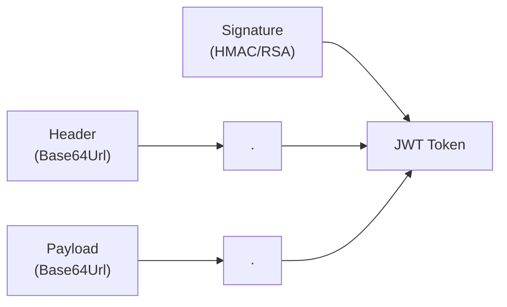

---

# 2. Implementation Roadmap

The complete JWT implementation consists of four steps:

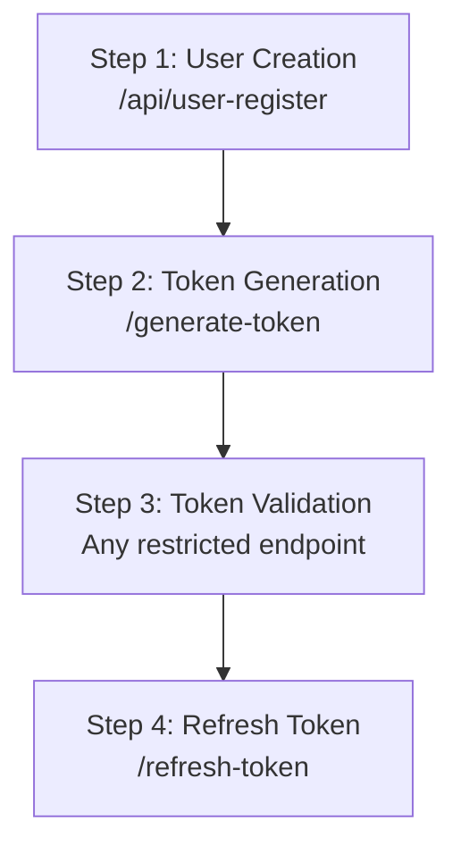

| Step | Endpoint | Description |
|---|---|---|
| 1 | `POST /api/user-register` | Create user in database with hashed password |
| 2 | `POST /generate-token` | Validate credentials → return JWT access token + refresh token |
| 3 | `GET /api/users` (any restricted) | Pass JWT in header → validate → allow/deny |
| 4 | `POST /refresh-token` | Use refresh token (from cookie) → generate new access token |

---

# 3. Why Spring Boot Has No Built-In JWT Support

Spring Boot provides ready-made implementations for:
- **Form-based login** — `UsernamePasswordAuthenticationFilter`
- **HTTP Basic Authentication** — `BasicAuthenticationFilter`

But **not** for JWT. The reason is that JWT requirements vary significantly across applications:

| Concern | Varies By Application |
|---|---|
| Payload content | Different apps store different claims |
| Signing algorithm | HS256, RS256, ES256… |
| Token expiry | 5 min, 15 min, 1 hour… |
| Refresh strategy | Some apps don't need refresh |
| Refresh token storage | Cookie, body, local storage… |

> [!NOTE]
> Because of this variability, Spring Boot says: "We provide the framework — you implement JWT on top of it." This means different engineers implement JWT differently. Don't be confused when you see varying approaches online — there is no single correct implementation.

---

# 4. Spring Security Architecture Deep Dive

Understanding the Spring Security filter chain is **essential** before implementing JWT. This section explains the exact flow and the key behavior we exploit to add JWT support.

## 4.1 The Filter Chain

When any HTTP request arrives:

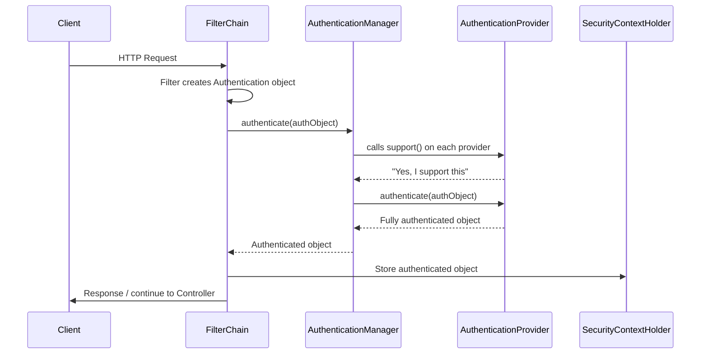

## 4.2 Key Components Explained

### Filter (Security Filter)

- The request enters the **Security Filter Chain**
- Multiple filters exist in sequence (e.g., `SecurityContextPersistenceFilter`, `UsernamePasswordAuthenticationFilter`, `BasicAuthenticationFilter`, `AuthorizationFilter`)
- Each filter is responsible for a specific authentication method
- **Critical behavior:** The filter **creates an Authentication object** from the request data (username/password, session ID, or JWT token)

### Authentication Object

- `Authentication` is an **interface**
- Different filters create different implementations:
  - Form login → `UsernamePasswordAuthenticationToken`
  - Basic auth → uses `UsernamePasswordAuthenticationToken` too
  - JWT (custom) → `JwtAuthenticationToken` (we create this)
- At creation time, `authenticated = false`
- After successful verification, `authenticated = true`

### AuthenticationManager (ProviderManager)

- `AuthenticationManager` is an **interface**
- `ProviderManager` is its **implementation**
- It holds a **list of AuthenticationProviders**
- For each incoming Authentication object, it **iterates** the list, calls `support()` on each provider
- The provider that returns `true` from `support()` gets the request delegated to it

```java
// Simplified ProviderManager internal logic (from Spring Security source)
for (AuthenticationProvider provider : providers) {
    if (!provider.supports(authentication.getClass())) {
        continue;
    }
    result = provider.authenticate(authentication);
    // ...
}
```

### AuthenticationProvider

- Performs the actual authentication
- `DaoAuthenticationProvider` — standard provider that:
  1. Hashes the incoming password
  2. Loads user from DB via `UserDetailsService`
  3. Compares the hashed passwords
  4. Returns a fully authenticated `Authentication` object

### SecurityContextHolder

- After successful authentication, the `Authentication` object is stored here
- This makes the authenticated user accessible throughout the request lifecycle — including in controllers

## 4.3 What We Must Notice

> [!IMPORTANT]
> **The filter creates the Authentication object. The ProviderManager decides which provider handles it. The provider does the actual work. The filter stores the result.**
>
> To add JWT support, we exploit exactly this mechanism — we add our own filter, our own Authentication object type, and our own provider.

---

# 5. How We Extend the Framework for JWT

The extension strategy:

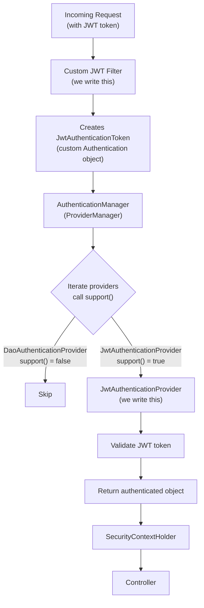

### Three Things We Must Create

| What | Why |
|---|---|
| **Custom Filter** | Intercepts the right requests, creates the Authentication object |
| **Custom Authentication Token** | A new type the custom provider can identify |
| **Custom AuthenticationProvider** | Understands and validates our custom token |

And one thing we must update:

| What | Why |
|---|---|
| **ProviderManager's provider list** | So it knows our provider exists and can delegate to it |

---

# 6. Required Dependencies

Add these to `pom.xml`:

```xml
<!-- JWT API — provides interfaces -->
<dependency>
    <groupId>io.jsonwebtoken</groupId>
    <artifactId>jjwt-api</artifactId>
    <version>0.11.5</version>
</dependency>

<!-- JWT Implementation — implements the API interfaces -->
<dependency>
    <groupId>io.jsonwebtoken</groupId>
    <artifactId>jjwt-impl</artifactId>
    <version>0.11.5</version>
    <scope>runtime</scope>
</dependency>

<!-- Jackson JSON processor — required for parsing JWT payload (JSON key-value pairs) -->
<dependency>
    <groupId>io.jsonwebtoken</groupId>
    <artifactId>jjwt-jackson</artifactId>
    <version>0.11.5</version>
    <scope>runtime</scope>
</dependency>
```

**Why three dependencies?**

| Dependency | Role |
|---|---|
| `jjwt-api` | Defines the interfaces and APIs you program against |
| `jjwt-impl` | Provides the actual implementation (token signing, parsing, etc.) |
| `jjwt-jackson` | Handles JSON serialization/deserialization of the payload |

> [!NOTE]
> The JWT payload is a JSON object (key-value pairs). Jackson is required to serialize and deserialize it.

---

# 7. Step 1 — User Creation

## Overview

Before any JWT flow can work, users must exist in the database. We expose a registration endpoint.

## API

```
POST /api/user-register
Body: { "username": "u1", "password": "123", "role": "ROLE_USER" }
```

## Key Components

### Entity

```java
@Entity
@Table(name = "user_register")
public class UserRegister {
    @Id
    @GeneratedValue(strategy = GenerationType.IDENTITY)
    private Long id;
    private String username;
    private String password;  // stored hashed
    private String role;
    // getters/setters
}
```

### Controller

```java
@RestController
@RequestMapping("/api")
public class UserController {

    @Autowired
    private UserRegisterRepository userRepository;

    @Autowired
    private PasswordEncoder passwordEncoder;

    @PostMapping("/user-register")
    public String registerUser(@RequestBody UserRegister user) {
        // Hash the password before saving
        user.setPassword(passwordEncoder.encode(user.getPassword()));
        userRepository.save(user);
        return "User is registered successfully";
    }
}
```

### UserDetailsService Implementation

Spring Security needs to know how to load users from our database. We implement `UserDetailsService` and override `loadUserByUsername`:

```java
@Service
public class CustomUserDetailsService implements UserDetailsService {

    @Autowired
    private UserRegisterRepository userRepository;

    @Override
    public UserDetails loadUserByUsername(String username) throws UsernameNotFoundException {
        UserRegister user = userRepository.findByUsername(username)
            .orElseThrow(() -> new UsernameNotFoundException("User not found: " + username));

        return User.builder()
            .username(user.getUsername())
            .password(user.getPassword())
            .roles(user.getRole())
            .build();
    }
}
```

> [!NOTE]
> Spring Boot doesn't know what table or columns you're using for users. That's why `UserDetailsService` must be implemented — you tell Spring how to fetch user data from your specific database structure.

### After Registration

The database now contains:

| id | username | password (hashed) | role |
|---|---|---|---|
| 1 | u1 | `$2a$10$...` | ROLE_USER |

---

# 8. Step 2 — Token Generation

## Overview

The user sends their username and password. We validate them against the database. If valid, we generate and return a JWT access token (and a refresh token).

## The `OncePerRequestFilter`

All our custom filters extend `OncePerRequestFilter`:

```java
public abstract class OncePerRequestFilter extends GenericFilterBean {
    // Guarantees the filter executes at most once per request
    protected abstract void doFilterInternal(
        HttpServletRequest request,
        HttpServletResponse response,
        FilterChain filterChain
    ) throws ServletException, IOException;
}
```

> [!IMPORTANT]
> `OncePerRequestFilter` ensures a filter runs **exactly once per request**, even if the filter chain internally re-invokes filters. Always extend this for custom filters.

## 8.1 LoginRequest DTO

```java
public class LoginRequest {
    private String username;
    private String password;
    // getters/setters
}
```

## 8.2 JWT Utility Class

```java
@Component
public class JwtUtil {

    // WARNING: In production, store this in environment variables or a secrets manager
    private static final String SECRET_KEY = "your-very-secure-secret-key-at-least-256-bits";

    /**
     * Generate a JWT token.
     * @param username the subject (user identifier)
     * @param expiryMinutes token validity duration in minutes
     * @return signed JWT string
     */
    public String generateToken(String username, long expiryMinutes) {
        return Jwts.builder()
            .setSubject(username)                                           // payload: "sub"
            .setIssuedAt(new Date())                                        // payload: "iat"
            .setExpiration(new Date(System.currentTimeMillis()
                + expiryMinutes * 60 * 1000))                              // payload: "exp"
            .signWith(getSigningKey(), SignatureAlgorithm.HS256)            // header: algorithm
            .compact();
    }

    /**
     * Validate a JWT token and extract the username (subject).
     * @param token the JWT string
     * @return username if valid
     * @throws BadCredentialsException if token is invalid or expired
     */
    public String validateAndExtractUsername(String token) {
        try {
            Claims claims = Jwts.parserBuilder()
                .setSigningKey(getSigningKey())
                .build()
                .parseClaimsJws(token)
                .getBody();

            String username = claims.getSubject();
            if (username == null) {
                throw new BadCredentialsException("Invalid JWT token");
            }
            return username;
        } catch (JwtException e) {
            throw new BadCredentialsException("Invalid JWT token: " + e.getMessage());
        }
    }

    private Key getSigningKey() {
        byte[] keyBytes = Decoders.BASE64.decode(SECRET_KEY);
        return Keys.hmacShaKeyFor(keyBytes);
    }
}
```

### Why HMAC (Symmetric Key)?

HMAC-SHA256 uses the **same secret key** to both sign (when generating a token) and verify (when validating a token). This means:
- Only the server knows the key
- The server can verify its own tokens

| Algorithm Type | Key Usage | Use When |
|---|---|---|
| HMAC (HS256) | Same key for sign & verify | Single server or all services share the secret |
| RSA (RS256) | Private key signs, public key verifies | Microservices, external token verification |

> [!WARNING]
> **Never** hardcode the secret key in source code. Store it in environment variables, application properties (with encryption), or a dedicated secrets manager (AWS Secrets Manager, HashiCorp Vault, etc.).

## 8.3 JWT Authentication Filter (Token Generation)

```java
public class JwtAuthenticationFilter extends OncePerRequestFilter {

    private final AuthenticationManager authenticationManager;
    private final JwtUtil jwtUtil;

    public JwtAuthenticationFilter(AuthenticationManager authenticationManager, JwtUtil jwtUtil) {
        this.authenticationManager = authenticationManager;
        this.jwtUtil = jwtUtil;
    }

    @Override
    protected void doFilterInternal(
            HttpServletRequest request,
            HttpServletResponse response,
            FilterChain filterChain) throws ServletException, IOException {

        // Step 1: Only handle the generate-token endpoint
        if (!request.getServletPath().equals("/generate-token")) {
            filterChain.doFilter(request, response); // Not our concern, pass along
            return;
        }

        // Step 2: Read username and password from request body
        LoginRequest loginRequest = new ObjectMapper()
            .readValue(request.getInputStream(), LoginRequest.class);

        // Step 3: Create a standard UsernamePasswordAuthenticationToken
        // (DaoAuthenticationProvider knows how to handle this)
        UsernamePasswordAuthenticationToken authToken =
            new UsernamePasswordAuthenticationToken(
                loginRequest.getUsername(),
                loginRequest.getPassword()
            );

        // Step 4: Delegate to AuthenticationManager
        // → ProviderManager iterates providers
        // → DaoAuthenticationProvider.support() returns true
        // → DaoAuthenticationProvider validates against DB
        Authentication authentication = authenticationManager.authenticate(authToken);

        // Step 5: Authentication successful → generate JWT token
        String accessToken = jwtUtil.generateToken(
            authentication.getName(), // username
            15                        // 15 minutes
        );

        // Step 6: Return access token in Authorization header
        response.setHeader("Authorization", "Bearer " + accessToken);

        // Step 7: Generate and send refresh token (in cookie)
        String refreshToken = jwtUtil.generateToken(
            authentication.getName(),
            7 * 24 * 60  // 7 days in minutes
        );

        Cookie refreshCookie = new Cookie("refresh-token", refreshToken);
        refreshCookie.setHttpOnly(true);   // Prevent JavaScript access
        refreshCookie.setSecure(true);     // HTTPS only
        refreshCookie.setPath("/refresh-token"); // Only sent to this endpoint
        response.addCookie(refreshCookie);

        // Step 8: Do NOT chain further — we've already sent the response
        // No filterChain.doFilter() call here
    }
}
```

### Line-by-Line Explanation

| Line | What it does |
|---|---|
| `request.getServletPath().equals("/generate-token")` | Ensures this filter ONLY activates for the token generation endpoint. Other requests skip this filter. |
| `new ObjectMapper().readValue(...)` | Reads the JSON request body and maps it to `LoginRequest` |
| `new UsernamePasswordAuthenticationToken(username, password)` | Creates an Authentication object — `authenticated = false` at this point |
| `authenticationManager.authenticate(authToken)` | Passes to ProviderManager → DaoAuthenticationProvider → validates credentials against DB |
| `jwtUtil.generateToken(...)` | Creates the signed JWT token |
| `response.setHeader("Authorization", "Bearer " + accessToken)` | Returns access token to client |
| No `filterChain.doFilter()` | We don't need to reach the controller — we've sent our response |

### Why Use `UsernamePasswordAuthenticationToken` Here?

We're reusing the same token type that form-based login uses — intentionally. This means `DaoAuthenticationProvider` (which already knows how to validate username/password against the database) will handle it. We get all that validation logic for free.

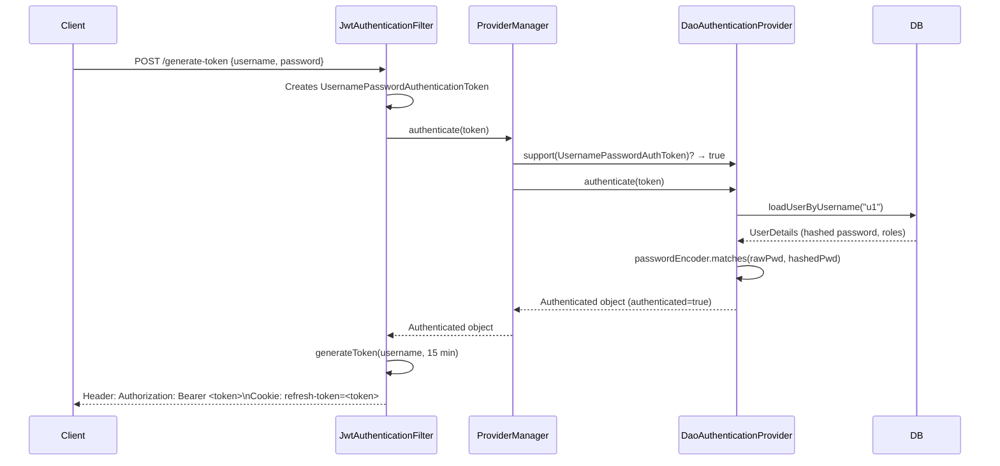

## 8.4 Security Configuration

```java
@Configuration
@EnableWebSecurity
public class SecurityConfig {

    @Autowired
    private CustomUserDetailsService userDetailsService;

    @Autowired
    private PasswordEncoder passwordEncoder;

    @Autowired
    private JwtUtil jwtUtil;

    @Bean
    public SecurityFilterChain securityFilterChain(HttpSecurity http) throws Exception {

        // Create the authentication filter (token generation)
        JwtAuthenticationFilter authFilter =
            new JwtAuthenticationFilter(authenticationManager(), jwtUtil);

        // Create the validation filter (token validation for protected endpoints)
        JwtValidationFilter validationFilter =
            new JwtValidationFilter(authenticationManager());

        http
            .csrf(csrf -> csrf.disable())
            .sessionManagement(session ->
                session.sessionCreationPolicy(SessionCreationPolicy.STATELESS)) // No sessions
            .authorizeHttpRequests(auth -> auth
                .requestMatchers("/api/user-register", "/generate-token").permitAll()
                .requestMatchers("/api/users").hasRole("USER")
                .anyRequest().authenticated()
            )
            // Add JWT auth filter BEFORE UsernamePasswordAuthenticationFilter
            .addFilterBefore(authFilter, UsernamePasswordAuthenticationFilter.class)
            // Add validation filter AFTER the auth filter
            .addFilterAfter(validationFilter, JwtAuthenticationFilter.class);

        return http.build();
    }

    @Bean
    public AuthenticationManager authenticationManager() {
        // Create our own ProviderManager with a specific list of providers
        DaoAuthenticationProvider daoProvider = new DaoAuthenticationProvider();
        daoProvider.setUserDetailsService(userDetailsService);
        daoProvider.setPasswordEncoder(passwordEncoder);

        JwtAuthenticationProvider jwtProvider =
            new JwtAuthenticationProvider(jwtUtil, userDetailsService);

        return new ProviderManager(List.of(daoProvider, jwtProvider));
    }

    @Bean
    public PasswordEncoder passwordEncoder() {
        return new BCryptPasswordEncoder();
    }
}
```

### Why Create a New `ProviderManager`?

> [!NOTE]
> When you don't use `http.formLogin()` or `http.httpBasic()`, Spring Boot does **not** automatically create any `AuthenticationProvider` objects. You must explicitly declare which providers you want and add them to the manager.
>
> Two approaches:
> 1. **Create new `ProviderManager`** (used here) — explicitly define all providers
> 2. **Get Spring's existing `AuthenticationManager`** and add providers to it

### Filter Order in the Chain

```
[SecurityContextPersistenceFilter]
    ↓
[JwtAuthenticationFilter]      ← we add BEFORE UsernamePasswordAuthenticationFilter
    ↓
[UsernamePasswordAuthenticationFilter]
    ↓
[JwtValidationFilter]          ← we add AFTER JwtAuthenticationFilter
    ↓
[BasicAuthenticationFilter]
    ↓
[AuthorizationFilter]
```

---

# 9. Step 3 — Token Validation

## Overview

When a user wants to access a protected resource, they include the JWT in the `Authorization` header. Our validation filter intercepts every request, extracts the token, validates it, and sets the authenticated user in the `SecurityContextHolder`.

## 9.1 Custom Authentication Token

```java
public class JwtAuthenticationToken extends AbstractAuthenticationToken {

    private final String token; // The raw JWT string

    public JwtAuthenticationToken(String token) {
        super(null); // No authorities yet — not authenticated
        this.token = token;
        setAuthenticated(false);
    }

    @Override
    public Object getCredentials() {
        return token;
    }

    @Override
    public Object getPrincipal() {
        return token;
    }
}
```

**Why a custom token?**

We need a type that our custom `JwtAuthenticationProvider` can identify via `support()`. If we used `UsernamePasswordAuthenticationToken`, `DaoAuthenticationProvider` would try to handle it — but it can't validate a JWT.

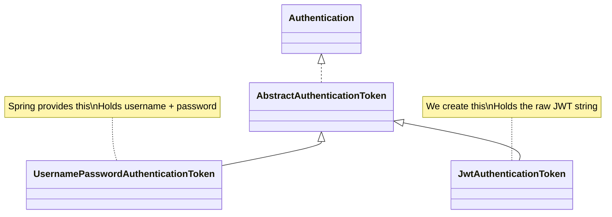

## 9.2 Custom Authentication Provider

```java
@Component
public class JwtAuthenticationProvider implements AuthenticationProvider {

    private final JwtUtil jwtUtil;
    private final UserDetailsService userDetailsService;

    public JwtAuthenticationProvider(JwtUtil jwtUtil, UserDetailsService userDetailsService) {
        this.jwtUtil = jwtUtil;
        this.userDetailsService = userDetailsService;
    }

    @Override
    public Authentication authenticate(Authentication authentication)
            throws AuthenticationException {

        // Extract the raw JWT token
        String token = (String) authentication.getCredentials();

        // Validate and extract username from the token
        String username = jwtUtil.validateAndExtractUsername(token);
        // This throws BadCredentialsException if token is invalid/expired

        if (username == null) {
            throw new BadCredentialsException("Invalid JWT token");
        }

        // Load full user details from the database
        UserDetails userDetails = userDetailsService.loadUserByUsername(username);

        // Return a fully authenticated object
        // UsernamePasswordAuthenticationToken(principal, credentials, authorities)
        // This constructor automatically sets authenticated = true
        return new UsernamePasswordAuthenticationToken(
            userDetails,
            null,
            userDetails.getAuthorities()
        );
    }

    @Override
    public boolean supports(Class<?> authentication) {
        // This provider ONLY handles JwtAuthenticationToken
        return JwtAuthenticationToken.class.isAssignableFrom(authentication);
    }
}
```

### Step-by-Step Execution

1. `ProviderManager` calls `supports(JwtAuthenticationToken.class)` → returns `true`
2. `ProviderManager` calls `authenticate(jwtAuthToken)`
3. Provider extracts the raw token string from the `Authentication` object
4. `jwtUtil.validateAndExtractUsername(token)` parses and verifies the JWT signature
5. If valid, extracts the `sub` (username) from the payload
6. Loads full `UserDetails` from the database
7. Returns `UsernamePasswordAuthenticationToken` with `authenticated = true` and the user's authorities

## 9.3 JWT Validation Filter

```java
public class JwtValidationFilter extends OncePerRequestFilter {

    private final AuthenticationManager authenticationManager;

    public JwtValidationFilter(AuthenticationManager authenticationManager) {
        this.authenticationManager = authenticationManager;
    }

    @Override
    protected void doFilterInternal(
            HttpServletRequest request,
            HttpServletResponse response,
            FilterChain filterChain) throws ServletException, IOException {

        // Step 1: Extract token from Authorization header
        String token = extractToken(request);

        if (token != null) {
            // Step 2: Create custom Authentication object (not yet authenticated)
            JwtAuthenticationToken jwtAuthToken = new JwtAuthenticationToken(token);

            // Step 3: Delegate to AuthenticationManager
            // → ProviderManager finds JwtAuthenticationProvider (support() = true)
            // → Provider validates token and returns authenticated object
            Authentication authentication = authenticationManager.authenticate(jwtAuthToken);

            // Step 4: Store authenticated object in SecurityContextHolder
            // Now controllers and other filters have access to the authenticated user
            SecurityContextHolder.getContext().setAuthentication(authentication);
        }

        // Step 5: Continue the filter chain
        // (unlike token generation filter, we DO need to reach the controller)
        filterChain.doFilter(request, response);
    }

    private String extractToken(HttpServletRequest request) {
        String authHeader = request.getHeader("Authorization");
        if (authHeader != null && authHeader.startsWith("Bearer ")) {
            return authHeader.substring(7); // Remove "Bearer " prefix
        }
        return null;
    }
}
```

### Key Difference From Token Generation Filter

| Token Generation Filter | Token Validation Filter |
|---|---|
| Calls `filterChain.doFilter()` = **No** | Calls `filterChain.doFilter()` = **Yes** |
| Only handles `/generate-token` | Handles ALL requests |
| Generates and returns token | Validates token, sets security context |
| Response sent from filter | Request continues to Controller |

### Validation Flow

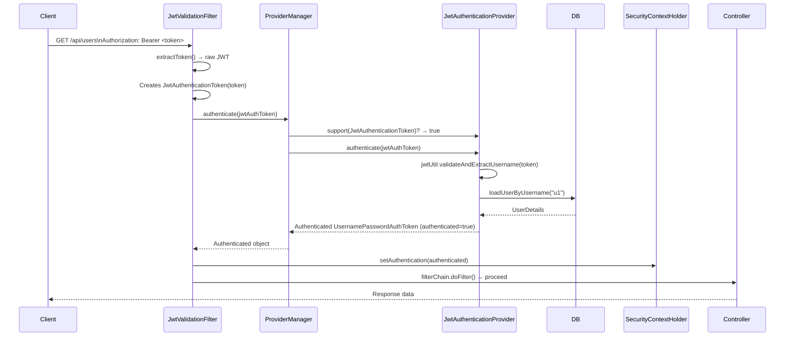

### Invalid Token Scenario

If the token is invalid (tampered, expired, or malformed):
1. `jwtUtil.validateAndExtractUsername(token)` throws `BadCredentialsException`
2. The exception propagates up
3. The filter chain stops
4. Spring Security returns **403 Forbidden**
5. The controller is **never reached**

---

# 10. Step 4 — Refresh Token

## Overview

Access tokens are intentionally short-lived (15 minutes in our example). After expiry, forcing users to re-enter their credentials is a poor user experience. The solution is a **refresh token** — a long-lived token that can be exchanged for a new access token without re-authentication.

## Why Short-Lived Access Tokens?

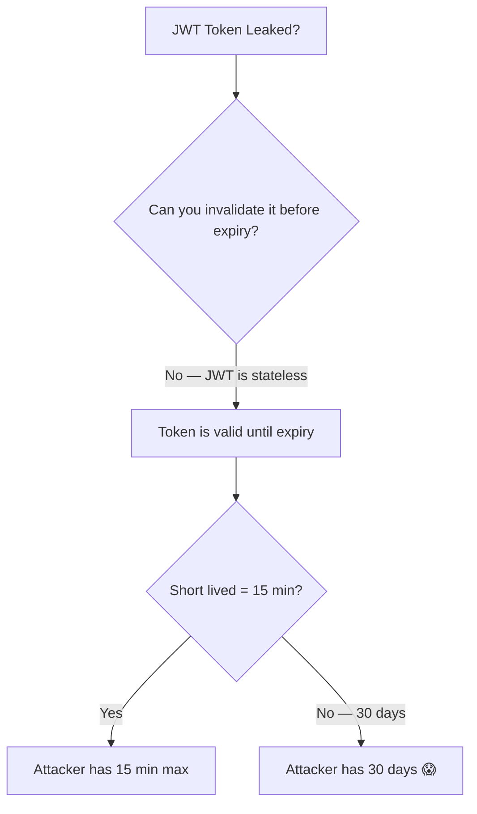

> [!IMPORTANT]
> JWT tokens cannot be invalidated before their expiry (without additional infrastructure like a token blocklist). This is why access tokens must be short-lived. The shorter the window, the less damage a leaked token can cause.

## Token Lifetime Strategy

| Token Type | Lifetime | Storage | Purpose |
|---|---|---|---|
| Access Token | 5–15 minutes | Authorization header (in-memory on client) | Access protected resources |
| Refresh Token | 7–30 days | HttpOnly Cookie | Obtain new access tokens |

## 10.1 Generating the Refresh Token (during `/generate-token`)

This is already shown in the `JwtAuthenticationFilter` above. During token generation, we create both tokens:

```java
// Access token — short lived, sent in header
String accessToken = jwtUtil.generateToken(username, 15);
response.setHeader("Authorization", "Bearer " + accessToken);

// Refresh token — long lived, sent in HttpOnly cookie
String refreshToken = jwtUtil.generateToken(username, 7 * 24 * 60); // 7 days
Cookie refreshCookie = new Cookie("refresh-token", refreshToken);
refreshCookie.setHttpOnly(true);    // JS cannot read this cookie
refreshCookie.setSecure(true);      // Only sent over HTTPS
refreshCookie.setPath("/refresh-token"); // Only sent when this specific path is requested
response.addCookie(refreshCookie);
```

### Why Store Refresh Token in HttpOnly Cookie?

| Approach | Pros | Cons |
|---|---|---|
| **HttpOnly Cookie** (used here) | JS can't access it, browser manages it, path restriction | Requires HTTPS for security |
| **Response body** | Flexible | Client must store it (localStorage? — vulnerable to XSS) |
| **localStorage** | Easy client-side access | Vulnerable to XSS attacks |

The `HttpOnly` + `Secure` + `Path` combination:
- **HttpOnly** → JavaScript's `document.cookie` cannot access this cookie
- **Secure** → Cookie is only transmitted over HTTPS connections
- **Path = "/refresh-token"** → Browser will only include this cookie in requests to `/refresh-token`, not in every API call

## 10.2 JWT Refresh Filter

```java
public class JwtRefreshFilter extends OncePerRequestFilter {

    private final AuthenticationManager authenticationManager;
    private final JwtUtil jwtUtil;

    public JwtRefreshFilter(AuthenticationManager authenticationManager, JwtUtil jwtUtil) {
        this.authenticationManager = authenticationManager;
        this.jwtUtil = jwtUtil;
    }

    @Override
    protected void doFilterInternal(
            HttpServletRequest request,
            HttpServletResponse response,
            FilterChain filterChain) throws ServletException, IOException {

        // Step 1: Only handle the refresh-token endpoint
        if (!request.getServletPath().equals("/refresh-token")) {
            filterChain.doFilter(request, response);
            return;
        }

        // Step 2: Extract refresh token from cookie
        // (it's NOT in the header — it was stored in HttpOnly cookie)
        String refreshToken = null;
        if (request.getCookies() != null) {
            for (Cookie cookie : request.getCookies()) {
                if ("refresh-token".equals(cookie.getName())) {
                    refreshToken = cookie.getValue();
                    break;
                }
            }
        }

        if (refreshToken == null) {
            response.sendError(HttpServletResponse.SC_UNAUTHORIZED, "Refresh token missing");
            return;
        }

        // Step 3: Validate the refresh token using the existing JWT mechanism
        // We reuse JwtAuthenticationToken — same validation logic as access token validation
        JwtAuthenticationToken jwtAuthToken = new JwtAuthenticationToken(refreshToken);

        Authentication authentication = authenticationManager.authenticate(jwtAuthToken);
        // → JwtAuthenticationProvider.support() = true
        // → Validates the refresh token
        // → Returns authenticated object with username

        // Step 4: Generate a new ACCESS token
        String newAccessToken = jwtUtil.generateToken(
            authentication.getName(), // username from validated refresh token
            15                        // 15 minutes
        );

        // Step 5: Return new access token in Authorization header
        response.setHeader("Authorization", "Bearer " + newAccessToken);

        // Step 6: Do NOT proceed to controller
        // The job is done — we've issued a new token
    }
}
```

### Reusing Existing Infrastructure

Notice that the refresh filter:
- **Reuses** `JwtAuthenticationToken` (no new class needed)
- **Reuses** `JwtAuthenticationProvider` (it validates any JWT, access or refresh)
- **Reuses** `JwtUtil.generateToken()` (same method)
- Only creates a new **access** token (refresh token remains the same in the cookie)

## 10.3 Adding Refresh Filter to Security Config

```java
// In SecurityFilterChain bean:
JwtRefreshFilter refreshFilter = new JwtRefreshFilter(authenticationManager(), jwtUtil);

http
    // ... other config ...
    .addFilterAfter(refreshFilter, JwtValidationFilter.class);
```

### Final Filter Order

```
[SecurityContextPersistenceFilter]
    ↓
[JwtAuthenticationFilter]     → handles /generate-token
    ↓
[UsernamePasswordAuthenticationFilter]
    ↓
[JwtValidationFilter]         → validates token for ALL requests
    ↓
[JwtRefreshFilter]            → handles /refresh-token
    ↓
[BasicAuthenticationFilter]
    ↓
[AuthorizationFilter]
```

## 10.4 Refresh Token Flow

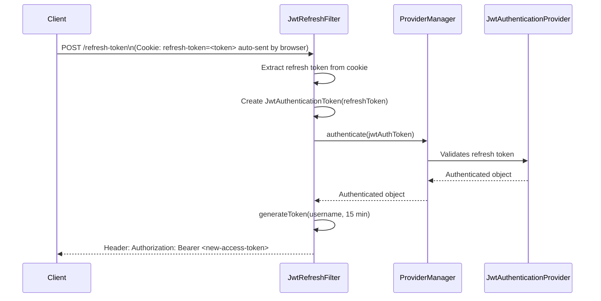

---

# 11. Step 5 — Role-Based Authorization

## Overview

Once token validation is working, authorization (restricting endpoints by role) is simple — Spring Security handles it through the existing `AuthorizationFilter`.

## Configuration

```java
.authorizeHttpRequests(auth -> auth
    .requestMatchers("/api/user-register", "/generate-token").permitAll()
    .requestMatchers("/api/users").hasRole("USER")
    .requestMatchers("/api/admin").hasRole("ADMIN")
    .anyRequest().authenticated()
)
```

## How It Works

After `JwtValidationFilter` stores the `Authentication` object in `SecurityContextHolder`, the `AuthorizationFilter` (at the end of the chain) reads that authentication object and checks whether the user's roles match the required roles for the endpoint.

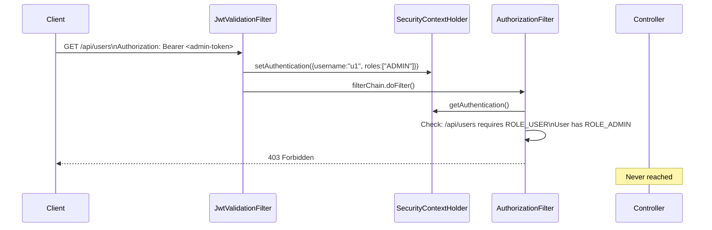

## Example Scenarios

| User Role | Endpoint | Result |
|---|---|---|
| `ROLE_USER` | `/api/users` (requires USER) | ✅ 200 OK |
| `ROLE_ADMIN` | `/api/users` (requires USER) | ❌ 403 Forbidden |
| `ROLE_ADMIN` | `/api/admin` (requires ADMIN) | ✅ 200 OK |
| Any | No token | ❌ 401 Unauthorized |
| Any | Expired/invalid token | ❌ 403 Forbidden |

---

# 12. Complete Architecture Summary

## Full Request Flow Diagram

### Token Generation (`/generate-token`)

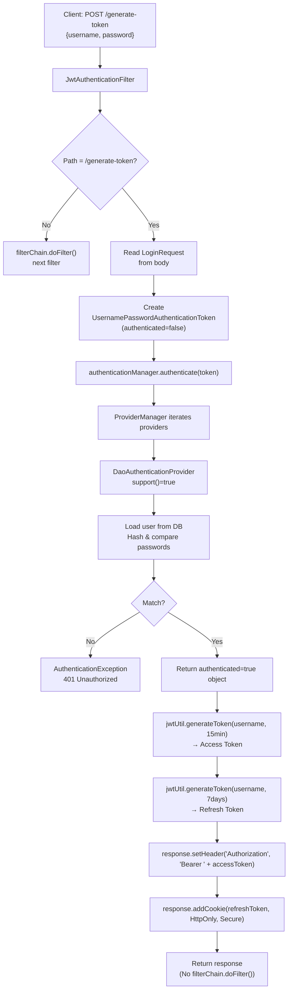

### Token Validation (any protected endpoint)

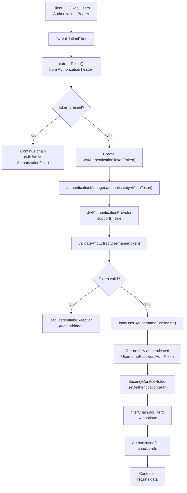

## Component Map

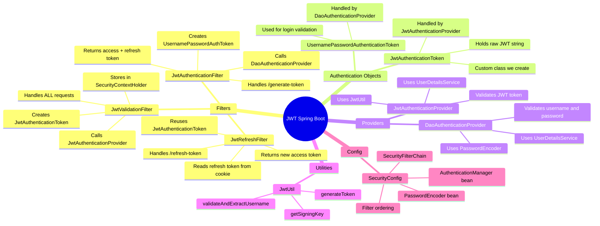

---

# 13. Common Mistakes

## Mistake 1 — Calling `filterChain.doFilter()` When You Shouldn't

```java
// ❌ WRONG — in token generation filter
filterChain.doFilter(request, response);
// This continues to the controller unnecessarily after sending the token

// ✅ CORRECT — just return
response.setHeader("Authorization", "Bearer " + accessToken);
// No doFilter call — we're done
```

## Mistake 2 — Storing Secret Key in Source Code

```java
// ❌ WRONG
private static final String SECRET_KEY = "mysecretkey";

// ✅ CORRECT
@Value("${jwt.secret}")
private String secretKey;
// And in application.properties (encrypted or from environment):
// jwt.secret=${JWT_SECRET_ENV_VAR}
```

## Mistake 3 — Not Adding the Filter to the Chain

```java
// ❌ WRONG — filter created but never added
JwtAuthenticationFilter filter = new JwtAuthenticationFilter(...);
// It will never run!

// ✅ CORRECT
http.addFilterBefore(filter, UsernamePasswordAuthenticationFilter.class);
```

## Mistake 4 — Forgetting to Add the Custom Provider to ProviderManager

```java
// ❌ WRONG — JwtAuthenticationProvider not in the list
return new ProviderManager(List.of(daoProvider));
// JwtAuthenticationToken will never be handled!

// ✅ CORRECT
return new ProviderManager(List.of(daoProvider, jwtProvider));
```

## Mistake 5 — Using `@Component` on Custom Filters Without Controlling Registration

> [!WARNING]
> If you annotate a custom filter with `@Component`, Spring Boot **automatically registers it** in the filter chain in addition to your manual `addFilterBefore()`. This causes the filter to run **twice** per request.
>
> Either:
> - Don't use `@Component` on filters (create them as beans manually in `SecurityConfig`)
> - Or use `@Bean` of type `FilterRegistrationBean` with `setEnabled(false)` to prevent auto-registration

## Mistake 6 — Long-Lived Access Tokens

```
// ❌ WRONG — access token for 30 days
jwtUtil.generateToken(username, 30 * 24 * 60);

// ✅ CORRECT — short-lived access token, long-lived refresh token
jwtUtil.generateToken(username, 15);          // 15 minutes for access
jwtUtil.generateToken(username, 7 * 24 * 60); // 7 days for refresh
```

## Mistake 7 — Storing Refresh Token in localStorage

```
// ❌ WRONG
localStorage.setItem('refreshToken', token); // Vulnerable to XSS

// ✅ CORRECT
// Store in HttpOnly cookie managed by the browser
```

---

# 14. Best Practices

| Practice | Reason |
|---|---|
| Use short-lived access tokens (5–15 min) | Limits damage from token theft |
| Store refresh tokens in HttpOnly cookies | Prevents XSS access |
| Set `Secure` flag on refresh cookie | Ensures HTTPS only |
| Set `Path` on refresh cookie | Limits which requests carry the cookie |
| Store secret key in environment variables | Prevents accidental exposure |
| Use `OncePerRequestFilter` | Prevents duplicate filter execution |
| Use `SessionCreationPolicy.STATELESS` | Ensures no sessions are created (truly stateless) |
| Validate token before checking role | Fail fast on invalid credentials |
| Use HTTPS in production | Protects tokens in transit |
| Rotate signing keys periodically | Limits impact of key compromise |
| Consider a token blocklist for logout | Enables token revocation (adds statefulness) |

---

# 15. Interview Notes

### Q: Why doesn't Spring Boot provide built-in JWT support?

JWT requirements vary by application: what's in the payload, which signing algorithm, what expiry, whether refresh tokens are needed, etc. Spring Boot provides the framework; engineers implement JWT on top.

### Q: What is `OncePerRequestFilter` and why do we use it?

It guarantees a filter executes at most once per HTTP request, even if the filter chain internally re-invokes filters. Always extend it for custom security filters.

### Q: How does `ProviderManager` decide which provider handles a request?

It iterates its list of `AuthenticationProvider` instances and calls `support(Class<?> authentication)` on each. The first provider that returns `true` receives the `authenticate()` call.

### Q: What's the difference between an access token and a refresh token?

Access tokens are short-lived (minutes) and used to access resources. Refresh tokens are long-lived (days/weeks) and used only to obtain new access tokens. Keeping access tokens short-lived limits the window of risk if they're stolen.

### Q: Can a JWT token be revoked before expiry?

In a pure stateless JWT system, no. Once issued, a JWT is valid until it expires. To enable revocation, you need a server-side token blocklist (a database or cache of invalidated token IDs), which adds a degree of statefulness.

### Q: What does `authenticated = false` mean when an `Authentication` object is first created?

It means the credentials haven't been verified yet. The filter creates the object with the user-supplied data but marks it as not yet authenticated. The provider verifies the data and returns a new object with `authenticated = true`.

### Q: Why is HMAC a symmetric key algorithm?

HMAC (Hash-based Message Authentication Code) uses the **same secret key** to both generate and verify the signature. All services validating the token must have the secret key. RSA is asymmetric — a private key signs, a public key verifies — useful when multiple services need to verify tokens without having signing capability.

### Q: What happens if the JWT payload is tampered with?

The signature will no longer match. During validation, `Jwts.parserBuilder()` recalculates the expected signature and compares. If they don't match, it throws a `SignatureException`, which we catch and convert to a `BadCredentialsException`, rejecting the request.

### Q: Where should the JWT secret key be stored in production?

In environment variables, application properties with encryption, or a dedicated secrets manager (AWS Secrets Manager, HashiCorp Vault, Azure Key Vault). Never in source code.

---

# 16. Practice Questions

## Easy

1. What are the three parts of a JWT token?
2. What does `OncePerRequestFilter` guarantee?
3. What is the role of `AuthenticationManager` in Spring Security?
4. What does `DaoAuthenticationProvider` do when it receives a `UsernamePasswordAuthenticationToken`?
5. Why must `UserDetailsService` be implemented manually?

## Medium

6. Explain the flow when a user calls `/generate-token` with valid credentials.
7. Why do we create a custom `JwtAuthenticationToken` instead of reusing `UsernamePasswordAuthenticationToken` for JWT validation?
8. What would happen if you added `filterChain.doFilter()` at the end of the token generation filter?
9. Why is `SessionCreationPolicy.STATELESS` important for JWT-based authentication?
10. Explain how `ProviderManager` selects which `AuthenticationProvider` to use.

## Hard

11. Describe how you would implement JWT token revocation (logout) without breaking statelessness.
12. What security vulnerabilities exist if the refresh token is stored in `localStorage` instead of an `HttpOnly` cookie?
13. Explain how RSA-based JWT signing differs from HMAC and when you would choose RSA over HMAC.
14. How would you implement role-based access control at the method level (not just at the URL level) using Spring Security annotations?
15. Design a system where the access token expires in 15 minutes but the user can stay logged in for 30 days with no interruption.

---

# 17. Summary Revision Bullets

- **JWT** = stateless authentication with three parts: **Header** (algorithm metadata) · **Payload** (claims/data) · **Signature** (integrity guarantee)
- **Spring Boot has no built-in JWT** — engineers implement it using the existing Security framework
- **Filter** → creates `Authentication` object → **AuthenticationManager** (ProviderManager) → iterates providers, calls `support()` → matching **AuthenticationProvider** → validates → returns authenticated object → stored in **SecurityContextHolder**
- **Custom JWT filter** extends `OncePerRequestFilter` → runs once per request guaranteed
- **Token generation**: filter intercepts `/generate-token` → creates `UsernamePasswordAuthenticationToken` → `DaoAuthenticationProvider` validates against DB → generate JWT → return in header
- **Token validation**: filter intercepts all requests → extracts Bearer token → creates `JwtAuthenticationToken` → `JwtAuthenticationProvider` validates JWT signature → stores in `SecurityContextHolder` → proceeds to controller
- **Custom `JwtAuthenticationToken`** is needed so `JwtAuthenticationProvider.support()` can correctly identify and handle it
- **Refresh token**: long-lived (7 days), stored in `HttpOnly` cookie with `Secure` and `Path` flags → reuses `JwtAuthenticationToken` + `JwtAuthenticationProvider` → returns new short-lived access token
- **Access tokens** = short-lived (15 min) → limits theft risk since JWT cannot be revoked before expiry
- **Secret key** must never be hardcoded — use environment variables or secrets managers
- **Authorization** = `AuthorizationFilter` reads from `SecurityContextHolder` → checks roles against `requestMatchers` config
- Filters are added to the chain with `addFilterBefore()` / `addFilterAfter()` — Spring doesn't auto-add custom filters
- `ProviderManager` requires an explicit list of providers — Spring doesn't auto-create providers unless you use `http.formLogin()` or `http.httpBasic()`

---

> [!TIP]
> The complete source code for this implementation is available in the course's member community section on GitHub. Review each class in isolation first (filter → token → provider), then trace the full flow end-to-end.
