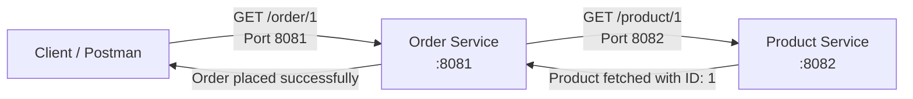
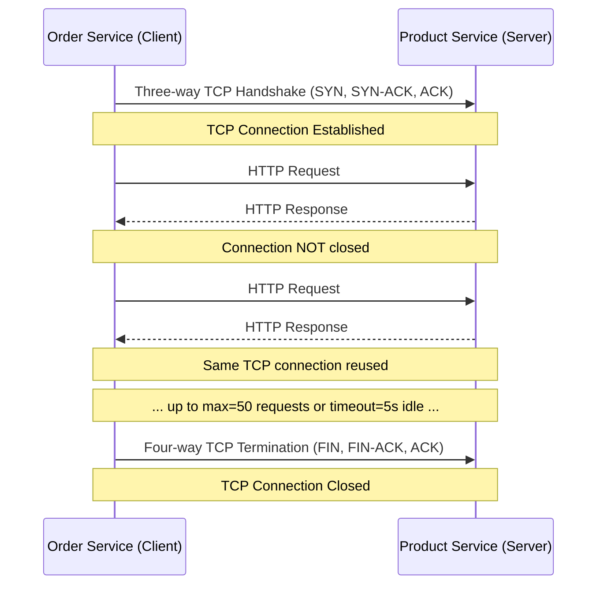
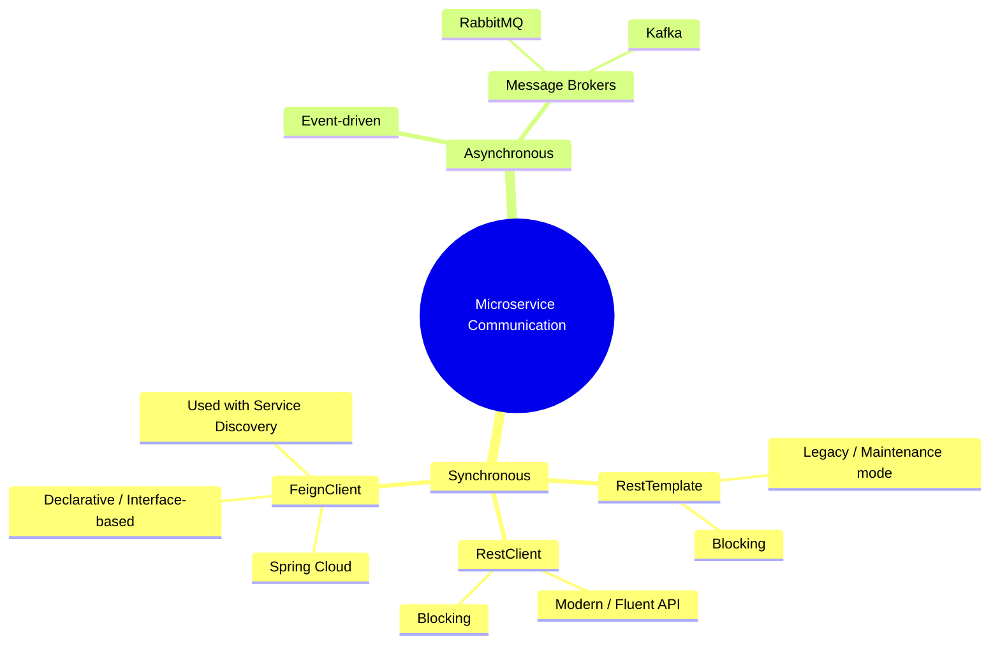
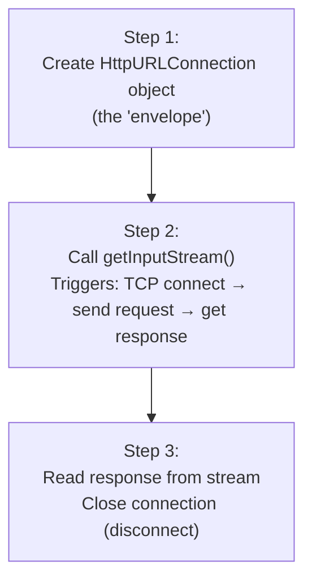
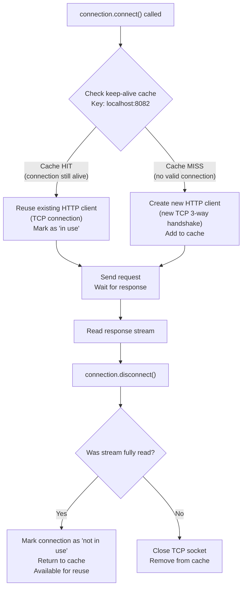
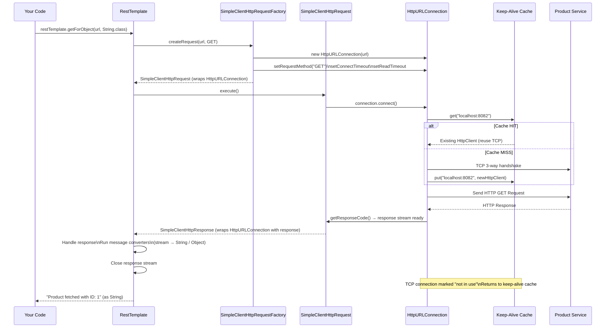
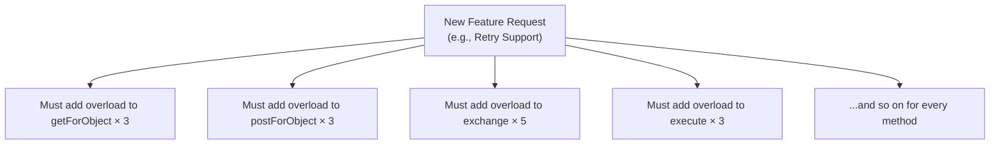

# 📌 Spring Boot Microservices — Inter-Service Communication Study Guide

> [!IMPORTANT]
> This guide covers how two Spring Boot microservices communicate with each other — from raw HTTP in plain Java, through `RestTemplate`, to its limitations and the motivation for `RestClient`. Every concept, code example, and internal mechanism is explained in full detail.

---

## Table of Contents

1. [Goal and Setup](#1-goal-and-setup)
2. [HTTP Fundamentals — Requests, Responses, and Keep-Alive](#2-http-fundamentals--requests-responses-and-keep-alive)
3. [Types of Inter-Service Communication](#3-types-of-inter-service-communication)
4. [Plain Java HTTP Communication (No Framework)](#4-plain-java-http-communication-no-framework)
5. [RestTemplate — Spring's Classic HTTP Client](#5-resttemplate--springs-classic-http-client)
6. [RestTemplate Internal Flow](#6-resttemplate-internal-flow)
7. [RestTemplate Methods — Complete Reference](#7-resttemplate-methods--complete-reference)
8. [RestTemplate Limitations](#8-resttemplate-limitations)
9. [What Comes Next — RestClient and Feign](#9-what-comes-next--restclient-and-feign)
10. [Common Mistakes](#10-common-mistakes)
11. [Best Practices](#11-best-practices)
12. [Interview Notes](#12-interview-notes)
13. [Practice Questions](#13-practice-questions)
14. [Summary Revision Bullets](#14-summary-revision-bullets)

---

# 1. Goal and Setup

## Overview

The fundamental challenge in microservices is this: **how does one service call another?** This guide walks through the answer progressively — from raw TCP/HTTP in plain Java to the Spring-managed `RestTemplate`.

## The Two Microservices

We set up two independent Spring Boot applications:

| Service | Port | Responsibility |
|---|---|---|
| **Order Service** | `8081` | Receives orders; calls Product Service |
| **Product Service** | `8082` | Provides product data |

## Project Creation

Both services are created via Spring Initializr with only **Spring Web** as a dependency. No Spring Cloud is added yet — this is intentional to build the foundational understanding first.

### `application.properties` — Order Service

```properties
server.port=8081
```

### `application.properties` — Product Service

```properties
server.port=8082
```

### Product Service — Endpoint

```java
@RestController
public class ProductController {

    @GetMapping("/product/{id}")
    public String getProduct(@PathVariable String id) {
        return "Product fetched with ID: " + id;
    }
}
```

### Order Service — Endpoint (calls Product Service)

```java
@RestController
public class OrderController {

    @GetMapping("/order/{id}")
    public String getOrder(@PathVariable String id) {
        // This method must somehow call Product Service's /product/{id}
        // — we'll see three different implementations below
    }
}
```

### Architecture



---

# 2. HTTP Fundamentals — Requests, Responses, and Keep-Alive

Before looking at communication code, we must understand what actually travels over the network. This knowledge is directly referenced in the internal workings of `RestTemplate`.

## 2.1 HTTP GET Request Structure

```http
GET /product/1 HTTP/1.1
Host: localhost:8082
User-Agent: curl/7.68.0
Accept: application/json
```

| Field | Meaning |
|---|---|
| `GET` | HTTP method (GET, POST, PUT, DELETE) |
| `/product/1` | URI — the path being requested |
| `HTTP/1.1` | Protocol version |
| `Host: localhost:8082` | Target host — URL and port number |
| `User-Agent` | Client/tool making the request (curl, Postman, Java, etc.) |
| `Accept` | Format the client expects in the response |

## 2.2 HTTP POST Request Structure

```http
POST /product HTTP/1.1
Host: localhost:8082
User-Agent: curl/7.68.0
Content-Type: application/json
Content-Length: 45

{"name": "Laptop", "price": 999.99}
```

| Extra Field | Meaning |
|---|---|
| `Content-Type` | Format of the **request body** being sent |
| `Content-Length` | Size of the request body in bytes |
| Body | The actual data (e.g., a new product object in JSON) |

## 2.3 HTTP Response Structure

```http
HTTP/1.1 200 OK
Content-Type: application/json
Content-Length: 38
Connection: keep-alive
Keep-Alive: timeout=5, max=50

{"id": 1, "name": "Laptop", "price": 999.99}
```

| Field | Meaning |
|---|---|
| `Content-Type` | Format of the response body |
| `Content-Length` | Size of response body in bytes |
| `Connection: keep-alive` | Tells client the TCP connection can be reused |
| `Keep-Alive: timeout=5, max=50` | Connection rules (see below) |

## 2.4 HTTP Keep-Alive — Critical Concept

This is one of the most important concepts for understanding how `RestTemplate` manages connections internally.

### HTTP 1.0 vs HTTP 1.1 Connection Behavior

| Version | Default Behavior | After Response |
|---|---|---|
| **HTTP 1.0** | `Connection: close` | TCP connection is terminated |
| **HTTP 1.1** | `Connection: keep-alive` | TCP connection is **kept open** and reused |

> [!IMPORTANT]
> HTTP 1.1 (the default in modern Java) does **not** close the TCP connection after every request/response cycle. The connection is kept alive and reused — this is called **connection pooling at the HTTP level**.

### Keep-Alive Configuration Parameters

| Parameter | Meaning |
|---|---|
| `timeout=5` | Close the idle TCP connection after **5 seconds** of inactivity |
| `max=50` | Allow a maximum of **50 requests** over the same TCP connection |

### Connection Lifecycle with Keep-Alive



### WebSocket vs HTTP — Connection Persistence

| Protocol | Connection Type | Direction |
|---|---|---|
| HTTP 1.0 | Terminates after each response | Client → Server only |
| HTTP 1.1 | Persistent (keep-alive) | Client → Server only |
| WebSocket | Persistent (always open) | Bidirectional |

---

# 3. Types of Inter-Service Communication



## Synchronous Communication

**Definition:** The calling service (client) **waits** (blocks) until it receives a response from the called service (server) before continuing execution.

- **Blocking in nature** — the calling thread is held until response arrives
- **Simple to reason about** — request → wait → response
- Types: `RestTemplate`, `RestClient`, `FeignClient`

> [!NOTE]
> In Spring Cloud microservices, **FeignClient** is the recommended approach because it integrates with service discovery (Eureka), load balancing, circuit breakers, etc. However, to understand FeignClient properly, you must first understand `RestTemplate` and `RestClient` — as FeignClient internally uses similar HTTP mechanisms.

## Asynchronous Communication

**Definition:** The calling service sends a message and **does not wait** for a response. Processing continues immediately.

- **Non-blocking** — thread is freed immediately
- Uses message brokers like RabbitMQ, Kafka
- Covered separately — this guide focuses on synchronous communication

---

# 4. Plain Java HTTP Communication (No Framework)

## Why Start Here?

Before using `RestTemplate` (which abstracts the details), we must understand what happens at the raw Java level. `RestTemplate` internally uses the same mechanism — just hidden from the developer. Understanding the raw flow makes debugging and optimization much easier.

## 4.1 The Three Steps of Plain Java HTTP Communication



## 4.2 Full Plain Java Example

### Product Service Controller

```java
@RestController
public class ProductController {

    // This endpoint will be called by Order Service
    @GetMapping("/product/{id}")
    public String getProduct(@PathVariable String id) {
        return "Product fetched with ID: " + id;
    }
}
```

### Order Service Controller — Plain Java HTTP

```java
@RestController
public class OrderController {

    @GetMapping("/order/{id}")
    public String getOrder(@PathVariable String id) throws Exception {

        // ===== STEP 1: Create the HttpURLConnection "envelope" =====
        URL url = new URL("http://localhost:8082/product/" + id);

        HttpURLConnection connection = (HttpURLConnection) url.openConnection();
        // NOTE: openConnection() does NOT create a TCP connection yet.
        // It only creates the HttpURLConnection object — the "envelope".

        connection.setRequestMethod("GET");
        connection.setRequestProperty("Accept", "application/json");
        connection.setConnectTimeout(5000); // 5 seconds to establish TCP connection
        connection.setReadTimeout(5000);    // 5 seconds to wait for server response

        // ===== STEP 2: Trigger TCP connection and send request =====
        // Calling getInputStream() internally:
        //   1. Calls connection.connect() → creates TCP connection (3-way handshake)
        //   2. Sends the HTTP request to the server
        //   3. Waits for response (blocked here — synchronous)
        //   4. Returns an InputStream containing the response body
        InputStream inputStream = connection.getInputStream();

        // ===== Read response from InputStream =====
        BufferedReader reader = new BufferedReader(new InputStreamReader(inputStream));
        StringBuilder response = new StringBuilder();
        String line;
        while ((line = reader.readLine()) != null) {
            response.append(line);
        }
        reader.close();

        System.out.println("Response: " + response.toString());

        // ===== STEP 3: Close the connection =====
        connection.disconnect();

        return "Order placed for product: " + response.toString();
    }
}
```

## 4.3 Line-by-Line Explanation

### Step 1 — Creating the Envelope

```java
URL url = new URL("http://localhost:8082/product/" + id);
HttpURLConnection connection = (HttpURLConnection) url.openConnection();
```

- `new URL(...)` — constructs a `URL` object representing the target endpoint
- `url.openConnection()` — creates a `HttpURLConnection` object but **does NOT establish any network connection yet**
- Think of this as preparing an envelope: writing the address, choosing delivery method, setting options

```java
connection.setRequestMethod("GET");
connection.setRequestProperty("Accept", "application/json");
connection.setConnectTimeout(5000);
connection.setReadTimeout(5000);
```

| Setting | Meaning |
|---|---|
| `setRequestMethod("GET")` | HTTP method to use |
| `setRequestProperty(...)` | Add a request header |
| `setConnectTimeout(5000)` | Max time (ms) to establish the TCP connection. Throws `SocketTimeoutException` if exceeded. |
| `setReadTimeout(5000)` | Max time (ms) to wait for server response after connection is established |

### Step 2 — Triggering TCP Connection

Three methods on `HttpURLConnection` each trigger a real TCP connection:

| Method | Effect |
|---|---|
| `connection.connect()` | Explicitly creates the TCP connection |
| `connection.getInputStream()` | Implicitly calls `connect()`, sends request, waits for response, returns stream |
| `connection.getResponseCode()` | Same as `getInputStream()` — internally calls `connect()` and sends request |

In the example, `getInputStream()` is used — it does everything in sequence automatically.

### Step 3 — Closing the Connection

```java
connection.disconnect();
```

What `disconnect()` actually does internally:

```
if (response stream NOT fully read) {
    Close the TCP socket immediately (discard the connection)
} else {
    Mark the underlying HTTP client as "not in use"
    Return it to the keep-alive cache
    // It can be reused for future requests to the same host:port
}
```

> [!NOTE]
> In HTTP 1.1, `disconnect()` does **not** always physically close the TCP connection. If the response was fully read, the underlying connection is placed back in a **keep-alive cache** (keyed by `host:port`) and can be reused for subsequent requests to the same server.

## 4.4 The Keep-Alive Cache in Plain Java



## 4.5 Disadvantages of Plain Java Approach

| Problem | Description |
|---|---|
| **Too much boilerplate** | Opening connection, setting headers, reading stream, closing — all manual |
| **Manual response parsing** | Must read stream line-by-line and convert to desired type manually |
| **Manual error handling** | HTTP error codes must be checked and handled explicitly |
| **No connection pooling support** | The keep-alive cache is basic and not configurable |
| **No retry / circuit breaker** | Must implement manually |
| **No interceptors / filters** | No clean hook points for cross-cutting concerns |

```java
// Everything you must write manually just to make ONE GET call:
URL url = new URL("http://localhost:8082/product/" + id);
HttpURLConnection connection = (HttpURLConnection) url.openConnection();
connection.setRequestMethod("GET");
connection.setRequestProperty("Accept", "application/json");
connection.setConnectTimeout(5000);
connection.setReadTimeout(5000);
InputStream inputStream = connection.getInputStream();
BufferedReader reader = new BufferedReader(new InputStreamReader(inputStream));
StringBuilder response = new StringBuilder();
String line;
while ((line = reader.readLine()) != null) { response.append(line); }
reader.close();
connection.disconnect();
// Then manually parse `response.toString()` into whatever object you need
```

---

# 5. RestTemplate — Spring's Classic HTTP Client

## Overview

`RestTemplate` is Spring's abstraction over raw HTTP communication. It eliminates boilerplate code by wrapping the `HttpURLConnection` mechanics we saw in plain Java into a clean, single-method API.

> [!NOTE]
> `RestTemplate` is considered a **legacy** (traditional) way to call REST APIs in Spring applications. It is currently in **maintenance mode** — only bug fixes, no new features. The modern replacement is `RestClient` (covered in the next section). However, `RestTemplate` is still widely used and important to know.

## 5.1 Basic Setup

### Creating a RestTemplate Bean

```java
@Configuration
public class AppConfig {

    @Bean
    public RestTemplate restTemplate() {
        return new RestTemplate(); // Uses default timeouts
    }
}
```

> [!NOTE]
> By default, `RestTemplate` uses `SimpleClientHttpRequestFactory` internally, which sets its own default connection timeout and read timeout values. For production use, always configure explicit timeouts.

### Creating RestTemplate with Custom Timeouts

```java
@Configuration
public class AppConfig {

    @Bean
    public RestTemplate restTemplate() {
        SimpleClientHttpRequestFactory factory = new SimpleClientHttpRequestFactory();
        factory.setConnectTimeout(5000); // 5 seconds (in milliseconds)
        factory.setReadTimeout(5000);    // 5 seconds (in milliseconds)

        return new RestTemplate(factory);
    }
}
```

**What is `SimpleClientHttpRequestFactory`?**

It is a **factory** that creates `ClientHttpRequest` objects. A `ClientHttpRequest` is the Spring abstraction representing a single HTTP request — it wraps `HttpURLConnection` internally. By providing a factory to `RestTemplate`, you control how each request object is created and what default settings it has.

## 5.2 Using RestTemplate in Order Service

```java
@RestController
public class OrderController {

    @Autowired
    private RestTemplate restTemplate; // Spring injects the bean we declared

    @GetMapping("/order/{id}")
    public String getOrder(@PathVariable String id) {

        // ONE LINE replaces all the boilerplate from plain Java
        String productResponse = restTemplate.getForObject(
            "http://localhost:8082/product/" + id,
            String.class // How to parse the response body
        );

        System.out.println("Response from Product API: " + productResponse);
        return "Order placed. " + productResponse;
    }
}
```

### Output

```
Response from Product API: Product fetched with ID: 1
```

**All of this is now handled automatically by `RestTemplate`:**
- Creating `HttpURLConnection`
- Setting headers
- Establishing TCP connection (with keep-alive cache)
- Sending the HTTP request
- Waiting for response
- Parsing the response stream
- Closing the stream (not the TCP connection — it goes back to cache)

---

# 6. RestTemplate Internal Flow

Understanding what happens inside `RestTemplate` when you call `getForObject(url, String.class)` maps directly to the plain Java flow — just abstracted behind framework layers.

## 6.1 Step-by-Step Internal Execution



## 6.2 The Three Internal Steps Mapped to Plain Java

| Plain Java Step | RestTemplate Internal Equivalent |
|---|---|
| Create `HttpURLConnection`, set method/headers/timeouts | `factory.createRequest()` → returns `SimpleClientHttpRequest` |
| Call `getInputStream()` → connect + send + receive | `request.execute()` → internally calls `connection.connect()` + `getResponseCode()` |
| Read stream manually + call `disconnect()` | `RestTemplate` reads stream via message converters + closes stream (TCP stays in cache) |

## 6.3 Message Converters — Automatic Response Parsing

When you specify `String.class` or `Product.class` as the response type, `RestTemplate` uses **`HttpMessageConverter`** implementations to automatically deserialize the response stream.

| Response Type Specified | Converter Used |
|---|---|
| `String.class` | `StringHttpMessageConverter` |
| Custom class (e.g., `Product.class`) | `MappingJackson2HttpMessageConverter` (uses Jackson) |
| `byte[]` | `ByteArrayHttpMessageConverter` |

This means you never write `objectMapper.readValue(stream, Product.class)` manually — `RestTemplate` does it automatically.

---

# 7. RestTemplate Methods — Complete Reference

## 7.1 GET Methods

### `getForObject` — Returns Response Body Only

```java
// Syntax
T getForObject(String url, Class<T> responseType, Object... uriVars)

// Example — response as String
String response = restTemplate.getForObject(
    "http://localhost:8082/product/{id}",
    String.class,
    "1"  // replaces {id}
);

// Example — response as custom object
Product product = restTemplate.getForObject(
    "http://localhost:8082/product/{id}",
    Product.class,
    "1"
);
```

**Returns:** Just the **response body**, automatically deserialized to the specified type. No access to status code or headers.

---

### `getForEntity` — Returns Full Response (Body + Status + Headers)

```java
// Syntax
ResponseEntity<T> getForEntity(String url, Class<T> responseType, Object... uriVars)

// Example
ResponseEntity<Product> responseEntity = restTemplate.getForEntity(
    "http://localhost:8082/product/{id}",
    Product.class,
    "1"
);

HttpStatus statusCode = responseEntity.getStatusCode();   // e.g., 200 OK
HttpHeaders headers = responseEntity.getHeaders();         // all response headers
Product body = responseEntity.getBody();                   // the actual product data
```

**Returns:** `ResponseEntity<T>` — full HTTP response including status code, headers, and body.

### Comparison — `getForObject` vs `getForEntity`

| Method | Return Type | Access to Status | Access to Headers | Access to Body |
|---|---|---|---|---|
| `getForObject` | `T` (body only) | ❌ | ❌ | ✅ |
| `getForEntity` | `ResponseEntity<T>` | ✅ | ✅ | ✅ |

> [!TIP]
> Use `getForObject` when you only need the data. Use `getForEntity` when you also need to inspect the HTTP status code or response headers (e.g., for error handling or reading custom headers).

---

## 7.2 POST Methods

### `postForObject` — Returns Response Body Only

```java
// Syntax
T postForObject(String url, Object request, Class<T> responseType)

// Example
Product newProduct = new Product("Laptop", 999.99);

Product createdProduct = restTemplate.postForObject(
    "http://localhost:8082/product",
    newProduct,       // request body — automatically serialized to JSON
    Product.class     // expected response type
);
```

### `postForEntity` — Returns Full Response

```java
ResponseEntity<Product> response = restTemplate.postForEntity(
    "http://localhost:8082/product",
    newProduct,
    Product.class
);

HttpStatus status = response.getStatusCode(); // 201 Created
Product created = response.getBody();
```

---

## 7.3 PUT Method

```java
// Syntax — no return value (void)
void put(String url, Object request, Object... uriVars)

// Example
Product updatedProduct = new Product("Laptop Pro", 1299.99);

restTemplate.put(
    "http://localhost:8082/product/{id}",
    updatedProduct,   // request body
    "1"               // path variable replacing {id}
);
// No return — PUT typically has no response body
```

---

## 7.4 DELETE Method

```java
// Syntax — no return value (void)
void delete(String url, Object... uriVars)

// Example
restTemplate.delete(
    "http://localhost:8082/product/{id}",
    "1"  // path variable
);
// No return — DELETE has no response body
```

---

## 7.5 `exchange` — Full Control Over Headers and Body

Use `exchange` when you need to:
- Set **custom request headers** (e.g., Authorization, custom tokens)
- Control the **HTTP method** explicitly
- Access the **full response** (status + headers + body)
- But still want Spring to handle **serialization/deserialization automatically**

```java
// Step 1: Build custom headers
HttpHeaders headers = new HttpHeaders();
headers.setContentType(MediaType.APPLICATION_JSON);
headers.set("Authorization", "Bearer my-jwt-token");
headers.set("X-Custom-Header", "custom-value");

// Step 2: Create request body
Product productToCreate = new Product("Laptop", 999.99);

// Step 3: Combine headers + body into HttpEntity
HttpEntity<Product> httpEntity = new HttpEntity<>(productToCreate, headers);

// Step 4: Call exchange
ResponseEntity<Product> response = restTemplate.exchange(
    "http://localhost:8082/product",  // URL
    HttpMethod.POST,                   // HTTP method (explicit control)
    httpEntity,                        // headers + body combined
    Product.class                      // expected response type (auto-deserialized)
);

HttpStatus status = response.getStatusCode();
Product created = response.getBody();
```

> [!NOTE]
> `exchange` always returns `ResponseEntity<T>` — you always get the full response. The key advantage is manual control over headers and HTTP method, while Spring still handles JSON serialization/deserialization automatically.

---

## 7.6 `execute` — Full Manual Control

Use `execute` when you need complete control over everything — including how the request is built and how the response is parsed. This is the lowest-level method; all other `RestTemplate` methods internally call `execute`.

```java
// RequestCallback — functional interface giving access to ClientHttpRequest
RequestCallback requestCallback = (ClientHttpRequest request) -> {
    // Manually set headers
    request.getHeaders().setContentType(MediaType.APPLICATION_JSON);
    request.getHeaders().set("Authorization", "Bearer my-token");

    // Manually serialize request body
    Product product = new Product("Laptop", 999.99);
    byte[] bodyBytes = new ObjectMapper().writeValueAsBytes(product);
    request.getBody().write(bodyBytes); // Write to request body stream
};

// ResponseExtractor — functional interface giving access to ClientHttpResponse
ResponseExtractor<String> responseExtractor = (ClientHttpResponse response) -> {
    // Manually parse the response stream
    return StreamUtils.copyToString(response.getBody(), StandardCharsets.UTF_8);
};

// Execute
String result = restTemplate.execute(
    "http://localhost:8082/product",
    HttpMethod.POST,
    requestCallback,
    responseExtractor
);

System.out.println(result);
```

### Comparison — `getForObject` vs `exchange` vs `execute`

| Method | Header Control | Body Control | Auto Serialization | Auto Deserialization |
|---|---|---|---|---|
| `getForObject` / `postForObject` | ❌ (default headers) | ❌ (Spring manages) | ✅ | ✅ |
| `exchange` | ✅ (full control) | ✅ (set explicitly) | ✅ | ✅ |
| `execute` | ✅ (full control) | ✅ (manual bytes) | ❌ (manual) | ❌ (manual) |

> [!TIP]
> In practice, use the simplest method that fits your need. Most calls use `getForObject` or `postForObject`. Use `exchange` when you need custom headers. Use `execute` only in rare cases where you need byte-level control.

---

## 7.7 Complete Method Summary Table

| Method | HTTP Verb | Returns | When to Use |
|---|---|---|---|
| `getForObject` | GET | Body (`T`) | Simple GET, only body needed |
| `getForEntity` | GET | `ResponseEntity<T>` | GET + need status/headers |
| `postForObject` | POST | Body (`T`) | Simple POST, only body needed |
| `postForEntity` | POST | `ResponseEntity<T>` | POST + need status/headers |
| `put` | PUT | `void` | Update resource, no response expected |
| `delete` | DELETE | `void` | Delete resource, no response expected |
| `exchange` | Any | `ResponseEntity<T>` | Need custom headers or explicit HTTP method |
| `execute` | Any | Custom (`T`) | Full manual control, rare use |

---

# 8. RestTemplate Limitations

## Why `RestTemplate` Is Considered Legacy

`RestTemplate` was designed before modern HTTP client needs became apparent. Over time, its design choices became problematic enough that Spring moved it to maintenance mode — meaning **no new features, only critical bug fixes**.

## 8.1 Overloaded Methods Explosion

Every HTTP operation has multiple overloaded variants. For example, `getForObject` alone has three overloads:

```java
getForObject(String url, Class<T> responseType, Object... uriVars)
getForObject(String url, Class<T> responseType, Map<String, ?> uriVars)
getForObject(URI url, Class<T> responseType)
```

Multiply this across `getForEntity`, `postForObject`, `postForEntity`, `put`, `delete`, `exchange`, `execute` — and then for every new feature (retry, circuit breaker, interceptors), new overloads must be added for every method variant.



> [!WARNING]
> This is the core architectural flaw of `RestTemplate`. Any new functionality requires adding overloaded methods to every existing operation. The API grows unbounded and becomes impossible to remember or maintain cleanly.

## 8.2 Not Designed for Modern HTTP Features

`RestTemplate` was built before many modern HTTP client requirements emerged:

| Modern Need | RestTemplate Support |
|---|---|
| Retry logic | Possible but awkward |
| Circuit breaker | Possible but complex |
| Request/response interceptors | Supported but not intuitive |
| Reactive/non-blocking | Not supported |
| Fluent API style | Not supported |

## 8.3 Difficult to Maintain

- Hard to remember which overload to use
- Parameter lists are long and confusing
- Inconsistent patterns across GET/POST/PUT/DELETE
- New team members face a steep learning curve

---

# 9. What Comes Next — RestClient and Feign

## RestClient — The Modern Replacement

`RestClient` was introduced in Spring 6.1 / Spring Boot 3.2 as the successor to `RestTemplate`. It uses a **fluent (builder-style) API** that eliminates overloaded methods.

```java
// RestClient equivalent of restTemplate.getForObject(url, String.class)
String response = restClient.get()
    .uri("http://localhost:8082/product/{id}", id)
    .retrieve()
    .body(String.class);
```

```java
// POST with custom headers — clean fluent style
Product created = restClient.post()
    .uri("http://localhost:8082/product")
    .header("Authorization", "Bearer my-token")
    .contentType(MediaType.APPLICATION_JSON)
    .body(newProduct)
    .retrieve()
    .body(Product.class);
```

### RestTemplate vs RestClient

| Aspect | RestTemplate | RestClient |
|---|---|---|
| API Style | Method-per-operation (overloaded) | Fluent / builder chain |
| Readability | Moderate | High |
| Maintainability | Low (overloads) | High |
| Modern features | Limited | Full support |
| Status | Maintenance mode | Actively developed |
| Spring version | Legacy | Spring 6.1+ |

## FeignClient — Spring Cloud Declarative Client

`FeignClient` is the recommended approach when using Spring Cloud (Eureka, load balancing, etc.). It is declarative — you define an interface, and Spring generates the implementation.

```java
@FeignClient(name = "product-service", url = "http://localhost:8082")
public interface ProductClient {

    @GetMapping("/product/{id}")
    String getProduct(@PathVariable("id") String id);
}
```

```java
// Usage — just inject and call like a regular method
@Autowired
private ProductClient productClient;

String product = productClient.getProduct("1");
```

> [!NOTE]
> `FeignClient` internally uses HTTP mechanisms similar to what we covered. Understanding `RestTemplate` and `RestClient` makes it much easier to debug `FeignClient` behavior and configure timeouts, retries, and interceptors properly.

---

# 10. Common Mistakes

## Mistake 1 — Not Configuring Timeouts

```java
// ❌ WRONG — default timeouts may be too long or infinite in some environments
@Bean
public RestTemplate restTemplate() {
    return new RestTemplate();
}

// ✅ CORRECT — always set explicit timeouts in production
@Bean
public RestTemplate restTemplate() {
    SimpleClientHttpRequestFactory factory = new SimpleClientHttpRequestFactory();
    factory.setConnectTimeout(3000);  // 3 seconds
    factory.setReadTimeout(10000);    // 10 seconds
    return new RestTemplate(factory);
}
```

## Mistake 2 — Creating RestTemplate Inside a Method (Not as a Bean)

```java
// ❌ WRONG — new instance created per request, loses keep-alive cache benefit
@GetMapping("/order/{id}")
public String getOrder(@PathVariable String id) {
    RestTemplate rt = new RestTemplate(); // Don't do this
    return rt.getForObject("http://localhost:8082/product/" + id, String.class);
}

// ✅ CORRECT — single shared bean, connection cache is shared across requests
@Autowired
private RestTemplate restTemplate;
```

## Mistake 3 — Hardcoding Service URLs

```java
// ❌ WRONG — hardcoded URL, breaks when service moves or port changes
String response = restTemplate.getForObject("http://localhost:8082/product/" + id, String.class);

// ✅ CORRECT — externalize to application.properties
// application.properties:
// product.service.url=http://localhost:8082

@Value("${product.service.url}")
private String productServiceUrl;

String response = restTemplate.getForObject(productServiceUrl + "/product/" + id, String.class);
```

## Mistake 4 — Ignoring HTTP Error Responses

```java
// ❌ WRONG — getForObject throws HttpClientErrorException for 4xx/5xx
// but this is not caught
String response = restTemplate.getForObject(url, String.class);

// ✅ CORRECT — handle HTTP errors explicitly
try {
    String response = restTemplate.getForObject(url, String.class);
} catch (HttpClientErrorException e) {
    // 4xx errors — e.g., 404 Not Found, 400 Bad Request
    System.err.println("Client error: " + e.getStatusCode());
} catch (HttpServerErrorException e) {
    // 5xx errors — e.g., 500 Internal Server Error
    System.err.println("Server error: " + e.getStatusCode());
}
```

## Mistake 5 — Confusing `getForObject` with `getForEntity`

```java
// ❌ WRONG — using getForObject when you need the status code
String body = restTemplate.getForObject(url, String.class);
// You cannot access the HTTP status code here

// ✅ CORRECT — use getForEntity when you need more than the body
ResponseEntity<String> response = restTemplate.getForEntity(url, String.class);
if (response.getStatusCode() == HttpStatus.OK) {
    String body = response.getBody();
}
```

---

# 11. Best Practices

| Practice | Reason |
|---|---|
| Always declare `RestTemplate` as a `@Bean` | Enables connection pool sharing and Spring management |
| Always configure explicit timeouts | Prevents indefinitely hanging threads |
| Externalize service URLs to `application.properties` | Easier environment-specific configuration |
| Use `getForEntity` when you need status code or headers | Provides full response access |
| Use `exchange` when you need custom headers | Cleaner than building raw requests |
| Catch `HttpClientErrorException` and `HttpServerErrorException` | Graceful error handling |
| Plan to migrate to `RestClient` for new code | `RestTemplate` is in maintenance mode |
| Use `FeignClient` in Spring Cloud environments | Better integration with service discovery and load balancing |
| Set reasonable `connectTimeout` (2-5s) and `readTimeout` (5-30s) | Tune based on expected service response times |

---

# 12. Interview Notes

### Q: What is the difference between synchronous and asynchronous microservice communication?

Synchronous: the calling thread blocks and waits for a response before continuing (RestTemplate, RestClient, FeignClient). Asynchronous: the calling service publishes a message and continues immediately without waiting (Kafka, RabbitMQ).

### Q: What is `HttpURLConnection` and what role does it play?

`HttpURLConnection` is the Java standard library's class for HTTP connections. It wraps a TCP socket and holds all request configuration (method, headers, timeouts, URL). `RestTemplate` creates and manages `HttpURLConnection` objects internally through its `ClientHttpRequestFactory`.

### Q: What is the difference between `connectTimeout` and `readTimeout`?

`connectTimeout` is the maximum time allowed for the TCP handshake to complete (client connecting to server). `readTimeout` is the maximum time the client will wait for a response from the server after the connection is established.

### Q: What is HTTP Keep-Alive and why does it matter for microservices?

Keep-Alive (default in HTTP 1.1) allows the same TCP connection to be reused for multiple HTTP requests. This avoids the overhead of TCP 3-way handshake for every call. In high-throughput microservices where a service calls another hundreds of times per second, this significantly reduces latency and resource consumption.

### Q: What is the difference between `getForObject` and `getForEntity`?

`getForObject` returns only the deserialized response body. `getForEntity` returns a `ResponseEntity` containing the body, HTTP status code, and response headers.

### Q: When would you use `exchange` instead of `getForObject`?

When you need to set custom HTTP headers (Authorization, custom tokens), use an HTTP method not covered by a specific method, or access the full response including status and headers.

### Q: Why is `RestTemplate` considered legacy?

It is in maintenance mode — no new features, only bug fixes. Its design (many overloaded methods per operation) doesn't scale cleanly as new HTTP features are added. `RestClient` (Spring 6.1+) is the modern replacement with a fluent API.

### Q: What does `RestTemplate` use internally for HTTP connections?

By default, it uses `SimpleClientHttpRequestFactory`, which creates `HttpURLConnection` objects. These internally use Java's keep-alive connection cache (keyed by host:port) to reuse TCP connections across requests.

### Q: What is the difference between `RestTemplate`, `RestClient`, and `FeignClient`?

`RestTemplate` — legacy Spring HTTP client, imperative, maintenance mode. `RestClient` — modern Spring HTTP client, fluent API, actively developed. `FeignClient` — declarative interface-based client for Spring Cloud, integrates with service discovery and load balancing.

---

# 13. Practice Questions

## Easy

1. What are the two services set up in this guide and on which ports do they run?
2. What is the difference between `connectTimeout` and `readTimeout`?
3. What does HTTP Keep-Alive mean? What do `timeout=5` and `max=50` mean?
4. What is `HttpURLConnection`? When does a TCP connection actually get created?
5. What is `SimpleClientHttpRequestFactory` in `RestTemplate`?

## Medium

6. Explain the three steps in plain Java HTTP communication. What happens at each step?
7. What is the difference between `getForObject` and `getForEntity`? When would you choose each?
8. Trace what happens internally when you call `restTemplate.getForObject(url, String.class)`.
9. Explain the keep-alive cache in `RestTemplate`. How does it reuse connections?
10. When would you use `exchange` over `postForObject`? Give a concrete example.

## Hard

11. Why does HTTP 1.1 keep TCP connections alive? What are the performance implications for microservices that make frequent inter-service calls?
12. Explain the architectural flaw in `RestTemplate` that led to it being placed in maintenance mode. How does `RestClient` solve it?
13. Write a `RestTemplate` call using `execute` that sends a POST request with a custom Authorization header and manually parses the response as a `Product` object.
14. How would you implement retry logic with `RestTemplate`? What are the limitations?
15. Compare `FeignClient` and `RestTemplate` across: ease of use, Spring Cloud integration, declarative vs imperative style, and production readiness for new projects.

---

# 14. Summary Revision Bullets

- Two microservices: **Order Service (8081)** and **Product Service (8082)**; set up with Spring Web only (no Spring Cloud initially)
- **Synchronous communication** = calling thread blocks until response received; types: `RestTemplate`, `RestClient`, `FeignClient`
- **HTTP GET request** = method + URI + protocol + host + headers; **POST** adds `Content-Type`, `Content-Length`, and body
- **HTTP 1.0** = connection closes after each response; **HTTP 1.1** = `Connection: keep-alive` by default → TCP reused
- **Keep-Alive** config: `timeout=5` (idle seconds before close) + `max=50` (max requests per connection)
- **Plain Java**: create `HttpURLConnection` → call `getInputStream()` (triggers connect + request + response) → read stream → `disconnect()`
- `disconnect()` does NOT always close TCP — if stream fully read, connection returns to **keep-alive cache** (key: `host:port`)
- **RestTemplate** wraps all plain Java mechanics: `createRequest()` → `execute()` → parse with `HttpMessageConverter` → close stream (TCP stays in cache)
- `getForObject` → body only; `getForEntity` → full `ResponseEntity` (body + status + headers)
- `postForObject` / `postForEntity` for POST; `put()` and `delete()` return void
- `exchange` → full control over headers + HTTP method + body, Spring still auto-serializes/deserializes
- `execute` → full manual control including serialization; all other methods call `execute` internally
- **RestTemplate limitations**: overloaded method explosion, not designed for modern features, in maintenance mode (no new features)
- **RestClient** (Spring 6.1+) = fluent builder API, modern replacement; **FeignClient** = declarative interface-based, Spring Cloud recommended approach

---

> [!TIP]
> Study the plain Java HTTP flow first until it's fully clear. Every concept in `RestTemplate` (and later `RestClient` and `FeignClient`) is just an abstraction over the same underlying TCP/HTTP mechanics.
