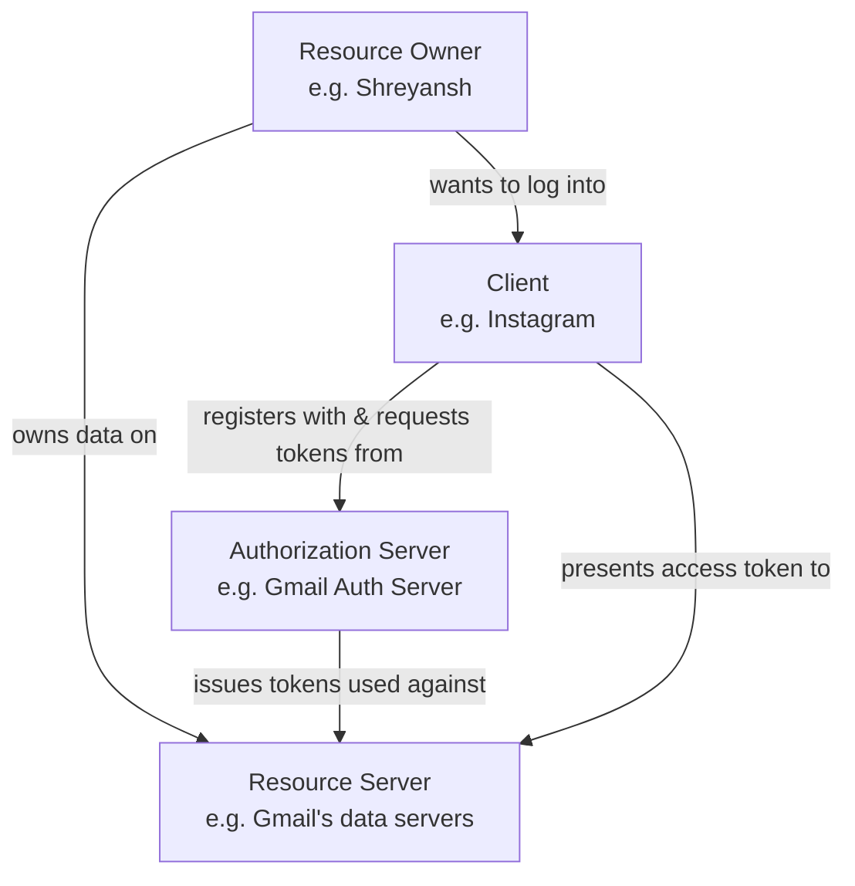
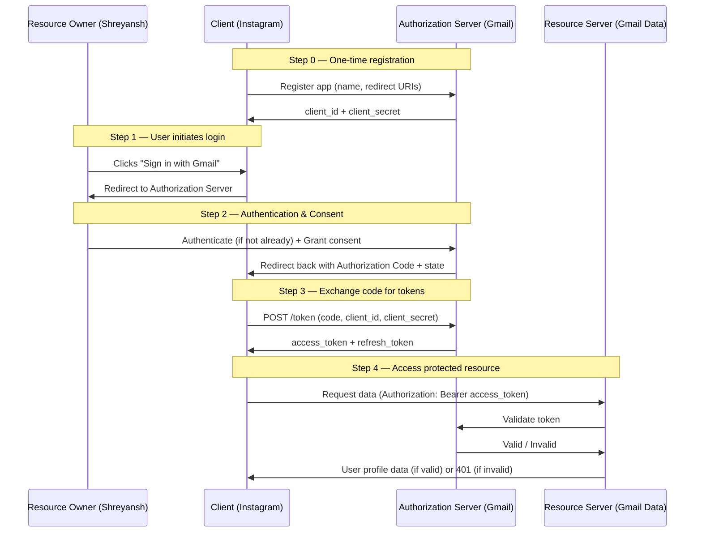
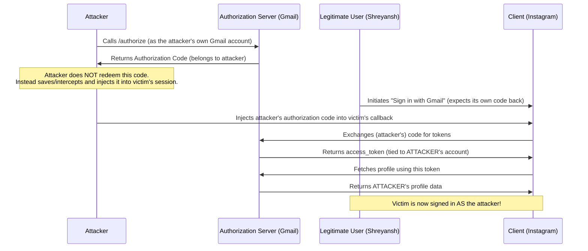
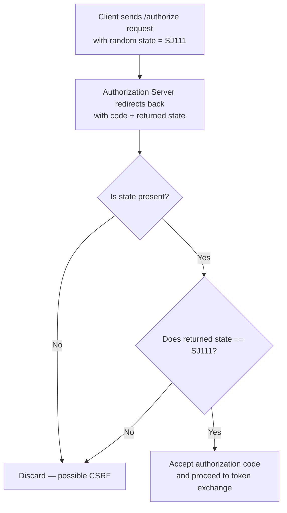
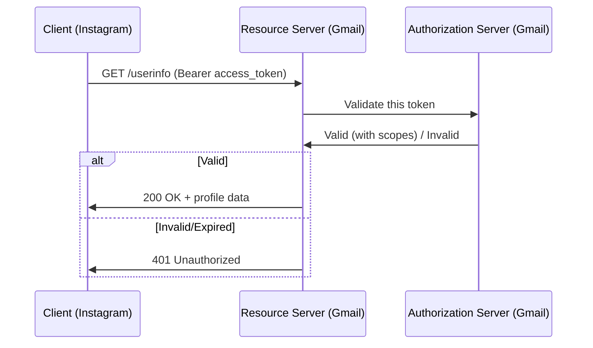
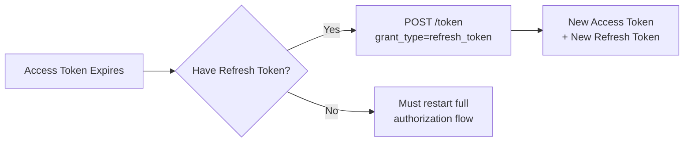

# 📌 OAuth 2.0 — Complete Study Guide

---

## Table of Contents

1. [Overview](#overview)
2. [Why OAuth 2.0 Exists](#why-oauth-20-exists)
3. [Definition](#definition)
4. [Real-World Analogy](#real-world-analogy)
5. [The Four Actors / Roles in OAuth 2.0](#the-four-actors--roles-in-oauth-20)
6. [The Five Grant Types (Overview)](#the-five-grant-types-overview)
7. [Authorization Code Grant — Deep Dive](#authorization-code-grant--deep-dive)
8. [CSRF Attack and the Role of `state`](#csrf-attack-and-the-role-of-state)
9. [Detailed API Request/Response Walkthrough](#detailed-api-requestresponse-walkthrough)
10. [Implicit Grant](#implicit-grant)
11. [Resource Owner Password Credentials Grant](#resource-owner-password-credentials-grant)
12. [Client Credentials Grant](#client-credentials-grant)
13. [Comparison Table of All Grant Types](#comparison-table-of-all-grant-types)
14. [Access Token vs Refresh Token](#access-token-vs-refresh-token)
15. [Common Mistakes](#common-mistakes)
16. [Best Practices](#best-practices)
17. [Interview Notes](#interview-notes)
18. [Related Concepts](#related-concepts)
19. [Practice Questions](#practice-questions)
20. [Summary](#summary)

---

## Overview

OAuth 2.0 is an **authorization framework** — not an authentication protocol — that allows a third-party application to gain **limited access** to a user's resources hosted on another service, without ever exposing the user's password to that third-party application.

The classic real-world trigger for learning OAuth is the "Sign in with Google / Sign in with Facebook" button you see on almost every modern website. Clicking that button does not hand your Gmail password to the third-party site. Instead, it triggers a structured handshake between four parties, at the end of which the third-party site receives a **token** that proves it has been granted permission to access specific pieces of your data (such as your name, email, or profile picture) — and nothing more than that.

> [!NOTE]
> OAuth = **Open Authorization**. The name itself tells you its purpose: it is about *authorizing* access, not *authenticating* identity (that job is technically handled by a related protocol built on top of OAuth 2.0, called OpenID Connect — mentioned later in Related Concepts).

---

## Why OAuth 2.0 Exists

Before OAuth existed, if a third-party app wanted to use data from another service (say, a photo-printing website wanting access to your Google Photos), the only way to do that was for you to **directly hand over your Google username and password** to the photo-printing website. This created serious problems:

- The third-party app now permanently knows your real password.
- The third-party app has **unlimited** access — it can do anything your account can do, not just view photos.
- You cannot revoke access to just that one app without changing your password everywhere.
- If the third-party app is compromised, your main account (Gmail, in this example) is directly compromised too.

OAuth 2.0 solves this by introducing a **delegated, scoped, and revocable** access mechanism:

- **Delegated** — the user delegates permission without sharing credentials.
- **Scoped** — the third party only gets access to specific pieces of data (`email`, `profile`, `address`, etc.), not everything.
- **Revocable** — the user (or the authorization server) can revoke the token at any time without affecting the user's main password.
- **Time-limited** — tokens expire, minimizing the damage if a token is ever leaked.

---

## Definition

> **OAuth 2.0** is an authorization framework that enables secure, delegated, third-party access to a user's protected resources by issuing time-limited tokens instead of sharing the user's actual credentials with the third party.

---

## Real-World Analogy

Think of a **hotel key card system**:

- You (the guest) are the actual owner of "access rights" to your room.
- The front desk (authorization server) verifies who you are and decides what you're allowed to access.
- The key card (access token) they hand you doesn't reveal your identity or the master key to the whole hotel — it only opens **your specific room**, and only until your checkout date (**expiry**).
- If you lose the card, the hotel can deactivate just that card (**revocation**) without changing every lock in the building.
- The valet (third-party client/application) doesn't need your master identity — they just need a **valet key** (a token with a limited scope) that can start the car but not open the trunk or the glovebox.

This is precisely how an OAuth access token behaves: a limited, revocable, scoped credential — never your actual password.

---

## The Four Actors / Roles in OAuth 2.0

Every OAuth 2.0 flow — regardless of which grant type is used — involves exactly **four roles**. Understanding these roles precisely is the foundation for understanding every flow that follows.



| Role | Definition | Example in the Lecture |
|---|---|---|
| **Resource Owner** | The end user who owns the protected data and has the authority to grant access to it. | Shreyansh (the person who is logged into Gmail). |
| **Client** | The application requesting access to the resource owner's data on their behalf. | Instagram (or Facebook), the third-party app that wants to let you sign in using Gmail. |
| **Authorization Server** | The server that authenticates the resource owner, obtains their consent, and issues tokens to the client. | Gmail's Authorization Server. |
| **Resource Server** | The server hosting the protected resources (the actual user data) and that accepts and validates access tokens to serve requests. | Gmail's Resource Server (where your name, date of birth, email ID, etc. actually live). |

> [!IMPORTANT]
> In many real systems (including Google's own infrastructure), the **Authorization Server** and **Resource Server** can be the *same physical service* wearing two different logical hats. They are described as two separate components here purely for conceptual clarity, and because in many architectures they genuinely *are* deployed as separate services.

### Why the distinction between Authorization Server and Resource Server matters

- The **Authorization Server's** job is entirely about *identity verification* and *consent management* — authenticating the resource owner and deciding whether to trust the client with a token.
- The **Resource Server's** job is to *serve actual data* once it has confirmed (usually by calling back to the Authorization Server) that a presented token is valid.

This separation of concerns is what allows one authorization server to protect many different resource servers (for example, one Google authorization server can protect Gmail data, Google Drive data, Google Calendar data, etc., each of which could be a distinct resource server).

---

## The Five Grant Types (Overview)

A **grant type** (also referred to as an **authorization grant**) is simply the *mechanism* by which a client obtains an access token. OAuth 2.0 defines five major grant types:

| # | Grant Type | Common Usage |
|---|---|---|
| 1 | **Authorization Code Grant** | The most widely used and most secure grant, used by web and mobile apps with a backend server. |
| 2 | **Implicit Grant** | Historically used for browser-only apps (no backend). **Now discouraged/deprecated in modern OAuth guidance.** |
| 3 | **Resource Owner Password Credentials Grant** | Used when the client is highly trusted (e.g., the resource owner's own first-party app). |
| 4 | **Client Credentials Grant** | Used for machine-to-machine communication, where there is no separate "resource owner" — the client acts on its own behalf. |
| 5 | **Refresh Token Grant** | Not used to get the *first* access token, but to obtain a *new* access token once the old one expires, without repeating the whole flow. |

> [!NOTE]
> The lecture explicitly calls out that Authorization Code Grant is the most important and most heavily used grant type in real-world systems, and that Implicit Grant, while historically significant, is now "not encouraged."

---

## Authorization Code Grant — Deep Dive

This is the flagship, most secure, and most commonly implemented OAuth 2.0 grant type. It is used whenever a client has a secure backend server capable of storing a **client secret** confidentially (e.g., a typical website's server-side code, as opposed to purely client-side JavaScript running in a browser).

### Scenario Used Throughout

- **Resource Owner:** Shreyansh (already logged into Gmail).
- **Client:** Instagram (wants to let Shreyansh "Sign in with Gmail").
- **Authorization Server:** Gmail Authorization Server.
- **Resource Server:** Gmail Resource Server (hosts Shreyansh's name, age, email, address, etc.).

### High-Level Flow (Conceptual)



### Step-by-Step Explanation

**Step 0 — Registration (one-time setup, happens before any user logs in)**

Before Instagram can ever display a "Sign in with Gmail" button, it must **register itself** as a client with the Gmail Authorization Server. During registration:

- Instagram provides its app name and up to **three redirect URIs** (also called callback URIs) — the URLs Gmail is allowed to send the user back to after authentication.
- In return, the Authorization Server issues:
  - A **Client ID** — a public identifier for the app.
  - A **Client Secret** — a confidential value known only to Instagram and the Gmail Authorization Server. It is used to authenticate the *client itself* (not the user) in later steps.

> [!CAUTION]
> The client secret must never be exposed to the browser, embedded in mobile app binaries insecurely, or committed to public source control. It exists specifically so the Authorization Server can trust that token requests are genuinely coming from the registered client, and not an impersonator.

**Step 1 — User initiates login**

Shreyansh visits Instagram and clicks "Sign in using Gmail" instead of typing a username/password. Instagram's backend now redirects the user's browser to the Gmail Authorization Server's `/authorize` endpoint.

**Step 2 — Authentication and Consent**

- If Shreyansh isn't already logged into Gmail, Gmail prompts for username/password there (never on Instagram's page).
- Gmail then shows a **consent screen**: "Instagram wants to access your email, profile, and address information from your Gmail account — do you approve?"
- If Shreyansh clicks **Yes**, Gmail's Authorization Server redirects the browser back to the redirect URI that Instagram registered, and appends an **Authorization Code** and the original `state` value as query parameters.

**Step 3 — Exchanging the Authorization Code for Tokens**

- Instagram's backend (not the browser) makes a server-to-server `POST` request to Gmail's `/token` endpoint, sending the authorization code plus its own client ID and client secret.
- Gmail's Authorization Server validates all of this and responds with:
  - An **Access Token** (short-lived, e.g., 15–60 minutes).
  - A **Refresh Token** (long-lived, used to get new access tokens later without repeating the whole flow).

**Step 4 — Accessing the Protected Resource**

- Instagram calls Gmail's Resource Server, presenting the access token (typically in an `Authorization: Bearer <token>` HTTP header).
- The Resource Server calls back to the Authorization Server to **validate** the token.
- If valid → the Resource Server returns the requested profile data (name, email, etc.) within the granted scope, and Instagram completes the sign-in.
- If invalid or expired → the Resource Server typically responds with an HTTP **401 Unauthorized**, and the request is discarded.

> [!TIP]
> Notice the key security principle here: **the authorization code can only be used once.** Once Instagram exchanges it for tokens, that code becomes useless — even to Instagram itself. This limits the damage if a code is intercepted, since it can't be replayed.

---

## CSRF Attack and the Role of `state`

This is one of the most important security concepts in the Authorization Code Grant flow, and one of the trickiest points commonly tested in interviews.

### The Problem: Cross-Site Request Forgery (CSRF) in OAuth

**CSRF (Cross-Site Request Forgery)** in the OAuth context is an attack where a malicious actor tricks the legitimate client into accepting **the attacker's own authorization code**, tied to the attacker's own account, instead of the legitimate user's code.

### How the Attack Works (Without `state` Protection)



### Why This Is Dangerous

Once the victim's browser session on the client app (Instagram, in this example) is bound to the **attacker's** authorization code:

- The client fetches the token, and that token belongs to the attacker's account.
- The client fetches profile data using that token — and gets the **attacker's** data, not the victim's.
- The victim is now effectively logged into Instagram **as the attacker**.
- If the victim then uploads files, connects a bank account, or performs any action under this session, that data flows into **the attacker's** connected resources (e.g., attacker's Google Drive) instead of the victim's — a serious account-confusion and data-leak vulnerability.

### The Fix: the `state` Parameter

`state` is a **random, hard-to-guess value** that the client generates and includes in the initial `/authorize` request. The Authorization Server is required to echo this exact same `state` value back unchanged when it redirects with the authorization code.

The client then performs a simple but crucial check:

1. Did the response include a `state` value at all? If not → **discard the request** (possible CSRF).
2. Does the returned `state` value **exactly match** the one this specific client session originally sent? If not → **discard the request** (possible CSRF).
3. Only if both checks pass does the client trust and redeem the authorization code.



> [!WARNING]
> The lecture describes `state` as "recommended... not mandatory." This matches the OAuth 2.0 RFC 6749 guidance at the time it was written, which listed `state` as an optional-but-recommended parameter. However, according to modern OAuth 2.0 security best-practice guidance (OAuth 2.0 Security Best Current Practice, and the updated "OAuth 2.1" consolidation effort), using `state` (or better, the PKCE mechanism described below) for CSRF protection is now treated as **effectively mandatory** for any client implementing the Authorization Code Grant. Treat `state` as a required field in real implementations, not merely a nice-to-have.

> [!NOTE]
> Modern OAuth deployments typically pair `state` with **PKCE (Proof Key for Code Exchange)**, an additional mechanism (originally designed for mobile/native apps but now recommended universally) that prevents authorization code interception attacks even more robustly by requiring the client to prove it is the same entity that initiated the original request, using a dynamically generated `code_verifier`/`code_challenge` pair. This wasn't covered in the lecture but is essential real-world context — see Related Concepts.

---

## Detailed API Request/Response Walkthrough

> [!NOTE]
> The lecture explicitly says the exact endpoint/parameter names used below (`/register`, `/authorize`, `/token`) are illustrative teaching names chosen for clarity — **not** official RFC endpoint names. Always consult the actual RFC 6749 / provider documentation (e.g., Google, Facebook's actual OAuth docs) for exact production parameter names.

### 1. Registration Request/Response

**Request** (conceptual, one-time setup):

```http
POST /register
Content-Type: application/json

{
  "client_name": "Instagram",
  "redirect_uris": [
    "https://instagram.com/callback1",
    "https://instagram.com/callback2",
    "https://instagram.com/callback3"
  ]
}
```

**Response:**

```json
{
  "client_id": "abc123-instagram",
  "client_secret": "S3cr3t-Only-Known-By-Instagram-And-AuthServer"
}
```

| Field | Meaning |
|---|---|
| `client_name` | Human-readable name of the registering app. |
| `redirect_uris` | Up to **3** URIs where the Authorization Server is permitted to redirect the user after granting/denying consent. |
| `client_id` | Public identifier for this client — safe to expose in browser URLs. |
| `client_secret` | Confidential value used to authenticate the client itself during token exchange. **Never exposed publicly.** |

---

### 2. Authorization Request (`/authorize`)

**Request** (browser is redirected here):

```http
GET /authorize?
  response_type=code
  &client_id=abc123-instagram
  &redirect_uri=https://instagram.com/callback1
  &scope=email profile address
  &state=SJ111
```

| Parameter | Meaning |
|---|---|
| `response_type` | Tells the Authorization Server what the client expects back. `code` means "I want an authorization code." |
| `client_id` | Identifies which registered client is making the request. |
| `redirect_uri` | *(Optional)* Where to send the user after consent. If omitted, the Authorization Server picks one from the URIs supplied at registration. If provided, it **must match** one of the registered URIs exactly. |
| `scope` | Space-separated list of the specific pieces of data the client wants access to (e.g., `email`, `profile`, `address`). |
| `state` | Random, unique, hard-to-guess value used for CSRF protection (explained above). |

**Response** (after user authenticates + consents, browser redirected back):

```http
HTTP/1.1 302 Found
Location: https://instagram.com/callback1?code=AUTH_CODE_XYZ&state=SJ111
```

---

### 3. Token Request (`/token`) — Exchanging Code for Tokens

**Request:**

```http
POST /token
Content-Type: application/x-www-form-urlencoded

grant_type=authorization_code
&code=AUTH_CODE_XYZ
&redirect_uri=https://instagram.com/callback1
&client_id=abc123-instagram
&client_secret=S3cr3t-Only-Known-By-Instagram-And-AuthServer
```

| Parameter | Meaning |
|---|---|
| `grant_type` | `authorization_code` — tells the Authorization Server which grant mechanism is being used. |
| `code` | The authorization code obtained in the previous step. Single-use only. |
| `redirect_uri` | Optional; must match the earlier request if provided. |
| `client_id` / `client_secret` | Authenticates the client itself to the Authorization Server. |

**Response:**

```json
{
  "access_token": "ya29.a0Ab...",
  "token_type": "Bearer",
  "expires_in": 3600,
  "refresh_token": "1//0gA1b2..."
}
```

| Field | Meaning |
|---|---|
| `access_token` | The token used to actually access protected resources. Can be a plain opaque string or a structured **JWT** (see Related Concepts). |
| `token_type` | `Bearer` means: "whoever *bears* (holds) this token can use it" — so it must always be sent, typically in the `Authorization: Bearer <token>` HTTP header. |
| `expires_in` | Lifetime of the access token, in **seconds**. `3600` seconds = 1 hour. This is deliberately short-lived to limit damage from leaks. |
| `refresh_token` | A long-lived credential used to obtain a *new* access token once the current one expires, without repeating user authentication. |

---

### 4. Refresh Token Request — Renewing an Expired Access Token

**Request:**

```http
POST /token
Content-Type: application/x-www-form-urlencoded

grant_type=refresh_token
&refresh_token=1//0gA1b2...
&redirect_uri=https://instagram.com/callback1
&client_id=abc123-instagram
&client_secret=S3cr3t-Only-Known-By-Instagram-And-AuthServer
```

**Response:**

```json
{
  "access_token": "NEW_ACCESS_TOKEN_VALUE",
  "token_type": "Bearer",
  "expires_in": 3600,
  "refresh_token": "NEW_REFRESH_TOKEN_VALUE"
}
```

> [!TIP]
> Notice that refreshing a token does **not** require the username/password or the redirect/consent flow to repeat. This is precisely the convenience refresh tokens provide — the user doesn't need to log in again every time an access token expires.

---

### 5. Accessing Protected Resources & Token Validation

**Request (Client → Resource Server):**

```http
GET /userinfo
Authorization: Bearer ya29.a0Ab...
```

**Internally, Resource Server → Authorization Server:**



---

## Implicit Grant

The **Implicit Grant** was historically designed for browser-based JavaScript apps that had no secure backend server to store a client secret confidentially. Instead of a two-step process (get code → exchange for token), it collapses everything into a **single step**.

### Key Difference from Authorization Code Grant

| | Authorization Code Grant | Implicit Grant |
|---|---|---|
| `response_type` in `/authorize` request | `code` | `token` |
| Number of round trips | Two (get code, then exchange for token) | One (token returned directly) |
| Refresh token issued? | Yes | **No** |
| Client secret used? | Yes (during token exchange) | No |

### Request

```http
GET /authorize?
  response_type=token
  &client_id=abc123-instagram
  &redirect_uri=https://instagram.com/callback1
  &scope=email profile
  &state=SJ111
```

### Response

```http
HTTP/1.1 302 Found
Location: https://instagram.com/callback1#access_token=TOKEN_VALUE&token_type=Bearer&expires_in=3600&state=SJ111
```

Notice the access token is returned **directly in the redirect URI itself** (typically in the URL fragment, after the `#`), rather than through a separate server-to-server exchange.

> [!WARNING]
> **Implicit Grant is now generally discouraged** in modern OAuth 2.0 practice (as the lecture itself notes). Because the token is exposed directly in the browser's URL/history and there's no client secret verification step, it is considered less secure than the Authorization Code Grant (especially when combined with PKCE). Modern guidance recommends using the **Authorization Code Grant with PKCE** even for pure front-end/mobile apps, instead of Implicit Grant.

### Why No Refresh Token?

Since there's no separate "exchange" step involving client authentication (no client secret is verified), the Authorization Server has less confidence in the requesting party's identity — so it avoids issuing a long-lived refresh token that could be misused if intercepted. If the access token expires, the app must simply restart the entire `/authorize` flow again.

---

## Resource Owner Password Credentials Grant

This grant type is used when the client application is **highly trusted** by the resource owner — trusted enough that the user is willing to type their actual username and password directly into the client's own login form (rather than being redirected to the Authorization Server's login page).

> [!CAUTION]
> This defeats one of OAuth's core purposes — never sharing your password with the client — so it should **only** be used for first-party applications that the resource owner already implicitly trusts completely (e.g., a company's own mobile app talking to its own backend).

### Request

```http
POST /token
Content-Type: application/x-www-form-urlencoded

grant_type=password
&username=shreyansh@gmail.com
&password=USER_ACTUAL_PASSWORD
&client_id=abc123-instagram
&client_secret=S3cr3t-Only-Known-By-Instagram-And-AuthServer
&scope=email profile
```

Notice there is **no `/authorize` call at all** and **no authorization code** — the flow skips straight to the `/token` endpoint since the resource owner's credentials are being supplied directly.

### Response

```json
{
  "access_token": "TOKEN_VALUE",
  "token_type": "Bearer",
  "expires_in": 3600,
  "refresh_token": "REFRESH_TOKEN_VALUE"
}
```

### Renewing the Token

Just like the Authorization Code Grant, this grant type **does** issue a refresh token, and renewal works the same way:

```http
POST /token
Content-Type: application/x-www-form-urlencoded

grant_type=refresh_token
&refresh_token=REFRESH_TOKEN_VALUE
&client_id=abc123-instagram
&client_secret=S3cr3t-Only-Known-By-Instagram-And-AuthServer
```

Note that renewing via refresh token **never requires re-entering the username/password**.

---

## Client Credentials Grant

This grant type is used in **machine-to-machine** scenarios, where the concept of a separate "resource owner" doesn't really apply — the **client itself is acting on its own behalf**, not on behalf of any individual end user.

### When Is This Used?

Typical real-world examples (beyond the lecture, for context): a backend microservice calling another backend microservice/API to fetch data that belongs to the *application itself* (e.g., billing systems, internal service-to-service authentication), rather than data belonging to some specific human user.

### Request

```http
POST /token
Content-Type: application/x-www-form-urlencoded

grant_type=client_credentials
&client_id=abc123-instagram
&client_secret=S3cr3t-Only-Known-By-Instagram-And-AuthServer
&scope=internal_api_access
```

### Response

```json
{
  "access_token": "TOKEN_VALUE",
  "token_type": "Bearer",
  "expires_in": 3600
}
```

> [!IMPORTANT]
> **No refresh token is issued** in this grant type. If the access token expires, the client simply calls the `/token` endpoint again with its `client_id` and `client_secret` — there's no need for a refresh mechanism since the credentials needed to get a brand-new token are always available to the client anyway (it never depended on a user's one-time authentication/consent in the first place).

---

## Comparison Table of All Grant Types

| Grant Type | Requires `/authorize` step? | Requires Client Secret? | Issues Refresh Token? | Typical Use Case |
|---|---|---|---|---|
| **Authorization Code** | ✅ Yes | ✅ Yes | ✅ Yes | Web apps with secure backend server |
| **Implicit** | ✅ Yes (but returns token directly) | ❌ No | ❌ No | Legacy browser-only apps (now discouraged) |
| **Resource Owner Password Credentials** | ❌ No | ✅ Yes | ✅ Yes | Highly trusted first-party apps |
| **Client Credentials** | ❌ No | ✅ Yes | ❌ No | Machine-to-machine / service-to-service |
| **Refresh Token** (not a "first token" grant) | ❌ No | ✅ Yes | ✅ Yes (rotates) | Renewing an expired access token |

---

## Access Token vs Refresh Token

| Aspect | Access Token | Refresh Token |
|---|---|---|
| **Purpose** | Used to actually access protected resources. | Used only to obtain a *new* access token. |
| **Lifespan** | Short-lived (minutes to ~1 hour typically). | Long-lived (days, weeks, or longer). |
| **Sent to Resource Server?** | Yes, on every protected resource request. | No — only sent to the Authorization Server's `/token` endpoint. |
| **Format** | Can be a plain opaque string or a structured **JWT**. | Typically an opaque string. |
| **Risk if leaked** | Limited — expires quickly. | Higher — valid for much longer, so must be stored very securely. |



---

## Common Mistakes

> [!WARNING]
> **Mistake 1: Treating OAuth 2.0 as an authentication protocol.**
> OAuth 2.0 by itself only proves that a client has been *authorized* to access certain data — it does not, by itself, robustly verify the *identity* of the user in a standardized way. Beginners often conflate "Sign in with Google" (which uses OpenID Connect, built on top of OAuth 2.0) with plain OAuth 2.0 itself. Pure OAuth 2.0 access tokens are not designed to be parsed as proof of identity.

> [!WARNING]
> **Mistake 2: Skipping `state` validation.**
> Omitting the `state` check (or not generating it randomly/uniquely per request) leaves the application vulnerable to the CSRF/session-fixation style attack described earlier in this guide.

> [!WARNING]
> **Mistake 3: Exposing the client secret in front-end code.**
> Since the client secret must be confidential, embedding it in JavaScript running in a browser, or in an easily-decompiled mobile app, defeats its entire purpose. Public clients (browser apps, native mobile apps) should use the Authorization Code Grant **with PKCE** instead of relying on a secret.

> [!WARNING]
> **Mistake 4: Reusing an authorization code.**
> Authorization codes are single-use. Trying to redeem the same code twice (e.g., due to a double-submit or retry bug) will be rejected by the Authorization Server.

> [!WARNING]
> **Mistake 5: Assuming redirect URIs are freely specifiable at request time.**
> If a `redirect_uri` is provided in the `/authorize` or `/token` request, it must **exactly match** one of the URIs supplied at registration time. Attempting to redirect to an arbitrary, unregistered URI is a common way attackers try to hijack the flow, and is rejected by compliant Authorization Servers.

---

## Best Practices

- ✅ Always use the **Authorization Code Grant** (with **PKCE**) for any new implementation — including single-page apps and mobile apps — instead of the deprecated Implicit Grant.
- ✅ Always generate a fresh, cryptographically random `state` value per authorization request and validate it strictly on the callback.
- ✅ Keep access tokens short-lived and refresh tokens securely stored (e.g., HttpOnly cookies on the backend, secure storage on mobile — never in plain `localStorage` for browser apps if avoidable).
- ✅ Request the **minimum necessary `scope`** — never ask for more access than the feature genuinely needs (principle of least privilege).
- ✅ Register precise, exact redirect URIs — avoid wildcard or overly broad redirect URI patterns.
- ✅ Rotate refresh tokens on each use where supported by the Authorization Server (refresh token rotation), to limit the blast radius if one is ever stolen.
- ✅ Always validate tokens server-side (Resource Server calling back to Authorization Server, or verifying a JWT's signature/claims) — never trust a token at face value.

---

## Interview Notes

> [!IMPORTANT]
> These are the concepts most commonly probed in interviews around OAuth 2.0.

1. **"Is OAuth 2.0 an authentication protocol?"**
   No — it's an *authorization* framework. Authentication (verifying who the user is) is technically handled by OpenID Connect, which is built as an identity layer on top of OAuth 2.0.

2. **"What are the four roles in OAuth 2.0?"**
   Resource Owner, Client, Authorization Server, Resource Server.

3. **"Why does the Authorization Code Grant have two steps (code, then token) instead of returning the token immediately?"**
   Because the authorization code travels through the front-channel (the user's browser, which is less secure), while the actual token exchange happens through the back-channel (a direct, secure server-to-server call), where the client can also prove its identity using its client secret. This reduces the token's exposure to interception.

4. **"What is the purpose of the `state` parameter?"**
   CSRF protection — ensuring the authorization response actually corresponds to the request this specific client session initiated.

5. **"Why doesn't the Implicit Grant issue a refresh token?"**
   Because there's no client authentication step (no client secret verification), so the Authorization Server has lower confidence in the requester's identity and avoids issuing a long-lived credential.

6. **"What's the difference between an access token and a refresh token?"**
   Access tokens are short-lived and used to access resources directly; refresh tokens are long-lived and used only to mint new access tokens.

7. **"Can an authorization code be reused?"**
   No — it is strictly single-use.

8. **"What does `token_type: Bearer` mean?"**
   It tells the client how to present the token — as a "bearer" credential, meaning whoever holds/presents it is granted access (typically via the `Authorization: Bearer <token>` header), with no additional proof of possession required beyond having the token itself.

9. **"When would you use the Client Credentials Grant over the Authorization Code Grant?"**
   When there's no individual end user involved at all — i.e., machine-to-machine or service-to-service communication where the client is acting on its own behalf.

10. **"Why is the Resource Owner Password Credentials Grant discouraged?"**
    Because it requires the user to trust the client enough to hand over their actual username/password, which undermines OAuth's core goal of never sharing credentials with third parties. It should only be used for a provider's own fully trusted first-party apps.

---

## Related Concepts

- **OpenID Connect (OIDC)** — An identity layer built on top of OAuth 2.0 that adds standardized authentication (an `id_token`, typically a JWT, that reliably proves user identity) — this is what "Sign in with Google" actually uses under the hood alongside OAuth 2.0.
- **JWT (JSON Web Token)** — A common structured format for access tokens and ID tokens; consists of a Header, Payload, and Signature, and can be cryptographically verified without a database lookup.
- **PKCE (Proof Key for Code Exchange)** — An extension to the Authorization Code Grant that protects against authorization code interception, now recommended for **all** clients (not just mobile/native apps).
- **Bearer Token** — The token type used throughout OAuth 2.0, where possession of the token itself grants access.
- **Scope** — The mechanism for limiting exactly what data/permissions a token grants.
- **RFC 6749** — The official OAuth 2.0 specification document; always the ultimate source of truth over any teaching material, including this guide.
- **Token Revocation (RFC 7009)** — The standardized mechanism for a resource owner or authorization server to invalidate a token before its natural expiry.

---

## Practice Questions

### Easy

1. What does OAuth stand for, and is it an authorization or authentication framework?
2. Name the four roles/actors involved in every OAuth 2.0 flow.
3. What is the maximum number of redirect URIs a client can typically register?

### Medium

4. Explain, step by step, what happens between a user clicking "Sign in with Gmail" and successfully landing inside the third-party app, for the Authorization Code Grant.
5. Why is the authorization code exchanged for a token via a separate back-channel call instead of being used directly as the access token?
6. What is the difference between the Implicit Grant and the Authorization Code Grant in terms of the number of steps and the security guarantees provided?

### Hard

7. Walk through, in detail, how an attacker could exploit the absence of a `state` parameter to hijack a legitimate user's OAuth login session, and explain precisely how correctly validating `state` prevents this attack.
8. Why does the Client Credentials Grant never issue a refresh token, while the Authorization Code Grant and Resource Owner Password Credentials Grant do?
9. A mobile app cannot securely store a client secret. Which grant type should it use, and what additional mechanism should be layered on top of it to remain secure, and why?

---

## Summary

- OAuth 2.0 is an **authorization framework** — it lets a third-party client access a user's protected data without ever seeing the user's actual password.
- There are **four roles**: Resource Owner (the user), Client (the third-party app), Authorization Server (issues tokens, handles consent), and Resource Server (hosts the actual protected data).
- There are **five grant types**: Authorization Code, Implicit, Resource Owner Password Credentials, Client Credentials, and Refresh Token.
- **Authorization Code Grant** is the most secure and most widely used: register → user authenticates & consents → authorization code issued → code exchanged for access + refresh tokens → resource accessed with access token.
- The **`state` parameter** protects against CSRF-style attacks by ensuring the authorization response truly corresponds to the request the client actually sent.
- **Access tokens** are short-lived and used to access data directly; **refresh tokens** are long-lived and used only to mint new access tokens without repeating the full user login flow.
- **Implicit Grant** returns the token in a single step but is now discouraged due to weaker security guarantees (no client secret verification, no refresh token).
- **Resource Owner Password Credentials Grant** requires the user's actual password and should be reserved for fully trusted first-party clients only.
- **Client Credentials Grant** is used for machine-to-machine access where there is no individual end user — the client acts on its own behalf, and no refresh token is issued.
- Always defer to the **official RFC** and current security best practices (including **PKCE**) over illustrative teaching examples when implementing OAuth 2.0 in production.
