# 📌 Building Fault-Tolerant Microservices with Resilience4j — Rate Limiter Deep Dive

---

## Table of Contents

1. [Overview](#overview)
2. [Why Fault Tolerance Is Required](#why-fault-tolerance-is-required)
3. [Definition](#definition)
4. [Real-World Analogy](#real-world-analogy)
5. [Cascading Failure — Walkthrough Example](#cascading-failure--walkthrough-example)
6. [Introducing Resilience4j](#introducing-resilience4j)
7. [Why the Order of Mechanisms Matters](#why-the-order-of-mechanisms-matters)
8. [Rate Limiter — Overview](#rate-limiter--overview)
9. [Rate Limiter Algorithms](#rate-limiter-algorithms)
   - [1. Fixed Window Counter](#1-fixed-window-counter)
   - [2. Sliding Log](#2-sliding-log)
   - [3. Sliding Window Counter — Sub-Windows Flavor](#3-sliding-window-counter--sub-windows-flavor)
   - [4. Sliding Window Counter — Weighted Window Flavor](#4-sliding-window-counter--weighted-window-flavor)
   - [5. Token Bucket](#5-token-bucket)
   - [6. Leaky Bucket](#6-leaky-bucket)
10. [Comparison Table of All Algorithms](#comparison-table-of-all-algorithms)
11. [Spring Boot Implementation](#spring-boot-implementation)
12. [Internal Working — AOP-Based Interception](#internal-working--aop-based-interception)
13. [Building a Custom Rate Limiter with AOP](#building-a-custom-rate-limiter-with-aop)
14. [Configuration Reference](#configuration-reference)
15. [Execution Walkthrough (Observed Behavior)](#execution-walkthrough-observed-behavior)
16. [Memory Representation](#memory-representation)
17. [Common Mistakes](#common-mistakes)
18. [Best Practices](#best-practices)
19. [Interview Notes](#interview-notes)
20. [Related Concepts](#related-concepts)
21. [Practice Questions](#practice-questions)
22. [Summary](#summary)

---

## Overview

A **fault-tolerant microservice** is a service that **continues to function even when the downstream systems it depends on fail**. Instead of crashing outright or letting the failure spread ("cascade") to other parts of the system, a fault-tolerant service **handles failure gracefully** — degrading in a controlled, contained way rather than collapsing entirely.

This guide covers the conceptual foundation of fault tolerance in microservices, walks through exactly how a single slow/failing service can bring down an entire distributed system (**cascading failure**), and then does a deep dive into the first — and, per recommended ordering, most foundational — of the five **Resilience4j** mechanisms: the **Rate Limiter**, including all of its underlying algorithms and its concrete implementation in Spring Boot.

---

## Why Fault Tolerance Is Required

In a microservices architecture, different services communicate with each other over the network. This distributed nature introduces a critical risk: **the unavailability or slowness of just one service can bring down the entire system**, even services that have nothing directly wrong with them.

This happens because of a phenomenon called **cascading failure** — explained in full detail in the next section — where degraded performance in one service propagates backward through the chain of services that depend on it, eventually exhausting shared resources (like thread pools) across multiple unrelated services.

Without deliberate fault-tolerance mechanisms in place, this kind of cascading collapse is not a rare edge case — it is a natural and likely consequence of any sufficiently complex distributed system operating under load, unless explicitly guarded against.

---

## Definition

> **Fault tolerance** (in the context of microservices) is the property of a service that allows it to continue operating correctly, or at least degrade gracefully, when one or more of the services it depends on becomes slow, unavailable, or fails — rather than crashing itself or propagating that failure onward to its own callers.

---

## Real-World Analogy

Imagine a busy restaurant with multiple stations: the grill station, the salad station, and the dessert station, all feeding into a single expediting counter that assembles final plates for waiters to deliver.

If the grill station suddenly becomes extremely slow (say, a single broken burner), **without any coordination mechanism**, waiters and the expediting counter would keep piling up orders waiting on the grill, eventually running out of plates, counter space, or waiter patience — backing up salad and dessert orders too, even though those stations were working perfectly fine. Soon the entire restaurant stops taking new orders altogether.

A fault-tolerant restaurant would instead have policies in place: limit how many orders each station accepts at once (**rate limiting**), cap how many staff/resources get tied up waiting on the slow station (**bulkhead**), give up waiting on an order past a certain time and serve a substitute dish (**time limiter** + **fallback**), stop sending new orders to a station that's clearly broken until it recovers (**circuit breaker**), and only retry a failed order a sensible number of times rather than endlessly (**retry**). This is exactly the philosophy behind Resilience4j's five mechanisms.

---

## Cascading Failure — Walkthrough Example

### The Setup

Consider a normal, healthy request flow:

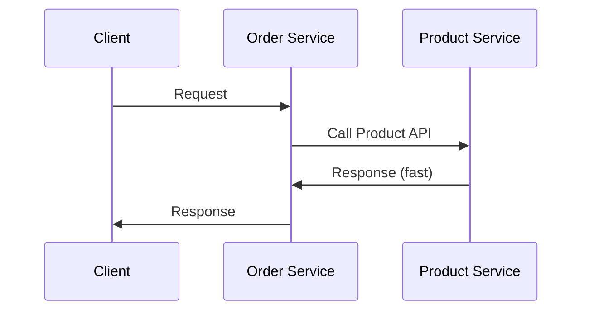

### The Trigger: A Slow Downstream Service

Now suppose a buggy code change is introduced into the **Product Service**, causing each of its API calls to take **60 seconds** to respond — an enormous delay in a distributed system context.

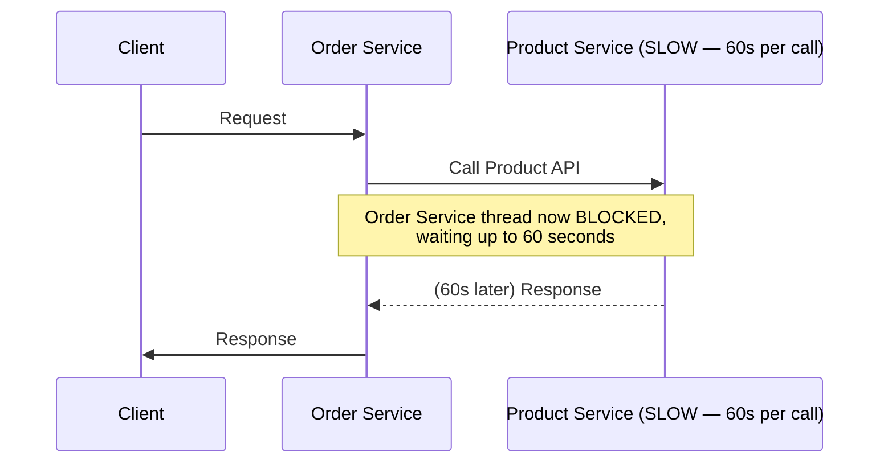

Without any fault-tolerance mechanism in place, **any call from Order Service to Product Service will now hang for 60 seconds**, tying up the calling thread the entire time.

### The Cascade

If a **sudden burst of requests** arrives at Order Service from its own clients during this period, **every single one** of those requests will, in turn, call the slow Product Service and hang for up to 60 seconds each.

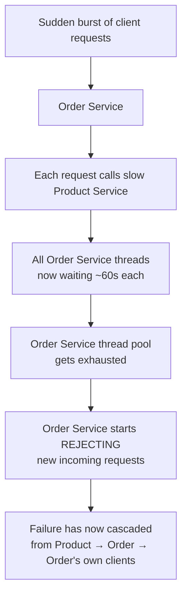

Because Order Service relies on a **thread pool** to handle incoming requests, and every single thread is now tied up waiting on the slow Product Service, the thread pool eventually **runs out of available threads**. At that point, Order Service itself starts **rejecting incoming requests** — even though Order Service's own code has no bug in it whatsoever.

> [!WARNING]
> This is the essence of **cascading failure**: a fault that originates in one component (Product Service) propagates outward and causes healthy components (Order Service, and potentially Order Service's own upstream clients) to fail as well — purely due to exhausted shared resources like thread pools, not due to any defect in those healthy components themselves.

### The Feedback Loop That Makes It Worse

There's an additional compounding effect: as more and more load piles onto the already-struggling Product Service (because Order Service keeps sending it requests, and possibly retrying), **Product Service's own situation keeps deteriorating further** — it now has even more concurrent load to process while already being slow, making recovery progressively harder.

> [!IMPORTANT]
> This is precisely why fault tolerance in microservices isn't just about protecting the calling service (Order Service) — mechanisms like rate limiting and circuit breaking also **protect the struggling downstream service** (Product Service) from being overwhelmed further while it's already in a degraded state, giving it a chance to recover.

---

## Introducing Resilience4j

**Resilience4j** is a fault-tolerance library that provides a combination of **five mechanisms** to help build resilient, fault-tolerant microservices:

1. **Rate Limiter**
2. **Bulkhead**
3. **Time Limiter**
4. **Circuit Breaker**
5. **Retry**

Each of these targets a different aspect of failure handling, and together they form a layered defense against the kind of cascading failure scenario described above.

---

## Why the Order of Mechanisms Matters

While there is technically no hard rule enforcing a specific order in which these five mechanisms must be applied, there is a **recommended, logical ordering** that is generally followed as a de facto standard:

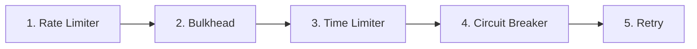

### Why Rate Limiter Should Come Before Retry

Consider what happens if this ordering is reversed — i.e., if **Retry** is applied **before** Rate Limiter:

- The Rate Limiter's job is to **block** excess traffic once a configured limit is crossed.
- If Retry runs first, the system would **waste computation retrying requests that are ultimately going to be blocked by the Rate Limiter anyway** — there is no point in retrying traffic that the Rate Limiter will reject regardless.

> [!TIP]
> The general principle behind this recommended ordering: mechanisms that **reject/short-circuit traffic early** (like Rate Limiter) should generally run before mechanisms that **spend additional resources trying to make a request succeed** (like Retry) — otherwise you waste effort on requests that were never going to be allowed through in the first place.

---

## Rate Limiter — Overview

The **Rate Limiter** is the first mechanism in the recommended ordering, and one of the most important from both an interview and a real-world system-design perspective.

> **Rate Limiter** controls the number of requests allowed to a microservice within a given time window, protecting the system from sudden traffic spikes (such as a DDoS attack).

There are **five commonly used algorithms** for implementing rate limiting:

1. Fixed Window Counter
2. Sliding Log
3. Sliding Window Counter (two flavors: Sub-Windows, and Weighted Window)
4. Token Bucket
5. Leaky Bucket

> [!NOTE]
> Understanding these algorithms conceptually is what makes the later Spring Boot implementation section make sense — Resilience4j's default Rate Limiter implementation is, specifically, **Token Bucket** based.

---

## Rate Limiter Algorithms

### 1. Fixed Window Counter

The simplest algorithm. It counts how many requests occur within a **fixed time window**; if the count crosses the configured limit, further requests within that same window are rejected.

**Example setup:** Window size = 10 seconds, Limit = 5 requests per window.

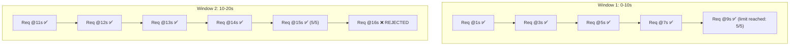

- Requests 1 through 5 in Window 1 (0–10s) are all accepted since the limit is 5.
- In Window 2 (10–20s), the first 5 requests are accepted, but the 6th request in the same window is **rejected** for crossing the limit.
- Once a new window begins, the counter resets, and new requests can again be accepted up to the limit.

> [!WARNING]
> **Disadvantage — Edge/Boundary Burst Problem:** If all 5 allowed requests in Window 1 land at the very **end** of that window, and all 5 allowed requests in Window 2 land at the very **start** of the next window, then within any single actual 1-second span straddling the window boundary, the system could receive **10 requests** — double its intended limit — even though each individual window's count technically stayed within its own limit of 5.

---

### 2. Sliding Log

Similar in spirit to a classic **sliding window** data structure. For each accepted request, the **exact timestamp** is stored. To decide whether to accept a new request, the algorithm checks how many requests occurred within the trailing window-size seconds.

**Example setup:** Window size = 10 seconds, Limit = 5 requests.

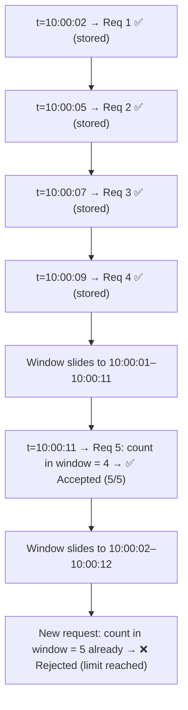

- As time progresses, the "window" of consideration continuously slides forward (e.g., moving from `10:00:00–10:00:10` to `10:00:01–10:00:11`, then to `10:00:02–10:00:12`, and so on).
- At each point, only timestamps falling within the current sliding window are counted toward the limit.
- Timestamps that fall **outside** (before) the current sliding window must be **cleaned up** from storage, since they no longer count.

> [!WARNING]
> **Disadvantages:**
> - Requires storing the exact timestamp of every accepted request, which consumes **more memory** as request volume grows.
> - Requires an ongoing **cleanup process** to purge timestamps that have fallen outside the current sliding window — this is extra computational overhead not present in the simpler Fixed Window Counter.

---

### 3. Sliding Window Counter — Sub-Windows Flavor

The **main window** is divided into equal-sized **sub-windows**. Each sub-window independently tracks how many requests it has received. To decide whether to accept a new request, the algorithm sums the request counts across all currently **active** sub-windows within the main window, and the main window slides forward over time.

**Example setup:** Main window = 10 seconds, Sub-window size = 2 seconds (giving 5 sub-windows: `0-2, 2-4, 4-6, 6-8, 8-10`), Limit = 5.

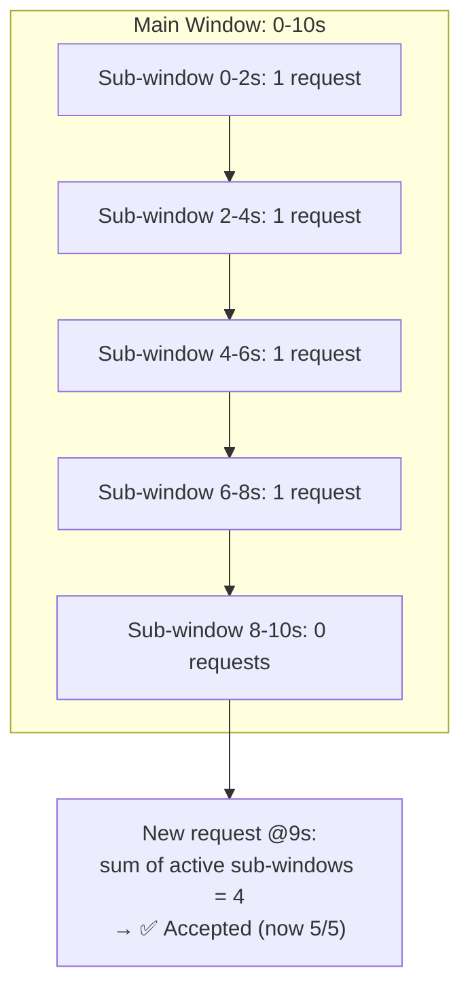

When the main window slides (it moves forward by exactly **one sub-window's size**, not by 1 second), the set of "active" sub-windows shifts accordingly:

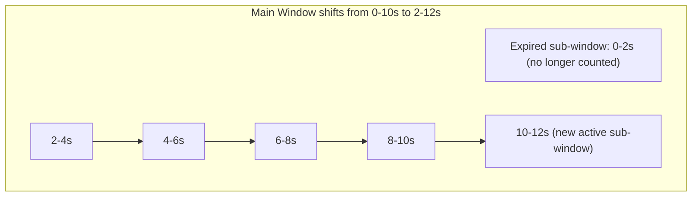

- Only the sub-windows that currently fall within the main window's active span are summed to check against the limit.
- Expired sub-windows (fallen outside the current main window) are excluded from the count.

> [!WARNING]
> **Disadvantages:**
> - More **complex** logic than plain Fixed Window Counter — requires maintaining separate counts per sub-window.
> - Requires **more memory** to track each sub-window's individual count.

---

### 4. Sliding Window Counter — Weighted Window Flavor

A simpler alternative combining ideas from **Fixed Window** and **Sliding Log**. Instead of maintaining individual sub-windows, it maintains only a **single total count per fixed window**, and computes an estimated count for the current sliding window using a **weighted average** based on how much the sliding window overlaps with the adjacent fixed windows.

**Example setup:** Fixed window size = 10s, Limit = 5.

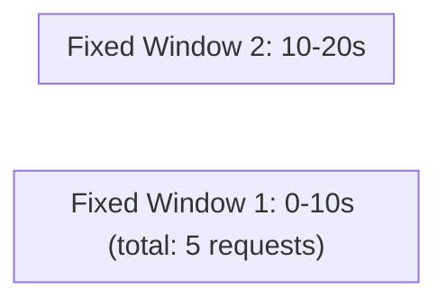

**Scenario A — Slider at `0–10` (100% in Window 1):** Total requests = 5, which is within the limit → all 5 accepted.

**Scenario B — Slider moves to `1–11` (90% in Window 1, 10% in Window 2):**

```
Total request estimate = current fixed window count (Window 2, so far = 0)
                        + (90% × Window 1's total count of 5)
                        = 0 + 4.5
                        ≈ 5 (rounded up)
```

Since this estimate (5) already equals the limit, a new request here is **rejected**.

**Scenario C — Slider moves to `2–12` (80% in Window 1, 20% in Window 2):**

```
Total request estimate = 0 (Window 2 so far)
                        + (80% × 5)
                        = 4
```

Since 4 is less than the limit of 5, a new request is **accepted** — but this estimate can be **inaccurate**.

> [!WARNING]
> **Disadvantage — Inaccurate Estimation:** This weighted approach assumes requests are **evenly spread** throughout the fixed window — which may not be true. If, for example, all 5 of Window 1's requests actually occurred at the very **end** of Window 1 (rather than spread out), then the 80%-weighted estimate would **undercount** the true number of overlapping requests, allowing **more requests through than the intended limit**. In the lecture's own worked example, this flaw let a 6th request through when only 5 should have been allowed within the slider window.

---

### 5. Token Bucket

A conceptually simple and widely-used algorithm. A **bucket** holds a limited number of **tokens**. Each incoming request must **consume one token** to be accepted; if no tokens remain, the request is denied. A **refiller** process adds tokens back into the bucket at a fixed time interval. If the bucket is already at full capacity, any additional tokens added by the refiller **overflow** and are discarded.

**Example setup:** Bucket capacity = 4 tokens, Refiller adds 1 token every 6 seconds.

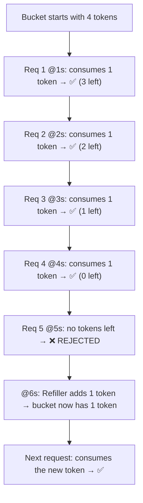

> [!WARNING]
> **Disadvantage — Burst Traffic Risk:** If the bucket's capacity is set to a large value without careful consideration (e.g., an arbitrarily large capacity like 1000), that many tokens can accumulate over time. If a sudden burst of requests then arrives all at once, **all of them could be accepted simultaneously** (up to the bucket's full capacity), since the algorithm has no built-in mechanism to smooth out concurrent bursts beyond the raw token count. Bucket capacity must be chosen deliberately to avoid this.

---

### 6. Leaky Bucket

Incoming requests are placed into a **queue** and processed (accepted) at a **fixed, constant rate**. If the queue is already full when a new request arrives, that request **overflows** and is rejected (typically with an HTTP `429 Too Many Requests` response).

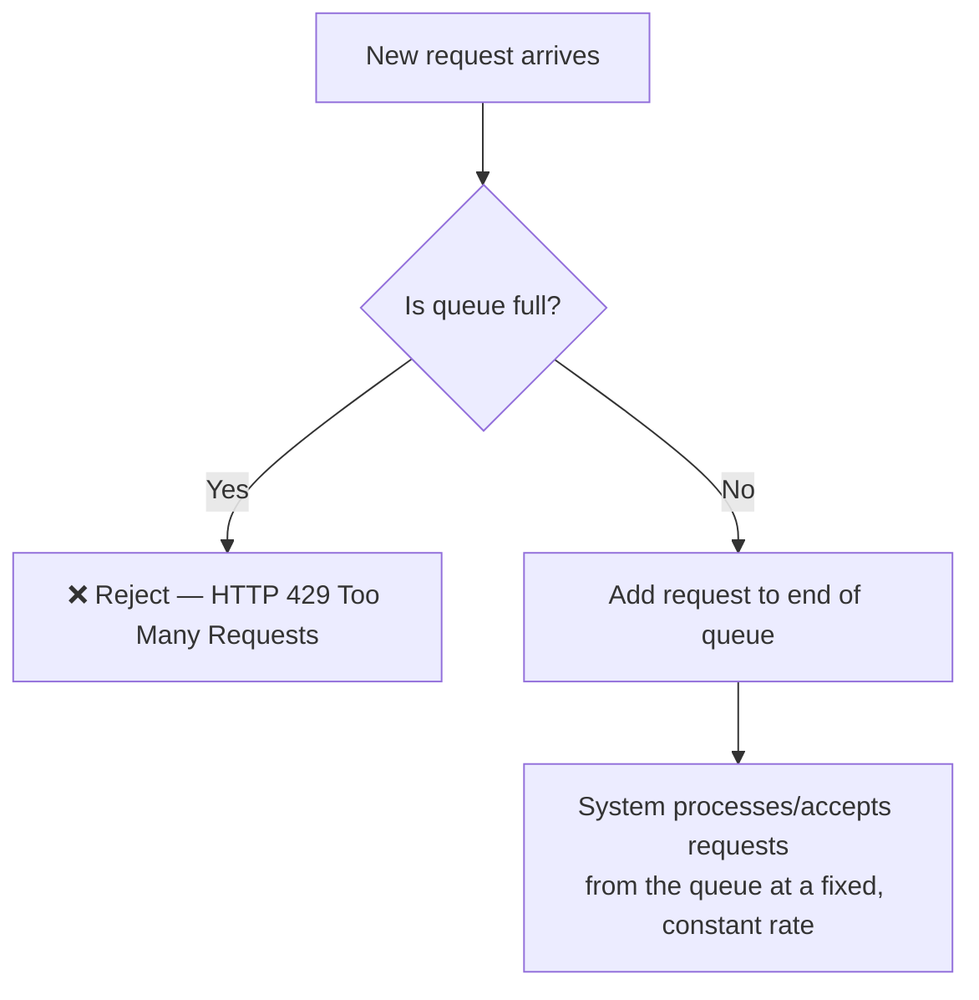

> [!WARNING]
> **Disadvantages:**
> - **Increased latency** — requests may have to wait in the queue for their turn, since processing happens strictly at a constant rate regardless of how many requests are currently waiting.
> - The queue itself can become a **bottleneck**: if the queue size is too small, many requests will be denied outright; if the queue size is too large, overall latency increases significantly. Queue size must be tuned carefully.
> - Additional **memory** is required to hold the queued requests.

---

## Comparison Table of All Algorithms

| Algorithm | Core Idea | Key Advantage | Key Disadvantage |
|---|---|---|---|
| **Fixed Window Counter** | Count requests per fixed time window | Very simple to implement | Edge/boundary burst — can allow up to 2× the limit at window boundaries |
| **Sliding Log** | Store exact timestamp per request | Accurate, no boundary burst issue | High memory usage; requires ongoing cleanup of expired timestamps |
| **Sliding Window Counter (Sub-Windows)** | Sum counts across active sub-windows | More accurate than Fixed Window, less memory than Sliding Log | More complex logic; still needs per-sub-window memory |
| **Sliding Window Counter (Weighted)** | Weighted estimate blending two fixed windows | Simpler than sub-window flavor; low memory | Estimate can be inaccurate if requests aren't evenly distributed |
| **Token Bucket** | Consume tokens from a refillable bucket | Simple, allows some burst tolerance by design | Risk of large, uncontrolled bursts if capacity is set too high |
| **Leaky Bucket** | Queue requests, process at constant rate | Smooths traffic to a strictly constant rate | Increased latency; queue size is a delicate trade-off |

---

## Spring Boot Implementation

### Step 1 — Add the Resilience4j Dependency

```xml
<dependency>
    <groupId>io.github.resilience4j</groupId>
    <artifactId>resilience4j-spring-boot3</artifactId>
    <version><!-- any stable version --></version>
</dependency>
```

> [!NOTE]
> Rate Limiter is just one of the mechanisms bundled inside the overall Resilience4j framework — adding this single dependency brings in the classes needed for all five mechanisms (Rate Limiter, Bulkhead, Time Limiter, Circuit Breaker, Retry), not just Rate Limiter alone.

### Step 2 — Controller (Unchanged)

```java
@RestController
public class OrderController {

    @Autowired
    private OrderService orderService;

    @GetMapping("/order/invoke-product")
    public String invokeProductApi() {
        return orderService.invokeProductApi();
    }
}
```

No changes are needed at the controller layer — it simply invokes the service method as usual.

### Step 3 — Feign Client Interface (Unchanged)

```java
@FeignClient(name = "product-service")
public interface ProductClient {

    @GetMapping("/product/{id}")
    String getProductById(@PathVariable("id") String id);
}
```

This uses **Feign Client** with **Service Discovery**, both covered as prerequisite material elsewhere in the broader microservices series — any client mechanism (Feign, `RestTemplate`, `RestClient`) can be used here for communication between Order and Product components.

### Step 4 — Order Service with `@RateLimiter` Annotation

```java
@Service
public class OrderService {

    @Autowired
    private ProductClient productClient;

    @RateLimiter(name = "productRateLimiter", fallbackMethod = "rateLimitedFallback")
    public String invokeProductApi() {
        return productClient.getProductById("1");
    }

    public String rateLimitedFallback(Throwable throwable) {
        return "Rate limit exceeded. Try again later.";
    }
}
```

### Syntax Breakdown

| Element | Meaning |
|---|---|
| `@RateLimiter(name = "productRateLimiter", ...)` | Applies rate limiting to this method. The `name` (here, `productRateLimiter`) is an arbitrary identifier used to link this annotation to its corresponding configuration in `application.properties`. |
| `fallbackMethod = "rateLimitedFallback"` | Specifies the method to invoke whenever a request is **rejected** by the rate limiter (i.e., no token/slot available). |
| `rateLimitedFallback(Throwable throwable)` | The fallback method implementation. Inside it, you can throw a custom exception, log the event, or return a default/degraded response — entirely up to your business logic. |

> [!IMPORTANT]
> **Fallback Method Signature Rules:**
> - The fallback method's **return type** must match the original annotated method's return type exactly.
> - The fallback method's **parameters** must match the original method's parameters exactly (e.g., if the original method accepts a `String`, so must the fallback).
> - The **only** allowed *additional* parameter beyond matching the original method's signature is a trailing `Throwable` parameter.
> - If the signature does **not** match these rules, Resilience4j will **fail to recognize** your custom fallback method, and will instead fall back to its own internal **default fallback method** defined within its `RateLimiter` class — which is very likely not the behavior you intended.

---

## Internal Working — AOP-Based Interception

> [!NOTE]
> This section assumes prior familiarity with **AOP (Aspect-Oriented Programming)** — specifically pointcut expressions and the `proceed()` mechanism — covered separately in the broader Spring Boot series. Only the concepts directly relevant to Rate Limiter are re-explained here.

The entire `@RateLimiter` annotation mechanism is implemented **purely through AOP** — there is no other "special" framework machinery involved beyond what AOP itself provides.

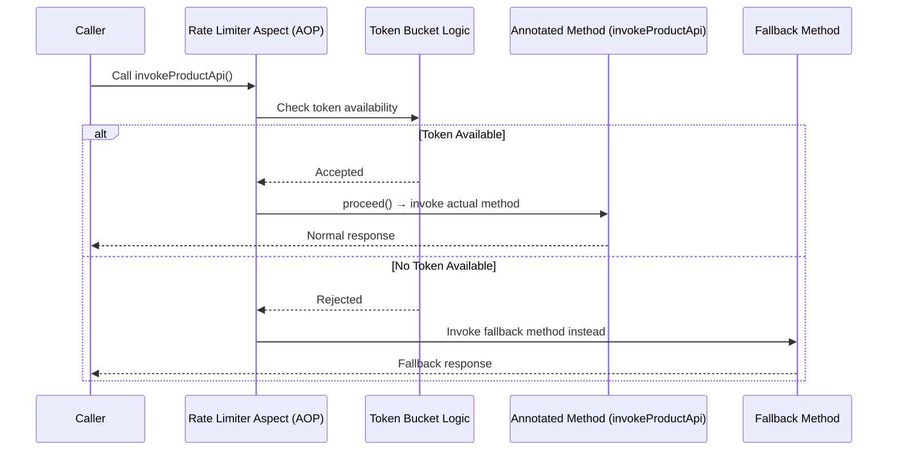

### Step-by-Step Execution

1. The AOP aspect **intercepts** the call to any method annotated with `@RateLimiter`.
2. It first runs the configured **rate-limiting logic** — by default, this is the **Token Bucket** algorithm implementation.
3. If the request is **accepted** by the rate limiter, the aspect calls `proceed()` (a core AOP concept), which allows the original annotated method to actually execute as normal.
4. If the request is **rejected**, the aspect instead routes execution to the specified **fallback method**, rather than the original method.

---

## Building a Custom Rate Limiter with AOP

If the default Token Bucket algorithm isn't desired, and you want to implement a **completely custom rate-limiting algorithm** (e.g., Leaky Bucket, or your own custom logic), this can be done by handling the entire mechanism through AOP yourself, rather than relying on Resilience4j's built-in `@RateLimiter`.

### Step 1 — Define a Custom Annotation

```java
@Target(ElementType.METHOD)
@Retention(RetentionPolicy.RUNTIME)
public @interface CustomRateLimiter {
    String name();
}
```

### Step 2 — Write an Aspect Class with a Pointcut

```java
@Aspect
@Component
public class CustomRateLimiterAspect {

    @Around("@annotation(CustomRateLimiter)")
    public Object applyCustomRateLimit(ProceedingJoinPoint joinPoint) throws Throwable {
        // 1. Implement your own custom rate-limiting logic here
        boolean allowed = myCustomRateLimitCheck();

        if (!allowed) {
            // handle rejection — e.g., throw a custom exception
            throw new CustomRateLimitExceededException("Rate limit exceeded");
        }

        // 2. If allowed, proceed to actually invoke the original annotated method
        return joinPoint.proceed();
    }
}
```

### Syntax Breakdown

| Element | Meaning |
|---|---|
| `@interface CustomRateLimiter` | Defines your own custom annotation, exactly as covered in the earlier custom-annotation material in this series. |
| `@Around("@annotation(CustomRateLimiter)")` | A pointcut expression telling AOP to intercept any method call annotated with `@CustomRateLimiter`. |
| `ProceedingJoinPoint joinPoint` | Represents the intercepted method call — provides access to `.proceed()`, which triggers the actual annotated method's execution. |
| `myCustomRateLimitCheck()` | Placeholder for whatever custom algorithm you want to implement (Leaky Bucket, custom sliding window, etc.). |
| `joinPoint.proceed()` | Only called if your custom logic decides the request should be **allowed** — this is what actually invokes the original method (e.g., `getProductById(...)`). |

> [!TIP]
> This is exactly the same AOP pattern used internally by Resilience4j's own `@RateLimiter` — the only difference is that you're supplying your own rate-limiting algorithm implementation instead of relying on the built-in Token Bucket logic.

---

## Configuration Reference

```properties
resilience4j.ratelimiter.instances.productRateLimiter.limit-for-period=2
resilience4j.ratelimiter.instances.productRateLimiter.limit-refresh-period=10s
resilience4j.ratelimiter.instances.productRateLimiter.timeout-duration=1s
```

### Property Breakdown

| Property | Meaning |
|---|---|
| `limit-for-period` | The **maximum number of tokens** the bucket can hold — in this example, `2`. |
| `limit-refresh-period` | How often the **refiller** runs to add tokens back into the bucket — in this example, every `10` seconds, it adds `limit-for-period` (2) tokens. |
| `timeout-duration` | How long a request that finds **no available token** should **wait** before being rejected outright — in this example, `1` second. If, within that 1-second wait, a new token becomes available (due to the refiller running), the request can still be accepted; otherwise, it is rejected. |

> [!IMPORTANT]
> Resilience4j's default Rate Limiter implementation is **Token Bucket** based. The bucket's maximum capacity and the number of tokens added per refresh cycle are governed by the **same** `limit-for-period` value in this configuration — meaning if no traffic arrives for a while and the bucket is already full, any additional tokens the refiller tries to add at the next refresh cycle will simply **overflow** and be discarded, since the bucket cannot exceed its configured capacity.

### Multiple Rate Limiters

Since a real system may have many different endpoints each requiring their own rate limiting rules, each `@RateLimiter(name = "...")` annotation's name corresponds to its own distinct configuration block:

```properties
resilience4j.ratelimiter.instances.productRateLimiter.limit-for-period=2
resilience4j.ratelimiter.instances.productRateLimiter.limit-refresh-period=10s
resilience4j.ratelimiter.instances.productRateLimiter.timeout-duration=1s

resilience4j.ratelimiter.instances.salesRateLimiter.limit-for-period=5
resilience4j.ratelimiter.instances.salesRateLimiter.limit-refresh-period=5s
resilience4j.ratelimiter.instances.salesRateLimiter.timeout-duration=500ms
```

---

## Execution Walkthrough (Observed Behavior)

Given the configuration above (`limit-for-period=2`, `limit-refresh-period=10s`), here is the observed behavior when repeatedly hitting the endpoint via Postman:

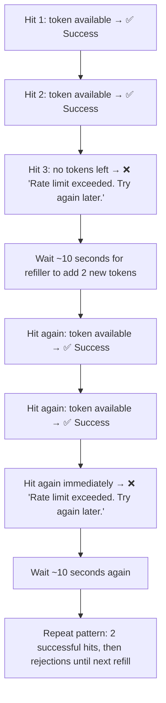

- The first two calls succeed, consuming both available tokens.
- The third call, made before the 10-second refill window elapses, is rejected with the fallback message.
- After waiting for the `limit-refresh-period` (10 seconds), two new tokens become available, and the pattern repeats: two successful calls, followed by rejections until the next refill.

---

## Memory Representation

Although Rate Limiter operates mostly around counters/tokens rather than heavy object graphs, it's useful to understand where its state lives conceptually:

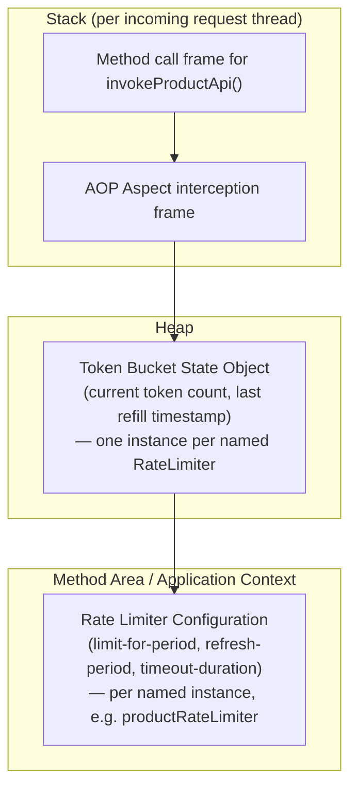

- The **configuration** (limit values, refresh period, timeout) is read once from `application.properties` and effectively lives at the application/context level (conceptually similar to the Method Area, since it's shared, relatively static configuration data).
- The actual **token bucket state** — the current token count and the timestamp of the last refill — lives on the **heap**, as a shared object associated with that specific named Rate Limiter instance (e.g., `productRateLimiter`). This state is shared and mutated across all threads/requests hitting that same rate-limited endpoint.
- Each incoming request thread has its own **stack frame** for the method call and the AOP interception logic, but they all interact with the **same shared bucket object** on the heap when checking/consuming tokens.

---

## Common Mistakes

> [!WARNING]
> **Mistake 1: Applying mechanisms in the wrong logical order.**
> Applying Retry before Rate Limiter wastes computation retrying requests that will ultimately be blocked anyway. Follow the recommended order: Rate Limiter → Bulkhead → Time Limiter → Circuit Breaker → Retry.

> [!WARNING]
> **Mistake 2: Mismatched fallback method signature.**
> If the fallback method's return type or parameters don't exactly match the original method (aside from the allowed extra `Throwable` parameter), Resilience4j silently falls back to its own internal default fallback instead of your intended one — leading to confusing, hard-to-debug behavior.

> [!WARNING]
> **Mistake 3: Setting Token Bucket capacity too high without justification.**
> An arbitrarily large `limit-for-period` allows large bursts of concurrent requests to be accepted all at once whenever the bucket has accumulated enough tokens — potentially overwhelming the very downstream service the rate limiter was meant to protect.

> [!WARNING]
> **Mistake 4: Using Fixed Window Counter without accounting for boundary bursts.**
> Since Fixed Window Counter can allow up to double its intended limit at window boundaries, it may not provide the traffic protection guarantees you actually need for stricter use cases.

> [!WARNING]
> **Mistake 5: Forgetting that the Weighted Window flavor of Sliding Window Counter is an estimate, not an exact count.**
> Because it assumes requests are evenly distributed within each fixed window, it can under-count real concurrent load in certain distributions of traffic, letting through more requests than the configured limit.

---

## Best Practices

- ✅ Apply the five Resilience4j mechanisms in the recommended logical order: **Rate Limiter → Bulkhead → Time Limiter → Circuit Breaker → Retry**.
- ✅ Always provide a properly-signatured fallback method for `@RateLimiter` to ensure predictable, intentional degraded behavior rather than falling back to the framework's generic default.
- ✅ Choose Token Bucket capacity (`limit-for-period`) deliberately, based on real downstream capacity, rather than an arbitrary large number.
- ✅ Use a `timeout-duration` to allow brief waits for token availability instead of immediately rejecting borderline requests, when appropriate for your latency budget.
- ✅ Give each rate-limited endpoint its own uniquely-named `@RateLimiter` instance and corresponding configuration block, rather than sharing one configuration across unrelated endpoints.
- ✅ If you need an algorithm Resilience4j doesn't provide out of the box, implement it yourself via a custom annotation + AOP aspect, following the same interception pattern used internally by the framework.

---

## Interview Notes

> [!IMPORTANT]
> Frequently probed concepts around fault tolerance and rate limiting.

1. **"What is cascading failure, and how does it happen?"**
   A failure or slowdown in one service (e.g., Product Service becoming slow) causes threads in a calling service (e.g., Order Service) to be tied up waiting, eventually exhausting that service's thread pool and causing it to reject requests too — propagating the failure outward to otherwise-healthy components.

2. **"Why should Rate Limiter be applied before Retry?"**
   To avoid wasting computation retrying requests that will ultimately be blocked by the rate limiter regardless — there's no benefit to retrying traffic that's destined for rejection.

3. **"What algorithm does Resilience4j's Rate Limiter use by default?"**
   Token Bucket, configured via `limit-for-period`, `limit-refresh-period`, and `timeout-duration`.

4. **"What's the main disadvantage of Fixed Window Counter?"**
   The edge/boundary burst problem — up to double the intended limit can be let through if requests cluster at the boundary between two windows.

5. **"How does Sliding Log avoid the boundary burst problem, and at what cost?"**
   By storing exact timestamps per request and always checking a trailing window of the configured size — at the cost of higher memory usage and the need for ongoing cleanup of expired timestamps.

6. **"What are the two flavors of Sliding Window Counter, and how do they differ?"**
   The Sub-Windows flavor divides the main window into smaller sub-windows and sums active sub-window counts (more accurate, more complex/memory). The Weighted Window flavor blends two adjacent fixed windows using a percentage-based weighted estimate (simpler, less memory, but can be inaccurate if requests aren't evenly distributed).

7. **"What is the risk of setting Token Bucket capacity too high?"**
   It permits large bursts of requests to be accepted simultaneously if enough tokens have accumulated, potentially overwhelming downstream systems.

8. **"How does the `@RateLimiter` annotation work internally?"**
   Entirely through AOP — the annotation is intercepted by an aspect, which runs the rate-limiting logic (Token Bucket by default) before conditionally calling `proceed()` to invoke the original method, or routing to the configured fallback method if the request is rejected.

9. **"What are the rules for a valid `@RateLimiter` fallback method signature?"**
   Same return type and parameters as the original method, with the only permitted addition being a trailing `Throwable` parameter. Mismatches cause Resilience4j to silently use its own internal default fallback instead.

10. **"How would you implement a custom rate-limiting algorithm not provided by Resilience4j?"**
    Define a custom annotation, write an AOP aspect with a pointcut matching that annotation, implement your custom logic inside the aspect, and call `proceed()` conditionally based on your logic's outcome.

---

## Related Concepts

- **Bulkhead, Time Limiter, Circuit Breaker, Retry** — The remaining four Resilience4j mechanisms, to be covered in subsequent material, each addressing a different aspect of fault tolerance following Rate Limiter in the recommended order.
- **Thread Pools** — The underlying resource whose exhaustion drives cascading failure; covered in depth elsewhere in this series.
- **AOP (Aspect-Oriented Programming)** — The mechanism underlying `@RateLimiter`'s entire implementation, including pointcut expressions and `proceed()`; covered in depth in the Spring Boot playlist.
- **Feign Client & Service Discovery** — The inter-service communication mechanism used in the example, covered separately in this microservices series.
- **HTTP 429 Too Many Requests** — The standard HTTP status code associated with rate-limiting rejections (explicitly mentioned in the context of Leaky Bucket).
- **DDoS (Distributed Denial of Service) Protection** — The broader security motivation behind rate limiting.

---

## Practice Questions

### Easy

1. What is the definition of a fault-tolerant microservice?
2. Name the five mechanisms provided by Resilience4j, in their recommended logical order.
3. What does the Rate Limiter's `limit-for-period` configuration property control?

### Medium

4. Explain, step by step, how a slow Product Service can cause Order Service to start rejecting its own requests, even though Order Service has no bug of its own.
5. Compare Fixed Window Counter and Sliding Log in terms of accuracy, memory usage, and implementation complexity.
6. Why does Resilience4j require a fallback method's signature to match the original method's signature (aside from an added `Throwable`)? What happens if it doesn't match?

### Hard

7. Walk through, with a worked numeric example, why the Weighted Window flavor of Sliding Window Counter can allow more requests through than its configured limit, and explain what assumption in its calculation causes this inaccuracy.
8. Describe, using AOP terminology (pointcut, `proceed()`, aspect), exactly how the `@RateLimiter` annotation intercepts and conditionally executes an annotated method.
9. Design a custom rate-limiting AOP aspect (conceptually) that implements the Leaky Bucket algorithm instead of Resilience4j's default Token Bucket — what state would your aspect need to maintain, and how would `proceed()` be invoked differently than in a Token Bucket implementation?

---

## Summary

- A **fault-tolerant microservice** continues operating (or degrades gracefully) even when its downstream dependencies fail or slow down, instead of crashing or propagating that failure onward.
- **Cascading failure** occurs when a slow/failing downstream service (e.g., Product Service) ties up the calling service's (e.g., Order Service's) thread pool, eventually causing the calling service to reject requests too — spreading the failure to otherwise-healthy components.
- **Resilience4j** provides five mechanisms — **Rate Limiter, Bulkhead, Time Limiter, Circuit Breaker, Retry** — recommended to be applied in that specific logical order, primarily so that expensive mechanisms like Retry don't waste effort on traffic that earlier mechanisms like Rate Limiter would block anyway.
- **Rate Limiter** controls how many requests are allowed within a given time window, protecting against sudden traffic spikes. Its major algorithms are: **Fixed Window Counter** (simple, but boundary-burst-prone), **Sliding Log** (accurate, but memory-heavy with cleanup overhead), **Sliding Window Counter** in its **Sub-Windows** flavor (balanced accuracy/complexity) and **Weighted Window** flavor (simple, but can be inaccurate under uneven traffic), **Token Bucket** (simple, refillable, but risks large bursts if capacity is misconfigured), and **Leaky Bucket** (smooths traffic to a constant rate, but increases latency and requires careful queue sizing).
- Resilience4j's Spring Boot implementation uses the `@RateLimiter(name=..., fallbackMethod=...)` annotation, backed by the **Token Bucket** algorithm by default, configured via `limit-for-period`, `limit-refresh-period`, and `timeout-duration` properties.
- Fallback methods must match the original method's return type and parameters exactly, with the only allowed addition being a trailing `Throwable` — mismatches cause silent fallback to Resilience4j's own internal default handler.
- The entire `@RateLimiter` mechanism is implemented via **AOP** — an aspect intercepts the annotated method, runs the rate-limiting check, and either calls `proceed()` to execute the real method or routes to the fallback method if rejected. The same AOP pattern can be reused to implement fully custom rate-limiting algorithms.
