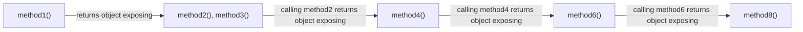
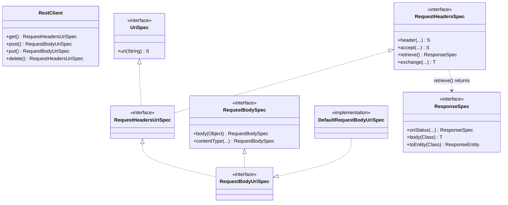
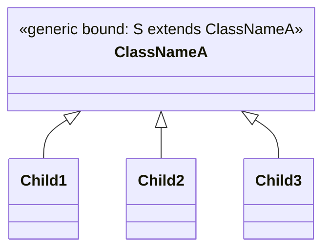
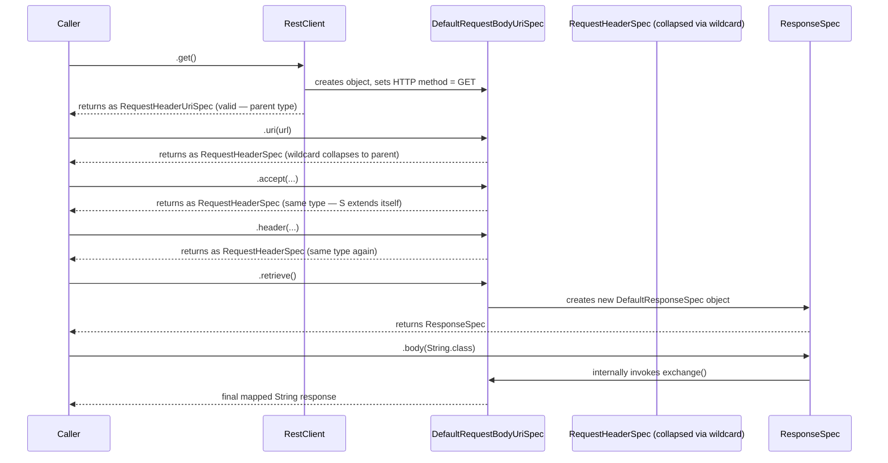
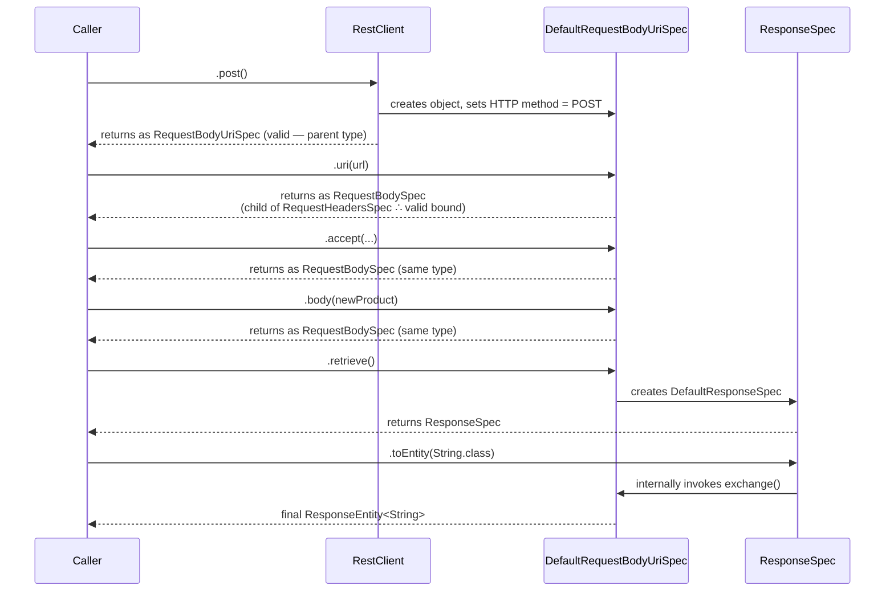
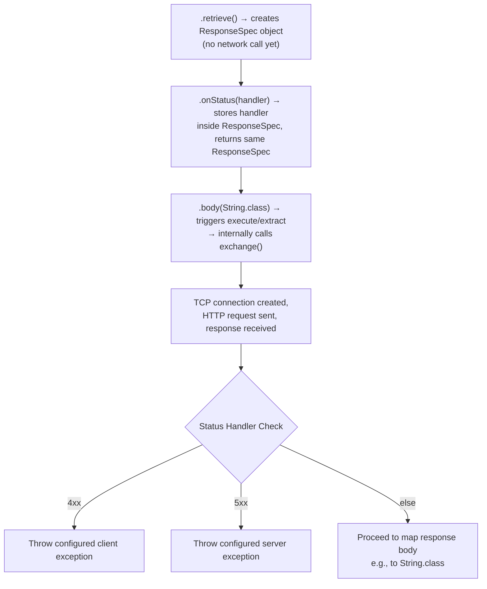
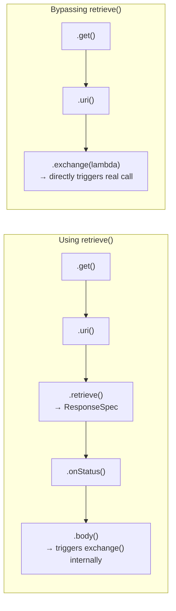
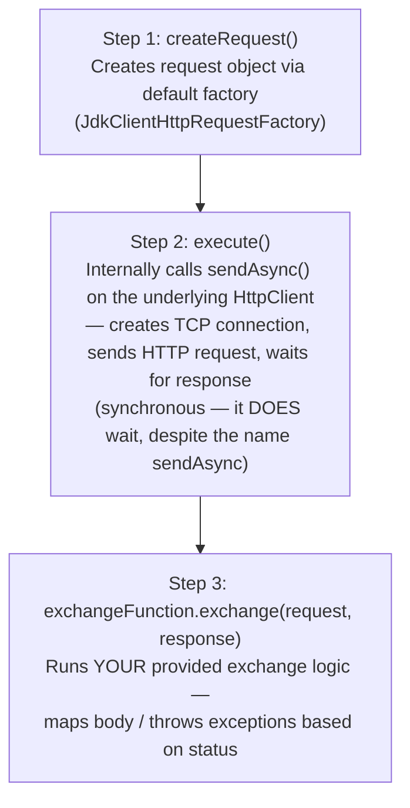
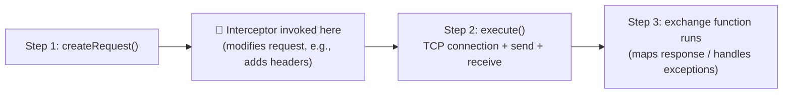
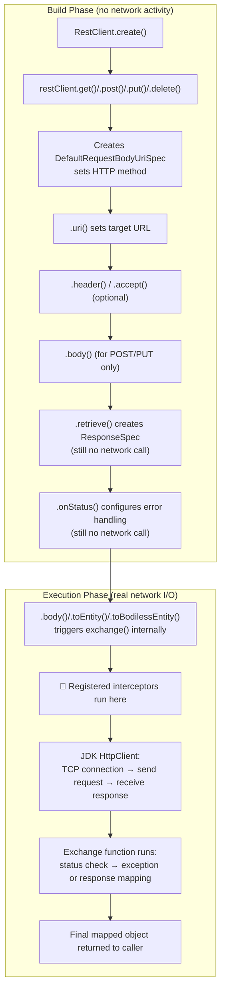

# 📌 Spring `RestClient` — Complete Study Guide

---

## Table of Contents

1. [Overview](#overview)
2. [Why RestClient Exists](#why-restclient-exists)
3. [Definition](#definition)
4. [Real-World Analogy](#real-world-analogy)
5. [RestClient vs RestTemplate vs WebClient](#restclient-vs-resttemplate-vs-webclient)
6. [Setting Up RestClient](#setting-up-restclient)
7. [First Example — A Simple GET Call](#first-example--a-simple-get-call)
8. [Understanding Fluent APIs](#understanding-fluent-apis)
9. [The Class/Interface Hierarchy Behind RestClient](#the-classinterface-hierarchy-behind-restclient)
10. [Generics and Wildcards Used in the Hierarchy](#generics-and-wildcards-used-in-the-hierarchy)
11. [Tracing the GET Flow Through the Classes](#tracing-the-get-flow-through-the-classes)
12. [What Happens When the Chain Sequence Is Broken](#what-happens-when-the-chain-sequence-is-broken)
13. [Tracing the POST Flow Through the Classes](#tracing-the-post-flow-through-the-classes)
14. [Tracing the DELETE Flow Through the Classes](#tracing-the-delete-flow-through-the-classes)
15. [Exception Handling with `onStatus`](#exception-handling-with-onstatus)
16. [Bypassing `retrieve()` — Using `exchange()` Directly](#bypassing-retrieve--using-exchange-directly)
17. [Internal Working of `exchange()`](#internal-working-of-exchange)
18. [The Underlying HTTP Client (Java 11+ `HttpClient`)](#the-underlying-http-client-java-11-httpclient)
19. [Interceptors in RestClient](#interceptors-in-restclient)
20. [Memory & Execution Flow Summary Diagram](#memory--execution-flow-summary-diagram)
21. [Common Mistakes](#common-mistakes)
22. [Best Practices](#best-practices)
23. [Interview Notes](#interview-notes)
24. [Related Concepts](#related-concepts)
25. [Practice Questions](#practice-questions)
26. [Summary](#summary)

---

## Overview

`RestClient` is a modern, **synchronous, blocking** HTTP client introduced in **Spring Framework 6+ / Spring Boot 3+**, designed to be the successor to `RestTemplate` for synchronous inter-service communication. It exposes a **fluent, chainable API** — meaning you build up a request step-by-step through a sequence of method calls (`.get()`, `.uri()`, `.header()`, `.retrieve()`, `.body()`, etc.) instead of memorizing dozens of overloaded methods, which was one of the biggest pain points of `RestTemplate`.

> [!NOTE]
> This guide assumes familiarity with `RestTemplate` fundamentals (its purpose, its overloaded methods, and why those overloaded methods become hard to remember/maintain). That prior knowledge is treated as the prerequisite baseline throughout.

---

## Why RestClient Exists

`RestTemplate`, while functional, has a well-known limitation: it exposes an enormous number of **overloaded methods** (different overloads of `getForObject`, `postForEntity`, `exchange`, etc.) to cover every combination of URL types, request bodies, response types, and HTTP methods. This makes the API:

- Hard to **remember** — developers frequently need to look up which overload applies to their scenario.
- Hard to **maintain** — reading someone else's `RestTemplate` code requires cross-referencing which overload variant is being used and why.

Spring introduced two modern alternatives to address this:

| Alternative | Nature | Typical Use Case |
|---|---|---|
| **WebClient** | Asynchronous, non-blocking | Reactive programming (Spring WebFlux) — the calling thread does **not** wait for the server's response before continuing. |
| **RestClient** | Synchronous, blocking (like `RestTemplate`) | Traditional synchronous service-to-service calls, but with a modern, fluent, easy-to-read API. |

> [!IMPORTANT]
> `RestClient` behaves synchronously — the client **waits** for the response before continuing, exactly like `RestTemplate`. The key improvement over `RestTemplate` is not concurrency behavior, but **API ergonomics**: a fluent, chainable, self-discoverable API surface instead of a large flat set of overloaded methods. `WebClient`, by contrast, is asynchronous/non-blocking and is covered separately under Spring WebFlux.

Because `RestClient` solves the exact same overloaded-method problem while remaining synchronous (matching most everyday microservice needs), it is now used **more frequently** than `RestTemplate` in new Spring Boot 3+ codebases.

---

## Definition

> **RestClient** is a synchronous HTTP client provided by Spring Framework 6+ (Spring Boot 3+) that offers a modern, fluent, method-chaining API for making HTTP requests (GET, POST, PUT, DELETE), replacing the large number of overloaded methods found in `RestTemplate` with a discoverable sequence of chained calls.

---

## Real-World Analogy

Think of ordering a custom sandwich at a modern "build-your-own" sandwich counter, compared to trying to order from a **giant printed menu with 200 pre-combined sandwich options** (representing `RestTemplate`'s overloaded methods — you'd have to scan the whole menu to find the exact combination that matches what you want).

At the build-your-own counter (`RestClient`), you instead follow a **natural, guided sequence**:

1. Pick your bread (`.get()` / `.post()` / `.put()` / `.delete()`)
2. Pick your fillings (`.uri()`, `.header()`)
3. Decide how it's wrapped (`.retrieve()`)
4. Decide how you'll eat it (`.body()`)

At each step, the counter only shows you the **next set of valid choices** — you can't accidentally ask for "wrapping" before you've picked your bread. This step-by-step, guided, and constrained sequence is exactly what a fluent API enforces through its return types.

---

## RestClient vs RestTemplate vs WebClient

| Aspect | RestTemplate | RestClient | WebClient |
|---|---|---|---|
| **Introduced In** | Classic Spring (legacy) | Spring Framework 6+ / Spring Boot 3+ | Spring WebFlux |
| **Blocking behavior** | Synchronous, blocking | Synchronous, blocking | Asynchronous, non-blocking |
| **API style** | Many overloaded methods | Fluent, chainable API | Fluent, chainable, reactive (`Mono`/`Flux`) API |
| **Ease of maintenance** | Harder — must remember correct overload | Easier — guided by chain / IDE auto-complete | Easier, but reactive paradigm adds learning curve |
| **Typical usage context** | Legacy codebases | Traditional/synchronous service calls | Reactive programming |

---

## Setting Up RestClient

```java
@Configuration
public class AppConfig {

    @Bean
    public RestClient restClient() {
        return RestClient.create();
        // Equivalent to: return RestClient.builder().build();
    }
}
```

### Syntax Breakdown

- `RestClient.create()` — a convenience static factory method that internally delegates to `RestClient.builder().build()`. It returns a fully usable, default-configured `RestClient` instance.
- `RestClient.builder()` — returns a `RestClient.Builder`, which allows customizing things such as base URL, default headers, message converters, and **interceptors** (covered later in this guide) before calling `.build()`.

> [!TIP]
> Calling `RestClient.create()` and `RestClient.builder().build()` produce functionally equivalent results for the default case — `create()` is simply a shorthand.

---

## First Example — A Simple GET Call

**Scenario:** An `order-service` (running on port `8081`) needs to call a `product-service` (running on port `8082`) to fetch product/order details.

```java
@RestController
public class OrderController {

    @Autowired
    private RestClient restClient;

    @GetMapping("/order/{id}")
    public String getOrder(@PathVariable String id) {
        String response = restClient.get()
                .uri("http://localhost:8082/product/" + id)
                .retrieve()
                .body(String.class);

        System.out.println("Response from product API, which is called from order service: " + response);

        return "Order call successful";
    }
}
```

### Output

When calling `GET /order/1` via Postman:

**HTTP Response body:**
```
Order call successful
```

**Console/log output:**
```
Response from product API, which is called from order service: <whatever product-service returned as a String>
```

### Line-by-Line Explanation

| Line | Explanation |
|---|---|
| `@Autowired private RestClient restClient;` | Injects the `RestClient` bean created in the configuration class. |
| `restClient.get()` | Begins building a `GET` request. Returns an object exposing URI-related methods. |
| `.uri("http://localhost:8082/product/" + id)` | Sets the full target URL to invoke — here, `product-service`'s endpoint. |
| `.retrieve()` | Signals "I'm ready to send the request and receive the response" — internally prepares the object responsible for response mapping/exception handling. |
| `.body(String.class)` | Executes the actual HTTP call, waits for the response (synchronous), and maps the response body to a `String`. |
| `System.out.println(...)` | Prints what was received from `product-service`. |
| `return "Order call successful";` | The order-service's own controller returns this string as *its own* HTTP response — independent of what product-service returned. |

> [!NOTE]
> This same four-step template (`method → uri → retrieve → body`) is reused for POST, PUT, and DELETE — you don't need to memorize different overloaded method signatures for each HTTP verb; you just re-walk the same chain shape with the appropriate starting method.

---

## Understanding Fluent APIs

> [!IMPORTANT]
> This is the single most important conceptual foundation for understanding `RestClient`. Once fluent APIs "click," the rest of `RestClient`'s design falls into place naturally.

### Definition

**Fluent API** = a design style built on **chaining of method calls**, where each method call returns an object that exposes exactly the next valid set of operations.



### Key Characteristics

- Method 1 returns an **object**.
- That returned object exposes a **different set of methods** (method 2, method 3, etc.) that the caller can now call.
- Calling one of *those* methods may return yet another object, exposing yet another different set of methods.
- These methods are **not necessarily all defined in a single class** — they can be spread across several different classes/interfaces, and the chaining "hops" from class to class as each call returns the next object in the sequence.

### Why Sequence Matters

Because each method's **return type determines which methods can legally be called next**, **the order of the chain matters**. If you call methods out of the expected order, you may receive back an object of a class that does **not** expose the method you wanted to call next — effectively **breaking the chain**.

> [!WARNING]
> In a fluent API, you cannot arbitrarily reorder chained calls. For example, in `RestClient`, calling `.header()` before `.uri()` may leave you holding an object type that no longer exposes a `.uri()` method — meaning you'd be stuck unable to ever set the request URI, and thus unable to actually send the request.

---

## The Class/Interface Hierarchy Behind RestClient

To understand exactly *why* the chaining sequence works the way it does, we need to look at the actual interfaces/classes `RestClient` uses internally.



### Interface-by-Interface Breakdown

| Interface / Class | Responsibility |
|---|---|
| **`RestClient`** | The entry point. Exposes `.get()`, `.post()`, `.put()`, `.delete()` — each of these creates (internally) an object of `DefaultRequestBodyUriSpec` and sets the corresponding HTTP method on it. |
| **`UriSpec`** | Exposes methods related to setting the request's target URI — either directly as a `String`, or via a `UriBuilder`. |
| **`RequestHeadersSpec`** | Exposes methods for setting request headers and cookies — e.g., `.header(...)`, `.accept(...)` — and also exposes `.retrieve()` and `.exchange(...)`. |
| **`RequestHeadersUriSpec`** | A child interface of **both** `UriSpec` and `RequestHeadersSpec` — meaning an object of this type can call methods from *either* parent interface. |
| **`RequestBodySpec`** | Exposes methods needed for POST/PUT requests where a body must be sent — e.g., setting the body, content type, and content length. |
| **`RequestBodyUriSpec`** | A child interface of **both** `RequestHeadersUriSpec` and `RequestBodySpec` — so it inherits URI-setting, header-setting, *and* body-setting capability all at once. |
| **`DefaultRequestBodyUriSpec`** | The concrete implementation class providing real implementations for all the abstract methods declared across the interfaces above. **Regardless of whether you're building a GET, POST, PUT, or DELETE request, an object of this class is what actually gets created and populated under the hood.** |
| **`ResponseSpec`** | Comes into play *after* `.retrieve()` is called — it knows how to map the raw response into the desired object/type, and how to handle exceptions based on HTTP status codes (via `.onStatus(...)`), ultimately exposing `.body(Class)` / `.toEntity(Class)` which trigger the actual network call. |

> [!NOTE]
> This is described as a **high-level view** of the classes involved. `RestClient`'s actual internal structure has more nuance, but this level of detail is sufficient to fully understand how the fluent chaining and eventual network execution work.

---

## Generics and Wildcards Used in the Hierarchy

Before tracing the exact flow, it helps to understand the generic-type pattern used throughout these interfaces — specifically the **bounded wildcard** pattern:

```java
interface SomeSpec<S extends SomeSpec<S>> {
    S someMethod();
}
```

### What `S extends ClassName` Means

This is a classic **self-referential generic bound** (sometimes called the "curiously recurring generic pattern"). It means:

> The return type `S` can be either `ClassName` itself, **or** any subclass/subinterface of `ClassName`.



So if a method's return type is declared as `S`, and `S extends ClassNameA`, the **actual returned object** could validly be:

- `ClassNameA` itself, **or**
- `Child1`, **or**
- `Child2`, **or**
- `Child3`

### Why This Matters for RestClient

When a method internally uses a **wildcard (`?`)** in place of a concrete type parameter (because the exact child type isn't known/fixed at that point), the safest and most conservative choice the compiler/runtime can make is to treat the returned object as being of the **parent type** — since it cannot be sure exactly which specific child is involved.

This is precisely why, in the class diagram above, calling `.uri(...)` on a `RequestHeadersUriSpec` object with an unresolved wildcard type parameter results in the return type collapsing back down to the **parent interface** `RequestHeadersSpec`, rather than staying as the more specific `RequestHeadersUriSpec` — as demonstrated in the next section.

> [!TIP]
> If any of this generics/wildcard discussion feels unfamiliar, it's recommended prerequisite knowledge to review generic types and wildcards in Java before going deeper into `RestClient`'s internal type flow.

---

## Tracing the GET Flow Through the Classes

Let's trace, step by step, exactly which class/interface is "in play" at each point in the chain:

```java
restClient.get()
    .uri("http://localhost:8082/product/1")
    .accept(MediaType.APPLICATION_JSON)
    .header("X-Custom", "value")
    .retrieve()
    .body(String.class);
```



### Step-by-Step Breakdown

1. **`restClient.get()`**
   Internally creates an object of `DefaultRequestBodyUriSpec` and sets its HTTP method field to `GET`. The declared return type is `RequestHeadersUriSpec` — this is valid because `DefaultRequestBodyUriSpec` **is a child of** `RequestHeadersUriSpec` (a subtype can always be returned where the supertype is expected).

2. **You are now holding a `RequestHeadersUriSpec` reference.**
   Since `RequestHeadersUriSpec` is a child of **both** `UriSpec` and `RequestHeadersSpec`, you can call methods from **either** parent interface at this point — e.g., `.uri(...)` (from `UriSpec`) or `.header(...)` / `.retrieve()` (from `RequestHeadersSpec`).

3. **Calling `.uri(...)`.**
   Internally builds a `URI` object (potentially using a `UriBuilder`) and sets it on the underlying `DefaultRequestBodyUriSpec` instance. Because the generic type parameter here was passed as a wildcard (`?`), the compiler cannot know exactly *which* child of `RequestHeadersSpec` is involved — so, per the bounded-wildcard rule explained above, the return type **collapses to the parent interface**: `RequestHeadersSpec`.

4. **Calling `.accept(...)`.**
   Sets an `Accept` header internally. Its declared return type is `S` where `S extends RequestHeadersSpec` — since we're already at `RequestHeadersSpec` and the wildcard is still unresolved, it returns the **same type**: `RequestHeadersSpec`.

5. **Calling `.header(...)`.**
   Same situation — also declared on `RequestHeadersSpec`, also returns `RequestHeadersSpec`.

6. **Calling `.retrieve()`.**
   This is also present on `RequestHeadersSpec`. Internally, it creates a **brand-new object** — this time of `DefaultResponseSpec` (an implementation of `ResponseSpec`) — and returns it. **This is where the chain "jumps" to an entirely different interface family** (from the Request-side interfaces to the Response-side interface).

7. **Calling `.body(String.class)`.**
   Present on `ResponseSpec`. Internally, this ultimately calls the `.exchange(...)` method (present back on the original request-side object) — passing in a functional interface implementation describing **how to map the response and how to handle exceptions**. This `.exchange(...)` call is what actually triggers the real network activity: opening a TCP connection, sending the HTTP request, and reading back the response. The raw response is then mapped to a `String` and returned to the caller.

> [!NOTE]
> The key insight: `.retrieve()` doesn't perform any network I/O by itself — despite its name, calling `.retrieve()` merely constructs and returns a `ResponseSpec` object. **No actual HTTP request has been sent yet at that point.** Only when a terminal method like `.body(...)` or `.toEntity(...)` is invoked does the real network call (via `.exchange(...)`) actually happen.

---

## What Happens When the Chain Sequence Is Broken

To reinforce *why* sequence matters, here's what happens if you try to call `.uri(...)` **after** `.accept(...)` instead of before it:

```java
restClient.get()
    .accept(MediaType.APPLICATION_JSON)   // called BEFORE uri()
    .uri("http://localhost:8082/product/1"); // ❌ COMPILE ERROR
```

```mermaid
flowchart TD
    A["restClient.get()"] --> B["Returns RequestHeadersUriSpec<br/>(child of BOTH UriSpec & RequestHeadersSpec)"]
    B --> C[".accept(...) called"]
    C --> D["Returns RequestHeadersSpec ONLY<br/>(wildcard collapsed to parent)"]
    D --> E{".uri(...) available here?"}
    E -->|No! .uri() belongs to UriSpec,<br/>not RequestHeadersSpec| F["❌ CHAIN BROKEN<br/>Cannot set the URI —<br/>request can never be sent"]
```

### Why This Happens

1. `restClient.get()` returns an object typed as `RequestHeadersUriSpec` — which is a child of **both** `UriSpec` and `RequestHeadersSpec`. At this exact point, both `.uri(...)` and `.accept(...)`/`.header(...)` are available.
2. If you choose to call `.accept(...)` **first**, its return type is bound only to `RequestHeadersSpec` (via the wildcard-collapse rule described earlier) — **not** `RequestHeadersUriSpec` anymore.
3. `RequestHeadersSpec` does **not** expose a `.uri(...)` method — that method lives only on `UriSpec`, and the object you're now holding has "lost" its `UriSpec` capability.
4. **The chain is now broken.** You have no way to get back to a type that exposes `.uri(...)` — meaning you can never set the target URL, and therefore can never actually send a meaningful request.

> [!WARNING]
> This is precisely why the fluent API *enforces* a natural, logical order: `method (get/post/...)` → `uri` → `headers` (optional) → `body` (for POST/PUT) → `retrieve`/`exchange` → `body`/`toEntity`. Deviating from this order can silently strand you with an object type that no longer exposes the method you need next.

---

## Tracing the POST Flow Through the Classes

```java
restClient.post()
    .uri("http://localhost:8082/product")
    .accept(MediaType.APPLICATION_JSON)
    .body(newProduct)
    .retrieve()
    .toEntity(String.class);
```



### Step-by-Step Breakdown

1. **`restClient.post()`** — internally creates a `DefaultRequestBodyUriSpec` object and sets its HTTP method to `POST`. Declared return type is `RequestBodyUriSpec` — valid, since `DefaultRequestBodyUriSpec` is a child of it.

2. **You're now holding a `RequestBodyUriSpec` reference** — which is a child of **both** `RequestHeadersUriSpec` (which itself extends `UriSpec` + `RequestHeadersSpec`) **and** `RequestBodySpec`. This means at this exact point, you can invoke *any* method from *any* of these interfaces: `.uri()`, `.header()`, `.accept()`, `.retrieve()`, `.exchange()`, or `.body()`.

3. **Calling `.uri(...)`.** Because sequence matters, and because you don't want to accidentally lose access to `.body(...)` later, `.uri(...)` should be called at this stage. Its bound generic type here resolves to `RequestBodySpec` (since that's a valid child of `RequestHeadersSpec`, matching the bound `S extends RequestHeadersSpec`), so the return type becomes `RequestBodySpec`.

4. **Calling `.accept(...)`.** Present on the parent (`RequestHeadersSpec`), inherited by `RequestBodySpec`. Its generic bound resolves back to `RequestBodySpec` itself (since `RequestBodySpec extends RequestHeadersSpec<RequestBodySpec>` pattern) — so you remain at `RequestBodySpec`.

5. **Calling `.body(newProduct)`.** Present directly on `RequestBodySpec` — used to set the outgoing request body (e.g., a new resource being created via POST). Returns the same `RequestBodySpec` type.

6. **Calling `.retrieve()`.** Still accessible (inherited from `RequestHeadersSpec`). Creates a new `DefaultResponseSpec` object and returns it as `ResponseSpec` — jumping to the response-handling interface family.

7. **Calling `.toEntity(String.class)`.** Present on `ResponseSpec`. Internally invokes `.exchange(...)` on the original request object, actually performs the TCP connection + HTTP request + response read, and returns a full `ResponseEntity<String>` (status code + headers + body), rather than just the raw body.

> [!TIP]
> `.toEntity(...)` differs from `.body(...)` in that it gives you the **full response** — status code, headers, and body — whereas `.body(...)` only gives you the mapped response **body**.

---

## Tracing the DELETE Flow Through the Classes

```java
restClient.delete()
    .uri("http://localhost:8082/product/1")
    .retrieve()
    .toBodilessEntity();
```

### Step-by-Step Breakdown

1. **`restClient.delete()`** — creates a `DefaultRequestBodyUriSpec` object, sets HTTP method to `DELETE`, and returns it typed as `RequestHeadersUriSpec` (DELETE, like GET, does not need a request body, so it uses the header/URI-only spec rather than the body spec).

2. **Calling `.uri(...)`.** As with GET, since the generic parameter passed is an unresolved wildcard, the return type collapses down to the parent interface: `RequestHeadersSpec` — **not** the more specific `RequestHeadersUriSpec`. This means, just like with GET, you cannot call `.uri(...)` again or go "back" after this point.

3. **Calling `.retrieve()`.** Creates and returns a `ResponseSpec` object, exactly as before.

4. **Calling `.toBodilessEntity()`.** Since DELETE requests typically neither send nor receive a meaningful response body, this method internally invokes `.exchange(...)` (same underlying mechanism as GET/POST), performs the actual network call, and returns a `ResponseEntity<Void>` — giving you access to the status code and headers without expecting any body content.

---

## Exception Handling with `onStatus`

Even though calling `.retrieve()` returns a `ResponseSpec` object, **no network call has happened yet** — you are simply holding a "response description" object that you can now configure further before the actual call is triggered.

```java
String response = restClient.get()
        .uri("http://localhost:8082/product/1")
        .retrieve()
        .onStatus(new ResponseErrorHandler() {
            @Override
            public boolean hasError(ClientHttpResponse response) throws IOException {
                if (response.getStatusCode().is4xxClientError()) {
                    throw new CustomClientException("Invalid input request");
                } else if (response.getStatusCode().is5xxServerError()) {
                    throw new CustomServerException("Internal server error");
                }
                return false;
            }
        })
        .body(String.class);
```

### Syntax Breakdown

| Element | Meaning |
|---|---|
| `.retrieve()` | Returns a `ResponseSpec` object. The constructor of the concrete `DefaultResponseSpec` implementation internally stores a reference back to the `RequestHeadersSpec` object it was created from — this is how the eventual `.exchange(...)` call can reach back into the properly-configured request. |
| `.onStatus(ResponseErrorHandler)` | `ResponseErrorHandler` is a **functional interface** with a single abstract method: `hasError(ClientHttpResponse response)`. You provide a lambda/anonymous implementation describing: *if the response is 4xx → throw this custom exception; if 5xx → throw that custom exception; otherwise → return `false` (no error).* |
| Return type of `.onStatus(...)` | The **same** `ResponseSpec` object — its internal status-handler field is simply updated with your provided logic; it does not create a new object or move to a different interface. |
| `.body(String.class)` | Triggers `execute` and `extract` internally, which in turn calls `.exchange(...)` on the underlying request object — this is where your custom status-handling logic actually gets executed once a real response comes back from the server. |



> [!NOTE]
> The naming can be slightly misleading for beginners: `.retrieve()` does **not** mean "the response has been retrieved." It only means "I'm now building up the response-handling configuration." The actual retrieval (network call) only happens once a **terminal operation** like `.body(...)`, `.toEntity(...)`, or `.toBodilessEntity()` is invoked.

---

## Bypassing `retrieve()` — Using `exchange()` Directly

If you want **full, low-level control** over exactly how the response is handled — rather than relying on `.retrieve()` + `.onStatus()` + `.body()` — you can skip `.retrieve()` entirely and call `.exchange(...)` directly.

```java
String response = restClient.get()
        .uri("http://localhost:8082/product/1")
        .exchange((request, clientResponse) -> {
            if (clientResponse.getStatusCode().is4xxClientError()) {
                throw new CustomClientException("Invalid input request");
            } else if (clientResponse.getStatusCode().is5xxServerError()) {
                throw new CustomServerException("Internal server error");
            }
            // Manually read and map the response body
            return StreamUtils.copyToString(
                    clientResponse.getBody(), StandardCharsets.UTF_8);
        });
```

### Why Would You Do This?

- `.retrieve()` exists **purely as a convenience** — it exists to help you build and pass exactly this kind of exchange-function implementation (the response-mapping + exception-handling logic) without writing it by hand.
- If you're comfortable providing this logic yourself directly as a lambda, you can skip `ResponseSpec` entirely — no need for `.onStatus(...)`, `.body(...)`, or `.toEntity(...)` — because you've already fully described, in your own lambda, exactly how the response should be interpreted.

### Flow Difference



---

## Internal Working of `exchange()`

Whether triggered indirectly (via `.body()`/`.toEntity()` on `ResponseSpec`) or directly (by calling `.exchange(...)` yourself), the same underlying `exchange()` method implementation ultimately runs. Its internal flow happens in **three high-level steps**:



### Step-by-Step Explanation

1. **`createRequest()`** — Uses the default request factory, `JdkClientHttpRequestFactory`, to create an underlying HTTP request object. This factory, in turn, creates (or reuses) an instance of Java's built-in `HttpClient`.

2. **`execute()`** — Internally calls the underlying `HttpClient`'s send method (referred to in the lecture as `sendAsync`). Despite this internal naming, `RestClient` as a whole remains **synchronous** — the calling thread genuinely waits (blocks) until the response is received, before proceeding.

3. **Running the exchange function** — Once the response has actually been received from the server, the previously-provided exchange function (whether it came from `ResponseSpec`'s internal logic built via `.onStatus()` + `.body()`, or from your own directly-supplied lambda to `.exchange(...)`) is finally executed: it checks the status code, throws configured exceptions if applicable, and maps the raw response into the desired return type.

> [!IMPORTANT]
> The actual TCP connection, HTTP request transmission, and response reception all happen in **Step 2**. Steps 1 and 3 are purely about request construction and response interpretation — the real network I/O is isolated to the middle step.

---

## The Underlying HTTP Client (Java 11+ `HttpClient`)

`RestClient` uses a **different underlying HTTP client** than `RestTemplate`.

| Aspect | RestTemplate's underlying client | RestClient's underlying client |
|---|---|---|
| **Package** | Varies (e.g., `SimpleClientHttpRequestFactory`, or third-party clients like Apache HttpComponents) | `java.net.http.HttpClient` (built into the JDK, Java 11+) |
| **HTTP Version Support** | HTTP/1.0 and HTTP/1.1 only | HTTP/1.1 **and** HTTP/2 |
| **Connection handling** | Basic | Built-in connection caching/pooling support |

> [!IMPORTANT]
> A key practical advantage: **HTTP/2** allows a client and server to send **multiple concurrent requests/responses** over a single connection, unlike HTTP/1.1's strict request→response, request→response sequential pattern. Since `RestTemplate` cannot go beyond HTTP/1.1, if your application needs HTTP/2 support in a synchronous client, **`RestClient` is the correct choice**.

The JDK's `java.net.http.HttpClient` handles, internally and transparently:

- TCP connection establishment
- Connection caching/reuse
- Sending the HTTP request
- Receiving the HTTP response
- Support for both HTTP/1.1 and HTTP/2 protocol versions

---

## Interceptors in RestClient

Interceptors let you inspect/modify outgoing requests (e.g., adding custom headers) before they are actually sent.

### Step 1 — Implement `ClientHttpRequestInterceptor`

```java
public class MyCustomRequestInterceptor implements ClientHttpRequestInterceptor {

    @Override
    public ClientHttpResponse intercept(
            HttpRequest request,
            byte[] body,
            ClientHttpRequestExecution execution) throws IOException {

        request.getHeaders().add("X-Custom-Header", "my-value");
        return execution.execute(request, body);
    }
}
```

### Syntax Breakdown

| Element | Meaning |
|---|---|
| `implements ClientHttpRequestInterceptor` | The interface you must implement to hook into the request pipeline. |
| `intercept(request, body, execution)` | The single method you must override. You're given the outgoing `request`, its `body`, and an `execution` object representing "the rest of the request pipeline." |
| `request.getHeaders().add(...)` | Fetches the request's headers and appends your custom header/value — this is the actual "interception" work. |
| `execution.execute(request, body)` | Tells the framework: "I'm done modifying — go ahead and proceed with the (now-modified) request." |

### Step 2 — Register the Interceptor When Building RestClient

```java
@Bean
public RestClient restClient() {
    MyCustomRequestInterceptor interceptor = new MyCustomRequestInterceptor();

    return RestClient.builder()
            .requestInterceptor(interceptor)
            .build();
}
```

### Using It

```java
String response = restClient.get()
        .uri("http://localhost:8082/product/1")
        .retrieve()
        .toEntity(String.class)
        .getBody();
```

When this request actually reaches the server, it will include the header:
```
X-Custom-Header: my-value
```

### Where Exactly Does Interception Happen?

Recall the three-step internal `exchange()` flow described earlier. The interceptor is invoked **right before** Step 2 (`execute()` — the point where the TCP connection is actually created and the request is actually sent).



> [!NOTE]
> The interceptor gets the fully-built request object (with URI, headers, and body already set from your chained calls) and is given one last opportunity to modify it before the actual network call proceeds.

---

## Memory & Execution Flow Summary Diagram



---

## Common Mistakes

> [!WARNING]
> **Mistake 1: Assuming `.retrieve()` performs the actual HTTP call.**
> `.retrieve()` only constructs and returns a `ResponseSpec` configuration object — no network activity happens until a terminal method (`.body()`, `.toEntity()`, `.toBodilessEntity()`) or a direct `.exchange(...)` call is made.

> [!WARNING]
> **Mistake 2: Reordering chained methods, breaking the fluent chain.**
> For example, calling `.accept(...)` before `.uri(...)` on a GET request causes the return type to collapse to `RequestHeadersSpec`, which no longer exposes `.uri(...)` — leaving you unable to ever set the target URL for that request.

> [!WARNING]
> **Mistake 3: Confusing `RestClient`'s synchronous nature with `WebClient`'s asynchronous nature.**
> Even though the underlying JDK `HttpClient` internally uses a method conceptually similar to "send async," `RestClient` as a whole still **blocks and waits** for the response — it is not reactive/non-blocking like `WebClient`.

> [!WARNING]
> **Mistake 4: Assuming HTTP/2 support exists in `RestTemplate`.**
> `RestTemplate` is limited to HTTP/1.0 and HTTP/1.1. If HTTP/2's concurrent request/response capability is required in a synchronous client, `RestClient` (backed by the JDK 11+ `HttpClient`) must be used instead.

> [!WARNING]
> **Mistake 5: Forgetting that `.onStatus()` must be called before the terminal method.**
> Since `.onStatus(...)` merely stores a handler on the `ResponseSpec` object and does not trigger execution itself, it must be chained in **before** `.body()`/`.toEntity()` — calling it after would have no effect, since the exchange (and thus the status check) would have already run.

---

## Best Practices

- ✅ Prefer `RestClient` over `RestTemplate` for new synchronous service-to-service HTTP communication in Spring Boot 3+ projects.
- ✅ Follow the natural chain order (`method → uri → headers/body → retrieve/exchange → terminal method`) to avoid accidentally breaking the fluent chain.
- ✅ Use `.onStatus(...)` (via `.retrieve()`) for standard exception-handling needs; reserve direct `.exchange(...)` usage for cases requiring fully custom response-handling logic.
- ✅ Register cross-cutting concerns (auth headers, correlation IDs, logging, etc.) via `ClientHttpRequestInterceptor` rather than repeating header-setting logic in every call site.
- ✅ Use `WebClient` instead of `RestClient` if you're working within a reactive (Spring WebFlux) application, since `RestClient` is strictly synchronous/blocking.
- ✅ Leverage `RestClient`'s HTTP/2 support (via the underlying JDK `HttpClient`) when calling servers/services that support concurrent multiplexed requests.

---

## Interview Notes

> [!IMPORTANT]
> Frequently probed concepts around `RestClient`.

1. **"What problem does `RestClient` solve compared to `RestTemplate`?"**
   It replaces `RestTemplate`'s large set of overloaded methods with a fluent, chainable API that's easier to discover, remember, and maintain.

2. **"Is `RestClient` synchronous or asynchronous?"**
   Synchronous and blocking — same behavioral category as `RestTemplate`. `WebClient` is the asynchronous, non-blocking alternative (used in reactive/WebFlux contexts).

3. **"What does 'fluent API' mean, concretely?"**
   A design pattern where each method call returns an object exposing exactly the next valid set of operations — chaining method calls across potentially multiple classes/interfaces, where sequence determines what's callable next.

4. **"Why does calling `.header()` before `.uri()` sometimes break the chain?"**
   Because the return type of `.header()` may be bound to a narrower interface (e.g., `RequestHeadersSpec`) that doesn't expose `.uri()`, due to Java's bounded-wildcard generic resolution collapsing the return type to the parent interface when the exact child type is unknown.

5. **"Does `.retrieve()` actually send the HTTP request?"**
   No — it only builds and returns a `ResponseSpec` configuration object. The real network call happens only when a terminal method (`.body()`, `.toEntity()`, etc.) — or a direct `.exchange(...)` call — is invoked.

6. **"What HTTP client does `RestClient` use internally, and how does it differ from `RestTemplate`'s?"**
   `RestClient` uses the JDK's built-in `java.net.http.HttpClient` (Java 11+), which supports both HTTP/1.1 and HTTP/2 and provides built-in connection caching. `RestTemplate` is limited to HTTP/1.0/1.1.

7. **"How do you handle exceptions based on HTTP status codes in `RestClient`?"**
   Via `.onStatus(ResponseErrorHandler)` chained after `.retrieve()`, or by writing custom logic directly inside an `.exchange(...)` lambda if bypassing `ResponseSpec` altogether.

8. **"How do you add a custom header to every outgoing `RestClient` request?"**
   By implementing `ClientHttpRequestInterceptor` and registering it via `RestClient.builder().requestInterceptor(...)`, rather than manually adding the header on every individual request call.

9. **"At what point in the internal flow does an interceptor run?"**
   Right before the actual network execution step (`execute()` — TCP connection + send + receive) inside the three-step `exchange()` internal flow.

---

## Related Concepts

- **RestTemplate** — The legacy synchronous HTTP client this guide assumes as a prerequisite; motivates why `RestClient` was introduced.
- **WebClient** — The asynchronous, non-blocking counterpart used in Spring WebFlux/reactive programming.
- **Fluent API / Method Chaining** — The broader design pattern `RestClient` is built around.
- **Bounded Wildcards & Generics in Java** — The type-system mechanism (`S extends SomeType<S>`) that governs how chained method return types resolve.
- **`java.net.http.HttpClient`** — The JDK 11+ built-in HTTP client underlying `RestClient`, supporting HTTP/1.1 and HTTP/2.
- **`ClientHttpRequestInterceptor`** — The interface used to hook into and modify outgoing requests before they're sent.
- **`ResponseErrorHandler`** — The functional interface used with `.onStatus(...)` for custom exception handling based on HTTP status codes.

---

## Practice Questions

### Easy

1. What are the two modern alternatives to `RestTemplate` mentioned in this guide, and which one is synchronous?
2. What does `RestClient.create()` do internally?
3. Does calling `.retrieve()` send the actual HTTP request? Why or why not?

### Medium

4. Explain, using the class hierarchy, why `RestClient.get()` can validly return an object declared as `RequestHeadersUriSpec` even though the actual object created is of type `DefaultRequestBodyUriSpec`.
5. Why does `RequestBodyUriSpec` allow access to both `.uri()`/`.header()` methods and `.body()` methods, while `RequestHeadersUriSpec` (used for GET/DELETE) does not expose `.body()`?
6. What is the difference between using `.retrieve()` + `.onStatus()` + `.body()` versus calling `.exchange(...)` directly, in terms of how much control you have?

### Hard

7. Trace, step by step, exactly why calling `.accept(...)` immediately after `.get()` — before calling `.uri(...)` — breaks the fluent chain and makes it impossible to set the request URL. Reference the specific generic bound / wildcard-resolution rule responsible.
8. Describe the three internal steps of the `exchange()` method, and explain precisely where a registered `ClientHttpRequestInterceptor` executes relative to those three steps.
9. Explain why `RestClient` can support HTTP/2 while `RestTemplate` cannot, tying your answer to the specific underlying HTTP client each one uses.

---

## Summary

- `RestClient` is Spring's modern, **synchronous, blocking** HTTP client (Spring Framework 6+ / Spring Boot 3+), designed to replace `RestTemplate`'s unwieldy set of overloaded methods with a clean, **fluent, chainable API**.
- **Fluent API** = method chaining, where each call returns an object exposing exactly the next valid set of operations — and where **sequence matters**, since calling methods out of order can strand you with an object type that no longer exposes the method you need.
- The chain flows through several interfaces/classes: `RestClient` → `UriSpec`/`RequestHeadersSpec`/`RequestHeadersUriSpec` (GET/DELETE) or `RequestBodySpec`/`RequestBodyUriSpec` (POST/PUT) → `DefaultRequestBodyUriSpec` (the concrete implementation) → `ResponseSpec` (after `.retrieve()`).
- **Bounded wildcard generics** (`S extends SomeType<S>`) explain why chained method calls sometimes "collapse" the return type to a parent interface when the exact child type is unknown — this is the root cause of chain-breaking if methods are called out of order.
- `.retrieve()` does **not** perform the actual network call — it only builds a `ResponseSpec` object. The real HTTP request only fires when a terminal method (`.body()`, `.toEntity()`, `.toBodilessEntity()`) or a direct `.exchange(...)` call is invoked.
- Exception handling is done via `.onStatus(ResponseErrorHandler)` (through `ResponseSpec`), or via fully custom logic if bypassing `.retrieve()` and calling `.exchange(...)` directly.
- Internally, `.exchange()` runs in three steps: create the request → execute it (real TCP/HTTP work via the JDK's `java.net.http.HttpClient`, which supports both HTTP/1.1 and HTTP/2) → run the exchange function (status check + response mapping).
- **Interceptors** (`ClientHttpRequestInterceptor`), registered via `RestClient.builder().requestInterceptor(...)`, let you modify outgoing requests (e.g., add custom headers) right before the real network call executes.
- `RestClient`'s underlying JDK `HttpClient` supports **HTTP/2** (concurrent request/response), unlike `RestTemplate`, which is capped at HTTP/1.1.
