# 📌 Building Fault-Tolerant Microservices with Resilience4j — Retry Deep Dive

---

## Table of Contents

1. [Overview](#overview)
2. [Why Retry Exists](#why-retry-exists)
3. [Definition](#definition)
4. [Real-World Analogy](#real-world-analogy)
5. [Why the Client Shouldn't Just Retry Itself](#why-the-client-shouldnt-just-retry-itself)
6. [When to Retry — Core Rules](#when-to-retry--core-rules)
7. [Idempotency and Retry](#idempotency-and-retry)
8. [HTTP Status Code Retry Decision Table](#http-status-code-retry-decision-table)
9. [Types of Retry Strategies](#types-of-retry-strategies)
   - [1. Fixed Interval Retry](#1-fixed-interval-retry)
   - [2. Exponential Backoff](#2-exponential-backoff)
   - [3. Exponential Backoff + Jitter](#3-exponential-backoff--jitter)
   - [4. Custom Interval Retry](#4-custom-interval-retry)
10. [Comparison Table of Retry Strategies](#comparison-table-of-retry-strategies)
11. [Spring Boot Implementation — Fixed Interval Retry](#spring-boot-implementation--fixed-interval-retry)
12. [Spring Boot Implementation — Exponential Backoff](#spring-boot-implementation--exponential-backoff)
13. [Spring Boot Implementation — Exponential Backoff + Jitter](#spring-boot-implementation--exponential-backoff--jitter)
14. [Internal Working — How AOP Builds the Retry Object](#internal-working--how-aop-builds-the-retry-object)
15. [Custom Retry — Manual Implementation](#custom-retry--manual-implementation)
16. [Execution Walkthrough (Observed Behavior)](#execution-walkthrough-observed-behavior)
17. [Memory Representation](#memory-representation)
18. [Common Mistakes](#common-mistakes)
19. [Best Practices](#best-practices)
20. [Interview Notes](#interview-notes)
21. [Related Concepts](#related-concepts)
22. [Practice Questions](#practice-questions)
23. [Summary](#summary)

---

## Overview

**Retry** is one of the five Resilience4j fault-tolerance mechanisms (alongside Rate Limiter, Bulkhead, Time Limiter, and Circuit Breaker), and — per the recommended logical ordering covered elsewhere in this series — it comes **last** in the sequence: Rate Limiter → Bulkhead → Time Limiter → Circuit Breaker → **Retry**.

Retry allows a system to automatically re-attempt a failed downstream call, on the theory that many failures in a distributed system are **transient** (short-lived, temporary) and will succeed if simply attempted again after a short delay.

> [!WARNING]
> **A critical framing for this entire topic:** if retry is not implemented properly, it can cause **more harm than good**. This guide covers not just *how* to implement retry, but — just as importantly — *when* it should and should not be used, and the specific pitfalls (duplicate resource creation, thundering herd problems) that improper retry configuration can introduce.

---

## Why Retry Exists

In a distributed system, a call to a downstream service can fail due to **transient issues** — short-lived, temporary problems such as network glitches or timeouts — rather than any fundamental, lasting problem with the request itself. Retrying the *same* request after a short delay can often succeed, simply because the transient condition has since resolved.

---

## Definition

> **Retry** is a fault-tolerance mechanism that automatically re-attempts a failed operation (typically a downstream service call) a configured number of times, using a configured delay strategy between attempts, in order to recover from transient failures without requiring manual intervention or requiring the original caller to resubmit the entire request.

---

## Real-World Analogy

Imagine calling a friend on the phone and the call drops due to a brief signal issue. You don't hang up, walk to the store, and ask a stranger to relay a completely new message to your friend from scratch — you simply **redial** a few seconds later, because the problem was almost certainly momentary (a dead zone, a dropped tower handoff), not something fundamentally wrong with your friend's phone number.

Now imagine you'd already spent 10 minutes explaining a complicated situation to your friend before the call dropped, and only had one more sentence left to say. Hanging up and asking someone else to start that whole 10-minute explanation over again from scratch (analogous to asking the client to resubmit and reprocess the entire original request) would be enormously wasteful compared to simply redialing and finishing that last sentence (analogous to letting the system retry just the failed step, at the point where 90% of the work is already done).

---

## Why the Client Shouldn't Just Retry Itself

A natural question: if a downstream call can fail transiently, why does the **system itself** need to implement retry logic? Why not simply let the **client** (the original caller of our API) invoke our API again if it fails?

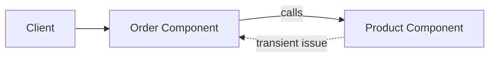

### The Answer: Cost of Redundant Work

For each incoming API call, a service typically performs **heavy processing** — and that processing is **not free**. It consumes memory, time, and compute resources.

Consider this scenario:

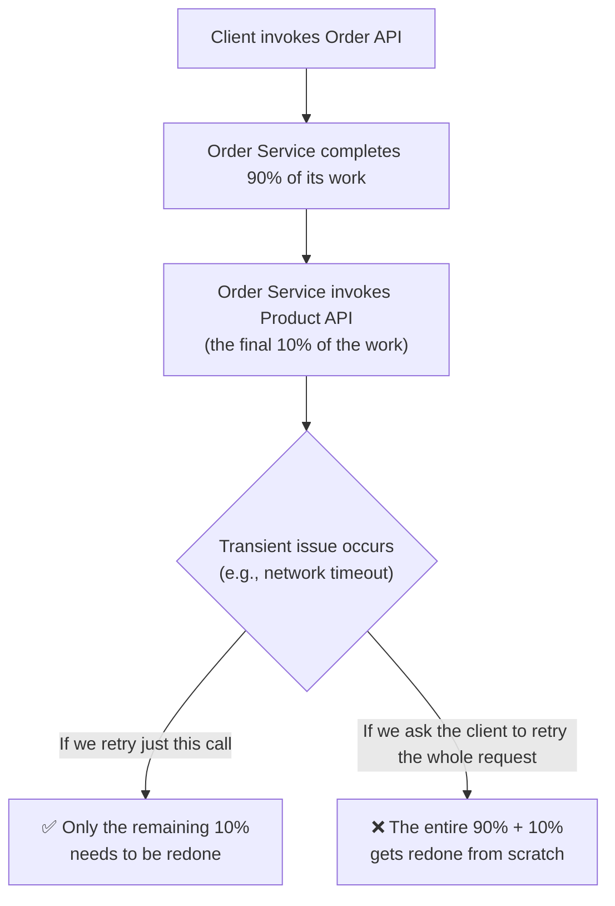

If the **system itself** retries just the failed downstream call, only the remaining (uncompleted) portion of work needs to be redone. But if the **client** is instead asked to resubmit the entire original request, the **already-completed 90% of processing gets thrown away and redone entirely** — a pure waste of resources.

> [!IMPORTANT]
> This waste compounds dramatically at scale: if there are 100 clients (or thousands of concurrent calls) all hitting this same API, and each one has to redo its already-completed 90% of work due to a downstream transient failure, the aggregate wasted capacity across the system becomes very significant. This is precisely why retry logic belongs **inside** the system itself, close to the point of failure, rather than being pushed back onto the client.

---

## When to Retry — Core Rules

Knowing that retry is valuable doesn't answer the harder question: **when exactly should a retry actually be attempted?** There are several critical rules.

### Rule 1 — Do NOT Retry on Permanent Failures

A **permanent failure** is one that will **always fail**, no matter how many times it is retried. The classic example is a **4xx error**, which generally falls into the category of a **validation error** — the client's input request itself is incorrect. Unless the client changes the input, retrying with the exact same request will simply reproduce the same validation error every time.

> [!WARNING]
> Retrying a request that failed due to a genuine input validation problem (4xx) is pointless — it wastes resources reproducing an error that cannot be resolved without the client changing something about the request itself.

### Rule 2 — Do NOT Retry if the Operation Is Non-Idempotent

Covered in full detail in the next section — retrying a non-idempotent operation risks creating **duplicate resources**.

### Rule 3 — Rule of Thumb: Retry Only on 5xx Errors

A **5xx error** indicates a **system error** — the client's input request was fine (it passed all validation), but something went wrong on the system/server side. Since:

- The input request itself is known to be correct (no validation issue), and
- The previous request is confirmed to have been unsuccessful,

...it is generally **safe** to retry on 5xx errors, since there's a reasonable chance the underlying system issue might resolve itself (e.g., a transient overload, a temporary downstream outage) by the time the retry executes.

### Rule 4 — Retry Network Errors and Timeouts (With Idempotency Caveat)

Network errors and timeout errors should generally be retried — but **only if the API being called supports idempotency** (see next section for why).

---

## Idempotency and Retry

> [!IMPORTANT]
> **Idempotency** ensures that if a request is retried multiple times, **duplicate processing does not happen** as a result.

### Why This Matters — A Worked Example

Consider Service A invoking a `create` API on Service B:

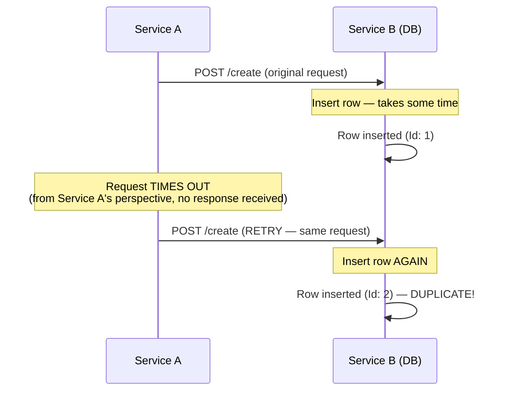

- Service A's request to Service B **times out** from Service A's point of view — but internally, Service B **did** successfully insert the row into its database before the timeout occurred on Service A's side.
- Because Service A perceived a failure (timeout), it retries — and Service B, having no way to recognize this as "the same request as before," simply performs the create operation **again**, inserting a **second, duplicate row** (`Id: 2`) for what was semantically a single logical request.

> [!WARNING]
> This is the core danger of retrying non-idempotent operations: the operation itself (in this case, Service B's `create` API) is **not idempotent** — calling it multiple times with logically the same request does **not** produce the same end state as calling it once; instead, it produces duplicate side effects (duplicate database rows, in this example).

> [!TIP]
> Proper API design — for example, ensuring create operations accept a client-supplied idempotency key that the server can use to detect and safely ignore duplicate submissions — is what makes an operation safely retryable. This is covered in more depth in dedicated API design / high-level system design material, referenced under [Related Concepts](#related-concepts).

---

## HTTP Status Code Retry Decision Table

> [!NOTE]
> This is presented as an illustrative guide, not an exhaustive list — always evaluate retry-safety in the context of your specific API's actual behavior.

## HTTP Status Code Retry Decision Table

| HTTP Status Code | Meaning | Retry? | Reasoning |
|---|---|---|---|
| **200** | Success | ❌ No | Request already succeeded — nothing to retry. |
| **400** | Bad Request | ❌ No | Validation error — permanent failure; retrying with the same input always fails again. |
| **401** | Unauthorized | ❌ No | Validation/auth error — permanent failure until credentials change. |
| **403** | Forbidden | ❌ No | Validation/permission error — permanent failure. |
| **404** | Not Found | ❌ No | Validation-category error — permanent failure; the resource doesn't exist regardless of retries. |
| **429** | Too Many Requests | ✅ Yes (with delay) | Caused by rate limiting — retrying after a delay can succeed once the rate limit window resets. |
| **500** | Internal Server Error | ✅ Yes | System error — input was valid; retry may succeed if the transient system issue resolves. |
| **502** | Bad Gateway | ✅ Yes | System error — often transient upstream/gateway issue. |
| **503** | Service Unavailable | ✅ Yes | The service may have been temporarily down; retrying might succeed once it's back up. |
| **Network Error / Timeout** | Connectivity issue | ✅ Yes (if idempotent) | Likely transient — but only safe to retry if the operation is confirmed idempotent. |

---

## Types of Retry Strategies

There are four main retry strategies, differing in **how the delay between retry attempts is computed**.

---

### 1. Fixed Interval Retry

**Definition:** Retry after a **constant delay** — the same delay duration is used between every retry attempt.

**Example:** Total attempts = 4 (1 original call + 3 retries), fixed delay = 2 seconds.

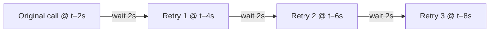

> [!TIP]
> **Advantage:** Very simple to implement, configure, and debug — the delay behavior is completely predictable.

> [!WARNING]
> **Disadvantage — Thundering Herd Problem (Retry Storm):** If many clients experience failures around the same time and all retry using the **same fixed delay**, they will all retry **simultaneously**, causing a surge of retry traffic that can overwhelm the system further — potentially causing it to spend all its resources handling retries instead of new incoming requests, and even causing **new** requests to be declined as a side effect.

#### Worked Thundering Herd Example

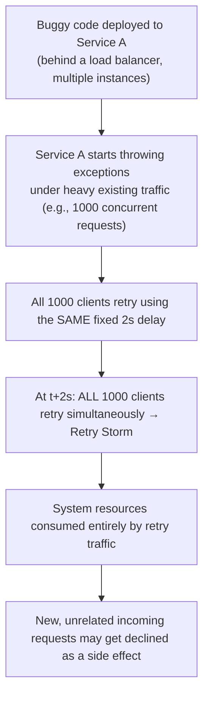

> [!NOTE]
> Thundering Herd Problem is a frequently asked interview topic in its own right, covered in more depth elsewhere in this series (see [Related Concepts](#related-concepts)).

---

### 2. Exponential Backoff

**Definition:** The delay between retries **increases exponentially** over time, rather than remaining fixed.

**Formula:**

```
delay = base_delay × (factor ^ number_of_failed_retry_attempts)
```

**Example:** `base_delay = 100ms`, `factor = 2`, total attempts = 4 (1 original + 3 retries).

| Attempt | Failed Attempts So Far | Formula | Delay |
|---|---|---|---|
| Original call | — | — | occurs at t = 0ms |
| Retry 1 | 0 | `100 × 2^0` | 100ms → occurs at t = 100ms |
| Retry 2 | 1 | `100 × 2^1` | 200ms → occurs at t = 300ms |
| Retry 3 | 2 | `100 × 2^2` | 400ms → occurs at t = 700ms |


> [!TIP]
> **Advantages:**
> - Reduces load on a struggling downstream service during an outage, giving it "breathing room" to recover instead of piling on immediate retry traffic on top of its existing load.
> - Reduces the Thundering Herd problem **to some extent**, since retries are no longer all clustered at the same fixed interval.

> [!WARNING]
> **Disadvantages:**
> - **Thundering Herd is only partially mitigated, not eliminated:** if all clients use the exact same `base_delay` and `factor` values with no randomness, they will still end up retrying at the exact same computed times as each other.
> - **Added latency when the outage is actually short-lived:** if the underlying issue resolves quickly (e.g., within 500ms), but the next scheduled retry isn't due until 800ms (per the exponential formula), the caller still has to wait the full 800ms before the successful retry occurs — even though the problem was already fixed earlier.

---

### 3. Exponential Backoff + Jitter

**Definition:** Same exponential growth in delay as standard Exponential Backoff, but with an added **random component ("jitter")** to help avoid retry storms/thundering herd more effectively.

**Formula:**

```
delay = random(0, min(max_delay, base_delay × (factor ^ number_of_failed_retry_attempts)))
```

- `max_delay` is a **hard ceiling** — no matter how large the exponential formula's raw output grows, the delay will never exceed this configured maximum (e.g., 5 seconds).
- A **random value** is then chosen between `0` and the smaller of (`max_delay`, the exponential backoff formula's computed value) for that attempt.

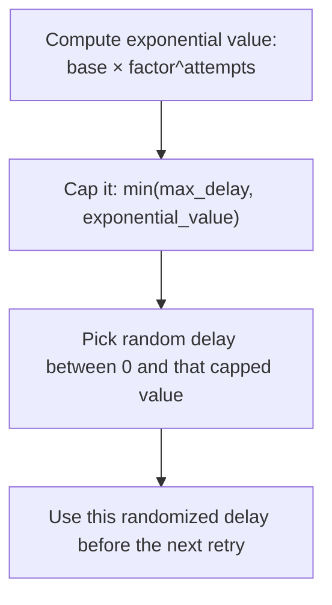

> [!TIP]
> **Advantage:** Because each client's actual delay is now randomized (rather than deterministic), retries get **spread out over time** instead of clustering at identical moments — significantly reducing peak load and the risk of thundering herd.

> [!WARNING]
> **Disadvantage:** The added randomness makes the system's retry timing **less predictable**, which makes it **more complex to reason about and harder to debug** compared to plain Fixed Interval or Exponential Backoff.

---

### 4. Custom Interval Retry

**Definition:** You define your own **fully custom retry delay logic** — for example, a Fibonacci-style sequence: wait 1ms, then 1ms, then 2ms, then 3ms, then 5ms, then 8ms, and so on.

> [!TIP]
> **Advantage:** Full control and flexibility — any delay pattern your business logic requires can be implemented.

> [!WARNING]
> **Disadvantage:** The framework provides **no built-in support** for your custom logic — you must write and maintain the delay-computation logic yourself, and you lose the convenience of simply declaring configuration properties (as covered in the next sections).

---

## Comparison Table of Retry Strategies

| Strategy | Delay Pattern | Thundering Herd Risk | Complexity | Best Used When |
|---|---|---|---|---|
| **Fixed Interval** | Constant delay every retry | High | Very Low | Simple use cases, low concurrent client volume |
| **Exponential Backoff** | Delay grows exponentially | Medium (reduced, not eliminated) | Low-Medium | Downstream service needs recovery time under load |
| **Exponential Backoff + Jitter** | Exponential + randomization | Low | Medium-High | High-concurrency systems where retry storms are a real risk |
| **Custom Interval** | Fully user-defined | Depends entirely on your logic | High (self-maintained) | Specialized retry patterns not covered by the built-in strategies |

---

## Spring Boot Implementation — Fixed Interval Retry

### Step 1 — Annotate the Method to Retry

```java
@Service
public class OrderService {

    @Autowired
    private ProductClient productClient;

    @Retry(name = "productService", fallbackMethod = "productServiceFallback")
    public String invokeProductApi() {
        try {
            return productClient.getProductById("1");
        } catch (Exception e) {
            throw new RuntimeException("Not able to invoke product API");
        }
    }

    public String productServiceFallback(Throwable throwable) {
        return "Product service is busy";
    }
}
```

> [!IMPORTANT]
> **Always place the `@Retry` annotation directly on the method containing only the specific logic you actually want retried.** If the annotated method also contains a lot of unrelated business logic, or a database call, **all of it** will get re-executed on every retry attempt — not just the downstream call you intended to protect. Double-check exactly what logic lives inside the annotated method, since all of it is subject to retry.

### Step 2 — Configuration (`application.properties`)

```properties
resilience4j.retry.instances.productService.max-attempts=3
resilience4j.retry.instances.productService.wait-duration=2s
```

### Configuration Breakdown

| Property | Meaning |
|---|---|
| `max-attempts` | Total number of attempts, **including** the original call. Here, `3` means 1 original call + 2 retries. |
| `wait-duration` | The fixed delay between attempts — here, `2` seconds. Values can also be specified in milliseconds (e.g., `500ms`) or other duration units. |

> [!NOTE]
> Since no retry **type** (fixed interval, exponential backoff, etc.) was explicitly specified in the configuration, Resilience4j defaults to **Fixed Interval** retry.

### Observed Output

```
20:56:10 → Original call: Not able to invoke product API
[wait 2s]
20:56:12 → Retry 1: Not able to invoke product API
[wait 2s]
20:56:14 → Retry 2: Not able to invoke product API
→ All retries exhausted → Fallback: "Product service is busy"
```

The fixed 2-second gap between each attempt is clearly visible in the timestamps, confirming the constant-delay behavior of Fixed Interval retry.

---

## Spring Boot Implementation — Exponential Backoff

### Configuration

```properties
resilience4j.retry.instances.productService.max-attempts=4
resilience4j.retry.instances.productService.wait-duration=1s
resilience4j.retry.instances.productService.enable-exponential-backoff=true
resilience4j.retry.instances.productService.exponential-backoff-multiplier=2
```

### Configuration Breakdown

| Property | Meaning |
|---|---|
| `max-attempts=4` | 1 original call + 3 retries. |
| `wait-duration=1s` | The **initial** wait time (used as the base delay in the exponential formula) — here, 1 second (1000ms). |
| `enable-exponential-backoff=true` | Explicitly enables exponential backoff, since it is **not** the default retry strategy. |
| `exponential-backoff-multiplier=2` | The multiplication factor used in the exponential formula — here, `2`, meaning the delay is based on `2` raised to increasing powers. |

### Computed Delays

Using the formula `delay = initial_wait × multiplier^(retry_iteration - 1)`:

| Attempt | Delay Computation | Delay | Occurs At (relative) |
|---|---|---|---|
| Original call | — | — | t = 0s |
| Retry 1 | `1000ms × 2^0` | 1s | t = 1s |
| Retry 2 | `1000ms × 2^1` | 2s | t = 3s |
| Retry 3 | `1000ms × 2^2` | 4s | t = 7s |

### Observed Output

```
21:22:40 → Original call
[wait 1s]
21:22:41 → Retry 1
[wait 2s]
21:22:43 → Retry 2
[wait 4s]
21:22:47 → Retry 3
→ All 4 attempts exhausted → Fallback executed
```

The growing gaps between timestamps (1s, then 2s, then 4s) confirm the exponential growth in delay.

> [!NOTE]
> Internally, Resilience4j's own framework class handling this logic (referred to as something like a `Backoff` implementation class) implements exactly this same formula: `initial_wait_time × factor^(number_of_failed_retry_attempts)`.

---

## Spring Boot Implementation — Exponential Backoff + Jitter

### Configuration

```properties
resilience4j.retry.instances.productService.max-attempts=4
resilience4j.retry.instances.productService.wait-duration=1s
resilience4j.retry.instances.productService.enable-exponential-backoff=true
resilience4j.retry.instances.productService.exponential-backoff-multiplier=2
resilience4j.retry.instances.productService.enable-randomized-wait=true
```

> [!NOTE]
> This configuration is **identical** to the plain Exponential Backoff configuration, with exactly **one** additional property: `enable-randomized-wait=true`. This single flag is what tells Resilience4j to compute delays using its **randomized backoff** method internally, rather than the plain (non-randomized) exponential backoff method — adding the jitter/randomness behavior described earlier.

---

## Internal Working — How AOP Builds the Retry Object

> [!NOTE]
> Resilience4j's `@Retry` annotation, like `@RateLimiter`, relies entirely on **AOP** to work — specifically, AOP **generates proxy code at runtime**. Because this code is generated dynamically, it cannot be directly stepped through in a debugger. The explanation below describes, conceptually, what that generated code is understood to be doing internally — it is for understanding purposes, not something you can literally inspect line-by-line in your own codebase.

The retry mechanism internally revolves around **three conceptual parts**:

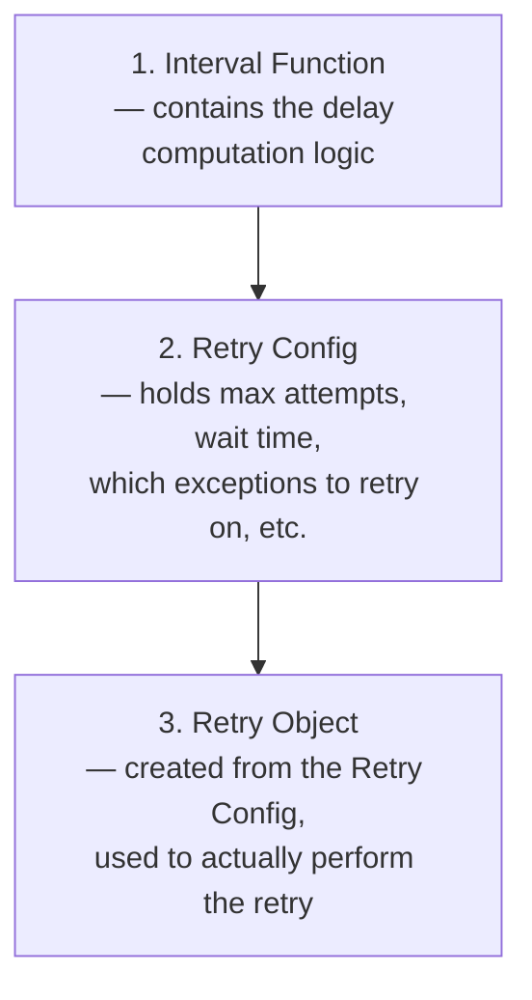

### 1. Interval Function

This is the component responsible for computing the **delay logic** between attempts. Resilience4j ships with a framework class (an "Interval Function" class) containing multiple pre-built methods:

- One method for **fixed delay** computation (`IntervalFunction.of(...)`).
- One method for **exponential backoff** computation (`IntervalFunction.ofExponentialBackoff(...)`).
- One method for **exponential backoff with jitter/randomness**.

You generally do **not** need to implement this yourself unless you're writing fully custom retry logic (covered in the next section) — you simply reference the appropriate built-in method, and the framework computes delays for you.

### 2. Retry Config

This is where configuration values are set — maximum attempt count, which interval function to use, and which exceptions should trigger a retry.

Conceptually, the generated AOP code performs something equivalent to:

```java
RetryConfig config = RetryConfig.custom()
        .maxAttempts(3)                                   // from configuration
        .intervalFunction(IntervalFunction.of(2000))      // fixed 2s delay, from configuration
        .retryExceptions(SomeException.class)             // which exceptions to retry on
        .build();
```

### 3. Retry Object

From the built `RetryConfig`, an actual `Retry` object is created — this is the object that will actually be used to perform the retry logic against your annotated method.

```java
Retry retry = Retry.of("productService", config);
```

### How It All Connects

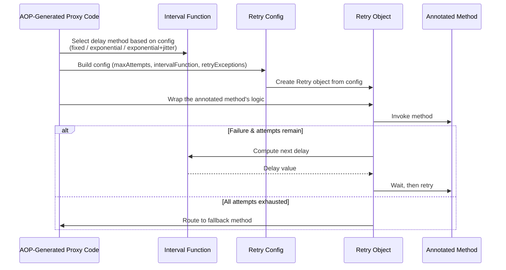

- AOP determines **which interval function method to use** based on the explicit configuration provided (defaulting to fixed interval if nothing else is specified).
- It builds a `RetryConfig` using the `max-attempts`, `wait-duration`, and any configured retryable exceptions.
- It creates a `Retry` object from that config.
- It then **wraps** the logic inside your `@Retry`-annotated method using that `Retry` object, so that failures automatically trigger delay computation and re-invocation, up to the configured maximum attempts — after which the fallback method is invoked instead.

---

## Custom Retry — Manual Implementation

> [!IMPORTANT]
> Since `@Retry` internally depends on **configuration** (`application.properties`) to build its `RetryConfig` and `Retry` object, you **cannot** use the `@Retry` annotation for a fully custom retry strategy that has no fixed configuration values (like a Fibonacci-based delay sequence). Instead, you must **manually** construct the `Retry` object yourself, following the exact same three-part structure AOP would otherwise build for you automatically.

### Step 1 — Define Your Custom Interval Function

```java
@Configuration
public class RetryConfiguration {

    @Bean
    public Retry customRetry() {

        IntervalFunction fibonacciInterval = attempt -> {
            // Simplified for demonstration purposes —
            // returns the delay (in milliseconds) to wait before the given retry attempt
            return 2000L; // hardcoded here for demo simplicity
        };

        RetryConfig retryConfig = RetryConfig.custom()
                .maxAttempts(6)
                .intervalFunction(fibonacciInterval)
                .retryExceptions(RuntimeException.class)
                .build();

        return Retry.of("customProductServiceRetry", retryConfig);
    }
}
```

### Syntax Breakdown

| Element | Meaning |
|---|---|
| `IntervalFunction fibonacciInterval = attempt -> {...}` | A custom lambda implementing your own delay-computation logic. In a full Fibonacci implementation, this would compute delays following a Fibonacci-like sequence (1ms, 1ms, 2ms, 3ms, 5ms, 8ms...); the demonstration version here simply hardcodes a fixed 2000ms delay for simplicity. |
| `RetryConfig.custom()` | Begins building a custom retry configuration, exactly analogous to what AOP would otherwise construct automatically from `application.properties`. |
| `.maxAttempts(6)` | Total attempts — here, 1 original call + 5 retries. |
| `.intervalFunction(fibonacciInterval)` | Registers your custom delay logic to be used between attempts. |
| `.retryExceptions(RuntimeException.class)` | Specifies which exception types should trigger a retry. |
| `Retry.of("customProductServiceRetry", retryConfig)` | Creates the actual `Retry` object from the built configuration, given a chosen name. |

### Step 2 — Manually Wrap Your Retryable Logic

Since `@Retry` cannot be used here, the method to be retried must be manually wrapped using the created `Retry` bean:

```java
@Service
public class OrderService {

    @Autowired
    private ProductClient productClient;

    @Autowired
    private Retry customProductServiceRetry;

    public String invokeProductApi() {
        Supplier<String> retryableSupplier = Retry.decorateSupplier(
                customProductServiceRetry,
                () -> {
                    System.out.println("Calling product service at " + Instant.now());
                    return productClient.getProductById("1");
                }
        );

        try {
            return retryableSupplier.get();
        } catch (Exception e) {
            return "All retries failed. This is fallback.";
        }
    }
}
```

### Syntax Breakdown

| Element | Meaning |
|---|---|
| `@Autowired private Retry customProductServiceRetry;` | Injects the manually-created `Retry` bean via dependency injection — the same bean object AOP would otherwise have created and used internally. |
| `Retry.decorateSupplier(retry, supplier)` | Wraps ("decorates") a piece of code — here, the actual call to `productClient.getProductById(...)` — inside the given `Retry` object, so that failures automatically trigger retry logic according to the retry object's configuration. |
| `() -> { ... }` | The functional `Supplier` lambda representing exactly the logic you want retried — in this case, the downstream product service call. |
| `retryableSupplier.get()` | Actually executes the wrapped, retry-enabled logic. If it fails and attempts remain, the `Retry` object automatically computes the next delay (via your custom interval function), waits, and retries. |
| `catch (Exception e) { return "All retries failed..."; }` | Once all configured attempts are exhausted, this manually-written catch block serves the same purpose as a `fallbackMethod` would in the annotation-based approach. |

> [!TIP]
> Writing this manual version makes explicit exactly what the `@Retry` annotation's AOP machinery is doing behind the scenes: (1) build an `Interval Function`, (2) build a `Retry Config`, (3) create a `Retry` object from that config, and (4) wrap the target logic inside that `Retry` object so failures trigger automatic retry behavior.

### Observed Output

Since the demonstration interval function is hardcoded to always return a 2000ms delay:

```
Calling product service at 22:35:45
[wait 2s]
Calling product service at 22:35:47
[wait 2s]
Calling product service at 22:35:49
[wait 2s]
Calling product service at 22:35:50   (approx.)
... (continues for all 6 attempts) ...
→ All retries failed. This is fallback.
```

> [!NOTE]
> If a genuine Fibonacci-style interval function had been implemented instead of the simplified hardcoded version, the delays between attempts would instead follow a pattern like: 1s, 1s, 2s, 3s, 5s, 8s — growing according to the Fibonacci sequence rather than remaining constant.

---

## Execution Walkthrough (Observed Behavior)

### Fixed Interval Example (`max-attempts=3`, `wait-duration=2s`)

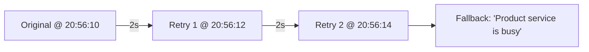

### Exponential Backoff Example (`max-attempts=4`, `wait-duration=1s`, `multiplier=2`)


### Custom Retry Example (`max-attempts=6`, hardcoded 2s delay)

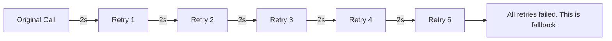

---

## Memory Representation

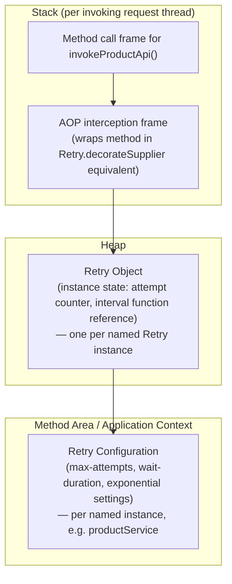

- The **Retry Configuration** (max attempts, wait duration, exponential settings) is read once and lives at the application/context level, similar in spirit to the Method Area's shared, relatively static data.
- The **Retry object** itself — tracking things like the interval function to use — lives on the **heap**, shared across invocations of the same named retry instance.
- Each invoking thread has its own **stack frame** for the method call and the AOP interception logic, but all such threads interact with the same shared `Retry` object configuration when determining delay behavior.

---

## Common Mistakes

> [!WARNING]
> **Mistake 1: Retrying non-idempotent operations.**
> This can silently create duplicate resources (e.g., duplicate database rows), as demonstrated in the Service A / Service B example — a genuinely dangerous and hard-to-detect class of bug.

> [!WARNING]
> **Mistake 2: Retrying on 4xx validation errors.**
> Since these are permanent failures caused by bad input, retrying wastes resources reproducing the same failure every time, with zero chance of success unless the input itself changes.

> [!WARNING]
> **Mistake 3: Annotating a method that contains more logic than intended to be retried.**
> `@Retry` retries the **entire** annotated method's logic — if that method also includes unrelated business logic or database writes beyond the specific downstream call you meant to protect, all of that extra logic gets re-executed on every retry attempt too.

> [!WARNING]
> **Mistake 4: Using Fixed Interval retry at scale without considering Thundering Herd risk.**
> If many clients experience failures simultaneously and all retry using the same fixed delay, the resulting retry storm can overwhelm the system further, potentially causing new, unrelated requests to be declined as collateral damage.

> [!WARNING]
> **Mistake 5: Assuming plain Exponential Backoff fully eliminates Thundering Herd.**
> Without added randomness (jitter), clients using identical `base_delay` and `factor` values will still retry at the exact same computed moments as each other — Exponential Backoff alone only reduces, but does not eliminate, this risk.

---

## Best Practices

- ✅ Only retry on failures known to be **transient** and **safe to repeat** — primarily 5xx system errors, and network/timeout errors where idempotency is confirmed.
- ✅ Never retry on 4xx validation errors — they represent permanent failures that retries cannot fix.
- ✅ Confirm an operation is **idempotent** before enabling retry on it, to avoid duplicate resource creation.
- ✅ Place `@Retry` (and similarly scoped annotations) only around the **specific** logic you intend to retry — keep unrelated business logic and database writes out of the annotated method.
- ✅ Prefer **Exponential Backoff with Jitter** for production systems with meaningful concurrent client volume, since it best balances reduced downstream load with mitigated thundering herd risk.
- ✅ Set a sensible `max_delay` ceiling when using exponential-style strategies, to avoid unbounded wait times for later retry attempts.
- ✅ Reserve fully **custom** retry logic for genuinely specialized cases — the lecture's own experience notes that Exponential Backoff with Jitter is typically sufficient for the vast majority of real-world use cases.

---

## Interview Notes

> [!IMPORTANT]
> Frequently probed concepts around Retry.

1. **"Why implement retry in the system itself instead of letting the client retry?"**
   Because a significant portion of processing may already be complete by the time a downstream transient failure occurs; retrying just the failed step avoids redoing already-completed work, which becomes a substantial resource savings at scale across many concurrent clients.

2. **"When should you NOT retry?"**
   On permanent failures (4xx validation errors) and on non-idempotent operations, since retries in both cases either waste resources reproducing an unfixable error, or risk creating duplicate resources/side effects.

3. **"What does idempotency mean in the context of retry, and why does it matter?"**
   Idempotency ensures that retrying a request multiple times does not cause duplicate processing/side effects. Without it, a retried `create` operation, for example, could insert duplicate database rows for what was semantically a single logical request.

4. **"What is the Thundering Herd Problem, and how do different retry strategies address it?"**
   It occurs when many clients retry simultaneously, overwhelming the system with retry traffic. Fixed Interval retry has the highest risk (all clients retry at identical fixed delays). Exponential Backoff reduces but doesn't eliminate the risk (still deterministic, so identical configs cluster). Exponential Backoff with Jitter adds randomness, spreading retries out and substantially reducing this risk.

5. **"What's the formula for Exponential Backoff?"**
   `delay = base_delay × (factor ^ number_of_failed_retry_attempts)`.

6. **"What's the formula for Exponential Backoff with Jitter?"**
   `delay = random(0, min(max_delay, base_delay × (factor ^ number_of_failed_retry_attempts)))`.

7. **"How does `@Retry` work internally?"**
   Through AOP-generated proxy code that builds three components: an **Interval Function** (delay computation logic), a **Retry Config** (max attempts, exceptions to retry on, which interval function to use), and a **Retry object** (created from the config) — which then wraps the annotated method so that failures trigger automatic delay-and-retry behavior, up to the configured maximum attempts, after which the fallback method runs.

8. **"Why can't you use the `@Retry` annotation for a fully custom retry strategy?"**
   Because `@Retry` depends on declarative configuration (from `application.properties`) to construct its `RetryConfig` and `Retry` object internally. A fully custom strategy (e.g., Fibonacci-based delays) has no such fixed configuration to declare, so you must manually build the `Retry` object yourself and explicitly wrap your retryable logic using something like `Retry.decorateSupplier(...)`.

9. **"What HTTP status codes are generally safe to retry, and which are not?"**
   Safe: 429 (with delay), 500, 502, 503, and network/timeout errors (if idempotent). Not safe: 400, 401, 403, 404 — all validation-category permanent failures.

---

## Related Concepts

- **Rate Limiter, Bulkhead, Time Limiter, Circuit Breaker** — The other four Resilience4j mechanisms; Retry is placed last in the recommended logical ordering, after all of these.
- **Thundering Herd Problem** — A broader distributed-systems concept covered in more depth elsewhere in this series; directly relevant to why Fixed Interval retry is risky at scale, and why jitter is introduced.
- **Idempotency & API Design** — Covered in depth in dedicated high-level system design material; essential prerequisite knowledge for deciding whether an operation is safe to retry.
- **AOP (Aspect-Oriented Programming)** — The underlying mechanism powering `@Retry` (and `@RateLimiter`) via dynamically generated proxy code at runtime.
- **HTTP Status Codes (4xx vs 5xx)** — The foundational classification used throughout this guide's retry decision rules.
- **Circuit Breaker** — Closely related to Retry; a circuit breaker can prevent retries from even being attempted against a service that is currently known to be failing repeatedly, complementing retry logic.

---

## Practice Questions

### Easy

1. What does it mean for a failure to be "transient," and why does this matter for retry?
2. Name the four retry strategies covered in this guide.
3. What does `max-attempts` represent — does it include the original call?

### Medium

4. Explain why retrying a non-idempotent `create` operation can result in duplicate database rows, using the Service A / Service B example.
5. Compare Fixed Interval and Exponential Backoff in terms of Thundering Herd risk and latency behavior when an outage resolves quickly.
6. Why must `@Retry`'s annotated method be scoped carefully — what happens if it contains more logic than just the intended downstream call?

### Hard

7. Derive, step by step, the exact delay values for the first three retries under Exponential Backoff with `base_delay = 200ms` and `factor = 3`.
8. Explain, using AOP terminology (Interval Function, Retry Config, Retry Object), exactly what components are built internally when a method is annotated with `@Retry`, and describe why this same structure must be built manually for a fully custom retry strategy.
9. Design (conceptually) a custom Fibonacci-based `IntervalFunction` for a Resilience4j `Retry` object — what state would it need to track between calls to correctly return 1ms, 1ms, 2ms, 3ms, 5ms, 8ms on successive invocations?

---

## Summary

- **Retry** automatically re-attempts a failed downstream call to recover from **transient** issues, and belongs **last** in the recommended Resilience4j ordering (Rate Limiter → Bulkhead → Time Limiter → Circuit Breaker → Retry).
- Retry logic belongs in the **system itself**, not pushed back onto the client, because significant processing work may already be complete by the time a downstream failure occurs — retrying just the failed step avoids wastefully redoing that completed work.
- **Do not retry** on permanent failures (4xx validation errors) or on **non-idempotent** operations, since the former wastes resources on an unfixable error and the latter risks creating duplicate resources/side effects.
- As a rule of thumb, **retry on 5xx system errors**, and on network/timeout errors **only if the operation is confirmed idempotent**.
- Four retry strategies exist: **Fixed Interval** (simple, but high Thundering Herd risk), **Exponential Backoff** (delay grows exponentially, reduces but doesn't eliminate Thundering Herd risk), **Exponential Backoff + Jitter** (adds randomness, best mitigates Thundering Herd, but harder to debug), and **Custom Interval** (fully user-defined logic, full control but no framework support).
- In Spring Boot, `@Retry(name=..., fallbackMethod=...)` is configured via `application.properties` (`max-attempts`, `wait-duration`, `enable-exponential-backoff`, `exponential-backoff-multiplier`, `enable-randomized-wait`), and — like `@RateLimiter` — is implemented entirely through **AOP-generated proxy code** at runtime, built from three conceptual parts: an **Interval Function**, a **Retry Config**, and a **Retry Object**.
- For fully custom retry logic that has no declarative configuration to rely on, the `@Retry` annotation cannot be used — instead, you must manually build the `Retry` object (interval function + config) yourself and explicitly wrap your target logic using something like `Retry.decorateSupplier(...)`.
- Always place retry annotations **narrowly**, around only the specific logic intended to be retried — since the entire annotated method's contents are subject to re-execution on every retry attempt.
