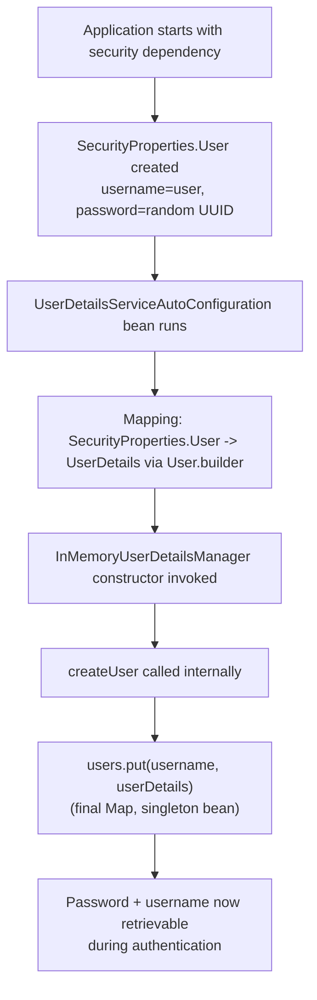
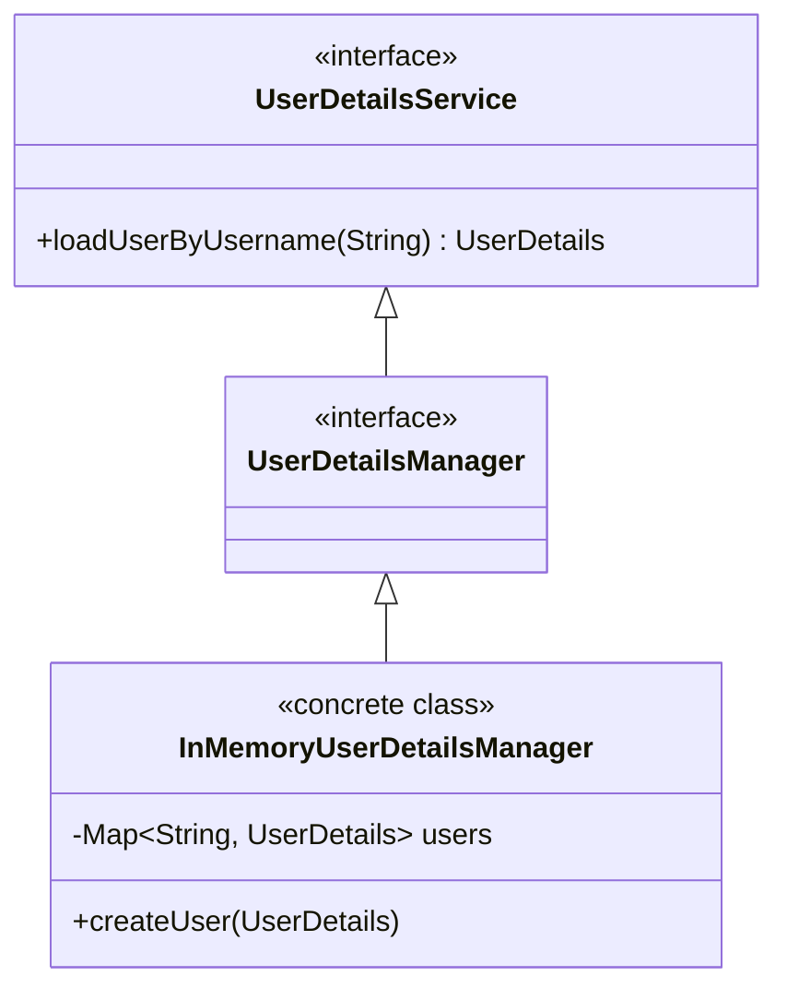
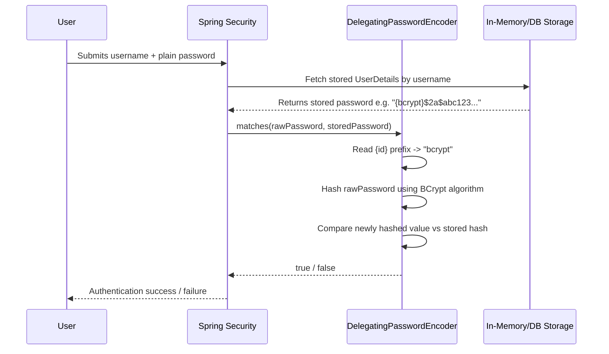
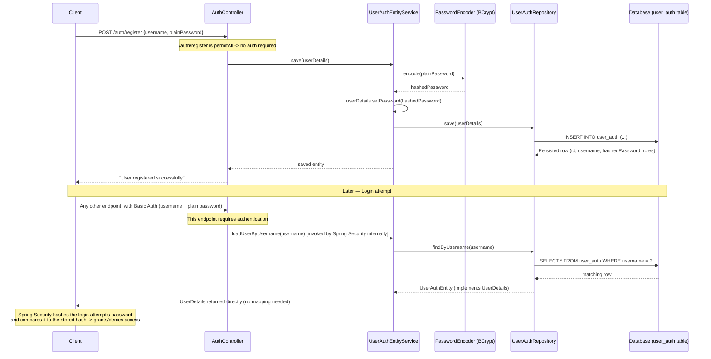
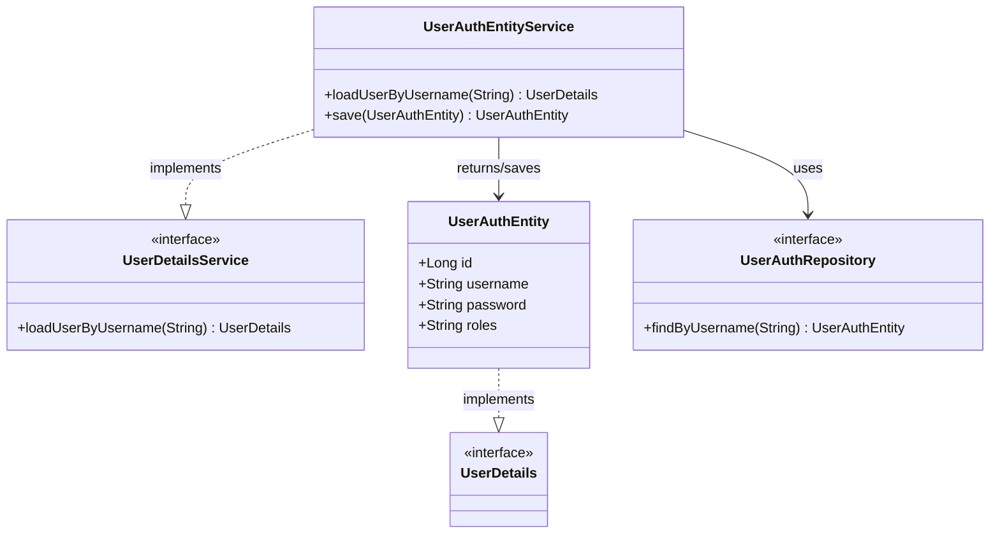

# Spring Boot Security — Part 2: User Creation Approaches

> A complete study guide covering the default auto-generated user, the `application.properties` approach, custom in-memory user creation, password encoding internals (`NoOpPasswordEncoder`, `BCryptPasswordEncoder`, `DelegatingPasswordEncoder`), and the production-grade database-backed approach using `UserDetails`, `UserDetailsService`, and Spring Data JPA.

---

## Table of Contents

1. [Why User Creation Comes Before Authentication](#-why-user-creation-comes-before-authentication)
2. [The Default Auto-Generated User](#-the-default-auto-generated-user)
3. [Approach 1: `application.properties`](#-approach-1-applicationproperties)
4. [Approach 2: Custom In-Memory `UserDetailsManager` Bean](#-approach-2-custom-in-memory-userdetailsmanager-bean)
5. [Password Encoding Deep Dive](#-password-encoding-deep-dive)
6. [Approach 3: Database-Backed User Creation (Production Approach)](#-approach-3-database-backed-user-creation-production-approach)
7. [Final Comparison Tables](#-final-comparison-tables)
8. [Practice Questions](#-practice-questions-overall)
9. [Overall Summary](#-overall-summary-revision-bullets)

---

# 📌 Why User Creation Comes Before Authentication

## Overview

Before studying any authentication method (form login, basic authentication, JWT, OAuth), it is essential to first understand **how a user is created** in a Spring Security application — since authentication and authorization can only happen *after* a user already exists to authenticate against.

## Why This Concept Exists

Authentication is fundamentally the process of verifying that a set of provided credentials (username/password, token, etc.) matches a **known, previously created** user. Without a user creation step, there would be nothing for any authentication mechanism to check against. This makes user creation the logical first building block, before diving into specific authentication schemes.

## Key Observations

- Authentication and authorization of a user happen **only after** that user has already been created.
- This session (Part 2) focuses exclusively on the different ways a user can be created in a Spring Boot Security application, ranging from the default automatic behavior up to a production-grade database-backed approach.

## Related Concepts

- Form login, Basic Authentication, JWT, OAuth (the authentication methods that will be covered in subsequent sessions, once user creation is understood)

---

# 📌 The Default Auto-Generated User

## Overview

When the `spring-boot-starter-security` dependency is added to a project with no further configuration, Spring Boot Security **automatically creates a default user** at application startup, with a fixed username and a randomly generated password.

## Why This Concept Exists

Spring Boot aims to provide **sensible, working-out-of-the-box defaults**. Since some form of authenticated user is required for the security filters to function meaningfully, Spring Boot auto-generates a default user purely so that a freshly bootstrapped application is immediately secured and testable, without requiring any manual configuration.

## Internal Working

### Step 1 — Startup Log Observations

When you add the security dependency and start the application with no further configuration, the startup logs reveal two important facts:

1. A message like **"Using generated security password"**, followed by the actual randomly generated password value.
2. A message indicating that Spring Boot is **"Using in-memory user detail manager"**.

> [!NOTE]
> A **new random password is generated every time the server is restarted** — this password is not persisted or reused across restarts.

### Step 2 — Where the Default User Comes From (`SecurityProperties.java`)

Internally, Spring Boot's `SecurityProperties` class contains a static nested `User` class, which defines:

| Field | Default Value |
|---|---|
| Username | `user` |
| Password | A randomly generated UUID (Universally Unique Identifier) |
| Roles | Empty |

### Step 3 — `UserDetailsServiceAutoConfiguration` and `InMemoryUserDetailsManager`

There is an auto-configuration class (`UserDetailsServiceAutoConfiguration`) that defines a **bean** which creates an object of `InMemoryUserDetailsManager`. This bean's job is to actually **store** the default user (the username `user` and its randomly generated password) somewhere in memory, so it can later be retrieved during authentication.

### Step 4 — The Mapping Process

The `InMemoryUserDetailsManager` constructor accepts `UserDetails` objects (`UserDetails` is an **interface**, and its concrete implementation used here is Spring Security's `User` class — not to be confused with the developer's own domain "User" concept).

Internally, the process is:

1. `SecurityProperties.User` (holding the default username, password, and roles) is read.
2. This data is **mapped** into a `User.builder()`-style object: `username(...)`, `password(...)`, `roles(...)`, then `.build()` — producing a `UserDetails` object.
3. This `UserDetails` object is passed into the constructor of `InMemoryUserDetailsManager`.
4. Inside that constructor, a method called `createUser(...)` is invoked.

### Step 5 — Storing the User: The `users` Map

Inside `createUser(...)`, the manager does something conceptually equivalent to:

```java
users.put(username, userDetails);
```

- The `users` map is declared as **`final`** within `InMemoryUserDetailsManager`.
- Since Spring beans are **singletons by default**, only **one** instance of `InMemoryUserDetailsManager` (and therefore only one `users` map) exists for the entire application.
- This means **all requests share the same in-memory `users` map** — this is precisely what "in-memory user storage" means in this context: a single shared `Map` living in the JVM's heap memory for the lifetime of the running application, not backed by any persistent database.

## Diagram — Default User Creation Flow



## Memory Representation

The `users` map inside `InMemoryUserDetailsManager` lives on the **heap**, as a field of a **singleton bean** — meaning exactly one instance of this map exists for the entire application's lifetime (until restart), and it is shared across every incoming request. There is no persistence to disk or a database; restarting the application discards this map entirely and a fresh default user (with a new random password) is generated again.

## Key Observations

- The default username is always `user`.
- The default password is a **freshly randomly generated UUID on every server restart** — never reused.
- The default role is empty.
- This entire mechanism relies on Spring Boot's auto-configuration (`UserDetailsServiceAutoConfiguration`) and the `InMemoryUserDetailsManager` bean, which stores credentials purely in a heap-resident `Map`.

## Common Mistakes

> [!WARNING]
> Relying on this auto-generated default user beyond initial testing is a common beginner trap — since the password changes on every restart and is not controllable, it is entirely unsuitable for any real development workflow beyond a first "hello world" security check, let alone production.

## Best Practices

- Treat the default auto-generated user purely as a signal that "security is active" immediately after adding the dependency — move to one of the controlled approaches (below) as soon as you need a stable username/password for actual development or testing.

## Interview Notes

- **Q: What happens if you add the Spring Security dependency with zero configuration?** Spring Boot auto-generates a default user with username `user` and a randomly generated UUID password, printed to the console logs at startup, and stores it via an `InMemoryUserDetailsManager` bean.
- **Q: Does the default password stay the same across restarts?** No — a new random password is generated every time the server restarts.
- **Q: Where does this default user actually get stored?** In memory, inside a `final Map` field of the singleton `InMemoryUserDetailsManager` bean — not in any database.

## Related Concepts

- [Approach 1: `application.properties`](#-approach-1-applicationproperties)
- [Approach 2: Custom In-Memory `UserDetailsManager` Bean](#-approach-2-custom-in-memory-userdetailsmanager-bean)
- Singleton-scoped Spring beans

## Practice Questions

**Easy:** What is the default username Spring Boot Security auto-generates?

**Medium:** Why does the default password change every time the server restarts?

**Hard:** Trace the full internal flow — from `SecurityProperties.User` through to the `users` map inside `InMemoryUserDetailsManager` — explaining each mapping step along the way.

## Summary

- Adding the security dependency with no configuration auto-creates a default user: username `user`, random UUID password, printed in logs.
- Internally: `SecurityProperties.User` → mapped into a `UserDetails` object via `User.builder()` → passed into `InMemoryUserDetailsManager`'s constructor → stored via `createUser()` into a `final`, singleton-scoped `users` map (heap memory, not persisted).
- This behavior is only suitable for the most superficial initial testing — not for real development or production.

---

# 📌 Approach 1: `application.properties`

## Overview

The first controllable approach to defining a custom user is setting the username, password, and roles directly as properties in `application.properties` (or `application.yml`).

## Why This Concept Exists

Relying on a randomly generated password every restart is impractical even for basic development. `application.properties` offers the simplest possible way to pin down a **fixed, known** username and password for quick testing, without having to write any additional Java configuration code.

## Definition

Spring Boot exposes three properties that let you override the default `SecurityProperties.User` values:

```properties
spring.security.user.name=my_username
spring.security.user.password=my_password
spring.security.user.roles=USER
```

## Syntax Breakdown

| Property | Purpose |
|---|---|
| `spring.security.user.name` | Overrides the default username (`user`) with your chosen value. |
| `spring.security.user.password` | Overrides the randomly generated default password with your chosen value. |
| `spring.security.user.roles` | Overrides the default (empty) roles with your chosen role(s). |

## Internal Working

Internally, Spring Boot uses **reflection** to call the setter methods (`setUsername(...)`, `setPassword(...)`, `setRoles(...)`) on the `SecurityProperties.User` object, overriding its default field values with whatever is specified in `application.properties`. Since `SecurityProperties.User` exposes standard getters and setters for `name`, `password`, and `roles`, Spring Boot's property-binding mechanism (which relies on reflection to match property keys to bean setters) is able to populate these fields directly from the configuration file — bypassing the default random-UUID generation entirely.

## Step-by-Step Execution

1. You add the three properties above to `application.properties`.
2. On startup, Spring Boot's property binder uses reflection to invoke `setUsername(...)`, `setPassword(...)`, and `setRoles(...)` on the internal `SecurityProperties.User` instance, overriding the defaults.
3. When the server starts, **no** "using generated security password" log message appears — because the default random-password generation path is bypassed.
4. You can now log in using exactly the username and password you configured.

## Key Observations

- This approach only allows defining **one single user** — `application.properties` has no mechanism for defining multiple distinct user entries.
- The mechanism is powered by reflection-based property binding onto `SecurityProperties.User`'s existing setters.

## Common Mistakes

> [!WARNING]
> Storing a plain, unencrypted password directly in `application.properties` and treating this as production-ready. This approach is explicitly **not recommended** for production — it is only suitable for development and quick testing.

## Best Practices

- Use this approach only for quick local development/testing when you want a stable, memorable username and password rather than a random one on every restart.
- Never commit real/sensitive credentials via this property-based approach into version control, and never rely on it for production deployments.

## Interview Notes

- **Q: How does Spring Boot apply `spring.security.user.name`/`password` internally?** Via reflection, calling the corresponding setter methods on the internal `SecurityProperties.User` object, overriding its default (random) values.
- **Q: Can you define multiple users via `application.properties`?** No — this approach only supports a single, fixed user.

## Related Concepts

- [The Default Auto-Generated User](#-the-default-auto-generated-user) (this approach overrides its defaults)
- [Approach 2: Custom In-Memory `UserDetailsManager` Bean](#-approach-2-custom-in-memory-userdetailsmanager-bean) (needed when more than one user is required)

## Practice Questions

**Easy:** Which three properties let you override the default username, password, and roles?

**Medium:** How many distinct users can you configure using only `application.properties`?

**Hard:** Explain, mechanically, how Spring Boot turns a plain-text property like `spring.security.user.password=my_password` into an actual overridden value on the internal `SecurityProperties.User` object.

## Summary

- `spring.security.user.name`, `.password`, and `.roles` let you override the default auto-generated user with a fixed username/password/role.
- Internally implemented via reflection-based setter calls on `SecurityProperties.User`.
- Limited to exactly one user; explicitly **not recommended** for production — development/testing only.

---

# 📌 Approach 2: Custom In-Memory `UserDetailsManager` Bean

## Overview

To support **more than one user** — and to gain a deeper understanding of Spring Security's internal user-storage mechanism — you can take direct control by defining your own `UserDetailsService` (or more specifically, `InMemoryUserDetailsManager`) bean in a configuration class, manually constructing and passing in as many `UserDetails` objects as needed.

## Why This Concept Exists

`application.properties` can only define a single user. Real applications (even in early development/testing) often need multiple test users. By taking over the responsibility of creating the `InMemoryUserDetailsManager` bean yourself, you gain full control over exactly which users (and how many) get registered — and this exercise also reveals, in concrete code, how Spring Boot's own auto-configuration was doing this internally all along.

## Internal Working — The Class Hierarchy



- `UserDetailsService` is the top-level **parent interface**.
- `UserDetailsManager` extends `UserDetailsService`.
- `InMemoryUserDetailsManager` is a **concrete class** implementing `UserDetailsManager` — this is the class that can actually be instantiated and accept multiple `UserDetails` objects via its constructor (which accepts a varargs parameter).

> [!TIP]
> Even though you *could* declare your bean's return type as the concrete `InMemoryUserDetailsManager` class, it is generally recommended to declare the bean's return type as the **parent interface** `UserDetailsService` instead — this keeps your configuration decoupled from the specific concrete implementation, in line with good dependency-injection practice.

## Syntax

```java
@Configuration
public class SecurityConfig {

    @Bean
    public UserDetailsService userDetailsService() {
        UserDetails user1 = User.builder()
                .username("my_username")
                .password("{noop}password1")
                .roles("USER")
                .build();

        UserDetails user2 = User.builder()
                .username("my_username2")
                .password("{noop}1234")
                .roles("ADMIN")
                .build();

        return new InMemoryUserDetailsManager(user1, user2);
    }
}
```

## Syntax Breakdown

| Part | Meaning |
|---|---|
| `@Bean public UserDetailsService userDetailsService()` | Declares a bean whose return type is the parent interface `UserDetailsService`, taking over responsibility for supplying user details from Spring Boot's default auto-configuration. |
| `User.builder()` | The builder for Spring Security's concrete `User` class (an implementation of the `UserDetails` interface), used to construct individual user objects. |
| `.username(...)` / `.password(...)` / `.roles(...)` | Sets the corresponding fields on the `UserDetails` object being built. |
| `new InMemoryUserDetailsManager(user1, user2)` | The constructor accepts a **varargs** parameter (`UserDetails...`), so you can pass as many user objects as you need — this is what allows registering multiple users. |

## Step-by-Step Execution

1. Two (or more) `UserDetails` objects are built individually via `User.builder()`, each with its own username, password, and role(s).
2. These objects are passed into `new InMemoryUserDetailsManager(user1, user2)`.
3. Internally, `InMemoryUserDetailsManager`'s constructor calls `createUser(...)` for each supplied `UserDetails` object.
4. Each call to `createUser(...)` adds an entry into the manager's internal `users` map: `users.put(username, userDetails)`.
5. The end result is a single, shared, singleton-scoped `users` map now containing **two** username-to-user-detail mappings — one for `my_username`, one for `my_username2`.

## Output (Conceptual)

```
In-memory users map now contains:
  "my_username"  -> UserDetails(username=my_username, password={noop}password1, roles=[USER])
  "my_username2" -> UserDetails(username=my_username2, password={noop}1234, roles=[ADMIN])
```

## Key Observations

- The core enabling detail is that `InMemoryUserDetailsManager`'s constructor accepts a **variable number of arguments (varargs)** — this is precisely what makes multi-user registration possible.
- Declaring your custom bean's return type as `UserDetailsService` (the top-level parent interface), rather than the concrete `InMemoryUserDetailsManager` class, is the generally recommended style.
- This is still **in-memory** storage — it does not persist to a database, and is still not suitable for production use, but it demonstrates the underlying mechanism clearly and supports multiple users, unlike `application.properties`.

## Common Mistakes

> [!WARNING]
> Forgetting that this is still in-memory (heap-resident, singleton-scoped) storage — restarting the application discards all these manually-defined users just as it would the default auto-generated one. This approach is a step up from `application.properties` (multiple users, clearer internal understanding) but is still not a production solution.

## Best Practices

- Use this approach primarily as a **learning exercise** or for local development scenarios needing multiple distinct test users with different roles.
- Prefer the parent interface (`UserDetailsService`) as your bean's declared return type over the concrete `InMemoryUserDetailsManager` class.

## Interview Notes

- **Q: What is the class hierarchy from `UserDetailsService` down to `InMemoryUserDetailsManager`?** `UserDetailsService` (parent interface) → `UserDetailsManager` (extends it) → `InMemoryUserDetailsManager` (concrete implementation).
- **Q: How does `InMemoryUserDetailsManager` support multiple users?** Its constructor accepts a varargs parameter of `UserDetails` objects, and internally calls `createUser(...)` for each one, populating a shared `users` map.
- **Q: Why declare the bean's type as `UserDetailsService` rather than `InMemoryUserDetailsManager`?** To keep the configuration decoupled from the specific concrete implementation, following standard dependency-injection best practice.

## Related Concepts

- [The Default Auto-Generated User](#-the-default-auto-generated-user) (this custom bean replaces Spring Boot's default auto-configured one)
- [Password Encoding Deep Dive](#-password-encoding-deep-dive) (the `{noop}` prefix used above is explained in depth next)

## Practice Questions

**Easy:** Which class's constructor accepts multiple `UserDetails` objects at once?

**Medium:** Why is it generally recommended to declare your custom user-details bean's return type as `UserDetailsService` rather than `InMemoryUserDetailsManager`?

**Hard:** Explain the full class hierarchy involved (`UserDetailsService` → `UserDetailsManager` → `InMemoryUserDetailsManager`) and why each layer exists.

## Summary

- A custom `UserDetailsService` bean returning an `InMemoryUserDetailsManager` lets you define **multiple** users, unlike `application.properties`.
- `InMemoryUserDetailsManager`'s constructor accepts varargs of `UserDetails`, internally storing each via `createUser(...)` into a shared `users` map.
- Class hierarchy: `UserDetailsService` (parent) → `UserDetailsManager` → `InMemoryUserDetailsManager` (concrete).
- Still in-memory (non-persistent) and still not suitable for production, but useful for understanding the internals and supporting multiple test users.

---

# 📌 Password Encoding Deep Dive

## Overview

Spring Security stores passwords using a specific convention: an **ID prefix** (indicating which encoding/hashing algorithm was used, or none at all) followed by the actual (possibly encoded/hashed) password value. Understanding this convention — and the `DelegatingPasswordEncoder` that interprets it — is essential to correctly configuring password storage.

## Why This Concept Exists

Different applications (and even different users within the same application, during a migration) may need different password encoding schemes over time — plain text (for quick testing), one-way hashing algorithms like BCrypt, or others like SHA-256. Spring Security needs a **consistent, self-describing storage format** so that, given only the stored value, it can determine exactly which algorithm (if any) was used to produce it, and therefore how to correctly verify a freshly supplied password against it.

## Definition

The **default format for storing a password** in Spring Security is:

```
{id}encodedPassword
```

Where `{id}` identifies which encoding/hashing mechanism was used (or explicitly indicates none), and `encodedPassword` is the actual stored value — either in plain text (if `{id}` is `noop`) or in its encoded/hashed form (for any real algorithm).

## `{noop}` — No Encoding, No Hashing

- `noop` stands for **"no operation"** — meaning the password is stored as **plain text**, with no encoding and no hashing applied whatsoever.
- Example: `{noop}1234` means the actual, literal stored password is `1234`.

## `{bcrypt}` and Other Real Algorithms

- `{bcrypt}` indicates the password was hashed using the **BCrypt** algorithm — a secure, one-way hashing algorithm.
- Other algorithms (such as SHA-256) can similarly be indicated via their own corresponding ID prefix.
- Example: `{bcrypt}$2a$...` (a real BCrypt hash typically begins with something like `$2a$`).

> [!IMPORTANT]
> **One-way hashing** means the original plain-text password cannot be recovered/reversed from the hash. To verify a login attempt, the system does **not** decrypt the stored hash — instead, it re-hashes whatever password the user just supplied, using the **same algorithm**, and compares the two resulting hash values for equality.

## `DelegatingPasswordEncoder` — The Default Password Encoder

### Internal Working

`DelegatingPasswordEncoder` is Spring Security's **default** `PasswordEncoder` implementation. Its entire job is to **delegate** the actual encoding/matching work to the *appropriate* specific encoder, based on reading the `{id}` prefix from the stored password string.

- If you don't explicitly configure a specific `PasswordEncoder` bean yourself, Spring Security uses `DelegatingPasswordEncoder` by default.
- When it needs to verify a password, it first inspects the stored value's `{id}` prefix (e.g., `{noop}` or `{bcrypt}`), determines which underlying encoder corresponds to that ID, and then delegates the actual comparison logic to that specific encoder.

### Step-by-Step Execution — Authentication with `{noop}`

1. **Fetch:** Spring Security fetches the stored user record (from memory or DB) based on the supplied username, obtaining the stored password value — e.g., `{noop}1234`.
2. **Read the ID:** `DelegatingPasswordEncoder` reads the prefix `{noop}` from the stored value.
3. **Interpret:** Since the ID is `noop`, Spring Security knows the stored value is **plain text**, with no hashing/encoding applied.
4. **Compare:** It directly compares the plain-text password supplied by the user (e.g., `1234`) against the stored plain value (`1234`) — a straightforward string comparison.

### Step-by-Step Execution — Authentication with `{bcrypt}`

1. **Fetch:** Spring Security fetches the stored password value — e.g., `{bcrypt}$2a$abc123...` (a hashed value).
2. **Read the ID:** `DelegatingPasswordEncoder` reads the prefix `{bcrypt}`.
3. **Interpret:** It now knows the stored value was hashed using the BCrypt algorithm.
4. **Re-hash and compare:** It takes whatever plain-text password the user just supplied (e.g., `1234`), hashes **that** value using the **same BCrypt algorithm**, and only then compares the newly computed hash against the stored hash. If they match, authentication succeeds.

## Sequence Diagram — Password Verification via `DelegatingPasswordEncoder`



## Code Examples

### Beginner Example — Storing With `{noop}`

```java
UserDetails user = User.builder()
        .username("my_username")
        .password("{noop}password1")
        .roles("USER")
        .build();
```

**Explanation:** The `{noop}` prefix explicitly tells Spring Security that `password1` is stored as literal plain text — no hashing or encoding is applied. This is only appropriate for quick testing.

### Intermediate Example — Manually Storing With `{bcrypt}`

```java
PasswordEncoder encoder = new BCryptPasswordEncoder();

UserDetails user = User.builder()
        .username("my_username")
        .password("{bcrypt}" + encoder.encode("password1"))
        .roles("USER")
        .build();
```

**Line-by-Line Explanation:**
- `new BCryptPasswordEncoder()` creates an instance of the BCrypt-specific password encoder.
- `encoder.encode("password1")` hashes the plain-text password `"password1"` using the BCrypt algorithm, producing a hashed string.
- `"{bcrypt}" + ...` explicitly prepends the `{bcrypt}` ID prefix to this hashed value, so that `DelegatingPasswordEncoder` will correctly recognize which algorithm to use when later verifying this password.
- Even though the stored value is now a BCrypt hash (not the plain password), a user who logs in by supplying the original plain-text password (`password1`) will still be successfully authenticated — because `DelegatingPasswordEncoder` will re-hash their supplied password with BCrypt and compare it to this stored hash.

### Advanced Example — Explicitly Configuring a Single `PasswordEncoder` Bean

```java
@Configuration
public class SecurityConfig {

    @Bean
    public PasswordEncoder passwordEncoder() {
        return new BCryptPasswordEncoder();
    }

    @Bean
    public UserDetailsService userDetailsService(PasswordEncoder passwordEncoder) {
        UserDetails user = User.builder()
                .username("my_username")
                .password(passwordEncoder.encode("password1"))
                .roles("USER")
                .build();

        return new InMemoryUserDetailsManager(user);
    }
}
```

**Line-by-Line Explanation:**
- A dedicated `PasswordEncoder` bean is declared, explicitly always returning a `BCryptPasswordEncoder` instance.
- Because a specific `PasswordEncoder` bean is now explicitly defined, Spring Security uses **this exact encoder directly** for all encoding/matching — it does **not** fall back to `DelegatingPasswordEncoder` at all.
- Notably, since the encoder is now fixed and known, the password no longer needs the `{bcrypt}` ID prefix manually prepended — `passwordEncoder.encode("password1")` directly produces the correctly hashed value, and Spring Security already knows (from the explicitly configured bean) that BCrypt is *the* encoder to use for verification, with no need to read/interpret any ID prefix at all.
- Whenever a user submits a plain-text password during authentication, it is automatically routed to this configured `BCryptPasswordEncoder` for hashing and comparison — no delegation step is involved.

## Key Observations

- The default password storage format is `{id}encodedPassword`.
- `{noop}` = plain text, no hashing at all.
- `{bcrypt}` = BCrypt one-way hashing algorithm.
- Other algorithms (like SHA-256) have their own corresponding ID prefixes.
- **One-way hashing** means you can never reverse a hash back into the original password — verification always works by re-hashing the freshly supplied password and comparing hash-to-hash.
- `DelegatingPasswordEncoder` is Spring Security's default `PasswordEncoder`; its entire purpose is to read the `{id}` prefix from a stored password and delegate the actual encode/match operation to the corresponding specific encoder.
- If you explicitly define your own single `PasswordEncoder` bean (e.g., always `BCryptPasswordEncoder`), Spring Security bypasses `DelegatingPasswordEncoder` entirely and uses your configured encoder directly — and you no longer need to manually prepend an ID prefix to your stored passwords, since there's no ambiguity for Spring Security to resolve.

## Common Mistakes

> [!WARNING]
> Forgetting to prepend the correct `{id}` prefix (e.g., `{noop}` or `{bcrypt}`) when manually constructing password strings for use with the **default** `DelegatingPasswordEncoder`. Without this prefix, `DelegatingPasswordEncoder` cannot determine which algorithm to apply during verification, and authentication will fail or throw an error.

> [!WARNING]
> Storing passwords with a visible `{bcrypt}` (or other algorithm) prefix directly in your database/in-memory store, when this exposes implementation details you'd rather not reveal (e.g., to anyone inspecting the raw DB records). If you don't want this visible prefix at all, explicitly configure a single dedicated `PasswordEncoder` bean instead of relying on `DelegatingPasswordEncoder` — this removes the need for any stored ID prefix, since the encoder is now fixed and unambiguous.

## Best Practices

- Never use `{noop}` (plain-text passwords) outside of the most minimal local testing scenarios.
- Prefer BCrypt (or another modern one-way hashing algorithm) for any real password storage.
- If you want your stored passwords to look "clean" (without a visible algorithm-identifying prefix), explicitly configure a single dedicated `PasswordEncoder` bean (e.g., always BCrypt) rather than relying on the default `DelegatingPasswordEncoder`.

## Interview Notes

- **Q: What does the `{noop}` prefix mean?** No encoding, no hashing — the password is stored and compared as literal plain text.
- **Q: What is `DelegatingPasswordEncoder`'s job?** To read the `{id}` prefix on a stored password and delegate the actual encode/verify logic to the appropriate specific `PasswordEncoder` implementation corresponding to that ID.
- **Q: Why can't a hashed password be "decrypted" back to the original during login verification?** Because hashing (e.g., BCrypt) is a **one-way** function — verification instead re-hashes the freshly supplied password and compares the two hash values.
- **Q: What happens if you configure a single explicit `PasswordEncoder` bean (e.g., always BCrypt)?** Spring Security uses that encoder directly for all encode/match operations, bypassing `DelegatingPasswordEncoder` entirely — and the stored password no longer needs a manually prepended ID prefix.

## Related Concepts

- [Approach 2: Custom In-Memory `UserDetailsManager` Bean](#-approach-2-custom-in-memory-userdetailsmanager-bean) (where `{noop}` was first introduced in the password strings)
- [Approach 3: Database-Backed User Creation](#-approach-3-database-backed-user-creation-production-approach) (where BCrypt encoding is applied before persisting to the database)

## Practice Questions

**Easy:** What does `{noop}` mean in a stored password string?

**Medium:** Why can't Spring Security simply "decrypt" a BCrypt-hashed password to check it against a login attempt?

**Hard:** Explain exactly how `DelegatingPasswordEncoder` determines which algorithm to use when verifying a stored password, and describe what changes (both in configuration and in how you store passwords) if you instead explicitly configure a single dedicated `PasswordEncoder` bean.

## Summary

- Passwords are stored as `{id}encodedPassword` — the `{id}` prefix tells Spring Security which encoder was used (or `noop` for none).
- `{noop}` = plain text; `{bcrypt}` = BCrypt one-way hash; other algorithms have their own IDs.
- One-way hashing means verification works by re-hashing the supplied password and comparing hashes — never by reversing the stored hash.
- `DelegatingPasswordEncoder` (the default) reads the ID prefix and delegates to the matching specific encoder.
- Explicitly configuring a single `PasswordEncoder` bean (e.g., BCrypt) bypasses delegation entirely and removes the need for a manually prepended ID prefix.

---

# 📌 Approach 3: Database-Backed User Creation (Production Approach)

## Overview

The production-recommended way to create users is to persist them in an actual **database**, with properly hashed passwords, dynamic (not hardcoded) usernames, and full integration into Spring Security's `UserDetailsService` contract — allowing users to be registered dynamically (e.g., via a registration API) rather than being statically defined in code or configuration.

## Why This Concept Exists

The previous approaches all share critical production-unsuitable limitations:
- The default and `application.properties` approaches only support one static, hardcoded user.
- The in-memory custom bean approach supports multiple users, but they are still hardcoded in Java configuration and lost on every restart (no persistence).

A real production system needs:
1. **Persistent** storage (a real database), not memory that's wiped on restart.
2. **Properly hashed** passwords (never plain text).
3. **Dynamic** user creation — new users should be registerable at runtime (e.g., via a `/register` API), not hardcoded into configuration.

## Definition

The database-backed approach involves four main building blocks:

1. A custom **JPA entity** representing the stored user, implementing the `UserDetails` interface directly.
2. A **repository** (`JpaRepository`) for fetching that entity, including a `findByUsername(...)` method.
3. A custom **service** implementing `UserDetailsService`, which Spring Security invokes to fetch a user during authentication.
4. A **registration controller endpoint** that accepts new username/password combinations, hashes the password, and persists the new user — with authentication explicitly bypassed for this specific registration endpoint.

## Building Block 1 — The Entity (`UserAuthEntity`)

### Why It Implements `UserDetails` Directly

During authentication, Spring Security needs to **fetch** a user and receive back an object of type `UserDetails` (the same interface used throughout the in-memory examples). If your custom database entity does **not** implement `UserDetails` itself, you would need to write extra **mapping code** to convert your entity into a separate `UserDetails` object every time a user is fetched. By making your entity itself a child (implementer) of `UserDetails`, you can return it **directly** wherever Spring Security expects a `UserDetails` object — eliminating that extra mapping step entirely.

### Syntax

```java
@Entity
@Table(name = "user_auth")
public class UserAuthEntity implements UserDetails {

    @Id
    @GeneratedValue(strategy = GenerationType.IDENTITY)
    private Long id;

    private String username;
    private String password;
    private String roles;

    @Override
    public Collection<? extends GrantedAuthority> getAuthorities() {
        return Arrays.stream(roles.split(","))
                .map(SimpleGrantedAuthority::new)
                .collect(Collectors.toList());
    }

    @Override
    public String getUsername() {
        return username;
    }

    @Override
    public String getPassword() {
        return password;
    }

    @Override
    public boolean isAccountNonExpired() {
        return true;
    }

    @Override
    public boolean isAccountNonLocked() {
        return true;
    }

    @Override
    public boolean isCredentialsNonExpired() {
        return true;
    }

    @Override
    public boolean isEnabled() {
        return true;
    }

    // standard getters and setters for id, username, password, roles omitted for brevity
}
```

### Syntax Breakdown

| Element | Purpose |
|---|---|
| `@Entity` / `@Table(name = "user_auth")` | Marks the class as a JPA entity mapped to the `user_auth` table. |
| `id`, `username`, `password`, `roles` | The four columns required to represent a storable user record. |
| `implements UserDetails` | Makes this entity directly usable wherever Spring Security expects a `UserDetails` object, avoiding any separate mapping step. |
| `getAuthorities()` | Returns the user's granted roles/authorities — required by the `UserDetails` interface. |
| `getUsername()` / `getPassword()` | Return the stored username and (hashed) password — required by `UserDetails`. |
| `isAccountNonExpired()` / `isAccountNonLocked()` / `isCredentialsNonExpired()` / `isEnabled()` | Four boolean status checks required by the `UserDetails` interface. In this simple demo they are hardcoded to `true` (i.e., "everything is fine"), but in a real production system, you would implement real business logic for these — for example, a company policy might require storing a "password last changed" date, and implementing `isCredentialsNonExpired()` by comparing the current date against that stored date (e.g., returning `false` if more than 90 days have passed since the password was last set). |

> [!NOTE]
> The lecture explicitly calls out that these four boolean methods are **hooks for custom business logic** — you can add whichever additional columns your organization's policy requires (e.g., a "password last updated" timestamp) and implement real comparison logic inside these methods, rather than hardcoding `true`.

## Building Block 2 — The Repository

### Syntax

```java
public interface UserAuthRepository extends JpaRepository<UserAuthEntity, Long> {
    UserAuthEntity findByUsername(String username);
}
```

### Explanation

- Extending `JpaRepository<UserAuthEntity, Long>` provides standard CRUD operations out of the box.
- `findByUsername(String username)` is a **derived query method** — Spring Data JPA automatically generates the underlying `SELECT * FROM user_auth WHERE username = ?` query purely from the method's name, exactly as covered in earlier JPA sessions on derived query methods.

## Building Block 3 — The Service (`UserAuthEntityService`)

### Why It Implements `UserDetailsService`

Spring Security's authentication flow needs to know **how** to fetch a user from *your specific* storage mechanism. For in-memory storage, Spring Boot already knows how (via `InMemoryUserDetailsManager`). For a custom database table, Spring Security has no built-in knowledge of your schema — so you must explicitly tell it how, by implementing the `loadUserByUsername(...)` method defined on the `UserDetailsService` interface.

### Syntax

```java
@Service
public class UserAuthEntityService implements UserDetailsService {

    @Autowired
    private UserAuthRepository userAuthRepository;

    @Autowired
    private PasswordEncoder passwordEncoder;

    @Override
    public UserDetails loadUserByUsername(String username) throws UsernameNotFoundException {
        UserAuthEntity user = userAuthRepository.findByUsername(username);
        if (user == null) {
            throw new UsernameNotFoundException("User not found: " + username);
        }
        return user;
    }

    public UserAuthEntity save(UserAuthEntity userDetails) {
        userDetails.setPassword(passwordEncoder.encode(userDetails.getPassword()));
        return userAuthRepository.save(userDetails);
    }
}
```

### Syntax Breakdown

| Element | Purpose |
|---|---|
| `implements UserDetailsService` | Declares this class as the parent-interface-compliant provider of user details that Spring Security's authentication mechanism will invoke. |
| `loadUserByUsername(String username)` | The exact method Spring Security's authentication flow calls internally whenever it needs to fetch a user's details **during authentication** (not during initial creation/registration). |
| Return type `UserDetails` | Because `UserAuthEntity` already implements `UserDetails` (Building Block 1), the fetched entity can be returned **directly**, with no separate mapping step required. |
| `save(UserAuthEntity userDetails)` | A separate method used during **registration** (not authentication) — it hashes the incoming plain-text password via the configured `PasswordEncoder` before persisting the entity. |

### Step-by-Step Execution — `loadUserByUsername`

1. Spring Security's authentication mechanism invokes `loadUserByUsername(username)` whenever it needs to verify a login attempt.
2. This method delegates to `userAuthRepository.findByUsername(username)`, which runs the auto-generated query against the `user_auth` table.
3. If found, the resulting `UserAuthEntity` (which already implements `UserDetails`) is returned **as-is** — no mapping to a separate `UserDetails` object is necessary.
4. If not found, a `UsernameNotFoundException` should be thrown (standard Spring Security convention), signaling that no such user exists.

## Building Block 4 — The Registration Controller

### Syntax

```java
@RestController
@RequestMapping("/auth")
public class AuthController {

    @Autowired
    private UserAuthEntityService userAuthEntityService;

    @PostMapping("/register")
    public String register(@RequestBody UserAuthEntity userDetails) {
        userAuthEntityService.save(userDetails);
        return "User registered successfully";
    }
}
```

### Line-by-Line Explanation

- The endpoint accepts a username and (plain-text) password from the caller in the request body.
- It calls `userAuthEntityService.save(userDetails)`, which — as defined in Building Block 3 — hashes the plain-text password using the configured `PasswordEncoder` **before** persisting it, ensuring the database never stores a plain-text password.
- The already-hashed password overwrites the plain-text one on the same object before the object is saved, so what actually gets persisted to the database is the hashed value.

### Bypassing Authentication for the Registration Endpoint

> [!IMPORTANT]
> By default in Spring Security, **every API endpoint requires authentication**. But the `/auth/register` endpoint is precisely where a **brand-new** username/password is being created — the caller does not yet have valid credentials to authenticate with, since they're in the process of creating them. Therefore, this specific endpoint must be **explicitly exempted** from the authentication requirement.

This is done by configuring the `SecurityFilterChain` to permit this specific path without authentication, while still requiring authentication for every other endpoint:

```java
@Bean
public SecurityFilterChain securityFilterChain(HttpSecurity http) throws Exception {
    http.authorizeHttpRequests(auth -> auth
            .requestMatchers("/auth/register").permitAll()
            .anyRequest().authenticated()
    );
    return http.build();
}
```

**Explanation:** Any request matching `/auth/register` is explicitly permitted (`permitAll()`) without requiring authentication, while `anyRequest().authenticated()` ensures every other endpoint still requires a valid, authenticated user. This pattern — exempting only the registration (and typically login) endpoints from authentication — is described as the **industry standard** approach.

## Full End-to-End Flow



## Step-by-Step Execution — Registration Then Login (Demo Walkthrough)

1. The server starts with no users currently present in the database.
2. A registration request is sent to `/auth/register` with a chosen username and password (e.g., `u1123` / some password) — this succeeds without requiring authentication, since this path is explicitly `permitAll()`-configured.
3. The response confirms: **"User registered successfully."**
4. A subsequent login attempt is made using the exact same username and password just registered.
5. This time, login **succeeds** — because during authentication, Spring Security invokes `loadUserByUsername(...)`, which fetches the matching `UserAuthEntity` from the `user_auth` table, and the supplied plain-text login password is hashed (using the same BCrypt algorithm that was used at registration time) and compared against the stored hash.
6. Inspecting the database directly confirms the password is stored in its **hashed** form (e.g., beginning with a BCrypt-style prefix like `$2a$...`), never in plain text.

## Diagram — Overall Class Relationships



## Key Observations

- The entity implementing `UserDetails` directly is the key design choice that eliminates manual mapping between "your" domain entity and Spring Security's expected `UserDetails` type.
- `loadUserByUsername(...)` is invoked **during authentication**, not during registration/creation — registration is handled by your own separate controller/service logic (e.g., the `save(...)` method), which is a distinct code path.
- The four boolean status methods (`isAccountNonExpired`, `isAccountNonLocked`, `isCredentialsNonExpired`, `isEnabled`) are meant to be backed by real, custom business logic in production (e.g., password-expiry rules based on a stored date), not simply hardcoded to `true`.
- The registration endpoint **must** be explicitly exempted from Spring Security's default "every request requires authentication" behavior, since a user has no valid credentials yet at the point of registering.
- Passwords must always be hashed (e.g., via BCrypt) **before** being persisted — never store what the user submitted as-is.

## Common Mistakes

> [!WARNING]
> Forgetting to exempt the registration endpoint from Spring Security's default authentication requirement. Since every endpoint is authenticated by default, a `/register` endpoint that isn't explicitly permitted will itself demand credentials the user doesn't have yet — creating a chicken-and-egg problem that prevents anyone from ever registering.

> [!WARNING]
> Persisting the raw, plain-text password submitted by the user without hashing it first. The hashing step (`passwordEncoder.encode(...)`) must happen **before** the entity is saved to the database.

## Best Practices

- Always implement `UserDetails` directly on your persistent user entity to avoid redundant mapping code.
- Always hash passwords via a strong algorithm (e.g., BCrypt) before persisting — never store plain text in production.
- Explicitly exempt only the specific endpoints that must be reachable pre-authentication (typically registration and login) via `permitAll()`, while requiring authentication for everything else (`anyRequest().authenticated()`) — described as the industry standard pattern.
- Implement real business logic for the four `UserDetails` boolean status methods rather than hardcoding them to `true`, especially for account expiry, locking, and credential-expiry policies relevant to your organization.

## Interview Notes

- **Q: Why should your custom user entity implement `UserDetails` directly?** So it can be returned as-is wherever Spring Security expects a `UserDetails` object during authentication, avoiding a separate manual mapping step.
- **Q: What method must a custom `UserDetailsService` implement, and when is it called?** `loadUserByUsername(String username)` — called by Spring Security's authentication mechanism whenever it needs to fetch user details to verify a login attempt.
- **Q: Why must the registration endpoint bypass authentication?** Because the user does not yet have valid credentials at the point of registering — requiring authentication on this endpoint would make it impossible for anyone to ever create an account.
- **Q: Where should password hashing occur in this flow?** In the service layer, before saving the entity to the database — never store the raw plain-text password.

## Related Concepts

- [Password Encoding Deep Dive](#-password-encoding-deep-dive) (the `PasswordEncoder` used here to hash before persistence)
- [Approach 2: Custom In-Memory `UserDetailsManager` Bean](#-approach-2-custom-in-memory-userdetailsmanager-bean) (the in-memory precursor to this DB-backed approach)
- JPA derived query methods (`findByUsername`) — covered in earlier JPA sessions

## Practice Questions

**Easy:** Why must the `/auth/register` endpoint be exempted from Spring Security's default authentication requirement?

**Medium:** Why does making `UserAuthEntity` implement `UserDetails` directly eliminate the need for manual mapping code?

**Hard:** Trace the complete flow of a login attempt, from the point Spring Security needs to verify credentials, through `loadUserByUsername(...)`, the repository query, and the final password comparison — explaining exactly where and how hashing is involved on both the stored side and the freshly-submitted side.

## Summary

- Production-grade user creation requires: a persistent database, a properly hashed password, and dynamic (not hardcoded) user registration.
- Four building blocks: (1) a JPA entity implementing `UserDetails` directly, (2) a `JpaRepository` with a `findByUsername` derived query, (3) a `UserDetailsService` implementation overriding `loadUserByUsername(...)`, and (4) a registration controller that hashes the password before saving.
- The entity implementing `UserDetails` directly avoids any manual mapping step when Spring Security needs to fetch user data during authentication.
- The registration endpoint must be explicitly exempted from the default "every request requires authentication" rule via `permitAll()`, since new users have no credentials yet.
- Passwords must always be hashed (e.g., via BCrypt) before persistence — verified during login by re-hashing the supplied password and comparing hash values.

---

# 📌 Final Comparison Tables

## The Three User Creation Approaches

| Approach | Multiple Users? | Persistent? | Password Control | Production Suitable? |
|---|---|---|---|---|
| Default auto-generated user | ❌ (only one, fixed username `user`) | ❌ (in-memory, lost on restart) | ❌ (random UUID, regenerated every restart) | ❌ No |
| `application.properties` | ❌ (only one user) | ❌ (in-memory, lost on restart) | ✅ (fixed, developer-chosen) | ❌ No — dev/testing only |
| Custom in-memory `UserDetailsManager` bean | ✅ (multiple, via varargs constructor) | ❌ (in-memory, lost on restart) | ✅ (developer-chosen, can use any encoder) | ❌ No — dev/testing/learning only |
| Database-backed (`UserDetails` entity + `UserDetailsService`) | ✅ (unlimited, dynamically registered) | ✅ (persisted to DB) | ✅ (properly hashed, e.g., BCrypt) | ✅ Yes — recommended |

## Password Storage Formats

| ID Prefix | Meaning | Reversible? |
|---|---|---|
| `{noop}` | Plain text — no encoding, no hashing | N/A (not encoded at all) |
| `{bcrypt}` | BCrypt one-way hash | ❌ Never reversible — verified by re-hashing and comparing |
| Other (e.g., SHA-256) | That algorithm's one-way hash | ❌ Never reversible |

## `DelegatingPasswordEncoder` vs. an Explicit Single `PasswordEncoder` Bean

| Aspect | `DelegatingPasswordEncoder` (default) | Explicit single `PasswordEncoder` bean (e.g., always BCrypt) |
|---|---|---|
| Requires ID prefix in stored password? | ✅ Yes — needed to know which encoder to delegate to | ❌ No — the encoder is already fixed/known |
| Flexibility | Supports multiple different encoding schemes coexisting (e.g., during a migration) | Only ever uses the one configured encoder |
| Visible algorithm info in storage | Yes (e.g., `{bcrypt}` visible in the stored value) | No — no prefix needed |

---

# 📌 Practice Questions (Overall)

**Easy**
1. What is the default username Spring Boot Security creates automatically?
2. Which user-creation approach is the only one suitable for production?
3. What does the `{noop}` password prefix mean?

**Medium**
4. Why can `application.properties` only support one user, while the custom `InMemoryUserDetailsManager` bean approach supports multiple?
5. Why must a custom database-backed user entity implement the `UserDetails` interface directly?
6. Why must the `/auth/register` endpoint bypass Spring Security's default authentication requirement?

**Hard**
7. Trace the complete internal flow of how the default auto-generated user gets created and stored, from `SecurityProperties.User` all the way to the `users` map inside `InMemoryUserDetailsManager`.
8. Explain exactly how `DelegatingPasswordEncoder` determines which specific encoder to use when verifying a password, and contrast this with what happens if a single explicit `PasswordEncoder` bean is configured instead.
9. Walk through the full production registration-then-login flow: how the password is hashed at registration, how `loadUserByUsername` is invoked at login, and how the freshly-submitted password is ultimately verified against the stored hash.

---

# 📌 Overall Summary (Revision Bullets)

- **User creation always comes before authentication** — you can't authenticate a user that doesn't exist yet.
- **Default behavior**: adding the security dependency auto-creates a user (`user` + random UUID password), stored via a singleton `InMemoryUserDetailsManager` bean's `users` map — internally driven by `SecurityProperties.User` and reflection-based mapping.
- **`application.properties`**: overrides the default user's name/password/roles via `spring.security.user.*` properties, using reflection to call setters on `SecurityProperties.User`. Supports only one user; dev/testing only.
- **Custom in-memory bean**: defining your own `UserDetailsService` bean returning `new InMemoryUserDetailsManager(user1, user2, ...)` supports multiple users, thanks to its varargs constructor. Still not persistent; still not production-suitable.
- **Password storage format**: `{id}encodedPassword` — `{noop}` means plain text; `{bcrypt}` (or other algorithm IDs) means one-way hashed. One-way hashing can never be reversed — verification re-hashes the login attempt and compares hashes.
- **`DelegatingPasswordEncoder`** (the default `PasswordEncoder`) reads the `{id}` prefix and delegates to the matching specific encoder. Explicitly configuring a single `PasswordEncoder` bean bypasses this delegation and removes the need for a stored ID prefix.
- **Production approach**: a JPA entity implementing `UserDetails` directly (avoiding manual mapping), a repository with `findByUsername`, a `UserDetailsService` implementation overriding `loadUserByUsername(...)`, and a registration controller that hashes the password (via BCrypt) before saving — with the registration endpoint explicitly exempted from authentication via `permitAll()`, while all other endpoints remain `authenticated()`.
